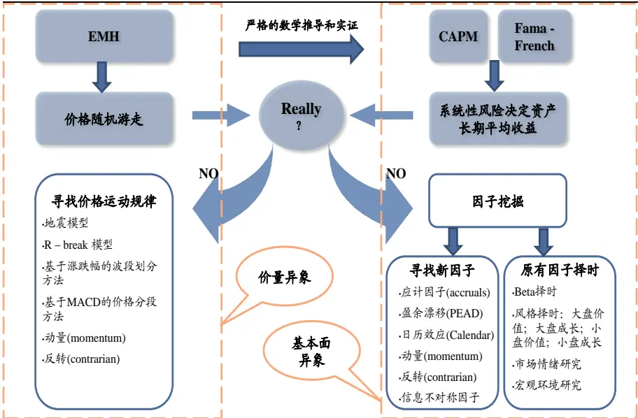
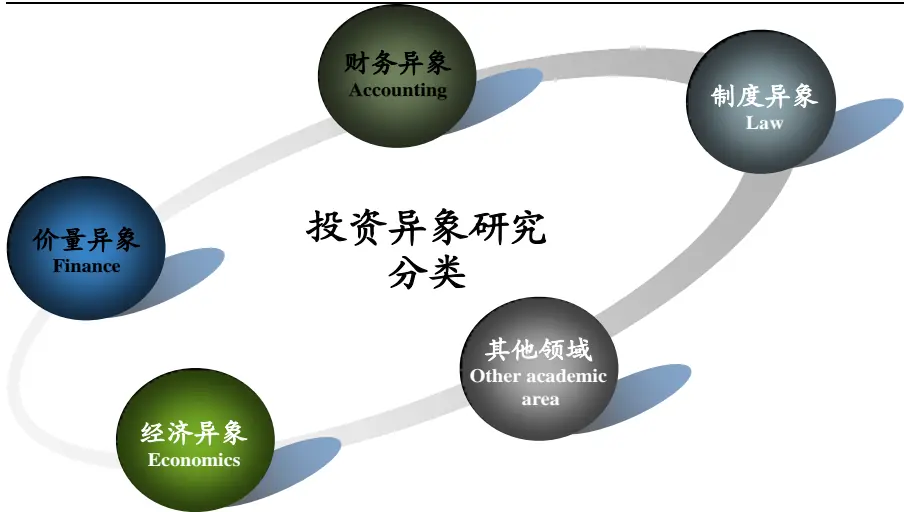
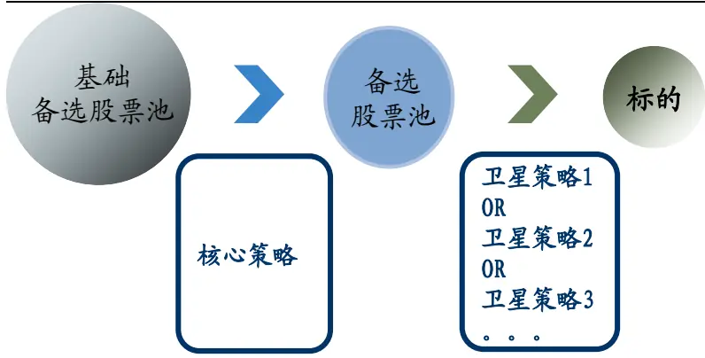
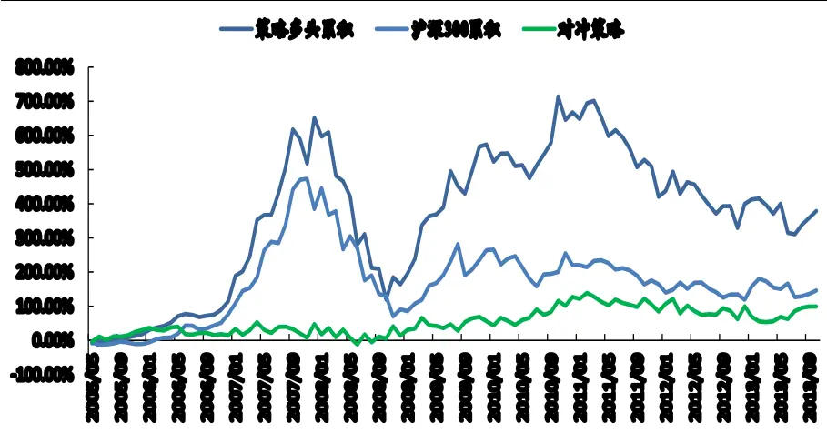
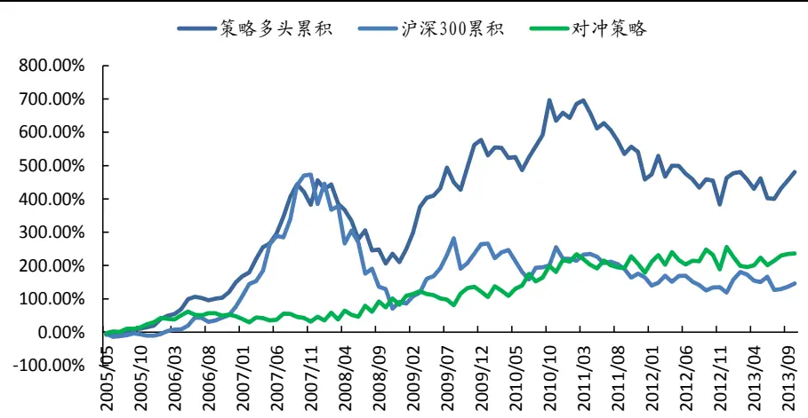

2013.12.25

# 多维视角，深挖投资异象

## ——数量化专题之三十一

刘富兵（分析师）

刘正捷（研究助理）

8 021-38676673

liufubing008481@gtjas.com

021-38675860

赵延鸿（研究助理）

证书编号 S0880511010017

liuzhengjie012509@gtjas.com

021-38674927

S0880112080087

zhaoyanhong@gtjas.com

S0880113070047

## 本报告导读：

我们对异象投资策略进行了梳理和归类，认为财务异象与价量异象策略各具优劣、互为补充。同时在策略分层思维下对应计异象与超跌选股策略进行合成，取得较好效果。摘要：

le_Summary] 投资异象（anomaly）是指通过某种投资策略，能够在市场上获得长期、稳定超额收益率的现象，而该现象无法用有效市场理论所解释。在对有效市场理论的怀疑之上，我们可以沿着价格是否随机波动的路线找寻价量投资异象；在对CAPM 和三因素模型的怀疑之上，我们可以沿着是否存在系统性风险外的其他因素影响资产收益的思路寻找基本面投资异象。

财务异象策略与价量异象策略各具优劣，可以互为补充。价量研究与基本面研究没有高低之分，只是沿着不同途径寻找超额收益而已。财务异象策略具有投资逻辑，且信息兼具深度和广度；但信息更新速度慢，单策略收益较低。价量策略数据量巨大，并能实时更新，但缺乏投资逻辑。财务异象策略与价量异象策略可以相互补充。

- 尝试合成异象选股策略，取得较好效果。我们尝试在“风险- 回报”框架思路下，通过策略分类，分层选股的方式来代替传统打分选股体系。实战中，以“应计异象”策略为核心，以“超跌选股”为卫星策略进行策略合成。相较于原“应计异象”但策略，合成后策略的收益小幅上升，而波动率、最大回撤以及夏普率等风险指标均提升明显。

未来继续深挖财务异象策略与价量异象策略。对于财务异象，可以分别从寻找策略本质、改变数据比较维度以及精选备选股票池 3个方向着手深化；对于价量异象，在价格波段划分方法的基础上，可以通过加入历史波动标准差、引入成交量变化率等方式进行改进。

金融工程

## 金融工程团队：

刘富兵：（分析师）

电话：021-38676673

邮箱：liufubing008481@gtjas.com

证书编号：S0880511010017

何苗：（分析师）

电话：010-59312710

邮箱：hemiao@gtjas.com

证书编号：S0880511010049

## 严佳炜：（分析师）

电话：021-38674812

邮箱：yanjiawei008776@gtjas.com

证书编号：S0880512110001

## 耿帅军：（分析师）

电话：010-59312753

邮箱：gengshuaijun@gtjas.com

证书编号：S0880513080013

## 徐康：（分析师）

电话：021-38674939

邮箱：xukang010849@gtjas.com

证书编号：S0880513080018

## 赵延鸿：（研究助理）

电话：021-38674927

邮箱：zhaoyanhong@gtjas.com

证书编号：S0880113070047

## 陈睿：（研究助理）

电话：021-38675861

邮箱：chenrui012896@gtjas.com

证书编号：S0880112120012

## 刘正捷：（研究助理）

电话：021-38675860

邮箱：liuzhengjie012509@gtjas.com

证书编号：S0880112080087

## [Table_R相关报告

《基于 MACD 价格分段应用举例》2013.12.19《发现价格走势规律之基于 MACD 分段研究》2013.12.09

《2013 年 12 月沪深 300 指数成分股调整预测》2013.11.05

《再构大盘均线强弱指数》2013.11.04

《我们能打败最好的行业吗》2013.10.03

## 1. EMH、CAPM：投资异象基石

投资异象（anomaly）是指通过某种投资策略，能够在市场上获得长期、稳定超额收益率的现象，而该现象无法用有效市场理论所解释。对投资异象的研究，可以从有效市场理论（EMH）和资本资产定价模型（CAPM）两条线出发。

## 1.1.在对 EMH 的怀疑之上，寻找价格运动规律

有效市场理论是现代金融学的基石，在其理论下，股价服从随机游走模型，想通过寻找股价规律而进行择时是无法获得超额收益的。在对该理论的怀疑之上，我们可以观察市场价格，从股票价格到底是否随机游走的角度发掘超额收益。

## 1.2.在对 CAPM 的怀疑之上，寻找新因子

学者们在有效市场理论基础上通过严格的数学推理得到了 CAPM 模型，并经过对市场的长期观察最终得到 Fama – French 三因素模型，认为市场收益、B/M和 Size是决定金融资产长期收益的三个因素。在对三因素模型的怀疑之上，我们可以沿着“究竟哪些基本面因子能帮助我们找到超额收益”的思路观察市场，一方面，可以不断搜寻新因子，例如通过应计异象、盈余漂移等异象去寻找背后的有效因子；另一方面，在已有因子上不断进行合成和择时。

图 1：分别沿着 EMH与 CAPM 两条线寻找投资异象

资料来源：国泰君安证券研究

## 1.3.价量异象研究与基本面异象研究并行，无优劣之分

有效市场理论将市场分为弱有效、半强有效和强有效三种。弱有效市场之下，技术分析（即对价量规律的研究）无法获得超额收益；半强有效下，技术分析与基本面分析均无法获得超额收益。从这种分类方法来看，似乎基本面分析要高出技术分析一筹。

我们认为价量研究与基本面研究没有高低之分，只是沿着不同途径寻找超额收益而已。如果说投资者是在草原上的狼，超额收益是羊，那么可以将价量分析与基本面分析比作是狼的爪牙和速度。到底是锋利的爪牙更重要，还是奔跑的速度更重要？我想答案应该是这两者无法比较，都很重要。

A股市场经过 20年的发展，技术分析与基本面分析方法都在不断发展。15 年前，通过简单的实地调研比较就可以轻松找到获得超额利润的机会，如今随着市场有效性的提升，仅仅对基本面进行粗浅的分析已远远不够；同时，价量分析也在飞速发展，一些复杂的数学、物理模型被纷纷引入，再加上高频交易手段的应用，价量分析依然可以找到可观的超额收益。

## 2. 财务异象投资策略 VS 价量异象投资策略

总结海外 1970 年以来的研究成果，可以将投资异象归为五大类：价量异象、财务异象、经济异象、制度异象以及其他异象。对价量异象和财务异象的研究一直是学者们和投资者所关注的重点。

图 2：五类投资异象研究中，财务异象与价量异象更受关注

资料来源：国泰君安证券研究

## 2.1.财务异象投资策略：具有逻辑优势，寻找长期胜出者

## 2.1.1. 优势：具备投资逻辑，信息广度大

- 具有金融投资逻辑。财务分析是基本面分析的核心组成部分，财务异象投资策略以基本面分析为核心思想，辅以统计工具，从基于个股财务研究的 fundamental analyst 到基于大样本研究的 quantmentalanalyst。这就使得策略在设计阶段就具备了一定的投资逻辑，更易于被投资者所接受。

- 信息广度大，可挖掘度高。上市公司财务报告定期披露，内容丰富（半年报、年报多达一两百页）。除大量的财务信息外，还有生产、销售、管理、人员变动信息，这些皆与股价走势息息相关，均可以被利用到模型之中。

- 换手率低，交易成本低廉。财务信息不是每天都变动，因此依赖财务指标投资的换手率相较于利用价格、估值指标大幅降低，交易成本非常低。

## 2.1.2. 问题：信息更新频率低，单策略稳定性不够

- 信息更新频率低。上市公司定期报告一年只发布三次，其余时间都处于财务报告相对真空期（有的行业会有一些粗略的月度数据）。如果在真空期依然使用财务数据，则策略很可能会因为其他非财务信息的冲击而发生大幅波动。

- 单策略超额收益较低，夏普比率较低。美国学者对欧美市场从 1970年到 2010年间 40年在学术期刊发表的约 330个投资异象（以财务异象为主）进行统计，并对其长期收益率进行了排序。我们发现异象的平均收益排序和夏普比率排序完全不一致，且异象投资策略的夏普比率普遍偏低，主要集中在 0.5 附近。这表明相对于其收益，财务异象投资策略的波动性较大，要想用在实际投资中还需进一步处理。

表 1：财务异象投资策略普遍存在回报-风险比较低的问题
Panel E: Equally-weighted market returns over the same RPS intervals (all types of RPS)

| Min. | Mean | Std. dev. | Sharpe |
| --- | --- | --- | --- |
|  | -5.0% | 10.7% | -0.29 |
| 25th percentile | 8.5% | 18.3% | 0.44 |
| Median | 9.3% | 19.3% | 0.49 |
| Mean | 9.5% | 19.1% | 0.50 |
| 75th percentile | 11.2% | 19.9% | 0.59 |
| Max. | 24.8% | 30.3% | 1.37 |
| Std. dev. | 2.6% | 1.8% | 0.15 |
| Skewness | -0.4 | -0.3 | 0.5 |
| Number of RPS | 333 | 333 | 333 |

资料来源：<The Supraview of Return Predictive Signals>, REVIEW OF ACCOUNTING STUDIES, FORTHCOMING

## 2.1.3. 解决方案：事件投资或策略合成

- 采用事件驱动投资方法。对于如盈余漂移(PEAD)和日历效应(Calendar)等异象而言，本身是基于某一时点而观察到的现象，因此自然在策略上以事件套利策略为主。这样就避免了策略大幅波动的问题。

- 与其他策略合成。部分会计异象的超额收益在年内的分布较为平均，不太适合于事件投资策略，但单独使用波动太大，因此需要进行策略合成。例如应计异象(accruals)，未见策略收益在报告期后有明显下降，做成事件驱动策略收益损失较大。

## 2.2.价量异象投资策略：海量数据，寻找短期规律

## 2.2.1. 优势：数据量大，从股价到股价

V数据量巨大，实时更新。价量异象的研究对象主要是价格序列、成交量序列以及从这些序列衍生出来的一系列波动率指标、换手率指标和技术指标。这些信息从逐笔数据到秒级、分钟级、小时级、日级、月级乃至年级别数据应有尽有，可供投资者随意挖掘。

避免在基本面与股价间建立映射关系。基本面分析的核心在于建立从基本面到股价的映射关系，即 P = f(fundamental)，f在本质上反映了投资者对基本面信息的解读过程。然而人与人的解读方式不同，并且每个人的解读方式随着时间和心境也在不断改变，所谓千人心不可得。因此从量化角度而言，要想在基本面和股价之间建立稳固的函数关系是比较困难的，价量异象研究则避免了这个问题。

## 2.2.2. 问题：缺乏投资逻辑

- 无基本面因素支撑。虽然从基本面到价格的过程非常复杂，但必须承认价格运动的基础源于基本面信息的变化。价量异象研究价量研究只关心价格规律以及未来走势，不关心其形成的原因，因此当策略出现较大回撤时，投资者很难找出原委，从而影响到对策略的信心。

- 易受外部事件冲击影响。由于价量异象研究的模型纯粹依赖于统计模型以及其假设，因此当出现假设之外事件冲击时，数据序列可能会发生结构性改变，从而使得策略遭到损失。

## 3. 在策略分类体系之上进行策略合成

## 3.1.在风险 - 回报框架思路下，对策略进行分类

任何一个量化策略都可归类到以下四类，分别是：

- 风险缩减器（Risk Reducer）：降低组合风险

- 核心多样化配臵器（Core Diversifiers）：组合核心策略

- 回报提升器（Return Enhancers）：提升组合回报

- 风险分散器（Risk Diversifiers）：降低组合与市场的相关性

表 2：根据风险收益特征，可将策略归于四大类

| 策略类别 | 策略特征 | 在投资组合中地位 |
| --- | --- | --- |
| 风险缩减器 | 1、低标准差、回报相对较低;2、与股票市场、利率市场相关性较低;3、高杠杆（20倍左右）导致较高损失风险。 | 牺牲一定的回报来显著降低组合波动 |
| 核心多样化配置器 | 1、稳定，不会有不恰当的超预期收益或过大损失；2、收益率近似对数正态分布。 | 组合基石 |
| 回报提升器 | 1、高回报潜力、高波动、下跌风险巨大;2、与股权市场高度相关;3、显著负偏态、尖峰厚尾。 | 在某些年份能夠显著拉升组合回报水平 |
| 风险分散器 | 1、回报低、高波动，夏普比率难看；2、相对股权市场具有反周期特征。 | 缓冲回报提升器策略造成的冲击波动 |

资料来源：《对冲基金表现评价》，维恩·Q.特兰(Vinh Q. Tran)

有了分类标准，我们就可以从不同维度对策略进行分类和比较，并根据投资的目标收益和风险容忍度采用不同的策略组合。

## 3.2.抛弃打分体系，建立主次分明的策略合成体系

当对多策略进行综合使用时，我们传统的做法是建立打分体系。然而，随着股票池内备选标的和策略数量的增加，传统打分体系往往无法选出我们想要的具有某些“个性”的股票，而是选出了较为中庸的股票。

表 3：打分体系，是选优？还是选庸去优？

|  | 策略A | 策略B | 总分 |
| --- | --- | --- | --- |
| 股1 | 100 | 10 | 110 |
| 股2 | 10 | 100 | 110 |
| 股3 | 60 | 60 | 120 |

资料来源：国泰君安证券研究

我们设想是否可以摒弃打分体系，建立分层选股体系。在第一层面上，选择一到两个策略做为构成选股体系的核心策略，只有满足核心策略要求的股票才能进入备选股票池；在第二层面上，根据核心策略的不足，加入卫星策略，在卫星策略的帮助下弥补核心策略的不足，最后得到我们的投资标的。

图 3：围绕一到两个主策略，构建分层选股体系

资料来源：国泰君安证券研究

核心策略的选择取决于投资者对风险收益的要求，卫星策略起到弥补核心策略不足的作用：

- 对于风险偏好较高者，可以选择高回报、高波动策略作为核心策略，选择低风险、分散化策略作为卫星策略。

- 对于风险偏好较低者，则可调换两种策略的角色，使得合成后策略更加稳定。

## 4. 合成案例：“应计异象”与“超卖选股”

## 4.1.“应计异象”与“超卖选股”策略具有较高契合度

## 4.1.1. 应计异象策略：从盈余质量角度筛选出投资标的

在权责发生制的会计准则下，企业的盈利由应计盈利（accruals earnings）和现金盈利（cashearnings）构成，其中应计盈利较高的企业未来盈余会有系统性降低。投资者由于无法充分理解应计盈利和现金盈利对未来收益的预测能力的不同，从而高估应计盈利占比较高公司的价值，低估现金盈利占比较高公司的价值。

## 4.1.2. 超卖选股策略：获取安全垫

通过对拐点、顶点和底点的定义，可以按照一定的涨跌参数（如 10%、20%等）将价格划分成若干波段。以最近下跌波段为开始顶点，根据历史上每次下跌的幅度，判断当前股价处于下跌段某个区间（如下 1/2，下 1/4区域）的概率。

## 4.1.3. 两策略契合度较高

收益方面，应计异象相较于 HS300 指数，2005 年至今策略多头的年化超额收益能稳定在8%之上；以半年为一个持有期，持有期胜率接近80%。超卖选股策略在三个样本内窗口测试期，策略的持有期超额收益分别为24.2%，2.4%和 8.3%。策略适用于市场下跌阶段，在个股普涨的阶段，难以选出标的。

波动方面，应计异象策略波动率高于 HS300 加权指数，导致策略信息比率较低。以月为单位，最大跑输基准幅度接近 10%，尤其在指数下跌阶段，策略显著跑输基准，回撤较大。超卖选股策略本质上属于反转策略，在熊市中选取跌幅较深的股票能有效降低策略回撤和波动，并在市场反转后获取超额收益。

两种策略的契合度较高。“应计异象”属于财务异象策略，能选出在中长期跑赢市场的个股，但无法避免中短期波动。而“超卖选股”属于价量异象策略，能够选出短期内具有一定爆发性的个股，同时在熊市中起到识别下跌风险的作用。

## 4.2.两策略合成，效果较佳

## 4.2.1. 以“应计异象”为核心策略，加入“超卖选股”策略

1. 在 HS300股票池中，根据应计异象策略选股方法，考虑市值大小后，选出盈利利润占比/现金流利润占比排名前 30 只的股票作为备选股票池。

2. 利用“超卖选股”策略，根据 30 只股票的历史股价数据，计算目前其股价所在位臵处于下跌波段中下 50%区间的概率。注意：

- 波段划分参数取 10%；

当市场处于牛市的时候，可能所有备选股票均处于上涨波段中，这时不存在股价处于下跌波段某一区间的问题，此时概率取 0；

为了防止因股票上市时间太短，历史数据没有统计意义的问题，我们在波段划分中设臵了 10 的阀值。也就是说只有当历史下跌波段大于等于 10 段时，才参考其概率，否则作为 0 处理。

3. 得到每只股票的概率后，从高到低排列，取前 15 只股票做多。当30 只股票中概率值大于 0 的股票不足 15 只时，将剩余股票按照应计分数的排名依次补足。

4. 根据应计分数得到的备选股票池每年 4 月底和 10 月底分别调整一次，根据“超卖选股”计算出的概率，策略每月底换仓一次。

5. 成本方面，策略多头考虑每月 0.3%的交易成本，对冲组合（策略多头 + HS300期指）中额外加入 0.2%的成本。

## 4.2.2. 合成后效果相较于合成前有大幅改进

策略经过合成后在两方面有明显改进：

（1）策略收益有所提升。多头策略收益率小幅上升；对冲策略收益率大幅上升。同时直观上，策略在牛市中收益相较于合成前有所下降，但在熊市中表现远远好于合成前。

（2）策略波动率大幅下降。无论是年化波动率、最大跑输基准、最大回撤，还是胜率、夏普比率，均较合成前有较大提升。

表 4：合成后，策略在收益、风险方面均有较大提升

| 合成前 | 策略多头 | 对冲策略 | 合成后 |  | 策略多头 对冲策略 |
| --- | --- | --- | --- | --- | --- |
| 年化收益率 | 20.24% | 8.44% | 年化收益率 | 23.00% | 15.50% |
| 年化波动率 | 42.42% | 38.55% | 年化波动率 | 30.62% | 27.31% |
| 最大跑输基 | -29.37% |  | 最大跑输基 | -14.94% |  |
| 最大回撤 | 68.70% | 37.14% | 最大回撤 | 39.32% | 12.01% |
| 月胜率 | 63% | 54% | 月胜率 | 61% | 57% |
| 持有期胜率 | 53% | 77% | 持有期胜率 | 59% | 82% |
| 夏普比率 | 0.48 | 0.22 | 夏普比率 | 0.75 | 0.57 |

资料来源：Wind，国泰君安证券研究

图 4：单纯使用“应计异象”策略，策略波动很大，甚至超过 HS300

资料来源：Wind，国泰君安证券研究

图 5：合成后，策略波动大幅降低

资料来源：Wind，国泰君安证券研究

## 5. 异象研究未来发展

## 5.1.对于财务异象策略研究，深挖会计科目，精细化股票池

（1）深挖策略本质思想。“应计异象”表面上是因为应计利润的可持续性低于现金流利润，实质是由于在盈余管理上应计利润更容易被掌控和操纵，因此应计利润不稳定。我们可以沿着这个思路精细化寻找应计会计科目。

（2）改变比较维度。在以“应计异象”为代表的财务异象投资策略中，我们都是从横截面数据寻找投资标的。实际上，我们还可以从个股时间序列、或者面板数据的变化中寻找投资标的。

（3）精选备选股票池。不同行业存在不同的行业特征，从而使得其财务数据具有完全不同的特征。如果能根据行业特征对行业进行大致划分，并在不同的行业中选取不同的会计科目作为“应计利润”的代理变量，那么策略效果应该会更好。

## 5.2.对于价量异象，继续丰富价量信息

（1）增强历史股价数据的可靠性。在案例中，是我们以在历史波段中设臵阀值的方法增强历史数据可靠性。此外，我们也可以引入波动率：当一只股票历史涨跌幅波动率较高时，表明该波动率的可信度较低，不具有参考意义，反之则可以较为放心的使用。

（2）加入交易量和换手率指标。有人说“价是虚的，量是实的”，不管谁虚谁实，“价”、“量”相互依存、互为因果。在“超卖选股”策略中，如果在观测到股价的同时也关注成交量的变化，则可以降低策略风险。

（3）建立起价量异象与基本面之间的桥梁。以动量效应为例，为什么一些股票的动量较大而一些股票的动量较低？如果将动量理解为市场反应不足所致，那么从信息角度看，信息不对称程度越高，理论上动量效应应该越大。如果我们找到一些信息不对称的代理变量，就可能建立起动量背后的深层次逻辑。

## 本公司具有中国证监会核准的证券投资咨询业务资格

## 分析师声明

作者具有中国证券业协会授予的证券投资咨询执业资格或相当的专业胜任能力，保证报告所采用的数据均来自合规渠道，分析逻辑基于作者的职业理解，本报告清晰准确地反映了作者的研究观点，力求独立、客观和公正，结论不受任何第三方的授意或影响，特此声明。

## 免责声明

本报告仅供国泰君安证券股份有限公司（以下简称“本公司”）的客户使用。本公司不会因接收人收到本报告而视其为本公司的当然客户。本报告仅在相关法律许可的情况下发放，并仅为提供信息而发放，概不构成任何广告。

本报告的信息来源于已公开的资料，本公司对该等信息的准确性、完整性或可靠性不作任何保证。本报告所载的资料、意见及推测仅反映本公司于发布本报告当日的判断，本报告所指的证券或投资标的的价格、价值及投资收入可升可跌。过往表现不应作为日后的表现依据。在不同时期，本公司可发出与本报告所载资料、意见及推测不一致的报告。本公司不保证本报告所含信息保持在最新状态。同时，本公司对本报告所含信息可在不发出通知的情形下做出修改，投资者应当自行关注相应的更新或修改。

本报告中所指的投资及服务可能不适合个别客户，不构成客户私人咨询建议。在任何情况下，本报告中的信息或所表述的意见均不构成对任何人的投资建议。在任何情况下，本公司、本公司员工或者关联机构不承诺投资者一定获利，不与投资者分享投资收益，也不对任何人因使用本报告中的任何内容所引致的任何损失负任何责任。投资者务必注意，其据此做出的任何投资决策与本公司、本公司员工或者关联机构无关。

本公司利用信息隔离墙控制内部一个或多个领域、部门或关联机构之间的信息流动。因此，投资者应注意，在法律许可的情况下，本公司及其所属关联机构可能会持有报告中提到的公司所发行的证券或期权并进行证券或期权交易，也可能为这些公司提供或者争取提供投资银行、财务顾问或者金融产品等相关服务。在法律许可的情况下，本公司的员工可能担任本报告所提到的公司的董事。

市场有风险，投资需谨慎。投资者不应将本报告为作出投资决策的惟一参考因素，亦不应认为本报告可以取代自己的判断。在决定投资前，如有需要，投资者务必向专业人士咨询并谨慎决策。

本报告版权仅为本公司所有，未经书面许可，任何机构和个人不得以任何形式翻版、复制、发表或引用。如征得本公司同意进行引用、刊发的，需在允许的范围内使用，并注明出处为“国泰君安证券研究”，且不得对本报告进行任何有悖原意的引用、删节和修改。

若本公司以外的其他机构（以下简称“该机构”）发送本报告，则由该机构独自为此发送行为负责。通过此途径获得本报告的投资者应自行联系该机构以要求获悉更详细信息或进而交易本报告中提及的证券。本报告不构成本公司向该机构之客户提供的投资建议，本公司、本公司员工或者关联机构亦不为该机构之客户因使用本报告或报告所载内容引起的任何损失承担任何责任。

## 评级说明

## 1.投资建议的比较标准

投资评级分为股票评级和行业评级。

以报告发布后的12个月内的市场表现为比较标准，报告发布日后的12个月内的公司股价（或行业指数）的涨跌幅相对同期的沪深300指数涨跌幅为基准。

## 2.投资建议的评级标准

报告发布日后的 12 个月内的公司股价（或行业指数）的涨跌幅相对同期的沪深300指数的涨跌幅。

| 评级 |  | 说明 |
| --- | --- | --- |
| 股票投资评级 | 增持 | 相对沪深 300指数涨幅15%以上 |
|  | 谨慎增持 | 相对沪深300指数涨幅介于5%～15%之间 |
|  | 中性 | 相对沪深300指数涨幅介于-5%～5% |
|  | 减持 | 相对沪深300指数下跌5%以上 |
| 行业投资评级 | 增持 | 明显强于沪深 300 指数 |
|  | 中性 | 基本与沪深300指数持平 |
|  | 减持 | 明显弱于沪深 300指数 |

## 国泰君安证券研究

|  | 上海 | 深圳 | 北京 |
| --- | --- | --- | --- |
| 地址 | 上海市浦东新区银城中路168号上海 银行大厦29层 | 深圳市福田区益田路 6009 号新世界 商务中心34层 | 北京市西城区金融大街 28 号盈泰中 心2号楼10层 |
| 邮编 | 200120 | 518026 | 100140 |
| 电话 | （021)38676666 | (0755)23976888 | (010)59312799 |
|  | E-mail: gtjaresearch@gtjas.com |  |  |