2013.12.31

# 市场微观结构之 A 股走势回顾与展望

## ——数量化专题之三十二

刘富兵（分析师）

赵延鸿（研究助理）

8 021-38676673

021-38674927

liufubing008481@gtjas.com

zhaoyanhong@gtjas.com

证书编号 S0880511010017

S0880113070047

## 本报告导读：

市场微观结构分析角度包括了缺口出现频率、拐点数、价格速率、市场历年募集资金、A 股成交额、大盘均线强弱指数和价格形态强弱系数七个方面。

## 摘要：

le_Summary] 上证综指的中级别缺口出现频率从 2008 年以来逐年下滑，目前稳定在 20至30之间，显示投资者对政策面、基本面和海外市场超预期变化反应程度趋于稳定。2012 年和 2013 年上证综指的拐点数回落到 2001 年到 2006 年水平，这也是 A股的另一种新常态。2013年上证综指价格速率 130%，较2012年趋于活跃，但和 2000年至2006 年比较，属于平均水平，意味着站在指数角度，股市做波段操作的话，理论最大收益率较2007至2011年继续下降。

截止 2013年12月底，上证综指均线强弱指数最小值为 34，仍未达到理论最小值 23，预示大盘尚未见底。未来一个月到两个月，大盘均线强弱指数会再次触及到理论最小值 23。从大盘均线强弱指数历年波动区间来判断，2014年上证综指有一波至少 15%以上的上涨行情。

- 基于二级行业价格形态强弱系数的底部特征观察显示,上证综指在 2013年6月27日的点位（收盘价 1950，行业形态系数之和仅为-3.6）很难成为一个中级别以上的底部，换言之，在大盘向上突破 2340之前，要先跌破 1950。

市场已经形成的微观结构不是一朝一夕所能改变的。过去 10年，A 股经历了 2005 年开始的股权分臵改革、2008 年的全球金融危机和四万亿刺激政策的推出、2010年开始的欧债危机及 2012年中国经济的下滑，A 股震荡下行处于弱势结构。A 股的弱势格局决定了从一个弱势结构进入牛市，也必定是缓慢的，那种暴涨行情都不会是 A 股反转的开始。由此不难看出，2014 年A股无论是不是牛市的起点年份（我们目前判断这种可能性很小），A 股走势都是震荡或震荡偏下行的形态，不太可能出现单边上扬的走势。

金融工程

## 金融工程团队：

刘富兵：（分析师）

电话：021-38676673

邮箱：liufubing008481@gtjas.com

证书编号：S0880511010017

何苗：（分析师）

电话：010-59312710

邮箱：hemiao@gtjas.com

证书编号：S0880511010049

## 严佳炜：（分析师）

电话：021-38674812

邮箱：yanjiawei008776@gtjas.com

证书编号：S0880512110001

## 耿帅军：（分析师）

电话：010-59312753

邮箱：gengshuaijun@gtjas.com

证书编号：S0880513080013

## 徐康：（分析师）

电话：021-38674939邮箱：xukang010849@gtjas.com证书编号：S0880513080018

## 赵延鸿：（研究助理）

电话：021-38674927邮箱：zhaoyanhong@gtjas.com证书编号：S0880113070047

## 陈睿：（研究助理）

电话：021-38675861

邮箱：chenrui012896@gtjas.com

证书编号：S0880112120012

## 刘正捷：（研究助理）

电话：021-38675860

邮箱：liuzhengjie012509@gtjas.com

证书编号：S0880112080087

## [Table_R相关报告

《多维视角，深挖投资异象》2013.12.25

《基于 MACD 价格分段应用举例》2013.12.19《发现价格走势规律之基于 MACD 分段研究》2013.12.09

《2013 年 12 月沪深 300 指数成分股调整预测》2013.11.05

《再构大盘均线强弱指数》2013.11.04

## 1. A 股走势回顾与展望综述

2013 年接近尾声，2014 年已在眼前。从基本面判断，2014 年经济仍然具有很大的不确定性，但同时热点不断，自贸区、国资改革、国防装备、信息传媒等等。海外市场风云再起，美国逐步削减 QE 规模，同时经济逐步复苏，失业率下降，ECRI经济领先指标上行，也伴随着 2013年全球大宗商品价格的全线下滑。诸多因素在 2014 年交织在一起，A 股何去何从？从基本面上任何一个人都很难对未来做出清晰确定性的判断，因此单纯从基本面来预测股市充满了不确定性。本篇报告，我们从市场微观结构角度分析了 A股的走势特征，观察了投资者的交易规律和市场运行的一些内在规律。希望从这个角度对 A 股 2014 年的走势给出一些有益的观察和预测。

市场微观结构分析角度包括了缺口出现频率、拐点数、价格速率、市场历年募集资金、A股成交额、大盘均线强弱指数和价格形态强弱系数七个方面。①上证综指的中级别缺口出现频率从 2008 年以来逐年下滑，目前稳定在 20至 30之间，显示投资者对政策面、基本面和海外市场超预期变化的反应程度趋于稳定。②拐点数代表了价格波段数，波段越多市场震荡越剧烈，波段操作的机会就越多。2012年 1月至 2013年 12月两年时间内，上证综指出现了 15 个拐点。过去两年上证综指的拐点数回落到 2001 年到 2006 年水平，这也是 A 股的另一种新常态。③2013年上证综指价格速率 130%，较 2012 年趋于活跃，但和 2000 年至 2006年比较，属于平均水平，意味着站在指数角度，股市做波段操作的话，理论最大收益率较 2007至 2011年继续下降。④最新数据统计显示，2013年定向增发配股总共从 A 股募集资金 3802 亿，较 2012 年同比下滑15.2%，这个量已经较 2011年大幅减少。⑤截至 2013年 12月，A股全年成交额 46 万亿，同比上涨 47%，结束了连续三年成交额同比下滑的颓势。从大盘走势来看，上证综指 2013年下跌 7%，但创业板指数上涨83%，所以 2013年成交额同比大幅上涨一方面得益于结构性行情，另一方面区间震荡行情为主，没有出现单边下跌走势。⑥截止 2013年 12月底，上证综指大盘均线强弱指数最小值为 34，仍未达到理论最小值 23，预示大盘尚未见底。未来一个月到两个月，大盘均线强弱指数会再次触及到理论最小值 23。从大盘均线强弱指数历年波动区间来判断，2014年上证综指有一波至少 15%以上的上涨行情。⑦过去 12 年的历史数据显示：上证综指中级别以上的底部拐点（“V型底”，左侧跌幅超过 16.7%，右侧上涨幅度超过 20%）对应的 84 个二级行业价格形态强弱系数都小于-60（只有一个例外出现在 2009 年 8 月 29 日）。由此推断，上证综指在 2013年 6月 27日的点位（收盘价 1950，行业形态系数之和仅为-3.6）很难成为一个中级别以上的底部，换言之，在大盘向上突破 2340之前，要先跌破 1950。

市场已经形成的微观结构不是一朝一夕所能改变的。过去 10 年，A 股经历了 2005 年开始的股权分臵改革、2008 年的全球金融危机和四万亿刺激政策的推出、2010 年开始的欧债危机及 2012 年中国经济的下滑，A股震荡下行处于弱势结构。A股的弱势格局决定了从一个弱势结构进入牛市，也必定是缓慢的，那种暴涨行情都不会是 A股反转的开始。由此不难看出，2014 年 A 股无论是不是牛市的起点年份（我们目前判断这种可能性很小），A 股走势都是震荡或震荡偏下行的形态，不太可能出现单边上扬的走势。

## 2. 波动性之缺口频率统计：2013 年缺口频率继续和

## 2012 年持平

股市是有波动性的，量化波动性常用的指标有历史波动率和隐含波动率，历史波动率包括简单的收益率标准差和复杂的 GARCH波动率，隐含波动率则需要基于期权交易价格反推算出结果。这两类波动率在资产风险管理和衍生品领域应用广泛。

但市场的波动性并非那么简单，上述两类波动率对市场的交易信息刻画并不充分。衡量波动性的指标还包括缺口出现频率及力度、拐点数和价格速率。

股价在快速涨跌中会出现一段价格没有任何交易，显示在价格走势图上是一个空白区域，这个区域称之为“缺口”，通常又称为跳空。但比较常用的缺口定义是在 K 线图上表现为相邻两条 K 线高低价位之间的部分。

报告中我们把缺口定义为当日开盘价与前一交易日收盘价之间的跳空区间，缺口的产生原因很多，但主要原因有两个：一是隔夜欧美股市大涨或者大跌；二是国内政策面或基本面出现了超预期的变化。不管是哪种原因，都是投资者对市场未来走势带有强烈倾向性的反映。缺口的分类、缺口的回补率、缺口大小的含义都是技术分析中比较有意思的课题，之前我们报告中有相关研究。这里我们主要基于缺口的出现的频率来分析市场的活跃度或者波动性。

缺口的出现频率是市场波动性的一个重要观察角度。从上证综指历年的缺口统计来看，2007年、2008年和 2009年是过去11年缺口出现最集中的三年，从高开或低开幅度 0.5%以上的缺口（中级别缺口）分布来看，2008 年出现140个，接近 2001年到 2006 年同级别缺口总和的 2倍；这一点和 A 股历年的波动率水平变化基本一致，2008 年全球金融危机爆发，上证综指波动率创十年新高，年均值达到 44.3%，缺口数也是最多的年份。市场波动剧烈时，缺口频频出现，市场波动平缓，则很少看到缺口。2013 年中级别缺口出现 26 个，和 2012 年持平，与 2008 年相比已大幅下滑，市场的波动性趋缓。而大级别缺口（高开或低开幅度 1%以上的缺口）仅出现 5个，回到了 2000年到 2006年的水平。缺口力度和出现频率也反映了市场的活跃度。A股要想重振雄风，应该不是一个一蹴而就的过程，这也意味着 2014 年市场仍然不会太活跃。除了基本面变化不会太快之外，与市场的存量资金不足也有很大关系。

图 1 上证综指历年出现缺口统计（高开或低开 0.5%以上的缺口）
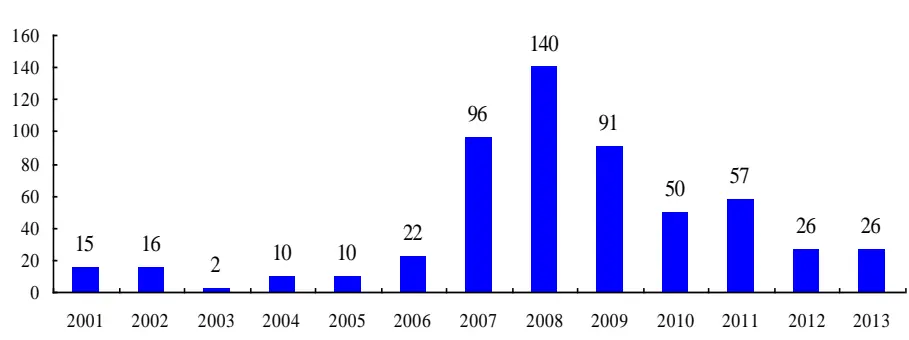
数据来源：国泰君安证券研究，WIND

图 2 上证综指历年出现缺口统计（高开或低开 1%以上的缺口）
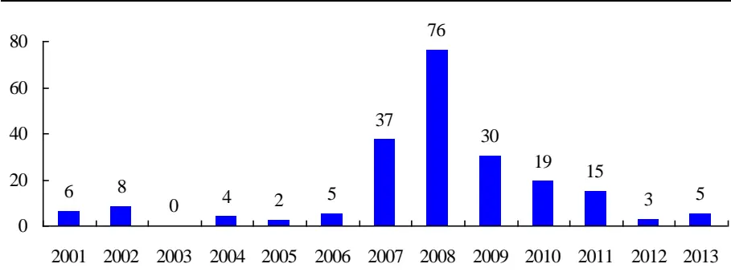
数据来源：国泰君安证券研究，WIND

同样我们对美国标普 500指数高开或低开 0.5%以上的缺口分析显示，美股比 A股的缺口出现相对较少，特别是 2001年至 2006年，每年都只有三个缺口。只有在 2008年、2009 年和 2010年缺口出现频率大幅提高。从 2011 年开始又恢复常态。

图 3 标普 500指数历年出现缺口统计（高开或低开 0.5%以上的缺口）
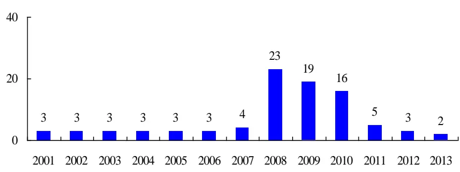
数据来源：国泰君安证券研究，WIND

总而言之，A 股的波动性已经回归“常态”，而市场的波动性从强到弱或者从弱到强都是一个渐进的过程， A 股的波动性再度走强有两种可能：一是股市连续暴跌，面对 A股当前的估值水平，这种可能性排除；二是 A股的赚钱效应显现，场外资金涌入推高股市，这种情况即使出现也是需要时间积累，所以 A股 2014年仍将处于低波动性区间。

## 3. 波动性之拐点数：上证综指拐点数回归常态

拐点即价格走势图上的顶点和低点，拐点是有级别的，级别是由拐点两侧的涨跌幅度来确定，如何定量地刻画拐点请参阅之前的报告《波段的程序划分应用》。一旦拐点的级别给定，相同时间窗口拐点的数量变化提供观察市场波动的一个新维度。同样时间窗口，拐点多的市场波动性剧烈，容易反转，一味做多或做空都会面临过山车行情；拐点少的市场波动性平缓，出现的波段较少。

我们以两年行情滚动的话，用 5%的涨幅参数对上证指数的价格序列进行分段，2012 年 1 月至 2013 年 12 月两年时间内，上证综指出现了 15个拐点，而 2007年 1月至 2018年 12月两年内，出现 47个拐点。不难看出过去两年上证综指的拐点数回落到 2001年到 2006年水平，这也是A股的另一种新常态。

图 4 上证综指拐点变化（2000 年 1月-2013 年 12月）
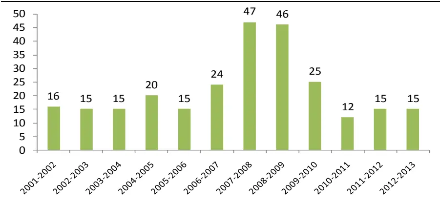
数据来源：国泰君安证券研究，WIND

图 5 上证综指走势分段图（以 5%作为涨幅输入参数）
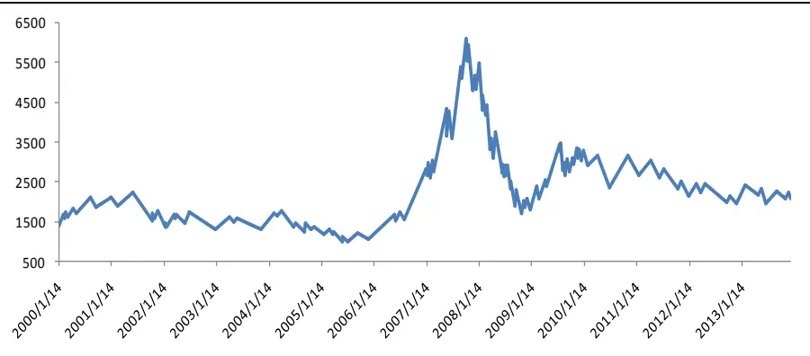
数据来源：国泰君安证券研究，WIND

## 4. 波动性之价格速率：上证综指波动性较 2012 年活跃度有所提升

无论是历史波动率还是隐含波动率，虽然能够度量市场波动风险，但对于资产价格的路径、区间涨跌幅的规律却无任何揭示，投资者做个股或者行业配臵时不仅关注日度收益率的风险波动，更关注交易过程中资产价格波段的涨跌幅度，以及相关统计规律。价格速率的定义是基于拐点算法，计算区间内拐点之间涨跌幅的速率，从而能够提供更有意义的交易信息（具体定义请参见附录）。

同样我们选取一个涨幅参数 3%，对上证综指价格序列分段，3%作为分段参数的意义为：一个涨跌波段涨跌幅至少在 3%以上才算一个波段，忽略掉所有不到 3%涨跌幅的扰动。按此分段计算，2013 年上证综指经过的路径长度年化为 130%，较 2012 年趋于活跃，但和 2000 年至 2006年比较，属于平均水平，意味着站在指数角度，股市做波段操作的话，理论最大收益率不高。另一方面，如果比较历史波动率，2008年的波动率约为 2013年的 2倍，但从价格速率角度来看，2008 年价格速率 450%，是 2013年的 3.5倍，更好反映了 2008年价格走势的复杂性。

图 6 上证综指价格速率（以 3%分段计算）
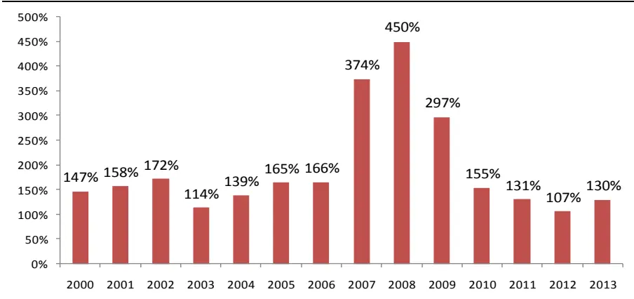
数据来源：国泰君安证券研究，WIND

## 5. 市场募集资金统计：同比减少 15.2%

2013 年新股停发，截至 2013年底，大盘继续着疲弱的走势，在 2013年之前，投资者把这种行情归因为市场被不断抽血的结果。最新数据统计显示，2013 年定向增发配股总共从 A 股募集资金 3802 亿，较 2012 年同比下滑 15.2%，这个量已经较 2011 年大幅减少。2011 年市场实际募集资金 6815亿元，与 2010年比较，同比减少 29%，但募集资金水平仍居过去十年前三，仅次于 2010年和 2007 年。2011年 IPO发行家数 279家，平均每个交易日发行 1家以上。从以上数据可以看出，A股的实际抽血在减少，但 A股目前的存量资金也不容乐观，据中国证券投资者保护基金公司发布的数据，扣除机构投资者资金量，截至 12 月末 A 股账户存量资金只有 6000亿左右，而 A股市值高达 24万亿，可见靠目前存量资金大幅推高股市实属不易。

图 7 市场历年实际募集资金（单位：亿元，截至 2013年 12月）
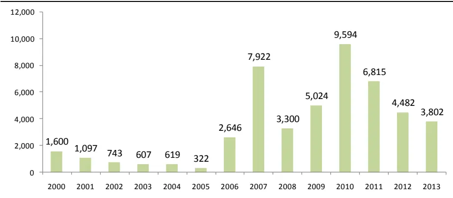
数据来源：国泰君安证券研究，WIND

## 6. A 股成交额变化：同比上涨 47%

截至 2013 年 12 月，A 股全年成交额 46 万亿，同比上涨 47%，结束了连续三年成交额同比下滑的颓势。从大盘走势来看，上证综指 2013 年下跌 7%，但创业板指数上涨 83%，所以 2013年成交额同比大幅上涨一方面得益于结构性行情，另一方面区间震荡行情为主，没有出现单边下跌走势。

A 股 2009 年的大幅反弹行情，全年成交额达到了 54 万亿，之后 2010年的大“V”型走势，成交额创历年最高纪录 55 亿，而 2011 年成交额仅 42 万亿，同比下滑 23%。如果 2014年继续震荡行情的话，成交额估计仍会保持在 40 万亿级水平，但如果走出单边下跌行情或单边下跌行情持续时间较长，成交额就不容乐观，可能回到 30万亿级别。

图 8A股历年成交金额（单位：万亿， 截至 2013 年 12月）
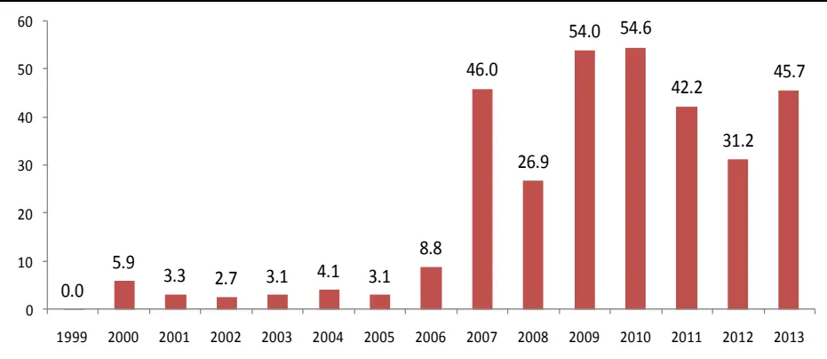
数据来源：国泰君安证券研究，WIND

## 7. 大盘均线强弱指数预示大盘仍将寻底

2013 年大盘均线强弱指数对上证综指的五个顶部全部抓到，这个指标继续成功对顶部发出了拐点信号，五个顶部对应的大盘均线强弱指数都在190 至 201 之间。这个指标过去三年对顶部判断准确的逻辑在于，上证综指从价格结构上处于一个周线级别的下跌走势中，所以任何上涨都是某个级别的反弹行情，由此决定了顶部都会被类似的指标压制。等大盘见了历史大底，这个指标就需要反过来使用，用来判断阶段性底部。当前走势，如果大盘均线强弱指数跌至最低值 23，对大盘底部判断还需要依据其形态，寻找背离信号。

图 9 上证综指 2013 年五个顶部对应大盘均线强弱指数取值
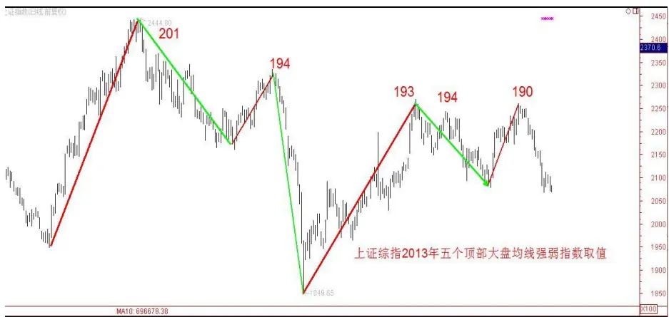
数据来源：国泰君安证券研究，WIND

截止 2013年 12月底，上证综指均线强弱指数最小值为 34，仍未达到理论最小值 23，预示大盘尚未见底。未来一个月到两个月，大盘均线强弱指数会再次触及到理论最小值 23。从大盘均线强弱指数历年最大值情况来看，至少都在 180之上，说明了上证综指历年的波动区间都比较大。从这个角度可以判断2014年上证综指有一波至少15%以上的上涨行情，及一波 10%左右幅度的反弹，完全出现单边下跌行情的可能性很小。

图 10 大盘均线强弱指数年度最大值（截至 2013 年 12月 30）
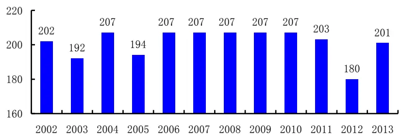
数据来源：国泰君安证券研究

图 11 大盘均线强弱指数年度最小值（截至 2013 年 12月 30）
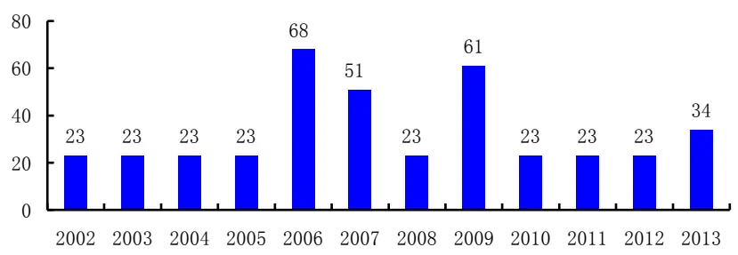
数据来源：国泰君安证券研究

## 8. 行业价格形态系数之和：预示大盘会跌破 1950

基于价格短期均线到长期均线的排列顺序，可以定量地判断当前价格走势形态。8 根均线的排列顺序有 40320 种可能（如果不考虑均线交叉的情形）。最极端的情况有两种：一是短周期均线从高到低依次排列至长周期均线，表示价格走势最强；二是长周期均线从高到低依次排列至短周期均线，表示价格最弱，其他都属于中间状态，但中间状态也存在强弱之分。衡量此类排序的最恰当的量化指标为 Spearman 等级相关系数，即把均线的自上而下的排列顺序映射到一个[-1,1]的区间中，我们把这个指标称为“价格形态强弱系数”。

大盘走势可以用申万 84 个二级行业的形态来刻画，任何交易日，每个二级行业都有一个价格形态强弱系数，介于负 1到 1之间，表示了当前这个行业的走势形态。如果市场极度低迷，每一个二级行业的价格形态强弱系数都是-1，那么累计求和就是-84；如果市场处于大牛市，每一个二级行业的价格形态系数为 1，累计求和为 84。

过去 12 年的历史数据显示：上证综指中级别以上的底部拐点（“V型底”，左侧跌幅超过 16.7%，右侧上涨幅度超过 20%）对应的 84个二级行业价格形态强弱系数之和都小于-60（只有一个例外出现在 2009 年 8 月 29日）。但行业价格形态系数之和小于-60未必预示是一个 20%以上级别上涨行情的出现。

图 12 上证综指中级别以上的底部拐点（2001-2013）
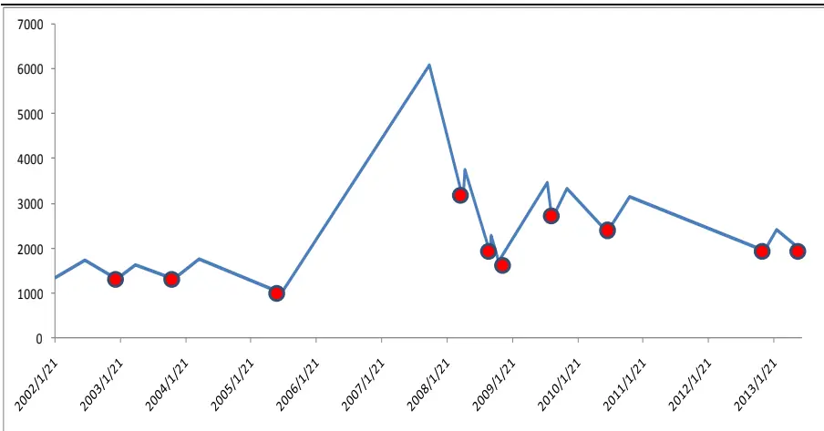
数据来源：国泰君安证券研究，WIND

由此推断，上证综指 2013年 6月 27日的位臵（收盘价 1950）很难成为一个中级别以上的底部，换言之，在大盘向上突破 2340 之前，要先跌破 1950。

表 1上证综指中级别以上的拐点与行业形态系数之和比较

| 日期 | 上证综指 | 行业形态系数之和 |
| --- | --- | --- |
| 2002/1/22 | 1358.7 | -75.5 |
| 2003/1/3 | 1319.9 | -72.4 |
| 2003/11/18 | 1316.6 | -63.5 |
| 2005/7/9 | 1011.5 | -65.5 |

| 2008/4/18 3094.7 -69.8 |
| --- |
| 2008/9/18 1895.8 -83.7 |
| 2008/11/4 1706.7 -83.8 |
| 2009/8/29 2667.7 37.5 |
| 2010/7/3 2363.9 -63.4 |
| 2012/11/31 1959.8 -77.6 |
| 2013/6/27 1950.0 -3.6 |

数据来源：国泰君安证券研究，WIND

图 13 中级别以上拐点之行业形态系数之和
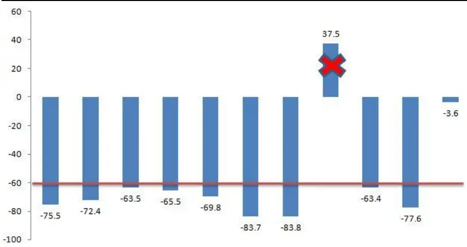
数据来源：国泰君安证券研究

## 9. 附录

## 9.1. 缺口定义

常见的缺口定义为：股价在快速大幅变动中有一段价格没有任何交易，显示在股价趋势图上是一个真空区域，这个区域称之“缺口”，通常又称为跳空。在 K线图上表现为相邻两条 K线高低价位之间的空白。当股价出现缺口，经过几天，甚至更长时间的变动，然后反转过来，回到原来缺口的价位时，称为缺口的封闭，又称补空。从日 K线图看，缺口是当一种股票某天最低成交价格比前一天的的最高价格还要高，或是某天的最高成交价格比前一天的最低成交价格还要低。在报告中，我们把缺口定义为当日开盘价与前一日收盘价之间的跳空区间，这样缺口的产生往往是昨日收盘后，隔夜欧美股市的大涨或者大跌、国内政策面、经济数据方面出现了超预期的变化引发股市直接高开或低开造成的。

缺口又分为突破缺口、中继缺口、衰竭缺口等，这些分类由于定义比较模糊，在报告中暂不作讨论。技术操作者认为，任何缺口必须封闭，措辞稍为缓和的则认为，假使一个缺口在三天内不封闭，则将在三星期内封闭，另有些人则认为，三天内若不封闭缺口，则此缺口绝对有意义，短期内将不会"补空"。这些讨论在之前报告中都可以用数据来加以论证。

图 14 缺口定义
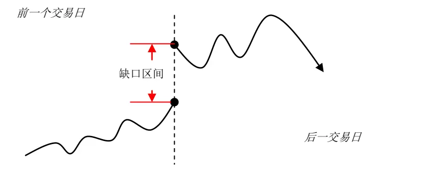
数据来源：国泰君安证券研究，WIND

图 15 缺口回补定义
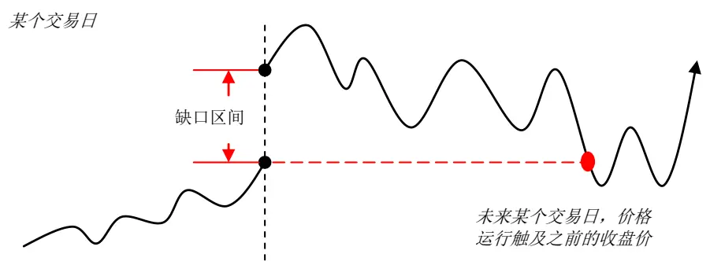
数据来源：国泰君安证券研究，WIND

## 9.2.价格速率定义（拐点之间波段涨跌幅绝对值求和）

定义价格速率第一步对给定的价格序列进行波段划分，即寻找一系列相邻的顶点和底点，两拐点之间的波段收益率为计算的对象。假定我们用10%作为涨幅输入参数，即下跌趋势波段中任何反弹不超过 10%，上涨趋势波段中任何回调不超过 9.09%，得到如下图拐点，相邻拐点之间的涨跌幅依次为：-12%、15%、-14%、20%、-16%和 13%。我们可以定义价格速率（年化）为：

$$
\frac{(12\%+15\%+14\%+20\%+16\%+13\%)}{N}\times252
$$

其中 N为区间交易日数。

显而易见，此波动率的计算用区间内波段涨跌速率取代了日度收益率的标准差。其有两个显著优点：

其一，通过拐点的识别，找出投资者感兴趣的波段（比如机构投资者对一个上升浪中 5%的回调并不在意，或者对下跌浪中 5%的反弹也无参与兴趣），仅关注拐点之间波段的涨跌速率，提供了更有价值的交易信息；

其二，如果两个价格序列在同一区间内涨幅相近，则可知价格速率大的序列走过的路径要长得多，而且区间内波段震荡更剧烈。同时根据价格速率可知其日均收益率增速。此计算摒除了市场小的扰动。

图 16 拐点之间波段涨跌幅
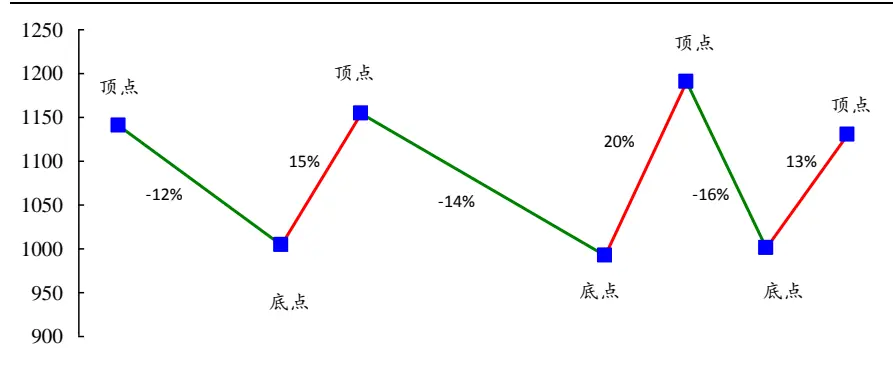
数据来源：国泰君安证券研究，WIND

## 9.3.大盘均线强弱指数定义

大盘均线强弱指数是根据八均线系统（8，13，21，34，55，89，144，233）对申万 23个一级行业走势分类的综合得分结果，大盘均线强弱指数的理论区间范围为[23,207]。具体定义：给定某个时间周期的收盘价序列，当收盘价站在所有均线之上时，就记为 9分，每当价格掉下一根均线，分数就相应减 1分。当价格落在所有均线之下时，就只有 1分。需要强调的是，首先我们不考虑这 8 根均线的排列顺序，只观察价格在 8根均线中所处的位臵；其次，为了防止两条均线重合的情况发生，我们会在8根均线上加入一个微小的随机扰动项，这样就将重合的均线分开。

图 17 价格每掉落一根均线，分数就减掉 1分
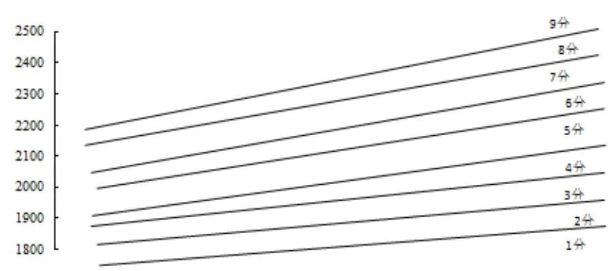
数据来源：国泰君安证券研究

为什么要选取 23 个行业打分后加总？虽然大盘均线强弱指数的预测标的是大盘指数，但我们并没有直接对大盘指数进行打分，而是对能够完备覆盖大盘指数的申万 23个一级行业打分、加总，再来观察大盘走势，这样就有了更多信息。通过对众多市场走势的观察，不难发现一个简单的规律：大盘指数的涨跌都是通过行业轮动完成的。大盘上涨的初期阶段，一些行业会率先启动，之后转为其他行业，到大盘到达顶部之时，基本上所有行业都处于强势，这个规律恰好可以用行业打分加总变化来刻画。由于每个行业最高 9 分，最低 1 分，因此加总后，理论最高 207分，最低 23分。每天收盘后，根据 23个行业的得分，我们就可以算出当天的强弱指数，并画出指数的历史走势。

如何正确使用大盘均线强弱指数？首先，任何指标都不能单一而绝对地发出买入卖出信号，大盘均线强弱指数也是如此。大盘均线强弱指数属于反转指标的范畴，换言之，强弱指数指示价格涨跌的压力与支撑位臵。凡是这类指标的使用，都离不开对价格走势形态结构的分析，但把握形态结构绝非易事，因此在正确分解结构形态结构之前，对大盘强弱指数的使用需具备一定的灵活性。比如过去三年，大盘均线强弱指数峰值为203，而且在 190 上方都预示大盘反弹顶部。但是理论上，到达 190 上方不能排除大盘还会继续上涨从而形成一波更大的上涨行情。确实，这种情况从理论上是不能排除的。但我们观察上证综指历史上的大的上涨行情，大盘均线强弱指数必定会到 207，也就是 23个申万一级行业的价格全部站在自身的8条均线之上。但到达207未必能预示未来有大行情，但如果连 207都到不了，判断牛市则为时尚早。总的来讲，大盘均线强弱指数作为反转指标，有效地使用离不开对价格形态结构的分析，退而求其次，牛市的形成的必要条件是强弱指数至少要触及一次 207。

## 本公司具有中国证监会核准的证券投资咨询业务资格

## 分析师声明

作者具有中国证券业协会授予的证券投资咨询执业资格或相当的专业胜任能力，保证报告所采用的数据均来自合规渠道，分析逻辑基于作者的职业理解，本报告清晰准确地反映了作者的研究观点，力求独立、客观和公正，结论不受任何第三方的授意或影响，特此声明。

## 免责声明

本报告仅供国泰君安证券股份有限公司（以下简称“本公司”）的客户使用。本公司不会因接收人收到本报告而视其为本公司的当然客户。本报告仅在相关法律许可的情况下发放，并仅为提供信息而发放，概不构成任何广告。

本报告的信息来源于已公开的资料，本公司对该等信息的准确性、完整性或可靠性不作任何保证。本报告所载的资料、意见及推测仅反映本公司于发布本报告当日的判断，本报告所指的证券或投资标的的价格、价值及投资收入可升可跌。过往表现不应作为日后的表现依据。在不同时期，本公司可发出与本报告所载资料、意见及推测不一致的报告。本公司不保证本报告所含信息保持在最新状态。同时，本公司对本报告所含信息可在不发出通知的情形下做出修改，投资者应当自行关注相应的更新或修改。

本报告中所指的投资及服务可能不适合个别客户，不构成客户私人咨询建议。在任何情况下，本报告中的信息或所表述的意见均不构成对任何人的投资建议。在任何情况下，本公司、本公司员工或者关联机构不承诺投资者一定获利，不与投资者分享投资收益，也不对任何人因使用本报告中的任何内容所引致的任何损失负任何责任。投资者务必注意，其据此做出的任何投资决策与本公司、本公司员工或者关联机构无关。

本公司利用信息隔离墙控制内部一个或多个领域、部门或关联机构之间的信息流动。因此，投资者应注意，在法律许可的情况下，本公司及其所属关联机构可能会持有报告中提到的公司所发行的证券或期权并进行证券或期权交易，也可能为这些公司提供或者争取提供投资银行、财务顾问或者金融产品等相关服务。在法律许可的情况下，本公司的员工可能担任本报告所提到的公司的董事。

市场有风险，投资需谨慎。投资者不应将本报告为作出投资决策的惟一参考因素，亦不应认为本报告可以取代自己的判断。在决定投资前，如有需要，投资者务必向专业人士咨询并谨慎决策。

本报告版权仅为本公司所有，未经书面许可，任何机构和个人不得以任何形式翻版、复制、发表或引用。如征得本公司同意进行引用、刊发的，需在允许的范围内使用，并注明出处为“国泰君安证券研究”，且不得对本报告进行任何有悖原意的引用、删节和修改。

若本公司以外的其他机构（以下简称“该机构”）发送本报告，则由该机构独自为此发送行为负责。通过此途径获得本报告的投资者应自行联系该机构以要求获悉更详细信息或进而交易本报告中提及的证券。本报告不构成本公司向该机构之客户提供的投资建议，本公司、本公司员工或者关联机构亦不为该机构之客户因使用本报告或报告所载内容引起的任何损失承担任何责任。

## 评级说明

## 1.投资建议的比较标准

投资评级分为股票评级和行业评级。

以报告发布后的12个月内的市场表现为比较标准，报告发布日后的12个月内的公司股价（或行业指数）的涨跌幅相对同期的沪深300指数涨跌幅为基准。

## 2.投资建议的评级标准

报告发布日后的 12 个月内的公司股价（或行业指数）的涨跌幅相对同期的沪深300指数的涨跌幅。

| 评级 |  | 说明 |
| --- | --- | --- |
| 股票投资评级 | 增持 | 相对沪深 300指数涨幅15%以上 |
|  | 谨慎增持 | 相对沪深300指数涨幅介于5%～15%之间 |
|  | 中性 | 相对沪深300指数涨幅介于-5%～5% |
|  | 减持 | 相对沪深300指数下跌5%以上 |
| 行业投资评级 | 增持 | 明显强于沪深 300指数 |
|  | 中性 | 基本与沪深300指数持平 |
|  | 减持 | 明显弱于沪深300指数 |

## 国泰君安证券研究

|  | 上海 | 深圳 | 北京 |
| --- | --- | --- | --- |
| 地址 | 上海市浦东新区银城中路168号上海 银行大厦29层 | 深圳市福田区益田路 6009 号新世界 商务中心34层 | 北京市西城区金融大街 28 号盈泰中 心2号楼10层 |
| 邮编 | 200120 | 518026 | 100140 |
| 电话 | (021)38676666 | (0755)23976888 | (010)59312799 |
|  | E-mail: gtjaresearch@gtjas.com |  |  |