2014.02.14

# 关于择时思考之一:由连续到离散

## ——数量化专题之三十四

刘富兵（分析师）

赵延鸿（研究助理）

8 021-38676673

021-38674927

liufubing008481@gtjas.com

证书编号 S0880511010017

zhaoyanhong@gtjas.com

S0880113070047

## 本报告导读：

如何科学严谨地表述择时观点？择时为什么很难？由波段涨跌幅的连续变量转变为不同周期对应段数的离散变量，可以大幅降低择时难度。

## 摘要：

le_Summary] 择时为什么很难？择时最精确的操作是买在波段底部拐点而卖在波段顶部拐点，退而求其次的操作则是在底部拐点和顶部拐点附近区域买卖。然而研究发现，无论是基于涨跌幅分段还是基于 MACD 分段，价格波段的涨跌幅度都是一个连续的随机变量，随机变量方差较大稳定性差，在实际操作上很难根据波段已走出的涨跌幅度把握拐点。

提出三种科学严谨的择时表述方式，包括基于时间窗口的择时表述、基于拐点点位的择时表述和基于指标的择时表述。择时表述严谨的意义在于：第一、择时观点非常清晰，具有很强的可操作性，容易检验；第二、择时观点表述严谨科学，离不开深入研究价格走势的结构。特别是基于指标的择时表述研究，使我们把波段择时从连续随机变量转变为离散随机变量，对择时研究是一个很好的推进。

上证综指日线级别的一段上涨行情，在 30 分钟级别走势上出现的段数主要集中在 1、3、5、7段，占比79%。上证综指30分钟级别下跌波段对应5分钟级别波段数X的概率分布同样集中在 1 段、3 段、5 段和 7 段，其中 3 段的出现概率最高为 31%。而超过11段的概率仅 10%。

研究的重要意义在于由分析波段涨跌幅的连续变量转变为分析不同周期对应段数的离散变量，离散随机变量取值主要集中在 1、3、5、7，使得择时变得更具有可操作性。这个方法可以推广到任何时间序列，由此能够发现更多价格走势的内在规律。

金融工程

## 金融工程团队：

刘富兵：（分析师）

电话：021-38676673

邮箱：liufubing008481@gtjas.com

证书编号：S0880511010017

何苗：（分析师）

电话：010-59312710

邮箱：hemiao@gtjas.com

证书编号：S0880511010049

## 严佳炜：（分析师）

电话：021-38674812

邮箱：yanjiawei008776@gtjas.com

证书编号：S0880512110001

## 耿帅军：（分析师）

电话：010-59312753

邮箱：gengshuaijun@gtjas.com

证书编号：S0880513080013

## 徐康：（分析师）

电话：021-38674939

邮箱：xukang010849@gtjas.com

证书编号：S0880513080018

## 赵延鸿：（研究助理）

电话：021-38674927

邮箱：zhaoyanhong@gtjas.com

证书编号：S0880113070047

## 陈睿：（研究助理）

电话：021-38675861

邮箱：chenrui012896@gtjas.com

证书编号：S0880112120012

## 刘正捷：（研究助理）

电话：021-38675860

邮箱：liuzhengjie012509@gtjas.com

证书编号：S0880112080087

## [Table_R相关报告

《从微观数据中寻找 Alpha 的新来源》2014.02.13

《掘金国企改革》2014.02.12

《掘金国防安全》2014.01.21

《市场微观结构之 A 股走势回顾与展望》2013.12.31

《多维视角，深挖投资异象》2013.12.25

## 1. 关于择时的思考

几乎每个来到股票市场或者外汇市场做交易、做投资的人都不得不承认择时很难，不如去选股或者做 alpha 策略。择时很难这个结论是一个具有普遍性的实证结果，简而言之，就是基本上99％人发现准确预测市场走势不易，从而导致基于择时策略从市场上持续稳定的盈利变得非常困难。市场走势难以把握是一个结果，但具体来说择时到底难在什么地方？为什么择时会很难？这两个问题，研究探讨得很少。西方学院派则直接用随机运动来刻画价格走势，比如《华尔街随机漫步》等书都是持这种观点。那么择时到底难在什么地方？只有知道难在什么地方，才能够进一步针对具体问题去研究从而判断能否克服困难，如果这个难度超出了我们的认知范畴，譬如通过论证发现择时如抛硬币一样，那么我们研究的意义就会减弱。这篇报告我们基于价格分段理论来分析：择时为什么很难？以及从哪些角度进一步处理可以把择时的难度降低？众所周知，择时最精确的操作是买在波段底部拐点卖在波段顶部拐点，而降低要求的操作则是在底部拐点和顶部拐点附近区域买卖。然而，无论是基于涨跌幅分段还是基于 MACD 分段，波段的涨跌幅度都是一个连续的随机变量，随机变量方差较大稳定性差，在实际操作上很难根据波段已走出的涨跌幅度把握拐点；但是如果把不同时间周期的走势图都进行价格分段，不同级别波段的比例关系则为一个离散随机变量，大幅降低了择时的复杂度。

关于择时需要思考一个问题，择时有效的背后逻辑是什么？是交易数据的统计规律还是其他背后比较可靠的法则？一般而言，统计规律比较容易理解也容易被投资者所接受，这种规律必须相对稳定，但在股市中存在这种统计规律吗？特别是那种稳定性极高的规律，不依赖于时间不依赖于参数。一般而言，凡是从交易数据中得来的规律似乎没有特别可靠的。这种情况在市场中屡见不鲜，因此，退而求其次，从市场走势中寻找的不是一种规律，而是一个大概率的事件。譬如基于过去的数据，可以判断未来一周上涨的概率是 80%等诸如此类的预测。这种概率是否可靠也是一个值得商榷的问题。我们举一个例子来进一步分析这个问题。假定我们拿到一个硬币，连续抛掷 10 次，结果出现 9 次正面和一次反面，从统计意义上（最大似然法），这个硬币出现正面的概率应该是 90%，出现反面的概率只有 10%，基于这个统计信息，显然如果再抛一次硬币的话，大多数人会选择正面。但是从另一个角度来思考这个问题会得到相反的结论，如果我们相信这个硬币和其他硬币没有什么不同，都是正反面出现概率一样的硬币，根据大数定律，只要一直抛下去，正反面出现的次数是一样的，那么正确的选择是选择反面。我们面对的股市就好比面对的这样一个硬币，究竟是一个不规则的硬币呢还是一个规则的硬币？这是一个很难的回答的问题，这个问题留待以后进一步研究，在这个报告中不多做赘述。

投资者进入市场交易，不外乎持股、持币、买入、卖出四种状态，当投资者选择买入时，必定对价格未来上涨幅度或持续时间是有预期的，上涨幅度因投资者资金量、操作级别、操作频率不同而存在差异，从资金量角度，大的机构投资者对未来上涨幅度的预期一般要大于资金量中等规模的投资者，同样，资金量中等规模的投资者的上涨幅度预期大于小资金量的投资者。当然这也并非绝对的，因为投资者自身的交易习惯和模式决定了交易频率，有的资金量大的投资者也许对未来上涨行情没有很高的预期，但仍然会参与这些波段行情，而有的个人投资者资金量固然不大，买入后会选择长期持有，那么这样的个人投资者对未来行情的上涨幅度和持续时间的预期都会比较强。无论投资者选择哪一个操作级别，都绕不开价格波段的涨跌幅和持续时间两个变量。我们在分析价格波段的变量之前，先对如何科学严谨地表述择时观点做一下介绍。

## 2. 如何科学严谨地表述择时观点

择时，是对未来价格走势的预测，预测本身即是一个观点的表达，那么观点表达的科学性和严谨性就至关重要，否则说者朦胧，听者模糊。金融市场之外，不乏形形色色的预测，像玛雅人预测 2012 年 12 月 21 日是地球末日，这种预测既有时间又有具体事件，则属于严谨的表述；在赌场上，赌徒下注押大还是押小，虽然开牌精确时间点未定，但预测开牌大还是小则属于严谨表述。但在金融市场上，对择时的表述充满了模糊性。常见的模糊择时表述包括“市场本周迎来调整”、“大盘下周会有一波反弹”、“本轮下跌会跌至 2000 点左右”、“短期看空”等。更模糊的表述还有诸如“未来一个月市场走势不乐观”、“下周继续震荡”等。这些择时的表述都缺乏科学严谨性，比如当预测市场迎来调整，那么调整的幅度就是一个关键问题，如果不能把调整幅度在择时观点中讲清楚，这个择时预测基本上不具有可操作性，毕竟调整 10%算是调整，5%也算是调整，凡是出现下跌都算是调整。像“短期看空”的择时表述问题在于时间窗口非常模糊，短期、中期、长期的定义往往因人而异。

所以做择时模型根本上来讲不仅仅是发布择时观点，更重要的是模型的择时观点表述必须是科学严谨的，这样才具备可操作性，并且能够检验和衡量其准确性，衡量一个量化投资策略不能仅凭收益曲线，收益曲线是策略运用的结果同时必然融合了资金管理和风险控制，不可避免掩盖了模型本身的真实状况，因此一个好的择时模型必须自身具有可检验性，是对是错，一目了然。

基于以上分析，我们提出三种科学严谨的择时表述方式，包括基于时间窗口的择时表述、基于拐点点位的择时表述和基于指标的择时表述。这些研究的意义在于：第一、择时观点表述非常清晰，才具有很强的可操作性，自然也容易检验；第二、择时观点表述严谨科学，离不开深入研究价格走势的结构。特别是基于指标的择时表述研究，使我们把波段择时从连续随机变量转变为离散随机变量，对波段择时是一个很好的推进。

## 2.1.基于时间窗口的择时表述

金融市场中比较常见的是基于时间窗口择时，譬如预测未来一个交易日、或一周、或一个月乃至一个季度上涨还是下跌，金融工程领域像隐式马尔可夫链模型属于此类。也有更具体的是对一周、一个月涨跌幅度的预测，比如乐观者预期未来一个月大盘会上涨 10%，更乐观者预期大盘未来一个月上涨 20%。而全球证券投资研究机构每年的年度策略都会发布对未来一年的市场走势预测，常用的表述“震荡”、“牛市”、“熊市”、“结构性行情”等偏定性的表述，对投资有一定的提示意义但可操作性不强。

图 1 基于时间窗口的择时表述 （T= 日、周、月、季、年）
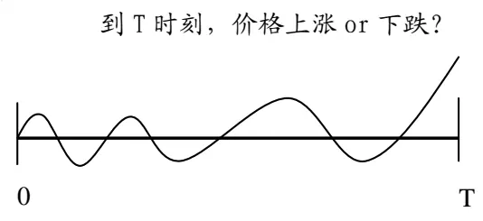
数据来源：国泰君安证券研究

上述择时的表述都是基于一个固定的时间窗口对未来走势的预测，类似的预测有其可取之处也有不可取之处。可取之处在于（1）表述清楚，时间窗口界定明确；（2）短的时间窗口对价格上涨或下跌的正确判断对数字期权的交易有很强的指示意义（请参阅《海外金融博彩产品与交易策略介绍》）；（3）大的时间窗口看多还是看空对大资金配臵有指导性，在这一点上有个默认的假设，譬如对未来一年看多，站在年度维度，看多显然不是涨 2%、5%这样的幅度，一般至少 10%以上，从这样的收益率角度来看，股市将大幅跑定期存款利率。不可取之处在于：可操作性不强，譬如一个月价格涨幅 5%，但一个月内波段结构也许很复杂，起伏震荡，期间跌幅可能在 7%以上，那么站在月度投资维度，投资者将承受较大的回撤。

## 2.2.基于拐点点位的择时表述

金融市场还有另外一种常见的择时表述“下跌或上涨至什么点位结束？”。我们以下跌行情为例做一下说明。当价格不断走低的时候，投资者普遍关心一个问题：跌到多少点位见底？表面看是一个问题，其实包含两个子问题，第一、跌至多少点位开始反弹？第二、怎么算是见底？

图 2 基于拐点点位的择时表述 （跌破前期低点与不跌破前期低点）
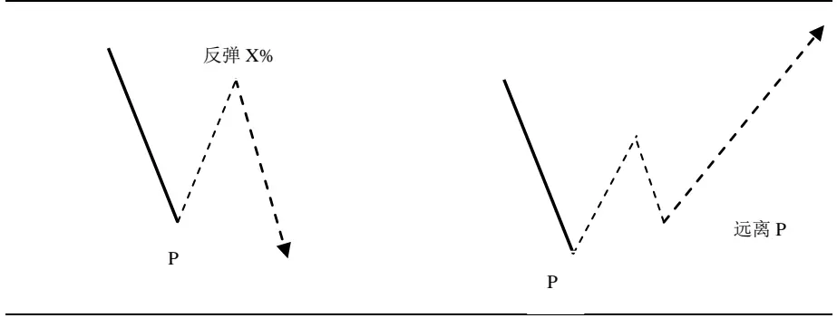
数据来源：国泰君安证券研究

上图第一种情况，反弹某个幅度之后，再次跌破前期低点 P；第二种情况，从 P反弹开始，回调没有跌破前期低点，之后继续走高，当下仍处于向上延伸趋势。毫无疑问，第二种情况，P 点无可争议的就是底部，任何模型如果在下跌行情中预测到 P点是底部都是得满分的。比较纠结的是第一种情况，反弹某个幅度之后再次跌破前期低点。我们分三种情况来讨论一下。

图 3 基于拐点点位的择时表述 （跌破前期低点情况）
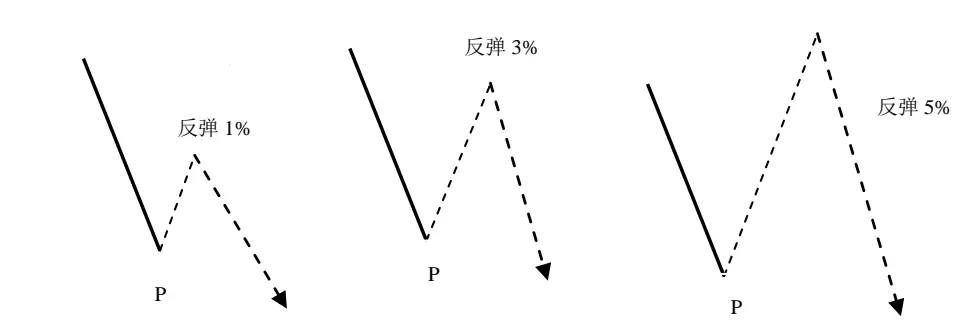
数据来源：国泰君安证券研究

假定有个模型能够预测到价格跌至 P 点会反弹，但第一种情况反弹 1%之后再次跌破前期低点；第二个反弹 3%之后再次跌破前期低点；第三个反弹5%之后再次跌破前期低点，那么哪一种情况算是模型预测正确？从上述来看，如果模型只是做出“跌至 P要反弹”这样的信号是不充分的，必须要指出这是一个什么样幅度的反弹。在实际交易中，一个反弹的幅度决定了是否值得参与。对股票交易者来讲，反弹 1%或者 3%也许都没有参与的价值，但对于股指期货都是非常值得参与的机会。

基于拐点点位的择时表述，本质上是基于涨跌幅波段划分来预测价格走势的拐点。详细信息请参阅报告《价格波段的划分与应用（汇总）》。

## 2.3.基于指标的择时表述

基于时间窗口的择时从时间角度来预测未来价格的涨跌，基于拐点点位择时从空间角度预测价格涨跌，二者各有优缺点。之前报告《基于 MACD的价格分段研究》中，则是结合了时间和空间两个维度对择时进行了更严格的表述。譬如，如果我们在一个下跌的行情中发出信号：大盘要迎来日线级别的上涨。这个描述含有三层意思：第一、我们是在日线图上看未来走势，不是周线图，也不是 30 分钟走势图；第二、大盘要从发信号的位臵开始反弹（也许会有小的误差）；第三、大盘上涨的过程中，在跌回起点之前，日线上的 MACD 的 DEA指标会从零轴下方穿越到零轴上方，并且上涨波段的顶点对应的 DEA指标必须在零轴之上。

在之前报告中我们给出了两种波段形成的情况分析。第一种情况：如下图，由 B点开始的上涨行情，MACD的 DEA指标从零轴下方向上延伸，在穿越零轴的时点，以 B为起始位臵的上涨行情到达 C点，创反弹以来的最高点，这种情形下，A 到 B 的下跌波段被破坏，即 A 到 B 的下跌行情终结在 B 点，AB 下跌波段完成，B 到 C 的上涨波段形成。也就意味着“在 B点发出当前级别上涨开始”的择时信号是正确的。

图 4波段当下形成：第一种情形
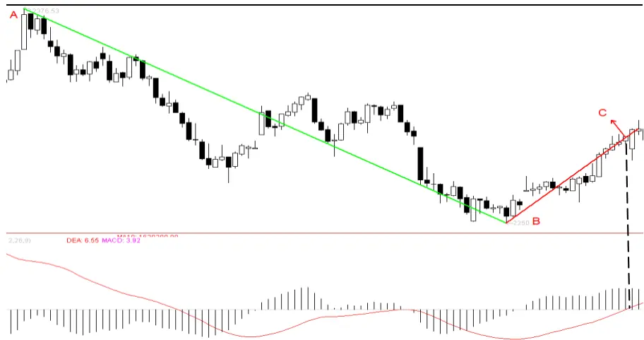
数据来源：国泰君安证券研究

第二种情形：如下图，由 B点开始的上涨行情，MACD的DEA指标从零轴下方向上延伸，穿越零轴的时点为 C点之后的第一根阴线，这个位臵已经不是以B为起始位臵的上涨行情以来的新高，而C点对应的DEA指标在零轴之下，因此 B 到 C 点的上涨波段尚未形成。从 C 点出现小的回调后，继续上涨在 D点创出反弹以来的新高，可以看到这时候 DEA指标仍在零轴之上。在这个时点，A到 B的下跌波段被破坏，即 A到 B的下跌行情宣告终结在 B 点，AB 下跌波段完成，B 到 D的上涨波段形成。这种情况，同样意味着“在 B点发出当前级别上涨开始”的择时信号是正确的。只要这两种情况最终都没有出现，价格再次跌破 B点，那么“在 B点发出当前级别上涨开始”的择时信号是错误的。

图 5波段当下形成：第二种情形
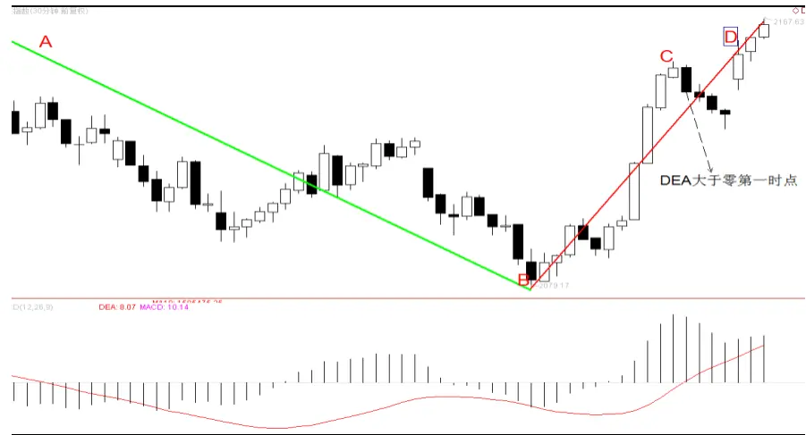
数据来源：国泰君安证券研究

## 3. 连续变量（涨跌幅择时）

综上分析可知，基于拐点点位的择时，科学严谨的表述不是“下跌行情跌至什么位臵开始反弹”，而是“下跌行情跌至什么位臵会有迎来至少u%的反弹”，这里 u%需要事先给定，要回答这个问题，显然需要研究“V底”的拐点特征，而且这个 V 型底右侧反弹至少 u%之上，并且这个 V型底的左侧也已经跌幅超过 d%，这里 u和 d满足等价关系。

$$
(1+u\%)(1-d\%)=1
$$

图 6上涨与下跌幅度等价关系
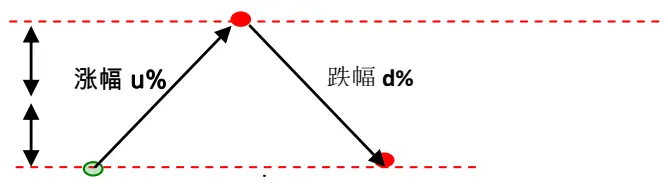
数据来源：国泰君安证券研究

我们以 5%为例对上证综指做一下分析，如果在下跌走势中试图捕捉 5%以上的反弹行情的底部拐点，需要把满足条件的底部拐点找出来加以分析，在交易中把握到这样的拐点，等价于成功预测“跌至什么位臵并从此位臵开始一个 5%以上的反弹”。下图是上证综指的以 5%为涨幅参数的分段图，图中所有的底部拐点即是满足条件的点位，意味着在下跌行情中预测到这个位臵，即是抓到一个 5%以上的反弹。

图 7 上证综指走势分段图（以 5%作为涨幅输入参数）
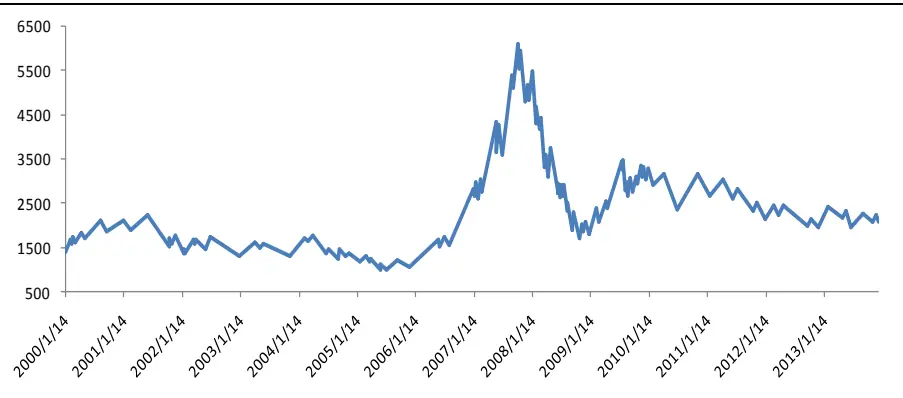
数据来源：国泰君安证券研究，WIND

如果要能够预测到这样的拐点，必要的信息是需要知道左侧下跌波段的跌幅，下跌波段跌幅大概到多少能够触发一个反弹，把下跌波段的跌幅记为 X的话，X是一个连续的随机变量（统计样本足够多的话）。

图 8 上证综指下跌波段跌幅统计（以 5%作为涨幅输入参数）
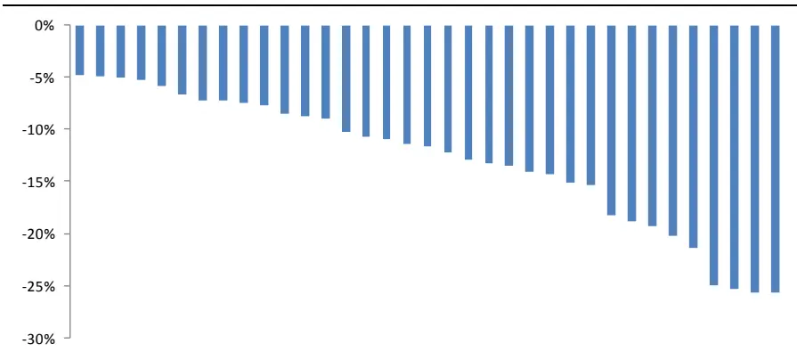
数据来源：国泰君安证券研究，WIND

上图可以看出，下跌波段的跌幅最小从 4.76%至 25%，而下图 X的概率分布，可以看出，跌幅密度最高的位臵在 10%附近，左侧随着跌幅增加，出现概率不断下降。

图 9 上证综指下跌波段跌幅概率分布（以 5%作为涨幅输入参数）
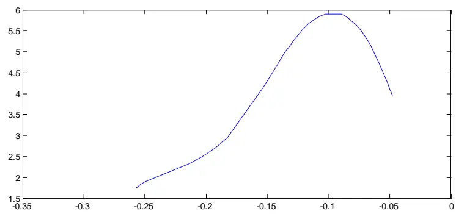
数据来源：国泰君安证券研究，WIND

我们随机选取一个行业有色金属做同样的价格涨跌幅分段，可以看到类似的现象，区别在于有色金属行业的跌幅幅度更深，因其波动性较大盘指数更高。

图 10 有色金属（申万一级行业）下跌波段跌幅统计
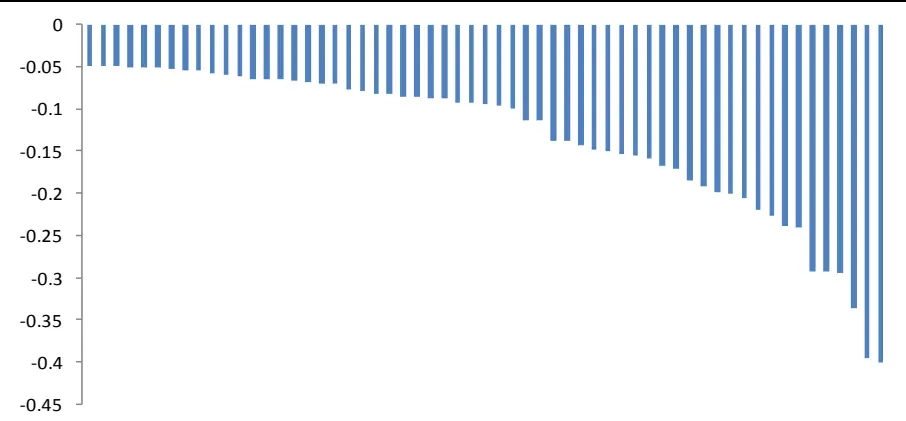
数据来源：国泰君安证券研究，WIND

图 11 有色金属（申万一级行业）下跌波段跌幅概率分布
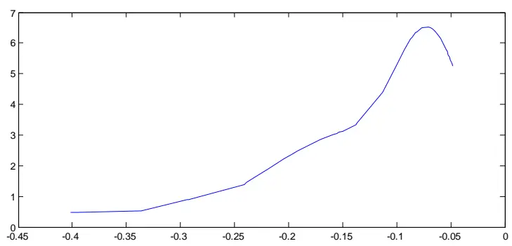
数据来源：国泰君安证券研究，WIND

超跌反弹或者超买回调择时策略，都离不开对波段涨跌幅度的信息输入，下跌波段的跌幅 X是一个连续的随机变量，从统计意义上，根据 X的跌幅来预测拐点难度很大，一方面原因是如果只参与 X的尾部情况，那么出现的机会是极少，大多数时间都等待；另一方面如果做概率密度集中区域的涨跌幅，从概率密度来看，概率也不显著，其次，跌幅是连续随机变量很难设定一个阈值。以上解释了基于涨跌幅择时的难度所在。为了解决上述问题，我们引进了基于指标分段，并且在不同周期走势图上分段，从而生成不同级别分段比例关系，把波段涨跌幅连续随机变量转化为段数比例的离散随机变量，择时的不确定性大幅降低。

## 4. 离散变量（基于指标分段择时表述）

基于 MACD 之 DEA指标的价格分段，把价格走势分解成上涨和下跌波段，一个日线级别下跌的结束意味着之后是一个日线级别的上涨，反之，一个日线级别上涨的结束意味着之后是一个日线级别的下跌。那么一个日线级别的下跌或者上涨波段的幅度是不是比基于涨跌幅分段在统计上更有规律？答案是否定的。

图 12 上证综指 30分钟级别上涨波段涨幅统计
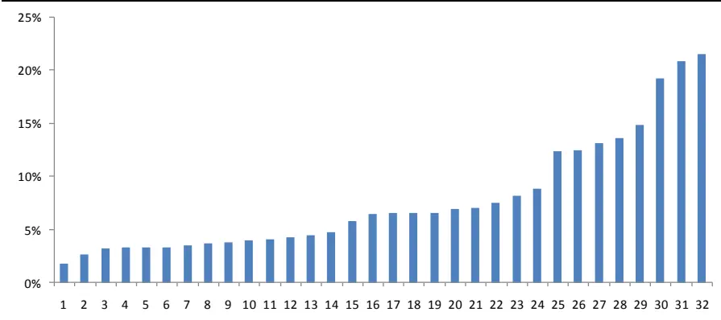
数据来源：国泰君安证券研究，WIND

图 13 上证综指 30分钟级别下跌波段涨幅统计
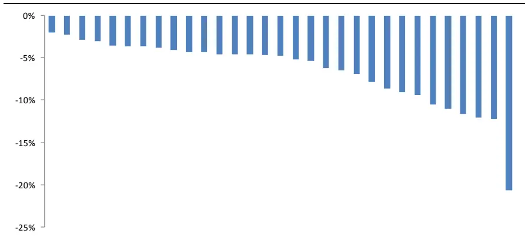
数据来源：国泰君安证券研究，WIND

以上两图是上证综指 30 分钟走势用 MACD 的 DEA 指标分段后，上涨与下跌波段的涨跌幅度统计，不难看出，无论是上涨波段的涨幅还是下跌波段的跌幅都是连续随机变量，样本越多，随机变量的连续性越强，所以基于涨跌幅同样可操作难度较大。

但是基于 MACD之 DEA指标可以对任何周期图进行分段，可以用上证综指的日度收盘价分段，也可以基于上证综指 30 分钟收盘价分段。那么日线图上的一段上涨或者下跌，放到 30 分钟图上观察，出现的段数就是比较有意义的变量。显然这个变量是离散的随机变量，其取值只能是奇数1、3、5、7．．．．．．。

图 14 上证综指日线级别的一段上涨对应 30 分钟级别段数出现次数统计
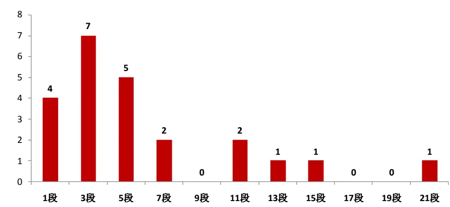
数据来源：国泰君安证券研究，WIND

上面这个直方图统计显示，上证综指日线级别的一段上涨行情，对应的30 分钟级别出现过 1 段、3 段、5 段、7 段、11 段、13 段、15 段和 21段，其中出现 1段情况有 4次，出现 3段的情况有 7次，出现 5段的情况有 5 次，出现 7段情况有 2次，出现 11 段有 2次，还有三个比较极端情况。不难看出日线一段上涨在 30 分钟级别走势上出现的段数主要集中在 1、3、5、7段，占比 79%。如果用概率统计来表述这个问题的话，把日线级别的一段上涨对应 30 分钟级别出现段数记为 X，那么 X 是一个离散随机变量，X=1，3，5，…。理论上 X 可以为任何奇数，但实际情况比较大的数字都很罕见，过去 13年上证综指 X最大值为 21，也就是说有且仅有一个日线级别的上涨波段，在30分钟走势图上出现21段，这个行情出现在 2006年 8月 7日至 2007年 10月16日。X作为离散随机变量，概率密度函数用图表表示如下：

图 15 上证综指日线级别上涨对应 30分钟级别段数 X 概率密度
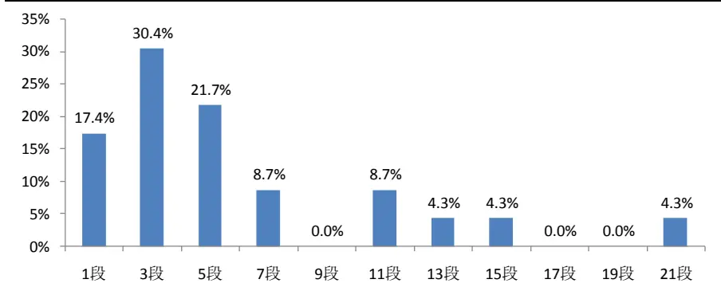
数据来源：国泰君安证券研究，WIND

图 16 上证综指日线级别的一段下跌对应 30分钟级别段数统计
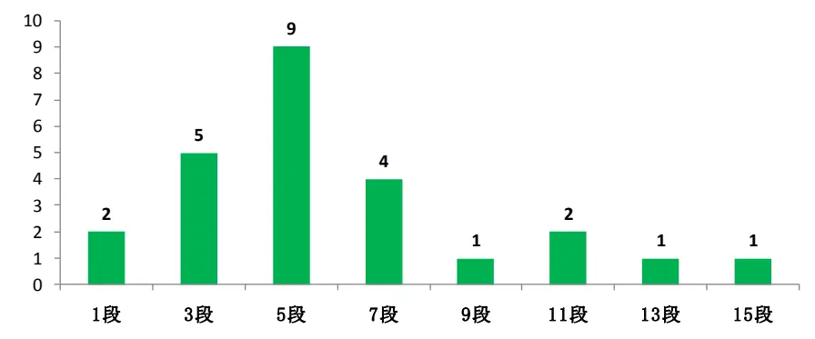
数据来源：国泰君安证券研究，WIND

图 17 上证综指日线级别下跌对应 30分钟级别段数 X 概率密度
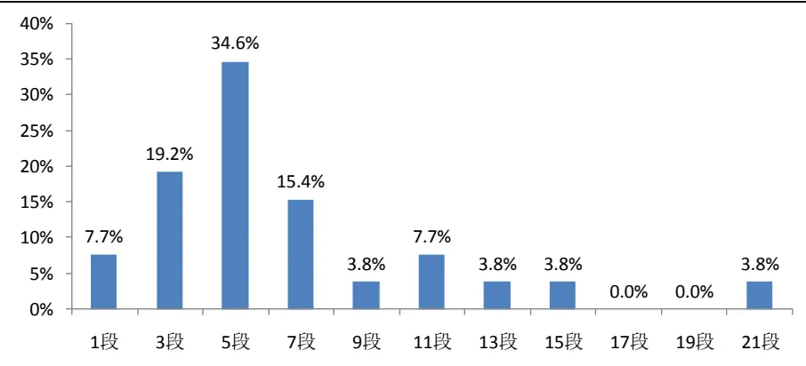
数据来源：国泰君安证券研究，WIND

对于日线级别的下跌行情而言，情况有所不同，X取值主要集中在 3、5、7段这三个值。所以日线级别的下跌，如果 30分钟只走了一段则不能轻言见底，反弹后往往是第二次离场时机。

对于上证综指 30 分钟级别上涨波段对应 5 分钟级别波段数 X 的概率密度如下图，X 的分布主要集中在 1 段、3 段、5 段和 7 段，其中 3 段的出现概率最高为 29%。而超过 9段的概率不足 7%。

图 18 上证综指 30分钟级别上涨对应 5分钟级别段数 X 概率密度
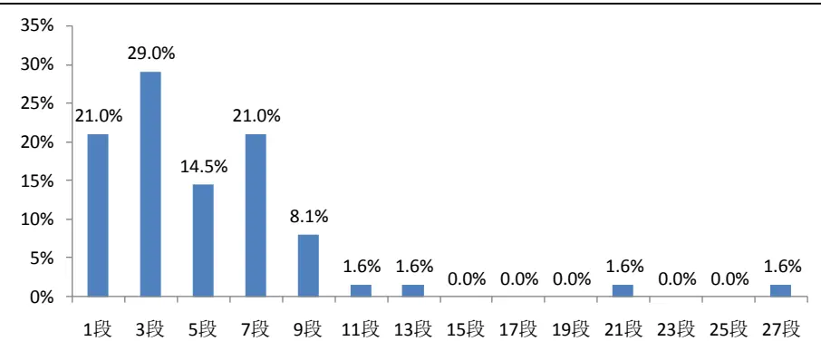
数据来源：国泰君安证券研究，WIND

对于上证综指 30 分钟级别下跌波段对应 5 分钟级别波段数 X 的概率密度如下图，X 的分布同样主要集中在 1 段、3 段、5 段和 7 段，其中 3段的出现概率最高为 31%。而超过 11段的概率约 10%。

图 19 上证综指 30分钟级别下跌对应 5分钟级别段数 X 概率密度
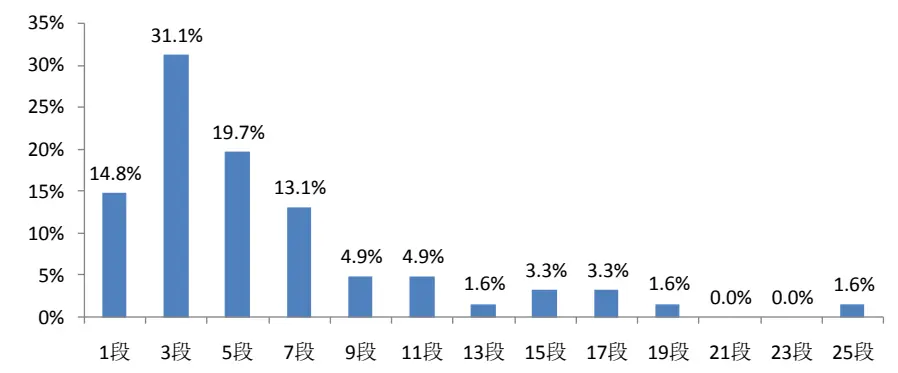
数据来源：国泰君安证券研究，WIND

## 5. 总结与研究展望

上述研究的重要意义在于由分析波段涨跌幅的连续变量转变为分析不同周期对应段数的离散变量，离散随机变量取值主要集中在 1、3、5、7，使得择时变得更具有可操作性。这个方法可以推广到任何时间序列，由此能够发现更多价格走势的内在规律。

后续择时的研究重点在于结合更多的信息，把离散随机变量在每一个当下的取值之确定性进一步提高。基于 MACD 分段意味着任何级别的上涨或者下跌都会结束，一个下跌行情最终结束的位臵能否捕捉到就是用同样方法体系的人差别所在，有人能够在一个下跌结束的五分钟级别上作出确认并操做，也有人下跌结束的30分钟级别上作出确认并操作，显然是有很大差别的。

## 本公司具有中国证监会核准的证券投资咨询业务资格

## 分析师声明

作者具有中国证券业协会授予的证券投资咨询执业资格或相当的专业胜任能力，保证报告所采用的数据均来自合规渠道，分析逻辑基于作者的职业理解，本报告清晰准确地反映了作者的研究观点，力求独立、客观和公正，结论不受任何第三方的授意或影响，特此声明。

## 免责声明

本报告仅供国泰君安证券股份有限公司（以下简称“本公司”）的客户使用。本公司不会因接收人收到本报告而视其为本公司的当然客户。本报告仅在相关法律许可的情况下发放，并仅为提供信息而发放，概不构成任何广告。

本报告的信息来源于已公开的资料，本公司对该等信息的准确性、完整性或可靠性不作任何保证。本报告所载的资料、意见及推测仅反映本公司于发布本报告当日的判断，本报告所指的证券或投资标的的价格、价值及投资收入可升可跌。过往表现不应作为日后的表现依据。在不同时期，本公司可发出与本报告所载资料、意见及推测不一致的报告。本公司不保证本报告所含信息保持在最新状态。同时，本公司对本报告所含信息可在不发出通知的情形下做出修改，投资者应当自行关注相应的更新或修改。

本报告中所指的投资及服务可能不适合个别客户，不构成客户私人咨询建议。在任何情况下，本报告中的信息或所表述的意见均不构成对任何人的投资建议。在任何情况下，本公司、本公司员工或者关联机构不承诺投资者一定获利，不与投资者分享投资收益，也不对任何人因使用本报告中的任何内容所引致的任何损失负任何责任。投资者务必注意，其据此做出的任何投资决策与本公司、本公司员工或者关联机构无关。

本公司利用信息隔离墙控制内部一个或多个领域、部门或关联机构之间的信息流动。因此，投资者应注意，在法律许可的情况下，本公司及其所属关联机构可能会持有报告中提到的公司所发行的证券或期权并进行证券或期权交易，也可能为这些公司提供或者争取提供投资银行、财务顾问或者金融产品等相关服务。在法律许可的情况下，本公司的员工可能担任本报告所提到的公司的董事。

市场有风险，投资需谨慎。投资者不应将本报告为作出投资决策的惟一参考因素，亦不应认为本报告可以取代自己的判断。在决定投资前，如有需要，投资者务必向专业人士咨询并谨慎决策。

本报告版权仅为本公司所有，未经书面许可，任何机构和个人不得以任何形式翻版、复制、发表或引用。如征得本公司同意进行引用、刊发的，需在允许的范围内使用，并注明出处为“国泰君安证券研究”，且不得对本报告进行任何有悖原意的引用、删节和修改。

若本公司以外的其他机构（以下简称“该机构”）发送本报告，则由该机构独自为此发送行为负责。通过此途径获得本报告的投资者应自行联系该机构以要求获悉更详细信息或进而交易本报告中提及的证券。本报告不构成本公司向该机构之客户提供的投资建议，本公司、本公司员工或者关联机构亦不为该机构之客户因使用本报告或报告所载内容引起的任何损失承担任何责任。

## 评级说明

## 1.投资建议的比较标准

投资评级分为股票评级和行业评级。

以报告发布后的12个月内的市场表现为比较标准，报告发布日后的12个月内的公司股价（或行业指数）的涨跌幅相对同期的沪深300指数涨跌幅为基准。

## 2.投资建议的评级标准

报告发布日后的 12 个月内的公司股价（或行业指数）的涨跌幅相对同期的沪深300指数的涨跌幅。

| 评级 |  | 说明 |
| --- | --- | --- |
| 股票投资评级 | 增持 | 相对沪深 300指数涨幅15%以上 |
|  | 谨慎增持 | 相对沪深300指数涨幅介于5%～15%之间 |
|  | 中性 | 相对沪深300指数涨幅介于-5%～5% |
|  | 减持 | 相对沪深300指数下跌5%以上 |
| 行业投资评级 | 增持 | 明显强于沪深 300 指数 |
|  | 中性 | 基本与沪深300指数持平 |
|  | 减持 | 明显弱于沪深300指数 |

## 国泰君安证券研究

|  | 上海 | 深圳 | 北京 |
| --- | --- | --- | --- |
| 地址 | 上海市浦东新区银城中路168号上海 银行大厦29层 | 深圳市福田区益田路 6009 号新世界 商务中心34层 | 北京市西城区金融大街 28 号盈泰中 心2号楼10层 |
| 邮编 | 200120 | 518026 | 100140 |
| 电话 | （021)38676666 | (0755)23976888 | (010)59312799 |
|  | E-mail: gtjaresearch@gtjas.com |  |  |