2014.02.17

# 业绩预告解析之一：高增长

# ——数量化专题之三十五

徐康（分析师）

严佳炜（分析师）

8 021-38674939

021-38674812

xukang010849@gtjas.com

## 刘富兵（分析师）

021-38676673

证书编号 S0880513080018

yanjiawei008776@gtjas.com

S0880512110001

liufubing008481@gtjas.com

S0880511010017

## 本报告导读：

分析业绩预告相关规定和基本情况，多维度解析业绩预告事件效应，构建高增长选股策略，把握业绩预告带来的投资机会。

## 摘要：

le_Summary]业绩预告披露相关规定：交易所要求披露的业绩变动情形基本为亏损、扭亏和净利润同比上升或下降 50%以上；上交所仅要求年度业绩，深交所要求半年度、前三季度和年度业绩；中小板披露要求最严，创业板次之，上海主板相对宽松。

业绩预告分布：预告类型中预增和略增占比较大，预喜类型占比超过半数，正面利好业绩披露积极性高，主动披露占比接近四成；年度业绩预告数量最多，一季度最少；业绩预告月份聚集效应明显。

业绩预告准确性较高：发布次数，约 87%只发布 1次，约 12.6%发布2 次，2次以上极为少数；业绩预告范围与实际业绩比较，约 77%符合实际情况，约 13%低于实际。

业绩预告事件效应：公告后短期效应明显，超额收益主要由公告首日贡献，超额收益数值大小与业绩预告类型利空利好程度基本相符；长期 60 个交易日内，预增、扭亏和略增类超额收益较为稳定，超额收益分别为 5.61%、4.24%和 3.65%，胜率不是很高，基本维持在在55%-60%。

业绩预告高增长策略：剔除当年已知业绩对预告业绩的影响，寻找稳定高增长股票，具体选股标准为（1）业绩预告类型为预增；（2）剔除当年已知业绩后，未知净利润增速下限大于 0，上限大于 50%；（3）已知净利润增速大于 30%。相比仅选择预增股票，该策略在累计超额收益数值和胜率上均有所提升，预增后 60 个交易日超额收益为 6.74%，胜率为 61.85%。预增公告前 5 日超额收益正负主要影响短期超额收益，表现出反转效应，对长期收益影响不大；创业板 60日超额收益为 12.30%，胜率高达 74.92%；一季度业绩 60 日累计超额收益为 9.28%，胜率为 65.09%。

关注 2013年度业绩预告：已有 1700 余家披露 2013年度业绩预告，创业板和中小企业板业绩预告披露接近 100%，主板业绩预告披露率仅为 47.56%，业绩预告以中小市值公司为主；2013年度业绩整体略有改善，预增类型占比为 23.12%，高于 2012 年同期的 17.01%，预喜类型占比为 63.33%，同样高于 2012 年同期的 53.46%。重点关注创业板股票和一季度的业绩预增，对于持有期限要就较短的投资者，可选取公告前超额收益为负的上市公司。

金融工程

## 金融工程团队：

刘富兵：（分析师）

电话：021-38676673

邮箱：liufubing008481@gtjas.com

证书编号：S0880511010017

何苗：（分析师）

电话：010-59312710

邮箱：hemiao@gtjas.com

证书编号：S0880511010049

## 严佳炜：（分析师）

电话：021-38674812

邮箱：yanjiawei008776@gtjas.com

证书编号：S0880512110001

## 耿帅军：（分析师）

电话：010-59312753

邮箱：gengshuaijun@gtjas.com

证书编号：S0880513080013

## 徐康：（分析师）

电话：021-38674939

邮箱：xukang010849@gtjas.com

证书编号：S0880513080018

## 赵延鸿：（研究助理）

电话：021-38674927

邮箱：zhaoyanhong@gtjas.com

证书编号：S0880113070047

## 陈睿：（研究助理）

电话：021-38675861

邮箱：chenrui012896@gtjas.com

证书编号：S0880112120012

## 刘正捷：（研究助理）

电话：021-38675860

邮箱：liuzhengjie012509@gtjas.com

证书编号：S0880112080087

## [Table_R相关报告

《关于择时思考之一:由连续到离散》2014.02.14

《从微观数据中寻找 Alpha 的新来源》2014.02.13

《掘金国企改革》2014.02.12

《掘金国防安全》2014.01.21

《市场微观结构之 A 股走势回顾与展望》2013.12.31

## 1. 交易所业绩预告披露相关规定

业绩预告是上市公司在交易所发布的，对定期财务报告以预告的形式进行披露的报告，预告的内容包括对本期财务状况的预测，同比的变动情况，有的还会说明变动的原因。业绩预告、业绩快报和定期财务报告为上市公司披露业绩的主要方式，业绩预告作为三者之中时间最早的，其重要性不言而喻。交易所对上市公司业绩预告披露有着明确的规定，业绩出现重大变动的要求强制披露。业绩预告披露后，预计本期业绩与已披露的业绩预告情况差异较大的，也必须及时刊登业绩预告修正公告。

主板和中小企业板上市公司，交易所要求进行业绩预告披露的情形基本相同，主要为当期净利润出现以下三种情形：净利润为负值、实现扭亏为盈和净利润与上年同期相比上升或下降 50%以上（由于比较基数较小而出现上述情形的可以要求进行豁免）；有所不同的是，上交所仅对年度业绩做强制要求，深交所则对全年度、半年度和前三季度业绩均有上述要求。

中小企业板上市公司，除了须遵守上述相关规定外，深交所另有特别规定：要求应在第一季度报告、半年度报告和第三季度报告中披露对年初至下一报告期末的业绩预告；一季报编制期间，股票价格出现异常波动且公司预计第一季度业绩将出现上述三种情形时，应在异常波动公告中对第一季度的业绩进行预告；鼓励预计年初至下一报告期末净利润与上年同期相比上升或者下降 30%以上的公司也进行业绩预告。

创业板上市公司，深交所要求披露业绩预告的情形在主板的三项之外添加“期末净资产为负”情形，要求进行预告的业绩期为全年度、半年度和前三季度。

此外在上市公司定期报告的披露要求中有相关规定：公司如果预测年初至下一报告期期末的累计净利润可能为亏损或者与上年同期相比发生重大变动，应当予以警示并说明原因。

综合看来，中小企业板的业绩披露要求最高，创业板次之，沪市主板最低；年度业绩预告披露要求最高，一季度业绩预告较为宽松；业绩预告的发布方式主要有（1）上市公司单独发布的业绩预告；（2）定期报告中有关 “预测年初至下一报告期期末的累计净利润可能为亏损或者与上年同期相比发生重大变动的警示及原因说明”的相关内容；（3）股票交易异常波动公告和澄清公告，其中前两者为主要来源方式。

表 1：上市公司业绩预告披露相关规定

| 法规 | 板块 | 业绩预告相关规定 |
| --- | --- | --- |
| 《上海交易所股票上市规则(2013年修订)》 | 主板（上海） | 上市公司预计年度经营业绩将出现下列情形之一的，应当在会计年度结束后一个月内进行业绩预告，预计中期和第三季度业绩将出现下列情形之一的，可以进行业绩预告： |
|  |  | （一）净利润为负值；（二）净利润与上年同期相比上升或者下降50%以上；（三）实现扭亏为盈。 |
| 《深圳交易所股票上市规则(2012年修订)》 | 主板（深圳）、中小企业板 | 上市公司预计全年度、半年度、前三季度经营业绩将出现下列情形之一的，应当及时进行业绩预告：（一）净利润为负值；（二）净利润与上年同期相比上升或者下降50%以上；（三）实现扭亏为盈。 |
| 《中小企业板信息披露业务备忘录第1号》 | 中小企业板 | 公司应在第一季度报告、半年度报告和第三季度报告中披露对年初至下一报告期末的业绩预告。本所鼓励预计年初至下一报告期末净利润与上年同期相比上升或者下降30%以上的公司也进行业绩预告。在第一季度报告编制期间，公司股票及其衍生品种交易出现异常波动且公司预计第一季度业绩将出现下列情形之一的，应在异常波动公告中对第一季度的业绩进行预告：（一）净利润为负值；（二）净利润与上年同期相比上升或者下降50%以上；（三）与上年同期相比实现扭亏为盈。 |
| 《深圳交易所创业板股票上市规则（2012年修订》 | 创业板 | 上市公司预计全年度、半年度、前三季度经营业绩或者财务状况将出现下列情形之一的，应当及时进行业绩预告：（一）净利润为负；（二）净利润与上年同期相比上升或者下降50%以上；(三）与上年同期或者最近一期定期报告业绩相比，出现盈亏性质的变化；（四）期末净资产为负。 |

数据来源：上海证券交易所、深圳证券交易所

## 2. 业绩预告概览

本文所用业绩预告数据均来源于 Wind 数据库，其中包含预告日期、预警类型、预告净利润上下限、预告净利润同比增长上下限等栏目，其原始数据均来源于对业绩预告摘要文本的处理。

根据上市公司预告净利润变动幅度以及对业绩变动的描述，分为9大类：预增、略增、续盈、扭亏、首亏、续亏、略亏、预亏和不确定，分类标准可见下表描述。根据业绩预告披露相关规定，预增、扭亏、首亏、续亏和预减属强制披露类型，略增、续盈、略减和不确定为上市公司主动披露；根据业绩预告信息价值来看，预增、扭亏、略增为正面利好信号，预减、首亏、略减为负面利空信号，续盈和续亏和不确定属性较为不确定。

表 2：业绩预警类型的说明

| 类型 | 说明 |
| --- | --- |
| 首亏 | 上年同期盈利，预告期亏损 |
| 续亏 | 上年同期亏损，预告期亏损 |
| 扭亏 | 上年同期亏损，预告期盈利; |
| 续盈 | 上年同期盈利，预告期盈利（增加或减少不定，幅度不定); |
| 预增 | 上年同期盈利，预告期盈利增幅大于50%或明确表示业绩将有"大幅增长"； |
| 预减 | 上年同期盈利，预告期盈利降幅大于50%或明确表示业绩将有"大幅下降"； |
| 略增 | 上年同期盈利，预告期盈利增幅小于50%或使用"较大幅度增长"、"一定幅度增长"等描述语言； |
| 略减 | 上年同期盈利，预告期盈利降幅小于50%或使用"较大幅度下降"、"一定幅度下降"等描述语言； |
| 不确定 | 预告期盈亏不定 |

数据来源：Wind

## 2.1.业绩预告分类统计

本文考察业绩预告范围均为 2009年一季度至 2013年全年度。业绩预告发布总数逐年增加，2009年业绩预告为 3100余例，2013年相关预告已超过 5700例。预告发布数量的逐年增加，虽和上市公司数量增加有关，也反应出业绩预告制度被更多的上市公司采用。

业绩预告类型分布虽与每年度市场表现相关，但总体来说预增和略增比重较大，累计占比分别约为 25%和 21%，侧面说明上市公司对于正面利好业绩披露积极性更高，正面利好信号总占比约为 53%，负面利空总占比约为 29%，主动披露总占比约为 38%。

图 1：各类型业绩预告分布（2009-2013）
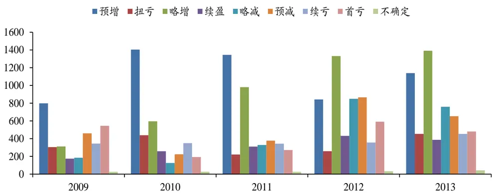
数据来源：Wind、国泰君安证券研究

全年度业绩预告数量最多，累计占比约为 33%；半年度次之，占比约为28%；一季度业绩预告最少，仅约为 12%，与各业绩期的披露要求相符。

图 2：各业绩期业绩预告分布（2009—2013）
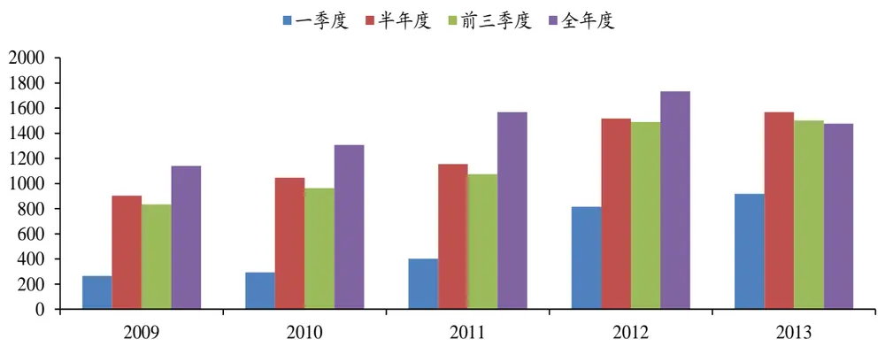
数据来源：Wind、国泰君安证券研究

从发布业绩预告的月份来看，全年度业绩预告主要发布在当年 10 月和次年 1 月；前三季度业绩预告主要发布在当年 8 月和 10 月；半年度业绩预告主要发布在 4月和 7月；一季度业绩预告主要集中在3月和4月。业绩预告的月份聚集效应与上市公司定期报告发布时间有关。

图 3：业绩预告月度分布（2009—2013）
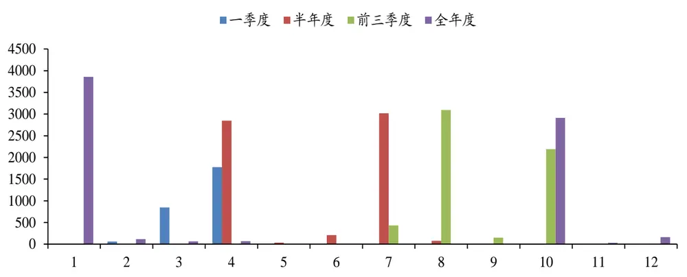
数据来源：Wind、国泰君安证券研究

## 2.2.业绩预告准确性分析

交易所规定业绩预告披露后，如果预计本期业绩与已披露的业绩预告情况差异较大的，应当及时刊登业绩预告更正公告，同一业绩期发布业绩预告的数量将当期反应预告的准确性。从具体数据来看，约 87%只发布1次预告，约 12.6%会发布 2次预告，2次以上极为少数。从业绩预告范围和之后的实际业绩比较，约 77%的预告业绩符合实际情况（实际业绩落于预告范围之间）；约 13%低于实际。从业绩预告次数和与实际业绩的偏离，业绩预告的准确性均较高。

图 4：业绩预告公布次数情况
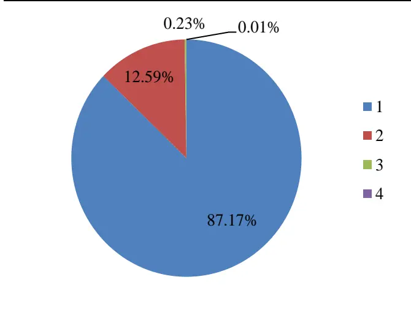
数据来源：Wind、国泰君安证券研究

图 5：业绩预告与实际业绩比较情况
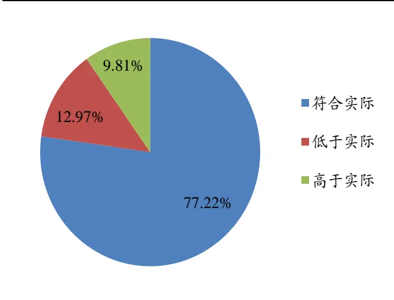
数据来源：Wind、国泰君安证券研究

## 3. 业绩预告事件效应解析

## 3.1.事件研究相关说明

事件样本范围：2009年一季度至2013年全年度业绩预告，有明确预测结果的八类业绩预告。

事件数据清洗：为了增加可用事件样本数量，提高数据可用性，我们对原始业绩预告数据进行了简单的处理，具体为：对于某些只公布净利润增幅百分比上下限，而不公布实际净利润数值的公司，通过去年同期已公布的实际净利润，计算出预告净利润上下限：预告净利润 = 预告净利润变动幅度*ABS（去年同期公布净利润）+ 去年同期公布净利润。

例如：香溢融通（600830）于2014/1/21公布“增长40%~60%”，则通过计算，可以得出对应净利润上下限为1.57~1.79亿元。反之亦然。

多次预告说明：Wind终端及底层数据库在处理一家公司多次对同一报告期进行盈利预告时，会对之前的数据进行覆盖。因此，我们只能提取到最近一次预告数据，这是底层数据的不足。上市公司对之前预告进行修正的过程其实也蕴含了Alpha信息，但受制于数据原因，我们不在本文进行考虑。

停牌股票处理：数据处理过程中，我们发现有许多涉及重组的上市公司会在重组停牌末期或者重组停牌打开后公布业绩预告，这些股票大多数会有异常的二级市场反应（连续涨停），从而产生极值样本点。连续涨停并非来源于盈利事件本身，因此将排除此类重组概念股票。我们使用变通的处理方法，将公告日前20日内总计停牌天数大于5天的股票剔除出样本空间。

超额收益基准选取：事件影响的是股票的非系统性收益部分，受到的是非系统性风险，在衡量事件信号的影响时，应当使用股票剥离系统性收益后的 Alpha 收益。这里的 Alpha 收益不是指股票收益减去沪深 300 收益，而是应当剥离各种系统性影响因素，本文中只考虑市场、行业作为系统性风险，其他系统性风险的考虑留待后续改进。

例如，皇台酒业（000995）于2013/1/16对2012年年报业绩预告增长86.21%~127.59%，但其在公告后10日内相对沪深300累计收益为-3.02%，看似没有事件超额收益，事实上，2013年初国家限制公款消费的政策对食品饮料行业整体影响很大，导致食品饮料行业大幅跑输市场。如果以食品饮料行业指数为比较基准，不难发现同期皇台酒业超额收益有7.24%。

## 3.2.短期效应明显，预增、略增和扭亏类长期超额收益稳定

业绩预告公告后，短期来看，5个交易日内事件效应明显，超额收益主要由公告首日贡献，超额收益数值大小与业绩预告类型利空利好程度基本相符。预增和扭亏类预告正向超额收益较为明显；略增类正向超额收益微弱且稍有滞后；续盈类带来负向的超额收益，较为反常，或与公告前提前反应有关；略减、预减、续亏和首亏类带来负向超额收益。

长期来看，在业绩预告后的60个交易日内，预增、扭亏和略增类超额收益较为稳定，数值大小随时间推移递增，60个交易日内累计超额收益分别为5.61%、4.24%和3.65%，胜率不是很高，基本维持在在55%-60%之间；续盈类短期反常后有所回涨，约12个交易日起，能获得正向的累计超额收益，60个交易日累计超额收益为1.37%，胜率在47%左右；略减和续亏类存在反应过度现象，公告后第2交易日存在回涨；预减和首亏类长期均为负向超额收益，且基本由公告后2至3个交易日贡献。考虑累计超额收益大小以及样本数量问题，本文之后重点考察预增类业绩预告。

图 6：各类型业绩预告短期累计超额收益表现（单位：%）
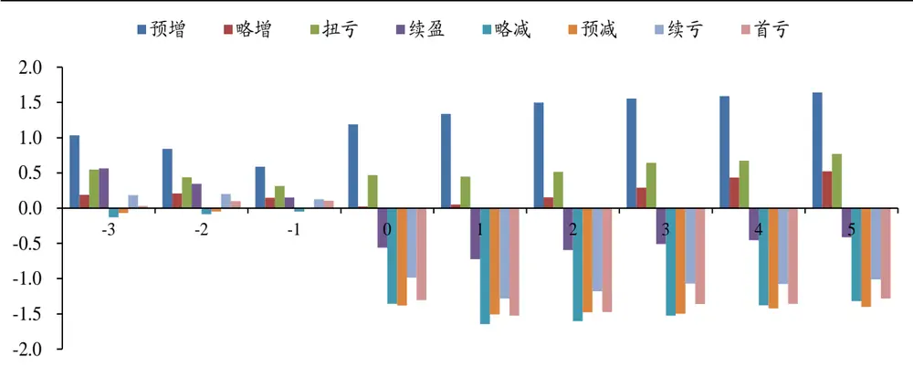
数据来源：Wind、国泰君安证券研究

图 7：各类型业绩预告累计超额收益表现（单位：%）
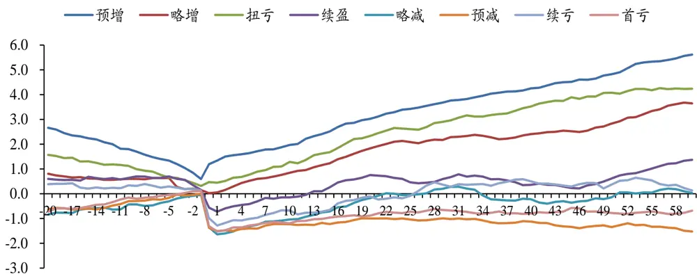
数据来源：Wind、国泰君安证券研究

图 8：各类型业绩预告累计超额收益胜率表现
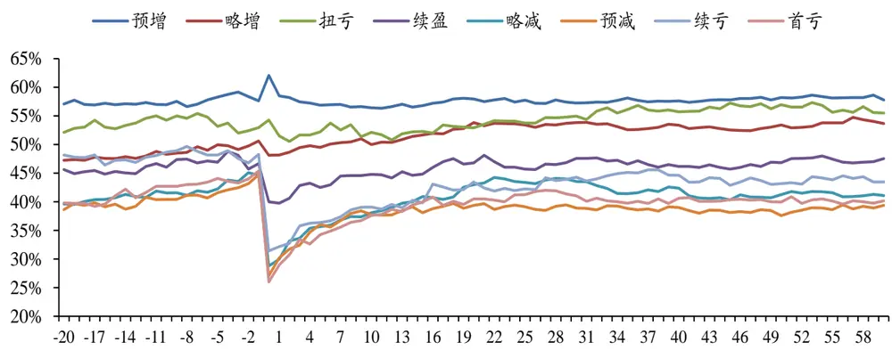
数据来源：Wind，国泰君安证券研究

## 4. 业绩预告高增长策略

半年度、前三季度和全年度业绩预告公布的净利润变动范围中包含当年前期已知业绩，若该业绩期的大幅增长主要由前期已知业绩贡献，从正常逻辑上看，市场将不会对该预增有多反应。

例如：2014年1月320日，山东地矿（000409）在2014/1/20发布业绩预告“2013年全年归属上市公司股东净利润为12600万元~13200元，比上年同期增长：56.36%~63.80%。”，剥离2013年前三季度的净利润7797.91万元，2013年第四季度的净利润大约在4802.09万元和5402.09万元之间，相较2012年第四季度的8055.05万元，同比下降40.38%~32.95%之间。可知山东地矿2013年度业绩大幅增长主要是由前三季度业绩贡献，从股票价格实际反应来看，其价格也明显较行业指数走弱。

本节中我们将在预告净利润中剔除前期已知业绩，计算未公布业绩变动范围，寻找由当季度未公布业绩主导的预增公告，具体计算方式为：未公布业绩变动上限：（预告净利润变动上限[ – 本年已公布季度净利润）- （去年同期净利润 – 去年已公布同期净利润）] / ABS（去年同期净利润 – 去年已公布同期净利润）。

同时，为了提高上市公司业绩增长的稳定性，要求前期已知业绩亦变现出良好的增长性。对于一季度的业绩预告不存在前期已知业绩的问题，以上年全年度或前单三季度业绩增速代替“当年已知业绩增速”。

根据以上分析，设定如下选股标准：（1）业绩预告类型为预增；（2）剔除当年已知业绩后，未知净利润增速下限大于0，上限大于50%；（3）已知净利润增速大于30%。如图所示，相较于原来仅仅选择预增案例，在累计超额收益数值和胜率上均有所提升，预增后60个交易日超额收益为6.74%，胜率为61.85%。

图 9：预增公告前后累计超额收益（单位：%）与胜率表现
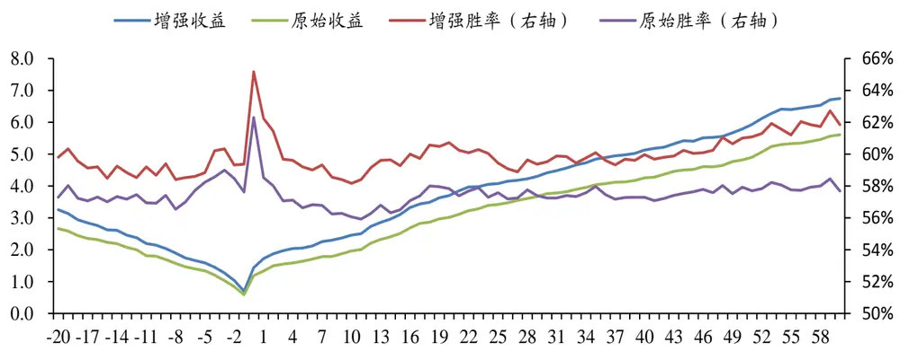
数据来源：Wind、国泰君安证券研究

## 公告前收益主要影响短期超额收益

国内市场股票对利好消息往往存在提前透支现象。如上图所示，预增公告前，上市公司股价已存在相对走强现象，公告前5个交易日超额收益为1.61%，胜率为58.91%，我们将预增案例按照公告前5日超额收益分为正向组和负向组，考察前期表现对事件效应的影响。正向组和负向组预增公告前5日超额收益分别为4.77%和-2.93%，预增首日超额收益分别为1.10%和1.92%，前5交易日累计超额收益分别为1.66%和2.71%，预增后60个交易日累计超额收益分别为6.98%和6.53%，胜率分别为60.82%和63.54%。预增公告前5日超额收益正负主要影响短期超额收益，特别是公告首日表现，对长期收益影响不大。

图 10：预增公告后累计超额收益（单位：%）与胜率表现
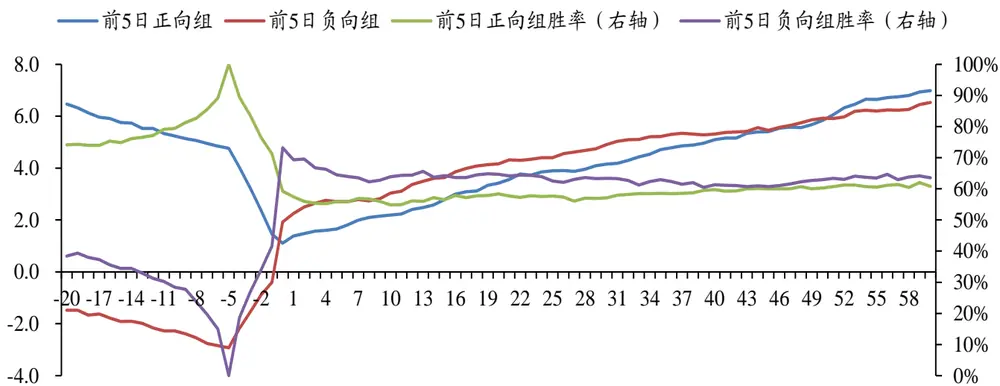
数据来源：Wind、国泰君安证券研究

## 创业板预增公告后超额收益显著

从各板块来看，创业板最明显，预增首日超额收益为2.20%，60日超额收益为12.30%，胜率高达74.92%；中小企业板和主板的预增首日超额收益分别1.08%和1.51%，60日累计超额收益分别为7.85%和4.96%，胜率分别为64.39%和57.49%。交易所对创业板和中小企业板上市公司业绩预告披露要求更加严格，其准确性相对较高。创业板和中小企业板上市公司流通市值相对较小，股票价格对利好消息的反应较为灵敏，也更加符合投资的操作习惯。

图 11：各板块预增公告前后累计超额收益表现（单位：%）
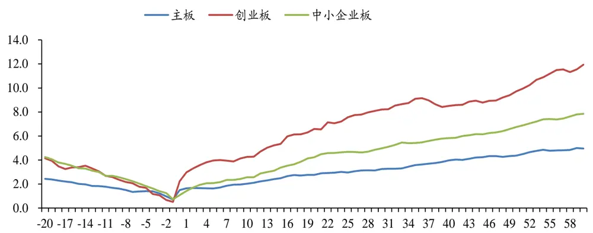
数据来源：Wind、国泰君安证券研究

图 12：各板块预增公告前后累计超额收益胜率表现
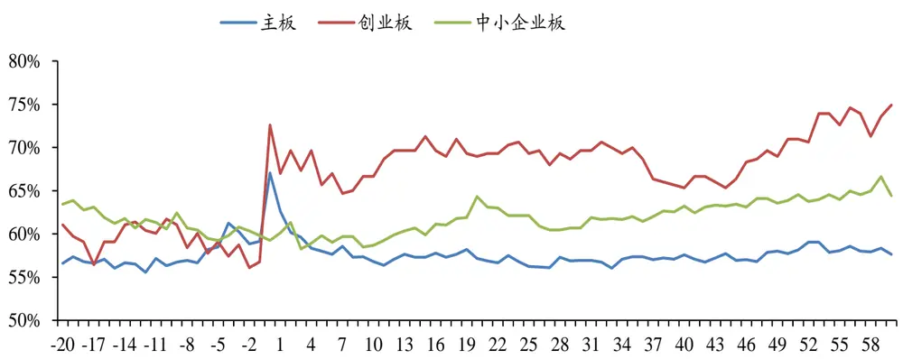
数据来源：Wind，国泰君安证券研究

## 一季度预增事件效应稍明显

从业绩预告的业绩期来看，一季度预增后超额收益最大，首日超额收益为 1.65%，60日累计超额收益为 9.28%，胜率为 65.09%，半年度、前三季度和全年度在预增后 60 个交易日累计超额收益分别为 6.59%、5.29%和 7.00%，胜率分别为 61.71%、58.92%和 63.01%。交易所对一季度业绩预告披露要求较为宽松，业绩预告多为上市公司主动披露。一季度业绩预告多为每年 3或 4月份披露，恰逢上市公司年报披露密集期，市场活跃度更高。

图 13：各业绩期预增公告前后累计超额收益表现（单位：%）
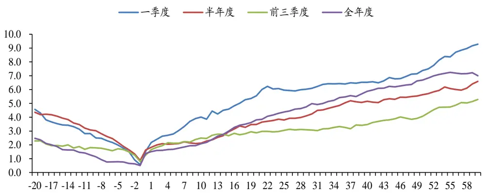
数据来源：Wind、国泰君安证券研究

图 14：各业绩期预增公告前后累计超额收益胜率表现
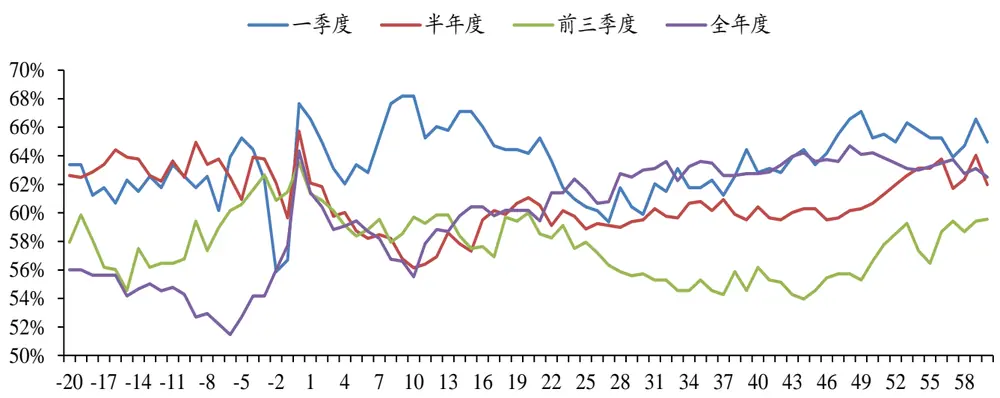
数据来源：Wind、国泰君安证券研究

## 5. 近期可重点关注机会

目前，沪深两市已有1700余家上市公司披露2013年全年度业绩预告，其中主板662家、创业板342家、中小企业板700 家，创业板和中小企业板业绩预告披露接近100%，主板业绩预告披露率仅为47.56%，业绩预告以中小市值公司为主，主板公司披露率较低。

图15：各板块2013年度业绩预告情况（截至2014年1月31日）
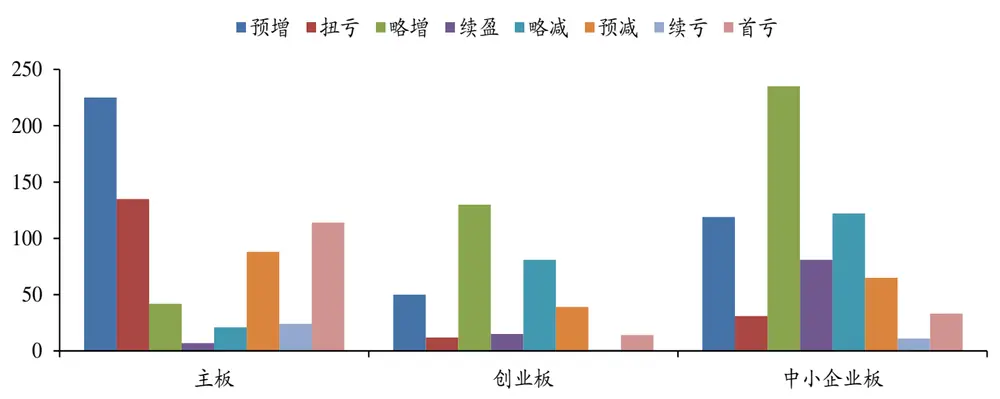
数据来源：Wind、国泰君安证券研究

从披露的业绩预告类型来看，2013年度业绩整体略有改善。预增类型占比为23.12%，高于2012年同期的17.01%，预喜类型占比为63.33%，同样高于2012年同期的53.46%。具体到各板块看，主板预增类型占比由24.26%上升至33.99%，预减类型占比大幅减低，由26.64%降至13.29%，主板披露率低，数据普适性有待验证；中小板预增类型占比为17.00%，高于2012年同期的12.71%，预减类型占比由20.43%下降至17.435；创业板业绩依然分化，预增类型占比为14.62%，较2012年的12.61%略高，预减类型占比达11.40%，与2012年的11.44%基本持平。

每年1月份为上年度业绩预告披露的高峰期，我们根据前文分析，构建业绩预告高增长选股策略，具体选股标准为：（1）业绩预告类型为预增；（2）剔除当年已知业绩后，未知净利润增速下限大于0，上限大于50%；（3）已知净利润增速大于30%。重点关注创业板股票和一季度的业绩预增，对于持有期限要求较短的投资者，可选取公告前超额收益为负的上市公司。下面列出近期重点关注预增公司列表。

表3：近期创业板预增股票列表

| 简称 | 申万行业 | 预告日期 | 业绩期 | 业绩变动下限（%） | 业绩变动上限（%） | 未知业绩变动下限(%) | 未知业绩变动上限(%) | 已知业绩增速(%) |
| --- | --- | --- | --- | --- | --- | --- | --- | --- |
| 康得新 | 化工 | 20140210 | 20140331 | 55 | 60 | 55.00 | 60.00 | 56.09 |
| 三力士 | 化工 | 20140207 | 20140331 | 80 | 100 | 80.00 | 100.00 | 90.31 |
| 金浦钛业 | 医药生物 | 20140127 | 20140331 | 1302.28 | 2003.42 | 1302.31 | 2003.47 | 2897.03 |
| 蓝色光标 | 信息服务 | 20140130 | 20131231 | 75 | 95 | 324.46 | 459.94 | 31.80 |
| 中青宝 | 信息服务 | 20140129 | 20131231 | 205.54 | 235.54 | 573.19 | 715.30 | 107.16 |
| 汇川技术 | 机械设备 | 20140129 | 20131231 | 60 | 85 | 38.80 | 143.73 | 66.63 |
| 华谊兄弟 | 信息服务 | 20140128 | 20131231 | 160 | 180 | 102.89 | 147.27 | 206.86 |
| 掌趣科技 | 信息服务 | 20140128 | 20131231 | 75 | 95 | 69.11 | 122.32 | 78.55 |
| 华谊嘉信 | 信息服务 | 20140125 | 20131231 | 55 | 80 | 56.01 | 119.85 | 54.35 |
| 巴安水务 | 公用事业 | 20140125 | 20131231 | 40 | 60 | 8.32 | 83.11 | 51.55 |
| 网宿科技 | 信息设备 | 20140124 | 20131231 | 113 | 143 | 75.00 | 137.63 | 147.94 |
| 超图软件 | 信息服务 | 20140124 | 20131231 | 868.11 | 979.81 | 1851.82 | 2122.31 | 176.08 |
| 建新股份 | 化工 | 20140124 | 20131231 | 190 | 207 | 594.03 | 676.04 | 56.80 |
| 经纬电材 | 机械设备 | 20140124 | 20131231 | 55 | 65 | 55.83 | 108.80 | 54.81 |
| 开尔新材 | 建筑建材 | 20140124 | 20131231 | 85.68 | 105.02 | 304.91 | 434.83 | 47.33 |
| 海默科技 | 采掘 | 20140122 | 20131231 | 558.02 | 620.69 | 2593.48 | 3072.24 | 251.47 |
| 智云股份 | 机械设备 | 20140122 | 20131231 | 769.99 | 898.87 | 1285.53 | 2674.99 | 717.28 |
| 隆华节能 | 机械设备 | 20140122 | 20131231 | 80 | 100 | 256.14 | 389.33 | 48.88 |
| 阳光电源 | 机械设备 | 20140122 | 20131231 | 140 | 170 | 468.58 | 668.99 | 82.16 |
| 鼎汉技术 | 机械设备 | 20140121 | 20131231 | 360.12 | 389.4 | 117.55 | 154.77 | 1255.02 |
| 聚龙股份 | 信息设备 | 20140121 | 20131231 | 70 | 90 | 75.38 | 103.96 | 57.44 |
| 盛运股份 | 公用事业 | 20140118 | 20131231 | 90 | 120 | 132.46 | 229.20 | 72.83 |
| 香雪制药 | 医药生物 | 20140118 | 20131231 | 35 | 60 | 38.77 | 130.85 | 34.13 |
| 洲明科技 | 电子 | 20140116 | 20131231 | 98.25 | 122.92 | 334.21 | 462.39 | 42.01 |
| 三维丝 | 公用事业 | 20140115 | 20131231 | 496 | 526 | 849.00 | 942.82 | 328.77 |
| 和佳股份 | 医药生物 | 20140115 | 20131231 | 40 | 60 | 15.33 | 80.10 | 51.02 |
| 金卡股份 | 机械设备 | 20140115 | 20131231 | 40 | 55 | 20.26 | 79.36 | 46.71 |
| 美晨科技 | 交运设备 | 20140111 | 20131231 | 50.86 | 77.8 | 149.51 | 382.56 | 30.12 |
| 佳讯飞鸿 | 信息设备 | 20140109 | 20131231 | 110 | 130 | 110.95 | 175.42 | 109.57 |
| 阳谷华泰 | 化工 | 20140108 | 20131231 | 50 | 80 | 171.97 | 430.65 | 34.00 |
| 安诺其 | 化工 | 20140107 | 20131231 | 100 | 120 | 82.35 | 176.99 | 104.74 |
| 金城医药 | 医药生物 | 20140107 | 20131231 | 40 | 70 | 17.94 | 103.29 | 51.97 |
| 卫宁软件 | 信息服务 | 20140107 | 20131231 | 45 | 65 | 42.57 | 97.64 | 46.38 |
| 安利股份 | 化工 | 20140104 | 20131231 | 50 | 70 | 92.83 | 200.06 | 40.18 |
| 康得新 | 化工 | 20140210 | 20140331 | 55 | 60 | 55.00 | 60.00 | 56.09 |
| 三力士 | 化工 | 20140207 | 20140331 | 80 | 100 | 80.00 | 100.00 | 90.31 |
| 金浦钛业 | 医药生物 | 20140127 | 20140331 | 1302.28 | 2003.42 | 1302.31 | 2003.47 | 2897.03 |

数据来源：Wind、国泰君安证券研究

## 本公司具有中国证监会核准的证券投资咨询业务资格

## 分析师声明

作者具有中国证券业协会授予的证券投资咨询执业资格或相当的专业胜任能力，保证报告所采用的数据均来自合规渠道，分析逻辑基于作者的职业理解，本报告清晰准确地反映了作者的研究观点，力求独立、客观和公正，结论不受任何第三方的授意或影响，特此声明。

## 免责声明

本报告仅供国泰君安证券股份有限公司（以下简称“本公司”）的客户使用。本公司不会因接收人收到本报告而视其为本公司的当然客户。本报告仅在相关法律许可的情况下发放，并仅为提供信息而发放，概不构成任何广告。

本报告的信息来源于已公开的资料，本公司对该等信息的准确性、完整性或可靠性不作任何保证。本报告所载的资料、意见及推测仅反映本公司于发布本报告当日的判断，本报告所指的证券或投资标的的价格、价值及投资收入可升可跌。过往表现不应作为日后的表现依据。在不同时期，本公司可发出与本报告所载资料、意见及推测不一致的报告。本公司不保证本报告所含信息保持在最新状态。同时，本公司对本报告所含信息可在不发出通知的情形下做出修改，投资者应当自行关注相应的更新或修改。

本报告中所指的投资及服务可能不适合个别客户，不构成客户私人咨询建议。在任何情况下，本报告中的信息或所表述的意见均不构成对任何人的投资建议。在任何情况下，本公司、本公司员工或者关联机构不承诺投资者一定获利，不与投资者分享投资收益，也不对任何人因使用本报告中的任何内容所引致的任何损失负任何责任。投资者务必注意，其据此做出的任何投资决策与本公司、本公司员工或者关联机构无关。

本公司利用信息隔离墙控制内部一个或多个领域、部门或关联机构之间的信息流动。因此，投资者应注意，在法律许可的情况下，本公司及其所属关联机构可能会持有报告中提到的公司所发行的证券或期权并进行证券或期权交易，也可能为这些公司提供或者争取提供投资银行、财务顾问或者金融产品等相关服务。在法律许可的情况下，本公司的员工可能担任本报告所提到的公司的董事。

市场有风险，投资需谨慎。投资者不应将本报告为作出投资决策的惟一参考因素，亦不应认为本报告可以取代自己的判断。在决定投资前，如有需要，投资者务必向专业人士咨询并谨慎决策。

本报告版权仅为本公司所有，未经书面许可，任何机构和个人不得以任何形式翻版、复制、发表或引用。如征得本公司同意进行引用、刊发的，需在允许的范围内使用，并注明出处为“国泰君安证券研究”，且不得对本报告进行任何有悖原意的引用、删节和修改。

若本公司以外的其他机构（以下简称“该机构”）发送本报告，则由该机构独自为此发送行为负责。通过此途径获得本报告的投资者应自行联系该机构以要求获悉更详细信息或进而交易本报告中提及的证券。本报告不构成本公司向该机构之客户提供的投资建议，本公司、本公司员工或者关联机构亦不为该机构之客户因使用本报告或报告所载内容引起的任何损失承担任何责任。

## 评级说明

## 1.投资建议的比较标准

投资评级分为股票评级和行业评级。

以报告发布后的12个月内的市场表现为比较标准，报告发布日后的12个月内的公司股价（或行业指数）的涨跌幅相对同期的沪深300指数涨跌幅为基准。

## 2.投资建议的评级标准

报告发布日后的 12 个月内的公司股价（或行业指数）的涨跌幅相对同期的沪深300指数的涨跌幅。

| 评级 |  | 说明 |
| --- | --- | --- |
| 股票投资评级 | 增持 | 相对沪深 300指数涨幅15%以上 |
|  | 谨慎增持 | 相对沪深300指数涨幅介于5%～15%之间 |
|  | 中性 | 相对沪深300指数涨幅介于-5%～5% |
|  | 减持 | 相对沪深300指数下跌5%以上 |
| 行业投资评级 | 增持 | 明显强于沪深 300 指数 |
|  | 中性 | 基本与沪深300指数持平 |
|  | 减持 | 明显弱于沪深 300指数 |

## 国泰君安证券研究

|  | 上海 | 深圳 | 北京 |
| --- | --- | --- | --- |
| 地址 | 上海市浦东新区银城中路168号上海 银行大厦29层 | 深圳市福田区益田路 6009 号新世界 商务中心34层 | 北京市西城区金融大街 28 号盈泰中 心2号楼10层 |
| 邮编 | 200120 | 518026 | 100140 |
| 电话 | （021)38676666 | (0755)23976888 | (010)59312799 |
|  | E-mail: gtjaresearch@gtjas.com |  |  |