2014.02.19

# 业绩预告解析之二：超预期

## ——数量化专题之三十六

严佳炜（分析师）

徐康（分析师）

8 021-38674812

021-38674939

yanjiawei008776@gtjas.com

刘富兵（分析师）

xukang010849@gtjas.com

证书编号 S0880512110001

021-38676673

S0880513080018

liufubing008481@gtjas.com

S0880511010017

## 本报告导读：

在《业绩预告解析之一：高增长》的基础上，引入分析师一致预期数据，实证表明高盈利超预期具有较高的后期收益，在此基础上，结合技术指标，构建事件选股组合

## 摘要：

[Table_Summary]• 事件的三个维度：事件的描述，事前的条件变量，与事后的收益。首先，尽可能地从多个条件变量挖掘事件，以分析哪些变量直接影响了事件收益；另外，我们使用相对行业超额收益作为事后超额收益的测度，以剔除市场、行业系统性收益，还原事件的真面目。

分析师一致预期是有效的：卖方分析师报告有一定的市场影响力，因此，分析师一致预期观点能够逐渐被市场消化为市场一致预期观点。卖方分析师一致预期盈利预测能够在一定程度上作为市场一致预期的替代。

业绩预告超预期的选股逻辑：业绩预告中的超预期部分是市场信息流中的新讯息，能够影响市场形成新的一致预期，并通过交易逐渐在二级市场股价中得以体现，驱动股价的波动。正向超预期的上市公司股价将持续上涨，而低于预期上市公司股价将下跌。据此可选出有显著 Alpha的股票。

定义了四种广义的超市场预期指标：对于分析师覆盖度不够、信息匮乏的公司，认为市场 Price in 的是历史盈利情况，因此用整体增速、未公布增速指标衡量业绩预告超市场预期幅度；对于分析师覆盖度足够的公司，用整体超预期、未公布超预期幅度衡量。我们对后两者进行了测算。有 86.37%的样本整体超预期幅度小于等于 0，也从侧面说明了分析师对于盈利的预期普遍比较乐观。

总体结论：（1）整体超预期幅度能够很好地区分样本在事件日后相对行业Alpha。其中超预期幅度在15%-100%组T+60日内CAAR达到 9.24%，胜率 62.8%。（2）预告超预期股票表现出显著的盈余漂移现象，低于预期股票则会在短期内反应过度，并在之后修正。（3）T+0 日股价反应最为强烈。（4）整体超预期幅度指标在 60日信息系数能达到 16.27%，非常高。只要能够解决―期限错配问题‖，就能为组合提供很高的另类 Alpha。（5）未公布超预期幅度相比整体超预期幅度指标略有提升，可作为辅助判别指标

- 选股：设定 8 个选股标准，在 60 日内获得 11.71%的相对行业超额收益，胜率为 74%。若使用―20 日相对行业 BIAS‖技术指标进一步优化信号，则可以使 60日 CAAR 提升到 15.95%，胜率 82%。

金融工程

## 金融工程团队：

刘富兵：（分析师）

电话：021-38676673

邮箱：liufubing008481@gtjas.com

证书编号：S0880511010017

何苗：（分析师）

电话：010-59312710

邮箱：hemiao@gtjas.com

证书编号：S0880511010049

## 严佳炜：（分析师）

电话：021-38674812

邮箱：yanjiawei008776@gtjas.com

证书编号：S0880512110001

## 耿帅军：（分析师）

电话：010-59312753

邮箱：gengshuaijun@gtjas.com

证书编号：S0880513080013

## 徐康：（分析师）

电话：021-38674939

邮箱：xukang010849@gtjas.com

证书编号：S0880513080018

## 赵延鸿：（研究助理）

电话：021-38674927

邮箱：zhaoyanhong@gtjas.com

证书编号：S0880113070047

## 陈睿：（研究助理）

电话：021-38675861

邮箱：chenrui012896@gtjas.com

证书编号：S0880112120012

## 刘正捷：（研究助理）

电话：021-38675860

邮箱：liuzhengjie012509@gtjas.com

证书编号：S0880112080087

## [Table_R相关报告

《从微观数据中寻找 Alpha 的新来源》2014.02.13

《掘金国企改革》2014.02.12

《掘金国防安全》2014.01.21

《市场微观结构之 A 股走势回顾与展望》2013.12.31

《多维视角，深挖投资异象》2013.12.25

## 1. 浅谈“事件”及研究方法

事件是股价驱动的关键因素，是很重要的 Alpha 来源。因子模型注重的是因子的长期表现，产生的是连续信号，能在任意一个横截面上按照因子挑选出―好股票‖与―差股票‖ 。而事件注重的是短期的效应，事件信号的产生也是脉冲式的，事件之间几乎相互独立。从收益风险结构上来看，相比因子模型而言，事件性机会收益更高，当然风险也较大。

在 A股市场，很值得细致深入地进行事件性研究。一方面是因为近几年市场结构性较强，主题投资盛行，仅仅只用传统基本面数据构建的因子模型很难捕捉到市场中短暂投资机会，事件研究很有用武之地；另一方面，因子模型为代表的投资方法的投资周期较长，注重长期稳健收益，事件性研究能够与因子模型相辅相成。

我们以本文为契机，展开更为细致深入的事件研究，试图提供更为确定的另类 Alpha 来源。

首先，事件，有三个维度的信息：其一，对事件的描述，也即事件发生与否，定义的是信号发生的时点。对于某个确定时间点的某只股票，发生该事件，值为 1 否则为 0。事件不同于因子信息，是一种―脉冲‖式的离散信号。

其二，事件的“属性”，是事件发生前的条件变量。该维度的信息在事件发生之前就能获得到，可以作为对事件建模的依据。例如：对于业绩预告事件，可列举如下多维度的条件变量：1.股票在公告日的固有属性：市值、行业划分、之前已公布的历史成长性、公告日估值、最近 ROE、一致预期净利润、一致预期净利润预测家数等等，当然，股票的固有属性是否会间接影响事件信号的幅度，需要逐一甄别。2.股票的与事件相关的属性：如业绩预告类别（预增、略增等），业绩增长幅度，业绩超预期幅度等等，这些属性直接与信号的幅度相关。根据这些事前即可获知的股票固有属性与事件属性，对事件信号进行建模。

其三，事件信号所产生的收益的测算，是事件发生后影响程度的评估。事件信号影响的是股票的非系统性收益部分，受到的是非系统性风险，因此，在衡量事件信号的影响时，应当使用股票剥离系统性收益后的Alpha 收益。这里的 Alpha 收益不是指股票收益减去沪深 300 收益，而是应当剥离各种系统性影响因素，例如：行业从属、市值规模大小等。例如，皇台酒业（000995）于 2013/1/16 对 2012 年年报业绩预告增长86.21%~127.59%，但其在公告后 T+10 日内相对沪深 300 累计收益为-3.02%，看似没有事件超额收益，但事实上，2013年初国家限制公款消费的政策对食品饮料行业整体影响很大，导致食品饮料行业大幅跑输市场。如果以食品饮料行业指数为比较基准，不难发现同期皇台酒业超额收益有 7.24%。行业属性是重要的系统性风险，应当在统计时予以剔除。另外，大小盘等亦是重要的系统性风险。为处理简便，我们在本文中只考虑市场、行业作为系统性风险，其他系统性风险的考虑留待后续改进。

## 2. 业绩预告超预期下的收益特征

## 2.1.市场一致预期与分析师一致预期

分析师报告是分析师通过对上市公司相关信息进行搜集处理，判断，使用财务模型对公司未来财务数据进行预测，对市场价格进行估值的过程，通常具备信息、逻辑、催化剂、超预期等元素。对于主动投资而言，最为关键的是投资决策对信息的及时反应，量化投资也理应如此。国内的很多上市公司公告都是非标准化的数据，很难为量化投资所用。而分析师报告是卖方分析师结合上市公司公开信息后进行的预测，既有定性判断也有定量模型，是对非标准化信息的再加工，是公司信息的间接数据，可以为量化投资建模所用。另外卖方分析师报告具有一定的市场影响力，随着分析师报告的传播，观点为市场所接受，卖方分析师一致预期观点能够逐渐被市场消化为市场一致预期观点，因此，分析师报告中的观点能够在一定程度上作为市场的一致预期观点的替代。

## 2.2.盈利超预期选股逻辑

首先，投资者的交易行为都是由信息所驱动的。在投资流程中，投资者会不停汲取上市公司的相关信息，形成投资者独有的信息流。投资者会根据这些信息形成自己对公司业绩的预期，从而依照自身的预期对股票进行交易。对于整个市场而言，二级市场股价的波动是上述流程的汇总与博弈：上市公司公布公开信息，形成上市公司的信息流，市场对信息反应形成市场一致预期，预期又被交易成二级市场股价。当上市公司公布新的公告（如业绩预告等）时，市场会寻找公告（新信息）中超出原先预期的部分，并且通过交易，逐渐被 Price In。

图 1 投资流程的三个层面
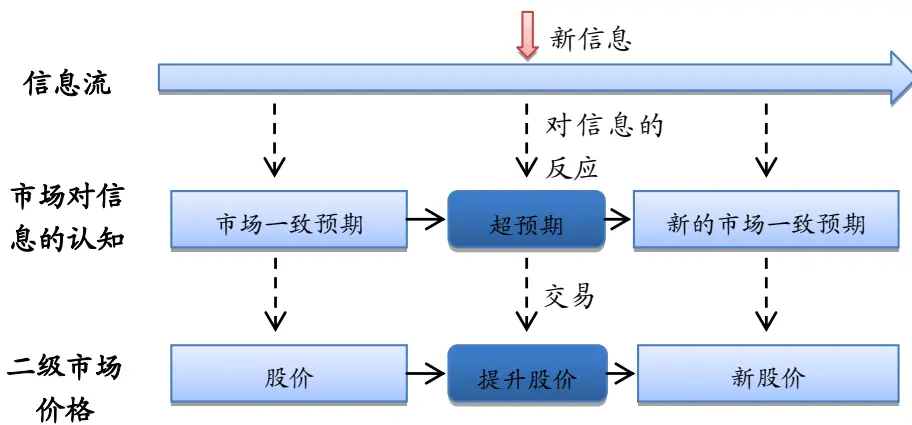
数据来源：国泰君安证券研究

对于业绩预告事件而言，亦是如此。若预告的公司盈余超出市场的一致预期（盈利惊喜 Earning Surprise），则存在正向的超额收益，若低于市场预期，则存在负向超额收益。此现象被称为是盈余漂移（PEAD），自

Ball & Brown（1968）发现此现象后，国内外众多学者对此进行了研究，一方面在多国证券市场验证了该现象的存在，另一方面，试图从 CAPM模型的不完善、滞后的价格反应、投资者对信息的解读能力的差异等角度对盈余漂移现象进行解释。随着行为金融学的发展，也有众多学者从投资者行为角度对此进行解释，例如 DHS 的反应过度与反应不足，Gans的保守主义等等。

我们使用超预期幅度指标进行选股。超预期幅度应该是一个比率，必须明确―谁超过了谁的预期‖。前者定义的是比率的分子部分，后者是分母。分母部分：由于并非所有股票都具有卖方分析师一致预期数据，因此，当分析师一致预期数据不可用时，使用历史盈利情况作为市场预期的替代。也就是，股票关注度较高，分析师预期数据可用时，市场已将分析师预期 Price in；当股票关注度不高，分析师预期数据缺失时，市场 pricein的是最新一期财务报告信息。

分子部分：例如对于年报预告而言，公布的净利润数值中其实已经蕴含了三季报的净利润。而三季报的净利润很有可能已经为市场所 price-in，我们关注的是最近一季的业绩增长，因此，将前三季度的净利润剔除只看最后一季可能更有意义。我们暂且称之为“未公布季度净利润超预期”。

图 2 业绩预告净利润的分解
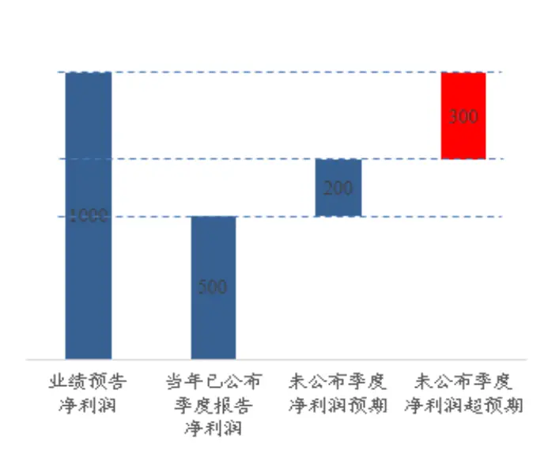
数据来源：国泰君安证券研究

因此，如下图所示，可以定义四种广义的超市场预期指标。

图 3 四种广义的超市场预期指标
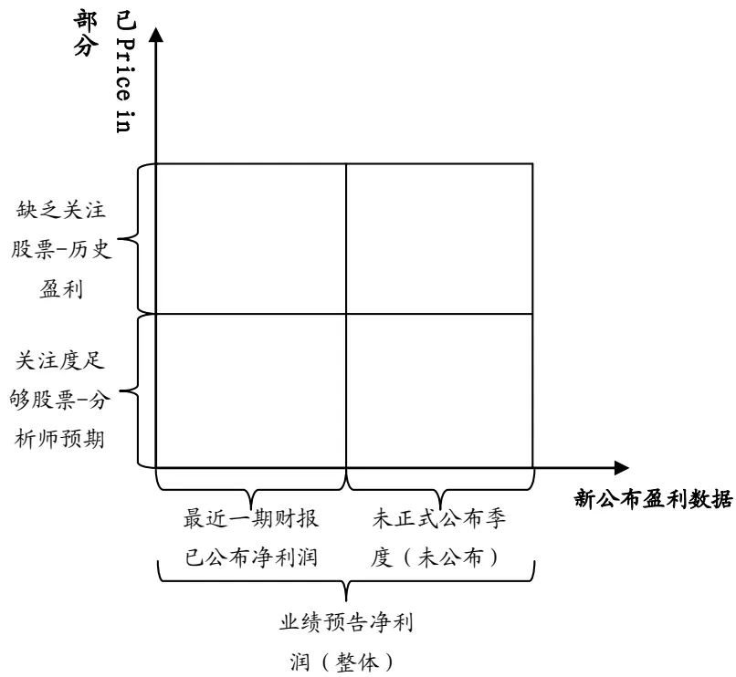
数据来源：国泰君安证券研究

广义超市场预期指标的定义：

广义超市场预期指标 = （新公布盈利数据 – 市场已 Price in部分）/市场已 Price in 部分

新公布盈利数据可以选用两种度量：1. 业绩预告中对于整年度的净利润估计 ； 2. 对于未正式公布季度的估计（整年净利润减去最近一期财报已公布净利润）

已 Price in 部分亦可选择两种度量：1. 分析师覆盖度不够的，选用历史盈利数据；2.分析师覆盖足够的，使用分析师一致盈利预测数据

两两交叉能得到四种指标：

整体增速：（预告净利润 – 去年同期净利润）/ ABS（去年同期净利润）未公布增速： [（预告净利润 – 本年已公布季度净利润）- （去年同期净利润 – 去年已公布同期净利润）] / ABS（去年同期净利润 – 去年已公布同期净利润）

整体超预期幅度：（预告净利润 – 一致预期净利润）/ ABS（一致预期净利润）

未公布超预期幅度：（预告净利润 – 一致预期净利润）/ ABS（一致预期净利润 – 本年已公布季度净利润）

其中前两种已在《业绩预告解析之一：高增长》中测算，本文只对后两

者进行测算。

## 2.3. 数据

## 2.3.1. 业绩预告事件数据的形成

数据质量是量化研究成功与否的第一关，我们在条件允许下尽可能对数据进行清洗优化。

事件数据的清洗：本文中所用的业绩预告数据均来源于 Wind 数据库，其中包含预告日期、预警类型、预告净利润上下限、预告净利润同比增长上下限等栏目，其原始数据均来源于对业绩预告摘要文本的处理。为了增加可用事件样本数量，提高数据可用性，我们对原始业绩预告数据进行了简单的处理，具体为：对于某些只公布净利润增幅百分比上下限，而不公布实际净利润数值的公司，通过去年同期已公布的实际净利润，计算出预告净利润上下限：

预告净利润 = 预告净利润变动幅度*ABS（去年同期公布净利润）+ 去 年同期公布净利润

例如：600830（香溢融通）于 2014/1/21 公布―增长 40%~60%‖，则通过计算，可以得出对应净利润上下限为 1.57~1.79 亿元。反之亦然。

多次预告数据的说明：Wind 终端及底层数据库在处理一家公司多次对同一报告期进行盈利预告时，会对之前的数据进行覆盖。因此，只能提取到最近一次预告数据，这是底层数据的不足。上市公司对之前预告进行修正的过程其实也蕴含了 Alpha 信息，但受制于数据原因，我们不在本文进行考虑。

停牌股票的处理：我们在数据处理过程中，发现有许多涉及重组的上市公司会在重组停牌末期或者重组停牌打开后公布业绩预告，这些股票大多数会有异常的二级市场反应（连续涨停），从而产生极值样本点。连续涨停的超额收益并非来源于盈利事件本身，因此宜将此类重组概念股票剔除。我们使用变通的处理方法，将公告日前 20 日内总计停牌天数大于 5 天的股票剔除出样本空间。

数据时间区间：2009年至 2013年财年的预告数据。

多维度条件变量：为全面解析预告事件，我们归纳总结计算了如下条件变量：所属交易所、所属板块、所属行业、预告类型、预告财报年份、预告财报季度、市值、流通市值、未公布季度数、净利润是否来源于重组、投资、政府补贴、出售资产、股价是否高于年线、60、40、20日均线，乖离率 BIAS（年度、60、40、20 日），相对行业指数乖离率（年度、60、40、20 日），威廉指标（40、20 日），相对行业指数威廉指标（40、20日），事件前 5日日均成交量相比前 20（40、60）日日均成交量是否放量（扣除行业放量比例），事件前 20日内停牌天数等等

## 2.3.2. 卖方分析师一致预期数据的形成

受限于可用卖方分析师报告数据来源，我们使用的是 Wind 数据库中的分析师报告数据，但其对于一致预期数据的计算过于简单（历史 180天中所有分析师盈利预测的平均值），未考虑时间维度的预测有效性衰减，有信息滞后的问题，例如，公司在发布三季报的时候同时对年报进行了预告，简单的 180天平均会导致数据无法及时反应年报预告。另外，也未考虑分析师维度的预测准确性，因此，我们仅使用 Wind 数据库中的分析师报告原始数据，即每篇分析师报告的预测，再通过自己的统计计算以形成一致预期净利润数值。

一致预期数据的计算中，为了稳健性及数据的代表性，一般会在时间维度与券商（分析师）维度进行加权，时间维度的加权是为了赋予最新报告更高权重，以反应最新的公司信息。分析师维度的加权是为了体现券商/分析师的影响力，权重较高的券商/分析师的预测较为靠谱。本文中的一致预期数据加工仅使用时间单维度加权。

一致预期盈利预测的计算方法：首先，考虑到财报发布频率为每季度一次，因此选择最近 60 个交易日的分析师报告进行统计。其次，按照交易日，设臵几何级数衰减权重，距离最新一期报告时间较旧的设臵低权重。几何级数衰减的系数由―半衰期系数‖HL 决定，也即距离最近 HL个交易日的报告，权重为最新报告权重的一半。本文中半衰期系数选择为 15 日。

## 2.3.3. 业绩预告事件样本中的一致预期数据

由于卖方分析师公司研究报告中仅对年度财务数据进行预测，因此，对应于一季报、中报及三季报，没有相应报告期的卖方分析师一致预期数据。

在我们统计的 2009 年至 2013 年共 20819 例事件样本中，有 6902 例年报预告样本，占比 33.15%。又有 5862例有对应的一致预期数据（在事件发生点前 60 交易日内有卖方分析师报告），占 84.93%，没有预期数据的 1040例，占 15.07%，卖方关注度很低的（60日内分析师报告小于3）4472 例，占 64.79%。因此，2009 至 2013 年 5 年内，实际有效的一致预期样本只有 2430例。

图 4 有一致预期数据的事件样本中，一致预期家数的分布（大于 20 家按照 20 家计算）
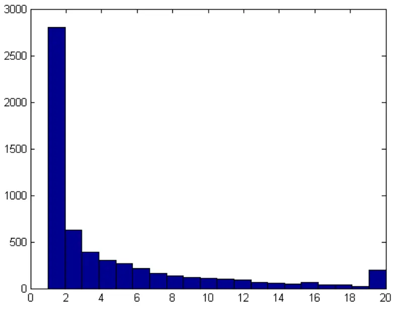
数据来源：Wind，国泰君安证券研究

表 160 日内盈利预测家数对应样本数量及占比

| 60日内盈利预测家数 | 样本数量 | 占比 |
| --- | --- | --- |
| 0 | 1040 | 15.07% |
| 1 | 2805 | 40.64% |
| 2 | 627 | 9.08% |
| 3 | 389 | 5.64% |
| 4 | 307 | 4.45% |
| 5 | 264 | 3.82% |
| 6~10 | 737 | 10.68% |
| 11~19 | 536 | 7.77% |
| >=20 | 197 | 2.85% |
| 总计 | 6902 |  |

数据来源：Wind，国泰君安证券研究

## 2.3.4. 超预期幅度指标的计算

由于业绩预告中一般不会明确给出确定的净利润数值，而是给定净利润的范围或者净利润增幅的范围。因此，我们还需要对区间数据进行处理。

1. 在增速指标的处理时，分别计算净利润上限增速与净利润下限增速，

若上限与下限皆为正，则取上限作为净利润增速；

若上限与下限皆为负，则取下限；

若上限为正，下限为负，则取下限；

若上限、下限有一缺失（如公布―增速大于 100%‖），则取非缺失一方。

2. 在处理超预期幅度指标时，令预期净利润为 X，预告净利润下限为 a，上限为 b，则

X<a 时，超预期幅度为(a-X)/ABS(X)；

X>b 时，超预期幅度为(b-X)/ABS(X)；

A<=X<=b 时，超预期幅度为 0.

## 2.4.条件变量之一：整体超预期幅度

在 5614 个有超预期数据的业绩预告样本中，整体超预期幅度指标的分布如下图所示：

图 5 整体超预期幅度分布（小于-2记为-2，大于 2记为 2）
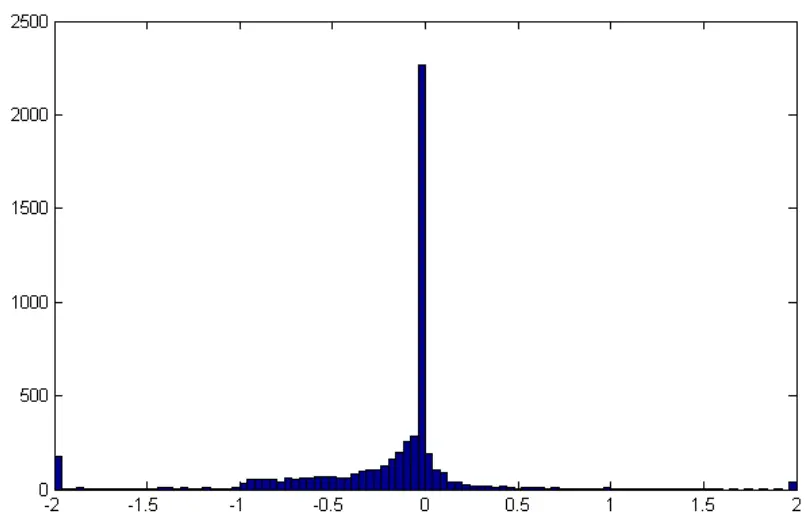
数据来源：Wind，国泰君安证券研究

可以看到约有 2300 个左右的样本超预期幅度为 0 附近，并且超预期幅度小于等于 0的占 86.37%。该指标分布明显左偏，说明分析师对于盈利的预期普遍比较乐观，实际业绩很大可能会低于预期。另外，5 年内只有 765 个样本的超预期幅度大于 0。

图 6 整体超预期幅度分档 CAAR（相对行业超额收益）
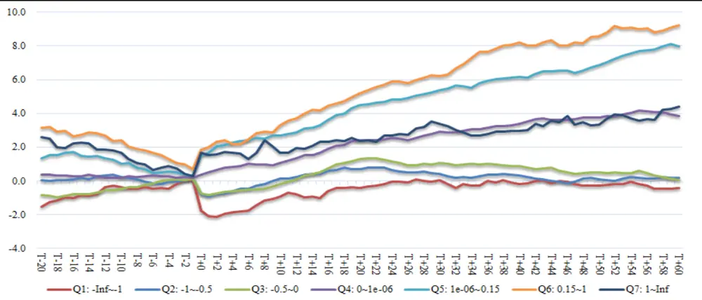

数据来源：Wind，国泰君安证券研究

图 7 整体超预期幅度为 0.15~1股票的 AAR 与 CAAR 胜率
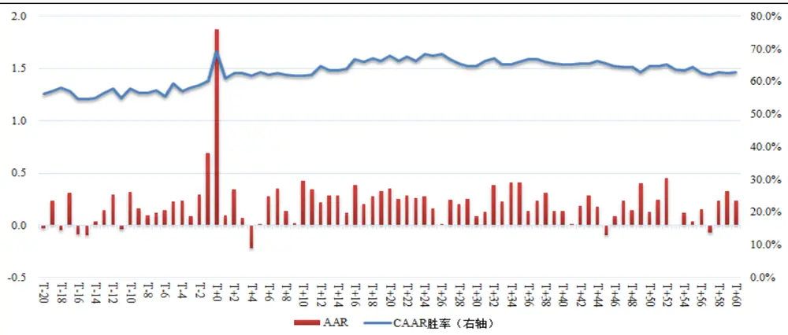
数据来源：Wind，国泰君安证券研究

表 2 每档 CAAR（相对于行业收益率）

| 条件变量 分档 | 样本 数 | T-20 | T-10 | T-5 | T-1 | T+0 | T+1 | T+2 | T+5 | T+10 | T+20 | T+40 | T+60 |
| --- | --- | --- | --- | --- | --- | --- | --- | --- | --- | --- | --- | --- | --- |
| Q1: -Inf~-1 | 309 | -1.51 | -0.35 | -0.42 | 0.03 | -1.77 | -2.07 | -2.14 | -1.80 | -0.94 | -0.39 | -0.18 | -0.41 |
| Q2: -1~-0.5 | 699 | 0.06 | 0.26 | -0.19 | 0.14 | -0.80 | -0.94 | -0.77 | -0.48 | 0.13 | 0.71 | 0.33 | 0.18 |
| Q3: -0.5~0 | 1985 | -0.81 | -0.45 | 0.00 | 0.14 | -0.72 | -0.81 | -0.73 | -0.56 | -0.19 | 1.29 | 0.86 | 0.06 |
| Q4: 0 | 1856 | 0.37 | 0.20 | 0.26 | 0.17 | 0.36 | 0.50 | 0.67 | 0.90 | 1.07 | 2.41 | 3.38 | 3.86 |
| Q5: 0~0.15 | 422 | 1.34 | 1.03 | 0.53 | 0.32 | 1.54 | 1.67 | 2.06 | 2.36 | 2.70 | 4.49 | 6.15 | 7.97 |
| Q6: 0.15~1 | 253 | 3.13 | 2.41 | 1.51 | 0.68 | 1.87 | 2.02 | 2.32 | 2.19 | 3.28 | 5.21 | 8.20 | 9.24 |
| Q7: 1~Inf | 90 | 2.60 | 1.66 | 0.81 | 0.28 | 1.65 | 1.52 | 1.56 | 1.65 | 1.66 | 2.37 | 2.99 | 4.42 |

数据来源：Wind，国泰君安证券研究

表 3 每档 CAAR P 值

| 条件变量 分档 | 样本 数 | T-20 | T-10 | T-5 | T-1 | T+0 | T+1 | T+2 | T+5 | T+10 | T+20 | T+40 | T+60 |
| --- | --- | --- | --- | --- | --- | --- | --- | --- | --- | --- | --- | --- | --- |
| Q1: -Inf~-1 | 309 | 0.998 | 0.802 | 0.941 | 0.385 | 1.000 | 1.000 | 1.000 | 1.000 | 0.986 | 0.784 | 0.602 | 0.680 |
| Q2: -1~-0.5 | 699 | 0.443 | 0.172 | 0.835 | 0.041 | 1.000 | 1.000 | 1.000 | 0.990 | 0.314 | 0.013 | 0.227 | 0.372 |
| Q3: -0.5~0 | 1985 | 0.999 | 0.996 | 0.509 | 0.005 | 1.000 | 1.000 | 1.000 | 1.000 | 0.887 | 0.000 | 0.001 | 0.430 |
| Q4: 0 | 1856 | 0.066 | 0.113 | 0.011 | 0.001 | 0.000 | 0.000 | 0.000 | 0.000 | 0.000 | 0.000 | 0.000 | 0.000 |
| Q5: 0~0.15 | 422 | 0.012 | 0.005 | 0.021 | 0.001 | 0.000 | 0.000 | 0.000 | 0.000 | 0.000 | 0.000 | 0.000 | 0.000 |
| Q6: 0.15~1 | 253 | 0.000 | 0.000 | 0.000 | 0.000 | 0.000 | 0.000 | 0.000 | 0.000 | 0.000 | 0.000 | 0.000 | 0.000 |
| Q7: 1~Inf | 90 | 0.019 | 0.016 | 0.082 | 0.108 | 0.000 | 0.002 | 0.008 | 0.016 | 0.027 | 0.015 | 0.028 | 0.003 |

数据来源：Wind，国泰君安证券研究

表 4 每档 CAAR 胜率

| 条件变量 | 样 | T-20 | T-10 | T-5 | T-1 | T+0 | T+1 | T+2 | T+5 | T+10 | T+20 | T+40 | T+60 |
| --- | --- | --- | --- | --- | --- | --- | --- | --- | --- | --- | --- | --- | --- |

| 分档 本数 |  |  |  |  |  |
| --- | --- | --- | --- | --- | --- |
| Q1: -Inf~-1 309 33.7% 42.7% 38.8% 45.6% 21.7% |  | 21.4% 23.6% |  | 27.5% 33.7% 39.2% 41.1% 38.8% |  |
| Q2: -1~-0.5 699 41.2% 45.4% 43.6% 49.1% 35.8% 34.9%38.1%41.8%43.8% 49.2% 44.9% 44.3% |  |  |  |  |  |
| Q3: -0.5~0 1985 42.3% 44.6% 46.8% 48.7% 39.9% 38.2%39.4%42.4% 43.3% 50.5% 46.9% 42.8% |  |  |  |  |  |
| Q4: 0 185647.1% 49.2% 49.0% 50.5% 51.8% 51.6%52.7%52.6%50.6% 56.1% 55.5% 53.7% |  |  |  |  |  |
| Q5: 0~0.15 422 49.1% 48.3% 48.8% 55.9% 69.9% 63.7% 64.5% 61.4% 59.5% 62.6% 63.5% 63.7% |  |  |  |  |  |
| Q6: 0.15~1 253 56.1% 57.7% 59.3% 60.1% 69.2% 60.9%62.5% 62.8% 61.7% 68.0% 65.2% 62.8% |  |  |  |  |  |
| Q7: 1~Inf 90 47.8% 50.0% 46.7% 53.3% | 63.3% | 57.8% | 55.6% | 53.3% | 51.1% 51.1% 50.0% 53.3% |

数据来源：Wind，国泰君安证券研究

类似于因子模型中计算因子值与未来一期收益率的相关系数——信息系数 IC，事件研究也能计算条件变量与累积平均异常收益（行业 CAAR）的 IC，条件变量与每日平均异常收益（AAR）的 IC等，以衡量超预期幅度这个条件变量中蕴含了多少能够驱动事件日后超额收益的有效信息，IC越高，选股时成功率就越高。

图 8 整体超预期幅度指标的 AAR Spearman IC 与 CAAR Spearman IC
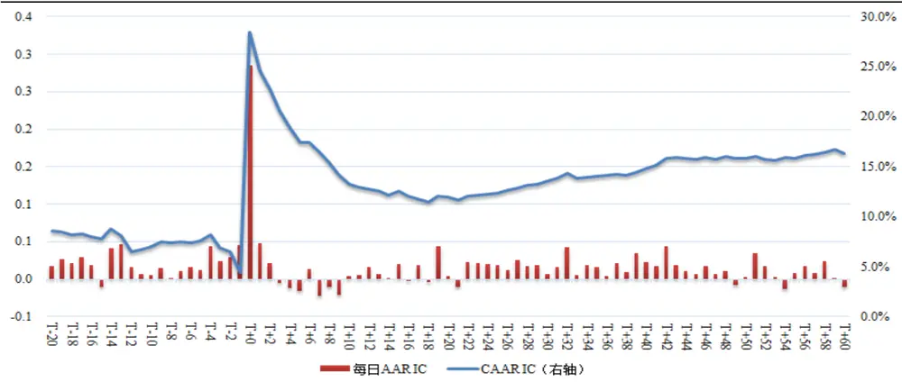
数据来源：Wind，国泰君安证券研究

根据测算结果，有如下结论：

1. 整体超预期幅度指标能够较好地区分业绩预告样本在事件日后的Alpha（相对行业收益率）大小。超预期 15%~100%的股票平均超额收益率最高，0~15%的股票次之，低于预期 100%的股票 CAAR 最低。其中(100%, Inf)档股票CAAR不如(15%,100%)是因为该档中有一些异常数据，且样本数量较少。

2. 对于预告盈利超过一致预期的股票（Q5,Q6档）表现出显著的盈余漂移现象，具体表现为该档股票在事件发生后 60 日内具有明显的正向超额收益，说明超预期事件在大概率上会持续推动股价上涨。

3. 对于预告业绩不达预期的股票（Q1,Q2,Q3 档），其 CAAR 的走势明显与业绩超预期组不同，在事件发生后 2 个交易日内有明显的负 Alpha，但在 T+2日后 Alpha不会继续下跌，反而是调头向上。表明对于业绩低于预期的股票，投资者会在短期内过度反应，并在之后进行修正。

4. 无论是超预期还是不达预期，股价在 T+0 日对事件的反应最为强烈。从上图中即可看到，T+0 日，指标的事件 IC 值能够达到 28.46%，但随后即快速衰减，在 T+20 日为 11.92%，随后又缓慢上升至 T+60 日16.27%。即使是以 20日作为持有周期，11.92%的 IC值已经是大幅高于很多因子模型中的因子，这也是事件套利能够产生较高收益的数据证明。只要解决事件套利在实际投资过程中的持股时间长度与组合定期再平衡周期的错配问题，将事件作为解释股票非特质收益的因素之一，并且辅以风险模型控制风险，势必使得组合能够产生更高更稳定的Alpha，这个问题我们将在后续报告中解答。

5. 从(15%,100%)档的收益胜率来看，60 日后战胜行业指数的概率大概在 62.8%左右；但事实上，我们也测算了战胜沪深 300的概率，该档股票在 60日后战胜沪深 300指数的概率为 73.91%。略高于我们对该指标的胜率预期。

## 2.5.条件变量之二：未公布超预期幅度

图 9 未公布超预期幅度分布（小于-2记为-2，大于 2记为 2）
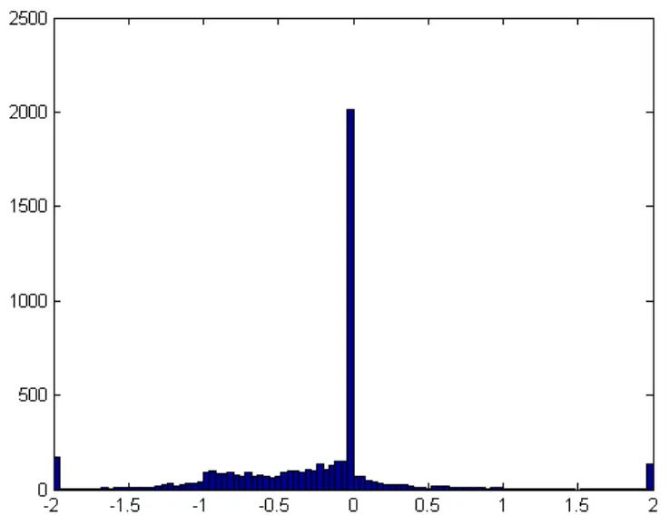
数据来源：Wind，国泰君安证券研究

2993 个样本未公布超预期幅度小于 0,1856 个为 0，只有 255个样本具有未公布季度超预期。

图 10 未公布超预期幅度分档 CAAR（相对行业超额收益）
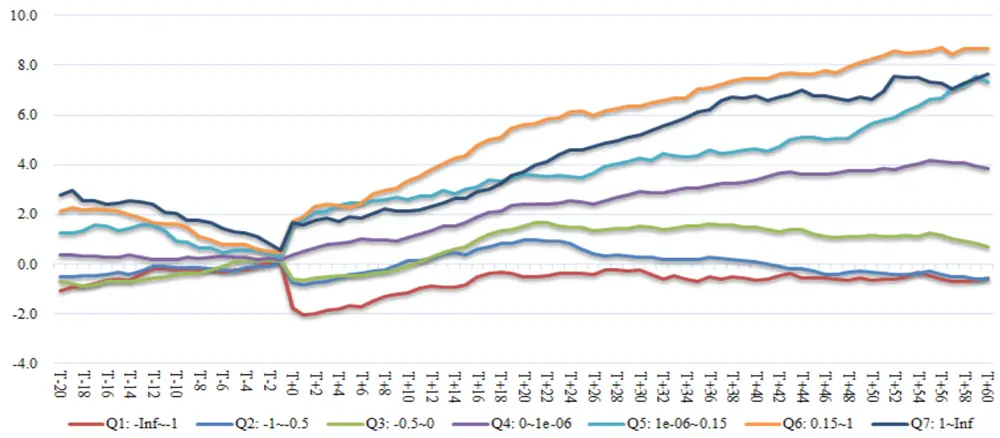
数据来源：Wind，国泰君安证券研究

图 11 未公告超预期幅度为 0.15~1 股票的 AAR与 CAAR胜率
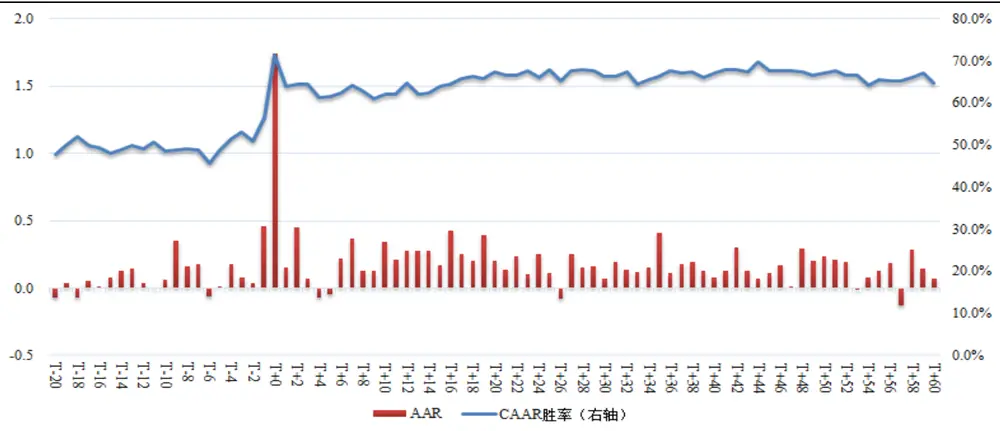
数据来源：Wind，国泰君安证券研究

表 5 每档 CAAR（相对于行业收益率）

| 条件变量 分档 | 样本 数 | T-20 | T-10 | T-5 | T-1 | T+0 | T+1 | T+2 | T+5 | T+10 | T+20 | T+40 | T+60 |
| --- | --- | --- | --- | --- | --- | --- | --- | --- | --- | --- | --- | --- | --- |
| Q1: -Inf~-1 | 539 | -1.06 | -0.25 | -0.24 | 0.10 | -1.74 | -2.03 | -2.01 | -1.67 | -1.17 | -0.49 | -0.63 | -0.57 |
| Q2: -1~-0.5 | 1014 | -0.50 | -0.12 | -0.28 | 0.11 | -0.76 | -0.85 | -0.73 | -0.40 | 0.14 | 0.98 | 0.09 | -0.58 |
| Q3: -0.5~0 | 1440 | -0.67 | -0.39 | 0.10 | 0.16 | -0.58 | -0.66 | -0.57 | -0.48 | -0.07 | 1.53 | 1.49 | 0.71 |
| Q4: 0 | 1856 | 0.37 | 0.20 | 0.26 | 0.17 | 0.36 | 0.50 | 0.67 | 0.90 | 1.07 | 2.41 | 3.38 | 3.86 |
| Q5: 0~0.15 | 215 | 1.25 | 0.93 | 0.57 | 0.30 | 1.57 | 1.78 | 2.07 | 2.48 | 2.58 | 3.63 | 4.64 | 7.32 |
| Q6: 0.15~1 | 318 | 2.14 | 1.62 | 0.81 | 0.45 | 1.73 | 1.91 | 2.34 | 2.28 | 3.36 | 5.61 | 7.44 | 8.66 |
| Q7: 1~Inf | 232 | 2.77 | 2.06 | 1.28 | 0.54 | 1.66 | 1.56 | 1.76 | 1.90 | 2.14 | 3.73 | 6.77 | 7.63 |

数据来源：Wind，国泰君安证券研究

表 6 每档 CAAR P 值

| 条件变量 分档 | 样本 数 | T-20 | T-10 | T-5 | T-1 | T+0 | T+1 | T+2 | T+5 | T+10 | T+20 | T+40 | T+60 |
| --- | --- | --- | --- | --- | --- | --- | --- | --- | --- | --- | --- | --- | --- |
| Q1: -Inf~-1 | 539 | 0.998 | 0.825 | 0.909 | 0.119 | 1.000 | 1.000 | 1.000 | 1.000 | 1.000 | 0.912 | 0.889 | 0.791 |
| Q2: -1~-0.5 | 1014 | 0.918 | 0.684 | 0.952 | 0.065 | 1.000 | 1.000 | 1.000 | 0.987 | 0.275 | 0.000 | 0.403 | 0.901 |
| Q3: -0.5~0 | 1440 | 0.986 | 0.977 | 0.242 | 0.008 | 1.000 | 1.000 | 1.000 | 0.999 | 0.639 | 0.000 | 0.000 | 0.045 |
| Q4: 0 | 1856 | 0.066 | 0.113 | 0.011 | 0.001 | 0.000 | 0.000 | 0.000 | 0.000 | 0.000 | 0.000 | 0.000 | 0.000 |
| Q5: 0~0.15 | 215 | 0.049 | 0.031 | 0.044 | 0.021 | 0.000 | 0.000 | 0.000 | 0.000 | 0.000 | 0.000 | 0.000 | 0.000 |
| Q6: 0.15~1 | 318 | 0.002 | 0.001 | 0.005 | 0.001 | 0.000 | 0.000 | 0.000 | 0.000 | 0.000 | 0.000 | 0.000 | 0.000 |
| Q7: 1~Inf | 232 | 0.000 | 0.000 | 0.000 | 0.000 | 0.000 | 0.000 | 0.000 | 0.000 | 0.000 | 0.000 | 0.000 | 0.000 |

数据来源：Wind，国泰君安证券研究

表 7 每档 CAAR 胜率

| 条件变量 分档 | 样 本 数 | T-20 | T-10 | T-5 | T-1 | T+0 | T+1 | T+2 | T+5 | T+10 | T+20 | T+40 | T+60 |
| --- | --- | --- | --- | --- | --- | --- | --- | --- | --- | --- | --- | --- | --- |
| Q1: -Inf~-1 | 539 | 38.8% | 44.5% | 44.5% | 48.6% | 21.5% | 21.3% | 25.6% | 29.1% | 34.0% | 39.7% | 38.2% | 39.0% |
| Q2: -1~-0.5 | 1014 | 40.1% | 43.2% | 42.2% | 48.2% | 39.0% | 37.5% | 38.8% | 44.0% | 45.1% | 50.4% | 45.1% | 42.1% |
| Q3: -0.5~0 | 1440 | 42.7% | 45.6% | 47.6% | 48.6% | 41.6% | 39.9% | 41.0% | 42.8% | 43.7% | 51.5% | 49.2% | 44.6% |
| Q4: 0 | 1856 | 47.1% | 49.2% | 49.0% | 50.5% | 51.8% | 51.6% | 52.7% | 52.6% | 50.6% | 56.1% | 55.5% | 53.7% |
| Q5: 0~0.15 | 215 | 51.2% | 50.2% | 52.1% | 56.7% | 70.2% | 66.0% | 63.7% | 60.9% | 60.0% | 59.1% | 60.9% | 61.9% |
| Q6: 0.15~1 | 318 | 47.8% | 48.4% | 48.7% | 56.6% | 71.4% | 63.8% | 64.5% | 61.6% | 61.9% | 67.3% | 67.0% | 64.8% |
| Q7: 1~Inf | 232 | 56.0% | 57.3% | 56.5% | 57.8% | 64.2% | 56.0% | 59.5% | 59.9% | 54.7% | 60.8% | 57.8% | 59.1% |

数据来源：Wind，国泰君安证券研究

图 12 未公告超预期幅度指标的 AAR IC 与 CAAR IC
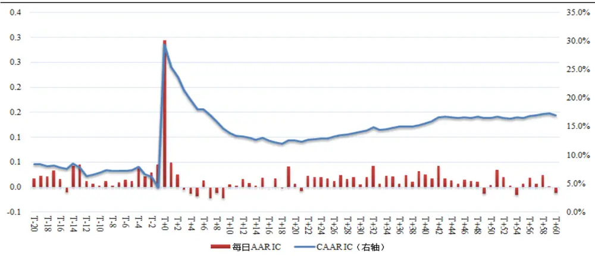
数据来源：Wind，国泰君安证券研究

相比整体超预期指标，该指标的效果在某些方面有小幅提升：例如CAAR 曲线更为平滑，累计收益更稳定，胜率、CAAR IC 均有小幅提高。

之所以效果不够明显，是因为这两个指标在计算时，分子部分相同，所不同的是整体超预期指标的分母部分为整年的预期数据，而未公布超预期指标的分母部分为整年净利润预期扣除已公布的三季报净利润。因此，在选股时，将未公布超预期指标作为辅助判断指标。

## 3. 业绩预告超预期下的选股策略

## 3.1.基于超预期的业绩预告选股策略

基于上文的分析，设定如下选股标准：

（1） 事件日前 20 日停牌天数小于等于 5 天的

（2） 预告类型为略增、扭亏、续盈、预增的

（3） 有卖方分析师一致预期数据的

（4） 整体超预期幅度范围在 10%至 100%

（5） 未公布超预期幅度大于 0

（6） 整体净利润增速大于 0

（7） 未公布净利润增速大于 0

（8） 剔除净利润增长原因为非主营业务收入增长的样本：剔除重组、投资收益、政府补贴、出售资产等造成的净利润增长

经过上述条件筛选后，共留下 150只样本。

图 13 筛选后样本 CAAR（相对行业指数）
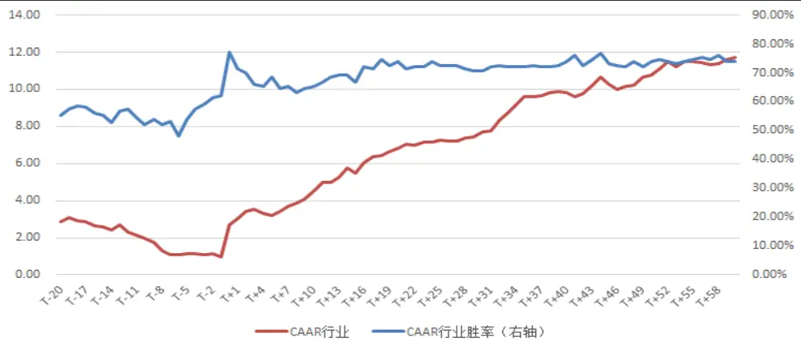
数据来源：Wind，国泰君安证券研究

表 8 选股指标

|  | T-20 | T-10 | T-5 | T-1 | T+0 | T+1 | T+2 | T+5 | T+10 | T+20 | T+40 | T+60 |
| --- | --- | --- | --- | --- | --- | --- | --- | --- | --- | --- | --- | --- |
| CAAR | 2.89 | 1.98 | 1.11 | 0.94 | 2.69 | 3.04 | 3.42 | 3.20 | 4.52 | 6.83 | 9.82 | 11.71 |
| P值 | 0.3% | 0.4% | 1.4% | 0.0% | 0.0% | 0.0% | 0.0% | 0.0% | 0.0% | 0.0% | 0.0% | 0.0% |
| CAAR 胜率 | 55.3% | 52.0% | 54.0% | 62.0% | 77.3% | 71.3% | 70.0% | 68.7% | 65.3% | 74.0% | 74.0% | 74.0% |

数据来源：Wind，国泰君安证券研究

所选股票在 60日内获得了 11.71%的相对行业超额收益，且胜率为 74%

## 3.2.利用技术指标优选信号之初探

技术指标能够通过对事件窗口附近股票二级市场走势的分析，甄别股票的股性，对于活跃度较差、低于均线的股票，即使有较好的超预期，也比较难在事件后保证持续的上涨。

我们考虑如下几个技术指标：乖离率 BIAS（年度、60、40、20 日），相对行业指数乖离率（年度、60、40、20 日），威廉指标（40、20日），相对行业指数威廉指标（40、20日），事件前 5日日均成交量相比前 20（40、60）日日均成交量是否放量（扣除行业放量比例）对业绩超预期的信号进行优选。

所用的事件样本股票池为 2009~2013 年财年，且事件前 20 个交易日内停牌天数小于等于 5 天的股票。首先，计算上述技术指标与事件样本T+10日相对行业指数的累积平均异常收益 CAAR的 IC。

表 9 技术指标的 10 日 CAAR IC

| 技术指标 T+10 CAAR IC |  |
| --- | --- |
| 年 BIAS 1.70% |  |
| 60BIAS 4.78% |  |
| 40BIAS 6.91% |  |
| 20BIAS 17.40% |  |
| 年 BIAS-相对行业 BIAS 4.58% |  |
| 60BIAS-相对行业 BIAS 5.78% |  |
| 40BIAS-相对行业 BIAS 8.24% |  |
| 20BIAS-相对行业 BIAS 14.50% |  |
| 40日威廉指标 12.12% |  |
| 20日威廉指标 17.49% |  |
| 40日威廉指标-相对 11.02% |  |
| 20日威廉指标-相对 7.26% |  |
| 相比行业放量 5-20 日 -1.20% |  |
| 相比行业放量 5-40 日 | 2.87% |
| 相比行业放量 5-60 日 | 0.14% |

数据来源：国泰君安证券研究，Wind
注：威廉指标为LWR

可以看到，20日的绝对/相对行业的 BIAS与 20日 LWR 均有较高的 IC。事实上，BIAS基于均线，LWR 基于点位，类似的技术指标选取的都是强势股，前期走势强势是股性，业绩预增+业绩超预期是催化剂，三者的结合很大可能上能够持续推动股价快速上涨，这也是基本面信息与技术面信息相结合的魅力。我们分别尝试使用这三个指标优化信号。

图 14 20 日 BIAS 分档 CAAR（相对行业）
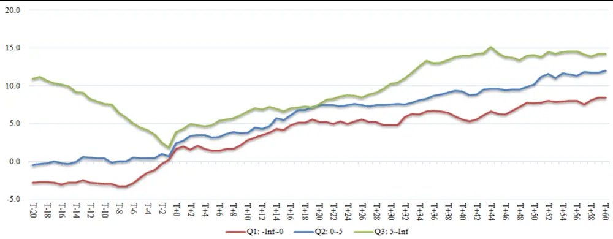
数据来源：国泰君安证券研究，Wind

图 15 20 日 BIAS（扣除行业 BIAS）分档 CAAR（相对行业）
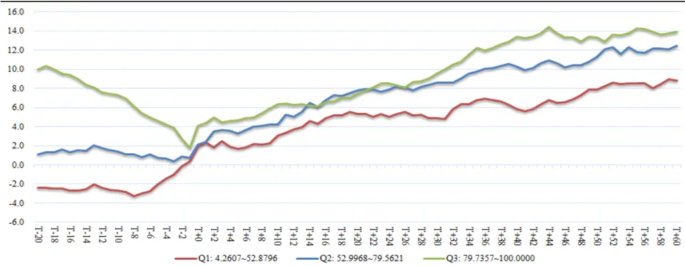
数据来源：国泰君安证券研究，Wind

图 1620 日 LWR分档 CAAR（相对行业）
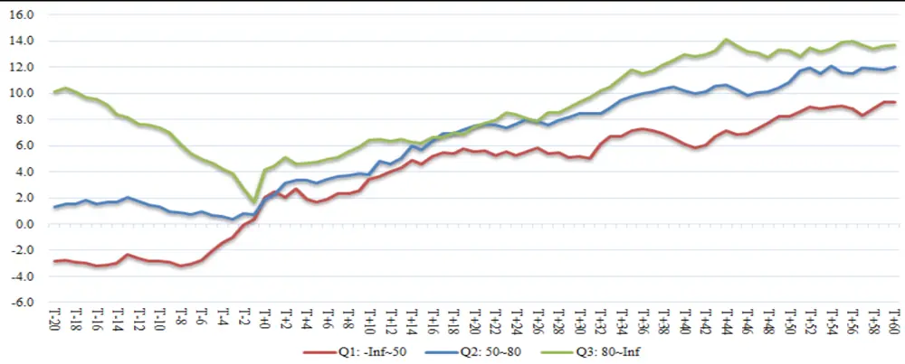
数据来源：国泰君安证券研究，Wind

表 10 技术指标增强收益

|  | 技术指标取值范围 | 样本数 | 60日行业 | 60日市场 | 60日行业 | 60日市场CAAR 胜率 |
| --- | --- | --- | --- | --- | --- | --- |
|  |  |  | CAAR | CAAR | CAAR 胜率 |  |
| 20BIAS | >5 | 50 | 14.20 | 19.58 | 79.63% | 90.74% |
| 20BIAS 相对 | >5 | 50 | 15.95 | 21.17 | 82.00% | 90.00% |
| 20LWR | >80 | 49 | 13.68 | 19.93 | 81.63% | 91.84% |

数据来源：国泰君安证券研究

根据上表，可以看到，用 20 日相对行业 BIAS 增强的选股策略能够获得 60 日相对行业 15.95%，相对市场 21.17%（虽然不具有代表性），胜率分别为 82%与 90%的业绩，相对行业亏损超过 5%的股票有 2 只，最大亏损为-11.78%。虽然样本只数较少（5 年共计 50只），但获利确定性较高，超额收益也较高。

## 4. 后续研究思路

（一）

进一步加工处理一致预期数据。一方面，在分析师维度对预期数据进行权重设臵，提升知名分析师的预测占比；另一方面，当上市公司公布业绩预告、业绩快报或正式报告后，用公布的盈利数据代替分析师报告一致预期盈利预测。

（二）

在研究过程中，我们观察到：尽管我们优化了很多事件的条件变量，以期望能够很好的区分股票的事件后超额收益。但事实上，仍然有30%~40%的股票在事件后呈现了负的超额收益。究竟是什么原因导致了业绩超预期的股票没有很好的表现？在探究过程中，这么一个样本引起了我们的关注：中国国航（600111）在 2011 年 1 月 14 日公布的 2010年年报业绩预告：―净利润为上年的 200%……营业利润实现大幅增长‖。其他各项指标也符合我们的条件：未公布增速 329%，整体超预期49.19%，未公布超预期 55.27%，卖方覆盖度也足够多，盈利预测家数18家。但预告后的二级市场股价却不尽如人意：5日内相比行业指数负向超额收益 10.19%。

答案很简单，但却引人深思。试想一个投资者在进行选股时，不仅仅会关注该公司的基本面、技术面信息，更会将该股票与同行业可比公司相比，投资相对更优的股票，所谓的―矮个中选高个‖。量化因子模型其实做的也是这类事情。这是最基本最简单的投资逻辑。回到我们的案例中，翻看各航空公司在 1 月初的业绩预告不难发现：东方航空在 2011 年 1月 5 日预增 900%，南方航空在 2011 年 1 月 12 日预增 1400%。相比之下，国航是航空公司中―高个中的矮个‖了，负的超额收益也是情理之中。这种归因不一定完全准确，但至少给了我们一个启发：事件研究不只能停留在单个样本分析、统计规律挖掘的层面，还得结合多种因素，利用股票横截面的数据，在可比公司之间进行横向比较。

具体的处理方法，敬请期待后续研究报告。

（三）

股票在事件窗口中的波动会大幅度受到事件的影响，但在远离事件窗口的时点则受到其他因子所影响（事件催化剂导致的预期差已经在股价中体现）。如何将因子模型与事件相结合，利用传统因子在截面挑选优劣股票，稳定收益，利用脉冲式的事件信号抓取短期收益，也是未来研究重点之一。

## 5. 目前预告业绩超预期组合

2014 年以来发布的业绩预告中，根据 3.2节中所定选股规则，筛选出如下股票：

表 112014年以来预告，满足选股条件的（截至 2014/2/12）

| 代码 | 名称 | 预告日期 | 报告期 | 交易所 | 板块 | 行业 | 预告类 型 | 整体增速 | 未公布增 速 | 整体超预 期 | 未公布超 预期 | 20BIAS-相 对 | 截至 2/12 相对行 业收益率 |
| --- | --- | --- | --- | --- | --- | --- | --- | --- | --- | --- | --- | --- | --- |
| 300067 | 安诺其 | 20140107 | 20131231 | 深圳 | 创业板 | 化工 | 预增 | 120.0% | 177.0% | 23.7% | 19466.1% | 14.60 | 9.54 |
| 600583 | 海油工程 | 20140109 | 20131231 | 上海 | 主板 | 采掘 | 预增 | 220.0% | 257.5% | 35.1% | 103.6% | 9.77 | 19.19 |
| 300063 | 天龙集团 | 20140116 | 20131231 | 深圳 | 创业板 | 化工 | 略增 | 20.0% | 209.0% | 12.2% | 98.8% | 20.59 | 6.01 |
| 000413 | 东旭光电 | 20140117 | 20131231 | 深圳 | 主板 | 电子 | 预增 | 152.3% | 259.5% | 14.1% | 47.1% | 7.16 | 17.07 |
| 002637 | 赞宇科技 | 20140118 | 20131231 | 深圳 | 中小板 | 化工 | 预增 | 794.1% | 469.5% | 28.6% | 56.8% | 5.49 | 10.47 |
| 000829 | 天音控股 | 20140121 | 20131231 | 深圳 | 主板 | 商业贸易 | 扭亏 | 232.7% | 713.9% | 42.9% | 18.4% | 12.09 | 35.73 |
| 002205 | 国统股份 | 20140129 | 20131231 | 深圳 | 中小板 | 建筑建材 | 预增 | 366.5% | 342.4% | 55.2% | 128.5% | 10.47 | 8.25 |
| 600158 | 中体产业 | 20140129 | 20131231 | 上海 | 主板 | 房地产 | 预增 | 75.0% | 56.4% | 24.0% | 85.2% | 20.98 | 16.02 |

数据来源：国泰君安证券研究，Wind

## 本公司具有中国证监会核准的证券投资咨询业务资格

## 分析师声明

作者具有中国证券业协会授予的证券投资咨询执业资格或相当的专业胜任能力，保证报告所采用的数据均来自合规渠道，分析逻辑基于作者的职业理解，本报告清晰准确地反映了作者的研究观点，力求独立、客观和公正，结论不受任何第三方的授意或影响，特此声明。

## 免责声明

本报告仅供国泰君安证券股份有限公司（以下简称―本公司‖）的客户使用。本公司不会因接收人收到本报告而视其为本公司的当然客户。本报告仅在相关法律许可的情况下发放，并仅为提供信息而发放，概不构成任何广告。

本报告的信息来源于已公开的资料，本公司对该等信息的准确性、完整性或可靠性不作任何保证。本报告所载的资料、意见及推测仅反映本公司于发布本报告当日的判断，本报告所指的证券或投资标的的价格、价值及投资收入可升可跌。过往表现不应作为日后的表现依据。在不同时期，本公司可发出与本报告所载资料、意见及推测不一致的报告。本公司不保证本报告所含信息保持在最新状态。同时，本公司对本报告所含信息可在不发出通知的情形下做出修改，投资者应当自行关注相应的更新或修改。

本报告中所指的投资及服务可能不适合个别客户，不构成客户私人咨询建议。在任何情况下，本报告中的信息或所表述的意见均不构成对任何人的投资建议。在任何情况下，本公司、本公司员工或者关联机构不承诺投资者一定获利，不与投资者分享投资收益，也不对任何人因使用本报告中的任何内容所引致的任何损失负任何责任。投资者务必注意，其据此做出的任何投资决策与本公司、本公司员工或者关联机构无关。

本公司利用信息隔离墙控制内部一个或多个领域、部门或关联机构之间的信息流动。因此，投资者应注意，在法律许可的情况下，本公司及其所属关联机构可能会持有报告中提到的公司所发行的证券或期权并进行证券或期权交易，也可能为这些公司提供或者争取提供投资银行、财务顾问或者金融产品等相关服务。在法律许可的情况下，本公司的员工可能担任本报告所提到的公司的董事。

市场有风险，投资需谨慎。投资者不应将本报告为作出投资决策的惟一参考因素，亦不应认为本报告可以取代自己的判断。在决定投资前，如有需要，投资者务必向专业人士咨询并谨慎决策。

本报告版权仅为本公司所有，未经书面许可，任何机构和个人不得以任何形式翻版、复制、发表或引用。如征得本公司同意进行引用、刊发的，需在允许的范围内使用，并注明出处为―国泰君安证券研究‖，且不得对本报告进行任何有悖原意的引用、删节和修改。

若本公司以外的其他机构（以下简称―该机构‖）发送本报告，则由该机构独自为此发送行为负责。通过此途径获得本报告的投资者应自行联系该机构以要求获悉更详细信息或进而交易本报告中提及的证券。本报告不构成本公司向该机构之客户提供的投资建议，本公司、本公司员工或者关联机构亦不为该机构之客户因使用本报告或报告所载内容引起的任何损失承担任何责任。

## 评级说明

## 1.投资建议的比较标准

投资评级分为股票评级和行业评级。

以报告发布后的12个月内的市场表现为比较标准，报告发布日后的12个月内的公司股价（或行业指数）的涨跌幅相对同期的沪深300指数涨跌幅为基准。

## 2.投资建议的评级标准

报告发布日后的 12 个月内的公司股价（或行业指数）的涨跌幅相对同期的沪深300指数的涨跌幅。

|  | 评级 说明 |  |
| --- | --- | --- |
| 股票投资评级 | 增持 | 相对沪深 300指数涨幅 15%以上 |
|  | 谨慎增持 | 相对沪深300指数涨幅介于5%～15%之间 |
|  | 中性 | 相对沪深300指数涨幅介于-5%～5% |
|  | 减持 | 相对沪深300指数下跌5%以上 |
| 行业投资评级 | 增持 | 明显强于沪深 300 指数 |
|  | 中性 | 基本与沪深 300指数持平 |
|  | 减持 | 明显弱于沪深 300指数 |

## 国泰君安证券研究

|  | 上海 | 深圳 | 北京 |
| --- | --- | --- | --- |
| 地址 | 上海市浦东新区银城中路168号上海 银行大厦29层 | 深圳市福田区益田路 6009 号新世界 商务中心34层 | 北京市西城区金融大街 28 号盈泰中 心2号楼10层 |
| 邮编 | 200120 | 518026 | 100140 |
| 电话 | (021)38676666 | (0755)23976888 | (010)59312799 |
|  | E-mail: gtjaresearch@gtjas.com |  |  |