2014.02.24

# 预期风险下，基于业绩快报的 PEAD投资策略

# ——数量化专题之三十七

刘富兵（分析师）

刘正捷（研究助理）

赵延鸿（研究助理）

8 021-38676673

021-38675860

liufubing008481@gtjas.com

021-38674927

证书编号 S0880511010017

liuzhengjie012509@gtjas.co

S0880112080087

zhaoyanhong@gtjas.com

S0880113070047

## 本报告导读：

在高业绩增长的催化作用下，高预期风险个股会发生 PEAD 异象。我们在该理论基础上构建选股策略，可在 20个交易日获得 4%以上持有期收益，并承受较低波动。摘要：

le_Summary] 策略效果：单纯的 PEAD 策略可在 20 个交易日内可获得约4.6%的区间收益，但极端风险较大。加入 10 日均线卖出策略后，在保证收益的前提下可大幅降低极端风险；2014年截至 2 月 19 日的样本外检验表明策略表现优异，所选个股持续跑赢 ZZ500指数。

- 策略方法：PEAD 策略的选股条件如下：1、卖方覆盖家数少于 4 家；2、业绩快报中收入与利润增速较上年均有较大增长；3、截至快报日上市时间少于 2 年。买入时间为公告日后第二日，持有期为 20 个交易日。如股价连续 3 日低于10 日均线可提前卖出。

策略逻辑：投资者预期风险大小影响其对未来预期的边际变化。预期风险是指投资者对自身内心预期的不确定性。当财务数据出来后，投资者会在各自预期风险的影响下调整对未来的预期。预期风险越大，则其对未来预期的调整幅度越大、调整时间越长，股价漂移越剧烈。

策略风险：市场预期不可言说。预期存在于每个投资人心中，难以用数字、语言表达出来，使得单靠数量化指标，策略始终存在错误估计市场预期的风险。量化研究的主要作用在于从历史样本中验证逻辑正确性和策略可行性，实际投资还需要从交易中感知市场预期。

投资策略逻辑图
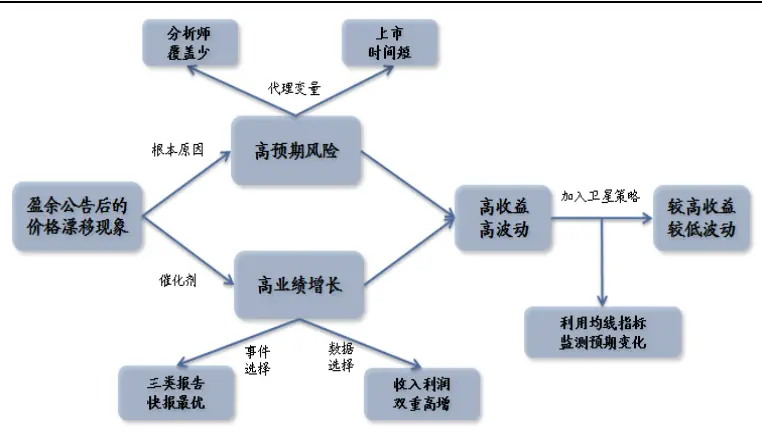
数据来源：国泰君安证券研究

金融工程

## 金融工程团队：

刘富兵：（分析师）

电话：021-38676673

邮箱：liufubing008481@gtjas.com

证书编号：S0880511010017

何苗：（分析师）

电话：010-59312710

邮箱：hemiao@gtjas.com

证书编号：S0880511010049

## 严佳炜：（分析师）

电话：021-38674812

邮箱：yanjiawei008776@gtjas.com

证书编号：S0880512110001

## 耿帅军：（分析师）

电话：010-59312753

邮箱：gengshuaijun@gtjas.com

证书编号：S0880513080013

## 徐康：（分析师）

电话：021-38674939

邮箱：xukang010849@gtjas.com

证书编号：S0880513080018

## 赵延鸿：（研究助理）

电话：021-38674927

邮箱：zhaoyanhong@gtjas.com

证书编号：S0880113070047

## 陈睿：（研究助理）

电话：021-38675861

邮箱：chenrui012896@gtjas.com

证书编号：S0880112120012

## 刘正捷：（研究助理）

电话：021-38675860

邮箱：liuzhengjie012509@gtjas.com

证书编号：S0880112080087

## [Table_R相关报告

《业绩预告解析之二：超预期》2014.02.18《业绩预告解析之一：高增长》2014.02.17《关于择时思考之一:由连续到离散》2014.02.14

《从微观数据中寻找 Alpha 的新来源》2014.02.13

《掘金国企改革》2014.02.12

## 1. 预期风险影响预期差 price in 时间，引发价格漂移1.1.公开信息一定会立刻、充分反映到价格之上吗？

PEAD（盈余公告后的价格漂移）是一种典型的投资异象，指的是在盈利公告后，“好消息”公司股票累积超额收益会持续上扬，“坏消息”公司股票累积超额收益会持续向下。因此如果在信息披露后采用惯性投资策略，就能获得可观的超额收益。关于 PEAD的研究，可参考 Ball andBrown（1968）、Bernard and Thomas（1989）等经典文献。PEAD 异象的发现极大挑战了有效市场理论。按照有效市场理论，当信息完全公开后，市场会立刻反应，使股价迅速调整到位，因此事后买入股票是无法获取超额收益的。显然价格漂移现象与该理论的推理结果相悖。

对于产生 PEAD的原因，理论界解释有“风险溢价”观和“滞后反应”观，后者更具解释力。有效市场理论的支持者们更支持“风险溢价”观，认为所谓的超额收益没有经过风险调整，如利用 CAPM模型进行调整，超额收益将消失；行为金融学阵营的学者们更支持“滞后反应”观，则认为价格对应于信息的反应是滞后的，随着时间的推移，价格将逐渐反应出信息的价值内涵。今年的学术研究成果比较并验证两种观点后，更多地认为信息“滞后反应”是产生 PEAD的主要原因。

图 1 “滞后反应” VS. “有效市场”
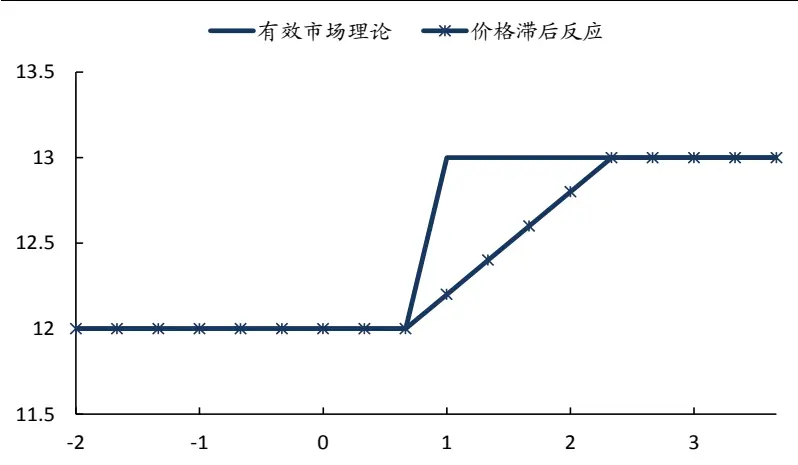
数据来源：国泰君安证券研究

## 1.2.预期风险的存在下，预期差催化 PEAD现象

股价由市场对未来的预期所决定。当财务报告发出后，实际利润增速大于此前市场对它的预期，股价会涨吗？不会。DDM模型告诉我们，股价是由市场对未来的预期所决定。当企业的实际利润增速出来后就成了历史信息，市场过去对该利润的预期是多少，实际利润相对于过去预期的增幅又是多少，对股价边际变化没有影响。

预期风险影响投资者未来预期的变化。我们将预期风险定义为每个投资者对自身内心预期的不确定性。举个例子，一只股票未来三年的EPS，每个投资者心里都会有一个预期，同时，每个投资者对自己心中那个预期EPS的把握也不尽相同。有的投资者把握很大（即预期风险小），不容易因为外部事件的冲击改变自己的判断；有的投资者把握很小（即预期风险大），那么稍有风声鹤唳，就会草木皆兵。

图2 预期风险对股价变化有重要影响
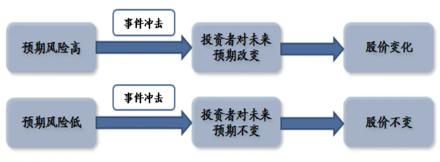
数据来源：国泰君安证券研究

讲到这里，我们再来回顾PEAD就比较容易理解了。当公司实际利润增速数据出来后，投资者会在各自预期风险的影响下调整对未来的预期。预期风险越大，则调整的幅度越大，调整需要的时间越长。如果大家的预期风险都很小，那么即使公告数据大幅超出此前大家对这个数据的预期，股价也难以出现PEAD现象。近几年银行的财务报表非常漂亮，利润一次次超出市场预期，但股价在公告后却没有出现上涨，就是因为大家很坚定对未来银行股的看法，不受公告的影响。

总之，业绩超预期只是催化剂，预期风险的存在才是股价在业绩发布后产生变化的原因。沿着这条思路，我们接下来需要分别寻找合适的催化剂事件，以及能够衡量预期风险的代理变量。

## 2. 快报兼具时效性与可靠性，催化事件的最佳选择

PEAD 的催化剂事件是公司业绩披露报告，在 A股市场业绩公告分为三类，分别是业绩预告、业绩快报和定期报告。除了定期报告必须披露，其他两类报告是符合某些条件的上市公司才需要强制披露的。以年度业绩公告为例：

- 业绩预告的优点在于发布时间早，时效性最强；但可靠性最差，数据量最小；

- 业绩快报的优点在于发布时间早，属于未经审计的财务数据，因此数据更翔实，确定性更高；

- 定期报告的优点在于是经审计的、正式的财务报告，可靠性最高；但时效性最差。

表 1 三类业绩公告特点不尽相同，业绩快报的时效性与可靠性较佳

| 公告类型 | 披露要求 | 披露内容 | 时效性 | 数据可靠性 |
| --- | --- | --- | --- | --- |
| 业绩预告 | 有条件强制披露 | 围绕净利润制定的定性指标 | 高 | 低 |
|  | 主板和中小企业板，对亏损、 | 预警类型、预告净利润上下 | 具体披露时间未知 | 只有净利润一个指 |
|  | 扭亏为盈或业绩大幅波动的 公司，要求必须发布业绩预 | 限、预告净利润同比增长上下 | 当公司需要同时公布 | 标，且属于范围数 |
|  | 告；对创业板公司的要求则更 | 限 | 业绩预报和快报时， 一般先公布预报，再 | 据；可能公告一次后 出现二次修正；后期 |
| 业绩快报 | 加严格。 |  | 公布快报。 | 报告可能变脸 |
|  | 有条件强制披露 | 关键指标有收入、利润和资产较高 |  | 较高 |
|  | 对于主板，鼓励拟于3月、4 | 回报率 | 具体披露时间未知 | 除了现金流情况，其 |
|  | 月公布年报的公司提前披露 | 本年与上年同期主营业务收 |  | 他主要指标均已覆 |
| 定期报告 | 业绩快报；对于中小板和创业入、主营业务利润、利润总额、 |  | 盖；基本没有修正情 |  |
|  | 板则是强制要求。 | 净利润、每股收益、每股净资 | 况发生；变脸可能性 |  |
|  |  | 产和净资产收益率等。 | 非常低。 |  |
|  | 强制披露 极其详细 | 低 | 高 |  |
|  | 三大表、财务报表附注、管理披露时间较为确定 |  |  |  |
|  | 层声明等 |  |  |  |

数据来源：国泰君安证券研究

由于PEAD策略对数据的可靠性、丰富性和及时性要求都有一定的要求，因此相对来说利用业绩快报作为事件催化剂最为合适。

## 3. 寻找预期风险较高的股票

从信息传导层面寻找预期风险代理变量。找到催化剂事件，接下来需要寻找预期风险。预期风险难以直接描述，只能去寻找能够刻画预期风险的代理变量。我们认为影响投资者预期风险的主要因素就是信息，包括信息透明程度、传导速度以及投资者注意力等。

## 3.1.假设 1：卖方分析师覆盖较少的股票，投资者预期风险高

卖方分析师研究与服务双重作用使得其成为投资者预期形成的重要因素。卖方分析师一方面利用自己的专业性对上市公司未来业绩做出预测，作为机构投资者的参考，另一方面组织调研，帮助投资者更近的了解公司。当上市公司覆盖分析师人数较少时，上市公司的透明度、信息解读深度、传导速度都会受到较大影响，从而阻碍投资者预期的形成，投资者只能根据一些外部信息以及公司过去的历史数据做出判断，预期不确定性较大。实证中，我们将公告前 180 日内覆盖家数少于 4家券商的股票视为卖方分析师覆盖较少。

## 3.2.假设 2：上市时间较短的股票，投资者预期风险高

无论是公司还是股性，投资人都需要一段时间去熟悉。对于上市时间较短的公司，无论是卖方分析师还是投资者，无论是量化分析还是基本面分析，都缺乏足够的历史信息对公司未来做出比较确定的判断。因此相较于上市时间较长的公司，理论上其投资者预期风险更高。实证中，我们以截至快报日上市时间少于等于 2年作为上市时间较短的标准。

## 3.3.催化剂：收入、利润双双高增长

基于样本的筛选条件，我们用上一年度公司的业绩作为市场一致预期期望的参考值。由于我们所选择的公司覆盖分析师较少，上市时间也比较短，因此无法用卖方分析师预期数据作为市场一致预期的代理变量。大量学术研究也表明在 PEAD策略中，利用卖方分析师预测数据和利用上市公司历史业绩作市场预期基准并无优劣之分。

利用业绩快报作为催化剂事件使得我们可以用多个指标作预期基准。业绩快报公布的一系列指标中，关键指标有三个，分别是收入、归属母公司净利润和资本回报率。我们选择其中最容易纵向比较的收入、归属母公司净利润作为比较基准。

资本回报率也是一个极为重要的指标，并且快报信息足以让我们对 ROE进行杜邦分解从而衍生出更多的财务指标，这里暂不考虑，未来可将资本回报率纳入考虑基准中。

## 3.4.实证检验：高预期风险 + 高预期差 = 高 PEAD收益

## 3.4.1. 样本选择：近三年，年度业绩快报，收入利润高增长

基于上述逻辑和分析，我们的样本选择标准依次如下：

- 总样本池：近三年（2011、2012、2013）公布年度业绩快报的上市公司（剔除 ST 类公司）；

- 事件选择条件：收入、归属母公司净利润相对于上一年度具有较高增速；

- 预期风险条件 1：公告前 180日内卖方覆盖家数少于 4家；

- 预期风险条件 2：截至快报日上市时间少于等于 2年。

## 3.4.2. 控制变量思路下，以备选股票池作为业绩比较基准

实证目的在于找出事件发生时，筛选条件对策略的影响，因此从研究的角度，利用样本池作为业绩基准更加合理。例如，如果我们想知道业绩增速对收益的影响，就应该以所有公布业绩快报、并且风险条件相同的股票为股票池；如果我们想知道预期风险对收益的影响，就应该以所有公布业绩快报、并处于相同业绩增速范围的股票作为股票池。

当然传统上，超额收益指的是经风险调整后的收益，一般利用 CAPM或者三因素模型进行调整。这种做法在本质上是为了防止样本系统性风险或者风格偏向对我们的结果产生误导，因此我们也可以通过分组的做法对这些因素进行检验。

## 3.4.3. 采取公告后第 2日买入并持有的投资策略

我们的策略是：在公告日后第 2日以开盘价买入符合策略条件的个股并持有至第 30个交易日，持有期接近 2个自然月。

之所以选择第 2日而不是公告后第 1日买入，是为了避免股价在首日大幅波动（尤其是涨停）对策略后期收益的影响，同时使得策略更具操作性。之所以选择持有 30 个交易日，是因为时间太短，无法观察到策略有效性；时间太长，其他事件（例如一季报）会对策略收益产生干扰。

## 3.4.4. 给定预期风险条件，随着收入、利润增速提升，策略收益上升

在总样本池中，选择公告前 180日内卖方覆盖家数少于 4家的个股作为备选股票池，共得到样本 1500 余个。我们按照收入和利润增速将样本分为 7 档来检验策略收益情况。

表 2 按照收入、利润增速对样本进行分组

|  | 样本数量 | 收入增速不低于（%） | 利润增速不低于(%) |
| --- | --- | --- | --- |
| 第1组 | 28 | 100 | 100 |
| 第2组 | 72 | 50 | 50 |
| 第3组 | 33 | 100 | 50 |
| 第4组 | 52 | 50 | 100 |
| 第5组 | 44 | 100 | 无 |
| 第6组 | 138 | 无 | 100 |
| 第7组 | 38 | -30 | -30 |

数据来源：Wind，国泰君安证券研究

图 3 第 1组相对收益最高超 6%，胜率近 80%
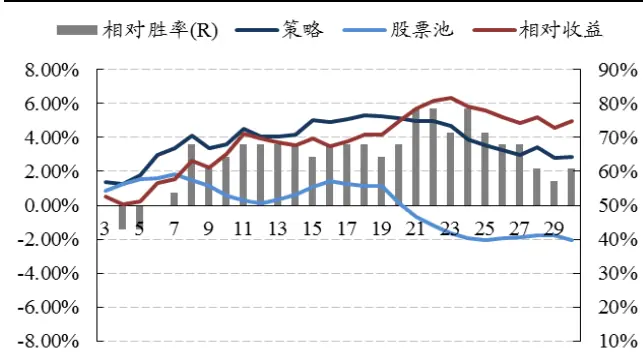
数据来源：Wind，国泰君安证券研究

图 4 第 2组相对收益最高近 5%，胜率近 70%
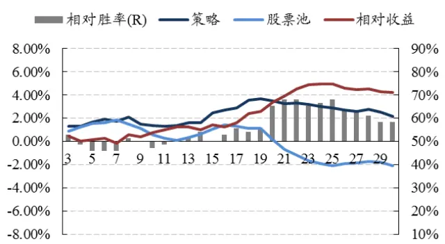
数据来源：Wind，国泰君安证券研究

图 5 第 3 组相对收益最高近 6%，胜率近 80%
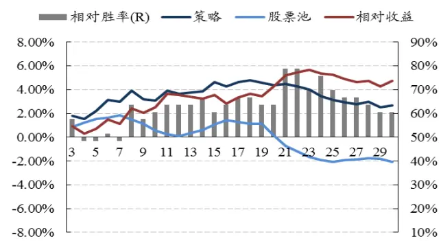
数据来源：Wind，国泰君安证券研究

图 6 第 4 组相对收益最高近 7%，胜率过 70%
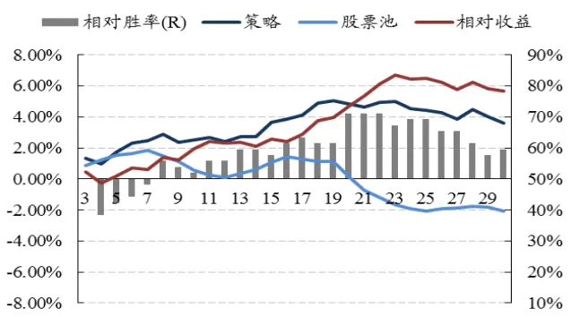
数据来源：Wind，国泰君安证券研究

图 7 第 5组相对收益最高约 5%，胜率过 70%
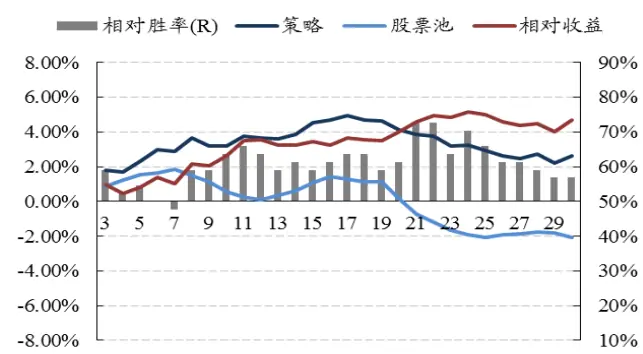
图 8 第 6组相对收益最高约 4%，胜率近 70%
数据来源：Wind，国泰君安证券研究

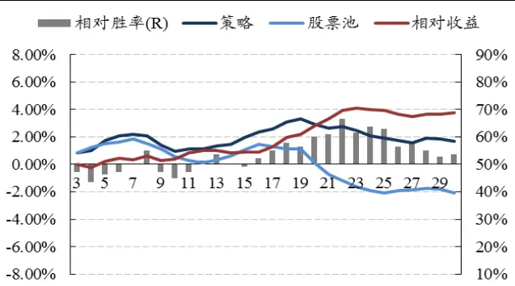
数据来源：Wind，国泰君安证券研究

图 9 第 7组作为反面对照组，一直跑输基准收益
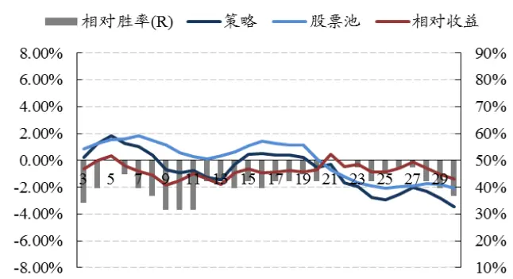

数据来源：Wind，国泰君安证券研究

表 3 第 1组和 4组策略效果最优，累积相对收益自 20个交易日后开始稳定

| 公告后交易日 | 20 | 21 | 22 | 23 | 24 | 25 |
| --- | --- | --- | --- | --- | --- | --- |
| 第1组 |  |  |  |  |  |  |
| 策略累积收益 | 5.11% | 4.98% | 4.94% | 4.69% | 3.88% | 3.52% |
| 股票池累计收益 | 0.12% | -0.71% | -1.19% | -1.66% | -1.92% | -2.07% |
| 相对累积收益 | 4.98% | 5.68% | 6.13% | 6.35% | 5.80% | 5.59% |
| 相对胜率 | 67.86% | 78.57% | 78.57% | 71.43% | 78.57% | 71.43% |
| 个股最大亏损 | -15.07% | -15.73% | -15.62% | -15.84% | -16.72% | -16.17% |
| 第2组 |  |  |  |  |  |  |
| 策略累积收益 | 3.47% | 3.23% | 3.32% | 3.21% | 3.00% | 2.86% |
| 股票池累计收益 | 0.12% | -0.71% | -1.19% | -1.66% | -1.92% | -2.07% |
| 相对累积收益 | 3.34% | 3.94% | 4.52% | 4.87% | 4.92% | 4.94% |
| 相对胜率 | 65.28% | 68.06% | 68.06% | 65.28% | 66.67% | 68.06% |
| 个股最大亏损 | -17.01% | -17.34% | -17.40% | -18.72% | -21.41% | -27.06% |
| 第3组 |  |  |  |  |  |  |
| 策略累积收益 | 4.40% | 4.50% | 4.25% | 3.99% | 3.43% | 3.16% |
| 股票池累计收益 | 0.12% | -0.71% | -1.19% | -1.66% | -1.92% | -2.07% |
| 相对累积收益 | 4.28% | 5.21% | 5.45% | 5.65% | 5.35% | 5.24% |
| 相对胜率 | 63.64% | 78.79% | 78.79% | 69.70% | 75.76% | 69.70% |
| 个股最大亏损 | -17.01% | -17.34% | -15.62% | -15.84% | -16.72% | -20.49% |
| 第4组 |  |  |  |  |  |  |
| 策略累积收益 | 4.82% | 4.63% | 4.95% | 5.02% | 4.54% | 4.42% |
| 股票池累计收益 | 0.12% | -0.71% | -1.19% | -1.66% | -1.92% | -2.07% |
| 相对累积收益 | 4.70% | 5.33% | 6.14% | 6.68% | 6.46% | 6.49% |
| 相对胜率 | 71.15% | 71.15% | 71.15% | 67.31% | 69.23% | 69.23% |
| 个股最大亏损 | -15.07% | -15.73% | -15.62% | -15.84% | -16.72% | -16.17% |
| 第5组 |  |  |  |  |  |  |
| 策略累积收益 | 4.14% | 3.88% | 3.75% | 3.18% | 3.23% | 2.91% |
| 股票池累计收益 | 0.12% | -0.71% | -1.19% | -1.66% | -1.92% | -2.07% |
| 相对累积收益 | 4.02% | 4.59% | 4.94% | 4.84% | 5.14% | 4.98% |
| 相对胜率 | 61.36% | 72.73% | 72.73% | 63.64% | 70.45% | 65.91% |
| 个股最大亏损 | -18.56% | -17.92% | -19.01% | -20.63% | -21.84% | -22.24% |
| 第6组 |  |  |  |  |  |  |
| 策略累积收益 | 2.92% | 2.62% | 2.74% | 2.47% | 2.07% | 1.88% |
| 股票池累计收益 | 0.12% | -0.71% | -1.19% | -1.66% | -1.92% | -2.07% |
| 相对累积收益 | 2.79% | 3.32% | 3.93% | 4.13% | 3.99% | 3.96% |
| 相对胜率 | 60.14% | 60.87% | 66.67% | 61.59% | 63.77% | 63.04% |
| 个股最大亏损 | -15.07% | -15.73% | -15.62% | -15.84% | -16.72% | -16.17% |
| 第7组 |  |  |  |  |  |  |
| 策略累积收益 | -0.55% | -0.27% | -1.68% | -1.95% | -2.78% | -2.92% |
| 股票池累计收益 | 0.12% | -0.71% | -1.19% | -1.66% | -1.92% | -2.07% |
| 相对累积收益 | -0.68% | 0.43% | -0.49% | -0.29% | -0.86% | -0.85% |
| 相对胜率 | 42.11% | 50.00% | 50.00% | 47.37% | 42.11% | 44.74% |

数据来源：Wind，国泰君安证券研究。注：加深数字为最大值

从检验结果中，我们可以总结出如下规律：

- 随着收入和利润增速的下滑，策略相对收益逐渐下降。随着对收入、利润增速由 100%的要求下调到 50%，再到负增长，策略累积收益不断下滑并转为负值。另外，同时对收入、利润增速设臵增长要求要比仅用单一指标的效果更佳。

- 策略累积超额收益及胜率在公告后 20 – 25交易日之中达到最高并保持稳定。从各组的最高累积收益、最高胜率分布来看，最高点基本分布在公告后 20 – 25个交易日之间。并且策略的相对累计收益在达到最高点后在一个区间中保持稳定，没有出现大幅回落。

- 个股表现分化严重，策略极端风险较大。随着时间增加，最大亏损个股的亏损幅度不断增长，在第 20交易日时约有 17%。

## 3.4.5. 随着预期风险水平提升，策略收益更加显著

在 3.4.4 股票池的基础上，我们加入第二个风险条件，即至快报日时上市时间少于等于 2年，这样一来样本股票池约 650个。由于样本量的减少，我们降低对收入、利润增速的要求，以 50%和 30%作为区间划分标准，以保证样本容量。

表 4 按照收入、利润增速对样本进行分组

|  | 样本数量 | 收入增速不低于(%) | 利润增速不低于(%) |
| --- | --- | --- | --- |
| 第1组 | 12 | 50 | 50 |
| 第 2组 | 43 | 30 | 30 |
| 第3组 | 18 | 50 | 30 |
| 第4组 | 18 | 30 | 50 |
| 第5组 | 51 | 50 | 无 |
| 第6组 | 28 | 无 | 50 |
| 第7组 | 33 | -20 | -20 |

数据来源：Wind，国泰君安证券研究

图 10 第 1组相对收益最高近 8%，胜率达 90%
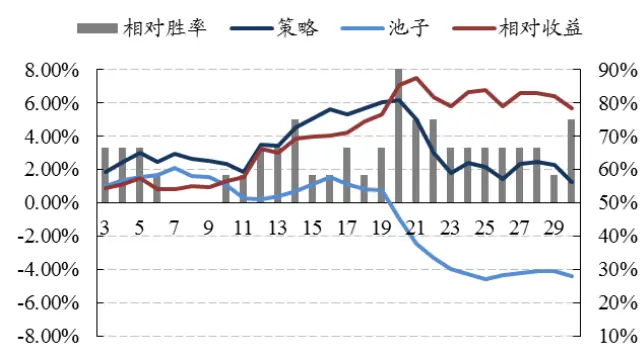
数据来源：Wind，国泰君安证券研究

图 12 第 3组相对收益最高近 6%，胜率近 80%
图 11第 2组相对收益最高达 4%，胜率近 70%
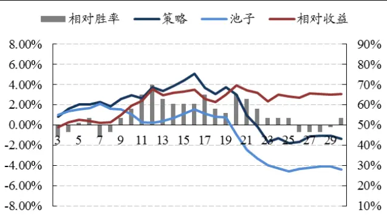
数据来源：Wind，国泰君安证券研究

图 13 第 4 组相对收益最高近 7%，胜率近 90%加入上市时间这个预期风险因素后，策略收益呈现出之前相似的规律：都是在 20 天相对收益达到最大并保持稳定，都是第 1 组（收入、利润高增长）和第 4组（收入较高增长、利润高增长）表现最优，最大亏损个股的亏损幅度相似。

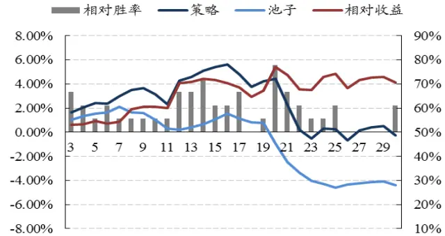
数据来源：Wind，国泰君安证券研究

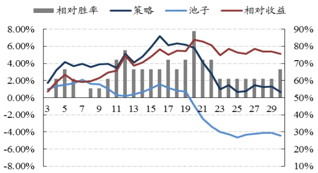
数据来源：Wind，国泰君安证券研究

图 14 第 5组相对收益最高过 2%，胜率近 60%
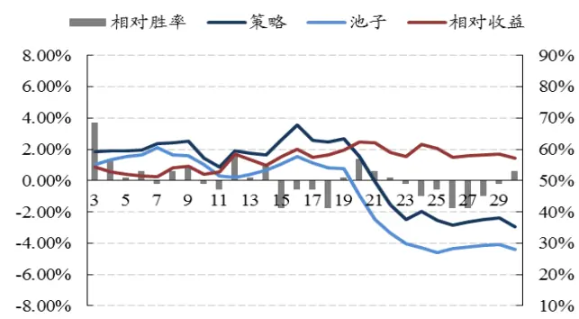
数据来源：Wind，国泰君安证券研究

图 15第 6组相对收益最高约 5%，胜率过 70%
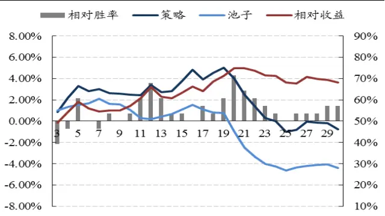
数据来源：Wind，国泰君安证券研究

图 16 第 7组作为反面对照组，持续跑输基准
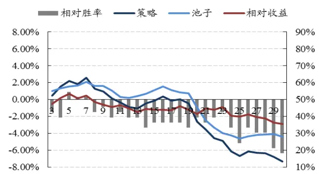
数据来源：Wind，国泰君安证券研究

表 5 第 1 组和 4 组策略效果最优，累积相对收益在 20 个交易日达到最高

| 公告后交易日 | 20 | 21 | 22 | 23 | 24 | 25 |
| --- | --- | --- | --- | --- | --- | --- |
| 第1组 |  |  |  |  |  |  |
| 策略累积收益 | 6.14% | 5.01% | 3.03% | 1.80% | 2.41% | 2.16% |
| 股票池累计收益 | -0.94% | -2.48% | -3.34% | -4.01% | -4.27% | -4.62% |
| 相对累积收益 | 7.09% | 7.49% | 6.37% | 5.81% | 6.68% | 6.78% |
| 相对胜率 | 91.67% | 75.00% | 75.00% | 66.67% | 66.67% | 66.67% |
| 个股最大亏损 | -9.62% | -14.10% | -15.15% | -18.72% | -19.28% | -19.49% |
| 第2组 |  |  |  |  |  |  |
| 策略累积收益 | 2.98% | 0.92% | -0.17% | -1.65% | -1.30% | -1.82% |
| 股票池累计收益 | -0.94% | -2.48% | -3.34% | -4.01% | -4.27% | -4.62% |
| 相对累积收益 | 3.92% | 3.41% | 3.17% | 2.35% | 2.97% | 2.81% |
| 相对胜率 | 65.12% | 62.79% | 58.14% | 53.49% | 53.49% | 53.49% |
| 个股最大亏损 | -16.38% | -20.85% | -20.66% | -22.07% | -21.50% | -20.99% |
| 第3组 |  |  |  |  |  |  |
| 策略累积收益 | 4.45% | 2.26% | 0.19% | -0.52% | 0.30% | 0.23% |
| 股票池累计收益 | -0.94% | -2.48% | -3.34% | -4.01% | -4.27% | -4.62% |
| 相对累积收益 | 5.39% | 4.75% | 3.53% | 3.49% | 4.57% | 4.85% |
| 相对胜率 | 77.78% | 66.67% | 61.11% | 55.56% | 55.56% | 61.11% |
| 个股最大亏损 | -9.62% | -14.10% | -15.15% | -18.72% | -19.28% | -19.49% |
| 第4组 |  |  |  |  |  |  |
| 策略累积收益 | 5.83% | 4.09% | 2.79% | 0.97% | 1.44% | 0.68% |
| 股票池累计收益 | -0.94% | -2.48% | -3.34% | -4.01% | -4.27% | -4.62% |
| 相对累积收益 | 6.77% | 6.58% | 6.14% | 4.97% | 5.71% | 5.30% |
| 相对胜率 | 88.89% | 72.22% | 72.22% | 61.11% | 61.11% | 61.11% |
| 个股最大亏损 | -9.62% | -14.10% | -15.15% | -18.72% | -19.28% | -19.49% |
| 第5组 |  |  |  |  |  |  |
| 策略累积收益 | 1.54% | -0.05% | -1.55% | -2.47% | -1.97% | -2.55% |
| 股票池累计收益 | -0.94% | -2.48% | -3.34% | -4.01% | -4.27% | -4.62% |
| 相对累积收益 | 2.48% | 2.44% | 1.79% | 1.54% | 2.30% | 2.08% |
| 相对胜率 | 56.86% | 52.94% | 50.98% | 49.02% | 45.10% | 47.06% |
| 个股最大亏损 | -15.09% | -16.04% | -15.15% | -18.72% | -19.28% | -19.49% |
| 第6组 |  |  |  |  |  |  |
| 策略累积收益 | 4.02% | 2.50% | 1.39% | 0.27% | 0.01% | -1.00% |
| 股票池累计收益 | -0.94% | -2.48% | -3.34% | -4.01% | -4.27% | -4.62% |
| 相对累积收益 | 4.96% | 4.98% | 4.73% | 4.28% | 4.27% | 3.62% |
| 相对胜率 | 71.43% | 64.29% | 60.71% | 57.14% | 53.57% | 50.00% |
| 个股最大亏损 | -16.84% | -18.23% | -20.81% | -22.92% | -24.44% | -23.76% |
| 第7组 |  |  |  |  |  |  |
| 策略累积收益 | -2.64% | -3.57% | -4.56% | -4.91% | -6.17% | -6.68% |
| 股票池累计收益 | -0.94% | -2.48% | -3.34% | -4.01% | -4.27% | -4.62% |
| 相对累积收益 | -1.70% | -1.08% | -1.21% | -0.90% | -1.90% | -2.06% |
| 相对胜率 | 39.39% | 36.36% | 39.39% | 42.42% | 33.33% | 24.24% |

数据来源：Wind，国泰君安证券研究。注：加深数字为最大值

除此之外，我们发现：由于预期风险更大，尽管我们对收益增长的要求下降，但其相对收益和胜率反而更高。由于样本量的减少，我们只有在这次检验中将增长阀值由 100%和 50%降低到 50%和 30%，然而大部分组的结果反而更加优异。以两次检验表现最好的第 1组和第 4组为例，将其横向比较发现加入预期风险后胜率和相对收益都更高。一旦业绩出现负增长，加入预期风险组的负向反应也更加明显。

表 6 随着预期风险变大，策略收益和胜率显著增加

|  |  | 有上市时间要求 | 无上市时间要求 |
| --- | --- | --- | --- |
| 第1组 | 最高累积相对收益 | 7.09% | 6.35% |
|  | 最高相对胜率 | 91.67% | 78.57% |
| 第4组 | 最高累积相对收益 | 6.77% | 6.68% |
|  | 最高相对胜率 | 88.89% | 71.15% |
| 相同增速组 | 最高累积相对收益 | 7.09% | 4.94% |
| (50%) | 最高相对胜率 | 91.67% | 68.06% |
| 第7组 | 最低累积相对收益 | -2.06% | -0.86% |
|  | 最低相对胜率 | 24.24% | 42.11% |

数据来源：Wind，国泰君安证券研究

## 4. 从实证到实战：加入均线策略，降低极端风险

## 4.1.原始策略收益虽高，但个股最大亏损、波动性均较大

实证检验表明基于快报的 PEAD策略在 A股具有可行性，但要落实到投资中还需进行改进，尤其是解决其波动大、个股亏损大问题。

通过分析亏损比较大的个股案例，我们发现大部分收益率都是在公告日后第二日开始就持续走低。因此如果能提前发现这些股票，并及时止损，那么就可以避免后面更大的损失。同时还可以节省资金来参与新的投资机会，提高资金效率。

## 4.2.利用均线指标观察市场，感知预期变化

在《多维视角，深挖投资异象》的报告中，我们曾经提到建立主次分明的策略合成体系。按照策略合成思想，原 PEAD策略属于高收益、高风险类型的，因此要求新加入的策略能平滑其波动性。

考虑利用技术指标平滑策略波动。在《金融怪杰》中，布鲁斯*柯凡纳（顶尖外汇交易员）对技术分析有如下分析：“对我而言，技术分析如体温计。光靠基本面分析，而不注意市场走势的相关图标，就如同医生为病人看病，而不替病人测量体温一样荒谬…每笔交易后面必定都有基本面因素的支持，技术分析通常可以使市场的基本面情势更加明朗化。”

预期既能影响股价变动，也受股价变动影响。有句话叫：“一根阳线改变情绪，两根阳线改变预期，三根阳线改变理念。”讲的就是这个意思。因此利用技术指标观察市场，既能够验证策略的判断，也能够监测市场情绪的变化。均线系统就是一个简单实用，又能有效反映当前市场强弱的指标。

图 17 预期与股价具有内生性，股价变动对预期有指示意义
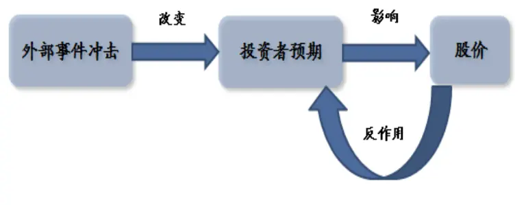
数据来源：国泰君安证券研究

我们的均线策略是：自买入日起，如果股价连续三个交易日站在 10 日均线之下时，卖出离场。这里存在两个问题：1、为什么是连续 3 个交易日；2、为什么是 10日均线？

对交易日持续时间和均线长度的选择与投资持有期有直接关系。如果选择的时间过长，则指标钝化的可能性较大，也就无法达到尽早将亏损较大个股剔除的目的；选择的时间过短，又造成指标过于敏感，股价稍有波动就会被卖出，使我们损失后面的收益。由于策略的相对收益和胜率基本在公告日后第 20 个交易日左右达到最大值，因此直觉上连续 3 个交易日在 10 日均线下卖出是比较适中的策略了。为了验证该结论，并对均线长度进行敏感性测试，我们在实证中利用 MA5、MA10和 MA13三条均线分别测试合成后策略的稳定性。

## 4.3.合成后，策略稳定性上升，收益略有下降

基于 3.4 部分的检验结果，我们选择在策略收益较高，且样本容量相对较大的第 4组（不限制上市时间，要求收入增长 50%、利润增长 100%）基础上测试均线卖出策略效果。

表 7 加入均线策略后收益稳定性提升，MA10 策略最优

|  | 原策略 | MA5 | MA10 | MA13 |
| --- | --- | --- | --- | --- |
| 平均持仓天数 | 21 | 10.1 | 11.1 | 11.7 |
| 累积收益 | 4.63% | 3.24% | 4.12% | 2.60% |
| 胜率 | 67.31% | 60.61% | 63.64% | 57.58% |
| 个股最大亏损 | -17.34% | -9.64% | -9.64% | -9.64% |
| 个股收益标准差 | 12.92% | 7.58% | 10.40% | 10.42% |

数据来源：Wind，国泰君安证券研究

加入均线策略后，策略效果有如下改变：

- 平均持仓天数大幅下降，提升资金周转率约 1倍。由于策略将很多弱势个股提前卖出，因此平均持仓天数大幅降低。并且随着均线长度缩短，均线灵敏性变高导致持仓天数越短。

- 个股最大亏损和收益标准差大幅缩减。如我们所愿，策略确实使得我们能够将一些后期亏损较大的个股提前卖出，因此个股最大亏损大幅下降。由于加入均线系统后限制了股价的向下空间，因此个股收益差异标准差收窄。

- 策略收益与胜率小幅下降。策略有效规避了个股大幅亏损的风险，但为此付出的代价是过早卖出了后期出现 v型反转走势的个股（并且多半是在微亏时卖出）。因此策略的收益与胜率出现了小幅下降，好在代价不大。

## 5. 2014 年样本外检验，策略表现良好

2014 年截至 2 月 19 日，共有 180 多家上市公司公布了业绩快报。业绩快报发布前 180 日内分析师覆盖数量少于五家的约有 90 余家公司，8家公司的收入/利润相较于去年的基础有较大的增长，符合策略要求。其中湘潭电化长期停牌，因此剔除。

表 8 样本外满足策略要求上市公司一览我们在剩下的 7 只股票中采用策略投资方法。截至 2 月 19 日，没有因为连续 3日站在 10日均线下方而被提前卖出的案例出现。

| 证券代码 | 名称 | 快报披露日 | 收入增长率(%) | 利润增长率(%) |
| --- | --- | --- | --- | --- |
| 002141.SZ | 蓉胜超微 | 2014-2-15 | 10.22 | 166.71 |
| 600985.SH | 雷鸣科化 | 2014-1-29 | 43.51 | 133.04 |
| 600452.SH | 涪陵电力 | 2014-1-28 | 11.44 | 91.44 |
| 002125.SZ | 湘潭电化 | 2014-1-25 | 12.15 | 111.69 |
| 000045.SZ | 深纺织A | 2014-1-11 | 33.84 | 154.82 |
| 002279.SZ | 久其软件 | 2014-2-11 | 17.07 | 209.92 |
| 000750.SZ | 国海证券 | 2014-1-24 | 24.32 | 136.69 |
| 000712.SZ | 锦龙股份 | 2014-1-17 | 216.98 | 128.58 |

数据来源：Wind，国泰君安证券研究

图 18 七只个股在公告后收益情况良好
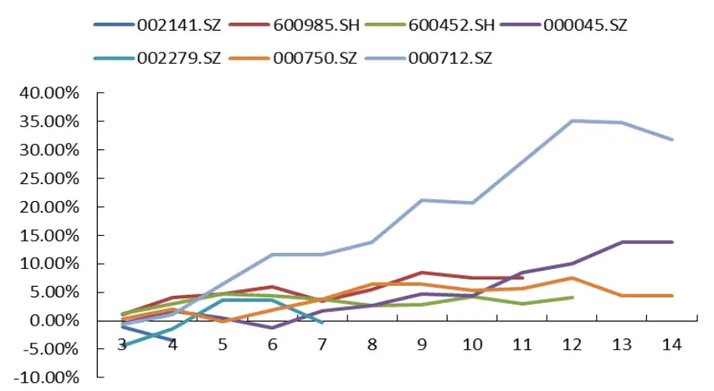
数据来源：Wind，国泰君安证券研究

随着时间的推移，7只个股基本都实现正收益，其中锦龙股份收益最优，其他股票收益集中在 5%左右。历史检验显示策略平均累积收益率直到20个交易日后才逐渐稳定，因此未来策略收益依然有望继续上行。

图 19 策略平均累计收益跑赢 ZZ500
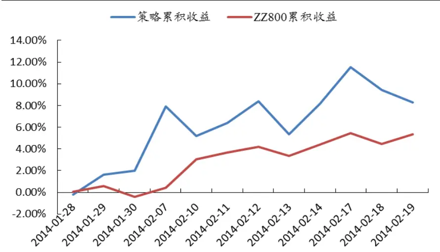
数据来源：Wind，国泰君安证券研究

我们按照时间顺序，从第一只符合策略条件的股票出现后开始计算策略平均累计收益率。由于目前 7只个股全部是中小盘和主板股票，因此我们利用 ZZ500 同期收益作为参考基准，发现策略能够持续跑赢 ZZ500。

## 6. 策略反思：市场预期到底在哪儿？

整篇报告中，我们一直围绕着市场预期来制定投资策略。市场预期到底在哪儿？我们认为预期存在于每个投资人心中，难以用数字、语言表达出来。每个人的预期尚且难以衡量，而千人心又不可得，因此全市场的一致预期就更难被表达了。预期期望如此，预期风险更是如此。

图 20 预期风险下的 PEAD投资策略逻辑图
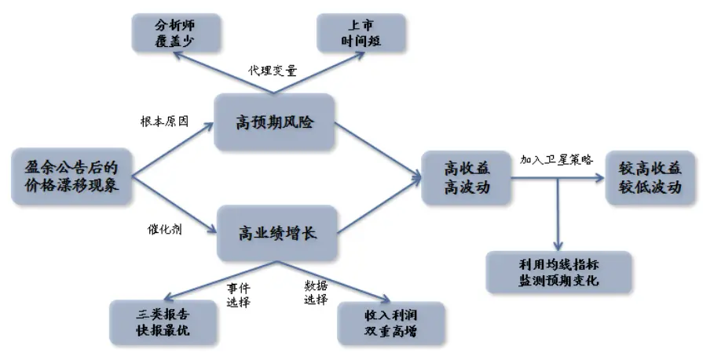
数据来源：国泰君安证券研究

上一年度的业绩，过去几年业绩的平均值，以及卖方分析师写在报告中盈利预测的平均值，是预期吗？不是。有能力且有意愿在市场上交易的投资人的预期才是对股价有直接影响的预期，这里不仅有投资者总量问题，还有投资者微观结构的问题，不是一个数字就能够说清楚的。上年度业绩也好，卖方分析师观点也好，它们能影响市场预期，但无法代替盈利预期。

分析师覆盖少，上市时间短就一定意味着投资者对公司预期的不确定性较大吗？也不是。这些条件与预期风险既无充分、也无必要关系，只是我们能够看得见的代理变量。

正是由于预期的不可表达性，使得单靠数量化指标，策略始终存在错误估计市场预期的风险，这是策略胜率无法提升的一个重要原因。承认代理变量不完美并不意味着否定策略的有效性，只是承认模型缺陷。这样才能在实战中灵活的运用策略，而不是迷信于模型，甚至拘泥于某个指标的大小。

在 PEAD 投资策略研究中，量化研究方法的主要作用在于从历史大样本的统计中验证逻辑正确性和策略可行性，实际投资中除了观察策略所用到的指标，还需要从交易中感知市场预期。

## 本公司具有中国证监会核准的证券投资咨询业务资格

## 分析师声明

作者具有中国证券业协会授予的证券投资咨询执业资格或相当的专业胜任能力，保证报告所采用的数据均来自合规渠道，分析逻辑基于作者的职业理解，本报告清晰准确地反映了作者的研究观点，力求独立、客观和公正，结论不受任何第三方的授意或影响，特此声明。

## 免责声明

本报告仅供国泰君安证券股份有限公司（以下简称“本公司”）的客户使用。本公司不会因接收人收到本报告而视其为本公司的当然客户。本报告仅在相关法律许可的情况下发放，并仅为提供信息而发放，概不构成任何广告。

本报告的信息来源于已公开的资料，本公司对该等信息的准确性、完整性或可靠性不作任何保证。本报告所载的资料、意见及推测仅反映本公司于发布本报告当日的判断，本报告所指的证券或投资标的的价格、价值及投资收入可升可跌。过往表现不应作为日后的表现依据。在不同时期，本公司可发出与本报告所载资料、意见及推测不一致的报告。本公司不保证本报告所含信息保持在最新状态。同时，本公司对本报告所含信息可在不发出通知的情形下做出修改，投资者应当自行关注相应的更新或修改。

本报告中所指的投资及服务可能不适合个别客户，不构成客户私人咨询建议。在任何情况下，本报告中的信息或所表述的意见均不构成对任何人的投资建议。在任何情况下，本公司、本公司员工或者关联机构不承诺投资者一定获利，不与投资者分享投资收益，也不对任何人因使用本报告中的任何内容所引致的任何损失负任何责任。投资者务必注意，其据此做出的任何投资决策与本公司、本公司员工或者关联机构无关。

本公司利用信息隔离墙控制内部一个或多个领域、部门或关联机构之间的信息流动。因此，投资者应注意，在法律许可的情况下，本公司及其所属关联机构可能会持有报告中提到的公司所发行的证券或期权并进行证券或期权交易，也可能为这些公司提供或者争取提供投资银行、财务顾问或者金融产品等相关服务。在法律许可的情况下，本公司的员工可能担任本报告所提到的公司的董事。

市场有风险，投资需谨慎。投资者不应将本报告为作出投资决策的惟一参考因素，亦不应认为本报告可以取代自己的判断。在决定投资前，如有需要，投资者务必向专业人士咨询并谨慎决策。

本报告版权仅为本公司所有，未经书面许可，任何机构和个人不得以任何形式翻版、复制、发表或引用。如征得本公司同意进行引用、刊发的，需在允许的范围内使用，并注明出处为“国泰君安证券研究”，且不得对本报告进行任何有悖原意的引用、删节和修改。

若本公司以外的其他机构（以下简称“该机构”）发送本报告，则由该机构独自为此发送行为负责。通过此途径获得本报告的投资者应自行联系该机构以要求获悉更详细信息或进而交易本报告中提及的证券。本报告不构成本公司向该机构之客户提供的投资建议，本公司、本公司员工或者关联机构亦不为该机构之客户因使用本报告或报告所载内容引起的任何损失承担任何责任。

## 评级说明

## 1.投资建议的比较标准

投资评级分为股票评级和行业评级。

以报告发布后的12个月内的市场表现为比较标准，报告发布日后的12个月内的公司股价（或行业指数）的涨跌幅相对同期的沪深300指数涨跌幅为基准。

## 2.投资建议的评级标准

报告发布日后的 12 个月内的公司股价（或行业指数）的涨跌幅相对同期的沪深300指数的涨跌幅。

| 评级 |  | 说明 |
| --- | --- | --- |
| 股票投资评级 | 增持 | 相对沪深 300指数涨幅15%以上 |
|  | 谨慎增持 | 相对沪深300指数涨幅介于5%～15%之间 |
|  | 中性 | 相对沪深300指数涨幅介于-5%～5% |
|  | 减持 | 相对沪深300指数下跌5%以上 |
| 行业投资评级 | 增持 | 明显强于沪深 300 指数 |
|  | 中性 | 基本与沪深300指数持平 |
|  | 减持 | 明显弱于沪深300指数 |

## 国泰君安证券研究

|  | 上海 | 深圳 | 北京 |
| --- | --- | --- | --- |
| 地址 | 上海市浦东新区银城中路168号上海 银行大厦29层 | 深圳市福田区益田路 6009 号新世界 商务中心34层 | 北京市西城区金融大街 28 号盈泰中 心2号楼10层 |
| 邮编 | 200120 | 518026 | 100140 |
| 电话 | （021)38676666 | (0755)23976888 | (010)59312799 |
|  | E-mail: gtjaresearch@gtjas.com |  |  |