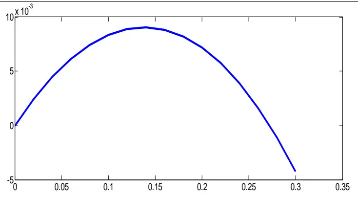
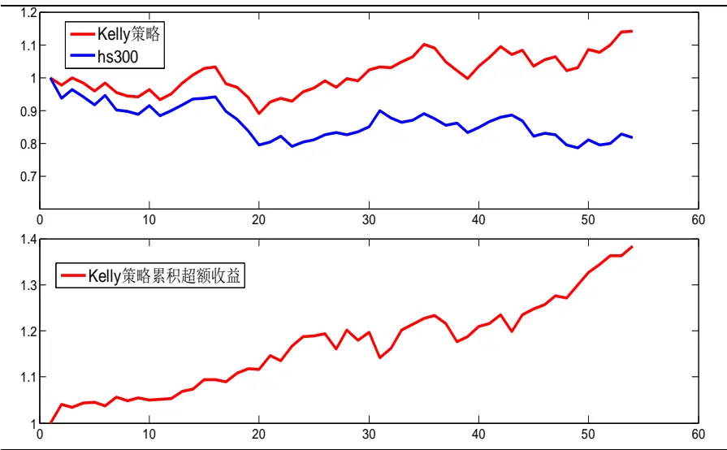
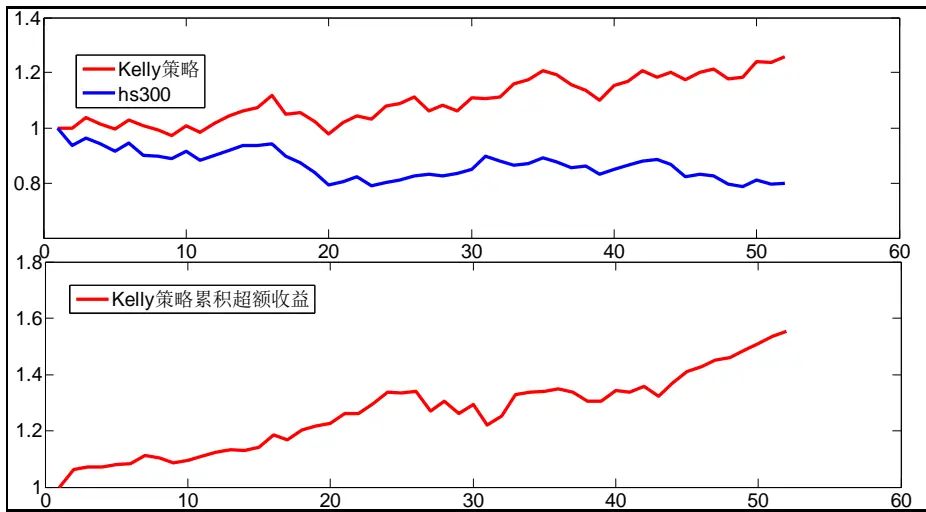

2014.02.26

# Kelly 公式在行业配置中的应用一

# ——数量化专题之三十八

刘富兵（分析师）

8 021-38676673

liufubing008481@gtjas.com

证书编号 S0880511010017

本报告导读：我们将 Kelly公式应用于行业配置中，取得了良好的效果：在一级行业中年化超额收益超 30%，胜率超 70%，夏普比率达 2.4；在二级行业中，年化超额收益超 50%，胜率超 70%，夏普比率达 2.6。

## 摘要：

le_Summary] 凯利公式诞生以后，便被广泛应用于赌博、跑马、期货以及股票投资等各个领域，并取得了良好的实战效果。在众多应用者中，不乏香农、索普等投资界重量级人物，而且他们都取得了很好的投资业绩。这些使我们对Kelly公式产生了浓厚的兴趣。

- 我们将 Kelly公式应用于单个行业上，发现预期的复合增长率都高于行业的实际复合增长率，这表明 Kelly公式起码在理论上是有效的。

关于投资比例与预期几何增长率的关系，从Kelly准则来看，呈现抛物线关系，即在Kelly准则之前呈抛物线上升的趋势，而在 Kelly准则之后，呈抛物线下降的趋势，因此当某一标的的投资比例超过 Kelly准则后，不仅波动率在加大，而且其复合回报率也在下降，从而呈现双输的局面。

- 我们利用 Kelly准则构建了最优投资组合问题，从而将行业配置转化成线性优化问题。

我们构建的 Kelly策略取得了良好的效果，一级行业，在过去的一年里，Kelly 策略跑赢 hs300 30%以上，胜率超过70%，最大回撤 5%，夏普比率达到 2.4；二级行业表现更佳，跑赢hs300 50%以上，胜率超过 70%，最大回撤 8%，夏普比率达到 2.6。

- 本文是我们研究 Kelly公式系列的第一篇，相对比较简单，算是抛砖引玉，未来，我们将对 Kelly公式进行更为深入的研究，欢迎关注我们的后续系列报告。

金融工程

## 金融工程团队：

刘富兵：（分析师）

电话：021-38676673

邮箱：liufubing008481@gtjas.com

证书编号：S0880511010017

何苗：（分析师）

电话：010-59312710

邮箱：hemiao@gtjas.com

证书编号：S0880511010049

## 严佳炜：（分析师）

电话：021-38674812

邮箱：yanjiawei008776@gtjas.com

证书编号：S0880512110001

## 耿帅军：（分析师）

电话：010-59312753

邮箱：gengshuaijun@gtjas.com

证书编号：S0880513080013

## 徐康：（分析师）

电话：021-38674939邮箱：xukang010849@gtjas.com证书编号：S0880513080018

## 赵延鸿：（研究助理）

电话：021-38674927邮箱：zhaoyanhong@gtjas.com证书编号：S0880113070047

## 陈睿：（研究助理）

电话：021-38675861

邮箱：chenrui012896@gtjas.com

证书编号：S0880112120012

## 刘正捷：（研究助理）

电话：021-38675860

邮箱：liuzhengjie012509@gtjas.com

证书编号：S0880112080087

## [Table_R相关报告

《预期风险下，基于业绩快报的 PEAD 投资策略》2014.02.24

《业绩预告解析之二：超预期》2014.02.18

《业绩预告解析之一：高增长》2014.02.17《关于择时思考之一:由连续到离散》2014.02.14

《从微观数据中寻找 Alpha 的新来源》2014.02.13

## 1. Kelly 公式背景

Kelly 公式最早是由美国贝尔实验室的 J.L.Kelly 在其 1956 年的论文《ANew Intepretation of Imformation Rate》中提出来的。其主要思想是：在任何重复性的游戏中，玩家拥有优势（正的预期净收益），而且想最大化资本增值速度，则 Kelly 公式可以计算出每次在不同的机会上分配的资金，不仅可以确保资本增值速度最大化，而且确保玩家不破产。

凯利公式诞生以后，受到了很学者的非议，但也受到了不少学者、实务派的拥护，并将其用在了赌博、跑马、期货以及股票投资等各个领域。

在众多拥护者中，最知名的莫过于 E. O. Thorp 和 C.E. Shannon 了。C.E.Shannon，计算机的主要发明人之一，信息论的创始人，是凯利系统最坚定的支持者之一，据传，1986 年其投资组合取得了 28%的年化复合收益，超过巴菲特伯克希尔〃哈撒韦公司的 27%。

E. O. Thorp，美国麻省理工学院数学教授、数学博士，被博彩界称为“赌神”和“21 点之父”。其论文《21 点最佳策略》由香农推荐刊登在美国《国家科学院文献》上，专著《Beat the Dealer》系统介绍在许多赌博游戏中取胜的策略，此后 30 多年中，Thorp 发表了多篇关于 Kelly 公式的论文，是量化投资的元老级人物。

事实上，凯利的拥护者还有一个常见的信念，那就是股神沃伦.巴菲特是一个秘密运用凯利论的交易者。这一观点在投资经理人罗伯特.贺格斯特朗的《沃伦.巴菲特投资组合》一书中得到进一步论证。“我们没有证据表明巴菲特在调整贝克郡资金时使用了凯利模式”，贺格斯特朗很诚实的承认了这一点，“但是凯利概念是很合理的过程，在我看来，这个概念和巴菲特的想法不约而同”。

有关 Kelly公式更多背景介绍，感兴趣的投资者可以去阅读下威廉.庞德斯通著的《财富公式：玩转拉斯维加斯和华尔街的故事》。

鉴于 Kelly 公式在赌博、跑马、期货等资金分配方面的优异表现，我们准备做一个系列报告，专门阐述 Kelly 公式在行业配置中的应用。本文，我们将详细介绍下凯利公式，并将其在资产配置上做个简单应用。

## 2. Kelly 公式推导

令 G表示收益的几何增长率，N表示投资期数， $X_{\mathrm{~0~}}$ 表示初始投资额，

X 表示第 N期的财富值。则

$$
G=\lim_{N\to\infty}(1/N)\ln(X_{_N}/X_{_0})
$$

假定一个游戏，投资者赢则赚 1单位，输了则损失全部，假定每次投资者的下注比例为 f，则，经过 N次游戏后，其财富值为

$$
X_{_{\scriptsize{\mathrm{~\scriptsize~N~}}}}=X_{_{\scriptsize{\mathrm{~\scriptsize~0~}}}}(1+\;f\;)^{^{W}}\;(1-\;f\;)^{^{\scriptsize{\mathrm{~\scriptsize~}}}}
$$

其中 W表示N次游戏中赢的次数，L 表示 N次游戏中输得次数。将上式带入 G的表达式，我们可以得到：

$$
G\left(f\right)=\lim_{N\to\infty}\left(1/N\right)\left(W\ln\left(1+f\right)+L\ln\left(1-f\right)\right)=p\ln\left(1+f\right)+q\ln\left(1-f\right)
$$

其中 p 表示投资者赢得游戏的概率，q=1-p表示输掉游戏的概率。

对G f( ) 关于 f求导，并令导数为 0，则有

$$
\frac{p}{1+f}-\frac{q}{1-f}=0.
$$

$$
f^{*}=p-q=2p-1
$$

f*就是 Kelly公式，将其带 $入G\left(f\right)$ 中，则有

$$
G\left(f^{*}\right)=p\ln p+\ln q+\ln2
$$

上式表示投资回报的最大几何增长率。

## 3. Kelly 公式在单只标的中的应用

我们可以将单只股票的收益分布简化为贝努利分布：假定其上涨的概率为 p，下跌概率为 q，盈亏比为 WL，则

$$
G\left(\textit{ f }\right)=p\ln\left(1+WLf\right)+q\ln\left(1-\textit{ f }\right)
$$

由此我们可求得单只股票最优的投资比例为：

$$
f^{*}=\frac{\textit{ p W L - q }}{\textit{ W L }}
$$

相应地最优几何增长率为

$$
G\left(f^{*}\right)=p\ln\left(WL+1\right)+q\ln\big\{\frac{q+\left(1+WL\right)}{WL}\big\}
$$

以申万 23个一级行业为例，我们利用 2007年至今的数据估算各个行业的胜率、盈亏比、Kelly 投资比例以及预期几何增长率，如下表所示：

表 1各行业的 Kelly投资比例及预期几何增长率

| 行业 | 胜率 | 上涨时涨幅 | 下跌时跌幅 | Ke11y 比例 | 预期几何增 长率 | 实际几何增 长率 | 差值 |
| --- | --- | --- | --- | --- | --- | --- | --- |
| 农林牧渔(申万) | 57.62% | 3.68% | -4.28% | 8.32% | 0.30% | 0.23% | 0.07% |
| 采掘(申万) | 48.75% | 4.31% | -3.84% | 3.02% | 0.05% | 0.05% | 0.00% |
| 化工(申万) | 53.74% | 3.35% | -3.68% | 2.87% | 0.04% | 0.03% | 0.00% |
| 黑色金属(申万) | 48.48% | 3.77% | -3.72% | 0.00% | 0.00% | -0.16% | 0.16% |
| 有色金属(申万) | 51.25% | 4.54% | -4.44% | 3.57% | 0.07% | 0.06% | 0.00% |
| 建筑建材(申万) | 53.46% | 3.52% | -3.63% | 5.53% | 0.15% | 0.13% | 0.02% |
| 机械设备(申万) | 54.85% | 3.56% | -3.70% | 7.97% | 0.31% | 0.22% | 0.09% |
| 电子(申万) | 55.96% | 3.91% | -4.23% | 8.29% | 0.32% | 0.24% | 0.08% |
| 交运设备(申万) | 52.63% | 3.83% | -3.74% | 6.30% | 0.20% | 0.17% | 0.03% |
| 信息设备(申万) | 56.79% | 3.57% | -3.95% | 8.88% | 0.36% | 0.25% | 0.11% |
| 家用电器(申万) | 55.12% | 3.75% | -3.60% | 12.01% | 0.75% | 0.38% | 0.37% |
| 食品饮料(申万) | 52.08% | 3.35% | -3.18% | 6.57% | 0.23% | 0.17% | 0.06% |
| 纺织服装(申万) | 56.23% | 3.53% | -4.01% | 6.50% | 0.19% | 0.16% | 0.03% |
| 轻工制造(申万) | 54.29% | 3.65% | -3.83% | 6.37% | 0.19% | 0.16% | 0.03% |
| 医药生物(申万) | 58.17% | 3.40% | -3.61% | 13.83% | 0.91% | 0.41% | 0.50% |
| 公用事业(申万) | 52.91% | 2.89% | -2.97% | 4.47% | 0.10% | 0.09% | 0.01% |
| 交通运输(申万) | 50.97% | 3.26% | -3.38% | 0.05% | 0.00% | -0.05% | 0.05% |
| 房地产(申万) | 50.69% | 4.30% | -4.07% | 4.03% | 0.09% | 0.09% | 0.00% |
| 金融服务(申万) | 46.81% | 3.92% | -3.29% | 2.15% | 0.03% | 0.02% | 0.01% |
| 商业贸易(申万) | 54.29% | 3.46% | -3.63% | 6.37% | 0.19% | 0.16% | 0.04% |
| 餐饮旅游(申万) | 55.96% | 3.68% | -4.14% | 6.29% | 0.18% | 0.16% | 0.02% |
| 信息服务(申万) | 56.51% | 3.40% | -3.69% | 9.38% | 0.41% | 0.26% | 0.15% |
| 综合(申万) | 55.68% | 3.83% | -4.14% | 7.72% | 0.28% | 0.22% | 0.06% |

数据来源：国泰君安证券研究，wind

由表 1 可以看出，预期几何增长率都高于行业的实际复合回报率，这表明 Kelly 公式起码在理论上是有效的。

## 4. Kelly 公式在行业配置中的应用

关于投资比例与几何增长率的关系，从 Kelly 准则来看，呈现抛物线关系，即在 Kelly准则之前呈抛物线上升的趋势，而在 Kelly准则之后，呈抛物线下降的趋势，因此当某一标的的投资比例超过 Kelly 准则后，不仅波动率在加大，而且其复合回报率也在下降，从而呈现双输的局面。

以上一节测算的医药生物为例，当医药生物的投资比例超过 Kelly 准则的 13.8%时，其预期复合回报率在急剧下降，具体如下图所示：

图 1 预期几何增长率相对于投资比例的敏感性

数据来源：国泰君安证券研究，wind

我们可以利用上述准则构建如下最优投资组合

$$
\begin{aligned}&\max\sum_{_{i=1}}^{^{N}}f_{_{i}}R_{_{i}}\\&\in\quad f_{_{i}}\leq f_{_{i}}*0\\&\quad f_{_{i}}\geq0\\&\quad\sum_{_{i=1}}^{^{N}}f_{_{i}}=1\end{aligned}
$$

其中 $f_{i}^{\mathrm{~*~}}$ 表示各资产的 Kelly 投资比例。

这样我们就将行业配置转换成了一个简单的线性优化问题。

## 4.1.Kelly 公式在一级行业资产配置中的应用

将上述最优组合构建运用于一级行业的周数据中，我们发现 Kelly 策略取得了良好的效果，在过去的一年里，Kelly 策略跑赢 hs300 30%以上，胜率超过 70%，最大回撤 5%，夏普比率达到 2.4。具体表现如下图表所示：

图 2 Kelly 公式在一级行业资产配置中的应用

数据来源：国泰君安证券研究，wind

表 2 Kelly 一级行业策略与沪深 300对冲策略结果统计

| 统计指标 | 数值 |
| --- | --- |
| 财富终值 | 1.38 |
| 交易胜率 | 71.70% |
| 年化收益率 | 37.47% |
| 年化波动率 | 12.25% |
| 夏普比率 | 2.42 |
| 最大回撤 | 4.96% |
| VaR | -2.70% |
| ES | -3.37% |

数据来源：国泰君安证券研究，wind

## 4.2.Kelly 公式在二级行业资产配置中的应用

将 Kelly 公式运用到二级行业的周数据中，我们得到了比一级行业还好的效果。在过去的一年里，该策略跑赢 hs300 50%以上，胜率超过 70%，最大回撤 8%，夏普比率达到 2.6，具体表现如下面图表所示：

图 3 Kelly 公式在二级行业资产配置中的应用

数据来源：国泰君安证券研究，wind

表 3 Kelly二级行业策略与沪深 300对冲策略结果统计

| 统计指标 | 数值 |
| --- | --- |
| 财富终值 | 1.55 |
| 交易胜率 | 76.47% |
| 年化收益率 | 56.73% |
| 年化波动率 | 16.43% |
| 夏普比率 | 2.64 |
| 最大回撤 | 8.98% |
| VaR | 3.57% |
| ES | -5.51% |

数据来源：国泰君安证券研究，wind

## 5. Kelly 公式应用总结及展望

凯利公式诞生以后，便被广泛应用于赌博、跑马、期货以及股票投资等各个领域，并取得了良好的实战效果。在众多应用者中，不乏香农、索普等投资界重量级人物，而且他们都取得了很好的投资业绩。以上这些引起了我们对 Kelly公式的浓厚兴趣。

我们将股票市场简化成一个简单的赌博游戏，并在此基础上，将凯利公式简单运用在了行业配置上，取得了良好的效果，从而进一步证明了Kelly 公式的有效性。这又激发了我们未来深入研究 Kelly的动力。

本文是我们研究 Kelly 公式系列的第一篇，相对比较简单，算是抛砖引玉，未来，我们将进一步深入研究 Kelly 公式的以下内容：

1. 凯利公式最重要的就是要精确预测每场游戏的胜率，对应到股票市场就是要精确预测股票的概率分布，而且由于各只股票之间并不相互独立，这就要求精确预测股票市场的联合概率分布。面对这样的情况，显然，我们不能简单的用相互独立的贝努利分布来代表股票市场分布。那么我们应该如何解决？

2. Markowitz 均值方差组合与 Kelly 准则的区别于联系是什么？两者各自的优势与劣势在哪里？

3. Kelly 公式诞生至今已有近 60 年的历史，在此期间 Kelly 公式都发生了哪些演变与改进，做了哪些推广，被成功的运用于哪些领域？

4. Kelly 公式能否成功地运用于国内的配置、基金股票的投资组合以及资金分配等投资者最为关注的问题？

未来，我们将就上述问题对 Kelly 公式做详细阐述，欢迎关注我们的后续系列报告。

## 本公司具有中国证监会核准的证券投资咨询业务资格

## 分析师声明

作者具有中国证券业协会授予的证券投资咨询执业资格或相当的专业胜任能力，保证报告所采用的数据均来自合规渠道，分析逻辑基于作者的职业理解，本报告清晰准确地反映了作者的研究观点，力求独立、客观和公正，结论不受任何第三方的授意或影响，特此声明。

## 免责声明

本报告仅供国泰君安证券股份有限公司（以下简称“本公司”）的客户使用。本公司不会因接收人收到本报告而视其为本公司的当然客户。本报告仅在相关法律许可的情况下发放，并仅为提供信息而发放，概不构成任何广告。

本报告的信息来源于已公开的资料，本公司对该等信息的准确性、完整性或可靠性不作任何保证。本报告所载的资料、意见及推测仅反映本公司于发布本报告当日的判断，本报告所指的证券或投资标的的价格、价值及投资收入可升可跌。过往表现不应作为日后的表现依据。在不同时期，本公司可发出与本报告所载资料、意见及推测不一致的报告。本公司不保证本报告所含信息保持在最新状态。同时，本公司对本报告所含信息可在不发出通知的情形下做出修改，投资者应当自行关注相应的更新或修改。

本报告中所指的投资及服务可能不适合个别客户，不构成客户私人咨询建议。在任何情况下，本报告中的信息或所表述的意见均不构成对任何人的投资建议。在任何情况下，本公司、本公司员工或者关联机构不承诺投资者一定获利，不与投资者分享投资收益，也不对任何人因使用本报告中的任何内容所引致的任何损失负任何责任。投资者务必注意，其据此做出的任何投资决策与本公司、本公司员工或者关联机构无关。

本公司利用信息隔离墙控制内部一个或多个领域、部门或关联机构之间的信息流动。因此，投资者应注意，在法律许可的情况下，本公司及其所属关联机构可能会持有报告中提到的公司所发行的证券或期权并进行证券或期权交易，也可能为这些公司提供或者争取提供投资银行、财务顾问或者金融产品等相关服务。在法律许可的情况下，本公司的员工可能担任本报告所提到的公司的董事。

市场有风险，投资需谨慎。投资者不应将本报告为作出投资决策的惟一参考因素，亦不应认为本报告可以取代自己的判断。在决定投资前，如有需要，投资者务必向专业人士咨询并谨慎决策。

本报告版权仅为本公司所有，未经书面许可，任何机构和个人不得以任何形式翻版、复制、发表或引用。如征得本公司同意进行引用、刊发的，需在允许的范围内使用，并注明出处为“国泰君安证券研究”，且不得对本报告进行任何有悖原意的引用、删节和修改。

若本公司以外的其他机构（以下简称“该机构”）发送本报告，则由该机构独自为此发送行为负责。通过此途径获得本报告的投资者应自行联系该机构以要求获悉更详细信息或进而交易本报告中提及的证券。本报告不构成本公司向该机构之客户提供的投资建议，本公司、本公司员工或者关联机构亦不为该机构之客户因使用本报告或报告所载内容引起的任何损失承担任何责任。

## 评级说明

## 1.投资建议的比较标准

投资评级分为股票评级和行业评级。

以报告发布后的12个月内的市场表现为比较标准，报告发布日后的12个月内的公司股价（或行业指数）的涨跌幅相对同期的沪深300指数涨跌幅为基准。

## 2.投资建议的评级标准

报告发布日后的 12 个月内的公司股价（或行业指数）的涨跌幅相对同期的沪深300指数的涨跌幅。

| 评级 |  | 说明 |
| --- | --- | --- |
| 股票投资评级 | 增持 | 相对沪深 300指数涨幅15%以上 |
|  | 谨慎增持 | 相对沪深300指数涨幅介于5%～15%之间 |
|  | 中性 | 相对沪深300指数涨幅介于-5%～5% |
|  | 减持 | 相对沪深300指数下跌5%以上 |
| 行业投资评级 | 增持 | 明显强于沪深 300 指数 |
|  | 中性 | 基本与沪深300指数持平 |
|  | 减持 | 明显弱于沪深300指数 |

## 国泰君安证券研究

|  | 上海 | 深圳 | 北京 |
| --- | --- | --- | --- |
| 地址 | 上海市浦东新区银城中路168号上海 银行大厦29层 | 深圳市福田区益田路 6009 号新世界 商务中心34层 | 北京市西城区金融大街 28 号盈泰中 心2号楼10层 |
| 邮编 | 200120 | 518026 | 100140 |
| 电话 | （021)38676666 | (0755)23976888 | (010)59312799 |
|  | E-mail: gtjaresearch@gtjas.com |  |  |