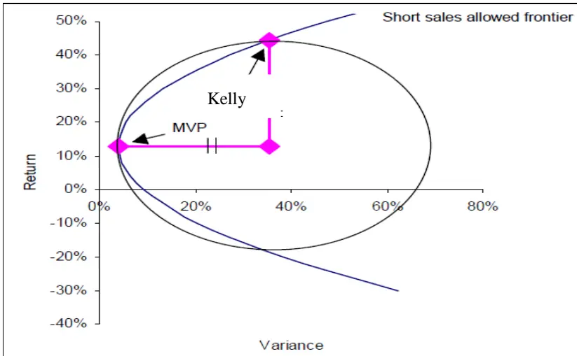
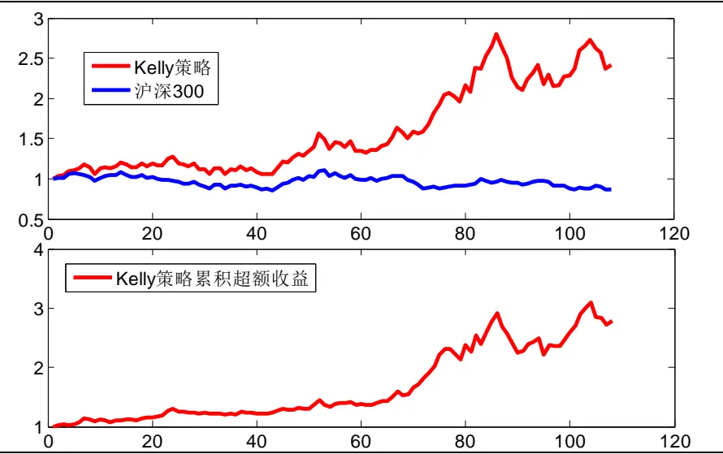
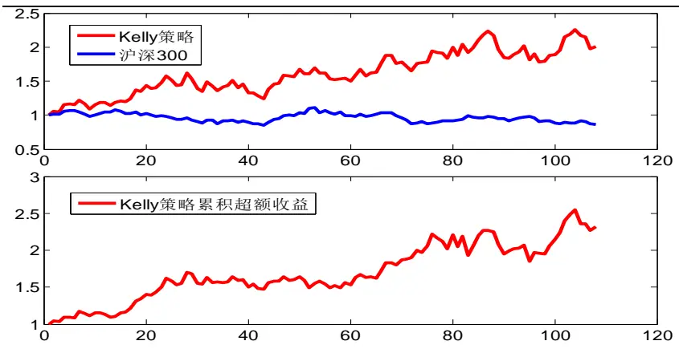
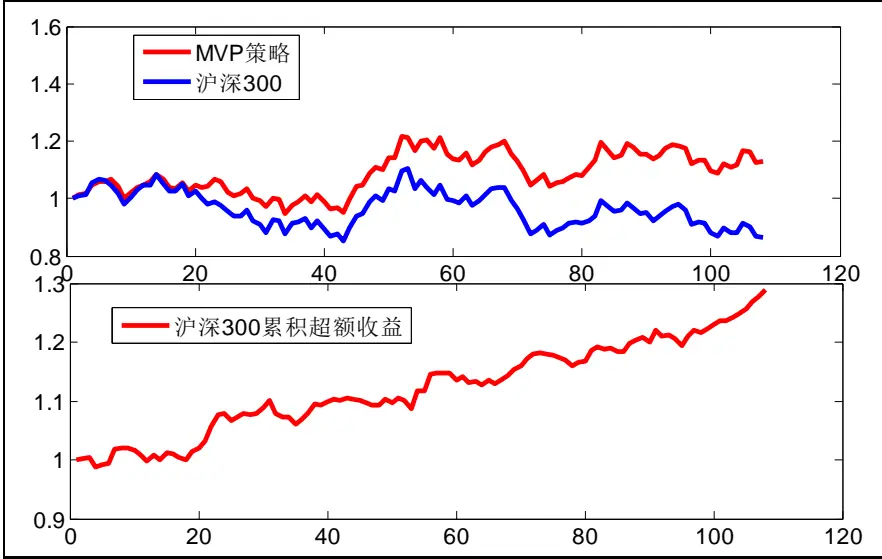
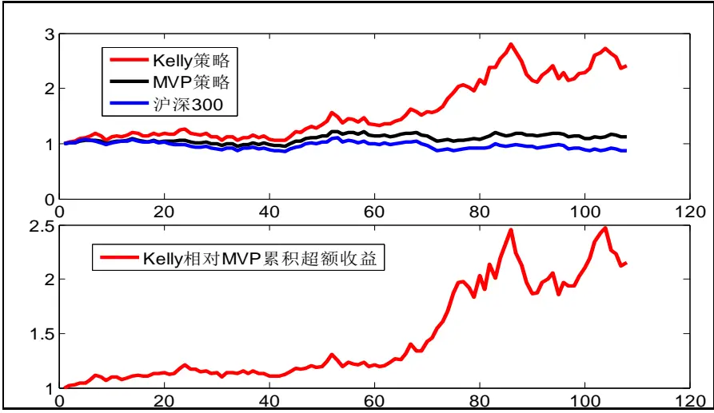

2014.03.14

# Kelly 公式在行业配置中的应用二

# ——数量化专题之三十九

玉刘富兵（分析师）

8 021-38676673

liufubing008481@gtjas.com

证书编号 S0880511010017

本报告导读：我们在假定股票价格服从几何布朗运动的情况下，得到了Kelly公式，并将其应用于行业配置中，取得了良好的效果：在一级行业中年化超额收益达 48%，胜率超 60%，夏普比率达 1.7。

## 摘要：

[Table_Summary] • 在《Kelly 公式在行业配置中的应用一》中，我们用简单的贝努利分布来表示股票市场的概率分布，虽然效果尚可，但这一假定可能与实际有较大的出入。为此，我们改进概率分布假设，运用市场最常用的几何布朗运动，在连续时间下推导凯利公式。

- 事实上，Kelly 准则的几何增长率最大化等同于投资者的预期对数效用最大化。对比 Kelly 组合与MVP组合可以发现，Kelly 组合具有更高的预期漂移率以及几何增长率，当然为此付出的代价是 Kelly组合具有更高的波动性。

我们构建的 Kelly策略在行业配置中取得了良好的效果。在过去的两年里，利用一级行业，Kelly策略获得了140%的绝对收益，跑赢 hs300 170%以上。用沪深 300对冲后，年化收益 60%以上，夏普率达 1.70，胜率超过 60%；唯一的缺憾是回撤大了点，为 24%。

- 利用二级行业，该策略获得了 100%的绝对收益，跑赢hs300130%。用沪深 300 对冲后，年化收益 48%，夏普率 1.3，胜率 56%。回撤仍然很高18%，但相比起一级行业有所下降。

- 对比 Kelly策略与MVP策略，从实证的角度来看，我们发现，Kelly 策略的收益率与波动率的确都比 MVP 策略高，不过从夏普率大于 1 来看，Kelly 策略的高收益较好的弥补了高波动的不足。

相比起第一篇贝努利分布的假设，股价服从几何布朗运动便显得更为合理、更贴近实际。不过，大量的学术文献与实证研究表明，股票价格不能简单的等同于几何布朗运动。能否在对股票不做任何概率分布假设的情况下得到Kelly公式将是我们下一篇报告要解决的问题，敬请关注我们关于 Kelly公式的后续研究报告。

金融工程

## 金融工程团队：

刘富兵：（分析师）

电话：021-38676673

邮箱：liufubing008481@gtjas.com

证书编号：S0880511010017

何苗：（分析师）

电话：010-59312710

邮箱：hemiao@gtjas.com

证书编号：S0880511010049

## 严佳炜：（分析师）

电话：021-38674812

邮箱：yanjiawei008776@gtjas.com

证书编号：S0880512110001

## 耿帅军：（分析师）

电话：010-59312753

邮箱：gengshuaijun@gtjas.com

证书编号：S0880513080013

## 徐康：（分析师）

电话：021-38674939

邮箱：xukang010849@gtjas.com

证书编号：S0880513080018

## 赵延鸿：（研究助理）

电话：021-38674927邮箱：zhaoyanhong@gtjas.com证书编号：S0880113070047

## 陈睿：（研究助理）

电话：021-38675861

邮箱：chenrui012896@gtjas.com

证书编号：S0880112120012

## 刘正捷：（研究助理）

电话：021-38675860

邮箱：liuzhengjie012509@gtjas.com

证书编号：S0880112080087

## [Table_R相关报告

《个股及股指期权仿真交易规则详解》2014.03.06

《Kelly 公式在行业配置中的应用一》2014.02.26

《预期风险下，基于业绩快报的 PEAD 投资策略》2014.02.24

《业绩预告解析之二：超预期》2014.02.18

《业绩预告解析之一：高增长》2014.02.17

## 1. 由贝努利分布到几何布朗运动

在《Kelly 公式在行业配置中的应用一》中，我们用简单的贝努利分布来表示股票市场的概率分布，虽然效果尚可，但这一假定可能与实际有较大的出入。为此，我们改进概率分布假设，运用市场最常用的几何布朗运动，在连续时间下推导凯利公式，并将其运用在行业配置上。

假定市场中有 n只股票，其在 t时刻的价格服从几何布朗运动，即

$$
dS_{i}=\mu_{i}S_{i}dt+\sigma_{i}S_{i}dz_{t}
$$

其中 $\mu_{\textit{ i }}$ 是漂移率， $z_{t}$ 是标准的维纳过程。

利用 Ito引理，我们可以得到

$$
\ln\frac{S_{_i}(t)}{S_{_i}(0)}=(\mu-\frac{1}{2}\sigma_{_i}^{^2})t+\sigma_{_i}z_{_i}
$$

因此股票 $S_{\textit{ i }}$ 的几何增长率为：

$$
G_{i}=E[\ln\frac{S_{i}(t)}{S_{i}(0)}]=(\mu_{i}-\frac{1}{2}\sigma_{i}^{2})t
$$

同时， $\ln\frac{S_{_i}(t)}{S_{_i}(0)}$ 的方差为

$$
V\left[\ln\frac{S_i(t)}{S_i(0)}\right]=\sigma_i^2t
$$

## 2. 连续时间几何布朗运动下 Kelly 准则的确定

假定一投资组合 P，其在 n 只股票上的投资权重为 $\mathbf{w}^{\mathrm{~T~}}=(w_{1},w_{2}$ ,Ⅲ, $\boldsymbol{w}_{{n}})$

则该组合在 t时刻的价格 $S_{\mathrm{~}_{P}}$ 也服从几何布朗运动，即

$$
dS_{_P}=\mu_{_P}S_{_P}dt+\sigma_{_P}S_{_P}dz_{_t}
$$

则组合 P 的年化几何增长率为

$$
\begin{aligned}{g_{_{P}}\:=\:\frac{G_{_{P}}}{t}=\:(\:\mu_{_{P}}\:-\:\frac{1}{2}\:\sigma_{_{P}}^{^{2}})\:}\\{}\\{=\:(\:\mathbf{w}^{^{\mathrm{\tiny~T}}}\pmb{\mu}\:-\:\frac{1}{2}\:\mathbf{w}^{^{\mathrm{\tiny~T}}}\Sigma\:\mathbf{w}\:)\:.}\\\end{aligned}
$$

其中 $\boldsymbol{\mu}=(\mu_{1},\mu_{2},\square\square,\mu_{n}),\boldsymbol{\Sigma}=(\sigma_{ij})_{n\times n}$ 表示收益率的方差协方差矩阵。

Kelly 准则就是要使得资 $\text{· }产$ 组合的预期年化增长率达到最大化，即选择最优的w ，使得 $\textbf{ w }^{\mathrm{T}}\pmb{\mu}-\frac{1}{2}\textbf{ w }^{\mathrm{T}}\boldsymbol{\Sigma}\mathbf{w}$ 最大化。

## 2.1. Kelly 最优投资比例

本节我们主要利用拉格朗日乘数来求解 Kelly最优投资比例。Kelly 最优投资比例的求解问题可以转换为如下的优化求解：

$$
\begin{array}{l}{\displaystyle\mathop{\operatorname*{max}}_{\mathbf{w}}\mathop{\mathbf{w}}^{\mathrm{\tiny~T~}}\pmb{\mu}-\frac{1}{2}\mathbf{w}^{\mathrm{\tiny~T~}}\boldsymbol{\Sigma}\mathbf{w}}\\{\displaystyle\mathbf{w}^{\mathrm{\tiny~T~}}\mathbf{1}=1}\end{array}
$$

其中1 = (1,1,,1)

令 $L=\mathbf{w}^{^{\mathrm{T}}}\pmb{\mu}-\frac{1}{2}\mathbf{w}^{^{\mathrm{T}}}\Sigma\mathbf{w}-\lambda(\mathbf{w}^{^{\mathrm{T}}}\mathbf{1}-1).$ ，并令 $\frac{\partial L}{\partial\mathbf{w}}=0,\frac{\partial L}{\partial\lambda}=0$ ，则有 
- μ - Σ w - e 0 
w e − 1 = 0

注意到 $\mathbf{w}^{\mathrm{~T~}}\mathbf{e}=\mathbf{e}^{\mathrm{~T~}}\mathbf{w}$ ，且 $\mathbf{\Sigma}^{-1}\mathbf{\Sigma}=\mathbf{I}$ ，则有

$$
1=\mathbf{e}^{\mathrm{\tiny~T~}}\Sigma^{\mathrm{\tiny~-1~}}\Sigma\mathbf{w}
$$

对方程μ- Σw - λe = 0 两边同时左乘 $\mathbf{e^{\mathrm{~T~}}\Sigma^{\mathrm{~-~1~}}}$ 可以得到

$$
\lambda=\frac{\mathbf{e}^{\mathrm{T}}\boldsymbol{\Sigma}^{-1}\boldsymbol{\mu}-1}{\mathbf{e}^{\mathrm{T}}\boldsymbol{\Sigma}^{-1}\mathbf{e}}
$$

将上式带入关于w 的方程可得 Kelly 最优投资比例为：

$$
\begin{aligned}&\mathbf{w}^{^{*}}=\boldsymbol{\Sigma}^{^{-1}}(\boldsymbol{\mu}-\lambda\mathbf{e})=\boldsymbol{\Sigma}^{^{-1}}(\boldsymbol{\mu}-\mathbf{e}\frac{\mathbf{e}^{^{\mathrm{T}}}\boldsymbol{\Sigma}^{^{-1}}\boldsymbol{\mu}-1}{\mathbf{e}^{^{\mathrm{T}}}\boldsymbol{\Sigma}^{^{-1}}\mathbf{e}})\\&=\boldsymbol{\Sigma}^{^{-1}}(\mathbf{I}-\frac{\mathbf{e}\mathbf{e}^{^{\mathrm{T}}}\boldsymbol{\Sigma}^{^{-1}}}{\mathbf{e}^{^{\mathrm{T}}}\boldsymbol{\Sigma}^{^{-1}}\mathbf{e}})\boldsymbol{\mu}+\frac{\boldsymbol{\Sigma}^{^{-1}}\mathbf{e}}{\mathbf{e}^{^{\mathrm{T}}}\boldsymbol{\Sigma}^{^{-1}}\mathbf{e}}=\mathbf{A}\boldsymbol{\mu}+\mathbf{B}\\\end{aligned}
$$

其中

$$
\mathbf{A}\;=\;\boldsymbol{\Sigma}^{\mathrm{\tiny~-1}}(\mathbf{I}\mathrm{~-~}\frac{\mathbf{e}\mathbf{e}^{\mathrm{\tiny~T~}}\boldsymbol{\Sigma}^{\mathrm{\tiny~-1~}}}{\mathbf{e}^{\mathrm{\tiny~T~}}\boldsymbol{\Sigma}^{\mathrm{\tiny~-1~}}\mathbf{e}}).
$$

$$
\bf{B}=\frac{\Sigma^{-1}e}{e^{^T}\Sigma^{-1}e}
$$

## 2.2. Kelly 最优投资比例的性质

由 $G_{_i}=E[\ln\frac{S_{_i}(t)}{S_{_i}(0)}]=(\mu_{_i}-\frac{1}{2}\sigma_{_i}^{^2})t$ 可知， Kelly 准则事实上就等同于投资者的预期对数效用最大化。

令 $\mathbf{e}^{\mathrm{\tiny~T~}}\Sigma^{\mathrm{\tiny~-1~}}\mathbf{e}=d$ ，很容易证明，

$$
\mathbf{A}^{\textsf{T}}\mathbf{\Sigma}\mathbf{A}\;=\;\mathbf{A}\;,\mathbf{A}^{\textsf{T}}\mathbf{\Sigma}\mathbf{B}\;=\;\mathbf{0}\;,\mathbf{B}^{\textsf{T}}\mathbf{\Sigma}\mathbf{B}\;=1\;/\;d
$$

则 Kelly最优投资组合的预期漂移率为

$$
\boldsymbol{\mu}^{*}=\boldsymbol{\mu}^{\mathrm{{\tiny~T~}}}\boldsymbol{\mathbf{w}}^{*}=\boldsymbol{\mu}^{\mathrm{{\tiny~T~}}}(\mathbf{A}\boldsymbol{\mu}+\mathbf{B})
$$

Kelly 最优投资组合的方差协方差矩阵为

$$
\begin{aligned}&\sigma_{_P}^{^{\mathrm{~\tiny~*~2~}}}=\mathbf{w}^{^{\mathrm{\tiny~*~T~}}}\boldsymbol{\Sigma}\mathbf{w}^{^{\mathrm{\tiny~*~}}}=\left(\mathbf{A}\boldsymbol{\mu}+\mathbf{B}\right)^{^{\mathrm{T}}}\boldsymbol{\Sigma}\left(\mathbf{A}\boldsymbol{\mu}+\mathbf{B}\right)\\&\quad=\boldsymbol{\mu}^{^{\mathrm{T}}}\mathbf{A}\boldsymbol{\mu}+1/d\\\end{aligned}
$$

Kelly 最优投资组合的几何增长率为

$$
g^{^{*}}=\mu^{^{*}}-\frac{1}{2}\sigma^{^{*2}}=\mu^{^{\mathrm{T}}}(\frac{1}{2}\mathrm{A}\mu+\mathrm{B})-\frac{1}{2d}
$$

## 2.3.Kelly 最优投资组合与最小方差组合的比较

最小方差组合（MVP）是指满足如下条件的投资组合

$$
\begin{aligned}\underset{\mathbf{w}}{\min}&\frac{1}{2}\mathbf{w}^{\mathrm{T}}\boldsymbol{\Sigma}\mathbf{w}\\\mathbf{w}^{\mathrm{T}}\mathbf{1}&=1\end{aligned}
$$

利用拉格朗日乘数，可以证明上述优化问题的最优解 $\textbf{ w }^{0}$ 为

$$
\mathbf{w}^{^{0}}=\frac{{\boldsymbol{\Sigma}}^{^{-1}}\mathbf{e}}{\mathbf{e}^{^{\mathrm{~T~}}}{\boldsymbol{\Sigma}}^{^{-1}}\mathbf{e}}=\mathbf{B}.
$$

对比 Kelly 组合与 MVP 组合，我们有如下性质比较：

表 1 Kelly 组合与 MVP 组合比较

|  | MVP 组合 | Kelly 组合 |
| --- | --- | --- |
| 投资权重 | B | $\mathbf{A}\pmb{\mu}+\mathbf{B}$ |
| 预期漂移率 | $\boldsymbol{\mu}^{\mathrm{~r~}}\mathbf{B}$ | $\pmb{\mu}^{\mathrm{~T~}}\mathbf{A}\;\pmb{\mu}\;+\;\pmb{\mu}^{\mathrm{~T~}}\mathbf{B}$ |
| 方差 | $\frac{1}{d}$ | $\pmb{\mu}^{\mathrm{\tiny~T~}}\mathbf{A}\;\pmb{\mu}\;+\frac{1}{d}.$ |
| 几何增长率 | $\pmb{\mu}^{\mathrm{\tiny~T~}}\pmb{B}=\frac{1}{2d}$ | $\boldsymbol{\mu}^{\mathrm{\tiny~T~}}\mathbf{A}\boldsymbol{\mu}+\boldsymbol{\mu}^{\mathrm{\tiny~T~}}\mathbf{B}-\frac{1}{2d}$ |

数据来源：国泰君安证券研究

可以证明，矩阵 A是半正定的，因此，对于任意向量 a，有

$$
\mathbf{a}^{\mathrm{\tiny~T~}}\mathbf{A}\mathbf{a}\geq0
$$

由表 1 可知，Kelly组合的预期漂移率、方差以及几何增长率都要比 MVP组合的高，两者的关系也可以用下图直观表示：

图 1 Kelly 组合与 MVP 组合的对照

数据来源：国泰君安证券研究

## 3. Kelly 公式在行业配置中的应用

我们选择中信一级行业作为配置标的，选择的数据是从 2009 年至今的周数据。若令 $P_{i,t}$ 表示第 t期第 i个行业的收盘价， $\boldsymbol{\textit{ g }}_{i,t}$ 表示第 t期第 i

个行业的几何增长率，g 表示 i 行业的年化增长率，则

$$
g_{i,t}=\ln\left(P_{i,t}/P_{i,t-1}\right)
$$

$$
\hat{g}_{_{i}}=\frac{1}{n}\sum_{_{t=1}}^{n}\;g_{_{i,t}}^{*}50.
$$

利用 $\boldsymbol{\textit{ g }}_{i,i}$ 我们可以估算方差协方差矩阵，其中

$$
\begin{aligned}\hat{\sigma_{_i}}^{^2}=&\sigma_{_{g_i}}^{^2}*50\\\hat{\sigma_{_{ij}}}=&\mathrm{cov}(g_{_i},g_{_j})*50\end{aligned}
$$

对于预期漂移率的估算，我们可以利用下面的等式进行估计

$$
\hat{\mu}_{_{i}}=\hat{g}_{_{i}}+\frac{1}{2}\hat{\sigma_{_{i}}}^{2}
$$

## 3.1.Kelly 公式在一级行业资产配置中的应用

将上述最优组合构建运用于一级行业的周数据中，我们发现 Kelly 策略取得了良好的效果，在过去的两年里，Kelly策略获得了 140%的绝对收益，跑赢 hs300 170%以上。用沪深 300 对冲后，年化收益 60%以上，夏普率达 1.70，胜率超过 60%；唯一的缺憾是回撤大了点，为 24%。具体表现如下面图表所示：

图 2 Kelly 公式在一级行业资产配置中的应用

数据来源：国泰君安证券研究，wind

表 2 Kelly 一级行业策略与沪深 300 对冲策略结果统计

| 统计指标 | 数值 |
| --- | --- |
| 财富终值 | 2.78 |
| 交易胜率 | 62.62% |
| 年化收益率 | 61.29% |
| 年化波动率 | 28.36% |
| 夏普比率 | 1.73 |
| 最大回撤 | 23.87% |
| VaR | -6.82% |
| ES | -8.27% |

数据来源：国泰君安证券研究，wind

## 3.2.Kelly 公式在二级行业资产配置中的应用

将 Kelly 公式运用到二级行业的周数据中，我们得到了类似的效果。过去两年里，该策略获得了 100%的绝对收益，跑赢 hs300 130%。用沪深300对冲后，年化收益 48%，夏普率 1.3，胜率 56%。回撤仍然很高 18%，但相比起一级行业有所下降。具体表现如下面图表所示：

图 3 Kelly 公式在二级行业资产配置中的应用

数据来源：国泰君安证券研究，wind

表 3 Kelly二级行业策略与沪深 300对冲策略结果统计

| 统计指标 | 数值 |
| --- | --- |
| 财富终值 | 2.32 |
| 交易胜率 | 56.07% |
| 年化收益率 | 48.14% |
| 年化波动率 | 30.88% |
| 夏普比率 | 1.33 |
| 最大回撤 | 18.40% |
| VaR | -7.68% |
| ES | -11.27% |

数据来源：国泰君安证券研究，wind

## 3.3. Kelly 策略与 MVP 策略的实证比较

本节我们将 Kelly策略与MVP 策略做下实证比较，以一级行业为例，将同样的数据运用于 MVP 策略，我们看到 MVP 策略具有以下表现：

图 4 Kelly 公式在一级行业资产配置中的应用

表 4 MVP策略与沪深 300对冲策略结果统计

| 统计指标 | 数值 |
| --- | --- |
| 财富终值 | 1.29 |
| 交易胜率 | 60.75% |
| 年化收益率 | 12.56% |
| 年化波动率 | 6.13% |
| 夏普比率 | 1.47 |
| 最大回撤 | 3.79% |
| VaR | -1.46% |
| ES | -1.77% |

数据来源：国泰君安证券研究，wind

对比 Kelly 策略与 MVP 策略，我们发现，正如前面所阐述的 Kelly 策略性质一样，Kelly策略的收益率与波动率都要比 MVP策略高，不过从夏普率大于 1 来看，Kelly 策略的高收益较好的弥补了高波动的不足。具体比较如下面的图标所示：

图 5 Kelly 策略与 MVP 策略收益比较

数据来源：国泰君安证券研究，wind

表 5 Kelly 策略与 MVP 策略比较

| 统计指标 | 数值 |
| --- | --- |
| 交易胜率 | 63.55% |
| 年化超额收益 | 43.19% |
| 年化超额收益波动率 | 28.22% |
| 夏普比率 | 1.31 |
| 最大回撤 | 24.51% |
| VaR | -7.02% |
| ES | -8.55% |

数据来源：国泰君安证券研究，wind

## 4. 总结及展望

本文，我们假定股票价格服从几何布朗运动，并在此基础上推导出了投资组合的 Kelly 准则。事实上，Kelly准则的几何增长率最大化等同于投资者的预期对数效用最大化。对比 Kelly 组合与 MVP 组合可以发现，Kelly 组合具有更高的预期漂移率以及几何增长率，当然为此付出的代价是 Kelly组合具有更高的波动性。

无论是应用于一级行业还是二级行业，Kelly策略均取得了良好的效果。此外 Kelly 策略与 MVP 策略的实证比较也进一步佐证了 Kelly 策略所具备的特性。

相比起第一篇贝努利分布的假设，股价服从几何布朗运动便显得更为合理、更贴近实际。不过，大量的学术文献与实证研究表明，股票价格不能简单的等同于几何布朗运动。能否在对股票不做任何概率分布假设的情况下得到 Kelly 公式呢？这将是我们下一篇报告要解决的问题，敬请关注我们关于 Kelly 公式的后续研究报告。

## 本公司具有中国证监会核准的证券投资咨询业务资格

## 分析师声明

作者具有中国证券业协会授予的证券投资咨询执业资格或相当的专业胜任能力，保证报告所采用的数据均来自合规渠道，分析逻辑基于作者的职业理解，本报告清晰准确地反映了作者的研究观点，力求独立、客观和公正，结论不受任何第三方的授意或影响，特此声明。

## 免责声明

本报告仅供国泰君安证券股份有限公司（以下简称“本公司”）的客户使用。本公司不会因接收人收到本报告而视其为本公司的当然客户。本报告仅在相关法律许可的情况下发放，并仅为提供信息而发放，概不构成任何广告。

本报告的信息来源于已公开的资料，本公司对该等信息的准确性、完整性或可靠性不作任何保证。本报告所载的资料、意见及推测仅反映本公司于发布本报告当日的判断，本报告所指的证券或投资标的的价格、价值及投资收入可升可跌。过往表现不应作为日后的表现依据。在不同时期，本公司可发出与本报告所载资料、意见及推测不一致的报告。本公司不保证本报告所含信息保持在最新状态。同时，本公司对本报告所含信息可在不发出通知的情形下做出修改，投资者应当自行关注相应的更新或修改。

本报告中所指的投资及服务可能不适合个别客户，不构成客户私人咨询建议。在任何情况下，本报告中的信息或所表述的意见均不构成对任何人的投资建议。在任何情况下，本公司、本公司员工或者关联机构不承诺投资者一定获利，不与投资者分享投资收益，也不对任何人因使用本报告中的任何内容所引致的任何损失负任何责任。投资者务必注意，其据此做出的任何投资决策与本公司、本公司员工或者关联机构无关。

本公司利用信息隔离墙控制内部一个或多个领域、部门或关联机构之间的信息流动。因此，投资者应注意，在法律许可的情况下，本公司及其所属关联机构可能会持有报告中提到的公司所发行的证券或期权并进行证券或期权交易，也可能为这些公司提供或者争取提供投资银行、财务顾问或者金融产品等相关服务。在法律许可的情况下，本公司的员工可能担任本报告所提到的公司的董事。

市场有风险，投资需谨慎。投资者不应将本报告为作出投资决策的惟一参考因素，亦不应认为本报告可以取代自己的判断。在决定投资前，如有需要，投资者务必向专业人士咨询并谨慎决策。

本报告版权仅为本公司所有，未经书面许可，任何机构和个人不得以任何形式翻版、复制、发表或引用。如征得本公司同意进行引用、刊发的，需在允许的范围内使用，并注明出处为“国泰君安证券研究”，且不得对本报告进行任何有悖原意的引用、删节和修改。

若本公司以外的其他机构（以下简称“该机构”）发送本报告，则由该机构独自为此发送行为负责。通过此途径获得本报告的投资者应自行联系该机构以要求获悉更详细信息或进而交易本报告中提及的证券。本报告不构成本公司向该机构之客户提供的投资建议，本公司、本公司员工或者关联机构亦不为该机构之客户因使用本报告或报告所载内容引起的任何损失承担任何责任。

## 评级说明

## 1.投资建议的比较标准

投资评级分为股票评级和行业评级。

以报告发布后的12个月内的市场表现为比较标准，报告发布日后的12个月内的公司股价（或行业指数）的涨跌幅相对同期的沪深300指数涨跌幅为基准。

## 2.投资建议的评级标准

报告发布日后的 12 个月内的公司股价（或行业指数）的涨跌幅相对同期的沪深300指数的涨跌幅。

| 评级 |  | 说明 |
| --- | --- | --- |
| 股票投资评级 | 增持 | 相对沪深 300指数涨幅15%以上 |
|  | 谨慎增持 | 相对沪深300指数涨幅介于5%～15%之间 |
|  | 中性 | 相对沪深300指数涨幅介于-5%～5% |
|  | 减持 | 相对沪深300指数下跌5%以上 |
| 行业投资评级 | 增持 | 明显强于沪深 300 指数 |
|  | 中性 | 基本与沪深300指数持平 |
|  | 减持 | 明显弱于沪深300指数 |

## 国泰君安证券研究

|  | 上海 | 深圳 | 北京 |
| --- | --- | --- | --- |
| 地址 | 上海市浦东新区银城中路168号上海 银行大厦29层 | 深圳市福田区益田路 6009 号新世界 商务中心34层 | 北京市西城区金融大街 28 号盈泰中 心2号楼10层 |
| 邮编 | 200120 | 518026 | 100140 |
| 电话 | （021)38676666 | (0755)23976888 | (010)59312799 |
|  | E-mail: gtjaresearch@gtjas.com |  |  |