2014.04.11

# 年线与股票价格走势关系分析

# ——数量化专题之四十

刘富兵（分析师）

赵延鸿（研究助理）

8 021-38676673

liufubing008481@gtjas.com

021-38674927

证书编号 S0880511010017

zhaoyanhong@gtjas.com

S0880113070047

## 本报告导读：

从股票换手率、涨停板、持有期收益、股价安全买入点、拐点分布等维度，比较了年线之上与年线之下股票价格走势特征的差异。

## 摘要：

[Table_Summary] • 股票在年线之上交易活跃还是年线之下? 沪深300指数成份股中，年线之上日均换手率与年线之下日均换手率比值，有284 支股票的比值大于 1，占比高达 96%， 其中换手率比值大于 2的股票多达122支，占比 41%。

随机买入一支股票，持有 20 个交易日，在年线之上买入平均收益率高还是年线之下买入收益率高？答案是年线之上。对沪深指数所有 300支成份股综合统计显示，年线之上买入持有 20个交易日平均收益4%，而年线之下买入持有 20个交易日平均收益仅为0.7%。

- 股票在年线之上买入安全还是年线之下买入安全？这里的“安全”定义为股价在跌 10%之前会先涨 10%。统计显示：沪深 300指数成份股中，当股价位于年线之上买入时，有 214支股票先涨 10%的概率大于先跌 10%；当股价位于年线之下买入时，则只有 128支股票的先涨10%的概率大于先跌10%。如不考虑其他因素，对于大多数股票，价格在年线之上随机买入，整体安全性高于年线之下。

股价中级别以上拐点一般出现在什么位臵？以 20%作为分段参数对所有股票价格分段之后，得到顶部拐点和底部拐点。沪深 300 支成份股，总共出现顶部拐点 2347 个，其中 1936个顶部拐点位于年线之上，占比 82.5%。总共出现底部拐点2337 个，其中1679个底部拐点位于年线之下，占比 71.8%。

动量因子如何使用更有效？对沪深 300成份股统计显示：一旦价格反弹 10%，当年线处于下降趋势，从底部拐点到顶部拐点平均涨幅高达 31%；反之当年线处于上涨趋势中，从底部拐点到顶部拐点平均涨幅为 26%。下跌趋势对应的涨幅标准差为 21.1%，而上涨趋势对应的涨幅标准差仅为 13.3%。

金融工程

## 金融工程团队：

刘富兵：（分析师）

电话：021-38676673

邮箱：liufubing008481@gtjas.com

证书编号：S0880511010017

何苗：（分析师）

电话：010-59312710

邮箱：hemiao@gtjas.com

证书编号：S0880511010049

## 严佳炜：（分析师）

电话：021-38674812

邮箱：yanjiawei008776@gtjas.com

证书编号：S0880512110001

## 耿帅军：（分析师）

电话：010-59312753

邮箱：gengshuaijun@gtjas.com

证书编号：S0880513080013

## 徐康：（分析师）

电话：021-38674939

邮箱：xukang010849@gtjas.com

证书编号：S0880513080018

## 赵延鸿：（研究助理）

电话：021-38674927

邮箱：zhaoyanhong@gtjas.com

证书编号：S0880113070047

## 陈睿：（研究助理）

电话：021-38675861

邮箱：chenrui012896@gtjas.com

证书编号：S0880112120012

## 刘正捷：（研究助理）

电话：0755-23976803

邮箱：liuzhengjie012509@gtjas.com

证书编号：S0880112080087

## [Table_R相关报告

《沪深 300 期指合约折价现象探究》2014.04.06

《期权应用之交易策略篇》2014.03.19

《 Kelly 公 式 在 行 业 配 臵 中 的 应 用 二 》2014.03.13

《个股及股指期权仿真交易规则详解》2014.03.06

《Kelly 公式在行业配臵中的应用一》2014.02.26

## 1. 日均换手率比较（年线之上与之下）

年线定义为250日均线，任何一个时点价格要么处于年线之上要么处于年线之下，也就是说年线把价格区间一分为二。年线自身也有趋势，有的年线趋势向上，有的趋势向下，有的年线横向震荡，年线的走势代表了股价的趋势形态。报告中，我们从换手率、涨停板、持有期收益、股价安全买入点、拐点分布等维度，比较了年线之上与年线之下股票价格走势特征的差异。

一般而言，无论大盘还是个股，当价格处于年线之上时，市场成交会趋于活跃，反之，当价格落于年线之下，市场成交趋于萎缩。我们以沪深 300 指数成份股为样本，分析从 2006 年以来成份股股价位于年线之上和之下日均换手率的情况，由于有些成份股价格序列不足250个交易日，我们会在分析时将其剔除掉。统计显示列入样本的296支股票，年线之上日均换手率与年线之下日均换手率比值，有284支股票的比值大于1，占比高达96%， 其中换手率比值大于2的股票数多达122支，占比 41%。

年线之上日均换手率与年线之下日均换手率比值排名最高的为金钼股份（601958.SH），年线之上的日均换手率为 4.68%，年线之下的日均换手率为 0.53%，二者比值高达 8.76。

表 1：年线之上与之下的日均换手率比较（基于比值排序）

| 证券代码 | 证券名称 | 日均换手率(%)： 年线之上 | 日均换手率 (%)：年线之下 | 年线之上交易日 数 | 年线之下交易日 数 | 比值 |
| --- | --- | --- | --- | --- | --- | --- |
| 601958.SH | 金钼股份 | 4.68 | 0.53 | 376 | 792 | 8.76 |
| 600028.SH | 中国石化 | 1.66 | 0.23 | 860 | 1056 | 7.31 |
| 000776.SZ | 广发证券 | 4.95 | 0.84 | 440 | 604 | 5.91 |
| 601899.SH | 紫金矿业 | 2.94 | 0.56 | 320 | 837 | 5.24 |
| 002269.SZ | 美邦服饰 | 1.89 | 0.39 | 493 | 580 | 4.90 |
| 601898.SH | 中煤能源 | 2.75 | 0.60 | 319 | 895 | 4.61 |
| 600027.SH | 华电国际 | 2.25 | 0.49 | 921 | 978 | 4.58 |
| 601106.SH | 中国一重 | 4.04 | 0.91 | 18 | 709 | 4.44 |
| 600221.SH | 海南航空 | 3.11 | 0.73 | 890 | 961 | 4.28 |
| 601618.SH | 中国中冶 | 2.69 | 0.64 | 21 | 797 | 4.23 |
| 600011.SH | 华能国际 | 1.28 | 0.32 | 956 | 945 | 4.05 |
| 600642.SH | 申能股份 | 1.85 | 0.46 | 909 | 1002 | 4.03 |
| 601998.SH | 中信银行 | 1.30 | 0.32 | 431 | 962 | 4.01 |
| 601118.SH | 海南橡胶 | 8.75 | 2.19 | 121 | 385 | 4.00 |
| 000156.SZ | 华数传媒 | 13.65 | 3.45 | 306 | 34 | 3.96 |
| 600010.SH | 包钢股份 | 3.62 | 0.93 | 974 | 885 | 3.91 |
| 600832.SH | 东方明珠 | 1.86 | 0.49 | 1018 | 901 | 3.83 |
| 601766.SH | 中国南车 | 1.97 | 0.53 | 556 | 524 | 3.71 |
| 600018.SH | 上港集团 | 0.40 | 0.11 | 511 | 998 | 3.70 |
| 601866.SH | 中海集运 | 2.04 | 0.56 | 446 | 803 | 3.64 |
| 000630.SZ | 铜陵有色 | 4.40 | 1.22 | 928 | 971 | 3.62 |
| 000536.SZ | 华映科技 | 3.74 | 1.04 | 1092 | 259 | 3.58 |
| 600219.SH | 南山铝业 | 4.08 | 1.16 | 821 | 1086 | 3.51 |
| 601600.SH | 中国铝业 | 1.36 | 0.39 | 266 | 1110 | 3.51 |
| 002299.SZ | 圣农发展 | 3.37 | 0.97 | 235 | 519 | 3.48 |
| 600663.SH | 陆家嘴 | 1.87 | 0.54 | 922 | 995 | 3.45 |
| 601857.SH | 中国石油 | 0.89 | 0.26 | 294 | 984 | 3.43 |
| 600050.SH | 中国联通 | 2.19 | 0.65 | 862 | 1056 | 3.36 |
| 601168.SH | 西部矿业 | 3.74 | 1.13 | 359 | 983 | 3.30 |
| 000768.SZ | 中航飞机 | 3.20 | 0.98 | 959 | 859 | 3.28 |
| 600068.SH | 葛洲坝 | 2.66 | 0.81 | 989 | 884 | 3.27 |
| 600497.SH | 驰宏锌锗 | 3.36 | 1.05 | 910 | 859 | 3.21 |
| 000060.SZ | 中金岭南 | 3.32 | 1.05 | 969 | 920 | 3.15 |
| 600895.SH | 张江高科 | 2.18 | 0.70 | 881 | 1033 | 3.12 |
| 600019.SH | 宝钢股份 | 1.21 | 0.39 | 921 | 991 | 3.11 |
| 600177.SH | 雅戈尔 | 2.18 | 0.70 | 862 | 1005 | 3.10 |
| 600893.SH | 航空动力 | 3.22 | 1.04 | 1023 | 344 | 3.09 |
| 600688.SH | 上海石化 | 2.76 | 0.90 | 982 | 871 | 3.06 |
| 600208.SH | 新湖中宝 | 2.42 | 0.79 | 911 | 903 | 3.05 |

数据来源：国泰君安证券研究，WIND，（2006.1.21-2014.3.21）

年线之上股票换手率偏高的原因可以解释为：如果越来越多的投资者认为上市公司的股票价格还会上涨（未必是预期上市公司的价值上升），他们会更加积极地买入，随着价格的上涨，正反馈效应会吸引更多投资者参与交易，成交量则出现放大，成交量放大的根源，要么是参与交易某支股票的投资者数量增多，要么是原有投资者投入更多资金参与交易。由上述观察可知，参与年线之上的交易冲击成本会相对较低。

## 2. 股票涨停板出现频率比较

衡量市场活跃度除了换手率指标外，还可以观察股票涨停板出现的频率。涨停板出现频率反映了市场人气，通过分析年线之上和年线之下涨停板的出现频率，无论是对于机构投资者还是个人投资者可以更好地选择参与交易的时点。

假定把日涨幅大于 9%定义为涨停，在沪深 300 指数成份股中扣除在年线之下和年线之上都没有出现涨停板的 17 支股票之外，剩余的 283 支股票中，年线之上涨停板出现频率大于年线之下涨停板出现频率股票数量达到217支，而年线之上出现涨停板小于年线之下出现涨停板股票数量为 66支，不足三分之一。

其中像中国一重，年线之上涨停板出现频率是年线之下涨停板出现频率的 16.8 倍，广发证券 11倍，海南橡胶 8.6倍。

表 2：年线之上与之下的涨停板出现频率比较（涨幅大于 9%，基于比值排序）

| 证券代码 证券名称 |  | 日均涨停板频 率：年线之上 | 日均涨停板频 率：年线之下 | 年线之上 交易日数 | 年线之下 交易日数 | 比值 |
| --- | --- | --- | --- | --- | --- | --- |
| 601106.SH | 中国一重 | 7.14% | 0.43% | 14 | 705 | 16.79 |
| 000776.SZ | 广发证券 | 5.67% | 0.51% | 423 | 587 | 11.10 |
| 601118.SH | 海南橡胶 | 6.78% | 0.79% | 118 | 382 | 8.63 |
| 601958.SH | 金钼股份 | 1.93% | 0.26% | 362 | 778 | 7.52 |
| 000568.SZ | 泸州老窖 | 1.83% | 0.25% | 1039 | 799 | 7.31 |
| 600089.SH | 特变电工 | 2.07% | 0.29% | 1063 | 699 | 7.23 |
| 600999.SH | 招商证券 | 1.35% | 0.19% | 222 | 528 | 7.14 |
| 600271.SH | 航天信息 | 1.02% | 0.15% | 1178 | 684 | 6.97 |
| 000729.SZ | 燕京啤酒 | 0.85% | 0.12% | 1063 | 804 | 6.81 |
| 600893.SH | 航空动力 | 1.98% | 0.30% | 1009 | 331 | 6.56 |
| 600267.SH | 海正药业 | 1.81% | 0.28% | 1107 | 720 | 6.50 |
| 600018.SH | 上港集团 | 3.08% | 0.51% | 487 | 975 | 6.01 |
| 002230.SZ | 科大讯飞 | 2.33% | 0.39% | 858 | 257 | 5.99 |
| 601898.SH | 中煤能源 | 0.66% | 0.11% | 301 | 876 | 5.82 |
| 601989.SH | 中国重工 | 1.35% | 0.27% | 223 | 370 | 4.98 |
| 600718.SH | 东软集团 | 2.33% | 0.47% | 1031 | 846 | 4.92 |
| 000768.SZ | 中航飞机 | 3.40% | 0.71% | 941 | 841 | 4.77 |
| 600859.SH | 王府井 | 1.60% | 0.34% | 1000 | 879 | 4.69 |
| 601006.SH | 大秦铁路 | 0.90% | 0.21% | 554 | 974 | 4.40 |
| 000895.SZ | 双汇发展 | 1.76% | 0.41% | 911 | 483 | 4.24 |
| 600068.SH | 葛洲坝 | 2.85% | 0.68% | 984 | 879 | 4.17 |
| 600177.SH | 雅戈尔 | 1.69% | 0.41% | 827 | 970 | 4.11 |
| 600050.SH | 中国联通 | 1.19% | 0.29% | 838 | 1031 | 4.10 |
| 601866.SH | 中海集运 | 2.57% | 0.64% | 428 | 784 | 4.03 |
| 002001.SZ | 新和成 | 2.06% | 0.53% | 1118 | 756 | 3.89 |
| 000970.SZ | 中科三环 | 2.26% | 0.59% | 1151 | 673 | 3.80 |
| 601998.SH | 中信银行 | 1.20% | 0.32% | 417 | 948 | 3.79 |
| 002038.SZ | 双鹭药业 | 1.27% | 0.34% | 1571 | 296 | 3.77 |
| 600703.SH | 三安光电 | 2.43% | 0.65% | 1109 | 463 | 3.76 |

数据来源：国泰君安证券研究，WIND，（2006.1.21-2014.3.21）

创业板指数（399006）100 支成份股年线之下与之上涨停板出现情况分析。年线之上涨停板出现频率大于年线之下涨停板出现频率股票数目达到80支，其中50支个股年线之下没有出现过涨停板。年线之上出现涨停板小于年线之下出现涨停板股票数目为9支，剩余的11支股票年线上下都没有出现过涨停板。

表 3：创业板成份股年线之上与之下的涨停板出现频率比较（涨幅大于 9%，基于比值排序）

| 序列号 | 证券代码 | 证券名称 | 日均涨停板： 年线之上 | 日均涨停板： 年线之下 | 年线之上 交易日数 | 年线之下 交易日数 | 比值 |
| --- | --- | --- | --- | --- | --- | --- | --- |
| 1 | 300002.SZ | 神州泰岳 | 4.35% | 0.00% | 230 | 516 | 9999 |
| 2 | 300003.SZ | 乐普医疗 | 0.42% | 0.00% | 240 | 529 | 9999 |
| 3 | 300004.SZ | 南风股份 | 1.27% | 0.00% | 393 | 338 | 9999 |
| 4 | 300006.SZ | 莱美药业 | 0.39% | 0.00% | 519 | 178 | 9999 |
| 5 | 300012.SZ | 华测检测 | 1.08% | 0.00% | 465 | 251 | 9999 |
| 6 | 300014.SZ | 亿纬锂能 | 3.13% | 0.00% | 288 | 448 | 9999 |
| 7 | 300016.SZ | 北陆药业 | 0.77% | 0.00% | 390 | 383 | 9999 |
| 8 | 300020.SZ | 银江股份 | 1.13% | 0.00% | 355 | 337 | 9999 |
| 9 | 300024.SZ | 机器人 | 0.85% | 0.00% | 590 | 191 | 9999 |
| 10 | 300026.SZ | 红日药业 | 1.16% | 0.00% | 519 | 209 | 9999 |
| 11 | 300027.SZ | 华谊兄弟 | 3.86% | 0.00% | 389 | 323 | 9999 |
| 12 | 300034.SZ | 钢研高纳 | 0.63% | 0.00% | 479 | 232 | 9999 |
| 13 | 300037.SZ | 新宙邦 | 3.43% | 0.00% | 204 | 503 | 9999 |
| 14 | 300045.SZ | 华力创通 | 1.35% | 0.00% | 591 | 111 | 9999 |
| 15 | 300054.SZ | 鼎龙股份 | 0.50% | 0.00% | 402 | 275 | 9999 |
| 16 | 300058.SZ | 蓝色光标 | 0.35% | 0.00% | 564 | 24 | 9999 |
| 17 | 300064.SZ | 豫金刚石 | 0.63% | 0.00% | 159 | 516 | 9999 |
| 18 | 300068.SZ | 南都电源 | 0.39% | 0.00% | 256 | 413 | 9999 |
| 19 | 300070.SZ | 碧水源 | 0.22% | 0.00% | 453 | 203 | 9999 |
| 20 | 300072.SZ | 三聚环保 | 0.58% | 0.00% | 520 | 144 | 9999 |
| 21 | 300079.SZ | 数码视讯 | 0.62% | 0.00% | 325 | 290 | 9999 |
| 22 | 300083.SZ | 劲胜股份 | 1.85% | 0.00% | 270 | 362 | 9999 |
| 23 | 300090.SZ | 盛运股份 | 0.96% | 0.00% | 416 | 169 | 9999 |
| 24 | 300104.SZ | 乐视网 | 4.44% | 0.00% | 473 | 73 | 9999 |
| 25 | 300105.SZ | 龙源技术 | 1.38% | 0.00% | 145 | 415 | 9999 |
| 26 | 300110.SZ | 华仁药业 | 0.85% | 0 | 353 | 227 | 9999 |
| 27 | 300122.SZ | 智飞生物 | 0.54% | 0.00% | 369 | 191 | 9999 |
| 28 | 300124.SZ | 汇川技术 | 0.70% | 0.00% | 285 | 280 | 9999 |
| 29 | 300128.SZ | 锦富新材 | 0.27% | 0.00% | 371 | 180 | 9999 |
| 30 | 300133.SZ | 华策影视 | 2.11% | 0 | 412 | 79 | 9999 |
| 31 | 300144.SZ | 宋城股份 | 0.73% | 0.00% | 275 | 222 | 9999 |
| 32 | 300146.SZ | 汤臣倍健 | 1.07% | 0.00% | 466 | 19 | 9999 |
| 33 | 300168.SZ | 万达信息 | 0.96% | 0.00% | 415 | 63 | 9999 |
| 34 | 300170.SZ | 汉得信息 | 0.73% | 0.00% | 274 | 183 | 9999 |
| 35 | 300171.SZ | 东富龙 | 0.76% | 0.00% | 263 | 201 | 9999 |
| 36 | 300177.SZ | 中海达 | 1.01% | 0.00% | 397 | 56 | 9999 |
| 37 | 300197.SZ | 铁汉生态 | 0.53% | 0.00% | 374 | 57 | 9999 |
| 38 | 300207.SZ | 欣旺达 | 2.18% | 0.00% | 321 | 100 | 9999 |
| 39 | 300212.SZ | 易华录 | 2.76% | 0.00% | 399 | 0 | 9999 |
| 40 | 300228.SZ | 富瑞特装 | 0.75% | 0.00% | 402 | 7 | 9999 |
| 41 | 300229.SZ | 拓尔思 | 1.42% | 0.00% | 211 | 123 | 9999 |
| 42 | 300244.SZ | 迪安诊断 | 1.12% | 0.00% | 357 | 5 | 9999 |
| 43 | 300251.SZ | 光线传媒 | 4.98% | 0.00% | 281 | 81 | 9999 |
| 44 | 300253.SZ | 卫宁软件 | 1.98% | 0.00% | 354 | 2 | 9999 |
| 45 | 300273.SZ | 和佳股份 | 2.46% | 0.00% | 284 | 34 | 9999 |
| 46 | 300274.SZ | 阳光电源 | 3.90% | 0.00% | 231 | 71 | 9999 |
| 47 | 300291.SZ | 华录百纳 | 1.60% | 0.00% | 188 | 3 | 9999 |
| 48 | 300298.SZ | 三诺生物 | 1.43% | 0.00% | 210 | 0 | 9999 |
| 49 | 300303.SZ | 聚飞光电 | 2.23% | 0.00% | 224 | 0 | 9999 |
| 50 | 300315.SZ | 掌趣科技 | 2.60% | 0.00% | 77 | 0 | 9999 |
| 51 | 300336.SZ | 新文化 | 2.01% | 0.00% | 149 | 0 | 9999 |
| 52 | 300118.SZ | 东方日升 | 4.52% | 0.26% | 155 | 386 | 17.43 |
| 53 | 300148.SZ | 天舟文化 | 6.96% | 0.53% | 273 | 187 | 13.01 |
| 54 | 300044.SZ | 赛为智能 | 5.60% | 0.46% | 232 | 436 | 12.22 |
| 55 | 300185.SZ | 通裕重工 | 2.74% | 0.26% | 73 | 389 | 10.66 |
| 56 | 300101.SZ | 国腾电子 | 2.73% | 0.28% | 220 | 356 | 9.71 |
| 57 | 300052.SZ | 中青宝 | 10.09% | 1.15% | 218 | 436 | 8.80 |
| 58 | 300059.SZ | 东方财富 | 4.23% | 0.49% | 284 | 406 | 8.58 |
| 59 | 300071.SZ | 华谊嘉信 | 6.73% | 0.89% | 208 | 336 | 7.54 |
| 60 | 300172.SZ | 中电环保 | 2.77% | 0.45% | 253 | 221 | 6.11 |
| 61 | 300057.SZ | 万顺股份 | 1.60% | 0.28% | 312 | 359 | 5.75 |
| 62 | 300056.SZ | 三维丝 | 6.90% | 1.35% | 203 | 443 | 5.09 |
| 63 | 300113.SZ | 顺网科技 | 3.53% | 0.76% | 397 | 132 | 4.65 |
| 64 | 300015.SZ | 爱尔眼科 | 1.09% | 0.25% | 367 | 396 | 4.32 |
| 65 | 300077.SZ | 国民技术 | 2.78% | 0.85% | 144 | 471 | 3.27 |
| 66 | 300017.SZ | 网宿科技 | 2.78% | 0.96% | 468 | 311 | 2.88 |
| 67 | 300005.SZ | 探路者 | 1.40% | 0.53% | 571 | 190 | 2.66 |
| 68 | 300001.SZ | 特锐德 | 2.11% | 0.91% | 331 | 440 | 2.33 |
| 69 | 300137.SZ | 先河环保 | 1.77% | 0.80% | 282 | 251 | 2.23 |
| 70 | 300074.SZ | 华平股份 | 1.88% | 0.86% | 320 | 348 | 2.18 |
| 71 | 300088.SZ | 长信科技 | 2.05% | 1.22% | 341 | 245 | 1.68 |
| 72 | 300183.SZ | 东软载波 | 2.32% | 1.40% | 302 | 143 | 1.66 |
| 73 | 300157.SZ | 恒泰艾普 | 3.91% | 2.39% | 230 | 209 | 1.64 |
| 74 | 300096.SZ | 易联众 | 0.43% | 0.26% | 234 | 379 | 1.62 |
| 75 | 300205.SZ | 天喻信息 | 4.38% | 2.84% | 297 | 141 | 1.54 |
| 76 | 300147.SZ | 香雪制药 | 2.48% | 1.89% | 404 | 106 | 1.31 |
| 77 | 300238.SZ | 冠昊生物 | 2.11% | 1.65% | 142 | 242 | 1.28 |
| 78 | 300224.SZ | 正海磁材 | 0.86% | 0.73% | 116 | 275 | 1.19 |
| 79 | 300009.SZ | 安科生物 | 0.28% | 0.24% | 361 | 421 | 1.17 |
| 80 | 300032.SZ | 金龙机电 | 1.06% | 0.96% | 470 | 209 | 1.11 |
| 81 | 300204.SZ | 舒泰神 | 0.70% | 0.73% | 284 | 137 | 0.96 |
| 82 | 300022.SZ | 吉峰农机 | 0.72% | 0.81% | 139 | 615 | 0.88 |
| 83 | 300055.SZ | 万邦达 | 0.96% | 1.25% | 314 | 399 | 0.76 |
| 84 | 300135.SZ | 宝利沥青 | 1.10% | 1.59% | 365 | 126 | 0.69 |
| 85 | 300075.SZ | 数字政通 | 0.25% | 0.37% | 405 | 270 | 0.67 |
| 86 | 300187.SZ | 永清环保 | 0.98% | 1.67% | 407 | 60 | 0.59 |
| 87 | 300199.SZ | 翰宇药业 | 0.71% | 1.35% | 282 | 148 | 0.52 |
| 88 | 300239.SZ | 东宝生物 | 0.78% | 1.94% | 255 | 103 | 0.40 |
| 89 | 300152.SZ | 燃控科技 | 0.38% | 1.25% | 264 | 240 | 0.30 |
| 90 | 300039.SZ | 上海凯宝 | 0.00% | 0.00% | 439 | 285 | 0.00 |
| 91 | 300048.SZ | 合康变频 | 0.00% | 0.00% | 146 | 579 | 0.00 |
| 92 | 300115.SZ | 长盈精密 | 0.00% | 0.00% | 481 | 75 | 0.00 |
| 93 | 300119.SZ | 瑞普生物 | 0.00% | 0.00% | 359 | 194 | 0.00 |
| 94 | 300142.SZ | 沃森生物 | 0.00% | 0.00% | 189 | 322 | 0.00 |
| 95 | 300156.SZ | 天立环保 | 0.00% | 0.00% | 151 | 313 | 0.00 |
| 96 | 300198.SZ | 纳川股份 | 0.00% | 0.00% | 249 | 171 | 0.00 |
| 97 | 300215.SZ | 电科院 | 0.00% | 0.00% | 387 | 35 | 0.00 |
| 98 | 300257.SZ | 开山股份 | 0.00% | 0.00% | 304 | 55 | 0.00 |
| 99 | 300347.SZ | 泰格医药 | 0.00% | 0.00% | 84 | 0 | 0.00 |
| 100 | 300355.SZ | 蒙草抗旱 | 0.00% | 0.00% | 19 | 9 | 0.00 |

数据来源：国泰君安证券研究，WIND, （2006.1.21-2014.3.21）

沪深300指数成份股都属流通市值比较大的股票，出现涨停板的频率较少，为了更好地对年线之上市场的热度和年线之下市场的热度做个比较，我们可以选取日涨幅超过 5%作为一个观察角度，对年线之上和年线之下做一个比较。300 支计入统计的股票，年线之上日涨幅超 5%出现频率大于年线之下日涨幅超 5%的股票多达 267支，

表 4：年线之上与之下的涨停板出现频率比较（涨幅大于 5%，基于比值排序）

| 序列号 | 证券代码 | 证券名称 | 日均涨停板： 年线之上 | 日均涨停板： 年线之下 | 年线之 上日数 | 年线之下 日数 | 比值 |
| --- | --- | --- | --- | --- | --- | --- | --- |
| 1 | 002653.SZ | 海思科 | 7.06% | 0.00% | 255 | 1 | 9999 |
| 2 | 601018.SH | 宁波港 | 3.70% | 0.00% | 108 | 432 | 9999 |
| 3 | 601231.SH | 环旭电子 | 7.14% | 0.00% | 238 | 0 | 9999 |
| 4 | 601633.SH | 长城汽车 | 6.64% | 0.00% | 301 | 29 | 9999 |
| 5 | 601818.SH | 光大银行 | 0.79% | 0.00% | 127 | 457 | 9999 |
| 6 | 603000.SH | 人民网 | 9.69% | 0.00% | 196 | 0 | 9999 |
| 7 | 601158.SH | 重庆水务 | 3.24% | 0.22% | 216 | 451 | 14.62 |
| 8 | 601857.SH | 中国石油 | 1.45% | 0.10% | 276 | 965 | 13.99 |
| 9 | 002038.SZ | 双鹭药业 | 4.96% | 0.68% | 1571 | 296 | 7.35 |
| 10 | 601106.SH | 中国一重 | 7.14% | 0.99% | 14 | 705 | 7.19 |
| 11 | 002603.SZ | 以岭药业 | 5.80% | 0.85% | 224 | 118 | 6.85 |
| 12 | 601958.SH | 金钼股份 | 9.12% | 1.41% | 362 | 778 | 6.45 |
| 13 | 002294.SZ | 信立泰 | 4.62% | 0.78% | 433 | 383 | 5.90 |
| 14 | 601118.SH | 海南橡胶 | 12.71% | 2.36% | 118 | 382 | 5.40 |
| 15 | 601888.SH | 中国国旅 | 3.17% | 0.63% | 600 | 160 | 5.07 |
| 16 | 002007.SZ | 华兰生物 | 6.50% | 1.34% | 1247 | 597 | 4.85 |
| 17 | 601899.SH | 紫金矿业 | 6.43% | 1.33% | 311 | 828 | 4.84 |
| 18 | 002269.SZ | 美邦服饰 | 5.14% | 1.22% | 486 | 574 | 4.22 |
| 19 | 002230.SZ | 科大讯飞 | 6.41% | 1.56% | 858 | 257 | 4.12 |
| 20 | 601918.SH | 国投新集 | 5.91% | 1.52% | 423 | 659 | 3.89 |
| 21 | 600705.SH | 中航投资 | 9.93% | 2.60% | 423 | 192 | 3.81 |
| 22 | 000423.SZ | 东阿阿胶 | 5.62% | 1.50% | 1014 | 734 | 3.75 |
| 23 | 600688.SH | 上海石化 | 4.77% | 1.29% | 965 | 855 | 3.71 |
| 24 | 600795.SH | 国电电力 | 3.91% | 1.07% | 845 | 937 | 3.66 |
| 25 | 000568.SZ | 泸州老窖 | 7.31% | 2.00% | 1039 | 799 | 3.65 |
| … | … | … | … | … | … | … | … |
| 267 | 002146.SZ | 荣盛发展 | 6.50% | 6.44% | 785 | 497 | 1.01 |
| 268 | 600518.SH | 康美药业 | 5.16% | 5.19% | 1453 | 405 | 1.00 |
| 269 | 601555.SH | 东吴证券 | 3.60% | 3.62% | 111 | 138 | 0.99 |
| … | … | … | … | … | … | … | … |
| 294 | 601288.SH | 农业银行 | 0.00% | 0.00% | 278 | 302 | 0.00 |
| 295 | 601369.SH | 陕鼓动力 | 0.00% | 0.77% | 13 | 648 | 0.00 |
| 296 | 601618.SH | 中国中冶 | 0.00% | 0.38% | 16 | 791 | 0.00 |
| 297 | 601669.SH | 中国电建 | 0.00% | 0.77% | 41 | 260 | 0.00 |
| 298 | 601717.SH | 郑煤机 | 0.00% | 1.84% | 6 | 599 | 0.00 |
| 299 | 601800.SH | 中国交建 | 0.00% | 0.00% | 46 | 177 | 0.00 |
| 300 | 603993.SH | 洛阳钼业 | 0.00% | 1.18% | 0 | 85 | 0.00 |

数据来源：国泰君安证券研究，WIND, （2006.1.21-2014.3.21）

## 3. 买入持有收益率比较

假定不考虑其他因素，在年线之下买入股票持有还是在年线之上买入持有收益率哪个更高？我们以沪深300支指数成份股作为样本，从2006年至2014年，如果在股价的年线之上随机买入，持有20个交易日，然后卖出，平均收益率的统计如下表所示。

表 5：年线之上买入持有 20个交易日平均涨幅统计（基于均值排序）

| 序列号 | 证券代码 | 证券名称 | 均值 | 标准差 | 最大值 | 最小值 | 年线之上 交易日数 |
| --- | --- | --- | --- | --- | --- | --- | --- |
| 1 | 000776.SZ | 广发证券 | 36.0% | 156.7% | 1099.6% | -38.8% | 440 |
| 2 | 600705.SH | 中航投资 | 29.2% | 107.6% | 697.1% | -28.0% | 425 |
| 3 | 000686.SZ | 东北证券 | 27.3% | 164.1% | 1329.1% | -43.1% | 779 |
| 4 | 000728.SZ | 国元证券 | 14.1% | 82.4% | 819.9% | -37.8% | 720 |
| 5 | 000750.SZ | 国海证券 | 13.8% | 71.9% | 503.1% | -33.0% | 680 |
| 6 | 600703.SH | 三安光电 | 10.5% | 46.2% | 390.8% | -34.1% | 1115 |
| 7 | 600804.SH | 鹏博士 | 10.1% | 23.4% | 144.1% | -39.9% | 986 |
| … | … | … | … | … | … | … | … |
| 298 | 601369.SH | 陕鼓动力 | -13.0% | 3.4% | -6.2% | -20.0% | 20 |
| 299 | 002673.SZ | 西部证券 | -15.2% | 8.3% | -1.9% | -27.4% | 34 |
| 300 | 601106.SH | 中国一重 | -15.6% | 5.4% | -5.5% | -22.6% | 18 |

数据来源：国泰君安证券研究，WIND，（2006.1.21-2014.3.21）

在沪深 300 指数成份股中，均线之上买入持有 20 个交易日，平均收益率排在第一位的股票为广发证券（000776），平均涨幅高达 36%，但这支股票存在重组，导致股价出现大幅跳升，所以其平均涨幅不具有参考价值。

图 1广发证券（000776）走势图
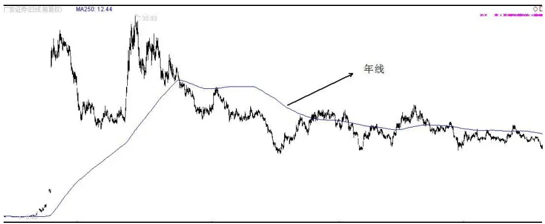
数据来源：国泰君安证券研究

年线之上买入持有 20 个交易日，平均收益率排在倒数第一位的股票是中国一重（601106），平均跌幅高达 15.6%，这个结果从其走势图上来看并不意外。自从其年线形成以来，中国一重的股价站在年线之上总共只有 18 个交易日，整体呈现趋势性下跌，所以这种走势导致年线之上买入的价位基本就是最高点。

图 2 中国一重（601106）走势图
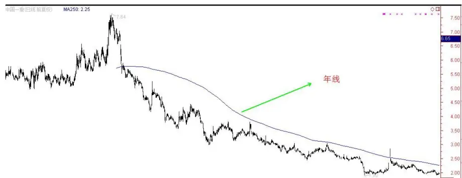
数据来源：国泰君安证券研究

而在沪深 300 指数成份股中，年线之上买入持有 20 个交易日，平均收益率排在前几位的股票像三安光电（6000703），平均涨幅高达 10.5%，三安光电的价格走势整体呈趋势性上涨。

图 3三安光电（600703）走势图
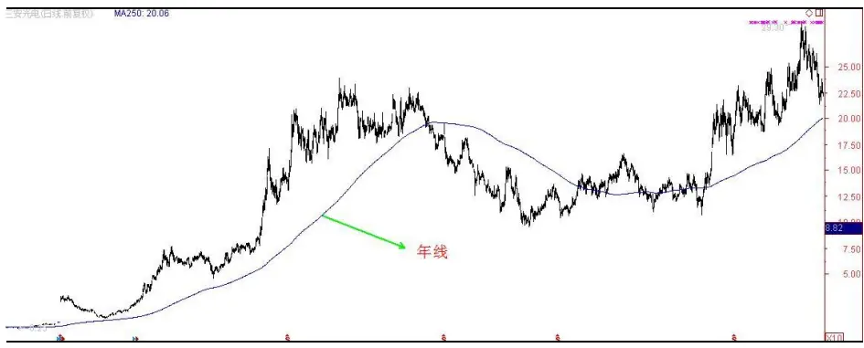
数据来源：国泰君安证券研究

同样，从2006年至2014年，如果在股价的年线之下随机买入，持有20个交易日，然后卖出，平均收益率的统计如下表所示。

表 6：年线之下买入持有 20个交易日涨幅统计（基于均值排序）

| 序列号 | 证券代码 | 证券名称 | 均值 | 标准差 | 最大值 | 最小值 | 年线之下交易日数 |
| --- | --- | --- | --- | --- | --- | --- | --- |
| 1 | 000156.SZ | 华数传媒 | 412.4% | 362.8% | 882.3% | -25.0% | 34 |
| 2 | 601238.SH | 广汽集团 | 25.5% | 22.6% | 78.4% | -2.5% | 31 |
| 3 | 000750.SZ | 国海证券 | 15.7% | 25.6% | 88.9% | -14.0% | 119 |
| 4 | 002415.SZ | 海康威视 | 8.8% | 9.5% | 28.7% | -12.2% | 61 |
| 5 | 601901.SH | 方正证券 | 7.0% | 15.8% | 49.6% | -15.3% | 108 |
| 294 | 601106.SH | 中国一重 | -2.5% | 7.8% | 39.7% | -25.3% | 714 |
| 295 | 601111.SH | 中国国航 | -2.6% | 13.9% | 48.5% | -47.4% | 993 |
| 296 | 601101.SH | 昊华能源 | -3.1% | 10.8% | 33.1% | -27.9% |  |
| 297 | 603993.SH | 洛阳钼业 | -3.1% | 6.0% | 7.5% | -15.8% | 566 |
| 298 | 002304.SZ | 洋河股份 | -3.3% | 11.4% | 37.6% | -24.2% | 91 356 |
| 299 | 002236.SZ | 大华股份 | -5.0% | 13.8% | 18.4% | -25.7% | 40 |
| 300 | 601633.SH | 长城汽车 | -5.1% | 11.5% | 15.5% | -21.0% | 35 |

数据来源：国泰君安证券研究，WIND，（2006.1.21-2014.3.21）

下图的横坐标是 300支成份股，纵坐标为涨跌幅均值。

图 4年线之上与之下买入持有 20个交易日平均收益率比较
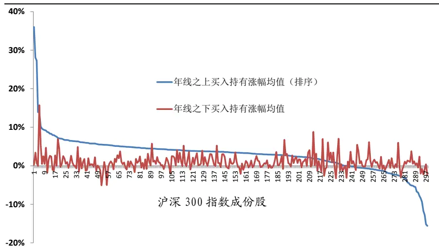
数据来源：国泰君安证券研究，WIND

如果对 300 支成份股综合统计的话，年线之上买入持有 20 个交易日平均收益 4%，而年线之下买入持有 20个交易日平均收益仅为 0.7%。

## 4. 买点安全性比较

假定我们在股票价格 P1 处买入，未来走势存在三种可能：第一、股价在跌p%之前先反弹p%以上；第二、股价在反弹p%之前先跌p%以上；第三、股价一直位于涨跌幅 p%区间内，既不碰到上轨也不碰到下轨。实际股票行情第三种情况比较少见，除非上轨与下轨之间的区域足够宽。

图 5 价格区间（p%）
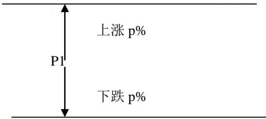
数据来源：国泰君安证券研究

如果 p%取值 10%，沪深 300 指数成份股中，当价格位于年线之上买入时，有214支股票先触上轨的概率大于先触下轨；当价格位于年线之下买入时，则只有128支股票的先触上轨的概率大于先触下轨。如果不考虑其他因素，可见对于大多数股票，价格在年线之上随机买入，整体安全性高于年线之下。

表 7：年线之上买入先触上轨或先下轨概率统计（基于触上轨概率排序）

| 序列号 | 证券代码 | 证券名称 | 触上轨 次数 | 触下轨 次数 | 不触轨 次数 | 触上轨概率 | 触下轨概率 | 年线之上 |
| --- | --- | --- | --- | --- | --- | --- | --- | --- |
|  |  |  |  |  |  |  |  | 交易日数 |
| 1 | 002399.SZ | 海普瑞 | 70 | 15 | 37 | 82.4% | 17.6% | 122 |
| 2 | 600535.SH | 天士力 | 1146 | 440 | 6 | 72.3% | 27.7% | 1592 |
| 3 | 600886.SH | 国投电力 | 736 | 298 | 10 | 71.2% | 28.8% | 1044 |
| 4 | 600315.SH | 上海家化 | 944 | 388 | 0 | 70.9% | 29.1% | 1332 |
| 5 | 000538.SZ | 云南白药 | 1050 | 441 | 0 | 70.4% | 29.6% | 1491 |
| 6 | 600079.SH | 人福医药 | 1007 | 439 | 8 | 69.6% | 30.4% | 1454 |
| 7 | 000869.SZ | 张裕A | 790 | 351 | 0 | 69.2% | 30.8% | 1141 |
| 8 | 002570.SZ | 贝因美 | 172 | 77 | 0 | 69.1% | 30.9% | 249 |
| 9 | 600664.SH | 哈药股份 | 697 | 315 | 0 | 68.9% | 31.1% | 1012 |
| 10 | 000963.SZ | 华东医药 | 960 | 436 | 18 | 68.8% | 31.2% | 1414 |
| 11 | 600718.SH | 东软集团 | 727 | 331 | 15 | 68.7% | 31.3% | 1073 |
| 12 | 600809.SH | 山西汾酒 | 859 | 398 | 0 | 68.3% | 31.7% | 1257 |
| 13 | 600340.SH | 华夏幸福 | 912 | 439 | 10 | 67.5% | 32.5% | 1361 |
| 14 | 000629.SZ | 攀钢钒钛 | 534 | 258 | 0 | 67.4% | 32.6% | 792 |
| 15 | 002236.SZ | 大华股份 | 740 | 360 | 0 | 67.3% | 32.7% | 1100 |
| … |  | … | … | … | … | … | … | … |
| 211 | 600383.SH | 金地集团 | 489 | 479 | 13 | 50.5% | 49.5% | 981 |
| 212 | 600030.SH | 中信证券 | 519 | 509 | 0 | 50.5% | 49.5% | 1028 |
| 213 | 600739.SH | 辽宁成大 | 528 | 520 | 0 | 50.4% | 49.6% | 1048 |
| 214 | 600010.SH | 包钢股份 | 489 | 485 | 0 | 50.2% | 49.8% | 974 |
| 215 | 601238.SH | 广汽集团 | 87 | 87 | 13 | 50.0% | 50.0% | 187 |
| 216 | 600208.SH | 新湖中宝 | 455 | 456 | 0 | 49.9% | 50.1% | 911 |
| 217 | 002269.SZ | 美邦服饰 | 247 | 250 | 0 | 49.7% | 50.3% | 497 |
| 218 | 600642.SH | 申能股份 | 437 | 447 | 37 | 49.4% | 50.6% | 921 |
| … | … | … | … | … | … | … | … | … |
| 290 | 601939.SH | 建设银行 | 57 | 579 | 1 | 9.0% | 91.0% | 637 |
| 291 | 601336.SH | 新华保险 | 3 | 34 | 0 | 8.1% | 91.9% | 37 |
| 292 | 601106.SH | 中国一重 | 1 | 17 | 0 | 5.6% | 94.4% | 18 |
| 293 | 000333.SZ | 美的集团 | 0 | 0 | 0 | 0.0% | 0.0% | 0 |
| 294 | 002673.SZ | 西部证券 | 0 | 34 | 0 | 0.0% | 100.0% | 34 |
| 295 | 601369.SH | 陕鼓动力 | 0 | 21 | 0 | 0.0% | 100.0% | 21 |
| 296 | 601618.SH | 中国中冶 | 0 | 21 | 0 | 0.0% | 100.0% | 21 |
| 297 | 601669.SH | 中国电建 | 0 | 51 | 0 | 0.0% | 100.0% | 51 |
| 298 | 601717.SH | 郑煤机 | 0 | 9 | 0 | 0.0% | 100.0% | 9 |
| 299 | 601800.SH | 中国交建 | 0 | 48 | 0 | 0.0% | 100.0% | 48 |
| 300 | 603993.SH | 洛阳钼业 | 0 | 0 | 0 | 0.0% | 0.0% | 0 |

数据来源：国泰君安证券研究，WIND，（2006.1.21-2014.3.21）

## 5. 拐点分布情况统计

基于某种规则把价格分段后，得到顶部拐点与底部拐点，那么这些拐点是位于均线之上多一些还是位于均线之下多一些，需要分析研究。如果顶部拐点大多数位于年线之上，在实际操作中，对于年线之上不断上涨的行情要注意顶部拐点出现风险；反之，如果底部拐点大多数位于年线之下，如果想抓这种拐点，则需要在年线之下寻找，当然不等于在年线之下买股票是安全的。

图 6价格拐点与年线位臵比较
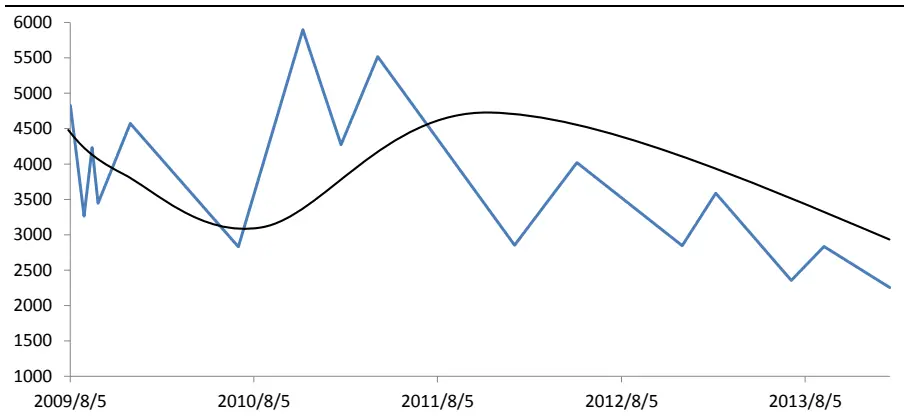
数据来源：国泰君安证券研究

以20%作为分段参数的话，对沪深300指数成份股底部拐点统计发现，“位于年线之下的底部拐点”占“总的底部拐点”的比值大于50%的股票有 278 支，其中 56支个股所有的底部拐点都位于年线之下。

下图是对底部拐点分布的统计直方图。“位于年线之下的底部拐点”占“总的底部拐点”的比值大于 90%的股票有 62 支；占比介于 80%至90%之间的股票有 75支。而占比不足 50%的股票仅为 22支。

图 7“位于年线之下的底部拐点”占“底部拐点总数”比值分布（基于 20%分段）
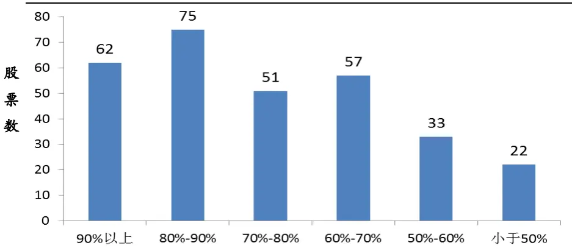
数据来源：国泰君安证券研究,WIND,（2009.1.1-2014.4.1）

顶部拐点的分布情况如下图，在沪深 300 指数成份股中，有 112支个股其顶部拐点在年线之上的占比超过 90%，换言之，这些股票每 10 个顶部拐点至少有 9 个位于其年线之上；有 89 支个股顶部拐点位于年线之上的占比在 80%至 90%； 53 支个股顶部拐点位于年线之上的占比在70%至 80%。从以上分析不难看出，年线之上不断上涨的行情，要警惕出现大级别的调整行情，不能追高。

图 8“位于年线之上的顶部拐点”与“顶部拐点总数”比值分布（基于 20%分段）
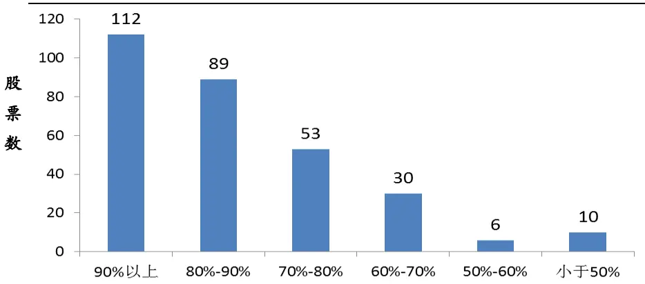
数据来源：国泰君安证券研究,WIND,（2009.1.1-2014.4.1）

以20%作为分段参数对所有股票价格分段之后，得到顶部拐点和底部拐点。对所有 300 支成份综合统计，总共出现过顶部拐点 2347 个，其中1936 个顶部拐点位于年线之上，占比 82.5%；总共出现底部拐点 2337个，其中 1679个底部拐点位于年线之下，占比 71.8%。

位于年线之上的顶部拐点占顶部拐点总数比值高达 82.5%有两个含义：第一、当从年线之下引发的一个反弹幅度超过20%之后，如果还没有到达年线，那么在回调到起点之前最终向上突破年线的概率为 82.5%；第二、当价格在年线之上涨幅已经过大，警惕出现 16.7%以上的调整行情到来，因为 82.5%的顶部拐点都在年线之上。

图 9“位于年线之下的底部拐点”与“底部拐点总数”比值分布（基于 10%分段）
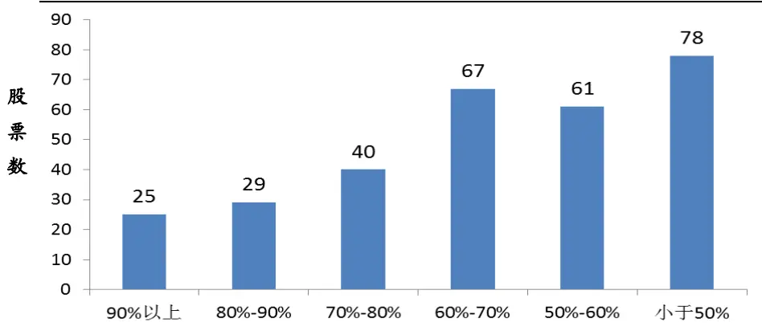
数据来源：国泰君安证券研究,WIND,（2009.1.1-2014.4.1）

图 10“位于年线之上的顶部拐点”与“顶部拐点总数”比值分布（基于 10%分段）
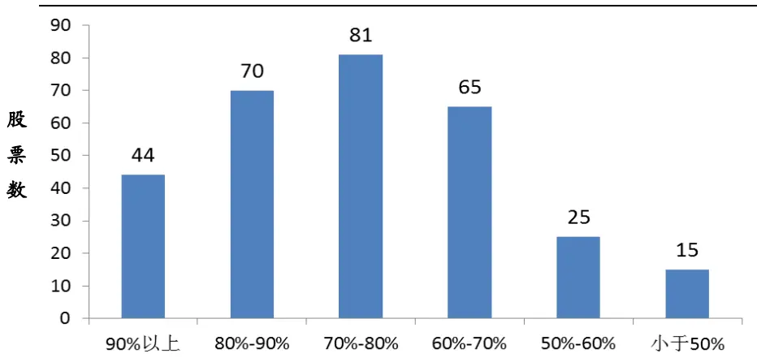
数据来源：国泰君安证券研究,WIND,（2009.1.1-2014.4.1）

以10%作为分段参数对所有股票价格分段之后，得到顶部拐点和底部拐点。对所有 300 支成份综合统计，总共出现过顶部拐点 6027 个，其中4496 个顶部拐点位于年线之上，占比 74.6%。总共出现底部拐点 5996个，其中3495个底部拐点位于年线之下，占比58.3%。可见随着分段参数的减小，顶部拐点与底部拐点在年线上下的分布趋于持平。

## 6. 基于年线定义趋势力度

简单而言，年线的趋势可以分为上行趋势、横盘震荡和下行趋势。这是偏定性的描述。

图 11 年线上行趋势
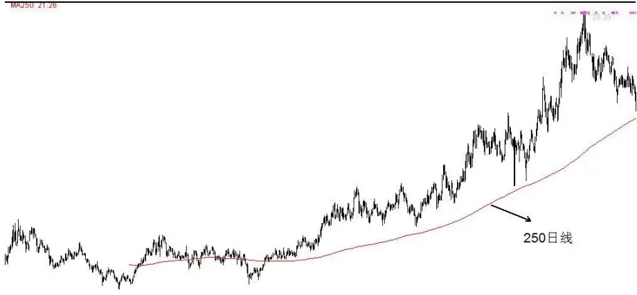
数据来源：国泰君安证券研究

图 12 年线横盘震荡

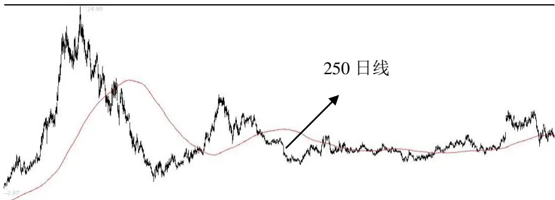
数据来源：国泰君安证券研究

图 13 年线下行趋势
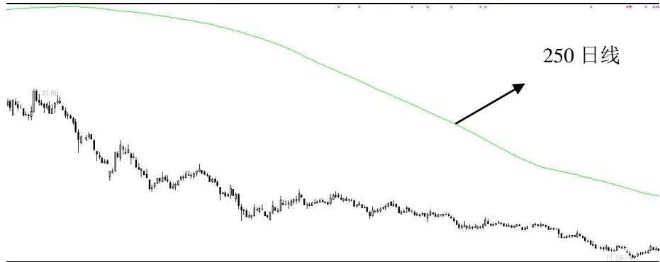
数据来源：国泰君安证券研究

给定一个股票价格序列的年线，实际应用中也可以换成其他均线，报告中主要以年线为例作为分析对象。给定一个时间窗口[T1, T2]，假定在 T1 点年线价格为 P1，在 T2 点年线价格为 P2，那么年线的趋势方向可以简单分为两类：趋势向下和趋势向上。

趋势向下定义为：P2 < P1;

趋势向上定义为: P2 > P1。

图 14 年线趋势向下和趋势向上
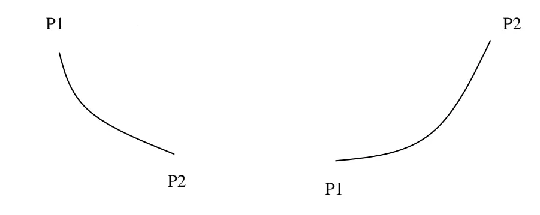
数据来源：国泰君安证券研究

对于一个年线趋势向下的走势，根据价格P1到价格P2区间内年线是否存在拐点又可以进一步分为两类：年线无拐点和年线存在拐点。这里的拐点不是分段的拐点，只要是出现任何局部极大值点或极小值点都是拐点。

从价格走势来看，年线出现拐点，说明价格走势出现了比较显著的反弹行情，对原下跌行情形成明显阻抗，拐点越多阻抗越强，意味着下跌行情很不顺畅。从这个角度，我们可以简单定性地认为年线无拐点的行情比年线存在拐点的行情趋势力度更强。

图 15 年线无拐点与年均线存在拐点
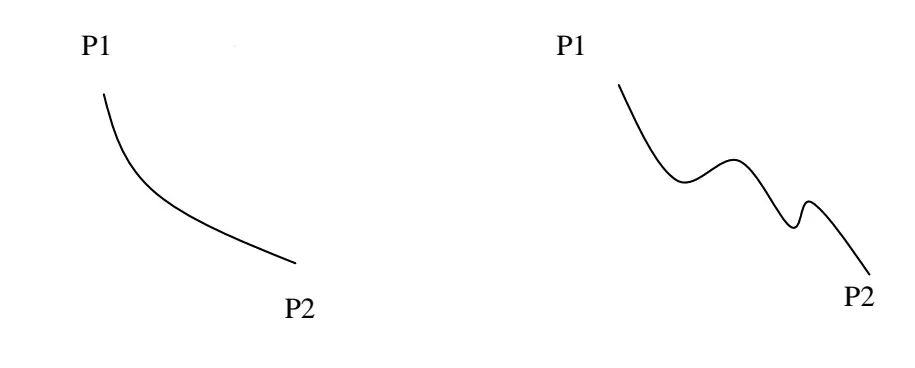
数据来源：国泰君安证券研究

而对于年线无拐点的走势可以基于下跌速率进一步区分趋势力度强弱。

趋势力度： $\rho=\frac{\mathrm{P}_{_2}-\mathrm{P}_{_1}}{\mathrm{P}_{_1}\mathrm{N}}$ ，其中 N为从 P1到 P2持续的时间。

对应下跌走势而言， 值越小，下跌趋势力度越强，反之，对于上涨走势而言， 值越大，上涨趋势力度越强。

对于年线没有拐点的走势用上述趋势力度指标进行度量是合理，但如果年线出现拐点，这样的度量方法就值得商榷。假定年线只有一个拐点，但拐点出现的位臵不一样，如下图所示。第一种情况的拐点出现在顶部区域，而第二种情况拐点出现在底部区域，对于这两种情况，

即使二者的趋势力度 $\rho=\frac{\mathrm{P}_{_2}-\mathrm{P}_{_1}}{\mathrm{P}_{_1}\mathrm{N}}$ 取值一样，也可以认为站在当下，第一

种情况的下行趋势力度更强。

## 图 16 年线只有一个拐点的情况分析

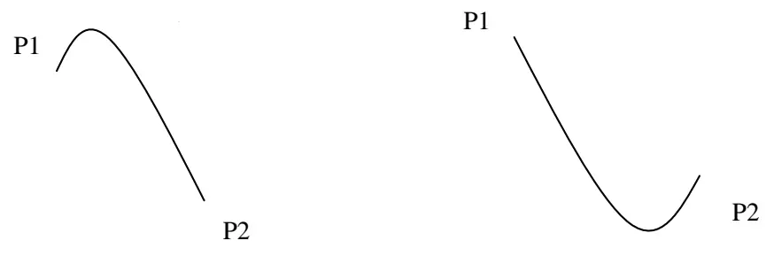
数据来源：国泰君安证券研究

对于年线出现两个或两个以上拐点，分类可能性更多，所以就不做细节性讨论，比较肯定的是，相同时间窗口内拐点越多，趋势力度越弱，当然这个趋势力度不是上面根据年线内无拐点那种情况定义的，而是指一般意义上的趋势力度。拐点越多，当前走势就越呈现“震荡”形态。为了便于量化年线的趋势力度，我们给每个趋势力度赋值，有助于从量化角度来分析市场走势。

表 8：年线趋势力度赋值描述

| 趋势方向 | 力度类型 | 均线形态描述 |
| --- | --- | --- |
| 上涨趋势 | 99 | 无拐点 |
|  | 66 | 一个拐点，当下创新高 |
|  | 33 | 一个拐点，当下不是新高 |
|  | 11 | 大于等于两个拐点，当下创新高 |
|  | 1 | 大于等于两个拐点，当下不是新高 |
| 下跌趋势 | -1 | 大于等于两个拐点，当下不是新低 |
|  | -11 | 大于等于两个拐点，当下创新低 |
|  | -33 | 一个拐点，当下不是新低 |
|  | -66 | 一个拐点，当下创新低 |
|  | -99 | 无拐点 |

数据来源：国泰君安证券研究

图 17 下跌趋势力度类型赋值
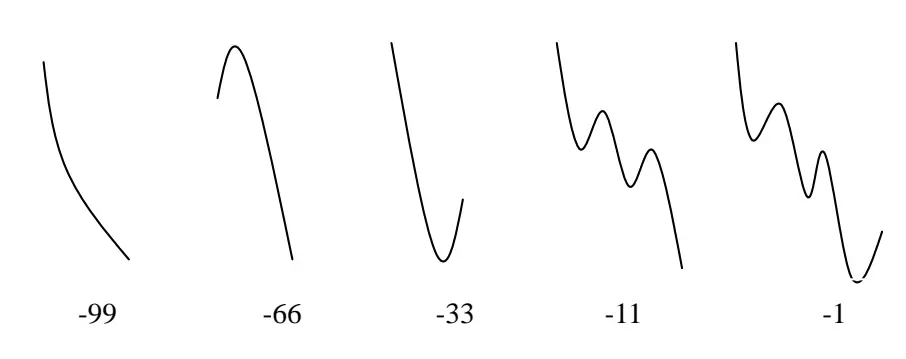
数据来源：国泰君安证券研究

截至 2014年3月10日，对沪深 300支成份股的年线进行趋势力度类型观察（从当前观察点倒退 120 个交易日），有 83 支股票的趋势力度类型为 99，也就是说过去 120 个交易日的年线趋势向上，而且年线无拐点。另有73支股票的趋势力度类型为-99，意味着过去120 个交易日的年线趋势向下，年线无拐点。从这个数据不难看出，站在过去120个交易日的维度，300支成份股的走势分化非常显著。

从趋势方向角度，有 156 支个股年线趋势向上，142 支个股年线趋势向下，还有 2支个股数据不全，没有列入统计。

表 9：沪深 300 指数成份股趋势力度类型分类

| 序列号 | 证券代码 | 证券名称 | 拐点个数 | 速率 | 趋势力度类型 |
| --- | --- | --- | --- | --- | --- |
| 1 | 000009.SZ | 中国宝安 | 0 | 0.094% | 99 |
| 2 | 000039.SZ | 中集集团 | 0 | 0.125% | 99 |
| 3 | 000061.SZ | 农产品 | 0 | 0.183% | 99 |
| 4 | 000063.SZ | 中兴通讯 | 0 | 0.172% | 99 |
| .. |  | …. | .. |  | …. |
| 81 | 601928.SH | 凤凰传媒 | 0 | 0.150% | 99 |
| 82 | 601989.SH | 中国重工 | 0 | 0.057% | 99 |
| 83 | 603000.SH | 人民网 | 0 | 0.326% | 99 |
| 84 | 600811.SH | 东方集团 | 1 | 0.075% | 66 |
| 85 | 601099.SH | 太平洋 | 1 | 0.032% | 66 |
| 86 | 000001.SZ | 平安银行 | 1 | 0.105% | 33 |
| … |  | • • | .. | . | … |
| 103 | 601866.SH | 中海集运 | 1 | 0.010% | 33 |
| 104 | 000839.SZ | 中信国安 | 8 | 0.038% | 11 |
| … |  |  | … |  | … |
| 114 | 601901.SH | 方正证券 | 2 | 0.101% | 11 |
| 115 | 000012.SZ | 南玻A | 5 | 0.043% | 1 |
| ... | ... |  | …. | . | … |
| 156 | 601998.SH | 中信银行 | 6 | 0.021% | 1 |
| 157 | 000333.SZ | 美的集团 | 0 | 0.000% | 0 |
| 158 | 603993.SH | 洛阳钼业 | 0 | 0.000% | 0 |
| 159 | 000725.SZ | 京东方A | 17 | -0.001% | -1 |
| 160 | 600028.SH | 中国石化 | 8 | -0.004% | -1 |
| 161 | 600150.SH | 中国船舶 | 8 | -0.008% | -1 |
| 162 | 601555.SH | 东吴证券 | 6 | -0.002% | -1 |
| 163 | 000002.SZ | 万科A | 5 | -0.039% | -11 |
| … |  |  | … |  | … |
| 211 | 601992.SH | 金隅股份 | 5 | -0.006% | -11 |
| 212 | 000069.SZ | 华侨城 A | 1 | -0.063% | -66 |
| ... | … |  | … | … | … |
| 226 | 601668.SH | 中国建筑 | 1 | -0.019% | -66 |
| 227 | 601988.SH | 中国银行 | 1 | -0.003% | -66 |
| 228 | 000060.SZ | 中金岭南 | 0 | -0.101% | -99 |
|  |  |  | … |  | … |
| 297 | 601898.SH | 中煤能源 | 0 | -0.142% | -99 |
| 298 | 601899.SH | 紫金矿业 | 0 | -0.160% | -99 |
| 299 | 601918.SH | 国投新集 | 0 | -0.241% | -99 |
| 300 | 601958.SH | 金钼股份 | 0 | -0.163% | -99 |

数据来源：国泰君安证券研究，WIND

## 7. 动量因子与年线趋势类型的关系

在一个下跌行情走势中，当股价开始反弹，假定反弹幅度达到10%，从动量角度来讲，一个自然的问题：这个上涨波段在回调 9.09%之前，最终涨幅是多少？回答这个问题，需要用10%涨幅对价格进行分段，之后研究底部拐点到顶部拐点的涨幅分布。

我们分两类情况讨论，一类是年线处于下跌趋势中（趋势类型-99），另一类是年线处于上涨趋势中（趋势类型 99）。对沪深 300指数成份股分析可知：当年线处于下降趋势中，从底部拐点到顶部拐点平均涨幅高达31%；反之当年线处于上涨趋势中，从底部拐点到顶部拐点平均涨幅为26%。单从统计数据来看，年线处于下跌趋势状态时，底部拐点右侧平均涨幅大于年线处于上涨趋势的底部拐点右侧平均涨幅。这个现象比较容易解释，因为大级别的上涨行情必定始于年线趋势向下的走势。如果再观察二者的涨幅标准差，下跌趋势对应的涨幅标准差为21.1%，而上涨趋势对应的涨幅标准差仅为 13.3%。

以上分析在操作上可以归纳为两点：第一、反弹10%幅度的动量因子是显著的。无论是年线趋势向下还是年线趋势向上，还是其他中间类型，之后的波段平均反弹幅度基本都在25%之上。第二、从年线下跌趋势状态启动的上涨涨幅标准差大于从上涨趋势启动的上涨涨幅标准差，说明当年线处于下跌趋势中，股价开始上涨，要么是大行情要么是下跌中的反弹；而年线处于上行趋势，出现的反弹行情相对比较均衡。

图 18 底部拐点后续涨幅与趋势类型关系比较
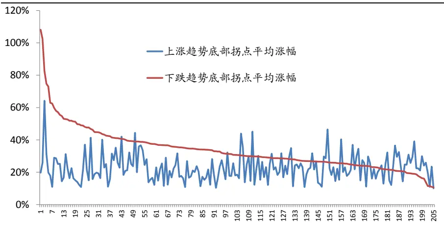
数据来源：国泰君安证券研究（2009.1.1-2014.4.1）

表 10：不同趋势类型的底部拐点右侧上涨波段涨幅与标准差

| 趋势类型 | 所有个股平均涨幅 所有个股涨幅标准差 |
| --- | --- |

| -99 31.0% | 21.1% |
| --- | --- |
| -66 | 25.5% 9.4% |
| -33 | 25.4% 9.5% |
| -11 | 27.8% 15.4% |
| -1 | 26.1% 14.1% |
| 1 27.9% | 14.8% |
| 11 26.6% | 14.1% |
| 33 29.2% | 20.1% |
| 66 24.9% | 11.0% |
| 99 | 26.0% 13.3% |

数据来源：国泰君安证券研究，WIND

## 8. 总结与展望

以上观察单纯从年线之上和年线之下以及年线的趋势类型两个维度分析了股票价格的一些走势特征，对理解价格走势有一定的指导作用，可以通过统计数据培养对年线的感性认识。在报告中，我们并没有给出如何在年线之下抓住中级别以上的拐点，如何利用动量因子构造稳定的交易策略，以及如何在年线之上参与股票的买卖。要解决上述问题，仅基于本报告的分析是不充分的，必须结合价格的分段结构，如MACD 之 DEA 指标的分段来进一步研判。对于个人投资者而言，尽量不参与股票价格位于年线以下的股票，除非年线已经走平或开始逐步向上。虽然大级别上涨的波段起点都在年线之下，但抓住这样的拐点风险与收益不成比例，能够在年线之下进场抓住大级别上涨拐点的资金都是对个股未来走势有充分前瞻性而且对市场波动具有承受力的资金，对中小级别资金可以耐心等待。后续研究会充分挖掘均线在选股中的作用，包括年线在内。

## 本公司具有中国证监会核准的证券投资咨询业务资格

## 分析师声明

作者具有中国证券业协会授予的证券投资咨询执业资格或相当的专业胜任能力，保证报告所采用的数据均来自合规渠道，分析逻辑基于作者的职业理解，本报告清晰准确地反映了作者的研究观点，力求独立、客观和公正，结论不受任何第三方的授意或影响，特此声明。

## 免责声明

本报告仅供国泰君安证券股份有限公司（以下简称“本公司”）的客户使用。本公司不会因接收人收到本报告而视其为本公司的当然客户。本报告仅在相关法律许可的情况下发放，并仅为提供信息而发放，概不构成任何广告。

本报告的信息来源于已公开的资料，本公司对该等信息的准确性、完整性或可靠性不作任何保证。本报告所载的资料、意见及推测仅反映本公司于发布本报告当日的判断，本报告所指的证券或投资标的的价格、价值及投资收入可升可跌。过往表现不应作为日后的表现依据。在不同时期，本公司可发出与本报告所载资料、意见及推测不一致的报告。本公司不保证本报告所含信息保持在最新状态。同时，本公司对本报告所含信息可在不发出通知的情形下做出修改，投资者应当自行关注相应的更新或修改。

本报告中所指的投资及服务可能不适合个别客户，不构成客户私人咨询建议。在任何情况下，本报告中的信息或所表述的意见均不构成对任何人的投资建议。在任何情况下，本公司、本公司员工或者关联机构不承诺投资者一定获利，不与投资者分享投资收益，也不对任何人因使用本报告中的任何内容所引致的任何损失负任何责任。投资者务必注意，其据此做出的任何投资决策与本公司、本公司员工或者关联机构无关。

本公司利用信息隔离墙控制内部一个或多个领域、部门或关联机构之间的信息流动。因此，投资者应注意，在法律许可的情况下，本公司及其所属关联机构可能会持有报告中提到的公司所发行的证券或期权并进行证券或期权交易，也可能为这些公司提供或者争取提供投资银行、财务顾问或者金融产品等相关服务。在法律许可的情况下，本公司的员工可能担任本报告所提到的公司的董事。

市场有风险，投资需谨慎。投资者不应将本报告为作出投资决策的惟一参考因素，亦不应认为本报告可以取代自己的判断。在决定投资前，如有需要，投资者务必向专业人士咨询并谨慎决策。

本报告版权仅为本公司所有，未经书面许可，任何机构和个人不得以任何形式翻版、复制、发表或引用。如征得本公司同意进行引用、刊发的，需在允许的范围内使用，并注明出处为“国泰君安证券研究”，且不得对本报告进行任何有悖原意的引用、删节和修改。

若本公司以外的其他机构（以下简称“该机构”）发送本报告，则由该机构独自为此发送行为负责。通过此途径获得本报告的投资者应自行联系该机构以要求获悉更详细信息或进而交易本报告中提及的证券。本报告不构成本公司向该机构之客户提供的投资建议，本公司、本公司员工或者关联机构亦不为该机构之客户因使用本报告或报告所载内容引起的任何损失承担任何责任。

## 评级说明

## 1.投资建议的比较标准

投资评级分为股票评级和行业评级。

以报告发布后的12个月内的市场表现为比较标准，报告发布日后的12个月内的公司股价（或行业指数）的涨跌幅相对同期的沪深300指数涨跌幅为基准。

## 2.投资建议的评级标准

报告发布日后的 12 个月内的公司股价（或行业指数）的涨跌幅相对同期的沪深300指数的涨跌幅。

| 评级 |  | 说明 |
| --- | --- | --- |
| 股票投资评级 | 增持 | 相对沪深 300指数涨幅15%以上 |
|  | 谨慎增持 | 相对沪深300指数涨幅介于5%～15%之间 |
|  | 中性 | 相对沪深300指数涨幅介于-5%～5% |
|  | 减持 | 相对沪深300指数下跌5%以上 |
| 行业投资评级 | 增持 | 明显强于沪深 300 指数 |
|  | 中性 | 基本与沪深300指数持平 |
|  | 减持 | 明显弱于沪深300指数 |

## 国泰君安证券研究

|  | 上海 | 深圳 | 北京 |
| --- | --- | --- | --- |
| 地址 | 上海市浦东新区银城中路168号上海 银行大厦29层 | 深圳市福田区益田路 6009 号新世界 商务中心34层 | 北京市西城区金融大街 28 号盈泰中 心2号楼10层 |
| 邮编 | 200120 | 518026 | 100140 |
| 电话 | （021)38676666 | (0755)23976888 | (010)59312799 |
|  | E-mail: gtjaresearch@gtjas.com |  |  |