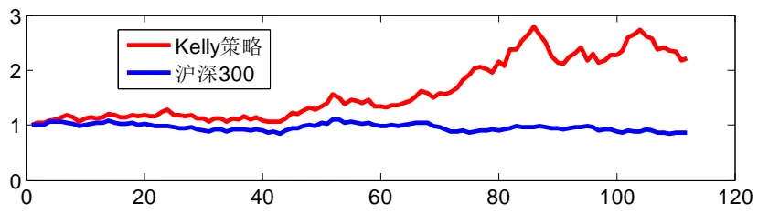
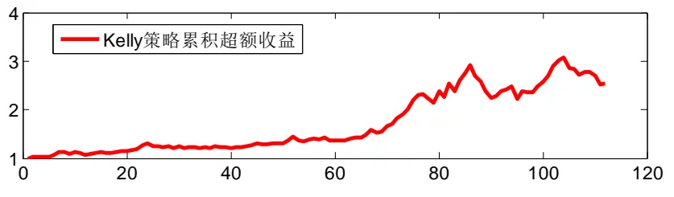
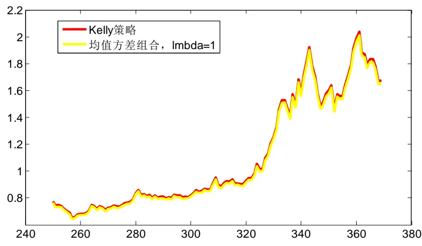
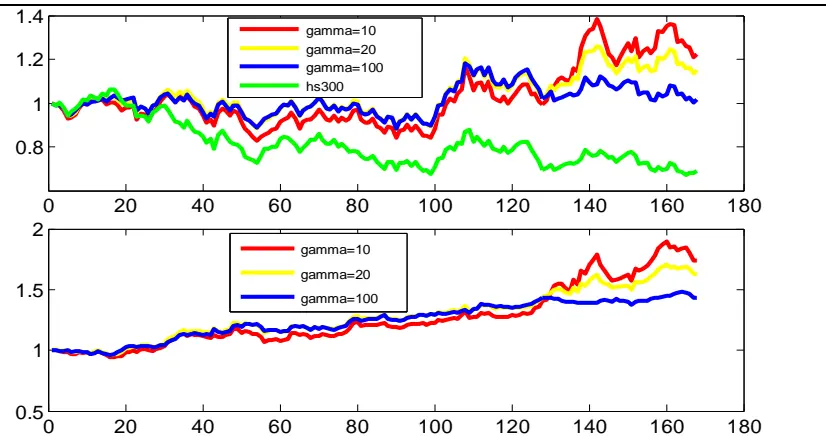
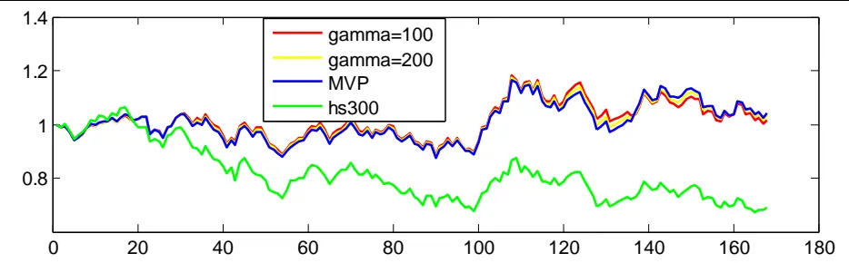
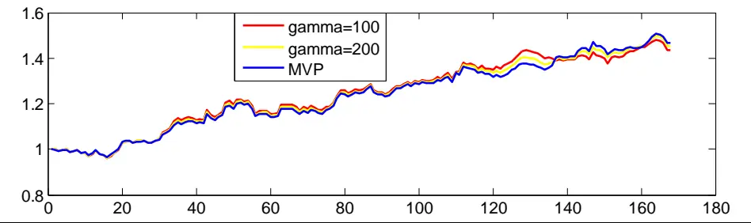

2014.04.22

# Kelly 公式在行业配臵中的应用三

# ——数量化专题之四十一

刘富兵（分析师）

8 021-38676673

liufubing008481@gtjas.com

证书编号 S0880511010017

本报告导读：我们在对股价分布不作假设的情况下，得到了 Kelly公式，并将其应用于行业配臵中。鉴于其在回溯中的高波动及高回撤，我们提供了一种替代选择-Fractional Kelly 策略。

## 摘要：

[Table_Summary] • 在前面的研究中，我们分别用贝努利分布、对数正态分布来假设股票市场的概率分布，虽然效果尚可，但这些假定可能与实际仍有较大的出入。如何在对股票市场不做任何假设的情况下得到 Kelly公式，是我们本文要解决的问题。

- Kelly 准则等同于组合的几何增长率最大化，为此我们从几何增长率入手，在无分假设下推导出了 Kelly准则。

- 将 Kelly准则运用于中信一级行业中，我们发现Kelly策略取得了良好的效果，在过去的两年里，Kelly策略获得了120%的绝对收益，用沪深 300 对冲后，年化收益 52%，夏普率达1.52，胜率超过60%；不过回撤依然很大，为 24%。

关于 Kelly策略与均值方差的关系，从理论与实证来看，当标的收益率较小时，Kelly 策略与风险厌恶系数为 1 的均值方差组合基本一致。这表明只有在投资期限足够长，标的单期的预期收益率足够大的情况下，Kelly 策略才能相比均值方差组合取得更好的业绩。

尽管 Kelly策略也对组合的波动实施惩罚，只是由于他们对高波动的惩罚不足，从而导致为了追求高收益，而忽视了高波动与高回撤。这使得我们在应用Kelly策略时要有所改变，要么就采用 Kelly 策略的一种替代形式 Fractional Kelly策略提高对波动的惩罚；要么就加大标的波动性。Kelly 公式成功应用在了赌博、跑马、期货以及权证等领域就印证了后面的这一情况。

若用 Fractional Kelly 策略来进行替代，由于 FractionalKelly 策略可以用对应一定风险厌恶系数的 Markowitzs 均值方差组合近似替代，因此我们可以适当选取风险厌恶系数来构建投资组合。从实证的效果来看，风险厌恶系数取10-100风险相对适中，而当风险厌恶系数超过 100时，对应的均值方差组合基本等同于最小方差组合。

金融工程

## 金融工程团队：

刘富兵：（分析师）

电话：021-38676673

邮箱：liufubing008481@gtjas.com

证书编号：S0880511010017

何苗：（分析师）

电话：010-59312710

邮箱：hemiao@gtjas.com

证书编号：S0880511010049

## 严佳炜：（分析师）

电话：021-38674812

邮箱：yanjiawei008776@gtjas.com

证书编号：S0880512110001

## 耿帅军：（分析师）

电话：010-59312753

邮箱：gengshuaijun@gtjas.com

证书编号：S0880513080013

## 徐康：（分析师）

电话：021-38674939邮箱：xukang010849@gtjas.com证书编号：S0880513080018

## 赵延鸿：（研究助理）

电话：021-38674927邮箱：zhaoyanhong@gtjas.com证书编号：S0880113070047

## 陈睿：（研究助理）

电话：021-38675861

邮箱：chenrui012896@gtjas.com

证书编号：S0880112120012

## 刘正捷：（研究助理）

电话：0755-23976803

邮箱：liuzhengjie012509@gtjas.com

证书编号：S0880112080087

## [Table_R相关报告

《年线与股票价格走势关系分析》2014.04.11《沪深 300 期指合约折价现象探究》2014.04.06

《期权应用之交易策略篇》2014.03.19

《Kelly 公式在行业配臵中的应用二》2014.03.13

《个股及股指期权仿真交易规则详解》2014.03.06

## 1. 无分布假设下的 Kelly 准则

在《Kelly 公式在行业配臵中的应用一》、《Kelly 公式在行业配臵中的应用二》中，我们分别用贝努利分布、对数正态分布来表示股票市场的概率分布，虽然效果尚可，但这些假定可能与实际仍有较大的出入。如何在对股票市场不做任何假设的情况下得到 Kelly 公式，是我们本文要解决的问题。

我们知道 Kelly 准则等同于组合的几何增长率最大化，为此我们从几何增长率入手，在无分布假设下推导 Kelly 准则。

假定一只股票第t 期收益率为 $R_{\textit{ t }}$ ，该股票的几何增长率为G R( ) ，则

$$
1+G(R)=\{\Pi_{_{t=1}}^{^{T}}(1+R_{_{t}})\}^{1/T}
$$

其中 T表示样本期数，对上面等式两边去对数，则有

$$
\ln\left(1+G\left(R\right)\right)=\lim_{T\rightarrow\infty}\frac{1}{T}\sum_{_{t=1}}^{^{T}}\ln\left(1+R_{_{t}}\right)=E\ln\left(1+R_{_{t}}\right)
$$

将函数 $\ln{(1+R_{_t})}$ 在其均值 $E\left(R_{_t}\right)=\mu$ 上进行泰勒展开，有

$$
\ln\left(1+R_{_{t}}\right)\approx\ln\left(1+\mu\right)+\frac{R-\mu}{1+\mu}-\frac{\left(R-\mu\right)^{2}}{2\left(1+\mu\right)^{2}}+\frac{\left(R-\mu\right)^{3}}{3\left(1+\mu\right)^{3}}-\frac{\left(R-\mu\right)^{4}}{4\left(1+\mu\right)^{4}}+\cdots,
$$

对上式取期望值可得

$$
E\ln\left(1+R_{_{t}}\right)\approx\ln\left(1+\mu\right)-\frac{E\left[\left(R-\mu\right)\right]^{^{2}}}{2\left[\left(1+\mu\right)^{^{2}}\right.}+\frac{E\left[\left(R-\mu\right)\right]^{^{3}}}{3\left[\left(1+\mu\right)^{^{3}}\right.}-\frac{E\left[\left(R-\mu\right)\right]^{^{4}}}{4\left[\left(1+\mu\right)^{^{4}}\right.}+\cdots,
$$

忽略高阶项，我们可以近似算出G R( ) 的表达式：

$$
G\left(R\right)=\operatorname{exp}\left\{E\ln\left(1+R_{_{t}}\right)\right\}-1\approx\operatorname{exp}\left\{\ln\left(1+\mu\right)-\frac{\sigma^{^{2}}}{2\left[\left(1+\mu\right)^{^{2}}\right]}\right\}-1
$$

其中 $\sigma^{^2}=E\left[\left(R-\mu\right)\right]^{^2}$

假定一投资组合 P，其在 n只股票上的投资权重为 $\mathbf{w}^{\mathrm{T}}=(w_1,w_2,\square,w_n)$ 则组合 P 的均值、方差为

$$
\mu_{_{P}}\;=\;E\:(\:R_{_{P}}\:)\:=\:\mathbf{w}^{^{\mathrm{\tiny~T}}}\pmb{\mu}\:,\sigma_{_{P}}^{^{\mathrm{\tiny~2}}}\:=\:\mathbf{w}^{^{\mathrm{\tiny~T}}}\Sigma\:\mathbf{w}
$$

其中 $\boldsymbol{\mu}=(\mu_{1},\mu_{2},\square\square,\mu_{n}),\boldsymbol{\Sigma}=(\sigma_{ij})_{n\times n}$ 表示收益率的方差协方差矩阵

由于 kelly 准则等同于 $G\left(R_{_{P}}\right)$ 最大化，因此 Kelly 准则的确定大致等同于如下优化问题：

$$
\begin{array}{rl}&{\underset{\textbf{ w }}{\mathrm{~m~a~x~}}\ln{(1+\textbf{ w }^{^{\mathrm{\tiny~T~}}}\boldsymbol{\mu})}-\frac{1}{2}\frac{\textbf{ w }^{^{\mathrm{\tiny~T~}}}\boldsymbol{\Sigma}\textbf{ w }}{(1+\textbf{ w }^{^{\mathrm{\tiny~T~}}}\boldsymbol{\mu})^{^{2}}}}\\&{\textbf{ w }^{^{\mathrm{\tiny~T~}}}\mathbf{1}=1}\end{array}
$$

由上面的优化问题可以看出，与 Markowitzs 的均值方差理论一样，Kelly准则同样不喜欢波动，因为波动会降低组合的几何增长率。

## 2. Kelly 公式在行业配臵中的应用

我们选择中信一级行业作为配臵标的，选择的数据是从 2009 年至今的周数据。

将最优组合构建运用于一级行业的周数据中，我们发现 Kelly 策略取得了良好的效果，在过去的两年里，Kelly策略获得了 120%的绝对收益，跑赢 hs300 150%以上。用沪深 300 对冲后，年化收益 52%，夏普率达1.52，胜率超过 60%；不过回撤依然很大，为 24%。具体表现如下面图表所示：

图 1 Kelly 公式在行业配臵中的应用

数据来源：国泰君安证券研究，wind

表 1 Kelly 一级行业策略与沪深 300对冲策略结果统计

| 统计指标 | 数值 |
| --- | --- |
| 财富终值 | 2.53 |
| 交易胜率 | 61.26% |
| 年化收益率 | 52.03% |
| 年化波动率 | 28.40% |
| 夏普比率 | 1.52 |
| 最大回撤 | 23.87% |
| VaR | -6.95% |
| ES | -8.27% |

数据来源：国泰君安证券研究，wind

## 3. Kelly 准则与均值方差理论的关系

由第一部分的推导，我们知道，Kelly 准则大致等同于最大化下述函数

$$
\ln{(1+\textbf{ w }^{^{\mathrm{\tiny~T~}}}\boldsymbol{\mu})}-\frac{1}{2}\frac{\textbf{ w }^{^{\mathrm{\tiny~T~}}}\boldsymbol{\Sigma}\textbf{ w }}{(1+\textbf{ w }^{^{\mathrm{\tiny~T~}}}\boldsymbol{\mu})^{^{2}}}.
$$

事实上，当 $\boldsymbol{\mu}=(\mu_{1},\mu_{2},\Box\Box,\mu_{n})$ 较小时， $\textbf{ w }^{\mathrm{~T~}}\pmb{\mu}$ 也较小，上式近似等于

$$
\mathbf{w}^{^{\mathrm{\tiny~T}}}\pmb{\mu}-\frac{1}{2}\frac{\mathbf{w}^{^{\mathrm{\tiny~T}}}\Sigma\mathbf{w}}{(1+\mathbf{w}^{^{\mathrm{\tiny~T}}}\pmb{\mu})^{^2}}\approx\mathbf{w}^{^{\mathrm{\tiny~T}}}\pmb{\mu}-\frac{1}{2}\mathbf{w}^{^{\mathrm{\tiny~T}}}\Sigma\mathbf{w}
$$

而 $\textbf{ w }^{\mathrm{\tiny~T~}}\pmb{\mu}\:-\:\frac{1}{2}\:\mathbf{w}^{\mathrm{\tiny~T~}}\boldsymbol{\Sigma}\:\mathbf{w}$ 正是风险厌恶系数为 1 时的均值方差组合的目标函数。

因此，从理论上说，当标的的收益率较小时，Kelly 准则是均值方差理论的一个特殊形式。从实证来看，Kelly 策略与风险厌恶系数为 1 的均值方差组合也是一致的。

图 2 Kelly 策略与均值方差组合比较

数据来源：国泰君安证券研究，wind

由图 2 可以看出，kelly策略与风险厌恶系数为 1的均值方差组合几乎完全一致，这表明只有在投资期限足够长，标的单期的预期收益率足够大的情况下，Kelly策略才能相比均值方差组合取得更好的业绩。

## 4. Kelly 策略的一种替代选择

尽管 Kelly 策略也对组合的波动实施惩罚，只是由于他们对高波动的惩 罚不足，从而导致为了追求高收益，而忽视了高波动与高回撤。

为解决上述问题，学术界提出了 Fractional Kelly 策略，即取 Kelly 策略

的一定比例作为 Kelly 策略的替代。同时，学术界已经证明，FractionalKelly 策略，事实上就是效用函数为幂函数时预期效用最大化的最优投资比例，即

$$
FractionalKelly=\arg\max E\left[\frac{1}{1-\gamma}x^{1-\gamma}\right]
$$

其中 是投资者的风险厌恶系数。 $而$ 且，Fractional Kelly 策略相对于Kelly 策略的比例就是1 /• 。

我们可以详细分析下效用函数为幂函数时对应的情况。将该函数在均值处进行泰勒展开有

$$
E\left[\frac{1}{1-\gamma}\left(1+R_{_{t}}\right)^{^{1-\gamma}}\right]\approx\frac{1}{1-\gamma}\left(1+\mu\right)^{^{1-\gamma}}-\frac{\gamma}{2}E\left[R_{_{t}}-\mu\right]^{^{2}}\square(1+\mu)^{^{-\gamma-1}}
$$

当 $\mu$ 较小时，上述函数又近似等价于如下函数：

$$
E\left[\frac{1}{1-\gamma}\left(1+R_{_{t}}\right)^{^{1-\gamma}}\right]\approx\frac{1}{1-\gamma}+\mu-\frac{\gamma}{2}E\left[R_{_{t}}-\mu\right]^{^{2}}
$$

因此优化问题 $\operatorname*{max}\;E[\frac{1}{1-\gamma}(1+R_{_{t}})^{^{1-\gamma}}]$ 近似等价于如下优化问题

$$
\mathrm{~m~a~x~}\{\;\mu\;-\;\frac{\gamma}{2}E[R_{_{t}}\;-\;\mu\;]^{^{2}}\}
$$

这恰恰是风险厌恶系数为 时的 Markowitzs 均值方差理论。

因此，考虑到 Kelly 策略的高波动性，我们可以用 Fractional Kelly 策略来进行替代，而 Fractional Kelly 策略又可以用风险厌恶系数为 时的Markowitzs 的均值方差组合近似替代，因此我们可以适当选取风险厌恶系数来构建投资组合。

我们分别选取风险厌恶系数为 10、20、100 在中信一级行业上构建投资组合。组合的业绩表现具体如下面的图标所示：

图 3 不同风险厌恶系数下的投资组合

数据来源：国泰君安证券研究，wind

表 2 不同风险厌恶系数下的组合与沪深 300 对冲比较

| 统计指标 | Gamma=10 Gamma=20 | Gamma=100 |
| --- | --- | --- |
| 财富终值 1.74 | 1.63 | 1.44 |
| 交易胜率 | 58.68% 59.28% | 58.68% |
| 年化收益率 17.97% | 15.65% | 11.43% |
| 年化波动率 13.63% | 10.06% | 7.88% |
| 夏普比率 | 1.06 1.20 | 1.03 |
| 最大回撤 | 12.07% 7.59% | 5.39% |
| VaR | -3.43% -2.49% | -1.96% |
| ES | -4.10% -3.19% | -2.37% |

数据来源：国泰君安证券研究，wind

由图 3 及表 2可以看出，不同的风险厌恶系数代表着不同的投资风格：gamma=10 时，风格相对激进，收益较高，回撤也较大；gamma=100 时，风格相对保守，收益偏低，但回撤也很小；gamma=20 时，风格相对适中，夏普率相对前面两种策略更高。因此投资者可根据自己的风格选取适当的风险厌恶系数。

事实上，当风险厌恶系数越来越大时，得到的投资组合便成了最小方差组合（MVP）。从实证的角度来看，当风险厌恶系数高于 100 时，其所对应的投资组合基本等同于最小方差组合，如下图标所示：

图 4 风险厌恶系数高于 100 时的投资组合与 MVP 比较

数据来源：国泰君安证券研究，wind

表 3 不同组合与沪深 300对冲后的比较

| 统计指标 | Gamma=100 | Gamma=200 | MVP |
| --- | --- | --- | --- |
| 财富终值 | 1.44 | 1.45 | 1.47 |
| 交易胜率 | 58.68% | 57.49% | 58.68% |
| 年化收益率 | 11.43% | 11.88% | 12.17% |
| 年化波动率 | 7.88% | 7.71% | 7.65% |
| 夏普比率 | 1.03 | 1.11 | 1.15 |

| 最大回撤 | 5.39% 5.38% |
| --- | --- |
| VaR -1.96% | 5.36% -1.91% -1.88% |
| ES -2.37% | -2.24% -2.36% |

数据来源：国泰君安证券研究，wind

## 5. Kelly 公式总结

关于 Kelly 公式在行业配臵中的应用，我们写了 3 篇系列报告，从贝努利分布到对数正态分布再到无分布假设，我们详细剖析了 kelly 策略的性质及业绩表现，现总结如下：

1. 整体 Kelly策略表现出了较高的收益，但波动与回撤都很大。

2. 尽管 Kelly策略也对波动实施惩罚，但惩罚不足，这使得我们在应用Kelly 策略时要有所改变，要么就采用 Kelly 策略的一种替代形式Fractional Kelly 策略提高对波动的惩罚；要么就加大标的波动性。Kelly公式成功应用在了赌博、跑马、期货以及权证等领域就印证了后面的这一情况，而索普在应用 kelly策略时也加入了权证等高波动性资产。

3. Kelly 策略相对于均值方差理论的优越性只有在长周期以及标的收益率较高时才能得到体现，否则在短期以及收益率微小变动的情况下，Kelly 策略仅相当于风险厌恶系数为 1时的均值方差组合。

从实证的角度而言，Kelly 策略更多的表现出了类动量的性质，然而市场除了具有动量效应外，均值回复效应也不可小视，因此在未来的研究中，我们将研究均值回复下的投资策略，敬请关注后续报告。

## 本公司具有中国证监会核准的证券投资咨询业务资格

## 分析师声明

作者具有中国证券业协会授予的证券投资咨询执业资格或相当的专业胜任能力，保证报告所采用的数据均来自合规渠道，分析逻辑基于作者的职业理解，本报告清晰准确地反映了作者的研究观点，力求独立、客观和公正，结论不受任何第三方的授意或影响，特此声明。

## 免责声明

本报告仅供国泰君安证券股份有限公司（以下简称“本公司”）的客户使用。本公司不会因接收人收到本报告而视其为本公司的当然客户。本报告仅在相关法律许可的情况下发放，并仅为提供信息而发放，概不构成任何广告。

本报告的信息来源于已公开的资料，本公司对该等信息的准确性、完整性或可靠性不作任何保证。本报告所载的资料、意见及推测仅反映本公司于发布本报告当日的判断，本报告所指的证券或投资标的的价格、价值及投资收入可升可跌。过往表现不应作为日后的表现依据。在不同时期，本公司可发出与本报告所载资料、意见及推测不一致的报告。本公司不保证本报告所含信息保持在最新状态。同时，本公司对本报告所含信息可在不发出通知的情形下做出修改，投资者应当自行关注相应的更新或修改。

本报告中所指的投资及服务可能不适合个别客户，不构成客户私人咨询建议。在任何情况下，本报告中的信息或所表述的意见均不构成对任何人的投资建议。在任何情况下，本公司、本公司员工或者关联机构不承诺投资者一定获利，不与投资者分享投资收益，也不对任何人因使用本报告中的任何内容所引致的任何损失负任何责任。投资者务必注意，其据此做出的任何投资决策与本公司、本公司员工或者关联机构无关。

本公司利用信息隔离墙控制内部一个或多个领域、部门或关联机构之间的信息流动。因此，投资者应注意，在法律许可的情况下，本公司及其所属关联机构可能会持有报告中提到的公司所发行的证券或期权并进行证券或期权交易，也可能为这些公司提供或者争取提供投资银行、财务顾问或者金融产品等相关服务。在法律许可的情况下，本公司的员工可能担任本报告所提到的公司的董事。

市场有风险，投资需谨慎。投资者不应将本报告为作出投资决策的惟一参考因素，亦不应认为本报告可以取代自己的判断。在决定投资前，如有需要，投资者务必向专业人士咨询并谨慎决策。

本报告版权仅为本公司所有，未经书面许可，任何机构和个人不得以任何形式翻版、复制、发表或引用。如征得本公司同意进行引用、刊发的，需在允许的范围内使用，并注明出处为“国泰君安证券研究”，且不得对本报告进行任何有悖原意的引用、删节和修改。

若本公司以外的其他机构（以下简称“该机构”）发送本报告，则由该机构独自为此发送行为负责。通过此途径获得本报告的投资者应自行联系该机构以要求获悉更详细信息或进而交易本报告中提及的证券。本报告不构成本公司向该机构之客户提供的投资建议，本公司、本公司员工或者关联机构亦不为该机构之客户因使用本报告或报告所载内容引起的任何损失承担任何责任。

## 评级说明

## 1.投资建议的比较标准

投资评级分为股票评级和行业评级。

以报告发布后的12个月内的市场表现为比较标准，报告发布日后的12个月内的公司股价（或行业指数）的涨跌幅相对同期的沪深300指数涨跌幅为基准。

## 2.投资建议的评级标准

报告发布日后的 12 个月内的公司股价（或行业指数）的涨跌幅相对同期的沪深300指数的涨跌幅。

| 评级 |  | 说明 |
| --- | --- | --- |
| 股票投资评级 | 增持 | 相对沪深 300指数涨幅15%以上 |
|  | 谨慎增持 | 相对沪深300指数涨幅介于5%～15%之间 |
|  | 中性 | 相对沪深300指数涨幅介于-5%～5% |
|  | 减持 | 相对沪深300指数下跌5%以上 |
| 行业投资评级 | 增持 | 明显强于沪深 300 指数 |
|  | 中性 | 基本与沪深300指数持平 |
|  | 减持 | 明显弱于沪深300指数 |

## 国泰君安证券研究

|  | 上海 | 深圳 | 北京 |
| --- | --- | --- | --- |
| 地址 | 上海市浦东新区银城中路168号上海 银行大厦29层 | 深圳市福田区益田路 6009 号新世界 商务中心34层 | 北京市西城区金融大街 28 号盈泰中 心2号楼10层 |
| 邮编 | 200120 | 518026 | 100140 |
| 电话 | （021)38676666 | (0755)23976888 | (010)59312799 |
|  | E-mail: gtjaresearch@gtjas.com |  |  |