2014.05.07

# 寻找牛、熊股基本特征：基于财务、估值角度

# ——数量化专题之四十二

刘富兵（分析师）

刘正捷（研究助理）

赵延鸿（研究助理）

8 021-38676673

0755-23976803

021-38674927

liufubing008481@gtjas.com

证书编号 S0880511010017

liuzhengjie012509@gtjas.co

S0880112080087

zhaoyanhong@gtjas.com

S0880113070047

## 本报告导读：

我们从盈利能力（ROE）、成长性（扣非净利增长率）、估值（PE）和总市值角度观察 2003-2013年间牛（熊）股的共性特征，得到了一些对投资有意义的结论。

## 摘要：

[Table_Summary]在“先观察市场、再制定策略”的思路下，通过比率、概率差等指标在较长的时间维度上寻找牛、熊股的共性特征。我们将每年涨（跌）幅前 15%的股票定义为牛（熊）股，观察维度从 2003到2013 年，观察指标包括盈利能力（ROE），成长性（扣非净利增长率），估值（PE）和总市值。结果表明：

利用当年业绩计算的 ROE 较高（低）是牛（熊）股的共性特征之一，利用上一年业绩计算的 ROE 对牛、熊股无指示意义。牛股普遍具有当年 ROE高（>20%）的特征，熊股普遍具有当年 ROE低（<10%）特征，且熊股特征更加明显。如改为用上年业绩计算ROE，指标失去特征。

- 扣非后净利润增速指标特征与 ROE 类似，且更加显著。利用当年业绩增速，牛股普遍具有高增长（g>40%）特征，熊股普遍具有低增长（g<10%）特征。如用上年业绩增速数据，指标特征依然存在，但显著性大幅下降，参考意义不大。

- 牛、熊股的 PE指标特征一直存在，但随着时间推移逐步弱化。不管是 trailing PE 还是 forward PE，bull-bear spread 随着时间的推移不断靠近于 0，表牛、熊股 PE 特征趋于模糊。

2008 年前牛股的大市值特征显著，之后各市值范围股票的bull-bear spread 迅速收窄，牛、熊市值特征趋于模糊。2003年以来，站在年度行情层面，我们只经历过一次风格转换。2008 年以后小盘股在牛股中的占比开始超过在熊股中的占比，但是占比差始终处于较低水平。

## 对投资的指示意义有：

- 财务指标的主要作用在于提供安全边际，而非选择牛股；

- 牛市中，对财务数据不必过于执着；

- 宁可用预测数据，也不要看着后视镜中的财务数据投资；

- 如果对公司利润增长数据的预测很有信心，可适当参考forward PE，但不要把 trailing PE 作为买卖股票的依据；

- 如果投资标的是个股而非指数，那么不用过于关注市场风格，牛（熊）股的市值特征远没有指数表现的那么显著。

金融工程

## 金融工程团队：

刘富兵：（分析师）

电话：021-38676673

邮箱：liufubing008481@gtjas.com

证书编号：S0880511010017

何苗：（分析师）

电话：010-59312710

邮箱：hemiao@gtjas.com

证书编号：S0880511010049

## 严佳炜：（分析师）

电话：021-38674812

邮箱：yanjiawei008776@gtjas.com

证书编号：S0880512110001

## 耿帅军：（分析师）

电话：010-59312753

邮箱：gengshuaijun@gtjas.com

证书编号：S0880513080013

徐康：（分析师）

电话：021-38674939

邮箱：xukang010849@gtjas.com

证书编号：S0880513080018

## 赵延鸿：（研究助理）

电话：021-38674927

邮箱：zhaoyanhong@gtjas.com

证书编号：S0880113070047

## 陈睿：（研究助理）

电话：021-38675861

邮箱：chenrui012896@gtjas.com

证书编号：S0880112120012

刘正捷：（研究助理）

电话：0755-23976803

邮箱：liuzhengjie012509@gtjas.com

证书编号：S0880112080087

## [Table_R相关报告

## 1. 由外及里，观察牛、熊股特征

## 1.1.从观察结果到背后逻辑，再到制定策略

在做投资时，我们都希望能选到未来一段时间内涨幅最前列的股票，同时极力避免跌幅最大的股票（当然也可以对预期跌幅大的个股进行卖空），但要想做到这一点不容易。别说从两千多只股票中找到涨幅最前、跌幅最大的股票了，就是在诸如“明年是大盘股表现好、还是小盘股表现好”、“未来三个月大盘涨、还是跌”这类二元选择问题面前，我们都不太容易给出正确答案。因此我们试图先观察历史数据，寻找牛、熊股的一些规律性特征。

在以往基于基本面的量化选股策略构建中，我们往往容易忽略了观察的重要性。以估值为例，在多因子策略中，我们事先假定低估值股票跑赢高估值股票的概率更高；从而认为买入低估值股票、卖空高估值股票的策略可行；接着进行历史回溯检验，发现 5年、10年下来确实低估值股票能够跑赢高估值股票；最后在投资中使用这一策略。可问题在于低估值股票跑赢高估值股票概率更高的假设在现实中是不一定成立的，即使历史回溯检验有超额收益也不能说明这一结论，只能告诉我们从历史检验结果来看我们不能否定这一结论。

构建策略，首先需要观察市场。在估值策略的例子中，我们可以首先观察涨幅大的股票是否普遍具有估值低的特征，跌幅大的股票是否普遍具有估值高的特征。只有在这一结论成立的前提下，低估值股票跑赢高估值股票概率更高的假设才能成立，进而进行历史回溯检验，最后构建策略。

## 1.2.以年为单位，利用 2003年至 2013 年作为样本观察区间

要观察牛、熊股特征，第一个问题是如何定义牛、熊股？涨跌幅是大家都能观察到的，需要解决的是时间问题。一方面时间不可以太长，作为机构投资者，在业绩压力下投资期限很难拉长到三五年并在期间承担较大浮亏；另一方面我们希望寻找到牛熊股的财务指标特征，因此时间也不可以太短。综合考虑后，我们决定以一年涨跌幅的高低定义牛熊股，时间起点和终点分别为年初第一个交易日与年末最后一个交易日。

在样本观察区间的选取上，我们需要横跨至少一个完整的市场牛熊周期，并且时间尽量更长一些，以便观察指标特征的演绎过程。因此选择从 2003年开始， 截止到 2013 年。

## 1.3.以年度涨跌幅位于全市场前、后 15%定义牛、熊股

每年的大势环境迥异，从 03年到 13年，A股市场走过了至少两个非常完整的牛、熊周期。如果以一个绝对涨跌幅筛选牛、熊股，那么每年股票池数量会有巨大的差别，样本差异过大可能会干扰观测结果。因此我们利用相对筛选方法，将每年涨幅位于全市场前 15%的股票视为牛股，将每年涨幅位于全市场后 15%的股票视为熊股。

可能有投资者会问为什么是 15%，是不是做了数据挖掘。简单的回答是没有。首先我们的观察方法能够较好避免阀值对结果的影响，其次我们也换过 5%、20%的阀值做检验，结果无显著差别。

## 1.4.从财务和估值角度观察牛、熊股特征

观察个股的角度非常多，从公司基本面、行业基本面观察可以，从价、量角度观察也可以。我们选择先从公司财务和估值角度观察牛、熊股特征。

## 1.4.1. 财务指标：盯住盈利性和成长性

利用财务指标观察或选股，好处在于财务指标非常丰富，问题在于绝大部分财务指标有其行业适用性，不易直接做横向比较。不过，不管投资者怎么分析财务指标，目的都是希望找到盈利性、成长性良好的个股。因此我们直接选择了最能代表盈利性的 ROE 和最能代表成长性的扣非净利增长率。

- 考虑用 ROE作为盈利能力的代理变量。计算 ROE 时，用当年利润/年初所有者权益。

- 考虑用扣非净利增长率作为成长能力的代理变量。计算扣非净利增长率时，用当年扣非净利/上年扣非净利。

## 1.4.2. 估值指标：盯住 PE与总市值

谈起估值指标，首当其冲的是 PE了。PE 可以衍生出非常多的估值指标，我们对其中 Trailing PE 和 Forward PE 同时做检验。Trailing PE 用的上一年盈利，信息滞后，但基本能同步拿到；Forward PE用的是当年盈利信息，需要进行预测，但反映的是未来的信息。

市值也能反映投资者对一只股票的估值水平，同时也是市场风格的度量指标之一。投资者常用的市值指标一般是流通市值与总市值。流通股市值被更多的用来衡量一只股票的价格弹性，总市值更能反映市场对公司的价值评估，以及市场风格。

- Trailing PE：年初股价/上年 EPS

- Forward PE：年初股价/当年 EPS

- 总市值：年初总市值

## 2. 利用区间、比率观测指标特征

## 2.1.将个股落入指标区间，计算牛（熊）股分布概率

按照常规做法，例如当我们想知道某一股票池的 ROE 特征时，计算其ROE 均值和标准差。但这么做的前提是股票池的 ROE 服从正态分布，从而我们能通过均值、标准差来刻画 ROE 的分布规律。然而既然我们选择观察某一指标，就是期望该指标的分布不那么标准，从而对投资有所指导，因此利用均值标准差框架进行分析是不合适的。

我们先对指标进行分组。以 ROE指标为例，我们分为（0、5%]、（5%、10%]、（10%、15%]、（15%、20%]、（20%、25%]、（25%、+∞）六档。然后分别将牛股池和熊股池中的股票落入相应档。最后计算每一档牛（熊）股数量占牛（熊）股池数量的比率。

牛(熊)股指标分布概率 = NUM（指标范围内牛(熊)股）/ NUM（牛(熊)股）

分布概率越高，表明牛（熊）股的该指标特征越明显。例如通过 03 年的数据，我们发现 91%的熊股 ROE都在 10%之下，说明在 03年熊股的低 ROE特征非常明显。

当分布概率等于 1时，说明该指标是牛股的必要条件。

## 2.2.为了防止分布概率结果有偏，计算概率差

划分指标区间时，我们尽量使其疏密适当，然而由于每年的经济环境、市场环境都不同，不同年份间的落差可能相当大，因此只观察单个股指标分布比率可能会造成观察偏误。

为了解决这个问题，我们还观察了全市场股票落入指标区间的概率，并计算牛（熊）比率与全市场概率之差。还是以 ROE 为例，某一年经济环境不佳，牛股池中只有 9%的个股落在（25%、+∞）的区间，似乎该年度牛股不具有高 ROE特征。然而计算全市场高 ROE的概率，发现只有 2%的股票落在该区间内，概率差很明显，说明在这一年高 ROE依然是牛股的特征之一。

概率差 = NUM（指标范围内牛(熊)股）/ NUM（牛(熊)股）-NUM（指标范围内股票）/ NUM（全市场股票）

## 2.3.计算指标范围内牛、熊股的市场占比

市场占比反映了用单一指标在全市场范围内选股，直接能选到牛（熊）股的概率。例如 ROE大于 25%的牛股有 15只，熊股有 3只，而全市场共 23 只个股落在这一区间，那么牛股市场占比为 65%，熊股市场占比为 13%，显然 ROE>25%是牛股而非熊股的特征。

牛(熊)股市场占比 = NUM（指标范围内牛(熊)股）/ NUM（指标范围内全市场股票）

市场占比越高，意味着通过该指标选出牛（熊）股的概率越大。例如通过 03 年的数据，我们发现 forward PE 在（0、15]的股票中，牛股市场占比达 81%，因此在 03年通过低 PE策略挖掘到牛股的概率是很大的。

当市场占比等于 1时，说明该指标是牛股的充分条件。

## 3. 历年牛、熊股指标观察结果

## 3.1.03 年：小阳春，二八分化；偏好绩优、高增长、低估值

## 3.1.1. 大盘环境：小阳春，二八分化

01 年 - 05 年大熊市的第三个年头，指数在震荡中反弹行约 10%。但只有约 20%的股票上涨，典型的二八行情。个股最大涨幅为 118.6%（*ST韶钢，钢铁行业），最大跌幅为 82.58%（中天城投，房地产行业）。

图 1：震荡反弹
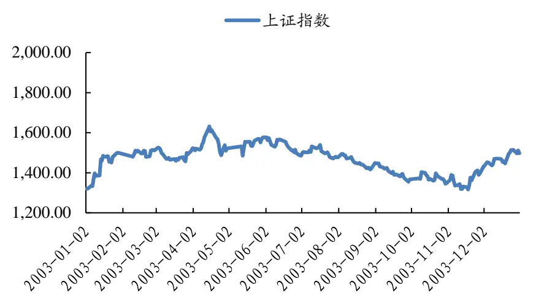
数据来源：Wind，国泰君安证券研究
• 上涨前 15%阀值：15%

- 下跌前 15%阀值：-36%

## 3.1.2. 指标特征：绩优、高增长、低估值表现良好

## ROE：牛股高 ROE特征明显，熊股中 ROE<5%个股占比较高

牛股池中，概率差和市场占比指标呈现明显单调特征。ROE在 10%以上的个股市场占比均在 30%以上。ROE在 25%以上的个股全市场共 23只，有 15 只的涨幅在前 15%以内。熊股池中，单调性不明显。但有 91%的熊股 ROE<10%，且概率差显著。

表 1：牛股高 ROE特征明显，熊股中 ROE<5%个股占比较高

|  | 牛股数量 | 分布概率 | 概率差 | 市场占比 | 熊股数量 | 分布概率 | 概率差 | 市场占比 |
| --- | --- | --- | --- | --- | --- | --- | --- | --- |
| <5% | 26 | 15% | -29% | 5% | 136 | 79% | 36% | 28% |
| 5%-10% | 42 | 24% | -7% | 12% | 22 | 13% | -18% | 6% |
| 10%-15% | 54 | 31% | 16% | 33% | 9 | 5% | -10% | 5% |
| 15%-20% | 26 | 15% | 9% | 43% | 2 | 1% | -4% | 3% |
| 20%-25% | 13 | 7% | 5% | 42% | 0 | 0% | -3% | 0% |
| >25% | 15 | 9% | 6% | 65% | 3 | 2% | 0% | 13% |

数据来源：Wind，国泰君安证券研究

## 扣非净利增长率：牛股普遍具有高 g特征，熊股增速普遍 10%之下

牛股池中，概率差和市场占比指标呈现单调特征。从市场占比看，市场上 g在 30%以上的股票有三分之一都出现牛股池中。熊股池中，概率差和市场占比指标呈现单调下降趋势，其中 g 在 10%之下的股票占比为88%，远高于全市场 65%的比例。

表 2：牛股普遍具有高 g特征，熊股增速普遍 10%之下

|  | 牛股数量 | 分布概率 | 概率差 | 市场占比 | 熊股数量 | 分布概率 | 概率差 | 市场占比 |
| --- | --- | --- | --- | --- | --- | --- | --- | --- |
| <10% | 56 | 33% | -31% | 8% | 144 | 88% | 23% | 19% |
| 10%-20% | 10 | 6% | -2% | 11% | 7 | 4% | -3% | 8% |
| 20%-30% | 10 | 6% | 1% | 17% | 2 | 1% | -4% | 3% |
| 30%-40% | 17 | 10% | 6% | 35% | 2 | 1% | -3% | 4% |
| 40%-50% | 12 | 7% | 5% | 43% | 1 | 1% | -2% | 4% |
| >50% | 63 | 38% | 21% | 34% | 8 | 5% | -11% | 4% |

数据来源：Wind，国泰君安证券研究

## PE：低 PE催生牛股，高 PE是形成熊股的充分条件

trailing PE 与 forward PE 的统计结论相似。

牛股池中，市场占比呈现明显的单调特征，其中 0-20倍的股票中有三分之二出现在涨幅榜前列，而 40倍以上和负 PE股票池中产生牛股的机会不足 10%。熊股池的股票几乎全部都有 PE在 40倍以上或为负的特征。

表 3：低 PE催生牛股，高 PE是形成熊股的充分条件

| PE(上年) | 牛股数量 | 分布概率 | 概率差 | 市场占比 | 熊股数量 | 分布概率 | 概率差 | 市场占比 |
| --- | --- | --- | --- | --- | --- | --- | --- | --- |
| <0 | 13 | 8% | -6% | 8% | 53 | 33% | 19% | 34% |
| 0-15 | 11 | 7% | 6% | 79% | 0 | 0% | -1% | 0% |
| 15-20 | 26 | 16% | 12% | 57% | 1 | 1% | -3% | 2% |
| 20-30 | 42 | 26% | 14% | 32% | 2 | 1% | -10% | 2% |
| 30-40 | 25 | 15% | 3% | 17% | 3 | 2% | -11% | 2% |
| 40-50 | 11 | 7% | -4% | 9% | 6 | 4% | -7% | 5% |
| >50 | 35 | 21% | -25% | 7% | 98 | 60% | 14% | 19% |
| PE(当年) | 牛股数量 | 分布概率 | 概率差 | 市场占比 | 熊股数量 | 分布概率 | 概率差 | 市场占比 |
| <0 | 2 | 1% | -11% | 2% | 59 | 36% | 24% | 44% |
| 0-15 | 50 | 31% | 25% | 81% | 0 | 0% | -5% | 0% |
| 15-20 | 28 | 17% | 13% | 56% | 0 | 0% | -4% | 0% |
| 20-30 | 32 | 20% | 7% | 23% | 2 | 1% | -11% | 1% |
| 30-40 | 16 | 10% | -2% | 12% | 2 | 1% | -10% | 2% |
| 40-50 | 7 | 4% | -5% | 7% | 5 | 3% | -6% | 5% |
| >50 | 28 | 17% | -29% | 5% | 95 | 58% | 13% | 18% |

数据来源：Wind，国泰君安证券研究

## 总市值规模：牛股主要分布在大市值个股之中

市值规模在 50 亿以上的公司，有接近 50%的概率出现在牛股池；市值15亿以下的公司，有三分之一出现在熊股池中。

表 4：牛股主要分布在大市值个股之中

|  | 牛股数量 | 分布概率 | 概率差 | 市场占比 | 熊股数量 | 分布概率 | 概率差 | 市场占比 |
| --- | --- | --- | --- | --- | --- | --- | --- | --- |
| <10 | 1 | 1% | -5% | 2% | 20 | 12% | 7% | 34% |
| 10-15 | 12 | 7% | -13% | 5% | 66 | 39% | 19% | 28% |
| 15-20 | 6 | 4% | -16% | 3% | 32 | 19% | 0% | 14% |
| 20-50 | 78 | 47% | 7% | 17% | 45 | 27% | -14% | 10% |
| 50-100 | 36 | 22% | 12% | 32% | 6 | 4% | -6% | 5% |
| >100 | 32 | 19% | 15% | 59% | 0 | 0% | -5% | 0% |

数据来源：Wind，国泰君安证券研究

## 3.2.04 年：震荡向下；低 ROE、低增速、高估值是熊股特征

## 3.2.1. 大盘环境：震荡向下

指数一路走低，下跌约 20%。依然有约 20%的股票上涨，但涨幅较 03年下移，个股最大涨幅为 97.69%（*ST 济柴，机械设备行业），最大跌幅为 90.93%（合金投资，机械设备行业）。

图 2：一路下跌
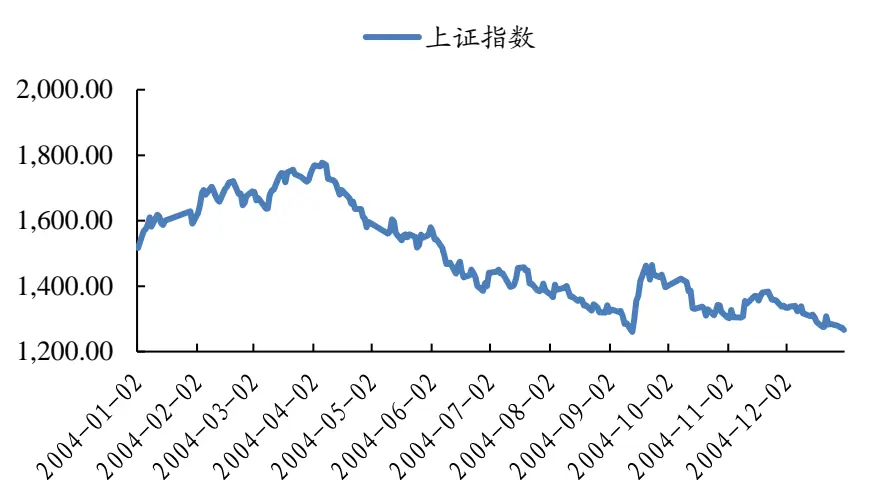
数据来源：Wind，国泰君安证券研究

- 上涨前 15%阀值：12%

- 下跌前 15%阀值：-36%

## 3.2.2. 指标特征：低 ROE、低增速、高估值是熊股主要特征

## ROE：20%以上出现牛股概率较高，熊股普遍 10%以下

牛股池中，概率差和市场占比指标呈现单调特征。ROE在 20%以上的个股有一半都在牛股池中。熊股池中，概率差和市场占比指标呈现单调特征。下跌个股有 87%都呈现 ROE低于 10%的特征。

表 5：20%以上出现牛股概率较高，熊股普遍 10%以下

|  | 牛股数量 | 分布概率 | 概率差 | 市场占比 | 熊股数量 | 分布概率 | 概率差 | 市场占比 |
| --- | --- | --- | --- | --- | --- | --- | --- | --- |
| <5% | 30 | 16% | -28% | 5% | 111 | 63% | 18% | 20% |
| 5%-10% | 35 | 19% | -8% | 11% | 43 | 24% | -3% | 13% |
| 10%-15% | 50 | 27% | 12% | 27% | 15 | 8% | -7% | 8% |
| 15%-20% | 29 | 16% | 8% | 33% | 7 | 4% | -3% | 8% |
| 20%-25% | 21 | 11% | 7% | 45% | 1 | 1% | -3% | 2% |
| >25% | 22 | 12% | 9% | 63% | 0 | 0% | -3% | 0% |

数据来源：Wind，国泰君安证券研究

## 扣非净利增长率：40%以上出现牛股概率较高，熊股普遍 10%以下

牛股池中，概率差和市场占比指标呈现单调特征。随着 g的提高，出现牛股的概率增大，增速 40%以上股票中出现牛股概率达到 33%。熊股池中，概率差和市场占比指标呈现单调特征，90%的个股利润增速都低于10%。

表 6：40%以上出现牛股概率较高，熊股普遍 10%以下

|  | 牛股数量 | 分布概率 | 概率差 | 市场占比 | 熊股数量 | 分布概率 | 概率差 | 市场占比 |
| --- | --- | --- | --- | --- | --- | --- | --- | --- |
| <10% | 45 | 24% | -36% | 6% | 144 | 90% | 29% | 19% |
| 10%-20% | 12 | 6% | 0% | 15% | 4 | 3% | -4% | 5% |
| 20%-30% | 19 | 10% | 4% | 23% | 3 | 2% | -5% | 4% |
| 30%-40% | 7 | 4% | 0% | 16% | 2 | 1% | -2% | 5% |
| 40%-50% | 17 | 9% | 6% | 39% | 0 | 0% | -4% | 0% |
| >50% | 86 | 46% | 27% | 35% | 7 | 4% | -15% | 3% |

数据来源：Wind，国泰君安证券研究

## PE：低估值个股产生牛股概率更高，但相关性有所减弱

trailing PE结果看，从概率上，随着 PE 上升产生牛股的概率是下降的，但是牛股的 PE 分布开始趋于分散。forward PE 结果规律性更强，0-20倍 PE的股票成为牛股的概率更高，而高 PE依然是熊股的必要条件。

表 7：低估值个股产生牛股概率更高，但相关性有所减弱

| PE(上年) | 牛股数量 | 分布概率 | 概率差 | 市场占比 | 熊股数量 | 分布概率 | 概率差 | 市场占比 |
| --- | --- | --- | --- | --- | --- | --- | --- | --- |
| <0 | 15 | 8% | -3% | 11% | 34 | 23% | 12% | 26% |
| 0-15 | 7 | 4% | 1% | 21% | 2 | 1% | -1% | 6% |
| 15-20 | 17 | 10% | 5% | 30% | 7 | 5% | 0% | 12% |
| 20-30 | 67 | 38% | 18% | 29% | 8 | 6% | -14% | 3% |
| 30-40 | 26 | 15% | 0% | 14% | 16 | 11% | -4% | 9% |
| 40-50 | 14 | 8% | 0% | 14% | 7 | 5% | -3% | 7% |
| >50 | 32 | 18% | -21% | 7% | 71 | 49% | 10% | 15% |
| PE(当年) | 牛股数量 | 分布概率 | 概率差 | 市场占比 | 熊股数量 | 分布概率 | 概率差 | 市场占比 |
| <0 | 3 | 2% | -12% | 2% | 63 | 43% | 30% | 38% |
| 0-15 | 53 | 30% | 22% | 56% | 1 | 1% | -7% | 1% |
| 15-20 | 45 | 25% | 16% | 42% | 3 | 2% | -7% | 3% |
| 20-30 | 35 | 20% | 5% | 20% | 6 | 4% | -11% | 3% |
| 30-40 | 15 | 8% | -1% | 13% | 6 | 4% | -6% | 5% |
| 40-50 | 3 | 2% | -5% | 4% | 8 | 6% | -1% | 10% |
| >50 | 24 | 13% | -25% | 5% | 58 | 40% | 2% | 13% |

数据来源：Wind，国泰君安证券研究

## 总市值规模：大市值产生牛股概率更高，但整体而言个股分布分散

从概率差看，大市值产生牛股的机会依然高于全市场，但牛（熊）股分布相对 03年更加平均，难以形成充分或者必要条件。

表 8：大市值产生牛股概率更高，但整体而言个股分布分散

|  | 牛股数量 | 分布概率 | 概率差 | 市场占比 | 熊股数量 | 分布概率 | 概率差 | 市场占比 |
| --- | --- | --- | --- | --- | --- | --- | --- | --- |
| <10 | 10 | 6% | -9% | 6% | 29 | 17% | 3% | 16% |
| 10-15 | 25 | 14% | -9% | 9% | 49 | 30% | 6% | 17% |
| 15-20 | 28 | 16% | -1% | 13% | 31 | 19% | 2% | 15% |
| 20-50 | 78 | 44% | 12% | 20% | 39 | 23% | -9% | 10% |
| 50-100 | 26 | 15% | 6% | 25% | 8 | 5% | -3% | 8% |
| >100 | 11 | 6% | 1% | 17% | 10 | 6% | 1% | 16% |

数据来源：Wind，国泰君安证券研究

## 3.3.05 年：弱市震荡；牛股特征弱化，熊股特征依旧

## 3.3.1. 大盘环境：弱市震荡，创新低

指数继续在低位窄幅震荡，年中创下 998 点的新低。虽然指数依然不见起色，但个股行情有所好转，依然有约 25%的股票上涨。个股最大涨幅为 182.13%（天威保变，电气设备），最大跌幅为 81.34%（*ST 太光，通信行业）。

图 3：横盘整理
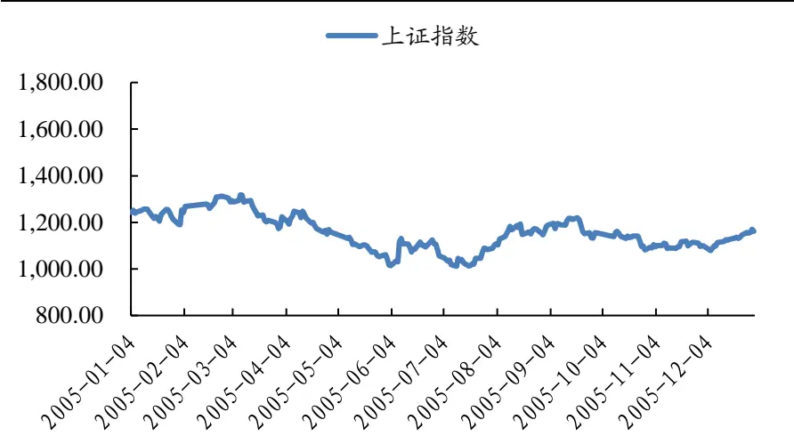
数据来源：Wind，国泰君安证券研究

- 上涨前 15%阀值：8%

- 下跌前 15%阀值：-38%

## 3.3.2. 指标特征：牛股特征弱化，熊股特征依旧

## ROE：牛股 ROE 分布比较分散，熊股普遍 5%以下

牛股 ROE 分布较为分散，ROE>10%的股票中产生牛股的概率相对于全市场更大。熊股 ROE分布特征则非常明显，85%的 ROE都低于 5%。可以认为 05年 ROE 指标更多的提供了选股安全垫的作用。

表 9：牛股 ROE分布比较分散，熊股普遍 5%以下

|  | 牛股数量 | 分布概率 | 概率差 | 市场占比 | 熊股数量 | 分布概率 | 概率差 | 市场占比 |
| --- | --- | --- | --- | --- | --- | --- | --- | --- |
| <5% | 42 | 21% | -29% | 7% | 171 | 85% | 35% | 28% |
| 5%-10% | 39 | 20% | -6% | 13% | 19 | 9% | -16% | 6% |
| 10%-15% | 57 | 29% | 16% | 35% | 10 | 5% | -8% | 6% |
| 15%-20% | 30 | 15% | 10% | 45% | 1 | 0% | -5% | 1% |
| 20%-25% | 15 | 8% | 4% | 39% | 1 | 0% | -3% | 3% |
| >25% | 14 | 7% | 5% | 48% | 0 | 0% | -2% | 0% |

数据来源：Wind，国泰君安证券研究

## 扣非净利增长率：与 ROE分布规律类似

牛股池中，只要是 g>10%，产生牛股的概率就比全市场大；熊股池中，95%的 g 低于 10%。

表 10：与 ROE分布规律类似

|  | 牛股数量 | 分布概率 | 概率差 | 市场占比 | 熊股数量 | 分布概率 | 概率差 | 市场占比 |
| --- | --- | --- | --- | --- | --- | --- | --- | --- |
| <10% | 63 | 32% | -36% | 7% | 190 | 95% | 26% | 21% |
| 10%-20% | 20 | 10% | 3% | 23% | 4 | 2% | -5% | 5% |
| 20%-30% | 23 | 12% | 6% | 31% | 1 | 0% | -5% | 1% |
| 30%-40% | 17 | 9% | 5% | 31% | 2 | 1% | -3% | 4% |
| 40%-50% | 10 | 5% | 3% | 38% | 1 | 0% | -1% | 4% |
| >50% | 63 | 32% | 19% | 37% | 3 | 1% | -12% | 2% |

## PE：低估值个股产生牛股概率更高，相关性进一步减弱

trailing PE结果看，概率差数据表明 30倍以下产生牛股的概率更高，但远不至于形成充分或必要条件关系。forward PE 规律性更强，约 73%牛股的 PE在 30倍以下，熊股中 87%的 PE 在 50倍以上或负值。

表 11：低估值个股产生牛股概率更高，相关性进一步减弱

| PE(上年) | 牛股数量 | 分布概率 | 概率差 | 市场占比 | 熊股数量 | 分布概率 | 概率差 | 市场占比 |
| --- | --- | --- | --- | --- | --- | --- | --- | --- |
| <0 | 12 | 6% | -7% | 7% | 60 | 30% | 17% | 36% |
| 0-15 | 23 | 12% | 3% | 21% | 13 | 6% | -2% | 12% |
| 15-20 | 28 | 15% | 6% | 24% | 9 | 4% | -4% | 8% |
| 20-30 | 72 | 38% | 16% | 26% | 18 | 9% | -12% | 7% |
| 30-40 | 17 | 9% | -3% | 11% | 17 | 8% | -3% | 11% |
| 40-50 | 12 | 6% | -2% | 12% | 16 | 8% | 0% | 16% |
| >50 | 28 | 15% | -14% | 7% | 68 | 34% | 5% | 18% |
| PE(当年) | 牛股数量 | 分布概率 | 概率差 | 市场占比 | 熊股数量 | 分布概率 | 概率差 | 市场占比 |
| <0 | 6 | 3% | -16% | 2% | 114 | 57% | 38% | 46% |
| 0-15 | 68 | 35% | 24% | 46% | 2 | 1% | -10% | 1% |
| 15-20 | 37 | 19% | 9% | 29% | 3 | 1% | -8% | 2% |
| 20-30 | 36 | 19% | 3% | 18% | 6 | 3% | -12% | 3% |
| 30-40 | 13 | 7% | -2% | 11% | 6 | 3% | -6% | 5% |
| 40-50 | 9 | 5% | -2% | 11% | 10 | 5% | -2% | 12% |
| >50 | 23 | 12% | -17% | 6% | 60 | 30% | 1% | 16% |

数据来源：Wind，国泰君安证券研究

## 总市值规模：10亿以下出现熊股概率较高，出现牛股概率较低

10亿是分水岭， 10亿以下的牛股概率差为负，熊股概率差为正。10亿以上牛、熊股的市值分布比较分散。

表 12：10亿以下出现熊股概率较高，出现牛股概率较低

|  | 牛股数量 | 分布概率 | 概率差 | 市场占比 | 熊股数量 | 分布概率 | 概率差 | 市场占比 |
| --- | --- | --- | --- | --- | --- | --- | --- | --- |
| <10 | 58 | 30% | -19% | 9% | 119 | 59% | 10% | 19% |
| 10-15 | 45 | 23% | 4% | 18% | 29 | 14% | -5% | 12% |
| 15-20 | 28 | 14% | 4% | 20% | 21 | 10% | 0% | 15% |
| 20-50 | 38 | 20% | 6% | 21% | 25 | 12% | -1% | 14% |
| 50-100 | 14 | 7% | 3% | 24% | 4 | 2% | -2% | 7% |
| >100 | 11 | 6% | 3% | 28% | 4 | 2% | -1% | 10% |

数据来源：Wind，国泰君安证券研究

## 3.4.06 年：反转，普涨；低 ROE、低增速是熊股特征

## 3.4.1. 大盘环境：反转，个股普涨

指数开始反转，进入到大牛市的上半场，上证指数上涨差不多 120%。约 95%的股票上涨。个股最大涨幅为 665.57%（泛海建设，房地产行业），最大跌幅为 52.77%（中工国际，建筑装饰行业）。涨幅低于 20%就成为“熊股”了。

图 4：一路上扬
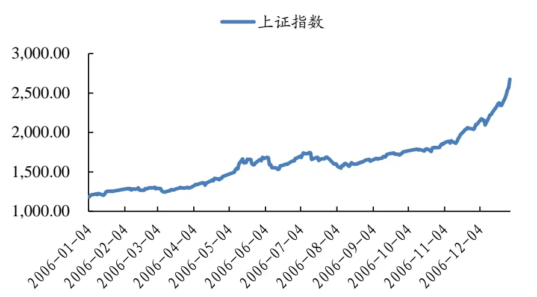
数据来源：Wind，国泰君安证券研究

- 上涨前 15%阀值：170%

- 下跌前 15%阀值：20%

## 3.4.2. 指标特征：牛股无明显特征，低 ROE、低增速是熊股特征

## ROE：牛股 ROE 分布比较分散，熊股 ROE在 5%以下占比较高

虽然市场环境发生了天翻地覆的变化，但牛股 ROE 分布延续了之前的特征，较为分散，ROE>10%的股票中产生牛股的概率相对于全市场更大。熊股 ROE分布特征也有所减弱， 53%熊股 ROE低于 5%。

表 13：牛股ROE 分布比较分散，熊股 ROE在 5%以下占比较高

|  | 牛股数量 | 分布概率 | 概率差 | 市场占比 | 熊股数量 | 分布概率 | 概率差 | 市场占比 |
| --- | --- | --- | --- | --- | --- | --- | --- | --- |
| <5% | 49 | 26% | -17% | 9% | 100 | 53% | 11% | 18% |
| 5%-10% | 31 | 16% | -7% | 10% | 29 | 16% | -8% | 10% |
| 10%-15% | 32 | 17% | 2% | 17% | 20 | 11% | -4% | 10% |
| 15%-20% | 31 | 16% | 8% | 27% | 11 | 6% | -3% | 10% |
| 20%-25% | 18 | 10% | 4% | 27% | 14 | 7% | 2% | 21% |
| >25% | 28 | 15% | 10% | 41% | 13 | 7% | 2% | 19% |

数据来源：Wind，国泰君安证券研究

## 扣非净利增长率：低增速是熊股的必要条件，牛股无显著规律

有 46%的牛股增速大于 50%，但我们同时也看到有 31%的牛股增速小于10%。熊股特征更加显著，87%的熊股增速低于 20%。

表 14：低增速是熊股的必要条件，牛股无显著规律

|  | 牛股数量 | 分布概率 | 概率差 | 市场占比 | 熊股数量 | 分布概率 | 概率差 | 市场占比 |
| --- | --- | --- | --- | --- | --- | --- | --- | --- |
| <10% | 58 | 31% | -27% | 7% | 144 | 77% | 19% | 18% |
| 10%-20% | 8 | 4% | -4% | 7% | 19 | 10% | 2% | 18% |
| 20%-30% | 8 | 4% | -2% | 10% | 4 | 2% | -4% | 5% |
| 30%-40% | 13 | 7% | 3% | 22% | 6 | 3% | -1% | 10% |
| 40%-50% | 15 | 8% | 5% | 42% | 3 | 2% | -1% | 8% |
| >50% | 86 | 46% | 25% | 30% | 11 | 6% | -15% | 4% |

数据来源：Wind，国泰君安证券研究

## PE：牛股 PE较熊股更低

trailing PE发现牛股中 43%的估值在 20倍以下，熊股中则有 62%的估值在 40 倍以上或为负。不过整体上，牛（熊）股在频率、市场占比指标上的分布并没有非常大的区别。forward PE呈现的规律则更加明显，56%的牛股 PE 在 15 倍以下，其他档的牛股较低。熊股中 66%的 PE 在 50倍以上或负值。

表 15：牛股PE 较熊股更低，forward PE 规律更加显著

| PE(上年) | 牛股数量 | 分布概率 | 概率差 | 市场占比 | 熊股数量 | 分布概率 | 概率差 | 市场占比 |
| --- | --- | --- | --- | --- | --- | --- | --- | --- |
| <0 | 22 | 12% | -7% | 9% | 50 | 36% | 17% | 20% |
| 0-15 | 45 | 24% | 10% | 25% | 9 | 7% | -7% | 5% |
| 15-20 | 36 | 19% | 6% | 21% | 13 | 9% | -3% | 8% |
| 20-30 | 34 | 18% | 1% | 15% | 20 | 14% | -3% | 9% |
| 30-40 | 11 | 6% | -2% | 10% | 10 | 7% | -1% | 9% |
| 40-50 | 4 | 2% | -2% | 7% | 8 | 6% | 1% | 13% |
| >50 | 37 | 20% | -5% | 12% | 28 | 20% | -4% | 9% |

| PE(当年) | 牛股数量 | 分布概率 | 概率差 | 市场占比 | 熊股数量 | 分布概率 | 概率差 | 市场占比 |
| --- | --- | --- | --- | --- | --- | --- | --- | --- |
| <0 | 13 | 7% | -9% | 6% | 45 | 33% | 17% | 22% |
| 0-15 | 105 | 56% | 28% | 29% | 10 | 7% | -20% | 3% |
| 15-20 | 25 | 13% | 1% | 16% | 8 | 6% | -6% | 5% |
| 20-30 | 16 | 8% | -6% | 9% | 13 | 9% | -5% | 7% |
| 30-40 | 11 | 6% | -2% | 11% | 11 | 8% | 0% | 11% |
| 40-50 | 9 | 5% | 1% | 17% | 5 | 4% | 0% | 10% |
| >50 | 10 | 5% | -14% | 4% | 46 | 33% | 14% | 18% |

数据来源：Wind，国泰君安证券研究

## 总市值规模：牛股市值主要在 20亿以上，熊股市值集中在 15亿以下

牛股中市值在 20亿以上的有 61%，熊股中市值 15亿以下的有 71%。

表 16：牛股市值主要在 20亿以上，熊股市值集中在 15亿以下

|  | 牛股数量 | 分布概率 | 概率差 | 市场占比 | 熊股数量 | 分布概率 | 概率差 | 市场占比 |
| --- | --- | --- | --- | --- | --- | --- | --- | --- |
| <10 | 17 | 9% | -22% | 4% | 71 | 51% | 20% | 17% |
| 10-15 | 31 | 16% | -4% | 12% | 27 | 20% | -1% | 10% |
| 15-20 | 25 | 13% | 1% | 15% | 10 | 7% | -5% | 6% |
| 20-50 | 65 | 34% | 11% | 21% | 26 | 19% | -4% | 8% |
| 50-100 | 33 | 17% | 9% | 30% | 3 | 2% | -6% | 3% |
| >100 | 18 | 10% | 5% | 31% | 1 | 1% | -4% | 2% |

数据来源：Wind，国泰君安证券研究

## 3.5.07 年：疯狂，见顶；依然可在牛股找到绩优、高增速特征

## 3.5.1. 大盘环境：疯狂，见顶

指数继续向上，年中创下 6124点的历史高点。个股依然呈现普涨局面，约 97%的股票上涨。个股最大涨幅为 1611.92%（仁和药业，医药生物行业），最大跌幅为 49.05%（拓邦股份，电子行业）。

图 5：大幅上涨，见顶
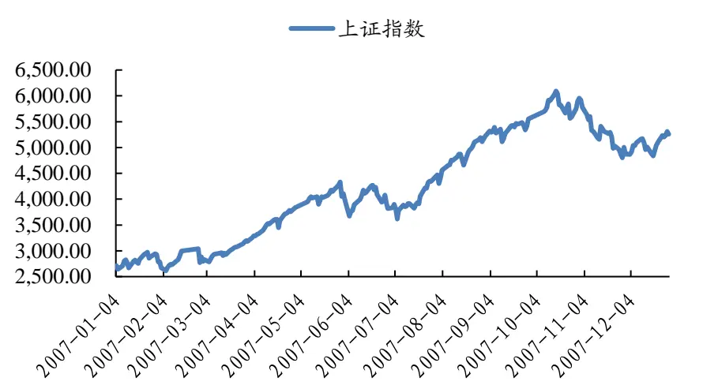
数据来源：Wind，国泰君安证券研究

- 上涨前 15%阀值：305%

- 下跌前 15%阀值：65%

## 3.5.2. 指标特征：依然可在牛股找到绩优、高增速特征

## ROE：牛股 ROE 特征明显，熊股无显著规律

牛股 ROE 的概率差和市场占比呈现出很强的线性特征，ROE>25%的股票有三分之一在牛股池中。熊股 ROE 分布特征非常分散，没有明显特征。

表 17：牛股ROE 特征明显，熊股无显著规律

|  | 牛股数量 | 分布概率 | 概率差 | 市场占比 | 熊股数量 | 分布概率 | 概率差 | 市场占比 |
| --- | --- | --- | --- | --- | --- | --- | --- | --- |
| <5% | 55 | 25% | -3% | 13% | 35 | 16% | -12% | 9% |
| 5%-10% | 32 | 15% | -6% | 11% | 42 | 20% | -2% | 14% |
| 10%-15% | 27 | 12% | -7% | 10% | 54 | 25% | 6% | 20% |
| 15%-20% | 30 | 14% | 1% | 16% | 40 | 19% | 6% | 22% |
| 20%-25% | 20 | 9% | 2% | 19% | 19 | 9% | 2% | 18% |
| >25% | 53 | 24% | 14% | 34% | 24 | 11% | 0% | 15% |

数据来源：Wind，国泰君安证券研究

## 扣非净利增长率：牛股多半增速 50%以上，熊股多半增速 10%以下

牛股 g 的概率差和市场占比呈现出较强的线性特征，牛股中有 51%个股的利润增速大于 50%；熊股池中，53%的熊股利润增速低于 10%。

表 18：牛股多半增速 50%以上，熊股多半增速 10%以下

|  | 牛股数量 | 分布概率 | 概率差 | 市场占比 | 熊股数量 | 分布概率 | 概率差 | 市场占比 |
| --- | --- | --- | --- | --- | --- | --- | --- | --- |
| <10% | 81 | 37% | -9% | 12% | 112 | 53% | 6% | 16% |
| 10%-20% | 8 | 4% | -2% | 9% | 20 | 9% | 3% | 22% |
| 20%-30% | 5 | 2% | -4% | 5% | 18 | 8% | 2% | 19% |
| 30%-40% | 4 | 2% | -3% | 6% | 11 | 5% | 1% | 16% |
| 40%-50% | 8 | 4% | -1% | 12% | 13 | 6% | 1% | 19% |
| >50% | 111 | 51% | 19% | 23% | 38 | 18% | -14% | 8% |

数据来源：Wind，国泰君安证券研究

## PE：依稀能看到一些规律，但对寻找牛、熊股意义不大

trailing PE结果看，20倍 PE 以下产生牛股的概率相对更大，30倍 PE以上产生熊股的概率相对更大。forward PE结果规律类似，55%牛股的 PE在 15 倍以下。值得注意的是，牛股中负 PE 股的概率比全市场负 PE 股概率还高，这可能与在牛市末期投机氛围浓厚有关。

表 19：低估值产生牛股概率稍大，高估值产生熊股概率稍大

| PE(上年) | 牛股数量 | 分布概率 | 概率差 | 市场占比 | 熊股数量 | 分布概率 | 概率差 | 市场占比 |
| --- | --- | --- | --- | --- | --- | --- | --- | --- |
| <0 | 38 | 18% | 3% | 19% | 9 | 8% | -7% | 4% |
| 0-15 | 46 | 21% | 11% | 34% | 4 | 3% | -6% | 3% |
| 15-20 | 26 | 12% | 3% | 22% | 4 | 3% | -5% | 3% |
| 20-30 | 28 | 13% | -5% | 11% | 15 | 13% | -5% | 6% |
| 30-40 | 17 | 8% | -6% | 9% | 23 | 20% | 6% | 12% |
| 40-50 | 12 | 6% | -1% | 13% | 16 | 14% | 7% | 17% |
| >50 | 50 | 23% | -5% | 13% | 45 | 39% | 11% | 12% |
| PE(当年) | 牛股数量 | 分布概率 | 概率差 | 市场占比 | 熊股数量 | 分布概率 | 概率差 | 市场占比 |
| <0 | 17 | 8% | 0% | 15% | 9 | 8% | 0% | 8% |
| 0-15 | 120 | 55% | 29% | 33% | 5 | 4% | -22% | 1% |
| 15-20 | 13 | 6% | -6% | 8% | 8 | 7% | -5% | 5% |
| 20-30 | 22 | 10% | -8% | 9% | 22 | 19% | 1% | 9% |
| 30-40 | 13 | 6% | -4% | 10% | 24 | 21% | 11% | 18% |
| 40-50 | 7 | 3% | -3% | 9% | 13 | 11% | 5% | 16% |
| >50 | 25 | 12% | -8% | 9% | 35 | 30% | 10% | 13% |

数据来源：Wind，国泰君安证券研究

## 总市值规模：牛股依然以大市值个股为主，但特征弱化明显

大市值股票中出现牛股的概率减小，但依然比小市值中出现牛股的概率高。熊股的小市值特征已非常模糊。

表 20：牛股依然以大市值个股为主，但特征弱化明显

|  | 牛股数量 | 分布概率 | 概率差 | 市场占比 | 熊股数量 | 分布概率 | 概率差 | 市场占比 |
| --- | --- | --- | --- | --- | --- | --- | --- | --- |
| <10 | 6 | 3% | -1% | 12% | 14 | 9% | 6% | 28% |
| 10-15 | 16 | 7% | -1% | 14% | 11 | 7% | -1% | 10% |
| 15-20 | 13 | 6% | -4% | 9% | 18 | 12% | 1% | 12% |
| 20-50 | 91 | 42% | 2% | 16% | 57 | 38% | -2% | 10% |
| 50-100 | 51 | 24% | 4% | 18% | 24 | 16% | -4% | 9% |
| >100 | 40 | 18% | 0% | 15% | 27 | 18% | 0% | 10% |

数据来源：Wind，国泰君安证券研究

## 3.6.08 年：恐怖熊市，大、小盘风格出现逆转；牛、熊股重现03-05 年特征

## 3.6.1. 大盘环境：下跌、下跌

08年指数经历了恐怖下跌，指数从约 5500点下跌到 1664点，约 65%的跌幅。全市场仅 30只个股在上涨。个股最大涨幅为 410.44%（中福实业，轻工制造行业），最大跌幅为 86.94%（澳洋科技，化工行业）。

图 6：大幅杀跌
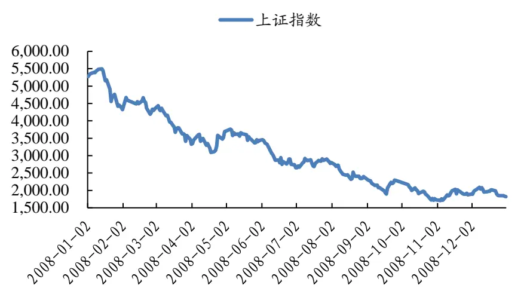
数据来源：Wind，国泰君安证券研究

- 上涨前 15%阀值：-42%

- 下跌前 15%阀值：-72%

## 3.6.2. 指标特征：牛、熊股重现 03-05年特征

## ROE：绩优股展现较好抗跌性，熊股 ROE普遍较低

ROE>15%的股票有三分之一在牛股池中，显示出绩优股的良好抗跌性。
与之相反，熊股中有 85%的 ROE低于 15%。

表 21：绩优股展现较好抗跌性，熊股 ROE普遍较低

|  | 牛股数量 | 分布概率 | 概率差 | 市场占比 | 熊股数量 | 分布概率 | 概率差 | 市场占比 |
| --- | --- | --- | --- | --- | --- | --- | --- | --- |
| <5% | 46 | 21% | -21% | 7% | 139 | 56% | 14% | 22% |
| 5%-10% | 33 | 15% | -7% | 10% | 46 | 19% | -4% | 14% |
| 10%-15% | 43 | 19% | 4% | 19% | 25 | 10% | -5% | 11% |
| 15%-20% | 43 | 19% | 10% | 30% | 14 | 6% | -4% | 10% |
| 20%-25% | 23 | 10% | 6% | 35% | 8 | 3% | -1% | 12% |
| >25% | 35 | 16% | 9% | 33% | 15 | 6% | -1% | 14% |

数据来源：Wind，国泰君安证券研究

## 扣非净利增长率：对牛、熊股的区分度较强

增速 30%以上股票中产生牛股的概率在 30%左右，产生熊股的概率在个位数。熊股中有 84%的 g 低于 10%。

表 22：增长率对牛、熊股的区分度较强

|  | 牛股数量 | 分布概率 | 概率差 | 市场占比 | 熊股数量 | 分布概率 | 概率差 | 市场占比 |
| --- | --- | --- | --- | --- | --- | --- | --- | --- |
| <10% | 89 | 40% | -27% | 8% | 209 | 84% | 17% | 20% |
| 10%-20% | 15 | 7% | 2% | 21% | 2 | 1% | -4% | 3% |
| 20%-30% | 17 | 8% | 3% | 23% | 3 | 1% | -3% | 4% |
| 30%-40% | 20 | 9% | 5% | 29% | 5 | 2% | -2% | 7% |
| 40%-50% | 13 | 6% | 3% | 32% | 4 | 2% | -1% | 10% |
| >50% | 69 | 31% | 15% | 27% | 25 | 10% | -6% | 10% |

数据来源：Wind，国泰君安证券研究

## PE：trailing PE 特征指标弱化，forward PE 特征依旧较强

trailing PE结果看， PE处于 15倍以下的股票有 86%处于牛股池中，只有 7%在熊股池中，表明低估值股票的良好抗跌性。而高估值股票（大于 50 或小于 0）在牛股池中占比为 62%，在熊股池中占比为 60%，似乎高估值与牛、熊股没有必然联系。forward PE 特征就好很多，高估值股票在牛股池占比骤降到 39%，在熊股池上升到 86%。

表 23：trailing PE 特征指标弱化，forward PE 特征依旧较强

| PE(上年) | 牛股数量 | 分布概率 | 概率差 | 市场占比 | 熊股数量 | 分布概率 | 概率差 | 市场占比 |
| --- | --- | --- | --- | --- | --- | --- | --- | --- |
| <0 | 16 | 8% | 0% | 14% | 22 | 9% | 1% | 20% |
| 0-15 | 12 | 6% | 5% | 86% | 1 | 0% | -1% | 7% |
| 15-20 | 4 | 2% | 1% | 36% | 6 | 2% | 2% | 55% |
| 20-30 | 18 | 8% | 1% | 16% | 29 | 12% | 4% | 25% |
| 30-40 | 22 | 10% | -2% | 13% | 31 | 13% | 1% | 18% |
| 40-50 | 28 | 13% | 0% | 15% | 31 | 13% | 0% | 16% |
| >50 | 112 | 53% | -5% | 13% | 127 | 51% | -7% | 15% |
| PE(当年) | 牛股数量 | 分布概率 | 概率差 | 市场占比 | 熊股数量 | 分布概率 | 概率差 | 市场占比 |
| <0 | 21 | 10% | -7% | 8% | 65 | 26% | 10% | 26% |
| 0-15 | 29 | 14% | 11% | 83% | 1 | 0% | -2% | 3% |
| 15-20 | 13 | 6% | 4% | 42% | 3 | 1% | -1% | 10% |
| 20-30 | 26 | 12% | 5% | 25% | 6 | 2% | -5% | 6% |
| 30-40 | 33 | 16% | 8% | 28% | 8 | 3% | -5% | 7% |
| 40-50 | 29 | 14% | 4% | 20% | 17 | 7% | -3% | 12% |
| >50 | 61 | 29% | -26% | 8% | 147 | 60% | 5% | 18% |

数据来源：Wind，国泰君安证券研究

## 总市值规模：小股票更抗跌，风格出现 03 年来的首次逆转

市值 10 亿规模下的小股票有 37%成为牛股，熊股池中 50%的市值在 50亿以上。08年之前一直是大股票表现优于小股票，风格首次发生逆转。

表 24：小票更抗跌，风格出现 03年来的首次逆转

|  | 牛股数量 | 分布概率 | 概率差 | 市场占比 | 熊股数量 | 分布概率 | 概率差 | 市场占比 |
| --- | --- | --- | --- | --- | --- | --- | --- | --- |
| <10 | 25 | 11% | 7% | 37% | 7 | 3% | -2% | 10% |
| 10-15 | 27 | 12% | 0% | 15% | 11 | 4% | -8% | 6% |
| 15-20 | 22 | 10% | -1% | 13% | 18 | 7% | -4% | 11% |
| 20-50 | 76 | 34% | -4% | 13% | 90 | 36% | -1% | 16% |
| 50-100 | 40 | 18% | 1% | 16% | 51 | 21% | 4% | 20% |
| >100 | 35 | 16% | -3% | 13% | 71 | 29% | 10% | 26% |

数据来源：Wind，国泰君安证券研究

## 3.7. 09 年：大反弹；除 forward PE 外，指标大面积失效

## 3.7.1. 大盘环境：大反弹，个股行情更佳

经历了 08年的大幅下跌，09年市场大幅反弹，指数从约 2000点上涨到最高 3478点，全年涨幅约 80%。虽然指数涨幅远不及 07年，但个股行情却不落下风，全年下跌股票仅 55 只。个股最大涨幅达 2152.63%（顺发恒业，房地产行业），最大跌幅仅 28.77%（三泰电子，计算机行业），均比历史值要高。

图 7：大幅反弹
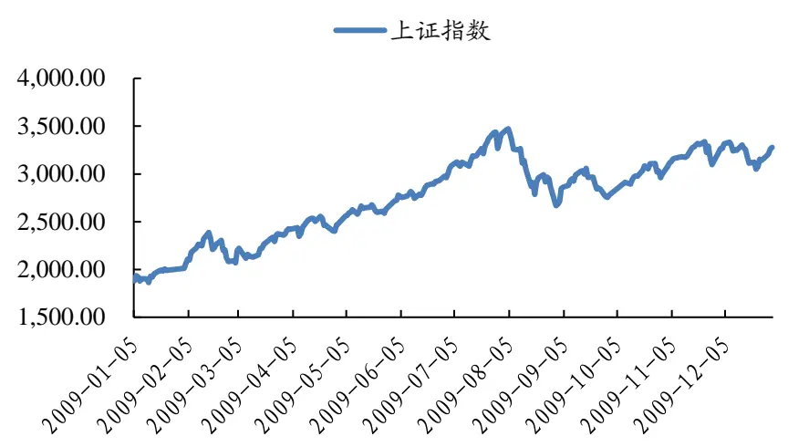
数据来源：Wind，国泰君安证券研究

- 上涨前 15%阀值：215%

- 下跌前 15%阀值：58%

## 3.7.2. 指标特征：除 forward PE 外，指标大面积失效

## ROE：基本失效

牛股中 ROE<5%的股票有 30%，熊股中这一比例为 20%；牛股中ROE>25%的股票占比 13%，熊股中这一比例为 20%。09年 ROE 指标基本失效。

表 25：基本无指示作用

|  | 牛股数量 | 分布概率 | 概率差 | 市场占比 | 熊股数量 | 分布概率 | 概率差 | 市场占比 |
| --- | --- | --- | --- | --- | --- | --- | --- | --- |
| <5% | 72 | 30% | -4% | 13% | 48 | 20% | -14% | 9% |
| 5%-10% | 40 | 17% | -5% | 11% | 31 | 13% | -9% | 9% |
| 10%-15% | 35 | 15% | -2% | 13% | 46 | 20% | 3% | 17% |
| 15%-20% | 36 | 15% | 3% | 19% | 39 | 17% | 5% | 20% |
| 20%-25% | 27 | 11% | 4% | 24% | 25 | 11% | 4% | 22% |
| >25% | 30 | 13% | 5% | 24% | 46 | 20% | 12% | 36% |

数据来源：Wind，国泰君安证券研究

## 扣非净利增长率：牛、熊股特征不显著

高增速个股有更大的概率成为牛股，但牛股中依然有 50%的公司 g低于10%；熊股中利润增速在 20%之下的股票占比 60%，但也有 17%的股票增速超过 50%。09年牛、熊股的增长特征区别也不显著。

表 26：牛、熊股特征不显著

|  | 牛股数量 | 分布概率 | 概率差 | 市场占比 | 熊股数量 | 分布概率 | 概率差 | 市场占比 |
| --- | --- | --- | --- | --- | --- | --- | --- | --- |
| <10% | 119 | 50% | -7% | 13% | 111 | 47% | -10% | 12% |
| 10%-20% | 6 | 3% | -4% | 5% | 30 | 13% | 6% | 26% |
| 20%-30% | 5 | 2% | -3% | 6% | 25 | 11% | 6% | 31% |
| 30%-40% | 10 | 4% | 0% | 13% | 18 | 8% | 3% | 24% |
| 40%-50% | 10 | 4% | 1% | 18% | 12 | 5% | 2% | 21% |
| >50% | 90 | 38% | 14% | 23% | 39 | 17% | -7% | 10% |

## PE：trailing PE 特征不明显，forward PE 特征依然显著

trailing PE结果看，牛、熊股的估值没有明显特征，高 PE个股占牛股池的 46%，占到熊股池的 38%，牛股中高估值个股反而更多。forward PE特征要明显一些，高估值股票在牛股池占比 20%，在熊股池占比 42%；低估值（20倍以下）个股在牛股池中占比 61%，熊股中仅占 22%。

表 27：trailing PE 特征不明显，forward PE 特征依然显著

| PE(上年) | 牛股数量 | 分布概率 | 概率差 | 市场占比 | 熊股数量 | 分布概率 | 概率差 | 市场占比 |
| --- | --- | --- | --- | --- | --- | --- | --- | --- |
| <0 | 53 | 22% | 6% | 21% | 22 | 14% | -2% | 9% |
| 0-15 | 54 | 23% | 7% | 23% | 18 | 11% | -4% | 8% |
| 15-20 | 20 | 8% | -3% | 11% | 19 | 12% | 1% | 11% |
| 20-30 | 34 | 14% | -5% | 12% | 28 | 17% | -2% | 9% |
| 30-40 | 11 | 5% | -6% | 6% | 28 | 17% | 7% | 16% |
| 40-50 | 11 | 5% | -1% | 13% | 8 | 5% | 0% | 10% |
| >50 | 57 | 24% | 1% | 16% | 38 | 24% | 1% | 11% |
| PE(当年) | 牛股数量 | 分布概率 | 概率差 | 市场占比 | 熊股数量 | 分布概率 | 概率差 | 市场占比 |
| <0 | 27 | 11% | -1% | 15% | 21 | 13% | 1% | 11% |
| 0-15 | 121 | 50% | 25% | 30% | 14 | 9% | -17% | 3% |
| 15-20 | 27 | 11% | 0% | 15% | 20 | 12% | 1% | 11% |
| 20-30 | 19 | 8% | -8% | 7% | 26 | 16% | 0% | 10% |
| 30-40 | 13 | 5% | -4% | 9% | 22 | 14% | 4% | 15% |
| 40-50 | 11 | 5% | 0% | 15% | 12 | 7% | 3% | 17% |
| >50 | 22 | 9% | -12% | 7% | 46 | 29% | 8% | 14% |

数据来源：Wind，国泰君安证券研究

## 总市值规模：小股票表现继续优于大股票

从概率差来看，12亿以下和 20-50亿市值范围内更容易产生牛股；50亿市值以上范围更容易产生熊股。

表 28：小股票中出现牛股概率更高

|  | 牛股数量 | 分布概率 | 概率差 | 市场占比 | 熊股数量 | 分布概率 | 概率差 | 市场占比 |
| --- | --- | --- | --- | --- | --- | --- | --- | --- |
| <10 | 20 | 8% | 3% | 26% | 9 | 6% | 1% | 12% |
| 10-15 | 27 | 11% | 0% | 16% | 14 | 9% | -2% | 8% |
| 15-20 | 26 | 11% | -3% | 12% | 13 | 8% | -6% | 6% |
| 20-50 | 98 | 41% | 2% | 16% | 38 | 24% | -15% | 6% |
| 50-100 | 38 | 16% | 0% | 15% | 31 | 19% | 3% | 12% |
| >100 | 31 | 13% | -2% | 13% | 56 | 35% | 19% | 23% |

数据来源：Wind，国泰君安证券研究

## 3.8.10 年：震荡整理；指标特征稍有好转，但依然较弱

## 3.8.1. 大盘环境：上证指数震荡整理，中小盘依旧保持强势

经历了大涨大跌后，2010年指数开始在2500到3500的区间内震荡整理。上证指数轻微下跌，但上涨个股数量高于下跌数量，原因在于中小板指延续了 09年走势，上涨约 30%。个股最大涨幅为 427.92%（广发证券，非银金融），最大跌幅为 52.15%（华菱钢铁，钢铁行业）。

图 8：横盘整理
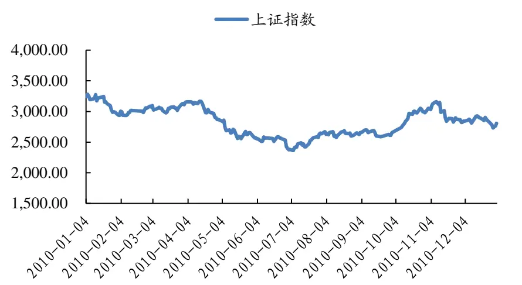
数据来源：Wind，国泰君安证券研究
• 上涨前 15%阀值：50%

- 下跌前 15%阀值：-25%

## 3.8.2. 指标特征：较于熊股，牛股具备高 ROE、高增速特征

## ROE：与牛、熊股频率有较强线性关系

随着 ROE上升，牛股的市场占比逐渐上升，熊股的市场占比逐渐下降。
但总体上指标特征性不够强，因此光靠 ROE难以选到牛股。

表 29：与牛、熊股频率有较强线性关系

|  | 牛股数量 | 分布概率 | 概率差 | 市场占比 | 熊股数量 | 分布概率 | 概率差 | 市场占比 |
| --- | --- | --- | --- | --- | --- | --- | --- | --- |
| <5% | 42 | 15% | -8% | 9% | 76 | 29% | 5% | 17% |
| 5%-10% | 56 | 20% | -8% | 10% | 83 | 31% | 4% | 16% |
| 10%-15% | 62 | 22% | 1% | 15% | 56 | 21% | 0% | 13% |
| 15%-20% | 52 | 18% | 6% | 21% | 26 | 10% | -3% | 11% |
| 20%-25% | 32 | 11% | 4% | 21% | 14 | 5% | -2% | 9% |
| >25% | 39 | 14% | 6% | 25% | 9 | 3% | -4% | 6% |

数据来源：Wind，国泰君安证券研究

## 扣非净利增长率：对牛、熊股有较好的甄别效果

增速 10%以下的股票在牛股池中占 22%，在熊股池中占 60%；增速 50%以上的股票在牛股池中占 54%，在熊股池中仅占 18%。

表 30：对牛、熊股有较好的甄别效果

|  | 牛股数量 | 分布概率 | 概率差 | 市场占比 | 熊股数量 | 分布概率 | 概率差 | 市场占比 |
| --- | --- | --- | --- | --- | --- | --- | --- | --- |
| <10% | 63 | 22% | -22% | 7% | 160 | 60% | 16% | 18% |
| 10%-20% | 13 | 5% | -4% | 7% | 17 | 6% | -2% | 10% |
| 20%-30% | 17 | 6% | -1% | 12% | 16 | 6% | -1% | 11% |
| 30%-40% | 19 | 7% | 0% | 14% | 11 | 4% | -3% | 8% |
| 40%-50% | 19 | 7% | 1% | 16% | 14 | 5% | -1% | 12% |
| >50% | 153 | 54% | 26% | 28% | 48 | 18% | -10% | 9% |

数据来源：Wind，国泰君安证券研究

PE：forward PE 低产生牛股的概率更高，而 trailing PE 结果相反从 trailing PE 的结果看，似乎 PE 越高，牛股产生的概率越大。forward PE的结果就要符合逻辑一些。比较相同范围的牛、熊股市场占比，会发现在 40 倍之下，牛股的占比均稍高于熊股，40倍之上以及负 PE 个股，熊股的占比高于牛股。

表 31：forward PE 低产生牛股的概率更高，而 trailing PE 结果相反

| PE(上年) | 牛股数量 | 分布概率 | 概率差 | 市场占比 | 熊股数量 | 分布概率 | 概率差 | 市场占比 |
| --- | --- | --- | --- | --- | --- | --- | --- | --- |
| <0 | 30 | 12% | 0% | 16% | 17 | 7% | -4% | 9% |
| 0-15 | 3 | 1% | 0% | 13% | 6 | 3% | 1% | 26% |
| 15-20 | 5 | 2% | -2% | 8% | 15 | 7% | 3% | 24% |
| 20-30 | 20 | 8% | -3% | 11% | 43 | 19% | 8% | 24% |
| 30-40 | 41 | 16% | 3% | 19% | 36 | 16% | 3% | 17% |
| 40-50 | 49 | 19% | 6% | 23% | 22 | 10% | -3% | 10% |
| >50 | 107 | 42% | -5% | 14% | 91 | 40% | -7% | 12% |
| PE(当年) | 牛股数量 | 分布概率 | 概率差 | 市场占比 | 熊股数量 | 分布概率 | 概率差 | 市场占比 |
| <0 | 4 | 2% | -5% | 4% | 19 | 8% | 1% | 17% |
| 0-15 | 25 | 10% | 4% | 24% | 8 | 3% | -3% | 8% |
| 15-20 | 26 | 10% | 3% | 21% | 24 | 10% | 3% | 20% |
| 20-30 | 69 | 27% | 11% | 26% | 30 | 13% | -3% | 11% |
| 30-40 | 44 | 17% | 3% | 18% | 29 | 13% | -2% | 12% |
| 40-50 | 20 | 8% | -2% | 12% | 27 | 12% | 1% | 16% |
| >50 | 67 | 26% | -13% | 10% | 93 | 40% | 2% | 14% |

数据来源：Wind，国泰君安证券研究

## 总市值规模：决定波动幅度而非涨跌幅

牛股和熊股的单档差呈现出一样的特征，即中小市值股票的概率差为负，大市值（50 亿以上）股票的概率差为正。这个结果说明在 10 年大市值股票表现的分化相较于小市值股票更严重。而市值大小与涨跌幅无必然联系。

表 32：决定波动幅度而非涨跌幅

|  | 牛股数量 | 分布概率 | 概率差 | 市场占比 | 熊股数量 | 分布概率 | 概率差 | 市场占比 |
| --- | --- | --- | --- | --- | --- | --- | --- | --- |
| <10 | 3 | 1% | 0% | 14% | 0 | 0% | -1% | 0% |
| 10-15 | 9 | 3% | -3% | 8% | 8 | 3% | -3% | 7% |
| 15-20 | 26 | 10% | -1% | 14% | 16 | 6% | -4% | 9% |
| 20-50 | 105 | 39% | -4% | 14% | 85 | 33% | -9% | 11% |
| 50-100 | 70 | 26% | 5% | 19% | 60 | 24% | 3% | 16% |
| >100 | 59 | 22% | 3% | 17% | 85 | 33% | 15% | 25% |

数据来源：Wind，国泰君安证券研究

## 3.9.11 年：继续下跌；牛股集中于高 ROE、高增速、小市值中

## 3.9.1. 大盘环境：继续下跌

经历了 10 年的整理，上证指数开始继续向下，全年跌幅 20%有余。中小板指没能延续 09 年走势，大幅下跌约 40%。个股最大涨幅为 209.6%（新华联，房地产行业），最大跌幅为 73.2%（汉王科技，计算机行业）。

图 9：向下突破
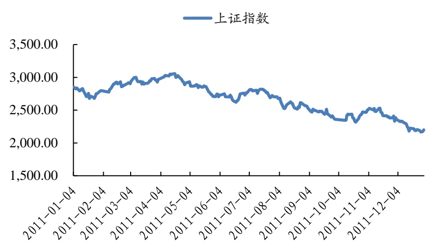
数据来源：Wind，国泰君安证券研究

- 上涨前 15%阀值：-10%

- 下跌前 15%阀值：-48%

## 3.9.2. 指标特征：牛股集中于高 ROE、高增速、小市值中

## ROE：与产生牛股概率成正比，但指标特征不强

ROE在 10%以上的股票中产生牛股的概率高于全市场水平，反之产生熊股的概率高于全市场水平。从市场占比看，ROE 在 25%以上的股票有33%的概率成为牛股。

表 33：与产生牛股概率成正比，但指标特征不强

|  | 牛股数量 | 分布概率 | 概率差 | 市场占比 | 熊股数量 | 分布概率 | 概率差 | 市场占比 |
| --- | --- | --- | --- | --- | --- | --- | --- | --- |
| <5% | 58 | 18% | -9% | 9% | 130 | 41% | 14% | 21% |
| 5%-10% | 51 | 16% | -13% | 8% | 114 | 36% | 7% | 17% |
| 10%-15% | 78 | 24% | 4% | 17% | 39 | 12% | -8% | 9% |
| 15%-20% | 52 | 16% | 5% | 21% | 21 | 7% | -4% | 8% |
| 20%-25% | 34 | 11% | 5% | 26% | 8 | 3% | -3% | 6% |
| >25% | 49 | 15% | 9% | 34% | 5 | 2% | -5% | 3% |

数据来源：Wind，国泰君安证券研究

## 扣非净利增长率：对牛、熊股有较好的甄别效果

增速 10%以下的股票在牛股池中占 34%，在熊股池中占 78%；增速 50%以上的股票在牛股池中占 35%，在熊股池中占 7%。

表 34：对牛、熊股有较好的甄别效果

|  | 牛股数量 | 分布概率 | 概率差 | 市场占比 | 熊股数量 | 分布概率 | 概率差 | 市场占比 |
| --- | --- | --- | --- | --- | --- | --- | --- | --- |
| <10% | 110 | 34% | -22% | 9% | 248 | 78% | 21% | 19% |
| 10%-20% | 22 | 7% | -1% | 12% | 20 | 6% | -2% | 11% |
| 20%-30% | 26 | 8% | 0% | 14% | 20 | 6% | -2% | 11% |
| 30%-40% | 30 | 9% | 4% | 23% | 6 | 2% | -4% | 5% |
| 40%-50% | 22 | 7% | 3% | 23% | 3 | 1% | -3% | 3% |
| >50% | 112 | 35% | 17% | 27% | 22 | 7% | -11% | 5% |

数据来源：Wind，国泰君安证券研究

## PE：牛股的 forwarding PE 更低，trailing PE 结果不显著

比较 forwarding PE中相同范围的牛、熊股市场占比，发现在 40倍之下，牛股的占比均高于熊股，40 倍之上以及负 PE 个股，熊股的占比高于牛股。

表 35：牛股的 forwarding PE 更低，trailing PE 结果不显著

| PE(上年) | 牛股数量 | 分布概率 | 概率差 | 市场占比 | 熊股数量 | 分布概率 | 概率差 | 市场占比 |
| --- | --- | --- | --- | --- | --- | --- | --- | --- |
| <0 | 28 | 10% | 4% | 25% | 18 | 6% | 0% | 16% |
| 0-15 | 35 | 12% | 7% | 34% | 5 | 2% | -4% | 5% |
| 15-20 | 15 | 5% | 0% | 14% | 9 | 3% | -2% | 8% |
| 20-30 | 23 | 8% | -3% | 11% | 17 | 6% | -5% | 8% |
| 30-40 | 27 | 10% | -2% | 12% | 32 | 11% | -1% | 14% |
| 40-50 | 24 | 9% | -2% | 11% | 38 | 13% | 2% | 18% |
| >50 | 130 | 46% | -5% | 13% | 184 | 61% | 10% | 18% |
| PE(当年) | 牛股数量 | 分布概率 | 概率差 | 市场占比 | 熊股数量 | 分布概率 | 概率差 | 市场占比 |
| <0 | 24 | 9% | 1% | 15% | 42 | 14% | 6% | 27% |
| 0-15 | 73 | 26% | 18% | 46% | 2 | 1% | -7% | 1% |
| 15-20 | 22 | 8% | 1% | 17% | 4 | 1% | -5% | 3% |
| 20-30 | 30 | 11% | -1% | 13% | 15 | 5% | -6% | 7% |
| 30-40 | 31 | 11% | -2% | 12% | 25 | 8% | -5% | 10% |
| 40-50 | 21 | 7% | -3% | 10% | 24 | 8% | -3% | 11% |
| >50 | 81 | 29% | -14% | 9% | 191 | 63% | 20% | 22% |

数据来源：Wind，国泰君安证券研究

## 总市值规模：小市值股产生牛股概率更高

牛股池和熊股池中股票的市值分布较为平均，从概率差看牛股中小市值股的比例稍高。从市场占比看，小于 10亿的个股全部进入牛股池中。

表 36：小市值股产生牛股概率更高

|  | 牛股数量 | 分布概率 | 概率差 | 市场占比 | 熊股数量 | 分布概率 | 概率差 | 市场占比 |
| --- | --- | --- | --- | --- | --- | --- | --- | --- |
| <10 | 13 | 4% | 4% | 100% | 0 | 0% | -1% | 0% |
| 10-15 | 19 | 6% | 3% | 25% | 6 | 2% | -2% | 8% |
| 15-20 | 22 | 7% | -2% | 11% | 28 | 9% | 0% | 14% |
| 20-50 | 115 | 37% | -7% | 12% | 140 | 45% | 0% | 15% |
| 50-100 | 67 | 22% | -1% | 14% | 86 | 27% | 5% | 18% |
| >100 | 73 | 24% | 4% | 17% | 54 | 17% | -2% | 13% |

数据来源：Wind，国泰君安证券研究

## 3.10. 12 年：均衡震荡；ROE、forward PE 指示意义较强

## 3.10.1. 大盘环境：均衡震荡

2012 年无论是大盘，中小板还是成份股逐渐增多的创业板指，均没有出现趋势性行情。因此我们看到个股上涨和下跌前 15%的阀值自 03 以来最为对称。个股最大涨幅为 703.43%（华数传媒，传媒行业），最大跌幅为 60.72%（亿晶光电，电气设备行业）。

图 10：窄幅震荡
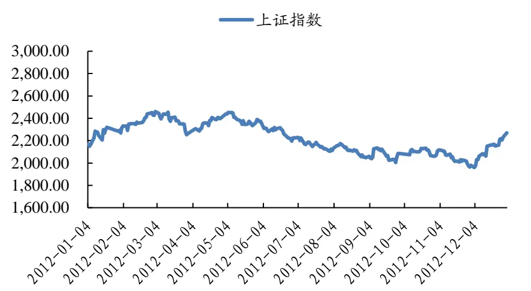
数据来源：Wind，国泰君安证券研究
• 上涨前 15%阀值：28%

- 下跌前 15%阀值：-22%

## 3.10.2. 指标特征：ROE、forward PE 指示意义较强

## ROE：指示作用较强

随着 ROE上升，牛股的市场占比逐渐上升，熊股的市场占比逐渐下降。且指标指示性较强，ROE>25%的股票有近一半在牛股池中，熊股池中80%的股票 ROE 低于 10%。

表 37：指示作用较强

|  | 牛股数量 | 分布概率 | 概率差 | 市场占比 | 熊股数量 | 分布概率 | 概率差 | 市场占比 |
| --- | --- | --- | --- | --- | --- | --- | --- | --- |
| <5% | 83 | 22% | -15% | 9% | 200 | 53% | 16% | 23% |
| 5%-10% | 74 | 20% | -9% | 11% | 101 | 27% | -2% | 15% |
| 10%-15% | 89 | 24% | 5% | 20% | 47 | 12% | -6% | 10% |
| 15%-20% | 53 | 14% | 6% | 26% | 22 | 6% | -3% | 11% |
| 20%-25% | 38 | 10% | 6% | 39% | 6 | 2% | -2% | 6% |
| >25% | 39 | 10% | 7% | 46% | 2 | 1% | -3% | 2% |

数据来源：Wind，国泰君安证券研究

## 扣非净利增长率：高增速指标能有效避开熊股

12 年全市场公司业绩增长缓慢，约 67%利润增速 10%以下。熊股中有88%个股利润增速低于 10%，但牛股中也有 41%。市场上增速 30%以上的公司有三分之一在牛股池中。

表 38：高增速公司能提供较好安全垫

|  | 牛股数量 | 分布概率 | 概率差 | 市场占比 | 熊股数量 | 分布概率 | 概率差 | 市场占比 |
| --- | --- | --- | --- | --- | --- | --- | --- | --- |
| <10% | 153 | 41% | -26% | 9% | 334 | 88% | 22% | 20% |
| 10%-20% | 33 | 9% | 1% | 17% | 13 | 3% | -5% | 7% |
| 20%-30% | 25 | 7% | 1% | 19% | 10 | 3% | -3% | 7% |
| 30%-40% | 35 | 9% | 5% | 30% | 3 | 1% | -4% | 3% |
| 40%-50% | 25 | 7% | 3% | 31% | 3 | 1% | -3% | 4% |
| >50% | 106 | 28% | 16% | 36% | 15 | 4% | -8% | 5% |

## PE：低估值整体表现好于高估值

牛、熊股在 trailing PE 上的分布依然较为平均，牛股中低 PE 个股稍高于高 PE个股，因此难以对选股有较好的指示意义。Forward PE指示意义好一些，牛股中 30 倍以下占比 68%，熊股中高 PE 和负 PE 个股占比61%。

表 39：低估值整体表现好于高估值

| PE(上年) | 牛股数量 | 分布概率 | 概率差 | 市场占比 | 熊股数量 | 分布概率 | 概率差 | 市场占比 |
| --- | --- | --- | --- | --- | --- | --- | --- | --- |
| <0 | 34 | 10% | 3% | 22% | 18 | 5% | -1% | 12% |
| 0-15 | 66 | 19% | 5% | 22% | 18 | 5% | -8% | 6% |
| 15-20 | 27 | 8% | -2% | 12% | 28 | 8% | -1% | 13% |
| 20-30 | 70 | 20% | -3% | 14% | 86 | 25% | 3% | 17% |
| 30-40 | 64 | 18% | 2% | 17% | 62 | 18% | 2% | 16% |
| 40-50 | 25 | 7% | -1% | 13% | 31 | 9% | 1% | 17% |
| >50 | 69 | 19% | -4% | 13% | 99 | 29% | 5% | 18% |
| PE(当年) | 牛股数量 | 分布概率 | 概率差 | 市场占比 | 熊股数量 | 分布概率 | 概率差 | 市场占比 |
| <0 | 17 | 5% | -5% | 8% | 67 | 20% | 10% | 31% |
| 0-15 | 105 | 30% | 17% | 36% | 2 | 1% | -12% | 1% |
| 15-20 | 59 | 17% | 7% | 25% | 14 | 4% | -6% | 6% |
| 20-30 | 76 | 21% | 2% | 17% | 40 | 12% | -7% | 9% |
| 30-40 | 22 | 6% | -6% | 8% | 50 | 15% | 2% | 18% |
| 40-50 | 19 | 5% | -2% | 11% | 30 | 9% | 1% | 17% |
| >50 | 57 | 16% | -13% | 8% | 139 | 41% | 11% | 21% |

数据来源：Wind，国泰君安证券研究

## 总市值规模：牛股中大盘股占比稍高，熊股无明显市值特征

牛股中有 42%市值在 50亿以上，高于市场平均值 8%。熊股的市值分布与全市场市值分布非常接近，难以找到规律。

表 40：牛股中大盘股占比稍高，熊股无明显市值特征

|  | 牛股数量 | 分布概率 | 概率差 | 市场占比 | 熊股数量 | 分布概率 | 概率差 | 市场占比 |
| --- | --- | --- | --- | --- | --- | --- | --- | --- |
| <10 | 11 | 3% | 1% | 23% | 5 | 1% | -1% | 10% |
| 10-15 | 24 | 7% | -3% | 11% | 38 | 10% | 1% | 17% |
| 15-20 | 41 | 11% | -1% | 14% | 44 | 12% | -1% | 15% |
| 20-50 | 135 | 37% | -5% | 13% | 167 | 45% | 3% | 17% |
| 50-100 | 70 | 19% | 1% | 16% | 69 | 19% | 1% | 16% |
| >100 | 82 | 23% | 7% | 21% | 45 | 12% | -4% | 12% |

数据来源：Wind，国泰君安证券研究

## 3.11. 13 年：个股牛市行情；熊股特征更强

## 3.11.1. 大盘环境：指数不涨，个股普涨

2013 年大盘依然处于窄幅震荡中，但创业板指的大幅上涨一倍有余，因此呈现出大盘不涨，个股普涨的局面。上涨与下跌股票数量比约为 2：1。个股最大涨幅为 703.43%（网宿科技，通信行业），最大跌幅为 56.54%（酒鬼酒，食品饮料行业）。

图 11：窄幅震荡
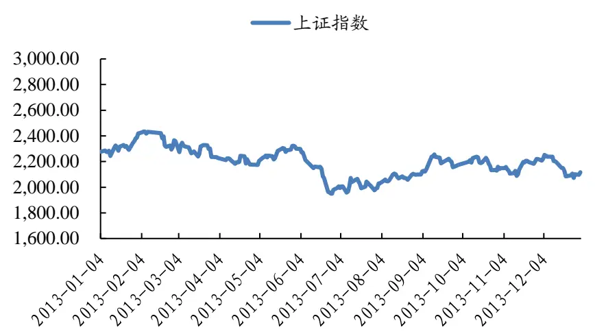
数据来源：Wind，国泰君安证券研究
• 上涨前 15%阀值：65%

- 下跌前 15%阀值：-11%

## 3.11.2. 指标特征：熊股特征更强

## ROE：熊股集中在 10%之下

基本规律是熊股的 ROE普遍较低。随着 ROE上升，牛股的市场占比逐渐上升，但绝对数值较 12年要低一些。全市场 ROE 低于 10%的公司占比约 67%，熊股中这一比例为 74%，牛股为 51%。

表 41：熊股集中在 10%之下

|  | 牛股数量 | 分布概率 | 概率差 | 市场占比 | 熊股数量 | 分布概率 | 概率差 | 市场占比 |
| --- | --- | --- | --- | --- | --- | --- | --- | --- |
| <5% | 105 | 27% | -13% | 11% | 208 | 54% | 15% | 22% |
| 5%-10% | 94 | 24% | -4% | 14% | 73 | 19% | -9% | 11% |
| 10%-15% | 102 | 26% | 8% | 24% | 50 | 13% | -5% | 12% |
| 15%-20% | 45 | 11% | 3% | 24% | 27 | 7% | -1% | 14% |
| 20%-25% | 25 | 6% | 3% | 29% | 13 | 3% | 0% | 15% |
| >25% | 21 | 5% | 2% | 28% | 11 | 3% | 0% | 15% |

数据来源：Wind，国泰君安证券研究

## 扣非净利增长率：高增速公司提供较好安全垫 ，低增速公司分化较大

13年全市场公司业绩增长进一步放缓，61%利润增速 10%以下。熊股中有 78%个股利润增速低于 10%，但牛股中仅 36%。市场上增速 40%以上的公司有三分之一在牛股池中，而在熊股中不到 10%。

表 42：高增速公司提供较好安全垫 ，低增速公司分化较大

|  | 牛股数量 | 分布概率 | 概率差 | 市场占比 | 熊股数量 | 分布概率 | 概率差 | 市场占比 |
| --- | --- | --- | --- | --- | --- | --- | --- | --- |
| <10% | 141 | 36% | -25% | 9% | 299 | 78% | 18% | 20% |
| 10%-20% | 35 | 9% | 0% | 16% | 19 | 5% | -4% | 9% |
| 20%-30% | 43 | 11% | 4% | 26% | 15 | 4% | -3% | 9% |
| 30%-40% | 36 | 9% | 4% | 28% | 7 | 2% | -3% | 5% |
| 40%-50% | 21 | 5% | 3% | 35% | 3 | 1% | -2% | 5% |
| >50% | 116 | 30% | 14% | 30% | 39 | 10% | -6% | 10% |

## PE：trailing PE 长期失效，Forward PE 特征较为明显

牛、熊股在 trailing PE 上的分布依然较为平均，没有太大的参考意义。Forward PE 指示意义好一些，牛股中 30 倍以下占比 61%，较市场占比高 16%，熊股中高 PE和负 PE个股占比 52%，较市场占比高 16%。

表 43：trailing PE 长期失效，Forward PE 特征较为明显

| PE(上年) | 牛股数量 | 分布概率 | 概率差 | 市场占比 | 熊股数量 | 分布概率 | 概率差 | 市场占比 |
| --- | --- | --- | --- | --- | --- | --- | --- | --- |
| <0 | 28 | 7% | -2% | 13% | 49 | 13% | 4% | 22% |
| 0-15 | 23 | 6% | -4% | 9% | 59 | 15% | 5% | 24% |
| 15-20 | 33 | 8% | -1% | 14% | 46 | 12% | 2% | 19% |
| 20-30 | 106 | 27% | 4% | 19% | 65 | 17% | -6% | 12% |
| 30-40 | 78 | 20% | 6% | 23% | 27 | 7% | -7% | 8% |
| 40-50 | 44 | 11% | 3% | 22% | 18 | 5% | -3% | 9% |
| >50 | 80 | 20% | -7% | 12% | 117 | 31% | 4% | 18% |
| PE(当年) | 牛股数量 | 分布概率 | 概率差 | 市场占比 | 熊股数量 | 分布概率 | 概率差 | 市场占比 |
| <0 | 7 | 2% | -6% | 4% | 56 | 15% | 7% | 29% |
| 0-15 | 69 | 18% | 2% | 18% | 46 | 13% | -3% | 12% |
| 15-20 | 69 | 18% | 7% | 26% | 23 | 6% | -5% | 9% |
| 20-30 | 94 | 25% | 6% | 21% | 51 | 14% | -4% | 12% |
| 30-40 | 40 | 11% | 0% | 16% | 30 | 8% | -3% | 12% |
| 40-50 | 28 | 7% | 0% | 15% | 26 | 7% | -1% | 14% |
| >50 | 73 | 19% | -9% | 11% | 132 | 36% | 8% | 20% |

数据来源：Wind，国泰君安证券研究

## 总市值规模：熊股以大盘股为主，但小市值并不是牛股特征

熊股池中 50 亿以上股票占比 57%，远高于全市场 36%的占比。牛股中50 亿以下占比 61%，低于全市场 64%的水平，2013 年的牛股其实并不以小市值为特征，这与很多投资者的感受相悖。

表 44：熊股以大盘股为主，但小市值并不是牛股的主要特征

|  | 牛股数量 | 分布概率 | 概率差 | 市场占比 | 熊股数量 | 分布概率 | 概率差 | 市场占比 |
| --- | --- | --- | --- | --- | --- | --- | --- | --- |
| <10 | 9 | 2% | 1% | 31% | 2 | 1% | -1% | 7% |
| 10-15 | 37 | 9% | 1% | 17% | 5 | 1% | -8% | 2% |
| 15-20 | 36 | 9% | -2% | 13% | 12 | 3% | -8% | 4% |
| 20-50 | 157 | 40% | -3% | 15% | 146 | 38% | -4% | 14% |
| 50-100 | 91 | 23% | 4% | 20% | 91 | 24% | 5% | 20% |
| >100 | 62 | 16% | -1% | 15% | 125 | 33% | 16% | 29% |

数据来源：Wind，国泰君安证券研究

## 4. 牛、熊股主要指标时间序列特征分析

## 4.1.ROE：特征稳定且显著，前提是用当年利润计算

我们将 ROE < 10%的个股视为低 ROE 股票，将 ROE > 20%的个股视为高 ROE 股票。Low ROE bull-bear spread 等于牛股中低 ROE 股票占比减去熊股中低ROE股票占比；High ROE bull-bear spread等于牛股中高ROE股票占比减去熊股中高 ROE 股票占比。

牛、熊股具有明显且稳定的 ROE特征。11年来，Low ROE bull-bear spread全部为负，High ROE bull-bear spread 全部为正。并且在大部分年份里，两者差别较大，牛股 ROE 较高，熊股ROE 较低的特征还是比较显著的。

表 45：牛、熊股具有明显且稳定的 ROE（当年利润）特征

| 单位：% | 2003 | 2004 | 2005 | 2006 | 2007 | 2008 | 2009 | 2010 | 2011 | 2012 | 2013 |
| --- | --- | --- | --- | --- | --- | --- | --- | --- | --- | --- | --- |
| Low ROE bull-bear spread | -35.8 | -36.4 | -34.4 | -23.4 | -9.6 | -28.7 | -9.6 | -16.1 | -22.8 | -23.4 | -16.5 |
| High ROE bull-bear spread | 11.0 | 16.4 | 9.2 | 13.8 | 15.4 | 14.7 | 8.9 | 9.5 | 13.5 | 12.9 | 5.0 |
| spread (high - low) | 46.8 | 52.8 | 43.6 | 37.2 | 25.0 | 43.3 | 18.4 | 25.5 | 36.3 | 36.4 | 21.5 |

数据来源：Wind，国泰君安证券研究

相较而言，熊股ROE低的特征更加显著。比较高ROE和低ROE bull-bearspread 的绝对值，只有 07 年 abs（high ROE spread）更高，其他 10 年时间里熊股 ROE 低特征更加显著。因此在投资上，ROE 更适合用于剔除股票而非筛选股票，例如 ROE在 10%以下的股票尽量少配或不配。

ROE 有效的前提是能准确预测当年利润。计算 ROE 用的是当年利润/年初所有者权益，然而当年的利润数据在下一年才能拿到，因此需预先对当年 ROE有准确判断。如果用上年 ROE作为替代变量，是否也能得到类似特征？结果表明牛、熊股基本没有明显的 ROE（上年利润）特征。

表 46：牛、熊股的 ROE（上年利润）特征不稳定，不显著

| 单位：% | 2004 | 2005 | 2006 | 2007 | 2008 | 2009 | 2010 | 2011 | 2012 | 2013 |
| --- | --- | --- | --- | --- | --- | --- | --- | --- | --- | --- |
| Low ROE bull-bear spread | -13.2 | -37.0 | 1.5 | 42.8 | -23.0 | 41.5 | 3.4 | -16.6 | -1.1 | 0.3 |
| High ROE bull-bear spread | -0.1 | 8.3 | -7.6 | -31.7 | 49.3 | -32.6 | -7.1 | 33.6 | 0.5 | -3.4 |
| spread (high - low) | 13.1 | 45.3 | -9.0 | -74.5 | 72.4 | -74.1 | -10.6 | 50.2 | 1.6 | -3.6 |

数据来源：Wind，国泰君安证券研究

07 年与 09 年大牛市中 ROE 指标有效性下降。ROE（上年利润）特征不稳定，体现最明显的是 07年与 09年，出现反转。ROE（当年利润）的 spread (high - low)也在 07 年、09 年缩到最小值，spread 下降的主要原因在于 Low ROE bull-bear spread 明显上升。其实也不难理解，在大牛市中鸡犬升天，投资者对财务数据的关注度下降，情绪起到主导作用。13年是结构性牛市，我们也看到 ROE 有效性的下降。

图 12：当年利润计算的 ROE 特征显著、稳定
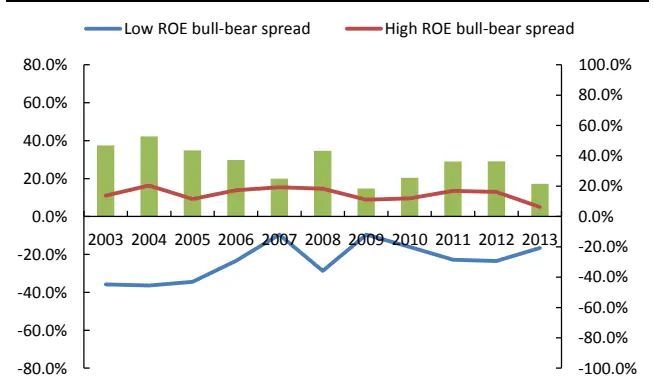
数据来源：Wind，国泰君安证券研究

图 13：上年利润计算的 ROE 特征不稳定
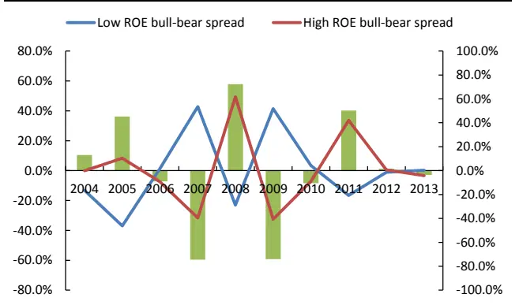
数据来源：Wind，国泰君安证券研究

## 4.2.扣非利润增速：相较于 ROE特征更强

我们将扣非利润 10%增速以下的股票视为低增速股票，将 40%增速以上的股票视为高增速股票。Low g bull-bear spread 等于牛股中低增速个股占比减去熊股中低增速个股占比，High g bull-bear spread 等于牛股中高增速个股占比减去熊股中高增速个股占比。

表 47：牛股高增速特征明显，熊股低增速特征明显

| 单位：% | 2003 | 2004 | 2005 | 2006 | 2007 | 2008 | 2009 | 2010 | 2011 | 2012 | 2013 |
| --- | --- | --- | --- | --- | --- | --- | --- | --- | --- | --- | --- |
| Low g bull-bear spread | -31.2 | -36.3 | -36.0 | -27.3 | -9.2 | -27.5 | -7.4 | -21.8 | -22.3 | -26.0 | -24.8 |
| High g bull-bear spread | 26.1 | 32.5 | 22.0 | 30.0 | 18.3 | 17.9 | 15.0 | 27.2 | 19.6 | 19.6 | 16.6 |
| spread (high - low) | 57.4 | 68.9 | 58.1 | 57.3 | 27.5 | 45.4 | 22.4 | 49.0 | 41.8 | 45.6 | 41.4 |

数据来源：Wind，国泰君安证券研究

牛股高增速、熊股低增速特征均明显。Low g bull-bear spread 在 11 年中全部为负，High g bull-bear spread 在 11 年中全部为正，且在大部分时间占比差非常明显。

相较于当年增速，上年增速指标的有效性下降显著。如果用上年增速指标，我们发现除了 2004-2006 年外，其余时间指标有效性无论在稳定性还是显著性上都远低于当年增速指标。其中在 07年和 09年指标发生了两次逆转。

表 48：如果利用上年增速，则牛、熊股增速特征弱很多

| 单位：% | 2004 | 2005 | 2006 | 2007 | 2008 | 2009 | 2010 | 2011 | 2012 | 2013 |
| --- | --- | --- | --- | --- | --- | --- | --- | --- | --- | --- |
| Low g bull-bear spread | -31.5 | -34.8 | -26.6 | 28.2 | -9.3 | 29.8 | -6.1 | -11.6 | -9.3 | -16.7 |
| High g bull-bear spread | 18.6 | 19.1 | 19.7 | -8.2 | 2.0 | -14.4 | 4.9 | 12.1 | 11.1 | 7.6 |
| spread (high - low) | 50.1 | 53.9 | 46.4 | -36.4 | 11.4 | -44.2 | 10.9 | 23.7 | 20.4 | 24.3 |

数据来源：Wind，国泰君安证券研究

07 年与 09 年大牛市中 g 指标有效性下降。与 ROE 类似，在 07 年、09年无论是利用当年利润计算还是上年利润计算，g 的指标特征都弱化，其中当年增速的 Low g bull-bear spread 掉到个位数，上年增速的 g 指标干脆发生逆转。主要原因同样是熊股的财务特征弱化。

图 14：牛、熊股当年利润增速特征明显
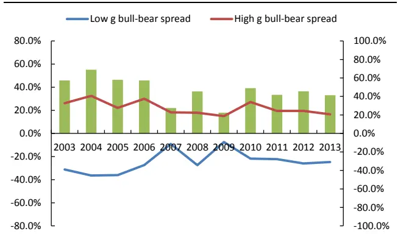
数据来源：Wind，国泰君安证券研究

图 15：牛、熊股上年利润增速特征弱化很多
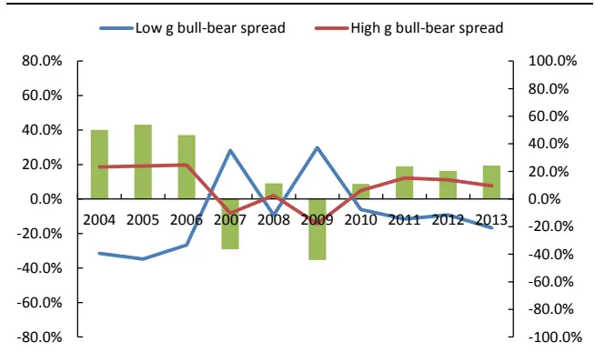
数据来源：Wind，国泰君安证券研究

## 4.3.PE：有效性不断减弱，忌利用 trailing PE作为买卖依据

我们将 50倍以上及负 PE股票视为高估值股票，将 0 - 20倍 PE 视为低估值股票。用牛股中高估值股票占比减去熊股中高估值股票占比，得到

PE bull-bear spread(H)；用牛股中低估值股票占比减去熊股中低估值股票占比，得到 PE bull-bear spread(L)。

表 49：牛股普遍具有估值较低的特征，forward PE 的指标特征要明显好于 trailing PE

| 单位：% | 2003 | 2004 | 2005 | 2006 | 2007 | 2008 | 2009 | 2010 | 2011 | 2012 | 2013 |
| --- | --- | --- | --- | --- | --- | --- | --- | --- | --- | --- | --- |
| trailing PE bull-bear spread(L) | 22.1 | 7.3 | 15.6 | 26.9 | 26.3 | 4.7 | 7.9 | -6.0 | 13.1 | 12.7 | -13.3 |
| forward PE bull-bear spread(L) | 47.9 | 52.3 | 52.2 | 55.7 | 50.1 | 18.2 | 40.5 | 6.1 | 31.7 | 41.5 | 16.7 |
| spread (forward - trailing) | 25.77 | 45.02 | 36.58 | 28.82 | 23.80 | 13.48 | 32.70 | 12.08 | 18.60 | 28.77 | 29.98 |

数据来源：Wind，国泰君安证券研究

在 11 年中，trailing PE bull-bear spread(L)有 9 年为正，forward PE bull-bearspread(L)全部为正，表明牛股普遍具有估值较低的特征；spread (forward- trailing)在 11 年中全部为正，表明低 forward PE 的指标特征要明显好于低 trailing PE。

表 50：熊股普遍具有估值较高的特征，且 forward PE 的指标特征要明显好于 trailing PE

| 单位：% | 2003 | 2004 | 2005 | 2006 | 2007 | 2008 | 2009 | 2010 | 2011 | 2012 | 2013 |
| --- | --- | --- | --- | --- | --- | --- | --- | --- | --- | --- | --- |
| trailing PE bull-bear spread(H) | -60.1 | -43.0 | -44.6 | -29.0 | -14.3 | 0.7 | 8.2 | 16.4 | -14.7 | -7.2 | -9.5 |
| forward PE bull-bear spread(H) | -74.8 | -72.1 | -71.8 | -52.6 | -26.6 | -40.4 | -24.1 | -24.7 | -40.1 | -42.8 | -31.5 |
| spread (forward - trailing) | -14.72 | -29.14 | -27.19 | -23.65 | -12.30 | -41.06 | -32.25 | -41.17 | -25.47 | -35.59 | -22.01 |

数据来源：Wind，国泰君安证券研究

高 PE 组中，trailing PE bull-bear spread(L)有 8 年为负，forward PE bull-bearspread(L)全部为负，表明熊股普遍具有估值较高的特征；spread (forward- trailing)在 11 年中全部为负，表明高 forward PE 的指标特征要明显好于高 trailing PE。

图 16：低 PE组——有效性不断下降
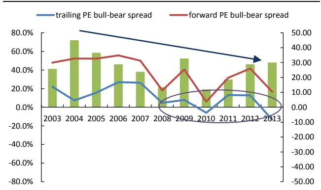
数据来源：Wind，国泰君安证券研究

图 17：高 PE组——有效性不断下降
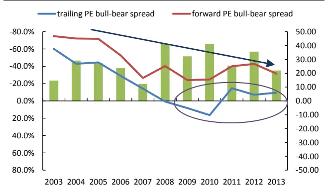
数据来源：Wind，国泰君安证券研究

从 PE指标有效性的演变过程中，我们还可以总结出如下规律：

- 牛、熊股的 PE 指标特征一直存在，但随着时间推移逐步弱化。不管是 trailing PE，还是 forward PE，也不管是高估值组还是低估值组，bull-bear spread 随着时间推移不断靠近 0。尤其是 trailing PEbull-bear spread，08 年以后基本为 0，指示意义基本消失。PE 指标弱化的背后是市场有效性提升，信息 price in 速度更快。trailing PE显著性消失意味看着后视镜做股票投资的日子已经一去不复返了。

- 相较于选牛股，PE 更适合于提供安全垫。无论是 trailing PE，还是forward PE，高估值组的 spread 都比低估值组 spread 的显著性更强。换句话说，熊股高 PE的特征相较于牛股低 PE的特征更强。

- 投资上，trailing PE 不是买入或卖出一只股票的理由，可以参考forward PE，但要小心。无论是从逻辑，还是从观察结果来看，trailingPE 都不能成为我们买入或者卖出股票的理由。forward PE 似乎具有参考性，但要注意两点：1、forward PE 指标的有效性在下降，从观察结果看，牛股 forward PE 低的特征已经越来越模糊；2、对当年利润增长率预测的准确性至关重要。如果实际利润增速低于年初预期的利润增速，那么 forward PE 会相应上升，股价下跌的概率也会大大增加。我们猜测正是因为预测利润增速具有不确定性，才使得forward PE 依然有一定的有效性。

## 4.4.市值：指标特征随时间而弱化，不用太在意个股市值

我们将总市值20亿以下视为小市值股票，将20 -100亿视为中市值股票，将 100 亿以上视为大市值股票。分别用牛股中相应市值的股票占比减去熊股中相应市值的股票占比，得到大、中、小市值档下 bull-bear spread。spread 为正，表明牛股在该市值范围的特征更加明显；spread 为负，表明熊股在该市值范围的特征更加明显。

表 51：站在年度收益的级别上，我们只经历了一次真正的大、小盘风格转换，时间点是 2008年

| 单位：% | 2003 | 2004 | 2005 | 2006 | 2007 | 2008 | 2009 | 2010 | 2011 | 2012 | 2013 |
| --- | --- | --- | --- | --- | --- | --- | --- | --- | --- | --- | --- |
| small bull-bear spread | -58.3 | -30.3 | -16.1 | -39.6 | -12.3 | 18.4 | 8.1 | 4.5 | 6.6 | -2.7 | 15.9 |
| medium bull-bear spread | 38.9 | 30.1 | 12.4 | 30.8 | 11.8 | -5.3 | 13.8 | 7.3 | -13.1 | -7.7 | 1.1 |
| big bull-bear spread | 19.4 | 0.2 | 3.7 | 8.8 | 0.6 | -13.1 | -21.9 | -11.8 | 6.4 | 10.4 | -17.0 |

数据来源：Wind，国泰君安证券研究

虽然样本区间横跨 11年的长度，但是站在年度收益的级别上，我们只经历了一次真正的大、小盘风格转换。2003 -2007年间，小盘股 spread一直为负，大盘股的 spread一直为正，表明牛股的大市值特征更明显，熊股的小市值特征更明显；2008 年开始，风格转变，大盘股的 spread 为负，小盘股为正。2012 年曾发生了一次转变，但不明显，且在 2013 年小强大弱的格局依旧明显，因此仍然把 2012年划在 2008 -2013的范围中。

图 18：bull-bear spread 随着时间推移而不断弱化
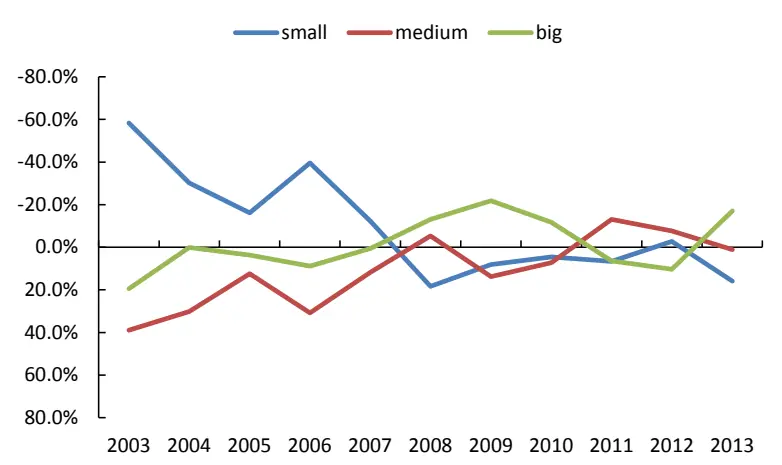
数据来源：Wind，国泰君安证券研究

通过观察市值指标有效性的变化过程，我们也可以总结一些规律：

- 2008年是风格转换年，在这之后各市值范围股票的bull-bear spread迅速收窄。2007年之前，牛股和熊股的市值特征非常显著，仅依据市值大小选股就能获得很高的胜率和收益。2008年开始，小盘股在牛股中的占比开始超过在熊股中的占比，大盘股在熊股中的占比超过在牛股中的占比，但是差距始终拉不大，围绕着零轴变动。

- 从 bull-bear spread 来观察市场，风格差远小于我们近几年从指数上看到的现象。如果将创业板指和上证综指的走势图画在一个坐标轴里，会感觉创业板走势比主板强太多太多。然而从小盘股在牛、熊股中占比差来看，小盘股的赚钱效应远没有指数走势反映的那么大。因此可以这么说，近几年挣大钱的都是买到创业板个股的人，但并不代表买创业板的人都能挣钱。

- 在个股投资上，不用太关注市值、股本这些指标，也不用太在意市场风格。如果我们是指数投资者，在主板、中小板、创业板指数 ETF上来回操作，那么需要关注市场风格的切换。但是对于市场上绝大部分主动投资者来说，最终的投资标的是个股，不是指数，而个股观察的结果表明市值不是牛股、熊股的明显特征。因此选股时不用太在乎市场风格、市值大小。

## 5. 牛、熊股比率特征分析

之前我们构造了两个比率指标，分别从充分性和必要性的角度寻找牛（熊）股的指标特征。这里分别对牛股和熊股历年指标特征的显著性进行回顾。当指标比率大于 80%时，我们认为该指标特征显著。

## 5.1.历年牛股均无共性特征

牛股年年有，却难以找到共同的指标特征。在我们检验的所有年份的所有指标范围内，没有一个指标的分布概率能够达到 80%，

表 52：市场占比 >80%表——偶尔能通过 PE指标挖掘牛股

| 2003 2004 2005 2006 2007 2008 2009 2011 |  |  |  |  |  |
| --- | --- | --- | --- | --- | --- |
| ROE |  |  | 2010 | 2012 | 2013 |
| 扣非增长率 |  |  |  |  |  |
| trailing PE | 0-15 | 0-15 |  |  |  |
| forward PE | 0-15 | 0-15 |  |  |  |
| 总市值 |  |  |  | <10 |  |

数据来源：Wind，国泰君安证券研究

通过低 PE指标，在过去极少数年份能够找到牛股。2003 年和 2008年，低 PE 指标可以帮助我们有 80%以上的把握找到牛股。之后再无指示作用。

## 5.2.熊股具有较为明显的共性特征

与牛股相反，我们通过这四个指标，可以大面积找到熊股的共性特征：

- 熊股的扣非利润增长率普遍低于10%。这一特征除了在2007、2009、2010 三年不明显，其他年份都异常显著。2007、2009 是 A 股历史上最大的两波牛市，而 2010 年中小盘个股表现强劲。除非是在大牛市中，否则最好回避低增长或负增长个股。

- 熊股的 ROE普遍低于 10%。这一特征在 03-05、11-12年尤为明显，而这几年的市场环境都不太好。因此在熊市中尽量回避低 ROE 个股。

表 53：分布概率 >80%表——熊股共性特征明显

|  | 2003 | 2004 | 2005 | 2006 | 2007 | 2008 | 2009 | 2010 | 2011 | 2012 | 2013 |
| --- | --- | --- | --- | --- | --- | --- | --- | --- | --- | --- | --- |
| ROE | <10% | <10% | <5% |  |  |  |  |  | <10% | <10% |  |
| 扣非增长率 | <10% | <10% | <10% | <10% |  | <10% |  |  | <10% | <10% | <10% |
| trailing PE | <0或 >50 |  |  |  |  |  |  |  |  |  |  |
| forward PE | <0或 | <0 或 | <0或 |  |  | <0或 |  |  | <0或 |  |  |
|  | >50 | >50 | >50 |  |  | >50 |  |  | >50 |  |  |
| 总市值 |  |  |  |  |  |  |  |  |  |  |  |

数据来源：Wind，国泰君安证券研究

- 熊股的 forward PE一般低于 0或高于 50。相较于财务指标，熊股估值指标没有那么明显，且指标明显的年份中市场环境均不太好。

- trailing PE与总市值不是熊股的共性特征。

## 本公司具有中国证监会核准的证券投资咨询业务资格

## 分析师声明

作者具有中国证券业协会授予的证券投资咨询执业资格或相当的专业胜任能力，保证报告所采用的数据均来自合规渠道，分析逻辑基于作者的职业理解，本报告清晰准确地反映了作者的研究观点，力求独立、客观和公正，结论不受任何第三方的授意或影响，特此声明。

## 免责声明

本报告仅供国泰君安证券股份有限公司（以下简称“本公司”）的客户使用。本公司不会因接收人收到本报告而视其为本公司的当然客户。本报告仅在相关法律许可的情况下发放，并仅为提供信息而发放，概不构成任何广告。

本报告的信息来源于已公开的资料，本公司对该等信息的准确性、完整性或可靠性不作任何保证。本报告所载的资料、意见及推测仅反映本公司于发布本报告当日的判断，本报告所指的证券或投资标的的价格、价值及投资收入可升可跌。过往表现不应作为日后的表现依据。在不同时期，本公司可发出与本报告所载资料、意见及推测不一致的报告。本公司不保证本报告所含信息保持在最新状态。同时，本公司对本报告所含信息可在不发出通知的情形下做出修改，投资者应当自行关注相应的更新或修改。

本报告中所指的投资及服务可能不适合个别客户，不构成客户私人咨询建议。在任何情况下，本报告中的信息或所表述的意见均不构成对任何人的投资建议。在任何情况下，本公司、本公司员工或者关联机构不承诺投资者一定获利，不与投资者分享投资收益，也不对任何人因使用本报告中的任何内容所引致的任何损失负任何责任。投资者务必注意，其据此做出的任何投资决策与本公司、本公司员工或者关联机构无关。

本公司利用信息隔离墙控制内部一个或多个领域、部门或关联机构之间的信息流动。因此，投资者应注意，在法律许可的情况下，本公司及其所属关联机构可能会持有报告中提到的公司所发行的证券或期权并进行证券或期权交易，也可能为这些公司提供或者争取提供投资银行、财务顾问或者金融产品等相关服务。在法律许可的情况下，本公司的员工可能担任本报告所提到的公司的董事。

市场有风险，投资需谨慎。投资者不应将本报告为作出投资决策的惟一参考因素，亦不应认为本报告可以取代自己的判断。在决定投资前，如有需要，投资者务必向专业人士咨询并谨慎决策。

本报告版权仅为本公司所有，未经书面许可，任何机构和个人不得以任何形式翻版、复制、发表或引用。如征得本公司同意进行引用、刊发的，需在允许的范围内使用，并注明出处为“国泰君安证券研究”，且不得对本报告进行任何有悖原意的引用、删节和修改。

若本公司以外的其他机构（以下简称“该机构”）发送本报告，则由该机构独自为此发送行为负责。通过此途径获得本报告的投资者应自行联系该机构以要求获悉更详细信息或进而交易本报告中提及的证券。本报告不构成本公司向该机构之客户提供的投资建议，本公司、本公司员工或者关联机构亦不为该机构之客户因使用本报告或报告所载内容引起的任何损失承担任何责任。

## 评级说明

## 1.投资建议的比较标准

投资评级分为股票评级和行业评级。

以报告发布后的12个月内的市场表现为比较标准，报告发布日后的12个月内的公司股价（或行业指数）的涨跌幅相对同期的沪深300指数涨跌幅为基准。

## 2.投资建议的评级标准

报告发布日后的 12 个月内的公司股价（或行业指数）的涨跌幅相对同期的沪深300指数的涨跌幅。

| 评级 |  | 说明 |
| --- | --- | --- |
| 股票投资评级 | 增持 | 相对沪深 300指数涨幅15%以上 |
|  | 谨慎增持 | 相对沪深300指数涨幅介于5%～15%之间 |
|  | 中性 | 相对沪深300指数涨幅介于-5%～5% |
|  | 减持 | 相对沪深300指数下跌5%以上 |
| 行业投资评级 | 增持 | 明显强于沪深 300 指数 |
|  | 中性 | 基本与沪深300指数持平 |
|  | 减持 | 明显弱于沪深300指数 |

## 国泰君安证券研究

|  | 上海 | 深圳 | 北京 |
| --- | --- | --- | --- |
| 地址 | 上海市浦东新区银城中路168号上海 银行大厦29层 | 深圳市福田区益田路 6009 号新世界 商务中心34层 | 北京市西城区金融大街 28 号盈泰中 心2号楼10层 |
| 邮编 | 200120 | 518026 | 100140 |
| 电话 | （021)38676666 | (0755)23976888 | (010)59312799 |
|  | E-mail: gtjaresearch@gtjas.com |  |  |