2014.05.16

# 微观数据再掘金

# ——数量化专题之四十三

耿帅军（分析师）

## 刘富兵（分析师）

8 010-59312753

gengshuaijun@gtjas.com

021-38676673

证书编号 S0880513080013

liufubing008481@gtjas.com

S0880511010017

## 本报告导读：

本报告通过构建全新的残差因子，展示了在剥离传统因子的影响后，微观因子仍能捕捉到显著 Alpha。

## 摘要：

[Table_Summary]• 从知情交易概率模型的计算过程中不难发现，因子的数值必然受到股票市值、流动性和波动性等因素的影响，因此理清这些因子之间的关系，对于模型的解释和应用至关重要。

- 通过对2009年12月至2013年12月的因子截面数据进行相关性分析，发现即期知情交易概率因子与月末流通市值、1月成交金额、1 月换手率、日收益波动率、1 月收益率和 12月收益率，均存在一定相关性。

- 构建全新的残差因子。即在每个月末，用全部股票的即期知情交易概率因子和其他几个因子在截面上做回归，将残差项作为选股因子，构建的组合风险收益特征仍十分优异。

无论是知情交易概率因子还是残差因子，12个月滚动平均后效果都有所增强，不仅改善了策略的风险收益特征，还大幅降低了策略换手率；无论是通过即期因子还是滚动平均因子进行计算，残差因子均能获得明显 Alpha，也就是说，知情交易概率模型确实捕捉到了我们列举的传统因子所未能获得的 Alpha。

微观因子给我们更多启示的是，与传统分析中价与量的相互独立不同，微观因子将价格和成交量进行了巧妙地结合。无论是量钟的应用，还是对主动买卖量的判断，都是很新颖的方法。因此，需要用价量结合的方法对市场进行更深入的研究，更好地理解资本市场的微观结构。

金融工程

## 金融工程团队：

刘富兵：（分析师）

电话：021-38676673

邮箱：liufubing008481@gtjas.com

证书编号：S0880511010017

## 严佳炜：（分析师）

电话：021-38674812

邮箱：yanjiawei008776@gtjas.com

证书编号：S0880512110001

## 耿帅军：（分析师）

电话：010-59312753

邮箱：gengshuaijun@gtjas.com

证书编号：S0880513080013

## 徐康：（分析师）

电话：021-38674939

邮箱：xukang010849@gtjas.com

证书编号：S0880513080018

## 赵延鸿：（研究助理）

电话：021-38674927

邮箱：zhaoyanhong@gtjas.com

证书编号：S0880113070047

## 陈睿：（研究助理）

电话：021-38675861

邮箱：chenrui012896@gtjas.com

证书编号：S0880112120012

## 刘正捷：（研究助理）

电话：0755-23976803

邮箱：liuzhengjie012509@gtjas.com

证书编号：S0880112080087

## [Table_R相关报告

《寻找牛、熊股基本特征：基于财务、估值角度》2014.05.06

《Kelly 公式在行业配臵中的应用三》2014.04.22

《年线与股票价格走势关系分析》2014.04.11《沪深 300 期指合约折价现象探究》2014.04.06

《期权应用之交易策略篇》2014.03.19

## 1. 知情交易概率选股策略回顾

为了保证量化模型的有效，必须尽可能地保持模型的独特性和唯一性，不断寻找Alpha 的新来源，寻找与众不同的信息或者与众不同的逻辑，有以下两大角度：

1. 传统的数据来源上寻找未被市场所发觉的投资逻辑：

a) 低频行情数据

b) 公司财务数据

c) 宏观经济数据

d) 分析预期数据

e) ……

2. 非传统数据来源中寻找市场中尚未使用的全新信息：

a) 高频行情数据

b) 行业特定数据

c) 关联市场数据

d) 网络文本数据

e) ……

在《从微观数据中寻找 Alpha 的新来源》报告中，我们首次将市场微观结构理论和高频行情数据引入到低频投资领域。运用经典的知情交易概率模型，选取沪深300指数历史成分股作为备选股票池，尝试构建了选股策略，效果比较理想。

测算数据时间区间为2009年至2013年，其中组合实际运行区间为2010年至2013年，2009年数据仅用来测算2010年对应知情交易概率值。利用1分钟行情数据，通过基于量钟的知情交易概率模型来得到每只股票不同时间点的知情交易概率。组合换仓频度为月度。

通过两种方法进行回测：第一种方法采用每只股票月末的即期知情交易概率作为下月选股 Alpha 因子；第二种方法则采用每只股票过去 12个月月末即期知情交易概率的平均值作为Alpha因子。

根据Alpha 因子由低至高进行排序，构建现金中性的多空组合，排在前面n%的股票做多，排在后面n%的股票做空，所有股票采用等权配臵。

## 1.1.即期知情交易概率因子

在进行组合构建之前，先说明因子有效性测试的情况。

通过对即期知情交易概率因子按照从高到低进行排列，将股票分成 10档，即第一档为即期知情交易概率最高的股票集合，第十档是即期知情交易概率最低的股票集合。经过测试，即期知情交易概率低的股票收益显著高于即期知情交易概率高的股票，分档月度平均收益单调性良好。

图 1: 即期知情交易概率因子分档月度平均收益单调性良好
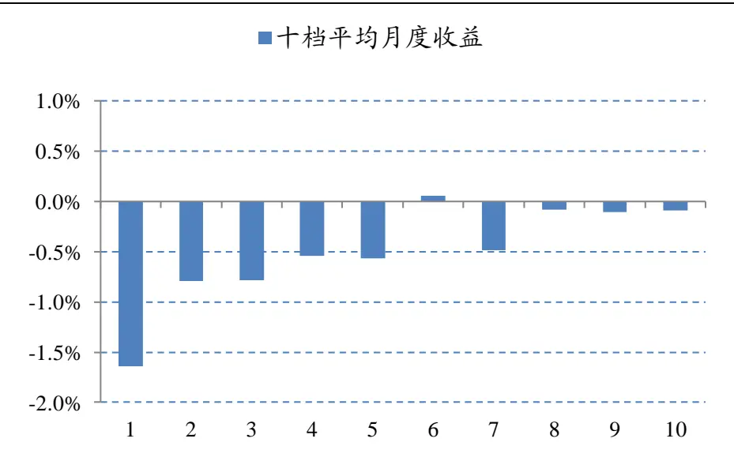
数据来源：国泰君安证券研究，Wind

股票当月因子头寸和股票下月截面收益的 Spearman 等级相关系数作为因子的信息系数IC，四年IC 情况如下:

图 2: 即期知情交易概率因子 Spearman IC 四年间情况
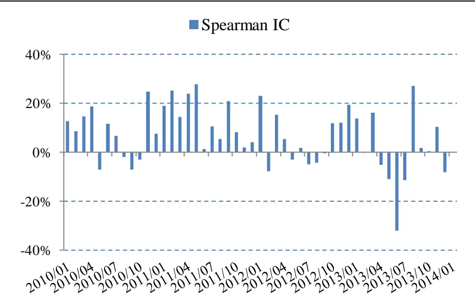
数据来源：国泰君安证券研究，Wind

表 1: 即期知情交易概率因子 Spearman IC 统计量

|  | 均值 | 标准差 | 均值/标准差 |
| --- | --- | --- | --- |
| 即期知情交易概率因子IC | 6.64% | 12.31% | 0.54 |

数据来源：国泰君安证券研究，Wind

接下来，利用即期知情交易概率因子作为选股Alpha 因子进行实际组合构建，其中，Alpha 因子由低至高进行排序，排在前面 20%的股票做多，排在后面20%的股票做空。

经过回测，四年间多空组合累计收益 67.50%，净值最大回撤-15.89%，夏普比率1.13。

图 3: 选取即期知情交易概率因子前后 20%股票多空组合收益
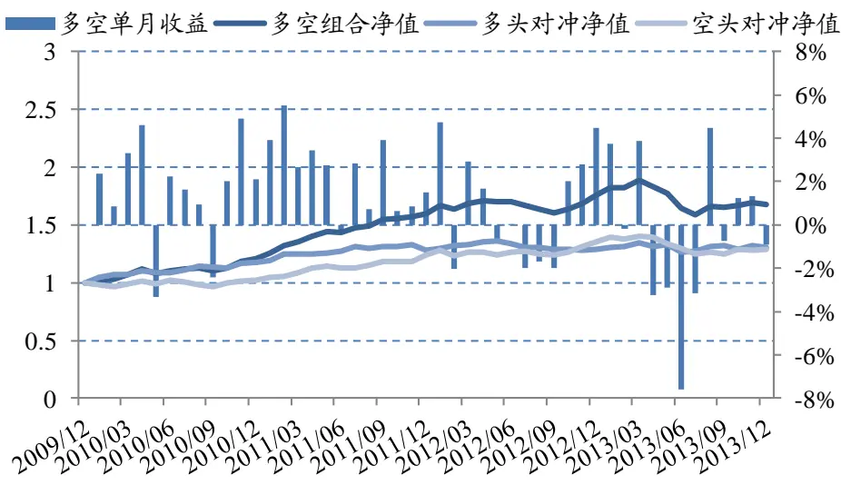
数据来源：国泰君安证券研究，Wind

改变多空股票数量，分别测试 10%+10%、30%+30%、40%+40%、 50%+50%的多空组合收益情况。

表 2: 选取即期知情交易概率因子不同股票数量的多空组合收益情况比较

|  | 10%+10% | 20%+20% | 30%+30% | 40%+40% | 50%+50% |
| --- | --- | --- | --- | --- | --- |
| 累计收益 | 93.30% | 67.50% | 58.87% | 42.40% | 39.87% |
| 年化收益 | 17.91% | 13.76% | 12.27% | 9.24% | 8.75% |
| 月度胜率 | 68.75% | 68.75% | 70.83% | 68.75% | 68.75% |
| 月度盈亏比 | 1.21 | 1.19 | 1.26 | 1.24 | 1.44 |
| 月平均多头换手率 | 56.45% | 48.40% | 43.38% | 37.87% | 32.85% |
| 凈值最大回撤 | -23.02% | -15.89% | -12.86% | -9.67% | -8.00% |
| 净值波动率 | 13.21% | 9.54% | 8.18% | 6.94% | 5.69% |
| 夏普比率 | 1.13 | 1.13 | 1.13 | 0.90 | 1.01 |

数据来源：国泰君安证券研究，Wind

## 1.2.12月滚动平均知情交易概率因子

接下来，尝试构建 12 月滚动平均知情交易概率因子，主要目的有以下几点：

1、检验更长历史区间的高频数据是否对低频投资有价值；

2、避免单月因子极端值影响；

3、降低指标换手率。

同样，在进行组合构建之前，先说明因子有效性测试的情况。

通过对 12 月滚动平均知情交易概率因子按照从高到低进行排列，将股票分成10档，结果分档月度平均收益较即期因子单调性更佳。

图 4:12月滚动平均知情交易概率因子分档月度平均收益单调性更佳
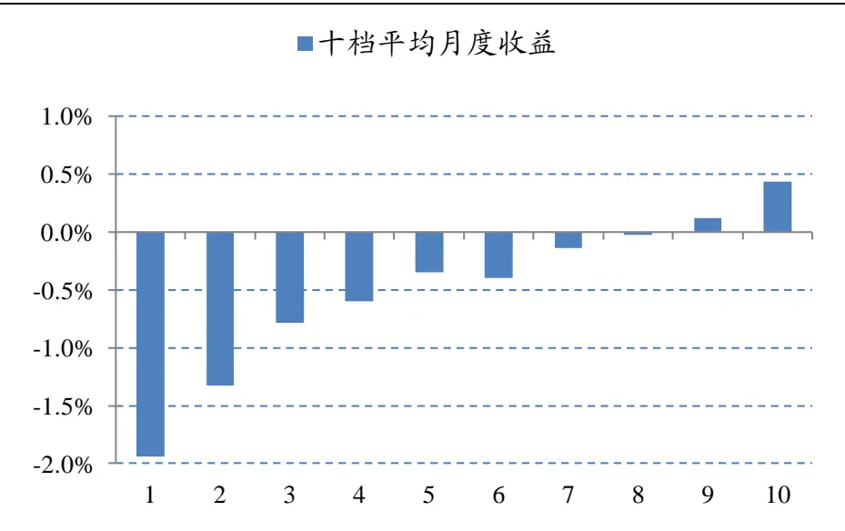
数据来源：国泰君安证券研究，Wind

12月滚动平均知情交易概率因子的Spearman IC，同样优于即期因子。

图 5: 12 月滚动平均知情交易概率因子 Spearman IC 四年间情况
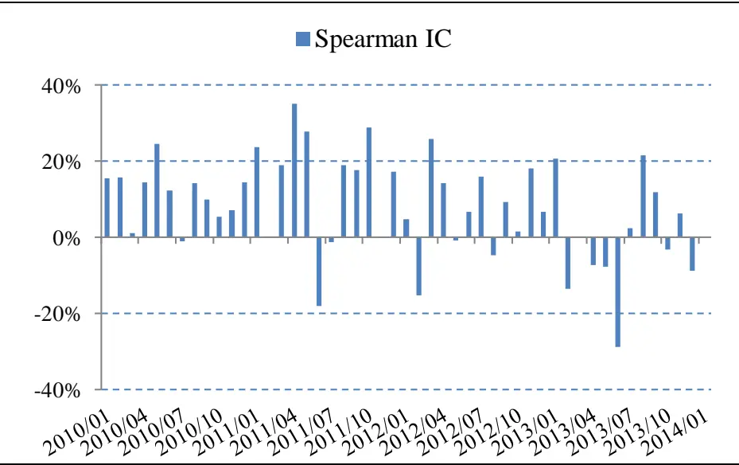
数据来源：国泰君安证券研究，Wind

表 3: 12 月滚动平均知情交易概率因子 Spearman IC 统计量

|  | 均值 | 标准差 | 均值/标准差 |
| --- | --- | --- | --- |
| 12月滚动平均因子IC | 7.88% | 13.33% | 0.59 |

数据来源：国泰君安证券研究，Wind

接下来，利用12月滚动平均知情交易概率作为选股的Alpha因子进行组合构建。根据 12 月滚动平均知情交易概率因子由低至高进行排序，排在前面20%的股票做多，排在后面 20%的股票做空。

经过回测，四年间多空组合累计收益 142.01%，净值最大回撤

-11.73%，夏普比率 2.04。

图 6: 选取 12月平均知情交易概率因子前后 20%股票多空组合收益
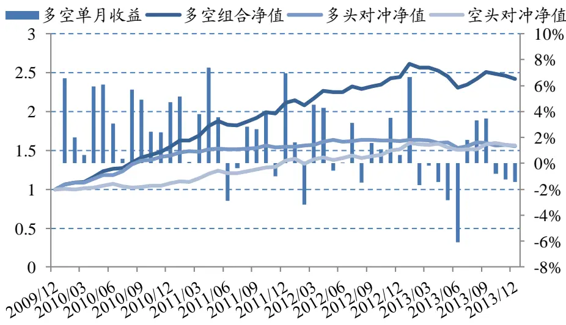
数据来源：国泰君安证券研究，Wind

继续改变多空股票数量，分别测试 10%+10%、30%+30%、40%+40%、 50%+50%的多空组合收益情况。

表 4: 选取12月平均知情交易概率因子不同股票数量的多空组合收益情况比较

|  | 10%+10% | 20%+20% | 30%+30% | 40%+40% | 50%+50% |
| --- | --- | --- | --- | --- | --- |
| 累计收益 | 199.01% | 142.01% | 103.95% | 80.50% | 60.06% |
| 年化收益 | 31.50% | 24.73% | 19.50% | 15.91% | 12.48% |
| 月度胜率 | 75.00% | 70.83% | 66.67% | 70.83% | 68.75% |
| 月度盈亏比 | 1.46 | 1.90 | 2.27 | 1.79 | 1.82 |
| 月平均多头换手率 | 14.04% | 12.45% | 10.45% | 9.29% | 7.79% |
| 凈值最大回撤 | -15.19% | -11.73% | -9.16% | -9.14% | -8.72% |
| 净值波动率 | 13.57% | 10.66% | 8.68% | 7.43% | 6.26% |
| 夏普比率 | 2.10 | 2.04 | 1.90 | 1.74 | 1.51 |

数据来源：国泰君安证券研究，Wind

不难发现，利用 12 月滚动平均知情交易概率因子构建的组合，其收益、风险特征较即期因子构建的组合均有明显提升。

因此，从这个角度来说，更长历史区间的高频数据对于低频投资仍有重要价值。此外，由于因子采用了滚动平均的方式进行处理，因子的稳定性有较大提升，使得组合换手率大幅下降。

## 2. 微观因子和传统因子之间

## 2.1. 残差因子仍有显著 Alpha

在《从微观数据中寻找 Alpha 的新来源》中我们提到，从知情交易概率模型的计算过程中不难发现，因子的数值必然受到股票市值、流动性和波动性等因素的影响，因此理清这些因子之间的关系，对于模型的解释和应用至关重要。

因此，我们选择了如下传统因子：月末流通市值、1 月成交金额、1 月换手率、日收益波动率、1月收益率和12月收益率，代表股票的规模、流动性、波动性和动量等因素，与我们构建的即期知情交易概率因子进行比较分析。

通过对2009年12月至 2013年 12 月的因子截面数据进行相关性分析，发现即期知情交易概率因子与这些传统因子均存在一定相关性。

图 7: 即期因子和流通市值相关系数
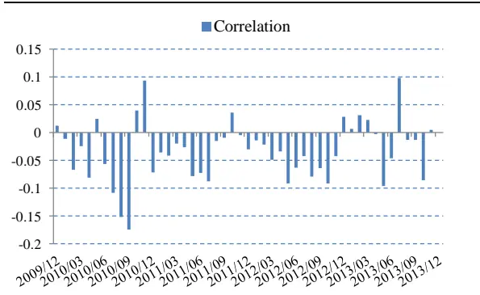
数据来源：国泰君安证券研究，Wind

图 8: 即期因子和成交金额相关系数
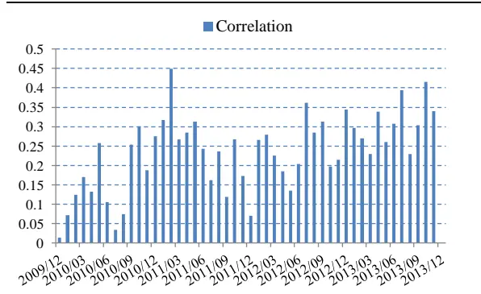
数据来源：国泰君安证券研究，Wind

图 9: 即期因子和换手率相关系数
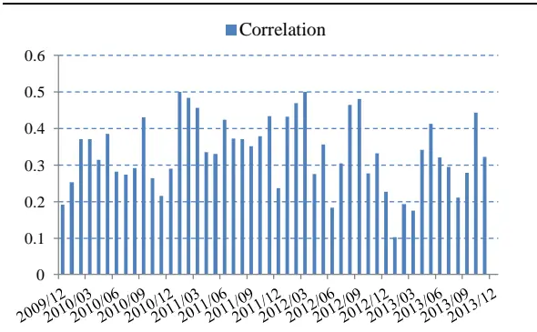
数据来源：国泰君安证券研究，Wind

图 10: 即期因子和波动率相关系数
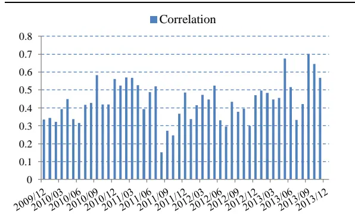
数据来源：国泰君安证券研究，Wind

图 11: 即期因子和1月收益率相关系数
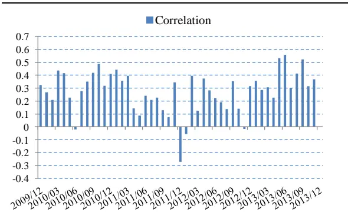
数据来源：国泰君安证券研究，Wind

图 12: 即期因子和12月收益率相关系数
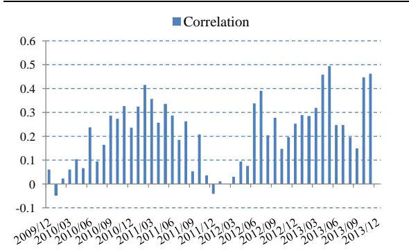
数据来源：国泰君安证券研究，Wind

我们需要理清，通过即期知情交易概率因子进行选股时，所选股票获得的收益究竟来自于知情交易概率因子还是其他因子。也就是说，即期知情交易概率因子究竟是原来这些传统因子的代理变量还是包含一些传统因子中不存在的新信息。

带着这个问题，我们尝试构建了一个全新的因子，残差因子。即在每个月末，用全部股票的即期知情交易概率因子和其他几个因子在截面上做回归，将残差项作为选股的Alpha因子。

如果残差因子没有显著的 Alpha 效果，那么知情交易概率模型捕捉到的Alpha 可以看作是这些传统因子所致。如果残差因子仍有良好的 Alpha效果，那么可以简单地认为，知情交易概率模型确实包含了这些传统因子并不存在的全新信息。

同样的，在进行组合构建之前，先对因子的有效性进行测试。

通过对残差因子按照从高到低进行排列，将股票分成 10 档，即第一档为残差最大的股票集合，第十档是残差最小的股票集合。

经过测试，残差小的股票收益显著高于残差大的股票，分档月度平均收益单调性依然良好。

图 13: 残差因子分档月度平均收益单调性良好
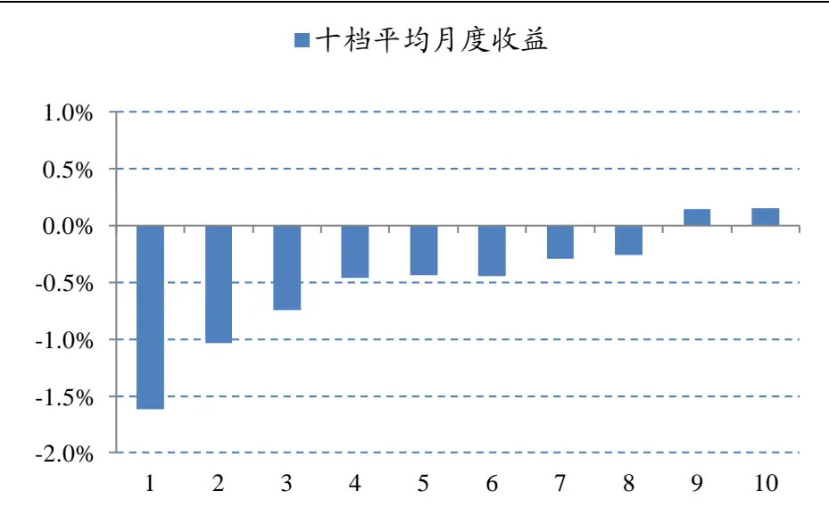
数据来源：国泰君安证券研究，Wind

股票当月残差因子头寸和股票下月截面收益的 Spearman 等级相关系数作为因子的信息系数 IC，四年IC 情况如下。

图 14: 残差因子 Spearman IC 四年间情况
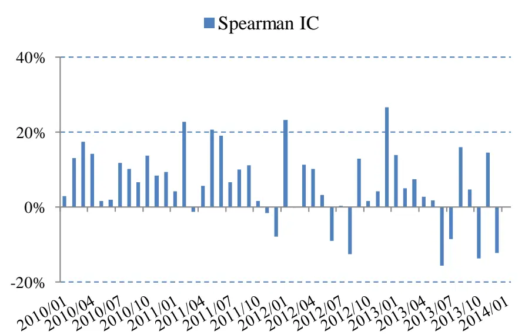
数据来源：国泰君安证券研究，Wind

尽管残差因子IC比即期知情交易概率因子IC的均值略有下降，但波动性更低，稳定性更高。

表 5: 残差因子 Spearman IC 统计量

|  | 均值 | 标准差 | 均值/标准差 |
| --- | --- | --- | --- |
| 残差因子IC | 6.04% | 9.92% | 0.61 |

数据来源：国泰君安证券研究，Wind

接下来，利用残差因子作为选股 Alpha 因子进行组合构建的情况也反应了这一事实，净值最大回撤和波动性较原策略都明显缩小。利用残差因子进行实际组合构建，因子由低至高进行排序，排在前面20%的股票做多，排在后面20%的股票做空。经过回测，四年间多空组合累计收益105.05%，净值最大回撤-4.78%，夏普比率 1.97。

图 15: 选取残差因子前后20%股票多空组合收益
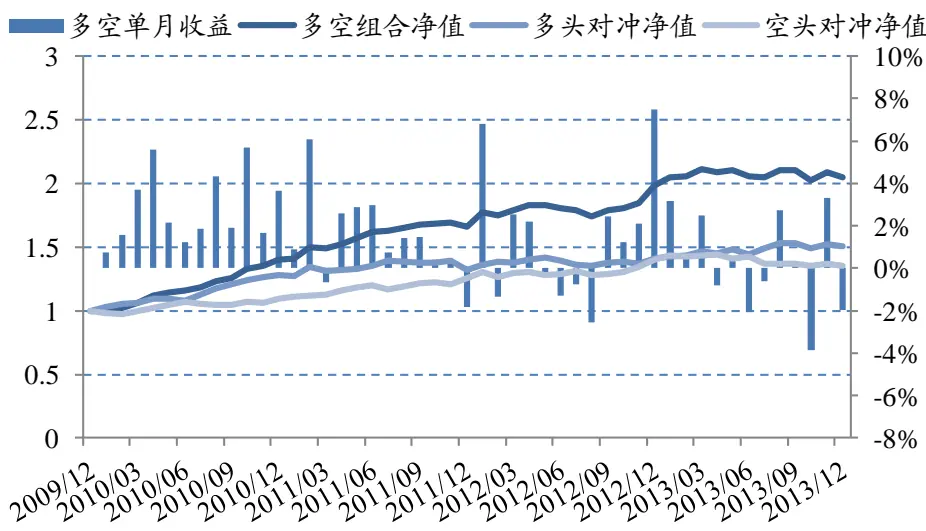

数据来源：国泰君安证券研究，Wind

改变多空股票数量，分别测试 10%+10%、30%+30%、40%+40%、 50%+50%的多空组合收益情况。

表 6: 选取残差因子不同股票数量的多空组合收益情况比较

|  | 10%+10% | 20%+20% | 30%+30% | 40%+40% | 50%+50% |
| --- | --- | --- | --- | --- | --- |
| 累计收益 | 124.24% | 105.05% | 70.29% | 52.12% | 38.60% |
| 年化收益 | 22.37% | 19.66% | 14.23% | 11.06% | 8.50% |
| 月度胜率 | 72.92% | 75.00% | 68.75% | 72.92% | 72.92% |
| 月度盈亏比 | 1.57 | 1.71 | 1.78 | 1.30 | 1.21 |
| 月平均多头换手率 | 62.77% | 53.90% | 46.97% | 40.53% | 34.14% |
| 凈值最大回撤 | -7.96% | -4.78% | -5.23% | -4.30% | -4.11% |
| 净值波动率 | 10.79% | 8.47% | 7.24% | 6.34% | 5.30% |
| 夏普比率 | 1.79 | 1.97 | 1.55 | 1.27 | 1.04 |

数据来源：国泰君安证券研究，Wind

## 2.2.滚动平均残差因子最优

同样，构建滚动平均残差因子。即在每个月末，用全部股票的 12 月滚动平均知情交易概率因子和其他几个因子在截面上做回归，将残差项作为选股的 Alpha 因子。

在进行组合构建之前，先测试因子有效性。通过对滚动平均残差因子按照从高到低进行排列，将股票分成 10 档，结果分档月度平均收益单调性十分优异。

图 16: 滚动平均残差因子分档月度平均收益单调性更佳
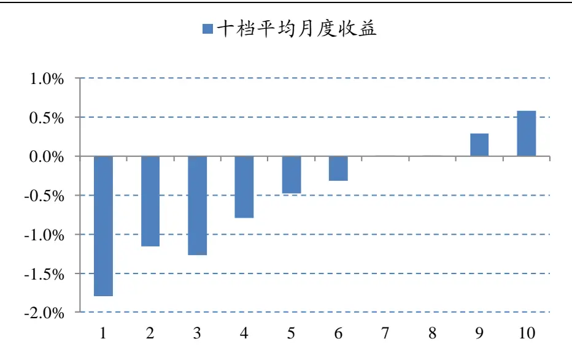
数据来源：国泰君安证券研究，Wind

滚动平均残差因子的 Spearman IC 无论从均值、还是标准差均有明显提升，体现了较高的稳定性。

图 17: 滚动平均残差因子 Spearman IC 四年间情况
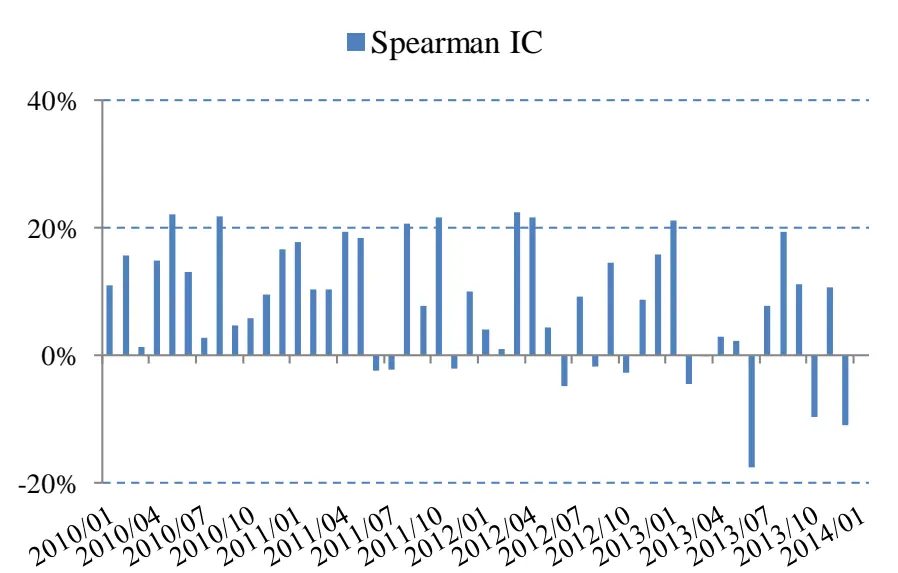
数据来源：国泰君安证券研究，Wind

表 7: 滚动平均残差因子 Spearman IC 统计量

|  | 均值 | 标准差 | 均值/标准差 |
| --- | --- | --- | --- |
| 滚动平均残差因子IC | 8.20% | 9.90% | 0.83 |

数据来源：国泰君安证券研究，Wind

接下来，利用滚动平均残差作为选股的Alpha 因子进行组合构建。根据滚动平均残差因子由低至高进行排序，排在前面20%的股票做多，排在后面20%的股票做空。

经过回测，四年间多空组合累计收益 144.14%，净值最大回撤-4.61%，夏普比率2.55。

图 18: 选取滚动平均残差因子前后 20%股票多空组合收益
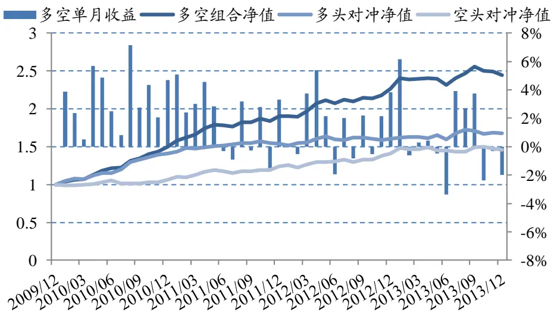
数据来源：国泰君安证券研究，Wind

继续改变多空股票数量，分别测试 10%+10%、30%+30%、40%+40%、 50%+50%的多空组合收益情况。

表 8: 选取滚动残差因子不同股票数量的多空组合收益情况比较

|  | 10%+10% | 20%+20% | 30%+30% | 40%+40% | 50%+50% |
| --- | --- | --- | --- | --- | --- |
| 累计收益 | 196.35% | 144.14% | 122.77% | 99.50% | 75.76% |
| 年化收益 | 31.21% | 25.00% | 22.17% | 18.85% | 15.14% |
| 月度胜率 | 72.92% | 70.83% | 77.08% | 77.08% | 75.00% |
| 月度盈亏比 | 2.26 | 2.77 | 2.66 | 2.26 | 2.42 |
| 月平均多头换手率 | 22.13% | 19.11% | 16.41% | 14.68% | 12.43% |
| 凈值最大回撤 | -7.57% | -4.61% | -2.29% | -4.23% | -4.98% |
| 净值波动率 | 11.58% | 8.62% | 6.66% | 6.02% | 5.29% |
| 夏普比率 | 2.44 | 2.55 | 2.88 | 2.63 | 2.30 |

数据来源：国泰君安证券研究，Wind

## 3. 总结

通过对知情交易概率因子以及相对应的残差因子进行的有效性分析，我们发现：

1. 无论是知情交易概率因子还是残差因子，12 个月滚动平均后效果都有所增强，不仅改善了策略的风险收益特征，还大幅降低了策略换手率；

2. 无论是通过即期因子还是滚动平均因子进行计算，残差因子均能获得明显 Alpha，也就是说，知情交易概率模型确实捕捉到了我们列举的传统因子所未能获得的Alpha。

图 19: 因子 Spearman IC 均值比较
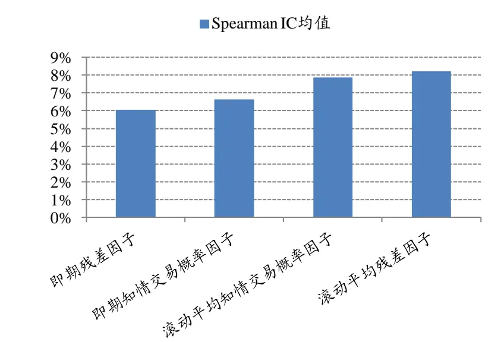
数据来源：国泰君安证券研究，Wind

图 20: 因子 Spearman IC 均值/标准差比较
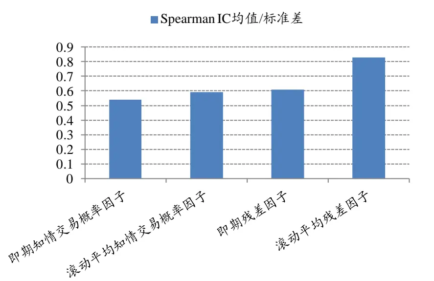
数据来源：国泰君安证券研究，Wind

当然，我们应该看到，本文构建的几个因子的确提供了一种对高频数据进行有效处理的算法，且这些算法的确对低频投资有价值。但是，这些因子所获得的收益究竟是受何驱动，其实并不十分直观。此外，由于组合测算时间较短，样本内效果良好难免有数据挖掘之嫌。

为避免这一问题，一方面，我们可以通过样本外跟踪，对因子效果进一步观察；而另一方面，该因子给我们更多启示的是，与传统分析中价与量的相互独立不同，该因子将价格和成交量进行了巧妙地结合。无论是量钟的应用，还是对主动买卖量的判断，都是很新颖的方法。因此，我们需要用价量结合的方法对市场进行更深入的研究，更好地理解资本市场的微观结构。

## 本公司具有中国证监会核准的证券投资咨询业务资格

## 分析师声明

作者具有中国证券业协会授予的证券投资咨询执业资格或相当的专业胜任能力，保证报告所采用的数据均来自合规渠道，分析逻辑基于作者的职业理解，本报告清晰准确地反映了作者的研究观点，力求独立、客观和公正，结论不受任何第三方的授意或影响，特此声明。

## 免责声明

本报告仅供国泰君安证券股份有限公司（以下简称“本公司”）的客户使用。本公司不会因接收人收到本报告而视其为本公司的当然客户。本报告仅在相关法律许可的情况下发放，并仅为提供信息而发放，概不构成任何广告。

本报告的信息来源于已公开的资料，本公司对该等信息的准确性、完整性或可靠性不作任何保证。本报告所载的资料、意见及推测仅反映本公司于发布本报告当日的判断，本报告所指的证券或投资标的的价格、价值及投资收入可升可跌。过往表现不应作为日后的表现依据。在不同时期，本公司可发出与本报告所载资料、意见及推测不一致的报告。本公司不保证本报告所含信息保持在最新状态。同时，本公司对本报告所含信息可在不发出通知的情形下做出修改，投资者应当自行关注相应的更新或修改。

本报告中所指的投资及服务可能不适合个别客户，不构成客户私人咨询建议。在任何情况下，本报告中的信息或所表述的意见均不构成对任何人的投资建议。在任何情况下，本公司、本公司员工或者关联机构不承诺投资者一定获利，不与投资者分享投资收益，也不对任何人因使用本报告中的任何内容所引致的任何损失负任何责任。投资者务必注意，其据此做出的任何投资决策与本公司、本公司员工或者关联机构无关。

本公司利用信息隔离墙控制内部一个或多个领域、部门或关联机构之间的信息流动。因此，投资者应注意，在法律许可的情况下，本公司及其所属关联机构可能会持有报告中提到的公司所发行的证券或期权并进行证券或期权交易，也可能为这些公司提供或者争取提供投资银行、财务顾问或者金融产品等相关服务。在法律许可的情况下，本公司的员工可能担任本报告所提到的公司的董事。

市场有风险，投资需谨慎。投资者不应将本报告为作出投资决策的惟一参考因素，亦不应认为本报告可以取代自己的判断。在决定投资前，如有需要，投资者务必向专业人士咨询并谨慎决策。

本报告版权仅为本公司所有，未经书面许可，任何机构和个人不得以任何形式翻版、复制、发表或引用。如征得本公司同意进行引用、刊发的，需在允许的范围内使用，并注明出处为“国泰君安证券研究”，且不得对本报告进行任何有悖原意的引用、删节和修改。

若本公司以外的其他机构（以下简称“该机构”）发送本报告，则由该机构独自为此发送行为负责。通过此途径获得本报告的投资者应自行联系该机构以要求获悉更详细信息或进而交易本报告中提及的证券。本报告不构成本公司向该机构之客户提供的投资建议，本公司、本公司员工或者关联机构亦不为该机构之客户因使用本报告或报告所载内容引起的任何损失承担任何责任。

## 评级说明

## 1.投资建议的比较标准

投资评级分为股票评级和行业评级。

以报告发布后的12个月内的市场表现为比较标准，报告发布日后的 12个月内的公司股价（或行业指数）的涨跌幅相对同期的沪深 300 指数涨跌幅为基准。

## 2.投资建议的评级标准

报告发布日后的 12 个月内的公司股价（或行业指数）的涨跌幅相对同期的沪深 300 指数的涨跌幅。

| 评级 | 说明 |  |
| --- | --- | --- |
| 股票投资评级 | 增持 | 相对沪深 300指数涨幅15%以上 |
|  | 谨慎增持 | 相对沪深300指数涨幅介于5%～15%之间 |
|  | 中性 | 相对沪深300指数涨幅介于-5%～5% |
|  | 减持 | 相对沪深300指数下跌5%以上 |
| 行业投资评级 | 增持 | 明显强于沪深 300 指数 |
|  | 中性 | 基本与沪深300指数持平 |
|  | 减持 | 明显弱于沪深300指数 |

## 国泰君安证券研究

|  | 上海 | 深圳 | 北京 |
| --- | --- | --- | --- |
| 地址 | 上海市浦东新区银城中路168号上海 银行大厦29层 | 深圳市福田区益田路 6009 号新世界 商务中心34层 | 北京市西城区金融大街 28 号盈泰中 心2号楼10层 |
| 邮编 | 200120 | 518026 | 100140 |
| 电话 | (021)38676666 | (0755)23976888 | (010)59312799 |
|  | E-mail: gtjaresearch@gtjas.com |  |  |