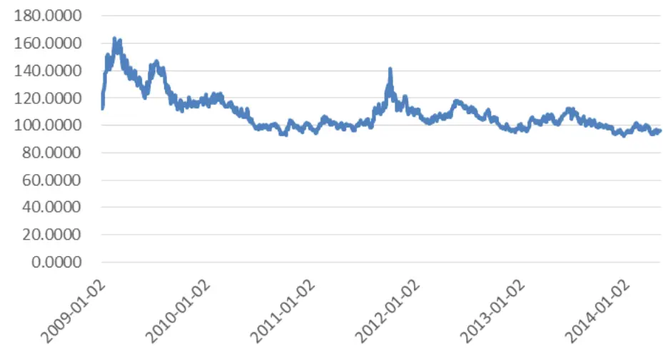
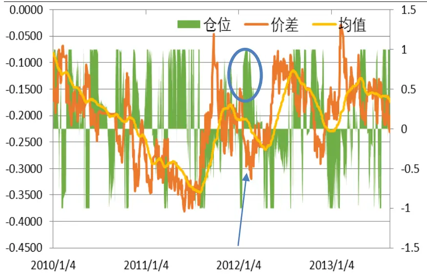
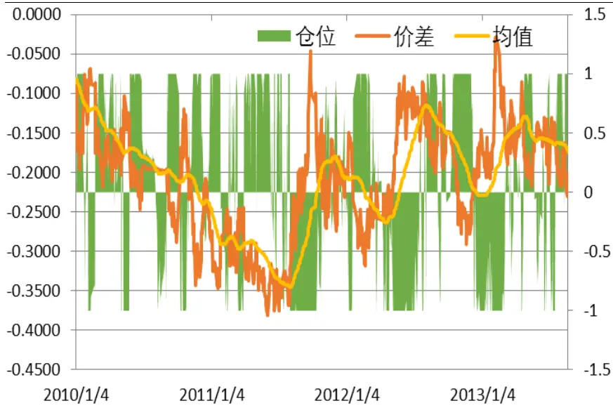
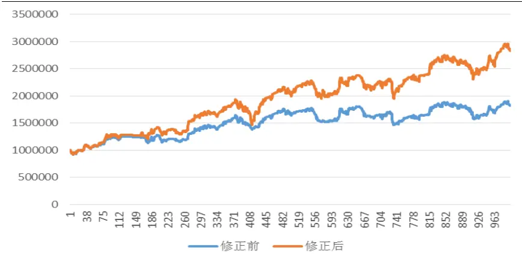
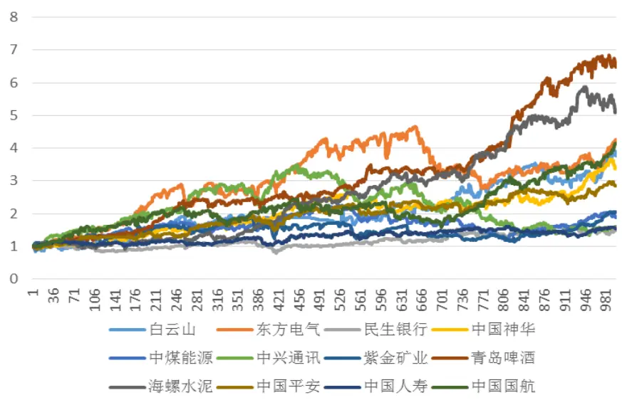
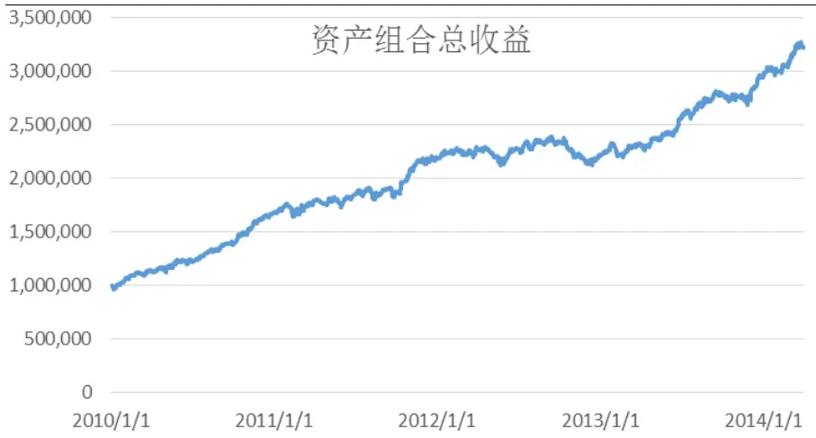
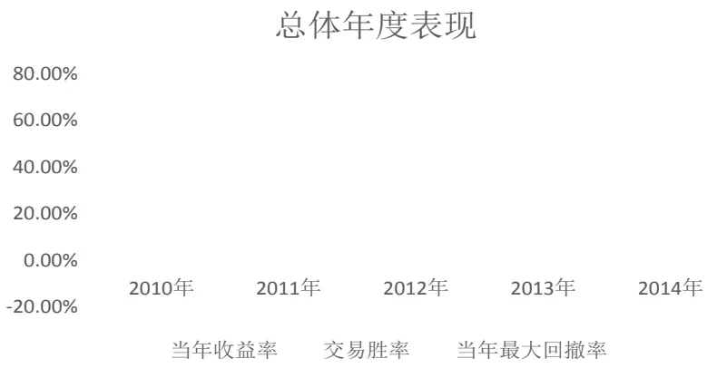
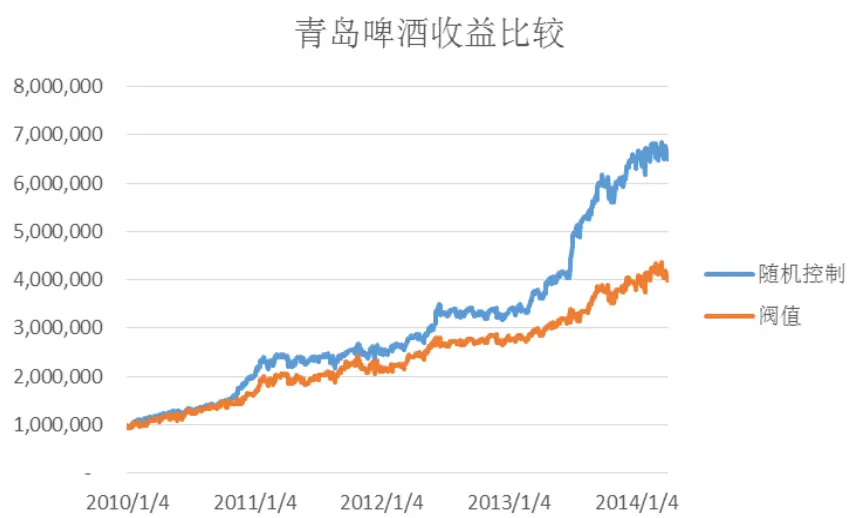
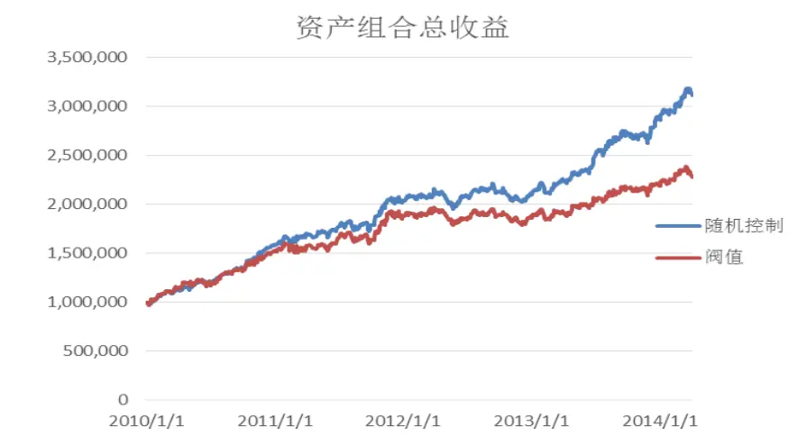

2014.06.03

# 随机最优控制下的 AH股配对交易策略

# ——数量化专题之四十四

刘富兵（分析师）

8 021-38676673

liufubing008481@gtjas.com

证书编号 S0880511010017

## 本报告导读：

本文假设配对股票的价格差符合 O-U 过程模型，利用随机控制方法，通过调整股票对的持仓比例，实现收益最大化，年化收益率高达 30.82%。最大回撤率为 10.87%。摘要：

le_Summary] 配对交易的核心是寻找一对历史价格走势相近的股票对进行配对，两者价差是稳定收敛的，当价差波动时，做空近期强势的股票，做多相对弱势的股票,当价差回归均值时，平仓赚取价差变动的收益。

A、H股同时上市的公司由于基本面情况相同，两者股价差在中短期内应该较为稳定。随着 2014年4月10 日中国证监会正式批复沪港通试点，投资者有更多渠道投资两地股票市场，对A+H股同时上市的公司股票进行配对交易的可行性增强。

- 建仓、平仓的时机一直是配对交易模型中需要解决的难题，一般方法是计算阀值作为交易信号，本文采用随机控制方法，根据每日股票的开盘行情，调整股票对持仓比例，实现日交易的配对交易策略，投资效用最大化。

通过相关系数和协整性检验筛选出 12 个 A+H 股票对投资组合，利用最优化模型计算每日合理仓位，策略效果表现良好，测试周期内累计收益率为221.56%，年化收益率达到30.82%，夏普比率为 2.49。与传统阀值触发建仓的配对交易模型相比，随机控制模型表现更加优异。

- 沪港通的出台，为投资者开辟了更加成熟的投资渠道，使得该配对交易策略在实际操作中发挥更好的效果。未来，在沪港两市正式开通后，我们将持续跟进，根据实际情况改进该模型。

- 此外，鉴于随机控制模型比传统的统计套利模型效果要好，后续，我们也会将该模型尝试用于股指期货的跨期套利及期现套利。

## 金融工程团队：

刘富兵：（分析师）

电话：021-38676673

邮箱：liufubing008481@gtjas.com

证书编号：S0880511010017

严佳炜：（分析师）

电话：021-38674812

邮箱：yanjiawei008776@gtjas.com

证书编号：S0880512110001

## 耿帅军：（分析师）

电话：010-59312753

邮箱：gengshuaijun@gtjas.com

证书编号：S0880513080013

## 徐康：（分析师）

电话：021-38674939

邮箱：xukang010849@gtjas.com

证书编号：S0880513080018

## 赵延鸿：（研究助理）

电话：021-38674927

邮箱：zhaoyanhong@gtjas.com

证书编号：S0880113070047

## 陈睿：（研究助理）

电话：021-38675861

邮箱：chenrui012896@gtjas.com

证书编号：S0880112120012

## 刘正捷：（研究助理）

电话：0755-23976803

邮箱：liuzhengjie012509@gtjas.com

证书编号：S0880112080087

## [Table_R相关报告

《量化择时之由连续到离散》2014.05.22

《深度解析业绩预告事件》2014.05.22

《寻找牛、熊股基本特征》2014.05.19

《 基 于 Kelly 公 式 的 行 业 配 臵 策 略 》2014.05.18

《微观数据再掘金》2014.05.16

## 1. 配对交易介绍

## 1.1. 发展历史

配对交易是统计套利的一种，起源于上世纪八十年代中期，摩根士丹利的数量分析团队通过该策略在 1987 年为公司赢得了 5000 万美元的收益，其主要原理是均值回复理论，两只风险收益特征相似的股票价格差是稳定的，虽然受市场信息面和交易影响会偏离均值，但长期来看价差是在均值上下波动，当价差扩大时，投资者可以通过卖出强势的股票，买入弱势的股票，建立多空投资组合，消除市场风险，等待价差回归均值时平仓，从而收获价差波动带来的绝对收益。

## 1.2. A+H 股配对的优势

沪港通的试点为投资者提供了在 A+H 两市实现套利投资的机会，对于A+H股同时上市的公司，盈利状况相同，在短期内，市场利率和风险厌恶偏好不会大幅波动，因而股价波动趋势大致相同，价格差即使在短期内偏离，仍然会有向均值回复的趋势。观察2009年 1月 1 日至2014年5月5日的恒生AH股溢价指数，2010年后该指数逐渐平稳，长期来看呈现均值回归的特性，因此A 股、H股之间存在很大的配对套利空间。本报告接下来将具体介绍如何用 A+H 股实现配对交易的套利。

图 1 恒生 AH 股溢价溢价指数（2009.01.02-2014.05.05）

数据来源：国泰君安证券研究 wind

## 2. 配对交易策略

我们构建这样的投资策略，投资者假设初始资金为 V0,每个交易日都有一部分资金用于买入和卖出同等价值的股票对，其他剩余资金投资于无风险市场。通过每天调整买入和卖出股票对的持仓比例，达到周期T后投资效用最大化。接下来，我们将具体介绍如何用随机控制模型寻找该交易策略的“最优化解”。

## 2.1. 模型假设

假设存在无风险利率 r，则无风险资产 M（t）满足动态方程

$$
\mathbf{dM(t)}=\mathbf{rM(t)dt}
$$

假定 A(t) 和 B(t)分别代表股票对 A 和 B 在时间 t 时的价格，且股票 B的价格遵循几何布朗运动

$$
\mathbf{dB}(\mathbf{t})=\mu\mathbf{B}(\mathbf{t})\mathbf{d}\mathbf{t}+\sigma\mathbf{B}(\mathbf{t})\mathbf{d}\mathbf{Z}(\mathbf{t})
$$

股票价格的波动率,Z(t)标准布朗运动

若X(t)代表两只股票在时间 t时的对数价差，则

$$
\mathbf{X}(\mathbf{t})=\mathbf{ln}\big(\mathbf{A}(\mathbf{t})\big)-\mathbf{ln}(\mathbf{B}(\mathbf{t}))
$$

配对交易的理论基础是价差序列具有均值回复的特点,而随机过程中的Ornstein-Uhlenbeck 过程能很好的描述具有均值回复特性的序列，即假定：

$$
\mathbf{dX}(\mathbf{t})=\mathbf{k}\big(\mathbf{\theta}-\mathbf{X}(\mathbf{t})\big)\mathbf{dt}+\boldsymbol{\eta}\mathbf{dW}(\mathbf{t})
$$

其中 $\mathbf{k}\big(\pmb{\theta}-\mathbf{X}(\mathbf{t})\big)$ 是漂移项，代表价差在时间 t 时的瞬间变化，θ是长期稳定的均值水平，k 是均值回复速率，η等于价差的波动率，W(t)标准布朗运动，ρ为 W(t)和Z(t)之间的相关系数： $\mathbb{E}[{\bf dW(t)dZ(t)}]=\boldsymbol{\rho}\mathbf{dt}$ 根据伊藤引理，我们可以得到A(t)的状态方程：

$$
\begin{array}{c}{\displaystyle\mathbf{dA(t)}=\left(\mathbf{\boldsymbol{\mu}}+\mathbf{k}\big(\mathbf{0}-\mathbf{X(t)}\big)+\frac{1}{2}\eta^{2}+\rho\sigma\eta\right)A(t)dt+\sigma A(t)dZ(t)}\\{+\eta A(t)dW(t)}\end{array}
$$

设 V(t)为配对交易投资组合的价值， $\mathrm{h(t)}\mathscr{F}^{\widetilde{\mathbf{\Gamma}}}\widetilde{h}(t)$ 分别代表股票对 A 和 B时间t时在投资组合中的权重。由于我们每次交易的股票对A和 B的价值是相同的，即每次买入一定价值的一只股票，也会卖出同等价值的另外一只股票，所以 $\mathrm{h(t)}\mathcal{F}_{}|\tilde{h}(t)$ 满足关系：

$$
{\bf h}({\bf t})=-\widetilde{h}(t)
$$

由以上方程我们能得出V(t)的动态方程

$$
{\bf d}{\bf V}({\bf t})={\bf V}({\bf t})\{{\bf h}({\bf t})\frac{dA(t)}{A(t)}+\widetilde{h}(t)\frac{dB(t)}{B(t)}+\frac{dM({\bf t})}{M(t)}
$$

将 A(t)、B(t)、M(t)的过程代入上式，则 V(t)可以改写为：

$$
\begin{array}{r}\mathbf{d}\mathbf{V}(\mathbf{t})=\mathbf{V}(\mathbf{t})\{[\mathbf{h}(\mathbf{t})(\mathbf{\ k}(\theta-\mathbf{X}(\mathbf{t}))+\frac{1}{2}\eta^{2}+\rho\sigma\eta+r]d\mathbf{\}t+\eta dW(t)\}}\end{array}
$$

## 2.2. 最优化控制

假设投资者的偏好可以用效用函数 ${\mathbf U}({\mathbf V})=\textstyle{\frac{1}{\gamma}}{W}$ 表示，则该配对交易问题

可以用随机系统最优化控制的方法来解决，即寻找 h(t)的最优化解使得效用函数在周期T 时的最大值。

$$
sup_{h(t)}\quad E[\frac{1}{\gamma}\big(V(T)\big)^{\gamma}]
$$

满足限制条件: V(0) = v0 X(0) = x0

$$
\mathbf{dX}(\mathbf{t})=\mathbf{k}\big(\mathbf{\theta}-\mathbf{X}(\mathbf{t})\big)\mathbf{dt}+\boldsymbol{\eta}\mathbf{dW}(\mathbf{t})
$$

$$
\mathbf{d}\mathbf{V(t)}=\mathbf{V(t)}\{[\mathbf{h(t)}\left(\mathbf{k{\big(}}\mathbf{\theta-X(t)}\right)+{\frac{1}{2}}\eta^{2}+\rho\sigma\eta+r]dt+\eta dW(t)\}
$$

利用最优化控制理论的 $\mathrm{Hamilton-Jacobi-Bellman}$ (HJB)方程，我们可以计算出h(t)的最优化解 $\mathbf{\nabla}\cdot\mathbf{\vec{n}}^{*}(t,x)$ 为满足上确界的最优化解：

$$
h^{\ast}(t,x)=\frac{1}{1-\gamma}[\beta(t)+2x\alpha(t)-\frac{k(x-\theta)}{\eta^{2}}+\frac{\rho\sigma}{\eta}+\frac{1}{2}]
$$

$$
\begin{array}{rl}{\frac{\ddagger{}}{\sqrt{\star}}\Psi}&{{}\alpha(\mathbf{t})=\frac{k}{2\eta^{2}}[\bigl(1-\sqrt{1-\gamma}\bigr)+\frac{2\sqrt{1-\gamma}}{1+\left(1-\frac{2}{1-\sqrt{1-\gamma}}\right)\exp(\frac{2k}{\sqrt{1-\gamma}}(T-t))}}\end{array}
$$

$$
\beta(t)=\frac{k\theta}{\eta^{2}}(1+\sqrt{1-\gamma})~\frac{exp\left(\frac{2k}{\sqrt{1-\gamma}}(T-t)\right)-1}{1+\left(1-\frac{2}{1-\sqrt{1-\gamma}}\right)exp(\frac{2k}{\sqrt{1-\gamma}}(T-t))}
$$

## 2.3.策略实际操作流程

根据上述模型假设，我们需要从备选股票池中筛选出符合模型条件的股票对，只有股票对的价格差有均值回复的特性，配对交易模型才能成立。

我们利用股票对的历史开盘价数据，估算以上参数 k、θ、ρ、σ，从而求出每日的最优化配对权重，通过更新持仓比例 h，计算每日需要买入和卖出的股票对价值，进行日交易配对交易。

## 3. 实证研究

## 3.1. 股票对筛选

要进行配对交易，必须能卖空股票，根据wind数据，截止2014年4月28日有84家公司同时在A+H股上市，其中48家有融券业务可进行卖空交易。选取 48 家公司 A+H 股票对 2010 年 1 月 1 日到 2014 年 4 月 1 日每日开盘价，计算A股对数价格和 H股对数价格的相关系数，见表 1：

表1 可卖空的 A+H 股票对和相关系数

| A 股名称 | A 股代码 | H股名称 | H股代码 | 相关系数 |
| --- | --- | --- | --- | --- |
| 白云山 | 600332.SH | 白云山 | 0874.HK | 0.94 |
| 大唐发电 | 601991.SH | 大唐发电 | 0991.HK | 0.07 |
| 东方电气 | 600875.SH | 东方电气 | 1072.HK | 0.95 |
| 复星医药 | 600196.SH | 复星医药 | 2196.HK | 0.96 |
| 工商银行 | 601398.SH | 工商银行 | 1398.HK | 0.32 |
| 广汽集团 | 601238.SH | 广汽集团 | 2238.HK | 0.82 |
| 海通证券 | 600837.SH | 海通证券 | 6837.HK | 0.74 |
| 建设银行 | 601939.SH | 建设银行 | 0939.HK | 0.44 |
| 交通银行 | 601328.SH | 交通银行 | 3328.HK | 0.69 |
| 金风科技 | 002202.SZ | 金风科技 | 2208.HK | 0.87 |
| 金隅股份 | 601992.SH | 金隅股份 | 2009.HK | 0.84 |
| 民生银行 | 600016.SH | 民生银行 | 1988.HK | 0.91 |
| 农业银行 | 601288.SH | 农业银行 | 1288.HK | 0.46 |
| 上海医药 | 601607.SH | 上海医药 | 2607.HK | 0.79 |
| 潍柴动力 | 000338.SZ | 潍柴动力 | 2338.HK | 0.74 |
| 新华保险 | 601336.SH | 新华保险 | 1336.HK | 0.67 |
| 长城汽车 | 601633.SH | 长城汽车 | 2333.HK | 0.97 |
| 招商银行 | 600036.SH | 招商银行 | 3968.HK | 0.65 |
| 中国国航 | 601111.SH | 中国国航 | 0753.HK | 0.87 |
| 中国联通 | 600050.SH | 中国联通 | 0762.HK | 0.12 |
| 中国铝业 | 601600.SH | 中国铝业 | 2600.HK | 0.93 |
| 中国南车 | 601766.SH | 中国南车 | 1766.HK | 0.77 |
| 中国平安 | 601318.SH | 中国平安 | 2318.HK | 0.87 |
| 中国人寿 | 601628.SH | 中国人寿 | 2628.HK | 0.84 |
| 中国神华 | 601088.SH | 中国神华 | 1088.HK | 0.90 |
| 中国太保 | 601601.SH | 中国太保 | 2601.HK | 0.50 |
| 中国铁建 | 601186.SH | 中国铁建 | 1186.HK | 0.79 |
| 中国银行 | 601988.SH | 中国银行 | 3988.HK | 0.42 |
| 中国中铁 | 601390.SH | 中国中铁 | 0390.HK | 0.69 |
| 中国中冶 | 601618.SH | 中国中冶 | 1618.HK | 0.94 |
| 中海集运 | 601866.SH | 中海集运 | 2866.HK | 0.78 |
| 中联重科 | 000157.SZ | 中联重科 | 1157.HK | 0.91 |
| 中煤能源 | 601898.SH | 中煤能源 | 1898.HK | 0.94 |
| 中信银行 | 601998.SH | 中信银行 | 0998.HK | 0.72 |
| 中信证券 | 600030.SH | 中信证券 | 6030.HK | 0.81 |
| 中兴通讯 | 000063.SZ | 中兴通讯 | 0763.HK | 0.90 |
| 紫金矿业 | 601899.SH | 紫金矿业 | 2899.HK | 0.92 |
| 青岛啤酒 | 600600.SH | 青岛啤酒股份 | 0168.HK | 0.93 |
| 江西铜业 | 600362.SH | 江西铜业股份 | 0358.HK | 0.69 |
| 中国石化 | 600028.SH | 中国石油化工股份 | 0386.HK | -0.4 |
| 海螺水泥 | 600585.SH | 安徽海螺水泥股份 | 0914.HK | 0.90 |
| 南方航空 | 600029.SH | 中国南方航空股份 | 1055.HK | 0.49 |
| 上海石化 | 600688.SH | 上海石油化工股份 | 0338.HK | 0.58 |
| 广深铁路 | 601333.SH | 广深铁路股份 | 0525.HK | -0.09 |
| 东方航空 | 600115.SH | 中国东方航空股份 | 0670.HK | 0.75 |
| 兖州煤业 | 600188.SH | 兖州煤业股份 | 1171.HK | 0.91 |
| 华能国际 | 600011.SH | 华能国际电力股份 | 0902.HK | 0.59 |
| 中国石油 | 601857.SH | 中国石油股份 | 0857.HK | 0.1 |

数据来源：国泰君安证券研究 wind

当两只股票走势相近时，其相关系数越高，从 48 个股票对中我们选取相关系数大于0.8的 22个股票对，并剔除2010以后上市的长城汽车、复星医药、金隅股份、广汽集团、中信证券、金凤科技，中国中冶、中联重科。股价相关系数很高是实现该配对策略的一个重要条件，然而要完全筛选出合适的股票，我们还需要对 14 只股票对作协整性检验。通过 Engle‐Granger cointegration test 发现中国铝业和兖州煤业不存在协整关系，剔除这两只股票，接下来我们将用剩余的 12 个股票对作实证研究。

## 3.2. 参数设定

在模型测试中，我们做出以下设定：

1) 初始资金为 1,000,000

2) 两市交易费用和印花税都为 0.1%

3) A 股融券利率为 8.6%，H 股融券利率为 3%

4) 无风险利率为 0

5) 利用线性回归对 Ornstein-Uhlenbeck 过程中的参数进行滚动计算，学习周期为N。

6) 我们对上述模型做了简化，设定 t=0，即滚动更新 h(0,x)

7) 持仓比例 h 的绝对值小于等于 1，即买入和卖出的股票价值不超过总资金。

8)

需要设定的参数是风险厌恶系数λ、参数估计的学习时间N 和周期T接下来我们考虑不同参数对单个股票对配对交易的影响，以求寻找最优化的参数设计。表2，表3，表4 为不同参数设定下，民生银行，中国，青岛啤酒三个股票对的配对交易策略效果。

表 2 周期 T=1，风险厌恶系数λ=-300

| 民生银行 |  |  |  | 中国神华 |  |  | 青岛啤酒 |  |  |
| --- | --- | --- | --- | --- | --- | --- | --- | --- | --- |
| 学习时间 | 平均日收 益率 | 标准差 | 夏普率 | 平均日收 益率 | 标准差 | 夏普率 | 平均日收 益 | 标准差 | 夏普率 |
| 25 | 0.006% | 0.0121 | 0.005 | 0.042% | 0.0152 | 0.028 | 0.099% | 0.0158 | 0.063 |
| 30 | 0.002% | 0.0118 | 0.002 | 0.043% | 0.0148 | 0.029 | 0.103% | 0.0156 | 0.066 |
| 35 | 0.027% | 0.0114 | 0.024 | 0.078% | 0.0145 | 0.054 | 0.099% | 0.0152 | 0.065 |
| 40 | 0.026% | 0.0112 | 0.024 | 0.083% | 0.0140 | 0.059 | 0.101% | 0.0150 | 0.067 |
| 45 | 0.016% | 0.0110 | 0.015 | 0.086% | 0.0138 | 0.062 | 0.115% | 0.0149 | 0.077 |
| 50 | 0.022% | 0.0108 | 0.020 | 0.089% | 0.0135 | 0.066 | 0.116% | 0.0145 | 0.080 |
| 55 | 0.020% | 0.0107 | 0.019 | 0.095% | 0.0134 | 0.071 | 0.124% | 0.0143 | 0.087 |
| 60 | 0.017% | 0.0107 | 0.016 | 0.087% | 0.0133 | 0.065 | 0.136% | 0.0142 | 0.096 |
| 65 | 0.008% | 0.0105 | 0.008 | 0.083% | 0.0131 | 0.063 | 0.141% | 0.0140 | 0.101 |

数据来源：国泰君安证券研究

表 3学习时间N=50，风险厌恶系数λ=-300

| 民生银行 |  |  |  | 中国神华 |  |  | 青岛啤酒 |  |  |
| --- | --- | --- | --- | --- | --- | --- | --- | --- | --- |
| 周期T | 平均日收 益率 | 标准差 | 夏普率 | 平均日收 益率 | 标准差 | 夏普率 | 平均日收 益 | 标准差 | 夏普率 |
| 0.01 | -0.002% | 0.0015 | -0.013 | 0.005% | 0.0015 | 0.033 | 0.017% | 0.0019 | 0.089 |
| 0.05 | -0.005% | 0.0037 | -0.014 | 0.007% | 0.0034 | 0.021 | 0.041% | 0.0046 | 0.089 |
| 0.1 | -0.005% | 0.0053 | -0.009 | 0.013% | 0.0055 | 0.024 | 0.065% | 0.0069 | 0.094 |
| 0.2 | 0.000% | 0.0072 | 0.000 | 0.031% | 0.0082 | 0.038 | 0.089% | 0.0095 | 0.094 |
| 0.4 | 0.005% | 0.0091 | 0.005 | 0.059% | 0.0109 | 0.054 | 0.093% | 0.0129 | 0.072 |
| 0.8 | 0.020% | 0.0107 | 0.019 | 0.079% | 0.0128 | 0.062 | 0.111% | 0.0143 | 0.078 |
| 1 | 0.022% | 0.0109 | 0.020 | 0.089% | 0.0135 | 0.067 | 0.116% | 0.0146 | 0.079 |
| 5 | 0.024% | 0.0123 | 0.020 | 0.105% | 0.0157 | 0.067 | 0.137% | 0.0164 | 0.084 |
| 10 | 0.025% | 0.0124 | 0.020 | 0.104% | 0.0157 | 0.066 | 0.137% | 0.0164 | 0.084 |

数据来源：国泰君安证券研究

表 4 学习时间 N=50，周期 T=1

|  | 民生银行 |  |  | 中国神华 |  |  | 青岛啤酒 |  |  |
| --- | --- | --- | --- | --- | --- | --- | --- | --- | --- |
| 厌恶系数 | 平均日收 | 标准差 | 夏普率 | 平均日收 | 标准差 | 夏普率 | 平均日收 | 标准差 | 夏普率 |
| λ | 益率 |  |  | 益率 |  |  | 益 |  |  |
| -10 | 0.027% | 0.0157 | 0.017 | 0.088% | 0.0164 | 0.054 | 0.097% | 0.0153 | 0.063 |
| -50 | 0.023% | 0.0138 | 0.017 | 0.082% | 0.0143 | 0.057 | 0.093% | 0.0140 | 0.066 |
| -100 | 0.027% | 0.0119 | 0.023 | 0.078% | 0.0129 | 0.060 | 0.088% | 0.0127 | 0.069 |
| -200 | 0.026% | 0.0102 | 0.025 | 0.071% | 0.0112 | 0.063 | 0.082% | 0.0112 | 0.073 |
| -300 | 0.024% | 0.0093 | 0.026 | 0.064% | 0.0101 | 0.063 | 0.076% | 0.0104 | 0.073 |
| -400 | 0.022% | 0.0086 | 0.026 | 0.057% | 0.0094 | 0.061 | 0.071% | 0.0097 | 0.073 |
| -500 | 0.020% | 0.0082 | 0.017 | 0.051% | 0.0089 | 0.057 | 0.067% | 0.0092 | 0.073 |
| -10 | 0.027% | 0.0157 | 0.017 | 0.088% | 0.0164 | 0.054 | 0.097% | 0.0153 | 0.063 |
| -50 | 0.023% | 0.0138 | 0.017 | 0.082% | 0.0143 | 0.057 | 0.093% | 0.0140 | 0.066 |

数据来源：国泰君安证券研究

观察表 2，学习时间在 35-65 之间时平均日收益率最大，当学习周期增加时，收益率的标准差逐渐减小。这和模型的假设一致，价差只有在中短期内具有均值回归的特性，估计参数的学习周期太短，回归值不显著，估计参数的学习周期太长，对当天的交易参考意义不大。

观察表 3、表 4，随着周期 T 的变大，平均日收益率增加，标准差也相应的增加。随着风险厌恶系数变小，平均日收益率也减小，相应的标准差也减小。

综合以上分析，根据投资者对预期收益率和波动风险的考虑，可以设定不同的参数，为实现夏普比率最大，我们可以选定λ=-300,T=1,N=50

## 3.3. 模型修正

理想状态下，当价差偏离均值很大时，应对强势股票建仓卖空。当价差低于均值时，做多A股，即持仓比例为正值，当价差高于均值时，做空A 股，即持仓比例为负值。然而我们观察到当价差在历史一段时间内单边上涨或者下降，不呈现均值回复特性时，通过模型计算的仓位值降到很小，与实际理想持仓的比例大幅偏离。观察图2中国平安的仓位和价差关系图，中国平安价差在 2011年 9月至10 月周期内大幅单边上涨偏离均值，模型给定的持仓比例为接近为0的正值，使得投资策略在A 股溢价持续高涨时反而买入A 股，卖出H 股，不仅错失了获得收益的机会，而且造成损失。模型估算的偏差主要是由于对回归速率 K的计算偏差，在历史学习期出现单边行情时，回归速率接近于 0。

图 2 修正前中国平安仓位与价差图

数据来源：国泰君安证券研究

为解决这个问题，我们通过计算回归速率 K 的历史行情平均值，发现12 个股票对的 K 值大致稳定在 40 左右，通过限定 K 的最小值为 40 修正原先模型，观察图 3改进后中国平安仓位与价差的关系图，仓位计算偏差的问题得到良好的解决。图 4中，修正后中国平安的收益大幅上升。

图 3 修正后中国平安仓位与价差

数据来源：国泰君安证券研究

表 5 历史回归速率

| 股票对 | 历史平均回归速率K |
| --- | --- |
| 白云山 | 41.5 |
| 东方电气 | 38.5 |
| 民生银行 | 39.9 |
| 中国神华 | 43.3 |
| 中煤能源 | 36.6 |
| 中兴通讯 | 36.9 |
| 紫金矿业 | 41.7 |
| 青岛啤酒 | 51.4 |
| 海螺水泥 | 53.2 |
| 中国平安 | 46.2 |
| 中国人寿 | 38.3 |
| 中国国航 | 40.2 |

数据来源：国泰君安证券研究

图 4模型修正前后中国平安累积收益比较

数据来源：国泰君安证券研究

## 3.4.实证结果和分析

我们分别对 14个股票对进行配对交易，收益曲线如图 3，其中青岛啤酒、海螺水泥在 998 个交易日后总收益超过 400%，中国人寿的累计收益率最低为 47.8%。

图 5单个股票对收益曲线

数据来源：国泰君安证券研究,wind

考虑单只股票对配对交易的收益率波动较大，我们以 14 个股票对构建一个投资组合，利用上述交易策略进行配对交易，总收益如下图3所示,可以发现该配对组合策略效果良好，从 2010 年 1 月 1 日至 2014 年的 4月1日的累计收益率为221.56%。图4为交易策略的年度表现，其中2010年、2011 年、2013 年的当年收益率超过 30%，2014 年截止 4 月 1 日该策略的收益率为 9.45%，总体年复合收益率达到 30.82%，最大回撤率为10.87%。

图 6 配对交易策略的总收益（2010.01.04-2014.04.01）

数据来源：国泰君安证券研究,wind

图 7 配对交易策略年度表现

数据来源：国泰君安证券研究,wind

表6 配对交易策略总体表现

| 统计指标 | 数值 |
| --- | --- |
| 测试周期 | 2010.01.01-2014.04.01 |
| 交易次数 | 998 |
| 累积总收益率 | 221.56% |
| 年化收益率 | 30.82% |
| 年化波动率 | 12.35% |
| 夏普比率 | 2.49 |
| 最大回撤 | 10.87% |
| 交易胜率 | 54.81% |
| VaR(95%) | -1.11% |

数据来源：国泰君安证券研究,wind

## 3.5.与传统模型收益比较

接下来，我们比较随机控制模型与传统的配对交易模型的收益，保持上述交易参数不变，我们设计这样一个传统的阀值触发配对交易模型：

1. 开仓线的触发信号阀值为偏离均值1个标准差，当价差偏离触发开仓线时，满仓

2. 当价差接近均值时，平仓。

图8和图9分别为青岛啤酒和投资组合在随机控制模型和阀值触发交易策略下的收益。其中青岛啤酒在传统交易策略下的累计收益为298%。资产组合的累计收益为 120%，波动率为13.92%，夏普比例为 1.49，VaR(95%)为-1.37%，综合比较，随机控制模型取得优异的效果。

图 8 青岛啤酒随机控制模型和传统模型下的收益比较

数据来源：国泰君安证券研究,wind

图9资产组合随机控制模型和传统模型下的总收益比较

数据来源：国泰君安证券研究,wind

## 4. 总结

AH 两市股票对的价格差随着市场利率和投资者偏好的调整，中短期内在均值上下波动，配对交易策略通过在震荡市中做空强势股，做多弱势股，在股价差回归过程中获得绝对收益。本报告中，我们利用配对交易构建市场中性交易策略，通过随机控制理论，寻找最优化的持仓比例，从而在股价差回归合理均值中枢时，实现配对套利。

配对交易策略表现稳定，复合年收益率为30.82%，最大回撤率仅为10.87%，交易胜率为 54.81%，VaR 在 95%的臵信区间上为-1.11%，2010年-2014 年交易周期中除了 2012年表现较差之外，其他 4年测试效果良好，其中2014年度截止4月1 日的收益率为9.45%，胜率为57.63%。在实际操作中，我们要考虑 AH股溢价和汇率大幅波动带来的风险，当AH 溢价长期处在单边上涨或者下跌的过程中，短期内卖强买弱可能会带来损失。

沪港通的出台，为投资者开辟了更加成熟的投资渠道，使得该配对交易策略在实际操作中发挥更好的效果。未来，在沪港两市正式开通后，我们将持续跟进，根据实际情况改进该模型。

此外，鉴于随机控制模型比传统的统计套利模型效果要好，后续，我们也会将该模型尝试用于股指期货的跨期套利及期现套利。

## 本公司具有中国证监会核准的证券投资咨询业务资格

## 分析师声明

作者具有中国证券业协会授予的证券投资咨询执业资格或相当的专业胜任能力，保证报告所采用的数据均来自合规渠道，分析逻辑基于作者的职业理解，本报告清晰准确地反映了作者的研究观点，力求独立、客观和公正，结论不受任何第三方的授意或影响，特此声明。

## 免责声明

本报告仅供国泰君安证券股份有限公司（以下简称“本公司”）的客户使用。本公司不会因接收人收到本报告而视其为本公司的当然客户。本报告仅在相关法律许可的情况下发放，并仅为提供信息而发放，概不构成任何广告。

本报告的信息来源于已公开的资料，本公司对该等信息的准确性、完整性或可靠性不作任何保证。本报告所载的资料、意见及推测仅反映本公司于发布本报告当日的判断，本报告所指的证券或投资标的的价格、价值及投资收入可升可跌。过往表现不应作为日后的表现依据。在不同时期，本公司可发出与本报告所载资料、意见及推测不一致的报告。本公司不保证本报告所含信息保持在最新状态。同时，本公司对本报告所含信息可在不发出通知的情形下做出修改，投资者应当自行关注相应的更新或修改。

本报告中所指的投资及服务可能不适合个别客户，不构成客户私人咨询建议。在任何情况下，本报告中的信息或所表述的意见均不构成对任何人的投资建议。在任何情况下，本公司、本公司员工或者关联机构不承诺投资者一定获利，不与投资者分享投资收益，也不对任何人因使用本报告中的任何内容所引致的任何损失负任何责任。投资者务必注意，其据此做出的任何投资决策与本公司、本公司员工或者关联机构无关。

本公司利用信息隔离墙控制内部一个或多个领域、部门或关联机构之间的信息流动。因此，投资者应注意，在法律许可的情况下，本公司及其所属关联机构可能会持有报告中提到的公司所发行的证券或期权并进行证券或期权交易，也可能为这些公司提供或者争取提供投资银行、财务顾问或者金融产品等相关服务。在法律许可的情况下，本公司的员工可能担任本报告所提到的公司的董事。

市场有风险，投资需谨慎。投资者不应将本报告为作出投资决策的惟一参考因素，亦不应认为本报告可以取代自己的判断。在决定投资前，如有需要，投资者务必向专业人士咨询并谨慎决策。

本报告版权仅为本公司所有，未经书面许可，任何机构和个人不得以任何形式翻版、复制、发表或引用。如征得本公司同意进行引用、刊发的，需在允许的范围内使用，并注明出处为“国泰君安证券研究”，且不得对本报告进行任何有悖原意的引用、删节和修改。

若本公司以外的其他机构（以下简称“该机构”）发送本报告，则由该机构独自为此发送行为负责。通过此途径获得本报告的投资者应自行联系该机构以要求获悉更详细信息或进而交易本报告中提及的证券。本报告不构成本公司向该机构之客户提供的投资建议，本公司、本公司员工或者关联机构亦不为该机构之客户因使用本报告或报告所载内容引起的任何损失承担任何责任。

## 评级说明

## 1.投资建议的比较标准

投资评级分为股票评级和行业评级。

以报告发布后的12个月内的市场表现为比较标准，报告发布日后的 12个月内的公司股价（或行业指数）的涨跌幅相对同期的沪深 300 指数涨跌幅为基准。

## 2.投资建议的评级标准

报告发布日后的 12 个月内的公司股价（或行业指数）的涨跌幅相对同期的沪深 300 指数的涨跌幅。

| 评级 | 说明 |  |
| --- | --- | --- |
| 股票投资评级 | 增持 | 相对沪深 300 指数涨幅15%以上 |
|  | 谨慎增持 | 相对沪深300指数涨幅介于5%～15%之间 |
|  | 中性 | 相对沪深300指数涨幅介于-5%～5% |
|  | 减持 | 相对沪深300指数下跌5%以上 |
| 行业投资评级 | 增持 | 明显强于沪深 300 指数 |
|  | 中性 | 基本与沪深300指数持平 |
|  | 减持 | 明显弱于沪深300指数 |

## 国泰君安证券研究

|  | 上海 | 深圳 | 北京 |
| --- | --- | --- | --- |
| 地址 | 上海市浦东新区银城中路168号上海 银行大厦29层 | 深圳市福田区益田路 6009 号新世界 商务中心34层 | 北京市西城区金融大街 28 号盈泰中 心2号楼10层 |
| 邮编 | 200120 | 518026 | 100140 |
| 电话 | (021)38676666 | (0755)23976888 | (010)59312799 |
|  | E-mail: gtjaresearch@gtjas.com |  |  |