2014.06.30

# 分红送转事件探究

# ——数量化主题之四十五

徐康（分析师）

## 刘富兵（分析师）

8 021-38674939

021-38676673

xukang010849@gtjas.com

证书编号 S0880513080018

liufubing008481@gtjas.com

S0880511010017

本报告导读：统计2013年报分红概况，估算现金分红对指数期货影响，探究分红送转公告前后事件效应。

## 摘要：

le_Summary]分红数量及总额逐年增加：2013 年报有 1902 家实施分红，1864家涉及现金，分红总额约为 7108亿元，均为近年新高，行业中银行现金分红总额占比超50%。

现金分红对指数期货的影响：2013年报将有271 只现金分红对沪深 300 指数期货造成影响。截至 2014 年 6 月 29 日，160 家上已完成现金分红除权除息，对指数剩余影响约 1.42%，主要将集中在IF1407合约存续期内。

预案公告事件效应：（1）分红整体样本事件效应并不明显，累计超额收益数值均较小，胜率基本在 40%至 50%之间波动，公告后短期内呈现微弱负效应；（2）市场偏好送转股票，公告前事件效应更加显著，公告前 20 交易日收益约为 3%，胜率在 60%左右；（3）送转比例对预案前事件效应有显著区分度，送转比例越高，累计超额收益大小和胜率均越高，送转比例 0.8 之上，公告前 20交易日胜率超过 70%；（4）预案前事件效应较为稳定，各年胜率水平均均较高，09 公告前 10交易日胜率接近 90%，10至 13 年较为接近在70%以上。

实施公告事件效应：（1）整体样本事件效应并不明显，公告前累计超额收益数值均较小，公告后 3 至 7 交易日内，会出现累积超额收益和胜率同时现象；（2）送转实施事件效应稍显著，公告前胜率均在55%以上，公告日胜率超过 70%，公告后胜率快速下降，10交易后稳定在50%左右；（3）送转比例对实施公告前事件效应区分度显著，送转比例越高，累计超额收益和胜率均越高，送转比例在 0.8 以上，公告前 20 交易日收益约为 4%，胜率基本均在65%以上；（4）实施公告前各年度事件效应较为相似，公告前 20交易日至前 10 交易日略有差异，实施公告前 10 交易日胜率在均在60%以上，除 10年之外均在 70%。

- 后续研究内容：分红送转显著的事件效应主要体现在高送转股票上和事件公告前，实际投资中加以利用存在两方面不确定性：（1）公告时间；（2）高送转股票标的。后续将重点通过模型解决以上两个不确定性问题，利用分红送转效应构造事件组合。

金融工程

## 金融工程团队：

刘富兵：（分析师）

电话：021-38676673

邮箱：liufubing008481@gtjas.com

证书编号：S0880511010017

严佳炜：（分析师）

电话：021-38674812

邮箱：yanjiawei008776@gtjas.com

证书编号：S0880512110001

## 耿帅军：（分析师）

电话：010-59312753

邮箱：gengshuaijun@gtjas.com

证书编号：S0880513080013

## 徐康：（分析师）

电话：021-38674939

邮箱：xukang010849@gtjas.com

证书编号：S0880513080018

## 赵延鸿：（研究助理）

电话：021-38674927

邮箱：zhaoyanhong@gtjas.com

证书编号：S0880113070047

## 陈睿：（研究助理）

电话：021-38675861

邮箱：chenrui012896@gtjas.com

证书编号：S0880112120012

## 刘正捷：（研究助理）

电话：0755-23976803

邮箱：liuzhengjie012509@gtjas.com

证书编号：S0880112080087

## [Table_R相关报告

《随机最优控制下的 AH 股配对交易策略》2014.06.03

《量化择时之由连续到离散》2014.05.22

《深度解析业绩预告事件》2014.05.22

《寻找牛、熊股基本特征》2014.05.19

《基 于 Kelly 公 式 的行业配置策 略》2014.05.18

## 1. 2013 年报分红概况

## 分红数量及现金总额逐年上升

沪深两市共有1902家上市公司公布 2013年度利润分配方案，其中1864家将涉及现金分红，分红金额总额约为 7108.27 亿元，现金分红的公司数量及总额均为近年新高。行业分布方面，16 家银行现金分红总额将达3673.82 亿元，超过市场分红总额的 50%，石油化工行业分红总额超过500亿，电力及公用事业、汽车、煤炭等6个行业分红总额超过 300亿。

从利润分配实施进度来看，截至6月29日，已有 1482家上市公司已实施完毕或等待实施中，420家还处于审批阶段。1864 家现金分红的上市公司，有1451家已公布现金分红具体日期，分红总额为4557.35亿元，仅占拟分配现金总额的 64.11%。部分分红总额居前上市公司尚未公布实施细节，包括10 家银行的现金红利 1465.08亿元。

图 1：2009至 2013年报公布利润分配情况
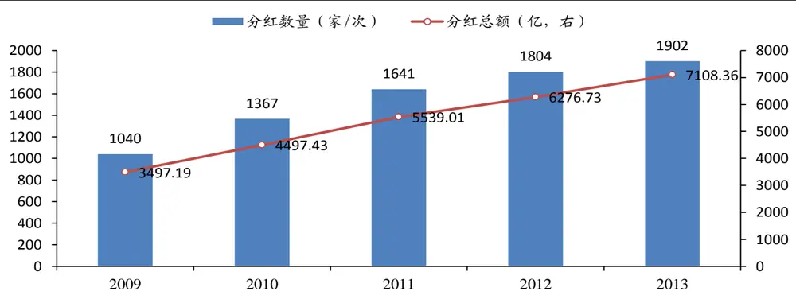
数据来源：Wind、国泰君安证券研究

图 2：2013 年报分红送转行业分布
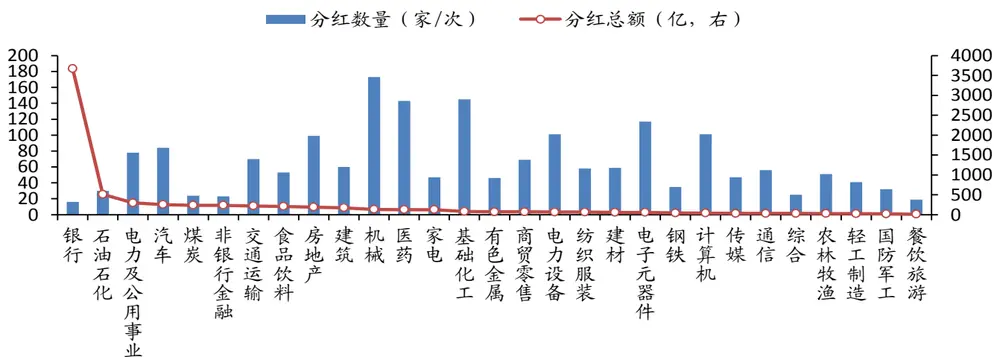
数据来源：国泰君安证券研究、Wind

## 现金分红对沪深300 指数期货影响

沪深300指数期货的标的是沪深300价格指数，成分股现金分红时，指数自然回落将对期指定价产生影响。以5 月底的沪深 300指数成分股为基准，300只成分股已全部公布 2013年度利润分配方案，277涉及现金分红，现金分红总额约为 6169.85 亿元，占市场分红总额的 86.8%。截止 2014年6 月22日，151 家已公布具体实施细节。

2014 年 6 月 3 日，中证指数公司,发布了沪深 300 指数成分股定期调整公告，沪深300指数将更换 26只股票，指数成分股调整已于 6月 16日生效，较往年有所提前。现金分红的调出成分股若在 6 月 16 日之后除权除息，将不会对沪深 300 指数产生影响，调入成分股若已在 6 月 16日之前除权除息，也将不会对沪深300指数产生影响。

表 1：沪深 300指数成分股现金分红概况

|  | 沪深300成分股(5月底) | 调入成分股 | 调出成分股 |
| --- | --- | --- | --- |
| 总数 | 300 | 26 | 26 |
| 现金分红预案 | 277 | 23 | 23 |
| 6/16 前除权除息 |  | 13 | 7 |
| 6/16后除权除息 |  | 10 | 16 |

数据来源：Wind、国泰君安证券研究

如表1所示，2014年将有271 只股票现金分红对沪深 300指数期货造成影响，截至 2014 年 6 月 29 日，160 家上市公司已完成现金分红除权除息，还有 111 家未完成，整体分红时间明显较往年偏晚。根据测算，年报现金分红对沪深 300 指数期货的剩余影响约 1.42%，主要将集中在IF1407合约存续期内。

表 2：近期已公布除权除息日期沪深 300成分股（截止 6月 29日）

| 代码 | 简称 | 最新收盘价 | 每股派息（元） | 除权除息日 |
| --- | --- | --- | --- | --- |
| 600019 | 宝钢股份 | 4.18 | 0.10 | 2014/6/30 |
| 002603 | 以岭药业 | 28.80 | 0.10 | 2014/6/30 |
| 601989 | 中国重工 | 4.80 | 0.05 | 2014/6/30 |
| 002344 | 海宁皮城 | 12.42 | 0.15 | 2014/7/1 |
| 002422 | 科伦药业 | 39.85 | 0.25 | 2014/7/1 |
| 000858 | 五粮液 | 17.84 | 0.70 | 2014/7/1 |
| 600383 | 金地集团 | 8.86 | 0.16 | 2014/7/2 |
| 000792 | 盐湖股份 | 14.95 | 0.07 | 2014/7/2 |
| 601800 | 中国交建 | 3.73 | 0.19 | 2014/7/2 |
| 601288 | 农业银行 | 2.52 | 0.18 | 2014/7/3 |
| 600497 | 驰宏锌锗 | 9.20 | 0.15 | 2014/7/4 |
| 600403 | 大有能源 | 5.28 | 0.15 | 2014/7/4 |
| 600703 | 三安光电 | 22.98 | 0.20 | 2014/7/4 |
| 002038 | 双鹭药业 | 44.12 | 0.20 | 2014/7/4 |
| 600100 | 同方股份 | 8.90 | 0.10 | 2014/7/4 |
| 000425 | 徐工机械 | 6.78 | 0.10 | 2014/7/4 |
| 601669 | 中国电建 | 2.79 | 0.14 | 2014/7/4 |
| 600252 | 中恒集团 | 11.81 | 0.20 | 2014/7/4 |
| 000961 | 中南建设 | 6.54 | 0.12 | 2014/7/4 |
| 601899 | 紫金矿业 | 2.16 | 0.08 | 2014/7/7 |

数据来源：Wind、国泰君安证券研究

## 2. 预案公告事件效应分析

本文以分红送转作为事件信号，重点研究上市公司股价对事件信号的运行规律。这种规律来自于事件信号对市场参与者投资行为的影响，往往与市场投资者结构和投资者的偏好有关，实际投资中可以加以利用。

时间维度上，分红送转相关节点主要为预案公告、股东大会决议公告、实施公告和除权除息。预案公告为分红送转相关信息首次向市场公布，其重要性不言而喻；股东大会审议是否通过，一般情况下预案被修订或否决的几率均较小；实施公告和除权除息日间隔较近，一般相距 5 至 6个交易日。本文将选取分红预案公告和实施公告为事件信号，重点关注事件效应的稳定性。

事件属性方面，分红送转相关信息主要为股利支付方式，包括现金和送转股，以及各支付方式的具体细节，即每股股利和每股送转比例。

选择2009至 2013年报相关的分红送转事件，以上市公司所在行业为基准，考察事件前后股价相对行业指数的表现，具体时间区间为事件前 20交易日至事件后 40交易日。

## 送转组预案前正向效应显著

考察分红预案事件信号效应，如图所示，分红整体样本事件效应并不明显，累计超额收益数值均较小，胜率基本在 40%至50%之间波动，值得注意的是，公告后短期内呈现微弱负效应，累计超额收益为负，胜率在40%左右。

按照股利支付形式分为现金组和送转组，两组事件信号效应有显著差异，累计超额收益和胜率上来看，市场偏好送转股票，现金组与整体样本较为类似；事件效应在公告前更加显著，公告前 20 交易日累计超额收益约为 3%，胜率在维持 60%左右，公告后虽累计超额收益为正，但其胜率较低，公告后 40交易日收益为1.83%，胜率仅在 50%左右。

图 3：2009至 2013年报分红预案前后累计超额收益情况
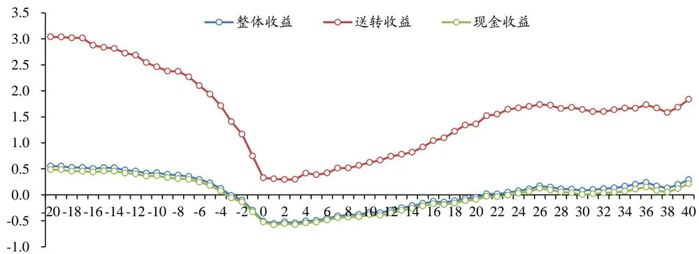
数据来源：国泰君安证券研究、Wind

图 4：2009至 2013年报分红预案前后胜率情况
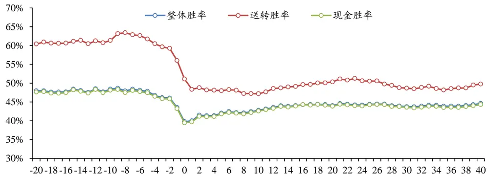
数据来源：国泰君安证券研究、Wind

## 送转比例对事件效应区分度明显

按照送转比例将样本分为三组，使得每组样本数量较为接近：组（1）送转比例为 0-0.4；组（2）送转比例为 0.4-0.8；（3）送转比例在 0.8 以上。如图所示，送转比例对预案前的事件效应有显著区分度，送转比例越高，累计超额收益大小和胜率均越高，送转比例 0.8 之上的股票，公告前20交易日累计超额收益在约为6%，胜率超过 70%。送转比例对与公告后 15 交易日内事件效应区分度不高，主要表现为各组胜率较为接近。

图 5：2009至 2013年报分红预案前后超额收益情况（按送转率分组）
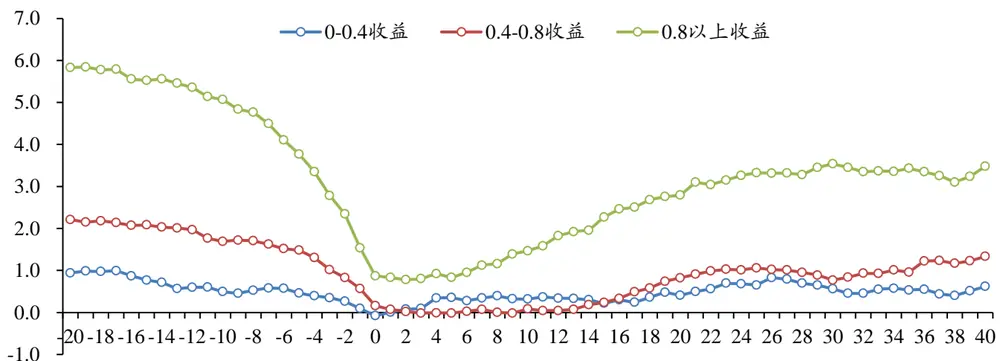
数据来源：国泰君安证券研究、Wind

图 6：2009至 2013年报分红预案前后胜率情况（按送转率分组）
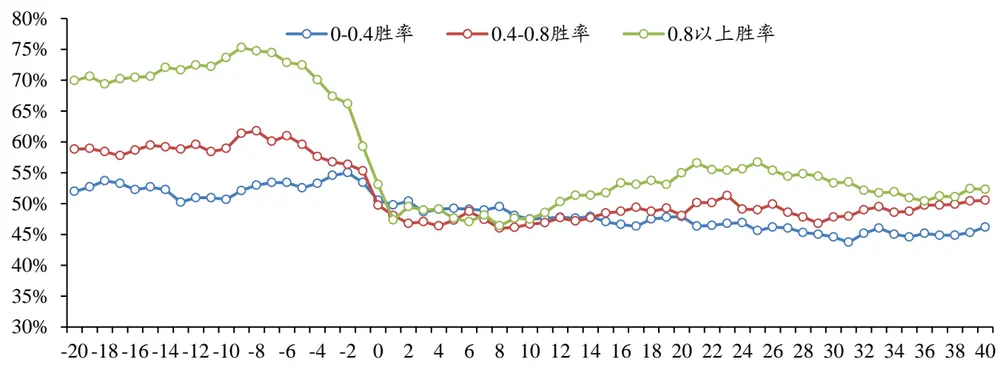
数据来源：国泰君安证券研究、Wind

## 预案前高送转效应较为稳定

选择送转比例在 0.8 以上的样本，按年度分组，如图所示，预案前事件效应较为稳定，主要表现在胜率水平均较高。09 年最为显著，公告前10交易日累计超额收益在11%左右，胜率接近90%，10至 13年较为接近，公告前10 交易日累计超额收益在 4%左右，胜率在 70%以上。预案公告后，各年累计超额收益和胜率方面差异均较大。

图 7：2009至 2013年报分红预案前后超额收益情况（送转率 0.8以上）
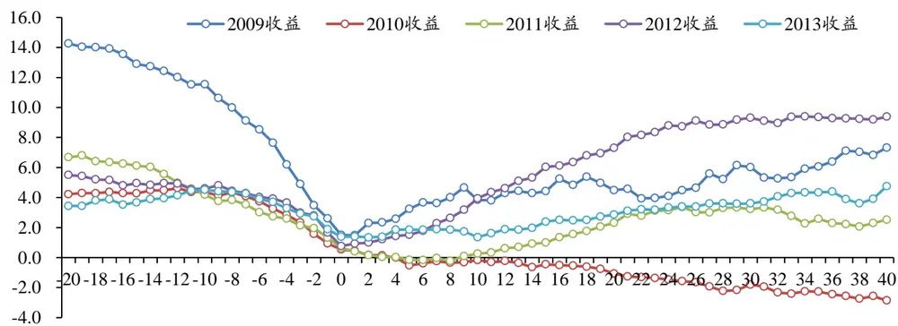
数据来源：国泰君安证券研究、Wind

图 8：2009至 2013年报分红预案前后胜率情况（送转率0.8以上）
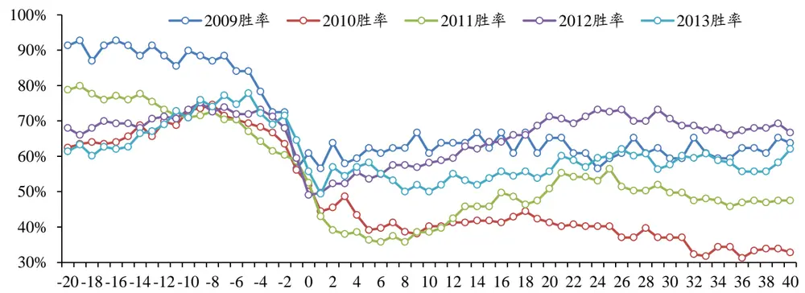
数据来源：国泰君安证券研究、Wind

## 3. 实施公告事件效应分析

## 整体事件效应不明显

考察分红实施事件效应，如图所示，整体样本事件效应并不明显。公告前累计超额收益数值均较小，维持 0.5%左右；公告后累积超额收益呈现“N”字型，短期（3 交易日）内累计超额收益递增，胜率接近 60%，公告后3 交易日收益为 1%；长期（10交易日）累积超额收益缓慢上升，胜率水平较低，40 交易日累计超额收益在 1.5%左右，胜率在 50%左右。公告后3至 7 交易日内，会出现累积超额收益和胜率齐降现象。

以股利支付形式分组，实施送转事件效应稍显著，公告前胜率均在55%以上，公告前 20 日累计超额收益在 2.5%左右，实施公告当天胜率超过70%以上，累计超额收益在 1.5%左右。公告后，送转组累积超额收益呈现明显的“N”型，胜率快速下降，10交易后稳定在 50%左右。

图 9：2009至 2012年报分红实施公告前后超额收益情况
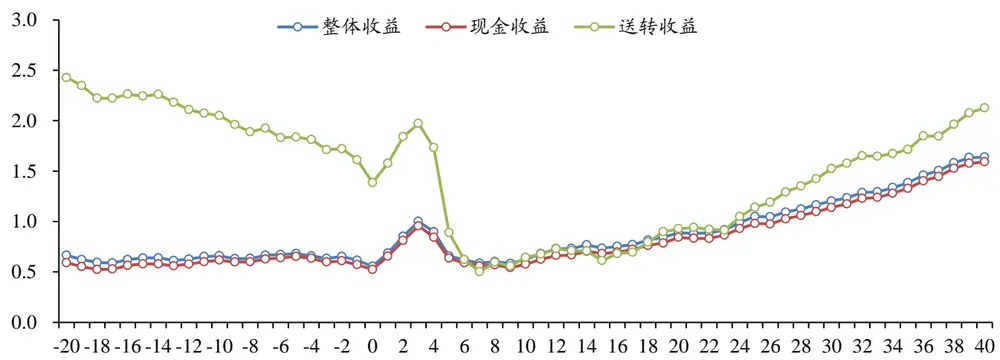
数据来源：国泰君安证券研究、Wind

图 10： 2009至 2012年报分红实施公告前后胜率情况
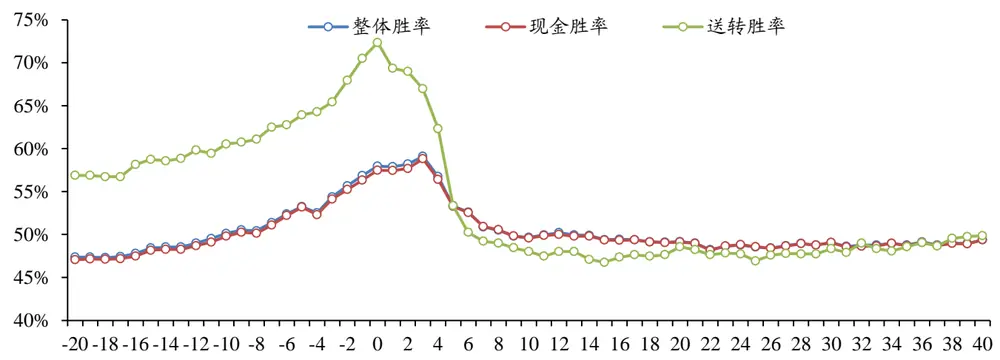
数据来源：国泰君安证券研究、Wind

## 高送转实施公告前正向效应明显

按送转比例将样本分为三组，如图所示，送转比例对实施公告前事件效应区分度显著。送转比例越高，累计超额收益和胜率均越高，送转比例在 0.8 以上的样本，公告前 20 交易日平均超额收益约为 4%，胜率基本均在65%以上。送转比例对实施公告后事件效应区分度不明显，主要表现在各组的累计超额收益胜率较为接近，无明显单调关系。各组公告后3至7交易日内齐降现象均较明显。

图 11：2009至 2012年报分红实施公告前后超额收益情况（按送转率分组）
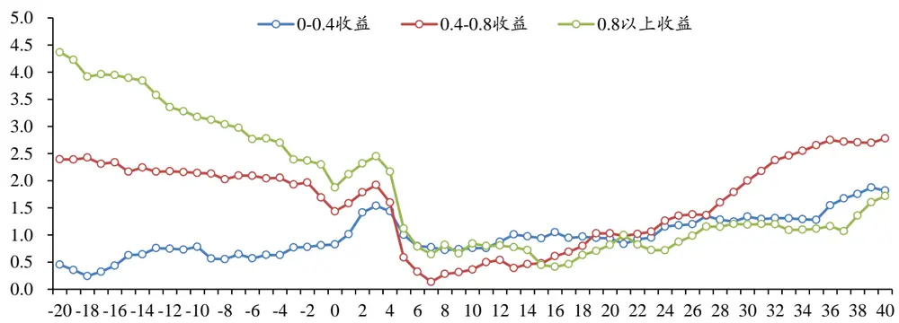
数据来源：国泰君安证券研究、Wind

图 12：2009至 2012年报分红实施公告前后胜率情况（按送转率分组）
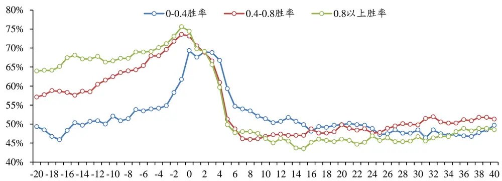
数据来源：国泰君安证券研究、Wind

## 各年度实施公告效应较为相似

选择送转比例在 0.8 以上的样本，按年度分组，如图所示，实施公告前各年度事件效应较为相似，公告前20交易日至前10 交易日略有差异，累积超额收益分化，实施公告前 10 交易日，胜率在均在 60%以上，除10年之外均在70%。实施公告后胜率均呈现先下降后企稳的状态，长期胜率水平基本均在 45%至 55%之间，累计超额收益基本均呈现“N”字型，但数值上有分化。

图 13：2009至 2012年报分红实施公告前后超额收益情况（送转率 0.8以上）
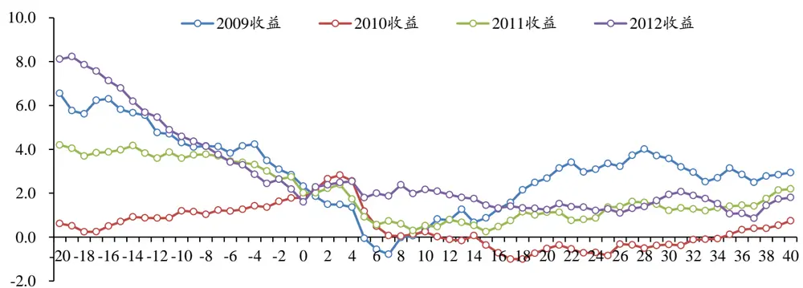
数据来源：国泰君安证券研究、Wind

图 14：2009至 2012年报分红实施公告前后胜率情况（送转率 0.8以上）
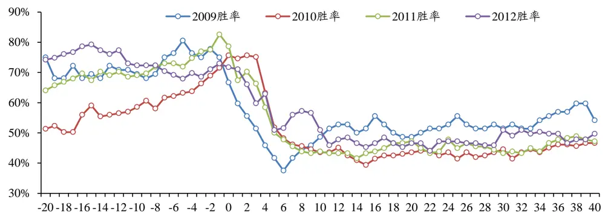
数据来源：国泰君安证券研究、Wind

## 4. 后续研究内容

前文中主要分析了分红送转相关事件效应，选取分红预案公告和实施公告作为信号节点，主要结论有：

（1） 送转比例0.8 以上分红预案前事件正向效应持续显著，公告前10交易内相对行业胜率超过70%；

（2） 送转比例 0.8 以上实施公告前事件正向效应显著，公告前 20 交易内相对行业胜率超过 65%；

（3） 实施公告后 3 至 7 交易日内累计超额收益和胜率同步下降。

不难发现，分红送转显著的事件效应主要体现在高送转股票上和事件公告前，在实际投资中加以利用存在两方面的不确定性：（1）公告时间的不确定性；（2）高送转股票标的的不确定性。后续将重点通过模型解决以上两个不确定性问题，利用分红送转效应构造事件组合。

事实上，分红实施流程中预案公告和实施公告有明显日历具体效应。预案公告主要集中在 3、4 月份，实施公告主要集中在 3 月至 6 月。高送转股票也往往呈现“三高一低”的特性，具体为高累积、高业绩、高股价和低股本。高累积是高送转的基础，送股和转增股本分别是将资金从“未分配利润”和“资本公积”科目转入“股本”科目，“高送转”与资本公积和未分配利润有紧密联系；高业绩是高送转的先决条件，较高的每股收益和较快的业绩增速为上市公司高送转提供了保障，高送转将会摊薄财务指标，高业绩的上市公司才更愿意实施“高送转”政策；价格较高的股票流动性相对较差，上市公司愿意利用高送转来摊低股价，激活股性；低股本的上市公司对于股本扩张的欲求，也是 “高送转”的一个重要原因。

图 15：高送转预案公告和实施公告日历分布（2009至 2012）
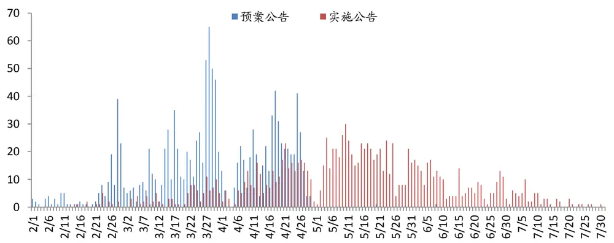
数据来源：国泰君安证券研究、Wind

## 本公司具有中国证监会核准的证券投资咨询业务资格

## 分析师声明

作者具有中国证券业协会授予的证券投资咨询执业资格或相当的专业胜任能力，保证报告所采用的数据均来自合规渠道，分析逻辑基于作者的职业理解，本报告清晰准确地反映了作者的研究观点，力求独立、客观和公正，结论不受任何第三方的授意或影响，特此声明。

## 免责声明

本报告仅供国泰君安证券股份有限公司（以下简称“本公司”）的客户使用。本公司不会因接收人收到本报告而视其为本公司的当然客户。本报告仅在相关法律许可的情况下发放，并仅为提供信息而发放，概不构成任何广告。

本报告的信息来源于已公开的资料，本公司对该等信息的准确性、完整性或可靠性不作任何保证。本报告所载的资料、意见及推测仅反映本公司于发布本报告当日的判断，本报告所指的证券或投资标的的价格、价值及投资收入可升可跌。过往表现不应作为日后的表现依据。在不同时期，本公司可发出与本报告所载资料、意见及推测不一致的报告。本公司不保证本报告所含信息保持在最新状态。同时，本公司对本报告所含信息可在不发出通知的情形下做出修改，投资者应当自行关注相应的更新或修改。

本报告中所指的投资及服务可能不适合个别客户，不构成客户私人咨询建议。在任何情况下，本报告中的信息或所表述的意见均不构成对任何人的投资建议。在任何情况下，本公司、本公司员工或者关联机构不承诺投资者一定获利，不与投资者分享投资收益，也不对任何人因使用本报告中的任何内容所引致的任何损失负任何责任。投资者务必注意，其据此做出的任何投资决策与本公司、本公司员工或者关联机构无关。

本公司利用信息隔离墙控制内部一个或多个领域、部门或关联机构之间的信息流动。因此，投资者应注意，在法律许可的情况下，本公司及其所属关联机构可能会持有报告中提到的公司所发行的证券或期权并进行证券或期权交易，也可能为这些公司提供或者争取提供投资银行、财务顾问或者金融产品等相关服务。在法律许可的情况下，本公司的员工可能担任本报告所提到的公司的董事。

市场有风险，投资需谨慎。投资者不应将本报告为作出投资决策的惟一参考因素，亦不应认为本报告可以取代自己的判断。在决定投资前，如有需要，投资者务必向专业人士咨询并谨慎决策。

本报告版权仅为本公司所有，未经书面许可，任何机构和个人不得以任何形式翻版、复制、发表或引用。如征得本公司同意进行引用、刊发的，需在允许的范围内使用，并注明出处为“国泰君安证券研究”，且不得对本报告进行任何有悖原意的引用、删节和修改。

若本公司以外的其他机构（以下简称“该机构”）发送本报告，则由该机构独自为此发送行为负责。通过此途径获得本报告的投资者应自行联系该机构以要求获悉更详细信息或进而交易本报告中提及的证券。本报告不构成本公司向该机构之客户提供的投资建议，本公司、本公司员工或者关联机构亦不为该机构之客户因使用本报告或报告所载内容引起的任何损失承担任何责任。

## 评级说明

## 1.投资建议的比较标准

投资评级分为股票评级和行业评级。

以报告发布后的12个月内的市场表现为比较标准，报告发布日后的 12个月内的公司股价（或行业指数）的涨跌幅相对同期的沪深 300 指数涨跌幅为基准。

## 2.投资建议的评级标准

报告发布日后的 12 个月内的公司股价（或行业指数）的涨跌幅相对同期的沪深 300 指数的涨跌幅。

| 评级 | 说明 |  |
| --- | --- | --- |
| 股票投资评级 | 增持 | 相对沪深 300指数涨幅15%以上 |
|  | 谨慎增持 | 相对沪深300指数涨幅介于5%～15%之间 |
|  | 中性 | 相对沪深300指数涨幅介于-5%～5% |
|  | 减持 | 相对沪深300指数下跌5%以上 |
| 行业投资评级 | 增持 | 明显强于沪深300 指数 |
|  | 中性 | 基本与沪深300指数持平 |
|  | 减持 | 明显弱于沪深300指数 |

## 国泰君安证券研究

|  | 上海 | 深圳 | 北京 |
| --- | --- | --- | --- |
| 地址 | 上海市浦东新区银城中路168号上海 银行大厦29层 | 深圳市福田区益田路 6009 号新世界 商务中心34层 | 北京市西城区金融大街 28 号盈泰中 心2号楼10层 |
| 邮编 | 200120 | 518026 | 100140 |
| 电话 | (021)38676666 | (0755)23976888 | (010)59312799 |
|  | E-mail: gtjaresearch@gtjas.com |  |  |