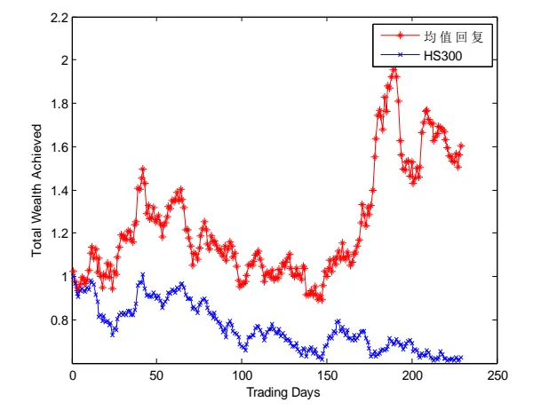
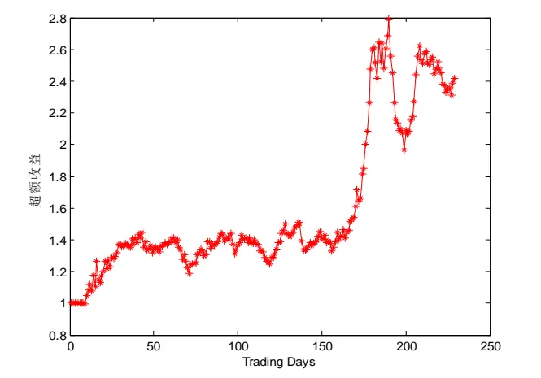
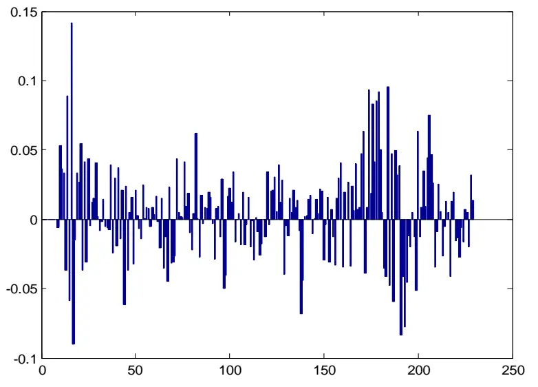
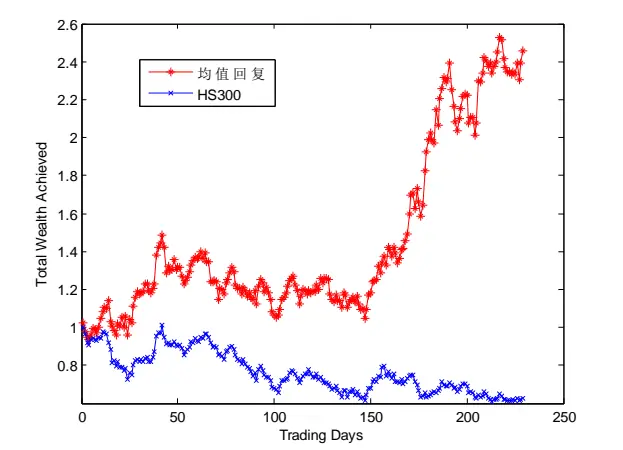
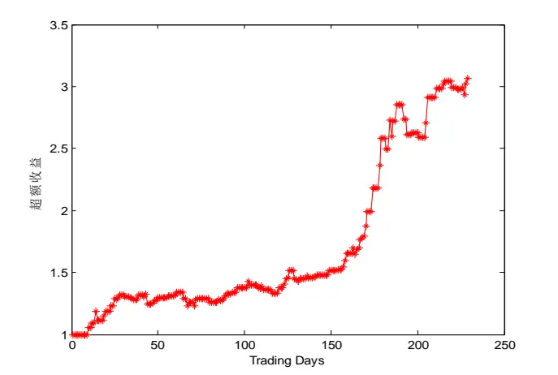
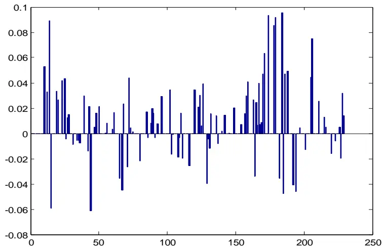
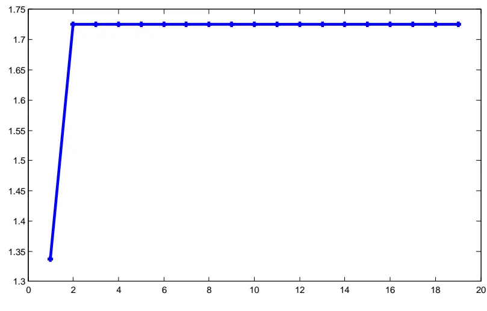

2014.07.08

# 基于均值回复的行业配臵策略

# ——数量化专题之四十六

刘富兵（分析师）

8 021-38676673

liufubing008481@gtjas.com

## 证书编号 S0880511010017

本报告导读：我们详细阐述了均值回复思想，并构建了均值回复策略。过去近 5年的时间里基于均值回复的行业配臵策略取得了 200%的收益，年化收益近 30%，胜率 67%，最大回撤 9%，夏普比率 1.6。

## 超额摘要：

[Table_Summary] • 均值回复是一种被广泛应用的方法，其核心思想是买入过去表现差的股票，卖出过去表现好的股票。本文主要考虑如何将均值回复思想用在行业配臵上。

- 构建均值回复策略有两个核心问题需要解决：1、如何构建目标函数；2、如何对未来价格进行预测。

- 关于目标函数，我们采用的是对数效用函数，经过泰勒展开后，其近似等价于权重调整幅度最小化，从而能有效降低换手率。

- 关于对未来价格的预测，为了规避噪音以及异常值的影响，我们采用中位数法来预测下一期的价格。

- 我们将均值回复策略用在行业配臵上，在过去近5年的时间里，均值回复策略明显跑赢了沪深 300，对冲后的累积收益142%，年化超额收益 22%；不过该策略的胜率只有 57%，回撤高达 29%，稳定性较差。

- 我们认为均值回复策略不稳定的重要原因在于市场并非总是均值回复的。如果能够在做配臵之前先判断市场是否具有均值回复特性，策略效果或许能有明显改善。

基于这样的想法，我们引用技术分析中的思想，利用移动平均线的方法来进行均值回复的判断：当某一期超过一定比例的行业的3期相对价格的移动平均线与6期相对价格的移动平均线发生交叉时，我们认为市场存在均值回复。

- 将修正后的均值回复策略再次用于行业配臵，效果有了明显改善：近 5 年时间，策略取得了 200%的收益，年化收益近30%，胜率67%，最大回撤9%，夏普比率 1.6。

- 事实上，关于均值回复的三个核心问题：构建目标函数、预测未来价格以及检验均值回复的存在性，我完全解决，我们只是尝试着寻找一种合理的方式构建投资策略，更深入有效的均值回复策略有待于我们后续进一步研究。

## 金融工程团队：

刘富兵：（分析师）

电话：021-38676673

邮箱：liufubing008481@gtjas.com

证书编号：S0880511010017

## 严佳炜：（分析师）

电话：021-38674812

邮箱：yanjiawei008776@gtjas.com

证书编号：S0880512110001

## 耿帅军：（分析师）

电话：010-59312753

邮箱：gengshuaijun@gtjas.com

证书编号：S0880513080013

## 徐康：（分析师）

电话：021-38674939邮箱：xukang010849@gtjas.com证书编号：S0880513080018

## 赵延鸿：（研究助理）

电话：021-38674927邮箱：zhaoyanhong@gtjas.com证书编号：S0880113070047

## 陈睿：（研究助理）

电话：021-38675861

邮箱：chenrui012896@gtjas.com

证书编号：S0880112120012

## 刘正捷：（研究助理）

电话：0755-23976803

邮箱：liuzhengjie012509@gtjas.com

证书编号：S0880112080087

## [Table_R相关报告

《分红送转事件探究》2014.06.30

《随机最优控制下的 AH 股配对交易策略》2014.06.03

《量化择时之由连续到离散》2014.05.22

《深度解析业绩预告事件》2014.05.22

《寻找牛、熊股基本特征》2014.05.19

## 1. 均值回复思想概述

在现实生活中，动量策略是一种比较流行的交易策略，它假设历史上表现出色的股票在未来的表现也会很好。之前我们研究过的相似匹配策略、Kelly 策略等都属于典型的动量策略。

除了动量策略以外，均值回复也是一种被广泛应用的方法。均值回复思想起源于 CRP(Constant Rebalanced Portfolios)策略，也就是说，在每个交易日都要把证券组合调整至初始权重。这种方法的隐含思想就是，过去表现差的股票，相对于其他股票而言，在未来会表现得比较好。因此，它鼓励买入过去表现差的股票，卖出过去表现好的股票。

下面举一个简单的例子来说明均值回复的思想（见表 1）。

表 1: 均值回复思想示意表

| 交易时期 | (A,B)相对价格 | CRP策略 | CRP收益 | (A,B)价值比例 | 注解 |
| --- | --- | --- | --- | --- | --- |
| 1 | $({\frac{1}{2}},2)$ | $(\frac{1}{2},\frac{1}{2})$ | 5 | $({\frac{1}{5}},{\frac{4}{5}})$ | $BA$ |
|  |  |  | 4 |  |  |
| 2 | $(2,{\frac{1}{2}})$ | $(\frac{1}{2},\frac{1}{2})$ | 5 | $(\frac{4}{5},\frac{1}{5})$ | A → B |
|  |  |  | 4 |  |  |
| 3 | $({\frac{1}{2}},2)$ | $(\frac{1}{2},\frac{1}{2})$ | 51 |  | B → A |
|  |  |  | 4 | $({\frac{1}{5}},{\frac{4}{5}})$ |  |
| … | : | … | : | . | … |

数据来源：国泰君安证券研究

假设市场上有 A、B两只股票，它们的相对价格为 $({\frac{1}{2}},2),\ (2,{\frac{1}{2}})^{\dots}$ 。显然，从长期来看，买入并持有的市场策略不可能取得任何收益，因为每只股票的累积收益在经过 2n 个时期后保持不变。然而，权重为（1/2,1/2）的 CRP策略在n 个时期内却能有 $({\frac{5}{4}})^{n}$ 倍的收益。

我们可以基于这两只股票的相对价格序列，分析 CRP策略，从而来说明均值回复的思想。假设初始证券组合权重为 $(\frac{1}{2},\frac{1}{2})$ ，在第一个交易日结束后，证券组合取得了 $\frac{5}{4}$ 倍的增长，并且组合权重变为 $(\frac{1}{5},\frac{4}{5})$ 。在第二个交易日开始的时候，重新调整组合权重至初始组合权重 $(\frac{1}{2},\frac{1}{2})$ ，这也就相当于把财富从上期表现出色的股票(B)转移到了表现比较差的股票(A)。然后，在第三个交易日的开始时候，重复上述过程，并一直持续下去。尽管买入并持有的市场策略没有任何收益，CRP策略却通过采用均值回复的思想，在每个交易时期都能够取得 $\frac{5}{4}$ 倍的增长。

事实上，在均值回复的环境下，常再平衡策略未必是最优策略，若能做些适当的调整，或许能取得更好的收益，常再平衡策略我们称之为消极的均值回复策略，适时调整权重的，我们称之为积极的均值回复策略。

举一个积极策略的例子：如果证券组合当天的收益低于某个临界值，我们将会保持之前采用的证券组合权重而不去改变。其次，如果证券组合当天的收益高于临界值，我们会重新调整证券组合权重，使得组合收益低于临界值。由于股价具有均值回复特性，那么选择预期收益低于临界值的证券组合，在未来会获得更高的组合收益。我们仍以前面的例子来说明这一点：

假设选取的临界值为 1，即当证券组合当天的收益小于 1 时，我们不作任何调整。策略的初始组合权重定为 $(\frac{1}{2},\frac{1}{2})$ 。在第一个交易日，证券组合收益为 $\frac{5}{4}>1$ 。因此，在第二个交易日的开始阶段，重新调整证券组合权重，使得基于上一时期相对价格的预期组合收益低于临界值 1，得到的结果为 $({\frac{2}{3}},{\frac{1}{3}})$ 。由此可得，第二个交易日的组合收益为 $\frac{3}{2}>1$ 。此后遵循同样的原理，重新调整组合权重至 $({\frac{1}{3}},{\frac{2}{3}})$ ，如此一直继续下去。显然上述策略比 $(\frac{1}{2},\frac{1}{2})$ )显得更为积极。表 2从权重分配、组合收益等方面比较了这两种策略。经过 n个投资时期，CRP策略取得了 $({\frac{5}{4}})^{n}$ 倍的收益，与此同时，积极策略取得了 $\frac{5}{4}\times(\frac{3}{2})^{n-1}$ 倍的收益，从而显示出了积极策略的优越性。

表 2: 消极策略与积极策略的比较

| 交易日期 | (A,B)相对价格 | CRP策略 |  | CRP 收益 | 积极策略 |  | 积极策略收益 | 注解 |  |
| --- | --- | --- | --- | --- | --- | --- | --- | --- | --- |
| 1 |  |  |  | 5 |  | $(\frac{1}{2},\frac{1}{2})$ | 5 |  | $\cdot\frac{2}{3},\frac{1}{3})$ |
|  | $({\frac{1}{2}},2)$ |  | $(\frac{1}{2},\frac{1}{2})$ | 4 |  |  |  | 4 | 调整至 |
| 2 |  |  |  | 5 |  |  | 3 |  |  |
|  | $(2,{\frac{1}{2}})$ |  | $(\frac{1}{2},\frac{1}{2})$ |  |  | $({\frac{2}{3}},{\frac{1}{3}})$ |  |  | $({\frac{1}{3}},{\frac{2}{3}})$ 调整至 |
| 3 |  |  |  | 4 |  |  | 2 3 |  |  |
|  | $({\frac{1}{2}},2)$ |  | $(\frac{1}{2},\frac{1}{2})$ | 5 |  |  |  |  | $\cdot\frac{2}{3},\frac{1}{3})$ 调整至 |
| 4 |  |  |  | 4 |  | $({\frac{1}{3}},{\frac{2}{3}})$ | 2 |  |  |
|  |  |  | $(\frac{1}{2},\frac{1}{2})$ | 5 |  |  |  |  | 调整至 |
| … | $(2,{\frac{1}{2}})$ |  |  | 4 |  | $({\frac{2}{3}},{\frac{1}{3}})$ | 3 2 |  | $({\frac{1}{3}},{\frac{2}{3}})$ |
|  | … |  | … | … |  |  |  |  | … |

数据来源：国泰君安证券研究

## 2. 均值回复策略模型构建

本节我们将利用上述的均值回复思想构建投资组合。

假设在t 时期投资于金融市场各证券的权重以向量 $\boldsymbol{b}_{{t}}=(\boldsymbol{\mathsf{b}}_{{t}1},\boldsymbol{\mathsf{b}}_{{t}2},...,\boldsymbol{\mathsf{b}}_{{tm}})$ 表示。证券不允许卖空，因此每个证券权重均为非负的，并且权重加和为 1。也就是说， $b_{\scriptscriptstyle t}\in\Delta_{\scriptscriptstyle m}$ ，这里 ${\boldsymbol\Delta}_{\mathrm{\Omega\Sigma\Sigma}}=\{{\bf b}:{\bf b}\in{\bf R\Sigma}_{+}^{m},\sum_{i=1}^{m}b_{i}=1\}$ 。从而证券组合策略可以表示为如下的映射： $b_{1}=(\frac{1}{m},...,\frac{1}{m})\ ,b_{{\scriptscriptstyle t}}:{\bf R}_{+}^{{\scriptscriptstyle m}({\scriptscriptstyle t}-1)}\ \to\ \Delta_{{\scriptscriptstyle m}}$ $t=2,3,\ldots$ ，这里 $\boldsymbol{b}_{{t}}=\boldsymbol{b}_{{t}}(\boldsymbol{x}_{{1}},\boldsymbol{x}_{{2}},...,\boldsymbol{x}_{{t}-{1}})$ 代表t 时期分配给证券组合的权重，并且 $\boldsymbol{b}_{{t}}^{{}},\boldsymbol{\Sigma}^{{}}$ 与前t •1个时期的证券相对价格向量 $x_{1},x_{2},...,x_{t-}$ 有关。

在 t 时 期 ， 证 券 配 臵 权 重 为 $b_{_t}$ ， 则 此 时 证 券 组 合 收 益 就 以$s_{{\scriptscriptstyle t}}=b_{{\scriptscriptstyle t}}^{T}x_{{\scriptscriptstyle t}}=\sum_{i=1}^{m}b_{{\scriptscriptstyle t}i}x_{{\scriptscriptstyle t}i}$ 的幅度增长，经过n 个时期后，证券组合的累积收益变为

$$
{\boldsymbol{S}}_{_n}={\boldsymbol{S}}_{0}\prod_{t=1}^{n}{\boldsymbol{s}}_{t}={\boldsymbol{S}}_{0}\prod_{t=1}^{n}{\boldsymbol{b}}_{t}^{T}{\boldsymbol{x}}_{t}\ ,
$$

其中 $S_{\mathrm{\Omega_{0}}}$ 代表初始投资，为了方便，我们一般假设初始投资为 1。

关于目标函数，包括 Kelly 策略在内的很多策略，都曾经提出使用对数效用函数lo g (b )• x 来评估策略的收益状况。然而，对数效用函数是非线性函数，非凸性的，因而很难去求解。解决非凸问题的方法有多种，其中一条途径就是使用对数函数的一阶 Taylor 展开式，即：

$$
\log{({\bf b}\cdot x_{_t})}\approx\log{({\bf b}_{_t}\cdot x_{_t})}+\frac{x_{_t}}{{\bf b}_{_t}\cdot x_{_t}}({\bf b}-{\bf b}_{_t})_{\mathrm{~}\circ}
$$

均值回复策略是希望使得证券组合基于上一时期相对价格的预期收益要尽可能小，从而下一时期的组合收益尽可能较高。从上述线性形式看出，也就是使得b 与 $b_{_t}$ 的偏差最小。这里，定义b 与 $b_{_t}$ 的距离为$d\left(b,b_{_t}\right)=,\frac{1}{2}\Big\|b-b\Big\rangle\Big\|^{2}$ 。因此均值回复策略近似等同于使得 $\boldsymbol{d}(\boldsymbol{b},\boldsymbol{b}_{t})$ 达到最小。此外，该目标函数也进一步降低了策略的换手率。

因此，对于积极的均值回复策略，我们可以进行如下建模：

$$
b_{_{t+1}}=\arg\operatorname*{min}\frac{1}{2}\Big\|b-b_{_t}\Big\|^{2}
$$

$$
\quad\mathrm{s.t.}\qquad b\in\Delta_{\ b{m}},\quad\ b{b}\cdot\hat{\ b{x}}_{t+1}\geq\varepsilon
$$

这里 $\hat{x}_{t+1}$ 是第t •1时期相对价格向量的预测值。 为未知参数，其取值一般大于 1。 $b\cdot\hat{x}_{_{t+1}}\geq\varepsilon$ 表示使得下一时期预测的组合收益值尽可能大，这实际上为该策略加入了双重保障。

直接求解上述二次规划最优化问题得出的b 值中，会存在取值为负数的元素，即存在i ，使得 $b_{ti}<0$ 。因此，我们需要做一个简单的映射，使得 $b\in\Delta_{{\scriptscriptstyle m}}$ 。简单介绍一下所做映射的思想。给定求解最优化问题的 $b_{_t}$ 值，要得到相应的 $\tilde{b}_{{}_{t}}$ ，使得

$$
\tilde{b_{\scriptscriptstyle t}}=\mathrm{arg}\operatorname*{min}\frac{1}{2}\Big\|b-b_{\scriptscriptstyle t}\Big\|^{2}\mathrm{s.t.}b\in\Delta_{\scriptscriptstyle m}
$$

具体的映射算法见表 2：

## 表 3:映射算法的具体步骤

（1）给定向量 $b_{\mathbf{\alpha}_{t}}\in\textbf{ \em R }^{m}$ ，以降序重新排列 $b_{_t}$ ，得到向量 $\boldsymbol{\mu}_{\scriptscriptstyle t}$ ：$\mu_{{\scriptscriptstyle t}1}\ge\mu_{{\scriptscriptstyle t}2}\ge\dots\ge\mu_{{\scriptscriptstyle tm}}$ ；

（2）找到 $\rho$ ，使得 $\rho=\mathrm{m}\mathrm{ax}\{1\leq\ j\leq\mathrm{n}:\mu_{\ j}-\frac{1}{j}(\sum_{r=1}^{j}\mu_{\ r}-1)>0\}$ ；

（3）定义 $\theta={\frac{1}{\rho}}(\sum_{r=1}^{\rho}\mu_{r}-1)$ ；

（4）得到 $\tilde{b}_{_t},\ \mathbf{s.t.}\tilde{b}_{_ti}=\mathrm{m}\arg{\left\{{b}_{_{ti}}-\theta,0\right\}}\ ,1\leq i\leq m$

数据来源：国泰君安证券研究

## 3. 均值回复下的证券价格预测

在上述优化问题中，还有一个关键问题需要解决，即在均值回复的情况下如何预测下一期的价格。

一种方法是认为下期走势与上期呈倒数关系。假设证券在t 时刻的价格为 $\boldsymbol{p}_{\ u{t}}$ ，对 $t+1$ 时刻价格的预测为 $\hat{\boldsymbol p}_{t+1}$ ，则令 $\hat{x}_{t+1}=\frac{1}{x_{t}}$ ，这里 $x_{t}$ 代表证

券在t 时刻的相对价格， $\hat{x}_{t+1}$ 代表对t •1 时刻相对价格的预测值，即tp 1ˆ tp •
tx •1ˆ tx •1tp •tp

由此可以推出，

$$
\hat{x}_{{t+1}}=\frac{1}{x_{{t}}}\Rightarrow\frac{\hat{p}_{{t+1}}}{p_{{t}}}=\frac{p_{{t}-1}}{p_{{t}}}\Rightarrow\hat{p}_{{t+1}}=p_{{t}-1}\circ
$$

还有一种策略是利用滑动移动平均的思想进行预测，即

$$
\hat{\boldsymbol p}_{{t+1}}=M\boldsymbol A_{t}(\omega)=\frac{1}{\omega}\sum_{i=t-\omega+1}^{t}\boldsymbol p_{i}
$$

这里 为所选取的时间跨度。

然而，这些策略并没有完全考虑噪 $\lneqq$ 数据以及异常值带来的影响，这会导致预测的误差。为了解决上述问题，我们使用了 $L_{\mathrm{1}}$ -中值的思想来预测证券下一时期的价格。假设市场有m 种证券，证券在n 个交易时期内价格的变化以相对价格向量以 $x_{1},x_{2},...,x_{n}\in R_{+}^{m}$ 来表示。第t 个向量的第i 个元素 $x_{\scriptscriptstyle ti}$ 表示在第t个时期第i 个证券的相对价格，因此在第i 个证券的投资在t时期是以 $x_{_{ti}}$ 的幅度增长的。

假设已知前t个时期的相对价格向量 $x_{1},x_{2},...,x_{t}$ ，为了预测下一时期的相对价格向量 $\hat{x}_{t+1}$ ，我们构造了如下的 $L_{\mathrm{1}}$ -中值问题：

$$
\mu={\underset{\mu}{\operatorname{argmin}}}\sum_{i=0}^{k-1}\left\|x_{{t-i}}-\mu\right\|
$$

这里， $\left..\right.$ 表示向量之间的欧氏距离。简单地说， $L_{\mathrm{1}}$ -中值方法就是使得预 测 值 与 前 k 个 相 对 价 格 向 量 之 间 的 距 离 最 小 。该方法类似于利用中位数作为下期价格的预测。

我们可以举例说明该类方法的优越性：

假定分别有三个价格序列 A、B、C，，其中 A 经过 1 期后均值回复，B经过 2 期后均值回复，而 C 经过 3 期后均值回复。A 原本的序列为 1，2，1，2，1，2……，B原本的序列为 1，2，4，2，1，C原本的序列为 1，2，4，8，4，2，1，……。但由于市场噪音的原因，A、B、C真正表现出来的价格序列可能是：

A 1，2 ，(10)，2

B 1，2，(10)，2

C 1，2，4，8，（10），2

由表 4 可以看出，中位数方法预测的效果相对更为精确，也更稳定些。三种策略预测的价格结果如下：

表 4:三种策略预测效果比较

| 价格序列 |  | 真实值 | 倒数预测 | 均值预测 | 中位数预测 |
| --- | --- | --- | --- | --- | --- |
| A0 | 1, 2, 1, 2, ? | 1 | 1 | 1.5 | 1.5 |
| A1 | 1, 2, (10), 2, ? | 1 | 10 | 3.75 | 2 |
| B0 | 1, 2,4, 2,? | 1 | 4 | 2.25 | 2 |
| B1 | 1,2,(10)， 2,? | 1 | 10 | 3.75 | 2 |
| CO | 1, 2, 4, 8, 4, 2, ? | 1 | 4 | 3.5 | 3 |
| C1 | 1, 2,4, 8, (10), 2,? | 1 | 10 | 4.5 | 3 |

数据来源：国泰君安证券研究

## 4. 基于均值回复的行业配臵策略

本节，我们将上述构建的均值回复模型应用在 A股的行业配臵上，选取的数据是从 2010 年 1 月至 2014 年 6 月的中信一级行业周数据，共 229期数据，基准是 HS300。

## 4.1. 不考虑均值回复的存在性

首先我们按照整个 A股市场环境服从均值回复的假定来做行业配臵，具体结果如下面的图表所示：

图 1 均值回复策略与 HS300指数累积收益比较

数据来源：国泰君安证券研究，wind

图 2均值回复策略超额收益走势图

数据来源：国泰君安证券研究，wind

由图 1-2 可以看出，在过去近 5 年的时间里，均值回复策略明显跑赢了沪深 300，对冲后的累积收益 142%，年化超额收益 22%，表明在 A 股市场该策略是有效的。不过从图 3与表 5 来看，该策略的胜率不高，只有 57%，回撤高达 29%，说明该策略的稳定性较差。

图 3均值回复策略相对于 HS300的超额收益

数据来源：国泰君安证券研究，wind

表 5：均值回复策略与 HS300指数对冲结果统计

| 统计指标 | 数值 |
| --- | --- |
| 财富终值 | 2.42 |
| 交易胜率 | 57.92% |
| 年化收益率 | 22.22% |
| 年化波动率 | 23.47% |
| 夏普比率 | 0.82 |
| 最大回撤 | 29.51% |

数据来源：国泰君安证券研究，wind

## 4.2. 考虑均值回复的存在性

由前述分析可以看到，虽然均值回复策略在 A股市场有效，但波动与回撤太大，稳定性较差。我们认为这可能与市场并非总是均值回复有关：当市场不具有均值回复特性时，我们却采用均值回复策略，后果可想而知，无疑会产生很大的回撤。如果能够在做配臵之前先判断市场是否具有均值回复特性，若存在则采用均值回复策略，反之则基准配臵，这样的策略效果或许会好很多。

基于这样的想法，对于均值回复我们引用技术分析中的思想，利用简单移动平均线的方法来进行均值回复的判断：若短期均线与长期均线发生了交叉，则认定该行业发生了均值回复。移动平均线的时间跨度不能取的太短，否则效果不明显；时间跨度也不能取的太长，太长之前的信息可能对当期值没有影响。有基于此，我们采用3期相对价格的移动平均线与6期相对价格的移动平均线的交叉关系作为是否发生均值回复的条件。

有了判断行业发生均值回复的条件后，判断市场发生均值回复的条件便水到渠成了：当某一时期超过一定比例的行业的 3期相对价格的移动平均线与 6期相对价格的移动平均线发生交叉，那么我们判断市场存在均值回复现象。本文我们以 30%作为阀值进行判断。

由图 4-6 以及表 6 可以发现，加入均值回复判断后，尽管交易次数减少了一半以上（229次降低到 101次），但年化收益提升至 29%，最大回撤降低到 9.23%，有效胜率也提高到 67%，夏普比率 1.64。各种指标表明，加入均值回复的判断后，均值回复策略有了明显改善。

图 4 均值回复策略与 HS300指数累积收益比较

数据来源：国泰君安证券研究，wind

图 5均值回复策略超额收益走势图

数据来源：国泰君安证券研究，wind

图 6均值回复策略相对于 HS300的超额收益

数据来源：国泰君安证券研究，wind

表 6：均值回复策略与 HS300指数对冲结果统计

| 统计指标 | 数值 |
| --- | --- |
| 财富终值 | 3.07 |
| 交易胜率 | 67.33% |
| 年化收益率 | 28.97% |
| 年化波动率 | 15.85% |
| 夏普比率 | 1.64 |

| 最大回撤 9.23% |
| --- |

数据来源：国泰君安证券研究，wind

## 4.3. 参数敏感性检验

均值回复策略中有一个非常关键的参数，即最优化控制问题中的 。当越小时， $b\cdot\hat{x}_{t+1}\geq\varepsilon$ 的条件便越容易满足，此时均值回复策略便越接近于 CRP 策略。当 的值越大时， $b\cdot\hat{x}_{_{t+1}}\geq\varepsilon$ 使得分配给 $\hat{x}_{t+1}$ 中表现好的行业越高的权重。此时，下一时期取得的收益也会越高。

基于策略的累积收益，我们检验了系数 的敏感性。图 7 显示了 取值在[0,10]的范围内，策略累积收益的变化情况。可以看出，在 • 2 时，策略的累积收益是逐步上升的，；当 • 2 时，策略收益基本趋于平稳。我们可以取 • 5 ，此时累积收益是稳定的。

图 7 敏感参数 的有效性检验

数据来源：国泰君安证券研究，wind

## 4.4. 均值回复判断的有效性检验

上述研究表明，加入均值回复的判断后，均值回复策略有了明显改善，这从侧面佐证了我们判断均值回复的有效性。

除此之外，还有一种检验均值回复判断是否有效的标准：当判断标准越来越严格时，均值回复策略的有效胜率在提高，回撤在降低，稳定性在增加。上一节的策略我们选用的阀值是 30%，本节我们将进行敏感性测试，选取不同的阀值来分析短期均线与长期均线交叉作为均值回复的判断是否有效。

表 7给出了不同阀值下均值回复策略的具体指标，我们发现随着阀值的增加，交易频率在下降，但交易胜率几乎是单调递增的，回撤在逐步递减，从这个角度来看，我们判断均值回复的标准是有效的。

表 7：不同阀值下的敏感性测试

| 判断阀值 | 财富终值 | 交易胜率 | 年化收益率 | 年化波动率 | 夏普比率 | 最大回撤 | 交易占比 |
| --- | --- | --- | --- | --- | --- | --- | --- |
| 0 | 2.42 | 57.92% | 22.22% | 23.47% | 0.82 | 29.51% | 100.00% |
| 10% | 2.11 | 59.60% | 18.45% | 19.18% | 0.81 | 23.25% | 68.33% |
| 20% | 2.36 | 63.41% | 21.54% | 17.57% | 1.06 | 16.25% | 55.66% |
| 30% | 3.07 | 67.33% | 28.97% | 15.85% | 1.64 | 9.23% | 45.70% |
| 40% | 2.45 | 69.77% | 22.51% | 14.02% | 1.39 | 8.75% | 38.91% |
| 50% | 2.23 | 71.83% | 19.92% | 12.79% | 1.32 | 8.23% | 32.13% |
| 60% | 1.98 | 72.41% | 16.78% | 11.73% | 1.17 | 7.96% | 26.24% |
| 70% | 1.85 | 73.47% | 14.96% | 11.35% | 1.05 | 10.49% | 22.17% |
| 80% | 1.80 | 78.38% | 14.34% | 9.67% | 1.17 | 5.90% | 16.74% |
| 90% | 1.81 | 92.31% | 14.42% | 8.56% | 1.33 | 2.56% | 11.76% |
| 100% | 1.35 | 90.91% | 7.14% | 6.78% | 0.61 | 0.85% | 4.98% |

数据来源：国泰君安证券研究，wind

## 5. 总结

本文，我们详细阐述了均值回复的思想，并在此基础上，构建了均值回复策略。在对 A股市场的实证分析中，过去近 5年的时间里基于均值回复的行业配臵策略取得了 200%的收益，年化收益近 30%，胜率 67%，最大回撤 9%，夏普比率 1.6。

在构建均值回复策略的过程中，有三个关键问题需要解决：

1. 如何构建目标函数：本文我们采用的是对数效用函数，经过泰勒展开后，近似等价于权重调整幅度最小，该目标函数不仅近似等同于组合的几何增长率最大化，而且能有效降低换手率。当然投资者也可以尝试构建均值方差、幂指数等效用函数。

2. 如何预测未来价格：为了考虑噪音以及异常值的影响，我们采用中位数法来预测下一期的价格。

3. 如何检验均值回复的存在性：本文引用技术分析的思想，利用长均线与短均线的交叉作为判断均值回复的条件，从回溯的结果来看，该方法是有效的。

事实上，上述三个问题，我们并没有完全解决，我们只是尝试着寻找一种合理的方式去构建均值回复策略，更深入有效的均值回复策略还有待于我们后续的进一步研究。

## 本公司具有中国证监会核准的证券投资咨询业务资格

## 分析师声明

作者具有中国证券业协会授予的证券投资咨询执业资格或相当的专业胜任能力，保证报告所采用的数据均来自合规渠道，分析逻辑基于作者的职业理解，本报告清晰准确地反映了作者的研究观点，力求独立、客观和公正，结论不受任何第三方的授意或影响，特此声明。

## 免责声明

本报告仅供国泰君安证券股份有限公司（以下简称“本公司”）的客户使用。本公司不会因接收人收到本报告而视其为本公司的当然客户。本报告仅在相关法律许可的情况下发放，并仅为提供信息而发放，概不构成任何广告。

本报告的信息来源于已公开的资料，本公司对该等信息的准确性、完整性或可靠性不作任何保证。本报告所载的资料、意见及推测仅反映本公司于发布本报告当日的判断，本报告所指的证券或投资标的的价格、价值及投资收入可升可跌。过往表现不应作为日后的表现依据。在不同时期，本公司可发出与本报告所载资料、意见及推测不一致的报告。本公司不保证本报告所含信息保持在最新状态。同时，本公司对本报告所含信息可在不发出通知的情形下做出修改，投资者应当自行关注相应的更新或修改。

本报告中所指的投资及服务可能不适合个别客户，不构成客户私人咨询建议。在任何情况下，本报告中的信息或所表述的意见均不构成对任何人的投资建议。在任何情况下，本公司、本公司员工或者关联机构不承诺投资者一定获利，不与投资者分享投资收益，也不对任何人因使用本报告中的任何内容所引致的任何损失负任何责任。投资者务必注意，其据此做出的任何投资决策与本公司、本公司员工或者关联机构无关。

本公司利用信息隔离墙控制内部一个或多个领域、部门或关联机构之间的信息流动。因此，投资者应注意，在法律许可的情况下，本公司及其所属关联机构可能会持有报告中提到的公司所发行的证券或期权并进行证券或期权交易，也可能为这些公司提供或者争取提供投资银行、财务顾问或者金融产品等相关服务。在法律许可的情况下，本公司的员工可能担任本报告所提到的公司的董事。

市场有风险，投资需谨慎。投资者不应将本报告为作出投资决策的惟一参考因素，亦不应认为本报告可以取代自己的判断。在决定投资前，如有需要，投资者务必向专业人士咨询并谨慎决策。

本报告版权仅为本公司所有，未经书面许可，任何机构和个人不得以任何形式翻版、复制、发表或引用。如征得本公司同意进行引用、刊发的，需在允许的范围内使用，并注明出处为“国泰君安证券研究”，且不得对本报告进行任何有悖原意的引用、删节和修改。

若本公司以外的其他机构（以下简称“该机构”）发送本报告，则由该机构独自为此发送行为负责。通过此途径获得本报告的投资者应自行联系该机构以要求获悉更详细信息或进而交易本报告中提及的证券。本报告不构成本公司向该机构之客户提供的投资建议，本公司、本公司员工或者关联机构亦不为该机构之客户因使用本报告或报告所载内容引起的任何损失承担任何责任。

## 评级说明

## 1.投资建议的比较标准

投资评级分为股票评级和行业评级。

以报告发布后的12个月内的市场表现为比较标准，报告发布日后的12个月内的公司股价（或行业指数）的涨跌幅相对同期的沪深300指数涨跌幅为基准。

## 2.投资建议的评级标准

报告发布日后的 12 个月内的公司股价（或行业指数）的涨跌幅相对同期的沪深300指数的涨跌幅。

| 评级 |  | 说明 |
| --- | --- | --- |
| 股票投资评级 | 增持 | 相对沪深 300指数涨幅15%以上 |
|  | 谨慎增持 | 相对沪深300指数涨幅介于5%～15%之间 |
|  | 中性 | 相对沪深300指数涨幅介于-5%～5% |
|  | 减持 | 相对沪深300指数下跌5%以上 |
| 行业投资评级 | 增持 | 明显强于沪深 300 指数 |
|  | 中性 | 基本与沪深300指数持平 |
|  | 减持 | 明显弱于沪深 300指数 |

## 国泰君安证券研究

|  | 上海 | 深圳 | 北京 |
| --- | --- | --- | --- |
| 地址 | 上海市浦东新区银城中路168号上海 银行大厦29层 | 深圳市福田区益田路 6009 号新世界 商务中心34层 | 北京市西城区金融大街 28 号盈泰中 心2号楼10层 |
| 邮编 | 200120 | 518026 | 100140 |
| 电话 | （021)38676666 | （0755）23976888 | (010)59312799 |
|  | E-mail: gtjaresearch@gtjas.com |  |  |