2014.07.11

# 基于行业趋势度的择时策略介绍

## ——数量化专题之四十七

刘富兵（分析师）

赵延鸿（研究助理）

8 021-38676673

021-38674927

liufubing008481@gtjas.com

证书编号 S0880511010017

zhaoyanhong@gtjas.com

S0880113070047

## 本报告导读：

根据二级行业的价格走势定义了周线与日线趋势度指标，指标转折意味着市场的趋势性变化，从而构建了行业趋势度的策略模型。

## 摘要：

le_Summary] 趋势度定义:用所有二级行业的价格走势状态定义周线级别和日线级别趋势度指标。这个指标在-1和1之间波动，1表示所有行业确认为上涨趋势，-1表示所有行业的确认为下跌趋势。周线趋势度增加时，意味着越来越多的行业周线级别上涨得到确认；反之，周线趋势度递减时，更多的行业转为周线级别下跌行情。

模型构建:基于周线级别行业趋势度构建的量化策略，也称为养老模型。周线级别行业趋势度的走势图上，指标转折一旦超过动量步长，就发出买卖信号；自下而上转折，发出买入信号；反之自上而下转折，则发出卖出信号。这个策略的本质是一个动量策略。

模型表现：从 2002 年 11 月 15 日至 2014 年 6 月 26 日, 共出现买卖信号 14 次，多头策略累计收益率 555.2%, 年化收益率 16.69%；多空策略共出现买卖信号 15 次，累计收益率1049.7%, 年化收益率 21.7%。

模型优点：无参数优化、不需调研上市公司、不需选股、不必臆想未来究竟是牛市还是熊市，只需跟踪指标变化从而把握市场趋势。多头策略牛市中无卖出信号，同时避开熊市的调整；而多空策略则是牛熊双赢。另一方面，因为模型投资的是这个A股市场，操作频率低，资金容纳量巨大。

模型风险：当日线级别行情上涨和下跌都比较短促，虽然这种情况在股市走势中比较少见，但一旦出现，基于日线趋势度转折做多或者做空则会反复被绞杀。遇到这种走势，周线级别趋势度比日线级别趋势度会好很多，周线级别趋势度极少发出信号，所以避开了这种来回震荡的行情。

- 市场观察之A股荣枯线：把周线级别行业趋势度取零值的线定义为A股荣枯线。统计显示，历史上 A股荣枯线一旦跌破，之后跌幅都在 20%以上，目前周线行业趋势度已自上而下逼近荣枯线。

金融工程

## 金融工程团队：

刘富兵：（分析师）

电话：021-38676673

邮箱：liufubing008481@gtjas.com

证书编号：S0880511010017

严佳炜：（分析师）

电话：021-38674812

邮箱：yanjiawei008776@gtjas.com

证书编号：S0880512110001

## 耿帅军：（分析师）

电话：010-59312753

邮箱：gengshuaijun@gtjas.com

证书编号：S0880513080013

## 徐康：（分析师）

电话：021-38674939

邮箱：xukang010849@gtjas.com

证书编号：S0880513080018

## 赵延鸿：（研究助理）

电话：021-38674927

邮箱：zhaoyanhong@gtjas.com

证书编号：S0880113070047

## 陈睿：（研究助理）

电话：021-38675861

邮箱：chenrui012896@gtjas.com

证书编号：S0880112120012

## 刘正捷：（研究助理）

电话：0755-23976803

邮箱：liuzhengjie012509@gtjas.com

证书编号：S0880112080087

## [Table_R相关报告

《基于均值回复的行业配置策略》2014.07.08

《分红送转事件探究》2014.06.30

《随机最优控制下的 AH 股配对交易策略》2014.06.03

《量化择时之由连续到离散》2014.05.22

《深度解析业绩预告事件》2014.05.22

## 1. 基于行业趋势度量化投资策略综述

价格走势是所有参与交易资金合力的外在表现，在任何一个周期尺度上，无论是月线、周线、日线、30 分钟线还是 5 分钟线，价格走势都呈现出上涨波段与下跌波段交替出现的基本特征。而量化这种基本特征则需要按照某种规则划分波段，上涨波段为上升趋势，下跌波段则为下跌趋势。价格走势是客观存在的，但分段规则是主观拟定的，所以有多少种划分波段的规则，就有多少种分析价格走势结构的方法。在本报告中我们使用基于 MACD 之 DEA 指标的价格分段方法，详细方法请参见之前专题报告《发现价格走势规律之基于MACD分段研究》。

波段划分之后，无论是上涨波段还是下跌波段都有三个点：波段起点、确认点和波段终点，其中起点与终点也称为波段的拐点。另外，上涨波段的起点是前一个下跌波段的终点，而上涨波段的终点是后一个下跌波段的起点。择时方法虽然很多，但从波段的角度来概括，可以归为两类：一、在“上涨确认点”或者“下跌确认点”进场，为动量择时；二、在拐点进场，为反转择时。二者相比较而言，动量择时信号清晰、易于把握，但投资交易获利空间不大，甚至损失；拐点择时如果能够精确把握，市场就是提款机。

图 1 上涨与下跌波段的起点、确认点、终点示意图
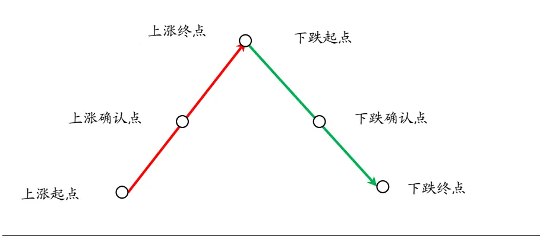
数据来源：国泰君安证券研究

本报告中介绍的基于行业趋势度的择时策略，本质上是一个动量模型，但和传统的动量模型有很大的区别。比如用上述波段划分方法，对WIND全 A 指数分段，传统的动量模型，会选择在上涨确认点买入，在下跌确认点卖出，这样的策略会过于右侧交易，信号已经滞后很多。我们采用对 102 个申万二级行业分段，每一个行业都有一个当前价格走势状态，如果是上涨确认但下跌尚未确认，那么趋势状态为 1；如果下跌确认但上涨尚未确认，那么趋势状态为-1。然后综合102个行业定义一个指标称之为周线级别趋势度或者日线级别趋势度，从而基于趋势度的动量来构建策略。

这个策略的实现具体分为三步：

第一、 对于任何一个行业的价格走势划分波段（定义趋势），趋势是有级别的，包括周线级别、日线级别、30分钟级别等，本篇研究主要对周线和日线级别的趋势度进行了分析。

第二、 基于所有申万二级行业的波段状态来定义周线级别和日线级别趋势度指标。这个指标在-1 和 1 之间波动，1 代表所有行业的当前级别确认为上涨波段，-1代表所有行业的当前级别确认为下跌波段。

第三、 趋势度一旦出现转折超过某个给定值，就意味着当前股市上涨或下跌出现了转折，原先做多就开始转为做空，原先做空就转为做多，否则就一直保持原先组合状态。

## 2. 周线级别与日线级别趋势度指标定义与应用

## 2.1.趋势度指标定义

WU（Weekly Up）记为申万二级行业中周线级别趋势向上的行业数；
WD （Weekly Down）记为申万二级行业中周线级别趋势向下的行业数。DU（Daily Up）记为申万二级行业中日线级别趋势向上的行业数；
DD （Daily Down）记为申万二级行业中日线级别趋势向下的行业数。

周线级别行业趋势度定义为：

$$
w=\frac{\mathrm{~W~U~}\mathrm{~-W~D~}}{WU+WD}
$$

日线级别行业趋势度定义为：

$$
d\;=\;\frac{\mathrm{\tiny~D~U~-D~D~}}{D\;U\;+\;D\;D}
$$

根据定义，趋势度指标 w和d 为一介于-1和 1之间的数字。

以周线趋势度w为例，当w值增加时，意味着越来越多的行业周线级别上涨得到确认；反之，当 w 值递减时，更多的行业转为周线级别下跌行情。

图 2 周线趋势度指标上涨下跌的含义
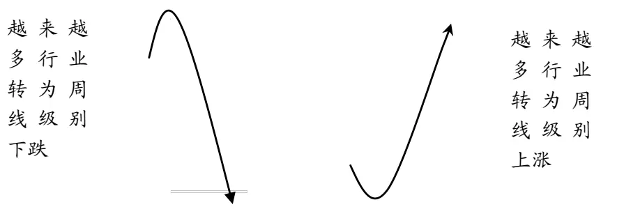
数据来源：国泰君安证券研究

## 2.2. A 股荣枯线

我们把周线级别行业趋势度取零值的线记为 A 股荣枯线，类型于宏观经济数据的 PMI 值，跌破荣枯线为市场进入萎缩状态，反之，向上突破荣枯线为市场进入活跃状态。下图为周线趋势度指标与WIND全A指数走势比较。

图 3 周线趋势度与WIND全A指数走势比较
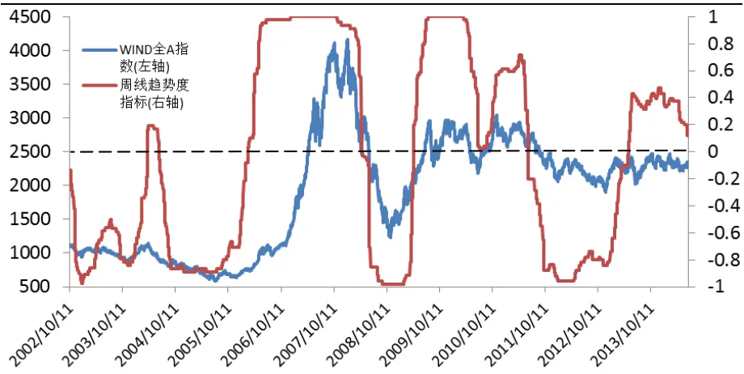
数据来源：国泰君安证券研究,WIND

2002年10月11日, 周线趋势度指标跌破荣枯线，从跌破位置到最低点跌幅达到23.5%；2004年4月2日，周线趋势度指标站上荣枯线，之后上涨仅 1.3%即见顶，这是过去十多年 A 股历史上趋势最弱的一次反弹；在二个月后即2004年6月18日再次跌破荣枯线，随后跌幅34.7%；2006 年 2 月 24 日，周线趋势度指标站上荣枯线，A 股迎来了历史最大的一波牛市，从站上荣枯线位置到最高顶点涨幅达到 441.8%。2008 年全球危机，A股也迎来大的调整，在 2008年4月18日，荣枯线即被跌破，最后到筑底位置跌幅 50%。2009 年上半年受 4 万亿刺激政策的驱动，A 股再迎牛市，2009 年 4 月 17 日，站上荣枯线，之后上涨延续了47.6%；2011 年 6 月 17 日，跌破荣枯线，从跌破位置，WIND 全 A 指数股再度大跌 25.6%；而 2013 年 5 月 10 日，再度站上荣枯线，到最高点涨幅 7.9%。

截至 2014 年 6 月 26 日，周线趋势度指标还在荣枯线之上，但仅为0.12，一旦跌破A股恐迎来大的下跌行情。目前需关注是否会跌破荣枯线。

表 1：站上或跌破周线级别荣枯线走势表现

| 日期 | 周线级别荣枯线 | 最大跌幅 | 最大涨幅 |
| --- | --- | --- | --- |
| 2002/10/11 | 跌破 | -23.5% |  |
| 2004/4/2 | 站上 |  | 1.3% |
| 2004/6/18 | 跌破 | -34.7% |  |
| 2006/2/24 | 站上 |  | 441.8% |
| 2008/4/18 | 跌破 | -50.3% |  |
| 2009/4/17 | 站上 |  | 41.6% |
| 2011/6/17 | 跌破 | -25.6% |  |
| 2013/5/10 | 站上 |  | 7.9% |

数据来源：国泰君安证券研究，WIND

以上分析从统计角度而言，毕竟样本太少，所以统计意义不显著，但可以看出基于行业周线级别波段走势的变化与市场趋向的关系。

## 2.3.基于周线级别行业趋势度构建量化策略:养老模型

给定一个动量步长，比如0.05、0.1或者0.2等等，在周线级别行业趋势度的走势图上，指标转折一旦超过动量步长，就发出买卖信号；自下而上转折，发出买入信号；反之自上而下转折，则发出卖出信号。所以这个策略的本质是一个动量策略，动量来自于周线或者日线级别行业趋势度的变化，而不是价格走势本身。一个好的动量策略应该具备的条件是，动量出现之后，走势在时间和空间上有很强的延续度，并且在延续过程中，不能频繁发出转折信号。

图 4 周线级别行业趋势度转折
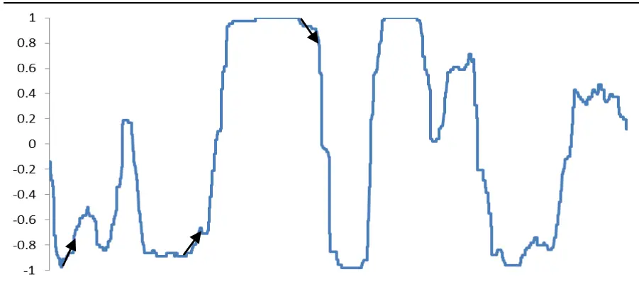
数据来源：国泰君安证券研究,WIND

我们取动量步长为0.1的话，从周线趋势度发出的信号来看，从2002年11 月至今，总共发出过 14 次信号，如下图所示。其中成功把握了2006、2007的大牛市，和2009的牛市行情，并且避过了2004年到2005年的熊市调整；及 2008年金融危机引发的A 股大幅下跌行情。从 2009年，A 股进入慢节奏的震荡下行行情，价格走势的趋势度变弱，但综合来看，收益没有收到显著影响。

图 5 周线趋势度买卖点信号
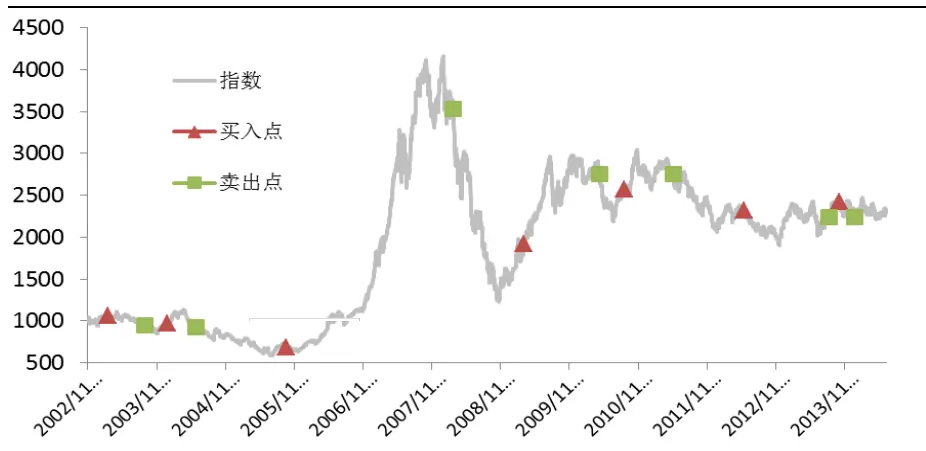

数据来源：国泰君安证券研究,WIND

基于周线级别行业趋势度的多头策略建立：选取动量步长为 0.1，如果出现买入信号，满仓买入WIND全A指数，如果出现卖出信号，则空仓持币，假定持币的年利率为 3%。

从 2002 年 11 月 15 日截至 2014 年 6 月 26 日, 共出现买卖信号 14 次，累计收益率 555.2%, 年化收益率 16.69%, 最大回撤 24.27%。

图 6 基于周线趋势度的收益率曲线(不做空)
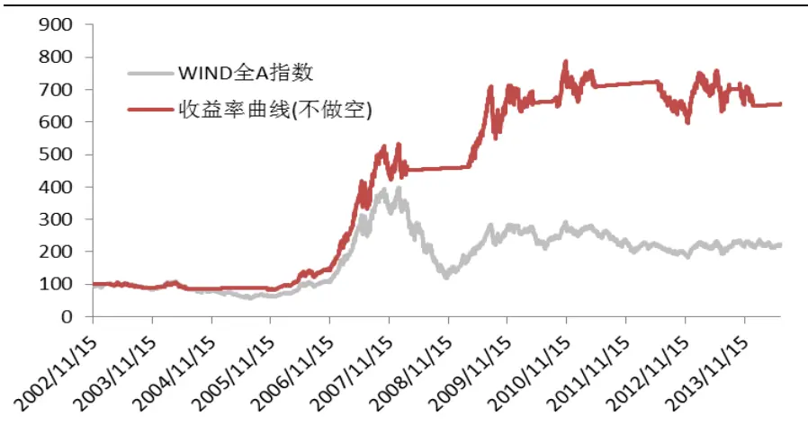
数据来源：国泰君安证券研究,WIND

从组合的历年收益率和 WIND 全 A 指数收益率比较来看，2006 年与2007 年，一直满仓操作，所以年度收益率和 A 股指数相同，2008 年较早地避开了大跌行情，跌幅仅为6.9%，而同期A股指数跌幅62.8%。

图 7 基于周线趋势度的组合历年收益率与 WIND全A指数比较
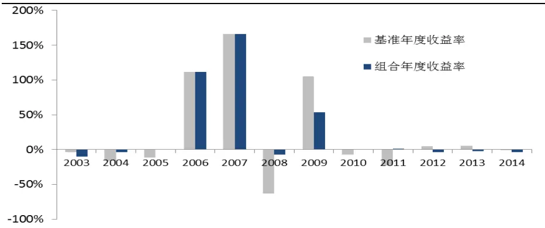
数据来源：国泰君安证券研究,WIND

这个模型之所以称为养老模型，是因为操作频率低，长期收益比较可观，假定年化收益率为15%，持有20年，收益可以达到16倍；如果年化收益12%，持有20年收益9.6倍。另一方面是投资回报的可预见性，只要未来 20 年股市有牛市，无论是快牛还是慢牛，这个模型一定会参与其中，并且在牛市行情中不会被震出去；只要出现熊市，也一定会及早撤离，一旦出现过去三年这种收缩的震荡行情，则轻易不会发出买卖信号，一旦发出信号，买入之后也不会出现显著收益折损，因为是震荡市，价格点位不会出现大幅的偏离均衡位置。如果想提高养老模型的收益回报，则需要采用下面的多空策略，年化收益达到 21.7%，这个模型对牛市和熊市则一视同仁，不会错过所有大的上涨和下跌机会，而处于震荡市则尽可能不发出信号，处于休眠状态，减少无谓的操作。

这个模型的构造原理决定了其对趋势把握是非常有效的。第一、任何一支股票或者一个行业的周线级别走势持续的时间和幅度都是非常显著的，一旦周线级别的上涨或者下跌形成，平均来看，其后很长时间都不会轻易改变。第二、行业轮动的方向趋同性。股市本质是一个从牛市到熊市、从熊市到牛市的转换过程，在熊市中，最典型的特征，就是绝大多数行业的周线级别趋势往下，用周线级别行业趋势度指标来刻画就是这个指标接近-1，一旦行业趋势度增长，比如增长 0.1，如果有100个行业的话，意味着有5个行业从周线级别下跌趋势转为周线级别上涨趋势，在熊市中这是一个非常积极的信号，所以开始做多；反之，在牛市中，几乎所有行业的周线级别趋势向上，一旦出现5个行业的周线级别走势由多转空，则释放了一个危险信号，牛市可能已经结束，先知先觉的资金在逐步撤离。

使用这个模型不需要调研上市公司、不需要选股票、也不需要打听小道消息，更不必臆想未来究竟是牛市还是熊市，只需要跟随市场的变化，跟踪指标抓住市场主要的趋势，多头策略牛市获利不菲，同时避开熊市的调整；而多空策略则是牛熊双赢。另一方面，这个模型因为投资的是这个A股市场，同时操作频率低，所以资金容纳量巨大，可以做成封基。

图 8 周线级别行业趋势度分区
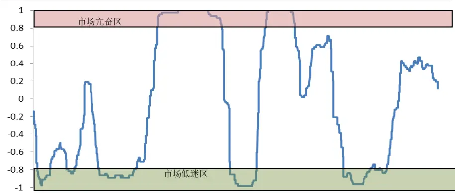
数据来源：国泰君安证券研究,WIND

如果我们定义周线级别趋势度大于 0.8 为市场亢奋区，周线级别趋势度小于-0.8为市场低迷区，简单统计过去 13年有一半的交易日市场处于两态之一。也就是说20%（0.4/2）的步长区，占据了整个交易时间的 50%。从市场经验来看，市场亢奋区，轻易不做空，反之市场低迷区，轻易不做多。而中间状态可以使用拐点模型。

## 2.4.基于周线级别行业趋势度构建量化策略:多空策略

基于周线级别行业趋势度的多空策略建立：选取动量步长为 0.1，如果出现买入信号，满仓买入 WIND 全 A 指数，如果出现卖出信号，则 1倍杠杆做空WIND 全A指数，假定持币的年利率为3%。

从 2002 年 11 月 15 日截至 2014 年 6 月 26 日, 共出现买卖信号 15 次，累计收益率 1049.7%, 年化收益率 21.7%, 最大回撤 30.5%。

图 9 基于周线趋势度的收益率曲线(不做空)
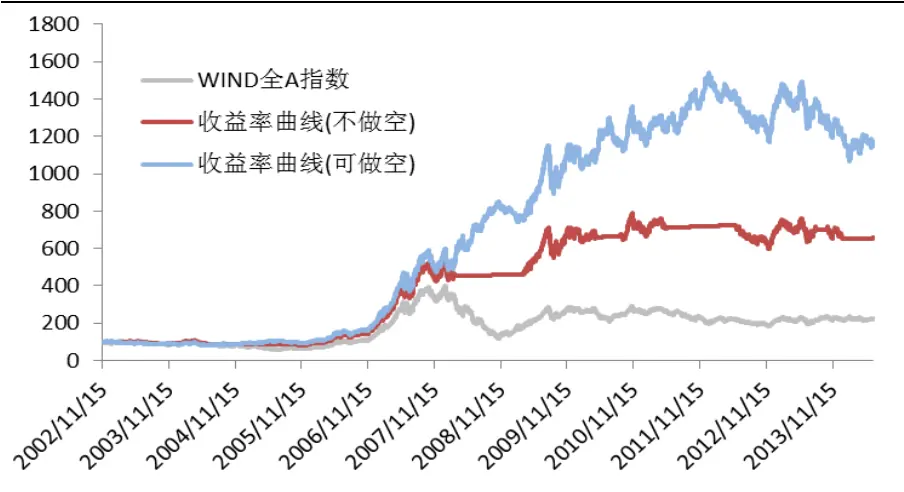
数据来源：国泰君安证券研究,WIND

## 2.5.基于周线级别行业趋势度量化策略:动量步长敏感度分析

无论是多头策略还是多空策略，策略构建中关键的一个也是唯一一个主观设定的指标就是动量步长，动量步长的改变对收益会有怎样的影响？需要进一步分析。

选取动量步长0.05、0.075、0.1、0.125和0.15做测试，从下表了来看，0.075和0.1的业绩表现完全相同，这是因为当出现0.075以上转折时也达到了 0.1 的转折度，属于巧合。随着动量步长的增加，信号发生频率减少，策略的累计收益率和年化收益率也逐步下降。如果动量步长过大，虽然能够过滤掉小的扰动，但进场信号与离场信号也会大幅滞后。所以综合来看，我们选择0.1作为周线级别的动量步长。从2002年11 月至今，这个策略，如果只做多的话，累计收益 555.2%，年化收益率16.7%，买入与平仓交易信号共 14 次，其中买入信号胜率 42.9%。

表 2：做多策略

| 动量步长 | 0.05 | 0.075 | 0.1 | 0.125 | 0.15 |
| --- | --- | --- | --- | --- | --- |
| 累计收益 | 456.9% | 555.2% | 555.2% | 485.4% | 443.3% |
| 年化收益率 | 15.2% | 16.7% | 16.7% | 15.7% | 15.0% |
| 最大回撤 | -34.9% | -24.3% | -24.3% | -25.9% | -27.5% |
| 信号次数 | 18 | 14 | 14 | 12 | 12 |
| 胜率 | 44.4% | 42.9% | 42.9% | 50.0% | 50.0% |

数据来源：国泰君安证券研究，WIND

如果可做空的话，从 2012 年 11 月至今累计收益 1049.7%，年化收益率

21.7%，最大回撤30.5%，做多与做空信号共15 次，胜率 46.7%。

表 3：多空策略

| 动量步长 | 0.05 | 0.075 | 0.1 | 0.125 | 0.15 |
| --- | --- | --- | --- | --- | --- |
| 累计收益 | 692.7% | 1049.7% | 1049.7% | 894.8% | 782.6% |
| 年化收益率 | 18.4% | 21.7% | 21.7% | 20.4% | 19.3% |
| 最大回撤 | -55.7% | -30.5% | -30.5% | -30.7% | -31.1% |
| 信号次数 | 19 | 15 | 15 | 13 | 13 |
| 胜率 | 47.4% | 46.7% | 46.7% | 53.8% | 46.2% |

数据来源：国泰君安证券研究，WIND

## 2.6.基于日线级别行业趋势度量化策略:步长敏感度分析

从日线级别行业趋势度的策略来看，随着动量步长的增加，交易信号减少，累计收益率增加，这是因为日线级别行业趋势度变化较快，动量步长越大，可以更多过滤掉小的扰动，但同样如果动量步长过大，交易滞后同样会减少收益。日线级别趋势度策略的收益整体不如周线级别趋势度策略。主要是两个原因造成的，我们在模型风险分析中做进一步阐述。

表 4：做多策略

| 动量步长 | 0.05 | 0.075 | 0.1 | 0.125 | 0.15 |
| --- | --- | --- | --- | --- | --- |
| 累计收益 | 154.2% | 188.1% | 191.7% | 227.2% | 300.8% |
| 年化收益率 | 8.3% | 9.4% | 9.5% | 10.5% | 12.3% |
| 最大回撤 | -46.9% | -44.1% | -40.4% | -43.1% | -39.4% |
| 信号次数 | 110 | 91 | 83 | 77 | 69 |
| 胜率 | 36.4% | 43.5% | 40.5% | 43.6% | 40.0% |

数据来源：国泰君安证券研究，WIND

表 5：多空策略

| 动量步长 | 0.05 | 0.075 | 0.1 | 0.125 | 0.15 |
| --- | --- | --- | --- | --- | --- |
| 累计收益 | 622.6% | 590.3% | 570.1% | 656.7% | 766.6% |
| 年化收益率 | 17.6% | 17.2% | 16.9% | 18.0% | 19.2% |
| 最大回撤 | -35.5% | -36.3% | -32.0% | -32.4% | -35.0% |
| 信号次数 | 110 | 91 | 83 | 77 | 69 |
| 胜率 | 46.4% | 47.3% | 48.2% | 50.6% | 50.7% |

数据来源：国泰君安证券研究，WIND

## 3. 策略模型的风险分析

通过对指数历史走势的分析，基于行业趋势度的模型虽然能够把握住所有大中级别的上涨和下跌波段，但存在两种走势会使得收益率曲线出现较大回撤。

第一种情形：当周线行业趋势度处于极度强势或极度弱势，这种情形下，即使股票指数出现较大幅度的调整或者反弹，趋势度指标都不会改变，所以择时策略组合必须承受市场的波动。但之后，市场一定会再度修正，这时候趋势指标开始做出反应，从而跟随指标信号操作，虽然不能在大顶逃脱，但可以在次高点附近离场。但日线级别行情会不断出现，而且波动很快，这种情况下使用日线行业趋势度指标反而容易在底部附近卖出，在顶部附近做多，这是日线行业趋势度的缺陷之一。

第二种情形：如果日线级别行情上涨和下跌都比较短促，虽然这种情况在股市走势中比较少见，但一旦出现，特别基于日线趋势度转折做多或者做空则会反复被绞杀。从上证综指的日线级别的分段图来看，2013 年下半年以来上证综指指数走势呈现均匀的锯齿状，而且波段的幅度和持续时间都大幅低于历史均值。而这种走势正是基于日线行业趋势度量化策略的天敌，因为这种走势更适合拐点模型。遇到这种走势，周线级别趋势度比日线级别趋势度会好很多，周线级别趋势度极少发出信号，所以避开了这种来回震荡的行情，但日线级别则会频频发出转折信号，基本每一次操作都会降低胜率。解决这个问题需要周线级别与日线级别趋势度联立操作，这方面研究会继续推进。

图 10上证综指日线级别分段图
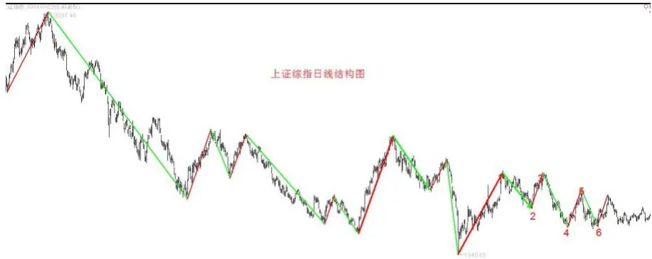
数据来源：国泰君安证券研究

## 4. 二级行业周线级别涨跌幅度与持续时间

无论是行业还是个股，周线级别行情的涨跌幅和持续时间都非常显著。下表我们统计了申万二级行业过去 10 年周线级别波段的情况。其中采掘服务行业周线级别上涨波段的平均涨幅高达 675%，平均持续时间 102 周，而下跌波段的平均跌幅 56%，持续时间 64 周，其他采掘行业，上涨波段平均涨幅 648%，平均持续时间 106 周，下跌波段平均跌幅 82%，持续 55 周。表格里所列的仅为二级行业，如果统计个股，不难想象周线级别的涨跌幅和持续时间更为显著。一个周线级别的上涨对于一支或一个行业而言就是一波牛市，反之一个周线级别的下跌行情则是熊市。牛市与熊市这两个出现频率极高的词汇在金融市场本无定义，但从量化研究角度则需要赋予一个能够严格表述的定义，从我们理解的角度，牛市与熊市就是周线级别的行情。通过对二级行业波段的涨跌幅与持续时间的均值来看，也就能够理解为什么周线级别要改变走势会很难，同时能够感受到趋势的力量。这也解释了为什么周线级别趋势度指标比较有效的原因。

表 6：二级行业周线级别波段涨跌幅与持续时间

| 证券名称 | 上涨波段 |  | 下跌波段 |  |
| --- | --- | --- | --- | --- |
|  | 涨幅均值 | 持续时间均值(周) | 跌幅均值 | 持续时间均值(周) |
| 采掘服务Ⅱ（申万） | 675% | 102 | -56% | 64 |
| 其他采掘Ⅱ（申万) | 648% | 106 | -82% | 55 |
| 地面兵装Ⅱ（申万） | 529% | 98 | -70% | 89 |
| 证券Ⅱ(申万) | 507% | 42 | -51% | 64 |
| 装修装饰Ⅱ（申万) | 497% | 90 | -55% | 48 |
| 电机Ⅱ（申万) | 493% | 109 | -67% | 78 |
| 专业零售(申万) | 485% | 73 | -62% | 94 |
| 动物保健Ⅱ（申万) | 482% | 113 | -60% | 74 |
| 通用机械(申万) | 477% | 121 | -63% | 65 |
| 工业金属(申万) | 441% | 46 | -53% | 48 |
| 渔业(申万) | 435% | 114 | -74% | 40 |
| 医药商业Ⅱ(申万) | 409% | 115 | -53% | 50 |
| 稀有金属(申万) | 407% | 42 | -52% | 55 |
| 金属非金属新材料(申万) | 395% | 82 | -65% | 53 |
| 电子制造Ⅱ（申万) | 395% | 113 | -59% | 56 |
| 计算机应用（申万) | 384% | 117 | -58% | 70 |
| 纺织制造(申万) | 383% | 109 | -63% | 77 |
| 一般零售(申万) | 377% | 111 | -68% | 43 |
| 酒店Ⅱ（申万） | 375% | 92 | -61% | 73 |
| 电气自动化设备(申万) | 369% | 99 | -57% | 68 |
| 其他交运设备Ⅱ（申万） | 350% | 63 | -51% | 77 |
| 林业Ⅱ（申万) | 349% | 108 | -67% | 51 |
| 其他电子Ⅱ（申万) | 345% | 116 | -66% | 70 |
| 航天装备Ⅱ（申万) | 343% | 103 | -60% | 105 |
| 高低压设备(申万) | 339% | 61 | -49% | 53 |
| 生物制品Ⅱ（申万） | 335% | 116 | -50% | 49 |
| 汽车零部件Ⅱ（申万） | 334% | 76 | -65% | 99 |
| 农产品加工(申万) | 326% | 82 | -66% | 49 |
| 金属制品Ⅱ（申万) | 318% | 118 | -57% | 90 |
| 农业综合Ⅱ（申万) | 316% | 75 | -46% | 50 |
| 航空运输Ⅱ（申万） | 306% | 62 | -55% | 48 |
| 专用设备(申万) | 302% | 64 | -50% | 59 |
| 水泥制造Ⅱ（申万） | 301% | 54 | -57% | 50 |
| 物流Ⅱ(申万） | 299% | 57 | -57% | 68 |
| 仪器仪表Ⅱ（申万) | 298% | 71 | -55% | 53 |
| 塑料Ⅱ（申万） | 294% | 84 | -56% | 68 |
| 综合Ⅱ（申万） | 286% | 78 | -63% | 97 |
| 航空装备Ⅱ（申万) | 281% | 56 | -54% | 69 |
| 汽车整车(申万) | 278% | 51 | -58% | 71 |
| 景点(申万) | 275% | 76 | -41% | 63 |
| 饲料Ⅱ（申万) | 275% | 99 | -57% | 66 |
| 家用轻工(申万) | 270% | 81 | -65% | 95 |
| 种植业(申万) | 269% | 79 | -54% | 64 |
| 白色家电(申万) | 268% | 64 | -43% | 40 |

| 医疗器械Ⅱ(申万) | 267% | 73 | -55% | 79 |
| --- | --- | --- | --- | --- |
| 电源设备(申万) | 259% | 61 | -56% | 54 |
| 畜禽养殖Ⅱ(申万) | 256% | 68 | -58% | 82 |
| 光学光电子(申万) | 254% | 84 | -66% | 68 |
| 贸易Ⅱ(申万) | 249% | 51 | -46% | 55 |
| 煤炭开采Ⅱ（申万) | 248% | 44 | -48% | 50 |
| 多元金融Ⅱ（申万） | 237% | 48 | -50% | 57 |
| 造纸Ⅱ(申万) | 233% | 94 | -62% | 58 |
| 公交Ⅱ(申万) | 232% | 46 | -54% | 86 |
| 玻璃制造Ⅱ（申万） | 231% | 57 | -55% | 69 |
| 航运Ⅱ（申万) | 228% | 43 | -51% | 62 |
| 文化传媒(申万) | 228% | 68 | -46% | 67 |
| 化学纤维(申万) | 227% | 52 | -53% | 53 |
| 化学制品(申万) | 226% | 57 | -45% | 58 |
| 环保工程及服务Ⅱ（申万) | 223% | 70 | -57% | 74 |
| 包装印刷Ⅱ（申万) | 221% | 63 | -51% | 56 |
| 医疗服务Ⅱ(申万) | 215% | 65 | -32% | 40 |
| 其他建材Ⅱ（申万） | 212% | 67 | -49% | 42 |
| 燃气Ⅱ(申万) | 212% | 52 | -44% | 43 |
| 服装家纺(申万) | 207% | 61 | -63% | 115 |
| 化学原料(申万) | 206% | 63 | -54% | 43 |
| 房地产开发Ⅱ（申万） | 203% | 38 | -44% | 48 |
| 黄金Ⅱ(申万) | 201% | 36 | -40% | 31 |
| 园区开发Ⅱ(申万) | 201% | 47 | -61% | 128 |
| 化学制药(申万) | 199% | 64 | -44% | 57 |
| 旅游综合Ⅱ（申万） | 197% | 52 | -48% | 53 |
| 石油化工(申万) | 197% | 49 | -48% | 67 |
| 餐饮Ⅱ（申万) | 195% | 72 | -69% | 111 |
| 元件Ⅱ（申万) | 192% | 56 | -56% | 76 |
| 饮料制造(申万) | 183% | 49 | -35% | 42 |
| 计算机设备Ⅱ（申万） | 180% | 62 | -54% | 70 |
| 钢铁Ⅱ（申万) | 178% | 50 | -47% | 49 |
| 运输设备Ⅱ（申万） | 174% | 51 | -49% | 62 |
| 中药Ⅱ(申万) | 173% | 67 | -41% | 57 |
| 通信设备(申万) | 169% | 56 | -55% | 58 |
| 半导体(申万) | 167% | 54 | -58% | 78 |
| 水务Ⅱ（申万） | 160% | 60 | -47% | 54 |
| 银行Ⅱ(申万) | 156% | 39 | -40% | 61 |
| 汽车服务Ⅱ（申万) | 153% | 34 | -49% | 56 |
| 视听器材(申万) | 152% | 54 | -51% | 70 |
| 通信运营Ⅱ（申万) | 148% | 52 | -44% | 67 |
| 橡胶(申万) | 146% | 40 | -44% | 48 |
| 港口Ⅱ(申万) | 133% | 61 | -44% | 80 |
| 互联网传媒(申万) | 130% | 38 | -49% | 47 |
| 食品加工(申万) | 116% | 55 | -36% | 49 |
| 高速公路Ⅱ（申万) | 115% | 57 | -39% | 53 |
| 园林工程Ⅱ（申万) | 102% | 67 | -46% | 54 |

| 机场Ⅱ（申万） | 102% | 67 -38% | 58 |
| --- | --- | --- | --- |
| 船舶制造Ⅱ（申万） | 100% | 36 -45% | 75 |
| 铁路运输Ⅱ（申万） | 99% | 37 -41% | 57 |
| 商业物业经营(申万) | 91% | 46 -47% | 57 |
| 电力(申万) | 91% | 51 -39% | 48 |
| 石油开采Ⅱ(申万) | 79% | 70 -64% | 62 |
| 保险Ⅱ(申万) | 77% | 27 -52% | 63 |
| 房屋建设Ⅱ（申万） | 31% | 19 -13% | 20 |

数据来源：国泰君安证券研究，WIND

## 5. 附录：当下走势确认

价格分段的目的一方面是寻找价格走势的规律，另一方面则是对当下走势的可能发展方向、幅度、买卖点做出判断，以制定相应的操作策略。而当下一个波段的发展包含三个时点：第一、波段起点；第二、波段确认点；第三、波段终点。一个新波段的起点正是前一个波段的结束点，反之亦然。

## 5.1.新波段确认点分类讨论

当MACD的DEA指标穿越零轴时，当下波段可能正好形成确认，也可能还没有形成，因此最新波段的确认点包含两种情况：一、MACD 的DEA指标穿越零轴时，对应的波段正好处于当前波段的最大值点（DEA向上穿越零轴）或者最小值点（DEA 向下穿越零轴），那么这个波段就在当下形成确认；二、MACD 的 DEA 指标穿越零轴时，对应波段的当前价格已经不是当前波段的最大值点（DEA 向上穿越零轴）或者最小值点（DEA 向下穿越零轴），但在之后继续创出波段的新高或者新低，直到那时才能确认新波段形成。我们以上涨波段为例，分析两种情况：

第一种情况：如下图可以看到，由 B 点开始的上涨行情，MACD 的DEA 指标从零轴下方向上延伸，在穿越零轴的时点，以 B 为起始位置的上涨行情到达C点，创反弹以来的最高点，这种情形下，A到B的下跌波段被破坏，即A到B的下跌行情宣告终结在B点，AB下跌波段完成，B 到C的上涨波段形成。

## 图 11波段当下确认：第一种情形

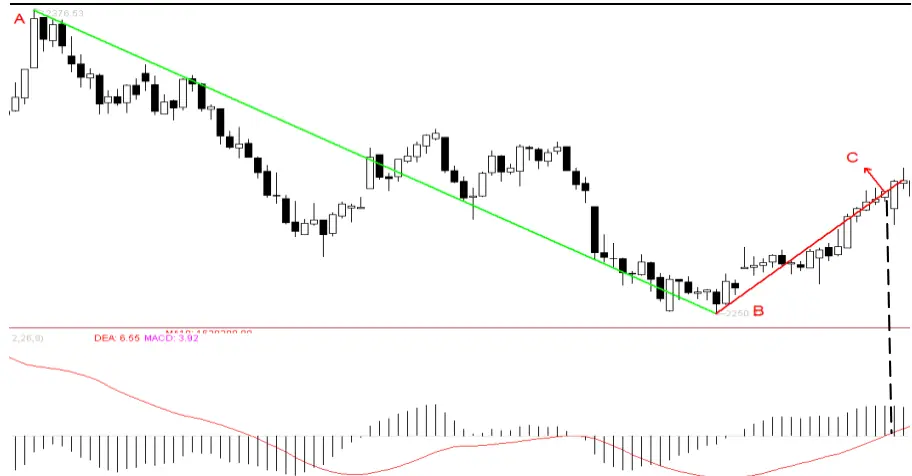
数据来源：国泰君安证券研究

第二种情形：如下图可以看到，由 B 点开始的上涨行情，MACD 的DEA 指标从零轴下方向上延伸，穿越零轴的时点为 C 点之后的第一根阴线，这个位置已经不是以B为起始位置的上涨行情以来的新高，而C点对应的DEA 指标在零轴之下，因此 B 到C 点的上涨波段尚未形成。从C点出现小的回调后，继续上涨在D点创出反弹以来的新高，可以看到这时候 DEA 指标仍在零轴之上。在这个时点，A 到 B 的下跌波段被破坏，即A到B的下跌行情宣告终结在B点，AB下跌波段完成，B到D 的上涨波段形成。

图 12波段当下确认：第二种情形
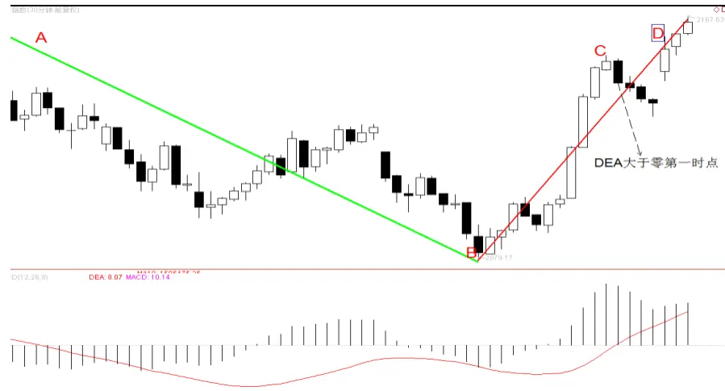
数据来源：国泰君安证券研究

## 5.2.当下波段状态分析

在新的波段形成之前, 当下波段是否已经结束是不可知的。那么当下波段要么还在趋势延伸中, 要么拐点已经出现, 新波段还在等待确认，只有新波段得到确认，那个已经出现的拐点才真正确定是拐点。

所以，要对当下波段状态做出分析，前提是确定最新一个被确认的拐点，也许是顶部拐点也许是底部拐点。而确定最新一个被确认的拐点本质就是前面讲到的“波段当下形成的两种情况分析”，只要两种情况都没有发生，那么当下波段的状态就是由最近拐点决定的状态。在新波段确认之前，我们把当下波段的几种状态列举如下（以下跌波段为例）：

第一种、当下DEA < 0，并且价格处于整个波段的最低值。这种情况最容易确认，完全符合波段形成的两种情况之一。面对这种走势，当下需要关心的问题是当前下跌波段什么时候什么位置会结束。

图 13当下 DEA < 0，并且价格处于整个波段的最低值
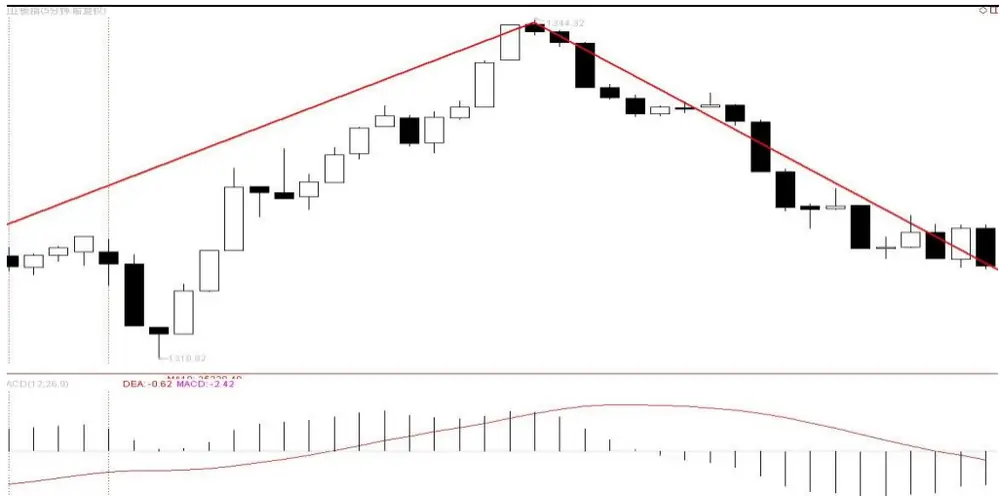
数据来源：国泰君安证券研究

第二种、当下 DEA < 0，价格出现反弹。价格从低点反弹，在次级别上，这个反弹可能是一个次级别的上涨，也可能不是，如果不是，则可能是一个次次级别的上涨行情。

图 14当下 DEA < 0，价格出现反弹第三种、当下DEA > 0，价格出现较大反弹。从A点到B点看上去已经形成一个波段，然而 B 点对应的DEA 值虽然已经大于零，但从 A 至 B这个波段的最高点对应的 DEA 却是小于零。所以，我们把这种情况仍然定义为原先下跌波段的延伸行情。

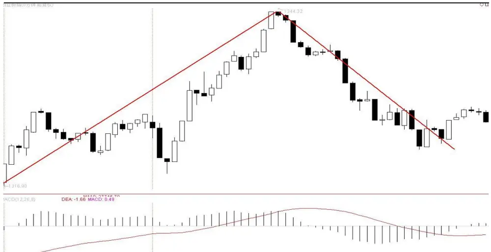
数据来源：国泰君安证券研究

图 15当下 DEA < 0，价格出现反弹
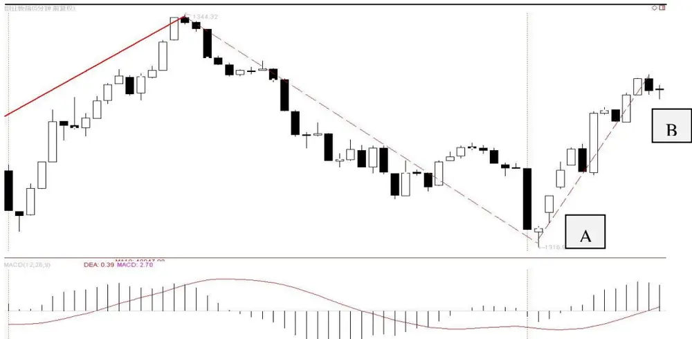
数据来源：国泰君安证券研究

在新波段形成确认之前，以上三种情况涵盖了当下波段的三种状态。如果当下是下跌，我们都把这个级别的下跌行情记为-1，如果当下是上涨，我们把这个级别的行情记为1。

## 本公司具有中国证监会核准的证券投资咨询业务资格

## 分析师声明

作者具有中国证券业协会授予的证券投资咨询执业资格或相当的专业胜任能力，保证报告所采用的数据均来自合规渠道，分析逻辑基于作者的职业理解，本报告清晰准确地反映了作者的研究观点，力求独立、客观和公正，结论不受任何第三方的授意或影响，特此声明。

## 免责声明

本报告仅供国泰君安证券股份有限公司（以下简称“本公司”）的客户使用。本公司不会因接收人收到本报告而视其为本公司的当然客户。本报告仅在相关法律许可的情况下发放，并仅为提供信息而发放，概不构成任何广告。

本报告的信息来源于已公开的资料，本公司对该等信息的准确性、完整性或可靠性不作任何保证。本报告所载的资料、意见及推测仅反映本公司于发布本报告当日的判断，本报告所指的证券或投资标的的价格、价值及投资收入可升可跌。过往表现不应作为日后的表现依据。在不同时期，本公司可发出与本报告所载资料、意见及推测不一致的报告。本公司不保证本报告所含信息保持在最新状态。同时，本公司对本报告所含信息可在不发出通知的情形下做出修改，投资者应当自行关注相应的更新或修改。

本报告中所指的投资及服务可能不适合个别客户，不构成客户私人咨询建议。在任何情况下，本报告中的信息或所表述的意见均不构成对任何人的投资建议。在任何情况下，本公司、本公司员工或者关联机构不承诺投资者一定获利，不与投资者分享投资收益，也不对任何人因使用本报告中的任何内容所引致的任何损失负任何责任。投资者务必注意，其据此做出的任何投资决策与本公司、本公司员工或者关联机构无关。

本公司利用信息隔离墙控制内部一个或多个领域、部门或关联机构之间的信息流动。因此，投资者应注意，在法律许可的情况下，本公司及其所属关联机构可能会持有报告中提到的公司所发行的证券或期权并进行证券或期权交易，也可能为这些公司提供或者争取提供投资银行、财务顾问或者金融产品等相关服务。在法律许可的情况下，本公司的员工可能担任本报告所提到的公司的董事。

市场有风险，投资需谨慎。投资者不应将本报告为作出投资决策的惟一参考因素，亦不应认为本报告可以取代自己的判断。在决定投资前，如有需要，投资者务必向专业人士咨询并谨慎决策。

本报告版权仅为本公司所有，未经书面许可，任何机构和个人不得以任何形式翻版、复制、发表或引用。如征得本公司同意进行引用、刊发的，需在允许的范围内使用，并注明出处为“国泰君安证券研究”，且不得对本报告进行任何有悖原意的引用、删节和修改。

若本公司以外的其他机构（以下简称“该机构”）发送本报告，则由该机构独自为此发送行为负责。通过此途径获得本报告的投资者应自行联系该机构以要求获悉更详细信息或进而交易本报告中提及的证券。本报告不构成本公司向该机构之客户提供的投资建议，本公司、本公司员工或者关联机构亦不为该机构之客户因使用本报告或报告所载内容引起的任何损失承担任何责任。

## 评级说明

## 1.投资建议的比较标准

投资评级分为股票评级和行业评级。

以报告发布后的12个月内的市场表现为比较标准，报告发布日后的 12个月内的公司股价（或行业指数）的涨跌幅相对同期的沪深 300 指数涨跌幅为基准。

## 2.投资建议的评级标准

报告发布日后的 12 个月内的公司股价（或行业指数）的涨跌幅相对同期的沪深 300 指数的涨跌幅。

| 评级 | 说明 |  |
| --- | --- | --- |
| 股票投资评级 | 增持 | 相对沪深 300指数涨幅15%以上 |
|  | 谨慎增持 | 相对沪深300指数涨幅介于5%～15%之间 |
|  | 中性 | 相对沪深300指数涨幅介于-5%～5% |
|  | 减持 | 相对沪深300指数下跌5%以上 |
| 行业投资评级 | 增持 | 明显强于沪深 300 指数 |
|  | 中性 | 基本与沪深300指数持平 |
|  | 减持 | 明显弱于沪深300指数 |

## 国泰君安证券研究

|  | 上海 | 深圳 | 北京 |
| --- | --- | --- | --- |
| 地址 | 上海市浦东新区银城中路168号上海 银行大厦29层 | 深圳市福田区益田路 6009 号新世界 商务中心34层 | 北京市西城区金融大街28号盈泰中 心2号楼10层 |
| 邮编 | 200120 | 518026 | 100140 |
| 电话 | (021)38676666 | (0755)23976888 | (010)59312799 |
|  | E-mail: gtjaresearch@gtjas.com |  |  |