2014.07.16

# 价格走势之庖丁解牛系列:不创新高离场对吗?

# ——数量化专题之四十八

刘富兵（分析师）

赵延鸿（研究助理）

8 021-38676673

021-38674927

liufubing008481@gtjas.com

zhaoyanhong@gtjas.com

证书编号 S0880511010017

S0880113070047

## 本报告导读：

从严格的定量角度回答了不创新高离场是否合理，并基于 A 股数据从统计上给出了操作依据。

## 摘要：

le_Summary] 技术分析领域中“不创新高离场”这个简单的表述，定量角度存在两个问题：第一、需要严格定义何谓不创新高？只有“不创新高”有了明确的定义，操作层面的“离场”才有清晰的依据。第二、“离场”之后如何衡量这次离场正确与否？如果缺少一个衡量的标准也就无从研究“不创新高离场”是否是合理的操作。

- 基于不同周期价格走势分段方法，以上两个问题都会得到解决。以日线级别和 30分钟级别两个级别行情联立来定义“何谓不创新高”及“如何衡量离场的正确与否”。

统计数据显示：日线级别的上涨行情在 30 分钟级别走势出现“不创新高”形态，离场正确的概率为 61%，即之后转为日线级别的下跌行情；而 30 分钟级别的上涨行情在 5 分钟级别走势出现“不创新高”形态，离场正确的概率为 66.4%，即之后转为 30分钟级别的下跌行情。

- 基于不创新高或者不创新低的价格形态选择离场或进场，基本上胜率都在 60%以上，但最高不到 70%，胜率并不显著。所以在实战过程中，需要借助其他维度来提高离场或进场的正确率，避免上涨中继状态被震出，或者在下跌中继状态选择进场。

- 30 分钟级别走势和 5 分钟级别走势比较的话，可以发现，5分钟级别顶部转折成功率偏高，平均在 66%以上，底部转折成功率在 62%之上。二者都大于30 分钟级别的转折成功率水平。

金融工程

## 金融工程团队：

刘富兵：（分析师）

电话：021-38676673

邮箱：liufubing008481@gtjas.com

证书编号：S0880511010017

## 严佳炜：（分析师）

电话：021-38674812

邮箱：yanjiawei008776@gtjas.com

证书编号：S0880512110001

## 耿帅军：（分析师）

电话：010-59312753

邮箱：gengshuaijun@gtjas.com

证书编号：S0880513080013

## 徐康：（分析师）

电话：021-38674939

邮箱：xukang010849@gtjas.com

证书编号：S0880513080018

## 赵延鸿：（研究助理）

电话：021-38674927

邮箱：zhaoyanhong@gtjas.com

证书编号：S0880113070047

## 陈睿：（研究助理）

电话：021-38675861

邮箱：chenrui012896@gtjas.com

证书编号：S0880112120012

## 刘正捷：（研究助理）

电话：0755-23976803

邮箱：liuzhengjie012509@gtjas.com

证书编号：S0880112080087

## [Table_R相关报告

《基于行业趋势度的择时策略介绍》2014.07.11

《基于均值回复的行业配置策略》2014.07.08

《分红送转事件探究》2014.06.30

《随机最优控制下的 AH 股配对交易策略》2014.06.03

《量化择时之由连续到离散》2014.05.22

## 1. “不创新高离场”的定义

技术分析是基于价格与成交量的投资分析体系，从分析方法角度包含了道氏理论、波浪理论、葛兰比均线系统、缠论、还有形形色色的各类技术指标。技术分析相比宏观分析、市场策略和行业研究准入门槛低，对于绝大多数投资者而言，只要花个把星期，基本都可以使用 5 日线、20日线、年线、支撑线、压力线、MACD、KDJ 等指标。每一个投资者使用技术分析的初衷是相同的，希望能够精确把握买卖点，提高操作的胜率。但技术分析理论是死的，人是活的，在实际应用中有成功者，也有失败者，成功者也有短期成功的，也有数十年成功的。在这个系列报告中我们不去探讨如何正确使用技术分析，因为这是一个更庞大更深度更系统性的工程，而是先把投资者常用的技术分析方法进行严格定量分析，寻找其规律并进一步探讨其在量化策略中的应用价值。

在技术分析领域有很多使用频率极高的表述如 “不创新高离场”、“高抛低吸”、“跌破支撑线离场”、“某某线是阻力位”等等，使用者居多，但极少有严格的定量研究，来验证这些说法是否正确。所以我们推出一个关于价格走势量化之庖丁解牛系列，抛砖引玉，从而能够倡导投资者更严谨更科学地使用技术分析，最终把技术分析定量化和科学化。

本篇报告主要研究“不创新高离场”这个表述在统计上是否获得支持。

“不创新高离场”这个表述看似简单，实则细究不易。难点有二：第一、首先需要定义何谓不创新高？假定这个问题获得解决，“不创新高”有了明确的定义，那么操作层面“离场”就有了清晰的依据。从而有了第二个难点：“离场”之后如何衡量这次离场正确与否？如果缺少一个衡量的标准也就无从研究“不创新高离场”是否是合理的操作。

有了基于不同周期价格走势分段方法，以上两个难点都会得到解决。我们以日线级别和 30分钟级别两个级别行情联立来定义“何谓不创新高”及“如何衡量离场的正确与否”。日线级别走势即在日 K线图上的每一个确认的涨跌波段，同理 30 分钟级别走势即在 30 分钟 K 线图上确认的涨跌波段。具体分段方法在之前报告中都有详细论述。

图 1 价格走势不创新高示意图
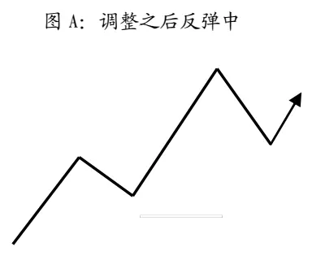
数据来源：国泰君安证券研究

图 B：不创新高

图 A 和图 B 中，每一段都是一 30 分钟级别波段。图 A 中，从最高点调整之后，一个新的反弹波段正在向上延伸，在当下，这个延伸波段是否突破前期高点是不可知的，因此这种形态显然不能定义为“不创新高”，毕竟最后一个反弹波段还处在上涨状态。在图 B 中，可以看到，反弹波段没有创新高，一个新的下跌波段已经形成。从上面两个图分析来看，图 B即是 30分钟级别“不创新高”的严格定义，当然这个定义是以波段的严格划分为前提。波段 I和 II都是已经完成的波段，波段 III下跌已经确认。下文中我们把“不创新高”也称为出现“顶部转折形态”。反之，“不创新低”的定义类似可得，我们也称之为出现“底部转折形态”。

下面需要回答第二个问题：“离场”之后如何衡量这次离场对还是不对？图 B 中这种“不创新高”的转折形态出现之后，价格走势可能继续下跌至某种状态，也可能直接反弹创新高，也可能横盘震荡一段时间，再选择方向，面对种种可能性如何去衡量这次离场操作的正确性。为了解决这个问题，我们需要引进更高级别的走势。

图 2 情形一：再创新高（日线级别上涨延伸）
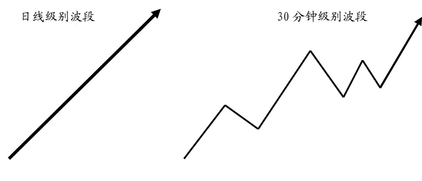
数据来源：国泰君安证券研究

定义 30 分钟级别“不创新高”并不需要考虑日线级别的走势，但为了能够衡量“不创新高离场”的正确性与否，则需要把日线级别行情考虑在内。我们选取 30分钟级别不创新高的走势，这个走势处于一个日线级别的上涨行情中。那么 30分钟级别走势不创新高之后，站在日线级别的角度后续走势就仅有两种可能性：第一、再创新高，日线级别上涨延伸；第二、震荡下行，日线级别下跌行情形成。这两种可能性就是对“不创新高”后续走势的完全分类。

图 3 情形二：转折成功（日线级别下跌形成）
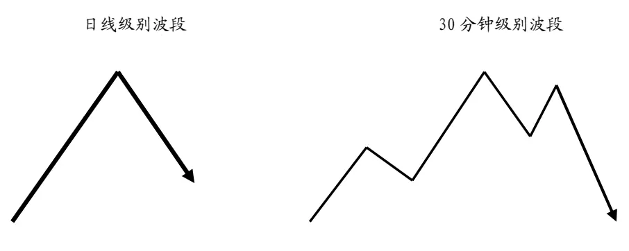
数据来源：国泰君安证券研究

有了上述两种情况的分析，就等于把 30分钟级别“不创新高”的未来走势完全分类，即日线级别上涨延伸和日线级别下跌形成，这两种情况必定触发其一，而触发之前都属于不创新高之后的待定状态。

以上分析都是针对“不创新高”来研究的，同样可以研究“不创新低离场”的形态变化。

研究价格走势转折的意义，从操作层面上在于更早地把握更高级别转折的时点。从下图上来看，24-29为一日线级别的上涨行情，日线级别上涨确认点在 29左侧一点。但从 30分钟级别图形上，26与 27之间这个转折形态（不创新低）就已经确认。

图 4 底部转折确认点与日线级别上涨确认点比较
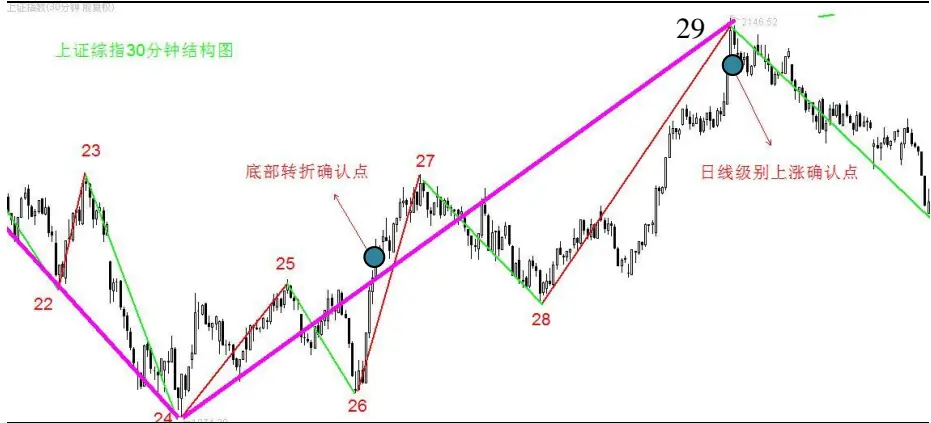
数据来源：国泰君安证券研究

图 5 顶部转折确认点与日线级别下跌确认点比较
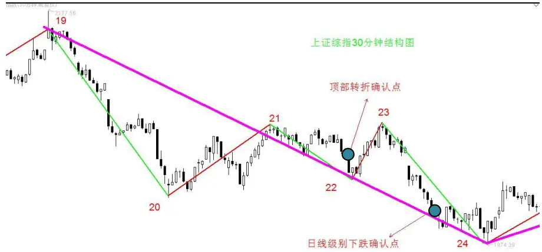
数据来源：国泰君安证券研究

上图中“不创新高”的顶部转折确认点在 21-22 之间，而日线级别下跌确认点逼近 24 的位置。上述两个图中都隐藏了 MACD 之 DEA 指标的走势，这些波段的划分都是根据MACD的DEA指标的分段规则来确认的。

## 2. “转折形态”出现之后转折成功率统计

有了“不创新高”的严格定义和“衡量不创新高离场的正确与否”的标准，我们就可以从严格定量的角度来分析“不创新高离场对吗”这个命题的合理性。

## 2.1.转折成功率统计

数据源：时间从 2011年 8月 10日至 2014 年 7月 14日，标的包括沪深300 指数、中证 500 指数和创业板指数共 900 支成份股的数据。数据频率包括所有日度、30分钟、5分钟收盘价。

统计结果显示（表 1），一个日线级别的上涨行情，在 30 分钟级别的走势图上出现了顶部转折形态（即当下不创新高）次数共 3637 次，其中之后转为日线级别下跌行情有 2218 次，转折成功率为 61%。同样，一个日线级别的下跌行情，在 30 分钟级别的走势图上出现了底部转折形态（即当下不创新低）次数共 3992 次，之后转为日线级别上涨行情有2375 次，转折成功率为 59.5%。

表 1：30分钟走势出现转折形态后转折成功率统计

| 30分钟级别走势【顶部】出现转折形态 |  |
| --- | --- |
| 之后创新高日线级别上涨延伸 | 之后转为日线级别下跌 转折成功率 |
| 1419 | 61.0% |
|  | 2218 |
| 30分钟级别走势【底部】出现转折形态 |  |
| 之后创新低日线级别下跌延伸 之后转为日线级别上涨 | 转折成功率 |
| 1617 | 2375 59.5% |

数据来源：国泰君安证券研究，WIND

在表 2 的统计中，一个 30 分钟级别的上涨行情，在 5 分钟级别的走势图上出现了顶部转折形态（即当下不创新高）次数共 12543次，其中之后转为 30 分钟级别下跌行情有 8329 次，转折成功率为 66.4%。同样，一个 30 分钟级别的下跌行情，在 5 分钟级别的走势图上出现了底部转折形态（即当下不创新低）次数共 13205 次，之后转为 30 分钟级别上涨行情有 8490次，转折成功率为 64.3%。

表 2：5分钟走势出现转折形态后转折成功率统计
5分钟级别走势【顶部】出现转折形态

| 之后创新高30分钟级别上涨延伸 | 之后转为30分钟级别下跌 | 转折成功率 |
| --- | --- | --- |
| 4214 | 8329 | 66.4% |

5分钟级别走势底部出现转折形态

| 之后创新低30分钟级别下跌延伸 | 之后转为30分钟级别上涨 | 转折成功率 |
| --- | --- | --- |
| 4715 | 8490 | 64.3% |

数据来源：国泰君安证券研究，WIND
用走势示意图表示如下：

图 6 底部转折成功（日线级别上涨形成）概率：59.5%
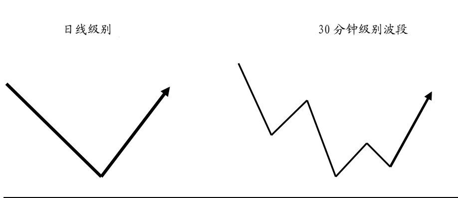
数据来源：国泰君安证券研究

图 7 顶部转折成功（日线级别下跌形成）概率：61%
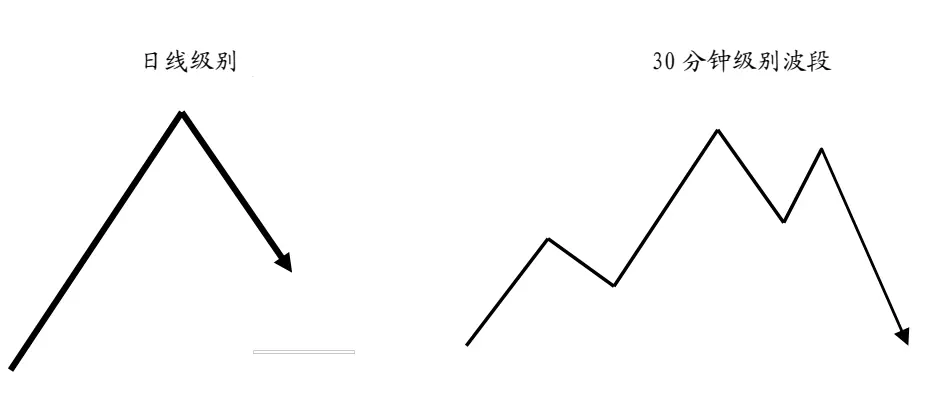
数据来源：国泰君安证券研究

图 8 底部转折成功（30分钟级别上涨形成）概率：64.3%
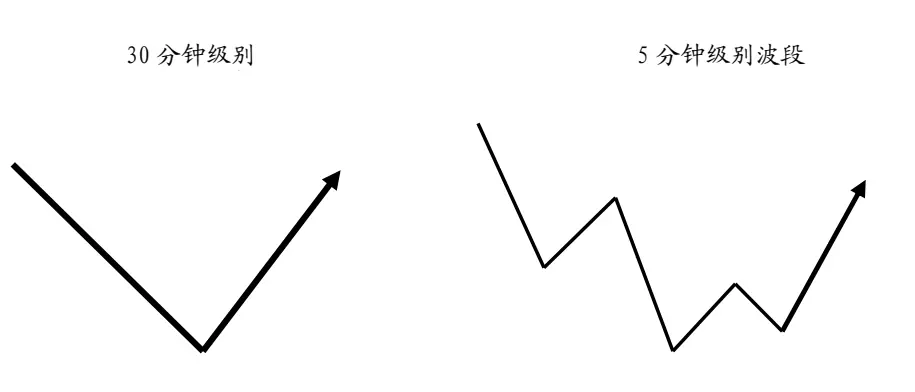
数据来源：国泰君安证券研究

图 9 顶部转折成功（30分钟级别下跌形成）概率：66.4%
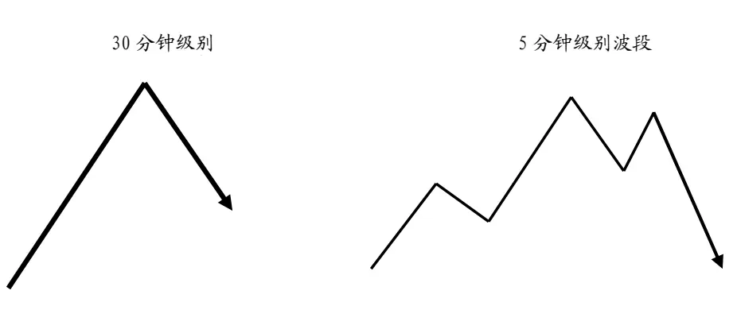
数据来源：国泰君安证券研究

有了以上的转折成功率统计分析，可以看出“不创新高离场”从统计角度有其合理性，日线级别的上涨行情在 30 分钟级别走势出现“不创新高”形态，离场正确的概率为 61%，而 30 分钟级别的上涨行情在 5分钟级别走势出现“不创新高”形态，离场正确的概率为 66.4%%。

综合以上，基于不创新高或者不创新低的形态选择离场或进场，基本上胜率都在60%以上，但最高不到70%，胜率并不显著。所以在实战过程中，需要借助其他维度来提高离场或进场的正确率，避免上涨中继状态被震出，或者在下跌中继状态选择进场。

## 2.2.基于左侧波段数的转折成功率统计

当价格走势顶部或者底部出现转折形态时，日线级别左侧已经走出的段数是不是会影响到转折的成功率？我们取 1 段、3 段、5 段、7 段、9段和 11 段，分组计算出现转折形态后的转折成功率。我们以日线级别与 30 分钟级别走势为例说明。

当日线级别出现顶部转折形态，左侧只有一个 30 分钟级别上涨段的情况，之后转为日线级别下跌次数 270，转折成功率 56.1%；当左侧已经出现 3 段时，之后转为日线级别下跌 645 次，转折成功率 63.7%。其他段数可以参考下表。

综合来看，无论是 30 分钟级别的转折形态还是 5 分钟级别的转折形态，左侧已经出现段数对转折成功率的影响微乎其微。

表 3：30分钟级别走势转折成功率统计

|  | 顶部出现转折形态 |  | 底部出现转折形态 |  |
| --- | --- | --- | --- | --- |
|  | 之后转为日线级别下跌次数 | 转折成功率 | 之后转为日线级别上涨次数 | 转折成功率 |
| 1段 | 270 | 56.1% | 440 | 61.9% |
| 3段 | 645 | 63.7% | 655 | 58.1% |
| 5段 | 484 | 61.3% | 518 | 55.5% |
| 7段 | 338 | 61.7% | 382 | 63.5% |
| 9段 | 203 | 62.5% | 205 | 60.7% |
| 11段 | 117 | 58.2% | 101 | 60.8% |

数据来源：国泰君安证券研究，WIND

30分钟级别走势和5分钟级别走势比较的话，可以发现，5分钟级别顶部转折成功率偏高，平均在66%以上，底部转折成功率在62%之上。二者都大于 30分钟级别的转折成功率水平。

表 4：5分钟级别走势转折成功率统计

|  | 顶部出现转折形态 |  | 底部出现转折形态 |  |
| --- | --- | --- | --- | --- |
|  | 之后转为日线级别下跌次数 | 转折成功率 | 之后转为日线级别上涨次数 | 转折成功率 |
| 1段 | 2040 | 65.6% | 2310 | 65.5% |
| 3段 | 2648 | 66.7% | 2731 | 64.0% |
| 5段 | 1770 | 66.9% | 1764 | 64.7% |
| 7段 | 960 | 66.2% | 905 | 62.7% |
| 9段 | 510 | 66.2% | 444 | 62.7% |
| 11段 | 237 | 66.2% | 237 | 64.2% |

数据来源：国泰君安证券研究，WIND

图 10 顶部转折成功（左侧 1段，日线级别下跌形成）概率：56.1%
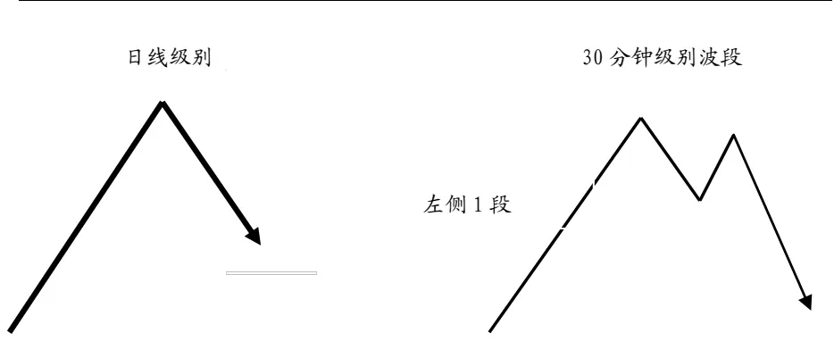

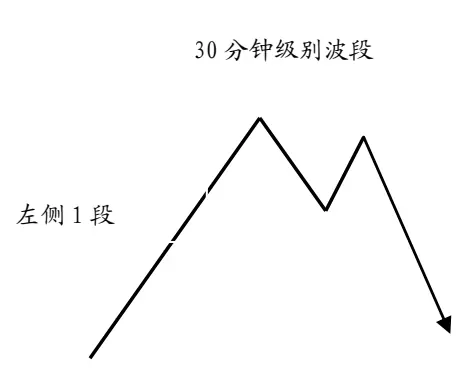
数据来源：国泰君安证券研究

图 11 顶部转折成功（左侧 3段：日线级别下跌形成）概率：63.7%
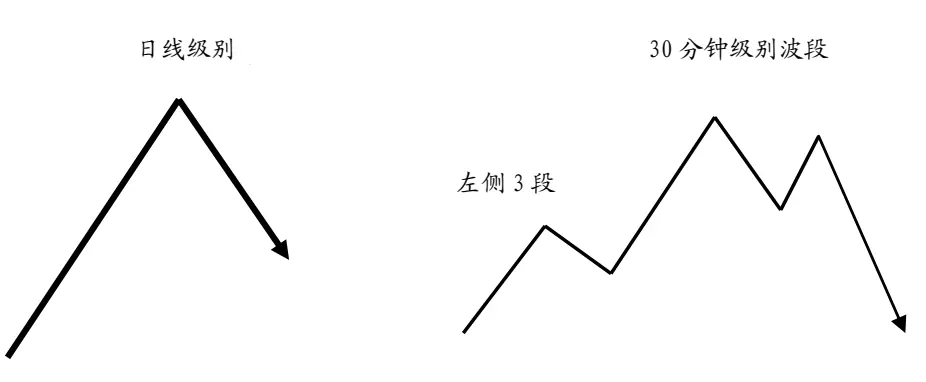
数据来源：国泰君安证券研究

图 12 顶部转折成功（左侧 5段：日线级别下跌形成）概率：61.3%
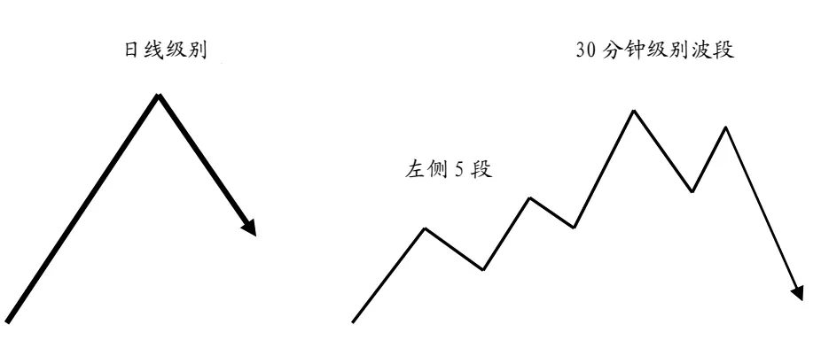
数据来源：国泰君安证券研究

图 13 顶部转折成功（左侧 7段：日线级别下跌形成）概率：61.7%
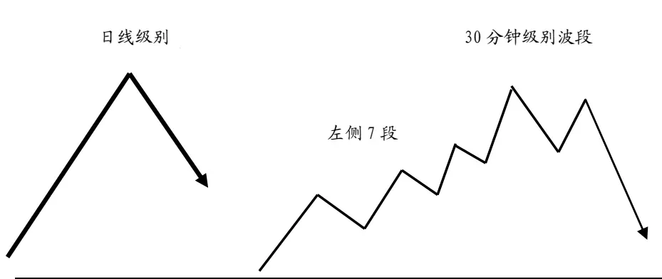
数据来源：国泰君安证券研究

## 本公司具有中国证监会核准的证券投资咨询业务资格

## 分析师声明

作者具有中国证券业协会授予的证券投资咨询执业资格或相当的专业胜任能力，保证报告所采用的数据均来自合规渠道，分析逻辑基于作者的职业理解，本报告清晰准确地反映了作者的研究观点，力求独立、客观和公正，结论不受任何第三方的授意或影响，特此声明。

## 免责声明

本报告仅供国泰君安证券股份有限公司（以下简称“本公司”）的客户使用。本公司不会因接收人收到本报告而视其为本公司的当然客户。本报告仅在相关法律许可的情况下发放，并仅为提供信息而发放，概不构成任何广告。

本报告的信息来源于已公开的资料，本公司对该等信息的准确性、完整性或可靠性不作任何保证。本报告所载的资料、意见及推测仅反映本公司于发布本报告当日的判断，本报告所指的证券或投资标的的价格、价值及投资收入可升可跌。过往表现不应作为日后的表现依据。在不同时期，本公司可发出与本报告所载资料、意见及推测不一致的报告。本公司不保证本报告所含信息保持在最新状态。同时，本公司对本报告所含信息可在不发出通知的情形下做出修改，投资者应当自行关注相应的更新或修改。

本报告中所指的投资及服务可能不适合个别客户，不构成客户私人咨询建议。在任何情况下，本报告中的信息或所表述的意见均不构成对任何人的投资建议。在任何情况下，本公司、本公司员工或者关联机构不承诺投资者一定获利，不与投资者分享投资收益，也不对任何人因使用本报告中的任何内容所引致的任何损失负任何责任。投资者务必注意，其据此做出的任何投资决策与本公司、本公司员工或者关联机构无关。

本公司利用信息隔离墙控制内部一个或多个领域、部门或关联机构之间的信息流动。因此，投资者应注意，在法律许可的情况下，本公司及其所属关联机构可能会持有报告中提到的公司所发行的证券或期权并进行证券或期权交易，也可能为这些公司提供或者争取提供投资银行、财务顾问或者金融产品等相关服务。在法律许可的情况下，本公司的员工可能担任本报告所提到的公司的董事。

市场有风险，投资需谨慎。投资者不应将本报告为作出投资决策的惟一参考因素，亦不应认为本报告可以取代自己的判断。在决定投资前，如有需要，投资者务必向专业人士咨询并谨慎决策。

本报告版权仅为本公司所有，未经书面许可，任何机构和个人不得以任何形式翻版、复制、发表或引用。如征得本公司同意进行引用、刊发的，需在允许的范围内使用，并注明出处为“国泰君安证券研究”，且不得对本报告进行任何有悖原意的引用、删节和修改。

若本公司以外的其他机构（以下简称“该机构”）发送本报告，则由该机构独自为此发送行为负责。通过此途径获得本报告的投资者应自行联系该机构以要求获悉更详细信息或进而交易本报告中提及的证券。本报告不构成本公司向该机构之客户提供的投资建议，本公司、本公司员工或者关联机构亦不为该机构之客户因使用本报告或报告所载内容引起的任何损失承担任何责任。

## 评级说明

## 1.投资建议的比较标准

投资评级分为股票评级和行业评级。

以报告发布后的12个月内的市场表现为比较标准，报告发布日后的12个月内的公司股价（或行业指数）的涨跌幅相对同期的沪深300指数涨跌幅为基准。

## 2.投资建议的评级标准

报告发布日后的 12 个月内的公司股价（或行业指数）的涨跌幅相对同期的沪深300指数的涨跌幅。

| 评级 |  | 说明 |
| --- | --- | --- |
| 股票投资评级 | 增持 | 相对沪深 300指数涨幅15%以上 |
|  | 谨慎增持 | 相对沪深300指数涨幅介于5%～15%之间 |
|  | 中性 | 相对沪深300指数涨幅介于-5%～5% |
|  | 减持 | 相对沪深300指数下跌5%以上 |
| 行业投资评级 | 增持 | 明显强于沪深 300 指数 |
|  | 中性 | 基本与沪深300指数持平 |
|  | 减持 | 明显弱于沪深300指数 |

## 国泰君安证券研究

|  | 上海 | 深圳 | 北京 |
| --- | --- | --- | --- |
| 地址 | 上海市浦东新区银城中路168号上海 银行大厦29层 | 深圳市福田区益田路 6009 号新世界 商务中心34层 | 北京市西城区金融大街 28 号盈泰中 心2号楼10层 |
| 邮编 | 200120 | 518026 | 100140 |
| 电话 | （021)38676666 | (0755)23976888 | (010)59312799 |
|  | E-mail: gtjaresearch@gtjas.com |  |  |