2014.07.18

金融工程

# 不确定性与事件投资策略 1：市场观察篇

## ——数量化专题之四十九

刘富兵（分析师）

刘正捷（研究助理）

8 021-38676673

0755-23976803

赵延鸿（研究助理）

liufubing008481@gtjas.com

021-38674927

证书编号 S0880511010017

liuzhengjie012509@gtjas.com

S0880112080087

zhaoyanhong@gtjas.com

S0880113070047

## 本报告导读：

我们通过理论分析和市场观察，发现利用市场交易数据挖掘的投资者不确定性指标，与事件前后股票收益有密切联系。未来将在此基础上进一步完善现有事件投资策略。摘要：

le_Summary] 通过证券市场上的交易数据来观察投资者内心的不确定性。证券市场所表现出的若干随机特征，如股价、交易量等，都是投资者内心的不确定性在外部世界的映射，而影响投资者内心变化的原因千千万，难以系统分析和预判众人内心未来变化趋势，但投资者的群体性心理波动会通过证券市场的交易数据表现出来。

在不确定的心理状态下，投资者倾向于交易，从而使得换手率、波动率等指标出现异动。不确定性本质是一种心理状态，让人难受，投资者会通过频繁的仓位调整行为以求摆脱这种心理状态，从而使得我们有可能通过市场交易数据来发现这些行为，进而在事件催化剂的驱动下寻找投资机会。

我们观察到换手率、波动率指标对股票在定期报告后的涨跌幅具有较好的区分作用。我们对定期报告数据进行处理后，使得策略在年报、半年报和三季报时期均可使用。通过对定期报告发布日（T）前市场数据的观察，发现：1、利润超预期水平和T-3累积收益与定期报告后累积收益的相关性均较强；2、无论是观察截面数据还是时间序列数据，均发现定期报告前换手率和波动率数据对事后股票的涨跌幅有良好的区分度。

- 在定增股解禁事件研究中，换手率、波动率指标也对股价事后波幅有不错的预测作用。我们发现定增股解禁前后跌幅较大的股票，其事前换手率、波动率都显著高于解禁前后股价平稳或上涨的股票。

- 目前指标的问题在于波动率与换手率的信息含量过于丰富。如能对其进一步过滤，或者提高数据频率，指标有效性有望进一步提升。

关于上述两套投资策略的具体构建方法与效果，请参见我们的后续报告《不确定性与事件投资策略 2：策略构建篇》

## 金融工程团队：

刘富兵：（分析师）

电话：021-38676673

邮箱：liufubing008481@gtjas.com

证书编号：S0880511010017

## 严佳炜：（分析师）

电话：021-38674812

邮箱：yanjiawei008776@gtjas.com

证书编号：S0880512110001

## 耿帅军：（分析师）

电话：010-59312753

邮箱：gengshuaijun@gtjas.com

证书编号：S0880513080013

## 徐康：（分析师）

电话：021-38674939

邮箱：xukang010849@gtjas.com

证书编号：S0880513080018

## 赵延鸿：（研究助理）

电话：021-38674927

邮箱：zhaoyanhong@gtjas.com

证书编号：S0880113070047

## 陈睿：（研究助理）

电话：021-38675861

邮箱：chenrui012896@gtjas.com

证书编号：S0880112120012

## 刘正捷：（研究助理）

电话：0755-23976803

邮箱：liuzhengjie012509@gtjas.com

证书编号：S0880112080087

## [Table_R相关报告

《价格走势之庖丁解牛系列:不创新高离场对吗?》2014.07.16

《基于行业趋势度的择时策略介绍》2014.07.11

《随机最优控制下的 AH 股配对交易策略》2014.06.03

## 1. 对“基于预期风险的 PEAD 策略”的简单回顾

## 1.1. 策略逻辑：投资者预期风险大小影响未来股价变化

投资者预期风险大小影响其对未来预期的边际变化。预期风险是指投资者对自身内心预期的不确定性，当定期报告出来后，投资者会在各自预期风险的影响下调整对未来的预期。预期风险越大，其对未来预期的调整幅度越大，调整时间越长，股价漂移现象越剧烈。

图 1：通过预期风险和业绩增长两条路径构建 PEAD策略
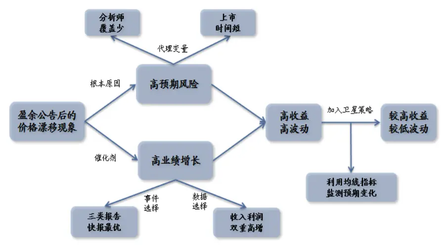
数据来源：国泰君安证券研究

## 1.2. 策略不完善之处：代理变量不够精确，适用范围有限

## 1.2.1. 用卖方分析师对股票的覆盖情况衡量投资者心理状态不足

投资者的心理变化，最好是从投资者的交易行为中进行解读。报告中，我们认为对于分析师覆盖较少和上市时间较短的股票，投资者的不确定性更大。这个结论基于我们的直觉所得到，从统计角度说也成立，否则策略不会形成持续的超额收益。但正如报告在策略反思中提到的：“分析师覆盖少，上市时间短就一定意味着投资者对公司预期的不确定性较大吗？也不是。这些条件与预期风险既无充分、也无必要关系，只是我们能够看得见的代理变量。”

## 1.2.2. 用上市时间和覆盖家数衡量预期风险，降低策略适用范围

由于近年 IPO 数量较少，上市时间短这一条件难以使用。在报告中，我们发现加入上市时间短这一条件后，策略收益得到了快速提升。然而实际中由于今年来 IPO基本处于停滞状态，因此这一条件暂时不具有可操作性。

分析师覆盖较少这一条件筛掉了一部分、但却极其重要的股票。从数量上看，分析师覆盖较多的股票并不是特别多，大概 500只左右，毕竟分析师精力有限。然而分析师关注度在一定程度上也代表了股票热度，这500 只股票基本都属于市场上受关注最多的股票，例如大型蓝筹股、行业龙头股、热门概念股等等。

## 1.2.3. 策略适用时间有限

受快报发布规则因素所致，策略的最佳适用时间是年报期，也可以在半年报期使用（可选股票数量不到年报期的一半），其他时间则无法进行操作。另一方面，由于交易所规定 3、4 月份公布年报的中小板、创业板公司必须在 2月底之前公布快报，对于其他定期报告和主板公司并无强制性规定，因此可操作的股票大都集中在 2 月下旬公布业绩快报的“3002”类股票。对于不发布业绩快报的公司，策略也无法进行操作。

基于上篇报告中总结的这些不完善之处，我们决定参照《寻找牛、熊股基本特征》中的研究方法，从市场观察开始，以重新探究如何度量投资者不确定性为着手点，希望能将上述问题一一解决。

## 2. 从交易数据中挖掘不确定性

## 2.1. 证券市场中，不确定性本质上是一种心理状态

股票投资，无非是寻找股票价格与价值之差，而价格与价值都受到投资者主观心理作用驱使。价值是投资者在各自的心理驱使下根据自己掌握的信息和逻辑而形成的预期，并最终产生的一个判断；价格是投资者根据各自的价值判断，拿着交易工具在市场上按照交易规则在各自的心理行为指导下，交易出来的结果。可见股价的涨跌，以及伴随而来的股价特征（随机游走也好、趋势性走势也好），归根结底都是受到投资者心理影响的。

证券市场所表现出的若干随机特征，如股价、交易量等，都是投资者内心的不确定性在外部世界的映射。自然科学范畴内，不确定性是未来事件的基本特征，随着量子力学中“不确定性原理”的确立，不确定性甚至成为了世界的普遍特征。而在股票市场中，我们认为不确定只是体现在客观标的物状态分布的不稳定性，本质上是人的主观心理状态。

影响投资者内心变化的原因千千万，难以进行系统分析进而预判众人内心未来变化趋势。投资者内心状态与股票基本面有关吗？有关；与股价走势图有关吗？有关；与自身的股票仓位有关吗？有关；与投资者性格有关吗？有关；与时间有关吗？也有关，正如人不可能踏入同一条河流一样。影响投资者心理状态的因素实在太多，猜测内心变化成为几乎不可完成的任务。

虽然无法系统分析，但投资者的群体性心理波动会通过证券市场的交易数据表现出来。虽然我们难以通过归因分析去探究投资者内心变化的原因，但市场群体性的心理波动是一定会在市场的交易指标中表现出来，因此可以通过市场交易数据去观察和感受投资者心理状态变化。

## 2.2. 内心的“围城”状态导致标的呈现高波动、高换手特征

在不确定的心理状态下，投资者倾向于交易，尤其对于信息相对匮乏的个人投资者。对未来不确定性较大的心理状态会让人不舒服，并陷入一种心理“围城”状态：拿着股票的人睡不着，害怕第二天自己持有的股票大幅下跌；拿着钱的人也睡不着，害怕踏空那只自己关注已久的股票。在这种心理状态下，投资者会想方设法去摆脱：比如向上市公司、卖方分析师等打听消息，关心其他人的持股状态，关心股价、成交量有无异常等。在此基础上，还会进行频繁的仓位调整以求得心理上的安慰，这一点对于信息相对匮乏的个人投资者尤甚。

过度交易下，股票将表现出波动率变大，换手率上升的特征。频繁的仓 位调整必然使得股票换手率上升，同时带来股价波动。回顾文献，我们 看到 Ang et al.（2003），Guohua Jiang, Charles M. C. Lee, Yi Zhang（2005） 等也曾用波动率、交易量等指标衡量股票的信息不确定程度。

## 2.3. 不确定性决定了股价的运动幅度

不确定性其衡量了投资者内心对消息的敏感性，表现为股价对信息的敏感性，本身与股价涨跌方向没有必然联系。为什么同样是好消息，在不同时点对同一只股票的刺激作用不同？为什么在同一时间段的好消息，对不同股票的刺激作用也不同？也许是信息 price in 的程度不同，但其实信息究竟在多大程度被 price in，没人知道，也无法证伪。往往是当大家都不知道股价涨跌的原因时，信息没有被充分 price in 便成了最后的解释。

不确定性决定股价运动幅度，事件好坏决定股价运动方向。我们认为不确定性能在一定程度上回答上述问题：当投资者对未来的不确定性较大时，对信息的敏感度自然提升，导致股价相对信息的弹性较大；当投资者对未来的不确定性较小时，对信息的敏感性下降，导致股价相对信息的弹性较小。

图 2：不确定性 + 事件冲击 = Δ股价
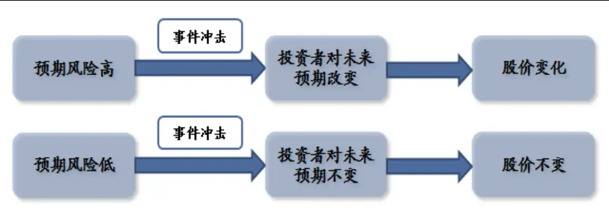
数据来源：国泰君安证券研究

所谓事件的好坏，最终也是通过股价走势而被证实的。我们认为事件的好坏与否，最终只能通过市场走势而后验，股价涨了，自然是好消息，股价跌了，那就是坏消息。每个人对消息的好坏都有自己的判断，在主观判断之上所做的交易也会成为市场买卖力量的一部分，但是最终决定股价走势的缺不是个人判断，还是投资者的内心。因此，如有可能，在事件催化剂上，也应尽量抛开主观因素，从市场交易数据中寻找线索。

## 3. 观测指标有效性：以定期报告事件为例

## 3.1. 对 PEAD 策略的进一步改进

在《基于预期风险的 PEAD策略》报告中，我们仅针对发布业绩快报的股票进行检验，并且以业绩较上一年大幅增长为催化剂，这些多少都对策略的实际操作造成了一些不便捷。在这篇报告中我们希望对这些问题一一做出改进。

## 3.1.1. 如何将没有公布业绩快报的股票纳入策略之中？

上篇报告中，我们之所以用公布业绩快报的股票，是综合考虑到报告的可靠性和及时性。其实，对于没有公布业绩快报的公司，以定期报告作为事件催化剂依然及时，策略方法同样适用。

这篇报告中，我们在处理数据上采用的方法是：对于公布业绩快报的公司，以业绩快报日作为观察基准日（T 日），对于只公布定期报告的公司，以定期报告日作为观察基准日。

## 3.1.2. 用分析师一致预期替代上年业绩作为市场预期基准

由于在上篇报告中，我们以分析师覆盖数量较少作为投资者不确定性高的代理变量，因此无法使用分析师一致预期数据，只能用相较于上年业绩的增长比率作为事件催化剂。这次我们希望能抛开分析师覆盖数量这一条件，利用市场交易数据来观察投资者不确定性，因此能够用分析师一致预期替代上年业绩作为市场预期基准。

具体计算上，我们采用了朝阳永续的一致预期数据，数据时间段选择在[T - 3, T - 93]之间。

该方案考虑到了市场预期这一问题，较之前有进步，但依然不是最优。市场预期存在于投资者而非卖方分析师中，A股市场的投资者结构也决定了以服务机构客户为主的卖方分析师影响力有限。因此卖方分析师的预期不能代替市场一致预期数据，要想寻找市场一致预期，唯有观察市场数据。只有股价的运动方向才是决定消息好坏的根本。

## 3.1.3. 如何将策略运用于半年报、三季报中？

无论是基于业绩预告、快报还是定期报告的事件投资策略，但凡用到分析师一致预期数据就很难用在 2季报和 3 季报之中。主要原因是 wind、朝阳永续中的一致预期数据只针对一整年业绩，没有季报数据。为了让基于定期报告的事件性投资策略能够用在半年报、三季报之中，我们设想了三种方案。

表 1：处理数据时需考虑季节以及业绩增速对结果的影响

| 案例说明 |  | 优缺点 | 是否采用 |
| --- | --- | --- | --- |
| 方案一 | 1、不对实际业绩做处理； | 没有考虑季节因素， | x |
|  | 2、用分析师对当年业绩的一致预期 | 对业绩明显受季节因 |  |
|  | 数据乘以1/2、3/4，分别得到半年报、 三季报的一致预期 | 素影响的公司不适用 |  |
| 方案二 | 1、不对分析师预期数据做处理； | 没有考虑到公司业绩 | × |
|  | 2、用最近4个单季度财务报告数据 | 增速，对于业绩高增 |  |
|  | 之和作为当年实际业绩的代理变量 | 长的公司不适用 |  |
| 方案三 | 1、不对分析师预期数据做处理； | 既去除了季节因素影 |  |
|  | 2、用已出业绩 + 已出业绩同比增 | 响，也考虑到了增长 | √ |
|  | 速×（当年未出业绩的上年值）作 为当年实际业绩的代理变量 | 率的影响 |  |

数据来源：国泰君安证券研究

显然，方案三的处理方法相对来说最好。同时，从报告类型来看，相对于二季报，方案应用于三季报的效果更好。

## 3.2. 数据处理说明：ZZ800 中三年数据样本

股票池选择范围上，我们利用了中证 800 的成份股作为观察标的。这样一是为了控制市值规模，二是为了后期能更好的构建指数增强或绝对收益策略。

回溯检验时间上，由于 2014 年年报已全部出完，因此对年报事件的检验时间范围是 2011年 -2014 年四年时间，共约 3200个样本；中报和三季报事件的检验时间范围是 2011年 -2013年三年时间，共约 2400个样本。在实证观察中，我们分别对年报、中报和三季报的数据进行集中处理。

之前的报告中，我们发现快报后策略收益基本集中在 20个交易日以内，因此在这篇报告里，我们以观察基准日后 20 个交易日股票的累计收益率作为标准，将股票分为 20档，观察这 20 档股票的收益和波动特征。

## 3.3. 年报事件市场观察结果与我们预期相符

首先，我们观察基准日后 20 个交易日股票的累计收益与事件催化剂间的相关关系。秩相关检验结果表明，事后收益与利润超预期程度、T-3累计收益相关性均较高，而与收入超预期程度的相关性相对较低。

图 3：收入超预期程度与事后收益有一定的相关性
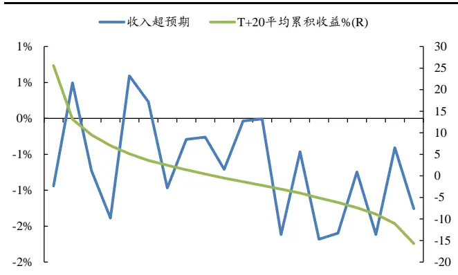
数据来源：Wind，朝阳永续，国泰君安证券研究

图 4：利润超预期程度与事后收益相关性很高
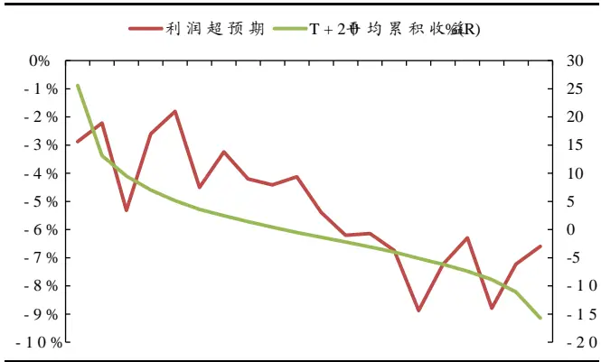
数据来源：Wind，朝阳永续，国泰君安证券研究

表 2：利润超预期程度与事后收益的相关性最高

|  | 收入 | 利润 | T-3 累计收益 |
| --- | --- | --- | --- |
| 秩相关系数 | 42% | 87% | 76% |

数据来源：Wind，朝阳永续，国泰君安证券研究

图 5：T-3累计收益与事后收益相关性较高
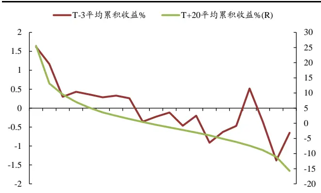
数据来源：Wind，国泰君安证券研究

然后，我们从截面数据的角度，观察事后收益与投资者事前不确定性的相关关系。我们分别计算了 20档股票的事前平均换手率和平均波动率，同时为测试结果敏感性，同时利用了三个时间区间，分别是[T -40, 0]、[T -20, 0] 和 [T -10, 0]。结果发现，随着事后累积收益从正收益逐渐下降到 0 附近，换手率和波动率都在逐渐下降；随着收益由正转负并进一步降低，换手率和波动率又开始逐渐增大。并且这种特征对时间区间的取值范围不敏感。

同时，我们发现换手率、波动率的这种波动特征呈现出非对称性。相对于事后上涨较多的股票，事后下跌股票的换手率、波动率更高。

图 6：事后收益绝对值与事前换手率成正向关系
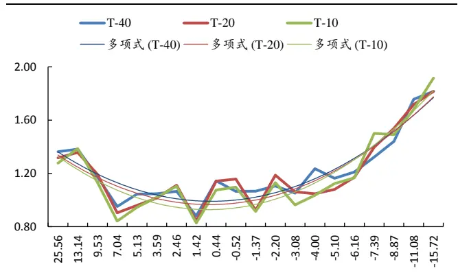
数据来源：Wind，国泰君安证券研究

图 7：事后收益绝对值与事前波动率成正向关系
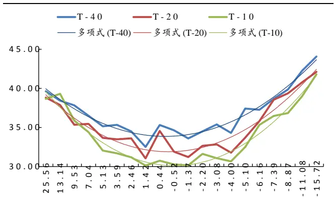
数据来源：Wind，国泰君安证券研究

最后，我们从时间序列的角度，观察事后收益与投资者事前不确定性的相关关系。我们在 20 档股票的基础上，按照事后累计收益率将其分为高正收益组、正收益组、零收益组、负收益组和高负收益组共 5组，每组股票数量尽量保持接近。然后观察各组股票在[T-35，T-3] 间平均换手率和波动率的变化趋势。

数据处理方面，由于不同股票受自身性质影响，换手率和波动率会天然高低不一，因此我们对数据进行了标准化处理。对于换手率，方法是用每只股票事前换手率除以其 T-40日的换手率；对于波动率，用事前的 5日波动率除以其[T-35，T-30] 日的波动率。

图 8：高波动组换手率显著高于低波动组换手率
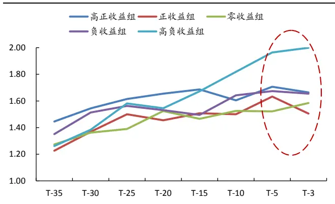
数据来源：Wind，国泰君安证券研究

图 9：高波动组波动率显著高于低波动组换手率
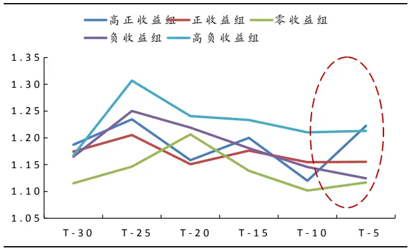
数据来源：Wind，国泰君安证券研究

结果发现高负收益组和高正收益组的换手率、波动率显著高于其他组的换手率、波动率，且随着临近事件日，特征愈发显著。

## 3.4. 半年事件市场报观测结果稍差

半年报事件催化剂方面，市场数据远比卖方分析师一致预期数据有效。

之前提到我们对实际业绩的处理方法在半年报的效果可能较差。事实确实如此，收入超预期水平与事后累计收益无显著线性相关关系，利润超预期水平的相关关系也较弱。但同时，我们发现 T-3 日收益率与事后收益率的秩相关系数高达 85%，非常显著。

图 10：收入超预期程度与事后收益无相关性
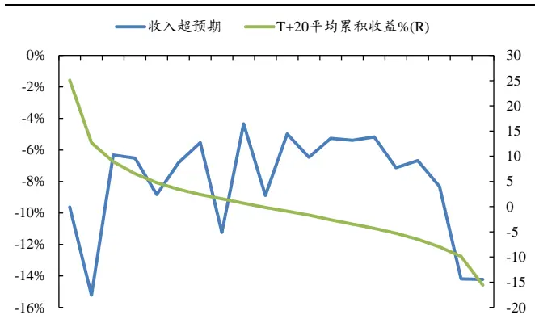
数据来源：Wind，朝阳永续，国泰君安证券研究

图 11：利润超预期程度与事后收益相关性较弱
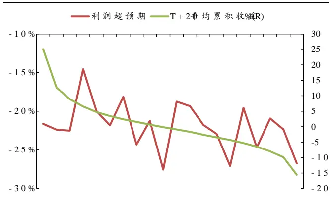
数据来源：Wind，朝阳永续，国泰君安证券研究

表 3：T-3累计收益与事后收益的相关性最高
图 12：T-3累计收益与事后收益相关性很高

|  | 收入 | 利润 | T-3 累计收益 |
| --- | --- | --- | --- |
| 秩相关系数 | -2% | 26% | 85% |

数据来源：Wind，朝阳永续，国泰君安证券研究

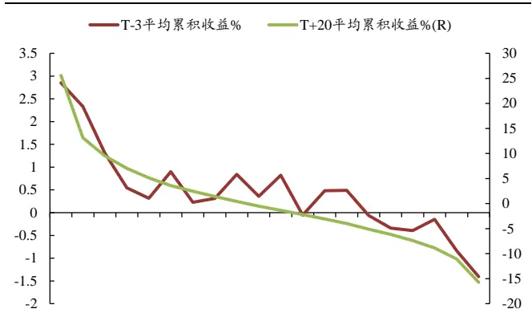
数据来源：Wind，国泰君安证券研究

截面数据方面，半年报的事前换手率、波动率特征与年报相似。事前换手率、波动率依然呈现了随着收益下降，先下降再上升的特征，并且相对于事后上涨较多的股票，事后下跌股票的换手率、波动率更高。

图 13：事后收益绝对值与事前换手率成正向关系
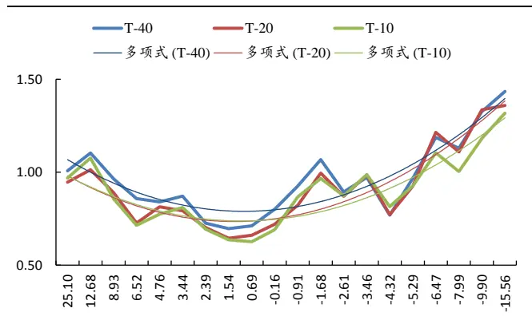
数据来源：Wind，国泰君安证券研究

图 14：事后收益绝对值与事前波动率成正向关系
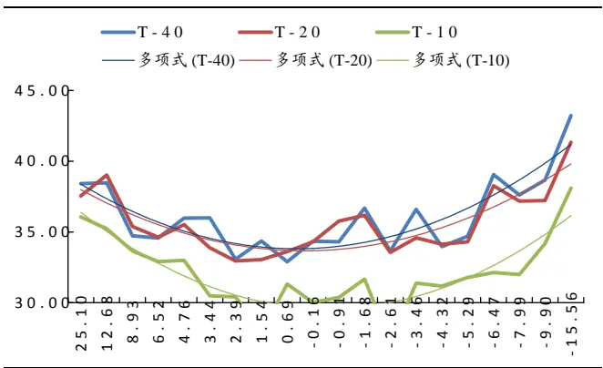
数据来源：Wind，国泰君安证券研究

时间序列方面，半年报的事前换手率特征依然明显，但是波动率无明显特征。高负收益组和高正收益组的换手率依然显著高于其他组，但波动率方面，除了高负收益组显著偏低外，各组差异不大。

图 15：高波动组换手率显著高于低波动组换手率
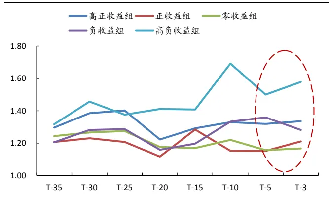
数据来源：Wind，国泰君安证券研究

图 16：波动率方面，半年报事件无显著特征
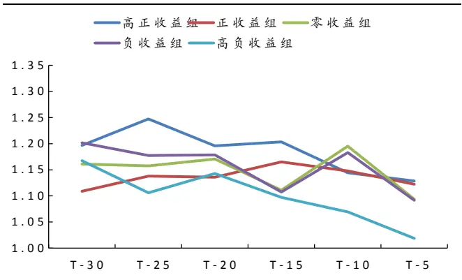
数据来源：Wind，国泰君安证券研究

## 3.5. 三季报事件市场观测效果与我们预期一致

三季报中，事后收益与年收入超预期程度的秩相关性回升到 45%，依然不高，但与利润的相关性上升到 87%，与 T-3累计收益的相关性在 60%。

图 17：收入超预期程度与事后收益相关性依然有限
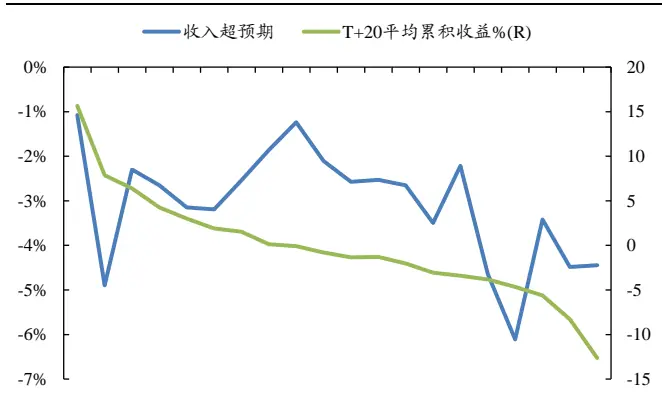
数据来源：Wind，朝阳永续，国泰君安证券研究

图 18：利润超预期程度与事后收益相关性回到高位
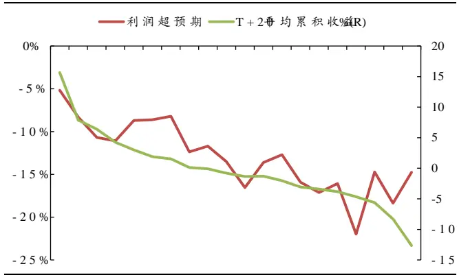
数据来源：Wind，朝阳永续，国泰君安证券研究

表 4：利润超预期程度与事后收益的相关性最高

|  | 收入 | 利润 | T-3 累计收益 |
| --- | --- | --- | --- |
| 秩相关系数 | 45% | 87% | 60% |

数据来源：Wind，朝阳永续，国泰君安证券研究

图 19：T-3累计收益与事后收益相关性较高
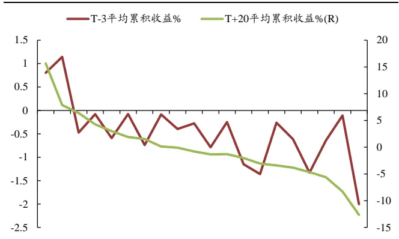
数据来源：Wind，国泰君安证券研究

截面数据方面，三季报的事前换手率、波动率特征与年报相似。事前换手率、波动率依然呈现了随着收益下降，先下降再上升的特征，并且相对于事后上涨较多的股票，事后下跌股票的换手率、波动率更高。

图 20：事后收益绝对值与事前换手率成正向关系
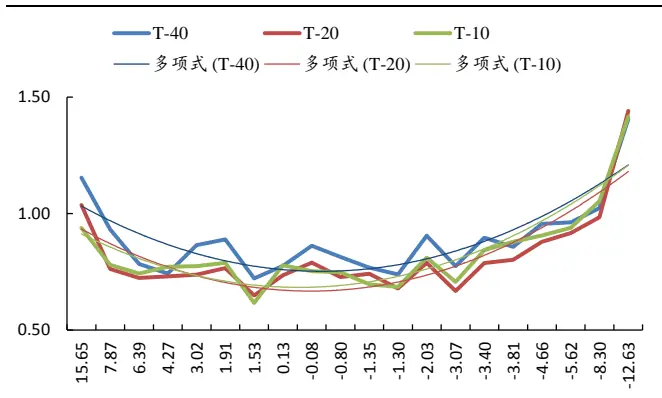
数据来源：Wind，国泰君安证券研究

图 21：事后收益绝对值与事前波动率成正向关系
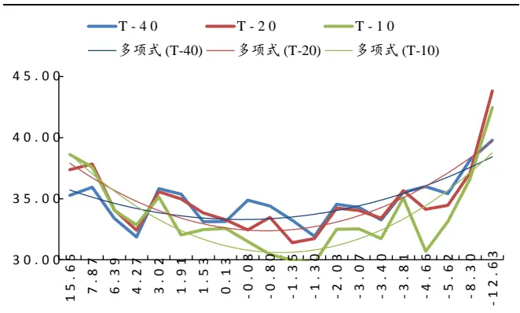
数据来源：Wind，国泰君安证券研究

时间序列方面，三季报的事前换手率特征明显，波动率特征较为显著。高负收益组和高正收益组的换手率依然显著高于其他组；波动率方面，高正收益组和正收益组波动率较高，负收益组和零收益组的波动率较低。

图 22：高波动组换手率显著高于低波动组换手率
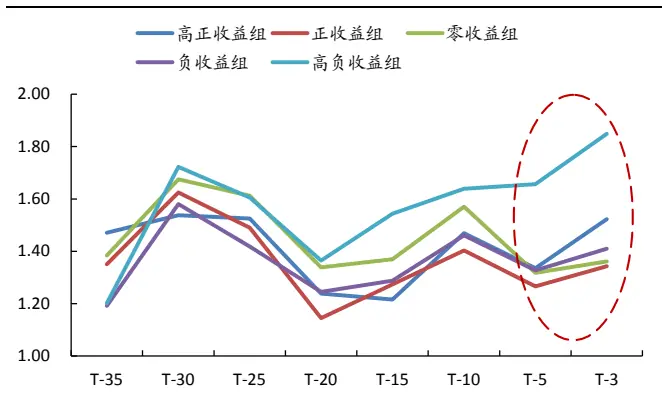
数据来源：Wind，国泰君安证券研究

图 23：正收益组波动率显著高于负收益组和零收益组
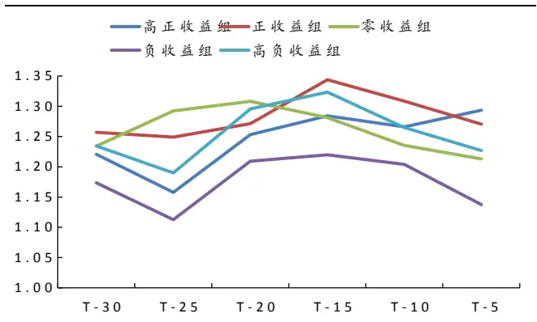
数据来源：Wind，国泰君安证券研究

## 3.6. 观测结果总结：策略中需重视利用市场交易数据

## 3.6.1. 观察市场一致预期，不可忽略交易数据

利润超预期数据的相关性最强，T-3 累积收益的相关性最为稳定。事后收益与收入超预期水平的年报、半年报、三季报秩相关系数分别为 42%、-2%、45%；与利润超预期水平的秩相关系数分别为 87%、26%、87%；与 T-3 累积收益的秩相关系数分别为 76%、85%、60%。利润超预期水平的相关性在一季度和三季度非常显著，而 T-3 累积收益的相关性较为稳定，且恰恰在二季度达到高点。因此在实际操作中，可结合利润超预期数据和 T-3累计收益作为事件催化剂。

## 3.6.2. 换手率数据较之波动率，在衡量不确定性的效果更优

时间序列数据的观察结果发现，换手率数据较之波动率数据规律性更强。我们认为主要原因在于当投资者处于不确定性状态时，频繁交易必然会带来换手率的上升，但股价波动率上升却不是必然，换手率上升传导到股价的过程还受到股票流动性的影响。

## 4. 限售股解禁案例中，市场指标有效性依然显著

## 4.1. 限售股解禁事件对股价的影响存在不确定性

在《统计结合个案分析，把握确定性对冲机会》的报告中，我们通过统计数据发现，在市场预期定增股解禁上市后被抛售的环境下，股价在解禁日前 6个交易日左右开始出现下跌。如果采用简单的融券卖空并买入HS300 指数对冲策略，胜率略超 60%.

限售股解禁在客观上将会增加股票供给，但经过投资者的主观解读后究竟如何影响股价并不确定。很多投资者认为限售股解禁对股价是负面消息，这一点确定无疑，因而这里没有不确定性问题。如果真是这样，那么我们策略的胜率就应该是 100%，而不仅仅是 60%出头了。其实所谓消息的好与坏，唯一的衡量标准是消息发出前后股价走势，而与投资者对消息的主观解读无必然联系。由于股价走势不存在必然性，因此在股价出现变化之前，所有的消息都具有不确定性，只是不确定性是大还是小。

在限售股解禁案例中，投资者的不确定性体现在解禁日前后，股价是否会有大幅下跌。不确定性越大，在解禁日前后股价下跌的幅度和概率就越大；不确定性较小，则股价在解禁日前后波动较小。

## 4.2. 利用[T-6，T+2]累计收益观察市场指标变化

## 4.2.1. 下跌主要集中在解禁前 6个交易日和解禁后 2个交易日之间

我们在 2011/7/7 -2014/7/7共 4年的时间范围内，筛选出所有存在定向增发股解禁、且解禁规模占流通 A 股股本 5%以上的股票，共计 300 例。设解禁日为 T，我们从第 T-30交易日开始，计算每只股票相较于 HS300的每日相对收益率，直到 T+5日结束。

图 24：自 T-6日起，股价开始出现明显的负向超额收益
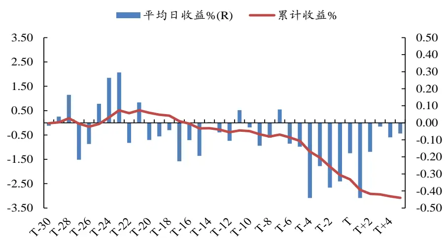
数据来源：Wind，国泰君安证券研究

股价下跌集中在[T-6，T+2]意味着策略开仓时间选择在 T-5日左右为宜，因此我们计算了每只股票在该区间的累计收益并排序，再来分组观察T-6之前各组股票不确定性指标是否存在规律。

## 4.2.2. 跌幅较大股票解禁前换手率明显更高

样本内的所有股票在[T-30，T+2]交易日内换手率显著上升，表明限售股解禁事件下，投资者不确定性上升。我们从 T-40 日开始，以 10 个交易日为单位滚动计算各只股票的换手率，并进一步计算每天该指标较上一日的增长率。结果发现从 T-30日起，滚动换手率的增长率开始为正，一直到 T+2 日才降为负值。

图 25：所有股票换手率在[T-30，T+2]交易日内持续上升
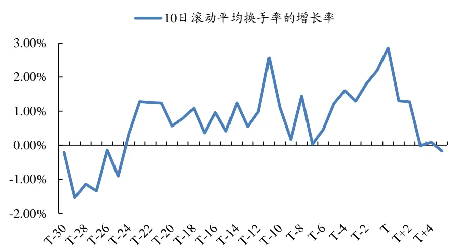
数据来源：Wind，国泰君安证券研究

我们将 300 只股票按照[T-6，T+2]的累计收益率分为正收益组、零收益组和负收益组，观察各组股票在[T-30，T-7]间每日平均换手率的变化趋势。由于下跌股票数量较多，因此样本数量更多。

表 5：样本收益总体偏负，因此负收益组数量更多

|  | 样本数量 | [T-6，T+2]平均收益率 | 区间收益率范围 |
| --- | --- | --- | --- |
| 正收益组 | 60 | 4.70% | [2.25%， 18.20%] |
| 零收益组 | 90 | -0.01% | [-1.80%, 2.19%] |
| 负收益组 | 150 | -8.48% | [-22.93%, -1.84%] |
| 总体 | 300 | -1.26% | [-22.93%， 18.20%] |

数据来源：Wind，国泰君安证券研究

这里我们也对区间内的日换手率进行了标准化处理。处理方法是用每只股票每日换手率除以其[T-40、T-30]的平均换手率。

负收益组股票换手率显著高于正收益组和零收益组。虽然负收益组样本数量占到总样本数量一半，但是我们依然可以观察到负收益组股票平均换手率显著高于平均水平，同时也显著高于正收益组和零收益组。

图 26：负收益组股票换手率显著高于正收益组和零收益组水平
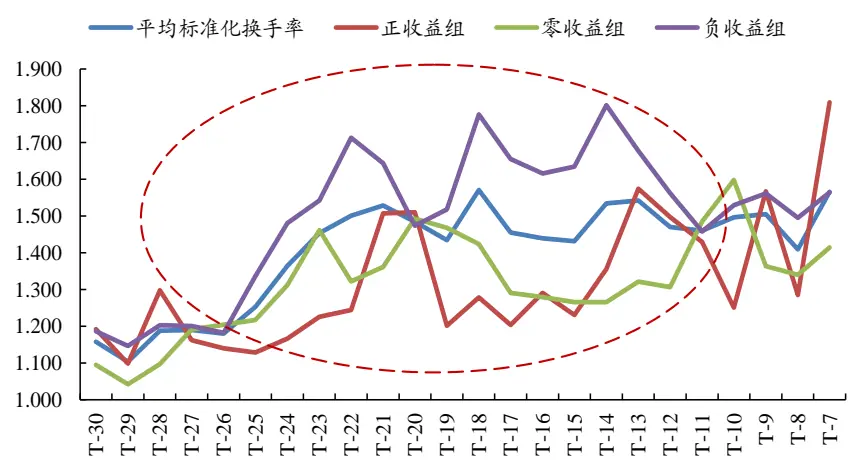
数据来源：Wind，国泰君安证券研究

## 4.2.3. 跌幅较大股票解禁前波动率明显更大

我们按照与换手率相同的办法，按收益率分组观察股票的平均波动率特征。所不同的是计算波动率的方法，我们从 T-40 日开始，以 10 个交易日为单位滚动计算各只股票的区间波动率。这里同样存在股票属性不同带来波动率不一致问题，我们以各只股票[T-40、T-30]的波动率为基准，用之后的区间波动率除以这一基准，得到标准化波动率。

图 27：负收益组股票波动率显著高于平均波动率水平
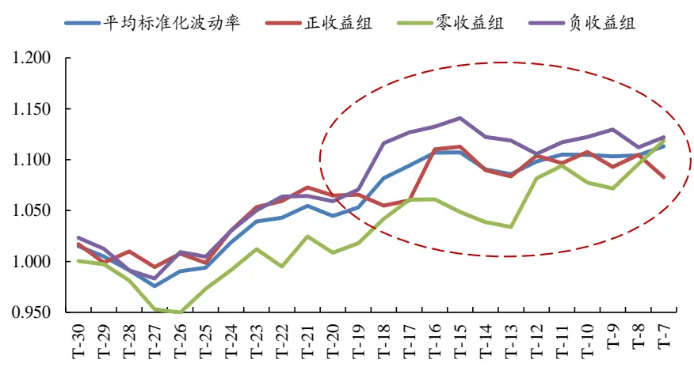
数据来源：Wind，国泰君安证券研究

临近解禁日，样本股票波动率水平逐渐上升，解禁前大部分时间内，负收益组股票波动率都要高于平均水平，零收益组股票波动率显著低于平均水平。与换手率规律类似，负收益组股票波动率显著高于样本平均水平，同时我们看到零收益组波动率水平一直大幅低于平均波动率水平。

## 5. 以市场指标为本，重构投资策略——思路展望

## 5.1. 重构 PEAD 投资策略与定增解禁对冲策略

## 5.1.1. 用市场指标衡量不确定性，在事件中加入 T-3日收益因素

- 不确定性方面，用市场指标（换手率与波动率）代替分析师覆盖和上市时间指标。比较维度既可以是横截面，也可是时间序列上；

- 事件催化剂方面，用相对于分析师一致预期利润增长率替代相较于

上一年利润增长率，同时加入 T-3日收益因素；

- 策略适用范围方面，无论上市公司是否发布快报，无论是年报、半年报还是三季报期，均采用策略进行筛选。

## 5.1.2. 加入不确定因素，放松其他限制，提高定增解禁策略操作次数

- 观察股票解禁前换手率与波动率是否在时间维度上有上升趋势；

- 适当放松对金融机构持股比例较高和解禁日前后价格高于定增价这两个假设条件，以增加策略的可操作次数。

## 5.2. 建立 HUSP，随时应对突发事件

## 5.2.1. 催化事件来临时，从 HUSP 中甄选高弹性个股

考虑建立高不确定性股票池（High Uncertainty Stock Pool，简称 HUSP），当信息冲击来临时（既可以是新闻消息，也可以是交易信息），从 HUSP中选出不确定性较高的股票买入或融券卖空。

## 5.2.2. 现有不确定性衡量指标较为粗糙，还需要进一步过滤

波动率与换手率的信息含量过于丰富，如能进一步过滤，则指标有效性有 望 进 一 步 提 升 。 Schultz （ 2005 ） 曾 在 <Discussion of InformationUncertainty and Expected Returns>中对 Guohua Jiang etc.（2005） 文章中所用的不确定性衡量指标提出质疑，交易量高可能暗示除了信息不确定之外的很多因素。我们认为股票自身的流动性、市值规模都对波动率与换手率数据存在影响。

同时，增加数据频率也能提升指标有效性。随着数据频率的下降，数据所包含信息也在下降。现有波动率数据只能抓住日级别的特征，对日内特征无能为力，或者说只用到了每日收盘价，而忽略了最高价和最低价。

关于上述两套投资策略的具体构建方法与效果，请参见我们的后续报告《不确定性与事件投资策略 2：策略构建篇》

## 本公司具有中国证监会核准的证券投资咨询业务资格

## 分析师声明

作者具有中国证券业协会授予的证券投资咨询执业资格或相当的专业胜任能力，保证报告所采用的数据均来自合规渠道，分析逻辑基于作者的职业理解，本报告清晰准确地反映了作者的研究观点，力求独立、客观和公正，结论不受任何第三方的授意或影响，特此声明。

## 免责声明

本报告仅供国泰君安证券股份有限公司（以下简称“本公司”）的客户使用。本公司不会因接收人收到本报告而视其为本公司的当然客户。本报告仅在相关法律许可的情况下发放，并仅为提供信息而发放，概不构成任何广告。

本报告的信息来源于已公开的资料，本公司对该等信息的准确性、完整性或可靠性不作任何保证。本报告所载的资料、意见及推测仅反映本公司于发布本报告当日的判断，本报告所指的证券或投资标的的价格、价值及投资收入可升可跌。过往表现不应作为日后的表现依据。在不同时期，本公司可发出与本报告所载资料、意见及推测不一致的报告。本公司不保证本报告所含信息保持在最新状态。同时，本公司对本报告所含信息可在不发出通知的情形下做出修改，投资者应当自行关注相应的更新或修改。

本报告中所指的投资及服务可能不适合个别客户，不构成客户私人咨询建议。在任何情况下，本报告中的信息或所表述的意见均不构成对任何人的投资建议。在任何情况下，本公司、本公司员工或者关联机构不承诺投资者一定获利，不与投资者分享投资收益，也不对任何人因使用本报告中的任何内容所引致的任何损失负任何责任。投资者务必注意，其据此做出的任何投资决策与本公司、本公司员工或者关联机构无关。

本公司利用信息隔离墙控制内部一个或多个领域、部门或关联机构之间的信息流动。因此，投资者应注意，在法律许可的情况下，本公司及其所属关联机构可能会持有报告中提到的公司所发行的证券或期权并进行证券或期权交易，也可能为这些公司提供或者争取提供投资银行、财务顾问或者金融产品等相关服务。在法律许可的情况下，本公司的员工可能担任本报告所提到的公司的董事。

市场有风险，投资需谨慎。投资者不应将本报告为作出投资决策的惟一参考因素，亦不应认为本报告可以取代自己的判断。在决定投资前，如有需要，投资者务必向专业人士咨询并谨慎决策。

本报告版权仅为本公司所有，未经书面许可，任何机构和个人不得以任何形式翻版、复制、发表或引用。如征得本公司同意进行引用、刊发的，需在允许的范围内使用，并注明出处为“国泰君安证券研究”，且不得对本报告进行任何有悖原意的引用、删节和修改。

若本公司以外的其他机构（以下简称“该机构”）发送本报告，则由该机构独自为此发送行为负责。通过此途径获得本报告的投资者应自行联系该机构以要求获悉更详细信息或进而交易本报告中提及的证券。本报告不构成本公司向该机构之客户提供的投资建议，本公司、本公司员工或者关联机构亦不为该机构之客户因使用本报告或报告所载内容引起的任何损失承担任何责任。

## 评级说明

## 1.投资建议的比较标准

投资评级分为股票评级和行业评级。

以报告发布后的12个月内的市场表现为比较标准，报告发布日后的12个月内的公司股价（或行业指数）的涨跌幅相对同期的沪深300指数涨跌幅为基准。

## 2.投资建议的评级标准

报告发布日后的 12 个月内的公司股价（或行业指数）的涨跌幅相对同期的沪深300指数的涨跌幅。

| 评级 |  | 说明 |
| --- | --- | --- |
| 股票投资评级 | 增持 | 相对沪深 300指数涨幅15%以上 |
|  | 谨慎增持 | 相对沪深300指数涨幅介于5%～15%之间 |
|  | 中性 | 相对沪深300指数涨幅介于-5%～5% |
|  | 减持 | 相对沪深300指数下跌5%以上 |
| 行业投资评级 | 增持 | 明显强于沪深 300 指数 |
|  | 中性 | 基本与沪深300指数持平 |
|  | 减持 | 明显弱于沪深300指数 |

## 国泰君安证券研究

|  | 上海 | 深圳 | 北京 |
| --- | --- | --- | --- |
| 地址 | 上海市浦东新区银城中路168号上海 银行大厦29层 | 深圳市福田区益田路 6009 号新世界 商务中心34层 | 北京市西城区金融大街 28 号盈泰中 心2号楼10层 |
| 邮编 | 200120 | 518026 | 100140 |
| 电话 | （021)38676666 | (0755)23976888 | (010)59312799 |
|  | E-mail: gtjaresearch@gtjas.com |  |  |