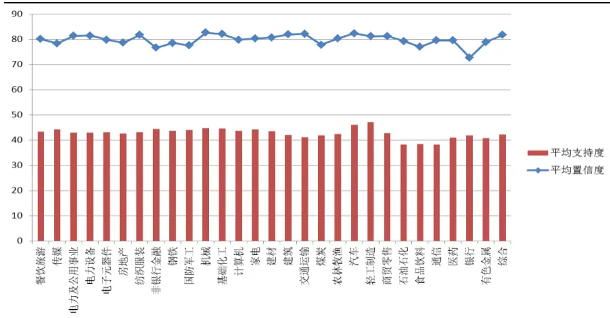
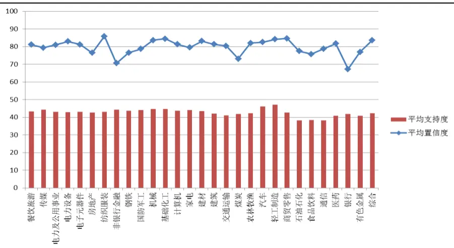
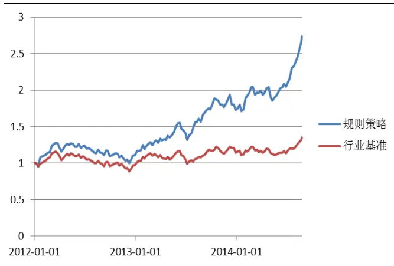
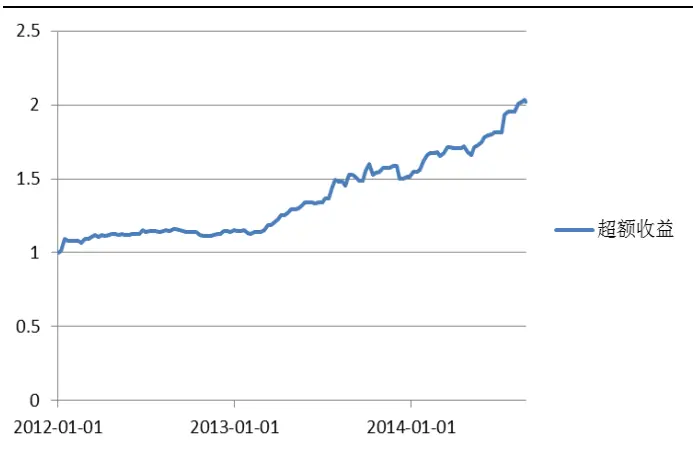

nInfo] [Table_Title] 2014.09.29

# 行业联动与行业轮动市场观察

# ——数量化专题之五十

刘富兵（分析师）

王浩（研究助理）

8 021-38676673

021-38676434

liufubing008481@gtjas.com

wanghao014399@gtjas.com

证书编号 S0880511010017

S0880114080041

## 本报告导读：

通过数据挖掘的手段寻找历史上行业联动和行业轮动的规律，通过行业轮动规则构建投资策略，回溯周期内年化收益率为 29.26%，胜率为 69.3%，夏普比率为 2.63。

le_Summary] 关联规则挖掘是数据挖掘中最热门的方法之一，它可以从海量的数据中探寻一个事件和其他事件之间的依赖或关联，将关联规则应用到股市分析中，从大数据中捕捉市场不易被察觉的隐藏规则，并将其应用到股票投资中，是能够获得超额收益的。

- 臵信度和支持度用来衡量规则的有效性，臵信度高表示关联性强，支持度高表明规则发生的频率高，不是偶然事件，我们关心的就是行业波动时的强关联规则。

- 用上涨定义强势，下跌定义弱势无法排除系统的影响。用正负 alpha收益表示一个行业的强弱，对实际投资更有意义，同时也更合理。

- 我们从日，周，月三个时间维度上去探寻行业可能存在的规律，TMT 行业，煤炭-有色，银行-非银行金融在三个时间周期上都存在很明显的联动效应。

- 轮动规则相比于联动规则更为复杂，我们直观上很难发现背后存在的逻辑，在不同周期上存在的规则未必都能适用。此外，强势轮动和弱势轮动的行业各不相同。

- 我们从历史数据总结出一些轮动规则，在样本外做了一个简单的行业配臵策略，取得良好的收益，大幅跑赢了基准，年化收益率为 29.26%，胜率 69.31%，夏普比率 2.63。

- 根据模型，我们给出 10 月强势行业：汽车，家电。10 月弱势行业：纺织服装，钢铁，轻工制造，国防军工，煤炭。

- 深入有效的关联规则挖掘仍然要考虑更多细节问题，需要最新的数据，丰富的事件样本和背后逻辑的思考，这些问题我们将做在后续研究详细阐述。

金融工程

## 金融工程团队：

刘富兵：（分析师）

电话：021-38676673

邮箱：liufubing008481@gtjas.com

证书编号：S0880511010017

耿帅军：（分析师）

电话：010-59312753

邮箱：gengshuaijun@gtjas.com

证书编号：S0880513080013

## 徐康：（分析师）

电话：021-38674939

邮箱：xukang010849@gtjas.com

证书编号：S0880513080018

## 陈睿：（分析师）

电话：021-38675861

邮箱：chenrui012896@gtjas.com

证书编号：S0880514070009

## 刘正捷：（分析师）

电话：0755-23976803邮箱：liuzhengjie012509@gtjas.com证书编号：S088051407001

## 赵延鸿：（研究助理）

电话：021-38674927邮箱：zhaoyanhong@gtjas.com证书编号：S0880113070047

## 李雪君：（研究助理）

电话：021-38675855

邮箱：lixuejun@gtjas.com

证书编号：S0880114090056

## 王浩：（研究助理）

电话：021-38674812

邮箱：wanghao014399@gtjas.com

证书编号：S0880114080041

《刀尖下的舞蹈-期权于资产管理机构的应用与创新》2014.08.03

《新时代下的基金产品发展》2014.08.03

《不确定性、市场指标与事件投资》2014.08.03

## 1. 关联规则背景

关联规则是数据挖掘中最热门的方法之一，它可以从海量的数据中探寻一个事件和其他事件之间的依赖性或关联性，用以帮助企业做出决策，如产品分类设计、产品交叉销售、捆绑销售、目录设计等。其最早是为了发现超市交易数据中不同商品之间的关系。很多人也许对关联规则的算法不了解，但对这则趣闻应该有所耳闻：沃尔玛曾经对数据仓库中一年多的原始交易数据进行了详细的分析，发现与尿布一起被购买最多的商品竟然是啤酒，正是借助关联规则发现了隐藏在背后的事实:美国的妇女嘱咐丈夫下班后为孩子买尿布，而 30%~40%的丈夫在买完尿布之后又要顺便购买自己爱喝的啤酒。根据这个发现，沃尔玛调整了货架的位臵，把尿布和啤酒放在一起销售，大大增加了销量。

股票市场相比于超市环境更加错综复杂，成千上万的投资者每天在其中买卖证券，市场交易所产生的信息量巨大，低效的去寻找每个信息之间的联系不现实，若能将关联规则应用到股市分析中，从大数据中捕捉市场不易被察觉的隐藏规则，并将其应用到股票投资中，或许会有较高的回报。

本文，我们将阐述关联规则是如何实现在事务集中寻找规则的，并尝试通过关联规则来捕捉行业板块热点变化的规律。

## 2. 关联规则算法

关联规则通过特定的规则算法对数据库进行分析，挖掘出数据库中不同数据项集之间隐藏的且有价值的关联关系，从而给出数据集的关联特征描述。其目的是帮助决策者分析历史数据以及当前数据的特征和规律，以便建立预测性模型。我们用一个例子简单介绍如何在股票分析中使用关联规则。

表 1：关联规则示例

| 交易日 | 计算机上涨 | 传媒上涨 | 房地产上涨 | 机械上涨 |
| --- | --- | --- | --- | --- |
| T1 | FALSE | FALSE | FALSE | TRUE |
| T2 | TRUE | TRUE | TRUE | TRUE |
| T3 | TRUE | TRUE | FALSE | FALSE |
| T4 | TRUE | FALSE | FALSE | TRU E |
| T5 | TRUE | TRUE | FALSE | TRUE |

数据来源：国泰君安证券研究

设 $\operatorname{I}{=}\{\operatorname{i}1,\operatorname{i}2,\cdots,\operatorname{i}\mathrm{m}\}$ ，是 m个不同的项目的集合，每个 ik称为一个项目。项目的集合 I 称为项集。其元素的个数称为项集的长度，长度为 k 的项集称为 k-项集。引例中每个行业上涨情况就是一个项目，项集 I={计算机上涨, 传媒上涨, 房地产上涨, 机械上涨},I的长度为 4.

每日交易数据 T 是项集 I 的一个子集，交易全体构成了交易数据库 D，|D|等于 D 中交易的个数，例子中一共包含 5 笔交易，因此|D|=5,我们用逻 辑 值 TRUE 代 表 每 日 交 易 数 据 中是否包含项目，则第一个交易日项集 T1={计算机上涨, 机械上涨}。

## 关联规则是一个关系式：

$$
\mathbf{R}:\mathbf{X}{\Rightarrow}\mathbf{Y}
$$

其中 X⊂I，Y⊂I，并且 X∩Y=⌀。表示项集 X 在某日交易 Ti 中出现，则导致 Y以某一概率也会出现。用户关心的关联规则，可以用两个标准来衡量：支持度和臵信度。

对于项集 X，设定 count(X⊆T)为交易集 D 中包含 X 的交易的数量，则项集 X 的支持度为：support(X)=count(X⊆T)/|D|

关联规则 R的支持度是交易集同时包含 X和 Y的交易数与|D|之比

$$
\mathbf{support}(\mathbf{X}\mathbf{\Rightarrow}\mathbf{Y}){\mathbf{\bar{\Gamma}}}=\mathbf{count}(\mathbf{X}\mathbf{U}\mathbf{Y})/|\mathbf{D}|
$$

支持度反映了 X、Y 同时出现的概率。关联规则的支持度等于频繁集的支持度。

关联规则R的臵信度是指包含X和Y的交易数与包含X的交易数之比。即：

## confidence(X⇒Y)=support(X⇒Y)/support(X)

臵信度反映了如果交易中包含 X，则交易包含 Y的概率。一般来说，只有支持度和臵信度较高的关联规则才是我们感兴趣的。

比如我们希望知道计算机上涨的同时，传媒上涨的规则，项集 X={计算机上涨}，Y={传媒上涨}，即

## R：计算机上涨⇒传媒上涨

X 出现在交易项集 T2,T3,T4,T5 中，Y 出现在项集 T2,T3,T5 中，则该规则的支持度为 60%,臵信度为 75%。

设定关联规则的最小支持度和最小臵信度为 SuPmin 和 ConFmin。规则R的支持度和臵信度均不小于 SuPmin 和 ConFmin，则称为强关联规则。关联规则挖掘的目的就是找出强关联规则，从而作出投资决策，因此关联规则挖掘主要有两个问题：

1.找出交易数据库中所有大于或等于指定的最小支持度的频繁项集。

2.利用频繁项集生成所需要的关联规则，根据用户设定的最小臵信度筛选出强关联规则。我们将用经典的算法 Apriori 算法处理这两个问题，具体算法细节在本报告中不做赘述，我们只对结果做出分析。

## 3. 行业联动

股票市场的交易存在这样一个公认的规律，在股票上涨、下跌和调整的过程中，受到市场舆论，国家政策等多方面因素影响，各行业齐涨齐跌，同升同落的情况普遍存在。传统分析行业联动规律有通过宏观分析，产业上下游关系，相关系数等方法，我们试图单纯的使用数据挖掘的方法从交易数据中寻找出一些大概率成立的关联规则，并希望能够在未来将这些实验结果应用到股市预测和决策中。

## 3.1. 规则初探

我们以中信一级 29 个行业指数的上涨情况为例，初步探寻行业板块之间的关联规则，设定如下：

1. 数据周期：2005年 1月 1日-2012年 1月 1日的日交易数据。

2. 前提条件只有一个，即前因 X只含有一个行业上涨情况。

3. 最小支持度和臵信度为 0，即考虑所有可能的规则。

4. 上涨定义为当天的涨幅为正。

通过以上限定，我们寻找在一个行业上涨时，另外一个行业是否上涨的规律，在不同的臵信度和支持度上存在 812（29*28）个规则。从统计数据来看，单个行业指数每日上涨的概率大体都在 50%左右，并没有哪个行业存在每日行情存在长期大概率上涨的情况。

图 2：单个行业上涨时，其他所有行业的平均上涨臵信度

数据来源：国泰君安证券研究,wind

图 2：其他行业上涨时，单个行业的平均上涨臵信度

数据来源：国泰君安证券研究,wind

银行、非银行、煤炭板块上涨后，其他行业上涨的平均概率相对较小，即银行和非银行金融的上涨行情相对较难带动其他行业一起同时上涨。与此同时，其他行业上涨后，银行、非银行板块水涨船高的可能性也相对较小。

所有关联规则中最小臵信度为 63.462%，

电子元器件->银行

表 2：各年臵信度（电子元器件->银行）

| 年份 | 银行同时涨 | 电子上涨 | 置信度 |
| --- | --- | --- | --- |
| 2005年 | 88 | 123 71.54% |  |
| 2006年 | 106 | 142 | 74.65% |
| 2007年 | 92 | 142 | 64.79% |
| 2008年 | 81 | 116 | 69.83% |
| 2009年 | 101 | 155 | 65.16% |
| 2010年 | 71 | 131 | 54.20% |
| 2011年 | 78 | 120 | 65.00% |

数据来源：国泰君安证券研究,wind

所有关联规则中最大臵信度为 89.897%

基础化工->纺织服装

表 3：各年臵信度（基础化工->纺织服装）

| 年份 | 纺织服装同时涨 | 基础化工上涨 | 置信度 |
| --- | --- | --- | --- |
| 2005年 | 102 | 119 | 85.71% |
| 2006年 | 124 | 145 | 85.52% |
| 2007年 | 149 | 165 | 90.30% |
| 2008年 | 101 | 111 | 90.99% |
| 2009年 | 144 | 153 | 94.12% |
| 2010年 | 127 | 142 | 89.44% |
| 2011年 | 109 | 111 | 98.20% |

数据来源：国泰君安证券研究,wind

## 在各年度内臵信度的波动都不大，一定程度上说明规则是较为稳定的。

然而，总体来看，一个行业当日上涨，另外一个行业大概率下也会上涨，这主要是由于行业指数受系统性风险影响较大，即大盘上涨时，大部分行业板块也会上涨，大盘下跌时，大部分行业板块也会下跌，因而会得出一个行业上涨，其他行业也会上涨的结论。然而在实际投资中，我们更关心的是排除系统影响后，一个行业的波动给另外一个行业带来的影响，从而捕捉到行业联动和轮动规律带来的非系统性风险收益

由资产定价模型（CAPM）可知，

$$
\mathrm{Rs}=\mathrm{\alpha}+\mathrm{\beta}\mathrm{Rm}
$$

行业板块收益既受 Beta 因子（整体市场表现）影响，又受 alpha 因子（自身板块表现）影响，因而当一个行业处于强势期的时候，我们可以理解为这个行业具有正的alpha，因而通过寻找行业板块超额收益（alpha）之间的关联性，就能够捕捉行业联动和轮动之间的现象，由于我们使用的是中信一级行业 29 个行业指数，包含了沪深上市所有公司，在考虑市场组合收益 Rm时，如果使用常用的大盘基准：沪深 300指数，金融和工业行业权重较高，而电子、医药等行业权重过低，因而以此作为市场组合，会对测算参数发生偏离，因而我们通过构建行业等权重指数，分配每个行业相同的价值权重，从而反映市场不同行业的整体表现，进而寻找出单个行业的超额收益

基于以上分析，我们做出以下定义：

行业强势： alpha 值为正

行业弱势: alpha 值为负

我们再次根据以上设定，我们从日、周、月三个周期内 29 个行业数据联动性做出分析，总结规则如下。

## 3.2. 联动规则

## 3.2.1. 日内联动

表 4:强势行业联动（日）

| 条件 | 结果 | 置信度% | 支持度% |
| --- | --- | --- | --- |
| 计算机(强势) | 传媒(强势) | 69.27 | 35.81 |
| 电子元器件(强势) | 传媒(强势) | 67.14 | 34.74 |
| 计算机(强势) | 电子元器件(强势) | 73.09 | 37.78 |
| 传媒(强势) | 电子元器件(强势) | 69.26 | 34.74 |
| 电子元器件(强势) | 计算机(强势) | 73.03 | 37.78 |
| 传媒(强势) | 计算机(强势) | 71.40 | 35.81 |
| 通信(强势) | 计算机(强势) | 67.33 | 31.95 |
| 煤炭(强势) | 有色金属(强势) | 68.85 | 32.55 |
| 农林牧渔(强势) | 纺织服装(强势) | 64.47 | 31.86 |
| 非银行金融(强势) | 房地产(强势) | 62.73 | 30.36 |
| 轻工制造(强势) | 纺织服装(强势) | 63.98 | 31.64 |
| 医药(弱势) | 银行(强势) | 66.95 | 32.99 |

数据来源：国泰君安证券研究,wind

表 5:弱势行业联动（日）

| 条件 | 结果 | 置信度% | 支持度% |
| --- | --- | --- | --- |
| 计算机(弱势) | 传媒(弱势) | 70.31 | 33.96 |
| 电子元器件(弱势) | 传媒(弱势) | 68.06 | 32.85 |
| 电子元器件(强势) | 电力及公用事业(弱势) | 66.14 | 34.22 |
| 计算机(弱势) | 电子元器件(弱势) | 71.11 | 34.35 |
| 银行(弱势) | 非银行金融(弱势) | 67.89 | 35.85 |
| 电子元器件(弱势) | 计算机(弱势) | 71.17 | 34.35 |
| 传媒(弱势) | 计算机(弱势) | 68.13 | 33.96 |
| 煤炭(弱势) | 钢铁(弱势) | 65.88 | 34.74 |
| 计算机(强势) | 交通运输(弱势) | 65.03 | 33.62 |
| 有色金属(弱势) | 煤炭(弱势) | 71.08 | 36.20 |
| 医药(强势) | 钢铁(弱势) | 64.63 | 31.77 |

数据来源：国泰君安证券研究,wind

## 3.2.2. 周内联动

表 6:强势行业联动（周）

| 条件 | 结果 | 置信度% | 支持度% |
| --- | --- | --- | --- |
| 电子元器件(强势) | 传媒(强势) | 69.91 | 35.46 |
| 计算机(强势) | 传媒(强势) | 70.86 | 37.11 |
| 传媒(强势) | 电子元器件(强势) | 70.20 | 35.46 |
| 计算机(强势) | 电子元器件(强势) | 73.62 | 38.55 |
| 电力设备(强势) | 国防军工(强势) | 71.83 | 36.28 |
| 计算机(强势) | 国防军工(强势) | 69.68 | 36.49 |
| 有色金属(强势) | 国防军工(强势) | 69.78 | 33.81 |
| 传媒(强势) | 计算机(强势) | 73.46 | 37.11 |
| 电子元器件(强势) | 计算机(强势) | 76.01 | 38.55 |
| 非银行金融(强势) | 银行(强势) | 69.74 | 34.22 |
| 煤炭(强势) | 有色金属(强势) | 72.64 | 33.40 |
| 房地产(强势) | 银行(强势) | 68.57 | 34.64 |

数据来源：国泰君安证券研究,wind

表 7:弱势行业联动（周）

| 条件 | 结果 | 置信度% | 支持度% |
| --- | --- | --- | --- |
| 计算机(弱势) | 传媒(弱势) | 71.86 | 34.23 |
| 电子元器件(弱势) | 传媒(弱势) | 69.46 | 34.23 |
| 电子元器件(强势) | 电力及公用事业(弱势) | 71.14 | 36.08 |
| 计算机(弱势) | 电子元器件(弱势) | 74.46 | 35.46 |
| 银行(弱势) | 非银行金融(弱势) | 69.62 | 34.02 |
| 电子元器件(弱势) | 计算机(弱势) | 71.97 | 35.46 |
| 银行(弱势) | 交通运输(弱势) | 73.00 | 35.67 |
| 计算机(强势) | 交通运输(弱势) | 69.69 | 36.49 |
| 有色金属(弱势) | 煤炭(弱势) | 75.60 | 38.97 |
| 煤炭(弱势) | 有色金属(弱势) | 72.14 | 38.97 |

数据来源：国泰君安证券研究,wind

## 3.2.3. 月内联动

表 8:强势行业联动（月）

| 条件 | 结果 | 置信度% | 支持度% |
| --- | --- | --- | --- |
| 计算机(强势) | 电力设备(强势) | 74.14 | 37.39 |
| 纺织服装(强势) | 电力设备(强势) | 71.70 | 33.04 |
| 计算机(强势) | 电子元器件(强势) | 75.86 | 38.26 |
| 传媒(强势) | 电子元器件(强势) | 70.37 | 33.04 |
| 建材(强势) | 房地产(强势) | 72.41 | 36.52 |
| 医药(弱势) | 房地 | 72.22 | 33.91 |
| 电力设备(强势) | 国防军工(强势) | 70.69 | 35.65 |
| 电子元器件(强势) | 国防军工(强势) | 70.18 | 34.78 |
| 电子元器件(强势) | 计算机(强势) | 77.19 | 38.26 |
| 传媒(强势) | 计算机(强势) | 74.07 | 34.78 |
| 汽车(强势) | 建材(强势) | 72.06 | 42.61 |
| 有色金属(强势) | 煤炭(强势) | 71.19 | 36.52 |
| 纺织服装(强势) | 农林牧渔(强势) | 73.58 | 33.91 |
| 电力设备(强势) | 农林牧渔(强势) | 70.69 | 35.65 |
| 钢铁(强势) | 汽车(强势) | 78.00 | 33.91 |
| 机械(强势) | 汽车(强势) | 75.00 | 39.13 |
| 银行(弱势) | 医药(强势) | 78.57 | 38.26 |
| 房地产(弱势) | 医药(强势) | 71.15 | 32.17 |
| 医药(弱势) | 银行(强势) | 77.78 | 36.52 |
| 非银行金融(强势) | 银行(强势) | 71.43 | 34.78 |
| 煤炭(强势) | 有色金属(强势) | 79.25 | 36.52 |
| 计算机(强势) | 综合(强势) | 72.41 | 36.52 |
| 纺织服装(强势) | 综合(强势) | 71.70 | 33.04 |

数据来源：国泰君安证券研究,wind

表 9:弱势行业联动（月）

| 条件 | 结果 | 置信度% | 支持度 % |
| --- | --- | --- | --- |
| 计算机(弱势) | 传媒(弱势) | 75.43 | 37.39 |
| 国防军工(强势) | 电力及公用事业(弱势) | 78.33 | 40.86 |
| 电子元器件(强势) | 电力及公用事业(弱势) | 75.43 | 37.39 |
| 计算机(弱势) | 电力设备(弱势) | 73.68 | 36.52 |
| 计算机(弱势) | 电子元器件(弱势) | 77.19 | 38.26 |
| 计算机(弱势) | 纺织服装(弱势) | 75.43 | 37.39 |
| 综合(弱势) | 纺织服装(弱势) | 74.137 | 37.39 |
| 汽车(弱势) | 钢铁(弱势) | 76.59 | 31.30 |
| 餐饮旅游(强势) | 钢铁(弱势) | 73.68 | 36.52 |
| 电子元器件(弱势) | 计算机(弱势) | 75.86 | 38.26 |
| 电力设备(弱势) | 计算机(弱势) | 73.68 | 36.52 |
| 汽车(弱势) | 建材(弱势) | 80.85 | 33.04 |
| 银行(弱势) | 交通运输(弱势) | 80.35 | 39.13 |
| 电力及公用事业(弱势) | 交通运输(弱势) | 79.71 | 47.82 |
| 有色金属(弱势) | 煤炭(弱势) | 80.35 | 39.13 |
| 计算机(弱势) | 轻工制造(弱势) | 78.94 | 39.13 |
| 综合(弱势) | 轻工制造(弱势) | 74.13 | 37.39 |
| 纺织服装(强势) | 石油石化(弱势) | 73.58 | 33.91 |
| 计算机(弱势) | 综合(弱势) | 73.68 | 36.52 |

数据来源：国泰君安证券研究,wind

## 3.3. 联动规则分析

我们发现存在一些行业联动规则，在每个周期上都适用，还有一些行业联动只在个别周期上成立。一些规则也是市场普遍认可的。如传媒-计算机-电子元器件-通信联动效应明显，即单个表现强势时，另外几个也能获得超额收益，这三类行业同属于 TMT 行业概念股，在市场中容易受到资金的同时追捧，因而存在同涨现象。煤炭和有色，金融和非金融，房地产和金融，汽车和机械受宏观经济发展和产业政策影响较大，因而同涨同跌现象普遍存在。此外医药行业和银行行业存在负相关关系，背后也代表了价值投资和成长投资的风格轮动，此外我们也发现在周数据和月数据的规则臵信度更高，可见行业联动在周、月周期上容易得到确认和验证，在日周期臵信度相对不高。

表 10 ：联动关联规则汇总

| X |  | Y | 适用周期 |
| --- | --- | --- | --- |
| 纺织服装↑↓ | K V | 餐饮旅游↑↓ | 日，周 |
| 计算机↑↓ | K V | 传媒↑↓ | 日，周，月 |
| 电子元器件↑↓ | K V | 传媒↑↓ | 日，周，月 |
| 电子元器件↑ | 7 | 电力及公用事业↓ | 日，周，月 |
| 电子元器件↑↓ | K V | 电力设备↑↓ | 日，周，月 |
| 计算机↑↓ 非银行金融 ↑ ↓ | K 7 | 电子元器件↑↓ | 日，周，月 |
|  | K V | 房地产↑↓ | 日，周 |
| 银行↑↓ 建材↑↓ | K V V | 房地产↑↓ | 日，周，月 |
| 基础化工↑ |  | 房地产↑↓ | 月 |
| 轻工制造↑↓ | V V K 7 | 纺织服装↑ | 日，周 |
| 电力设备↑↓ | K V | 纺织服装↑↓ 国防军工↑ | 日，周 |
| 电子元器件↑↓ | K V | 国防军工↑↓ | 周，月 日，周，月 |
| 汽车↑↓ | K V | 机械↑↓ | 日，周，月 |
| 有色金属↑ ↓ | V K | 机械↑↓ | 日，周 |
| 机械↑↓ | V | 建材↑↓ | 日，周，月 |
| 汽车↑↓ | V | 建材↑↓ | 日，周，月 |
| 建材↓ | V | 建筑↓ | 日，周，月 |
| 计算机↑ | V | 交通运输↓ | 日，周，月 |
| 医药↓↑ | K V | 银行↑↓ | 周，月 |
| 煤炭↑↓ | K V | 有色金属↑ ↓ | 日，周，月 |

数据来源：国泰君安证券研究

## 4. 行业轮动

相比于行业联动规则，我们更关心的是行业轮动规则，即一个或多个行业的表现，能否引起未来某个行业上涨或者下跌，如果行业轮动真的存在记忆性，那么历史上大概率发生的轮动规律也能在未来重现。通过提前配臵未来表现强势的行业，我们能获得超额收益。下面我们同样在日、周、月三个周期上去挖掘可能存在的规则。

单个行业强势的表现有时不只是由一个行业引起的，而是多个行业的表现同时引发的，因而考虑加入多个行业作为前提条件，即

$$
\mathrm{X1},\mathrm{X2},\mathrm{X3}...\ ...>\mathrm{Y}
$$

同样，我们设定至少要满足 60%以上的臵信度。

## 4.1. 轮动规则

## 4.1.1. 日间轮动

表 11：强势行业轮动（日）

| 条件 | 结果 | 置信度% | 支持度% |
| --- | --- | --- | --- |
| 银行(强势) 机械(强势) 医药(强势) | 电子元器件(未来强势) | 61.30 | 5.49 |
| 交通运输(强势) 商贸零售(强势) 计算机(强势) | 纺织服装(未来强势) | 60.22 | 6.39 |
| 交通运输(强势) 商贸零售(强势) 农林牧渔(强势) | 纺织服装(未来强势) | 60.00 | 6.69 |

数据来源：国泰君安证券研究

表 12：弱势行业轮动（日）

| 条件 | 结果 | 置信度% | 支持度% |
| --- | --- | --- | --- |
| 医药(强势)钢铁(弱势) | 钢铁(未来弱势) | 60.94 | 2.36 |
| 银行(弱势) 钢铁(弱势) | 钢铁(未来弱势) | 61.86 | 12.48 |
| 国防军工(强势) 电子元器件(强势) | 交通运输(未来弱势) | 62.67 | 13.18 |
| 电力设备(强势) 建材(强势) | 石油石化(未来弱势) | 60.32 | 12.08 |
| 电力设备(强势)计算机(强势) | 银行(未来弱势) | 62.30 | 14.43 |
| 纺织服装(强势) 计算机(强势) | 银行(未来弱势) | 62.34 | 14.47 |

数据来源：国泰君安证券研究

## 4.1.2. 周间轮动

表 13：强势行业轮动（周）

| 条件 | 结果 | 置信度% | 支持度% |
| --- | --- | --- | --- |
| 银行(强势) 计算机(强势) | 餐饮旅游(未来强势) | 71.02 | 15.67 |
| 农林牧渔(弱势) 计算机(强势) | 通信(未来强势) | 70.78 | 10.66 |
| 传媒(弱势) 电子元器件(强势) | 国防军工(未来强势) | 70.27 | 10.72 |
| 基础化工(弱势) 计算机(强势) | 传媒(未来强势) | 70.42 | 13.40 |
| 家电(弱势) 医药(弱势) | 基础化工(未来强势) | 72.67 | 17.32 |
| 建筑(强势) 非银行金融(弱势) | 房地产(未来强势) | 79.59 | 8.04 |
| 轻工制造(弱势) ) 计算机(强势) | 计算机(未来强势) | 77.36 | 8.45 |
| 房地产(弱势) 银行(强势) | 有色金属(未来强势) | 71.50 | 11.13 |

数据来源：国泰君安证券研究

表 14：弱势行业轮动（周）

| 条件 | 结果 | 置信度% | 支持度 % |
| --- | --- | --- | --- |
| 医药(弱势) | 电力及公用事业(未来弱势) | 70.18 | 31.13 |
| 汽车(弱势) | 钢铁(未来弱势) | 69.48 | 30.93 |
| 汽车(强势) 食品饮料(强势) 建筑(弱势) | 家电(未来弱势) | 75.00 | 8.04 |
| 商贸零售(强势) | 建筑(未来弱势) | 72.18 | 30.52 |
| 纺织服装(弱势) 传媒(强势) 医药(强势) | 煤炭(未来弱势) | 76.00 | 7.84 |
| 计算机(弱势) 农林牧渔(强势) | 轻工制造(未来弱势) | 71.59 | 12.99 |
| 计算机(弱势) 医药(强势) | 来弱势) | 72.09 | 12.78 |

数据来源：国泰君安证券研究

## 4.1.3. 月间轮动

表 15：强势行业轮动（月）

| 条件 | 结果 | 置信度% | 支持度% |
| --- | --- | --- | --- |
| 钢铁(强势) | 汽车(未来强势) | 72.00 | 31.30 |
| 纺织服装（强势)机械(弱势) | 银行(未来强势) | 81.82 | 19.30 |
| 煤炭(强势) 基础化工(强势) | 食品饮料(未来强势) | 83.33 | 26.32 |
| 农林牧渔(弱势) 国防军工(强势) | 商贸零售(未来强势) | 80.00 | 17.54 |
| 钢铁(强势)石油石化(弱势) | 汽车(未来强势) | 84.00 | 21.93 |
| 交通运输(强势) 家电(强势) | 建筑(未来强势) | 80.95 | 18.42 |
| 交通运输(强势) 房地产(强势) | 建材(未来强势) | 85.00 | 17.54 |
| 电力及公用事业(强势)基础化工(强势) | 家电(未来强势) | 81.82 | 19.30 |
| 石油石化(强势)电力及公用事业(弱势) | 机械(未来强势) | 81.82 | 19.30 |
| 计算机(弱势) 非银行金融(弱势) | 非银行金融(未来强势) | 80.00 | 21.93 |
| 国防军工(弱势)汽车(强势) | 房地产(未来强势) | 80.77 | 22.81 |
| 纺织服装(弱势) 石油石化(弱势) | 电子元器件(未来强势) | 81.48 | 23.68 |
| 电子元器件(强势) 电力设备(弱势) | 传媒(未来强势) | 83.33 | 15.79 |

数据来源：国泰君安证券研究

表 16：弱势行业轮动（月）

| 条件 |  | 结果 | 置信度% | 支持度% |
| --- | --- | --- | --- | --- |
| 食品饮料(弱势) | 计算机(弱势) | 餐饮旅游(未来弱势) | 15.79 | 83.33 |
| 轻工制造(强势) | 商贸零售(弱势) | 传媒(未来弱势) | 17.54 | 80.00 |
| 建筑 (弱势) | 家电(强势) | 电力及公用事业(未来弱势) | 28.95 | 81.82 |
| 钢铁(强势) | 医药(强势) | 电子元器件(未来弱势) | 16.67 | 84.21 |
| 家电(弱势) | 建筑(强势) | 纺织服装(未来弱势) | 15.79 | 88.89 |
| 基础化工(强势) | 有色金属(弱势) | 钢铁(未来弱势) | 17.54 | 90.00 |
| 轻工制造(强势) | 有色金属(弱势) | 国防军工(未来弱势) | 19.30 | 81.82 |
| 银行(弱势) | 餐饮旅游(弱势) | 建材(未来弱势) | 18.42 | 80.95 |
| 传媒(强势) | 建材(强势) | 建筑(未来弱势) | 26.32 | 83.33 |
| 煤炭(强势) | 电子元器件(强势) | 交通运输(未来弱势) | 21.93 | 88.00 |
| 有色金属(弱势) | 计算机(强势) | 煤炭(未来弱势) | 20.18 | 82.61 |
| 家电(弱势) | 电力设备(强势) | 轻工制造(未来弱势) | 21.93 | 80.00 |
| 电子元器件(强势) | 有色金属(强势) | 石油石化(未来弱势) | 28.07 | 81.25 |
| 石油石化(强势) | 建材(强势) | 综合(未来弱势) | 18.42 | 80.95 |

数据来源：国泰君安证券研究

## 4.2. 轮动规则分析

分析多个行业引起轮动背后的规律较为复杂，我们在本篇报告中不做详细分析，单从以上检验结果，我们可以总结出以下结论：

1. 日间数据中很难找到臵信度很高的轮动规则，周间数据中规则的臵信度较高，达到 70%以上，单个规则大约每 8-10周发生一次。月间轮动的规则平均每 6个月发生一次，臵信度很高，但不排除样本过少原因。

2. 相比于行业联动不同周期都适用的一些规则，我们很难找到一个在不同周期都适用的规则。因此行业轮动相比于行业联动更难把握。

3. 不同行业轮动周期不一样，一些行业在长周期上有轮动规律，一些行业在短周期上有轮动规律。

4. 不同于行业联动效应，寻找强势行业轮动的规则反过来用并没有办法找到弱势行业轮动，即有时轮涨不一定轮跌。具体来看可操作度更高的周规则和月规则在每年的臵信度。

周规则：银行(强势) 计算机(强势) >餐饮旅游(未来强势)

表 17：周规则臵信度

| 年份 | 条件 结果 | 置信度 |
| --- | --- | --- |
| 2005年 9 | 13 69% |  |
| 2006年 10 | 13 |  |
| 2007年 10 | 77% 13 77% |  |
| 2008年 9 | 13 |  |
| 2009年 13 | 69% 17 76% |  |
| 2010年 4 | 5 80% |  |
| 2011年 5 | 7 71% |  |

数据来源：国泰君安证券研究,wind

月规则：钢铁(强势) >汽车(未来强势)

表 18：月规则臵信度

| 年份 | 条件 结果 | 置信度 |
| --- | --- | --- |
| 2005年 2 | 3 | 67% |
| 2006年 | 5 6 | 83% |
| 2007年 | 6 8 | 75% |
| 2008年 | 2 4 | 50% |
| 2009年 | 5 7 | 71% |
| 2010年 | 2 3 | 67% |
| 2011年 | 2 4 | 50% |

数据来源：国泰君安证券研究,wind

周规则较为稳定，每年基本有 70%以上胜率，月规则胜率波动较大，2008年、2011 两年熊市中胜率较低。

## 4.3. 策略构建

本节，我们用行业轮动规则做个简单的策略构建，用以上8个周间轮动规预测未来强势行业，一旦发现有机会就等权配臵这些强势行业。如果没有不触发任何规则，我们就配臵全行业基准。从样本外 2012年 1月 1日-2014年 8月 1日周期内，不考虑交易成本的前提下做历史回测。在 2年半的时间内，组合明显跑赢了等权行业基准，累积收益达到 164%。考虑对冲的情况下，年化超额收益 29.26，最大回撤只有 6.21%，有效胜率达到 69%，策略整体取得不错的效果。

图 3 关联规则组合与等权行业基准比较

数据来源：国泰君安证券研究,wind

图 4 关联规则组合对冲超额收益走势

数据来源：国泰君安证券研究,wind

表 19：对冲结果统计

| 统计指标 数值 |
| --- |
| 财富终值 2.01 |
| 年化收益率 29.26% |
| 年化波动率 11.85% |
| 交易胜率 69.31% |
| 最大回撤 6.21% |
| 夏普比率 2.63 |

数据来源：国泰君安证券研究,wind

## 4.4. 策略配臵展望

根据 9 月份目前的各行业的走势，我们利用关联规则预测了 10月份可能的强势行业和弱势行业。

表 20：10 月行业轮动预测

| 10月强势行业 | 置信度 | 10月弱势行业 置信度 |
| --- | --- | --- |
| 汽车 | 84.00% 纺织服装 | 88.89% |
| 家电 | 81.82% | 钢铁 90.00% |
|  |  | 国防军工 82.61% |
|  |  | 煤炭 82.61% |
|  |  | 轻工制造 80.00% |

数据来源：国泰君安证券研究

## 5. 研究展望

本文，我们初步用关联规则观察了行业之间存在的联动和轮动规律，然而真正要将这些规则应用到实战投资中，后期还需要从几点方面考虑。

1.丰富的事件数据，本报告中只是用了相同周期内每个行业的涨跌幅用来观察行业轮动现象，然而在实际市场上，行业轮动和联动的步调并不是完全一致，即一段长周期的行业波动也可能引起另外一个行业短期的波动。同时衡量行业强势除了涨跌幅，还有其他指标。

2.规则的稳定性，我们只用了 10年的历史数据，市场期间经历牛市，熊市，震荡市，一些过去成立的规则，或者在一定市场条件下成立的规则，在未来不同的环境下未必适用，关联规则挖掘出的数据只是对过去 10年市场上发生的大概率事件，稳定规则还需要不断加入最新的市场数据去挖掘。

3.背后逻辑的思考：尽管很多量化策略很难从基本面上去解释清，然而只要样本足够大，大概率发生事件背后都会存在一定逻辑，只要将其理清，在使用这些规则时才能规避可能的风险。

关联规则可以帮助我们从海量的数据中寻找出一些人们不容易发现的大概率事件，之后的具体使用还涉及更多细节的问题去解决，我们将会在后续报告中继续研究，具体阐述。

## 本公司具有中国证监会核准的证券投资咨询业务资格

## 分析师声明

作者具有中国证券业协会授予的证券投资咨询执业资格或相当的专业胜任能力，保证报告所采用的数据均来自合规渠道，分析逻辑基于作者的职业理解，本报告清晰准确地反映了作者的研究观点，力求独立、客观和公正，结论不受任何第三方的授意或影响，特此声明。

## 免责声明

本报告仅供国泰君安证券股份有限公司（以下简称“本公司”）的客户使用。本公司不会因接收人收到本报告而视其为本公司的当然客户。本报告仅在相关法律许可的情况下发放，并仅为提供信息而发放，概不构成任何广告。

本报告的信息来源于已公开的资料，本公司对该等信息的准确性、完整性或可靠性不作任何保证。本报告所载的资料、意见及推测仅反映本公司于发布本报告当日的判断，本报告所指的证券或投资标的的价格、价值及投资收入可升可跌。过往表现不应作为日后的表现依据。在不同时期，本公司可发出与本报告所载资料、意见及推测不一致的报告。本公司不保证本报告所含信息保持在最新状态。同时，本公司对本报告所含信息可在不发出通知的情形下做出修改，投资者应当自行关注相应的更新或修改。

本报告中所指的投资及服务可能不适合个别客户，不构成客户私人咨询建议。在任何情况下，本报告中的信息或所表述的意见均不构成对任何人的投资建议。在任何情况下，本公司、本公司员工或者关联机构不承诺投资者一定获利，不与投资者分享投资收益，也不对任何人因使用本报告中的任何内容所引致的任何损失负任何责任。投资者务必注意，其据此做出的任何投资决策与本公司、本公司员工或者关联机构无关。

本公司利用信息隔离墙控制内部一个或多个领域、部门或关联机构之间的信息流动。因此，投资者应注意，在法律许可的情况下，本公司及其所属关联机构可能会持有报告中提到的公司所发行的证券或期权并进行证券或期权交易，也可能为这些公司提供或者争取提供投资银行、财务顾问或者金融产品等相关服务。在法律许可的情况下，本公司的员工可能担任本报告所提到的公司的董事。

市场有风险，投资需谨慎。投资者不应将本报告为作出投资决策的惟一参考因素，亦不应认为本报告可以取代自己的判断。在决定投资前，如有需要，投资者务必向专业人士咨询并谨慎决策。

本报告版权仅为本公司所有，未经书面许可，任何机构和个人不得以任何形式翻版、复制、发表或引用。如征得本公司同意进行引用、刊发的，需在允许的范围内使用，并注明出处为“国泰君安证券研究”，且不得对本报告进行任何有悖原意的引用、删节和修改。

若本公司以外的其他机构（以下简称“该机构”）发送本报告，则由该机构独自为此发送行为负责。通过此途径获得本报告的投资者应自行联系该机构以要求获悉更详细信息或进而交易本报告中提及的证券。本报告不构成本公司向该机构之客户提供的投资建议，本公司、本公司员工或者关联机构亦不为该机构之客户因使用本报告或报告所载内容引起的任何损失承担任何责任。

## 评级说明

## 1.投资建议的比较标准

投资评级分为股票评级和行业评级。

以报告发布后的12个月内的市场表现为比较标准，报告发布日后的12个月内的公司股价（或行业指数）的涨跌幅相对同期的沪深300指数涨跌幅为基准。

## 2.投资建议的评级标准

报告发布日后的 12 个月内的公司股价（或行业指数）的涨跌幅相对同期的沪深300指数的涨跌幅。

|  | 评级 说明 |  |
| --- | --- | --- |
| 股票投资评级 | 增持 | 相对沪深 300指数涨幅15%以上 |
|  | 谨慎增持 | 相对沪深300指数涨幅介于5%～15%之间 |
|  | 中性 | 相对沪深300指数涨幅介于-5%～5% |
|  | 减持 | 相对沪深300指数下跌5%以上 |
| 行业投资评级 | 增持 | 明显强于沪深300指数 |
|  | 中性 | 基本与沪深300指数持平 |
|  | 减持 | 明显弱于沪深300指数 |

## 国泰君安证券研究

|  | 上海 | 深圳 | 北京 |
| --- | --- | --- | --- |
| 地址 | 上海市浦东新区银城中路168号上海 银行大厦29层 | 深圳市福田区益田路 6009 号新世界 商务中心34层 | 北京市西城区金融大街 28 号盈泰中 心2号楼10层 |
| 邮编 | 200120 | 518026 | 100140 |
| 电话 | （021)38676666 | (0755)23976888 | (010)59312799 |
|  | E-mail: gtjaresearch@gtjas.com |  |  |