nInfo] [Table_Title]2014.11.21

# 是税！基于大宗交易数据的事件驱动策略

## ——数量化专题之五十一

刘正捷（分析师）

刘富兵（分析师）

赵延鸿（研究助理）

8 0755-23976803

021-38676673

liuzhengjie012509@gtjas.co

021-38674927

liufubing008481@gtjas.com

证书编号 S0880514070010

S0880511010017

zhaoyanhong@gtjas.com

S0880113070047

## 本报告导读：

出于避税目的，重要股东在低位进行“减持”。但由于其依然握有股票未来收益权，因此会继续保持甚至加强对股价的预期，这就为我们提供低位买入良机。

## 摘要：

le_Summary]税收因素影响下，大宗交易信号提供逢低买入的良机。传统眼光看来，如果一只股票在大宗交易市场出现频繁交易记录，往往视为负面消息。而我们认为，在新环境下，考虑到税收因素后，大宗交易市场的交易信号不但不是负面信号，反而能为我们提供低位买入良机。

- 以“股价低 + 折价高”为标准，叠加 TA、MV指标，收益可观。通过量化“股价相对处于历史低位，大宗交易折价率相对较高”两个条件，过去两年中所选出的案例在半年时间内能够获取明显的绝对收益和相对收益。叠加技术指标后，策略收益获得大幅提升。同时，我们发现收益水平与市值有显著相关性，相对于大市值股票，小市值股票获得的收益明显更高。

系统构建投资策略，近半年策略表现优异。根据观察结果，我们构建了完善的事件选股策略，策略在半年时间内获得约85%的年化收益，夏普比率5.18，信息比率 1.92；剔除掉大市值股票后，收益、风险指标得到进一步提升；加入技术指标后，策略则展现出优异的精选个股能力。

策略风险：Bull & Time。一方面，牛市中，策略可能跑不赢指数；另一方面，实现个股收益所需时间有一定的不确定性。具体投资中，须知策略的收益与风险特征往往都是在特定时间、特定背景下的特定产物，当条件发生变化，策略有效性就会受到影响。

金融工程

## 金融工程团队：

刘富兵：（分析师）

电话：021-38676673

邮箱：liufubing008481@gtjas.com

证书编号：S0880511010017

耿帅军：（分析师）

电话：010-59312753

邮箱：gengshuaijun@gtjas.com

证书编号：S0880513080013

徐康：（分析师）

电话：021-38674939

邮箱：xukang010849@gtjas.com

证书编号：S0880513080018

## 陈睿：（分析师）

电话：021-38675861

邮箱：chenrui012896@gtjas.com

证书编号：S0880514070009

刘正捷：（分析师）

电话：0755-23976803

邮箱：liuzhengjie012509@gtjas.com

证书编号：S0880514070010

吴晶：（分析师）

电话：021-38676720

邮箱：wujing@gtjas.com

证书编号：S0880514110001

## 赵延鸿：（研究助理）

电话：021-38674927

邮箱：zhaoyanhong@gtjas.com

证书编号：S0880113070047

## 李雪君：（研究助理）

电话：021-38675855

邮箱：lixuejun@gtjas.com

证书编号：S0880114090056

## 王浩：（研究助理）

电话：021-38674812

邮箱：wanghao014399@gtjas.com

证书编号：S0880114080041

## [Table_Re相关报告

《基于市场强弱度的择时》2014.11.20

《走进量化投资新时代》2014.11.20

《阿尔法来源的再探索》2014.11.19

《国泰君安_2015 年金融工程投资策略_场外衍生品重装上阵》2014.11.19

《关联规则在金融市场中的应用》2014.11.19

## 1. 策略原理：避税需求催生个股投资契机

## 1.1.传统观念中，频繁大宗交易往往被视为利空消息

大宗交易市场的减持方往往是公司重要股东，相对于外部投资者，其信息占优，减持一般意味着不看好未来股价。根据公司金融理论，相较于外部投资者，企业大股东、高管对自己的上市公司往往拥有信息优势，因此，他们在二级市场上的投资行为对二级市场投资者有着重要的参考意义。如不考虑其他因素，一般来说增持意味其对未来股价看好，减持则意味着不看好公司未来发展。

A股市场上，大宗交易市场是了解公司重要股东对自家公司股价看法的重要渠道。由于买卖份额较多，重要股东为了不直接影响股价，以及遵循监管层的一些强制性规定，往往在大宗交易市场上进行交易。同时，大宗交易市场交易普遍存在一定的折价，平均折价水平（较上一交易日收盘价）约 5%左右。按照上述理论，如果大宗交易市场上频繁大量出现某一公司的交易记录，应该解读为利空消息，尤其是当折价水平较高时，更意味着重要股东对未来股价不看好。

## 1.2.新形势下，大宗交易信号提示买入良机

我们认为，在 A股市场上，上述认知并不一定总是正确。重要股东占据信息优势无疑是正确的，然而在大宗市场上抛售股票行为却不一定意味着对未来股价不看好。

重要股东的烦恼：所得税太高。根据规定，税率上，大小非股东若为自然人，减持税率为 20%，若为企业法人，则税率达到 25%。所得税中的40%为地税，60%为国税，其中地税缴纳以股票托管地为准。有些地区出于招商引资之目的，会给予高额地方税收返还。应税基准上，应税股价 = 减持股价 - 股票原值 - 合理税费。其中股票原值相对于减持股价非常低，而合理税费更可以忽略不计，因此应税股价与减持股价相比不会有显著差异。

高所得税之下，凸显低位减持之优势。从避税的角度考虑，减持价当然越低越好，因此当重要股东在低位减持时，不但不是认为股价过高，反而是认为当前股价偏低。同时，通过多种方式（比如所谓的“洗股”，以及场外收益互换等），重要股东依然可以获得所减持股票的未来收益，甚至对该部分股票的未来收益加入一定的杠杆。

简而言之，出于避税的目的，公司重要股东在股价相对低位时通过大宗交易市场进行“减持”。但由于其依然握有这部分股票的未来收益权，并且不再受税收问题困扰，因此会继续保持甚至进一步加强对股价的预期。在某些条件下，大宗交易市场的交易信号非但不是卖出股票理由，反而为我们提供了逢低买入的良机。

## 2. “股价低 + 折价高”，所选个股半年内收益良好

## 2.1.对“股价低 + 折价高”条件进行量化

通过“股价低 + 折价高”的条件识别避税型大宗交易。既然是出于避税目的进行大宗交易，那么必然会在股价处于相对低位的时候进行交易；同时，由于大宗交易市场上可采用协议大宗交易方式，因此会尽量将交易价格打到规定涨跌幅的下限（靠近 10%）。当然，我们也可以配合公司简式权益变动公告来进行确认，但由于重要股东减持的信息披露是有条件的，且为了降低对股价的冲击，一般股东的减持行为都极力避免触发信息披露条件，因此公告不宜作为选股条件。

对股价低位的量化：大宗交易日股价处于过去两年股价区间的约下 1/3分位。分位数的具体数值并不重要，重要的是较低的股价能帮助我们识别减持原因，同时提供一定的安全边际。当然，当前股价到底是高还是低，标准存在于重要股东心中，如果非常看好未来股价，即使当前股价相较于过去较高，依然有可能“减持”。

对折价幅度的量化：相对于前一日收盘价，折价率在 5%之上为大幅折价。过去两年，约 18000个大宗交易案例中，折价率基本处于正负 10%的区间内，平均折价率 5.27%。

具体投资中，可根据自己的理解和需求，调整对股价分位数以及折价率的设定，但不应对此进行数据挖掘。

## 2.2.所选个股在半年内能获得显著正收益

## 2.2.1. 对连续大宗交易时间的认定：以单月内第一次减持为准

每天都有大量的大宗交易记录，并且同一只股票，可能会在几天内连续不断发生交易行为，因此如何认定样本是一个问题。我们的方法是：筛选出符合“股价低 + 折价高”的股票大宗交易记录后，对于同一只股票，如果其两次交易记录之间相隔一个月以上，视为两次减持行为，即两个样本；如果相隔不足一个月，以第一次减持行为为准，忽略之后一个月内的减持记录。

样本观察时间段为 2012 年 10 月 – 2014 年 4 月。样本期间内，共有13857 次大宗交易记录，利用“股价低 + 折价高”的条件，筛选得到762 个案例（是案例，而非股票）符合条件，其中：主板案例 311 例，中小板案例 294例，创业板案例 157例。

## 2.2.2. 总体上，所选案例半年内收益显著

按照上述规则，我们计算每个符合要求的案例自减持第 1 周到第 25 周的周收益率和累积收益率，并统计总体的平均收益情况。6 个月内，总体平均累积绝对收益 14.55%，获得绝对正收益样本占比 63.39%；以万得全 A指数作为参照标的，总体平均累积相对收益 7.37%，获得相对正收益样本占比 53.15%。

图 1：样本总体半年平均累积绝对收益 14.55%
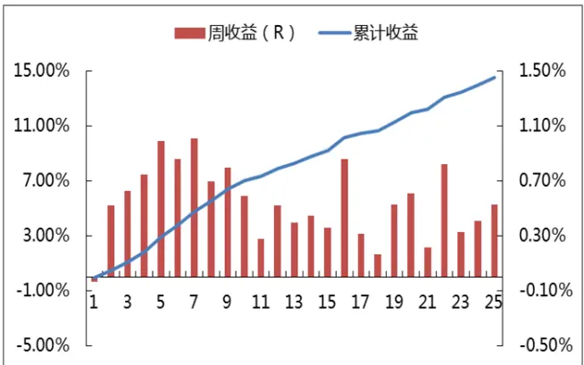
数据来源：Wind，国泰君安证券研究

图 2：样本总体半年平均累积相对收益 7.37%
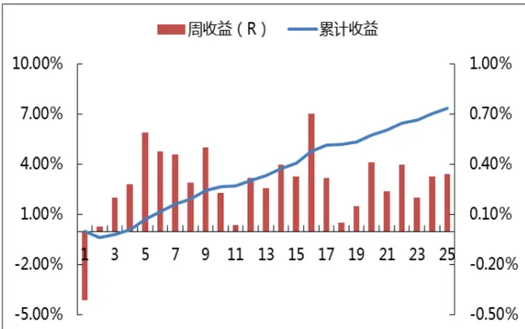
数据来源：Wind，国泰君安证券研究

策略稳定性良好，虽然绝对收益与相对收益之间差异较大，但均是除第一周略微亏损，后面每周的平均收益都为正。且我们看到除了第一周，策略收益相对集中在交易发生的前三个月时间。

## 2.2.3. 分板块观察，创业板收益最优，主板收益较低

我们分别以周为单位，观察了主板、中小板和创业板案例的绝对、相对收益情况。这里的相对收益比较指数依然是万得全 A指数。三个板块整体上均获取正收益，但差异明显。

主板案例，六个月的平均累计绝对收益为 7.12%，累积相对收益为 1.5%，六个月中获得绝对正收益样本占比为 54.66%。

图 3：主板案例累积收益最低
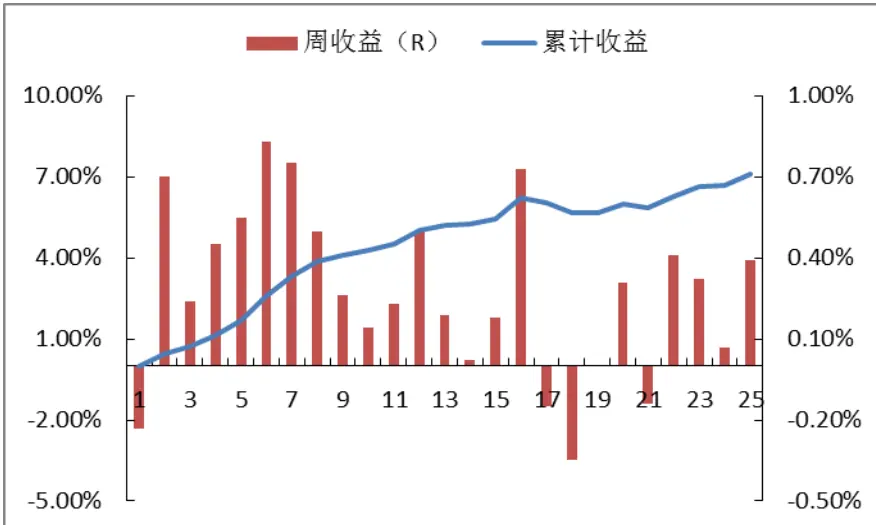
数据来源：Wind，国泰君安证券研究

中小板案例，六个月的平均累计绝对收益为 16.50%，累积相对收益为8.61%，六个月中获得绝对正收益样本占比为 66.33%。

图 4：中小板案例累计收益居中
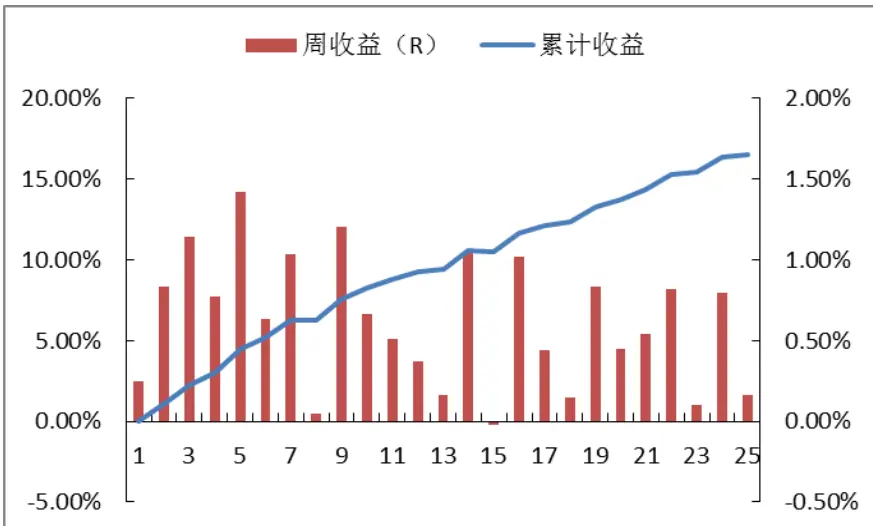
数据来源：Wind，国泰君安证券研究

创业板案例，六个月的平均累计绝对收益为 26.85%，累积相对收益为17.62%，六个月中获得绝对正收益样本占比为 75.16%。

图 5：创业板案例累计收益最高
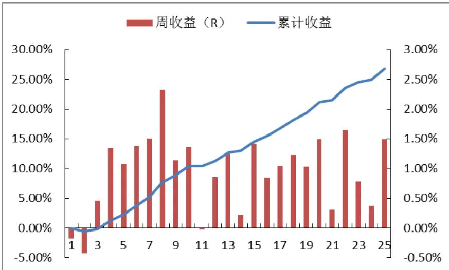
数据来源：Wind，国泰君安证券研究

无论是累计收益率，还是获得正收益样本占比，均呈现创业板好于中小板好于主板的情况。我们认为该现象主要原因有二：

从策略原理来看，主板公司重要股东以国家法人为主，而中小板、创业板的重要股东以自然人和私营企业为主，而自然人和私营企业的避税意识、避税需求显然更为强烈。也就是说，通过我们设臵的条件，在中小板、创业板发现避税型大宗交易的概率要比在主板上高很多。

- 策略检验的时间段内，市场绝大部分时间正好处于呈现“小强大弱”格局。也就是说市场风格作为一项系统性风险对检验结果同样有所影响。

## 3. 进一步加入 TA或 MV 条件，增加策略收益

## 3.1.加入技术分析（TA）因子，达到精选个股目的

从趋势拐点角度来分类，策略属于拐点模型，希望抓住股票中长期级别的拐点。策略要求股价与过去两年相比处于下 30%分位，也就是说在过去一段时间内，该股处于较大级别的下跌趋势中，而我们的期望是随着大宗交易完成，股价能出现一个较大级别的上涨，这就属于典型的拐点模型。拐点模型的风险在于，买入后股价没能上行，而是继续下跌，或者出现一段时间的横盘整理，然后继续下跌。

考虑从非基本面角度叠加一个指标，规避股价向下风险，从而以更高的精度抓住拐点。几乎没有可能找到一种能百分之百发出正确信号的策略，事实上单个策略能有 80%的胜率就已经非常厉害了。但是，如果我们能找到两个真正互相独立的策略，即使每个策略的胜率都只有 60%，做交集后两者同时失效的概率就只有 16%了。因此问题就变成了怎么寻找两个相互独立的策略。原策略是在基本面层面构建的策略（更准确的说，是基于“市场参与者总是以个人利益最大化为目的”这一原则所制定的策略）。因此考虑再加入一个技术分析指标，目的在于帮助原策略以更高的精度抓住拐点，降低原模型风险。

利用 MACD指标中的 DEA值对样本进行分类，降低股价继续下跌的风险。技术指标最重要的作用是分类，或者说是一个评价系统，评价股价走势的强和弱。当 DEA 指标大于 0，认为当前走势较强；当 DEA 小于0，认为当前走势较弱。但是强和弱又都是相对而言的，与级别直接相关。由于我们是在寻找股价偏中长期的拐点，因此考虑在周线和日线级别上利用 DEA 指标。为了避免买入后股价下跌趋势继续延伸，我们要求周线级别的 DEA 指标大于 0，日线级别的 DEA 指标小于 0，即寻找已出现中长期级别的上涨趋势，但短期处于回调的个股。

当然，这里不一定非要利用 MACD 指标，均线指标也可以，只要能达到判断股价不同级别强弱的目的即可。对于 MACD 指标以及如何进行价格分段等更深层次问题的理解，可参考赵延鸿博士之前发出的一系列报告。

利用“周线级别的 DEA 指标大于 0，日线级别的 DEA 指标小于 0”这一条件进行筛选后，一年半内符合策略要求的案例数量下降到 45 个，其中主板 21个，中小板 15个，创业板 9 个。

总体上看，六个月平均累积绝对收益达到 25.73%，获得绝对正收益样本占比达到 80%。

图 6：经过技术指标筛选后，策略总体收益水平进一步提升
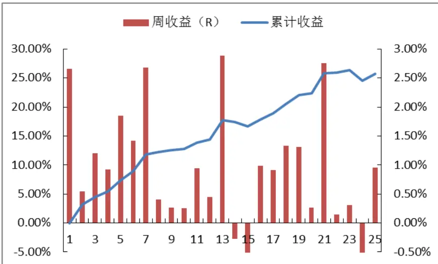
数据来源：Wind，国泰君安证券研究

分板块收益数据如下：

- 主板股票六个月平均累积绝对收益 14.45%，获得绝对正收益样本占比：76.19%；

- 中小盘股票六个月平均累积绝对收益 24.97%，获得绝对正收益样本占比：73.33%；

- 创业板股票六个月平均累积绝对收益 56.81%，获得绝对正收益样本占比：100%。

## 3.2.股票市值（MV）对策略收益影响显著

之前的检验中，我们发现创业板收益好于中小板好于主板，为了进一步检验市值对策略收益的影响，我们将样本内股票按照买入日的总市值分为 10 档，分别计算持有六个月的绝对收益与相对收益（依然以万得全 A指数为基准），然后计算10档股票的平均市值与平均收益的秩相关系数。

发现绝对收益与市值秩相关系数达 84.24%，相对收益与市值秩相关系数高达 90.30%，表明市值与策略收益有较高的相关性。

图 7：样本收益受市值影响显著
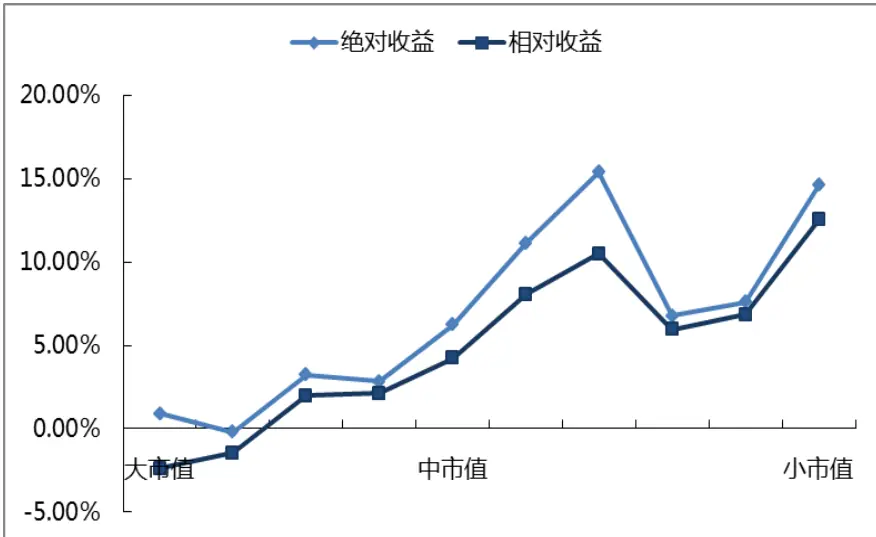
数据来源：Wind，国泰君安证券研究

## 4. 构建策略，近半年回溯检验结果良好

## 4.1. 等权构建策略

事件驱动投资中，我们往往难以系统的构建策略的麻烦，原因在于绝大部分事件策略需要我们在事件发生后快进快出，而事件的发生时点又具有高度不确定性。这里，我们却可以基于大宗交易数据构建完整的策略，因为这一策略的收益是在相对较长时间内逐渐体现，从而我们能够从容建仓。

构建策略时，我们采取等权原则：

- 每月底整理当月中符合条件要求的个股，并集中、等权建仓。由于个股收益并不是在大宗交易后立刻体现，因此我们选择每月底检查当月案例，并集中建仓。

考虑到策略收益需要一段时间才能体现，因此选择持有三个月。根据之前的观察结果，股票平均周收益在前三月相对更高，因此选择持有三个月。当然，也可以根据自身要求选择持有六个月甚至更长时间。

由于换仓频率与持有时间不统一，月底时选择将资金等额分配于当月、上月和上上月股票池。我们希望将每个月符合条件的股票都纳入股票池中，但持仓时间为三个月，因此除了考虑单月内股票配臵权重外，还需要考虑过去不同月份的权重。这里我们依然采用等权方式将资金分配于最近三个月。

图 8：两层等权分配资金
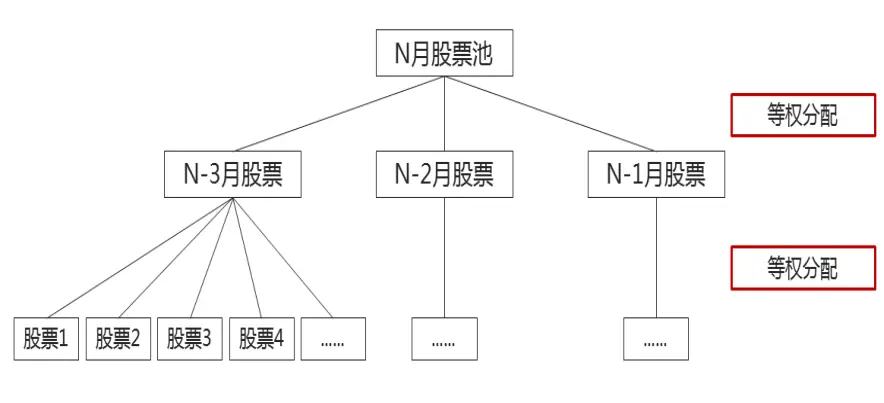
数据来源：国泰君安证券研究

## 4.2.单策略检验结果较好

由于我们样本内观察时间是2012年4月 - 2014年4月，因此选择在2014年 4月 - 2014年 10月的时间段内检验策略效果。首先我们不考虑技术指标和市值因素，只通过大宗交易指标筛选股票，半年时间共选出到 97只股票。由于策略交易频率较低，因此这里暂不考虑交易成本。

表 1：4 -10月股票池名单

| 月份 | 股票数量 | 名单 |  |  |  |  |  |
| --- | --- | --- | --- | --- | --- | --- | --- |
| 4月 | 19 | 陕鼓动力 | 永泰能源 | 益生股份 | 黑猫股份 | 恒立实业 | 毅昌股份 |
|  |  | 铁汉生态 | 海宁皮城 | 三湘股份 | 东北证券 | 交通银行 | 科恒股份 |
|  |  | 金科股份 | 包钢股份 | 三江购物 | 兴业证券 | 恒星科技 | 聚光科技 |
|  |  | 西部矿业 |  |  |  |  |  |
| 5月 | 17 | 豫金刚石 | 巨力索具 | 恒邦股份 | 三湘股份 | 宏达新材 | 阳煤化工 |
|  |  | 三江购物 | 天山股份 | 益生股份 | 金谷源 | 恒星科技 | 晋亿实业 |
|  |  | 毅昌股份 | 陕鼓动力 | 沧州大化 | 聚光科技 | 宁波银行 |  |
| 6月 | 21 | 常宝股份 | 三江购物 | 三元达 | 交通银行 | 南宁百货 | 毅昌股份 |
|  |  | 庞大集团 | 百利电气 | 通葡股份 | 陕鼓动力 | 荣信股份 | 恒逸石化 |
|  |  | 怡球资源 | 巨力索具 | 酒鬼酒 | 雅化集团 | 厦门钨业 | 浩物股份 |
|  |  | 晨光生物 | 朗源股份 | 包钢股份 |  |  |  |
| 7月 | 18 | 山东墨龙 | 华润三九 | 泰亚股份 | 潍柴动力 | 远兴能源 | 华侨城A |
|  |  | 兴发集团 | 光大银行 | 威创股份 | 金科股份 | 世纪星源 | 蓝丰生化 |
|  |  | 日海通讯 | 中顺洁柔 | 合金投资 | 金发科技 | 巨力索具 | 广发证券 |
| 8月 | 15 | 龙源技术 | 中色股份 | 马钢股份 | 日海通讯 | 兴化股份 | 金科股份 |
|  |  | 海陆重工 | 海南航空 | 云南铜业 | 大商股份 | 中金黄金 | 徐工机械 |
|  |  | 三江购物 | 荣安地产 | 恒天海龙 |  |  |  |
| 9月 | 6 | **** | 苏宁云商 | 中联重科 | 武钢股份 | 三一重工 | 美邦服饰 |
| 10月 | 1 | 山东地矿 |  |  |  |  |  |

数据来源：Wind，国泰君安证券研究

我们发现从 6月开始，股票数量在逐渐下降，尤其是 9月、10月掉到了个位数。一方面，这里面有 10 月国庆长假的因素；另一方面，半年来经过一波较大的上涨，越来越多的股票难以满足股价处于过去两年下30%分位这一要求。如果觉得入选股票数量较少，可将这一条件适当放宽。

图 9：策略的收益、稳定性良好
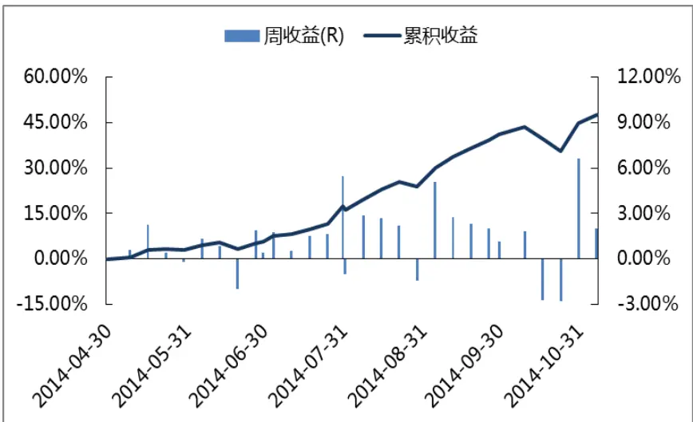
数据来源：Wind，国泰君安证券研究

策略收益风险比较佳。策略不但年化收益率较高，显著跑赢万得全 A指数（指数同期年化收益为 55.68%），且夏普比率、信息比率以及收益最大回撤比均让人满意。

表 2：原策略各项指标均较为优异

| 年化收益率 85.54% |
| --- |
| 年化波动率 15.54% |
| 周胜率 79.31% |
| 最大回撤 -5.47% |
| 夏普比率 5.18 |
| 信息比率 1.92 |
| 收益最大回撤比 15.63 |

数据来源：Wind，国泰君安证券研究

## 4.3.剔除大市值股票后，策略效果进一步提升

在原策略股票池基础上，我们剔除总市值在三百亿以上的个股。主要剔除标的包括交通银行、广发证券等金融、能源股。因此，这里我们选择万得全 A指数（除金融、石油石化）作为比较标的。

图 10：剔除大市值股票后，策略收益更高，稳定性更好
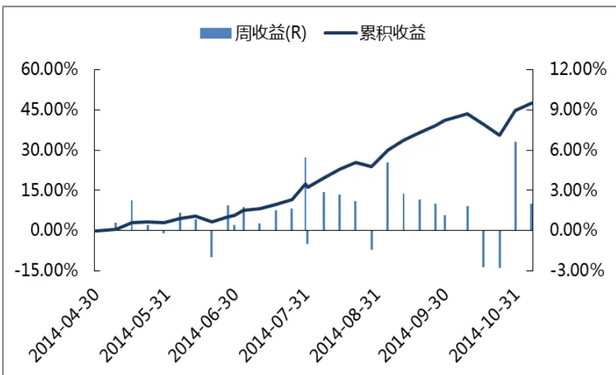
数据来源：Wind，国泰君安证券研究

剔除大市值个股后，我们发现策略收益略有提升，同时策略的波动率和最大回撤还在下降，因此夏普比率、收益最大回撤比提升明显。同时，虽然比较基准万得全 A指数（除金融、石油石化）的年化收益更高，达到 60.88%，但由于策略波动性更低，因此信息比率依然有所提升。

表 3：策略各项指标均有进一步提升

| 年化收益率 92.34% |
| --- |
| 年化波动率 15.01% |
| 周胜率 79.31% |
| 最大回撤 -4.40% |
| 夏普比率 5.82 |
| 信息比率 2.1 |
| 收益最大回撤比 20.98 |

数据来源：Wind，国泰君安证券研究

## 4.4.加入技术指标后，策略精选个股能力凸显

加入 DEA指标后，入选个股数量进一步下降，个股收益水平继续上升。

过去半年，同时符合原策略条件和技术指标条件的股票只有 4只，分别是：豫金刚石，宏达新材，合金投资和山东地矿。

表 4：减持三个月后，所选个股均获得显著收益

|  | 大宗交易日期 | 当日收盘价 | 11.13 收盘价 | 涨幅 |
| --- | --- | --- | --- | --- |
| 豫金刚石 | 2014/5/5 | 4.68 | 6.42 | 37.18% |
| 宏达新材 | 2014/5/29 | 5.15 | 9.73 | 88.93% |
| 合金投资 | 2014/7/18 | 5.45 | 10.2 | 87.16% |
| 山东地矿 | 2014/10/30 | 11.16 | 10.82 | -3.05% |

数据来源：Wind，国泰君安证券研究

截至 11 月 13 日，豫金刚石涨幅 37.18%，宏达新材涨幅 88.93%，合金投资涨幅 87.16%，山东地矿则是在 10 月底刚刚发生减持，目前收益还不显著。

图 11：豫金刚石最高涨幅也达到 80%多
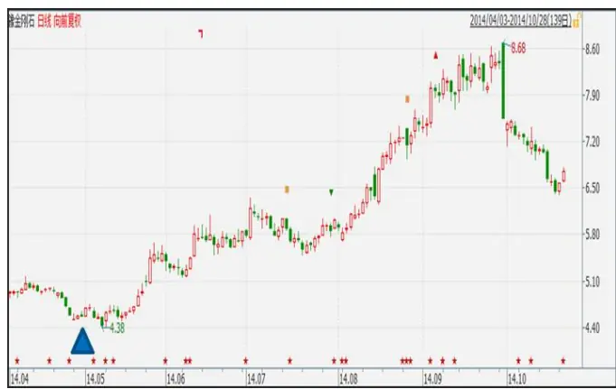
数据来源：Wind，国泰君安证券研究

图 12：宏达新材半年股价几乎翻倍
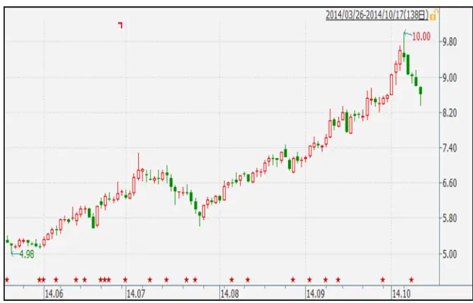
数据来源：Wind，国泰君安证券研究

图 13：合金投资大幅上涨后因重大重组事项停牌
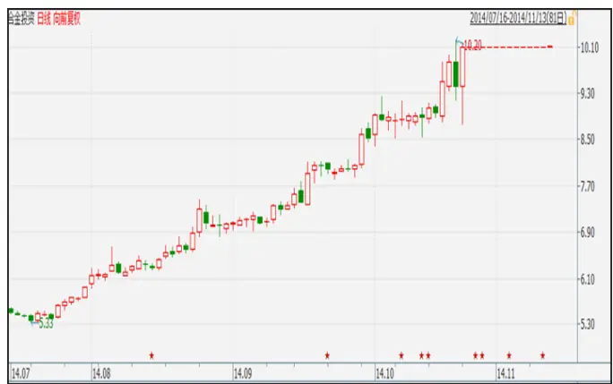
数据来源：Wind，国泰君安证券研究

## 5. 策略风险：Bull & Time

## 5.1.bull：大牛市中，策略可能跑不赢指数

以创业板为例，在 2012年 10月 -2014年 4月期间，创业板指从 690点涨到 1300 点，涨幅约 90%；同期选出的 157 个案例在 6 个月内的平均累计涨幅为 26.85%，略低于创业板指数涨幅。如果计算样本案例每周的平均相对收益并进行累计，会发现平均跑输创业板指 5.85%。

图 14：牛市中，策略可能会跑输基准
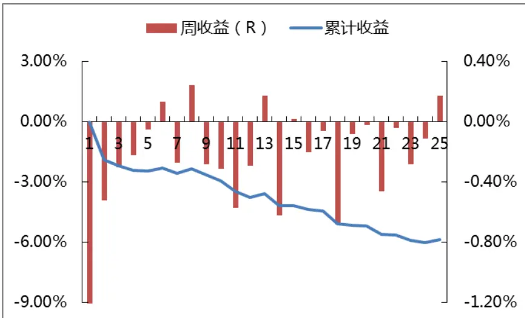
数据来源：Wind，国泰君安证券研究

当然，牛市中策略跑输基准也并不必然发生。今年 4 月-10 月市场主要指数上涨约 20%，而我们构建的策略还是可以显著跑赢万得全 A指数。

## 5.2.Time：收益体现时间不确定

重要股东减持时间不确定。如果是重要股东减持，那么大部分情况下，减持不会一蹴而就，需要在一段时间内，分若干次才能减持完毕，而这种减持节奏、减持时间等信息我们是无法通过公开资料来判断的。

减持时间不确定导致策略在初期可能不会获得显著收益。由于无法得知最后减持日期，因此我们采取的办法是当首次发现符合条件的大宗成交记录后，在当月底建仓，这样就会面临在一段时间内无法获得明确收益的风险。从回溯检验结果来看，我们也发现策略收益在第 1-2 周时不明显，甚至略微亏损。

## 5.3.策略收益受若干因素影响，需要灵活应用

影响该策略有效性的因素大致如下：

- 交易工具

- 市值管理工具

- 法律法规

- 市场认知

以市场认知因素为例。如果我们把检验时间从 2012年 10月向前推演到2012 年 1月，那么策略的效果将有所不同。原因在于利用大宗交易市场进行低位避税从 2012 年开始才大量兴起，市场需要一段时间才逐渐对这一行为有所认知，因此在 2012 年初期套用该策略，是不会取得超额收益的。

图 15：2012年策略总体绝对收益为负
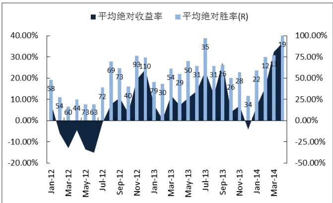
数据来源：Wind，国泰君安证券研究

图 16：2012 年策略总体相对收益不显著
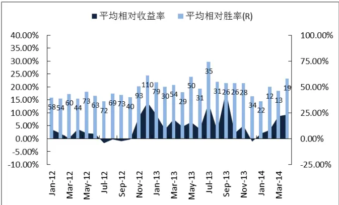
数据来源：Wind，国泰君安证券研究

总结起来，策略的收益与风险特征往往都是在特定时间、特定背景下的特定产物，当条件发生变化时，策略有效性就会受到影响。

## 本公司具有中国证监会核准的证券投资咨询业务资格

## 分析师声明

作者具有中国证券业协会授予的证券投资咨询执业资格或相当的专业胜任能力，保证报告所采用的数据均来自合规渠道，分析逻辑基于作者的职业理解，本报告清晰准确地反映了作者的研究观点，力求独立、客观和公正，结论不受任何第三方的授意或影响，特此声明。

## 免责声明

本报告仅供国泰君安证券股份有限公司（以下简称“本公司”）的客户使用。本公司不会因接收人收到本报告而视其为本公司的当然客户。本报告仅在相关法律许可的情况下发放，并仅为提供信息而发放，概不构成任何广告。

本报告的信息来源于已公开的资料，本公司对该等信息的准确性、完整性或可靠性不作任何保证。本报告所载的资料、意见及推测仅反映本公司于发布本报告当日的判断，本报告所指的证券或投资标的的价格、价值及投资收入可升可跌。过往表现不应作为日后的表现依据。在不同时期，本公司可发出与本报告所载资料、意见及推测不一致的报告。本公司不保证本报告所含信息保持在最新状态。同时，本公司对本报告所含信息可在不发出通知的情形下做出修改，投资者应当自行关注相应的更新或修改。

本报告中所指的投资及服务可能不适合个别客户，不构成客户私人咨询建议。在任何情况下，本报告中的信息或所表述的意见均不构成对任何人的投资建议。在任何情况下，本公司、本公司员工或者关联机构不承诺投资者一定获利，不与投资者分享投资收益，也不对任何人因使用本报告中的任何内容所引致的任何损失负任何责任。投资者务必注意，其据此做出的任何投资决策与本公司、本公司员工或者关联机构无关。

本公司利用信息隔离墙控制内部一个或多个领域、部门或关联机构之间的信息流动。因此，投资者应注意，在法律许可的情况下，本公司及其所属关联机构可能会持有报告中提到的公司所发行的证券或期权并进行证券或期权交易，也可能为这些公司提供或者争取提供投资银行、财务顾问或者金融产品等相关服务。在法律许可的情况下，本公司的员工可能担任本报告所提到的公司的董事。

市场有风险，投资需谨慎。投资者不应将本报告为作出投资决策的惟一参考因素，亦不应认为本报告可以取代自己的判断。在决定投资前，如有需要，投资者务必向专业人士咨询并谨慎决策。

本报告版权仅为本公司所有，未经书面许可，任何机构和个人不得以任何形式翻版、复制、发表或引用。如征得本公司同意进行引用、刊发的，需在允许的范围内使用，并注明出处为“国泰君安证券研究”，且不得对本报告进行任何有悖原意的引用、删节和修改。

若本公司以外的其他机构（以下简称“该机构”）发送本报告，则由该机构独自为此发送行为负责。通过此途径获得本报告的投资者应自行联系该机构以要求获悉更详细信息或进而交易本报告中提及的证券。本报告不构成本公司向该机构之客户提供的投资建议，本公司、本公司员工或者关联机构亦不为该机构之客户因使用本报告或报告所载内容引起的任何损失承担任何责任。

## 评级说明

## 1.投资建议的比较标准

投资评级分为股票评级和行业评级。

以报告发布后的12个月内的市场表现为比较标准，报告发布日后的12个月内的公司股价（或行业指数）的涨跌幅相对同期的沪深300指数涨跌幅为基准。

## 2.投资建议的评级标准

报告发布日后的 12 个月内的公司股价（或行业指数）的涨跌幅相对同期的沪深300指数的涨跌幅。

| 评级 |  | 说明 |
| --- | --- | --- |
| 股票投资评级 | 增持 | 相对沪深 300指数涨幅15%以上 |
|  | 谨慎增持 | 相对沪深300指数涨幅介于5%～15%之间 |
|  | 中性 | 相对沪深300指数涨幅介于-5%～5% |
|  | 减持 | 相对沪深300指数下跌5%以上 |
| 行业投资评级 | 增持 | 明显强于沪深 300 指数 |
|  | 中性 | 基本与沪深300指数持平 |
|  | 减持 | 明显弱于沪深 300指数 |

## 国泰君安证券研究

|  | 上海 | 深圳 | 北京 |
| --- | --- | --- | --- |
| 地址 | 上海市浦东新区银城中路168号上海 银行大厦29层 | 深圳市福田区益田路 6009 号新世界 商务中心34层 | 北京市西城区金融大街 28 号盈泰中 心2号楼10层 |
| 邮编 | 200120 | 518026 | 100140 |
| 电话 | （021)38676666 | (0755)23976888 | (010)59312799 |
|  | E-mail: gtjaresearch@gtjas.com |  |  |