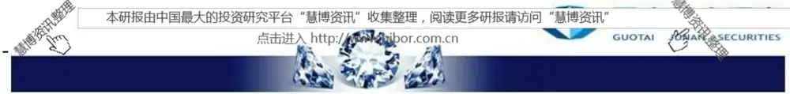

金融工程

2014.11.24

# 基于文本挖掘的量化投资应用

## ——数量化专题之五十二

吴晶（分析师）

刘富兵（分析师）

8 021-38676720

021-38676673

## 李雪君（研究助理）

wujing@gtjas.com

liufubing008481@gtjas.com

021-38675855

lixuejun@gtjas.com

证书编号 S0880514110001

S0880511010017

S0880114090056

## 本报告导读：

在目前的文本数据研究领域，大家主要集中在对点数据的定性研究上。本篇报告基于积累了近5年的股票论坛文本数据，阐述了了如何对这些文本数据进行定量分析，以及应用该数据结果所验证的投资想法。

## 摘要：

## 在众人恐惧时贪婪，在众人贪婪时恐惧

在该章节中我们主要介绍了运用文本挖掘如何量化投资者情绪。

## 眼球经济与主题投资

在该章节中我们主要介绍了如何运用文本挖掘量化主题热度，并通过该主题热度指标，为主题投资提供额外信息源。

## 在冷门股中寻找投资机会

在该章节中运用股票论坛发帖量构建反映股票冷热程度因子，并且验证在A股市场中冷门股具有稳定超额收益。

## 岁岁年年人不同

在该章节中运用文本挖掘探索主题相关个股的问题。

## 年年岁岁花相似

在该章节中运用文本挖掘定义泛事件投资，探索任何能引起投资者关注且为周期性发生事件的投资机会。

## 金融工程团队：

刘富兵：（分析师）

电话：021-38676673

邮箱：liufubing008481@gtjas.com

证书编号：S0880511010017

耿帅军：（分析师）

电话：010-59312753

邮箱：gengshuaijun@gtjas.com

证书编号：S0880513080013

## 徐康：（分析师）

电话：021-38674939

邮箱：xukang010849@gtjas.com

证书编号：S0880513080018

## 陈睿：（分析师）

电话：021-38675861

邮箱：chenrui012896@gtjas.com

证书编号：S0880514070009

刘正捷：（分析师）

电话：0755-23976803

邮箱：liuzhengjie012509@gtjas.com

证书编号：S0880514070010

吴晶：（分析师）

电话：021-38676720

邮箱：wujing@gtjas.com

证书编号：S0880514110001

## 赵延鸿：（研究助理）

电话：021-38674927

邮箱：zhaoyanhong@gtjas.com

证书编号：S0880113070047

## 李雪君：（研究助理）

电话：021-38675855

邮箱：lixuejun@gtjas.com

证书编号：S0880114090056

## 王浩：（研究助理）

电话：021-38674812

邮箱：wanghao014399@gtjas.com

证书编号：S0880114080041

## 相关报告

《是税！基于大宗交易数据的事件驱动策略》2014.11.21

《基于市场强弱度的择时》2014.11.20

《走进量化投资新时代》2014.11.20

《阿尔法来源的再探索》2014.11.19

衍生品重装上阵》2014.11.19

《国泰君安_2015年金融工程投资策略_场外

## 1. 金融文本挖掘背景介绍

文本挖掘作为数据挖掘的一个分支，挖掘对象通常是非结构化的文本数据，常见的文本挖掘对象包括网页中的论坛、微博、新闻等。文本挖掘是目前金融量化研究的一个非常热门的领域，其主要原因有以下三点：一是对传统数值型数据的研究已经相对成熟了，而对文本数据的研究处于起步状态，在全新的数据源寻找超额收益相对容易。

二是网络文本数据更直接的反应投资者的投资意向。比如说，投资者A在某论坛中发表言论提及某概念，那么表示他近期特别关注该概念的投资机会；再比如说，当投资者B想参与到某个主题投资中，那么他应该会买入那些在日常新闻中阅读到的和这些概念相关的股票。当我们以群体的方式去研究这些文本数据，便可以获取额外的信息。

三是目前网络所留存的文本数据在数量以及时间上都可以满足我们去构建成熟的量化模型。量化模型的稳定性在很大程度上取决于样本的数量，而随着近年来互联网技术的普及，网络中留存的文本数据也呈几何式增长，且普及时间也基本在5年以上，因此这些数据满足构建量化模型的基本要求。

在目前的文本数据研究领域，大家主要集中在对点数据的定性研究上，而对文本数据在时间序列上的定量分析较少。这主要有以下两个方面原因：一是文本数据是以非结构化的形式存储，且历史数据规模较大，这是传统统计分析难以处理的。二是文本数据获取较难，需要长时间的积累，如果早期没有进行积累的话，短期内很难获取足够长时间的数据进行时间序列分析。

本篇报告基于积累了近5年的股票论坛文本数据，阐述了了如何对这些文本数据进行定量处理，以及应用该数据结果所验证的投资想法。

## 2. 在众人恐惧时贪婪，在众人贪婪时恐惧

所有投资者似乎都认可这样的常识：在众人恐惧时贪婪，在众人贪婪时恐惧。然而要验证这个逻辑似乎是不容易的，最主要的原因就是对情绪的刻画没有一个标准模式，有人用市场波动率指标，也有人用换手率指标。然而通过文本挖掘，我们给出了一个更直观的方法：如果说一个投资者在股票论坛上发的帖子反应了他对当前股市的情绪，那么所有论坛的帖子反应了整个投资者群体对当前股市的情绪，基于这样的想法，我们按天去收集股票论坛中所有的发贴，并对这些帖子进行情感分析、统计分析，得到一个可量化的、反映投资者群体情绪的指标。

图 1 投资者情绪指标与中证 800 指数
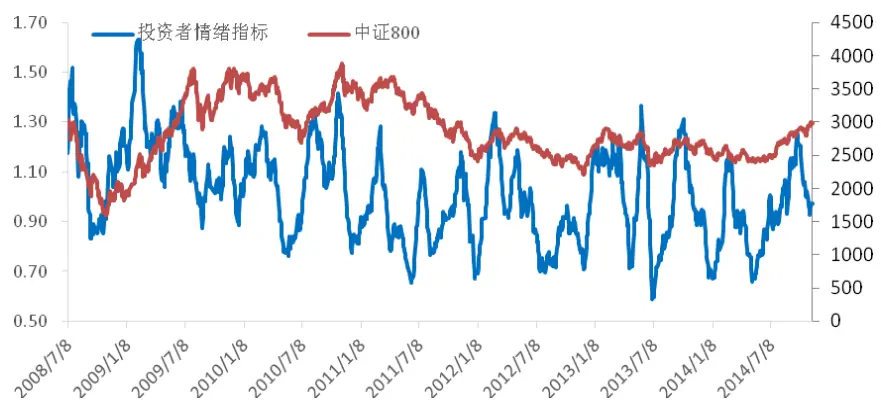
数据来源：国泰君安证券研究wind

前文中提到的“情感分析”，可以理解为一个黑盒，这个黑盒的输入端为一段文字，输出端为一个数值，这个数值反映了这句话的情感。若数值为正，则表示这段文字是乐观的；若数值为负，则表示这段文字是悲观的。在常规的情感分析算法中，监督学习仍然是主流，主要包括一些常规的分类算法，如贝叶斯，Kmean，SVM等；另外还有一些基于规则的方法，当然考虑到金融词汇的特殊性，还需要进行一些特别的处理。

由于中文词语博大精深，我们的测试结果显示：情感分析的正确率仅在85%左右，因此情感分析仅针对较大样本下的统计才有意义。

运用该情绪指标，我们便可以构建贪婪恐惧的择时模型。关于具体择时模型构建的信息，请参考我们后续的报告。

## 3. 眼球经济与主题投资

眼球经济是指依靠吸引公众注意力来获取收益的一种经济活动，在某种程度上，主题投资也是一样的，它通过不停的吸引更多投资者的注意力来维持行情。如果能够将主题投资吸引到的投资者注意力进行量化，我们在研究主题投资时便能获取更丰富的额外信息。因此，我们定义了主题热度指标，该指标反应了某个主题所受到的投资者关注量。具体的操作方法是：我们统计每日论坛中这些主题词出现的频率，然后计算其10日移动平均值，得到主题热度指标。

图2“特斯拉”主题热度与比亚迪走势
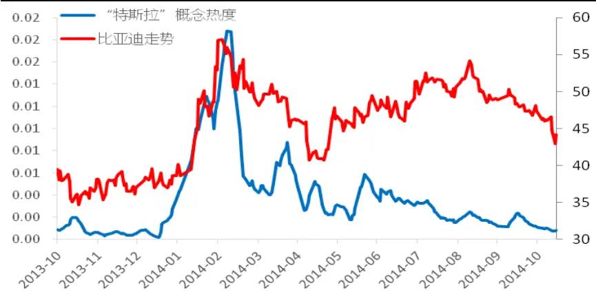
数据来源：国泰君安证券研究wind

图3“传媒”主题热度与传媒行业指数走势
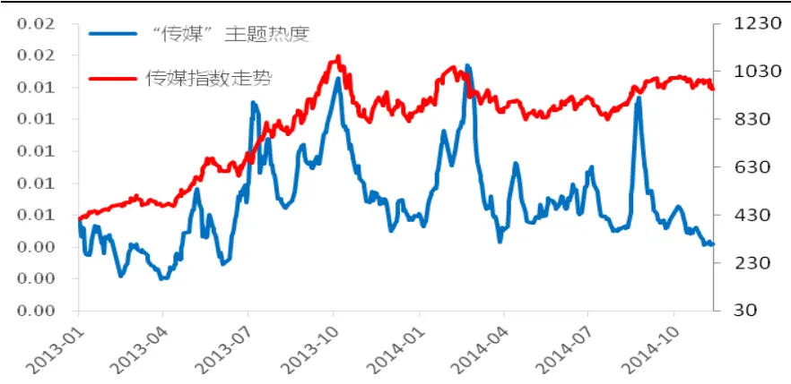
数据来源：国泰君安证券研究wind

图2所示为“特斯拉”的主题热度以及与其有较大相关性的比亚迪的走势。从中我们可以看出主题热度与主题相关股走势呈正相关关系。这也验证了主题投资的特点：主题可以通过不停的吸引更多投资者注意力来维持行情。图3中，传媒主题热度以及传媒指数的走势也高度相关。

然而经过我们的统计发现，几乎所有的主题热度与相关个股走势均趋于同步性。仅仅依据主题热度这样一个同步指标，我们很难对主题做出择时的判断，因为在某种程度上基于主题热度投资和基于股价本身投资是一样的。对于主题热度，我们更多的是从事件投资、突发新闻、主题炒作后相关股票超涨超跌的现象入手进行分析。具体分析大家可以参考我们后续的专题报告。

## 4. 在冷门股中寻找投资机会

格雷厄姆认为“冷门股中的投资机会更多"。他的理由是，这些冷门股由于缺乏市场的关注，价格远远滞后于其统计表现，但是一旦该股票受到关注，结果可能完全相反，公司的业绩将最大限度地反映到股票价格上。同时，《彼得·林奇的成功投资》中也提到：“如果说有一种股票我避而不买的话，它一定是最热门行业中最热门的股票，这种股票受到大家最广泛的关注，投资者上下班途中在汽车上或在火车上都会听到人们谈论这种股票，一般人往往禁不住这种强大的社会压力就买入了这种股票。”

基于上述理论，我们来探索A股中是否存在这样的冷门股、热门股效应。冷门股是指那些较少为人问津、很少被投资者关注并且公司名称少有耳闻的股票。这些股票的一个重要特征是它所对应的网络论坛不活跃，因此网络论坛的活跃度能够直观的反映股票的冷热门程度。具体的操作方法是：我们统计每个股票所属的子论坛下每日新发贴的数量，我们认为那些新发帖量较大的股票属于相对热门的股票，而那些新发帖量较小的股票属于相对冷门的股票。我们仅按照发帖量的数据将所有股票划分为5 组，组1 是所有股票中发帖量最低的20%，组 5 为所有股票中发帖量最高的20%，组2,3,4为依次递增，然后我们按月进行调仓，每组内等权配置，得到5组从2008年6月至今的各组累积收益率如下：

图 4 五组累积收益率
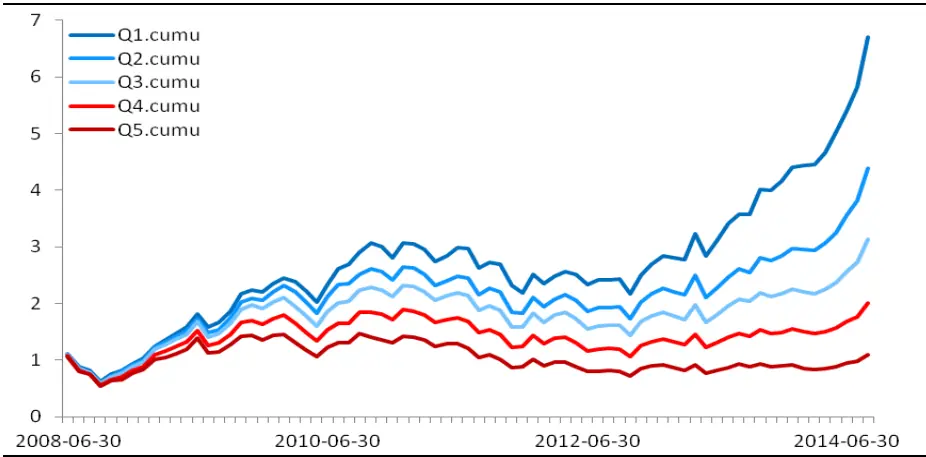
数据来源：国泰君安证券研究wind

从图4中，我们看出基于论坛中的发帖量数据具有很好的区分度以及单调性；Q1，也就是发帖量最小的20%的股票组合，具有非常稳定的超额收益；Q5，也就发帖量最大的20%的股票组合，稳定的跑输基准。这就是说明冷门股以及热门股效应在A股中也同样是存在的。

图 4 多空组合累积收益
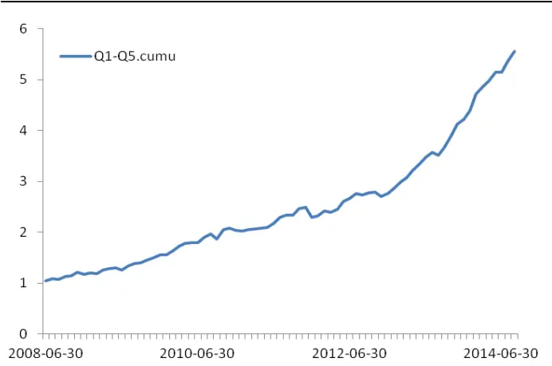

图 5 五组超额累积收益(基准:全 A 等权指数)
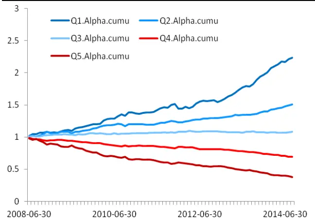
数据来源：国泰君安证券研究wind

在中证800指数、中证500指数中，该因子也同样有效。即使跟一些同性质的因子相比，它也有一定的优势。比如分析师覆盖家数因子，也能在一定程度上反映股票的冷热程度，但是它的数据量较少，一方面会导致不是所有股票均有因子值，另一方面因子本身的小幅波动对结果影响较大。

我们推崇于这类因子的主要原因在于，首先这些数据基于一个全新的数据源，在一定程度上它所提供的超额收益是之前的方法所不能及的；其次这类因子的构造具有一定的复杂性，提高了研究门槛，因此其超额收益具有较强的持续性。关于该因子详细的回测报告，请关注后期的专题报告。

## 5. 岁岁年年人不同

我们经常会面临这样的问题：当我们想去参与某个主题的投资时，应该去买什么股票？一种困扰可能是这个主题太新了，根本不知道什么股票属于这一主题；另一种困扰可能是属于这个主题的股票太多了，而且各个相关股票也在不停的冷热交替中，根本不清楚最近哪些股票和这些主题是最相关的。基于股票论坛中的大量文本数据，我们给出了解决方案。

一直以来我们都认可这样的常识：当一个主题和一些股票同时出现在一个帖子或者一篇新闻中，那么这些股票在大概率下是和这个主题相关的。于是我们在成千上万的包含该主题的帖子或者新闻中去计算所有股票与该主题的文本上的相关关系，确定阀值，挑选出与该主题相关的个股。

在计算所有股票与主题的相关关系时，我们借用了文本挖掘中常用的TF-IDF算法。TF-IDF算法是一种统计方法，主要用于评估一个字词对于一个语料库中的一份文件的重要程度。字词的重要性随着它在该文件中出现的次数（TF）正比增加，但同时会随着它在总的语料库中出现的频率(IDF)反比下降。具体而言，当我们想获取环保最新的相关个股，分以下步骤：1）获取最近一段时间内所有含有环保词组的文本；2）统计该文本中个股票出现次数，得到每个股票的TF值；3）根据个股票在总文本中出现的次数计算IDF值；4）计算每只股票的TF-IDF值，根据设定好的阀值，得到环保相关个股。这里之所以选用TF-IDF算法，一方面因为它能够量化股票仅和该主题间的相关性；另一方面通过IDF权重的调整，可以筛去那些过热的股票。

还有一个需要特别注意的细节：到底应该选用多久一段时间内的文本进行计算？我们的研究结果显示，如果选取最近3个月至6个月的文本数据，则挑选出的相关个股基本偏向一些中规中矩、与主题确定相关的股票；如果选取较短时间内的文本数据，则挑选出的会是一些新近才与主题产生联系、相关性不确定的个股，且这些股票的波动性也非常大。

图6各主题出现早期挖掘到的相关个股.
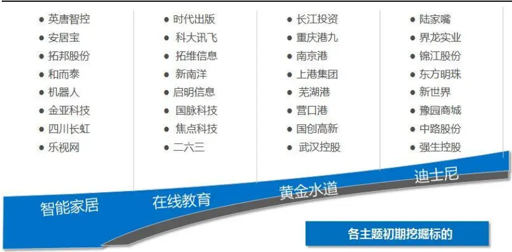
数据来源：国泰君安证券研究wind

综上所述，我们认为标的挖掘有以下几个用途：1）新主题出现时，迅速地定位出和这些主题相关的个股；2）对旧主题，能够量化主题和个股之间的相关性，在主题投资时对个股进行精选；3）实时维护一个与主题相关性最大个股的组合。

## 6. 年年岁岁花相似

本节主要试图阐明这样一个道理：任何一桩能够引起投资者关注的事件必然会带来超额收益，这部分超额收益来源于投资者关注的溢价。如果这个事件的发生具有周期性，则我们可以基于其过去的表现来确定下次该事件来临时的操作策略，从而获取收益。这里所指的事件定义非常广泛，只要是能够引起投资者关注的，并且是周期性发生的，均可以称为事件。

以“中国国际机器人展览会”为例，该展会是目前国内水平最高、规模最大、专业化程度最高的机器人专业展，目前已经举办了3届。2012年举办的时间为7月3日，2013年举办时间为7月2日，2014年举办时间为7月9日。首先我们仿照主题热度的指标，在论坛的文本数据中去搜寻该博览会被投资者所关注的热度指标，如图7。

图 7 国际机器人博览会历史热度
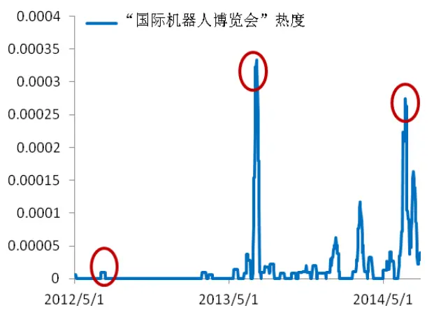

图8历届博览会召开前后20个交易日，机器人主题指数超额收益变化（基准：沪深300指数）
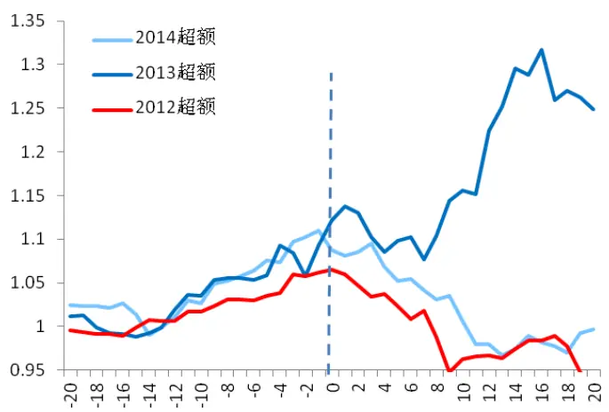
数据来源：国泰君安证券研究wind

从图7中可以看出，在该展览会召开前，已经陆续有投资者在网络论坛提到该展览会，而且大量的提及时间点集中于召开前一个月。这说明该事件是能够吸引大量投资者关注的，而且投资者的关注是在展览会召开前一个月逐渐增多。接下来我们分析三届会议召开前20个交易日到召开后20个交易日内，机器人主题指数相对于沪深300的超额收益的累积情况如图8所示。

从图8中可以看出，每次在该展览会前20个交易日到展览会召开当日均有一定的超额收益，在2013年、2014年的时候有近10%的超额收益，2012年的时候有6%左右的超额收益，并且这些超额收益在展览会召开后慢慢消减至0（2013年因为其他的利好而导致了一定的偏差)。那么基于这个数据，在2015年7月8日该展览会再次召开之前20个交易日，我们可以考虑投资这样一个事件。当然我们也可以根据上一节中介绍的主题相关个股标的挖掘法，来精选机器人主题的个股。

图9“世界杯”历史热度
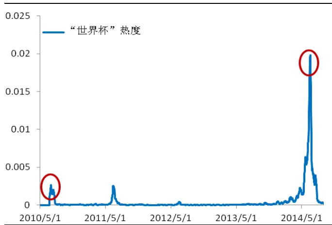

图10历届世界杯召开前后20个交易日，世界杯相关股组合超额收益变化（基准：沪深300指数）
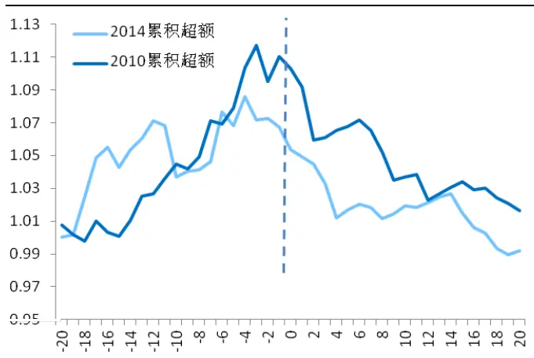
数据来源：国泰君安证券研究wind

上述例子也阐述了立足于文本数据构造泛事件投资的基本框架，即：1）确定该事件能否引起投资者关注以及确定具体的关注时段；

2）探索事件发生的历史规律，如影响个股、收益变化等；

3）基于历史规律，确认事件再次来临时的操作策略。

由于我们对“事件”的要求仅有两条：一是能够引起投资者关注；二是具有周期性，因此可供我们研究的事件非常宽泛，且很多来源于日常生活，这也在一定程度上阐释了投资机会无处不在。图11是目前我们筛选出来的部分事件，关于更为完整的事件库，以及对每一个事件的详细分析，请参考我们后续的专题报告。

图 11 部分事件库
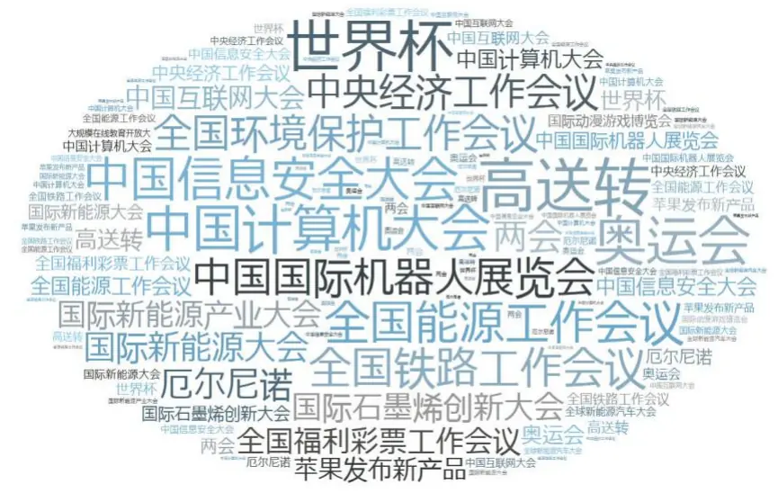
数据来源：国泰君安证券研究 wind

## 本公司具有中国证监会核准的证券投资咨询业务资格

## 分析师声明

作者具有中国证券业协会授予的证券投资咨询执业资格或相当的专业胜任能力，保证报告所采用的数据均来自合规渠道，分析逻辑基于作者的职业理解，本报告清晰准确地反映了作者的研究观点，力求独立、客观和公正，结论不受任何第三方的授意或影响，特此声明。

## 免责声明

本报告仅供国泰君安证券股份有限公司（以下简称“本公司”）的客户使用。本公司不会因接收人收到本报告而视其为本公司的当然客户。本报告仅在相关法律许可的情况下发放，并仅为提供信息而发放，概不构成任何广告。

本报告的信息来源于已公开的资料，本公司对该等信息的准确性、完整性或可靠性不作任何保证。本报告所载的资料、意见及推测仅反映本公司于发布本报告当日的判断，本报告所指的证券或投资标的的价格、价值及投资收入可升可跌。过往表现不应作为日后的表现依据。在不同时期，本公司可发出与本报告所载资料、意见及推测不一致的报告。本公司不保证本报告所含信息保持在最新状态。同时，本公司对本报告所含信息可在不发出通知的情形下做出修改，投资者应当自行关注相应的更新或修改。

本报告中所指的投资及服务可能不适合个别客户，不构成客户私人咨询建议。在任何情况下，本报告中的信息或所表述的意见均不构成对任何人的投资建议。在任何情况下，本公司、本公司员工或者关联机构不承诺投资者一定获利，不与投资者分享投资收益，也不对任何人因使用本报告中的任何内容所引致的任何损失负任何责任。投资者务必注意，其据此做出的任何投资决策与本公司、本公司员工或者关联机构无关。

本公司利用信息隔离墙控制内部一个或多个领域、部门或关联机构之间的信息流动。因此，投资者应注意，在法律许可的情况下，本公司及其所属关联机构可能会持有报告中提到的公司所发行的证券或期权并进行证券或期权交易，也可能为这些公司提供或者争取提供投资银行、财务顾问或者金融产品等相关服务。在法律许可的情况下，本公司的员工可能担任本报告所提到的公司的董事。

市场有风险，投资需谨慎。投资者不应将本报告为作出投资决策的惟一参考因素，亦不应认为本报告可以取代自己的判断。在决定投资前，如有需要，投资者务必向专业人士咨询并谨慎决策。

本报告版权仅为本公司所有，未经书面许可，任何机构和个人不得以任何形式翻版、复制、发表或引用。如征得本公司同意进行引用、刊发的，需在允许的范围内使用，并注明出处为“国泰君安证券研究”，且不得对本报告进行任何有悖原意的引用、删节和修改。

若本公司以外的其他机构（以下简称“该机构”）发送本报告，则由该机构独自为此发送行为负责。通过此途径获得本报告的投资者应自行联系该机构以要求获悉更详细信息或进而交易本报告中提及的证券。本报告不构成本公司向该机构之客户提供的投资建议，本公司、本公司员工或者关联机构亦不为该机构之客户因使用本报告或报告所载内容引起的任何损失承担任何责任。

## 评级说明

## 1. 投资建议的比较标准

投资评级分为股票评级和行业评级。

以报告发布后的12个月内的市场表现为比较标准，报告发布日后的12个月内的公司股价（或行业指数）的涨跌幅相对同期的沪深300指数涨跌幅为基准。

## 2. 投资建议的评级标准

报告发布日后的12个月内的公司股价（或行业指数）的涨跌幅相对同期的沪深300指数的涨跌幅。

| 评级 |  | 说明 |
| --- | --- | --- |
| 股票投资评级 | 增持 | 相对沪深 300指数涨幅15%以上 |
|  | 谨慎增持 | 相对沪深300指数涨幅介于5%～15%之间 |
|  | 中性 | 相对沪深300指数涨幅介于-5%～5% |
|  | 减持 | 相对沪深300指数下跌5%以上 |
| 行业投资评级 | 增持 | 明显强于沪深 300 指数 |
|  | 中性 | 基本与沪深300指数持平 |
|  | 减持 | 明显弱于沪深 300指数 |

## 国泰君安证券研究

|  | 上海 | 深圳 | 北京 |
| --- | --- | --- | --- |
| 地址 | 上海市浦东新区银城中路168号上海 银行大厦29层 | 深圳市福田区益田路 6009 号新世界 商务中心34层 | 北京市西城区金融大街 28 号盈泰中 心2号楼10层 |
| 邮编 | 200120 | 518026 | 100140 |
| 电话 | （021)38676666 | (0755)23976888 | (010)59312799 |
|  | E-mail: gtjaresearch@gtjas.com |  |  |