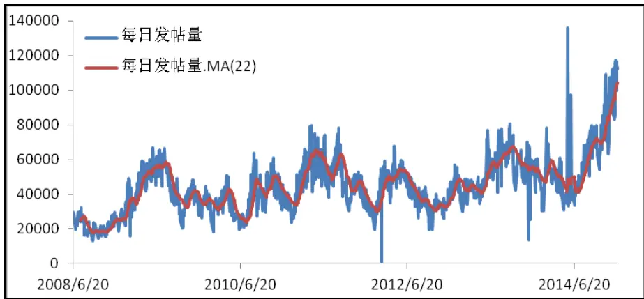
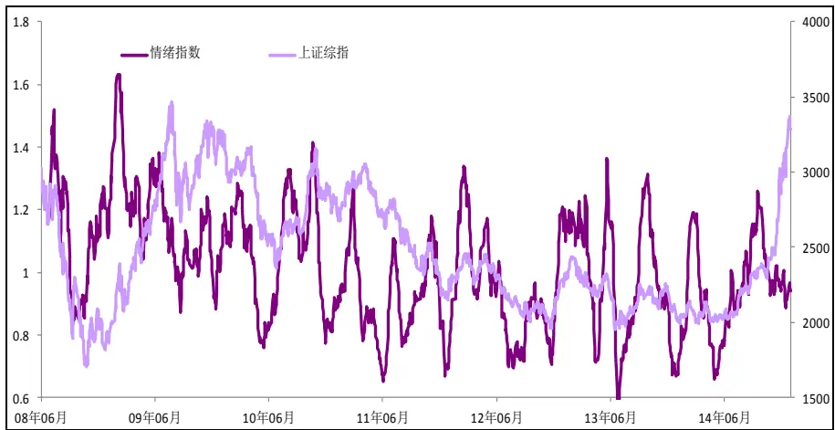
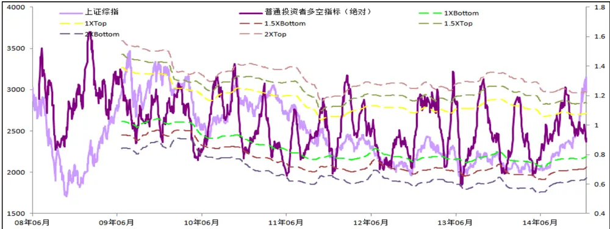
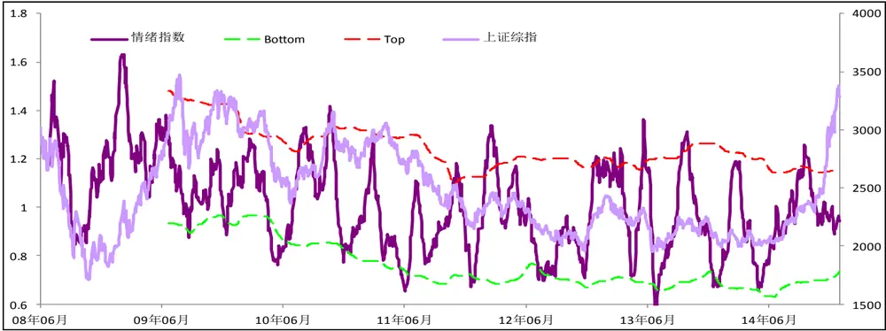
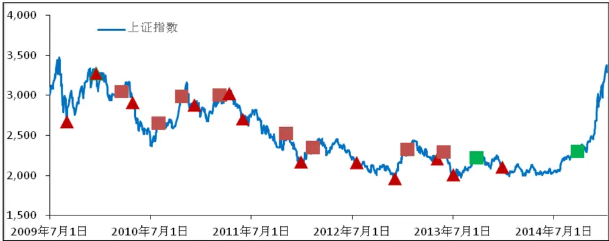
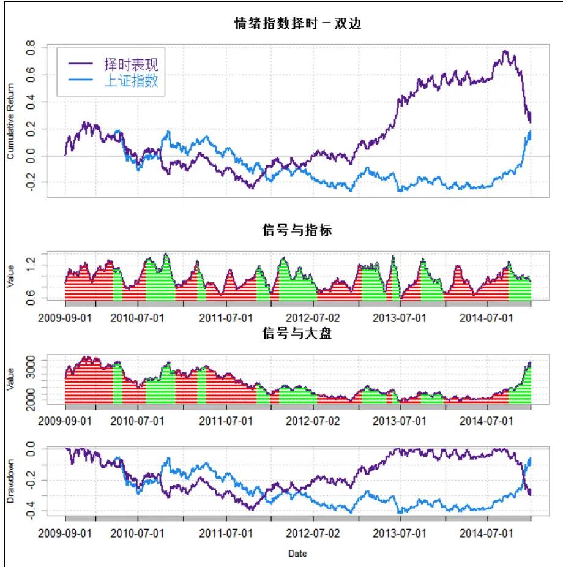
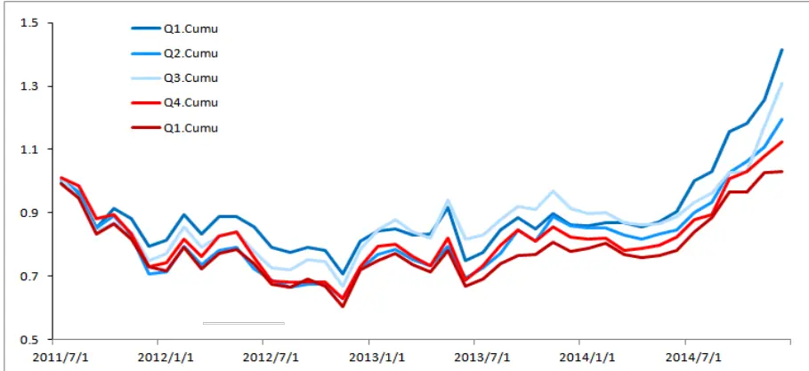

nInfo] [Table_Title] 2015.01.19

# 在众人恐惧时贪婪，在众人贪婪时恐惧

## ——数量化专题之五十三

吴晶（分析师）

刘富兵（分析师）

8 021-38676720

021-38676673

wujing@gtjas.com

liufubing008481@gtjas.com

证书编号 S0880514110001

S0880511010017

## 本报告导读：

在该篇报告主要基于"在众人恐惧时贪婪，在众人贪婪时恐惧”这一投资理念，应用互联网大数据以及文本挖掘技术，分别构建了择时与行业选择量化模型，各模型均有非常不错的表现，这也同时论证了这一投资理念在 A 股中的实用性。

## 摘要：

[Table_Summary] • 情绪的刻画。在该章节中主要阐述了如何基于有效的互联网大数据构建反映大众投资者情绪的指数。

贪婪恐惧择时模型。在该章节中，主要应用了“在众人恐惧时贪婪，在众人贪婪时恐惧”这一投资理念，构建了在众人最悲观时买入，在众人最乐观时卖出的量化模型。回测表明该模型所产生的信号具有非常不错的表现，特别是对于中短期内市场的见顶和见底都有着非常不错的指示意义。

贪婪恐惧行业选择模型。在该章节中，仍然是遵循了“在众人恐惧时贪婪，在众人贪婪时恐惧”这一投资理念，运用行业情绪指数对申万 28 个行业进行划分，构建了按月买入众人最悲观行业，卖出众人最乐观行业的行业选择模型。回测表明该模型具有优异的表现，那些众人最悲观的行业组合相对于那些众人最乐观的行业组合有近 10%的年化超额收益。

金融工程

## 金融工程团队：

刘富兵：（分析师）

电话：021-38676673

邮箱：liufubing008481@gtjas.com

证书编号：S0880511010017

耿帅军：（分析师）

电话：010-59312753

邮箱：gengshuaijun@gtjas.com

证书编号：S0880513080013

## 徐康：（分析师）

电话：021-38674939

邮箱：xukang010849@gtjas.com

证书编号：S0880513080018

## 陈睿：（分析师）

电话：021-38675861

邮箱：chenrui012896@gtjas.com

证书编号：S0880514070009

刘正捷：（分析师）

电话：0755-23976803

邮箱：liuzhengjie012509@gtjas.com

证书编号：S0880514070010

吴晶：（分析师）

电话：021-38676720

邮箱：wujing@gtjas.com

证书编号：S0880514110001

## 赵延鸿：（研究助理）

电话：021-38674927

邮箱：zhaoyanhong@gtjas.com

证书编号：S0880113070047

## 李雪君：（研究助理）

电话：021-38675855

邮箱：lixuejun@gtjas.com

证书编号：S0880114090056

## 王浩：（研究助理）

电话：021-38676434

邮箱：wanghao014399@gtjas.com

证书编号：S0880114080041

## [Table_Re相关报告

《基于全新信息的 Alpha 挖掘》2014.12.13

《走进量化投资新时代》2014.12.13

《“形而下”的价格研究探讨》2014.12.12

《新繁荣下的分级投资盛宴》2014.12.12

《2015:承前启后,衍生品开启新纪元》2014.12.12

## 1. 情绪的刻画

众所周知，股票的价格总是由预期推动的，而预期则总是受到市场情绪的影响，在股票研究中对情绪进行分析就显得至关重要。传统的市场情绪量化主要包括如下两个方面:一是基于历史市场数据进行刻画，如运用换手率、波动率或者一些技术指标等，但这类指标数据往往只反映了市场的历史状况，而并不能反映出投资者对未来的预期;二是基于衍生品数据，虽然衍生品数据在一定程度上确实能够反应投资者的预期，但由于目前国内缺乏相应的产品，因此通过这种方法去量化市场情绪也是不可行的。

考虑到近些年互联网的普及，各大财经网站、股票论坛极度活跃，这些网站上所记录的文本数据成为我们刻画投资者行为的绝佳选择。例如，当投资者 A 对未来市场不看好时，他的留言总会显露出一些悲观的情感；相反地,当投资 B看好未来市场走势,则他会发表一些偏乐观的帖子。基于这个最基本的想法,我们应用文本挖掘中的情感分析对所有论坛中的文本帖子进行分析、统计，便可以得到反映市场整体投资者的情绪指数；同样的，当我们仅仅对一些特定范围的帖子进行情感上的分析与统计，我们便可以得到市场整体投资者对于一些特定的事件或特定范围内个股的情感偏向。基于这些情感数据，我们可以从不同的角度对市场进行分析。

图表 1: 网络论坛每日帖子量

数据来源：国泰君安证券研究，wind

在上文中提到的“情感分析”，可以理解为一个黑盒，这个黑盒的输入端为一段文字，输出端为一个数值，这个数值反映了这句话的情感。若数值为正，则表示这段文字是乐观的；若数值为负，则表示这段文字是悲观的。在常规的情感分析算法中，监督学习仍然是主流，主要包括一些常规的分类算法，如贝叶斯，Kmean，SVM等；另外还有一些基于规则的方法，当然考虑到金融词汇的特殊性，还需要进行一些特别的处理。而在我们的框架中，考虑到完全自主构造情感分析工具的复杂性，我们基于一些开源的情感分析工具，并在这些工具的基础上选择性地加入一些金融市场中特有的情感词组，以此来构造针对金融市场特有的金融词汇情感分析工具。

这里特别需要提一点，很多投资人会认为网络论坛中的数据质量较差，具有较多的噪音，而我们的研究认为，恰恰相反，网络论坛中的文本帖子是金融文本分析的最佳数据来源。主要原因有三点：

一，网络论坛中是积聚了最广泛类型投资者的信息，因此更能代表占市场主导地位的投资者群体的观点。

二，网络论坛中积聚了海量的文本数据，尽管噪音数据的绝对值较大，但相对于海量的数据样本，它对结果的影响并不大，相反基于财经新闻、研究报告的文本进行分析，由于其样本容量的问题，在结论上很难有统计上的显著性。

三，在特定投资事件上，论坛中的敏感度至少是同步于、甚至优于其他类型的网络文本数据。

当我们要去构建全市场的情绪指数时,具体的做法为：按日去收集网络论坛上的所有发帖，对这些帖子进行情感分析，将乐观帖子的总得分除以悲观帖子的总得分，考虑到短期情绪的波动性，我们构建其 20 日移动平均值为情绪指数。具体来说，假定我们统计第i 日乐观帖子的总得分1iS ，统计第i 日看空帖子的总得分 2 iS ，将则第i 日的情绪值为：

$$
V_{_i}=(\sum_{j=0}^{j=19}(\frac{S1_{_{i-j}}}{S2_{_{i-j}}}))/20
$$

图表 2：情绪指数与上证综指

数据来源：国泰君安证券研究，wind

## 2. 贪婪恐惧择时模型

对于投资者，大家似乎都认可"在众人恐惧时贪婪，在众人贪婪时恐惧"。这句话最早是巴菲特在 2004 年致股东信中阐述的一个投资哲学，原文为：“And if they insist on trying to time their participation in equities, theyshould try to be fearful when others are greedy and greedy only when othersare fearful.”而这样的一段话背后蕴含着一个简单的哲理：真理总是站在少数人这边。因此，我们寄希望于通过互联网大数据构造的情绪指数去洞悉大众投资者的情绪，然后构建与大众投资者相反的投资策略。

具体的，我们认可贪婪等价于过度乐观；恐惧等价于过度悲观。那么，对于"在众人恐惧时贪婪，在众人贪婪时恐惧"有效性的另外一种解释就是：当多数投资者对后市过于乐观，则目前的市场一定会透支未来过多的预期，因此在大概率下，市场将要见顶。相反的，当多数投资者对后市过于悲观的话，也预示着现有的市场早就反映了未来的诸多不良预期，在大概率下，市场将要见底。那么也就是说只有当情绪到达相应的极限位臵时，才能够对市场的反转产生一定的指导意义，而当情绪指数处于中间位臵的时候，更多的是与市场形成一定的正向反馈，即情绪的上涨进一步推动的市场的上涨，情绪的下跌推动市场的下跌，维持着一种顺势而为的状态。

图表 3: 情绪的循环变换

数据来源：国泰君安证券研究，wind

基于上述理论，我们构建的贪婪恐惧择时模型如下：当情绪指数上涨到一定的极限位臵时，发出卖出信号；当情绪指数下跌到一定的极限位臵时，发出买入信号；而当情绪指数在中间位臵运行时，维持之前信号。在模型的量化方面，对于情绪中极限位臵的定义是该模型的最大难点，比如说，在牛市中，我们总是很容易的在基于历史数据得出的情绪上限值中过早的离开，错失牛市后期的大幅上涨；同时在单边熊市中，也较容易过早的介入市场，而遭受巨大的回撤。另外一方面，如果我们设臵了较大幅度的极限值，那么很容易导致在震荡的行情中，情绪的波动始终无法突破极限值，不会产生任何信号。

图表 4：三个不同参数下，信号产生的情况。

数据来源：国泰君安证券研究，wind

在图表 4中，我们分别以情绪指数过去 252 日（一年交易日数）的均值加减 1 倍标准差、1.5倍标准差、2倍标准差构建情绪极限值。从图中基本可以看出，当参数设定为 1倍标准差时,情绪指数本省的波动性很容易就到达设定的极限值而产生信号,并且在信号产生后,情绪指数在大概率下继续延续之前的趋势,而导致我们过早的介入市场,产生回撤;而当我们设定参数为 2 倍标准差时,情绪指数的波动很难到达极限位臵,因此导致信号无法正常的更替而延续之前信号,导致损失。那么，在保证大概率下的可靠性，我们简单的选取参数为 1.5。

这里需要说明的是，我们本可以通过参数优化的方式的去确定更为精确的极限值范围，然而考虑到以下的两个原因，我们并没有选择这一方式。一是情感分析工具的精确性，尽管我们对于情感分析工具进行了一定的优化，然而考虑到中文的博大精深，其结果还是或多或少会产生一些误差，那么基于有一定误差的情绪指数去构造确定型的精确模型就不是很有意义了；二是针对这类中长期的择时模型来说，本身的信号较少，对其优化的结果并没有统计上的显著性，因而基于优化的结果对未来进行预测并不是很可靠的。

具体来说，我们设定当情绪指数向上碰触到其过去 242 日均值加上 1.5倍标准差时，发出卖出信号；当情绪指数向下碰触到其过去 242日均值减去 1.5 倍标准差时，发出买入信号；若有连续相同的两个信号产生，则维持之前信号。

图表 5：情绪指数及其上下界

数据来源：国泰君安证券研究，wind

图表 6：历史信号情况（正方形表示卖出信号，三角形表示买入信号）

数据来源：国泰君安证券研究，wind

如上图所示，我们展示该择时模型所产生的信号，三角形为买入信号点，正方形为卖出信号点。从图中可以看出信号对于中短期内市场的见顶和见底都有着非常不错的指示意义。

图表 7：各信号产生后 5个交易日，22个交易日上证指数收益率

| 信号 | 信号日期 | 5 个交易日 上证收益 | 22 个交易日 上证收益 | 信号 | 信号日期 | 5 个交易日 上证收益 | 22 个交易日 上证收益 |
| --- | --- | --- | --- | --- | --- | --- | --- |
| 买入 | 2009/8/31 | 8.00% | 4.19% | 卖出 | 2010/3/18 | -0.88% | -2.18% |
| 买入 | 2009/12/23 | 6.14% | 0.67% | 卖出 | 2010/8/2 | 0.00% | -1.86% |
| 买入 | 2010/4/27 | -1.75% | -8.67% | 卖出 | 2010/10/21 | 0.30% | -3.32% |
| 买入 | 2010/12/7 | 1.78% | -1.29% | 卖出 | 2011/3/8 | -3.46% | 0.76% |
| 买入 | 2011/4/12 | -0.74% | -4.98% | 卖出 | 2011/11/4 | -1.75% | -7.89% |
| 买入 | 2011/5/30 | 1.40% | 2.06% | 卖出 | 2012/2/8 | 0.82% | 3.92% |
| 买入 | 2011/12/27 | -0.82% | 7.61% | 卖出 | 2013/1/15 | -0.45% | 0.01% |
| 买入 | 2012/7/17 | -0.68% | -2.27% | 卖出 | 2013/5/27 | 0.27% | -12.99% |
| 买入 | 2012/12/3 | 6.33% | 16.61% | 卖出 | 2013/9/23 | -2.09% | -2.73% |
| 买入 | 2013/5/3 | 1.87% | 3.03% | 卖出 | 2014/9/24 | 2.88% | 5.12% |
| 买入 | 2013/7/2 | -2.05% | 1.12% |  |  |  |  |
| 买入 | 2013/12/25 | 0.14% | -3.47% |  |  |  |  |

数据来源：国泰君安证券研究，wind

从表中，我们可以看出，当买入信号产生（情绪指数下跌至极限值）后的 5个交易日，上证指数的平均收益率为 1.64%，22个交易日上证指数的平均收益率为 1.22%。虽然信号所带来的收益和成功率并不是很可观，但是考虑到产生信号的方式是由于情绪指数向下触及极限值，而情绪的下跌很大程度上是由于市场的大幅下调，那么，这也说明了当情绪指数向下触及极限值时，也就是所谓的众人恐惧时，意味着市场向下空间有限，基本上到达一个中短期（一个月左右）的底部。相反地，卖出信号产生后的 5个交易日，上证指数的平均收益率为-0.44%，22个交易日上证指数的平均收益率为-2.12%，这同样意味着当情绪指数向上触及极限值时，也就是所谓的众人贪婪时，往往意味着市场到达一个中短期的顶部。

从表中也是可以看到，最大的一次错误出现在 2010年 4月 27日的买入信号，当时随着市场的大幅下调，情绪指数也大幅的下跌，但考虑到之前的 252 个交易日里情绪指数一直处于窄幅震荡中，由于我们设臵情绪极限值的方式，使得我们过早的介入市场，而导致损失。

在考虑择时模型时，我们按照上述的信号产生方式，当买入信号产生时，持有上证指数；当卖出的信号产生时，做空上证指数（假定可以做空）；当有连续的两个相同的信号产生时，维持前一个的信号，则回测结果如下：

图表 8: 择时历史表现

数据来源：国泰君安证券研究，wind

该模型在历史上出现过多次大幅损失，其主要原因是，当买入信号或者卖出信号产生后，市场短期见底或者见顶，之后情绪指数向相反方向行进，但由于一些突发的因素或者市场的反转力度过小，导致其未能触及到相反的信号产生所需的极限值，模型只能延续其之前的信号，而产生回撤，如 2009 年 8 月 31 日到 2009 年 12 月 23 日期间、2010 年 8 月 2日至 2010/10/21 期间、2011 年 5 月 30 日至 2011 年 11 月 4 日期间等。比如在 2011 年 5 月 30 日至 2011 年 11 月 4 日中，买入信号产生后，市场如期的见底，而后开始反弹，情绪指数也随之大幅上涨，但是由于情绪指数在 2011年 7月中旬到达最高位臵后拐头向下，市场又进入了一轮下跌，但是由于情绪指数在 7月中旬的最高位臵中并没有触及我们所设定的极限值，因此没有触发卖出信号，因而在后续的下跌中遭受了大幅的损失。关于该模型的改进版本，可以关注我们后续的报告 。

该模型另外一次的大幅回撤出现在 2014 年 9 月至今的环境下，而分析这次的原因，在我们回测的时间段内，整体市场维持着一个存量资金博弈的环境，因此一切的走势都是在一个界定的框架内运行，因此该模型取得了不错的效果，而在 9月份后，增量资金推动了市场的上升，也打破了之前所维持的运行框架，导致了本次的模型失效。且本次的市场也出现了一个较之以往的差异，即情绪指数与市场指数出现一定的背离，市场在持续的上涨中，而情绪指数却在不停的下跌中，其主要原因是最近的市场仅依靠少数的几个行业上涨而推动，大部分的投资者并不能分享到市场上涨的喜悦，从而导致了情绪的悲观态度。换句流行的话，即满仓踏空比套牢更让人痛苦。

## 3. 贪婪恐惧行业选择模型

在行业选择方面，我们仍然贯彻“在众人恐惧时贪婪，在众人贪婪时恐惧”的投资想法。由于该想法背后最根本的逻辑还是一种逆向投资的思维，“人弃我取,人取我予”便是我们挑选行业的主要方法：买入众人感到最悲观的行业，卖出众人感到最乐观的行业。其背后的合理解释仍然是：那些大家都感到乐观的行业在一定程度上已经过于透支了其未来的良好预期；而那些大家都感到悲观的行业已经过度反应了其未来的不良预期。

具体的做法是，我们仿照全市场的情绪指数去构造各行业的情绪指数。差异是在全市场情绪指数构建时，我们选取的是论坛中所有的文本帖子进行分析；而在构建行业情绪指数时，我们仅挑选明显指示于该行业的帖子。在行业分类方面，我们选取的是申万 28 个行业，而在明显指示该行业的帖子的定义上，我们根据行业名称是否是常规提及该行业所用的词语来判断，例如人们提及银行业时总是用“银行”二字进行指示，则我们在构建银行业情绪指数时，挑选那些文本中包含“银行”词语的帖子，进行情感的识别和统计，可得到银行业的情绪指数。而对于那些名称比较晦涩的行业，我们通过应用等价于该行业的词组或者其二级行业中有明显指示意义的词语组合替代，例如采掘行业使用“煤炭”替代；似乎投资者很少会在论坛中提及“公用事业”，因此我们挑选那些含有“燃气”、“电力”、“水务”、“环保”的帖子进行替代；轻工制造行业使用“造纸”、“印刷”替代；休闲服务行业使用“酒店”、“旅游”、“餐饮”、“景点”替代等等。由于综合行业很难进行分析，因此剔除该行业。

在模型构建方面，为了保证每期均能够选取相同数量的行业，我们简单使用如下方式对行业的情绪指数进行回测：从 2011年 6月起，在每个月初，基于各行业上个月的情绪指数进行排序，从低到高将 27个行业（剔除综合行业）平均分成 5组，其中组 1包含的是上个月大家最为悲观的行业，组 5包含的是上个月大家最乐观的行业，在每组内等权的购买各行业的行业指数（申万行业），持有一个月。该模型历史情况如下：

图表 9: 各分组历史累积表现

数据来源：国泰君安证券研究，wind

从图中可以看出，第一组，也就是那些上月情绪指数最低的行业，从 2011年 6月至今获取了近 42%的总收益（年化 10%），明显跑赢了其他组别；而第五组，即上月情绪指数最高的行业组合，从 2011年 6月至今仅仅获取 3%（年化 0.8%）的总收益，跑输其他所有组别。从图中我们也可以看出，各组的收益基本上是按照其情绪指数呈现出单调性，如第 2组，即情绪指数次低的行业组合收益排在第 3，第 4 组，情绪指数次高的行业组合收益排名第 4，因此单从因子单调性的角度来说，行业情绪指数在行业选择上的整体表现还是不错的。尽管从收益情况以及历史的稳定性来看，该因子的表现还有待提高，但考虑到行业选择受宏观政策的影响之大，以及各组别内的样本容量较小，因子表现也是情有可原的。不管怎么说，单从第 1 组和第 5 组的表现来看，“在众人恐惧时贪婪，在众人贪婪时恐惧”的投资想法在行业选择方面也同样是有效的。

图表 10：2015年 1月最新分组

| 行业 | 分组 | 行业 | 分组 | 行业 | 分组 | 行业 | 分组 | 行业 | 分组 |
| --- | --- | --- | --- | --- | --- | --- | --- | --- | --- |
| 钢铁 | 1 | 采掘 | 2 | 非银金融 | 3 | 电气设备 | 4 | 传媒 | 5 |
| 国防军工 | 1 | 电子 | 2 | 建筑材料 | 3 | 纺织服装 | 4 | 计算机 | 5 |
| 机械设备 | 1 | 房地产 | 2 | 农林牧渔 | 3 | 公用事业 | 4 | 商业贸易 | 5 |
| 建筑装饰 | 1 | 轻工制造 | 2 | 汽车 | 3 | 化工 | 4 | 食品饮料 | 5 |
| 交通运输 | 1 | 有色金属 | 2 | 银行 | 3 | 家用电器 | 4 | 通信 | 5 |
| 医药生物 | 1 |  |  |  |  |  |  | 休闲服务 | 5 |

数据来源：国泰君安证券研究，wind

## 4. 总结

在该篇报告中，我们主要基于“在众人恐惧时贪婪，在众人贪婪时恐惧”这样一种逆向的投资理念，应用互联网论坛大数据以及文本挖掘中的情感分析工具，分别构建了择时与行业选择模型，回测的结果也显示各模型也均有非常不错的表现，也同时论证了这一投资理念在 A股中的实用性。

这里要阐述的是，在上述的分析中，我们主要是将该投资理念运用于市场择时以及行业选择方面，而我们也曾考虑去论证其在各股中的效用，但结果并不让人十分满意，究其原因主要是：中文的复杂性限制了情感分析的正确性，各股的数据样本较小，因此结果很难具有可靠性。在各股的选择方面，我们只能暂时将情感分析工具放一边，转而通过帖子样本的数量进行分析，也收获了一些不错的结论，如果大家感兴趣的话，欢迎关注我们金融文本挖掘系列的后续报告。

## 本公司具有中国证监会核准的证券投资咨询业务资格

## 分析师声明

作者具有中国证券业协会授予的证券投资咨询执业资格或相当的专业胜任能力，保证报告所采用的数据均来自合规渠道，分析逻辑基于作者的职业理解，本报告清晰准确地反映了作者的研究观点，力求独立、客观和公正，结论不受任何第三方的授意或影响，特此声明。

## 免责声明

本报告仅供国泰君安证券股份有限公司（以下简称“本公司”）的客户使用。本公司不会因接收人收到本报告而视其为本公司的当然客户。本报告仅在相关法律许可的情况下发放，并仅为提供信息而发放，概不构成任何广告。

本报告的信息来源于已公开的资料，本公司对该等信息的准确性、完整性或可靠性不作任何保证。本报告所载的资料、意见及推测仅反映本公司于发布本报告当日的判断，本报告所指的证券或投资标的的价格、价值及投资收入可升可跌。过往表现不应作为日后的表现依据。在不同时期，本公司可发出与本报告所载资料、意见及推测不一致的报告。本公司不保证本报告所含信息保持在最新状态。同时，本公司对本报告所含信息可在不发出通知的情形下做出修改，投资者应当自行关注相应的更新或修改。

本报告中所指的投资及服务可能不适合个别客户，不构成客户私人咨询建议。在任何情况下，本报告中的信息或所表述的意见均不构成对任何人的投资建议。在任何情况下，本公司、本公司员工或者关联机构不承诺投资者一定获利，不与投资者分享投资收益，也不对任何人因使用本报告中的任何内容所引致的任何损失负任何责任。投资者务必注意，其据此做出的任何投资决策与本公司、本公司员工或者关联机构无关。

本公司利用信息隔离墙控制内部一个或多个领域、部门或关联机构之间的信息流动。因此，投资者应注意，在法律许可的情况下，本公司及其所属关联机构可能会持有报告中提到的公司所发行的证券或期权并进行证券或期权交易，也可能为这些公司提供或者争取提供投资银行、财务顾问或者金融产品等相关服务。在法律许可的情况下，本公司的员工可能担任本报告所提到的公司的董事。

市场有风险，投资需谨慎。投资者不应将本报告为作出投资决策的惟一参考因素，亦不应认为本报告可以取代自己的判断。在决定投资前，如有需要，投资者务必向专业人士咨询并谨慎决策。

本报告版权仅为本公司所有，未经书面许可，任何机构和个人不得以任何形式翻版、复制、发表或引用。如征得本公司同意进行引用、刊发的，需在允许的范围内使用，并注明出处为“国泰君安证券研究”，且不得对本报告进行任何有悖原意的引用、删节和修改。

若本公司以外的其他机构（以下简称“该机构”）发送本报告，则由该机构独自为此发送行为负责。通过此途径获得本报告的投资者应自行联系该机构以要求获悉更详细信息或进而交易本报告中提及的证券。本报告不构成本公司向该机构之客户提供的投资建议，本公司、本公司员工或者关联机构亦不为该机构之客户因使用本报告或报告所载内容引起的任何损失承担任何责任。

## 评级说明

## 1.投资建议的比较标准

投资评级分为股票评级和行业评级。

以报告发布后的12个月内的市场表现为比较标准，报告发布日后的12个月内的公司股价（或行业指数）的涨跌幅相对同期的沪深300指数涨跌幅为基准。

## 2.投资建议的评级标准

报告发布日后的 12 个月内的公司股价（或行业指数）的涨跌幅相对同期的沪深300指数的涨跌幅。

| 评级 |  | 说明 |
| --- | --- | --- |
| 股票投资评级 | 增持 | 相对沪深 300指数涨幅15%以上 |
|  | 谨慎增持 | 相对沪深300指数涨幅介于5%～15%之间 |
|  | 中性 | 相对沪深300指数涨幅介于-5%～5% |
|  | 减持 | 相对沪深300指数下跌5%以上 |
| 行业投资评级 | 增持 | 明显强于沪深 300 指数 |
|  | 中性 | 基本与沪深300指数持平 |
|  | 减持 | 明显弱于沪深 300指数 |

## 国泰君安证券研究

|  | 上海 | 深圳 | 北京 |
| --- | --- | --- | --- |
| 地址 | 上海市浦东新区银城中路168号上海 银行大厦29层 | 深圳市福田区益田路 6009 号新世界 商务中心34层 | 北京市西城区金融大街 28 号盈泰中 心2号楼10层 |
| 邮编 | 200120 | 518026 | 100140 |
| 电话 | （021)38676666 | (0755)23976888 | (010)59312799 |
|  | E-mail: gtjaresearch@gtjas.com |  |  |