inInfo] [Table_Title] 2015.01.22

# 在冷门股中寻找投资机会

刘富兵（分析师）

8 021-38676673

李雪君（研究助理）

liufubing008481@gtjas.com

021-38675855

证书编号 S0880511010017

lixuejun@gtjas.com

吴晶（分析师）

S0880114090056

021-38676720

wujing@gtjas.com

## 本报告导读：

S0880514110001

## 摘要：

[Table_Summary] • 冷门股，作为一类很少为投资者所问津的股票，由于受市场的关注较少，表现往往会相对滞后，一旦被市场所关注，投资机会随即显现。

- 传统的冷门股选股指标，如“ “分析师覆盖家数”、换手率”等，受限于数据量不足或指标无效等原因，存在一定的缺陷，无法选出真正的冷门股。

- 借助于积累了近 5 年的股票论坛文本数据，我们选取网络论坛的活跃度来反应股票的冷热程度。具体地，选取过去一段时间，论坛中各只个股子论坛的发帖量，作为每只个股活跃程度的衡量指标。如果一只个股在过去一段时间，相应个股论坛发帖较少，相对不活跃，则相对冷门；而如果一只个股在过去一段时间，相应个股论坛发贴较多，相对活跃，则相对热门。

- 分别在全市场、小市值、中证 800 指数成分股中，按照冷门股因子的排序将样本股分组回测，按月换仓，等权配置，可以看出因子呈现出很好的单调性，收益良好，指标有效。

- 因子利用了全新的文本数据源，可提供独特的超额收益。因子构建相对复杂，门槛相对较高，持续性较强。后续将持续跟踪。

金融工程

## 金融工程团队：

刘富兵：（分析师）

电话：021-38676673

邮箱：liufubing008481@gtjas.com

证书编号：S0880511010017

耿帅军：（分析师）

电话：010-59312753

邮箱：gengshuaijun@gtjas.com

证书编号：S0880513080013

## 徐康：（分析师）

电话：021-38674939

邮箱：xukang010849@gtjas.com

证书编号：S0880513080018

## 陈睿：（分析师）

电话：021-38675861

邮箱：chenrui012896@gtjas.com

证书编号：S0880514070009

## 刘正捷：（分析师）

电话：0755-23976803

邮箱：liuzhengjie012509@gtjas.com

证书编号：S0880514070010

吴晶：（分析师）

电话：021-38676720

邮箱：wujing@gtjas.com

证书编号：S0880514110001

## 赵延鸿：（研究助理）

电话：021-38674927

邮箱：zhaoyanhong@gtjas.com

证书编号：S0880113070047

## 李雪君：（研究助理）

电话：021-38675855

邮箱：lixuejun@gtjas.com

证书编号：S0880114090056

## 王浩：（研究助理）

电话：021-38676434

邮箱：wanghao014399@gtjas.com

证书编号：S0880114080041

## [Table_R相关报告

《在众人恐惧时贪婪，在众人贪婪时恐惧》2015.01.19

《基于全新信息的 Alpha 挖掘》2014.12.13

《走进量化投资新时代》2014.12.13

《“形而下”的价格研究探讨》2014.12.12

《新繁荣下的分级投资盛宴》2014.12.12

## 1. 冷门股中的投资机会

冷门股，作为一类很少为投资者所问津的股票，却被很多投资大师所关注，这里引用本杰明〃格雷厄姆的一段话：

“标准证券或主要证券对其报告利润几乎总是迅速作出反应——以至于夸大了收益变化在股票市场上的影响。知名度较低的证券的表现主要取决于市场专业人士的态度。如果对其缺乏兴趣，股价表现将远远滞后于市场。如果该证券受到关注（这种关注或者是人为操纵，或者是自然出现的），则结果可能完全相反，公司业绩的变化将最大限度地反映在其股价上。”

——本杰明〃格雷厄姆

这段话揭示了本杰明〃格雷厄姆关注冷门股的投资逻辑，冷门股由于受市场的关注较少，表现往往会相对滞后，一旦被市场所关注，业绩则会被充分体现。

另一方面，与冷门股相对应的热门股票，也往往是投资大师所规避的标的。《彼得〃林奇的成功投资》一书中曾提到：“如果说有一种股票我避而不买的话，它一定是最热门行业中最热门的股票，这种股票受到大家最广泛的关注，投资者上下班途中在汽车上或在火车上都会听到人们谈论这种股票，一般人往往禁不住这种强大的社会压力就买入了这种股票。”

对于冷门股的投资逻辑，也可以从以下两方面来理解。从资金面来说，由于其关注度较低，相对不够活跃，因此，一旦有资金进入，可能会引起较大波动。从基本面的角度而言，其股价不被关注的同时，业绩也不被人所关注，投资价值也就容易被忽略，股价滞后于市场，因而存在投资机会。

那么，什么样的股票才是真正的冷门股。对于此，一些传统指标，例如“换手率”、“分析师覆盖家数”等都存在一定的缺陷。例如，“分析师覆盖家数”中，分析师覆盖的股票仅为全市场的四分之一，数据量远远不足。对于“换手率”指标，通过回测可以很清晰地看出其无法有效地选出理想的冷门股，上个月份换手率较高的股票组合收益较差，低换手率组合收益则交织在一起。

图 1：基于换手率指标的选股回测（全市场）
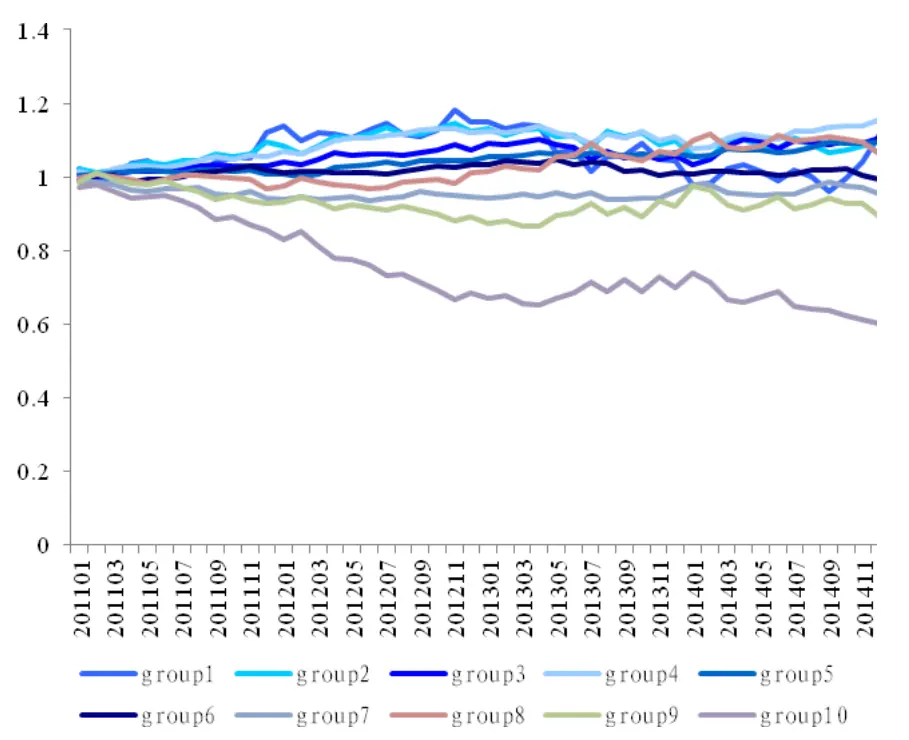
数据来源：国泰君安证券研究，Wind

## 2. 冷门股因子构建

基于以上分析，我们希望通过合理的方法，构建出有效的冷门股因子，来帮助我们筛选出有收益可循的冷门股。

对于冷门股而言，其重要特征在于受市场的关注度较低。那么，如何衡量市场对于个股的关注度，成为了因子构建的关键因素。

借助于积累了近 5 年的股票论坛文本数据，我们选取网络论坛的活跃度来反应股票的冷热程度。也就是说，如果一只个股受市场关注度较高，那么相应地，其个股论坛则相对活跃；另一方面，如果一只个股受市场的关注度较低，其相应的个股论坛则相对不活跃。用户对于关注的个股，会在与个股相对应的子论坛中进行讨论，因此个股论坛的活跃程度也就成为了反应个股关注度的重要指标。

具体地，我们选取过去一段时间，论坛中各只个股子论坛的发帖量，作为每只个股活跃程度的衡量指标。如果一只个股在过去一段时间，相应个股论坛发帖较少，相对不活跃，则相对冷门；而如果一只个股在过去一段时间，相应个股论坛发贴较多，相对活跃，则相对热门。

## 3. 冷门股因子策略回测

我们借助文本数据，依据个股子论坛的发帖量构建冷门股因子，并以月

度为频率换仓，分别在全市场、小市值、中证 800成分股中，对因子进行回测。

## 3.1. 全市场回测

选取同时满足以下条件的股票作为样本股，基本排除了上市时间较短的股票、ST股票、停牌股票。

- 沪深 A 股股票

- 上市时间超过一年

- 非 ST、*ST 股票

- 非暂停上市股票

按月计算样本股相应论坛的发帖量，并依据上月的发帖量数据将样本股排序，分为十组。每组内部个股等权配置，按月换仓。测试区间为 2011年-2014 年。

## 3.1.1. 全市场回测收益情况

## 3.1.1.1. 绝对收益

按照以上方法，对冷门股因子进行回测，在全市场范围内，冷门股因子可以非常清晰地将十组收益区分开。随着发帖量的逐级增加，收益逐级递减，呈现出很好的单调性。也就是说，发帖最少的十分之一股票组合收益最好，在过去四年取得了 107.26%的累计收益，年化收益 19.99%；而发帖最多的十分之一股票收益表现最差，取得了-5.30%的累计收益，年化收益-1.35%。

图 2：绝对收益（全市场）
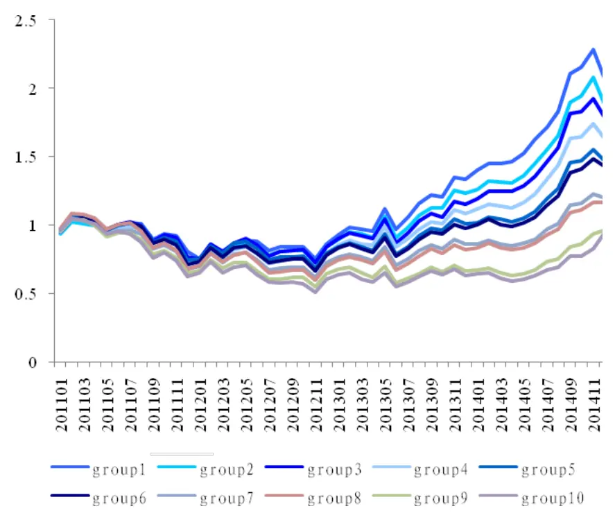
数据来源：国泰君安证券研究，Wind

表 1：绝对收益分组比较（全市场）

|  | 第一组（最冷门） | 第十组（最热门） |
| --- | --- | --- |
| 累计收益 | 107.26% | -5.30% |
| 年化收益 | 19.99% | -1.35% |

数据来源：国泰君安证券研究，Wind

## 3.1.1.2. 配对收益

鉴于此，我们选择做多最冷门的一组个股，也就是发帖最少的十分之一个股，做空最热门的一组个股，也就是发帖最多的十分之一个股，形成配对组合。配对累计收益 101.84%，年化 19.19%，配对后月度胜率达到77.08%。

图 3：配对收益（全市场）
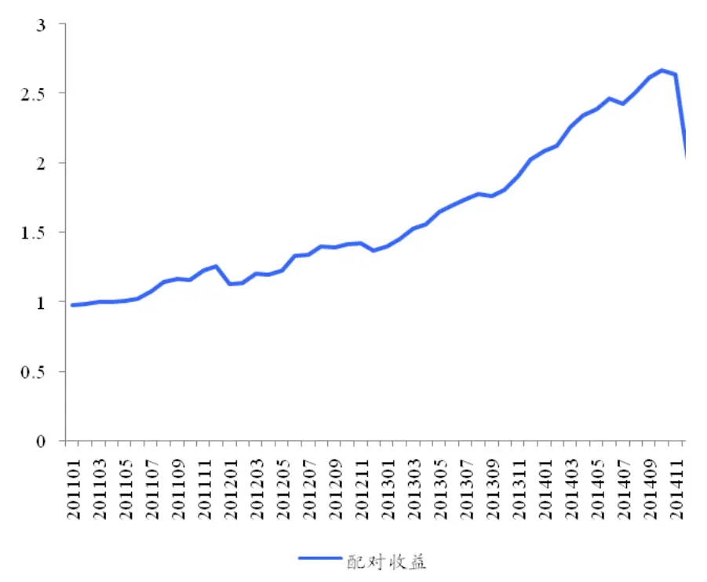
数据来源：国泰君安证券研究，Wind

表 2：配对收益情况（全市场）

| 配对（第一组-第十组） |
| --- |
| 累计收益 101.84% |
| 年化收益 19.19% |
| 月度胜率 77.08% |
| 最大回撤 24.41% |
| 波动率 16.90% |
| 夏普比率 1.14 |

数据来源：国泰君安证券研究，Wind

## 3.1.1.3. 相对收益

我们选择对冲样本股等权指数，来测试冷门股因子的相对收益表现。同样地，发帖量最少、也就是最冷门的一组股票明显跑赢发帖最多、最热门的一组股票。并且，最冷门的一组股票，在对冲样本股等权指数后，每年都可以取得正收益。

图 4：相对收益（全市场）
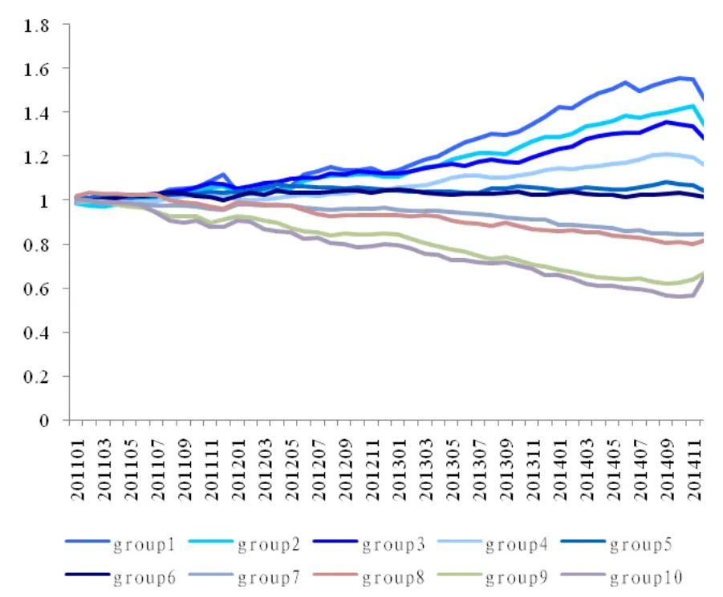
数据来源：国泰君安证券研究，Wind

表 3：相对收益分组比较（全市场）

| 第一组（最冷门） | 第十组（最热门） |
| --- | --- |
| 累计收益 44.72% | -33.60% |
| 年化收益 9.68% | -9.73% |
| 月度胜率 6.85% | 44.15% |
| 最大回撤 77.08% | 25% |
| 波动率 7.45% | 10.64% |
| 夏普比率 1.30 | -0.91 |

数据来源：国泰君安证券研究，Wind

表 4：相对收益分组比较-按年份统计（全市场）

| 第一组（最冷门） | 第十组（最热门） |
| --- | --- |
| 2011年 11.43% | -11.91% |
| 2012年 0.72% | -8.76% |
| 2013年 22.83% | -17.78% |
| 2014年 4.99% | 4.89% |

数据来源：国泰君安证券研究，Wind

图 5：分组年化相对收益（全市场）
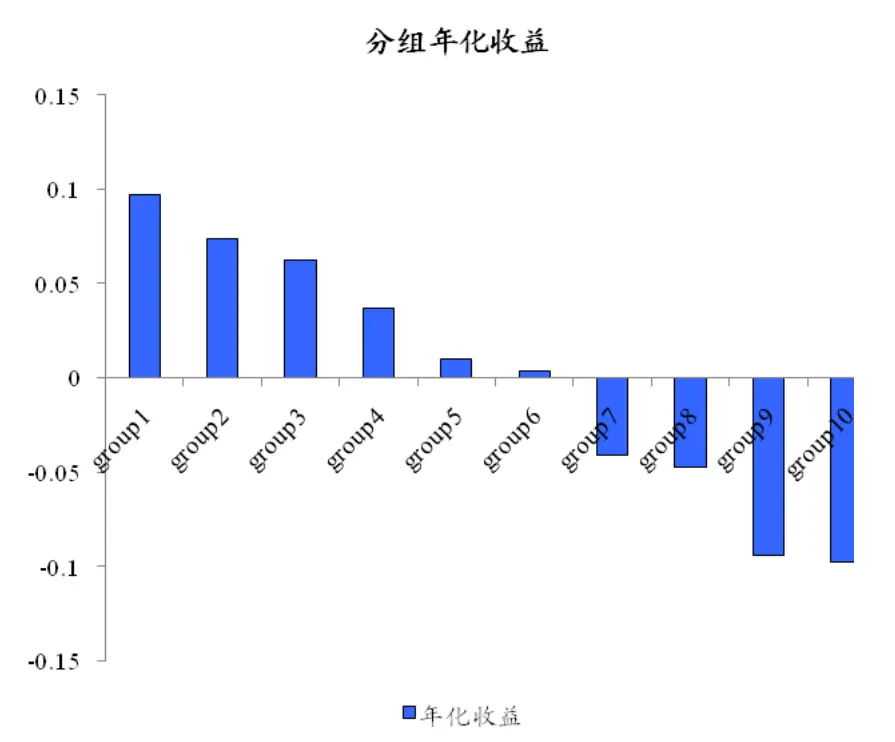
数据来源：国泰君安证券研究，Wind

## 3.1.2. 全市场回测因子预测能力

我们通过测试因子的 Spearman IC 来对因子的预测能力进行测试，可以看出，发帖量因子在全市场中的 Spearman IC 平均值达到-9.51%，波动率约为 11.11%。

图 6：发帖量因子 Spearman IC 情况（全市场）
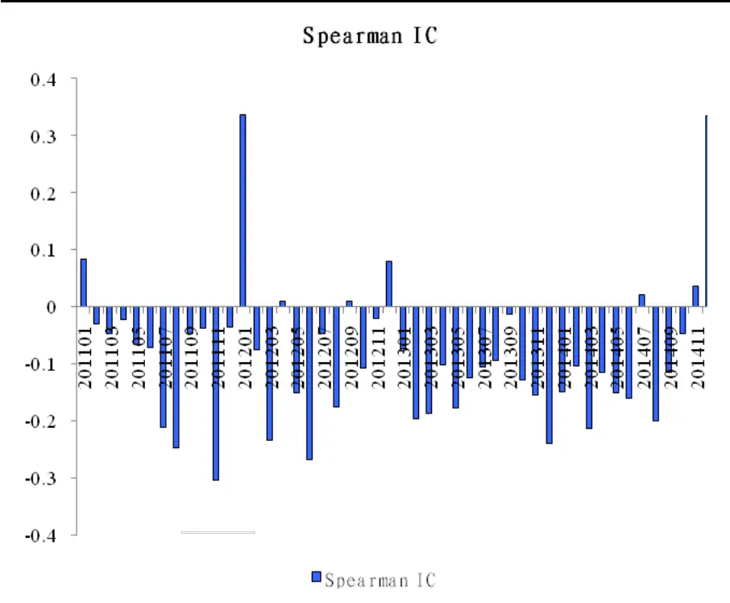
数据来源：国泰君安证券研究，Wind

表 5：发帖量因子 Spearman IC 统计量（全市场）

|  | 均值 波动率 |
| --- | --- |
| 发帖量因子IC -9.51% | 11.11% |

数据来源：国泰君安证券研究，Wind

## 3.1.3. 全市场回测分组对比分析

对于第一组与第十组，也就是最冷门股票与最热门股票之间的巨大差异，我们分别从换手率、行业分布、板块分布三个方面进行统计分析。

## 3.1.3.1. 换手率对比

换手率方面，最冷门的一组股票平均换手率为 48.04%，而最热门的一组股票平均换手率为 40.34%。

表 6：换手率分组比较（全市场）

|  | 第一组（最冷门） | 第十组（最热门） |
| --- | --- | --- |
| 月度平均换手率 | 48.04% | 40.34% |

数据来源：国泰君安证券研究，Wind

## 3.1.3.2. 行业分布对比

行业分布方面，最冷门的一组股票分布最多的三个行业为：化工、机械设备、医药生物。而最热门的一组股票分布最多的三个行业为：房地产、化工、有色金属。

表 7：行业分布分组比较（全市场）

| 第一组（最冷门） | 第十组（最热门） |
| --- | --- |
| 采掘 2.10 | 7.17 |
| 传媒 2.79 | 8.17 |
| 电气设备 14.65 | 7.71 |
| 电子 11.90 | 7.40 |
| 房地产 7.69 | 16.69 |
| 纺织服装 6.04 | 3.48 |
| 非银金融 0.21 | 7.13 |
| 钢铁 2.06 | 4.83 |
| 公用事业 7.69 | 6.15 |
| 国防军工 1.25 | 4.63 |
| 化工 24.56 | 14.63 |
| 机械设备 22.52 | 12.15 |
| 计算机 13.58 | 7.33 |
| 家用电器 4.96 | 5.21 |
| 建筑材料 5.96 | 4.19 |
| 建筑装饰 3.52 | 6.44 |
| 交通运输 6.85 | 7.23 |

| 农林牧渔 4.88 4.29 |
| --- |
| 汽车 8.23 7.50 |
| 轻工制造 8.40 6.02 |
| 商业贸易 7.08 7.52 |
| 食品饮料 4.94 7.54 |
| 通信 4.44 4.67 |
| 休闲服务 3.48 1.13 |
| 医药生物 22.40 10.13 |
| 银行 0.13 7.60 |
| 有色金属 3.83 12.81 |
| 综合 3.04 7.02 |

数据来源：国泰君安证券研究，Wind

## 3.1.3.3. 板块分布对比

板块分布方面，最冷门的一组股票主要分布在主板与中小板，分别占37.8%和 40.7%，而最热门的一组股票则以主板为主，占比 81%

表 8：板块分布分组比较（全市场）

|  | 第一组（最冷门） 第十组（最热门） |
| --- | --- |
| 主板 79 | 166.9 |
| 中小企业板 85.2 | 28.3 |
| 创业板 45 | 11.5 |

数据来源：国泰君安证券研究，Wind

## 3.2.小市值样本股回测

为了测试因子对于不同样本股的适用性，我们将因子局限于小市值样本股中进行回测。

选取同时满足以下条件的股票作为样本股，基本排除了上市时间较短的股票、ST股票、停牌股票，并使得样本个股总市值在 50%分位数以下。

- 总市值在 50%分位数以下的沪深 A 股股票

- 上市时间超过一年

- 非 ST、*ST 股票

- 非暂停上市股票

按月计算样本股相应论坛的发帖量，并依据上月的发帖量数据将样本股排序，分为五组。每组内部个股等权配置，按月换仓。测试区间为 2011年-2014 年。

## 3.2.1. 小市值样本股回测收益情况

## 3.2.1.1. 相对收益

在小市值样本股范围内，冷门股因子同样可以将五组收益区分开。我们这里同样对冲了样本股等权指数。随着关注度的逐级增加，收益逐级递减，呈现出很好的单调性。也就是说，发帖最少的五分之一股票组合收益最好，在过去四年取得了 34.42%的累计相对收益，年化收益 7.68%；而发帖最多的五分之一股票收益表现最差，取得了-38.65%的累计相对收益，年化收益-11.50%。

图 7：相对收益（小市值样本股）
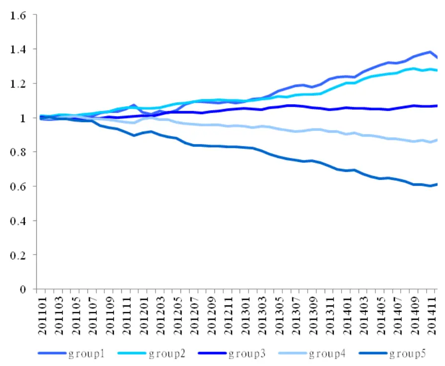
数据来源：国泰君安证券研究，Wind

表 9：相对收益分组比较（小市值样本股）

| 第一组（最冷门） | 第五组（最热门） |
| --- | --- |
| 累计收益 34.42% | -38.65% |
| 年化收益 7.68% | -11.50% |
| 月度胜率 70.83% | 18.75% |
| 最大回撤 5.03% | 39.83% |
| 波动率 4.67% | 4.20% |
| 夏普比率 1.64 | -2.73 |

数据来源：国泰君安证券研究，Wind

图 8：分组年化收益（小市值样本股）
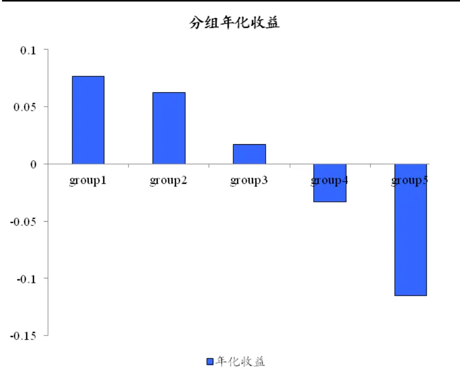
数据来源：国泰君安证券研究，Wind

## 3.2.1.2. 配对收益

同样地，我们选择做多最冷门的一组个股，也就是发帖最少的五分之一，做空最热门的一组个股，也就是发帖最多的五分之一，形成配对组合。配对累计收益 114.57%，年化 21.03%，配对后月度胜率达到 77.08%。

图 9：配对收益（小市值样本股）
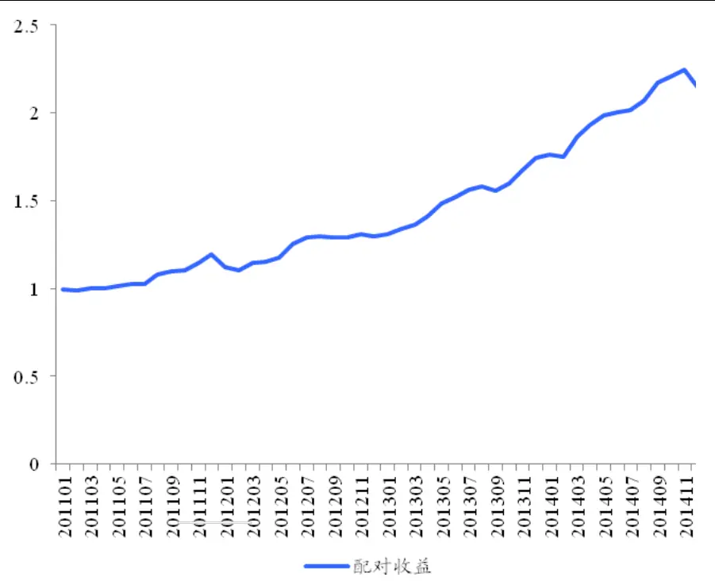
数据来源：国泰君安证券研究，Wind

表 10：配对收益情况（小市值样本股）

| 配对（第一组-第五组） |
| --- |
| 累计收益 114.57% |
| 年化收益 21.03% |
| 月度胜率 77.08% |
| 最大回撤 7.61% |
| 波动率 8.51% |
| 夏普比率 2.47 |

数据来源：国泰君安证券研究，Wind

## 3.2.2. 小市值样本股回测因子预测能力

我们通过测试因子的 Spearman IC 来对因子的预测能力进行测试，可以看出，发帖量因子在小市值样本股中的 Spearman IC 平均值达到-9.63%，波动率约为 9.18%。

图 10：发帖量因子 Spearman IC情况（小市值样本股）
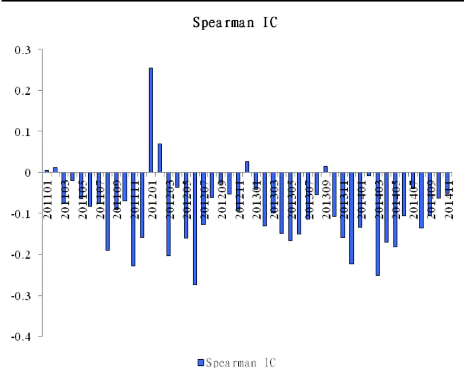
数据来源：国泰君安证券研究，Wind

表 11：发帖量因子 Spearman IC 统计量（小市值样本股）

|  | 均值 波动率 |
| --- | --- |
| 发帖量因子IC -9.63% | 9.18% |

数据来源：国泰君安证券研究，Wind

## 3.3.中证 800 成分股样本回测

同样的方法，我们将因子应用于中证 800 指数样本股中进行回测。

选取中证 800指数成分股作为样本股，按月计算样本股相应论坛的发帖量，并依据上月的发帖量数据将样本股排序，分为五组。每组内部个股等权配置，按月换仓。测试区间为 2011年-2014年。

## 3.3.1. 中证 800成分股样本回测收益情况

## 3.3.1.1. 相对收益

在中证 800成分股范围内，冷门股因子同样可以将五组收益区分开。这里我们对冲了中证 800成分股等权指数。随着关注度的逐级增加，收益逐级递减，呈现出良好的单调性。

图 11：相对收益（中证 800指数成分股）
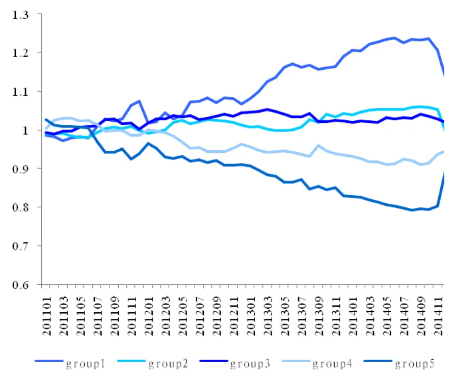
数据来源：国泰君安证券研究，Wind

表 12：相对收益分组比较（中证 800指数成分股）

| 第一组（最冷门） | 第五组（最热门） |
| --- | --- |
| 累计收益 13.50% | -10.44% |
| 年化收益 3.22% | -2.72% |
| 月度胜率 64.58% | 31.25% |
| 最大回撤 8.32% | 22.68% |
| 波动率 6.15% | 7.44% |
| 夏普比率 0.52 | -0.37 |

数据来源：国泰君安证券研究，Wind

图 12：分组年化收益（中证 800指数成分股）
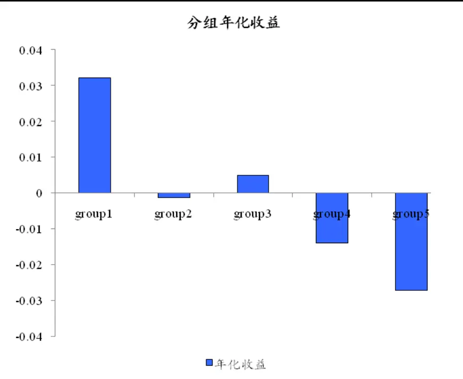
数据来源：国泰君安证券研究，Wind

## 3.3.1.2. 配对收益

同样地，我们选择做多最冷门的一组个股，也就是发帖最少的五分之一，做空最热门的一组个股，也就是发帖最多的五分之一，形成配对组合。配对累计收益 22.03%，年化 5.10%，配对后月度胜率 58.33%。

图 13：配对收益（中证 800指数成分股）
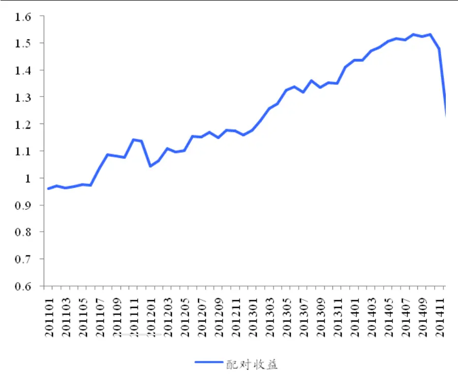
数据来源：国泰君安证券研究，Wind

表 13：配对收益情况（中证 800指数成分股）

| 配对（第一组-第五组） |
| --- |
| 累计收益 22.03% |
| 年化收益 5.10% |
| 月度胜率 58.33% |
| 最大回撤 20.37% |
| 波动率 12.88% |
| 夏普比率 0.40 |

数据来源：国泰君安证券研究，Wind

## 3.3.2. 中证 800成分股回测因子预测能力

我们通过测试因子的 Spearman IC 来对因子的预测能力进行测试，可以看出，发帖量因子在中证 800 成分股样本中的 Spearman IC 平均值为-5.23%，波动率约为 11.28%。

图 14：发帖量因子 Spearman IC情况（中证 800指数成分股）
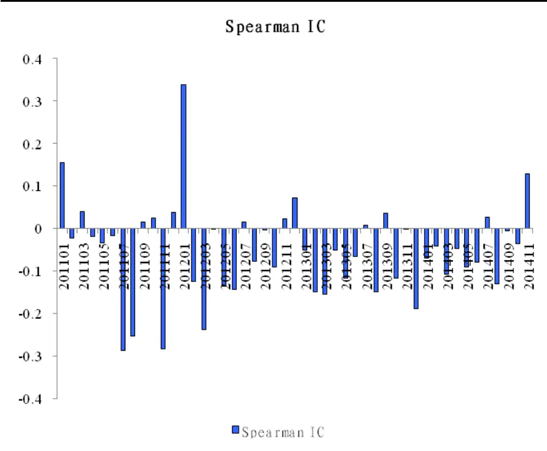
数据来源：国泰君安证券研究，Wind

表 14：发帖量因子 Spearman IC 统计量（中证 800 指数成分股）

|  | 均值 | 波动率 |
| --- | --- | --- |
| 发帖量因子IC | -5.23% | 11.28% |

数据来源：国泰君安证券研究，Wind

## 4. 总结分析与后续展望

## 4.1. 因子优势

## 单调性良好

通过在不同市场中分别对因子进行回测，可以很清晰地看出，因子在全市场、小市值样本股、中证 800指数成分股中都呈现出良好的单调性。

## 全新数据源

因子的构建用到了全新的文本数据源，这部分数据目前在市场中的应用相对较少，可提供独特的超额收益。

## 构造相对复杂

冷门股因子选取了网络论坛的发帖量来作为冷热门的选股指标，构造相对复杂，门槛相对较高，持续性较强。

## 4.2. 后续展望

通过回测可以注意到，在 2012 年 1 月、以及 2014 年 12 月，市场风格切换时，因子均出现了较大的回撤，如何在市场风格转换时规避收益的回撤，需要进一步的分析研究。另一方面，对于冷门股取得超额收益的背后逻辑，可以从个股的角度进一步挖掘，详见后续报告。

## 本公司具有中国证监会核准的证券投资咨询业务资格

## 分析师声明

作者具有中国证券业协会授予的证券投资咨询执业资格或相当的专业胜任能力，保证报告所采用的数据均来自合规渠道，分析逻辑基于作者的职业理解，本报告清晰准确地反映了作者的研究观点，力求独立、客观和公正，结论不受任何第三方的授意或影响，特此声明。

## 免责声明

本报告仅供国泰君安证券股份有限公司（以下简称“本公司”）的客户使用。本公司不会因接收人收到本报告而视其为本公司的当然客户。本报告仅在相关法律许可的情况下发放，并仅为提供信息而发放，概不构成任何广告。

本报告的信息来源于已公开的资料，本公司对该等信息的准确性、完整性或可靠性不作任何保证。本报告所载的资料、意见及推测仅反映本公司于发布本报告当日的判断，本报告所指的证券或投资标的的价格、价值及投资收入可升可跌。过往表现不应作为日后的表现依据。在不同时期，本公司可发出与本报告所载资料、意见及推测不一致的报告。本公司不保证本报告所含信息保持在最新状态。同时，本公司对本报告所含信息可在不发出通知的情形下做出修改，投资者应当自行关注相应的更新或修改。

本报告中所指的投资及服务可能不适合个别客户，不构成客户私人咨询建议。在任何情况下，本报告中的信息或所表述的意见均不构成对任何人的投资建议。在任何情况下，本公司、本公司员工或者关联机构不承诺投资者一定获利，不与投资者分享投资收益，也不对任何人因使用本报告中的任何内容所引致的任何损失负任何责任。投资者务必注意，其据此做出的任何投资决策与本公司、本公司员工或者关联机构无关。

本公司利用信息隔离墙控制内部一个或多个领域、部门或关联机构之间的信息流动。因此，投资者应注意，在法律许可的情况下，本公司及其所属关联机构可能会持有报告中提到的公司所发行的证券或期权并进行证券或期权交易，也可能为这些公司提供或者争取提供投资银行、财务顾问或者金融产品等相关服务。在法律许可的情况下，本公司的员工可能担任本报告所提到的公司的董事。

市场有风险，投资需谨慎。投资者不应将本报告为作出投资决策的惟一参考因素，亦不应认为本报告可以取代自己的判断。在决定投资前，如有需要，投资者务必向专业人士咨询并谨慎决策。

本报告版权仅为本公司所有，未经书面许可，任何机构和个人不得以任何形式翻版、复制、发表或引用。如征得本公司同意进行引用、刊发的，需在允许的范围内使用，并注明出处为“国泰君安证券研究”，且不得对本报告进行任何有悖原意的引用、删节和修改。

若本公司以外的其他机构（以下简称“该机构”）发送本报告，则由该机构独自为此发送行为负责。通过此途径获得本报告的投资者应自行联系该机构以要求获悉更详细信息或进而交易本报告中提及的证券。本报告不构成本公司向该机构之客户提供的投资建议，本公司、本公司员工或者关联机构亦不为该机构之客户因使用本报告或报告所载内容引起的任何损失承担任何责任。

## 评级说明

## 1.投资建议的比较标准

投资评级分为股票评级和行业评级。

以报告发布后的12个月内的市场表现为比较标准，报告发布日后的12个月内的公司股价（或行业指数）的涨跌幅相对同期的沪深300指数涨跌幅为基准。

## 2.投资建议的评级标准

报告发布日后的 12 个月内的公司股价（或行业指数）的涨跌幅相对同期的沪深300指数的涨跌幅。

| 评级 |  | 说明 |
| --- | --- | --- |
| 股票投资评级 | 增持 | 相对沪深 300指数涨幅15%以上 |
|  | 谨慎增持 | 相对沪深300指数涨幅介于5%～15%之间 |
|  | 中性 | 相对沪深300指数涨幅介于-5%～5% |
|  | 减持 | 相对沪深300指数下跌5%以上 |
| 行业投资评级 | 增持 | 明显强于沪深 300 指数 |
|  | 中性 | 基本与沪深300指数持平 |
|  | 减持 | 明显弱于沪深 300指数 |

## 国泰君安证券研究

|  | 上海 | 深圳 | 北京 |
| --- | --- | --- | --- |
| 地址 | 上海市浦东新区银城中路168号上海 银行大厦29层 | 深圳市福田区益田路 6009 号新世界 商务中心34层 | 北京市西城区金融大街 28 号盈泰中 心2号楼10层 |
| 邮编 | 200120 | 518026 | 100140 |
| 电话 | （021)38676666 | (0755)23976888 | (010)59312799 |
|  | E-mail: gtjaresearch@gtjas.com |  |  |