inInfo] [Table_Title] 2015.04.02

# 成长趋势因子-财务数据中再掘金

## ――数量化专题之五十五

刘富兵（分析师）

陈奥林（研究助理）

8 021-38676673

021-38674835

liufubing008481@gtjas.com

chenaolin@gtjas.com

证书编号 S0880511010017

S0880114110077

## 本报告导读：

未来业绩增长预期作为投资故事的核心要素，对股价的变化有显著影响。本篇报告从边际思维出发，通过引入均线的概念，挖掘业绩趋势中蕴含的投资机会。

## 摘要：

le_Summary]投资者更关注财报中业绩趋势的变化：移动平均线在技术分析中被广泛应用，它可以用于趋势确认、判断即将出现的趋势。本文将移动平均线应用于财务数据，追寻公司实体运行的趋势，预判投资者预期形成的方向。通过测算，我们发现92864成长趋势因子能够带来显著的超额收益。

- 成长趋势因子多空收益显著,适用性广：通过构建 Top 50和Bottom 50 多空组合，2009 年以来年化收益可达 14.75%，信息比1.68，月度胜率超过 70%。同时，因子对全市场股票的区分度很好，在各个样本池中也均能产生稳定的超额收益。值得一提的是，因子在沪深 300 内的选股能力也非常出色，Top50组合相对沪深 300指数年化超额收益可达 10%。

成长趋势因子包含但不限于 PEAD 现象带来的收益。历史持仓股票财务报告公告后 20 个交易日相对中证 800 平均超额收益为1.82%，而TOP 50 组合相对中证 800年化超额收益为14.75%，远超于PEAD 现象带来的收益。

成长趋势因子在透明度较高的股票池中仍显著有效。分析师覆盖降低了股票信息不对称的程度，其对应标的定价效率也相对较高。但成长趋势因子不受股票透明度影响，在分析师覆盖的股票池中选出的组合仍然有年化 6.74%的超额收益。

成长趋势因子在行业配臵上表现依旧显著。行业作为一组股票的综合，体量大、惯性高。我们根据成长趋势因子打分前80 股票的行业分布来评估该行业后续动力及运行趋势。同时，我们引入了“注意力分散效应”理论，进一步提高了策略收益。策略做多行业 CAAR 为 103%,做空行业 CAAR 为-33%。

金融工程

## 金融工程团队：

刘富兵：（分析师）

电话：021-38676673

邮箱：liufubing008481@gtjas.com

证书编号：S0880511010017

赵延鸿：（分析师）

电话：021-38674927

邮箱：zhaoyanhong@gtjas.com

证书编号：S0880515030004

耿帅军：（分析师）

电话：010-59312753

邮箱：gengshuaijun@gtjas.com

证书编号：S0880513080013

## 刘正捷：（分析师）

电话：0755-23976803

邮箱：liuzhengjie012509@gtjas.com

证书编号：S0880514070010

吴晶：（分析师）

电话：021-38676720

邮箱：wujing@gtjas.com

证书编号：S0880514110001

李雪君：（研究助理）

电话：021-38675855

邮箱：lixuejun@gtjas.com

证书编号：S0880114090056

王浩：（研究助理）

电话：021-38676434

邮箱：wanghao014399@gtjas.com

证书编号：S0880114080041

陈奥林：（研究助理）

电话：021-38674835

邮箱：chenaolin@gtjas.com

证书编号：S0880114110077

## [Table_R相关报告

《量化投资框架下的 PPP 主题投资》2015.03.14

《ETF 期权规则解读及投资应用》2015.02.04

《期权时代下的泛产品创新》2015.02.03

《波动率与奇异期权》2015.02.03

《期权投资指南》2015.02.02

## 概述

多因子目前在中国市场应用较广，是量化研究中最受关注的部分之一。而寻找有效因子、深刻理解备选因子是量化选股策略取得好成绩的关键。目前市场上的研究多集中于因子数量上的开发及跟踪，而我们在接下来的多因子系列报告中，不仅将继续挖掘能带来显著收益的因子，也会加大对单个因子各方面属性的理解。

本篇报告引入均线作为滤波器，从投资者预期趋势形成的角度重新探究上市公司财务数据中所蕴含的投资机会。本文推荐的成长趋势因子凭借其收益的显著性和应用的广泛性足以成为因子库中的核心因子之一。同时，指标易于复制，利于投资者纳入自有的量化投资框架中。

## 1. 成长趋势因子介绍

股票价格的形成是一个动态的过程，由市场上所有投资者根据其各自的预期共同完成。这就好比一群小鸟从屋檐飞起来，每只小鸟飞的方向都不尽相同，但是整个鸟群会逐渐形成一个方向。每个人的预期就像一只小鸟，虽然所有人的预期不尽相同，但在股票价格的变化中，预期会不断调整，逐渐形成趋势。然而，这个过程不是在瞬间完成的，如果我们能把握投资者预期趋势形成的方向，就能在预期反应到价格的过程中找到投资机会。事实上，我们无法观测到每个投资者根据所得信息在心里形成的预期。但我们可以从统计的角度出发，引入滤波器的概念，通过观测上市公司盈利变化趋势来预测大众心理预期未来变化的整体趋势。

## 1.1. 投资逻辑

我们知道移动平均线作为最简单的滤波器，在技术分析中被广泛应用。均线主要用于趋势确认、判断即将出现的趋势、发现过度反应即将反转的趋势。在本篇报告中，我们将移动平均线的方法应用于财务数据，判断公司未来的业绩趋势。

然而我们知道，股票涨跌是由投资者预期变化驱动的，仅是预测未来实体业绩的变化趋势是不足以直接产生投资收益。而这个策略能够成功的一个重要潜在原因就是投资者的线性思维模式。在下图 1.1中的案例可以看出，如果公司前两年持续稳定增长，在没有重大转折性信息产生的前提下，投资者内心会惯性的认为公司下一季会继续按过去的趋势继续增长。相对地，如果公司历史业绩都保持相对稳定（图 1.2），在没有其他信息的前提下，投资者会假定下一期业绩会跟历史平行。

因此，在当季财报公布到下一季财报公布前的业绩真空期，如果没有重大转折性信息爆出，则投资者会按照公司现有的业绩趋势来预测其未来的业绩走势。此外，业绩增长趋势蕴含着管理层提高公司业绩的动机，公司运营相关的利好消息通常会阶段性陆续放出，降低投资者心里的不确定性风险，进而风险溢价下降促使股价攀升，形成一定的惯性。

图 1.1 业绩持续增长（单位：万元）
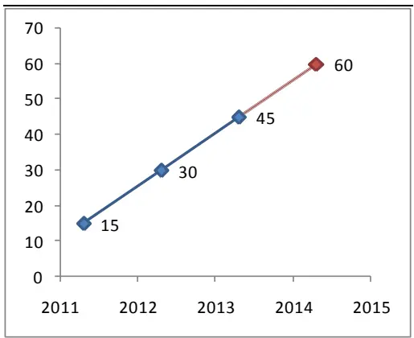
数据来源：国泰君安证券研究

图 1.2 业绩保持稳定 （单位：万元）
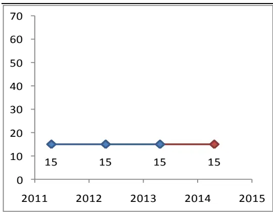
数据来源：国泰君安证券研究

## 1.2. 成长趋势因子构建方法

为了在排除季节性影响的同时较好的把握企业运行的趋势，我们采用 1年(4 个季度)作为移动平均线的时间窗口。首先，将同一年年内的累计的财务数据转换为单季财务数据。如果财务数据完整，则用滚动四季的净利润来计算指标。如果财务数据不完整，则用所能观测到的财报数据归一化来计算移动平均净利润。例如，我们有2011年 3季报数据和2012年3季报数据，但缺失了2011年年报数据，则我们将用 2012年 3季报数据*1.33作为新的滚动净利润数据。

在计算好的净利润移动平均线的基础上，我们用当期移动平均净利润相对上期移动平均净利润的增幅作为成长趋势因子。

$$
\begin{aligned}&\mathrm{MA_{prof\;it}}=(\mathrm{prof\;it\;t_1}+\mathrm{prof\;it\;t_2}+\mathrm{prof\;it\;t_3}+\mathrm{prof\;it\;t_4})\\&\mathrm{E_{prof\;it}}=\mathrm{MA_{prof\;it}}/\mathrm{1ag}(\mathrm{MA_{prof\;it}})\\\end{aligned}
$$

Profit: 单季净利润

MAprofit：滚动 4 季净利润

Eprofit： 成长趋势因子

在计算出 $\mathrm{E_{profit}}$ （预期增长因子）之后，我们要对其中极值数据进行处理。成长趋势因子的逻辑建立在公司业绩趋势得到确认并带来投资者预期的上调，但单季净利润暴增或扭亏导致 $\mathrm{E_{profit}}$ 超过 100%的极值样本可持续性较弱，与策略逻辑有偏离，所以作剔除处理。

## 1.3. 成长趋势因子组合构建

样本空间

考虑实际操作可行性，剔除停牌股票、剔除 ST 股票、同时剔除极值等与策略逻辑不符的数据。策略样本空间初步采用全市场，充分发挥量化选股大数据的优势。但是，考虑到策略稳定性，将进一步测试因子以沪深300、中证800为样本空间时的选股能力。

## 换仓频率

策略采取月度换仓的频率，如新公告财务报告则使用最新数据，提高财务数据的及时性。每月月初第二个交易日用当日均价进行换仓，每年平均换手率300%左右。

## 组合构建

在计算好成长趋势因子指标后，我们每月对因子进行打分并排序。为保证组合的稳健性，选取每期打分前50 名的股票等权重作为投资组合。

## 建仓成本

手续费为单边千分之二，建仓成本为当日均价。同时，考虑到实际投资时的流动性，如果上期持仓股票、下期标的股票换手率小于万分之五，将默认无法卖出、买入。

## 2. 成长趋势因子选股能力：

## 2.1. 成长趋势因子区分度

成长趋势因子对全市场股票的区分度非常好。我们每月第二个交易日按成长趋势因子的打分将全市场股票等数量分为 5 组，每组 300-400 只股票。其中，L1为最优组，L5为最差组。从2008年底每月等权重生成投资组合，并计算累计净值。从图2 可以看出，成长趋势因子分数越高的分组，收益越高。从 L1到 L5组，收益率曲线呈单调递减。其中，最优组（L1）显著高于其他组。但是，因子对于最差的 L4和L5组区分度不明显，这可能预示着投资者对业绩加速下滑的公司看法一致性较高，预期会一步下调到底。

图 2 成长趋势因子区分度
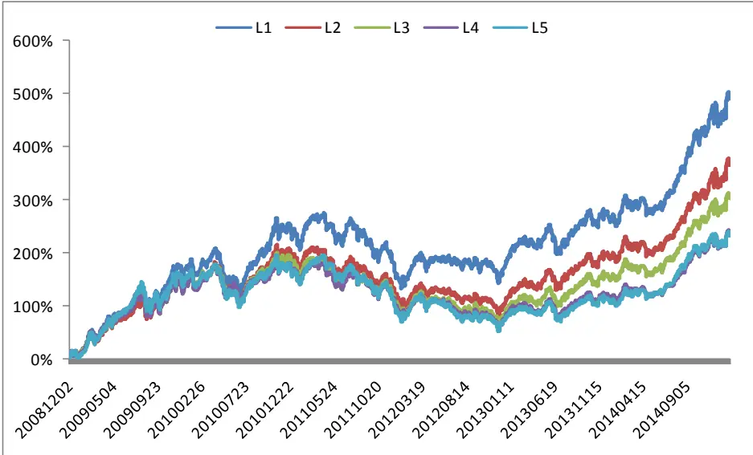
资料来源:国泰君安证券研究

表 1 成长趋势因子分组收益

|  | L1 | L2 | L3 | L4 | L5 |
| --- | --- | --- | --- | --- | --- |
| 年化收益： | 19.19% | 14.53% | 11.94% | 8.68% | 8.56% |
| 2009 | 102.8% | 91.4% | 93.2% | 94.1% | 98.2% |
| 2010 | 25.5% | 20.3% | 15.6% | 13.5% | 7.3% |
| 2011 | -28.2% | -31.4% | -35.3% | -32.1% | -33.7% |
| 2012 | 17.9% | 6.1% | 4.6% | 2.2% | 3.0% |
| 2013 | 26.7% | 34.3% | 30.4% | 18.5% | 16.4% |
| 2014 | 41.7% | 39.2% | 40.5% | 38.5% | 42.1% |
| 2015 | 7.6% | 8.1% | 6.6% | 6.1% | 5.8% |

资料来源:国泰君安证券研究

## 2.2. 多空组合

基于成长趋势因子构建的多空组合收益显著(Top 50 VS Bottom 50)。我们根据成长趋势因子的打分，每月取分数最高和分数最低的 50 只股票等权重构建多空组合。从表 2 展示的结果来看，多空组合 2008 年底至今多空累计收益为 125%, 信息比1.68。在图 3.1 中我们也可以直观看出，高分组的收益显著高于低分组。尤其在 2012 年之后，因子的有效性愈发显著。从月度收益来看，图 3.2 显示因子多空收益月度胜率接近70%，而且盈亏比非常明显。最大回撤为15%，发生在 2009年。但2009年之后回撤幅度明显降低。

表 2 成长趋势因子的多空收益

| 累计收益： 125% |
| --- |
| 年化收益 14.75% |
| 年化波动率 8.79% |
| 信息比： 1.68 |

资料来源:国泰君安证券研究

图 3.1 多空组合走势
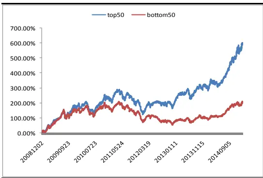
数据来源：国泰君安证券研究

图 3.2 多空月度收益
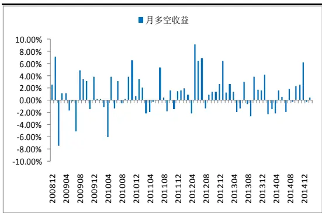
数据来源：国泰君安证券研究

## 2.3. 对冲标的指数

## 2.3.1. 2.2.1 对冲沪深 300 全收益

因中国的股票市场做空机制比较严格，做空标的比较匮乏，目前对冲工具通常选择沪深300股指期货。所以我们等权构建TOP 50 组合，并选取沪深300全收益指数作为标的指数，以考察因子的有效性。从表 3我们可以看出，组合相对沪深 300指数有显著的超额收益(年化22.25%)，信息比可以达到1.6。 但组合对市值风格暴露过大，其收益在各年分布较不均匀，尤其在2011年和 2014年，组合收益基本与沪深300指数持平。

## 2.3.2. 2.2.2 对冲中证 800 等权和中证 500 等权指数

由于组合里属于沪深 300 成份股的股票权重占比只有约 20%，所以用沪深300作为标的指数会产生较大的风格偏差，产生的超额收益很大比例可能来自小盘股相对大盘股的风格收益。因此，我们使用中证 800等权指数和中证500等权指数作为标的指数，剔除市值风格对超额收益的影响。从表X中我们发现，控制市值风格的影响后，虽然超额收益有一定程度的下降，但是波动率也随之大幅下降，且年胜率达到 100%。值得一提的是，对冲中证800等权指数年化收益率达到14.75%，信息比达到2.08. 这对于一个单因子构建的组合来说相当优秀。

图 4 直观展示了组合和各标的指数的走势，成长趋势因子在 2012 年后表现抢眼，超额收益非常明显。由于因子表现通常是有一定惯性的，近年的优秀表现增加了对成长趋势因子进行配臵的信心。

表 3 成长趋势因子对冲不同指数表现

| 对冲指数： | 沪深 300 全收益 | 中证800 等权 | 中证500 等权 |
| --- | --- | --- | --- |
| 年化超额收益： | 22.25% | 14.75% | 11.54% |
| 信息比： | 1.6 | 2.08 | 1.74 |
| 最大回撤： | -28.45% | -8.74% | -7.08% |
| 2009年 | 36.39% | 13.11% | 7.98% |
| 2010年 | 31.38% | 8.94% | 3.09% |
| 2011年 | -2.75% | 5.64% | 6.58% |
| 2012年 | 19.68% | 27.21% | 27.76% |
| 2013年 | 36.31% | 18.69% | 10.55% |
| 2014年 | 0.20% | 9.48% | 10.75% |
| 2015年 | 10.95% | 2.11% | 0.41% |

资料来源:国泰君安证券研究

图 4 组合及标的指数走势
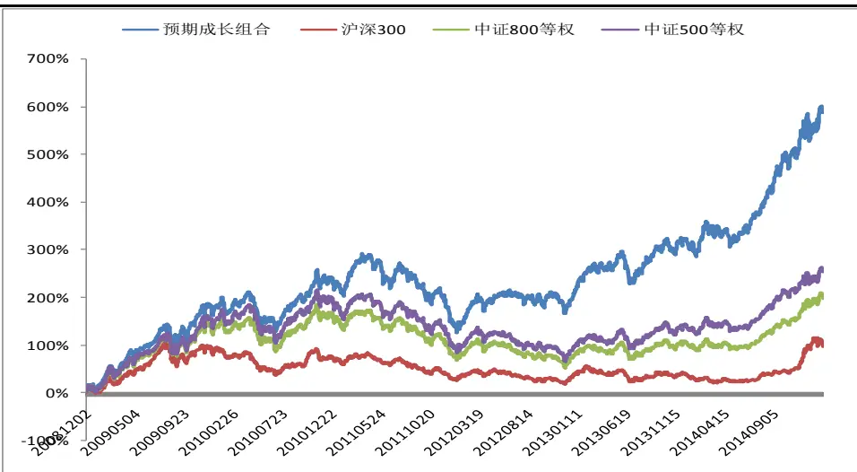
数据来源：国泰君安证券研究

## 2.3.3. 2.2.3 考察组合市值分布

中国A股市场有较明显的微型股效应，即市场上市值最小的 10%股票有在较显著的超额收益，但这类个股流动性较差、扛操纵性较弱。为排除组合中微型股效应的存在，我们按市值大小进行了几类划分，并计算历史每月TOP 50 持仓股票在各档市值分组中的占比。从图5.1可以看出，组合历史持仓股票中约 70%的股票总市值大于25 亿、75%的股票流通市值大于15亿。所以，我们可以排除微型股效应对组合收益的影响。

图 5.2 展示了 A 股主板股票等量切分为 10 组后每组的平均市值。相比之下，成长趋势组合由于含创业板股票的原因，相对A 股主板股票市值风格偏小盘。但在各市值分组中分布均匀，偏差不大。

图 5.1 A 股主板市值分布
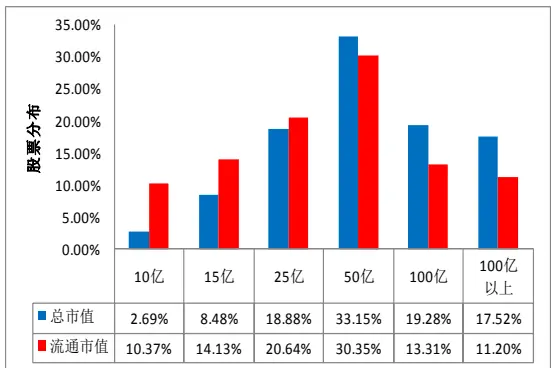
数据来源：国泰君安证券研究

图 5.2 组合市值分布
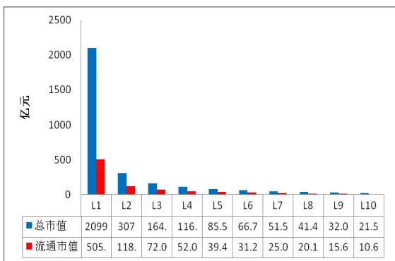
数据来源：国泰君安证券研究

## 2.3.4. 2.2.4 考察组合行业分布

成长趋势因子具有显著的选股能力，但是其在行业层面的持仓分布并没有过度集中。从图6中可以看出，组合历史持仓覆盖所有行业，权重较分散。权重排名前三的行业分别为化工(11.46%)、房地产(8.62%)、公用事业(6.94%)。

图 6 组合历史持仓行业分布
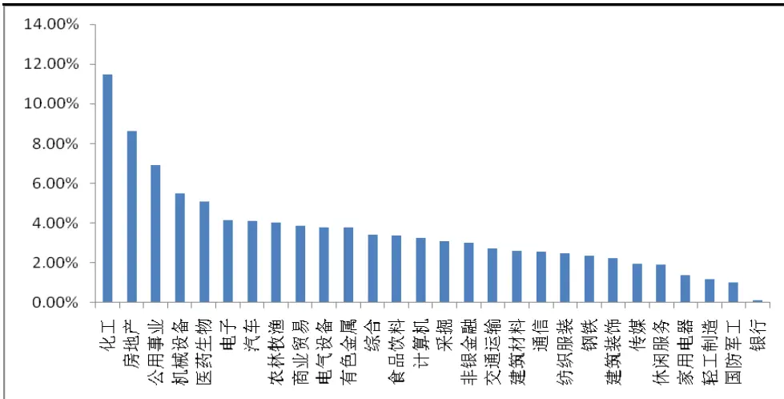
资料来源:国泰君安证券研究

## 2.4. 沪深 300 内选股

成长趋势因子在沪深 300内选股能力依然很出色。沪深 300指数由市场成交最活跃的300只股票组成，其较好的流动性伴随着较高的信息整合效率。这就使得很多因子在 300 内选股的效率极低。但通过在沪深 300成份股中选取成长趋势因子排名最靠前的50只股票构建等权组合，2008年12月至今的累计超额收益可达到82%（如表4所示）。图7 也较直观的看出，虽然在2011年几乎没有超额收益，但整体来看因子收益驱动力依旧很明显。

表 4 沪深 300 内选股表现

| 累计收益： 82% |
| --- |
| 股票池： 沪深300 |
| 年化收益 10.33% |
| 年化波动率 8.19% |
| 信息比： 1.26 |

资料来源:国泰君安证券研究

图 7 组合 300 内选股超额收益净值
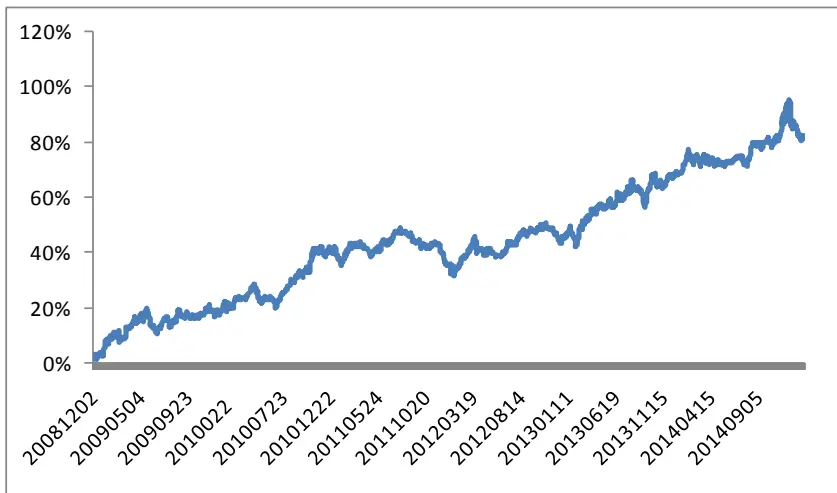
资料来源:国泰君安证券研究

## 2.5. 中证 800 内选股

成长趋势因子在中证 800内选股能力依然很出色。从表 5中可以看出，以中证800作为样本池，组合相对中证800和沪深300依旧有稳定的超额收益，信息比依旧可以达到 1以上。

表 5 中证 800 内选股表现

| 标的指数： | 中证 800 等权 | 沪深 300 全收益 |
| --- | --- | --- |
| 股票池： | 中证 800 | 中证 800 |
| 累计收益： | 45.00% | 109.75% |
| 年化收益： | 5.26% | 11.08% |
| 年化波动率： | 5.15% | 9.34% |
| 信息比： | 1.02 | 1.19 |

资料来源:国泰君安证券研究

## 3. 成长趋势因子时效性较高

成长趋势因子时效性较强，当期得分对下一期收益解释力最高。证券投资是边际思维，上涨空间的大小只跟投资者未来上调预期的空间大小有关。成长趋势因子基于业绩趋势确认后预期上调，收益产生于从预期上调到股价上调的延迟反应中。

我们将成长趋势因子滚动8期和滚动4期的算术平均值作为一个新的指标，每月选取排名前 50 的股票等权买入，以中证 500 为标的指数计算超额收益。从表6中我们发现，成长趋势因子时效性较强，当期分值对下期组合超额收益的驱动力最强，随着时间跨度的增加，因子的超额收益及信息比明显下降。一方面，这体现出A 股市场的有效性，历史信息已经无法影响未来的股票价格。另一方面，由此也证实未来超额收益只与接下来一段时间投资者预期变化的方向和幅度有关。

表 6 滚动多期成长趋势因子和当期成长趋势因子组合收益情况比较

| 滚动8期 | 滚动4期 | 当期 |
| --- | --- | --- |
| 年化超额收益： 0.63% | 3.93% | 11.54% |
| 信息比： 0.1 | 0.58 | 1.74 |
| 2009年 -9.63% | -7.09% | 7.98% |
| 2010年 -1.11% | 4.31% | 3.09% |
| 2011年 1.14% | 6.46% | 6.58% |
| 2012年 2.64% | 5.05% | 27.76% |
| 2013年 11.20% | 5.03% | 10.55% |
| 2014年 -0.43% | 7.99% | 10.75% |

资料来源:国泰君安证券研究

## 4. PEAD 现象对策略的影响

PEAD现象对组合的收益起到一定的贡献作用，但并不显著。业绩公告后的PEAD（盈余公告后的价格漂移）是资产定价和资本市场效率研究中重要的投资异象之一。PEAD 现象的研究始于 1968 年 Ball and Brown(1968)第一次证明了年报公告后的业绩漂移现象。本篇文章的重点并不在于研究 PEAD 现象，但是由于成长趋势因子主要基于财务数据，所以其构建的组合就会包含 PEAD 现象带来的超额收益。所以，我们通过测算组合持仓股票财务公告后 20 个交易日相对中证 800 等权指数超额收益，来评估组合超额收益是否完全来自PEAD现象。

从表7中我们可以看出，成长趋势组合历史持仓个股在其对应的财报公告后确实有明显的 PEAD 现象，公告后 20 个交易日相对中证 800 平均超额收益为 1.82%，胜率约 50%。但我们之前在小节 2.3 的表 3 中已测算过组合年化超额收益为 14.75%，远高于每年 4 次财报公告带来的PEAD 收益。

从表 8 我们进一步发现，PEAD 效应在大、中盘股票中较显著。其中，我们按中证 100、沪深 300 内中证 100 外、中证 500、中证 500 外将全市场股票划分为大盘、中盘、小盘、超小盘。但是，由于成长趋势组合在大中盘股票分布的权重较小，所以成长趋势因子带来的超额收益与PEAD 效应产生的超额收益重合度较低。

表 7 历史持仓股票财报公告后 20个交易日相对中证 800 超额收益

| 年份 | 超额回报 样本数 | 胜率 |
| --- | --- | --- |
| 2008 6.13% | 50 | 68.00% |
| 2009 3.09% | 182 | 57.69% |
| 2010 2.26% | 184 | 47.83% |
| 2011 -0.95% | 194 | 41.75% |
| 2012 3.42% | 185 | 55.14% |
| 2013 0.93% | 178 | 50.56% |
| 2014 1.14% | 180 | 50.56% |
| 2015 1.53% | 6 | 83.33% |
| 整体 1.82% | 1159 | 51.42% |

资料来源:国泰君安证券研究

表 8 PEAD现象在不同市值风格股票池中的收益情况

| 大中小盘 | 超额回报 | 样本数 | 胜率 |
| --- | --- | --- | --- |
| 超小盘 | 1.60% | 787 | 51.72% |
| 小盘股 | 1.80% | 245 | 50.61% |
| 中盘股 | 3.33% | 97 | 51.55% |
| 大盘股 | 2.91% | 30 | 50.00% |

资料来源:国泰君安证券研究

为进一步排除事件冲击对组合收益的影响，图8展示了组合收益在月份上的分布情况。整体来看，组合收益全年分布较为分散。此外，由于财务报告分别要求在4月、8月、10月前公布完毕，所以公告带来的 PEAD影响将主要集中于5月、9月、11 月。在图8 中我们可以看出，成长趋势因子组合在这 PEAD 效果最强的这几个月（图中红色月份）并没有过高的收益，所以公告后的PEAD效应不是组合收益的主要来源。

图 8 组合收益月份分布情况
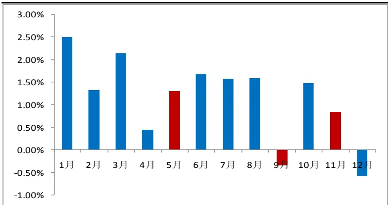
资料来源:国泰君安证券研究

## 5. 分析师覆盖对因子有效性的影响

分析师覆盖不影响成长趋势因子的有效性，但分析师覆盖能够降低信息不对称导致的风险溢价。根据 FAMA 的有效市场理论，强有效市场会反应历史、现在、甚至未来的信息。但实际上，有效市场是一个信息转化为预期，预期反应到价格的过程，而 Alpha就是在信息整合过程中产生的。分析师作为提高市场有效性的重要成员，其覆盖的股票透明度也相对较高。同时，基于分析师推荐的影响力，市场对于相应标的未来业绩实现的担忧也较低。下面我们将分别考察成长趋势因子在分析师覆盖和未覆盖股票中的有效性，从而探究市场有效性对成长趋势因子的影响。

我们每月将全市场股票按最近 6个月是否有分析师覆盖分为 2组，每组内部等权重投资，计算累计净值，分别为无覆盖指数和有覆盖指数。同时，我们每月根据成长趋势因子在 2 组内部分别挑选打分最高的前 50只个股作为无覆盖组合、有覆盖组合。图 9展示了4个指数的累计净值，从图中不难看出，成长趋势因子在两个股票池中选出的股票收益相当，分析师覆盖并未影响因子的选股能力。另一方面，无覆盖股票整体相对有覆盖股票有超额收益。这主要是由于未覆盖股票信息不对称相对较严重，投资者也要求相对更高的风险溢价。

图 9 因子在分析师覆盖和未覆盖股票池中选股的收益情况
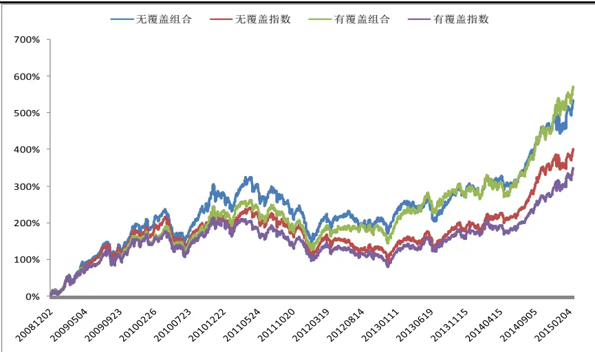
资料来源:国泰君安证券研究

## 6. 成长趋势因子的行业配臵能力

成长趋势因子基于其捕捉投资者预期趋势的原理，在行业择时上表现依旧显著。行业指数作为多个股票的组合，其体量更大，因此惯性也更强。这就好比一辆汽车，在发动机动力的牵引下，汽车开始向牵引方向移动，当动力越强，汽车向牵引方向的惯性就越大。基于这个原理，本文按成长趋势因子得分，将投资者对股票未来预期上调的趋势作为汽车动力，选取排在前80名和后 80名股票作为做多、做空股票池样本，将每个行业在股票池中所占的股票只数作为行业动力，观测该行业后续的运行趋势。具体来说，根据申万一级行业分类共有 28 个行业，平均每个行业应大约有3只股票。为突出行业动力的显著性，我们设定单一行业在 80只股票中所占只数的阀值为平均水平的 3 倍(9 只)。在此基础上，我们选取排名靠前/靠后，也就是动力最强的行业进行做多/做空。

首先，我们在每期达到做多阀值的行业中，做多排名第一的行业指数。同时，我们选取沪深 300 指数作为基准指数来计算超额收益。在图 10可以看出，根据成长趋势因子做多的行业，累计超额收益显著（40%），胜率达到55%。但其走势并不平稳，回撤幅度较大。

图 10 NO.1 行业 CAAR
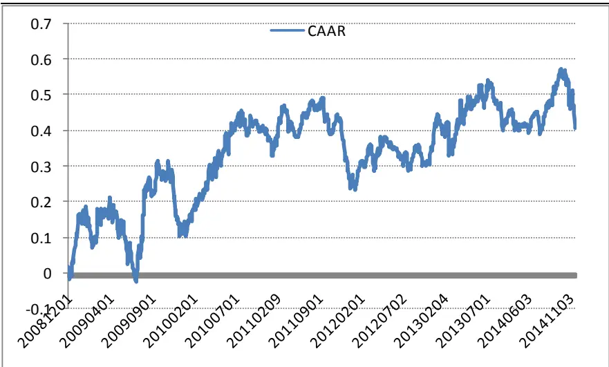

资料来源：国泰君安证券研究

Hirshleifer,Lim and Teoh(2009)发现，人的认知能力有限，竞争性信息的出现会分散或降低投资者的注意力，从而影响股票价格。而成长趋势因子的有效性是基于投资者上调对标的行业未来预期，标的数量多少则会直接影响投资者决策。所以我们推测成长趋势因子每期看多的第一个行业在之前就吸引了投资者大部分的注意力，股价短期就会充分反应、甚至出现过度反应的情况。因此，我们进一步测试只做多达到阀值且排名第二的行业。在图11 中可以看出，排名第二的行业2008年底以来的累计超额收益更加显著（103%），回撤幅度大幅降低，该结果说明“注意力分散效应”在行业择时中依旧有效，做多排名第二的行业效果更好。

图 11 NO.2 行业 CAAR
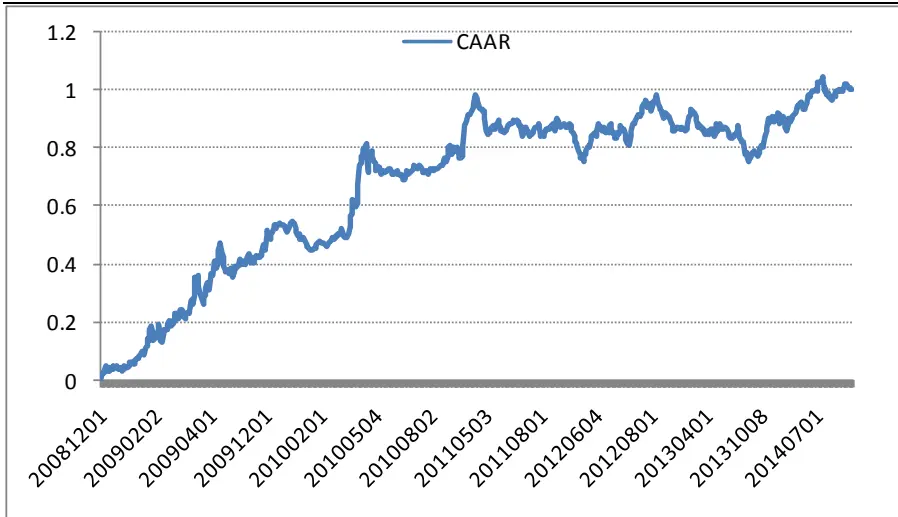
资料来源：国泰君安证券研究

相应地，我们在每期达到做空阀值的行业中，做空排名第一的行业指数。而由于中国A 股市场目前不存在有效的个股做空工具，即使部分股票可以融券卖出，但其较高的融资成本也加大了做空的难度。因此，评分最低的行业会被市场持续冷落，基本不存在过度反应的问题。从图 12 也可以明显的看出，根据成长趋势因子做空的行业负收益显著（-33%）。但是，该策略在 2014 年有一定亏损。主要是由于房地产行业基本面虽然继续恶化，但市场对其预期已经见底，股价已经开始反弹。所以，我们需要特别注意策略做空的行业的预期是否已经见底，并出现拐点。

图 12 做空NO.1行业净值
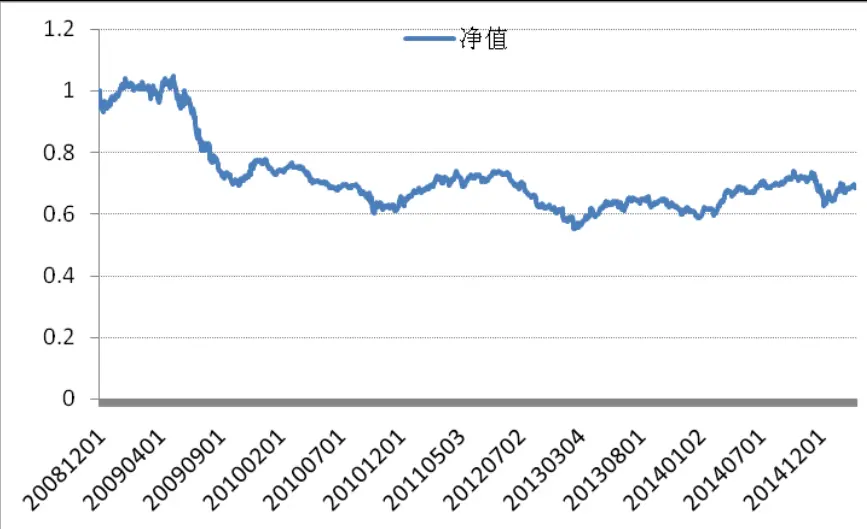
资料来源：国泰君安证券研究

整体来说，成长趋势因子在行业择时上效果显著，逻辑简单易懂，便于我们应用于实际的投资操作中。在实际应用中，策略只是一个辅助的工具，应结合策略本身逻辑的出发点，综合判断。

## 7. 总结与后续研究展望

成长趋势因子凭借其显著的收益及优秀的区分度，值得受到投资者足够的重视。同时，成长趋势因子有其独特的信息流，在各类风格股票池中都显著有效。

本文主要聚焦于成长趋势因子自身属性的研究，后期我们将从内在和外在两个方面出发，进一步提高策略的有效性。

1. 净利润的提升可由多种途径达到，例如提高公司成本控制能力、提高营业收入等。虽然条条大路通罗马，但每条路背后的故事却不尽相同。所以，深入理解利润提升的源头是有必要的。下一步我们将结合管理层做高业绩的动机进行更深入的研究，更好的理解成长趋势因子。

2. 除了投资者预期，投资者情绪也是影响股票价格的重要因素之一。因此，下一步我们将引入技术类指标，尝试提高策略的有效性和稳定性。

## 本公司具有中国证监会核准的证券投资咨询业务资格

## 分析师声明

作者具有中国证券业协会授予的证券投资咨询执业资格或相当的专业胜任能力，保证报告所采用的数据均来自合规渠道，分析逻辑基于作者的职业理解，本报告清晰准确地反映了作者的研究观点，力求独立、客观和公正，结论不受任何第三方的授意或影响，特此声明。

## 免责声明

本报告仅供国泰君安证券股份有限公司（以下简称“本公司”）的客户使用。本公司不会因接收人收到本报告而视其为本公司的当然客户。本报告仅在相关法律许可的情况下发放，并仅为提供信息而发放，概不构成任何广告。

本报告的信息来源于已公开的资料，本公司对该等信息的准确性、完整性或可靠性不作任何保证。本报告所载的资料、意见及推测仅反映本公司于发布本报告当日的判断，本报告所指的证券或投资标的的价格、价值及投资收入可升可跌。过往表现不应作为日后的表现依据。在不同时期，本公司可发出与本报告所载资料、意见及推测不一致的报告。本公司不保证本报告所含信息保持在最新状态。同时，本公司对本报告所含信息可在不发出通知的情形下做出修改，投资者应当自行关注相应的更新或修改。

本报告中所指的投资及服务可能不适合个别客户，不构成客户私人咨询建议。在任何情况下，本报告中的信息或所表述的意见均不构成对任何人的投资建议。在任何情况下，本公司、本公司员工或者关联机构不承诺投资者一定获利，不与投资者分享投资收益，也不对任何人因使用本报告中的任何内容所引致的任何损失负任何责任。投资者务必注意，其据此做出的任何投资决策与本公司、本公司员工或者关联机构无关。

本公司利用信息隔离墙控制内部一个或多个领域、部门或关联机构之间的信息流动。因此，投资者应注意，在法律许可的情况下，本公司及其所属关联机构可能会持有报告中提到的公司所发行的证券或期权并进行证券或期权交易，也可能为这些公司提供或者争取提供投资银行、财务顾问或者金融产品等相关服务。在法律许可的情况下，本公司的员工可能担任本报告所提到的公司的董事。

市场有风险，投资需谨慎。投资者不应将本报告为作出投资决策的惟一参考因素，亦不应认为本报告可以取代自己的判断。在决定投资前，如有需要，投资者务必向专业人士咨询并谨慎决策。

本报告版权仅为本公司所有，未经书面许可，任何机构和个人不得以任何形式翻版、复制、发表或引用。如征得本公司同意进行引用、刊发的，需在允许的范围内使用，并注明出处为“国泰君安证券研究”，且不得对本报告进行任何有悖原意的引用、删节和修改。

若本公司以外的其他机构（以下简称“该机构”）发送本报告，则由该机构独自为此发送行为负责。通过此途径获得本报告的投资者应自行联系该机构以要求获悉更详细信息或进而交易本报告中提及的证券。本报告不构成本公司向该机构之客户提供的投资建议，本公司、本公司员工或者关联机构亦不为该机构之客户因使用本报告或报告所载内容引起的任何损失承担任何责任。

## 评级说明

## 1.投资建议的比较标准

投资评级分为股票评级和行业评级。

以报告发布后的12个月内的市场表现为比较标准，报告发布日后的 12个月内的公司股价（或行业指数）的涨跌幅相对同期的沪深 300 指数涨跌幅为基准。

## 2.投资建议的评级标准

报告发布日后的 12 个月内的公司股价（或行业指数）的涨跌幅相对同期的沪深 300 指数的涨跌幅。

| 评级 | 说明 |  |
| --- | --- | --- |
| 股票投资评级 | 增持 | 相对沪深 300指数涨幅15%以上 |
|  | 谨慎增持 | 相对沪深300指数涨幅介于5%～15%之间 |
|  | 中性 | 相对沪深300指数涨幅介于-5%～5% |
|  | 减持 | 相对沪深300指数下跌5%以上 |
| 行业投资评级 | 增持 | 明显强于沪深 300 指数 |
|  | 中性 | 基本与沪深300指数持平 |
|  | 减持 | 明显弱于沪深300指数 |

## 国泰君安证券研究

|  | 上海 | 深圳 | 北京 |
| --- | --- | --- | --- |
| 地址 | 上海市浦东新区银城中路168号上海 银行大厦29层 | 深圳市福田区益田路 6009 号新世界 商务中心34层 | 北京市西城区金融大街 28 号盈泰中 心2号楼10层 |
| 邮编 | 200120 | 518026 | 100140 |
| 电话 | （021)38676666 | (0755)23976888 | (010)59312799 |
|  | E-mail: gtjaresearch@gtjas.com |  |  |