nInfo] [Table_Title] 2015.04.08

# 动量测评之均线策略

# ——数量化专题之五十六

赵延鸿（分析师）

刘富兵（分析师）

8 021-38674927

021-38676673

zhaoyanhong@gtjas.com

证书编号 S0880515030004

liufubing008481@gtjas.com

S0880511010017

## 本报告导读：

均线动量策略有效性的根本原因在于价格走势存在趋势性，策略特征表现为低胜率、高盈亏比。

## 摘要：

le_Summary]任何技术指标对一个完整的价格序列难以取得高胜率，原因在于价格走势是由趋势和震荡两种走势类型连接而成。趋势完成后转震荡，震荡完成后转趋势，这是两种属性完全相反的走势类型，而单一技术指标要么为趋势属性，要么为反转属性，必然难以兼顾到两种不同的走势类型。由此可见在价格动量中寻找一个高胜率指标很难，但获得一个低胜率、高盈亏比的指标却是容易得多，均线动量属于这一类。

基于均线动量策略对申万 28 个一级行业测试结果显示，28个行业无一胜率超过 50%，平均胜率仅 40%，也就是说每五次买入只有两次收益为正。但从2002年4月至2015年3月，对 28个一级行业进行期初等额资金配臵后，常用的 25日均线动量策略的累计收益高达 1137%，5 周均线动量策略的累计收益也达到 763%。这个结果再次说明了动量策略的低胜率、高盈亏比特征，这种结果正是由市场自身运行特征决定的：趋势虽少但涨跌幅主要集中于此，震荡虽多但不构成涨跌幅主要贡献因素。这是多数动量模型背后运行有效的机理。

牛熊分界值+取强舍弱+动态等市值管理策略。运用在申万二级行业上，十三年可以取得 17 倍的收益,优于 25 日均线等额资金策略。牛熊分界值策略大幅优于等额资金策略，主要是加入了一个对市场强弱的判断指标，当市场偏弱时，即使有行业站到了均线之上，也不参与，因为市场处于弱势时，行业的反弹一般持续性较差，这样避免了参与一些带来损失的买入机会。至于动态等市值管理仅是用来确保出现买卖信号能够给出一个清晰操作，未必是最优的。

- 均线动量策略是一种简单易行的交易策略，既不需要分析市场走势也不需要预测市场，优点包括：信号清晰简单、交易纪律得以有效执行、策略成本低、无参数拟合。

金融工程

## 金融工程团队：

刘富兵：（分析师）

电话：021-38676673

邮箱：liufubing008481@gtjas.com

证书编号：S0880511010017

赵延鸿：（分析师）

电话：021-38674927

邮箱：zhaoyanhong@gtjas.com

证书编号：S0880515030004

耿帅军：（分析师）

电话：010-59312753

邮箱：gengshuaijun@gtjas.com

证书编号：S0880513080013

## 刘正捷：（分析师）

电话：0755-23976803

邮箱：liuzhengjie012509@gtjas.com

证书编号：S0880514070010

吴晶：（分析师）

电话：021-38676720

邮箱：wujing@gtjas.com

证书编号：S0880514110001

## 李雪君：（研究助理）

电话：021-38675855

邮箱：lixuejun@gtjas.com

证书编号：S0880114090056

王浩：（研究助理）

电话：021-38676434

邮箱：wanghao014399@gtjas.com

证书编号：S0880114080041

陈奥林：（研究助理）

电话：021-38674835

邮箱：chenaolin@gtjas.com

证书编号：S0880114110077

## [Table_R相关报告

《成长趋势因子-财务数据中再掘金》2015.04.01

《量化投资框架下的 PPP 主题投资》2015.03.14

《ETF 期权规则解读及投资应用》2015.02.04

《期权时代下的泛产品创新》2015.02.03

《波动率与奇异期权》2015.02.03

## 1. 基于价格走势的量化策略综述

基于价格走势的量化策略，主要有两类：动量与反转。动量策略追趋势，反转策略预判拐点。在研究和实际应用中发现，很难找到单一技术指标对一个完整的价格序列自始至终都有效，原因在哪里？原因就在于价格走势是由趋势和震荡两种走势类型连接而成。趋势完成后转震荡，震荡完成后转趋势，这是两种完全相反的走势类型，而任何单一的技术指标要么为趋势属性（例如均线系统金叉与死叉、价格突破单均线、MACD穿越零值、三 K线组合、涨跌幅超过给定阈值等），要么为反转属性（KDJ指标、布林线、均线系统的支撑与阻力等），因此难以兼顾到两种不同的走势类型。由此可见完美的策略必须当下动态地兼顾到趋势与震荡两种结构。

假如世上存在一个完美的策略，能够精确预判每一个拐点，那么我们可以看一下这种完美策略能够取得理论收益是多少？如果用10%作为涨幅参数对非银金融行业（申万一级），从 2002 年 4 月至 2015 年 3 月的日度收盘价进行分段的话，共出现 57 个涨幅超过 10%以上的波段。那么假定完美策略能够参与所有上涨波段而避开下跌波段，即在底部拐点精准买入而在顶部拐点精准卖出的话。设定期初资金 1万元，到期末理论上收益达到约 123亿元。如果加入千分之三的交易费率，累计收益也能达到 87 亿。当然这只是一个假想的完美策略，给予我们参与市场交易获利的想象空间，实际交易中却不可能实现。第一、这种策略应该不存在，每一个级别的拐点出现既有内因（价格走势力度的衰竭）所致，也有外因（政策面或者基本面的超预期）触发，所以能精确把握所有拐点非人力之所能及；第二、随着资金量增大，在单一价格上成交的可能性几乎为零，所谓的顶部拐点或者底部拐点严格意义上是一个价格区间。

图 1非银金融行业（801790.SI）分段图（以 10%作为分段参数）
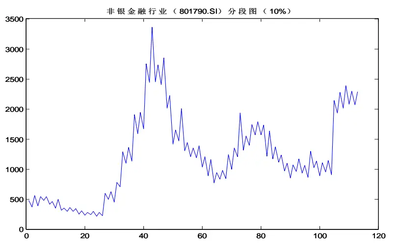
数据来源：国泰君安证券研究，WIND，2002年4月至2015年3月

从下表可以看出，即使用 20%的分段参数统计累计收益，非银金融也达到 13526 倍的收益，排在之后的为有色金属、国防军工和传媒行业。排在最后一位的食品饮料行业累计收益也有 132倍。

表 1：不同涨跌幅波段累计收益比较（按 5%累计收益排序）

|  |  | 5% |  | 10% | 20% |  |
| --- | --- | --- | --- | --- | --- | --- |
| 证券名称 | 区间涨跌幅 | 累计收益(倍数) | 年化收益率 | 累计收益(倍数) | 年化收益率 | 累计收益(倍数) 年化收益率 |
| 非银金融 | 386% | 136398038 | 322% | 1229770 | 194% 13526 | 108% |
| 有色金属 | 215% | 32171278 | 278% | 356691 167% | 8898 | 101% |
| 国防军工 | 426% | 20772906 | 265% | 236632 | 159% 2904 | 85% |
| 传媒 | 448% | 19398170 | 264% | 307167 | 164% 4344 | 90% |
| 采掘 | 138% | 8230444 | 240% | 58284 | 133% 1820 | 78% |
| 计算机 | 503% | 6419846 | 234% | 79902 | 138% 1375 | 74% |
| 电子 | 141% | 4500421 | 225% | 53630 | 131% 1291 | 73% |
| 房地产 | 217% | 3720832 | 220% | 96370 | 142% 1970 | 79% |
| 农林牧渔 | 142% | 2648875 | 212% | 39536 | 126% 1110 | 72% |
| 休闲服务 | 263% | 2326447 | 209% | 44669 | 128% 749 | 66% |
| 综合 | 149% | 2294076 | 209% | 66402 | 135% 1652 | 77% |
| 建筑材料 | 181% | 2123494 | 207% | 40922 | 126% 870 | 68% |
| 汽车 | 279% | 1369461 | 197% | 56842 | 132% 1911 | 79% |
| 电气设备 | 479% | 1292346 | 195% | 25794 | 118% 891 | 69% |
| 机械设备 | 298% | 964565 | 189% | 33000 | 123% 888 | 69% |
| 银行 | 291% | 839307 | 186% | 10226 | 103% 582 | 63% |
| 纺织服装 | 101% | 828239 | 185% | 17088 | 112% 782 | 67% |
| 钢铁 | 122% | 598949 | 178% | 21725 | 116% 558 | 63% |
| 通信 | 147% | 514778 | 175% | 7238 | 98% 268 | 54% |
| 轻工制造 | 109% | 397778 | 170% | 12167 | 106% | 639 64% |
| 家用电器 | 403% | 376152 | 168% | 14435 | 109% 460 | 60% |
| 商业贸易 | 279% | 286152 | 163% | 7478 | 99% 640 | 64% |
| 建筑装饰 | 167% | 281530 | 163% | 6460 | 96% 294 | 55% |
| 医药生物 | 412% | 216497 | 157% | 7292 | 98% 244 | 53% |
| 化工 | 122% | 138761 | 149% | 5046 | 93% | 460 60% |
| 交通运输 | 126% | 107123 | 144% | 6792 | 97% | 214 51% |
| 食品饮料 | 343% | 99084 | 142% | 3102 | 86% | 132 46% 146 |
| 公用事业 | 144% | 47239 | 129% | 2254 | 81% | 47% |

数据来源：国泰君安证券研究，WIND

上述数据统计最主要的目的是展示价格中蕴藏的巨大波动空间，及潜在的基于交易获得高收益的可能性。当然上述统计还仅仅是一级行业，如果放到个股层面，波动性与累计收益更为显著。

为了捕捉波段交易机会，正如前面讨论要么运用动量趋势策略，要么使用反转策略。在本篇报告中，我们重点探讨动量策略中常见的单均线策略。所谓的单均线动量策略，定义为价格上穿均线或下穿均线后产生的可能趋势行情。背后的基本原理主要是价格上穿或下穿均线后，要么形成趋势行情，要么趋势行情形成失败，但要形成趋势行情，价格必须上穿或下穿均线。

图 2单均线买卖信号界定
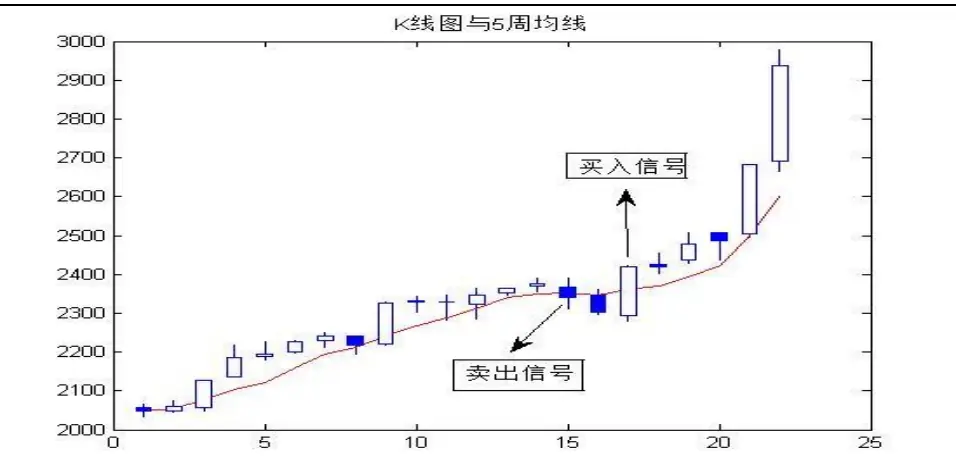
数据来源：国泰君安证券研究，WIND

我们首先用 5 周均线举例说明单均线动量策略的操作方法，5 周线战法在技术分析中属于简单易行的动量策略，简而言之，就是当周度收盘价站上 5 周线就以当周收盘价买入，当周度收盘价跌破 5周线就以当周收盘价卖出。当然有些情况下，在周度收盘前不一定能断定价格到收盘时必然站上 5周线或者跌破 5周线，这种情况可以用下周的开盘价买入或者卖出。5 周线战法用来捕捉趋势机会，趋势越强效用越大，这句话包含两个意思：对于上行趋势，可以获得可观的收益，对于下行趋势，则会避开深度套牢。相反当遇到震荡行情，则完全失效，甚至使得组合净值出现大幅回撤。举个例子创业板指数（399006）周度走势，在 2012年见底之前，出现长达 4个月横盘震荡走势，这期间用 5周线战法就会出现净值回撤，最好的操作也许是箱体震荡做反转。而当创业板指数在2012 年底筑底之后，出现单边大幅上涨时，5周线战法效果就非常显著。

图 3创业板指数（399006）周 K线图与 5周均线
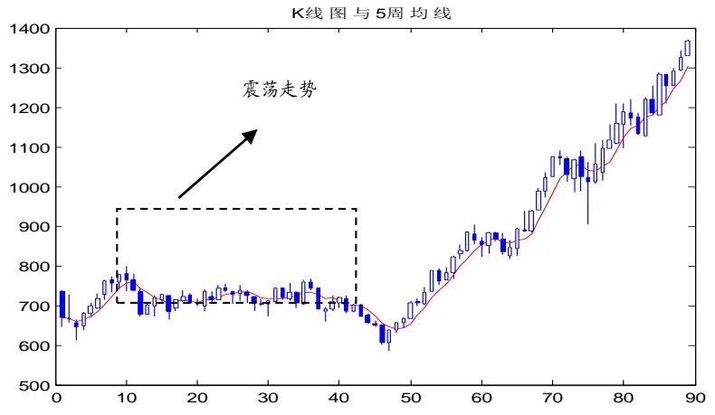
数据来源：国泰君安证券研究，WIND

至于如何定义趋势和震荡是一个并不存在标准答案的问题，从数学角度不存在一个终极的唯一答案，二者的定义不仅依赖于量化指标，也依赖于投资者主观认定，换句话说这个定义既是主观的也是客观的。以后我们会有专门的报告来探讨这个问题，本篇报告里不会深究这个问题。

在这里还需要探讨一下技术分析的两类体系，无论是江恩理论、波浪理论、均线系统、缠中说禅还是传统的技术分析指标，都属于两类体系中的一种。一类体系为预测系统，另一类为操作系统。预测系统站在当下对价格未来的走势进行了超前的预测，预测还可以分为两类：一类为单义性预测，另一类为多义性预测。单义性预测比较确定地认为未来就是如何如何，这是一种属于先知先觉性的分析系统，譬如预测拐点发生的时间和到达的点位，再比如像波浪理论基于当下处于的浪级从而预测未来还有几浪涨跌；而多义性预测并没有明显倾向于未来价格走势的唯一可能性，即使基于价格的大数据对未来走势的可能性具有概率统计分布，实际操作往往不会依赖这种概率分布，因为在金融市场最不缺的就是黑天鹅，过去的统计结果未必适用于当下，更不一定适用于未来，毕竟影响股市的各类因素如宏观经济、货币与财政政策、投资者结构、金融工具的使用、上市公司的管理还有人类的生产力与生产关系的发展变迁，这些因素不会一成不变，必然持续不断地发生着变化。单看 A股从2000 年至今，上述因素也在发生着各种变化，而每一轮的牛市或者熊市从其触发到推动再到完成的因素也是不尽相同。这说明简单基于过去价格的统计规律的不可靠性。所以多义性分类实质上并非基于走势分类的概率分布进行操作，而是对未来走势的分类一视同仁，甚至认为每一种分类发生的可能性是一样，唯一必需做的是制定相应的操作策略。

上述属于技术分析的预测系统，与之完全不同的则是技术分析的操作系统，这种系统对未来具体是涨还是跌、涨至什么位臵、什么时候拐点出现等等都不做任何预测，唯一需要做的就是跟随，简而言之就是设臵一个明确的信号系统，出现信号则做相应的操作。这篇研究报告中主要是关于操作系统的。

## 2. 5 周均线策略的测评

## 2.1. 回溯测试结果

## 测试时间窗口 2002 年 4 月 1 日-2015 年 3 月 6 日

对于任何量化策略都存在一个基本问题：策略的盈利从哪里来？对于所有单均线策略而言，盈利来自于价格走势的趋势，只要价格存在趋势，就会盈利；反之，价格走势呈现震荡，策略就会出现亏损。问题关键是盈利多于亏损还是亏损超过盈利？我们选择申万的 28 个一级行业做测评，通过测试结果观察价格走势是否存在趋势。

回溯测试参数：交易费率万分之五，空仓持币无风险利率年化 4%。

分成两个时间窗口测试：

第一时间窗口、2002 年 4 月-2015 年 3 月；

第二时间窗口、2010 年1月-2015年 3月。

从 2001 年至今，A 股经历了 2001 至 2005 漫长的四年多熊市、2006、2007 年的大牛市、2008年的单边下跌、2009年的震荡反弹、到 2010之后股市进入震荡下行后又转为结构化行情，直至 2014 年下半年大幅上涨，上证综指又重上 3000点之上。在这种完整的股市走势结构框架下，我们可以观察 5周线策略的表现。

从策略的超额收益比较看到，28 个申万一级行业中有 25 个累计收益跑赢了行业指数的区间涨跌幅，28 个行业的平均区间涨幅 246%，而策略的平均涨幅 763%，超额收益 517%。

从策略的累计收益角度来看，全部 28 个行业取得了正收益，其中汽车行业累计收益 1763%，排在第二和第三位的分别是有色金属 1366%和国防军工 1364%，排在最后一位的为休闲服务 255%。

但 28 个行业的胜率无一超过 50%，平均胜率仅 40%，也就是说每五次买入只有两次收益为正。通过这个结果再次说明了趋势策略的低胜率、高盈亏比特征，这种结果正是由市场自身运行特征决定的：趋势虽少但涨跌幅主要集中在此，震荡虽多但不构成涨跌幅主要贡献因素。

表 2: 策略收益率一览（按累计收益排序，2002年 4月-2015年 3月）

| 证券名称 | 区间涨跌幅 | 累计收益 | 年化收益率 | 最大回撤 | 买入信号次数 | 胜率 |
| --- | --- | --- | --- | --- | --- | --- |
| 汽车(申万) | 276% | 1763% | 25% | -37% | 70 | 46% |
| 有色金属(申万) | 211% | 1366% | 23% | -48% | 77 | 39% |
| 国防军工(申万) | 416% | 1364% | 23% | -39% | 74 | 42% |
| 电气设备(申万) | 467% | 1320% | 23% | -26% | 70 | 41% |
| 采掘(申万) | 133% | 1081% | 21% | -43% | 71 | 41% |
| 商业贸易(申万) | 274% | 1004% | 20% | -34% | 71 | 36% |
| 综合(申万) | 147% | 993% | 20% | -41% | 76 | 37% |
| 机械设备(申万) | 291% | 952% | 20% | -35% | 73 | 40% |
| 电子(申万) | 141% | 904% | 20% | -32% | 73 | 39% |
| 农林牧渔(申万) | 139% | 880% | 19% | -32% | 69 | 40% |
| 计算机(申万) | 503% | 847% | 19% | -34% | 75 | 43% |
| 医药生物(申万) | 406% | 806% | 19% | -26% | 81 | 48% |
| 钢铁(申万) | 119% | 778% | 18% | -44% | 72 | 42% |
| 交通运输(申万) | 123% | 743% | 18% | -29% | 72 | 39% |
| 建筑材料(申万) | 176% | 682% | 17% | -35% | 74 | 37% |
| 传媒(申万) | 439% | 678% | 17% | -29% | 80 | 44% |
| 建筑装饰(申万) | 165% | 620% | 17% | -33% | 81 | 31% |
| 轻工制造(申万) | 107% | 618% | 16% | -26% | 72 | 35% |
| 化工(申万) | 118% | 547% | 16% | -26% | 77 | 38% |
| 纺织服装(申万) | 99% | 492% | 15% | -37% | 72 | 41% |
| 公用事业(申万) | 140% | 490% | 15% | -26% | 77 | 42% |
| 通信(申万) | 144% | 461% | 14% | -28% | 78 | 34% |
| 非银金融(申万) | 372% | 441% | 14% | -60% | 88 | 33% |
| 食品饮料(申万) | 339% | 343% | 12% | -51% | 83 | 32% |
| 房地产(申万) | 214% | 340% | 12% | -55% | 76 | 39% |
| 家用电器(申万) | 401% | 306% | 11% | -41% | 87 | 38% |
| 银行(申万) | 283% | 279% | 11% | -54% | 84 | 29% |
| 休闲服务(申万) | 255% | 255% | 10% | -42% | 86 | 35% |

数据来源：国泰君安证券研究，WIND。

图 4 汽车行业（801880.SI）策略净值与价格指数比较(2002.4---2015.3)
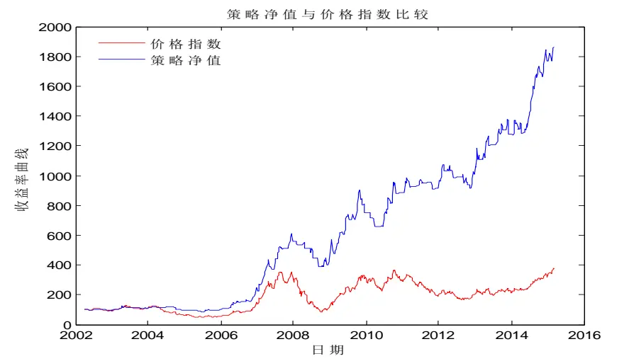
数据来源：国泰君安证券研究，WIND

## 2.1.1. 测试时间窗口 2010 年 1 月 1 日-2015 年 3 月 6 日

从 2010年开始整个 A股市场进入震荡偏下行的行情，但中小盘从 2012年底转为上行趋势，市场进入所谓的结构化行情。我们用5周线方法测试在这种结构化行情下策略的表现。

从策略的超额收益比较可以看到，28 个申万一级行业中，有 22 个行业策略的累计收益跑赢了行业指数的区间涨跌幅，而有六个行业的策略累计收益跑输行业指数区间涨跌幅，包括计算机、传媒、医药生物、休闲服务、家用电器和食品饮料。28个行业的平均涨幅 34%，而策略的平均涨幅 73%，超额收益 39%。

从策略的绝对收益角度来看，只有食品饮料收益为负，其他 27 个行业全部取得了正收益，其中国防军工累计收益率 158%排第一位，排在第二和第三位的分别是汽车 148%和计算机 135%。

买入信号胜率同样偏低，只有汽车的胜率为 54%，其他 27 个行业胜率没有超过 50%，平均胜率仅为 39%。

表 3: 策略收益率一览（按累计收益排序，2010年 1 月-2015年 3月）

| 证券名称 | 区间涨跌幅 | 累计收益 | 年化收益率 | 最大回撤 | 买入信号次数 | 胜率 |
| --- | --- | --- | --- | --- | --- | --- |
| 国防军工(申万) | 68% | 158% | 20% | -20% | 30 | 45% |
| 汽车(申万) | 22% | 148% | 19% | -15% | 25 | 54% |
| 计算机(申万) | 149% | 135% | 18% | -27% | 32 | 45% |
| 综合(申万) | 54% | 128% | 17% | -17% | 30 | 48% |
| 公用事业(申万) | 28% | 107% | 15% | -11% | 31 | 50% |
| 机械设备(申万) | 41% | 100% | 14% | -24% | 31 | 37% |
| 电气设备(申万) | 14% | 97% | 14% | -21% | 29 | 43% |
| 传媒(申万) | 122% | 93% | 14% | -27% | 38 | 38% |
| 农林牧渔(申万) | 28% | 92% | 13% | -23% | 28 | 41% |
| 电子(申万) | 59% | 88% | 13% | -20% | 33 | 38% |
| 有色金属(申万) | -12% | 83% | 12% | -20% | 34 | 42% |
| 纺织服装(申万) | 30% | 78% | 12% | -21% | 31 | 47% |
| 商业贸易(申万) | 10% | 77% | 12% | -23% | 29 | 36% |
| 交通运输(申万) | 4% | 71% | 11% | -18% | 30 | 38% |
| 钢铁(申万) | -21% | 69% | 11% | -20% | 31 | 37% |
| 建筑装饰(申万) | 40% | 67% | 10% | -30% | 38 | 30% |
| 非银金融(申万) | 28% | 63% | 10% | -30% | 38 | 26% |
| 轻工制造(申万) | 30% | 61% | 10% | -26% | 33 | 31% |
| 通信(申万) | 12% | 55% | 9% | -19% | 32 | 39% |
| 建筑材料(申万) | 13% | 48% | 8% | -31% | 31 | 33% |
| 银行(申万) | 10% | 45% | 7% | -25% | 32 | 31% |
| 采掘(申万) | -44% | 41% | 7% | -28% | 30 | 38% |
| 房地产(申万) | 19% | 41% | 7% | -27% | 30 | 45% |
| 医药生物(申万) | 84% | 37% | 6% | -26% | 39 | 47% |
| 化工(申万) | -11% | 29% | 5% | -25% | 35 | 35% |
| 休闲服务(申万) | 64% | 28% | 5% | -26% | 37 | 31% |
| 家用电器(申万) | 80% | 28% | 5% | -19% | 37 | 39% |
| 食品饮料(申万) | 22% | -20% | -4% | -51% | 39 | 26% |

数据来源：国泰君安证券研究，WIND。

从食品饮料行业的周 K线图走势来看，五年涨幅 22%，振幅约 60%，整体偏震荡结构，所以 5周线策略累计收益为负 20%，策略发出买入信号39次，胜率仅 26%。

图 5 食品饮料（801120.SI）周 K 线图与 5 周均线(2010.1---2015.3)
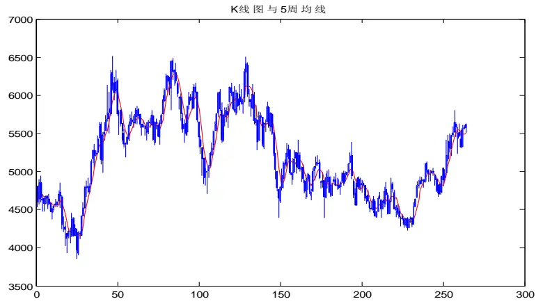
数据来源：国泰君安证券研究，WIND

## 2.2. 行业期初“等额资金”策略

如果在期初给 28 个申万一级行业分配等额资金，之后针对每一个行业按照 5 周线策略操作，那么组合的表现如何？

从 2002 年 4 月至 2015 年 3 月，WIND 全 A 指数上涨 226%，而同期 5周线策略累计涨幅 763%，年化收益率 18.2%，最大回撤为 31%。但如果可以直接投资WIND全A指数的话，用5周均线策略累计涨幅881%，最大回撤 28%，优于行业期初等额资金策略。即使能够投资 WIND全 A，在实际运用中也最好不要把 5周线策略运用到单一标的价格序列，因为均线动量策略对价格的形态有趋势要求，事先无法知道这个价格序列是否一定适用于单均线策略。

图 6 行业“等额资金”策略净值与 WIND 全 A 指数走势比较(2002.4---2015.3)
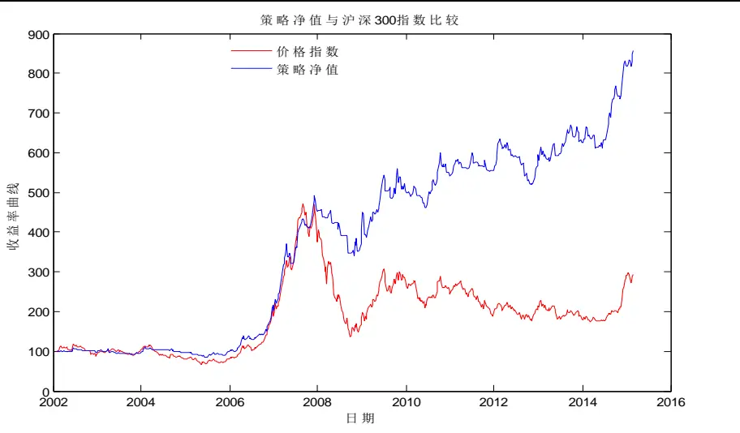
数据来源：国泰君安证券研究，WIND

## 3. 由周均线到日均线

## 3.1.25 日线测评与 5 周线比较

5周线与 25日线从均线定义上没有本质的区别，区别在于频率和精度。假定 $\{\mathsf{p}1,\mathsf{p}2,....,\mathsf{p}25\}$ 为过去 25 个交易日收盘价，假定每周都是 5 个交易日，那么 5周均价定义为：

$$
(\mathrm{~p~}_{5}+\mathrm{p~}_{10}+\mathrm{p~}_{15}+\mathrm{p~}_{20}+\mathrm{p~}_{25})/5
$$

而 25 日均价格定义为：

$$
\frac{1}{25}\sum_{i=1}^{25}\textit{ p }_{i}
$$

从 2002 年 4 月 1 日至 2015 年 3 月 6 日，申万 28 个一级行业分别使用25 日线策略与 5 周线策略测试，基本上绝大多数行业 25 日均线策略的累计收益高于 5周线策略。25日均线策略的平均累计收益高达 1137%，而 5周线策略的平均累计收益 763%。其中国防军工的 25日均线策略累计收益高达 2719%，而 5周均线策略仅为 1364%。相比较 5周均线策略，使用 25 日均线的另一个优点是最大回撤整体有所下降，平均最大回撤由 37%降至 35%。

图 7累计收益比较（25日均线策略 vs 5 周均线策略）
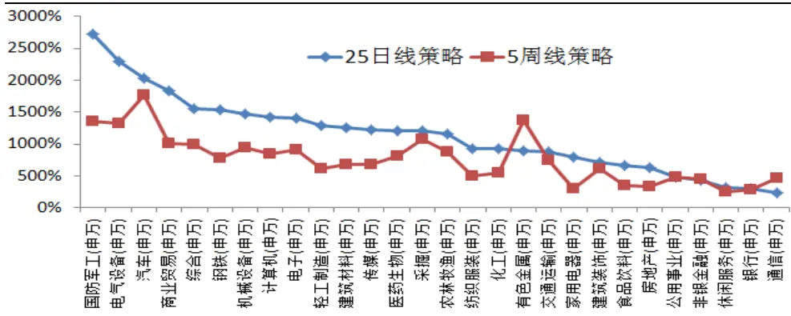
数据来源：国泰君安证券研究，WIND

使用 25 日均线策略平均买入次数 133次，不难发现其买入信号次数较 5周均线策略大幅增加，5周线策略买入信号仅为 76次。这些信号主要因为日 K 线价格会围绕 25 日均线上下波动，每一次上穿都会发出买入信号，同样每一次下穿都会发出卖出信号。

图 8买入信号次数比较（25日均线策略 vs 5周均线策略）
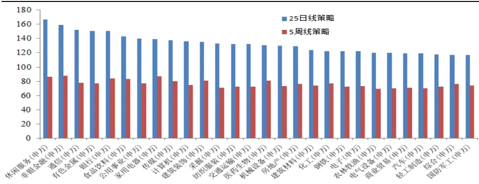
数据来源：国泰君安证券研究，WIND

随着 25 日均线策略买入信号次数的增加，策略的胜率整体下降，平均胜率由 5 周均线的 39%下降到 29%，也就是说使用 25 日均线策略每十次买入，仅有三次获利，其他七次都以亏损告终。

图 9胜率比较（25日均线策略 vs 5周均线策略）
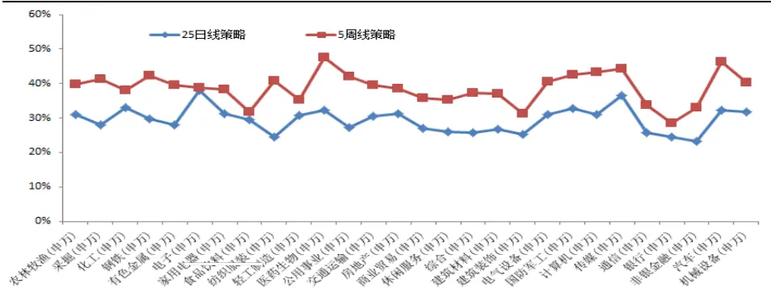
数据来源：国泰君安证券研究

表 4：25日均线策略与 5周均线策略比较

| 25 日线策略 5 周线策略 |  |  |  |  |  |  |  |  |
| --- | --- | --- | --- | --- | --- | --- | --- | --- |
| 证券名称 | 区间涨跌幅 | 累计收益 | 最大回撤 | 买入次数 | 胜率 | 累计收益 最大回撤 | 买入次数 | 胜率 |
| 农林牧渔(申万) | 142% | 1156% | -29% | 120 | 31% 880% | -32% | 69 | 40% |
| 采掘(申万) | 138% | 1200% | -32% | 133 | 28% 1081% | -43% | 71 | 41% |
| 化工(申万) | 122% | 921% | -33% | 122 | 33% | 547% -26% | 77 | 38% |
| 钢铁(申万) | 122% | 1537% | -35% | 122 | 30% | 778% -44% | 72 | 42% |
| 有色金属(申万) | 215% | 902% | -50% | 151 | 28% | 1366% -48% | 77 | 39% |
| 电子(申万) | 141% | 1403% | -32% | 122 | 38% | 904% -32% | 73 | 39% |
| 家用电器(申万) | 403% | 797% | -43% | 139 | 31% | 306% -41% | 87 | 38% |
| 食品饮料(申万) | 343% | 663% | -36% | 143 | 30% | 343% -51% | 83 | 32% |
| 纺织服装(申万) | 101% | 926% | -33% | 132 | 24% | 492% -37% | 72 | 41% |
| 轻工制造(申万) | 109% | 1293% | -29% | 118 | 31% | 618% -26% | 72 | 35% |
| 医药生物(申万) | 412% | 1208% | -27% | 131 | 32% | 806% -26% | 81 | 48% |
| 公用事业(申万) | 144% | 481% | -26% | 140 | 27% | 490% -26% | 77 | 42% |
| 交通运输(申万) | 126% | 884% | -30% | 132 | 31% | 743% -29% | 72 | 39% |
| 房地产(申万) | 217% | 635% | -54% | 129 | 31% | 340% -55% | 76 | 39% |
| 商业贸易(申万) | 279% | 1836% | -23% | 119 | 27% | 1004% -34% | 71 | 36% |
| 休闲服务(申万) | 263% | 322% | -55% | 167 | 26% | 255% | -42% 86 | 35% |
| 综合(申万) | 149% | 1562% | -31% | 117 | 26% | 993% | -41% 76 | 37% |
| 建筑材料(申万) | 181% | 1258% | -29% | 124 | 27% | 682% | -35% 74 | 37% |
| 建筑装饰(申万) | 167% | 719% | -29% | 135 | 25% | 620% | -33% 81 | 31% |
| 电气设备(申万) | 479% | 2299% | -23% | 120 | 31% | 1320% | -26% 70 | 41% |
| 国防军工(申万) | 426% | 2719% | -30% | 117 | 33% | 1364% | -39% 74 | 42% |
| 计算机(申万) | 503% | 1422% | -35% | 136 | 31% | 847% | -34% 75 | 43% |
| 传媒(申万) | 448% | 1226% | -29% | 138 | 36% | 678% | -29% 80 | 44% |
| 通信(申万) | 147% | 232% | -38% | 152 | 26% | 461% | -28% 78 | 34% |
| 银行(申万) | 291% | 301% | -49% | 151 | 25% | 279% | -54% 84 | 29% |
| 非银金融(申万) | 386% | 438% | -56% | 159 | 23% | 441% | -60% 88 | 33% |
| 汽车(申万) | 279% | 2038% | -38% | 119 | 32% | 1763% | -37% 70 | 46% |
| 机械设备(申万) | 298% | 1469% | -27% | 130 | 32% | 952% | -35% 73 | 40% |
| 统计均值 | 251% | 1137% | -35% | 133 | 29% | 763% -37% | 76 | 39% |

数据来源：国泰君安证券研究，WIND

## 3.2.“期初等额资金”策略

如果在期初给 28 个申万一级行业分配等额资金，之后针对每一个行业按照 25 日均线策略操作，那么组合的表现如何？

从 2002 年 4 月 1 日至 2015 年 3 月 6 日，WIND 全 A 指数上涨 226%，而同期 25 日均线策略累计涨幅 1137%，年化收益率 21%，但最大回撤为 27%。

图 10 策略净值（25 日均线+等额资金）与 WIND 全 A 指数走势比较(2002.4---2015.3)
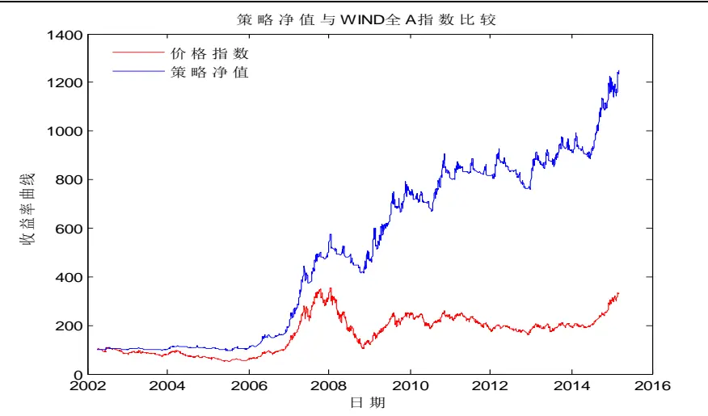
数据来源：国泰君安证券研究，WIND

## 3.3. 牛熊分界值+取强舍弱+动态等市值管理策略

“取强舍弱”策略顾名思义就是一直持有强势行业而卖掉弱势行业，卖掉弱势行业的资金在强势行业中再分配，使得当下所持有的各个行业市值保持相等，为了达到这个目的，一些情况下需要卖掉部分市值特别大的强势行业以确保各行业达到等市值。此策略中所谓的强势行业从单均线角度来定义，即价格站在单均线之上为强势，反之当行业价格站在单均线之下为弱势。引入“取强舍弱”策略的原因在于，价格站上单均线是一波上涨趋势开始的必要条件，但并非充分条件，所以站上单均线买入等于参与这种趋势上涨的可能性；同样，价格跌破单均线是一波下跌趋势开始的必要条件，而非充分条件，先选择离场避开可能持续下跌风险，如果判断错误出现踏空，则在价格再次站上均线时买入。

如果简单运用上述这个策略，选用申万 28 个一级行业进行测试，从 2002年 4月至 2015年 3月，策略累计涨幅 954%，年化收益率 20%，但最大回撤高达 55%。如此大幅回撤的出现在 2008年，也就是在 2008年的单边大幅下跌中，只要有行业站上 25 日均线，就全仓杀入的话，经常出现买入被套的局面。所以，需要一个简单的指标来度量整个市场的状态，尽量避免参与熊市中的弱势反弹，所以我们使用一个值称之为“牛熊分界值”。

牛熊分界值，为一自然数，介于 1和可投资标的总数之间，表征牛熊分界线。以 28个申万一级行业为例，当牛熊分界值为 1，为最低要求，只要存在任何一个行业在其均线之上，市场即为强势；反之牛熊分界值为28，为最高要求，必须所有的 28 个一级行业都站在自身的均线之上，才算是强势市场。

买卖操作的具体实现：

进场的必要条件：当日站上 N日均线的标的数必须大于或等于牛熊分界值。

触发买卖条件：如果当日（1）新增站上 N日均线的标的，或（2）组合中出现标的跌破 N日均线。

% 首先，以当日收盘价计算投资组合所有标的总市值，记为 AUM；

% 其次，统计当日收盘后站上 N 日均线的标的，总数记为 K，那么平均每个标的需要分担等市值为 AUM/K；

% 最后，根据当日收盘价所计算的每个标的当日市值，和 AUM/K进行比较，基于当日收盘价，计算每个标的应该买入多少或卖出多少股。

% 然后以下一个交易日的开盘价进行买卖操作。

表 5：牛熊分界值策略统计（申万一级行业）

| 牛熊分界值 | 累计收益 | 年化收益率 | 最大回撤 | 触发调仓次数 | 换手次数 |
| --- | --- | --- | --- | --- | --- |
| 1 | 954% | 20% | -55% | 1965 | 1250 |
| 2 | 830% | 19% | -44% | 1846 | 1067 |
| 3 | 1025% | 21% | -36% | 1728 | 938 |
| 4 | 843% | 19% | -47% | 1630 | 843 |
| 5 | 962% | 20% | -42% | 1535 | 757 |
| 6 | 1037% | 21% | -40% | 1477 | 705 |
| 7 | 1060% | 21% | -37% | 1415 | 656 |
| 8 | 1200% | 22% | -35% | 1361 | 612 |
| 9 | 957% | 20% | -35% | 1322 | 583 |
| 10 | 970% | 20% | -35% | 1283 | 556 |
| 11 | 1049% | 21% | -33% | 1237 | 524 |
| 12 | 1233% | 22% | -28% | 1183 | 486 |
| 13 | 1074% | 21% | -28% | 1157 | 478 |
| 14 | 1095% | 21% | -26% | 1119 | 456 |
| 15 | 1312% | 23% | -25% | 1085 | 440 |
| 16 | 1249% | 22% | -26% | 1045 | 423 |
| 17 | 1190% | 22% | -21% | 1003 | 403 |
| 18 | 1214% | 22% | -21% | 964 | 385 |
| 19 | 1221% | 22% | -21% | 916 | 364 |
| 20 | 1290% | 23% | -19% | 865 | 342 |
| 21 | 1147% | 22% | -22% | 824 | 328 |
| 22 | 994% | 20% | -21% | 774 | 320 |
| 23 | 828% | 19% | -18% | 723 | 312 |
| 24 | 679% | 17% | -16% | 664 | 308 |
| 25 | 650% | 17% | -19% | 595 | 301 |
| 26 | 511% | 15% | -19% | 489 | 280 |
| 27 | 448% | 14% | -20% | 370 | 262 |
| 28 | 343% | 12% | -19% | 202 | 202 |

数据来源：国泰君安证券研究，WIND

牛熊分界值=15，策略累计收益达到最大值 1312%，最大回撤 25%。随着牛熊分界值的变大，累计收益趋势在变小，最大回撤也在变小。毕竟参与的机会减少了，胜率相对提高了。但很多机会也错过了，所以累计收益少之又少。

图 11 策略累计收益 vs牛熊分界值(25日均线+申万一级行业)
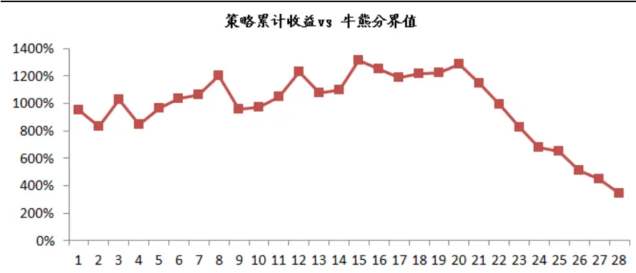
数据来源：国泰君安证券研究，WIND

图 12 最大回撤 vs 牛熊分界值(25 日均线+申万一级行业)
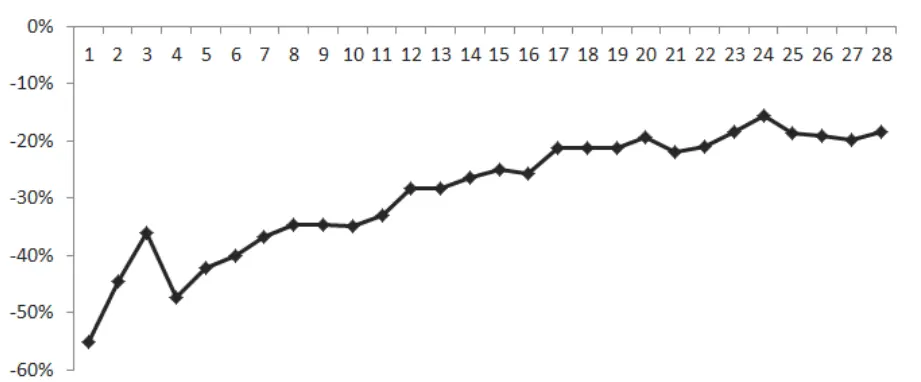
数据来源：国泰君安证券研究，WIND

如果用申万二级行业来做这个策略的话，考虑到数据的完整性，从 2002年 4月至今有完整价格序列的行业为 89个。

测试发现，如果选用 89 个申万二级行业，当牛熊分界值为 29 的时候，“取强舍弱”动态资金分配策略取得累计收益高达 1738%，但最大回撤仍然较大为 33%。之后随着牛熊分界值的增大，参与机会越来越少，最极端的情况，只有所有的 89个二级行业都站到 25日均线才进场的话，策略累计收益触及到最低值 79%。同样，这种极端情况下最大回撤也触及最小值 11%。综合来看，用二级行业做“取强舍弱”策略效果要好于一级行业。

图 13 策略累计收益 vs 牛熊分界值(25 日均线+申万二级行业)

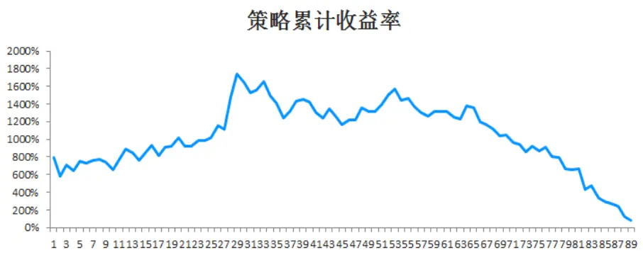
数据来源：国泰君安证券研究

图 14 最大回撤 vs牛熊分界值(25日均线+申万二级行业)
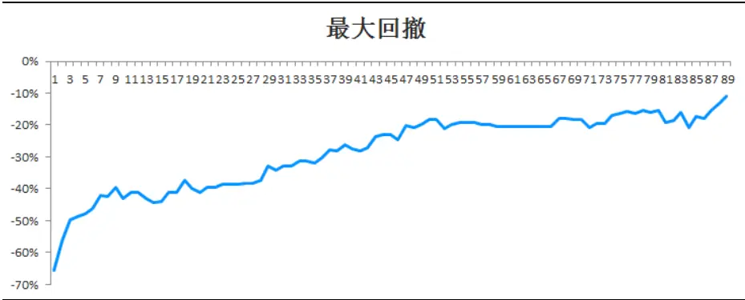
数据来源：国泰君安证券研究

牛熊分界值=29，策略累计收益达到最大值 1738%，最大回撤 33%

图 15 策略净值与 WIND 全 A 指数走势比较(2002.4---2015.3，牛熊分界值 29/89)
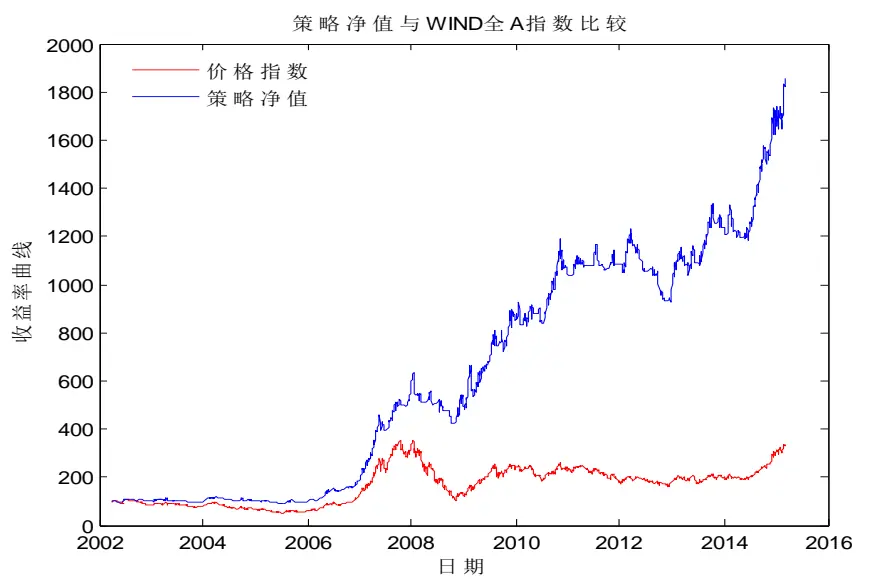
数据来源：国泰君安证券研究

牛熊分界值=54的话，累计收益 1442%，最大回撤 19%。如果比较在意最大回撤的话，牛熊分界值取到三分之二位臵，可以取得相对不错的累计收益，而最大回撤显著下降。

图 16 策略净值与 WIND 全 A 指数走势比较(2002.2---2015.3，牛熊分界值 54/89)
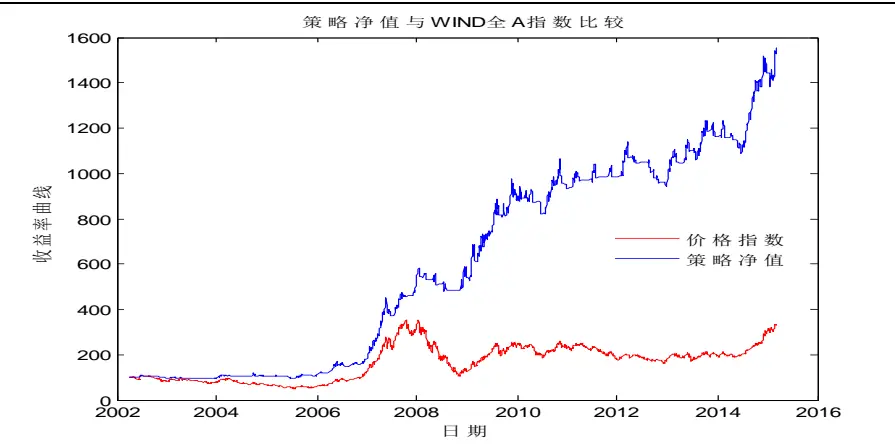
数据来源：国泰君安证券研究

综合比较发现使用“取强舍弱”的动态策略，整体收益水平高于静态的行业等额资金分配策略。

## 4. 不同均线策略测评

选取 5 周线或者 25 日均线进行单均线动量测评，并非此均线动量效果最优，只是这类均线比较常用。在报告中也对其他均线从 5日线均线到250日均线做测评。同样选用 28个申万一级行业，进行期初等额资金配臵，测试窗口从 2002年 4月 1日至 2015年 3月 6日，交易费率同样采用万分之五，无风险收益率为 4%。

综合来看 15 日均线动量策略累计收益 1458%，为最大值；20 日均线动量策略累计收益 1435%排第二位。当均线周期大于 55 之后，累计收益基本上落在 800%到 1000%之间，并且变化平缓，换言之，随着均线周期数增大，均线动量策略累计收益对均线周期变化的敏感度变小。

图 17 不同日均线策略累计收益（期初等额资金配臵）
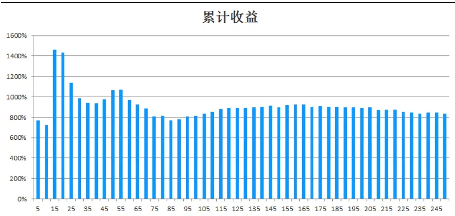
数据来源：国泰君安证券研究，WIND

5日均线动量策略平均买入信号次数 379次，10日均线降至 245次，到年线 250 买入信号次数达到最小值 29。买卖次数决定了资金操作级别。

5日均线比较适合小资金操作，而大资金可以用短期均线降低持仓成本。

图 18 不同日均线买卖信号次数（28个一级行业平均值）
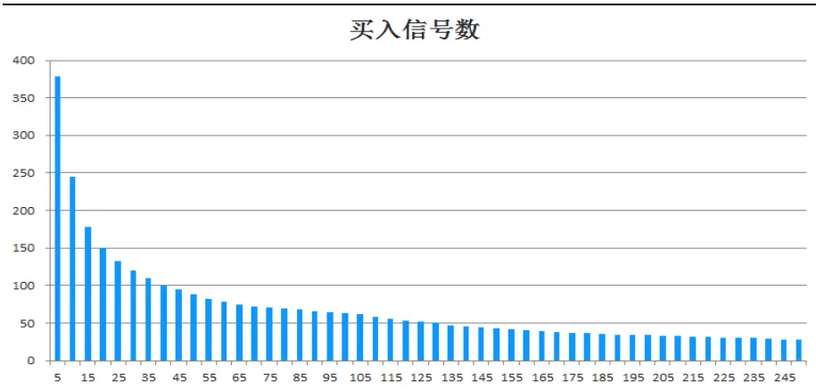
数据来源：国泰君安证券研究，WIND

胜率总体随着均线周期增大而减小，5 日均线动量策略胜率 39%为最大值。到了中长期均线胜率普遍降至 20%以下，这就意味着用中长期均线做动量策略多数时间比较有挫败感，败多胜少。但这种策略的可贵之处就在于小亏大赚。

图 19 不同日均线胜率比较（28个一级行业平均值）
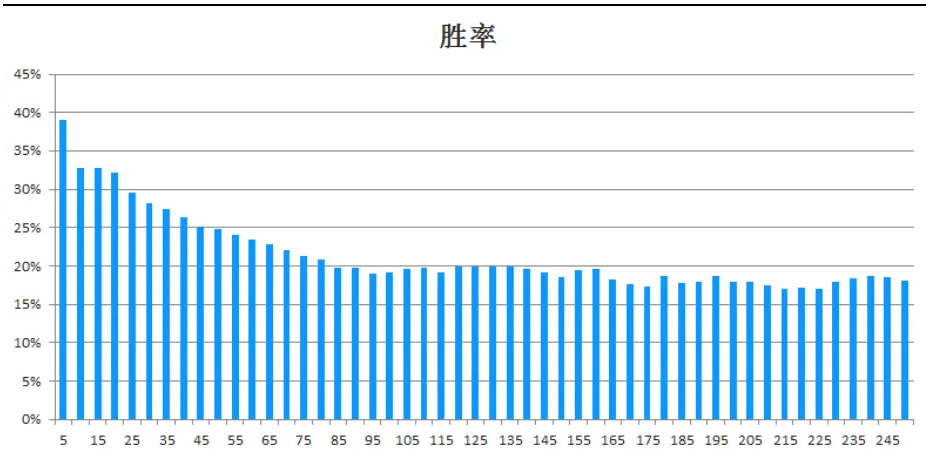
数据来源：国泰君安证券研究，WIND

## 5. 总结

## 5.1. 策略比较

对各种策略综合比较来看（28个申万一级行业等额资金策略）：

25日均线优于 5周线（累计收益 1137% > 763%，代价： 平均交易次数133 > 76）。25日均线策略的累计收益 1137%，远高于 5周线策略的累计收益 763%。25日均线优于 5周均线原因很简单，25日均线需要每个交易日观察是否触发买卖信号，而 5周均线观察频率为周度，每一个动量点对应的买卖位臵滞后于 25日均线，所以 25日线均线策略的累计收益会优于 5周线。累计收益的提升需要付出的代价为交易次数由 5周线的76次买入信号提高到 25日均线的 133次买入信号。

15日均线优于 25日均线（累计收益 1458% > 1137%，代价：平均交易次数 178 > 133）。实际测试结果发现 15 日均线是 5到 250日均线系统中策略累计收益最高的一根均线，28个一级行业等额资金配臵策略累计收益达到 1458%，远高于 25 日均线策略的 1137%。15 日均线为什么是最优的，其实没有必然的逻辑来证明其最优性，这个结果是基于数据挖掘得到的。至于未来五年、十年乃至二十年是不是还是 15 日均线最优是不可知的。所以站在当下从策略累计收益最大化角度，我们无法知道该选取哪一条均线，如果选取 15 日均线，也仅仅是一个优化结果。实际运用均线策略，首先根据资金级别选择一条相适应的均线，资金级别越大采用的均线周期也越大，从历史统计结果来看，策略的累计收益随着均线周期的增大变得不敏感，也就是说，当均线周期数大于一定值后，策略累计收益比较稳定，而且收益都不错，都在 10倍左右。

牛熊分界值策略优于等额资金策略（25 日均线）（累计收益 1738% >1137%，代价调仓次数大幅增加）。牛熊分界值策略优于等额资金策略，主要是加入了一个对市场强弱的判断指标，当市场偏弱时，即使有行业站到了均线之上，也不参与，因为市场处于弱势时，行业的反弹一般持续性较差，这样避免了参与一些带来损失的买入机会。至于动态等市值管理仅是用来确保出现买卖信号能够给出一个清晰操作，未必是最优的。

## 5.2.单均线动量策略优缺点分析

优点分析：

1、信号清晰简单。价格站上单均线或者跌破单均线，是价格走势中再普通不过的信号，容易识别和运用，不需要使用复杂的模型和复杂的数学公式，简单的东西往往折射出最基本的规律。

2、交易纪律得以有效执行。纵览全球交易大师的著作，当他们分享自己的成功经验时，都会提到必须坚定执行交易纪律。什么是交易纪律应该是一个因人而异的问题，并不存在唯一答案。但交易纪律能否执行却体现了人性的贪婪与恐惧，有时候价格跌破了单均线，却没有卖出离场，原因是贪婪心在起作用，期待着价格还会反弹甚至创新高；同样当价格没有跌破单均线，但涨幅已经很大，心中开始担忧行情可能要结束了，这种担忧本质就是恐惧已经到手的盈利可能部分失去，于是选择了卖出离场，但卖出之后也许就错过了之后更疯狂的上涨。在牛市中，没有多少人能一直拿到顶部附近，往往选择了中途下车。比较有意思的是，如果中途选择下车，之后很多人不会再进场，究其原因在于下车之时已经认为价格要见顶，一旦有了看空的心态，价格再上涨会感觉更要见顶，由此更不敢追进，这种“恐惧”心态往往会伴随着价格同步上行，结果就是容易错过一波大行情。交易纪律必须执行的本质就是克服人性的贪婪恐惧，摒弃掉“感觉”的成份，因为绝大多数人的感觉是由潜意识主导，而潜意识会让这种感觉不够准确。

3、策略成本低。不需调研上市公司、不需研究宏观经济运行、不必臆想未来究竟是牛市还是熊市，只需跟踪指标变化从而把握市场趋势。不会错过大牛市，但会避开大熊市。

4、无参数拟合。参数拟合的模型如果有效必定基于一个假设：价格走势会重复。这里需要弄清楚什么在重复？有一点毋庸臵疑价格走势有很多特定的模式，这些模式是盈利的关键点。如果从这个角度去寻找重复的模式是有效的。如果基于过去的一段走势状态，拟合参数使得策略表现优异，从而寄希望于未来也会有效，这就会承担很大的风险，最大风险在于模型失效之时未必能够清晰知道为什么失效。从这个角度来看，单均线的优点在于，其有效或无效的风险点非常清楚。趋势必定有效，震荡则无效。市场由趋势和震荡构成，趋势时间虽短但贡献了也许 80%以上的涨跌幅，震荡时间虽长但仅构成了 20%的涨跌幅度。这就是这种简单动量模型背后运行有效的机理。

## 缺点分析：

1、这种策略的缺点在于忽略掉所有其他信息，完全生硬地跟随市场的脚步，其实在一些情况下，基于其他信息对市场能够做出相对可靠判断。当然这种带有主观判断的预判操作从本质上和单均线策略本身相矛盾的，但这种“严格信号买卖系统”加上“灵活预判操作”才能真正意义上把投资组合的收益做到极致。

2、在实战过程中，在单均线信号的基础上，有很多灵活的交易策略可做，而这些操作会大幅提升最终的收益。譬如在一个上涨行情中，虽然单均线没有发出卖出信号，但通过对次级别或者次次级别的进一步分析，可以做个短差，哪怕这个短差操作仅贡献了 5 个点的收益，最终放到整个策略中也是可观的。

## 5.3.技术指标“无效”定性分析

技术指标有效还是无效一直是一个颇有争议的问题，虽然没有严格的统计数据，但大多数投资者应该认为技术指标是无效的。背后原因是投资者对技术指标的“预期”过高。每一个开始学习技术分析的投资者最初都是在寻找一个神奇的指标，这个神奇指标有着 100%的胜率，或者 80%以上的胜率，但找来找去，绝大数投资者选择了放弃，因为实践的结果证明是找不到这样的指标。不是投资者不够聪明，而是价格走势双属性决定了任何技术指标如果贯穿整个价格序列不可能存在高胜率。

如果用属性来刻画价格走势的话，趋势属于阳属性，震荡属于阴属性，这里的趋势包括单边下跌和单边上涨，而不仅仅是上涨为阳。

$$
\begin{array}{r}\mathcal{A}|\{\hat{\mathcal{H}}\cdot\hat{\mathcal{H}}\cdot\frac{\pm\hat{\mathcal{H}}}{\mathcal{H}}\pm\frac{\pm\hat{\mathcal{H}}}{\mathcal{H}}\frac{1}{\mathcal{H}}=\frac{\pm\hat{\mathcal{H}}}{\mathcal{H}}\frac{\pm\hat{\mathcal{H}}}{\mathcal{H}}\big(\mathrm{~\mathbb{H}~}\big)\ \mathrm{~\mathbb{+~}~}\frac{\gamma\mathbb{F}}{\mathcal{H}}\frac{\mp\hat{\mathcal{H}}}{\mathcal{H}}\big(\mathrm{~\mathbb{H}~}\big)\ \mathrm{~\mathbb{+~}~}\frac{\pm\hat{\mathcal{H}}}{\mathcal{H}}\frac{\pm\hat{\mathcal{H}}}{\mathcal{H}}\big(\mathrm{~\mathbb{H}~}\big)\ \mathrm{~\mathbb{+~}~}\frac{\gamma\mathbb{H}}{\mathcal{H}}\frac{\mp\hat{\mathcal{H}}}{\mathcal{H}}\big(\mathrm{~\mathbb{H}~}\big)\ \mathrm{~\mathbb{+~}~}\frac{\gamma\mathbb{H}}{\mathcal{H}}\frac{\mp\hat{\mathcal{H}}}{\mathcal{H}}\big(\mathrm{~\mathbb{H}~}\big)\ \mathrm{~\mathbb{+~}~}\frac{\gamma\mathbb{H}}{\mathcal{H}}\frac{\mp\hat{\mathcal{H}}}{\mathcal{H}}\big(\mathrm{~\mathbb{H}~}\big)\ \mathrm{~\mathbb{+~}~}\frac{\gamma\mathbb{H}}{\mathcal{H}}\frac{\mp\hat{\mathcal{H}}}{\mathcal{H}}\big(\mathrm{~\mathbb{H}~}\big)\ \mathrm{~\mathbb{+~}~}\frac{\gamma\mathbb{H}}{\mathcal{H}}\frac{\mp\hat{\mathcal{H}}}{\mathcal{H}}\big(\mathrm{~\mathbb{H}~}\big)\ \mathrm{~\mathbb{+~}~}\frac\gamma\mathbb{H}\end{array}
$$

任何单一技术指标要么为阳属性要么为阴属性，必然难以同时兼顾阴阳两种走势。那么在实战中如何兼顾两种属性？一般来说有两种解决方案：第一、存在一种方法能够预判价格走势的转换，如果价格走势由趋势转为震荡，则调整动量策略为反转策略；反之，如果价格震荡完成，新一轮的趋势行情展开，则由反转策略转为动量策略。如果能做到这一点这就是一个完美的量化策略。但实际上预判走势类型的转换也相当不易。第二、寻找特定的价格模式，选用适用的操作策略。这种投资交易方法更像是猎人捕获猎物，价格走势一旦呈现某种特征或某种模式，也就是猎物出现，这时候就选用合适的捕猎工具出击。在实际交流中发现，很多股市、期货的交易投资高手多采用此模式。这种方法分为两种层次，第一种胜率极高，高的可以达到 90%以上，不出则已，出必胜、行必果。另一种层次看上去低一些，胜率不高，经常也就是 50%左右，但盈亏比极高。其实很多有效的策略都是胜率普通但盈亏比极高。

## 5.4.单均线动量策略胜率提高探讨

单均线动量策略是一种简单易行的交易策略，既不需要分析市场走势也不需要预测市场，这是其优点，运用在申万二级行业上，采用“牛熊分界值”策略的话，十三年可以取得 17 倍的收益。缺点就是完全固化的操作模式，实际上有很多可以改进的地方，譬如对买卖点进行条件判断，什么样的买入信号有参与价值？什么样的买入信号可能就是下跌中的反弹？通过提高买入判断的准确性，从而提高胜率。同样当下跌信号出现时，对这些信号进一步判断，哪些情况可以不急着卖出，避免踏空。

图 20 买入信号之下跌趋势中的反弹
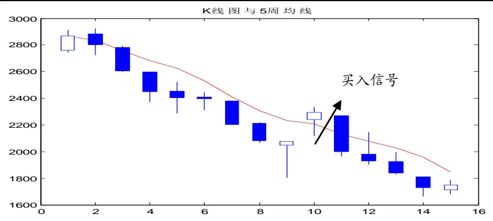
数据来源：国泰君安证券研究

图 21 买入信号之横盘震荡
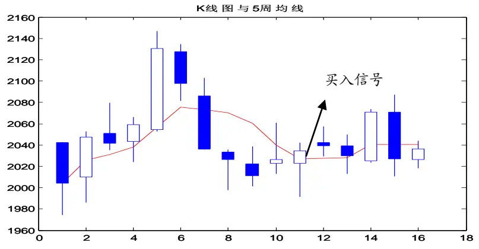
数据来源：国泰君安证券研究

通过加入一些条件，可以提高单均线的策略，但也可能错失一波大行情，这是单纯基于价格构建策略的矛盾所在。需要融入成交量和一些基本面因素可以更好地解决这个问题。后续研究会在这个方向做进一步深入探讨。

## 本公司具有中国证监会核准的证券投资咨询业务资格

## 分析师声明

作者具有中国证券业协会授予的证券投资咨询执业资格或相当的专业胜任能力，保证报告所采用的数据均来自合规渠道，分析逻辑基于作者的职业理解，本报告清晰准确地反映了作者的研究观点，力求独立、客观和公正，结论不受任何第三方的授意或影响，特此声明。

## 免责声明

本报告仅供国泰君安证券股份有限公司（以下简称“本公司”）的客户使用。本公司不会因接收人收到本报告而视其为本公司的当然客户。本报告仅在相关法律许可的情况下发放，并仅为提供信息而发放，概不构成任何广告。

本报告的信息来源于已公开的资料，本公司对该等信息的准确性、完整性或可靠性不作任何保证。本报告所载的资料、意见及推测仅反映本公司于发布本报告当日的判断，本报告所指的证券或投资标的的价格、价值及投资收入可升可跌。过往表现不应作为日后的表现依据。在不同时期，本公司可发出与本报告所载资料、意见及推测不一致的报告。本公司不保证本报告所含信息保持在最新状态。同时，本公司对本报告所含信息可在不发出通知的情形下做出修改，投资者应当自行关注相应的更新或修改。

本报告中所指的投资及服务可能不适合个别客户，不构成客户私人咨询建议。在任何情况下，本报告中的信息或所表述的意见均不构成对任何人的投资建议。在任何情况下，本公司、本公司员工或者关联机构不承诺投资者一定获利，不与投资者分享投资收益，也不对任何人因使用本报告中的任何内容所引致的任何损失负任何责任。投资者务必注意，其据此做出的任何投资决策与本公司、本公司员工或者关联机构无关。

本公司利用信息隔离墙控制内部一个或多个领域、部门或关联机构之间的信息流动。因此，投资者应注意，在法律许可的情况下，本公司及其所属关联机构可能会持有报告中提到的公司所发行的证券或期权并进行证券或期权交易，也可能为这些公司提供或者争取提供投资银行、财务顾问或者金融产品等相关服务。在法律许可的情况下，本公司的员工可能担任本报告所提到的公司的董事。

市场有风险，投资需谨慎。投资者不应将本报告为作出投资决策的惟一参考因素，亦不应认为本报告可以取代自己的判断。在决定投资前，如有需要，投资者务必向专业人士咨询并谨慎决策。

本报告版权仅为本公司所有，未经书面许可，任何机构和个人不得以任何形式翻版、复制、发表或引用。如征得本公司同意进行引用、刊发的，需在允许的范围内使用，并注明出处为“国泰君安证券研究”，且不得对本报告进行任何有悖原意的引用、删节和修改。

若本公司以外的其他机构（以下简称“该机构”）发送本报告，则由该机构独自为此发送行为负责。通过此途径获得本报告的投资者应自行联系该机构以要求获悉更详细信息或进而交易本报告中提及的证券。本报告不构成本公司向该机构之客户提供的投资建议，本公司、本公司员工或者关联机构亦不为该机构之客户因使用本报告或报告所载内容引起的任何损失承担任何责任。

## 评级说明

## 1.投资建议的比较标准

投资评级分为股票评级和行业评级。

以报告发布后的12个月内的市场表现为比较标准，报告发布日后的12个月内的公司股价（或行业指数）的涨跌幅相对同期的沪深300指数涨跌幅为基准。

## 2.投资建议的评级标准

报告发布日后的 12 个月内的公司股价（或行业指数）的涨跌幅相对同期的沪深300指数的涨跌幅。

| 评级 |  | 说明 |
| --- | --- | --- |
| 股票投资评级 | 增持 | 相对沪深 300指数涨幅15%以上 |
|  | 谨慎增持 | 相对沪深300指数涨幅介于5%～15%之间 |
|  | 中性 | 相对沪深300指数涨幅介于-5%～5% |
|  | 减持 | 相对沪深300指数下跌5%以上 |
| 行业投资评级 | 增持 | 明显强于沪深 300 指数 |
|  | 中性 | 基本与沪深300指数持平 |
|  | 减持 | 明显弱于沪深 300指数 |

## 国泰君安证券研究

|  | 上海 | 深圳 | 北京 |
| --- | --- | --- | --- |
| 地址 | 上海市浦东新区银城中路168号上海 银行大厦29层 | 深圳市福田区益田路 6009 号新世界 商务中心34层 | 北京市西城区金融大街 28 号盈泰中 心2号楼10层 |
| 邮编 | 200120 | 518026 | 100140 |
| 电话 | （021)38676666 | (0755)23976888 | (010)59312799 |
|  | E-mail: gtjaresearch@gtjas.com |  |  |