[Table_Title] 2015.04.26

# 基于组合权重优化的风格中性多因子选股策略

## －－数量化专题之五十七

刘富兵（分析师）

## 李辰（研究助理）

8 021-38676673

021-38677309

liufubing008481@gtjas.com

lichen@gtjas.com

证书编号 S0880511010017

S0880114060025

## 本报告导读：

基于股票组合的权重优化方法，构建市值中性、行业中性、风格中性的最优投资组合，可获得稳健的超额收益。

## 摘要：

[Table_Summary] • 任意股票都在同一时刻暴露于多种不同的风险因素下，它们之间的共同作用形成了股票价格的波动。通过对不同风险因子的梳理研究，可实现对股票收益来源的分解剥离，从而定量的研究股价波动的成因。

- 量化对冲策略的目标是追求稳健的绝对收益，最优投资组合的构建是一种完美的平衡状态，投资经理应将组合充分暴露于阿尔法因子下，同时剔除其余不稳定的风格因素干扰。

- 通过股票组合的权重优化，实现了市值中性、行业中性、风格中性约束条件下的最优投资组合构建，获取稳健的超额收益。

- 基于组合权重优化的风格中性多因子选股策略，自 2010年1月至 2015 年 3 月，实现年化 12.73%的超额收益，最大回撤2.09%，信息比率 4.21。

金融工程

## 金融工程团队：

刘富兵：（分析师）

电话：021-38676673

邮箱：liufubing008481@gtjas.com

证书编号：S0880511010017

赵延鸿：（分析师）

电话：021-38674927

邮箱：zhaoyanhong@gtjas.com

证书编号：S0880515030004

耿帅军：（分析师）

电话：010-59312753

邮箱：gengshuaijun@gtjas.com

证书编号：S0880513080013

## 刘正捷：（分析师）

电话：0755-23976803

邮箱：liuzhengjie012509@gtjas.com

证书编号：S0880514070010

吴晶：（分析师）

电话：021-38676720

邮箱：wujing@gtjas.com

证书编号：S0880514110001

## 李雪君：（研究助理）

电话：021-38675855

邮箱：lixuejun@gtjas.com

证书编号：S0880114090056

王浩：（研究助理）

电话：021-38676434

邮箱：wanghao014399@gtjas.com

证书编号：S0880114080041

陈奥林：（研究助理）

电话：021-38674835

邮箱：chenaolin@gtjas.com

证书编号：S0880114110077

李辰：（研究助理）

电话：021-38677309

邮箱：lichen@gtjas.com

证书编号：S0880114060025

## [Table_R相关报告

《50、500 期货降临，你准备好了吗？》2015.04.10

《借道 QDII，分享港股盛宴》2015.04.10

## 1. 引言

多因子选股作为量化投资研究领域的经典模型，在海内外各类投资机构均受到广泛研究和实践应用。在国内，自 2010 年沪深 300 股指期货上线以来，以多因子选股为代表的阿尔法对冲策略也逐渐走入了公众的视野。然而在 2014年 12月的市场行情中，阿尔法对冲策略却遭遇了重大挫折，究其原因不难发现，组合带有过于明显的市值风格特征是导致策略收益大幅波动的主要原因。

本篇报告有别于传统的多因子研究，我们并未将重点放在阿尔法因子的挖掘上，而是着重研究了股票组合的权重优化对策略风格特征的影响。我们通过对股票组合的权重优化计算，找到了在市值中性、行业中性、风格因子中性约束下的最优投资组合，获得了稳健的超额收益。

在多因子模型中，决定策略收益稳健性的关键步骤正在于股票组合的权重配置。因此，从量化对冲策略追求收益稳定性的角度而言，组合权重优化对多因子模型起着至关重要的作用。

从具体的研究思路而言，我们从结构化多因子风险模型的角度出发，利用 BARRA 风险因子有效性的检验方法，构建了基于 30类行业因子、9类风格因子的结构化多因子风险模型，奠定了预测股票组合波动率的基础。之后，我们通过对纯因子股票组合的研究，考察了各类因子阿尔法性质的强弱，并解释了因子背后的经济、金融学逻辑。最后，我们通过股票组合的权重优化计算，得到了市值中性、行业中性、风格中性约束下的最优投资组合。

实证检验表明，通过对股票组合风格特征的约束，策略的收益稳定性大幅提升。自 2010 年起策略年化收益率为 12.73%，最大回撤为 2.09%，信息比率为 4.21。并且，归因分析结果也表明，风格中性的组合配置方式，对策略收益率特征起到了决定性的影响。

## 2. 结构化多因子风险模型

任意股票在同一时刻都暴露于多种不同的风险因素下，它们之间的共同作用形成了股票价格的波动。为了定量的研究各种风险因素的作用，量化风险模型应运而生。

风险模型的意义在于找到股票价格波动的成因，并将股票收益来源进行分解剥离，并实现对未来股票价格波动的预测。

下面我们从结构化多因子风险模型入手，探究 A 股市场的整体风险结构。

## 2.1.结构化多因子风险模型

在结构化多因子风险模型之前，存在 3种基本的风险模型：

第一种基本风险模型即为马科维茨组合方差。在马科维茨的均值方差理论中，投资组合的风险计算需要估计组合中每个资产的波动率及它们之间的相关系数。一般的，当组合中有N 只股票的情况下，需要估计的波动率个数为N ，而需要估计的相关系数的个数则为 $N(\textit{ N }-1)\:/\:2$ 。我们可以将所需要顾及的参数总结到一个协方差矩阵V 中：

$$
V=\begin{bmatrix}\sigma_{_1}^{^2}&\sigma_{_{12}}&\ldots&\sigma_{_{1N}}\\\vdots&\sigma_{_{2}}^{^2}&\ldots&\sigma_{_{2N}}\\\vdots&\ldots&\ldots&\ldots\\\sigma_{_{1N}}&\ldots&\ldots&\sigma_{_{N}}^{^2}\end{bmatrix}
$$

其中 $\sigma_{_{ij}}$ 表示 $r_{i}$ 和 $r_{j}$ 的协方差，并且 $\sigma_{_{ij}}=\sigma_{_{ji}}$ 。协方差矩阵包含了计算组合风险所需的全部要素。然而，该方法的缺点是协方差矩阵中包含了太多的独立参数，无法精确且高效的预测协方差矩阵。

第二种基本风险模型需要对每只股票的波动率 $\sigma_{{n}}$ ，以及股票之间的平均相关系数 $\rho$ 进行估计。这意味着任意两只股票之间的协方差为

$$
\textit{ C o }\nmid_{\textit{ n }}r,\:_{\textit{ m }}r\models\sigma\:_{\textit{ n }}\cdot\sigma\:_{\textit{ m }}\cdot\rho
$$

这种模型的最大优点就是简单，然而该模型忽略了类似行业或者具有相似属性的股票之间的微妙联系。

第三种基本风险模型依赖于历史数据的样本方差和样本协方差。该类模型用T 个时期的样本来估计一个 $N\times N$ 的协方差矩阵，并且要求$T\geq N+1$ ，这就意味着，如果要估计沪深 300 指数成分月度收益率的协方差矩阵，将需要至少超过 25 年的历史数据，这在应用中显然不切实际。

为了克服与改进上述三种基本风险模型的缺陷，结构化多因子风险模型应运而生。结构化风险因子模型利用一组共同因子和一个仅与该股票有关的特质因子解释股票的收益率，并利用共同因子和特质因子的波动来解释股票收益率的波动。结构化多因子风险模型的优势在于，通过识别重要的因子，可以降低问题的规模，只要因子个数不变，即使股票组合的数量发生变化，处理问题的复杂度也不会发生变化。

结构化多因子风险模型首先对收益率进行简单的线性分解，分解方程中包含四个组成部分：股票收益率、因子暴露、因子收益率和特质因子收益率。那么，第 j 只股票的线性分解如下所示：

$$
r_{_{j}}=x_{_{1}}f_{_{1}}+x_{_{2}}f_{_{2}}+x_{_{3}}f_{_{3}}+x_{_{4}}f_{_{4}}...x_{_{K}}f_{_{K}}+u_{_{j}}
$$

其中，r 表示第 j 只股票的收益率； $r_{j}$ $x_{{k}}$ 表示第 j 只股票在第k 个因子上

的暴露（也称为因子载荷）； $f_{k}$ 表示第 j 只股票第k 个因子的因子收益

率（即每单位因子暴露所承载的收益率）；u 表示第 $u_{\mathrm{~}_{j}}$ $j$ 只股票的特质因子收益率。

对于上述方程的时间结构，若我们定义因子暴露是在时刻t 的结果，那么股票收益率、因子收益率和特质因子收益率均为t •1的结果。在模型中，我们以月频率处理截面数据。

那么对于一个包含 N 只股票的投资组合，假设组合的权重为$w=(w_{1},w_{2},\ldots,w_{N})^{T}$ ，那么组合收益率可以表示为：

$$
R_{_P}=\sum_{_{j=1}}^{^N}w_{_n}\cdot(\sum_{_{k=1}}^{^K}x_{_{jk}}f_{_{jk}}+u_{_j})
$$

现在我们假设每只股票的特质因子收益率与共同因子收益率不相关，并且每只股票的特质因子收益率也不相关。那么在上述表达式的基础上，可以得到组合的风险结构为：

$$
\sigma_{_P}=\sqrt{w^{^T}\left(XFX^{^T}+\Delta\right)w}
$$

其中，X 表示N 只个股在K 个风险因子上的因子载荷矩阵 $(N\times K);$

$$
X={\left[\begin{array}{llll}{x_{_{1,1}}}&{x_{_{1,2}}}&{\ldots}&{x_{_{1,k}}}\\{x_{_{2,1}}}&{x_{_{2,2}}}&{\ldots}&{x_{_{2,k}}}\\{\ldots}&{\ldots}&{\ldots}&{\ldots}\\{x_{_{n,1}}}&{x_{_{n,2}}}&{\ldots}&{x_{_{n,k}}}\end{array}\right]}
$$

F 表示K 个因子的因子收益率协方差矩阵(K K• )：

$$
F=\left[\begin{array}{cccc}Var\left(f_{_1}\right)&Cov\left(f_{_1},f_{_2}\right)&\ldots&Cov\left(f_{_1},f_{_k}\right)\\\vdots&&&\vdots\\Cov\left(f_{_1},f_{_2}\right)&Var\left(f_{_2}\right)&\ldots&Cov\left(f_{_2},f_{_k}\right)\\\ldots&\ldots&\ldots&\ldots\\\vdots&&&\vdots\\Cov\left(f_{_k},f_{_1}\right)&Cov\left(f_{_k},f_{_2}\right)&\ldots&Var\left(f_{_k}\right)\\\end{array}\right]
$$

其中，因子收益率的波动率和协方差以因子收益率的日频率数据估算。

- 表示N 只股票的特质因子收益率协方差矩阵 $\left(N\times N\right)$

$$
\Delta=\begin{bmatrix}\left\lceil Var\left(u_{_1}\right)\quad0\quad\ldots\quad0\right.\\\left\lfloor\begin{array}{ccccc}0&&&&\\&&Var\left(u_{_2}\right)&&&0\\&\ldots&&&\ldots&\ldots\\&&&&&\\&0&&&\ldots&Var\left(u_{_k}\right)\end{array}\right\rfloor\end{bmatrix}
$$

由于我们假设每只股票的特质因子收益率相关性为 0，因此• 为对角阵。

结构化多因子风险模型对于投资者的意义并不在于最小化组合风险，而是在给定组合预期收益率的情况下，赋予最优的风险权重。这一点我们会在后面的组合权重优化中讨论。

## 2.2.风险因子筛选

## 2.2.1. 样本空间

与大多海外成熟市场不同，A股市场中市值最大、流动性最好的股票池并不能完整的反应 A股市场的全部特征。因此，我们对风险因子检验的样本空间选取全部 A股标的池。

## 2.2.2. 行业因子

下面我们来讨论风险模型中的共同因子部分，在 BARRA的结构化多因子风险模型中，通常将共同因子分为行业因子和风格因子两部分。

行业因子是风险模型的重要部分，通过对A股市场全部个股的行业划分，反应了个股所属行业的独有特点。我们在申万一级 28 个行业分类的基础上，将非银金融行业划分为证券、保险和多元金融 3个子行业。因此，我们的风险模型包含 30个行业因子，具体为:

表 1: 行业因子分类

| 交通运输 | 休闲服务 | 传媒 | 公用事业 | 农林牧渔 | 化工 |
| --- | --- | --- | --- | --- | --- |
| 医药生物 | 商业贸易 | 国防军工 | 家用电器 | 建筑材料 | 建筑装饰 |
| 房地产 | 有色金属 | 机械设备 | 汽车 | 电子 | 电气设备 |
| 纺织服装 | 综合 | 计算机 | 轻工制造 | 通信 | 采掘 |
| 钢铁 | 银行 | 证券 | 保险 | 多元金融 | 食品饮料 |

数据来源：国泰君安证券研究

## 2.2.3. 风格因子

风格因子是共同因子中另一重要部分，风格因子将在后面我们讨论纯因子组合与股票组合权重优化中起到至关重要的作用。风格因子总共包含9 大类因子、20 个小因子，其中大类因子包含 Beta、Momentum、Size、Earnings Yield、Volatility、Growth、Value、Leverage 和 Liquidity，具体为：

表 2: 风格因子分类构建

| 大类 因子 | 小类 因子 | 因子计算方式 |
| --- | --- | --- |
| Beta | BETA | $r_{i}=\alpha+\beta r_{m}+e_{i}$ ；利用个股收益率序列和沪深300指数收益率序列进行一元线性回归，益率序列 长度取250交易日。股收益率序列和沪深300指数收益率序列均以半衰指数加权，半衰期为60日。 |
| Momentum | RSTR | $RSTR=\sum_{t=L}^{T+L}w_{_{t}}[\ln(1+r_{_{t}})]$ ；其中T=500，L=21，收益率序列以半衰指数加权，半衰期为120日。 |
| Size | LNCAP | LNCAP = LN(total _ m arket _ capitalization) ；个股总市值对数值。 |
| Earnings Yield | EPIBS | $EPIBS=est_{\mathrm{~-~}}eps\mathrm{~/~}P$ ；其中 $est{\scriptsize-}eps$ 为个股一致预期基本每股收益。 |
|  | ETOP | $ETOP=earnings{\tiny{-}}ttm{\tiny{/}}mkt{\tiny{-}}freeshares$ ；历史EP值，利用过去12个月个股净利润除以当 前市值。 |
|  | CETOP | $CETOP=Cash\_earnings\mathrm{~/~}P$ ；个股现金收益比股票价格。 |
|  | DASTD | $DASTD=\left(\sum_{t=1}^{T}w_{t}\cdot\left(r_{t}-\mu(r)\right)^{2}\right)^{1/2}$ ；其中收益率序列长度取250个交易日，半衰期设定为40日。 |
| Volatility | CMRA | $CMRA=ln\left(1+\operatorname*{max}\left\{Z\left(T\right)\right\}\right)-ln\left(1+\operatorname*{min}\left\{Z\left(T\right)\right\}\right)$ ; |
|  |  | 其中 $Z\left(T\right)=\sum_{\tau=1}^{T}\left[ln\left(1+r_{\tau}\right)\right];r_{\tau}$ 表示个股月收益率，T代表过去12个月。 |
| Growth | HSIGMA | $HSIGMA=std(e_{i})$ ；其中残差 $e_{\textit{ i }}$ 为 BETA 计算中所得。 |
|  | SGRO | 过去5年企业营业总收入复合增长率。 |
|  | EGRO | 过去5年企业归属母公司净利润复合增长率。 |
|  | EGIB | 未来3年企业一致预期净利润增长率。 |
|  | EGIB_S | 未来1年企业一致预期净利润增长率。 |
| Value | BTOP | $BTOP=common\_equity\;/\;current\_market\_capitalization$ i |
| Leverage | MLEV | 计算企业总权益值除以当前市值。 ；其中ME表示企业当前总市值，LD表示企业长期负债。 |
|  | DTOA | $MLEV=(ME+LD)/ME$ |
|  | BLEV | DTOA = TD / TA；其中TD 表示总负债TA 表示总资产。 $BLEV=(BE+LD)/BE$ ；其中BE表示企业账面权益，LD表示企业长期负债。 |
| Liquidity | STOM | $STOM=\ln\left(\sum_{t=1}^{21}(V_t/S_t)\right)$ ；其中 $V_{_t}$ 表示当日成交量， $S_{\textit{ t }}$ 表示流通股本。 |
|  | STOQ | $STOQ=\ln\left(\frac{1}{T}\sum_{\tau=1}^{T}\exp\left(STOM_{\tau}\right)\right)$ ；其中T=3。 |
|  | STOA | $STOA=\ln\left(\frac{1}{T}\sum_{\tau=1}^{T}\exp\left(STOM_{\tau}\right)\right)$ ；其中 T=12。 |

数据来源：国泰君安证券研究

其中，风格因子 Earnings Yield、Volatility、Growth、Leverage 和Liquidity 均利用若干小类因子组合得到。其中，我们利用样本内单类因子回归最小化残差平方和的方法得到小类因子的组合权重。

## 2.2.4. 因子去极值与标准化

为了统计回归方程的量纲，通常需要将因子作标准归一化处理，其中包括去极值与标准化两部分。

较为传统去极值的方法有 3倍标准差法和中位数法。在 BARRA的风险模型中，普遍采用 3 倍标准差法，但是我们研究发现，3 倍标准差法在处理分布偏度较大的因子截面时，仍然会产生异常结果影响回归方程的稳定性，因此我们使用中位数法剔除因子异常值。

标准化的处理过程包括标准正态法、加权标准正态法、Box-Cox 变换、Johnson 变换等方法。在 BARRA 的风险模型中，采用根号市值加权的标准正态法，在一定程度上剔除了市值的影响，但是这样的方法会造成标准化因子截面的均值不等于 0，这在之后的股票组合权重优化的风险敞口设置时会产生一定的偏差，考虑到这点，我们仅采用简单的标准正态法，即：

$$
d_{_{nl}}=\frac{d_{_{nl}}^{^{raw}}-u_{_{l}}}{\sigma_{_{l}}}
$$

其中， $d_{_{nl}}$ 为标准化因子序列， $\boldsymbol{d}_{nl}^{\;raw}$ 为原始因子序列， $u_{{l}}$ 为 $\boldsymbol{d}_{nl}^{\;raw}$ 的算术平均值， $\sigma_{{I}}$ 为 $\boldsymbol{d}_{\;nl}^{\;raw}$ 的标准差。

## 2.2.5. 参数估计

结构化风险模型给出了任一股票收益率的线性分解形式：

$$
r_{_{j}}=x_{_{1}}f_{_{1}}+x_{_{2}}f_{_{2}}+x_{_{3}}f_{_{3}}+x_{_{4}}f_{_{4}}...x_{_{K}}f_{_{K}}+u_{_{j}}
$$

那么对于N 只股票的组合而 $\frac{言}{言}$ ，组合的收益率向量可以写成：

$$
R=Xf+U
$$

其中，X 表示所有因子的载荷矩阵，由行业因子哑变量矩阵和公共因子载荷矩阵构成，f 表示所有因子的因子收益率，U 表示残差序列。那么对于结构化风险模型而言，需要在已知股票收益率R 和因子载荷矩阵X的情况下，对因子收益率向量 f 进行估计。

根据最小二乘法（O L S ），我们需要找到收益率向量 f 使得残差平方和达到最小，即：

$$
\begin{aligned}MinQ&=\sum_{_{i=1}}^{^{N}}\varepsilon_{_{i}}^{^{~2}}=\sum_{_{i=1}}^{^{N}}\left(r_{_{i}}-\hat{r}_{_{i}}\right)^{^{2}}\\&=\left(R-X\hat{f}\right)^{\prime}\left(R-X\hat{f}\right)\\&=\left(R^{\prime}R-R^{\prime}X\hat{f}-\hat{f}X^{\prime}R^{\prime}+\hat{f}X^{\prime}X\hat{f}\right)^{\prime}\\&=R^{\prime}R-2\hat{f}X^{\prime}Y+\hat{f}X^{\prime}X\hat{f}\\\end{aligned}
$$

$\frac{\partial\hat{Q}}{\partial\hat{f}}=0$ ，得到 $-X^{\prime}R+X^{\prime}X\hat{f}=0$ ，因此 ${\hat{f}}=\left(X{\hat{}}X\right)^{^{-1}}X{\hat{}}R$

OLS 最小二乘估计法仅当不同股票的残差序列 $\mathcal{E}_{\textit{ i t }}$ 方差相同时， $\hat{f}$ 才是最优估计。然而，通常情况下，金融时间序列的数据均存在较明显的异方差性，即每只股票 $\mathcal{E}_{it}$ 的方差是不相同的。为了解决异方差性，通常采用广义最小二乘（GLS ）估计方法。我们下面对广义最小二乘估计方法做简单推导。

广义最小二乘法假设 $\mathcal{E}_{it}$ 的方差不相同，即

$$
Var\left(U\right)=\sum=\left|\begin{aligned}&\sigma_{_1}^{^2}\quad\sigma_{_{12}}\quad\ldots\quad\sigma_{_{1n}}\\&\sigma_{_{21}}\quad\sigma_{_2}^{^2}\quad\ldots\quad\sigma_{_{2n}}\\&\ldots\quad\ldots\quad\ldots\quad\ldots\\&\sigma_{_{n1}}\quad\ldots\quad\ldots\quad\sigma_{_{n}}^{^2}\end{aligned}\right|
$$

由于矩阵• 是正定阵，因此可以写成 $\textstyle\sum\;=\;KK^{\prime}$ ，其中K 为非奇异矩阵。对 $R=Xf+U$ ，可得到

$$
K^{^{-1}}R=K^{^{-1}}Xf+K^{^{-1}}U
$$

令 $\boldsymbol{R}^{*}=\boldsymbol{K}^{-1}\boldsymbol{R}$ $\boldsymbol{X}^{*}=\boldsymbol{K}^{-1}\boldsymbol{X}$ $\boldsymbol{U}^{\mathrm{~*~}}=\boldsymbol{K}^{\mathrm{~-1}}\boldsymbol{U}$ ，则可得到

$$
\boldsymbol{R}^{^{*}}=\boldsymbol{X}^{^{*}}\boldsymbol{f}+\boldsymbol{U}^{^{*}}
$$

由于 $E\left(U^{^{*}}\right)=0$ ，并且

$$
\begin{aligned}Var\left(U^{^{\text{*}}}\right)&=Var\left(K^{^{-1}}U\right)\\&=K^{^{-1}}Var\left(U\right)(K^{^{-1}})^{^{\prime}}\\&=K^{^{-1}}KK^{^{\prime}}(K^{^{\prime}})^{^{-1}}\\&=I\\\end{aligned}
$$

因此 $R^{^{*}}=X^{^{*}}f+U^{^{*}}$ 满足最小二乘估计（OLS ）的同方差性条件，根据OLS 中 f 的估计结果可以得到

$$
\begin{aligned}&\hat{f}_{_{GLS}}\;=\;((\;X^{^{\;*}})^{\prime}X^{^{\;*}})^{^{-1}}(\;X^{^{\;*}})^{\prime}Y^{^{\;*}}\\&\quad=\;((K^{^{\;-1}}X^{^{\;\prime}}K^{^{\;-1}}X^{^{\;}})^{^{-1}}(K^{^{\;-1}}X^{^{\;}})^{\prime}(K^{^{\;-1}}R^{^{\;}})\\&\quad=\;(X^{^{\;\prime}}(K^{^{\;-1}})^{\prime}K^{^{\;-1}}X^{^{\;}})^{^{-1}}X^{^{\;\prime}}(K^{^{\;-1}})^{\prime}(K^{^{\;-1}}R^{^{\;}})\\\end{aligned}
$$

因为 $(K^{^{-1}})^{\prime}K^{^{-1}}=(K^{\prime})^{^{-1}}K^{^{-1}}=(KK^{\prime})^{^{-1}}=\textstyle\sum^{^{-1}}$ ，故

$$
\hat{f}_{_{GLS}}=(X^{\prime}\textstyle\sum^{^{-1}}X)^{^{-1}}X^{\prime}\textstyle\sum^{^{-1}}R
$$

广义最小二乘（GLS ）估计法在已知残值波动率矩阵• 的条件下，可得到 f 的无偏估计量 $\hat{f}_{eLs}$

而在结构化风险模型中，由于假设残差之间不存在相关性，因此可利用广义最小二乘GLS 方法的特殊形式加权最小二乘法（Weighted least square）处理。

加权最小二乘法WLS 假设 $\mathcal{E}_{\textit{ i t }}$ 的方差不相同，但 $\mathcal{E}_{\textit{ i t }}$ 之间协方差为 0，即：

$$
\boldsymbol{V}ar\left(\boldsymbol{U}\right)=\sum=\left|\begin{aligned}&\sigma_{_1}^{^2}&&&\\&&\sigma_{_2}^{^2}&&\\&&&\sigma_{_2}^{^2}&\\&&&\cdots&\\&&&&\sigma_{_n}^{^2}\end{aligned}\right|.
$$

上式中将 $\sum$ 写成

$$
\sum=\sigma_{_w}^{^2}\left|\begin{aligned}&1/w_{_1}\\&\quad1/w_{_2}\\&\quad\cdots\\&\quad1/w_{_n}\end{aligned}\right|.
$$

令 $W=diag\left(w_{1},w_{2},\ldots,w_{n}\right)$ ，则 $\Sigma\;=\;\sigma_{_{w}}^{^{2}}W^{^{-1}}$ $\scriptstyle\sum^{-1}=(1/\sigma_{_{w}}^{^2})W$ 。因此，由GLS 中 $\hat{f}_{_{GLS}}$ 的估计表达式可得：

$$
\begin{aligned}\hat{f}_{_{WLS}}=&(\boldsymbol{X}^{\prime}\sum^{^{-1}}\boldsymbol{X}^{\prime})^{^{-1}}\boldsymbol{X}^{\prime}\sum^{^{-1}}\boldsymbol{R}\\=&\boldsymbol{\sigma}_{_w}^{^2}(\boldsymbol{X}^{\prime}\boldsymbol{W}\boldsymbol{X}^{\prime})^{^{-1}}\boldsymbol{X}^{\prime}(1/\boldsymbol{\sigma}_{_w}^{^2})\boldsymbol{W}\boldsymbol{R}\\=&(\boldsymbol{X}^{\prime}\boldsymbol{W}\boldsymbol{X}^{\prime})^{^{-1}}\boldsymbol{X}^{\prime}\boldsymbol{W}\boldsymbol{R}\end{aligned}
$$

## 2.2.6. 因子有效性检验

传统多因子模型多使用因子截面序列与截面超额收益率序列的向量相关系数 IC来检验因子的有效程度，并通常认定该 IC序列的绝对值均值大于某一阈值则将因子认定为阿尔法源。但是这样的方法存在2个缺陷。首先，单纯的 IC 序列绝对值均值无法判定因子的稳定性。例如，相关性时正时负的因子由于 IC 序列取绝对值后，符合判定标准，被认定为阿尔法因子，但是该因子对收益率仅有显著的影响，却未有稳定的方向性，对模型而言存在较大的不确定性。其次，单纯的 IC 法无法检验因子之间的共线性问题，为后期模型因子配权处理共线性问题留下了不确定性。

BARRA 从因子对收益率影响的显著程度、稳定性以及因子之间共线性问题的角度着手，给出了完整的因子有效性检验标准：

1） 单因子回归方程系数 T检验值的绝对值均值，通常该值大于 2认为是理想的结果，表明因子对收益率的影响显著性程度较高；

2） 单因子回归方程系数 T 检验值绝对值序列大于 2 的占比，该值用以解释在测试时间范围内，因子显著性程度的分布特征；

3） 年化因子收益率，该值表明因子对收益率的贡献程度，取年化的原因在于可以与策略年化收益率有个较为直观的比较；

4） 年化因子收益的波动率，该值表明因子对收益率贡献的波动程度，取年化的原因同样在于可以与策略年化收益的波动率有个较为直

观的比较；

5） 因子收益率比因子收益波动率，该值衡量了经因子收益波动调整后的因子收益率情况，是考察因子稳定性的指标；

6） 因子收益率与基准收益率的相关性，该值检验因子收益是否与基准收益率有较高相关性，原则上相关性越低的结果越为理想（我们一般采用沪深 300指数的收益率作为比较基准）；

7） 因子自稳定性系数（Factor Stability Coeff），该值检验因子收益率的稳定性，计算公式为：

$$
\rho_{_{kt}}=\frac{\sum_{_{n}}v_{_{n}}^{^{t}}(x_{_{nk}}^{^{t}}-\overline{x}_{_{nk}}^{^{t}})(x_{_{nk}}^{^{t+1}}-\overline{x}_{_{nk}}^{^{t+1}})}{\sqrt{\sum_{_{n}}v_{_{n}}^{^{t}}(x_{_{nk}}^{^{t}}-\overline{x}_{_{nk}}^{^{t}})^{^{2}}}\sqrt{\sum_{_{n}}v_{_{n}}^{^{t}}(x_{_{nk}}^{^{t+1}}-\overline{x}_{_{nk}}^{^{t+1}})^{^{2}}}},
$$

其中， $\nu_{n}^{t}$ 是股票的回归加权权重。

8） 因子方差膨胀系数VIF 值（Variance Inflation Factor），VIF 是利用需要检验的因子作为应变量，已通过检验的因子作为自变量，构建多元方程，并计算回归方程的 $R^{2}$ ：

$$
X_{_{nk}}=\sum_{_{k^{\prime}\neq k}}X_{_{nk^{\prime}}}b_{_{k^{\prime}}}+\varepsilon_{_{nk}}
$$

然后，VIF 的计算公式为：

$$
VIF_{_k}=\frac{1}{1-R_{_k}^{^2}}
$$

通常意义上，VIF 值越大则表明被检验因子与其他因子的共线性程度越高。经验表明，当VIF 值大于 3时，该因子的共线性程度较高，应该拒绝纳入风险因子范围。

我们根据上述检验标准，对行业因子和风格因子进行有效性检验，在进行回归方程的参数估计中，我们令 $W=diag\left(w_{1},w_{2},\ldots,w_{n}\right)$ ，其中 $w_{\textit{ i }}$ 为第i 只股票的流通市值平方根，即在WLS 估计中，我们以个股流通市值的平方根的导数作为加权权重。

因子有效性检验结果如下表所示：

表 3: 行业因子有效检验

| Factor Name | Average Abosolute | Percent Ovserv | Annual Factor | Annual Factor | Factor Return |
| --- | --- | --- | --- | --- | --- |
|  | t-stat | \|t\|>2 | Return | Volatility | Sharp ratio |
| 交通运输 | 5.862 | 74.19% | 21.35% | 30.20% | 0.71 |
| 休闲服务 | 3.647 | 66.13% | 24.69% | 29.44% | 0.84 |
| 传媒 | 5.883 | 75.81% | 51.91% | 34.45% | 1.51 |
| 公用事业 | 6.145 | 80.65% | 28.04% | 26.70% | 1.05 |
| 农林牧渔 | 5.720 | 77.42% | 23.81% | 28.78% | 0.83 |
| 化工 | 9.681 | 88.71% | 19.82% | 28.37% 28.52% | 0.70 |
| 医药生物 | 8.690 | 88.71% | 33.88% |  | 1.19 |
| 商业贸易 | 5.993 | 70.97% | 17.92% | 28.02% | 0.64 |
| 国防军工 | 4.937 | 75.81% | 42.94% | 36.42% | 1.18 |
| 家用电器 | 4.586 | 69.35% | 24.19% | 28.48% | 0.85 |
| 建筑材料 | 5.360 | 77.42% | 19.49% | 28.97% | 0.67 |
| 建筑装饰 | 5.069 | 79.03% | 27.81% | 29.45% | 0.94 |
| 房地产 | 7.334 | 75.81% | 19.64% | 29.79% | 0.66 |
| 有色金属 | 6.923 | 83.87% | 32.31% | 31.71% | 1.02 |
| 机械设备 | 9.335 | 91.94% | 25.39% | 29.11% | 0.87 |
| 汽车 | 6.769 | 79.03% | 23.34% | 31.12% | 0.75 |
| 电子 | 7.918 | 83.87% | 34.35% | 29.70% | 1.16 |
| 电气设备 | 7.721 | 88.71% | 24.42% | 29.75% | 0.82 |
| 纺织服装 | 5.530 | 75.81% | 18.79% | 28.37% | 0.66 |
| 综合 | 4.454 | 70.97% | 22.04% | 27.64% | 0.80 |
| 计算机 | 8.631 | 91.94% | 44.73% | 34.32% | 1.30 |
| 轻工制造 | 5.845 | 82.26% | 22.66% | 28.83% | 0.79 |
| 通信 | 5.635 | 87.10% | 29.66% | 29.72% | 1.00 |
| 采掘 | 4.987 | 75.81% | 17.01% | 29.76% | 0.57 |
| 钢铁 | 3.865 | 70.97% | 19.31% | 28.58% | 0.68 |
| 银行 | 2.800 | 56.45% | 27.25% | 29.95% | 0.91 |
| 证券 | 3.983 | 64.52% | 49.21% | 45.67% | 1.08 |
| 保险 | 1.745 | 29.03% | 40.88% | 33.16% | 1.23 |
| 多元金融 | 2.715 | 56.45% | 28.31% | 33.02% | 0.86 |
| 食品饮料 | 4.848 | 74.19% | 27.50% | 27.27% | 1.01 |
| 均值 | 5.7537 | 75.43% | 1 | 1 | 1 |

数据来源：国泰君安证券研究

表 4：风格因子有效性检验

| Factor Name | Average Abosolute t-stat | Percent Ovserv \|t\|>2 | Annual Factor Return | Annual Factor Volatility | Factor Return Sharp raio | Correl With HS300 | Factor Stability Coeff | Variance Inflation Factor |
| --- | --- | --- | --- | --- | --- | --- | --- | --- |
| Beta | 2.768 | 52.63% | 10.74% | 3.49% | 3.07 | -0.106 | 0.119 | 1.3932 |
| Momentum | 2.052 | 47.37% | 4.41% | 2.41% | 1.83 | 0.356 | 0.163 | 1.6292 |
| Size Earning | 4.727 | 75.44% | -25.79% | 5.32% | -4.85 | 0.321 | 0.241 | 1.1811 |
| Yield | 2.512 | 47.37% | 6.81% | 1.58% | 4.31 | 0.063 | 0.172 | 1.2080 |
| Volatility | 2.648 | 50.88% | -3.74% | 4.27% | -0.88 | 0.069 | 0.170 | 2.4809 |
| Growth | 1.519 | 29.82% | 2.18% | 1.11% | 1.96 | 0.135 | -0.139 | 1.0477 |
| Value | 1.889 | 42.11% | -0.97% | 1.97% | -0.49 | -0.118 | 0.132 | 1.4691 |
| Leverage | 2.315 | 50.88% | -3.55% | 1.75% | -2.03 | -0.054 | 0.175 | 1.1847 |
| Liquidity | 4.093 | 64.91% | -10.79% | 3.33% | -3.24 | -0.050 | 0.053 | 1.6853 |
| 均值 | 2.7248 | 51.26% | 1 | 1 | 1 | 1 | 1 | 1.4755 |

数据来源：国泰君安证券研究

## 2.3. 组合风险预

在对风险因子进行检验筛选后，我们可以根据第一节中对多因子结构化风险模型的定义，给出股票组合预期收益率关于风险因子的线性分解形式：

$$
R_{_P}=\sum_{_{j=1}}^{^N}w_{_n}\cdot(\sum_{_{k=1}}^{^K}x_{_{jk}}f_{_{jk}}+u_{_j}),
$$

那么，接下来就是对股票组合风险的预测，其中主要包括因子收益率协方差矩阵的预测与特质因子的风险建模。

## 2.3.1. 因子收益率协方差矩阵预测

在第一节中，组合风险可以表示为

$$
\sigma_{_{p}}=\sqrt{w^{^{T}}\left(XFX^{^{T}}+\Delta\right)w}.
$$

其中，对K 个因子的收益率协方差矩阵F 的定义为：

$$
F=\left[\begin{array}{cccc}Var\left(f_{_1}\right)&Cov\left(f_{_1},f_{_2}\right)&\ldots&Cov\left(f_{_1},f_{_k}\right)\\&&&&\\Cov\left(f_{_1},f_{_2}\right)&Var\left(f_{_2}\right)&\ldots&Cov\left(f_{_2},f_{_k}\right)\\&&&&\\\ldots&\ldots&\ldots&\ldots&\\&&&&\\Cov\left(f_{_k},f_{_1}\right)&Cov\left(f_{_k},f_{_2}\right)&\ldots&Var\left(f_{_k}\right)\\\end{array}\right]
$$

结构化多因子风险模型利用风险因子收益率的波动率来解释股票价格收益的波动，并且同时考虑了不同因子之间的收益率的相关性。

对于因子收益率协方差矩阵F 的预测，最简单的方法莫过于计算样本内因子收益率的历史协方差矩阵，这种方法简单假设因子收益率的波动是稳定的，在实际应用中容易产生较大偏差。

BARRA 在 EUE3、USE4 和 CNE5 的风险模型构建中，给出了协方差矩阵预测较为完整的方法：

首先，利用日频率的历史因子收益率，计算日频率的因子收益率协方差矩阵 $\boldsymbol{F}^{\mathrm{~(~}d\mathrm{~)~}}$ ，其中利用了 RiskMetrics 的加权移动平均（EWMA）方法：

$$
F_{kd}^{(d)}=\operatorname{cov}(f_k,f_{k^{\prime}})_t=\sum_{s=t-h}^{t}\lambda^{t-s}(f_{ks}-\overline{f_k})(f_{k^{\prime}s}-\overline{f_{k^{\prime}}})/\sum_{s=t-h}^{t}\lambda^{t-s}
$$

其中，指数衰减权重 $\lambda=0.5^{1/\tau}$ 表示赋予越靠近当前日期越高的权重，半衰期参数 表示第 $t-\tau$ 天的权重为第t 天权重的 $\frac{1}{2}$ ，式中h 表示样本时间长度。

我们利用上述方式，对日频率的因子收益率协方差矩阵进行估计。其中，组合均采取等权重配置方式。结果如下 ：

图 1 公共因子风险估计
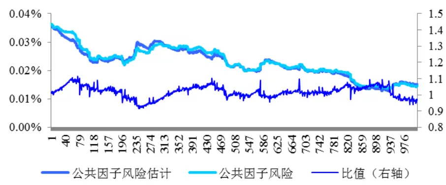
数据来源：国泰君安证券研究

上述得到的 $\boldsymbol{F}^{\mathrm{~(}d\mathrm{~)~}}$ 仍然存在非平稳偏差问题，即风险预测会存在持续性的高估或低估情况。为此，需要引入因子截面偏差统计量 $\boldsymbol{B}_{t}^{\textit{ F }}$ 和因子波动率乘子 $\lambda_{\textit{ F }}$ 。

具体而言，令 $f_{kt}$ 为第k 个因子在第t 天的实际因子收益率， $\sigma_{{kt}}$ 为第 t • 1天预测的第t 天的因子收益的波动率，那么因子截面偏差统计量 $\boldsymbol{B}_{t}^{\textit{ F }}$ 可表示为：

$$
B_{_{t}}^{\;^{F}}=\sqrt{\frac{1}{K}\sum_{_{k}}\;(\frac{f_{_{kt}}}{\sigma_{_{kt}}})^{^2}},
$$

其中，K 为因子个数。 $\boldsymbol{B}_{t}^{\textit{ F }}$ 是检验因子波动率是否有偏的直观方法，例如，若预测的因子波动率过小，则 $B_{_t}^{^F}>1$

在得到 $\boldsymbol{B}_{t}^{\textit{ F }}$ 的时间序列后，通过指数衰减权重加权后，可以得到因子波动率乘子 $\lambda_{_F}$ ，以此来预测因子收益波动率的预测是否是无偏的，并作出相应的调整，具体的：

$$
\lambda_{_{F}}=\sqrt{\sum_{_{t}}\left(B_{_{t}}^{^{F}}\right)^{^{2}}w_{_{t}}},
$$

其中， $w_{_t}$ 为指数半衰权重。

那么，调整后的每日因子收益率协方差矩阵则可表示为：

$$
\tilde{F}^{(d)}=\lambda_{_F}^{^2}\cdot F^{(d)}
$$

最后，在得到日频率的因子收益率协方差矩阵后，需要将其调整至我们需要的月频率。其中，利用 $Newey-West$ 方法调整日频率协方差序列存在的序列相关性，进而得到月频率的协方差矩阵：

$$
F=C^{^{NW}}\cdot\tilde{F}^{^{(d)}}
$$

F 即为组合风险 $\sigma_{{p}}$ 中的因子收益率协方差矩阵。

## 2.3.2. 特质因子风险建模

在结构化多因子风险模型中，特质因子风险部分是共同因子无法解释的残余风险，在回归方程中表示为 $Var(u_{{\tiny{j}}})$ ，而由于模型假设特质因子与

公共因子相关性为 0，并且每只股票之间的特质因子相关性也为 0，因此整体股票组合的特质风险部分• 为一个对角阵。

特质因子风险估计的难点在于必须独立的计算每只股票的特质风险，因此时间序列方法是较好的选择。

与协方差矩阵F 的计算相似，首先同样利用加权移动平均（EWMA）方法计算个股的每日特质因子风险。具体的，对于股票 j ，每日特质因子风险的表达为：

$$
\sigma_{_{u_{j^{t}}}}^{^d}=(\sum_{_{s=t-h}}^{^{t}}\lambda^{^{t-s}}(u_{_{js}}-\overline{{u}}_{_{j}})^{^2}/\sum_{_{s=t-h}}^{^{t}}\lambda^{^{t-s}})^{^{1/2}}\quad\lambda=0.5^{^{1/2}}
$$

我们利用上述方式，对日频率特质因子波动率矩阵进行估计。其中，组合均采取等权重配置方式。结果如下 ：

图 2 特质因子波动率估计
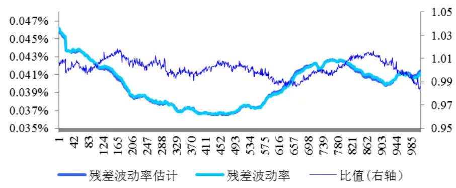
数据来源：国泰君安证券研究

在得到日频率的特质因子风险矩阵后，同样利用N ew e y W e st • 调整日频率序列相关性，并计算每月特质因子风险矩阵：

$$
\sigma_{_{u_{j^{t}}}}=C^{^{NW}}\cdot\sigma_{_{u_{j^{t}}}}^{^{d}}
$$

当然，时间序列方法仍然会产生估算的误差，例如：

1） 对于新发行的股票而言，较短的历史数据会使得对特质因子的估计

产生较大的误差；

2） 对于流动性较差的股票，回归残差的分布往往呈现较强的尖峰厚尾性，使得其特质风险很难刻画；

3） 上市公司的重大事件性影响会使得回归方程的残差项占比大幅度提升，而时间序列模型无法控制这种情况所产生的影响。

## 2.4.风险模型的意义

风险模型的意义在于找到股票价格波动的成因，并将股票收益来源进行分解剥离，并实现对未来股票价格波动的预测。

在对风险因子的研究中，我们利用 30类行业因子、9类风格因子和特质因子分解了股票收益的来源，并以因子对股票价格影响的波动变化解释了股票价格波动的原因。

然后，通过对风险模型中关键变量的估计，我们实现了对组合波动率的定量预测。然而，正如金融市场中不存在完美的正态分布一样，100%精准的风险预测也同样是不存在的。但是在风险模型的体系中，投资经理可以定量的对风险进行评估，进而帮助其精确的控制组合的风险特征，在获取确定性较高的阿尔法因子收益的同时，剔除不确定性较强的风险因子的干扰。

在风险模型的基础上，通过组合权重的优化方法，可以构建风格中性的最优投资组合，下面我们就进入多因子选股策略部分。

## 3. 风格中性多因子选股策略

在上一章中，我们通过结构化多因子风险模型的构建，对股票收益来源进行了分解，并对组合风险进行了定量的预测。在引言中我们曾提到，多因子模型收益的稳定性很大程度上取决于股票组合权重的计算，那么如何才能构建我们所需要的最优投资组合？本章将给出我们对这个问题的研究想法。首先，我们给出纯因子股票组合的概念。

## 3.1. 纯因子组合

在结构化风险模型中，我们介绍了风格因子有效性检验较为完整的方法，在此基础上得到了 9大类风格因子。对于一个包含N 只股票的投资组合，假设组合的权重为 $w=(w_{1},w_{2},\ldots,w_{N})^{T}$ ，那么组合收益率可以表示为：

$$
R_{_{P}}=\sum_{_{j=1}}^{N}w_{_{n}}\cdot(\sum_{_{k=1}}^{k}x_{_{jk}}f_{_{jk}}+u_{_{j}})
$$

上述表达式是一个简单的线性分解形式，通过计算我们可以得到每类因子对整体组合收益的贡献度。那么，为了更准确的把握每一类因子的收益特征，我们需要构造某一组合，使得组合的整体收益仅来源于某一类因子的收益，而其余因子的收益均为 0。

具体而言，对于第 k 类因子，若存在某一股票投资组合权重$w=(w_{1},w_{2},\ldots,w_{N})^{T}$ ，使得

$$
\left\{\begin{aligned}&\left(\left.w^{^T}\right.-\left.w_{_{bench}}\right.^T\right)X_{_k}\left.=1\right.\\&\left.\forall\left.k^{\prime}\right.\right.\left(\left.w^{^T}\right.-\left.w_{_{bench}}\right.^T\right.\right)X_{_k},\left.=\left.0\right.\end{aligned}\right.
$$

其中 $k^{\prime}\neq k$ $w_{\mathit{bench}}$ 表示对冲基准的组合权重（例如以沪深 300 股指期

货为对冲基准，则 $W_{bench}$ 表示沪深 300 指数成分股的对应权重，非指数成分股位置则权重为 0）。上述约束表明，因子k对应对冲基准的风险敞口暴露为 1，其余因子k• 对应对冲基准的风险敞口暴露完全封闭。我们称这样的组合权重w 为因子k 的单位纯因子股票组合，并称因子 k 较之对冲基准存在 1 单位的风险因子敞口暴露。

更一般的，若存在某一股票投资组合权重 $w=(w_{1},w_{2},\ldots,w_{N})^{T}$ ，仅使得

$$
\forall\;k^{^{\prime}}\;(w^{^{T}}-w_{_{bench}}^{\quad^{T}})X_{_{k^{^{\prime}}}}=0
$$

其中 $k^{\prime}\neq k$ 。我们称这样的组合权重w 为因子k 的纯因子股票组合。

纯因子股票组合的意义在于，在考虑因子k 对收益率影响程度的同时，完全剔除了其余因子对组合的影响。这样，可以更加客观的考察组合基于第k 个因子的收益风险特征。

## 3.2.风险因子与阿尔法因子

我们来重新审视阿尔法因子的定义。所谓阿尔法因子，是对股票收益率具有显著且稳定影响的某一变量，同时该影响是剔除其余所有因子对收益的作用而独立存在的。

在第一章的结构化多因子风险模型中，我们已经利用 BARRA风险因子的筛选标准，得到了 9大类风险因子，其对股票收益率的影响作用均在统计意义上达到显著水平。但是，为了进一步考察因子是否存在阿尔法性质，我们必须构建基于某类因子的纯因子股票组合，以此来考察当某类因子独立作用于股票组合上时，其呈现的收益率特征是否稳健。

接下来，我们分别对上述 9类因子，构建纯因子股票组合。其中，构建组合权重的目标函数暂不考虑风险特征，仅为组合预期收益率最大化。同时，我们通过行业中性的约束保证行业因子收益率不对结果产生影响，具体如下：

$$
\begin{aligned}&Max\quad w^{^T}R_{_p}\\&s.t.\quad\forall k^{^T}\quad(w^{^T}-w_{_{bench}}^{^T})X_{_{k^{'}}}=0\\&\quad w^{^T}H=h^{^T}\\&\quad w\geq0\\&\quad\sum_{_{i=1}}^{^N}w_{_i}=1\\\end{aligned}
$$

其中， $R=\{r_{1},r_{2},\ldots,r_{N}\}^{T}$ 表示组合N 只股票的预期收益率向量；H 表示N 只股票的行业哑变量矩阵； $h=\{h_{1},h_{2},...,h_{30}\}^{T}$ 表示沪深 300 对应的 30 个行业的占比权重；

在该优化方程中： $\forall\quad k^{\quad\prime}\quad w^{\quad^{T}}\quad X_{\quad_{k^{\prime}}}\quad=\quad0$ 表示除第k 个因子外的任意风格因子$k^{\prime}$ 的风险敞口暴露为 0； $w^{T}H=h^{T}$ 表示任意行业因子的风险敞口暴露为 0； $\boldsymbol{w}^{\mathrm{~\tiny~T~}}\boldsymbol{R}$ 表示权重优化的目标为组合预期收益率的最大化。因此上述优化方程的结果 $w=(w_{1},w_{2},\ldots,w_{N})^{T}$ 为第K 个因子的纯因子股票组合。

我们分别考察了风险模型中9大类风格因子的纯因子股票组合的收益情况，累计收益曲线分别如下（在计算中，我们将其余因子的风险敞口暴露限制于区间•0.01中）:

图 3 纯 Beta 组合累计收益率
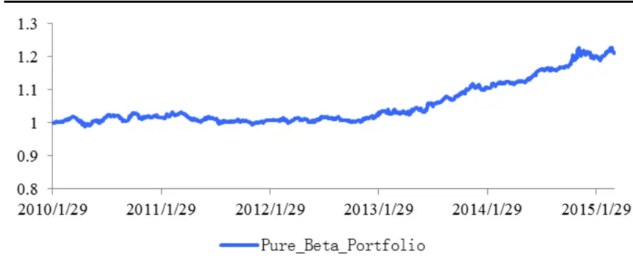
数据来源：国泰君安证券研究

表 5：纯 Beta 组合绩效统计

| 组合绩效 | 风险因子敞口（均值） |
| --- | --- |
| 组合期限 62个月 | Beta 0.610 |
| 累计收益率 21.1% | Momentum 0.010 |
| 日交易胜率 52.68% | Size -0.010 |
| 年化收益率 3.89% | Earning Yield 0.010 |
| 年化波动率 3.45% | Volatility 0.010 |
| 信息比率 1.13 | Growth 0.009 |
| 最大回撤 3.70% | Value -0.010 |
| 95%VaR -0.41% | Leverage -0.004 |
| 日收益率T值 2.52 | Liquidity -0.010 |

数据来源：国泰君安证券研究

图 4 纯 Momentum 组合累计收益率
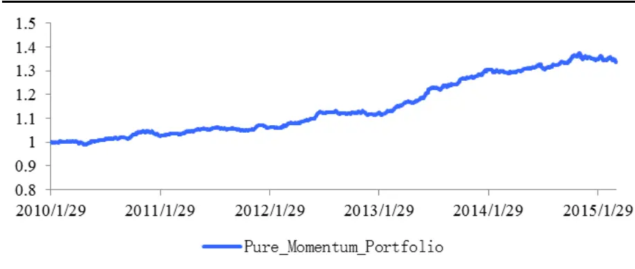
数据来源：国泰君安证券研究

表 6：纯 Momentum 组合绩效统计

| 组合绩效 | 风险因子敞口（均值） |
| --- | --- |
| 组合期限 62 个月 | Beta 0.010 |
| 累计收益率 33.9% | Momentum 0.625 |
| 日交易胜率 57.49% | Size -0.010 |
| 年化收益率 5.89% | Earning Yield 0.010 |
| 年化波动率 2.75% | Volatility 0.009 |
| 信息比率 2.143 | Growth 0.009 |
| 最大回撤 2.89% | Value -0.010 |
| 95%VaR -0.32% | Leverage -0.009 |
| 日收益率T值 4.79 | Liquidity -0.010 |

数据来源：国泰君安证券研究

图 5 纯 Size 组合累计收益率
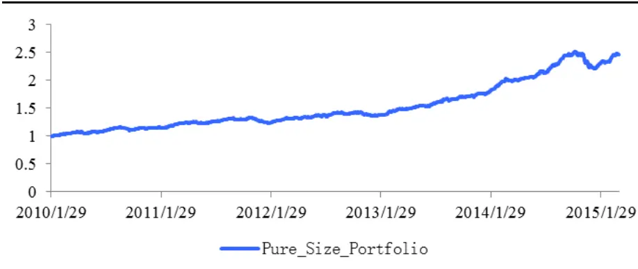
数据来源：国泰君安证券研究

表 7：纯 Size 组合绩效统计

| 组合绩效 | 风险因子敞口（均值） |
| --- | --- |
| 组合期限 62个月 | Beta -0.003 |
| 累计收益率 147% | Momentum -0.003 |
| 日交易胜率 61.41% | Size -1.292 |
| 年化收益率 18.31% | Earning Yield -0.010 |
| 年化波动率 6.40% | Volatility 0.001 |
| 信息比率 2.862 | Growth -0.007 |
| 最大回撤 12.15% | Value -0.010 |
| 95%VaR -0.72% | Leverage -0.008 |
| 日收益率T值 6.40 | Liquidity 0.009 |

数据来源：国泰君安证券研究

图 6 纯 Earning Yield 组合累计收益率
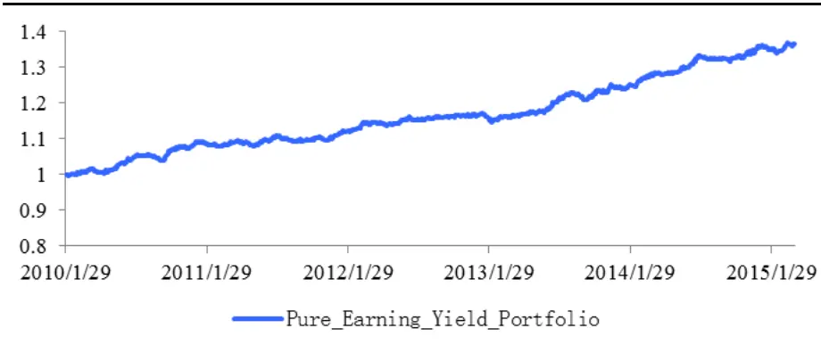
数据来源：国泰君安证券研究

表 8：纯 Earning Yield 组合绩效统计

| 组合绩效 | 风险因子敞口（均值） |
| --- | --- |
| 组合期限 62个月 | Beta 0.010 |
| 累计收益率 36.7% | Momentum 0.010 |
| 日交易胜率 54.52% | Size -0.010 |
| 年化收益率 6.29% | Earning Yield 0.641 |
| 年化波动率 2.54% | Volatility -0.009 |
| 信息比率 2.473 | Growth 0.010 |
| 最大回撤 2.18% | Value -0.010 |
| 95%VaR -0.290% | Leverage -0.004 |
| 日收益率T值 5.53 | Liquidity -0.010 |

数据来源：国泰君安证券研究

图 7 纯 Volatility 组合累计收益率
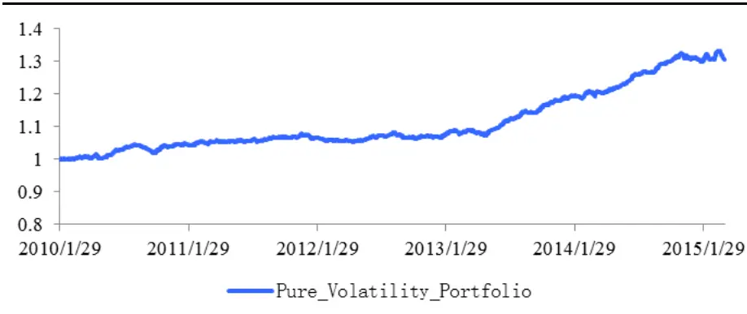
数据来源：国泰君安证券研究

表 9：纯 Volatility 组合绩效统计

| 组合绩效 | 风险因子敞口（均值） |
| --- | --- |
| 组合期限 62个月 | Beta 0.010 |
| 累计收益率 30.5% | Momentum 0.010 |
| 日交易胜率 56.20% | Size -0.010 |
| 年化收益率 5.36% | Earning Yield 0.010 |
| 年化波动率 2.45% | Volatility -0.385 |
| 信息比率 2.19 | Growth 0.010 |
| 最大回撤 2.48% | Value -0.010 |
| 95%VaR -2.82% | Leverage -0.010 |
| 日收益率T值 4.90 | Liquidity -0.010 |

数据来源：国泰君安证券研究

图 8 纯 Growth 组合累计收益率
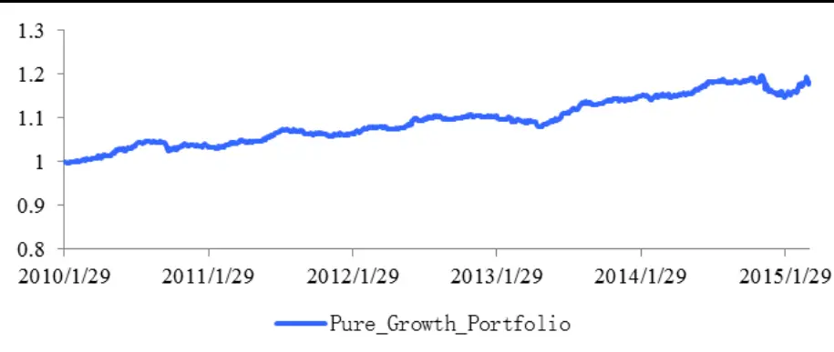
数据来源：国泰君安证券研究

表 10：纯 Growth 组合绩效统计

| 组合绩效 | 风险因子敞口（均值） |
| --- | --- |
| 组合期限 18.3% | Beta 0.010 |
| 累计收益率 56.12% | Momentum 0.010 |
| 日交易胜率 3.39% | Size -0.010 |
| 年化收益率 2.43% | Earning Yield 0.010 |
| 年化波动率 1.399 | Volatility -0.008 |

| 信息比率 | 4.14% Growth | 0.577 |
| --- | --- | --- |
| 最大回撤 | -0.287% | Value -0.010 |
| 95%VaR | 3.13 | Leverage -0.008 |
| 日收益率T值 | 18.3% | Liquidity -0.010 |

数据来源：国泰君安证券研究

图 9 纯 Value 组合累计收益率
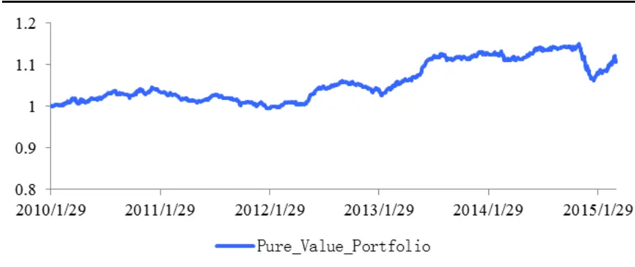
数据来源：国泰君安证券研究

表 11：纯 Value 组合绩效统计

| 组合绩效 | 风险因子敞口（均值） |
| --- | --- |
| 组合期限 62 个月 | Beta 0.010 |
| 累计收益率 11.2% | Momentum 0.010 |
| 日交易胜率 54.60% | Size -0.010 |
| 年化收益率 2.16% | Earning Yield 0.010 |
| 年化波动率 2.85% | Volatility 0.007 |
| 信息比率 0.757 | Growth 0.009 |
| 最大回撤 7.67% | Value -0.639 |
| 95%VaR -3.45% | Leverage -0.010 |
| 日收益率T值 1.69 | Liquidity -0.010 |

数据来源：国泰君安证券研究

图 10 纯 Leverage 组合累计收益率
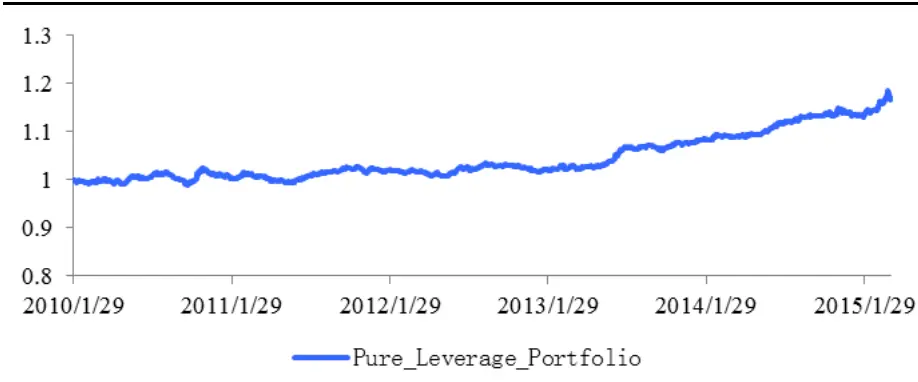
数据来源：国泰君安证券研究

表 12：纯 Leverage 组合绩效统计

| 组合绩效 | 风险因子敞口（均值） |
| --- | --- |
| 组合期限 62个月 | Beta 0.010 |
| 累计收益率 17.2% | Momentum 0.010 |
| 日交易胜率 53.4% | Size -0.010 |
| 年化收益率 3.20% | Earning Yield 0.010 |
| 年化波动率 2.44% | Volatility -0.010 |
| 信息比率 1.31 | Growth 0.009 |
| 最大回撤 3.05% | Value -0.010 |
| 95%VaR -0.29% | Leverage -0.495 |
| 日收益率T值 2.94 | Liquidity -0.010 |

数据来源：国泰君安证券研究

图 11 纯 Liquidity 组合累计收益率
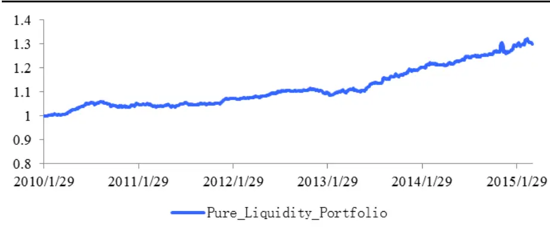
数据来源：国泰君安证券研究

表 13：纯 Liquidity 组合绩效统计

| 组合绩效 | 风险因子敞口（均值） |
| --- | --- |
| 组合期限 62 个月 | Beta 0.010 |
| 累计收益率 30% | Momentum 0.010 |
| 日交易胜率 55.88% | Size -0.010 |
| 年化收益率 5.29% | Earning Yield 0.010 |
| 年化波动率 2.76% | Volatility -0.010 |
| 信息比率 1.918 | Growth -0.001 |
| 最大回撤 3.71% | Value -0.010 |
| 95%VaR -0.321% | Leverage -0.003 |
| 日收益率T值 4.29 | Liquidity -0.457 |

数据来源：国泰君安证券研究

图 12 纯因子组合累计收益率汇总
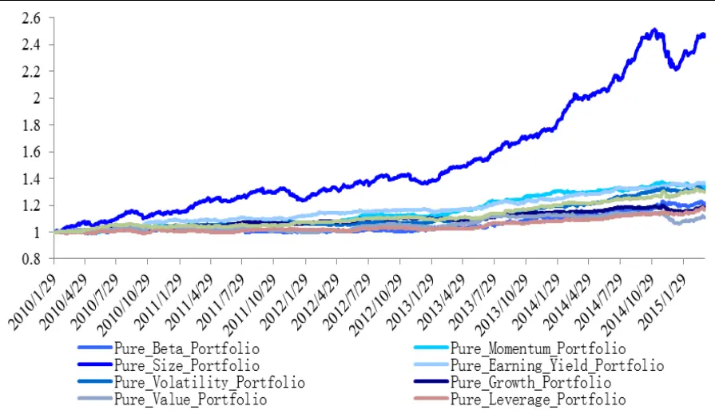
数据来源：国泰君安证券研究

表 14：纯因子组合绩效汇总

| 纯因子组合 | 年化收益率 | 年化波动率 | 信息比率 | 最大回撤 |
| --- | --- | --- | --- | --- |
| Beta | 3.89% | 3.45% | 1.13 | 3.70% |
| Momentum | 5.89% | 2.75% | 2.14 | 2.89% |
| Size | 18.31% | 6.40% | 2.86 | 12.15% |
| Earning Yield | 6.29% | 2.54% | 2.47 | 2.18% |
| Volatility | 5.36% | 2.45% | 2.19 | 2.48% |
| Growth | 3.39% | 2.43% | 1.40 | 4.14% |
| Value | 2.16% | 2.85% | 0.76 | 7.67% |
| Leverage | 3.20% | 2.44% | 1.31 | 3.05% |
| Liquidity | 5.29% | 2.76% | 1.92 | 3.71% |

数据来源：国泰君安证券研究

纯因子股票组合检验体现的是，在组合收益仅来源于某一因子的情况下，组合的收益风险特征。以纯 Earning Yield 因子组合为例，组合在仅暴露 Earning Yield因子、完全剔除行业因子和其余风格因子的情况下，可以获取约 6.29%的年化收益率、2.54%的年化波动率，此时，在组合最大化预期收益率的情况下，Earning Yield 因子相对于沪深 300 基准的平均风险敞口暴露约为 0.641。

在对所有纯因子组合考虑后，我们发现纯 Momentum 因子组合、纯Earning Yield 因子组合和纯 Volatility 因子组合的表现相对稳健，因子的阿尔法性较强，而其余纯因子组合的收益率均有不同程度的波动。

纯 Earning Yield 因子组合的结果与传统经济学的观点较为一致，即影响股票的内在动力于企业的盈利能力。而 Earning Yield 因子中包含对企业盈利能力一致预期观点，表明市场预期对股价的影响较为显著。

纯Momentum因子组合和纯Volatility因子组合的结果表明市场的力量对股价同样具有影响，进而也从侧面证明了技术分析的可行性。

值得一提的是，纯 Size 因子组合的表现较为特别。相对于其余因子而言，Size 因子可谓杀伤力巨大。纯 Size因子组合可获取约 18.31%的年化收益率，为所有因子组合中最大，而其6.40%的年化波动率以及12.15%的最大回撤也是所有因子组合中最大的。自 2010年 1月起，纯 Size因子的累积收益率稳步上升，表现稳健。然而在 2014年 12月，组合收益出现断崖式的较大回撤，大小盘风格的突变导致了因子组合的大幅亏损。这在很大程度上可以解释去年 12 月份，市场较多对冲策略出现较大回撤的原因，我们认为 Size 因子为典型的风格因子，其阿尔法性质值得商榷

## 3.3.行业中性与风格中性

在上一节的纯因子组合检验中，我们已经涉及到了行业中性和风格因子中性的概念。

行业中性是指，多头组合的行业配置与对冲基准的行业配置相一致。行业中性配置的目的在于剔除行业因子对策略收益的影响。与传统观念不同，传统行业配置试图找到在未来某一段时间内强势行业予以超配、弱势行业予以低配，而行业中性的特点在于剔除行业层面的影响，仅考察行业内部个股的超额收益。行业中性策略的净值曲线往往较为平稳，回撤较小。

表 15：沪深 300行业权重（10年至 15年 3月均值）
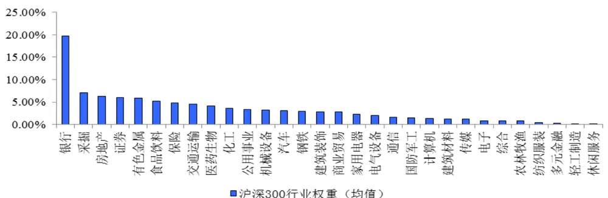
数据来源：国泰君安证券研究

沪深 300 指数中，权重排名前 5的行业为：银行、采掘、房地产、证券和有色金属，权重排名后 5的行业为：休闲服务、轻工制造、多元金融、纺织服装和农林牧渔。

假设H 为样本股票的行业因子哑变量矩阵，h 为沪深 300 中 30 个行业的对应权重，那么行业中性的权重w 满足：

$$
w^{^T}H=h^{^T};w\geq0
$$

风格因子中性是指，多头组合的风格因子较之对冲基准的风险暴露为 0。风格因子中性的意义在于，将多头组合的风格特征完全与对冲基准相匹配，使得组合的超额收益不来自于某类风格。因为，我们的目的是追求获得稳健的阿尔法收益，而并非市场某种风格的收益。经风格因子中性配置后，策略的净值曲线将会进一步的平滑，最大回撤进一步降低，组合的稳定性较之仅考虑行业中性的配置方式大幅提升。

表 16：沪深 300风格因子（10年至 15年 3月均值）
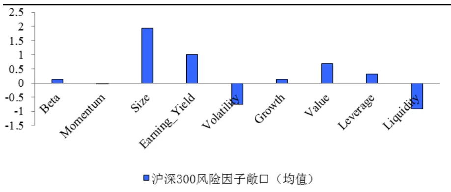
数据来源：国泰君安证券研究

假设 $X_{\textit{ k }}$ 为样本第k 个因子的载荷截面， $w_{\mathit{bench}}$ 为沪深 300 指数对应权重，那么因子k 的风格中性权重w 满足：

$$
(w^{T}-w_{bench}^{T})X_{k}=0;w\geq0
$$

若权重w 对组合中任意风格因子满足上述表达式，则称组合w 满足风格 因子中性。

简单来说，风格中性的目的是为了将多头组合的某一风格特点尽量逼近对冲基准，进而规避该风格可能对策略收益产生的波动。

## 3.4. 组合权重优化

我们在引言中提到，组合权重优化在多因子模型中起到了至关重要的作用。组合权重优化的目的在于将组合的风险特征完全定量化，使得投资经理可以清楚的了解组合的收益来源和风险暴露。

组合权重优化的过程包含 2个因素：第一，权重优化的目标函数；第二，约束条件。其中，约束条件我们在上一节中已经提到，即为组合的行业中性和风格因子中性。对于权重优化的目标函数，有几类不同的方法：

## 1） 最小化组合预期风险

结构化风险模型对组合波动率的计算为 $\sigma_{_p}=\sqrt{w^{^T}\left(XFX^{^T}+\Delta\right)w}$ ，那么最小化组合预期风险的权重优化表达为：

$$
\begin{aligned}&Min\quad w^{^T}\left(\;XFX^{^T}\;+\;\Delta\;\right)w\\&s.t.\quad\forall k^{^T}\quad(w^{^T}\;-\;w_{_{bench}}\;^T\;)X_{_{k^{\prime}}}=0\\&\quad w^{^T}H\;=\;h^{^T}\\&\quad w\;\geq\;0\\&\quad\sum_{_{i=1}}^{^N}w_{_i}=1\\\end{aligned}
$$

其中k• 表示认定的风格因子，H 为样本股票的行业因子哑变量矩阵，h为沪深 300中 30个行业的对应权重。

## 2） 最大化经风险调整后收益

最大化经风险调整后的收益为目标函数，同时考虑了预期收益与预期风险的作用，并且在马克维茨的均值方差理论框架下，引入了风险厌恶系数 ，具体权重优化表达为：

$$
\begin{aligned}&Max\quad R_{_P}-\lambda\sigma_{_P}^{^2}-TC\left(w\right)\\&s.t.\quad\forall k^{'}\quad(w^{^T}-w_{_{bench}}^{^T})X_{_{k^{'}}}=0\\&\quad w^{^T}H=h^{^T}\\&\quad w\geq0\\&\quad\sum_{_{i=1}}^{^N}w_{_i}=1\\\end{aligned}
$$

其 中 $TC\left(w\right)$ 表 示 以 权 重 w 构 建 组 合 的 换 仓 成 本 ，

$$
R_{_P}=\sum_{_{j=1}}^{^N}w_{_n}\cdot(\sum_{_{k=1}}^{^K}x_{_{jk}}f_{_{jk}}+u_{_j}),\ \sigma_{_p}=\sqrt{w^{^T}(XFX^{^T}+\Delta)w}。
$$

## 3）最大化组合信息比率

最大化组合信息比率为目标函数以预期收益与预期组合风险的比值作为目标函数，具体权重优化表达为：

$$
\begin{aligned}&Max\quad\frac{R_{_P}-TC\left(w\right)}{\sigma_{_P}}\\&s.t.\quad\forall k^{\prime}\quad(w^{^T}-w_{_{bench}}{^T})X_{_{k^{\prime}}}=0\\&\quad w^{^T}H=h^{^T}\\&\quad w\geq0\\&\quad\sum_{_{i=1}}^{^N}w_{_i}=1\\\end{aligned}
$$

其中TC w( ) 表示以权重w 构建组合的换仓成本，

$$
R_{_P}=\sum_{_{j=1}}^{^N}w_{_n}\cdot(\sum_{_{k=1}}^{^K}x_{_{jk}}f_{_{jk}}+u_{_j}),\ \sigma_{_p}=\sqrt{w^{^T}(XFX^{^T}+\Delta)w}。
$$

上述三种优化目标函数中，第一种方法和第三种方法完全依赖风险模型给定的数据结果进行计算，而第二种最大化经风险调整后的收益为目标函数引入了风险厌恶系数 ，提高了权重计算的灵活性，使得投资经理可以根据自身的风险偏好进行差异化的选择。

## 3.5. 实证检验

到此为止，我们已经完成了组合构建的全部基础工作，包括因子有效性检验、回归方程参数估计、组合风险建模、纯因子组合检验和基于行业中性、风格因子中性的组合权重优化的处理方法。那么接下来将进行实证检验分析，我们将分别考察市值中性组合，市值、行业中性组合与市值、行业、风格中性组合的策略效果，并比较 3者之间的差别。

## 我们首先给出实证检验的相关假设参数：

1） 回测时间从 2010 年 1 月至 2015 年 3 月，其中 2010 年 1 月至 2011年 1月为样本内时间段，以提取因子组合相关参数；

1）股票池选取全 A非 ST股票；

2）交易成本为单边千分之 1，印花税千分之 1；

3）组合个股的权重上限设为 1%（银行、证券、保险行业占比较大，为实现行业中性配置，权重上限分别设为 3%、2%、2%）。

4）优化目标函数我们采用 $Max\quad R_{_P}-\lambda\sigma_{_P}^{^2}-TC(w)$ 形式，其中 $\lambda=\frac{1}{2}$

5）行业中性约束中，因子敞口设定为•5% ；

6）风格中性约束中，9类风格因子敞口设定为：

| 因子类型 | 风险敞口约束上限 | 风险敞口约束下限 |
| --- | --- | --- |
| Beta | -0.01 | +0.01 |
| Momentum | 8 | +0.3 |
| Size | 8 | -0.3 |
| Earning Yield | 8 | +0.5 |
| Volatility | -0.3 | -8 |
| Growth | -0.01 | +0.01 |
| Value | -0.01 | +0.01 |
| Leverage | -0.01 | +0.01 |
| Liquidity | -0.01 | +0.01 |

当该期权重优化方程在设定的因子敞口约束下无解时，逐次降低Momentum 和 Earning Yield 因子敞口 0.1，直至优化方程找到最优解。

策略检验结果如下：

## 一、 构建市值中性对冲组合

$$
Max\quad R_{P}-\lambda\sigma_{P}^{2}-TC(w)
$$

$$
s.t.\ w\geq0
$$

$$
\sum_{i=1}^{N}w_{_{i}}=1
$$

图 13 市值中性组合与沪深 300指数比较
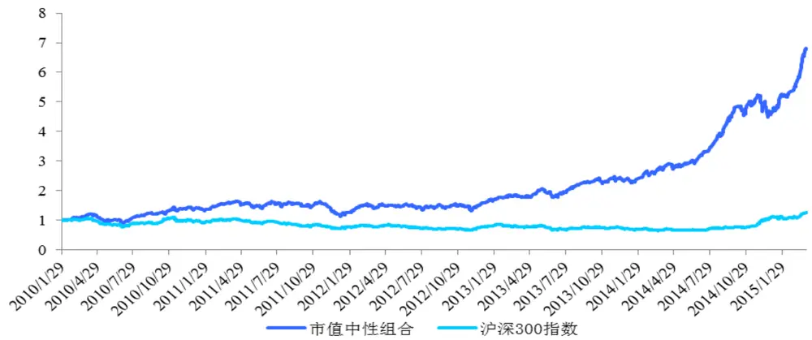
数据来源：国泰君安证券研究

图 14 市值中性组合对冲净值
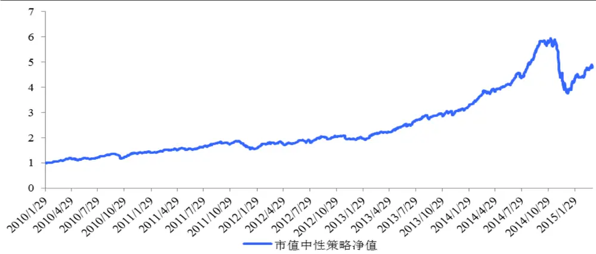
数据来源：国泰君安证券研究

表 17：市值中性组合绩效统计

| 策略净值 | 4.828 | 最大回撤 | 36.98% |
| --- | --- | --- | --- |
| 交易胜率 | 61.89% | 最大回撤开始时间 | 2014/11/5 |
| 年化收益率 | 32.77% | 最大回撤结束时间 | 2014/12/31 |
| 年化波动率 | 15.67% | 日收益率分布偏度 | -0.93 |
| 信息比率 | 2.09 | 日收益率分布峰度 | 8.48 |
| 盈亏比率 | 0.882 | 95%VaR | -1.811% |

| 组合年均换手率 | 360% | 组合股票个数（均值） | 100只 |
| --- | --- | --- | --- |

数据来源：国泰君安证券研究

## 二、 构建市值、行业中性对冲组合

$$
\begin{aligned}&Max\quad R_{_P}-\lambda\sigma_{_P}^{^2}-TC\left(w\right)\\&s.t.\quad w^{^T}H=h^{^T}\\&\quad w\geq0\\&\quad\sum_{_{i=1}^{^N}}^{^N}w_{_i}=1\\\end{aligned}
$$

图 15 市值、行业中性组合与沪深 300指数比较
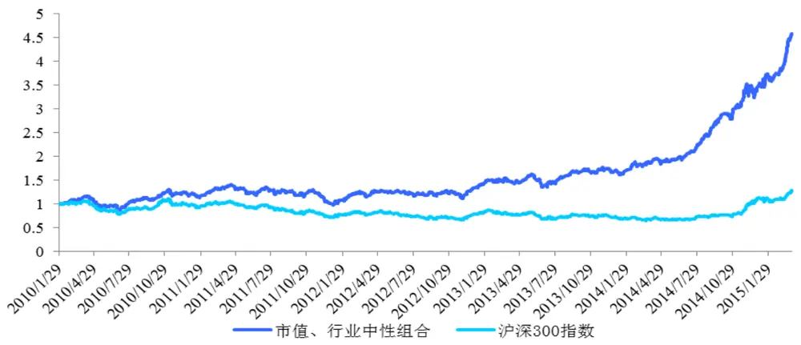
数据来源：国泰君安证券研究

图 16 市值、行业中性组合对冲净值
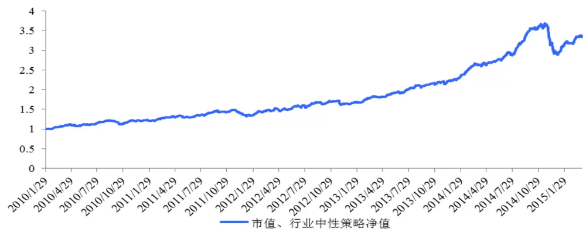
数据来源：国泰君安证券研究

表 18：市值、行业中性组合绩效统计

| 策略凈值 | 3.367 | 最大回撤 | 21.83% |
| --- | --- | --- | --- |
| 交易胜率 | 63.81% | 最大回撤开始时间 | 2014/11/20 |
| 年化收益率 | 24.75% | 最大回撤结束时间 | 2014/12/31 |
| 年化波动率 | 9.37% | 日收益率分布偏度 | -1.06 |
| 信息比率 | 2.641 | 日收益率分布峰度 | 7.38 |
| 盈亏比率 | 0.888 | 95%VaR | -1.063% |
| 组合年均换手率 | 340% | 组合股票个数（均值） | 95只 |

数据来源：国泰君安证券研究

## 三、 构建市值、行业、风格中性对冲组合

$$
\begin{aligned}&Max\quad R_{_P}-\lambda\sigma_{_P}^{^2}-TC\left(w\right)\\&s.t.\quad\forall k^{'}\quad(w^{^T}-w_{_{bench}}^{^T})X_{_{k^{'}}}=0\\&\quad w^{^T}H=h^{^T}\\&\quad w\geq0\\&\quad\sum_{_{i=1}}^{^N}w_{_i}=1\\\end{aligned}
$$

图 17 市值、行业、风格中性组合与沪深 300 指数比较
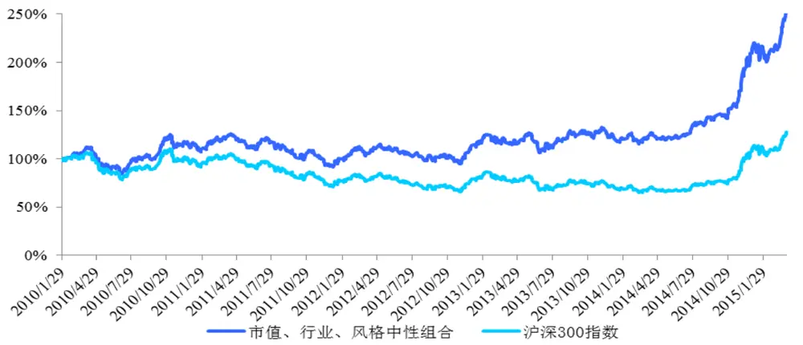
数据来源：国泰君安证券研究

图 18 市值、行业、风格中性组合对冲净值
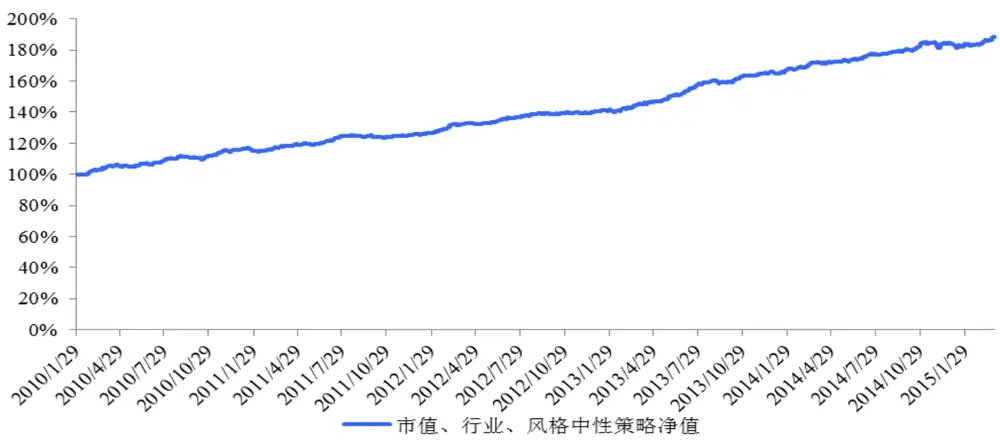
数据来源：国泰君安证券研究

表 19：市值、行业、风格中性组合绩效统计

| 策略净值 | 1.885 | 最大回撤 | 2.09% |
| --- | --- | --- | --- |
| 交易胜率 | 61.25% | 最大回撤开始时间 | 2014/11/26 |
| 年化收益率 | 12.73% | 最大回撤结束时间 | 2014/12/05 |
| 年化波动率 | 3.03% | 日收益率分布偏度 | -0.08 |
| 信息比率 | 4.21 | 日收益率分布峰度 | 3.90 |
| 盈亏比率 | 1.26 | 95%VaR | -0.324% |
| 组合年均换手率 | 350% | 组合股票个数（均值） | 100 只 |

数据来源：国泰君安证券研究

表 20：风格中性组合分段绩效统计

| 日期 | 年收益率 | 最大回撤 | 信息比率 |
| --- | --- | --- | --- |
| 2010年（样本内） | 16.0% | 2.04% | 4.65 |
| 2011年 | 8.4% | 1.86% | 3.01 |
| 2012年 | 11.6% | 0.90% | 4.90 |
| 2013年 | 18.3% | 1.17% | 5.83 |
| 2014年 | 10.7% | 2.07% | 3.50 |

数据来源：国泰君安证券研究

图 19 3种组合方式对冲净值比较
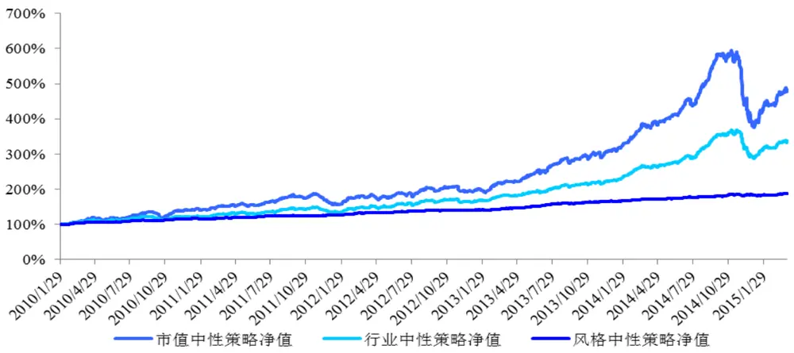
数据来源：国泰君安证券研究

表 21：3 种组合方式绩效比较

| 组合方式 | 年化收益率 | 年化波动率 | 最大回撤 | 信息比率 |
| --- | --- | --- | --- | --- |
| 市值中性 | 32.77% | 15.67% | 36.98% | 2.09 |
| 市值、行业中性 | 24.75% | 9.37% | 21.83% | 2.64 |
| 市值、行业、风格中性 | 12.73% | 3.03% | 2.09% | 4.21 |

数据来源：国泰君安证券研究

从实证检验的结果可以看到，经过市值、行业、风格中性组合后，策略组合的净值波动大幅降低，最大回撤降低至 2.09%，信息比率提高至4.21。

尽管风格中性会降低策略的年化收益率，但是收益源的稳定性和确定性却大幅提升，这对追求稳健绝对收益的阿尔法而言是理想的结果。

## 3.6. 归因分析

归因分析可以分为两类：个股归因分析和因子归因分析。从策略整体风险控制的角度而言，因子归因分析可以让投资经理在事后定量的研究策略收益和风险是源自于哪类因子。

## 3.6.1. 因子收益归因

在结构化风险模型中，组合预期收益率利用行业因子、风格因子和特质残差因子线性表达： $R_{_P}=\sum_{_{j=1}}^{^N}w_{_n}\cdot(\sum_{_{k=1}}^{^K}x_{_{jk}}f_{_{jk}}+u_{_j}),$

那么，因子收益归因即为当期组合的风险因子暴露与当期风险因子收益率的乘积，其余收益来源则归于特质残差因子。具体为，首先在第t 期初组合建仓日，经组合权重优化得到组合在风格因子k 上的敞口暴露为$w^{\phantom{\dagger}T}X_{\phantom{\dagger}_{k}}-w_{\phantom{\dagger}_{bench}}^{\phantom{\dagger}_{bench}T}X_{\phantom{\dagger}_{k}}$ 。然后，在第t 期末组合换仓日，利用个股的实际收

益率与公共因子做回归分析，可以得到第t 期的因子收益率 f ，其中第k

个因子的收益率为 $f_{k}$ 。那么，第k 个因子在第t 期的因子收益贡献即为：

$$
(\boldsymbol{w}^{T}-\boldsymbol{w_{bench}}^{T})\boldsymbol{X_{k}}\cdot\boldsymbol{f_{k}}
$$

我们对上述3种实证检验的结果进行风格因子收益归因分析，结果如下:

图 20 3种组合风格因子敞口比较
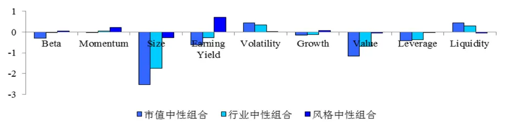
数据来源：国泰君安证券研究

图 21 3种组合因子收益归因比较
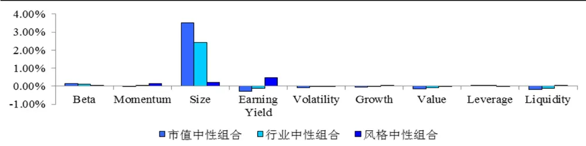
数据来源：国泰君安证券研究

从因子收益结果可以发现，市值中性组合与行业中性组合均在 Size 因子上留有较大敞口，组合呈现较为明显的小市值、高波动、低流动性的特点，策略收益来源也大部分取决于 Size 因子的贡献，策略整体带有较为明显的大小盘风格轮动特征。

而风格中性组合由于设定了风格敞口的约束，其风格因子敞口的偏离均较小，大部分敞口集中在 Earning Yield、Momentum 因子。策略收益来源中 Earning Yield 因子和 Momentum 因子也贡献了大部分收益，Size因子收益贡献占比相对较低。策略整体不带明显的风格特征，达到预期的风格中性要求。

## 3.6.2. 因子风险归因

在结构化风险模型中，组合风险的表达形式为：

$$
\sigma_{_{p}}=\sqrt{w^{^{T}}\left(XFX^{^{T}}+\Delta\right)w}\mathrm{~~}
$$

对于每一类因子而言，其因子风险贡献来源于两部分，即因子风险敞口与因子波动率，越大的因子敞口和越大的因子波动率将会造成越高的因子风险贡献。

具体而言，对于N 只股票K 个因子的组合而言，那么第k 个因子的风险贡献为：

$$
(w^{^T}-w_{_{bench}}^{^T})XF((w^{^T}-w_{_{bench}}^{^T})X_{_k})
$$

我们对上述3种实证检验的结果进行风格因子风险归因分析，结果如下：

图 22 3种组合因子风险归因比较
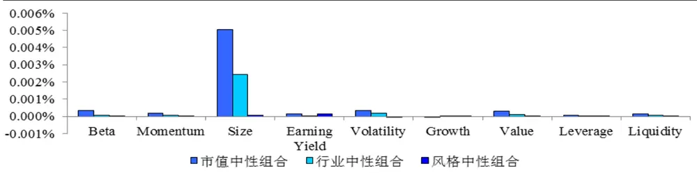
数据来源：国泰君安证券研究

风险归因的结果同样表明，相比之前两种组合配置方式，考虑风格中性的组合在各因子上的风险贡献均较为平均，未出现较集中的 Size 因子风险暴露，组合不存在明显的风格特征。

因此，无论是从策略回测检验还是从归因模型的角度，均较为明显的证明了风格中性能的组合权重优化方法能有效的控制策略风险，使得阿尔法收益来源更为稳健。

## 4. 研究总结与展望

有别于原有多因子选股相关研究报告，本篇报告并未将重点放在有效因子的挖掘中，而重点研究了组合权重优化对策略效果的影响，并引入了风格中性的组合配置方式。

我们从结构化风险模型着手，用 30类行业因子、9类风格因子和特质因子分解了股票收益来源，并通过引入对因子收益率协方差矩阵、特质因子风险矩阵的预测方法，对组合波动率进行了定量的预测。我们通过风险模型定量的掌握了组合的风险特征，为之后构建最优投资组合奠定了基础。

然后，为了检验每类因子对收益率的独立影响，我们通过优化方程的约束条件构造了纯因子组合。检验表明，Earning Yield、Momentum、Volatility 因子具有较强的阿尔法性，而 Size 因子则体现了高收益高波动的风格特性，存在显著的风格特征。

在组合权重优化的研究中，我们分别介绍了 3中不同的权重优化目标函数，并引入了行业中性和风格中性的约束条件。组合权重优化的目的是使得组合的收益来源更纯粹的暴露于阿尔法性较强的因子上，而对于其余风险因子均予以中性化处理。在这种理念下，我们构建了市值中性、行业中性、风格中性的最优投资组合。

实证检验部分，我们分别考察了 3种组合构建的方式。策略的检验结果表明，考虑风格中性的约束后，策略收益的稳定性有较大幅度的提高。组合年化收益率 12.73%，最大回撤 2.09%，信息比率达到 4.21。

归因分析结果表明，前 2 中组合方式的因子收益来源绝大部分取决于Size 因子，策略存在较强的市值风格特征，而风格中性的组合的因子收益来源则较为平均，策略不存在较为明显的因子特征。风险归因的结果同样证明了这一结果。

在后续的多因子模型研究中，我们将会考虑如下几个相关问题：1）新的阿尔法因子探究；2）以中证 500为对冲标的的组合构建方法；3）风格因子敞口调整方面的相关研究。

阿尔法策略在 2014年 12月的市场行情中，遭遇了重大挫折，主要原因不外于策略带有太过于明显的市值风格特征，这一方面源于 A股市场缺少丰富的对冲标的，另一方面也源于对策略收益特征的梳理不够清晰。本篇报告关于风格中性的配置方式希望可以一定程度上弥补这方面的缺陷。随着市场对阿尔法策略认识的逐步深入，以及中证 500股指期货等新的对冲标的上线，阿尔法策略在未来必定会更受投资者的青睐。

## 本公司具有中国证监会核准的证券投资咨询业务资格

## 分析师声明

作者具有中国证券业协会授予的证券投资咨询执业资格或相当的专业胜任能力，保证报告所采用的数据均来自合规渠道，分析逻辑基于作者的职业理解，本报告清晰准确地反映了作者的研究观点，力求独立、客观和公正，结论不受任何第三方的授意或影响，特此声明。

## 免责声明

本报告仅供国泰君安证券股份有限公司（以下简称“本公司”）的客户使用。本公司不会因接收人收到本报告而视其为本公司的当然客户。本报告仅在相关法律许可的情况下发放，并仅为提供信息而发放，概不构成任何广告。

本报告的信息来源于已公开的资料，本公司对该等信息的准确性、完整性或可靠性不作任何保证。本报告所载的资料、意见及推测仅反映本公司于发布本报告当日的判断，本报告所指的证券或投资标的的价格、价值及投资收入可升可跌。过往表现不应作为日后的表现依据。在不同时期，本公司可发出与本报告所载资料、意见及推测不一致的报告。本公司不保证本报告所含信息保持在最新状态。同时，本公司对本报告所含信息可在不发出通知的情形下做出修改，投资者应当自行关注相应的更新或修改。

本报告中所指的投资及服务可能不适合个别客户，不构成客户私人咨询建议。在任何情况下，本报告中的信息或所表述的意见均不构成对任何人的投资建议。在任何情况下，本公司、本公司员工或者关联机构不承诺投资者一定获利，不与投资者分享投资收益，也不对任何人因使用本报告中的任何内容所引致的任何损失负任何责任。投资者务必注意，其据此做出的任何投资决策与本公司、本公司员工或者关联机构无关。

本公司利用信息隔离墙控制内部一个或多个领域、部门或关联机构之间的信息流动。因此，投资者应注意，在法律许可的情况下，本公司及其所属关联机构可能会持有报告中提到的公司所发行的证券或期权并进行证券或期权交易，也可能为这些公司提供或者争取提供投资银行、财务顾问或者金融产品等相关服务。在法律许可的情况下，本公司的员工可能担任本报告所提到的公司的董事。

市场有风险，投资需谨慎。投资者不应将本报告为作出投资决策的惟一参考因素，亦不应认为本报告可以取代自己的判断。在决定投资前，如有需要，投资者务必向专业人士咨询并谨慎决策。

本报告版权仅为本公司所有，未经书面许可，任何机构和个人不得以任何形式翻版、复制、发表或引用。如征得本公司同意进行引用、刊发的，需在允许的范围内使用，并注明出处为“国泰君安证券研究”，且不得对本报告进行任何有悖原意的引用、删节和修改。

若本公司以外的其他机构（以下简称“该机构”）发送本报告，则由该机构独自为此发送行为负责。通过此途径获得本报告的投资者应自行联系该机构以要求获悉更详细信息或进而交易本报告中提及的证券。本报告不构成本公司向该机构之客户提供的投资建议，本公司、本公司员工或者关联机构亦不为该机构之客户因使用本报告或报告所载内容引起的任何损失承担任何责任。

## 评级说明

## 1.投资建议的比较标准

投资评级分为股票评级和行业评级。

以报告发布后的12个月内的市场表现为比较标准，报告发布日后的12个月内的公司股价（或行业指数）的涨跌幅相对同期的沪深300指数涨跌幅为基准。

## 2.投资建议的评级标准

报告发布日后的 12 个月内的公司股价（或行业指数）的涨跌幅相对同期的沪深300指数的涨跌幅。

| 评级 |  | 说明 |
| --- | --- | --- |
| 股票投资评级 | 增持 | 相对沪深 300指数涨幅15%以上 |
|  | 谨慎增持 | 相对沪深300指数涨幅介于5%～15%之间 |
|  | 中性 | 相对沪深300指数涨幅介于-5%～5% |
|  | 减持 | 相对沪深300指数下跌5%以上 |
| 行业投资评级 | 增持 | 明显强于沪深 300 指数 |
|  | 中性 | 基本与沪深300指数持平 |
|  | 减持 | 明显弱于沪深300指数 |

## 国泰君安证券研究

|  | 上海 | 深圳 | 北京 |
| --- | --- | --- | --- |
| 地址 | 上海市浦东新区银城中路168号上海 银行大厦29层 | 深圳市福田区益田路 6009 号新世界 商务中心34层 | 北京市西城区金融大街 28 号盈泰中 心2号楼10层 |
| 邮编 | 200120 | 518026 | 100140 |
| 电话 | （021)38676666 | (0755)23976888 | (010)59312799 |
|  | E-mail: gtjaresearch@gtjas.com |  |  |