GUOTAI慧博资讯整理URITIES

2015.05.21

# 员工持股计划：在预期博弈中寻找事件阿尔法

# ——数量化专题之五十八

刘正捷（分析师）

刘富兵（分析师）

赵延鸿（分析师）

8 0755-23976803

021-38676673

021-38674927

liuzhengjie012509@gtjas.co

证书编号 S0880514070010

liufubing008481@gtjas.com

S0880511010017

zhaoyanhong@gtjas.com

S0880515030004

## 本报告导读：

本报告在全面分析员工持股计划流程、参与方利益博弈的基础上，观察二级市场型和定向增发型员工持股的股价表现，并制定相应的投资策略，策略在样本外运行良好。摘要：

我们预计未来几年员工持股计划在A股市场将得到迅速发展，给予我们新的事件性投资机会。一方面，员工持股计划形成资本所有者和劳动者利益共同体，政策上能得到较强支持；另一方面，相较于股权激励和大股东增持，员工持股计划在对股价影响、对员工激励和税收上均有显著优势。

窗口期股价走势清晰的反映了投资者预期间的博弈。二级市场型员工持股草案公布前后，股价呈现V型反转走势，低点在公告后5-10个交易日。我们认为这一走势背后，反映了投资者对股价未来出现上涨催化剂预期和公司希望降低持股成本从而压低股价预期的博弈。定向增发型员工持股预案公布前后，股价却呈现阶梯式上涨：公布前一段时间，存在公司降低定增成本预期，股价相对不涨；公布后一段时间，存在预案能否通过证监会的不确定性，股价相对也不涨；只有在公布前后短暂几天，股价出现爆发式上涨。

二级市场型员工持股计划，采用“无差别”和“双高”两种投资策略，样本外表现优异。我们按照高管是否参与和持股计划是否采用杠杆两个条件，将股票划分成“无差别”和“双高”(高管参与&高杠杆)两个股票池。采用半个月换仓一次、等权分配、持有3个月的策略。从3月开始进行样本外检验，两种策略均能持续稳定地跑赢 wind 全 A 指数。

定向增发型员工持股计划，利用“定增破发”思路进行投资。定向增发型计划下，股票收益集中在公告日前后，由于收益过于集中，不建议在公告日后买入的策略。建议当股价回落到定增价1.05倍以下时买入，并持有60个交易日，历史平均超额收益能达到20%之上。

- 策略风险在于样本容量有限，时间不够长，还需进一步做样本外跟踪。由于员工持股计划推出不到一年，因此一方面样本数量偏少，另一方面样本时间无法跨越牛熊周期。未来还需在不同市场环境下观察策略收益的稳定性。

金融工程

## 金融工程团队：

刘富兵：（分析师）

电话：021-38676673

邮箱：liufubing008481@gtjas.com

证书编号：S0880511010017

赵延鸿：（分析师）

电话：021-38674927

邮箱：zhaoyanhong@gtjas.com

证书编号：S0880515030004

## 耿帅军：（分析师）

电话：010-59312753

邮箱：gengshuaijun@gtjas.com

证书编号：S0880513080013

## 刘正捷：（分析师）

电话：0755-23976803

邮箱：liuzhengjie012509@gtjas.com

证书编号：S0880514070010

## 李雪君：（研究助理）

电话：021-38675855

邮箱：lixuejun@gtjas.com

证书编号：S0880114090056

王浩：（研究助理）

电话：021-38676434

邮箱：wanghao014399@gtjas.com

证书编号：S0880114080041

## 陈奥林：（研究助理）

电话：021-38674835

邮箱：chenaolin@gtjas.com

证书编号：S0880114110077

## 李辰：（研究助理）

电话：021-38677309

邮箱：lichen@gtjas.com

证书编号：S0880114060025

## 相关报告

《沪深300成份股调整-超额收益正当时》2015.05.15

《探究交易公开信息之市场观察篇》2015.05.07

《信用风险与股票投资》2015.05.07

《成长趋势因子-财务数据中再掘金》2015.05.05

## 1. 员工持股计划介绍

## 1.1. 诸多优势使得员工持股计划快速兴起

## 1.1.1. A 股实施员工持股计划公司逐月递增

员工持股计划是指上市公司根据员工意愿，通过合法方式使员工获得本公司股票并长期持有，股份权益按照约定分配给员工的制度安排。这里的员工既包括普通员工，也包括公司管理层人员。

2014年6月20日，证监会正式发布《关于上市公司实施员工持股计划试点的指导意见》（以下简称《指导意见》)，从持股计划的资金来源、股票来源，持股期限、规模、审批流程等进行了规范。同年7月10日，海普瑞发布员工持股计划草案，此后实施员工持股计划的公司数量开始不断增加，截至3月底，共有约97家公司发布了员工持股计划草案。

图1实施员工持股计划的上市公司数量逐渐递增
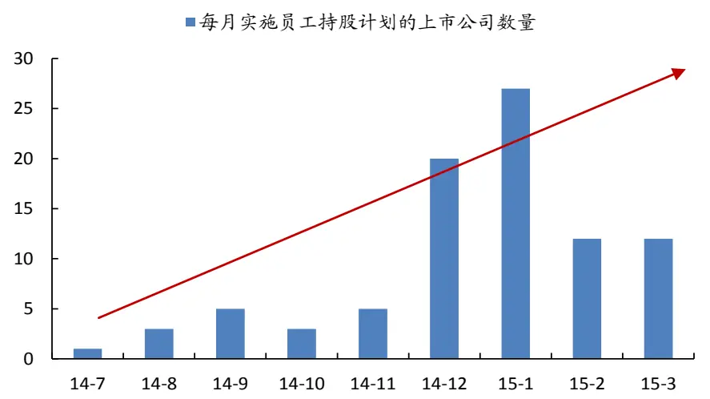
数据来源：Wind，国泰君安证券研究

注：根据交易所规定，定期报告披露前30日内公司董事、监事、高级管理人员不得买卖公司股票，再加上春节假期因素，因此我们判断2015年2、3月公司数量下降是季节性原因。

## 1.2. 员工持股计划较股权激励计划有诸多相对优势

## 1.2.1. 员工持股计划的参与人员范围更为广泛

员工持股计划的参与人员除了高管、还可以是公司骨干、普通员工等。
而股权激励计划一般仅限于公司高管。

参与人员广泛这一优点使得员工持股计划在现有环境中符合政策导向，能发挥出更好的功效。员工持股计划背后的政策基础是2013年11月中央发布的《关于全面深化改革若干重大问题的决定》，其中明确提出“允许混合所有制经济实行企业员工持股，形成资本所有者和劳动者利益共同体”。联系到最近进行得如火如荼的国企改革，以及资本所有者和劳动者泾渭分明的民营企业，显然持股人员更广泛的员工持股计划要比股权激励计划更加适合于作为改革工具。

## 1.2.2. 员工持股计划一般不设置业绩目标，直接作用于股价

股权激励计划所赋予高管的股票认购价格往往较二级市场低很多，与之而来的条件则是对公司未来若干年业绩增长的要求。虽然长期来看公司业绩与公司股价呈现正相关关系，但在中短期（1-3年)，在有效市场引力下，两者并不一定能保持一致性。员工持股计划则对公司业绩通常没有要求。

虽然不设业绩目标，但员工持股计划的激励效果却能跨越财务报告，直接作用于股价。员工持股计划的股票来源一般有二，一是在二级市场直接购买，二是定向增发，还有极少数公司是大股东将股票无偿赠与员工(如欧菲光、大富科技)。无论是直接购买还是定向增发，成本都比股权激励计划高得多，基本接近于预案前后二级市场投资者的成本。这样一来，公司决策层的注意力将更多地从“账目管理”转移到“市值管理”之上，减小其财务粉饰的动力。

## 1.2.3. 杠杆机制下，员工持股计划激励作用不亚于股权激励计划

高杠杆很大程度上弥补了员工持股计划的攻击性。股权激励计划经常采用期权方案，因此天生具有高杠杆性。员工持股计划由于参与人群广泛，在二级市场型员工持股计划中，为了更好满足不同人员的收益风险偏好，其往往采用分层设计，通过资产管理机构引入外部资金（一般为银行)，外部资金拿固定收益部分，普通员工拿风险较低的夹层，高管往往拿收益、风险较高的后端，杠杆率波动很大，从1:1-1:20不等。

相较于股权激励，员工持股计划奖惩分明。股权激励计划不一定让公司高管掏出真金白银购买限制性股票或期权，有时会等到行权日时才予以授予和交割，这种机制对于公司高管来说就是“zero or money”游戏，只有激励，却无相应惩罚。员工持股计划则不同，实施之日参与人员必须将款项交于资产管理机构用于定增或直接购买股票。股价下跌时账面损失也同步产生。

## 1.2.4. 政策鼓励下，员工持股所得收益不上税

根据现有员工持股指导意见，如果股票来源是二级市场购入或者定增，所得收益暂免征收所得税；而股权激励计划所得则需要按照正常工资收入上缴所得税。

## 1.3.抓住员工持股计划的关键环节和时点

## 1.3.1. 员工持股计划实施流程

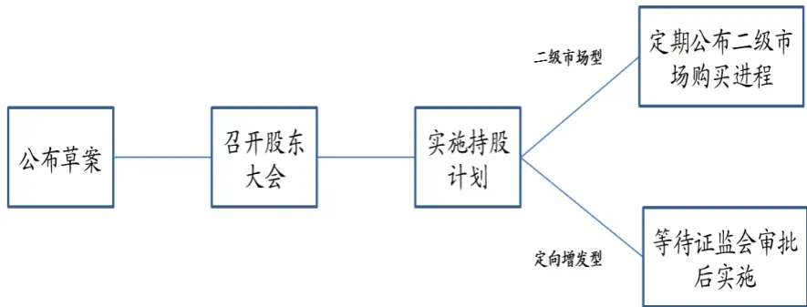

公司公布员工持股计划草案。草案中会详细介绍持股计划的相关细节，对持股计划的原则、参加者的资格、管理机构、财务政策、分配办法、员工责任、股份的回购等做出明确的规定。如果是通过定向增发方式实施员工持股，则在草案发布前，公司一般都会向监管机构申请停牌一段时间；如果通过二级市场购买方式，停牌个案较少。

召开股东大会，表决草案。草案提出后，先要通过股东大会。一般来说，草案在股东大会通过的概率非常高。

实施持股计划。如果是通过定向增发方式实施员工持股计划，那么接下来就会将定增方案提交证监会审核，待审核通过后才能正式实施计划；如果是通过二级市场购买方式实施，则股东大会通过日即视为计划实施日，公司有义务每隔一段时间（一般一个月左右）披露委托资产管理机构的股票收购进展。

V持股计划进入锁定期。在持股计划开始实行时，持股计划进入锁定期。锁定期一般为1年或3年，锁定期结束后，参与员工可按规定在存续期（即持股期限）结束前完成股票出售。至此，员工持股计划结束。

## 1.3.2. 员工持股计划的重要时间点及时间间隔

草案公告日。草案公告日是公司第一次正式向二级市场表明做员工持股计划，因此股价有所波动的可能性较大。从草案公告日到股东大会表决日，一般一周左右。

V对于二级市场购买型，需关注公司实施计划以及宣布购买完成这两个时点。由于是直接在二级市场购买股票，增加股票需求，加上市场预期的作用，股价可能会有所异动。《指导意见》规定上市公司需在股东大会通过草案后6个月内完成二级市场股票收购。

对于定向增发型，需关注股东大会通过到证监会审批通过这两个时间点。从股东大会通过草案到证监会批复，平均需要约100个交易日，但由于批复前可能涉及到方案修改，因此公司间差别较大，少的20个交易日即可通过，多的需要1年。

## 1.4.分二级市场型和定向增发型两个方向分析员工持股计划

通过1.3的分析可以发现，员工持股计划的实施方式对员工持股计划的步骤和时点有重要影响。从股票来源来看，主要有四种：(1)上市公司回购本公司股票；(2)二级市场购买；(3)非公开发行股票；(4)股东自愿赠与。由于绝大部分公司都是通过二级市场购买和定向增发两种方式获得股票，因此在后面的效果观察和策略研究中，我们根将样本分为二级市场型和定向增发型两类分别研究。

## 1.4.1. 二级市场型，没有那么简单

对外部投资者而言，二级市场购买型员工持股计划显著利好。由于是在二级市场上直接对股票形成边际需求，且这种增持计划无需监管层批复。因此对二级市场投资者而言，实施直接购买型计划的股票是很好的投资标的。

二级市场投资者与上市公司短期内利益对立。正是由于二级市场购买型的种种优势，投资者会在收购完成的公告发布前就买入公司股票，以期望成本能够尽量低于公司员工持股计划的成本。另一方面，公司希望收购价格能够尽量低，如果认为目前股价过高，也可能通过释放利空等方式降低市场预期，短期内稳住股价后再进行收购。

## 1.4.2. 定向增发型，需考虑监管层介入后各方博弈

定向增发型员工持股计划可按照一般定增思路进行研究。根据监管要求，定向增发价一般不低于停牌前20个交易日收盘价平均值的90%。也就是说，一旦宣布员工持股计划，其成本是确定的。但是另一方面，由于员工持股计划面临可能无法通过证监会审批的风险（例如股价期间涨幅太大)，因此从预案公告开始，到监管层批复的时间窗口期内，公司管理层、投资者之间的短期博弈会更加复杂。

## 2. 二级市场型，超额收益显著，需把握投资时点

自2014年7月起，到2015年2月结束，共有30家公司发布二级市场型员工持股预案。我们就以这30家公司作为样本，观察其收益情况。

表1公布二级市场型员工持股预案的上市公司名称和日期

| 股票代码 | 股票名称 | 公告日期 | 股票代码 | 股票名称 | 公告日期 |
| --- | --- | --- | --- | --- | --- |
| 002690.SZ | 美亚光电 | 2014/12/4 | 600703.SH | 三安光电 | 2014/8/13 |
| 300336.SZ | 新文化 | 2014/12/24 | 000671.SZ | 阳光城 | 2014/9/17 |
| 300199.SZ | 翰宇药业 | 2014/10/18 | 002089.SZ | 新海宜 | 2014/8/28 |
| 002353.SZ | 杰瑞股份 | 2014/12/20 | 002311.SZ | 海大集团 | 2014/12/5 |
| 002573.SZ | 国电清新 | 2014/12/13 | 002069.SZ | 獐子岛 | 2014/12/5 |
| 300213.SZ | 佳讯飞鸿 | 2014/12/25 | 002301.SZ | 齐心集团 | 2015/1/15 |
| 002131.SZ | 利欧股份 | 2014/12/31 | 300217.SZ | 东方电热 | 2014/11/27 |
| 300145.SZ | 南方泵业 | 2014/10/18 | 001696.SZ | 宗申动力 | 2014/11/8 |
| 300098.SZ | 高新兴 | 2014/11/29 | 002177.SZ | 御银股份 | 2015/1/22 |
| 300038.SZ | 梅泰诺 | 2014/12/25 | 002137.SZ | 实益达 | 2015/1/14 |
| 002399.SZ | 海普瑞 | 2014/7/10 | 000718.SZ | 苏宁环球 | 2014/12/11 |
| 000925.SZ | 众合科技 | 2014/12/6 | 002456.SZ | 欧菲光 | 2014/8/21 |
| 300065.SZ | 海兰信 | 2014/12/2 | 603699.SH | 纽威股份 | 2015/2/13 |
| 002250.SZ | 联化科技 | 2014/12/26 | 002375.SZ | 亚厦股份 | 2014/12/20 |
| 603001.SH | 奥康国际 | 2014/10/25 | 600388.SH | 龙净环保 | 2014/9/12 |

数据来源：Wind，国泰君安证券研究

## 2.1. 以草案公告日为事件日，样本累计收益v型反转

我们先以草案公告日为事件日，统计样本在[T-20、T+60]之间的绝对，相对于申万一级行业，以及相对于wind全A的累计收益情况。

## 2.1.1. 样本绝对累计收益稳步提升，但在草案公告日前后日收益为负

我们观察到[T-20、T]之间，样本累计绝对收益缓慢上升；T日前后，样本日绝对收益为负；[T、T+60]，样本累计收益稳步上升。牛市环境下，系统性风险是绝对累计收益持续上扬的主要原因，因此我们还需要观察样本相对收益情况。

图 2 样本在草案公告日前后日收益为负
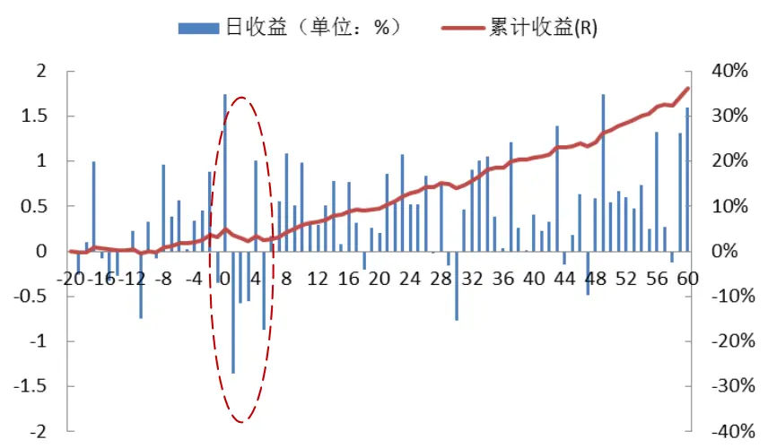
数据来源：Wind，国泰君安证券研究

## 2.1.2. 样本相对于行业收益出现v型反转，底部在公告后5-10 个交易日间

我们观察到[T-20、T+5]之间，样本累计相对收益不断下降，尤其是公告日后5个交易日；T日前后，可以更加明显的看日收益显著为负；T+5个交易日后，样本累计收益稳步上升，到T+60时能有接近10%的超额收益。

图 3 样本相对行业的累计收益底部在公告后5-10 个交易日之间
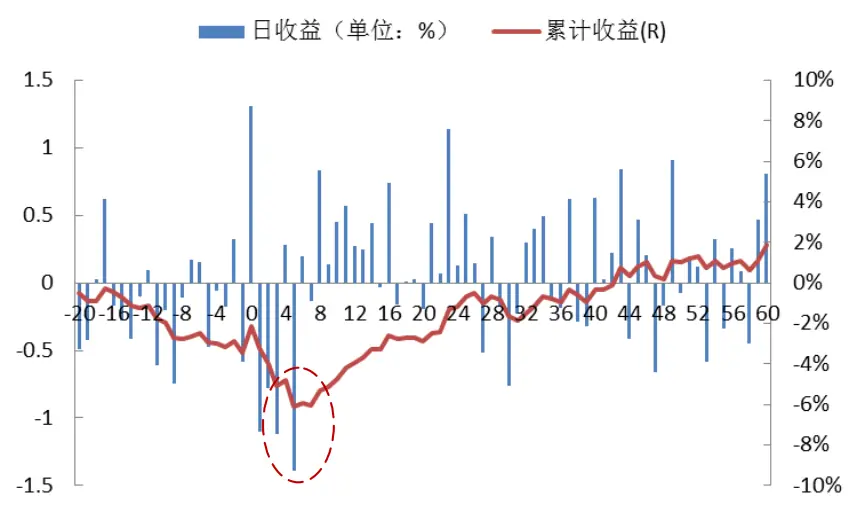
数据来源：Wind，国泰君安证券研究

## 2.1.3. 相对于 wind 全A 指数，样本累计收益同样出现 v型反转走势

样本相对于wind全A指数的走势与相对于行业的走势几乎一致，都是在[T-20、T+5]之间累计相对收益不断下降，尤其是公告日后5个交易日；都是T日前后日收益显著为负；都是T+5个交易日后，样本累计收益稳步上升，到T+60时能有接近10%的超额收益。

图4 样本相对 wind 全 A 的累计收益底部在公告后 5-10 个交易日之间
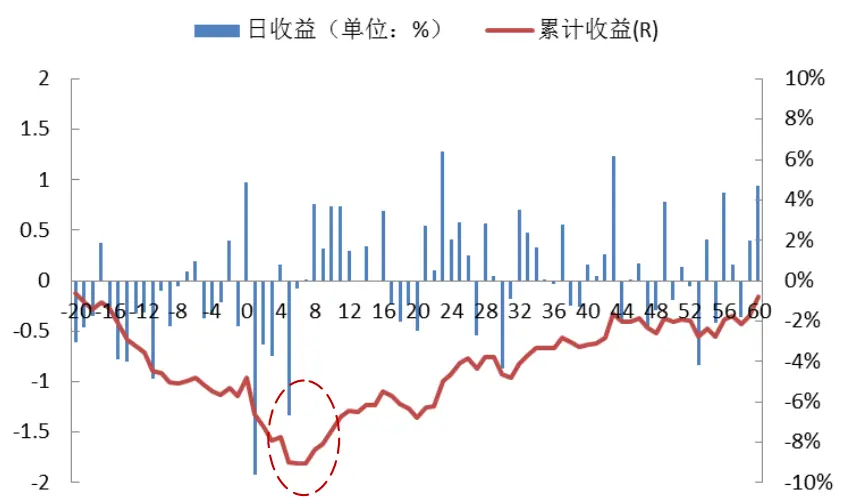
数据来源：Wind，国泰君安证券研究

## 2.1.4. 观察结果总结：上市公司与投资者各取所需

预案公告日前后样本收益为负，有利好兑现原因，下跌亦符合上市公司利益。公司实施二级市场型员工持股计划，希望持股成本越低越好；投资者忌于上市公司信息优势者地位，也不愿意在公告日前后买入而承受股价短期压力。

预案公告后5-10个交易日形成事件投资买点。在上市公司一定会通过二级市场买入股票的预期下，样本累计收益在公告日5个交易日后开始攀升。

## 2.2. 以公司完成购买为事件日，样本累计收益曲折向上

我们以公司宣布完成收购日为事件日，统计样本在[T、T+60]之间的绝对，相对于申万一级行业，以及相对于wind全A的累计收益情况。

## 2.2.1. 完成购买后，样本绝对收益稳步向上

我们观察到公司宣布完成购买后，累计收益依然稳步向上，直至T+50个交易日，之后绝对累计收益保持在45%左右。牛市环境下，系统性风险是绝对累计收益持续上扬的主要原因，因此我们还需要观察样本相对收益情况。

图 5 样本在公司宣布完成购买后日收益稳步向上
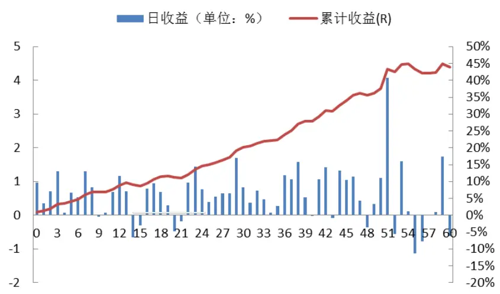

数据来源：Wind，国泰君安证券研究

## 2.2.2. 样本相对于行业、wind 全 A 的累计收益最高到 5%左右

从相对累计收益观察，策略收益波动加大，但依然能在事件后50个交易日到达最大值，相对于行业的超额收益超过6%，相对于wind全A的超额收益超过 5%。

图6 样本相对于行业、wind 全 A 的累计收益在 50 个交易日达到最大，约 5% - 6%左右
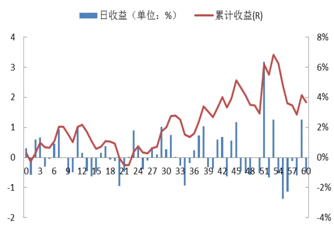
数据来源：Wind，国泰君安证券研究

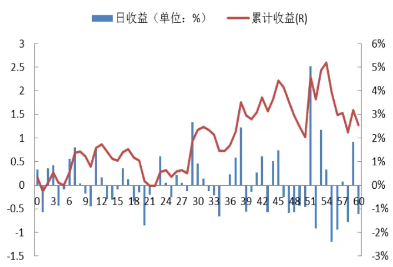

## 2.3.收益率影响因素分析：信心比黄金重要

## 2.3.1. 高管参与比例越高，收益越高

我们可以进一步把员工持股份额一分为二，分别是高管持股和一般员工持股。显然相较于一般员工，高管的信息优势更高，因此其持股比例可以反映其对公司未来股价信心。

我们将30个样本按照高管参与比例分为三组，分别观察每组样本未来60个交易日的平均超额收益。结果发现高管持股比例越高，平均累计超额收益越高；持股比例与累计超额收益的相关系数接近40%。

表2 高管持股比例与累计超额收益呈现出较强正相关性

| 平均持股比例 | 相对于 wind全A 收益 相对于行业收益 |  |
| --- | --- | --- |
| 最高档 | 41.34% 22% 8% | 17% |
| 中间档 | 15.10% | 10% |
| 最低档 | 3.13 -1% | -1% |
| 相关系数 | 39.96% | 38.61% |

数据来源：Wind，国泰君安证券研究

## 2.3.2. 杠杆比率越高，收益越高

杠杆比率也是衡量公司对未来股价信心的另一个重要变量，我们用优先端资金量除以非优先端资金量来衡量杠杆率。这里不考虑对非优先端的进一步分层，如果全部是自有资金则杠杆率为0。

同样将30个样本按照分为三组，分别观察每组样本未来60个交易日的平均超额收益。结果发现杠杆越高，平均累计超额收益越高。

表 3 杠杆率高低影响累计相对收益高低

| 平均杠杆率 | 相对于wind全A收益 相对于行业收益 |  |
| --- | --- | --- |
| 最高档 | 8.7:1 12% | 10% |
| 中间档 | 1.85:1 11% | 8% |
| 最低档 | 0.1:1 6% | 7% |

数据来源：Wind，国泰君安证券研究

## 3. 定向增发型，超额收益不过一瞬间

自2014年7月起，到2015年1月结束，共有24家公司发布定向增发型员工持股预案。同样，我们以这24家公司作为样本，观察其收益情况。

表4公布定向增发型员工持股预案的上市公司名称和日期

| 股票代码 | 股票名称 | 公告日期 | 股票代码 | 股票名称 | 公告日期 |
| --- | --- | --- | --- | --- | --- |
| 300244.SZ | 迪安诊断 | 2015/1/9 | 600290.SH | 华仪电气 | 2014/12/6 |
| 300269.SZ | 联建光电 | 2014/9/26 | 300179.SZ | 四方达 | 2014/12/23 |
| 300212.SZ | 易华录 | 2014/10/22 | 002449.SZ | 国星光电 | 2014/10/24 |
| 600332.SH | 白云山 | 2015/1/13 | 002389.SZ | 南洋科技 | 2015/1/22 |
| 600559.SH | 老白干酒 | 2014/12/2 | 000523.SZ | 广州浪奇 | 2014/12/29 |
| 300297.SZ | 蓝盾股份 | 2014/11/3 | 002567.SZ | 唐人神 | 2014/11/18 |
| 300290.SZ | 荣科科技 | 2014/9/30 | 300284.SZ | 苏交科 | 2014/9/15 |
| 002465.SZ | 海格通信 | 2014/11/12 | 000678.SZ | 襄阳轴承 | 2014/12/31 |
| 300056.SZ | 三维丝 | 2014/12/2 | 600016.SH | 民生银行 | 2014/11/8 |
| 000501.SZ | 鄂武商A | 2015/1/16 | 600018.SH | 上港集团 | 2014/11/18 |
| 300001.SZ | 特锐德 | 2014/7/23 | 600282.SH | 南钢股份 | 2014/12/26 |
| 300066.SZ | 三川股份 | 2014/10/14 | 300296.SZ | 利亚德 | 2015/1/5 |

数据来源：Wind，国泰君安证券研究

## 3.1. 以预案公告日为事件日，样本累计收益过于集中

同样，这里我们以预案公告日为事件日，统计样本在[T-20、T+60]之间的绝对，相对于申万一级行业，以及相对于wind全A的累计收益情况。需要说明的是，定向增发型员工持股计划一般会在公告发布前会停牌一段时间，因此我们在统计时将停牌这段时间剔除掉。

## 3.1.1. 样本绝对累计收益不断提升，集中在公告日前后

我们观察到[T-20、T-5]之间，样本累计绝对收益缓慢上升；[T-4、T+4]之间，样本累计收益迅速上升；[T+4、T+60]，样本累计收益稳步上升。牛市环境下，系统性风险是绝对累计收益持续上扬的主要原因，因此我们还需要观察样本相对收益情况。

图7 样本绝对收益集中在公告日前后
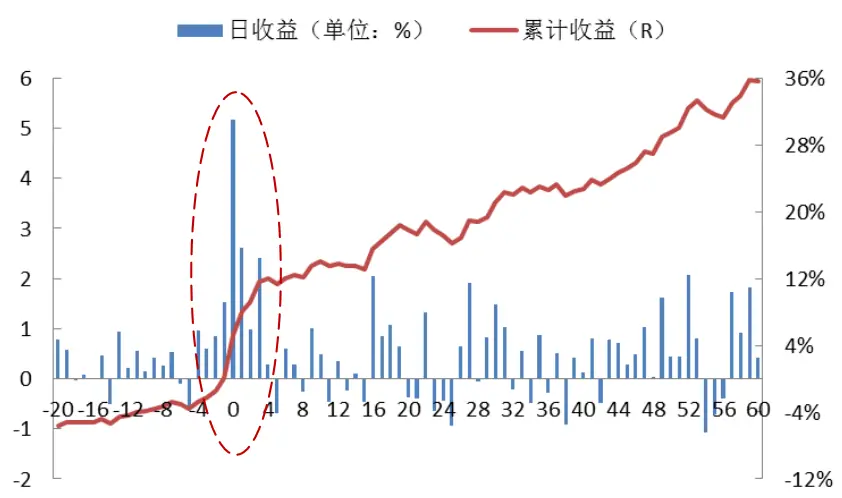
数据来源：Wind，国泰君安证券研究

## 3.1.2. 相对于行业，样本超额收益完全集中在公告日前后

我们观察到[T-20、T-5]之间，样本累计相对收益不显著；在[T-4、T+4]之间迅速上升约10%；T+5个交易日后，样本累计相对收益不再上升。

图8样本相对行业的累计收益完全集中在公告日前后
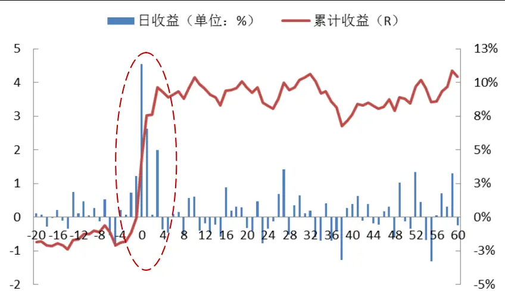
数据来源：Wind，国泰君安证券研究

## 3.1.3. 相对于 wind 全A 指数，样本收益同样集中在公告日前后

和相对于行业一样，我们观察到[T-20、T-5]之间，样本累计相对收益不显著，甚至略有下降；在[T-4、T+4]之间迅速上升约10%；T+5 个交易日后，样本累计相对收益缓慢下降。

图 9 样本相对 wind 全 A 的累计收益完全集中在公告日前后
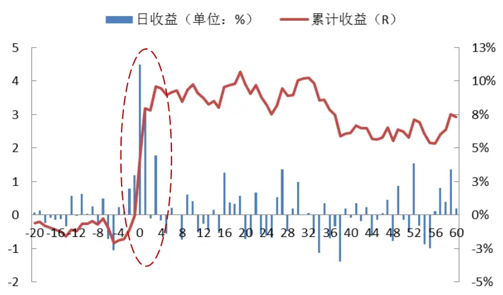
数据来源：Wind，国泰君安证券研究

## 3.1.4. 观察结果总结：股价上涨集中在事件日前后，投资窗口有限

事件前，股价跟随指数走，上市公司达到降低持股成本的目标。

事件中，消息跟着股价走，相对累计收益的80%集中在事件日前后4个交易日内。

T+4日后，一方面预案信息比较充分的反应在股价中，另一方面担心方案无法通过证监会风险，股价继续横着走。

从观察结果来看，[T、T+2]间如能买入，可以买。但不宜期望过高收益，同时持股时间宜短不宜长。

## 4. 投资策略制定

## 4.1.二级市场型：半个月换仓一次，持有三个月

在前面的样本观察中，我们发现二级市场型员工持股的股票，累计收益在公告后5-10个交易日开始反转，并在60个交易日下一直稳步向上。因此我们采用的投资策略是：每个月的月中和月底对前两周发布员工持股草案公告的公司进行筛选，并等权建仓，持有时间为三个月。由于半个月调一次仓，因此我们每月调仓资金占总持仓的1/6。

通过前面的分析，我们发现高管持股比例和杠杆率对股票后续收益有比较显著的影响，因此我们制定了两种投资策略：（1）“无差别”投资策略。不考虑上述两个影响因素，只要实施了二级市场型员工持股，我们就在下一个调仓日将其纳入到组合中；（2）“双高”投资策略。不仅要求实施员工持股，还同时要求高管参与和带杠杆（如草案没有提及则不作要求)。由于样本内观察的时间截至2015年2月，因此样本外检验从3月开始。

表5“无差别”投资策略股票池

| 3月20日建仓 安利股份、欣龙控股、上海家化 |
| --- |
| 3月31日建仓 科力远、广联达 |
| 4月17日建仓 中南建设、中南重工、鼎龙股份、中安消、东方园林、金运激光、大华股份、慈星股份、双塔食品、瑞康医药、怡球资源、东光微电、万达信息 |
| 4月30日建仓 威创股份、隆鑫通用、歌尔声学 |
| 5月15日建仓 长信科技、国联水产、天华超净、达意隆、华孚色纺、九牧王、雏鹰农牧、海能达 |

数据来源：Wind，国泰君安证券研究

在不到两个月的样本外检验中，策略累计收益48.98%，最大回撤仅1.97，信息比率1.06，应该说开了个不错的头。

图 10 策略在 3-5 月 中能有效跑赢万得全 A 指数
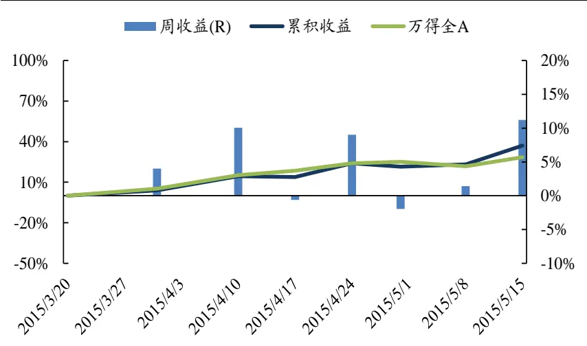
数据来源：Wind，国泰君安证券研究

## 4.1.2.“双高”投资策略：大幅跑赢 wind 全 A 指数

“双高”投资策略由于加入了管理层参与计划以及有杠杆两个条件，因此持股数量相应的减少。建仓时间同样从3月20日开始。

表6“双高”投资策略股票池

| 3月20日建仓 安利股份、欣龙控股 |
| --- |
| 3月31日建仓 科力远 |
| 4月17日建仓 中南重工、鼎龙股份、中安消、东方园林、金运激光、 |
| 大华股份、瑞康医药、怡球资源、东光微电、万达信息 |
| 4月30日建仓 威创股份 |
| 5月15日建仓 、国联水产、华孚色纺、雏鹰农牧、海能达 |

数据来源：Wind，国泰君安证券研究

“双高”投资策略的收益显著高于“无差别”投资策略，两个月的累计

收益达到 61.28%，周胜率 100%，信息比率高达8.43%。

图 11 策略在 3-5 月 中能大幅跑赢万得全 A 指数
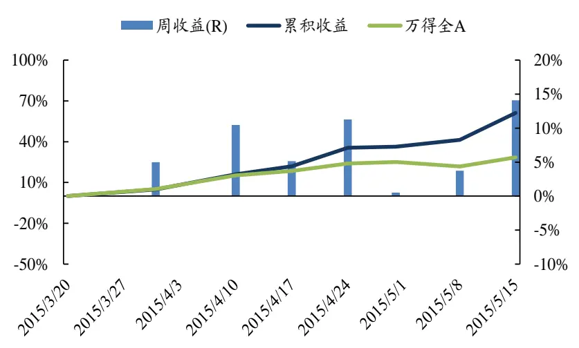
数据来源：Wind，国泰君安证券研究

表 7 两种策略收益风险指标一览

| “无差别”策略 | “双高”策略 |
| --- | --- |
| 年化收益率 178.12% | 294.16% |
| 年化波动率 38.83% | 34.90% |
| 周胜率 71.43% | 100.00% |
| 周最大回撤 -1.97% | 0.00% |
| 夏普比率 4.46 | 8.29 |
| 信息比率 1.06 | 8.43 |
| 收益最大回撤比 90.36 | 缺省 |

数据来源：Wind，国泰君安证券研究

## 4.2. 定向增发型：从定增破发思路出发，寻找投资机会

## 4.2.1. 样本股票最低价距离定增价的平均距离 6%

我们首先定义股价和定增价之间的距离：D = [P(min)-P(offer)]/P(offer)

P(offer)：定增价

P(min)：预案公告日后60个交易日内股票的最低收盘价

在牛市环境下，24只发布定向增发型员工持股计划的股票，仅8只在预案公告日后60个交易日内跌破发行价。

其中股价距离定增价最小值为-30.5%，距离最大值为31.6%，平均距离为 6%

图 12 样本股票最低价距离定增价的平均距离 6%
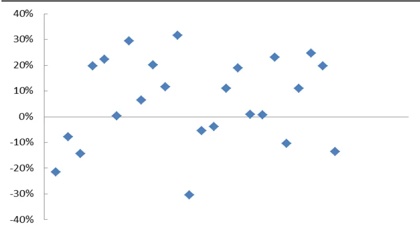
数据来源：Wind，国泰君安证券研究

## 4.2.2. 如能以最低价买入，60 个交易日的相对收益接近 40%

假设我们能够以最低价买入样本股票，并继续持有60个交易日，那么样本平均绝对收益达到66%，并且100%实现盈利。同时，相对于wind全A和行业的收益达到39%，相对胜率达到87.5%。因此，我们考虑利用定增破发的思想制定定增型员工持股投资策略。

## 4.2.3. [T、T+90]间，如股价能回落到定增价的 1.05 倍之下，买入

我们采用的策略是：从预案公告日算起，若股价在60个交易日内回落到定增价的1.05倍之下，买入并继续持有60个交易日。样本中共有11只股票曾经触发买入条件，统计其持有60个交易日的收益，我们发现现其相对于行业和 wind 全A的累计相对收益均能达到20%之上。

图 13 如能以最低价买入，相对于行业、wind 全A 的累计相对收益在 60 个交易日能达到20%之上
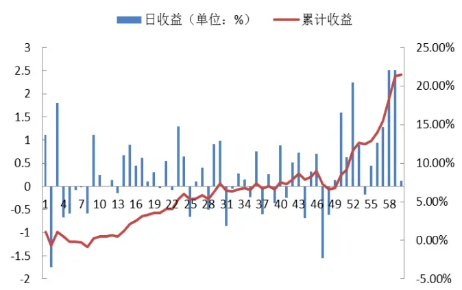
数据来源：Wind，国泰君安证券研究

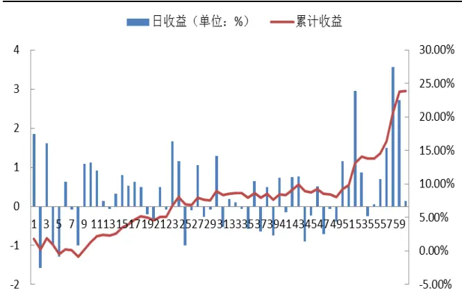

## 4.3.5月中上旬最新投资标的一览

## 4.3.1. 5月中上旬有8家公司公布二级市场型草案

表8 5月中上旬有8家公司公布二级市场型草案

| 公司名称 | 代码 | 草案公告日 | 高管资金占比 | 杠杆率 |
| --- | --- | --- | --- | --- |
| 天华超净 | 300390.SZ | 2015/5/4 | 15.01% 0 |  |
| 达意隆 | 002209.SZ | 2015/5/5 | 20.57% | 0 |
| 华孚色纺 | 002042.SZ | 2015/5/9 | 17.00% | 1.5 |
| 九牧王 | 601566.SH | 2015/5/9 | 19.32% | 0 |

| 雏鹰农牧 | 002477.SZ | 2015/5/9 | 18.54% 2 |
| --- | --- | --- | --- |
| 海能达 | 002583.SZ | 2015/5/13 | 3.23% 3 |
| 华策影视 | 300133.SZ | 2015/5/15 | 5.54% 2 |
| 宝新能源 | 000690.SZ | 2015/5/16 | 58.92% 0 |

数据来源：Wind，国泰君安证券研究

## 4.3.2. 5 月中上旬有 11 家公司公布定向增发型预案

表9 5 月中上旬有11 家公司公布定向增发型预案

| 公司名称 | 代码 | 草案公告日 | 高管资金占比 |
| --- | --- | --- | --- |
| 天华超净 | 300390.SZ | 2015/5/4 | 15.01% |
| 潮宏基 | 002345.SZ | 2015/5/5 | 25.33% |
| 顺荣三七 | 002555.SZ | 2015/5/5 | 21.80% |
| 华伍股份 | 300095.SZ | 2015/5/6 | 15.46% |
| 山东黄金 | 600547.SH | 2015/5/7 | 17.29% |
| 精诚铜业 | 002171.SZ | 2015/5/11 | 33.55% |
| 金新农 | 002548.SZ | 2015/5/12 |  |
| 智光电气 | 002169.SZ | 2015/5/12 | 47.70% |
| 赞宇科技 | 002637.SZ | 2015/5/14 | 0.00% |
| 宝新能源 | 000690.SZ | 2015/5/16 | 58.92% |
| 西宁特钢 | 600117.SH | 2015/5/19 |  |

数据来源：Wind，国泰君安证券研究
注：天华超净的股票来源既有二级市场购买，也有定向增发，故出现在两张表中

## 5. 策略风险

## 5.1. 样本规模较小，策略稳定性需进一步确认

虽然采用员工持股计划的公司在迅速增加，但由于我们需要观察样本在预告后至少3个月的收益，加上拆成了二级市场型和定向增发型两个子样本，因此样本数量就显得比较寒碜了。虽然策略的逻辑性较强，但未来依然需要进一步观察策略的稳定性。

## 5.2.无法覆盖完整牛熊周期，参数需进一步商榷

员工持股计划在2014年7月才开始实施，在这个时点上A股已经进入牛市时期，因此基于历史数据我们无法考察策略在牛市和震荡市中的表现。这样一来我们设置的一些参数，例如定增投资策略的1.05这个参数在市场环境切换时就有可能变得不合时宜，这些都需要在后面进行跟踪和做必要的修正。

## 本公司具有中国证监会核准的证券投资咨询业务资格

## 分析师声明

作者具有中国证券业协会授予的证券投资咨询执业资格或相当的专业胜任能力，保证报告所采用的数据均来自合规渠道，分析逻辑基于作者的职业理解，本报告清晰准确地反映了作者的研究观点，力求独立、客观和公正，结论不受任何第三方的授意或影响，特此声明。

## 免责声明

本报告仅供国泰君安证券股份有限公司（以下简称“本公司”）的客户使用。本公司不会因接收人收到本报告而视其为本公司的当然客户。本报告仅在相关法律许可的情况下发放，并仅为提供信息而发放，概不构成任何广告。

本报告的信息来源于已公开的资料，本公司对该等信息的准确性、完整性或可靠性不作任何保证。本报告所载的资料、意见及推测仅反映本公司于发布本报告当日的判断，本报告所指的证券或投资标的的价格、价值及投资收入可升可跌。过往表现不应作为日后的表现依据。在不同时期，本公司可发出与本报告所载资料、意见及推测不一致的报告。本公司不保证本报告所含信息保持在最新状态。同时，本公司对本报告所含信息可在不发出通知的情形下做出修改，投资者应当自行关注相应的更新或修改。

本报告中所指的投资及服务可能不适合个别客户，不构成客户私人咨询建议。在任何情况下，本报告中的信息或所表述的意见均不构成对任何人的投资建议。在任何情况下，本公司、本公司员工或者关联机构不承诺投资者一定获利，不与投资者分享投资收益，也不对任何人因使用本报告中的任何内容所引致的任何损失负任何责任。投资者务必注意，其据此做出的任何投资决策与本公司、本公司员工或者关联机构无关。

本公司利用信息隔离墙控制内部一个或多个领域、部门或关联机构之间的信息流动。因此，投资者应注意，在法律许可的情况下，本公司及其所属关联机构可能会持有报告中提到的公司所发行的证券或期权并进行证券或期权交易，也可能为这些公司提供或者争取提供投资银行、财务顾问或者金融产品等相关服务。在法律许可的情况下，本公司的员工可能担任本报告所提到的公司的董事。

市场有风险，投资需谨慎。投资者不应将本报告为作出投资决策的惟一参考因素，亦不应认为本报告可以取代自己的判断。在决定投资前，如有需要，投资者务必向专业人士咨询并谨慎决策。

本报告版权仅为本公司所有，未经书面许可，任何机构和个人不得以任何形式翻版、复制、发表或引用。如征得本公司同意进行引用、刊发的，需在允许的范围内使用，并注明出处为“国泰君安证券研究”，且不得对本报告进行任何有悖原意的引用、删节和修改。

若本公司以外的其他机构（以下简称“该机构”）发送本报告，则由该机构独自为此发送行为负责。通过此途径获得本报告的投资者应自行联系该机构以要求获悉更详细信息或进而交易本报告中提及的证券。本报告不构成本公司向该机构之客户提供的投资建议，本公司、本公司员工或者关联机构亦不为该机构之客户因使用本报告或报告所载内容引起的任何损失承担任何责任。

## 评级说明

## 1. 投资建议的比较标准

投资评级分为股票评级和行业评级。

以报告发布后的12个月内的市场表现为比较标准，报告发布日后的12个月内的公司股价（或行业指数）的涨跌幅相对同期的沪深300指数涨跌幅为基准。

## 2. 投资建议的评级标准

报告发布日后的12个月内的公司股价（或行业指数）的涨跌幅相对同期的沪深300指数的涨跌幅。

| 评级 | 说明 |  |
| --- | --- | --- |
| 股票投资评级 | 增持 | 相对沪深 300指数涨幅15%以上 |
|  | 谨慎增持 | 相对沪深300指数涨幅介于5%～15%之间 |
|  | 中性 | 相对沪深300指数涨幅介于-5%～5% |
|  | 减持 | 相对沪深300指数下跌5%以上 |
| 行业投资评级 | 增持 | 明显强于沪深 300 指数 |
|  | 中性 | 基本与沪深300指数持平 |
|  | 减持 | 明显弱于沪深300指数 |

## 国泰君安证券研究

|  | 上海 | 深圳 | 北京 |
| --- | --- | --- | --- |
| 地址 | 上海市浦东新区银城中路168号上海 银行大厦29层 | 深圳市福田区益田路 6009 号新世界 商务中心34层 | 北京市西城区金融大街28 号盈泰中 心2号楼10层 |
| 邮编 | 200120 | 518026 | 100140 |
| 电话 | (021)38676666 | （0755)23976888 | (010)59312799 |
|  | E-mail: gtjaresearch@gtjas.com |  |  |