inInfo] [Table_Title] 2015.05.22

## 基于阻力的市场投资策略

# ——数量化专题之五十九

玉刘富兵（分析师）

8 021-38676673

liufubing008481@gtjas.com

证书编号 S0880511010017

## 本报告导读：

基于对市场阻力的定量刻画，构建了相对阻力指标，将其运用于指数择时和行业配臵策略，取得了较好的效果。

## 摘要：

[Table_Summary] • 所有物质都沿最小阻力的曲线轨道而运行，股票价格亦是如此。通过定量的刻画阻力的大小，可以找到市场价格的运动方向。

- 阻力不是单指向上的阻力，而是对趋势的阻力，那么就包括了向下的阻力--支撑力。阻力的方向就由抛盘和买盘的此消彼涨所决定，所以阻力事实上是一个合力。

- 我们认为市场的阻力应具有如下性质：

阻力应该与过去一段时间的交易量是紧密相关的，以当前的价格为基准，高于当前价格成交量越大，向上的阻力就越大，反之亦然。

阻力的大小应该与价格的距离成反向关系，历史交易价格距当前价格越远，形成的阻力便越小，反之则越大。

阻力的大小应该与交易时间成反向关系，即交易形成的时间越早,对现在所形成的阻力便越小，反之则越大。

- 基于相对阻力指标的指数择时策略，基本上可以把握大的市场趋势：在牛市中跟住市场走势，在熊市中规避大幅下跌。若进行双边多空择时策略，年化收益接近 40%。

原则上，行业轮动应同样符合阻力规律，资本总是流向阻力最小的行业，循环往复推动行业风格的不断轮动。基于相对阻力指数的多空对冲行业配臵策略，在考虑周频率交易成本的情况下，可获取年化 19.66%的超额收益，同时实现了每年都有正收益的业绩。

本报告对于阻力的定义与刻画只是进行初步的尝试与探索，对于阻力的定量刻画还存在着诸多不足之处。但我们认为研究阻力是件很有意义的事情，如果我们能找到真正的阻力，我们也就找到了投资的一个落脚点，市场个股择时也好，行业轮动也罢，都可以从阻力的角度去寻找投资线索。

- 在后续的研究中，我们将考虑更多的因素，以求更加有效的量化市场阻力。

金融工程

## 金融工程团队：

刘富兵：（分析师）

电话：021-38676673

邮箱：liufubing008481@gtjas.com

证书编号：S0880511010017

赵延鸿：（分析师）

电话：021-38674927

邮箱：zhaoyanhong@gtjas.com

证书编号：S0880515030004

## 耿帅军：（分析师）

电话：010-59312753

邮箱：gengshuaijun@gtjas.com

证书编号：S0880513080013

## 刘正捷：（分析师）

电话：0755-23976803

邮箱：liuzhengjie012509@gtjas.com

证书编号：S0880514070010

## 李雪君：（研究助理）

电话：021-38675855

邮箱：lixuejun@gtjas.com

证书编号：S0880114090056

王浩：（研究助理）

电话：021-38676434

邮箱：wanghao014399@gtjas.com

证书编号：S0880114080041

## 陈奥林：（研究助理）

电话：021-38674835

邮箱：chenaolin@gtjas.com

证书编号：S0880114110077

## 李辰：（研究助理）

电话：021-38677309

邮箱：lichen@gtjas.com

证书编号：S0880114060025

## [Table_R相关报告

《沪深 300 成份股调整-超额收益正当时》2015.05.15

《探究交易公开信息之市场观察篇》2015.05.07

《信用风险与股票投资》2015.05.07

《成长趋势因子-财务数据中再掘金》2015.05.05

## 1. 股价总是沿着阻力最小的方向运动

我们都知道，自然界的规则是遵循最小阻力的路径：所有的物质都沿着最小阻力的曲线轨道而运行。电的传导、水的流动、或是汽车的行驶，都遵循这一规律。河水不需要计划自己的行进路线，却毫无例外的到达海洋。我们经常讲的“顺势而为”就是遵循了最小阻力路径。

证券市场自然也不例外，其价格的运动如同流水一样，也会遵循阻力最小的途径，股票价格会根据碰到的阻力来决定上升或下跌：如果上升的阻力比下跌的阻力小，价格就上涨，反之则下跌。《股票做手回忆录》中的利弗莫尔曾经说过，股价总是沿着阻力最小的方向运动。

尽管市场中有基本面分析、资金面分析、政策面分析、价格行为分析，甚至投资心理分析等诸多研究，但或许他们的最终落脚点都是为了确立市场的最小阻力路径。

本文试图通过市场价格和成交量对最小阻力进行简单的分析与研究，以期对投资者有所帮助。

## 2. 阻力的定义及刻画

如果是阻力决定了价格运动的方向，那么如何定义及刻画阻力便显得尤为重要。本节，我们将给出我们对阻力的理解以及计算公式。

## 2.1. 阻力的含义

阻力不是单指向上的阻力，而是对趋势的阻力，那么就包括了向下的阻力--支撑力。趋势向上遇到的阻力是由抛盘构成的，趋势向下遇到的阻力是由买盘构成的。阻力的方向就由抛盘和买盘的此消彼涨所决定，所以阻力事实上是一个合力。

## 2.2.阻力的性质

我们认为市场的阻力应具有如下性质：

1. 阻力应该与过去一段时间的交易量是紧密相关的，以当前的价格为基准，高于当前价格成交量越大，向上的阻力就越大，反之亦然。

2. 阻力的大小应该与价格的距离成反向关系，历史交易价格距当前价格越远，形成的阻力便越小，反之则越大。

3. 阻力的大小应该与交易时间成反向关系，即交易形成的时间越早,对现在所形成的阻力便越小，反之则越大。

## 2.3. 阻力的计算

根据我们对阻力的定义以及理解，我们将阻力定义为绝对阻力与相对阻力，其中

绝对阻力= ∑ Vi *ω1i 2* i • -∑Vj 1* j • 2 * j • i cp p• j c p p•

相对阻力= ∑ Vi*ω1*ω2i / ∑Vj*ω1j*ω2ji cp p•j

其中 $V_{\mathrm{\Omega}_{i}}$ 表示历史第i天的成交额， $\omega_{_{1i}}$ 表示成交额的距离加权， $\omega_{\textrm{ { 2 i } }}$ 表示成交额的时间加权，且

$$
\omega_{_{1i}}=\log{[1/(abs({p_{i}-p_{c}})/{p_{c}})]}
$$

$$
\omega_{_{2i}}=\log\left(\textit{ j }+1\right)/\log\left(N+1\right)
$$

由于相对阻力是一个比值，消除了量纲的影响，相对更合理些，因此后续我们主要对相对阻力进行研究。

## 3. 基于阻力的市场择时策略

## 3.1.阻力与市场走势

我们以过去 120 个交易日的价格与成交量来计算市场的相对阻力。图 1给出了沪深 300 与阻力的走势。由图 1 可以看出，阻力基本上以 0.5 为中轴上下波动，当市场处于牛市时，阻力基本在 0值附近运动；当市场处于熊市时，阻力基本在1 值附近运动。

图 1 市场走势与阻力
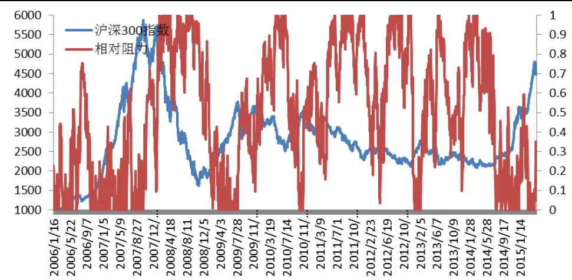
数据来源：国泰君安证券研究，wind

## 3.2.基于阻力的市场择时策略

基于上述观察，我们可以构建基于阻力的市场择时策略：当阻力下穿超过某一水平时，我们就做多该指数；当下穿时就平仓或做空该指数。

## 3.2.1. 基于阻力的单边做多策略

我们以0.55的阻力水平作为牛熊分界线进行单边做多操作，即阻力低于0.55时做多指数，高于 0.55时空仓。具体的策略收益及统计分析如下面的图表所示：

图 2单边做多策略累计收益图
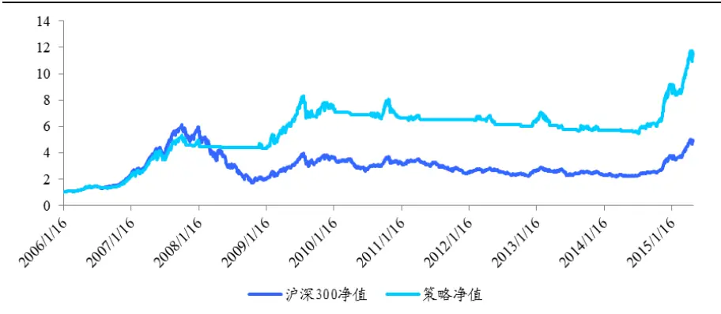
数据来源：国泰君安证券研究，wind

表 1 单边做多策略绩效分析表

| 指标 数值 |
| --- |
| 累积收益 1163.30% |
| 年化收益 29.22% |
| 最大回撤 34.38% |
| 交易次数 56 |
| 胜率 33.93% |
| 盈亏比 19.28 |

数据来源：国泰君安证券研究，wind

由上述图表可以看出，基于阻力的单边做多策略取得了较好的效果：过去10年总共操作56次，年化收益接近 30%，尽管胜率只有 33%，但盈亏比很高，接近20。

分年度来看，与沪深300相比，该策略表现较为稳定：在牛市中基本上跟住了沪深300的收益，同时熊市中基本上躲过了较大幅度的亏损。年度具体收益如下图所示：

图 3 单边做多策略年度收益图
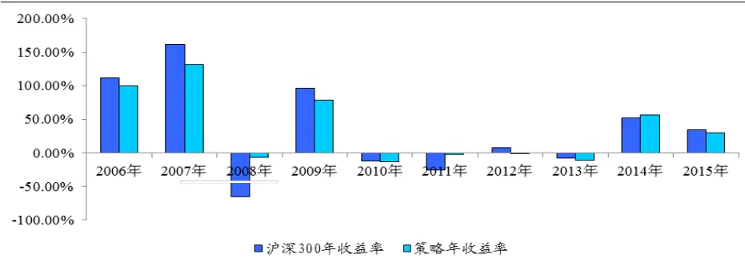
数据来源：国泰君安证券研究，wind

## 3.2.2. 基于阻力的双边多空策略

我们仍以0.55的阻力水平作为牛熊分界线进行双边多空操作，即阻力低于 0.55 时做多指数，高于 0.55 时做空指数。具体的策略收益及统计分析如下面的图表所示：

图 4双边多空策略累计收益图
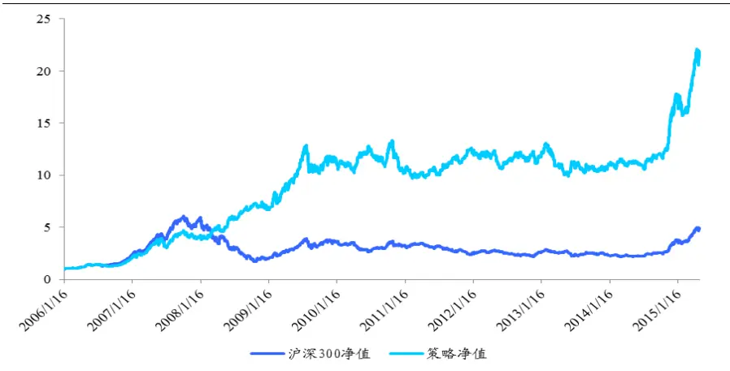
数据来源：国泰君安证券研究，wind

表 2 双边多空策略绩效分析表

| 指标 | 数值 |
| --- | --- |
| 累积收益 | 2182.40% |
| 年化收益 | 37.32% |
| 最大回撤 | 27.18% |
| 交易次数 | 111 |
| 胜率 | 27.93% |
| 多头胜率 | 33.93% |
| 空头胜率 | 21.82% |
| 盈亏比 | 14.46 |

数据来源：国泰君安证券研究，wind

由上述图表可以看到，基于阻力的双边多空策略年化收由单边的 30%提高到37%，不过由于空头胜率只有 21%，从而拉低了整体胜率，盈亏比也有所降低。

分年度来看，与沪深 300相比，该策略表除了在牛市中基本上跟住了沪深300的收益，同时在 2008年以及2011年的熊市中也有较大的正收益。年度具体收益如下图所示：

图 5 双边多空策略年度收益图
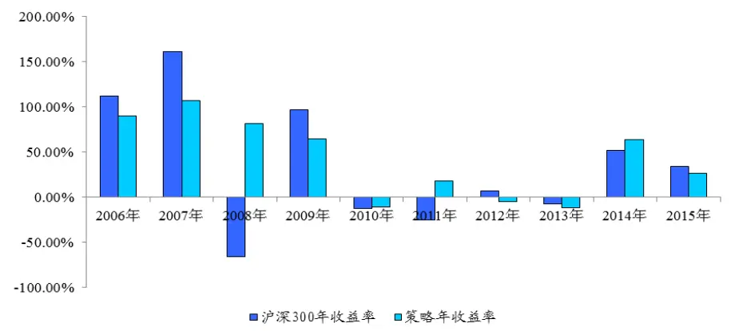
数据来源：国泰君安证券研究，wind

## 3.2.3. 参数的敏感性测试

在基于阻力进行市场择时时有两个重要参数需要设定，一个是计算阻力时的时间参数选取，一个是界定牛熊分界的阻力水平的选取。下面我们将以单边做多策略为例，分别就这两个参数进行敏感性分析。下面的图表给出了选取不同牛熊分界值得市场择时策略。

图 6 不同牛熊分界线下的市场择时策略
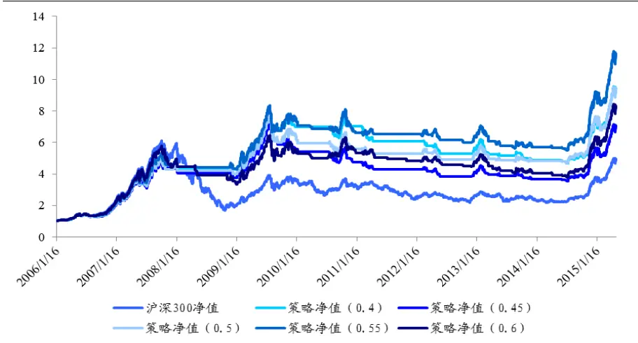
数据来源：国泰君安证券研究，wind

表 3 不同牛熊分界线下的单边做多策略绩效分析

| 参数设定 | 0.4 | 0.45 | 0.5 | 0.55 | 0.6 |
| --- | --- | --- | --- | --- | --- |
| 累计收益率 | 944.10% | 707.10% | 940.60% | 1163.30% | 831.90% |
| 年化收益率 | 26.47% | 23.48% | 26.79% | 29.22% | 25.75% |
| 最大回撤 | 39.75% | 51.30% | 39.81% | 34.38% | 42.33% |
| 信号次数 | 74 | 74 | 57 | 56 | 54 |
| 胜率 | 35.14% | 20.27% | 28.07% | 34% | 27.78% |
| 盈亏比 | 11.72 | 18.35 | 16.86 | 19.28 | 16.64 |

数据来源：国泰君安证券研究，wind

由图6和表 3 可以看出，综合年化收益、胜率以及最大回撤等指标，以0.55作为牛熊分界值效果较好，偏离该值越大，择时效果相对越差。

下面的图表给出了计算阻力时所采用的不同周期下的择时策略效果。

图 7 不同阻力计算周期下的市场择时策略
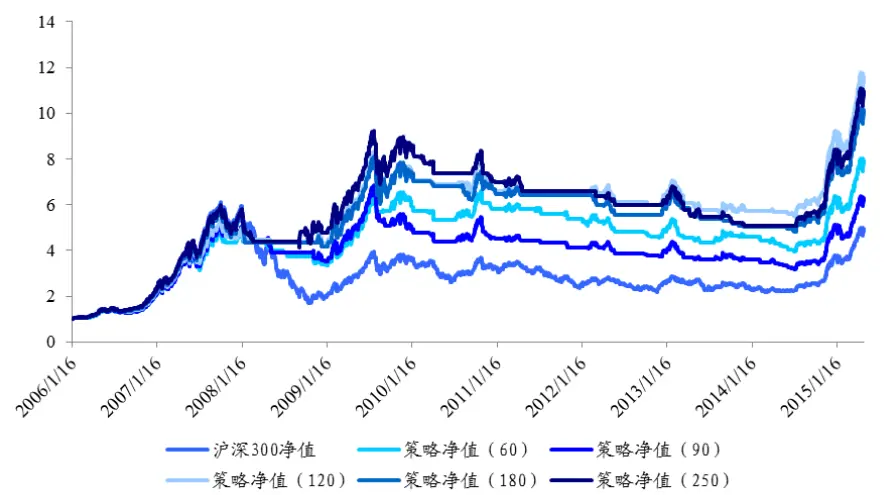
数据来源：国泰君安证券研究，wind

表 4 不同阻力计算周期下的单边做多策略绩效分析

| 参数设定 | 60 | 90 | 120 | 180 | 250 |
| --- | --- | --- | --- | --- | --- |
| 累计收益率 | 793.80% | 629.20% | 1163.30% | 1012.20% | 1096.90% |
| 年化收益率 | 24.95% | 22.46 | 29.22% | 27.86% | 29.07% |
| 最大回撤 | 39.90% | 53.60% | 34.38% | 40.29% | 45.16% |
| 信号次数 | 87 | 78 | 56 | 48 | 49 |
| 胜率 | 26.44% | 26.92% | 33.93% | 27% | 36.73% |
| 盈亏比 | 12.5 | 11.8 | 19.28 | 22.19 | 13.38 |

数据来源：国泰君安证券研究，wind

由图7及表 4 可以看出，综合年化收益、胜率以及最大回撤等指标，计算阻力的周期选取120 个交易日效果较好。不过，当计算阻力的周期在120-250 个交易日之间时，策略的收益及波动性相对趋于稳定。

## 3.3.基于阻力的改进市场择时策略

尽管上一节构建的市场择时策略取得了较好的效果，但我们发现该策略的胜率较低，不足30%，这说明该模型也发出了很多无效信号：很多时候阻力值在我们定义的牛熊分界线上下来回波动，导致我们不断地高买低卖，但市场却依然没有形成趋势。为了有效的降低信号的噪音，我们可以将牛熊分界线扩展成牛熊分界带，即阻力线设臵一个区间。相应的择时策略为：当阻力线下穿阻力下限时，做多指数；当阻力线上穿阻力上限时，空仓或做空指数；当阻力线界于上下限时，维持原来的操作不变。

由图 1 可以发现，在牛市时，阻力线基本快速跌破到 0.5 以下，而在熊市时，阻力线基本快速上升到0.9以上，并较长时间的保持在 1的水平。基于上述观察，我们可以将阻力下限设定在0.5，而阻力上限设定在 0.9，忽略中间的波动。

## 3.3.1. 改进的单边做多策略

我们设定0.5到0.9的牛熊分界带进行单边做多策略：当阻力低于0.5时做多指数，当阻力高于0.9时空仓，当阻力介于0.5-0.9之间时，维持上次的操作。具体的策略收益如下面的图表所示：

图 8改进的单边做多策略累计收益图
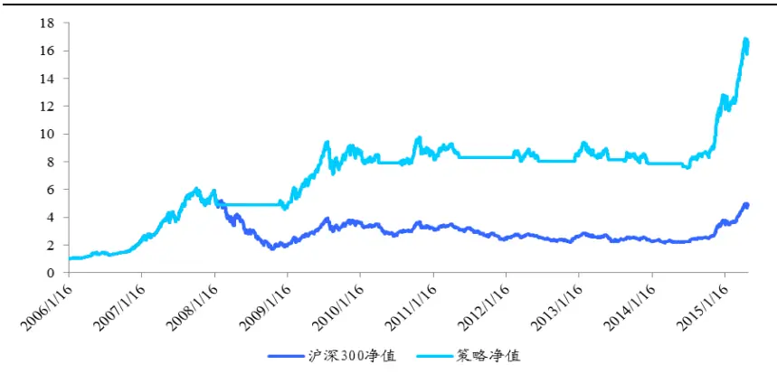
数据来源：国泰君安证券研究，wind

表 5 改进的单边做多策略绩效分析表

| 指标 | 数值 |
| --- | --- |
| 累积收益 | 1669.80% |
| 年化收益 | 33.72% |
| 最大回撤 | 25.70% |
| 交易次数 | 8 |
| 胜率 | 62.50% |
| 盈亏比 | 39.54 |

数据来源：国泰君安证券研究，wind

图 9改进的单边做多策略年度收益图
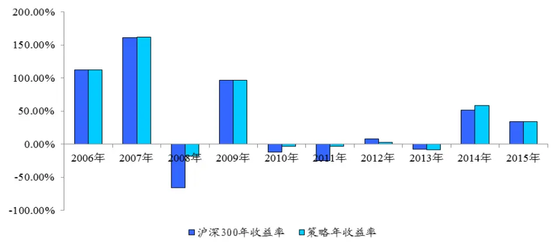
数据来源：国泰君安证券研究，wind

由上述图表可以看出，改进后的单边做多策略，收益率略有提高，但交易次数大幅降低，最大回撤有所降低，同时胜率大幅提高。

## 3.3.2. 改进的双边多空策略

我们设定0.5到0.9的牛熊分界带进行双边多空策略：当阻力低于0.5时做多指数，当阻力高于0.9时做空指数，当阻力介于 0.5-0.9之间时，维持上次的操作。具体的策略收益如下面的图表所示：

图 9改进的双边多空策略累计收益图
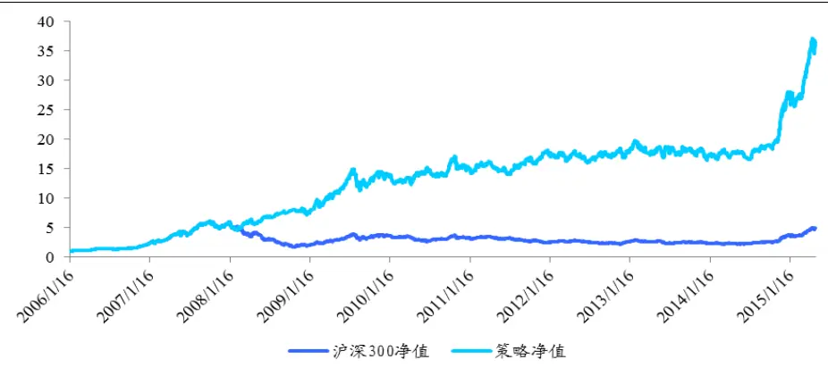
数据来源：国泰君安证券研究，wind

表 6 改进的双边多空策略绩效分析表

| 指标 数值 |
| --- |
| 累积收益 3665.40% |
| 年化收益 43.13% |
| 最大回撤 25.37% |
| 交易次数 15 |
| 胜率 73.33% |
| 多头胜率 62.50% |
| 空头胜率 85.71% |
| 盈亏比 22.58 |

数据来源：国泰君安证券研究，wind

图 10 双边多空策略年度收益图
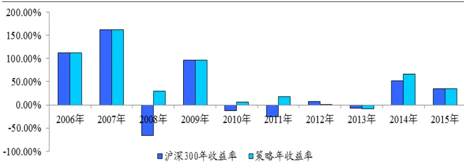
数据来源：国泰君安证券研究，wind

由上述图表可以看到，改进的双边多空策略年化收益有所提高，回撤有所降低，交易信号大幅减少，胜率大幅提高。

综上分析，我们发现改进的策略其实收益率并没有大幅提高，其中主要

原因在于，尽管我们过滤了一些噪音信号，但当真实信号来临的时候，我们操作的时间会延缓一些，从而在确立趋势的时候迟了一些。

## 3.3.3. 改进策略的敏感性分析

我们通过收益率、回撤交易胜率及交易次数的角度对阻力的上下限做敏感性测试发现，基本上当下限在0.45-0.5左右，上限在 0.85-0.95左右时，策略的效果相对比较稳定，具体见表7-11。

表 7 不同阻力上下限下的累计收益

|  | 0.4 | 0.45 | 0.5 | 0.55 | 0.6 | 0.65 |
| --- | --- | --- | --- | --- | --- | --- |
| 0.95 | 2678.69% | 2816.66% | 3177.39% | 2155.25% | 1854.66% | 1570.43% |
| 0.9 | 3070.23% | 3225.59% | 3665.40% | 2762.09% | 2512.20% | 2149.73% |
| 0.85 | 2676.37% | 2921.52% | 3317.12% | 2334.12% | 2281.83% | 2149.27% |
| 0.8 | 2163.17% | 2447.95% | 2893.40% | 2246.02% | 2017.46% | 1922.25% |
| 0.75 | 1770.03% | 2031.23% | 2412.91% | 1881.91% | 1646.82% | 1607.91% |

数据来源：国泰君安证券研究，wind

表 8 不同阻力上下限下的年化收益

|  | 0.4 | 0.45 | 0.5 | 0.55 | 0.6 | 0.65 |
| --- | --- | --- | --- | --- | --- | --- |
| 0.95 | 39.70% | 40.26% | 41.59% | 37.53% | 35.98% | 34.24% |
| 0.9 | 41.18% | 41.73% | 43.14% | 40.17% | 39.24% | 37.63% |
| 0.85 | 39.66% | 40.64% | 42.04% | 38.28% | 38.15% | 37.59% |
| 0.8 | 37.30% | 38.67% | 40.52% | 37.84% | 36.78% | 36.34% |
| 0.75 | 35.06% | 36.59% | 38.49% | 35.87% | 34.52% | 34.35% |

数据来源：国泰君安证券研究，wind

表 9 不同阻力上下限下的最大回撤

|  | 0.4 | 0.45 | 0.5 | 0.55 | 0.6 | 0.65 |
| --- | --- | --- | --- | --- | --- | --- |
| 0.95 | 26.10% | 25.29% | 25.29% | 30.17% | 42.34% | 41.36% |
| 0.9 | 25.29% | 25.29% | 25.29% | 26.91% | 33.96% | 38.96% |
| 0.85 | 25.29% | 25.29% | 25.29% | 30.79% | 28.96% | 35.35% |
| 0.8 | 35.26% | 30.38% | 25.29% | 30.47% | 29.94% | 35.07% |
| 0.75 | 34.40% | 29.28% | 27.21% | 28.73% | 36.34% | 40.46% |

数据来源：国泰君安证券研究，wind

表 10 不同阻力上下限下的交易胜率

|  | 0.4 | 0.45 | 0.5 | 0.55 | 0.6 | 0.65 |
| --- | --- | --- | --- | --- | --- | --- |
| 0.95 | 69.23% | 69.23% | 69.23% | 58.82% | 57.14% | 52.00% |
| 0.9 | 73.33% | 73.33% | 73.33% | 57.14% | 52.00% | 39.39% |
| 0.85 | 64.71% | 64.71% | 64.71% | 48.00% | 44.83% | 35.90% |
| 0.8 | 52.38% | 52.38% | 52.38% | 41.38% | 40.00% | 31.91% |
| 0.75 | 44.44% | 44.44% | 44.44% | 37.14% | 35.56% | 26.15% |

数据来源：国泰君安证券研究，wind

表 11不同阻力上下限下的交易次数

| 0.4 | 0.45 0.5 0.55 0.6 0.65 |
| --- | --- |
| 13 13 | 13 17 21 25 |
| 0.95 |  |
| 0.9 15 15 15 | 21 25 33 |
| 0.85 17 17 17 | 25 29 39 |
| 0.8 21 21 21 | 29 35 47 35 45 65 |

数据来源：国泰君安证券研究，wind

## 4. 基于阻力的行业配臵策略

我们都知道，河床的根本结构决定河水的行为。如果河床宽而深，河水将平静地流；如果浅而窄，河水将湍急地流。勘探了河床的根本结构，我们便可以相当精确地预测河水的行为。

同样的道理，如果我们知道了市场各个行业及板块的阻力结构，那么我们便可以理解行业轮动的规律了。我们认为，无论何时，资本总是在追逐其收益的最大化。在此过程中，上涨阻力最小、支撑最大的行业往往成为其亲睐的对象，而相反，上涨阻力最大、支撑最小的行业就会被抛弃。直到市场的交易行为改变了行业的价格、成交量等特征后，全部行业阻力与支撑得到再平衡，资金再一次重新选择最优的行业进行配臵。因此，资本沿着阻力方向最小的行业前进，不断循环重复，最终形成了行业的轮动过程。

## 4.1.基于相对阻力的行业配臵策略

基于本文相对阻力的思想与定义，我们尝试构建行业配臵策略。基本方法为：通过对不同行业相对阻力的计算，选取相对阻力排名靠后的若干行业做多，相对阻力排名靠前的若干行业做空。我们将分别考虑单边做多若干行业和多空行业对冲两种行业配臵策略。

## 4.1.1. 单边行业配臵策略

我们首先考虑单边多头行业配臵策略。策略采用周频率调仓方式，选取相对阻力最小的5个行业等权做多，策略回测时间从2010年1月至2015年5月（其中我们分别考察不计交易成本和单边千分之1的交易成本下，策略收益情况）。我们选取沪深 300 指数与行业等权重作为比较基准。具体的策略收益及统计分析如下面的图表所示：

图 11 单边行业配臵策略累计收益图
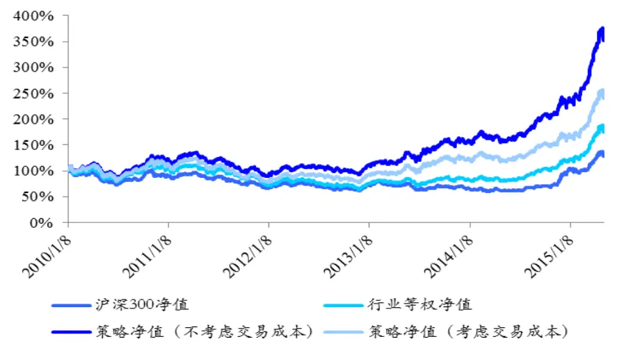
数据来源：国泰君安证券研究，wind

图 12 单边行业配臵策略年超额收益率
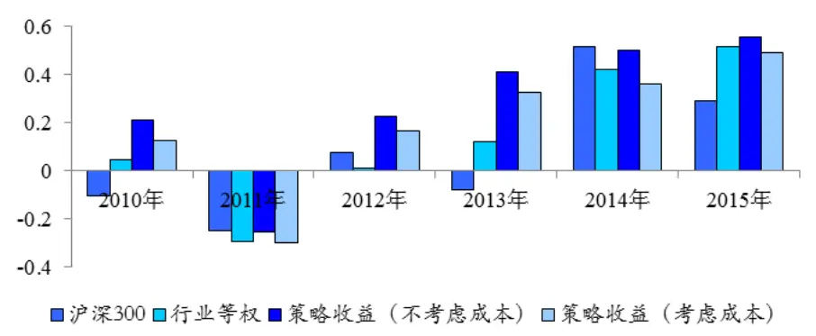
数据来源：国泰君安证券研究，wind

表 12 单边行业配臵策略绩效分析表

| 指标 | 沪深 300 指数 | 行业等权 | 行业配置策略 (未考虑成本) | 行业配置策略 (考虑成本) |
| --- | --- | --- | --- | --- |
| 累计收益率 | 131.0% | 181.2% | 367.00% | 249.60% |
| 年化收益率 | 7.67% | 13.98% | 28.16% | 20.66% |
| 年超额收益 | 1 | / | 20.48% | 12.99% |

数据来源：国泰君安证券研究，wind

由上述检验结果可以看出，利用相对阻力构建的单边行业配臵策略，相比沪深300基准与行业等权基准，均有明显优势。在考虑交易成本的情况下，策略获得年化 20.66%的绝对收益率和12.99%的超额收益率。

## 4.1.2. 双边行业配臵策略

我们进一步考率多空双向的行业配臵策略。策略同样采用周频率调仓方式，选取相对阻力最小的5 个行业等权做多，相对阻力最大的 5个行业等权做空。策略回测时间从2010年1 月至2015年5 月（其中我们分别考察不计交易成本和单边千分之1 的交易成本下，策略收益情况）。具体的策略收益及统计分析如下面的图表所示：

图 13 双边行业配臵策略累计收益图
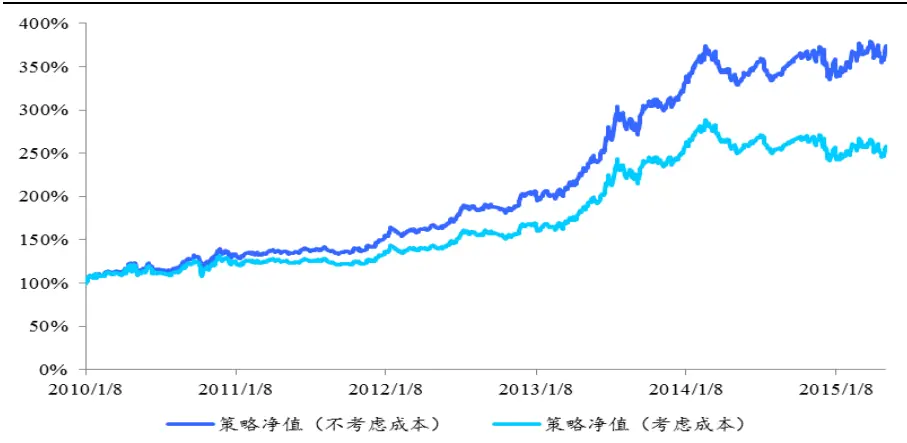
数据来源：国泰君安证券研究，wind

图 14 双边行业配臵策略年超额收益率
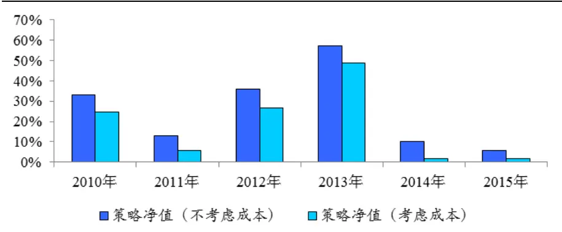
数据来源：国泰君安证券研究，wind

表 13 双边行业配臵策略绩效分析表

| 指标 | 双边行业配置策略 (未考虑交易成本) | 双边行业配置策略 (考虑交易成本) |
| --- | --- | --- |
| 累计收益率 | 374.10% | 285.40% |
| 年化收益率 | 26.85% | 19.66% |
| 最大回撤 | 14.11% | 16.68% |
| 周胜率 | 60.7% | 57.51% |
| 盈亏比 | 1.236 | 1.165 |

数据来源：国泰君安证券研究，wind

由上述检验结果可以看出，利用相对阻力构建的多空双边行业配臵策略，自2010年至 2015 年的任意年份中，均获得对冲正收益。在考虑交易成本的情况下，策略年化 19.66%的超额收益也较为理想。

## 5. 总结展望

既然自然界的规则是遵循最小阻力的路径，我们有理由相信证券市场的价格也是沿着最小阻力运动的。基于这样的思路，本文我们对市场的阻力进行了刻画及计算，并在此基础上构建了择时与配臵策略，取得了一定的效果。

对于阻力的定义与刻画，我们只是进行初步的尝试与探索，显然阻力不仅仅与价格及成交量有关，而且真正的阻力可能与我们的刻画差距很大。但研究阻力是件很有意义的事情，如果我们能找到真正的阻力，我们也就找到了投资的一个落脚点，市场个股择时也好，行业轮动也罢，都可以从阻力的角度去寻找投资线索。在后续的研究中，我们会对阻力做更为深入地探索。

## 本公司具有中国证监会核准的证券投资咨询业务资格

## 分析师声明

作者具有中国证券业协会授予的证券投资咨询执业资格或相当的专业胜任能力，保证报告所采用的数据均来自合规渠道，分析逻辑基于作者的职业理解，本报告清晰准确地反映了作者的研究观点，力求独立、客观和公正，结论不受任何第三方的授意或影响，特此声明。

## 免责声明

本报告仅供国泰君安证券股份有限公司（以下简称“本公司”）的客户使用。本公司不会因接收人收到本报告而视其为本公司的当然客户。本报告仅在相关法律许可的情况下发放，并仅为提供信息而发放，概不构成任何广告。

本报告的信息来源于已公开的资料，本公司对该等信息的准确性、完整性或可靠性不作任何保证。本报告所载的资料、意见及推测仅反映本公司于发布本报告当日的判断，本报告所指的证券或投资标的的价格、价值及投资收入可升可跌。过往表现不应作为日后的表现依据。在不同时期，本公司可发出与本报告所载资料、意见及推测不一致的报告。本公司不保证本报告所含信息保持在最新状态。同时，本公司对本报告所含信息可在不发出通知的情形下做出修改，投资者应当自行关注相应的更新或修改。

本报告中所指的投资及服务可能不适合个别客户，不构成客户私人咨询建议。在任何情况下，本报告中的信息或所表述的意见均不构成对任何人的投资建议。在任何情况下，本公司、本公司员工或者关联机构不承诺投资者一定获利，不与投资者分享投资收益，也不对任何人因使用本报告中的任何内容所引致的任何损失负任何责任。投资者务必注意，其据此做出的任何投资决策与本公司、本公司员工或者关联机构无关。

本公司利用信息隔离墙控制内部一个或多个领域、部门或关联机构之间的信息流动。因此，投资者应注意，在法律许可的情况下，本公司及其所属关联机构可能会持有报告中提到的公司所发行的证券或期权并进行证券或期权交易，也可能为这些公司提供或者争取提供投资银行、财务顾问或者金融产品等相关服务。在法律许可的情况下，本公司的员工可能担任本报告所提到的公司的董事。

市场有风险，投资需谨慎。投资者不应将本报告为作出投资决策的惟一参考因素，亦不应认为本报告可以取代自己的判断。在决定投资前，如有需要，投资者务必向专业人士咨询并谨慎决策。

本报告版权仅为本公司所有，未经书面许可，任何机构和个人不得以任何形式翻版、复制、发表或引用。如征得本公司同意进行引用、刊发的，需在允许的范围内使用，并注明出处为“国泰君安证券研究”，且不得对本报告进行任何有悖原意的引用、删节和修改。

若本公司以外的其他机构（以下简称“该机构”）发送本报告，则由该机构独自为此发送行为负责。通过此途径获得本报告的投资者应自行联系该机构以要求获悉更详细信息或进而交易本报告中提及的证券。本报告不构成本公司向该机构之客户提供的投资建议，本公司、本公司员工或者关联机构亦不为该机构之客户因使用本报告或报告所载内容引起的任何损失承担任何责任。

## 评级说明

## 1.投资建议的比较标准

投资评级分为股票评级和行业评级。

以报告发布后的12个月内的市场表现为比较标准，报告发布日后的 12个月内的公司股价（或行业指数）的涨跌幅相对同期的沪深 300 指数涨跌幅为基准。

## 2.投资建议的评级标准

报告发布日后的 12 个月内的公司股价（或行业指数）的涨跌幅相对同期的沪深 300 指数的涨跌幅。

| 评级 | 说明 |  |
| --- | --- | --- |
| 股票投资评级 | 增持 | 相对沪深 300指数涨幅15%以上 |
|  | 谨慎增持 | 相对沪深300指数涨幅介于5%～15%之间 |
|  | 中性 | 相对沪深300指数涨幅介于-5%～5% |
|  | 减持 | 相对沪深300指数下跌5%以上 |
| 行业投资评级 | 增持 | 明显强于沪深300 指数 |
|  | 中性 | 基本与沪深300指数持平 |
|  | 减持 | 明显弱于沪深 300指数 |

## 国泰君安证券研究

|  | 上海 | 深圳 | 北京 |
| --- | --- | --- | --- |
| 地址 | 上海市浦东新区银城中路168号上海 银行大厦29层 | 深圳市福田区益田路 6009 号新世界 商务中心34层 | 北京市西城区金融大街28 号盈泰中 心2号楼10层 |
| 邮编 | 200120 | 518026 | 100140 |
| 电话 | (021)38676666 | （0755)23976888 | (010)59312799 |
|  | E-mail: gtjaresearch@gtjas.com |  |  |