inInfo] [Table_Title] 2015.06.04

# 中证 500之阿尔法验金石

# ——数量化专题之六十

玉刘富兵（分析师）

李辰（研究助理）

8 021-38676673

liufubing008481@gtjas.com

021-38677309

证书编号 S0880511010017

lichen@gtjas.com

S0880114060025

## 本报告导读：

基于中证 500指数构建的风格中性多因子选股策略，比之利用沪深 300对冲具有更加绝对的优势，最优投资组合的结构更加平衡，策略收益风险特征更为理想。

## 摘要：

[Table_Summary] • 在上一篇《基于组合权重优化的风格中性多因子选股策略》中，我们构建了基于A 股市场的结构化多因子风险模型。本篇报告中，我们更深入的对风险模型的预测精度进行了分析研究。偏差检验表明，风险模型对于组合波动率的预测存在统计意义上的显著性。

- 中证500股指期货的上线，标志着 A股市场衍生品对冲工具迎来了新的重磅成员。相比于沪深300指数，中证 500指数的行业分布与成分股市值分布都更为均衡，更有利于阿尔法策略最优投资组合的构建。

- 中证500指数与中小盘股收益的相关性较高，利用其作为策略的比较基准和对冲标的，可以更加显著的检验策略收益的阿尔法来源是否纯粹，因此可称之为“阿尔法的验金石”。

- 基于中证500指数的风格中性多因子选股策略，自 2010年1月至 2015 年 5 月，实现年化 21.31%的超额收益，最大回撤3.42%，信息比率 4.18。

金融工程

## 金融工程团队：

刘富兵：（分析师）

电话：021-38676673

邮箱：liufubing008481@gtjas.com

证书编号：S0880511010017

赵延鸿：（分析师）

电话：021-38674927

邮箱：zhaoyanhong@gtjas.com

证书编号：S0880515030004

## 耿帅军：（分析师）

电话：010-59312753

邮箱：gengshuaijun@gtjas.com

证书编号：S0880513080013

## 刘正捷：（分析师）

电话：0755-23976803

邮箱：liuzhengjie012509@gtjas.com

证书编号：S0880514070010

## 李雪君：（研究助理）

电话：021-38675855

邮箱：lixuejun@gtjas.com

证书编号：S0880114090056

王浩：（研究助理）

电话：021-38676434

邮箱：wanghao014399@gtjas.com

证书编号：S0880114080041

## 陈奥林：（研究助理）

电话：021-38674835

邮箱：chenaolin@gtjas.com

证书编号：S0880114110077

李辰：（研究助理）

电话：021-38677309

邮箱：lichen@gtjas.com

证书编号：S0880114060025

## [Table_R相关报告

《分级基金投资策略和市场异象》2015.05.26《探究交易公开信息之市场观察篇》2015.05.25

《基于阻力的市场投资策略》2015.05.22

《基于阻力的市场投资策略》2015.05.22

《员工持股计划：在预期博弈中寻找事件阿尔法》2015.05.21

## 1. 引言

在上一篇报告《基于组合权重优化的风格中性多因子选股策略》中，我们提出了利用组合权重优化构建市值、行业、风格中性最优投资组合的多因子选股策略。同时，我们也提出，由于沪深 300指数主要为大盘蓝筹股，因此利用其作为空头对冲，如果不主动控制规模敞口，易使得组合暴露较为明显的市值风格特征。也正因为此，在2014年12月的市场极端行情中，不少阿尔法策略都遭遇了较大的净值回撤。

2015 年 4 月，中证 500 股指期货正式上线，标志着 A 股市场衍生品对冲工具迎来了新的重磅成员。相对于沪深300指数而言，中证 500指数所覆盖的行业占比和成分股市值规模都更为均衡。对于阿尔法策略而言，以中证500指数作为空头对冲，投资经理对风险敞口的主动控制力将会更强，更有利于最优投资组合的构建。

更重要的是，中证500指数与中小盘股收益的相关性较高，倘若原先策略收益大部分来自于大小盘风格轮动，那么利用中证 500指数对冲则将大幅消除这方面的波动影响。换言之，中证500指数成为了用以检验组合收益的阿尔法性纯粹与否的验金石。

本篇报告中，我们将对上一篇报告中构建的风险模型的预测效果做一定的显著性检验。然后，在此基础上，我们构建了针对中证 500指数的现金中性、行业中性、风格中性多因子选股策略。实证检验结果表明，基于中证500指数的风格中性多因子选股策略，自 2010年1 月至2015年5月，实现年化21.31%的超额收益，最大回撤3.42%，信息比率4.18。

## 2. 基于中证 500指数的风格中性多因子选股策略

## 2.1.风险模型与波动率预测

在上一篇报告《基于组合权重优化的风格中性多因子选股策略》中，我们通过结构化风险模型的研究，从定量的角度解释了影响股票价格波动的因素，并进一步通过对因子协方差矩阵与特质因子矩阵的计算，得到了组合波动率的预测值。

在本篇报告构建基于中证500 指数的风格中性多因子选股策略之前，我们将首先考察风险模型的预测显著性问题。

## 2.1.1. 结构化风险模型

结构化多因子风险模型首先对收益率进行简单的线性分解，对于第 j 只股票收益的分解形式可以表示为：

$$
r_{_{j}}=x_{_{1}}f_{_{1}}+x_{_{2}}f_{_{2}}+x_{_{3}}f_{_{3}}+x_{_{4}}f_{_{4}}...x_{_{K}}f_{_{K}}+u_{_{j}}
$$

其中， $r_{j}$ 表示第 $j$ 只股票的收益率； $x_{{k}}$ 表示第 j 只股票在第k 个因子上

的暴露（也称为因子载荷）； $f_{k}$ 表示第 j 只股票第k 个因子的因子收益

率（即每单位因子暴露所承载的收益率）； $u_{\mathrm{~}_{j}}$ 表示第 j 只股票的特质因子收益率。

那么对于一个包含 N 只股票的投资组合，假设组合的权重为$w=(w_{1},w_{2},\ldots,w_{N})^{T}$ ，那么组合收益率可以表示为：

$$
R_{_P}\;=\;\sum_{_{j\;=1}}^{^N}\;w_{_n}\cdot(\sum_{_{k\;=1}}^{^K}\;x_{_{jk}}\;f_{_{jk}}+u_{_j}),
$$

假设每只股票的特质因子收益率与共同因子收益率不相关，并且每只股票的特质因子收益率也不相关。那么在上述表达式的基础上，可以得到组合的风险结构为：

$$
\sigma_{_P}=\sqrt{w^{^T}\left(XFX^{^T}+\Delta\right)w}
$$

其中，X 表示N 只个股在K 个风险因子上的因子载荷矩阵 $\cdotp(N\times K)\colon$

$$
X={\left[\begin{array}{llll}{x_{_{1,1}}}&{x_{_{1,2}}}&{\ldots}&{x_{_{1,k}}}\\{x_{_{2,1}}}&{x_{_{2,2}}}&{\ldots}&{x_{_{2,k}}}\\{\ldots}&{\ldots}&{\ldots}&{\ldots}\\{x_{_{n,1}}}&{x_{_{n,2}}}&{\ldots}&{x_{_{n,k}}}\end{array}\right]}
$$

F 表示K 个因子的因子收益率协方差矩阵(K K• )：

$$
F=\left[\begin{array}{cccc}{\left|\begin{array}{cccc}{Var\left(f_{_1}\right)}&{Cov\left(f_{_1},f_{_2}\right)}&{\ldots}&{Cov\left(f_{_1},f_{_k}\right)}\\\end{array}\right|}&{\left|\begin{array}{cccc}{Cov\left(f_{_1},f_{_2}\right)}&{Var\left(f_{_2}\right)}&{\ldots}&{Cov\left(f_{_2},f_{_k}\right)}\\\end{array}\right|}&{\left|\begin{array}{cccc}{Cov\left(f_{_1},f_{_2}\right)}&{\ldots}&{\ldots}&{\ldots}\\\end{array}\right|}&{\left|\begin{array}{cccc}{Cov\left(f_{_1},f_{_2}\right)}&{\ldots}&{\ldots}&{\ldots}\\\end{array}\right|}\\\end{array}\right]
$$

- 表示N 只股票的特质因子收益率协方差矩阵 $(N\times N);$

$$
\Delta=\begin{bmatrix}\lceil Var\left(u_{_1}\right)&0&\ldots&0\\\mid&0&Var\left(u_{_2}\right)&\ldots&0\\\ldots&\ldots&\ldots&\ldots\\\mid&0&0&\ldots&Var\left(u_{_k}\right)\end{bmatrix}
$$

其中假设每只股票的特质因子收益率相关性为0，因此• 为对角阵。

## 2.1.2. 因子分类与显著性统计

在结构化风险模型中，因子分为行业因子和风格因子两部分，其中行业因子30类，风格因子 9类。具体因子分类如下：

表 1: 行业因子分类

| 交通运输 | 休闲服务 | 传媒 | 公用事业 | 农林牧渔 | 化工 |
| --- | --- | --- | --- | --- | --- |
| 医药生物 | 商业贸易 | 国防军工 | 家用电器 | 建筑材料 | 建筑装饰 |
| 房地产 | 有色金属 | 机械设备 | 汽车 | 电子 | 电气设备 |
| 纺织服装 | 综合 | 计算机 | 轻工制造 | 通信 | 采掘 |
| 钢铁 | 银行 | 证券 | 保险 | 多元金融 | 食品饮料 |

数据来源：国泰君安证券研究

表 2: 风格因子分类

| Beta | Momentum | Size | Earnings Yield | Volatility |
| --- | --- | --- | --- | --- |
| Growth | Value | Leverage | Liquidity |  |

数据来源：国泰君安证券研究

风险模型利用回归方程参数估计的显著性检验，从因子对收益率影响的显著性、稳定性以及因子之间的共线性角度着手，分别计算了 AverageAbosolute t-stas、Percent Ovserv |t|>2、Annual Factor Return、AnnualFactor Volatility、Factor Return Sharp Ratio、Correl With HS300、Factor Stability Coeff 和 Variance Inflation Factor 8 项指标，具体检验结果如下：

表 3: 行业因子有效检验

| Factor Name | Average Abosolute | Percent Ovserv | Annual Factor | Annual Factor | Factor Return |
| --- | --- | --- | --- | --- | --- |
|  | t-stat | \|t\|>2 | Return | Volatility | Sharp ratio |
| 交通运输 | 5.862 | 74.19% | 21.35% | 30.20% | 0.71 |
| 休闲服务 | 3.647 | 66.13% | 24.69% | 29.44% | 0.84 |
| 传媒 | 5.883 | 75.81% | 51.91% | 34.45% | 1.51 |
| 公用事业 | 6.145 | 80.65% | 28.04% | 26.70% | 1.05 |
| 农林牧渔 | 5.720 | 77.42% | 23.81% | 28.78% | 0.83 |
| 化工 | 9.681 | 88.71% | 19.82% | 28.37% | 0.70 |
| 医药生物 | 8.690 | 88.71% | 33.88% | 28.52% | 1.19 |
| 商业贸易 | 5.993 | 70.97% | 17.92% | 28.02% | 0.64 |
| 国防军工 | 4.937 | 75.81% | 42.94% | 36.42% | 1.18 |
| 家用电器 | 4.586 | 69.35% | 24.19% | 28.48% | 0.85 |
| 建筑材料 | 5.360 | 77.42% | 19.49% | 28.97% | 0.67 |
| 建筑装饰 | 5.069 | 79.03% | 27.81% | 29.45% | 0.94 |
| 房地产 | 7.334 | 75.81% | 19.64% | 29.79% | 0.66 |
| 有色金属 | 6.923 | 83.87% | 32.31% | 31.71% | 1.02 |
| 机械设备 | 9.335 | 91.94% | 25.39% | 29.11% | 0.87 |
| 汽车 | 6.769 | 79.03% | 23.34% | 31.12% | 0.75 |
| 电子 | 7.918 | 83.87% | 34.35% | 29.70% | 1.16 |
| 电气设备 | 7.721 | 88.71% | 24.42% | 29.75% | 0.82 |
| 纺织服装 | 5.530 | 75.81% | 18.79% | 28.37% | 0.66 |
| 综合 | 4.454 | 70.97% | 22.04% | 27.64% | 0.80 |
| 计算机 | 8.631 | 91.94% | 44.73% | 34.32% | 1.30 |
| 轻工制造 | 5.845 | 82.26% | 22.66% | 28.83% | 0.79 |
| 通信 | 5.635 | 87.10% | 29.66% | 29.72% | 1.00 |
| 采掘 | 4.987 | 75.81% | 17.01% | 29.76% | 0.57 |
| 钢铁 | 3.865 | 70.97% | 19.31% | 28.58% | 0.68 |
| 银行 | 2.800 | 56.45% | 27.25% | 29.95% | 0.91 |
| 证券 | 3.983 | 64.52% | 49.21% | 45.67% | 1.08 |
| 保险 | 1.745 | 29.03% | 40.88% | 33.16% | 1.23 |
| 多元金融 | 2.715 | 56.45% | 28.31% | 33.02% | 0.86 |
| 食品饮料 | 4.848 | 74.19% | 27.50% | 27.27% | 1.01 |
| 均值 | 5.7537 | 75.43% | 1 | 1 | / |

数据来源：国泰君安证券研究

表 4：风格因子有效性检验

| Factor Name | Average Abosolute t-stat | Percent Ovserv \|t\|>2 | Annual Factor Return | Annual Factor Volatility | Factor Return Sharp raio | Correl With HS300 | Factor Stability Coeff | Variance Inflation Factor |
| --- | --- | --- | --- | --- | --- | --- | --- | --- |
| Beta | 2.768 | 52.63% | 10.74% | 3.49% | 3.07 | -0.106 | 0.119 | 1.3932 |
| Momentum | 2.052 | 47.37% | 4.41% | 2.41% | 1.83 | 0.356 | 0.163 | 1.6292 |
| Size Earning | 4.727 | 75.44% | -25.79% | 5.32% | -4.85 | 0.321 | 0.241 | 1.1811 |
| Yield | 2.512 | 47.37% | 6.81% | 1.58% | 4.31 | 0.063 | 0.172 | 1.2080 |
| Volatility | 2.648 | 50.88% | -3.74% | 4.27% | -0.88 | 0.069 | 0.170 | 2.4809 |
| Growth | 1.519 | 29.82% | 2.18% | 1.11% | 1.96 | 0.135 | -0.139 | 1.0477 |
| Value | 1.889 | 42.11% | -0.97% | 1.97% | -0.49 | -0.118 | 0.132 | 1.4691 |
| Leverage | 2.315 | 50.88% | -3.55% | 1.75% | -2.03 | -0.054 | 0.175 | 1.1847 |
| Liquidity | 4.093 | 64.91% | -10.79% | 3.33% | -3.24 | -0.050 | 0.053 | 1.6853 |
| 均值 | 2.7248 | 51.26% | 1 | 1 | 1 | 1 | 1 | 1.4755 |

数据来源：国泰君安证券研究

风险模型利用因子收益率的波动解释了股票价格的波动，其中包括公共因子的波动和特质因子的波动。在此基础上，风险模型的另一重要目的就是对给定某一组合的波动率进行预测，下面我们将就风险模型的解释力度和风险预测精度进行一定的分析研究。

## 2.1.3. 组合风险预测精度检验

通常情况下，验证风险模型有效性的指标有 2 种：一是回归方程 $R^{2}$ ，

二是波动率预测的偏差检验（Bias Test）其中， $R^{2}$ 是从收益源分解的角

度出发，而偏差检验（Bias Test）则是从组合风险的角度出发，从风险模型的角度上而言，偏差检验（Bias Test）更具有说服力。下面我们将分别从这2个维度对风险模型的效果进行评估。

## 2.1.3.1. 回归方程 $R^{2}$

回归方程 $R^{2}$ 体现的公共因子对收益率的解释力度，是评估回归方程效

果的重要参数。但是，回归方程中许多因素都会对 $R^{2}$ 产生较大影响，

例如样本空间、样本时间跨度、回归方程权重等。因此，我们在评估模型 $R^{2}$ 的过程中，将比较不同参数的影响。

我们首先比较回归方程中，等权和以根号市值加权2 种方式对风险模型$R^{2}$ 的影响，样本空间为全市场（非ST），计算结果均为滚动 12期 $R^{2}$ 均值，具体如下：

图 1 不同加权方式 $R^{2}$ 比较
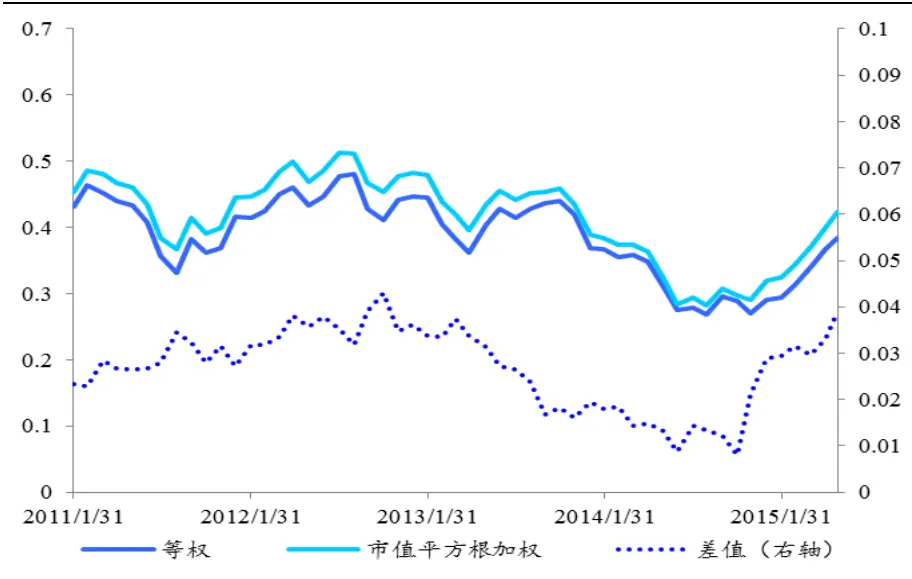
数据来源：国泰君安证券研究

表 5：不同加权方式 $R^{2}$ 比较

|  | $R^{2}$ (均值） $\Delta\boldsymbol{R}^{2}$ |
| --- | --- |
| 等权重 0.387 | / |
| 市值平方根加权 | 0.414 0.027 |

数据来源：国泰君安证券研究

表 6：不同加权方式 $R^{2}$ 比较（分年度）

| 等权重 | 市值平方根加权 $\Delta\boldsymbol{R}^{2}$ |
| --- | --- |
| 2010年 0.432 | 0.457 0.025 |
| 2011年 0.417 | 0.444 0.027 |
| 2012年 0.446 | 0.483 0.037 |
| 2013年 0.369 | 0.388 0.019 |
| 2014年 0.290 | 0.319 0.029 |
| 2015年 0.448 | 0.477 0.029 |

数据来源：国泰君安证券研究

上述结果显示，利用市值平方根加权法方法在全市场非 ST 样本中，模型的平均 $R^{2}$ 为0.414。并且，比较的结论表明，利用市值平方根加权法进行回归方程参数估计的 $R^{2}$ 略高于OLS 法，在一定程度上降低了个股市值对因子整体解释力度的影响。

接下来，我们将比较回归方程中，不同的样本空间对风险模型 $R^{2}$ 的影响，以全市场（非ST）和中证800指数成分股两种样本空间，回归方程均采用根号市值加权方式，具体如下：

图 2 不同样本空间 $R^{2}$ 比较
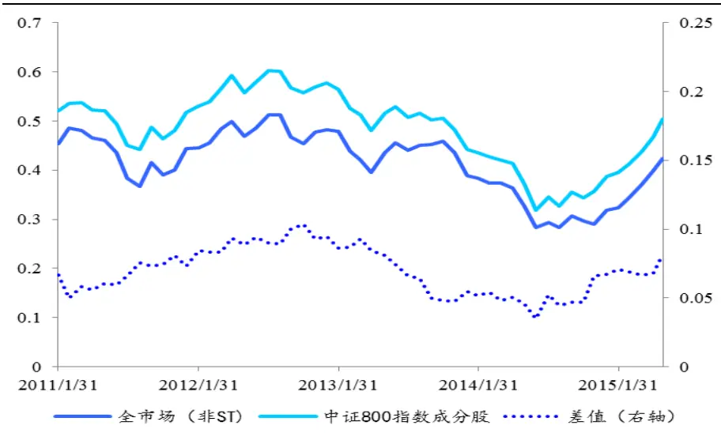
数据来源：国泰君安证券研究

表 6：不同样本空间 $R^{2}$ 比较

| $R^{2}$ (均值) | $\Delta\boldsymbol{R}^{2}$ |
| --- | --- |
| 全市场（非 ST） 0.414 | 1 |
| 中证 800 指数成分股 0.483 | 0.069 |

数据来源：国泰君安证券研究

表 7：不同样本空间 $R^{2}$ 比较（分年度）

| 全市场（非 ST） | 中证 800 指数成分股 | $\Delta\boldsymbol{R}^{2}$ |
| --- | --- | --- |
| 2010年 0.457 | 0.528 | 0.071 |
| 2011年 0.444 | 0.518 | 0.074 |
| 2012年 0.483 | 0.577 | 0.094 |
| 2013年 0.388 | 0.443 | 0.055 |
| 2014年 0.319 | 0.386 | 0.067 |
| 2015年 0.477 | 0.547 | 0.07 |

数据来源：国泰君安证券研究

上述结果显示，以中证 800 指数成分股为样本空间，模型平均 $R^{2}$ 为0.483。并且，比较结论表明以中证800指数成分作为样本空间，模型的

$R^{2}$ 高于以全市场非ST 成分作为样本空间，平均 $R^{2}$ 高出7%左右。

$R^{2}$ 计算结果显示，不同的加权方式和样本空间对风险模型的解释力度

会造成一定的影响。但是从整体上来看，风险模型的 $R^{2}$ 并未达到十分理想的程度，那下面我们将以偏差检验的统计方法从波动率的角度去验证风险模型的显著性。

## 2.1.3.2. 偏差检验（Bias Test）

对于风险模型组合波动率预测精度的检验问题,通常利用的方法是偏差检验（Bias Test）。从概念上来讲，偏差检验值代表的是组合实际波动率与预测波动率的比值。

具体的，另 $R_{_{nt}}$ 表示组合n 在第t 期的实际收益率， $\sigma_{{nt}}$ 表示第t •1期末对第t期组合 n的波动率预测值。

令 $b_{_{nt}}$ 表示收益率 $R_{_{nt}}$ 与预测波动率 $\sigma_{_{nt}}$ 的比值，即

$$
b_{_{nt}}=\frac{R_{_{nt}}}{\sigma_{_{nt}}}
$$

那么偏差统计量 $B_{\textit{ n }}$ 即可以表示为，

$$
B_{_{n}}=\sqrt{\frac{1}{T-1}\sum_{_{t=1}}^{T}\left(b_{_{nt}}-\overline{{b_{_{n}}}}\right)^{2}}.
$$

其中，T 表示组合收益的观测周期长度。显然，对于周期足够长的T 而言，若组合波动率的预测是百分之百精确的，那么 $B_{_{n}}=1$ 。（假设收益率服从正态分布）

对于检验预测波动率而言，假设组合波动率的预测精度存在统计意义上的显著性，那么对于95%的置信区间 $[1-\sqrt{2/T},1+\sqrt{2/T}]$ ，若计算的偏差统计量 $B_{\phantom{\dagger}n}$ 不在置信区间内，则拒绝组合波动率预测精确的假设。反之则可称组合波动率的预测在 95%的显著性水平下精确。

更一般的，为了消除风险模型有效性本身的波动率，通常会采用年度滚动计算 $B_{\textit{ n }}$ 再求平均值的方式，即令

$$
B_{n}^{\tau}=\sqrt{\frac{1}{11}\sum_{t=\tau}^{\tau+11}\left(b_{nt}-\overline{{b_{n}}}\right)^{2}}
$$

表示滚动12 个月的偏差统计量，其中 表示滚动窗口的起始时点，那么

对于组合n，在样本长度T 内共有T •11个 $\boldsymbol{B}_{n}^{\tau}$ 值，那么其均值即为

$$
\overline{{B}}_{n}=\frac{1}{T-11}\sum B_{n}^{\tau}
$$

同样，若计算的偏差统计量 $B_{\phantom{\dagger}n}$ 落入置信区间内，则可称组合波动率的预测在95%的显著性水平下精确。

下面我们将针对不同的组合，检验风险模型的预测精度。其中组合我们分别选取上证 50指数、沪深 300指数、中证500指数、上证180指数、中小板指数、创业板指数、深圳 300指数和全市场等权 8个组合，具体检验结果如下：

表 8：组合实际收益率比预测波动率

| 日期 | 上证50 | 沪深300 | 中证500 | 上证180 | 中小板指 | 创业板指 | 深圳 300 | 全市场等权 |
| --- | --- | --- | --- | --- | --- | --- | --- | --- |
| 2011年2月 | 0.413 | 0.724 | 1.238 | 0.574 | 1.057 | 0.748 | 1.117 | 1.128 |
| 2011年3月 | 0.425 | -0.068 | -0.221 | 0.125 | -0.593 | -0.912 | -0.310 | -0.191 |
| 2011年4月 | 0.200 | -0.129 | -0.398 | -0.038 | -0.672 | -1.079 | -0.368 | -0.489 |
| 2011年5月 | -0.730 | -0.872 | -1.024 | -0.863 | -1.024 | -0.866 | -0.919 | -0.913 |
| 2011年6月 | -0.168 | 0.224 | 0.408 | 0.076 | 0.604 | -0.006 | 0.515 | 0.444 |
| 2011年7月 | -0.681 | -0.388 | 0.149 | -0.527 | 0.159 | 1.058 | -0.041 | 0.306 |
| 2011年8月 | -0.598 | -0.722 | -0.613 | -0.740 | -0.523 | 0.119 | -0.675 | -0.373 |
| 2011年9月 | -1.346 | -1.539 | -1.881 | -1.457 | -1.863 | -1.902 | -1.773 | -1.734 |
| 2011年10月 | 1.007 | 0.723 | 0.529 | 0.895 | 0.485 | 1.033 | 0.401 | 0.629 |
| 2011年11月 | -1.153 | -1.037 | -0.627 | -1.090 | -0.663 | -0.221 | -0.863 | -0.557 |
| 2011年12月 | -0.460 | -1.191 | -2.136 | -0.977 | -2.006 | -1.698 | -1.789 | -2.079 |
| 2012年1月 | 1.418 | 0.902 | 0.123 | 1.112 | -0.395 | -1.439 | 0.347 | -0.147 |
| 2012年2月 | 0.786 | 1.144 | 1.598 | 1.050 | 1.653 | 1.529 | 1.426 | 1.650 |
| 2012年3月 | -1.082 | -1.113 | -1.004 | -1.140 | -0.833 | -0.898 | -1.032 | -0.958 |
| 2012年4月 | 1.246 | 1.186 | 0.936 | 1.225 | 0.579 | 0.111 | 1.019 | 0.844 |
| 2012年5月 | -0.171 | 0.037 | 0.311 | 0.004 | 0.334 | 0.837 | 0.279 | 0.316 |
| 2012年6月 | -0.853 | -1.002 | -0.980 | -0.987 | -0.675 | -0.127 | -0.884 | -0.732 |
| 2012年7月 | -0.733 | -0.822 | -1.199 | -0.857 | -0.962 | -0.849 | -0.961 | -1.212 |
| 2012年8月 | -0.866 | -0.915 | -0.085 | -0.840 | -0.143 | 0.559 | -0.685 | 0.255 |
| 2012年9月 | 0.739 | 0.693 | 0.265 | 0.690 | 0.452 | -0.308 | 0.535 | 0.132 |
| 2012年10月 | -0.268 | -0.261 | -0.135 | -0.249 | -0.288 | 0.038 | -0.225 | -0.063 |
| 2012年11月 | -0.436 | -0.841 | -1.577 | -0.668 | -1.749 | -1.650 | -1.353 | -1.501 |
| 2012年12月 | 3.847 | 3.202 | 2.361 | 3.482 | 2.320 | 2.493 | 2.558 | 2.338 |
| 2013年1月 | 1.117 | 1.009 | 0.881 | 1.002 | 0.828 | 1.206 | 0.960 | 0.832 |
| 2013年2月 | -0.275 | -0.081 | 0.544 | -0.172 | 0.646 | 1.569 | 0.289 | 0.544 |
| 2013年3月 | -1.110 | -0.966 | -0.658 | -1.025 | -0.139 | 0.090 | -0.767 | -0.536 |
| 2013年4月 | -0.188 | -0.273 | -0.349 | -0.212 | -0.448 | 0.381 | -0.247 | -0.427 |
| 2013年5月 | 0.544 | 0.947 | 2.137 | 0.815 | 2.195 | 2.872 | 1.682 | 2.161 |
| 2013年6月 | -2.023 | -2.271 | -2.396 | -2.140 | -1.982 | -0.784 | -2.390 | -2.297 |
| 2013年7月 | -0.404 | -0.050 | 0.864 | -0.115 | 0.527 | 1.551 | 0.521 | 0.998 |
| 2013年8月 | 0.690 | 0.749 | 0.946 | 0.734 | 0.687 | 0.543 | 0.625 | 1.180 |
| 2013年9月 | 0.419 | 0.572 | 0.812 | 0.543 | 1.045 | 1.867 | 0.683 | 0.804 |
| 2013年10月 | -0.087 | -0.201 | -0.605 | -0.218 | -0.944 | -1.157 | -0.436 | -0.337 |
| 2013年11月 | 0.239 | 0.396 | 0.905 | 0.457 | 0.659 | 1.228 | 0.511 | 1.257 |
| 2013年12月 | -0.663 | -0.646 | -0.443 | -0.668 | -0.396 | -0.530 | -0.466 | -0.466 |
| 2014年1月 | -0.860 | -0.855 | 0.227 | -0.768 | 0.151 | 1.720 | -0.250 | 0.337 |
| 2014年2月 | -0.131 | -0.173 | 0.364 | -0.164 | -0.003 | -0.476 | -0.185 | 0.628 |
| 2014年3月 | 0.016 | -0.251 | -0.526 | -0.135 | -1.246 | -0.887 | -0.670 | -0.400 |
| 2014年4月 | 0.317 | 0.098 | -0.301 | 0.117 | -0.137 | -0.398 | -0.118 | -0.177 |
| 2014年5月 | -0.136 | -0.018 | 0.266 | -0.054 | 0.339 | 0.341 | 0.280 | 0.457 |
| 2014年6月 | 0.004 | 0.072 | 0.400 | 0.066 | 0.474 | 0.833 | 0.338 | 0.742 |
| 2014年7月 | 1.746 | 1.701 | 1.465 | 1.766 | 0.535 | -0.560 | 1.170 | 1.248 |
| 2014年8月 | -0.449 | -0.100 | 0.737 | -0.179 | 0.885 | 0.862 | 0.484 | 1.071 |
| 2014年9月 | 0.453 | 0.981 | 2.076 | 0.914 | 1.401 | 1.268 | 1.158 | 2.486 |
| 2014年10月 | 0.468 | 0.507 | 0.270 | 0.547 | -0.156 | -0.295 | 0.190 | 0.362 |
| 2014年11月 | 3.043 | 2.564 | 1.014 | 2.845 | 0.106 | 0.657 | 1.335 | 1.175 |
| 2014年12月 | 5.898 | 5.042 | 0.285 | 5.384 | -0.463 | -1.099 | 1.958 | -0.526 |
| 2015年1月 | -0.828 | -0.409 | 1.016 | -0.637 | 2.030 | 2.250 | 0.864 | 1.296 |
| 2015年2月 | 0.311 | 0.534 | 1.122 | 0.447 | 1.661 | 2.166 | 1.209 | 1.270 |
| 2015年3月 | 1.239 | 1.796 | 3.493 | 1.607 | 3.568 | 3.062 | 2.721 | 3.807 |
| 2015年4月 | 2.023 | 2.402 | 2.927 | 2.354 | 1.638 | 3.078 | 2.510 | 3.169 |
| 2015年5月 | 0.494 | 1.352 | 3.665 | 0.990 | 5.038 | 3.222 | 3.239 | 5.284 |

数据来源：国泰君安证券研究

我们分别计算针对上述 8种组合的滚动偏差统计量 $\bar{\bar{B}}_{n}$ ，针对的原假设为组合波动率预测结果不精确，偏差检验结果如下表：

表 9：组合波动率偏差统计检验结果：

| 组合 | 上证50 | 沪深300 | 中证500 | 上证 180 | 中小板指 | 创业板指 | 深圳 300 | 全市场等权 |
| --- | --- | --- | --- | --- | --- | --- | --- | --- |
| $\bar{\bar{B}}_{n}$ | 1.156 | 1.095 | 1.056 | 1.122 | 1.034 | 1.154 | 0.974 | 1.071 |
| 检验结果 | Reject | Reject | Reject | Reject | Reject | Reject | Reject | Reject |
| 偏差结果 | 低估 | 低估 | 低估 | 低估 | 低估 | 低估 | 高估 | 低估 |

数据来源：国泰君安证券研究

从偏差检验的结果来看，对于我们给出的8 种指数成分组合，风险模型的偏差统计检验结果均较为理想，8 个组合的 $\bar{\bar{B}}_{n}$ 均落入 95%置信区间范

围内，各组合 $\bar{\bar{B}}_{n}$ 的平均值为 1.082，检验结果较为理想，体现了风险模型对组合波动率预测的显著性。

从不同组合波动率预测的对比来看，预测偏离程度最低的是中小板指、深圳300指数组合和中证500 指数组合，而偏差程度最大的则是上证50和创业板指数。而从波动率估计的偏差方向来看，除了深圳 300指数成分组合外，风险模型均在一定程度上低估了其余各组合的波动率。但是尽管如此，偏差检验仍能较好的证明，风险模型对股票价格波动率来源的分解和对组合波动率的预测存在较强的显著性。

到此为止，结合第一篇报告中对风险模型的介绍，我们已经相对完整的刻画了A 股市场的风险结构，并且实现了对不同组合的波动率预测。在后续的研究中，我们将在现有风险模型的框架体系下，逐步深入与扩充，使得风险模型的有效性更加可靠。

下面我们将进入针对中证500 指数对冲的多因子策略构建部分。

## 2.2. 中证 500 指数的风格特征

2015年4月，中证500 股指期货正式上线。在时隔5年之后，A股市场再次迎来指数对冲工具，相对于沪深300而言，中证 500指数所覆盖的行业占比和成分股市值规模都更为均衡。并且，近2 年来中证500指数与大盘蓝筹股走势的相关性逐渐降低，而与中小板、创业板指数的相关性逐步提高，因此目前中证500更多的被视作中小板股票投资风格的指数。

对于阿尔法对冲策略而言，利用中证500指数相比利用沪深 300指数，也有着较为明显的优势。下面，我们将从行业、市值和风格层面考察中证500指数的特点。

## 2.2.1. 行业分布与占比

由于最优投资组合的构建首先必须满足行业中性的约束，因此对冲基准指数的行业分布及权重占比是一个关键的考察因素。行业覆盖面越广，各行业的占比越均衡，更有利于阿尔法策略最优投资组合的构建和阿尔法因子敞口的最大化暴露。沪深300指数中，各行业占比就较为不均匀，金融板块占比过高导致对冲组合难以获得较高的超额收益。

下图为中证 500 指数行业分布与占比情况，其中计算结果均为 10 年至15年的平均值：

表 10：中证 500 行业权重（10 年至 15 年均值）
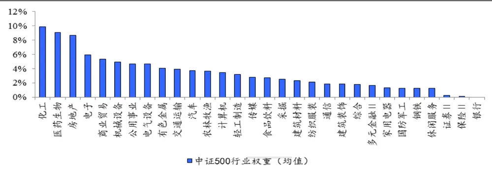
数据来源：国泰君安证券研究

中证500指数中，权重排名前 5的行业为：化工、医药生物、房地产、电子、商业贸易，权重排名后5的行业为：银行、保险、证券、休闲服务、钢铁，其中银行占比为 0%。

## 2.2.2. 市值规模分布

另外一个极为重要的因素就是指数成分股的市值规模分布，由于 A股市场存在较为明显的大小盘风格特征，而沪深300指数更多的代表了大盘蓝筹股的走势情况，因此利用沪深指数对冲会使得策略暴露较多的市值风格敞口。

而中证500指数较好的弥补了这方面的缺憾。从下表中可以看到，相比于沪深300指数成分股的市值分布情况，中证500成分股的市值分布更为均衡。我们将全市场所有股票中市值分为 10 档之后，可以看到中证500 指数成分股在前 8 档中均有股票分布，其分布集中区域为 2、3、4档，相比沪深300指数而言，分布更为均匀，平均市值更小。

表 11：中证 500、沪深 300成分股市值分布
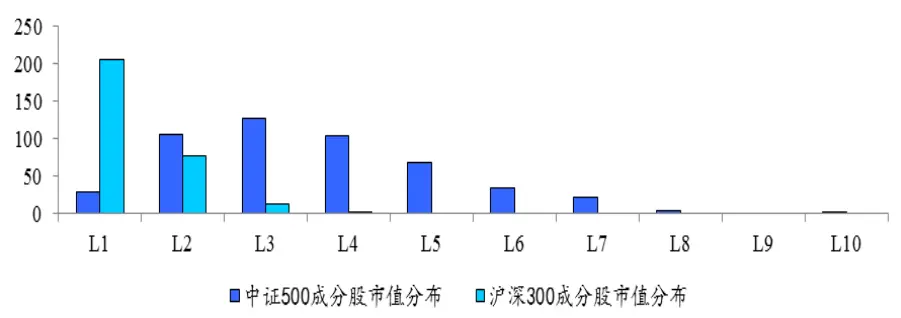
数据来源：国泰君安证券研究

## 2.2.3. 指数风格特征

最后，我们来考虑指数的风格特征，从控制风险因子敞口的角度而言，对冲基准的风格特征决定了最优投资组合的优化过程中，风险因子敞口可达到的约束极限。简言之，若指数的风格特征本身已经达到较为边界的水平，那么优化的约束条件就较难控制。反之，若指数本身的风格特征较为均衡，那么投资经理可以充分暴露认定的因子敞口，优化的目标也较易实现。

我们从风险模型9 类因子的角度，考察中证500指数的风格特征，并将其与沪深300指数的风格特征做简单的比较，如下图所示：

表 12：中证 500 风险因子
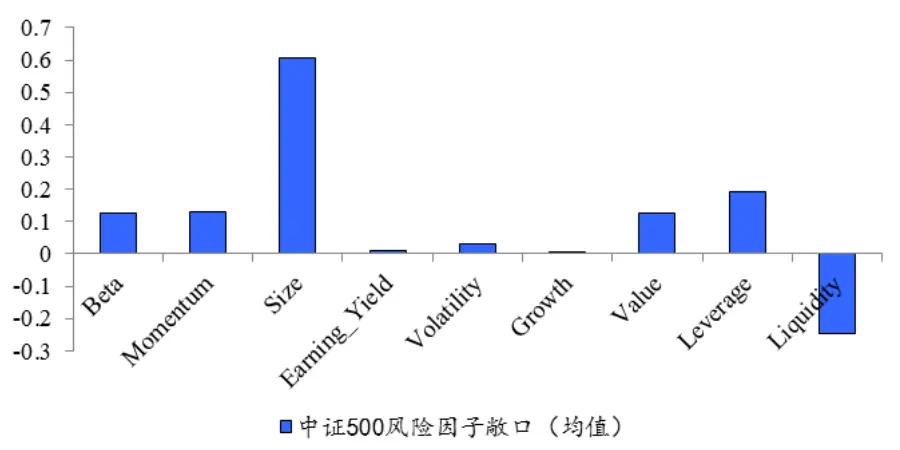
数据来源：国泰君安证券研究

表 13：沪深 300与中证 500风险因子比较
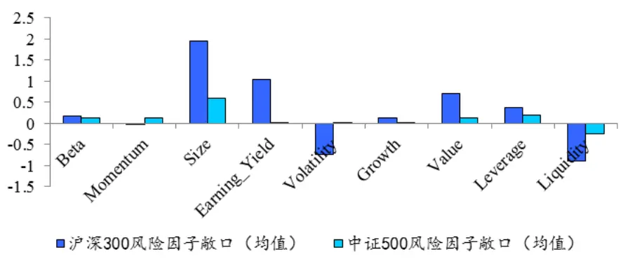
数据来源：国泰君安证券研究

从上述统计结果来看，相对于沪深300而言，中证500指数的风格特点主要有动量较强、波动率较高、市值偏小、估计偏高，这些特点也比较符合成长股小盘股的特点，尤其自 2013 年以来这样的风格特征更为明显。

更重要的是，中证500指数的9类风格特点相对较为均衡，没有特别突出的偏向，这样的特点对构建最优投资组合的优化过程是十分有利的。

在接下来的章节中，我们将以中证500指数作为对冲基准，构建现金、行业、风格中性的多因子选股策略。

## 2.3.策略构建与组合权重优化

在第一篇报告《基于组合权重优化的风格中性多因子选股策略》中，我们提到最优的投资组合是一个非常完美的平衡状态，对于投资经理而言，应将组合充分暴露于阿尔法因子下，同时剔除其余不稳定的风格因素干扰。

通过股票组合权重优化的方法，可以构建现金中性、行业中性、风格中性的最优投资组合。优化过程中，我们以最大化经风险调整后的收益为目标函数，权重优化的具体表达形式为：

$$
\begin{aligned}&Max\quad R_{_P}-\lambda\sigma_{_P}^{^2}-TC\left(w\right)\\&s.t.\quad\forall k^{\prime}\quad(w^{^T}-w_{_{bench}}^{^T})X_{_{k^{\prime}}}=0\\&\quad w^{^T}H=h^{^T}\\&\quad w\geq0\\&\quad\sum_{_{i=1}}^{^N}w_{_i}=1\\\end{aligned}
$$

其 中 TC w( ) 表 示 以 权 重 w 构 建 组 合 的 换 仓 成 本 ，

$$
$R_{_P}=\sum\limits_{_{j=1}}^{^N}w_{_n}\cdot(\sum\limits_{_{k=1}}^{^k}x_{_{jk}}f_{_{jk}}+u_{_j})\quad,\quad\sigma_{_P}=\sqrt{w^{^T}(XFX^{^T}+\Delta_{_{}})w}\quad,\quad\lambda$为风险厌.
$$

恶系数， $X_{{k}^{\prime}}$ 表示风险因子截面，H 为行业因子哑变量矩阵，h 表示中证500指数行业占比权重。

在第一篇报告中，我们对9 类因子均进行了纯因子股票组合的检验，得出的结论是 Earning Yield、Momentum 和 Volatility 因子的阿尔法性较强，组合收益较为稳定。尤其Earning Yield类因子，其因子的逻辑性和数据统计的显著性均可以较好的支撑策略的构建，因此在针对中证500 指数的策略构建中，我们尽可能较多的包括 Earning Yield 因子，同时控制其余因子的风险敞口，具体策略相关参数如下：

## 实证检验的相关假设参数：

1） 回测时间从 2010 年 1 月至 2015 年 3 月，其中 2010 年 1 月至 2011年1 月为样本内时间段，以提取因子组合相关参数；

1）股票池选取全A非 ST 股票；

2）交易成本为单边千分之 1，印花税千分之1；

3） 组合个股的权重上限设为 1.5%。

4）优化目标函数为 $Max\quad R_{_P}-\lambda\sigma_{_P}^{^2}-TC(w)$ 形式，其中 $\lambda=\frac{1}{2}$

5）行业中性约束中，因子敞口设定为•5% ；

6）风格中性约束中，9类风格因子敞口设定为：

| 因子类型 | 风险敞口约束上限 |
| --- | --- |
| Beta -0.01 | +0.01 |
| Momentum | -0.01 +0.01 |
| Size | 8 -0.3 |
| Earning Yield | 8 +1 |
| Volatility | -0.01 |
| Growth -0.01 | +0.01 +0.01 |
| Value | -0.01 +0.01 |
| Leverage | -0.01 +0.01 |
| Liquidity | -0.01 +0.01 |

当该期权重优化方程在设定的因子敞口约束下无解时，逐次降低Earning Yield因子敞口0.1，直至优化方程找到最优解。

策略检验结果如下，分别为组合净值与中证500指数对比图，组合对冲净值以及策略相关绩效统计：

图 3 策略组合净值对比中证 500指数
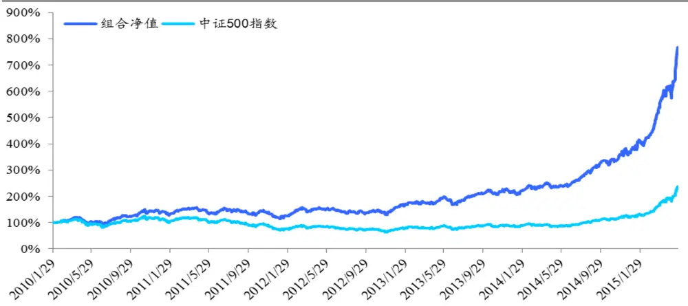
数据来源：国泰君安证券研究

图 4 策略对冲净值曲线
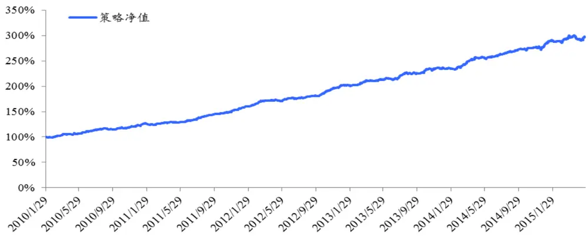
数据来源：国泰君安证券研究

表 14：策略绩效统计

| 策略净值 | 2.974 最大回撤 | 3.42% |
| --- | --- | --- |
| 策略日胜率 60.99% | 最大回撤开始时间 | 2015/4/16 |
| 年化收益率 21.31% | 最大回撤结束时间 | 2015/5/12 |
| 年化波动率 5.09% | 日收益率分布偏度 | 0.28 |
| 信息比率 4.184 | 日收益率分布峰度 | 3.96 |
| 盈亏比率 1.273 | 95%VaR | 0.546% |
| 组合年均换手率 450% | 组合股票个数（均值） | 85只 |

数据来源：国泰君安证券研究

表 15：组合分段绩效统计

| 日期 | 年收益率 | 最大回撤 | 信息比率 |
| --- | --- | --- | --- |
| 2010年（样本内） | 22.3% | 2.36% | 3.76 |
| 2011年 | 27.5% | 2.78% | 5.70 |
| 2012年 | 29.4% | 1.74% | 6.22 |
| 2013年 | 17.2% | 1.59% | 3.49 |
| 2014年 | 18.5% | 2.31% | 3.58 |
| 2015年（年化） | 15.8% | 3.42% | 2.23 |

实证检验的结果表明，基于中证 500指数的风格中性多因子选股策略，在获取年化超额收益 21.31%的同时，策略的年化波动率约为 5.09%，最大回撤3.42%，整体净值信息比率达到 4.18。

经过现金、行业和风格中性的约束后，策略收益的波动率和回撤风险均可控制在较低的水平。并且，由于在之前提到的，中证 500指数行业分布与成分股市值占比的相对均衡，策略构建的最优投资组合更有利于阿尔法因子的充分暴露，因此使得策略可获取更高的超额收益率。

## 2.4. 归因分析

在第一篇报告中，我们已经对针对沪深300指数的策略收益进行了归因分析，归因分析的目的主要有 2 点：1）归因分析使得投资经理可以从定量的角度分析策略的收益来源，增强对阿尔法收益的定量控制力；2）归因分析可以证明策略收益的实际来源与策略初始构建的逻辑是否保持一致。

与第一篇报告的方法一致，我们同样从风险因子敞口、因子收益归因和因子风险归因的角度考察策略的收益风险结构，具体结果如下：

对于第k 类因子，其风险因子敞口暴露可表示为：

$$
(w^{^T}-w_{_{bench}}^{^T})X_{_{k}}
$$

其中， $X_{\mathrm{~}_{i}}$ 为标准化风险因子截面， $W_{bench}$ 为对冲基准组合对应权重。组合风险因子敞口分析如下：

表 16：组合风险因子敞口暴露
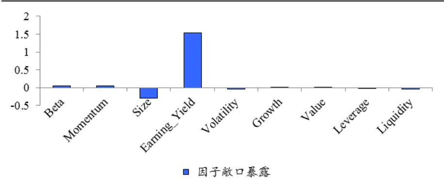
数据来源：国泰君安证券研究

对于第k 类因子，其收益归因可表示为：

$$
(\mathbf{\nabla}w^{^T}-\mathbf{\nabla}w_{_{bench}}^{^T})\mathbf{\nabla}X_{_k}\cdot\mathbf{\nabla}f_{_k}
$$

其中 $f_{k}$ 为第k 类因子当期的实际因子收益率。组合因子收益归因分析如下：

表 17：组合因子收益归因
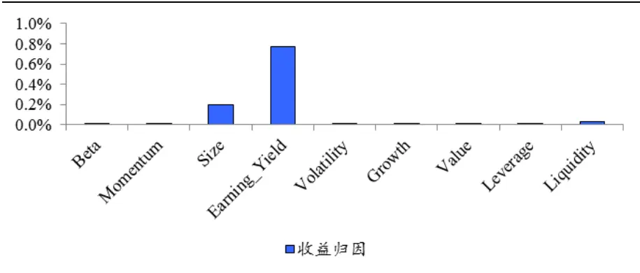
数据来源：国泰君安证券研究

对于第k 类因子，其风险归因可表示为：

$$
(w^{^T}-w_{_{bench}}^{^T})XF((w^{^T}-w_{_{bench}}^{^T})X_{_k})
$$

其中F 为当期实际的因子收益率协方差矩阵。

表 18：组合因子风险归因
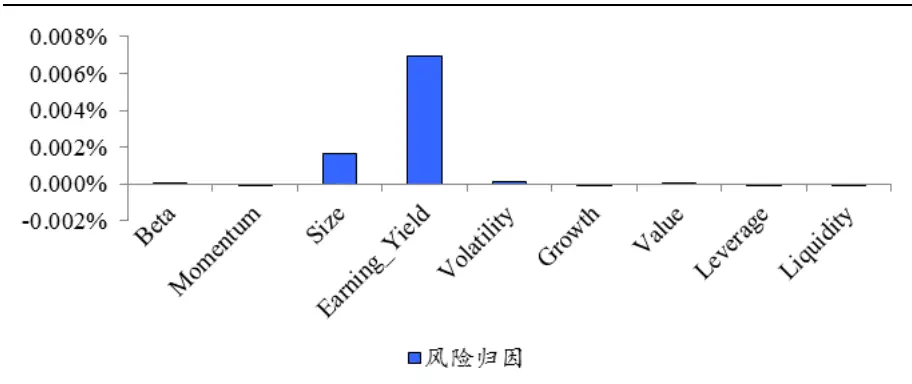
数据来源：国泰君安证券研究

归因分析的结果表明，除了 Earnings Yield 因子外，由于严格的限制了组合其余的风险因子敞口，策略收益来源和风险贡献主要集中于Earnings Yield类因子，少量的暴露于 Size因子，而其余类风险因子的收益与风险贡献均实现了最大程度中性化的处理要求。

并且，对比第一篇报告中利用沪深300指数作为对冲的策略收益而言，利用中证500指数构建的阿尔法策略，可以更充分的将策略暴露于阿尔法因子下，这从策略构建时风险因子敞口的设定和策略收益的归因分析中均可以得到充分的体现。因此，从这一点而言，利用中证 500指数对冲比利用沪深300 指数对冲有着更加绝对的优势。

## 3. 研究总结与展望

在第一篇报告《基于组合权重优化的风格中性多因子选股策》的基础上，本篇报告首先对第一篇报告中构建的风险模型进行了进一步的梳理，我们从统计偏差检验的角度出发，证明了风险模型对组合波动率预测的显著性，从而实现了对 A 股市场风险结构更加完整的刻画。

当然，风险模型仍有其弱点，例如收益源分解的解释力度不够理想、未考虑收益源的非线性分解形式等。在之后的研究中，我们会更加细致深入的对风险的定量预测进行研究。

报告的第二部分，我们对中证 500指数的特点进行了一定的剖析，并进一步构建了基于中证 500指数的多因子选股策略。与之前的方法类似，我们同样利用组合权重优化，构建了现金中性、行业中性、风格中性的最优投资组合。

与沪深300指数相比，中证 500指数的行业分布和成分股市值规模分布都较为均衡，这样的特点更有利于最优投资组合的构建。并且，从规避大小盘风格轮动收益来源的角度来看，以中证500股指期货作为对冲，可以更加显著的检验策略收益的阿尔法来源是否纯粹。因此中证 500指数可以称其为阿尔法的验金石。

实证检验的结果显示，以中证 500指数作为对冲基准构建的多因子选股策略，可实现年化 21.31%的超额收益率，同时策略的年化波动率约为5%，最大回撤 3.42%，净值整体信息比率可达到 4.18,策略整体收益率表现较为稳健。

2015年的A 股市场正经历着前所未有的大牛市。但尽管如此，今年阿尔法策略的整体表现仍十分优异，在经历了 2014 年末的打击后，阿尔法策略又以其顽强的生命力吸引了更多投资者的亲睐。牛市终将过去，当繁华落尽，坚守在阿尔法阵营的宽客们必将成为对冲时代的真正弄潮儿。

## 本公司具有中国证监会核准的证券投资咨询业务资格

## 分析师声明

作者具有中国证券业协会授予的证券投资咨询执业资格或相当的专业胜任能力，保证报告所采用的数据均来自合规渠道，分析逻辑基于作者的职业理解，本报告清晰准确地反映了作者的研究观点，力求独立、客观和公正，结论不受任何第三方的授意或影响，特此声明。

## 免责声明

本报告仅供国泰君安证券股份有限公司（以下简称“本公司”）的客户使用。本公司不会因接收人收到本报告而视其为本公司的当然客户。本报告仅在相关法律许可的情况下发放，并仅为提供信息而发放，概不构成任何广告。

本报告的信息来源于已公开的资料，本公司对该等信息的准确性、完整性或可靠性不作任何保证。本报告所载的资料、意见及推测仅反映本公司于发布本报告当日的判断，本报告所指的证券或投资标的的价格、价值及投资收入可升可跌。过往表现不应作为日后的表现依据。在不同时期，本公司可发出与本报告所载资料、意见及推测不一致的报告。本公司不保证本报告所含信息保持在最新状态。同时，本公司对本报告所含信息可在不发出通知的情形下做出修改，投资者应当自行关注相应的更新或修改。

本报告中所指的投资及服务可能不适合个别客户，不构成客户私人咨询建议。在任何情况下，本报告中的信息或所表述的意见均不构成对任何人的投资建议。在任何情况下，本公司、本公司员工或者关联机构不承诺投资者一定获利，不与投资者分享投资收益，也不对任何人因使用本报告中的任何内容所引致的任何损失负任何责任。投资者务必注意，其据此做出的任何投资决策与本公司、本公司员工或者关联机构无关。

本公司利用信息隔离墙控制内部一个或多个领域、部门或关联机构之间的信息流动。因此，投资者应注意，在法律许可的情况下，本公司及其所属关联机构可能会持有报告中提到的公司所发行的证券或期权并进行证券或期权交易，也可能为这些公司提供或者争取提供投资银行、财务顾问或者金融产品等相关服务。在法律许可的情况下，本公司的员工可能担任本报告所提到的公司的董事。

市场有风险，投资需谨慎。投资者不应将本报告为作出投资决策的惟一参考因素，亦不应认为本报告可以取代自己的判断。在决定投资前，如有需要，投资者务必向专业人士咨询并谨慎决策。

本报告版权仅为本公司所有，未经书面许可，任何机构和个人不得以任何形式翻版、复制、发表或引用。如征得本公司同意进行引用、刊发的，需在允许的范围内使用，并注明出处为“国泰君安证券研究”，且不得对本报告进行任何有悖原意的引用、删节和修改。

若本公司以外的其他机构（以下简称“该机构”）发送本报告，则由该机构独自为此发送行为负责。通过此途径获得本报告的投资者应自行联系该机构以要求获悉更详细信息或进而交易本报告中提及的证券。本报告不构成本公司向该机构之客户提供的投资建议，本公司、本公司员工或者关联机构亦不为该机构之客户因使用本报告或报告所载内容引起的任何损失承担任何责任。

## 评级说明

## 1.投资建议的比较标准

投资评级分为股票评级和行业评级。

以报告发布后的12个月内的市场表现为比较标准，报告发布日后的 12个月内的公司股价（或行业指数）的涨跌幅相对同期的沪深 300 指数涨跌幅为基准。

## 2.投资建议的评级标准

报告发布日后的 12 个月内的公司股价（或行业指数）的涨跌幅相对同期的沪深 300 指数的涨跌幅。

| 评级 | 说明 |  |
| --- | --- | --- |
| 股票投资评级 | 增持 | 相对沪深300指数涨幅15%以上 |
|  | 谨慎增持 | 相对沪深300指数涨幅介于5%～15%之间 |
|  | 中性 | 相对沪深300指数涨幅介于-5%～5% |
|  | 减持 | 相对沪深300指数下跌5%以上 |
| 行业投资评级 | 增持 | 明显强于沪深300 指数 |
|  | 中性 | 基本与沪深300指数持平 |
|  | 减持 | 明显弱于沪深300指数 |

## 国泰君安证券研究

|  | 上海 | 深圳 | 北京 |
| --- | --- | --- | --- |
| 地址 | 上海市浦东新区银城中路168号上海 银行大厦29层 | 深圳市福田区益田路 6009 号新世界 商务中心34层 | 北京市西城区金融大街28 号盈泰中 心2号楼10层 |
| 邮编 | 200120 | 518026 | 100140 |
| 电话 | (021)38676666 | （0755)23976888 | (010)59312799 |
|  | E-mail: gtjaresearch@gtjas.com |  |  |