inInfo] [Table_Title] 2015.06.10

# 探究交易公开信息之市场观察篇

## ——数量化专题之六十一

刘富兵（分析师）

李雪君（研究助理）

8 021-38676673

021-38675855

liufubing008481@gtjas.com

lixuejun@gtjas.com

证书编号 S0880511010017

S0880114090056

本报告导读：本文是交易公开信息系列报告的开篇，分别从披露原因和交易席位的视角进行了全面的市场观察。

## 摘要：

[Table_Summary] • 交易公开信息，也就是我们通常所说的“龙虎榜”，是指交易所每日公开披露的，满足一定条件的个股交易数据，包括股票当日买入、卖出金额最大的五家会员营业部的名称及其买入、卖出金额。

- 通过对交易所交易规则的解读得知，交易公开信息主要包括三大类：有价格涨跌幅限制、无价格涨跌幅限制和异常波动的证券。其中有价格涨跌幅限制的证券分别从收盘价格涨跌幅偏离值、振幅、换手率的角度每日限量公布。

从披露原因的视角出发，分别就不同披露原因的股票组合，其板块与行业分布进行了剖析。同时，从上榜后 60 个交易日的平均收益表现来看，相对万得全 A指数及申万一级行业指数均出现了不同程度的回撤。

从交易席位的视角出发，着重关注“机构专用”这类席位，分析其参与的股票组合的板块与行业分布。从收益角度来看，机构参与的程度与组合收益呈正比，“机构专用”席位出现在买入交易席位中的绝对数量越多，“机构专用”席位的总买入金额与成交金额的占比越高，组合收益越优异。

金融工程

## 金融工程团队：

刘富兵：（分析师）

电话：021-38676673

邮箱：liufubing008481@gtjas.com

证书编号：S0880511010017

赵延鸿：（分析师）

电话：021-38674927

邮箱：zhaoyanhong@gtjas.com

证书编号：S0880515030004

耿帅军：（分析师）

电话：010-59312753

邮箱：gengshuaijun@gtjas.com

证书编号：S0880513080013

## 刘正捷：（分析师）

电话：0755-23976803

邮箱：liuzhengjie012509@gtjas.com

证书编号：S0880514070010

## 李雪君：（研究助理）

电话：021-38675855

邮箱：lixuejun@gtjas.com

证书编号：S0880114090056

王浩：（研究助理）

电话：021-38676434

邮箱：wanghao014399@gtjas.com

证书编号：S0880114080041

## 陈奥林：（研究助理）

电话：021-38674835

邮箱：chenaolin@gtjas.com

证书编号：S0880114110077

李辰：（研究助理）

电话：021-38677309

邮箱：lichen@gtjas.com

证书编号：S0880114060025

## [Table_R相关报告

《中证 500 之阿尔法验金石》2015.06.04

《分级基金投资策略和市场异象》2015.05.26《探究交易公开信息之市场观察篇》2015.05.25

《基于阻力的市场投资策略》2015.05.22

《基于阻力的市场投资策略》2015.05.22

## 1. 何为交易公开信息

交易公开信息，也就是我们通常所说的“龙虎榜”，是指交易所每日公开披露的，满足一定条件的个股交易数据，包括其当日买入、卖出金额最大的五家会员营业部的名称及其买入、卖出金额。以 5月4 日，深交所网站上公布的一则交易公开信息列表为例：

图 1：交易公开信息示例
交易公开信息明细表
公告日期 2015-05-04
汇川技术(300124)成交量21555563 份/股成交金额 1006833558 元
日价格涨幅偏离值达到9.92%

| 买/卖 | 会员营业部名称 | 买入金额（元） | 卖出金额（元） |
| --- | --- | --- | --- |
| 买1 | 机构专用 | 96,452,470 | 0 |
| 买2 | 申银万国证券股份有限公司上海东川路证券营业部 | 71,911,318 | 2,736,059 |
| 买3 | 机构专用 | 56,499,871 | 0 |
| 买4 | 齐鲁证券有限公司烟台长江路证券营业部 | 30,597,497 | 1,469,322 |
| 买5 | 机构专用 | 23,515,353 | 0 |
| 卖1 | 国信证券股份有限公司深圳红岭中路证券营业部 | 6,522,020 | 27,757,438 |
| 卖2 | 华泰证券股份有限公司溧阳南大街证券营业部 | 42,279 | 21,953,491 |
| 卖3 | 广发证券股份有限公司苏州苏州大道东证券营业部 | 141,830 | 15,906,087 |
| 卖4 | 广发证券股份有限公司江门天宁路证券营业部 | 0 | 14,933,422 |
| 卖5 | 中信证券股份有限公司东莞鸿福路证券营业部 | 14,156 | 12,959,811 |

数据来源：深圳证券交易所，国泰君安证券研究

从上图可以开出，交易公开信息可以提供的信息包括标的、上榜原因以及当日买入、卖出金额最大的五家会员营业部的名称及其买入、卖出金额。

通过交易公开信息，我们可以及时了解个股异动的原因、持续跟踪主力动向、活跃个股以及交易席位的全面信息。

对于交易公开信息的披露规则，也就是，当证券满足何种条件时，会出现在交易所的公开披露信息中？我们首先通过交易所的法律法规—《交易规则》进行解读。

## 1.1.交易规则解读—上交所

根据《上海证券交易所交易规则》，上交所每日披露的公开交易信息主

要包括三大类，有价格涨跌幅限制、无价格涨跌幅限制以及异常波动。

对于有价格涨跌幅限制的股票、封闭式基金竞价交易出现下列情形之一的，上交所公布当日买入、卖出金额最大的五家会员营业部的名称及其买入、卖出金额：

（一） 日收盘价格涨跌幅偏离值达到±7%的各前三只股票（基金）；收盘价格涨跌幅偏离值

$$
=37.5\times12\times\frac{4}{25}\times(\frac{12}{25}-\frac{1}{25})\times2\times\frac{1}{25}\times\frac{1}{25}-\times5\times\frac{1}{25}\times\frac{1}{25}\times\frac{1}{25}\times(\frac{12}{25}-\frac{1}{25})\times\frac{1}{25}
$$

其中，对应分类指数包括上证 A 股指数、上证 B 股指数和上证基金指数等。

## （二） 日价格振幅达到 15%的前三只股票（基金）；

价格振幅=(当日最高价格－当日最低价格)/当日最低价格×100%

（三） 换手率达到20%的前三只股票（基金）。

换手率= 成交股数(份额)/流通股数(份额)×100%

收盘价格涨跌幅偏离值、价格振幅或换手率相同的，依次按成交金额和成交量选取。

对无价格涨跌幅限制的股票、封闭式基金，上交所公布当日买入、卖出金额最大的五家会员营业部的名称及其买入、卖出金额。主要包括：首次公开发行上市的股票和封闭式基金、增发上市的股票、暂停上市后恢复上市的股票以及退市后重新上市的股票等。

除此之外，对于异常波动，上交所也将公布股票、封闭式基金交易异常波动期间累计买入、卖出金额最大五家会员营业部的名称及其买入、卖出金额。股票、封闭式基金竞价交易出现下列情形之一的，属于异常波动：

（一） 非 ST、*ST 和 S 证券连续三个交易日内日收盘价格涨跌幅偏离值累计达到±20%的；

（二） ST、*ST 和 S 证券连续三个交易日内收盘价格涨跌幅偏离值累计达到±15%的

（三） 连续三个交易日内日均换手率与前五个交易日的日均换手率的比值达到 30 倍，并且该股票、封闭式基金连续三个交易日内的累计换手率达到 20%的；

（四） 上交所或证监会认定属于异常波动的其他情形。

无价格涨跌幅限制的股票、封闭式基金不纳入异常波动指标的计算。

## 1.2.交易规则解读—深交所

根据《深圳证券交易所交易规则》，深交所每日披露的公开交易信息也主要包括三大类，有价格涨跌幅限制、无价格涨跌幅限制以及异常波动。

对于有价格涨跌幅限制的股票、封闭式基金竞价交易出现下列情形之一的，深交所分别公布相关证券当日买入、卖出金额最大五家会员证券营业部或交易单元的名称及其各自的买入、卖出金额：

## （一） 当日收盘价涨跌幅偏离值达到±7%的各前五只证券；

收盘价涨跌幅偏离值=单只证券涨跌幅－对应分类指数涨跌幅

其中，主板 A 股股票、中小企业板股票、创业板股票、B 股股票、封闭式基金的对应分类指数分别是深证 A 股指数、中小板综合指数、创业板综合指数、深证B 股指数和深证基金指数。

（二） 当日价格振幅达到 15%的前五只证券；

价格振幅=(当日最高价—当日最低价)/当日最低价×100%

（三） 当日换手率达到 20%的前五只证券。

换手率= 成交股数/无限售条件股份总数×100%

收盘价涨跌幅偏离值、价格振幅或换手率相同的，依次按成交金额和成交量选取。

无价格涨跌幅限制股票，深交所公布其当日买入、卖出金额最大的五家会员证券营业部或交易单元的名称及其各自的买入、卖出金额。主要包括：首次公开发行股票上市的股票、暂停上市后恢复上市的股票等。

另外，对于异常波动的股票、封闭式基金，深交所分别公布其在交易异常波动期间累计买入、卖出金额最大五家会员证券营业部或交易单元的名称及其各自累计买入、卖出金额。股票、封闭式基金竞价交易出现下列情形之一的，属于异常波动：

（一） 连续三个交易日内日收盘价涨跌幅偏离值累计达到±20%的；

（二） ST 和*ST 股票连续三个交易日内日收盘价涨跌幅偏离值累计达到±12%的；

（三） 连续三个交易日内日均换手率与前五个交易日的日均换手率的比值达到 30 倍，且该证券连续三个交易日内的累计换手率达到20%的；

（四） 证监会或深交所认为属于异常波动的其他情形。

无价格涨跌幅限制股票不纳入异常波动指标的计算。

## 1.3.不同交易所规则对比

通过对上交所与深交所交易规则的对比，可以看出，对于有价格涨跌幅限制的股票和基金，深交所与上交所的主要区别在披露数量。对于异常波动类的股票和基金，主要区别在于偏离值的幅度。

表 1: 不同交易所关于交易公开信息公布标准的对比

|  | 情形 | 标准 | 数量限制 |
| --- | --- | --- | --- |
|  | 日收盘价涨跌幅偏离值达到 | ± 7% | 前三前五 |
| 有价格涨跌幅限制 | 日价格振幅达到 | 15% | 前三前五 |
|  | 换手率达到 | 20% | 前三前五 |
| 无价格涨跌幅限制 | 首次公开发行上市等 |  | 无 |
| 异常波动 | 连续三个交易日内日收盘价涨跌幅偏离值达到 | ± 20% | 无 |

| ST、*ST和S证券连续三个交易日内收盘价涨跌幅偏离值达到 ± 15% \| ±12% |
| --- |
| 无 |
| 连续三个交易日内日均换手率与前五个交易日的日均换手率的比值达到 无 |

数据来源：国泰君安证券研究，上海证券交易所，深圳证券交易所。

## 1.4. 历史数据信息

鉴于交易所交易规则历史上曾有所改变，早期的交易公开信息披露规则有所差异，我们截取了2007年至2015年2 月的数据，各类型上榜数量统计如下表所示。可以看出，对于有价格涨跌幅限制的证券，虽然交易所每日限量公布，但总数据量尚可。

表 2: 各类型历史数据量

| 情形 | 起始日期 | 截止日期 | 数据量 |  |
| --- | --- | --- | --- | --- |
| 日收盘价涨跌幅偏离值达到±7% | 2007/01/04 | 2015/02/27 | 30633 | √ |
| 日价格振幅达到 15% | 2007/01/04 | 2015/02/26 | 3950 | √ |
| 换手率达到 20% | 2007/01/04 | 2015/02/27 | 15824 | √ |
| 无价格涨跌幅限制 | 2007/01/04 | 2015/02/27 | 1802 |  |
| 连续三个交易日内收盘价涨跌幅偏离值累计达±20% | 2007/01/04 | 2015/02/27 | 7025 | √ |
| 连续三个交易日内收盘价涨跌幅偏离值累计达到12%的ST证券 | 2011/03/02 | 2015/02/25 | 335 |  |
| 连续三个交易日内收盘价涨跌幅偏离值累计达15%的ST证券 | 2007/01/04 | 2015/01/30 | 997 |  |
| 连续三个交易日内日均换手率与前五个交易日的日均换手率的比值 达到30倍，并且连续三个交易日内的累计换手率达到20%的证券 | 2007/01/26 | 2015/02/06 | 136 |  |

数据来源：国泰君安证券研究，上海证券交易所，深圳证券交易所。

## 2. 风格观察—从披露原因的视角

通过上文对交易所交易规则的解读，可以得知，每个交易日披露的“龙虎榜”榜单源自不同的上榜原因。而从 2007 年至今不同上榜原因的案例数量来看，我们着重关注“日收盘价涨跌幅偏离值达±7%”、“日价格振幅达到 15%”、“换手率达到 20%”与“连续三个交易日内收盘价涨跌幅偏离值累计达±20%”四类。

本节，我们将从板块分布、行业分布以及个股的角度，针对不同披露原因的上榜案例进行剖析。

## 2.1.日收盘价涨跌幅偏离值达±7%

对于日收盘价涨跌幅偏离值达±7%的情形，2007年至2015年2月期间，共有三万多条样本。

从板块分布来看，随着 2009 年创业板股票的上市，主板股票的占比有所减少，但仍占据半壁江山。总体而言，每个月份因为价格涨跌幅偏离值较大而上榜的案例，近年来呈现上升趋势。

图 2：板块分布-日收盘价涨跌幅偏离值达±7%
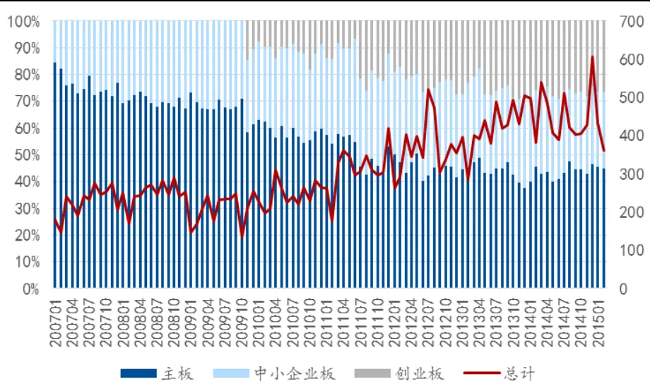
数据来源：国泰君安证券研究，Wind
注：图中左轴对应不同板块在每个月份的相对占比，右轴对应每月上榜的绝对数量

从行业分布的视角来看，下图揭示了样本区间（2007 年-2015 年 2 月）内，不同行业在上榜案例中的占比，与全市场股票中不同行业平均占比的差值。可以看出，由于价格涨跌幅偏离值较大而上榜的个股在行业上没有太大的偏离，相对而言，计算机、电子行业相对较多，而交通运输行业较少。

图 3：行业分布-日收盘价涨跌幅偏离值达±7%
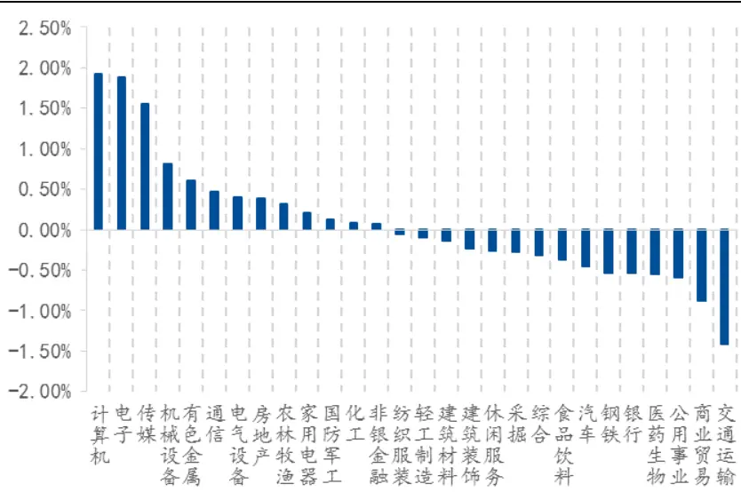
数据来源：国泰君安证券研究，Wind
注：上图表示每个行业在样本案例中的占比，与全市场所有股票行业占比的差值

我们统计了样本区间内，由于日收盘价涨跌幅偏离值达±7%上榜的股票，并列出了上榜频率在40 次以上的个股、其所属的行业及上榜次数。其中，莱茵生物的上榜次数最多，多达 60 次，成飞集成、精功科技、长城影视次之。

表 3：个股统计-日收盘价涨跌幅偏离值达±7%

| 股票简称 | 行业 | 上榜次数 | 股票简称 | 行业 | 上榜次数 |
| --- | --- | --- | --- | --- | --- |
| 莱茵生物 | 医药生物 | 60 | 登海种业 | 农林牧渔 | 43 |
| 成飞集成 | 国防军工 | 57 | 航天科技 | 机械设备 | 42 |
| 精功科技 | 机械设备 | 54 | 粵传媒 | 传媒 | 41 |
| 长城影视 | 轻工制造 | 51 | 冠昊生物 | 医药生物 | 41 |
| 永安林业 | 农林牧渔 | 47 | 达安基因 | 医药生物 | 41 |
| 紫鑫药业 | 医药生物 | 45 | *ST 金路 | 化工 | 41 |
| 乐视网 | 传媒 | 45 | 鸿博股份 | 轻工制造 | 41 |
| 上海钢联 | 传媒 | 44 | 威华股份 | 轻工制造 | 41 |
| 深天马A | 电子 | 44 | 拓维信息 | 传媒 | 40 |
| 亿帆鑫富 | 医药生物 | 44 | 昌九生化 | 化工 | 40 |
| 生意宝 | 传媒 | 44 | 北京文化 | 休闲服务 | 40 |

数据来源：国泰君安证券研究，Wind

## 2.2. 日价格振幅达到 15%

对于日价格振幅达 15%的情形，2007 年至 2015 年 2 月期间，共有近四千条样本。

从板块分布来看，主板股票的占比较多。这一披露原因的案例相对较少，但在2014年 12月，上榜的绝对数量出现了井喷，单月 136次。

图 4：板块分布-日价格振幅达 15%
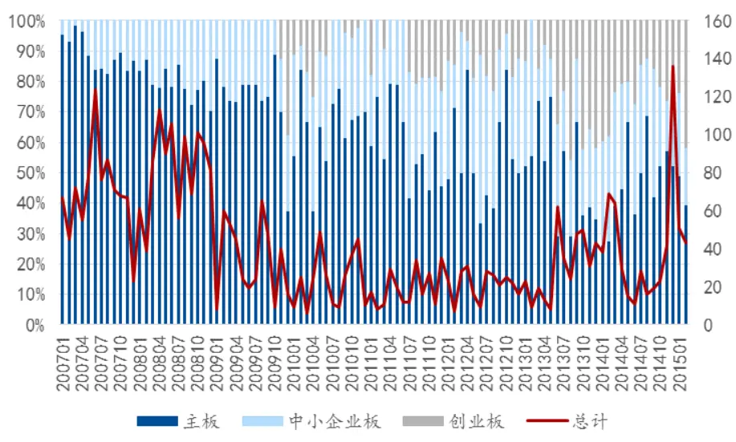
数据来源：国泰君安证券研究，Wind

注：图中左轴对应不同板块在每个月份的相对占比，右轴对应每月上榜的绝对数量

从行业分布的视角来看，由于日内价格振幅较大而上榜的个股，在行业分布上没有太大的偏离，相对而言，房地产行业相对较多，而医药生物行业较少。

图 5：行业分布-日价格振幅达 15%
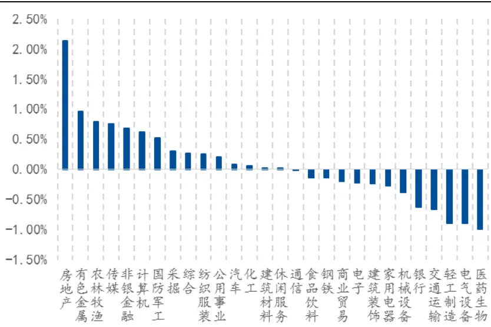
数据来源：国泰君安证券研究，Wind

注：上图表示每个行业在样本案例中的占比，与全市场所有股票行业占比的差值

我们统计了样本区间内，由于日价格振幅较大而上榜的股票，并列出了上榜频率在 10 次以上的个股、其所属的行业及上榜次数。其中，杭萧钢构的上榜次数最多。

表 4：个股统计-日价格振幅达 15%

| 股票简称 | 行业 | 上榜次数 | 股票简称 | 行业 | 上榜次数 |
| --- | --- | --- | --- | --- | --- |
| 杭萧钢构 | 建筑装饰 | 13 | 绿景控股 | 房地产 | 11 |
| 恒天天鹅 | 化工 | 12 | 香梨股份 | 农林牧渔 | 11 |
| 中核钛白 | 化工 | 12 | 新农开发 | 农林牧渔 | 11 |
| 豫能控股 | 公用事业 | 12 | 西仪股份 | 汽车 | 10 |
| 大元股份 | 有色金属 | 12 | 洛阳玻璃 | 建筑材料 | 10 |
| 滨海能源 | 公用事业 | 11 | 号百控股 | 休闲服务 | 10 |
| 深国商 | 房地产 | 11 | 金圆股份 | 综合 | 10 |
| 渝开发 | 房地产 | 11 |  |  |  |

数据来源：国泰君安证券研究，Wind

## 2.3. 换手率达到 20%

对于换手率达到 20%的情形，2007 年至 2015 年 2 月期间，共有近一万六千条样本。

从板块分布来看，主板股票的占比大幅减少，中小板、创业板则相对较多。上榜案例较多的月份主要集中在 2011-2012 年。

图 6：板块分布-换手率达到 20%
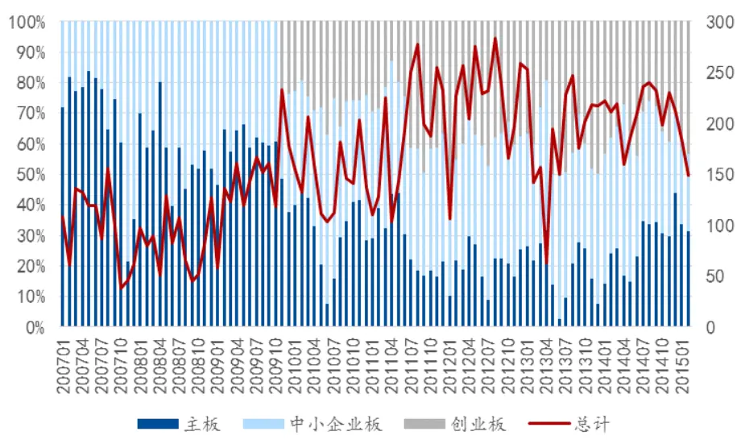
数据来源：国泰君安证券研究，Wind
注：图中左轴对应不同板块在每个月份的相对占比，右轴对应每月上榜的绝对数量

从行业分布的视角来看，机械设备、电子、计算机行业的个股上榜次数较多，而房地产、商业贸易行业较少。

图 7：行业分布-换手率达到 20%
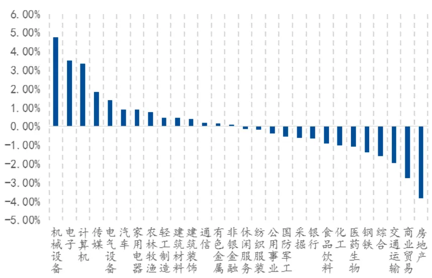
数据来源：国泰君安证券研究，Wind
注：上图每个行业在样本案例中的占比，与全市场所有股票行业占比的差值

我们统计了样本区间内，由于换手率达 20%上榜的股票，并列出了上榜频率在 50 次以上的个股、其所属的行业及上榜次数。其中，天舟文化的上榜次数最多，多达 100 次，北京文化、福建金森也都达到了 80 次左右。

表 5：个股统计-换手率达到 20%

| 股票简称 | 行业 | 上榜次数 | 股票简称 | 行业 | 上榜次数 |
| --- | --- | --- | --- | --- | --- |
| 天舟文化 | 传媒 | 100 | 川润股份 | 机械设备 | 57 |

数量化专题报告

| 北京文化 | 休闲服务 82 | 龙宇燃油 | 化工 | 56 |
| --- | --- | --- | --- | --- |
| 福建金森 | 农林牧渔 | 79 三丰智能 | 机械设备 | 56 |
| 三五互联 | 计算机 | 69 金莱特 | 家用电器 | 56 |
| 大连电瓷 | 电气设备 69 | 露笑科技 | 电气设备 | 55 |
| 华数传媒 | 传媒 67 | 海南瑞泽 | 建筑材料 | 55 |
| 任子行 | 计算机 63 | 浙江世宝 | 汽车 | 54 |
| 金轮股份 | 机械设备 62 | 登云股份 | 汽车 | 53 |
| 中原特钢 | 机械设备 60 | 三维丝 | 公用事业 | 53 |
| 莱茵生物 | 医药生物 60 | 龙生股份 | 汽车 | 53 |
| 华鹏飞 | 交通运输 59 | 棒杰股份 | 纺织服装 | 53 |
| 共达电声 | 电子 59 | 一拖股份 | 机械设备 | 52 |
| 东宝生物 | 医药生物 | 58 麦捷科技 | 电子 | 51 |
| 巴安水务 | 公用事业 | 58 荣之联 | 计算机 | 50 |
| 熊猫金控 | 轻工制造 | 58 华泽钴镍 | 有色金属 | 50 |

数据来源：国泰君安证券研究，Wind

## 2.4.连续三个交易日内收盘价涨跌幅偏离值累计达±20%

对于连续三个交易日内收盘价涨跌幅偏离值累计达±20%的情形，2007年至2015年 2月期间，共有七千多条样本。

“异常波动”这类情形，交易所对每日的上榜案例全部公布，不存在数量限制。这一类主要以上榜前三个交易日的价格涨跌幅为考察标准，而非仅参考上榜当日。

从板块分布来看，主板股票的占比较多。2014 年 12 月，上榜的绝对数量出现了井喷。

图 8：板块分布-连续三个交易日内收盘价涨跌幅偏离值累计达±20%
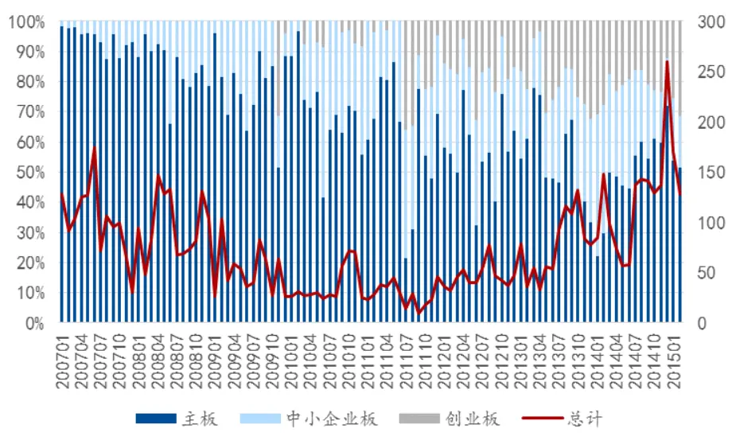
数据来源：国泰君安证券研究，Wind

注：图中左轴对应不同板块在每个月份的相对占比，右轴对应每月上榜的绝对数量

从行业分布的视角来看，由于异常波动而上榜的个股，在行业分布上没

有太大的偏离，相对而言，计算机、房地产行业相对较多，而化工行业较少。

图 9：行业分布-连续三个交易日内收盘价涨跌幅偏离值累计达±20%
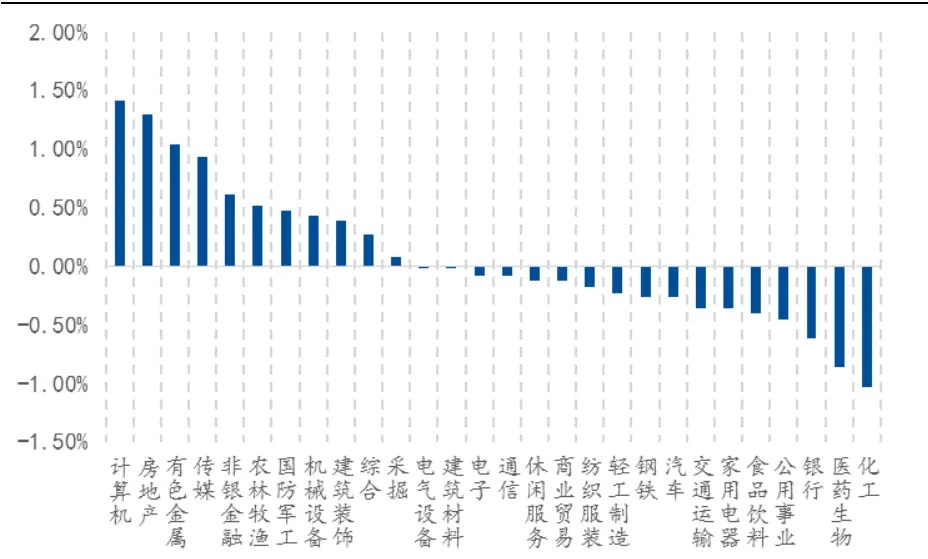
数据来源：国泰君安证券研究，Wind
注：上图表示每个行业在样本案例中的占比，与全市场所有股票行业占比的差值

我们统计了样本区间内，由于连续三个交易日内收盘价涨跌幅偏离值累计达±20%而上榜的股票，并列出了上榜频率最多的前 12只个股、其所属的行业及上榜次数。其中，莱茵生物、杭萧钢构的上榜次数最多。

表 6：个股统计-连续三个交易日内收盘价涨跌幅偏离值累计达±20%

| 股票简称 | 行业 | 上榜次数 | 股票简称 | 行业 | 上榜次数 |
| --- | --- | --- | --- | --- | --- |
| 莱茵生物 | 医药生物 | 19 | 大元股份 | 有色金属 | 15 |
| 杭萧钢构 | 建筑装饰 | 18 | 香梨股份 | 农林牧渔 | 14 |
| 海通证券 | 非银金融 | 17 | 熊猫金控 | 轻工制造 | 14 |
| 智慧能源 | 电气设备 | 16 | 湖南海利 | 化工 | 14 |
| 外高桥 | 房地产 | 15 | 自仪股份 | 机械设备 | 14 |
| 成飞集成 | 国防军工 | 15 | 深国商 | 房地产 | 14 |

数据来源：国泰君安证券研究，Wind

## 3. 收益分析—从披露原因的视角

我们首先从不同的披露原因的视角出发，仿照事件类的回测方法，考察上榜后的股票组合能否取得一定的超额收益。

假设披露日为T 日，我们假设以 T+1日的均价买入，分别对冲万得全 A指数、个股对应的申万一级行业指数，持有 60 个交易日，考察等权重组合的超额收益表现。

事实上，交易公开信息披露的股票中，有相当一部分存在连日涨跌停板的情况。为此，我们考虑了 T+1 日是否可以买入的实际可操作性，以

T+1 日的振幅为指标，剔除了T+1日价格振幅为零的个股。

表 7: 各类型T+1日价格振幅为 0占比

| 情形 | 总量 | T+1 日价格振幅为 0 | 占比 |
| --- | --- | --- | --- |
| 日收盘价涨跌幅偏离值达到±7% | 30633 | 1798 | 5.87% |
| 日价格振幅达到15% | 3950 | 98 | 2.48% |
| 换手率达到 20% | 15824 | 284 | 1.79% |
| 连续三个交易日内收盘价涨跌幅偏离值累计达±20% | 7025 | 1383 | 19.69% |

数据来源：国泰君安证券研究，上海证券交易所，深圳证券交易所。

## 3.1.日收盘价格涨跌幅偏离值达±7%

对于日收盘价格涨跌幅偏离到±7%的股票组合，其上榜后 60 个交易日相对万得全A 指数和行业指数出现了1%以上的回撤。

图 10：累计超额收益-日收盘价涨跌幅偏离值达±7%
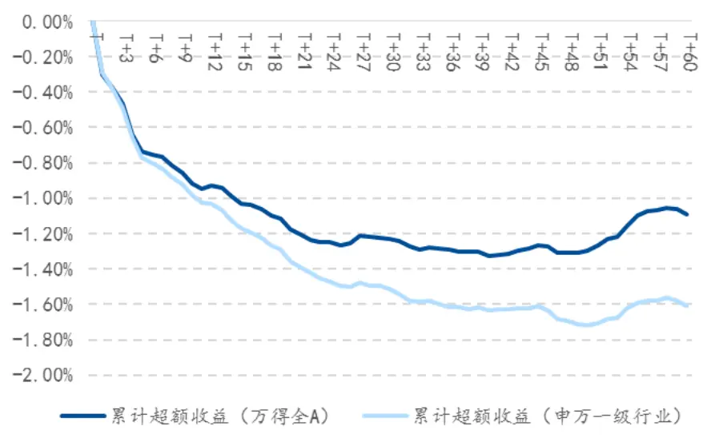
数据来源：国泰君安证券研究，Wind

考虑到这一类上榜原因包括日收盘价格涨跌幅偏离值“为正”与“为负”两大类，我们以上榜当日价格涨跌幅为指标，划分出“正负”两类组合，分别考察其相对万得全 A 指数和申万一级行业指数的累计超额收益情况。

通过下面两幅图可以看出，无论是相对万得全A指数，还是相对申万一级行业指数，上榜当日价格涨跌幅“为负”的组合，表现皆好于上榜当日价格涨跌幅“为正”的组合。

图 11：上榜当日涨跌幅分组对比-相对万得全A指数
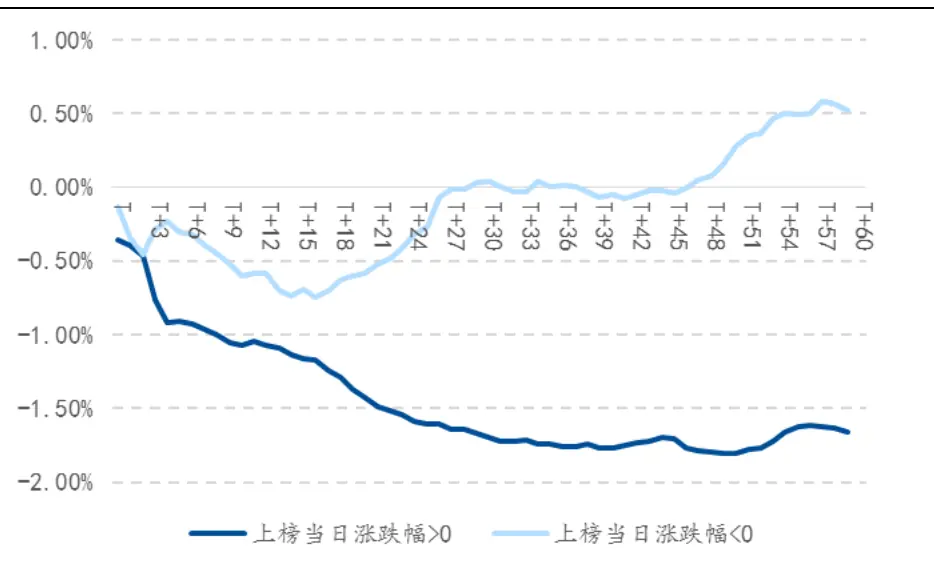
数据来源：国泰君安证券研究，Wind

图 12：上榜当日涨跌幅分组对比-相对申万一级行业指数
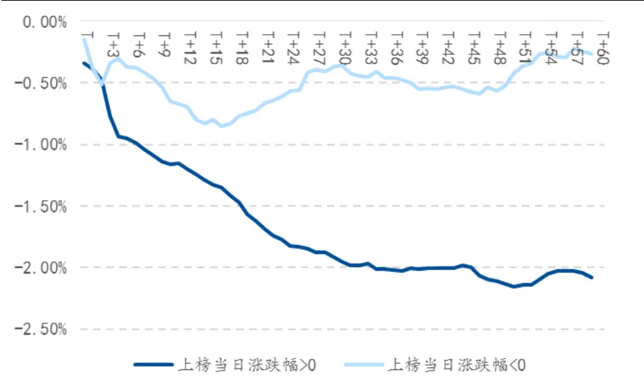
数据来源：国泰君安证券研究，Wind

## 3.2. 日价格振幅达到 15%

对于披露原因为“日价格振幅达到15%”的这一类，可以看出，其上榜后的60个交易日，出现了2%以上的收益回撤。

图 13：累计超额收益-日价格振幅达 15%
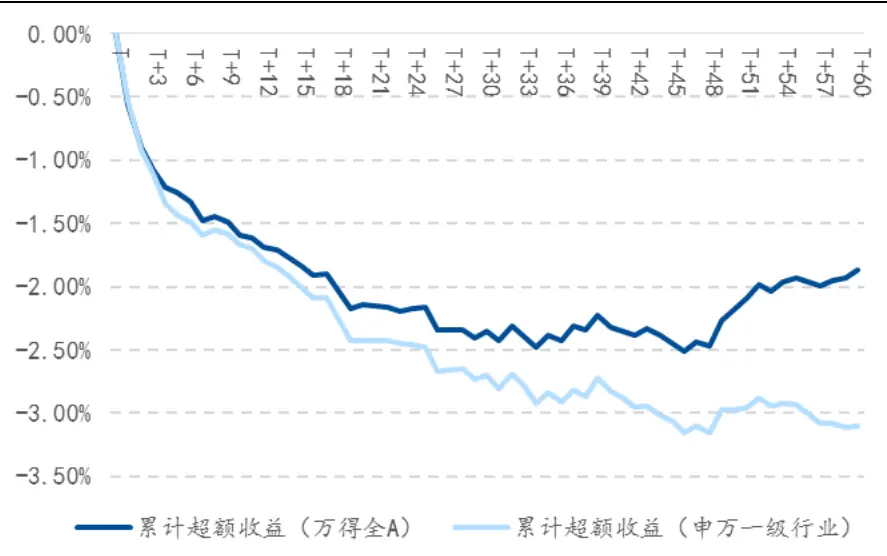
数据来源：国泰君安证券研究，Wind

## 3.3. 换手率达到 20%

由于换手率较高而上榜的股票组合，其上榜后 60 个交易日相对收益回撤达到6%，这也体现了换手率指标在短期内为反向指标。

图 14：累计超额收益-换手率达到 20%
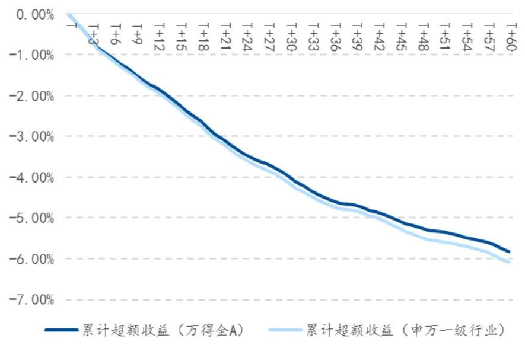
数据来源：国泰君安证券研究，Wind

## 3.4.连续三个交易日内涨跌幅偏离值累计达±20%

对于异常波动的股票组合，其考察的是上榜日前三个交易日的表现，上榜时，价格异常波动已持续三个交易日。上榜后 60 个交易日的收益表现来看，出现了2%以上的回撤。

图 15：累计超额收益-连续三个交易日内收盘价涨跌幅偏离值累计达±20%
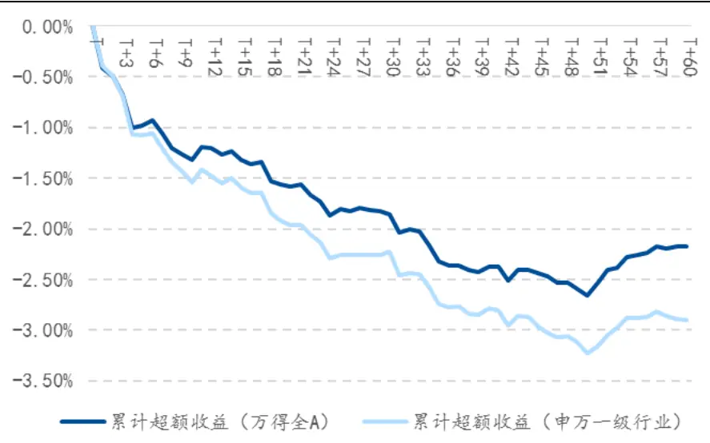
数据来源：国泰君安证券研究，Wind
注：图中左轴对应不同板块在每个月份的相对占比，右轴对应每月上榜的绝对数量

单纯从披露原因的视角，考察不同披露原因的组合上榜后 60 个交易日的超额收益表现情况，均出现了不同程度的回撤。

## 4. 风格观察—机构专用席位

从交易公开信息示例中，我们注意到有一类交易席位叫做“机构专用”。
从本节开始，我们将从交易席位的视角进行剖析。

图 16：交易公开信息示例

|  | 33631800.00 |
| --- | --- |
| 20615317.00 |  |

数据来源：深圳证券交易所，国泰君安证券研究

机构席位是指基金专用席位、券商自营专用席位、社保专用席位、券商理财专用席位、保险机构专用席位、保险机构租用席位、QFII专用席位等机构投资者买卖证券的专用通道和席位。

对于机构专用席位参与的情形，2007 年至 2015 年 2 月期间，共有两万多条样本。

从板块分布来看，几年来，主板股票的占比有所减少。绝对数量上，在2014年12月份出现井喷，单月752个案例。

图 17：板块分布-机构参与
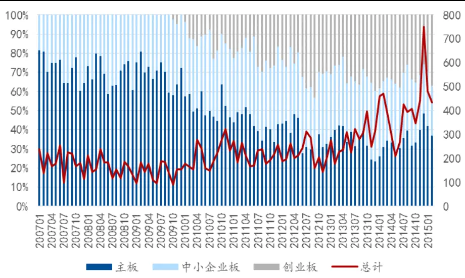
数据来源：国泰君安证券研究，Wind
注：图中左轴对应不同板块在每个月份的相对占比，右轴对应每月上榜的绝对数量

从行业分布的视角来看，有机构席位出现在榜单的个股中，计算机、电子、传媒行业较多，相对全市场行业占比出现了 3%的偏离。

图 18：行业分布-机构参与
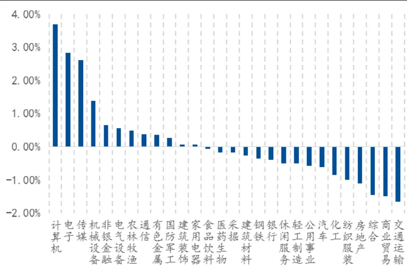
数据来源：国泰君安证券研究，Wind

注：上图表示每个行业在样本案例中的占比，与全市场所有股票行业占比的差值

我们统计了样本区间内，有机构席位出现在榜单中的个股，并列出了上

榜频率在 30 次以上的个股、其所属的行业及上榜次数。其中，拓维信息、国海证券、共达电声的上榜次数最多。

表 8：个股统计-机构参与

| 股票简称 | 行业 | 上榜次数 | 股票简称 | 行业 | 上榜次数 |
| --- | --- | --- | --- | --- | --- |
| 拓维信息 | 51 | 传媒 | 奥飞动漫 | 34 | 传媒 |
| 国海证券 | 50 | 非银金融 | 荣盛发展 | 33 | 房地产 |
| 共达电声 | 50 | 电子 | 银之杰 | 33 | 计算机 |
| 北纬通信 | 44 | 传媒 | 远望谷 | 33 | 电子 |
| 超声电子 | 43 | 电子 | 万向钱潮 | 33 | 汽车 |
| 乐视网 | 43 | 传媒 | 中航机电 | 33 | 国防军工 |
| 同花顺 | 40 | 计算机 | 华映科技 | 32 | 电子 |
| 精功科技 | 40 | 机械设备 | 宏源证券 (退市) | 32 | 非银金融 |
| 新疆浩源 | 39 | 公用事业 | 掌趣科技 | 32 | 传媒 |
| 赢时胜 | 39 | 计算机 | 兴源环境 | 32 | 公用事业 |
| 中色股份 | 37 | 有色金属 | 中核科技 | 32 | 机械设备 |
| 登海种业 | 37 | 农林牧渔 | 中科三环 | 32 | 有色金属 |
| 东方财富 | 36 | 传媒 | 光线传媒 | 31 | 传媒 |
| 长方照明 | 36 | 电子 | 任子行 | 31 | 计算机 |
| 上海钢联 | 36 | 传媒 | 招商地产 | 31 | 房地产 |
| 粵传媒 | 35 | 传媒 | 大立科技 | 31 | 电子 |
| 星星科技 | 35 | 电子 | 茂硕电源 | 31 | 电子 |
| 云南铜业 | 35 | 有色金属 | 全通教育 | 31 | 传媒 |
| 深天马A | 34 | 电子 | 华数传媒 | 30 | 传媒 |
| 西部证券 | 34 | 非银金融 | 辉隆股份 | 30 | 化工 |
| 海南橡胶 | 34 | 农林牧渔 | 东土科技 | 30 | 通信 |
| 广宇发展 | 34 | 房地产 | 湖南黄金 | 30 | 有色金属 |

数据来源：国泰君安证券研究，Wind

## 5. 收益分析—机构专用席位

通过“机构专用”席位的标示，我们可以获取交易公开信息披露的个股中，机构的参与程度。分别通过机构席位出现在榜单买入席位中的绝对数量，以及机构参与的总买入金额与当日个股总成交金额的占比，来考察机构席位参与带来的影响。

## 5.1.“机构专用”席位的绝对数量

我们选取“机构专用”席位出现在公开买入席位中的绝对数量作为衡量机构参与程度的指标之一，规避机构参与卖出，分别选取“机构专用”席位占据3席以上、2 席以上、1席以上，以及交易席位中未出现“机构专用”席位。

从绝对收益的表现来看，机构参与席位的绝对数量与组合的表现呈正比，机构参与的席位数量越多，组合表现越优异。与之相对应的，如果没有机构专用席位出现在榜单中，则收益表现相对较差。相对万得全A指数和相应行业指数的超额收益表现情况，也都得出了相同的结论。

图 19：绝对收益-“机构专用”席位的绝对数量
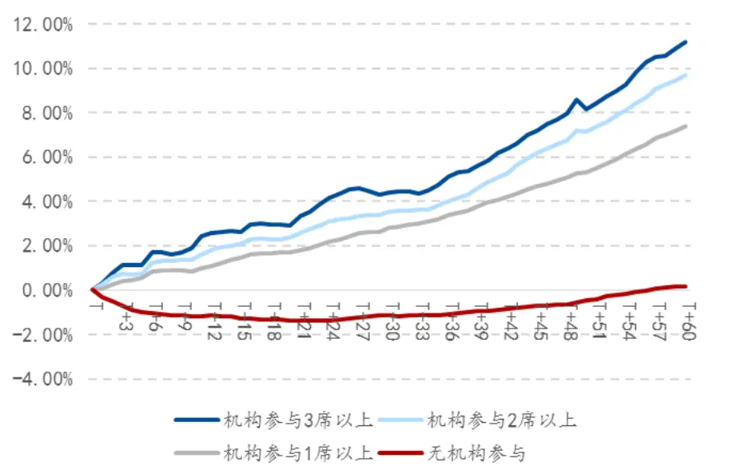
数据来源：国泰君安证券研究，Wind

注：上图曲线分别对应前五大买入交易席位中，“机构专用”席位占据 3、2、1席以上，以及交易席位中没有机构参与。

图 20：相对万得全A指数-“机构专用”席位的绝对数量
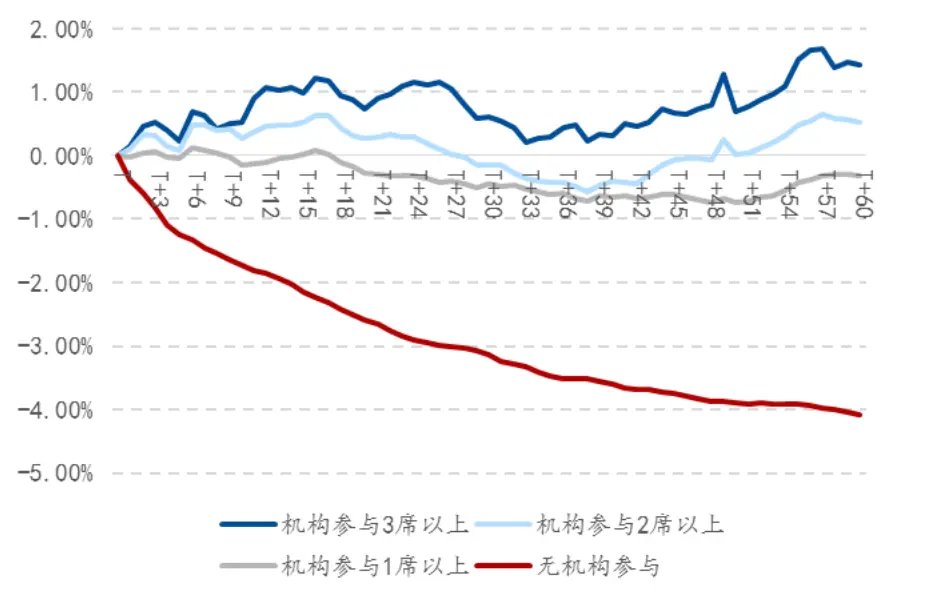
数据来源：国泰君安证券研究，Wind

注：上图曲线分别对应前五大买入交易席位中，“机构专用”席位占据 3、2、1席以上，以及交易席位中没有机构参与。

图 21：相对申万一级行业指数-“机构专用”席位的绝对数量
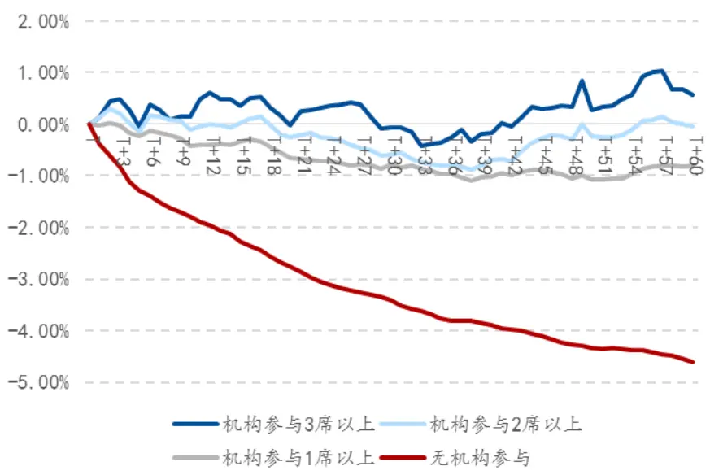
数据来源：国泰君安证券研究，Wind

注：上图曲线分别对应前五大买入交易席位中，“机构专用”席位占据 3、2、1席以上，以及交易席位中没有机构参与。

## 5.2.“机构专用”席位的总买入金额与个股总成交金额的占比

另一方面，我们选取“机构专用”席位买入的总成交金额与当天个股总成交金额的比值，作为衡量机构参与程度另一指标。

回测时规避机构参与卖出，通过设置参数“10%”，分别比较了机构买入金额占成交金额10%以上、机构仅参与买入、无机构参与三种情形。通过下图可以发现，无论是绝对收益，还是相对万得全A 指数、申万一级行业指数的相对收益，都呈现出机构买入金额占当日成交金额的占比越高，则组合表现越优异。

图 22：绝对收益-“机构专用”席位的总买入金额与个股总成交金额占比
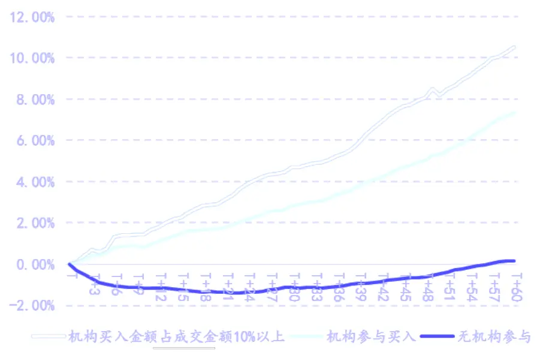
数据来源：国泰君安证券研究，Wind

注：上图曲线分别对应“机构专用”席位的总买入金额与个股总成交金额占比 10%以上、机构仅买入、无机构参与。

图 23：相对万得全 A 指数-“机构专用”席位的总买入金额与个股总成交金额占比
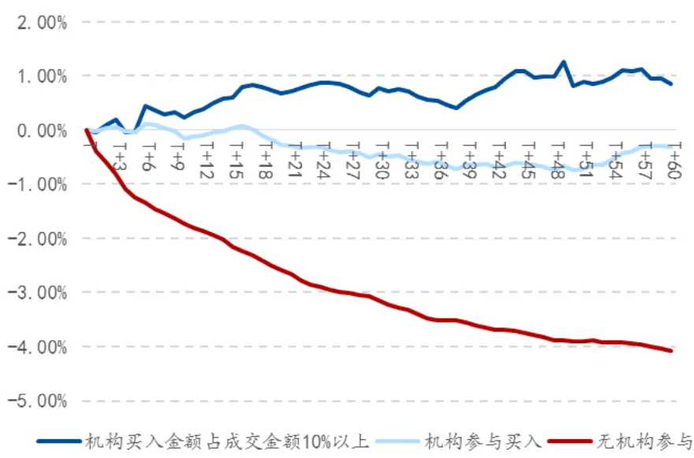
数据来源：国泰君安证券研究，Wind

注：上图曲线分别对应“机构专用”席位的总买入金额与个股总成交金额占比 10%以上、机构仅买入、无机构参与。

图 24：相对申万一级行业指数-“机构专用”席位的总买入金额与个股总成交金额占比
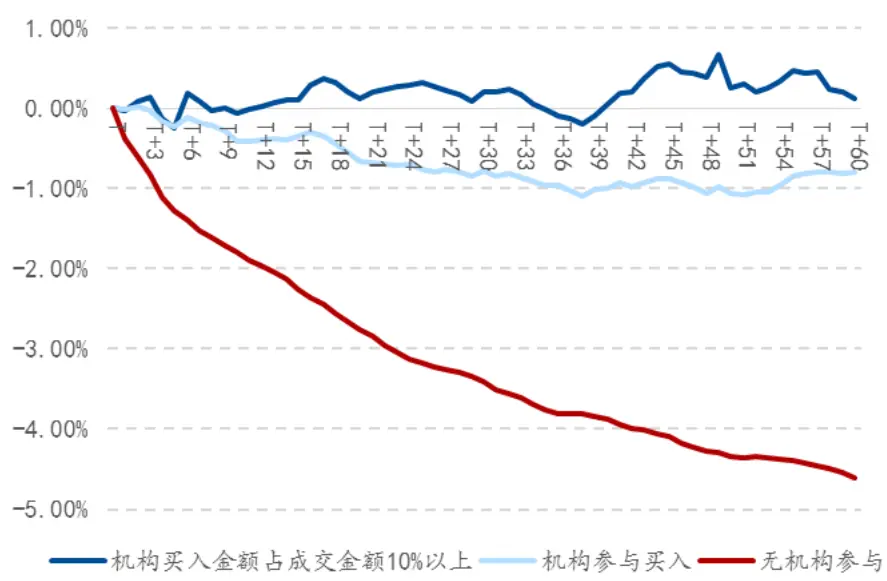
数据来源：国泰君安证券研究，Wind

注：上图曲线分别对应“机构专用”席位的总买入金额与个股总成交金额占比 10%以上、机构仅买入、无机构参与。

## 6. 研究展望

本文就交易公开信息这类公开数据进行初步的探索，分别从披露原因和交易席位的视角进行了较为全面的市场观察。后续，我们将基于此，进一步深入研究，构建量化投资策略。

## 本公司具有中国证监会核准的证券投资咨询业务资格

## 分析师声明

作者具有中国证券业协会授予的证券投资咨询执业资格或相当的专业胜任能力，保证报告所采用的数据均来自合规渠道，分析逻辑基于作者的职业理解，本报告清晰准确地反映了作者的研究观点，力求独立、客观和公正，结论不受任何第三方的授意或影响，特此声明。

## 免责声明

本报告仅供国泰君安证券股份有限公司（以下简称“本公司”）的客户使用。本公司不会因接收人收到本报告而视其为本公司的当然客户。本报告仅在相关法律许可的情况下发放，并仅为提供信息而发放，概不构成任何广告。

本报告的信息来源于已公开的资料，本公司对该等信息的准确性、完整性或可靠性不作任何保证。本报告所载的资料、意见及推测仅反映本公司于发布本报告当日的判断，本报告所指的证券或投资标的的价格、价值及投资收入可升可跌。过往表现不应作为日后的表现依据。在不同时期，本公司可发出与本报告所载资料、意见及推测不一致的报告。本公司不保证本报告所含信息保持在最新状态。同时，本公司对本报告所含信息可在不发出通知的情形下做出修改，投资者应当自行关注相应的更新或修改。

本报告中所指的投资及服务可能不适合个别客户，不构成客户私人咨询建议。在任何情况下，本报告中的信息或所表述的意见均不构成对任何人的投资建议。在任何情况下，本公司、本公司员工或者关联机构不承诺投资者一定获利，不与投资者分享投资收益，也不对任何人因使用本报告中的任何内容所引致的任何损失负任何责任。投资者务必注意，其据此做出的任何投资决策与本公司、本公司员工或者关联机构无关。

本公司利用信息隔离墙控制内部一个或多个领域、部门或关联机构之间的信息流动。因此，投资者应注意，在法律许可的情况下，本公司及其所属关联机构可能会持有报告中提到的公司所发行的证券或期权并进行证券或期权交易，也可能为这些公司提供或者争取提供投资银行、财务顾问或者金融产品等相关服务。在法律许可的情况下，本公司的员工可能担任本报告所提到的公司的董事。

市场有风险，投资需谨慎。投资者不应将本报告为作出投资决策的惟一参考因素，亦不应认为本报告可以取代自己的判断。在决定投资前，如有需要，投资者务必向专业人士咨询并谨慎决策。

本报告版权仅为本公司所有，未经书面许可，任何机构和个人不得以任何形式翻版、复制、发表或引用。如征得本公司同意进行引用、刊发的，需在允许的范围内使用，并注明出处为“国泰君安证券研究”，且不得对本报告进行任何有悖原意的引用、删节和修改。

若本公司以外的其他机构（以下简称“该机构”）发送本报告，则由该机构独自为此发送行为负责。通过此途径获得本报告的投资者应自行联系该机构以要求获悉更详细信息或进而交易本报告中提及的证券。本报告不构成本公司向该机构之客户提供的投资建议，本公司、本公司员工或者关联机构亦不为该机构之客户因使用本报告或报告所载内容引起的任何损失承担任何责任。

## 评级说明

## 1.投资建议的比较标准

投资评级分为股票评级和行业评级。

以报告发布后的12个月内的市场表现为比较标准，报告发布日后的 12个月内的公司股价（或行业指数）的涨跌幅相对同期的沪深 300 指数涨跌幅为基准。

## 2.投资建议的评级标准

报告发布日后的 12 个月内的公司股价（或行业指数）的涨跌幅相对同期的沪深 300 指数的涨跌幅。

| 评级 | 说明 |  |
| --- | --- | --- |
| 股票投资评级 | 增持 | 相对沪深 300指数涨幅15%以上 |
|  | 谨慎增持 | 相对沪深300指数涨幅介于5%～15%之间 |
|  | 中性 | 相对沪深300指数涨幅介于-5%～5% |
|  | 减持 | 相对沪深300指数下跌5%以上 |
| 行业投资评级 | 增持 | 明显强于沪深 300 指数 |
|  | 中性 | 基本与沪深300指数持平 |
|  | 减持 | 明显弱于沪深300指数 |

## 国泰君安证券研究

|  | 上海 | 深圳 | 北京 |
| --- | --- | --- | --- |
| 地址 | 上海市浦东新区银城中路168号上海 银行大厦29层 | 深圳市福田区益田路 6009 号新世界 商务中心34层 | 北京市西城区金融大街28 号盈泰中 心2号楼10层 |
| 邮编 | 200120 | 518026 | 100140 |
| 电话 | (021)38676666 | （0755)23976888 | (010)59312799 |
|  | E-mail: gtjaresearch@gtjas.com |  |  |