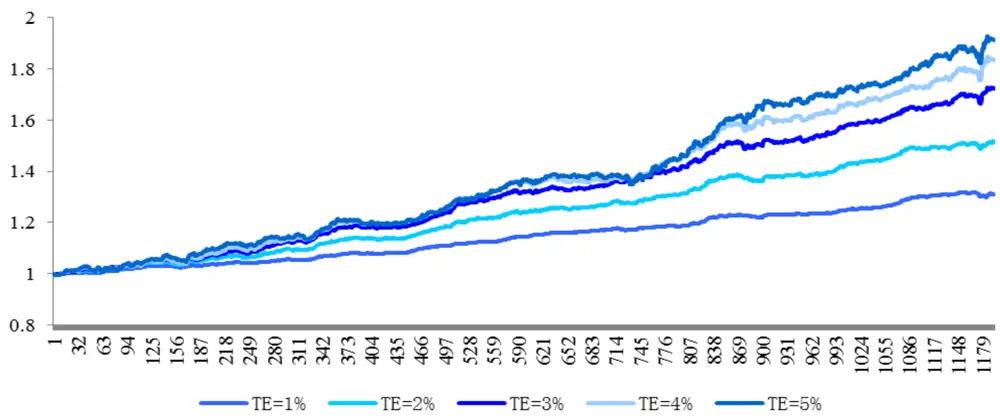
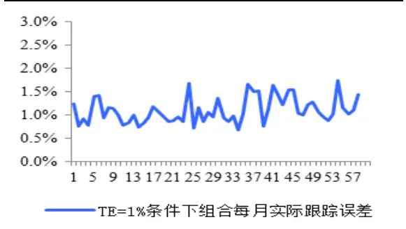
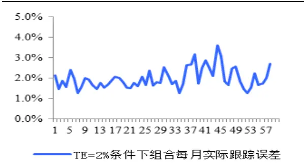
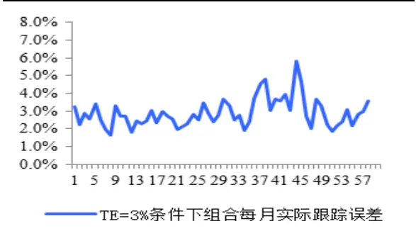
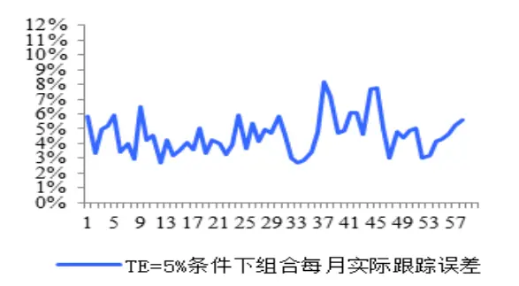
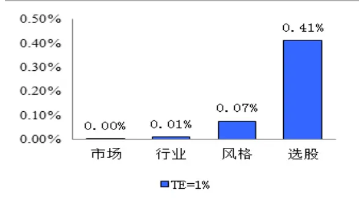
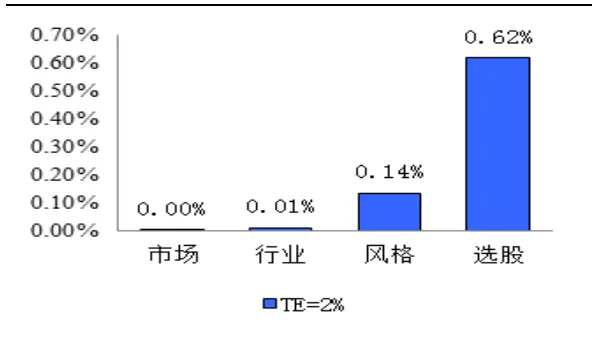
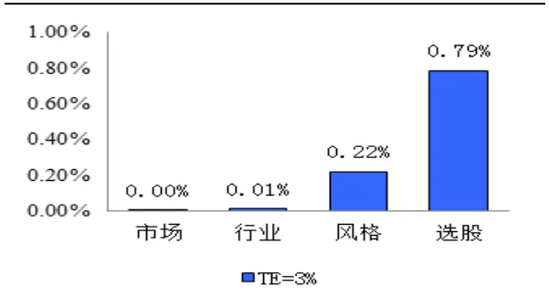
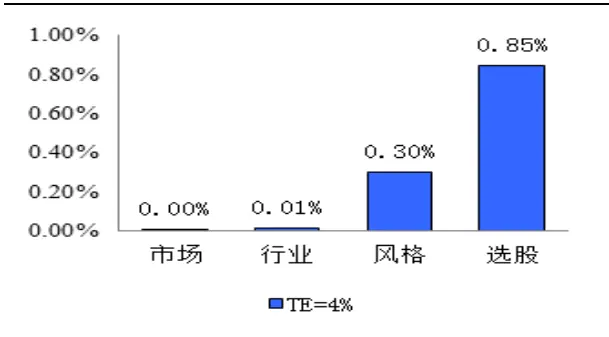
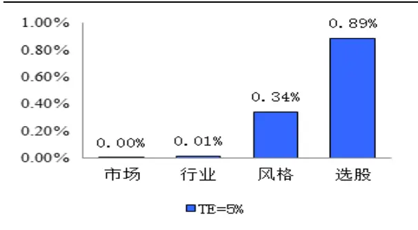

inInfo] [Table_Title] 2015.07.29

# 如何控制跟踪误差

# ——数量化专题之六十二

玉刘富兵（分析师）

## 李辰（研究助理）

8 021-38676673

021-38677309

liufubing008481@gtjas.com

lichen@gtjas.com

证书编号 S0880511010017

S0880114060025

## 本报告导读：

利用积极权重作用于风险模型，我们可以实现事前对组合跟踪误差的约束控制，投资经理对策略未来的收益、波动、回撤将有更强的定量控制力。

## 摘要：

[Table_Summary] • 风险模型的精髓在于对波动率的预测，通过定量的控制方法，阿尔法投资经理可以实现对组合未来波动率的精准把控，做到成竹在胸。

- 利用积极权重作用于风险模型，我们可以得到组合未来一段时间跟踪误差的预期值。通过事前对跟踪误差的约束控制，投资经理可实现对未来阿尔法波动率的定量控制。

- 实证分析结果表明，对跟踪误差的约束可以较为精确的控制阿尔法的波动率。绩效统计、偏差检验、归因分析表明，跟踪误差的控制对策略收益、风险特征起到了决定性的影响。

- 在分别设定年化跟踪误差 TE=1%、2%、3%、4%和 5%的控制条件下，组合实际跟踪误差分别为 1.25%、2.12%、3.10%、4.06%和4.83%，控制精度结果理想。

从理念上而言，我们无法保证，策略在未来长时间内可以始终有着较为理想的净值曲线，但是我们希望做到，无论盈利、亏损、波动还是回撤，策略都有据可依、有理可证。科学的投资方法始终是我们追求的终极目标。

金融工程

## 金融工程团队：

刘富兵：（分析师）

电话：021-38676673

邮箱：liufubing008481@gtjas.com

证书编号：S0880511010017

赵延鸿：（分析师）

电话：021-38674927

邮箱：zhaoyanhong@gtjas.com

证书编号：S0880515030004

## 耿帅军：（分析师）

电话：010-59312753

邮箱：gengshuaijun@gtjas.com

证书编号：S0880513080013

## 刘正捷：（分析师）

电话：0755-23976803

邮箱：liuzhengjie012509@gtjas.com

证书编号：S0880514070010

## 李雪君：（分析师）

电话：021-38675855

邮箱：lixuejun@gtjas.com

证书编号：S0880515070001

王浩：（研究助理）

电话：021-38676434

邮箱：wanghao014399@gtjas.com

证书编号：S0880114080041

## 陈奥林：（研究助理）

电话：021-38674835

邮箱：chenaolin@gtjas.com

证书编号：S0880114110077

## 李辰：（研究助理）

电话：021-38677309

邮箱：lichen@gtjas.com

证书编号：S0880114060025

## [Table_R相关报告

《指数成份股停牌带来的隐含收益》2015.07.12

《近期员工持股破发、机构增持个股一览》2015.07.09

《寻找反弹中的最优标的》2015.06.30

《沪深 300 分红预测详解与跟踪》2015.06.17

《探究交易公开信息之市场观察篇》2015.06.10

## 1. 引言

在前两篇报告《基于组合权重优化的风格中性多因子选股策略》和《中证500之阿尔法验金石》中，我们构建了基于A股市场的结构化多因子风险模型，较为完整的刻画了中国股市的风险结构，并对不同组合的波动率进行了较为准确的估计。

基于风险模型，我们构建了风格中性多因子选股策略。众所周知，对于阿尔法策略而言，控制组合收益的波动率，控制策略的最大回撤，保证收益的平稳是至关重要的，甚至从某种意义上来说，策略的稳定性比收益率更为重要。这就对于绝对收益策略的投资经理提出了较大的考验，对其而言，投资完全是一门科学。

风险模型的精髓在于对波动率的预测，通过定量的控制方法，阿尔法投资经理可以实现对组合未来波动率的精准把控，做到成竹在胸。

本篇报告在风格中性多因子选股策略的基础上，通过对组合跟踪误差的定量约束，实现了对策略未来波动率的精确掌控。换言之，在控制跟踪误差的约束条件下，投资经理可以根据自己的需求设定策略未来的波动率，而这样的波动预期值将在很大的概率下被实现。

我们无法预知未来收益，但却可以控制未来波动。

## 2. 风险模型与跟踪误差

## 2.1.风险模型与波动率估计

结构化多因子风险模型首先对收益率进行简单的线性分解，对于第 j 只股票收益的分解形式可以表示为：

$$
r_{_j}=x_{_1}f_{_1}+x_{_2}f_{_2}+x_{_3}f_{_3}+x_{_4}f_{_4}...x_{_K}f_{_K}+u_{_j}
$$

其中， $r_{j}$ 表示第 j 只股票的收益率； $x_{\scriptscriptstyle k}$ 表示第 j 只股票在第k 个因子上的暴露（也称为因子载荷）； $\boldsymbol{f}_{k}$ 表示第 j 只股票第k 个因子的因子收益率（即每单位因子暴露所承载的收益率）； $\boldsymbol{u}_{\ j}$ 表示第 j 只股票的特质因子收益率。

那么对于一个包含 N 只股票的投资组合，假设组合的权重为$w={(w_{1},w_{2},...,w_{_{N}})}^{T}$ ，那么组合收益率可以表示为：

$$
R_{_P}=\sum_{j=1}^{N}w_{_n}\cdot(\sum_{k=1}^{K}x_{_{jk}}f_{_{jk}}+u_{_j})
$$

假设每只股票的特质因子收益率与共同因子收益率不相关，并且每只股票的特质因子收益率也不相关。那么在上述表达式的基础上，可以得到组合的风险结构为：

$$
\sigma_{_P}=\sqrt{{w}^{T}\left(XFX^{T}+\Delta\right)w}
$$

其中，X 表示N 只个股在K 个风险因子上的因子载荷矩阵 $(N\times K)$

$$
\begin{array}{r}{\left[\begin{array}{llll}{x_{1,1}}&{x_{1,2}}&{\dots}&{x_{1,k}}\\{\vert}&{}&{}&{}\\{x_{2,1}}&{x_{2,2}}&{\dots}&{x_{2,k}}\end{array}\right]}\\{X=\left[\begin{array}{llll}{x_{2,1}}&{}&{}&{}\\{}&{}&{}\\{\dots}&{\dots}&{\dots}&{\dots}&{\dots}\\{}&{}&{}&{}\\{x_{n,1}}&{x_{n,2}}&{\dots}&{x_{n,k}}\end{array}\right]}\end{array}
$$

F 表示 $K$ 个因子的因子收益率协方差矩阵 $(K\times K)$ )：

$$
\begin{array}{c}\begin{array}{c}\begin{array}{ccccc}{{\displaystyle\prod_{i}^{}{Var}(f_{1})}}&{{Co\nu(f_{1},f_{2})}}&{{...}}&{{Co\nu(f_{1},f_{k})}}\\{{\displaystyle\prod_{}^{}{Co\nu(f_{1},f_{2})}}}&{{Var(f_{2})}}&{{...}}&{{Co\nu(f_{2},f_{k})}}\\{{\displaystyle\hfill\begin{array}{cccccc}{{\hfill}{}}\\{{\ldots}}\\{{\ldots}}\\{{\bigcup_{}{Co\nu(f_{k},f_{1})}}}&{{Co\nu(f_{k},f_{2})}}&{{...}}&{{\ldots}}\end{array}}}&{{\displaystyle\bigcup_{ar}\Gamma_{k}(f_{k})}}\end{array}\\{{\nonumber\begin{array}{ccccc}{{\longrightarrow}}\\{{\longrightarrow}}\\{{\longrightarrow}}\\{{{Co\nu(f_{k},f_{2})}}}\\{{\rule{0ex}{5ex}}}\end{array}}}&{{\longrightarrow}}&{{\begin{array}{ccccc}{{\longrightarrow}}\\{{\longrightarrow}}\\{{\begin{array}{ccccc}{{\longrightarrow}}\\{{\longrightarrow}}\\{{\ldots}}\\{{[{Co\nu(f_{k},f_{2})}}}\end{array}}}&{{[\begin{array}{ccccc}{{}}\\{{}}\\{{}}\end{array}]}}&{{\cdots}}\end{array}}}&{{[\begin{array}{ccccc}{{}}\\{{}}\\{{}}\\{{}}\\{{}}\end{array}]}}\end{array}\end{array}
$$

$\Delta$ 表示 $N$ 只股票的特质因子收益率协方差矩阵 $(N\times N)$

$$
\begin{array}{cccccc}{{}}&{{\stackrel{\textstyle\bigcap}{}}}&{{Var(u_{1})}}&{{}}&{{0}}&{{}}&{{\ldots}}&{{}}&{{0}}\\{{\stackrel{\textstyle\bigcap}{}}}&{{}}&{{}}&{{}}&{{}}&{{}}&{{}}&{{}}\\{{\Delta\stackrel{\textstyle\bigcap}{}}}&{{0}}&{{}}&{{Var(u_{2})}}&{{}}&{{\ldots}}&{{}}&{{0}}\\{{\stackrel{\textstyle\bigcap}{}}}&{{}}&{{}}&{{}}&{{}}&{{\ldots}}&{{}}&{{\ldots}}\\{{\stackrel{\textstyle\bigcap}{}}}&{{}}&{{}}&{{}}&{{}}&{{}}&{{\ldots}}&{{}}\\{{\stackrel{\textstyle\bigcup}{}}}&{{0}}&{{}}&{{0}}&{{}}&{{\ldots}}&{{}}&{{Var(u_{k})}}\end{array}
$$

其中假设每只股票的特质因子收益率相关性为0，因此• 为对角阵。

在结构化风险模型中，因子分为行业因子和风格因子两部分，其中行业因子30类，风格因子 9类。具体因子分类如下：

表 1: 行业因子分类

| 交通运输 | 休闲服务 | 传媒 | 公用事业 | 农林牧渔 | 化工 |
| --- | --- | --- | --- | --- | --- |
| 医药生物 | 商业贸易 | 国防军工 | 家用电器 | 建筑材料 | 建筑装饰 |
| 房地产 | 有色金属 | 机械设备 | 汽车 | 电子 | 电气设备 |
| 纺织服装 | 综合 | 计算机 | 轻工制造 | 通信 | 采掘 |
| 钢铁 | 银行 | 证券 | 保险 | 多元金融 | 食品饮料 |

数据来源：国泰君安证券研究

表 2: 风格因子分类

| Beta | Momentum | Size | Earnings Yield | Volatility |
| --- | --- | --- | --- | --- |
| Growth | Value | Leverage | Liquidity |  |

数据来源：国泰君安证券研究

在《中证500之阿尔法验金石----数量化专题之六十》中，我们对风险模型的预测精度进行了偏差统计量检验。通过对公共因子协方差矩阵的估计和特质因子风险矩阵的估计，我们得到了不同组合权重下的未来波动率估计值。我们分别选取了上证 50 指数、沪深 300 指数、中证 500 指数、上证180指数、中小板指数、创业板指数、深圳 300指数和全市场等权8个组合。偏差检验结果表明，风险模型对组合波动率的预测存在统计意义上的显著性。具体如下：

表 3：组合波动率偏差统计检验结果：

| 组合 | 上证50 | 沪深300 | 中证500 | 上证180 | 中小板指 | 创业板指 | 深圳 300 | 全市场等权 |
| --- | --- | --- | --- | --- | --- | --- | --- | --- |
| B | 1.156 | 1.095 | 1.056 | 1.122 | 1.034 | 1.154 | 0.974 | 1.071 |
| 检验结果 | Reject | Reject | Reject | Reject | Reject | Reject | Reject | Reject |
| 偏差结果 | 低估 | 低估 | 低估 | 低估 | 低估 | 低估 | 高估 | 低估 |

数据来源：国泰君安证券研究

## 2.2. 阿尔法与跟踪误差

在阿尔法策略中，跟踪误差即代表了超额收益的波动率，是衡量策略整体波动的重要指标。而对于指数基金而言，通常也以跟踪误差作为考察组合跟踪标的的偏离程度的重要指标之一。

假设 $R_{bench\_mark}$ 为策略对冲基准的收益率序列，R 表示当前组合的收益率序列，那么策略的跟踪误差即为：

$$
Tracking\_error=\sigma(R-R_{\_{bench\_mark}})
$$

之前我们提到过，风险模型对于组合波动率的预测存在显著性，当作用某一权重于风险矩阵后，便可得到组合的预期波动率。这里的组合是一个泛的概念，对于阿尔法对冲策略而言，组合指的即为多头股票与空头指数的组合，因此为了计算对冲策略组合的预期跟踪误差，我们只需要作用积极权重即可，即：

$$
Expected\_Tacking\_Error=\sqrt{{W}_{active}^{T}\cdot({X}^{T}FX+\Delta)\cdot{W}_{active}}\nonumber
$$

其中， $W_{\textrm{ \tiny a c t i v e }}=W\ -W_{\textrm{ \tiny b e n c h \_ m a r k }}$ ，表示组合的主动权重，或称为积极权重。其中，F 为公共因子的协方差矩阵估计值，• 为特质因子方差矩阵的估计值，其表达式详见《基于组合权重优化的风格中性多因子选股策略----数量化专题之五十七》。

得到组合预期跟踪误差估计值的意义非凡，它可以帮助投资经理在构造组合的同时即可知晓策略在未来一段时间内收益的波动情况，如果投资经理对策略的波动率有严格的控制，那么只需对预期跟踪误差进行一定的约束即可。

## 3. 定量控制跟踪误差

## 3.1. 如何控制跟踪误差

我们在之前的研究报告中，利用权重优化方法，构建了市值中性、行业中性和风格中性约束条件下的最优投资组合。我们希望能够使得组合尽量充分的暴露于阿尔法因子之下，同时剔除不稳定的风格因素干扰。

但是，我们并未对组合的波动率进行事先的定量掌控，而是通过设定个股权重上限，给定了组合股票个数的大概范围。

那么，组合预期跟踪误差的估计方法给我们提供了更加精确控制收益波动率的方法，即给定组合年化跟踪误差的控制上限，使得策略的年化波动率在事先严格的定量控制范围内，具体即为：

$$
Expected\_Tacking\_Error=\sqrt{W_{active}^{\textit{ T }}\cdot(X^{\textit{ F X }}+\Delta)\cdot W_{active}^{\textit{ s }}}\leq TE/\sqrt{12}
$$

其中，TE 即为给定的策略年化跟踪误差上限。

那么，有了控制策略波动率的方法，再结合之前风格中性投资组合的理念，我们就可以对整体策略风险收益特征有更强的定量控制力。具体构建最优投资组合的过程，可以描述为：

在暴露阿尔法因子敞口，并满足市值中性、行业中性、风格中性约束，同时控制组合年化跟踪误差的约束条件下，最大化经风险调整后组合预期超额收益。具体表达形式为：

$$
\begin{array}{rl}{Max}&{R_{r}-\lambda\sigma_{\mathrm{~e~}^{\prime}}^{2}-TC\textit{ \textbf { d } }}\\{s.t.}&{\forall k^{\prime}\ :w_{active}^{\prime}\ :.\ :K_{k^{\prime}}=}\\&{w^{\prime}\ :H=h_{bcavk.\ :\ :\mathrm{sark}}}\\&{\sqrt{w_{active}^{T}\ :\cdot\ :(X^{T}FX+\Delta)\cdot w_{active}}\ :\le TE\ :/\ :\sqrt{12}}\\&{w\ge0}\\&{\sum_{i=1}^{N}w_{i}=1}\end{array}
$$

其中， $w_{\substack{acti\nu e}}=w-w_{\substack{bench\_mark}}$ ，TE 表示设定的预期年化跟踪误差上限，

TC w( ) 表示交易成本， $X_{\mathbf{\Omega}_{k},\mathbf{\Omega}}$ 表示标准化风险因子截面，H 表示行业因子哑变量矩阵， $h_{bench\_mark}$ 表示对冲基准对应的行业权重。

在下一节中，我们将对上述构建最优投资组合的优化方法进行实证检验，具体考察对控制组合跟踪误差的方法效果是否理想。

## 3.2. 实证分析

本节，我们将通过实证检验，考察在增加控制组合年化跟踪误差的约束条件后，策略的收益风险特征变化。

我们以对冲沪深300指数为例，首先给出实证检验的相关参数：

1） 回测时间从 2010 年 1 月至 2014 年 12 月；

1）股票池选取全A非 ST股票；

2） 交易成本为单边千分之 1，印花税千分之 1；

3）优化目标函数我们采用Max $R_{{\scriptscriptstyle P}}-\lambda\sigma_{{\scriptscriptstyle P}}^{2}-TC\left(w\right)$ 形式，其中 $\lambda={\frac{1}{2}}$

4）因子敞口暴露范围具体如下为：

| 因子类型 | 因子敞口约束下限 | 因子敞口约束上限 |
| --- | --- | --- |
| Industry | -5% | +5% |
| Beta | -0.01 | +0.01 |
| Momentum | +0.3 | 8 |
| Size | -0.3 | 8 |
| Earnings Yield | +0.5 | 8 |
| Volatility | -8 | -0.2 |
| Growth | -0.01 | +0.01 |
| Value | -0.01 | +0.01 |
| Leverage | -0.01 | +0.01 |
| Liquidity | -0.01 | +0.01 |

我们将重点考察设定不同预期年化跟踪误差上限情况下，策略的风险收益特征。其中，构造组合的优化方程如上节所示。

我们分别选取跟踪误差控制上限TE • 1% 、 2% 、3% 、 4% 、5% ，考察策略的表现情况，具体结果如下：

图 4：不同跟踪误差控制上限条件下策略净值：

数据来源：国泰君安证券研究

表 5：不同跟踪误差控制上限条件下策略绩效统计：

| 跟踪误差设定上限 | 实际跟踪误差 | 组合平均股票数 | 年化收益率 | 最大回撤 | 信息比率 |
| --- | --- | --- | --- | --- | --- |
| 1.00% | 1.25% | 350 | 5.68% | 1.58% | 4.54 |
| 2.00% | 2.12% | 191 | 8.72% | 1.88% | 4.11 |
| 3.00% | 3.10% | 111 | 11.45% | 2.24% | 3.69 |
| 4.00% | 4.06% | 72 | 12.82% | 2.86% | 3.16 |
| 5.00% | 4.83% | 55 | 13.72% | 3.64% | 2.84 |
| +8 | 5.73% | 36 | 13.09% | 4.91% | 2.29 |

数据来源：国泰君安证券研究

从结果可以观察到，通过设定不同的跟踪误差控制上限，策略净值曲线呈现明显的单调性。并且，从绩效统计结果来看，策略实际的跟踪误差与事前控制的跟踪误差上限相差无几，控制结果比较理想。同时，随着跟踪误差控制的不断变化，组合平均股票个数、年化收益率、最大回撤以及信息比较也呈现较为明显的单调变化特征，体现了跟踪误差控制对组合整体绩效的决定性影响。

不同跟踪误差设定下，组合的风险特征也有不同的特点，适合不同类型的产品收益风险要求，具体可以理解为：

表 6：不同跟踪误差控制上限条件下策略适用类型：

| 跟踪误差设定上限 | 实际跟踪误差 | 适用产品类型 |
| --- | --- | --- |
| 1.00% | 1.25% | 指数增强型基金 |
| 2.00% | 2.12% | 指数增强型基金、浮动收益理财产品 |
| 3.00% | 3.10% | 指数增强型基金、浮动收益理财产品、阿尔法绝对收益产品 |
| 4.00% | 4.06% | 阿尔法绝对收益产品 |
| 5.00% | 4.83% | 阿尔法绝对收益产品 |

数据来源：国泰君安证券研究

我们进一步利用偏差统计量，对风险模型对阿尔法的波动率预测精度进行检验（BIAS_TEST 方法详见《中证 500 之阿尔法验金石----数量化专题之六十》）。我们同样对设定不同的跟踪误差控制上限TE 的组合波动率预测进行偏差统计，具体结果如下：

表 7：各组合跟踪误差偏差检验结果：

|  | TE = 1% | TE = 2% | TE = 3% | TE = 4% | TE = 5% |
| --- | --- | --- | --- | --- | --- |
| Bn 一 | 1.72 | 1.43 | 1.19 | 1.08 | 0.93 |
| 检验结果 | Not Reject | Not Reject | Reject | Reject | Reject |
| 偏差方向 | 低估 | 低估 | 低估 | 低估 | 高估 |

数据来源：国泰君安证券研究

偏差统计的结果与上述策略绩效统计的结果较为一致，在设定TE = 1% 、TE = 2% 的情况下，风险模型对组合的跟踪误差存一定程度的低估，偏离了 95%的臵信区间范围。而在设定TE • 3% 、4% 、5%的情况下，风险模型对组合跟踪误差的控制较为精确。

我们进而统计不同跟踪误差设定情况下，每月策略实际波动率情况，具体如下图所示：

图 8：TE • 1% 限制下组合每月实际波动率：

数据来源：国泰君安证券研究

图 9：TE • 2% 限制下组合每月实际波动率：

数据来源：国泰君安证券研究

图 10：TE • 3% 限制下组合每月实际波动率：

数据来源：国泰君安证券研究

图 11：TE • 4% 限制下组合每月实际波动率：

数据来源：国泰君安证券研究

图 12：TE • 5% 限制下组合每月实际波动率：

数据来源：国泰君安证券研究

表 13：实际跟踪误差满足情况：

| 跟踪误差设定上限 | 实际跟踪误差满足次数 | 占比 | 跟踪误差均值 | 跟踪误差标准差 |
| --- | --- | --- | --- | --- |
| 1.00% | 27次 | 46.55% | 1.10% | 0.27% |
| 2.00% | 36次 | 62.07% | 1.98% | 0.50% |
| 3.00% | 37次 | 63.79% | 2.89% | 0.80% |
| 4.00% | 37次 | 63.79% | 3.80% | 1.09% |
| 5.00% | 40次 | 68.97% | 4.60% | 1.28% |

数据来源：国泰君安证券研究

从上述分析结果可以看到，策略实际跟踪误差与事先设定的控制上限较为一致。从统计的结果来看，除了TE • 1% 的设定情况下，跟踪误差满足设定条件的占比未能超过 50%，其余设定情况，组合的波动率均在大概率下满足事先设定的波动率控制范围，并且策略整体收益、波动、回撤均根绝不同的 设定值，而呈现其对应的特征。因此，上述统计结果进一步证明了，增加跟踪误差的定量控制，可以帮助投资经理更精确的掌控组合的波动与风险。

我们最后从收益归因的角度，考察TE 的设定所呈现的不同的收益来源的分解情况，具体如下（选股部分包含主动暴露的因子敞口与残差贡献之和）：

图 14：TE • 1% 限制下组合收益归因：

数据来源：国泰君安证券研究

图 15：TE • 2% 限制下组合收益归因：

数据来源：国泰君安证券研究

图 16：TE • 3% 限制下组合收益归因：

数据来源：国泰君安证券研究

图 17：TE • 4% 限制下组合收益归因：

数据来源：国泰君安证券研究

图 18：TE • 5% 限制下组合收益归因：

数据来源：国泰君安证券研究

表 19：收益归因分析：

| 跟踪误差设定上限 | 月均收益率 | 市场收益占比 | 行业收益占比 | 风格收益占比 | 选股收益占比 |
| --- | --- | --- | --- | --- | --- |
| 1.00% | 0.50% | 0.20% | 1.77% | 15.09% | 82.94% |
| 2.00% | 0.77% | 0.13% | 1.45% | 17.66% | 80.77% |
| 3.00% | 1.02% | 0.10% | 1.15% | 21.57% | 77.19% |
| 4.00% | 1.16% | 0.09% | 1.05% | 25.73% | 73.13% |
| 5.00% | 1.25% | 0.08% | 1.14% | 27.52% | 71.26% |

数据来源：国泰君安证券研究

归因分析的结果表明两点。首先，设定不同的跟踪误差控制上限，对组合收益源的因子贡献并不会产生较大影响，5 种组合均呈现中性化程度较高的收益贡献特征，选股部分占据了最大的收益贡献源。其次，从表19的结果可以看到，随着跟踪误差设定的不断严格，组合收益来源中，选股部分的占比逐渐增强。这表明越是严格的跟踪误差控制，投资经理对收益来源的主动控制能力则越强，而随着跟踪误差设定的控制放松，则策略中非选股收益的其余部分占比则逐步提高。因此，对于组合投资经理而言，通过跟踪误差的定量控制，可以起到选股部分对收益贡献占比的控制，从而使得组合的收益更贴近于投资经理本身的理念，而控制风格因素的干扰。

## 4. 总结与展望

本篇报告中，我们利用风险模型对组合波动率的预测技术，实现了对阿尔法策略的波动率、即组合跟踪误差的定量控制。实证分析的结果表明，该方法对跟踪误差有着较强的定量控制力，组合呈现的收益风险特征与事先跟踪误差的控制范围有着较强的一致性。

换言之，通过对跟踪误差的定量控制，投资经理对策略的整体收益风险特征有了更强的定量控制能力，对组合未来的波动率做到胸有成竹，使策略发生较大幅度波动、回撤的概率降到较低的水平。

作为量化投资策略而言，我们希望利用最科学的方法获得最稳健的投资收益，因此无论是前两篇报告中提到的风格中性约束，还是本篇报告中提到的跟踪误差控制方法，都是为了使得我们的策略更加科学、更加稳健。

我们无法保证，策略在未来长时间内可以始终有着较为理想的净值曲线，但是我们希望做到，无论盈利、亏损、波动还是回撤，策略都有据可依、有理可证。科学的投资方法始终是我们追求的终极目标。

## 本公司具有中国证监会核准的证券投资咨询业务资格

## 分析师声明

作者具有中国证券业协会授予的证券投资咨询执业资格或相当的专业胜任能力，保证报告所采用的数据均来自合规渠道，分析逻辑基于作者的职业理解，本报告清晰准确地反映了作者的研究观点，力求独立、客观和公正，结论不受任何第三方的授意或影响，特此声明。

## 免责声明

本报告仅供国泰君安证券股份有限公司（以下简称“本公司”）的客户使用。本公司不会因接收人收到本报告而视其为本公司的当然客户。本报告仅在相关法律许可的情况下发放，并仅为提供信息而发放，概不构成任何广告。

本报告的信息来源于已公开的资料，本公司对该等信息的准确性、完整性或可靠性不作任何保证。本报告所载的资料、意见及推测仅反映本公司于发布本报告当日的判断，本报告所指的证券或投资标的的价格、价值及投资收入可升可跌。过往表现不应作为日后的表现依据。在不同时期，本公司可发出与本报告所载资料、意见及推测不一致的报告。本公司不保证本报告所含信息保持在最新状态。同时，本公司对本报告所含信息可在不发出通知的情形下做出修改，投资者应当自行关注相应的更新或修改。

本报告中所指的投资及服务可能不适合个别客户，不构成客户私人咨询建议。在任何情况下，本报告中的信息或所表述的意见均不构成对任何人的投资建议。在任何情况下，本公司、本公司员工或者关联机构不承诺投资者一定获利，不与投资者分享投资收益，也不对任何人因使用本报告中的任何内容所引致的任何损失负任何责任。投资者务必注意，其据此做出的任何投资决策与本公司、本公司员工或者关联机构无关。

本公司利用信息隔离墙控制内部一个或多个领域、部门或关联机构之间的信息流动。因此，投资者应注意，在法律许可的情况下，本公司及其所属关联机构可能会持有报告中提到的公司所发行的证券或期权并进行证券或期权交易，也可能为这些公司提供或者争取提供投资银行、财务顾问或者金融产品等相关服务。在法律许可的情况下，本公司的员工可能担任本报告所提到的公司的董事。

市场有风险，投资需谨慎。投资者不应将本报告为作出投资决策的惟一参考因素，亦不应认为本报告可以取代自己的判断。在决定投资前，如有需要，投资者务必向专业人士咨询并谨慎决策。

本报告版权仅为本公司所有，未经书面许可，任何机构和个人不得以任何形式翻版、复制、发表或引用。如征得本公司同意进行引用、刊发的，需在允许的范围内使用，并注明出处为“国泰君安证券研究”，且不得对本报告进行任何有悖原意的引用、删节和修改。

若本公司以外的其他机构（以下简称“该机构”）发送本报告，则由该机构独自为此发送行为负责。通过此途径获得本报告的投资者应自行联系该机构以要求获悉更详细信息或进而交易本报告中提及的证券。本报告不构成本公司向该机构之客户提供的投资建议，本公司、本公司员工或者关联机构亦不为该机构之客户因使用本报告或报告所载内容引起的任何损失承担任何责任。

## 评级说明

## 1.投资建议的比较标准

投资评级分为股票评级和行业评级。

以报告发布后的12个月内的市场表现为比较标准，报告发布日后的 12个月内的公司股价（或行业指数）的涨跌幅相对同期的沪深 300 指数涨跌幅为基准。

## 2.投资建议的评级标准

报告发布日后的 12 个月内的公司股价（或行业指数）的涨跌幅相对同期的沪深 300 指数的涨跌幅。

| 评级 | 说明 |  |
| --- | --- | --- |
| 股票投资评级 | 增持 | 相对沪深 300指数涨幅15%以上 |
|  | 谨慎增持 | 相对沪深300指数涨幅介于5%～15%之间 |
|  | 中性 | 相对沪深300指数涨幅介于-5%～5% |
|  | 减持 | 相对沪深300指数下跌5%以上 |
| 行业投资评级 | 增持 | 明显强于沪深 300 指数 |
|  | 中性 | 基本与沪深300指数持平 |
|  | 减持 | 明显弱于沪深300指数 |

## 国泰君安证券研究

|  | 上海 | 深圳 | 北京 |
| --- | --- | --- | --- |
| 地址 | 上海市浦东新区银城中路168号上海 银行大厦29层 | 深圳市福田区益田路 6009 号新世界 商务中心34层 | 北京市西城区金融大街 28 号盈泰中 心2号楼10层 |
| 邮编 | 200120 | 518026 | 100140 |
| 电话 | (021)38676666 | (0755)23976888 | (010)59312799 |
|  | E-mail: gtjaresearch@gtjas.com |  |  |