inInfo] [Table_Title] 2015.07.31

# 分析师对投资者行为的影响

# ――数量化专题之六十三

刘富兵（分析师）

陈奥林（研究助理）

8 021-38676673

021-38674835

liufubing008481@gtjas.com

chenaolin@gtjas.com

证书编号 S0880511010017

S0880114110077

## 本报告导读：

证券投资是投资者将信息转化为预期，进而通过交易转化为价格的过程。而在信息转化的过程中，卖方分析师能够通过其独特的逻辑和信息让投资者更深入的了解上市公司,从而影响心中的“预期现金流贴现价值”。

## 摘要：

le_Summary]分析师盈利预测变动对投资者预期有显著影响。我们按一致预期调整因子打分排序，选取排名前 50名和后 50名的股票等权重作为多空组合。其中，如果因子得分相同，则进一步按PEG指标区分先后。多空收益自 2008年12 月以来，累计收益接近285%，信息比为 4.01。

针对沪深 300 指数成份股行业分布情况进行行业中性选股可获得稳定且显著的超额收益。我们使用一致预期调整因子进行初步排序，并用PEG 进行辅助打分，考虑分红收益及 80%资金效率的影响后。组合自2008年12月以来，组合累计超额收益达到 93.6%，信息比 2.23，最大回撤为 5.69%，发生于 2014 年 12 月。

分析师首次覆盖的股票后续有超额收益。一方面，分析师首次覆盖提高了市场信息挖掘及整合的效率。另一方面，分析师会持续跟踪处于风口的股票，过度乐观会使得分析师不断上调盈利预期，从而进一步加重了过度反应现象。我们发现，分析师首次覆盖后，股票超额收益可达 2%左右。

- 牛市中，投资者对分析师的跟随度较高。一致预期调整组合绝大部分收益都集中于牛市模式中。相比之下，在震荡市中，一致预期调整因子的收益驱动能力大打折扣。然而在熊市中，一致预期调整因子的贡献甚至为负。这说明因子不会恒久有效，其有效性的高低受其背后逻辑的驱动，而这种驱动能力在不同市场环境中有显著差异。对于一致预期调整因子，如果模型在熊市中配臵该因子，不仅无法贡献正收益，还会大概率导致组合跑输指数以至亏损。

金融工程

## 金融工程团队：

刘富兵：（分析师）

电话：021-38676673

邮箱：liufubing008481@gtjas.com

证书编号：S0880511010017

赵延鸿：（分析师）

电话：021-38674927

邮箱：zhaoyanhong@gtjas.com

证书编号：S0880515030004

耿帅军：（分析师）

电话：010-59312753

邮箱：gengshuaijun@gtjas.com

证书编号：S0880513080013

## 刘正捷：（分析师）

电话：0755-23976803

邮箱：liuzhengjie012509@gtjas.com

证书编号：S0880514070010

## 李雪君：（分析师）

电话：021-38675855

邮箱：lixuejun@gtjas.com

证书编号：S0880515070001

王浩：（研究助理）

电话：021-38676434

邮箱：wanghao014399@gtjas.com

证书编号：S0880114080041

## 陈奥林：（研究助理）

电话：021-38674835

邮箱：chenaolin@gtjas.com

证书编号：S0880114110077

李辰：（研究助理）

电话：021-38677309

邮箱：lichen@gtjas.com

证书编号：S0880114060025

## [Table_R相关报告

《如何控制跟踪误差》2015.07.29

《指数成份股停牌带来的隐含收益》2015.07.12

《近期员工持股破发、机构增持个股一览》2015.07.09

《寻找反弹中的最优标的》2015.06.30

《沪深 300 分红预测详解与跟踪》2015.06.17

## 概述

多因子模型作为一个综合性的选股平台，纳入更多有效因子能够从多维度保证策略的稳定性。分析师预测类数据应用方式广泛而且灵活，既可以用来构建类事件驱动型策略、亦可作为多因子选股体系中的一个标准化因子。因此，巧妙的在模型中融入分析师预测类因子是最终策略结果脱颖而出的关键。

本篇报告从分析师对投资者心理预期的影响出发，结合投资者在不同市场环境中对分析师的跟随程度，深入探究分析师预测数据中蕴含的投资机会。具体来说，我们引入牛熊分界值作为市场模式识别指标，从而有效区分市场模式，更好的把握分析师预测调整因子的工作周期，在对该因子进行配臵时融入择时判断。

## 1. 分析师对投资者预期的影响

证券投资是投资者将信息转化为预期，进而通过交易转化为价格的过程。而在这一系列信息转化的过程中，其中任何一个环节的变化都会影响最终的股票价格。其中，卖方分析师基于其专业知识以及在调研中对上市公司更加深入的了解，能够通过其独特的逻辑和信息让投资者更深入的了解上市公司,从而影响心中的“预期现金流贴现价值”。所以，分析师研究报告的发布对未来股价变化有一定指示意义。然而，研究报告更多的是基于分析师自身对上市公司的理解和判断，其对标的股票的预期变化就体现在盈利预测的边际变化上。因此，本文通过观测卖方分析师盈利预测一致预期变化幅度来预测投资者预期的变化。

## 1.1. 因子逻辑

从图1可以看出，股票的价值的形成是投资者在各自心中进行预期现金流贴现的过程，而股票价格是由所有投资者在二级市场通过交易各自预期共同完成的。其中,当多个卖方分析师共同推荐某只股票时，基于分析师新的角度和新的逻辑，其形成的信息流将对投资者原有预期产生正向冲击，从而改变投资者心中的预期现金流，从而当投资者在二级市场交易正向预期变化时，股价就会上涨,从而产生超额收益。此外，新财富上榜的卖方分析师本身就具有明星效应，其推荐的股票也有“明星光环”效应，后续有一定上涨动力。

图 1 信息到价格的转化过程
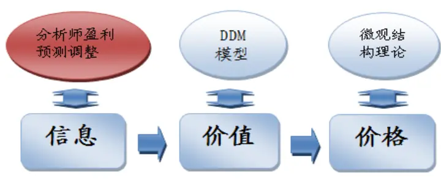
资料来源:国泰君安证券研究

## 1.2.分析师覆盖度统计及变化趋势

从图 2 可以看出，自 2008 年以来，研究机构通过发布研报所覆盖的股票数目有显著提高，最近逐步稳定于约 1400 家上市公司，对应全 A 股数量占比约 50%。此外，结合中国证券研究行业的实际情况，我们将每年新财富最具影响力排名的上榜机构作为核心机构。一方面，该类机构的研究质量和预测精确度相对较高，从而提高了数据质量。另一方面，新财富上榜机构本身就有显著的影响力，发布研报时对股价的冲击力远高于其他未上榜机构。从图 2也可以看到，核心机构覆盖股票的数量近年来趋于平稳，目前维持在 1200只左右。

图 2 机构覆盖股票数变化情况
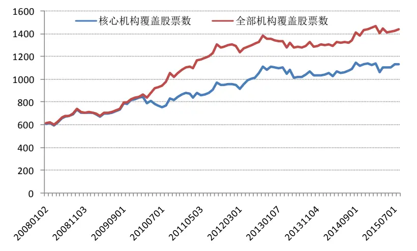
资料来源:国泰君安证券研究

图3展示了分析师覆盖的股票池中，个股平均的机构覆盖数及研报数。其中，我们使用机构名称作为观测对象，使得数据更加标准化。同时，相对于使用分析师姓名作为跟踪标的，机构的影响力及研究质量更加稳定。从图中可以看出，被覆盖的个股平均对应的研报数在近年趋于稳定。然而，对应的机构数量有所下降。这也反映出机构个性化风格的突出及研究精度的提高。但整体来说，分析师对股票的覆盖情况并没有发生结构性变化。

图 3 个股平均机构覆盖数
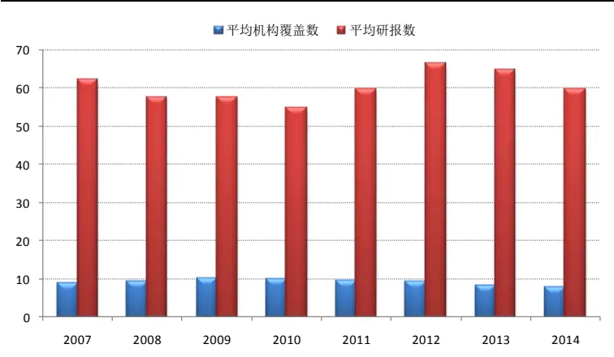
资料来源:国泰君安证券研究

## 1.3.一致预期数据处理方法

由于分析师一致预期数据属于衍生数据，而一致预期数据的处理及因子构建是整个策略的核心环节，其对整个策略的表现起着至关重要的作用。所以，我们选择自主处理一致预期数据，更好的了解其内部处理方式和细节。

## 1.3.1. 初始样本选择

首先，初始股票池主要基于市场上有分析师覆盖的股票，根据之前图 2所示，全市场被覆盖的股票比例大约在 50%左右。此外，为了进一步提高策略的稳定性，我们仅采用核心机构的预测数据，即前一年新财富最具影响力机构上榜的机构所发布的盈利预测数据。

## 1.3.2. 报告有效时间

如果一个分析师多次对盈利预测进行修正，则我们选取最新一次盈利预测作为观测值。此外，因分析师发布的预测数据有一定时效性，如果分析师在发布盈利预测数据后 6个月（自然日）未更新盈利预测数据，则默认该条预测数据失效。

## 1.3.3. 等权重加权

盈利预测的变动体现了分析师基于新的信息或逻辑对上市公司未来前景的判断，其对股价产生冲击的大小一方面取决于盈利预测变动的幅度与投资者预期变动幅度的差值，另一方面取决于投资者对分析师报告的跟随度高低。所以，盈利预测变动的方向和幅度是影响股票价格变动的核心。然而，分析师预测净利润相对潜在实际净利润的误差对股票价格的变化并没有直接影响。此外，由于我们采用的盈利预测数据均源自新财富上榜机构，所以预测数据的质量整体相对较高，重大误差发生的概率较小。因此，我们对处于有效状态的盈利预测数据采用等权重加权的方式，更好的体现每个分析师预期的变化，避免分配过大的权重于单一分析师。

## 1.3.4. 离散式打分

由于上市公司未来发展前景、所属行业景气程度、分析师覆盖数量均有所不同，所以分析师一致预期变动幅度与标的股票涨跌幅的相关性呈非线性特征。因此，我们采用离散式打分的方法来替代线性打分的方法，更好的把握分析师一致预期的变化方向。具体来说，我们将一致预期变化幅度按-5%、0、1%、5%四个阀值对股票池进行归档划分，得到 5 组股票，并给予每组股票一个标准化得分。

$$
\mathrm{G}=\mathrm{e}\_\mathrm{eps}/\mathrm{lg}(\mathrm{e}\_\mathrm{eps})-1
$$

G：当期分析师一致预期上调幅度

| G值 | g<-0.05 | -0.05<g<0 | 0<g<0.01 | 0.01<g<0.05 | g>0.05 |
| --- | --- | --- | --- | --- | --- |
| 得分 | 1 | 0.75 | 0.5 | 0.25 | 0 |

## 1.4. 预测调整因子及组合构建

## 1.4.1. 样本空间

考虑实际操作可行性，剔除停牌股票、剔除 ST 股票、同时剔除极值等与策略逻辑不符的数据。但是，核心机构的分析师覆盖的股票本身就只占全市场股票数量的 40%左右，我们选取剩下所有符合条件且数据完整的盈利预测的样本作为股票池。

## 1.4.2. 换仓频率

策略采取月度换仓的频率，每月月初第二个交易日用当日均价进行换仓。由于分析师一致预期变化频率较高，策略年换手率大约 750%左右。

## 1.4.3. 组合构建

在得到分析师一致预期调整因子标准化打分之后，选取每期打分前 50名的股票等权重作为投资组合。

## 1.4.4. 建仓成本

手续费为单边千分之二，建仓成本为当日均价。同时，考虑到实际投资时的流动性，如果上期持仓股票、下期标的股票换手率小于万分之五，将默认无法卖出、买入。

## 2. 预期调整因子选股能力：

## 2.1. 因子区分度

分析师一致预期上调的组别收益显著高于一致预期下调的组别。我们通过在每月月初对所有备选池中的股票按相应一致预期变化幅度进行离散式打分，从而将全市场有分析师覆盖的股票分为5组。之后，我们将每组股票按等权重构建投资组合，Group1 是一致预期上调幅度最高的组别(得分为0)，Group5 是一致预期下调幅度最多的组别(得分为1)。从图4 中可以看出，一致预期上调的组别(Group1+Group2)获得的收益明显高于一致预期下调的组别（Group4+Group5）。但是，Group1 的累计收益与 Group2 类似，可以看出，一致预期上调幅度的大小对下期收益并没有显著的提高。其中一部分原因可能源自过度反应理论，在卖方分析师上一次发布研究报告时，投资者基于新的信息和逻辑调整预期时通常存在过度反应现象，其上调心中预期的幅度远高于卖方分析师原有的一致预期幅度。所以，在透支分析师未来预期的前期下，分析师再次上调盈利预测的行为并不会影响投资者心中的股票价值。

图 4 一致预期调整因子分组收益
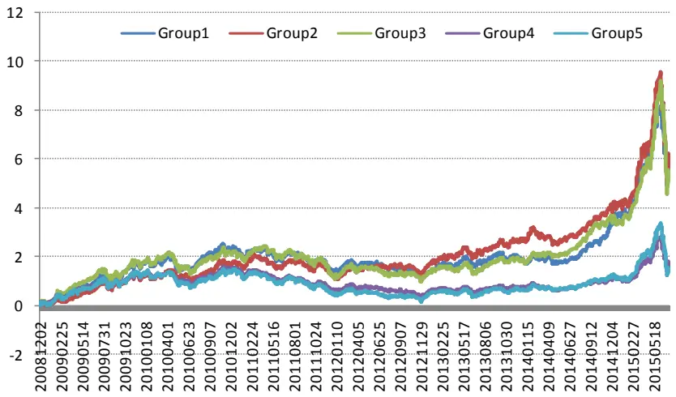
资料来源:国泰君安证券研究

## 2.2. 多空组合表现

基于分析师一致预期变动的多空组合收益显著(TOP vs Bottom)。我们按一致预期调整因子打分排序，选取排名前50名和后 50名的股票等权重作为多空组合。其中，如果因子得分相同，则进一步按PEG 指标区分先后。从图5来看，多空收益自 2008年 12月以来，累计收益接近 285%，信息比为4.01。此外，在图 6也可以更为直观的观测到月多空收益.整体来看，多空组合月胜率 68.75%,盈亏比较高。比较显著的一次回撤发生于 2010年11月，回撤幅度为11.53%。但长期来看，组合整体风险可控。

图 5 多空组合净值
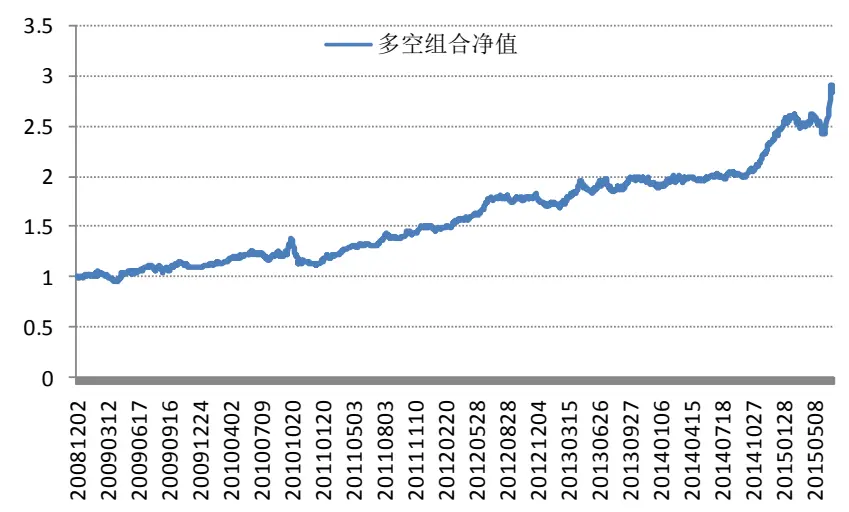
资料来源:国泰君安证券研究

图 6 多空月度收益
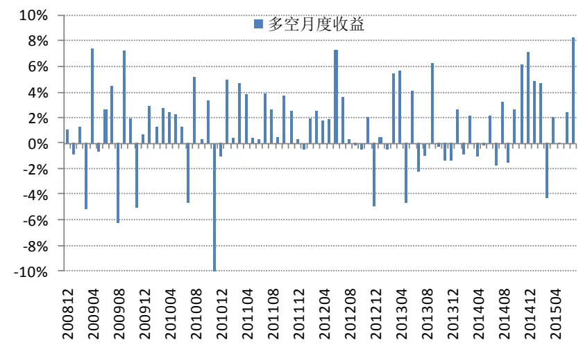
资料来源:国泰君安证券研究

## 2.3. 对冲标的指数

中国目前做空机制相对匮乏，现存的对冲工具主要为融券和股指期货，由于机构实际操作的资金量较大，卖出股指期货成为最受欢迎的对冲手段。目前中金所交易的股指期货品种有上证 50、沪深 300、中证 500。因此，我们测试了组合相对沪深 300、中证500、中证 800的超额收益。从图7中可以看出，一致预期调整组合相对3个主要指数都有显著的超额收益。具体从表 1 来看，对冲沪深 300 全收益的年化超额收益可达16.36%，信息比为 1.39。同时，组合年胜率为 100%。此外，组合相对中证800等权和中证 500等权的年化超额收益分别为 9.48%、6.57%。整体来说，一致预期调整因子长期的稳定性和收益驱动能力都是比较显著的。

图 7 对冲不同指数后净值走势
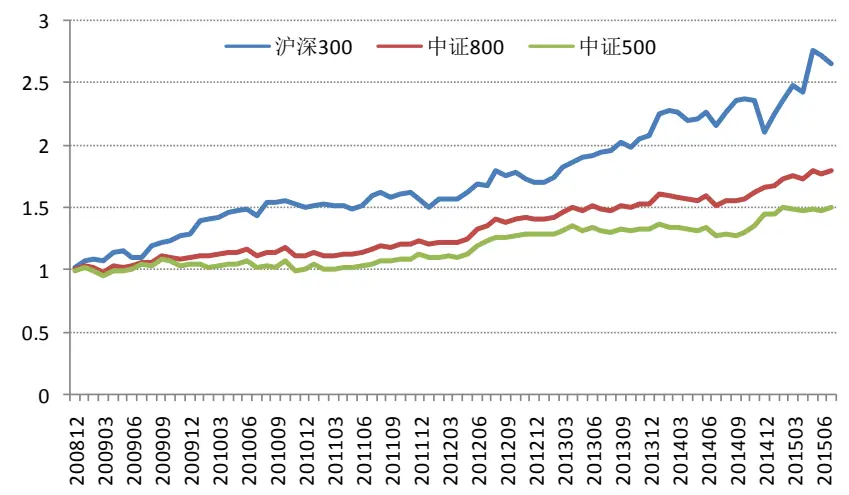
资料来源:国泰君安证券研究

表 1 对冲不同指数历年收益

| 对冲指数： | 沪深 300 中证 800 等权 | 中证 500 等权 |
| --- | --- | --- |
| 年化超额收益： 16.36% | 9.48% | 6.57% |
| 信息比： 1.39 | 1.16 | 0.77 |
| 最大回撤： | -14.20% -13.31% | -14.97% |
| 2009年 | 27.0% 8.5% | 4.3% |
| 2010年 | 16.7% 1.1% | -3.4% |
| 2011年 | 3.9% 10.9% | 11.6% |
| 2012年 | 8.6% 14.1% | 14.5% |
| 2013年 | 22.5% 9.0% | 2.9% |
| 2014年 0.9% | 8.2% | 9.2% |
| 2015年 26.2% | 8.5% | 3.8% |

资料来源:国泰君安证券研究

## 2.4. 行业中性选股

通过选取因子排名前 50 的股票等权重构建组合，操作起来较为简单有效。但是，组合在行业配臵方面相对基准指数会有很大偏离，从而在很大程度上暴露于行业风险。为了进一步测试因子的选股能力，我们针对沪深300指数成份股行业分布情况进行行业中性选股处理。具体来说，我们使用一致预期调整因子进行初步排序。针对打分相同的股票，我们用 PEG 进行辅助打分（其中，PE 使用 TTM 计算，G 使用预测净利润上一年净利润）。同时，我们在行业权重分配上完全匹配沪深 300 行业权重分布，对行业内个股采用等权重分配。

从图8中可以看出，在进行行业中性处理之后，组合的波动率大幅降低，组合净值相当平稳。其中，我们选取沪深300全收益作为对冲基准，同时考虑分红收益及 80%资金效率的影响，单只股票权重不超过 2%，单期股票只数维持在100 只左右。自2008年12 月以来，组合累计超额收益达到 93.6%，信息比 2.23，最大回撤为 5.69%，发生于 2014 年 12 月。

图 8 行业中性组合净值
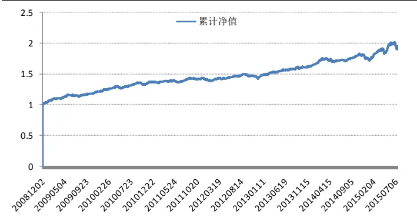
资料来源:国泰君安证券研究

从图9中我们可以具体看到组合月度超额收益情况。组合整体月超额收益胜率72%，单月最大负收益为-4.03%，出现于2014年 12月。但是，2014年12月之后几个月组合收益大幅回升。2015年上半年累计超额收益达到 13.45%。

图 9 行业中性组合月度超额收益
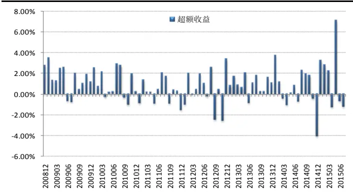
资料来源:国泰君安证券研究

## 3. 分析师首次覆盖对股票的影响

## 3.1.价格围绕价值的均值回归

股票价格是所有投资者通过交易自身对股票价值的判断而形成的，而未来现金流的多少决定标的股票在投资者心中的价值。基于新的信息和逻辑，投资者不断修正并交易自己的预期，从而市场形成了一个动态的信息整合过程。但是，这个过程又会融入投资者情绪的影响，进而产生过度反应或反应不足等现象。因此，有效市场是一个信息整合的动态过程，而不是一个静态的平衡状态，基于信息效率的高低，股票价格围绕真实价值进行均值回复波动时的偏离程度也有所不同。图 10 展示了股票在均值回复不同时期时的特征，可以看出，分析师盈利预测的发布在整个信息整合过程中扮演了一个关键角色。一方面，分析师首次覆盖提高了市场信息挖掘及整合的效率。另一方面，分析师会持续跟踪处于风口的股票，过度乐观会使得分析师不断上调盈利预期，从而进一步加重了过度反应现象。下面我们就针对分析师首次覆盖及二次覆盖后股价的变化进行深入的分析。

图 10 股价运行阶段特征
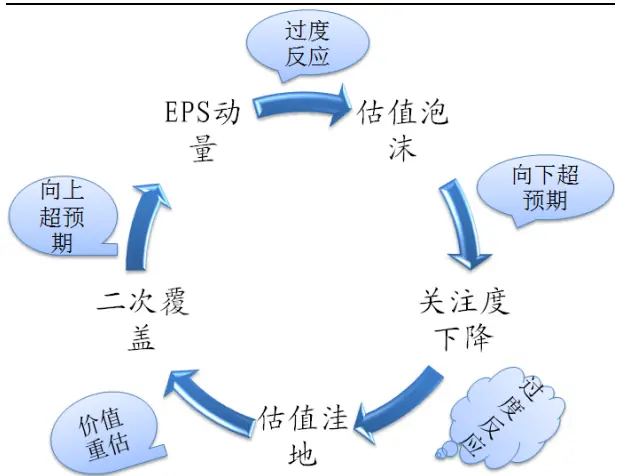
资料来源:国泰君安证券研究

对于长期没有分析师关注的股票，当有分析师覆盖后，基于其披露的信息和逻辑能够提高投资者对标的股票投资价值的认识，从而在一定程度上消除标的股票信息不对称导致的风险溢价。同时，投资者对标的股票的关注度迅速提高，从而对股价也会有一定的推动作用。而这些分析师新挖掘的股票，一部分是从未有分析师覆盖的股票，也就是刚上市的新股，一部分是曾经有分析师覆盖，但过度上涨后，估值泡沫破裂后大幅下跌被分析师忽略的个股。下面我们针对这两类股票，分别观察分析师覆盖后产生的超额收益情况。

## 3.2. 首次覆盖

图11展示了分析师首次覆盖股票之后20 个交易日超额收益的情况，其中，基准指数为沪深 300 全收益。可以看出，在覆盖日 Day0 之前，累计净值上升的非常快，这主要源于首次覆盖的股票很多都是刚上市的新股。但是，在覆盖日Day0 之后，组合仍然可以获取1.93%的超额收益。从表3也可以看出，小盘股在覆盖后产生的超额收益明显高于大盘股和中盘股，这也符合小盘股信息不对称程度较高的特点。

图 11 首次覆盖后累计超额收益
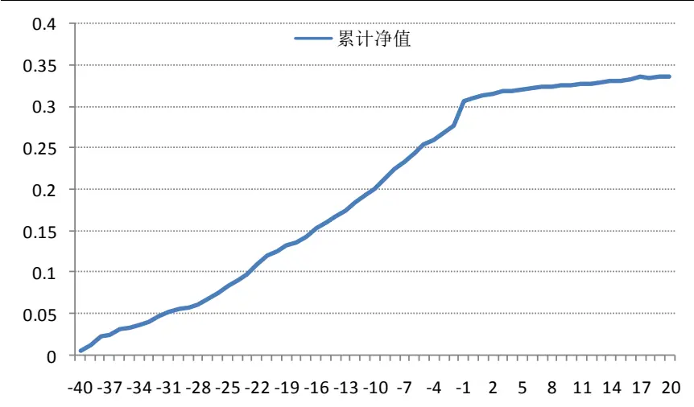
资料来源:国泰君安证券研究

表 2 首次覆盖历年收益情况

| 年份 | 超额收益 样本数 胜率 |
| --- | --- |
| 2008 -2.77% | 119 43.70% |
| 2009 3.14% | 70 54.29% |
| 2010 2.32% | 330 56.67% |
| 2011 -1.01% | 288 41.32% |
| 2012 2.56% | 180 55.56% |
| 2013 -0.40% | 20 40.00% |
| 2014 4.36% | 101 60.40% |
| 2015 13.16% | 79 58.23% |

| 整体 | 1.93% | 1187 | 51.47% |
| --- | --- | --- | --- |

资料来源:国泰君安证券研究

表 3首次覆盖在不同风格股票池的收益情况

| 风格 | 超额回报 | 样本数 胜率 |
| --- | --- | --- |
| 超小盘 | 1.98% | 50.42% |
| 小盘 | 2.73% | 956 152 60.53% |
| 中盘 | 0.90% | 48 58.33% |
| 大盘 | -1.77% | 31 29.03% |

资料来源:国泰君安证券研究

## 3.3. 二次覆盖

图 12 展示了 120 个交易日没有分析师覆盖的股票在被分析师重新覆盖时收益的表现情况。可以看出，分析师二次覆盖的股票在覆盖之前 40个交易日都存在显著的超额收益，这也体现出分析师推票时择时的判断。在Day0 之后的20个交易日，组合平均超额收益可达2.06%，年化超额收益29%。从表4中也可以看出，分析师二次覆盖股票时产生的超额收益在历年都为正，在2013年和2015年尤其高。此外，分析师二次覆盖股票对收益的驱动力在大中小盘股票池中均较显著。结合之前的图10来看，相比首次覆盖的股票，二次覆盖的股票可能处于之前过度下跌形成的估值洼地中，所以后续上涨动力较强。另一方面，首次覆盖的股票一定程度上是分析师对新股的义务性覆盖，股票自身的价值并不显著。

图 12二次覆盖后累计超额收益
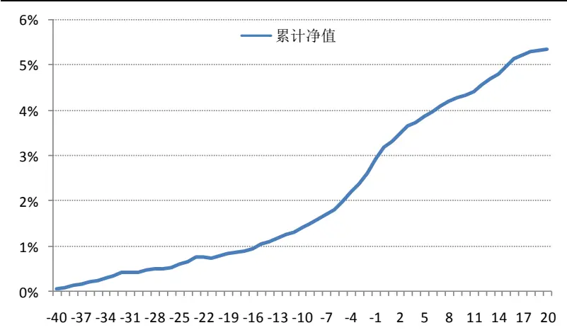
资料来源:国泰君安证券研究

表 4 二次覆盖历年收益情况

| 年份 | 超额收益 | 样本数 | 胜率 |
| --- | --- | --- | --- |
| 2008 | 1.95% | 1229 | 58.10% |
| 2009 | 3.27% | 1544 | 58.35% |
| 2010 | 3.83% | 1825 | 61.26% |

| 2011 0.76% 2195 50.02% |
| --- |
| 2012 0.85% 2476 51.25% |
| 2013 3.05% 2416 55.79% |
| 2014 0.36% 2538 50.51% 2015 |
| 4.30% 1276 60.03% 整体 2.06% 15499 54.82% |

资料来源:国泰君安证券研究

表 5 二次覆盖在不同风格股票池的收益情况

| 风格 | 超额回报 | 样本数 胜率 |
| --- | --- | --- |
| 超小盘 | 2.1% | 9724 55.2% |
| 小盘 | 2.3% | 3887 55.6% |
| 中盘 | 1.6% | 1430 52.4% |
| 大盘 | 0.9% | 458 47.4% |

资料来源:国泰君安证券研究

## 4. 市场模式识别对因子择时的效果

目前市场上多因子的相关研究多集中于因子挖掘和组合优化。然而，因子之所以能够产生收益，源于市场上的投资者，无论是价值投资者，还是投机者，都会根据某些指标或逻辑来判断股票的涨跌。当这些指标和逻辑映射到同一个因子上时，在一群交易者资金的推动下，这个因子就会有效。由于市场上有很多这样的因子，在任何市场环境中，总有一些因子会发挥作用，这也是为什么多因子能够长期有效的原因。但是，在实际投资中，只是一味的提高因子数量或许可以提高收益的稳定性，但很难使模型的收益在市场上脱颖而出。然而，如果我们能够甄别因子在不同市场环境中的收益驱动能力，就可以更好的把握模型、提高收益。所以，对每个备选因子的理解和配臵才是模型致胜的关键。本文就因子择时出发，从市场模式识别的角度入手，深入挖掘一致预期调整因子在不同市场环境中的表现情况。

从逻辑的角度出发，追寻一致预期调整因子背后的驱动逻辑，我们不难发现，投资者对于分析师盈利预测的关注和重视程度，也就是研究报告发布后投资者的跟随度是组合产生收益的核心要素。而分析师对投资者行为影响的大小，一方面取决于分析师在市场上的知名度，明星分析师发布的研究报告通常有更多的投资者跟随，这也就是我们常说的市场影响力。另一方面，这要取决于投资者的情绪、乐观程度，以及其内心的风险偏好。投资者情绪变化会通过交易机制反应到市场运行的强弱中去，所以，我们需要构建一个能够判断市场运行强弱的市场模式识别指标来观测投资者乐观程度的高低。

基于《动量测评之均线策略》中提到的牛熊分界值，我们将市场模式区分为牛市、熊市、震荡市。具体来说，我们以申万28 个行业作为基准，观察每日有多少行业的收盘价站上5日均线。同时，我们对站上5日线的行业个数进行标准化处理，如果超过 60%的行业站上 5 日线，则定义市场为牛市。如果少于 40%的行业站上 5 日线，则定义市场为熊市。如果站上5日线行业的比例位于 40%和60%之间，则定义为震荡市。其中，引入价格与均线位臵的原因在于，价格站上单均线是一波上涨趋势开始的必要条件。其次，股价在 5 日均线之上也体现出投资者乐观的情绪。此外，股价站上5 日线预示着短期标的向上突破，具有一定动量效应。

在对每日市场进行模式识别区分后，我们统计了一致预期调整因子组合的累计超额收益表现在不同市场模式下的分布情况。从图 13 中可以看出，一致预期调整组合自2008年12月以来绝大部分收益都集中于牛市模式中。相比之下，在震荡市中，一致预期调整因子的收益驱动能力大打折扣。然而在熊市中，一致预期调整因子的贡献甚至为负。这说明因子不会恒久有效，其有效性的高低受其背后逻辑的驱动，而这种驱动能力在不同市场环境中有显著差异。对于一致预期调整因子，如果模型在熊市中配臵该因子，不仅无法贡献正收益，还会大概率导致组合跑输指数以至亏损。

图 13 预期因子在不同市场模式的收益情况
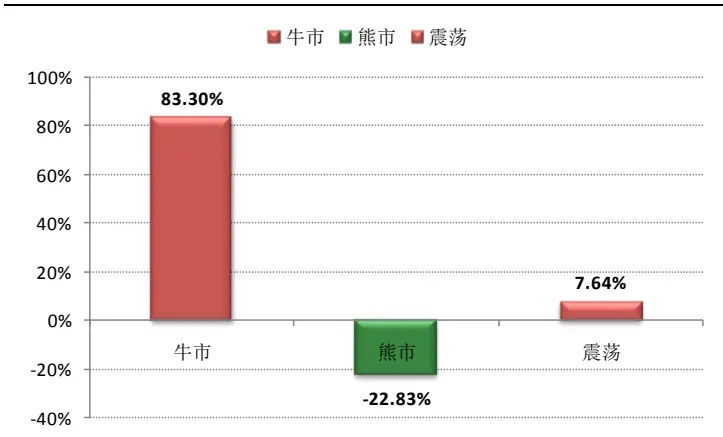
资料来源:国泰君安证券研究

从实际操作的角度出发，每日根据牛熊分界值重新对因子进行配比换仓并不现实，频繁换仓导致的交易成本将远大于因子择时带来的收益。相对地，我们可以选择在月度调仓时，使用牛熊分界值来判断当月组合是否使用一致预期调整因子。图 14 展示了一致预期调整因子组合的累计净值，以及处于牛市模式下建仓的月度超额收益。可以看出，在牛市模式下建仓把握了组合大部分的收益，同时避免了因子失效的时期，例如2011年末。从而能够给予其他当期有效因子更多的权重，提高整个模型的收益率。就单单使用一致预期调整因子来说，如果只在牛市模式下建仓，其他时期空仓的话，组合年化超额收益可达 23.14%，信息比1.81。明显高于组合原有收益和信息比(16.36%,1.39)。

图 14 牛市模式与预期调整组合收益的关系
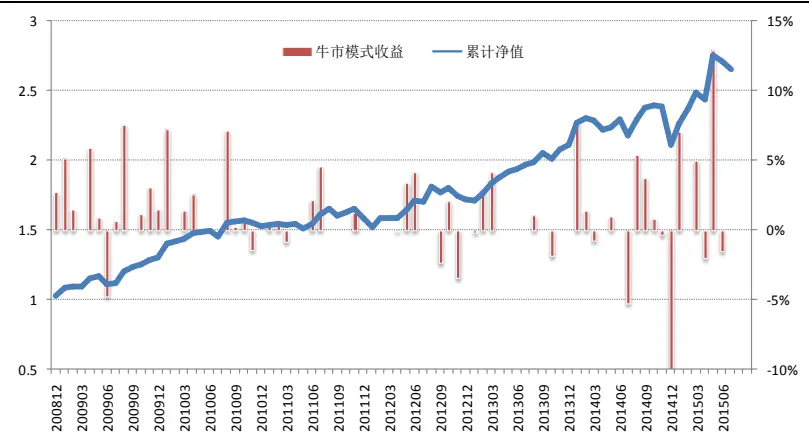
资料来源:国泰君安证券研究

## 5. 总结与后续研究展望

一致预期数据凭借其在市场上重要的地位，以及其显著的收益预测能力，值得成为投资者核心因子库中的一员。值得一提的是，一致预期调整因子结合PEG进行行业中性选股后的超额收益已经相当平稳，这也预示出其对收益解释能力非常显著，同时也反映了信息源的重要性。

本文另一个主要贡献在于开启了市场模式识别在多因子研究中的思路，如何系统的理解因子背后逻辑，预测因子下一期表现是量化投资未来研究的重要方向之一。未来我们将通过整合择时、趋势判断等多个领域的研究成果，构建综合的市场模式识别系统，进一步为因子配臵提供系统、可靠、科学的依据。

## 本公司具有中国证监会核准的证券投资咨询业务资格

## 分析师声明

作者具有中国证券业协会授予的证券投资咨询执业资格或相当的专业胜任能力，保证报告所采用的数据均来自合规渠道，分析逻辑基于作者的职业理解，本报告清晰准确地反映了作者的研究观点，力求独立、客观和公正，结论不受任何第三方的授意或影响，特此声明。

## 免责声明

本报告仅供国泰君安证券股份有限公司（以下简称“本公司”）的客户使用。本公司不会因接收人收到本报告而视其为本公司的当然客户。本报告仅在相关法律许可的情况下发放，并仅为提供信息而发放，概不构成任何广告。

本报告的信息来源于已公开的资料，本公司对该等信息的准确性、完整性或可靠性不作任何保证。本报告所载的资料、意见及推测仅反映本公司于发布本报告当日的判断，本报告所指的证券或投资标的的价格、价值及投资收入可升可跌。过往表现不应作为日后的表现依据。在不同时期，本公司可发出与本报告所载资料、意见及推测不一致的报告。本公司不保证本报告所含信息保持在最新状态。同时，本公司对本报告所含信息可在不发出通知的情形下做出修改，投资者应当自行关注相应的更新或修改。

本报告中所指的投资及服务可能不适合个别客户，不构成客户私人咨询建议。在任何情况下，本报告中的信息或所表述的意见均不构成对任何人的投资建议。在任何情况下，本公司、本公司员工或者关联机构不承诺投资者一定获利，不与投资者分享投资收益，也不对任何人因使用本报告中的任何内容所引致的任何损失负任何责任。投资者务必注意，其据此做出的任何投资决策与本公司、本公司员工或者关联机构无关。

本公司利用信息隔离墙控制内部一个或多个领域、部门或关联机构之间的信息流动。因此，投资者应注意，在法律许可的情况下，本公司及其所属关联机构可能会持有报告中提到的公司所发行的证券或期权并进行证券或期权交易，也可能为这些公司提供或者争取提供投资银行、财务顾问或者金融产品等相关服务。在法律许可的情况下，本公司的员工可能担任本报告所提到的公司的董事。

市场有风险，投资需谨慎。投资者不应将本报告为作出投资决策的惟一参考因素，亦不应认为本报告可以取代自己的判断。在决定投资前，如有需要，投资者务必向专业人士咨询并谨慎决策。

本报告版权仅为本公司所有，未经书面许可，任何机构和个人不得以任何形式翻版、复制、发表或引用。如征得本公司同意进行引用、刊发的，需在允许的范围内使用，并注明出处为“国泰君安证券研究”，且不得对本报告进行任何有悖原意的引用、删节和修改。

若本公司以外的其他机构（以下简称“该机构”）发送本报告，则由该机构独自为此发送行为负责。通过此途径获得本报告的投资者应自行联系该机构以要求获悉更详细信息或进而交易本报告中提及的证券。本报告不构成本公司向该机构之客户提供的投资建议，本公司、本公司员工或者关联机构亦不为该机构之客户因使用本报告或报告所载内容引起的任何损失承担任何责任。

## 评级说明

## 1.投资建议的比较标准

投资评级分为股票评级和行业评级。

以报告发布后的12个月内的市场表现为比较标准，报告发布日后的 12个月内的公司股价（或行业指数）的涨跌幅相对同期的沪深 300 指数涨跌幅为基准。

## 2.投资建议的评级标准

报告发布日后的 12 个月内的公司股价（或行业指数）的涨跌幅相对同期的沪深 300 指数的涨跌幅。

| 评级 |  | 说明 |
| --- | --- | --- |
| 股票投资评级 | 增持 | 相对沪深300 指数涨幅15%以上 |
|  | 谨慎增持 | 相对沪深300指数涨幅介于5%～15%之间 |
|  | 中性 | 相对沪深300指数涨幅介于-5%～5% |
|  | 减持 | 相对沪深300指数下跌5%以上 |
| 行业投资评级 | 增持 | 明显强于沪深 300 指数 |
|  | 中性 | 基本与沪深 300指数持平 |
|  | 减持 | 明显弱于沪深 300 指数 |

## 国泰君安证券研究

|  | 上海 | 深圳 | 北京 |
| --- | --- | --- | --- |
| 地址 | 上海市浦东新区银城中路168号上海 银行大厦29层 | 深圳市福田区益田路 6009 号新世界 商务中心34层 | 北京市西城区金融大街 28 号盈泰中 心2号楼10层 |
| 本研报由中国最大的投资研究平台“慧博资讯”收集整理，阅读更多研报请访问“慧博资讯” ft |  |  | H |
|  | 国泰君安证券 | 点击进入 http://www.hibor.com.cn | 慧博资讯整理 |
| 邮编 200120 | GUOTAI JUNAN SECURITIES | 518026 | 数量化专题报告 |
| 电话 E-mail: gtjaresearch@gtjas.com | (021)38676666 | (0755)23976888 | 100140 (010)59312799 |