inInfo] [Table_Title] 2015.08.10

# 趋与势的量化定义研究

## ——数量化专题之六十四

赵延鸿（分析师）

刘富兵（分析师）

8 021-38674927

zhaoyanhong@gtjas.com

021-38676673

证书编号 S0880515030004

liufubing008481@gtjas.com

S0880511010017

## 本报告导读：

首次提出趋与势的量化定义方法，给出了任何走势的标准化结构图，势的定量化在量化投资和技术分析领域有着广泛的应用。

## 摘要：

e_Summary] “趋”代表价格运动的方向，而“势”则表明价格波动的强弱。势可以分为外势和内势，外势属于价格形态范畴，是对价格走势的趋势与震荡的量化，内势则是刻画价格走势的内在力度转化指标。报告重点解决“如何设计势”从而能够“合理”比较任何价格走势图形之大小。

价格走势首先基于收盘价单调性和均线转成标准化结构图，标准化结构图意义在于任何交易品种的走势既可以横向比较，也可以在不同时间周期纵向比较。有了标准化结构图，势就成了描述价格走势非常基础的一个特征。从这个角度，可以说“势”独立于交易品种独立于时间周期而存在。

- 趋与势的定义：基于绝对波动区间与连续波段的势。趋的本质是价格运行的位移，表征市场位移方向，“势”表征趋的程度，或者说连续波动的集中性。

势的应用之一：求木之长者，必固其根本。实证数据显示，在过去十四年，申万二级行业每一个周线级别上涨行情，93%在底部左侧或右侧区域出现过 12 周以上的盘整行情，而且基本上呈现周线级别上涨波段的涨幅越大，最小势相对较小的特征。

势的应用之二：价格底部形态分布。用底部两侧的势严格定义四种类型底部：V 型底、L 型底、反 L 型底和平底。所有二级行业周线级别底部 62%为 V 型底，L 型占比 23%，反 L型占比12%，平底型仅占 3%。同样说明，在周线级别下跌行情中如果出现平底，即底部左侧和右侧的势都小于 0.8，这样的底部基本为一下跌中继。

金融工程

## 金融工程团队：

刘富兵：（分析师）

电话：021-38676673

邮箱：liufubing008481@gtjas.com

证书编号：S0880511010017

赵延鸿：（分析师）

电话：021-38674927

邮箱：zhaoyanhong@gtjas.com

证书编号：S0880515030004

## 耿帅军：（分析师）

电话：010-59312753

邮箱：gengshuaijun@gtjas.com

证书编号：S0880513080013

## 刘正捷：（分析师）

电话：0755-23976803

邮箱：liuzhengjie012509@gtjas.com

证书编号：S0880514070010

## 李雪君：（分析师）

电话：021-38675855

邮箱：lixuejun@gtjas.com

证书编号：S0880515070001

王浩：（研究助理）

电话：021-38676434

邮箱：wanghao014399@gtjas.com

证书编号：S0880114080041

## 陈奥林：（研究助理）

电话：021-38674835

邮箱：chenaolin@gtjas.com

证书编号：S0880114110077

## 李辰：（研究助理）

电话：021-38677309

邮箱：lichen@gtjas.com

证书编号：S0880114060025

## [Table_R相关报告

《分析师对投资者行为的影响》2015.07.31

《如何控制跟踪误差》2015.07.29

《指数成份股停牌带来的隐含收益》2015.07.12

《近期员工持股破发、机构增持个股一览》2015.07.09

《寻找反弹中的最优标的》2015.06.30

## 1. 趋与势初步分析

价格的趋势，有两方面的含义：“趋”代表价格运动的方向，而“势”则表明价格波动的强弱。一般从价格走势图上，价格运动方向比较容易描述，但从量化的角度“势”不是那么容易刻画。本篇报告尝试从定量的角度给“趋势”一个数学化的定义。从价格走势的表里分类，势可以分为外势和内势，外势属于价格形态范畴，是对价格走势的趋势与震荡的量化，一般不用来预测拐点，而是定位于价格形态研究范畴；内势是真正意义上刻画价格走势的内在力度转化指标，一般用来预测价格出现转折的位臵，譬如传统技术中的价格与指标的背离，在这个维度上指标代表的就是一种势。在缠中说禅理论里，内势就是背驰，是基于围绕中枢两侧的次级别走势段的比较，因背驰而引发转折。内势到底如何定义和应用是一个非常复杂的问题，本篇报告主要研究外势，因此后面如不做特殊说明，势都是指外势，也就是说用来刻画价格形态的一种量化指标。

无论是股票、大宗商品、债券、外汇价格走势从形态上简单可以分为上涨趋势、下跌趋势和震荡，如果进一步细分的话，上涨趋势包括某角度单边上扬、震荡拉升、抛物线上涨等等。同样震荡走势可以细分为收缩震荡、放大震荡、水平震荡等类型。势的研究重点定位于从量化的角度如何来度量这些走势，如果抛开价格预测，这些走势本身并无优劣高下之分，只是投资者在二级市场交易产生的价格的一种外在表现形式，这些形形色色的外在表现形式能否可以通过某个度量标准进行比较就成了一个比较有趣的问题。例如物体可以有各种各样的外形，但可以通过质量这个标准进行轻重比较；人体血液二十四时不停息流动，可以通过血压比较高低；声音在空气中传播，其强弱大小可以用分贝比较。外势则用来对价格走势进行度量比较。

“如何设计势”从而能够“合理”比较价格走势图形之大小是关键问题。先不论“如何设计势”，首先需要回答怎样才算是“合理”？在走势图形大小比较中，“合理”首先是一个偏主观的认知，但度量价格走势可以归为科学研究范畴，而任何科学研究的基础却是建立在同一性上，所以我们在设计“势”这个度量标准的时候尽量符合绝大多数人的主观认知。当然存在某种可能，两个图形的势不同的人看法不同，一般出现这种情形最可能是这两个图形走势虽然不同但比较相似，用势的定义计算出的结果也会比较相近，对于这种情况就好比体育比赛里三米板跳水，不同裁判打分会有所不同，但区别不大，所以在势的比较中遇到这种情况就不做深究。

图 1三类常见走势图
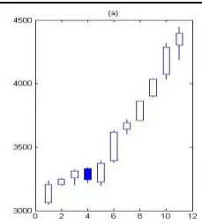

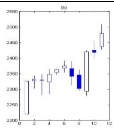

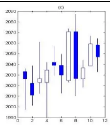
数据来源：国泰君安证券研究

合理性问题解决了，那么如何设计势？我们先观察上面三种常见走势图，简单来看，三种走势都是上涨的，第一种最为强势，典型的单边拉升走势，第二种震荡上行，第三种反复震荡上涨。所以对于势认知可以理解为第一个图形势最大，第二个其次，第三个图形势最小，上述三幅图就是对势定义的最直观的观察。我们的研究本质就是设计一个量化指标“势”，它能够符合投资者对价格“趋”的“程度”的看法。所以“趋势”这个词既是“名词+名词”，也是“动词 + 副词”，“名词+名词”说明趋与势都用来指代事物的某种属性，趋与势是两个独立的个体；而“动词 + 副词”则强调势是用来描述趋的程度。

## 2. 去除波动性对势的定义影响

定义势的目的不仅仅用来比较同一个交易品种在不同时间势的大小，还需要不同股票、股票指数、期货、外汇、债券的走势能进行比较，但不同交易品种的波动性是不同的，甚至差异很大，如下图，申万一级行业中，有色金属板块的波动性最大 340%，而金融服务行业的波动性最小只有169%。所以定义势的第一步是消除波动性对势定义的影响。

图 2 部分申万一级行业波动性比较（价格速率，3%分段参数）
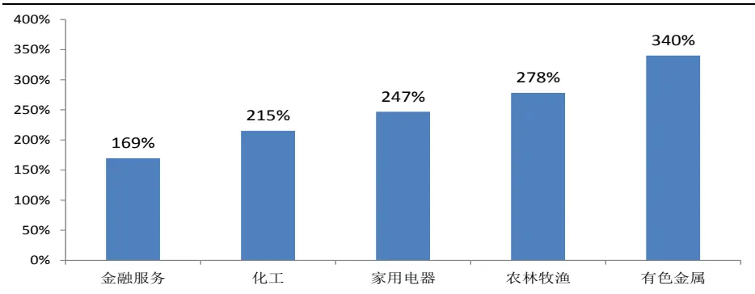
数据来源：国泰君安证券研究，WIND

消除波动性的另一个用途在于，方便于同一个交易品种不同周期（月线、周线、日线、小时线、30 分钟线、5 分钟线、1 分钟线）走势比较，譬如周K线走势图也许和30 分钟K线图走势很像，但涨跌幅显然差距巨大，所以即使同一个交易品种在不同周期图上同样存在较大的波动性差异。

假定我们把很多K线图放到一起，如果没有价格标签，如果没有时间刻度，基本上很难区分哪个是股票、哪个是外汇、哪个是期货，甚至也无法区分哪个是周 K 线图、哪个是日 K 线图、哪个是分钟 K 线图。但我们能够看到每一幅走势图趋的程度，即势的大小。这个分析说明了势是描述价格走势图非常基础的一个特征。从这个角度，可以说“势”独立于交易品种独立于时间周期而存在。所以去除波动性对势的定义影响本质上是对 K 线图转化为某种“标准化结构图”，标准化结构图有时也称为简化图。获得标准化结构图有很多种途径，哪种途径最优取决于哪种标准化结构图更能契合实际走势图。下面分三种情况探讨如何构建标准化结构图。

## 2.1.基于收盘价单调性的标准化结构图

下图的K线图，总共11根K线，假定图中第一根K线的收盘价与前一根不在图中的 K线收盘价相比较是上涨的，那么基于收盘价单调性进行简化，收盘价变化可以记为（涨、涨、跌、涨、跌、涨、涨、跌、涨、跌、跌），用1与-1 表示状态变化向量为（1，1，-1，1，-1，1，1，-1，1，-1，-1），因此价格的位移向量为（0，1，2，1，2，1，2，3，2，3，2，1），注意位移向量比状态变化向量多一个初始单元 0，表示位移的起点从零开始。下图第一幅图为价格的实际走势，第二幅图是基于收盘价单调性的标准化结构图。从这个例子看出，标准化结构图基本上和实际K线图比较相似，反映了价格的上涨和下跌的状态变化，但不足之处，对于上涨和下跌的幅度刻画得不够充分，相比较真实 K线图，简化图更偏震荡。这个例子说明，如果只使用收盘价的单调性，标准化后走势会放大实际走势的震荡幅度，从而不能有效反映实际走势的趋势强度。

图 3基于收盘价单调性的标准化结构图
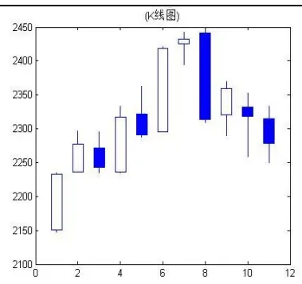
数据来源：国泰君安证券研究

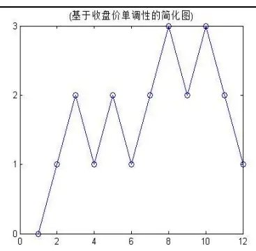

## 2.2. 基于 5 周期均线的标准化结构图

为了解决这个问题，一个自然而然的想法则是在对实际走势标准化过程中，考虑趋势的方向这个维度，均线是对趋势方向一个比较好的量化指标，因此我们引入5周期均线，那么状态变化向量定义为：

如果当前收盘价大于或等于 5周期均线价格，则为1；
如果当前收盘价严格小于5周期均线价格，则为-1。

下图 K 线图中 5 周期均线，实际用到了第一根 K 线之前的另外 5 根 K线的收盘价数据。状态变化向量为（1，1，1，1，1，1，1，-1，-1，-1，-1），而位移向量为（0，1，2，3，4，5，6，7，6，5，4，3）。从基于5 周期均线的标准化结构图可以看出，基本上反映了实际走势图的趋势状态，左侧呈现单边上扬而右侧单边下跌，但较实际图形趋势更强，这就是5周期均线定义的美中不足之处，过于强化了趋势，而淡化了实际价格在均线之上或之下的涨跌波动变化，换言之，趋势粉饰过多，而震荡考量不足。

图 4基于 5周期均线的简化图
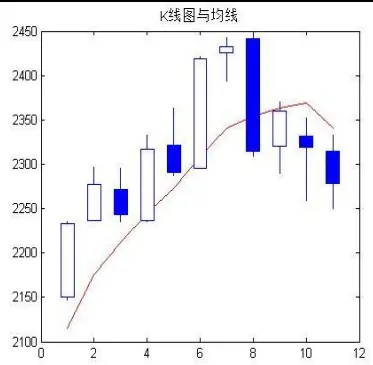
数据来源：国泰君安证券研究

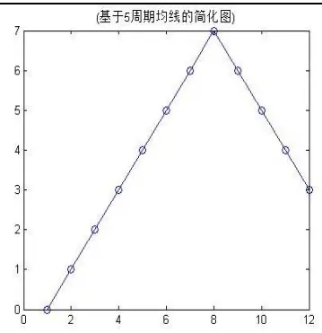

## 2.3. 融合收盘价单调性和 5周期均线的标准化结构图

综合上述分析看出，实际走势的标准化过程既要考虑到价格的震荡又要兼顾到趋势的状态，相比较前面两个简化方法，一个比较好的方法是融合收盘价单调性和5周期均线两个维度来标准化实际 K线走势图。

先做一个简单分析，当 K线位于5 周期均线之上时，较前一个交易日虽然下跌，但只要不跌破均线，说明上行趋势没有结束，可以理解为一个调整性波动，这种状态从位移角度，既不能认定后退一步，也不能认定前进一步，折中来看这种状态记为位移零最为恰当；反之当 K线位于5周期均线下方时，价格上涨只要不上穿均线，同样理解为下行趋势未被改变，从而也用位移零表示。除此之外，在均线同一侧的涨跌位移要么加1要么减 1。详细状态变化标记规则如下：

1、前一个交易日收盘价位于均线之下，当前收盘价站上均线，状态记为 1，

2、前一个交易日收盘价位于均线之上，当前收盘价跌破均线，状态记为-1，

3、3a) 前一个交易日收盘价位于均线之上，当前收盘价位于均线之上，当前收盘价大于或等于前一个交易日收盘价，状态记为 1，

3b) 前一个交易日收盘价位于均线之上，当前收盘价位于均线之上，当前收盘价小于前一个交易日收盘价，状态记为 0，

4、4a) 前一个交易日收盘价位于均线之下，当前收盘价位于均线之下，当前收盘价大于前一个交易日收盘价，状态记为 0，

4b) 前一个交易日收盘价位于均线之下，当前收盘价位于均线之下，当前收盘价小于或等于前一个交易日收盘价，状态记为-1。

根据上述价格状态变化标记规则，状态变化向量为：

（1，1，0，1，0，1，1，-1，0，-1，-1），

那么位移向量为：

（0，1，2，2，3，3，4，5，4，4，3，2）。

从标准化结构图可以看出，同时基于收盘价单调性和 5周期均线的标准化结构图更接近实际 K线图的走势结构。

图 5基于收盘价单调性与5 周期均线的简化图
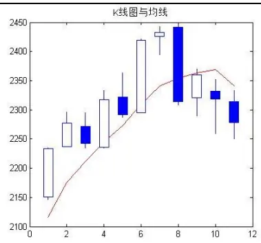
数据来源：国泰君安证券研究

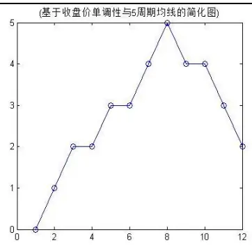

## 3. 势的定义之一：基于连续波段定义

有了实际走势的标准化结构图，就可以进一步探讨如何设计“势”。如前所述，趋势的“势”既然用来刻画价格走势的“趋”的程度，那么价格越单边上扬或下行，势应该越大；反之，越横盘震荡，势应该越小。换言之，在同样的时间窗口内，价格波段越是起伏转折，势就越小，反之，单边涨跌波段越有持续性，势就越大。所以，势的定义可以从连续波段入手，首先把上涨、下跌的波段一段段分割开。如下图，红色标注的点为拐点，每两个拐点之间为一个连续涨跌波段，此处的拐点即是原上涨或下跌改变方向的节点。

图 6连续涨跌波段划分示意图
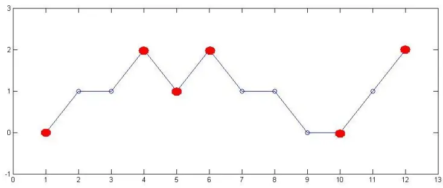
数据来源：国泰君安证券研究

假定用 $(\mathrm{s}_{_0},\mathrm{s}_{_1},\mathrm{s}_{_2},\mathrm{s}_{_3},\ldots,\mathrm{s}_{_N}$ )表示价格走势在每一个时间点的位移，那么图中标注的拐点为位移向量的一个子集，记为 $(\mathrm{s}_{_{\gamma_{_{0}}}},\mathrm{s}_{_{\gamma_{_{1}}}},\mathrm{s}_{_{\gamma_{_{2}}}},\dots,\mathrm{s}_{_{\gamma_{_{k}}}})$ ，共k+1 个拐点，注意这里的拐点集合必定包含起点和终点。定义相邻两个拐点之间的位移为：

$$
\mathbf{d}_{i}=\mathbf{s}_{\gamma_{i}}-\mathbf{s}_{\gamma_{i-1}},i=1,2,\ldots,k,1\leq k\leq N
$$

因此势可以构造为相邻拐点位移的平方和：

$$
T\quad=\quad\sum_{_{i=1}}^{^{k}}\quad d_{_{i}}^{^{2}}\quad,
$$

基于这个定义，显而易见下图中左图的势大于右图，左图上涨波段更有

持续性，这符合我们对“趋的程度”观察。

图 7强趋势与弱趋势示意图
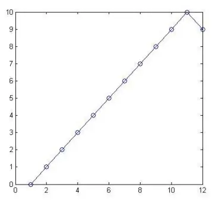

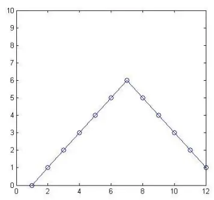
数据来源：国泰君安证券研究

基于一个简单的数学不等式容易得出：

$$
N\;\leq\;T\;=\;\sum_{_{i=1}}^{^{k}}\;d_{_{i}}^{^{\;2}}\;\leq\;N^{^{\;2}}\;_{\circ}
$$

势的最大值出现在连续N个交易日上涨或连续N个交易日下跌的走势，反之势最小值出现在每个交易日涨跌交替这种情形。以上势的定义是对价格走势趋势的直观观察的结果。

上述是对势的定义，而趋本质就是价格实际运行的位移，所以加入趋的定义，趋势的量化定义本质是一个二维向量，第一个变量代表“趋”，表征市场位移方向，位移正值代表向上，位移负值代表方向向下；第二个变量代表“势”，表征趋的程度，或者说连续波动的集中性。趋势定义为：

$$
\left(\sum_{i=1}^{k}d_{i},\sum_{i=1}^{k}d_{i}^{2}\right)
$$

举例看下图三种走势，趋向都为上涨，上涨位移8步。从趋势定义可知，第一个走势的“势”最大为 82，第二个走势次之为 54，第三个走势最小为42。第一种走势“势”最大原因是连续出现9步上涨，而第二个走势出现了连续7步上涨，第三个走势出现了连续 5步。所以综合来看，三种走势具有相同的“趋”，但“势”不同。

图 8三种走势趋势度比较
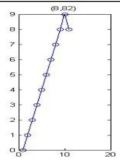

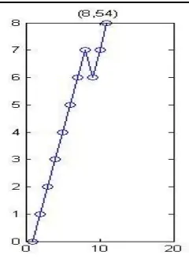
数据来源：国泰君安证券研究

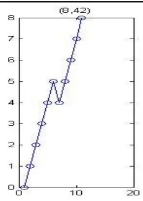

## 4. 势的定义之二：基于绝对波动区间的势

上述势的定义仍然存在不尽如人意的地方，举例来看，如下图，在相同的时间长度（都为 10 步），三种走势的趋是相等的，都为 6，但根据上述定义可知势是不同的，第一种走势的势为32，大于第二种走势的 26，大于第三种走势的24。之所以出现这种差异化，在于势的定义对价格在同一方向连续性变化赋予了极高的二次方权重。但实际上，从价格走势的观察而言，我们其实认为这三种走势的势没有差别，应该是相同的。

图 9三种相似走势的趋势比较
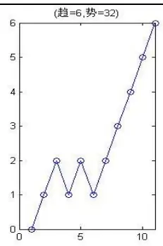

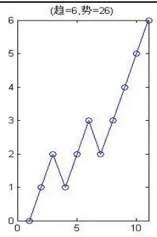
数据来源：国泰君安证券研究

为了实现经验观察与数量计算相吻合，需要进一步构建趋势指标。从上面三幅走势图可以看出，相同时间窗口价格走势的绝对波动区间是一个重要因素，简而言之，在相同的时间维度下，价格的波动区间越大，趋势的势越大，价格的波动区间越小，趋势的势也越小，这基本上符合我们对上述此类图形的认知。

基于绝对波动区间的势定义，本质上先找到走势图上最高点和最低点，然后把连接最低点到最高点之间的波段移出，之后对剩下的走势（也许是一部分，也许是两部分）继续寻找最高点和最低点，重复上述步骤，实际上是一个递归过程，然后把所有移出波段的位移求平方和。

严谨的基于绝对波动区间定义的数学描述如下。假定价格状态向量如下，

$$
\left(\begin{array}{l}1101-10-111-1001111-1-1-1\end{array}\right),可以用变量记为
$$

$$
(\delta_{1},\delta_{2},\delta_{3},\ldots,\delta_{n}),
$$

那么价格位移定义为：

$$
s_{k}=s_{0}+\sum_{i=1}^{k}\delta_{i},k=1,2,3,\ldots,n.,\quad s_{0}=0.
$$

定义二元数组集合，满足价格波动区间最大值，换言之，寻找时间窗口内价格最大值和最小值。

$$
\Gamma=\left\{(\mathrm{x},\mathrm{y})\mid\mathrm{x},\mathrm{y}\in\{0,1,2,\ldots,\mathrm{n}\};\mathrm{x}<\mathrm{y};\mid s_{\mathrm{x}}-s_{\mathrm{y}}\mid=\max_{1\leq j,k\leq n}\left|s_{j}-s_{k}\right|\right\}
$$

定义最短距离集合：

$$
\Omega=\left\{(\alpha,\beta)\in\Gamma:\mid\alpha-\beta\mid=\underset{_{(x,y)\in\Gamma}}{\operatorname*{min}}\left|x-y\right|\right\}
$$

不难知道，最短距离集合可能包含不止一个元素，我们选取 最小的那个数组，记为 $(\alpha_{_1},\beta_{_1})$ 。之后，把价格位移序列 $\{s_{_k}\}$ 的 $\alpha_{\mathrm{~i~}}$ 到 $\beta_{\perp}$ 之间部分移出，对剩下的左侧部分（不一定存在）和右侧部分（不一定存在）重复上述过程，继续重复上述步骤寻找最大价格波动区间，得到最短距离数组 $(\alpha_{_{2}},\beta_{_{2}}),(\alpha_{_{3}},\beta_{_{3}}),\ldots,(\alpha_{_{m}},\beta_{_{m}})$ 。那么基于绝对波动区间的势定义为：

$$
\sum_{i=1}^{m}\mathrm{~(~s_{\alpha_i}-~s_{\beta_i}~)~}^{2}\mathrm{~.~}
$$

图 10基于绝对波动区间势的计算示例
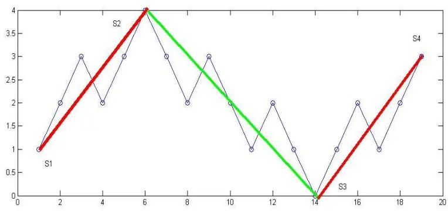
数据来源：国泰君安证券研究

从上图来看基于绝对波动区间势的计算，首先整个价格走势图的最大值为S2，最低值为S3，对应的波动区间|S2-S3|，同样剩余的左右两边两个子走势图的绝对波动区间分别为|S2-S1|和|S3-S2|，因此上面这个价格序列的势为

$$
(\mathrm{s}_{2}-\mathrm{s}_{1})^{2}+(\mathrm{s}_{3}-\mathrm{s}_{2})^{2}+(\mathrm{s}_{4}-\mathrm{s}_{3})^{2}=3^{2}+4^{2}+3^{2}=34
$$

易知这个势和基于连续波段的势是不同的。

## 5. 势的终极定义：基于绝对波动区间与连续波段的势

像下面这三种走势，我们之所以认为区间的绝对波动是定义势的关键因素，是因为这三种走势，期间的回调扰动较小，使用绝对波动区间来定义势更为合理，而且认为这些势是相同的。

图 11三种相似走势趋势比较
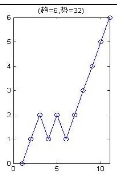
数据来源：国泰君安证券研究

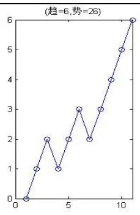

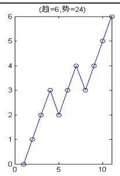

但如果遇到下述两种走势，这两种走势的特点是期间有大量盘整震荡，按照连续波段趋势定义，(a)走势的势为17；(b)走势的势为 19，(b)走势的势大于(a)走势，这符合我们对于(b)走势应该有更大的势的观察。

但如果根据绝对波动区间的趋势定义，(a)走势的势为 17；但(b)走势的势仅为9，则很不合理。

图 12震荡走势突破
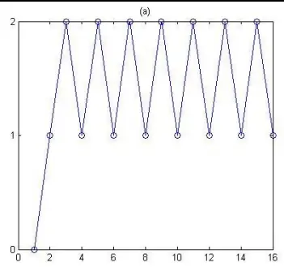

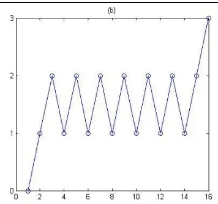
数据来源：国泰君安证券研究

所以综合来看，合理的势定义应该是连续波段定义的势与绝对波动区间的势取二者较大的值。

$$
\max\left(\sum_{i=1}^{m}\left(\mathbf{s}_{\alpha_i}-\mathbf{s}_{\beta_i}\right)^2,\sum_{i=1}^{k}d_i^2\right)
$$

图 13 <基于连续波段的势，基于绝对波动区间的势>
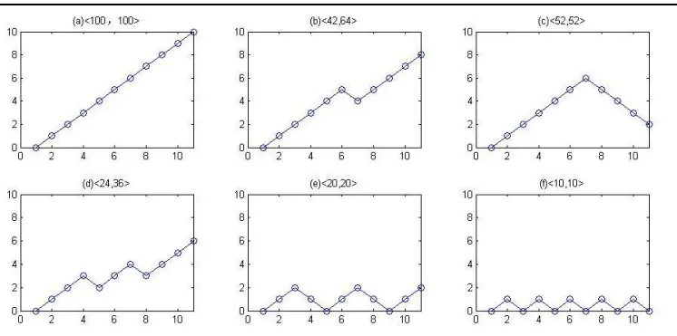
数据来源：国泰君安证券研究

上面六种走势，如果基于连续波段的势，从(a)到(f)依次为100、42、52、24、20、10；如果基于绝对波动区间的势，从(a)到(f)依次100、64、52、36、20、10。两种势取最大值，可知从(a)图到(f)图的势依次从高到低，分别为 100、64、52、36、20 和 10。

## 6. 不同长度的时间序列的势构建

相同时间长度的序列趋势大小的比较直观自然，但如何构建一个合理的势对不同长度的时间序列进行比较却并非那么简单，如下图：

图 14 不同时间长度的势
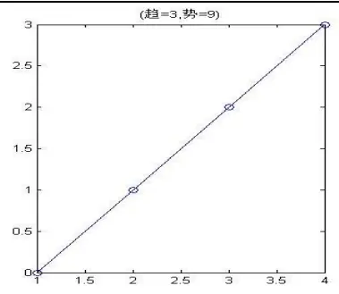

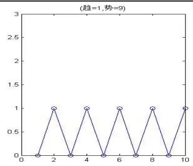
数据来源：国泰君安证券研究

第一个走势持续3个时间单位，第二个走势持续9个时间单位，如果不考虑时间长度的话，二者的势是相同的，都为 9。但显而易见，第一个走势图连续拉升，属于势最大的走势类型；第二个走势图在宽度为 1的区间内波动，属于最小势的图形。由于第二个走势的时间长度更长，所以导致二者的势相同，因此如何比较不同时间长度的时间序列的势是一个需要解决的问题。

假定一个时间序列的长度为 N，根据之前定义的势为 T：

$$
\mathbf{T}=\max\left(\sum_{i=1}^{m}\left(\mathbf{s}_{\alpha_i}-\mathbf{s}_{\beta_i}\right)^2,\sum_{i=1}^{k}d_i^2\right)
$$

那么要想消除时间长度对势的影响，一个简单想法是对T 除以N。

这个想法是否合理？我们用下图两种走势来说明，如果除以长度N的话图(a)和图(b)的势是相同的，都为 1。但是从走势的常理分析，(b)图走了12步之多，还在宽度为1的区间内波动，虽然(a)图也在宽度为 1的区间内波动，但其仅走了6步，从价格波动的可能性分析，其未来的波动区间超过1的可能性很高，所以相比较而言，(a)应该较(b)具有更大的势。从这个简单的例子说明T简单除以时间长度N 并不合理。需要除以一个幂次大于 1 的 N，如下，p 必须大于 1，但 p 到底取多少合适还需要进一步分析。

$$
\frac{T}{N^{^{\scriptsize~p}}},p>1\;.
$$

图 15 不同时间长度的窄幅波动走势
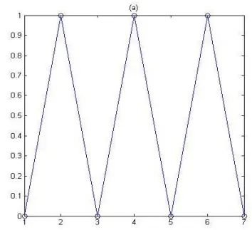
数据来源：国泰君安证券研究

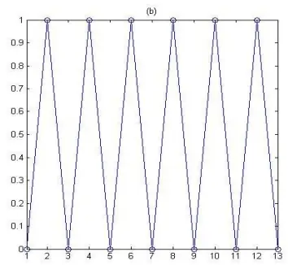

下图两种走势(a)与(b)都属于单边趋势，如果不考虑时间长短因素的话，二者的势分别为9和 81；如果除以N的平方的话，二者的势则都为 1，可以看出是不合理的，(b)图的势应该比(a)要大。所以，p必须小于2。$\frac{T}{N^{^{p}}},1<{\it{p}}<2.$

图 16 不同时间长度的单边上涨走势
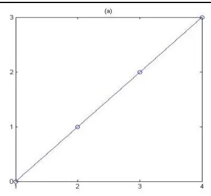

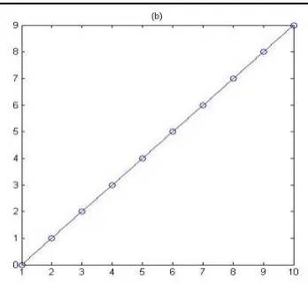
数据来源：国泰君安证券研究

最后，我们再以横盘波动走势图的突破带来势的变化，来进一步对p的取值加以确认。如下图，假定(a)图走了n 步，到了(b)图的第n+1 步向上突破，不难知道(b)的势应该大于(a)图。也就是说满足：

$$
\frac{n}{n^{p}}<\frac{n-1+2^{2}}{(n+1)^{p}}
$$

经过简单变换，易知 p 的取值范围为：

$$
p<\frac{\ln\left(n+3\right)-\ln\left(n\right)}{\ln\left(n+1\right)-\ln\left(n\right)},
$$

而对于任何 n,

$$
\frac{\ln\left(n+3\right)-\ln\left(n\right)}{\ln\left(n+1\right)-\ln\left(n\right)}\geq2,
$$

所以，对任何1 < p < 2 都满足要求。

图 17 横盘波动走势突破带来势的变化
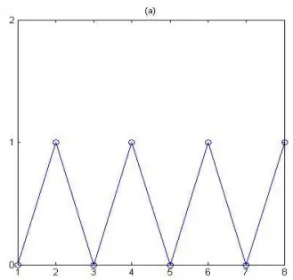
数据来源：国泰君安证券研究，

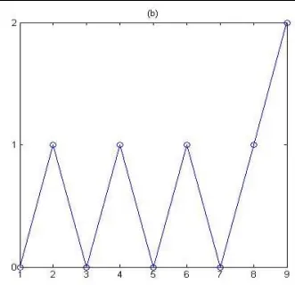

综合以上分析，为了简洁，我们 p 的取值为 3/2。因此，基于连续波段的势与基于绝对波动区间的势定义为：

$$
\mathbf{T}=\max\left(\sum_{i=1}^{m}\left(\mathbf{s}_{\alpha_i}-\mathbf{s}_{\beta_i}\right)^2,\sum_{i=1}^{k}d_i^2\right)/N^{3/2}
$$

对于单边上涨行情，可知其势随时间以 $\sqrt{N}$ 速度增长，趋于无穷大；而对于完全横盘震荡的走势，其势随时间以 $\frac{1}{\sqrt{N}}$ 速度递减，最终趋于零。如果不考虑平行移动的情况，易知给定任何时间步长 N，任何走势的势位于区间 $\left[{\frac{1}{\sqrt{N}}},{\sqrt{N}}\right]$

图 18 势随时间变化
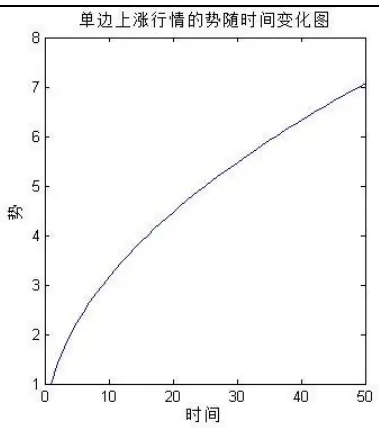
数据来源：国泰君安证券研究

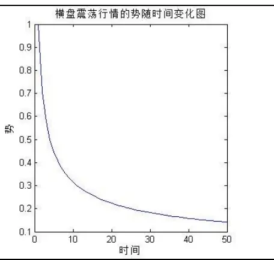

## 7. 势的研究应用之一：波段形成确认前后势的变化

## 7.1. 波段划分的简单回顾

价格分段的目的一方面是寻找价格走势的规律，另一方面则是对当下走势的可能发展方向、幅度、买卖点做出判断，以制定相应的操作策略。常见的波段划分方法有三类：一、基于MACD之 DEA 指标波段划分（定义稳定性的趋势波段）；二、基于涨跌幅的波段划分（探寻市场波动性的结构）；三、基于单均线的波段划分（揭示价格围绕均线波动的规律）。

对于一个已经划分完成的波段，包含一个波段起点和一个波段拐点，而对于一个尚未完成的波段，还包含一个当下形成的确认点。详细信息请参阅研究报告《发现价格走势规律之基于 MACD分段研究》。

波段当下形成的确认点包含两种情况：

第一种情况如下图，

C 点位臵： ①MACD的DEA指标从零轴下方穿过零轴；

②从B 开始的上涨行情到达C 创反弹以来的最高。

B 是拐点得到确认：AB下跌波段结束，BC上涨波段形成。

图 19 波段当下形成确认：第一种情形
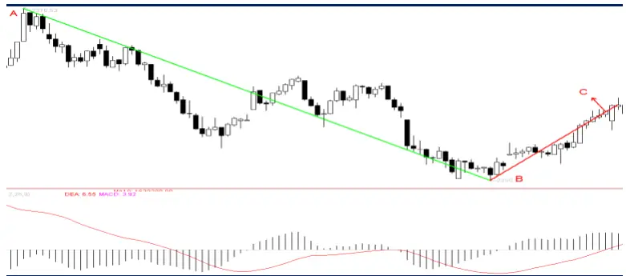
数据来源：国泰君安证券研究
第二种情况如下图，

C 点位臵： ①MACD的DEA指标小于零；②从B 开始的行情创反弹以来的最高。当下结论：不能确认 B点是底部拐点。

D 点位臵： ①MACD的DEA指标大于零；

②从B 开始的行情创反弹以来的最高。当下结论：B 点是底部拐点得到确认。

图 20 波段当下形成确认：第二种情形
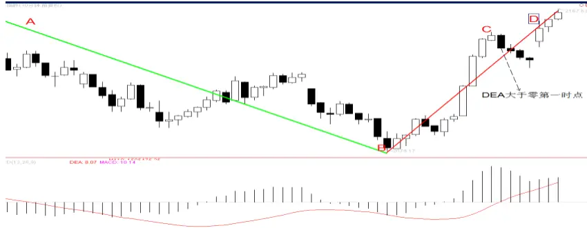
数据来源：国泰君安证券研究

有了分段体系后，我们知道每一个上涨或者下跌波段其实都有三个点：起点、确认点和终点，其中起点与终点为波段的拐点，而确认点为动量点。起点与终点当下是不可知的，也就是说，站在起点位臵或者终点位臵，是无法 100%知道这就是波段的起点或者终点，只有等到确认点出现后，才能确认起点或终点，也就是拐点。而确认点这个点的出现当下是确认的。在量化策略中，试图在起点或者终点交易，即为反转策略，而在确认点交易，则为动量策略。下图中，确认点位于波段的中间位臵，这是一种比较理想的情况，实际上，确认点可以位于波段的任何一个位臵，甚至可以与终点重合。

图 21 波段的起点、确认点和终点
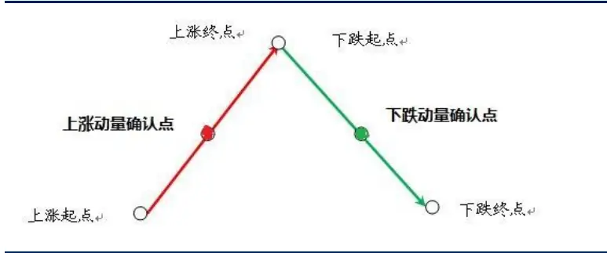
数据来源：国泰君安证券研究

## 7.2.求木之长者，必固其根本

上证综指从2013年6 月28 日至 2015年6 月12日为一周线级别上涨行情，持续102周，期间上涨的确认点出现在2014年 8月 22日（图中红点标记处）。也就是说，上证综指有60周时间都处于盘整状态，之后 42周从 2240 大幅上涨至 5178。从起点到确认点上涨仅 13%，但从确认点至顶点大幅上涨130%，后半段涨幅与前半段涨幅比值高达 10倍，这也许就是一个比较流行的“格物致知”段子所讲。

“竹子用了 4 年的时间，仅仅长了 3 厘米。在第五年开始，以每天 30厘米的速度疯狂的生长，仅仅用了六周的时间就长到了 15 米。其实，在前面的四年，竹子将根在土壤里延伸了数百平米。这个“恒”字，就是那3厘米，只要熬过这3 厘米，任何事都会水到渠成、顺理成章的。做人是这样，做事也是。坚持自己的原则，守住本心和初心，该来的总会在不经意间到来。”

图 22 上证综指周线级别上涨走势（2013.6.28 - 2015.6.12）
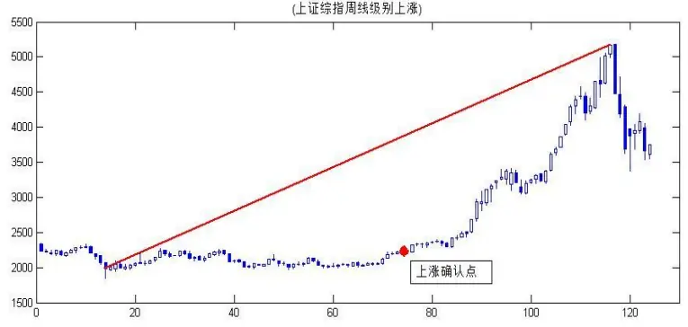
数据来源：国泰君安证券研究,WIND

上证综指前半段持续 60 周的震荡行情的势仅为 0.35，期间出现过一段行情的最小势仅0.26，时间长度 12周，12周0.26的势对应的标准化结构图如下，这是非常典型的窄幅震荡走势。上证综指指数后半段行情持续42周，势为2.2较前半段的势翻了5 倍。

图 23 时间长度 12、势 0.26的标准化结构图
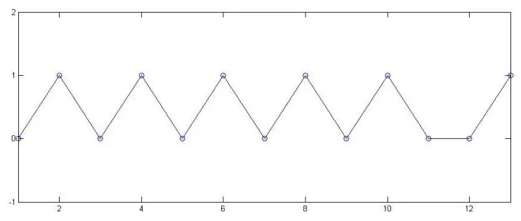
数据来源：国泰君安证券研究,WIND

类似的现象在创业板指数（399006）也出现过，创业板指数从 2012 年12月到2015年6 月为周线级别上涨行情，上涨548%，之前的周线级别下跌行情的后半段势仅有0.39，同样在势中属于非常小的值。

图 24 创业板指数（399006）周线级别上涨走势（2012.12.07 - 2015.6.5）
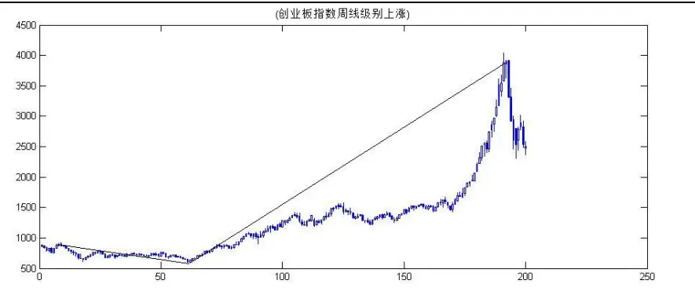
数据来源：国泰君安证券研究,WIND

底部的左侧区域定义为下跌确认点到底部拐点之间部分，底部右侧区域定义为底部拐点到上涨确认点之间部分。一个上涨波段要出现一个比较不错的上涨行情，猜测要么在底部右侧区域出现过盘整走势，要么在左侧区域出现过盘整走势，总而言之，要能够大涨、能够走得远，是不是需要一个充分的震荡交换筹码的过程？

图 25 底部左侧与右侧区域
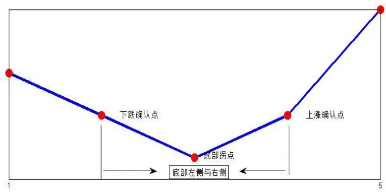
数据来源：国泰君安证券研究

我们用102个申万二级行业的周度数据，时间从 2001年3 月至2015年7 月，选取统计样本共 370 个周线级别上涨波段，每个上涨波段在确认之前的前半段和下跌波段的后半段计算最小势。统计显示，平均最小势仅为 0.36，而且基本上呈现，周线级别上涨波段的涨幅越大，最小势越小特征，即走得越远的波段，需要在底部两侧至少有一层曾经长时间盘整过。简单总结一句话即：求木之长者，必固其根本。

图 26 底部最小势与周线级别上涨波段涨幅散点图
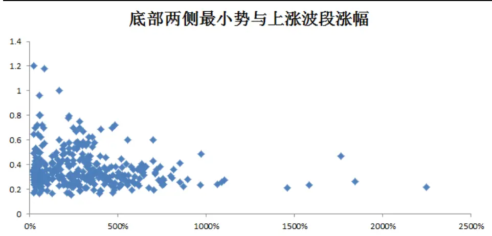
数据来源：国泰君安证券研究,WIND

## 7.3. 波段前半段与后半段势的变化

一个上涨波段在上涨确认点出现之后，确认了上涨波段已经形成，而同时原下跌波段确认在底部拐点结束。从上涨确认点开始，进入了上涨波段的后半段行情。从动量策略角度，需要关心后半段涨幅和前半段涨幅有什么关系？后半段的持续时间和前半段比较孰长疏短？后半段的走势是不是相对前半段会简洁轻快？同样，对于一个下跌波段也存在相同的问题。

图 27 前半段与后半段示意图
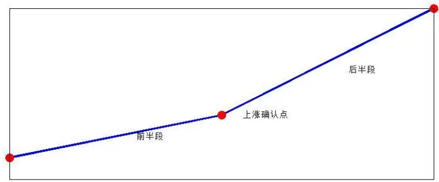
数据来源：国泰君安证券研究

选取申万 28 个一级行业，2001.5-2015.8 周度数据。从下面图表看到，后半段涨幅与前半段涨幅比值在 1 以内，有 74 次，而比值大于 1 有 62次。其中 1 倍到 2 倍有 6 次，3 到 5 倍有 5 次，5 到 10 倍多达 24 次，10 到 15 倍 14 次，15 到 20 倍 5 次，20 到 25 倍 6 次，还有超过 25 倍 2次。这个分布不是一个均匀分布，也不是一个简单的递减分布。而是要么涨不多，要么涨很多的差异化显著分布。这种统计也反映了投资中要么没有牛市，要么牛市很大。

图 28后半段涨幅/前半段涨幅比值统计分布（周线级别上涨波段）
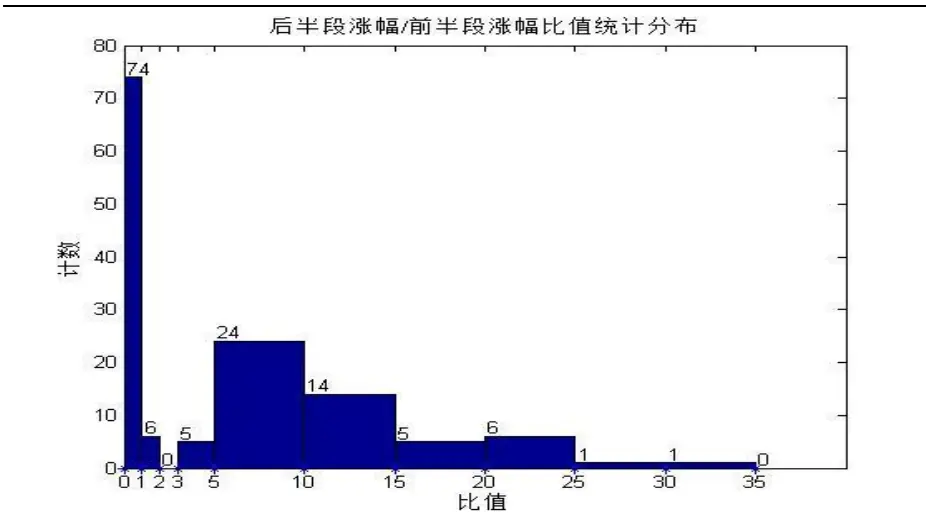
数据来源：国泰君安证券研究,WIND

从后半段和前半段的时间比较，比值不像涨幅比值那么显著，显示了一个周线级别上涨幅度可以很疯狂，但持续时间不会那么夸张。

图 29后半段/前半段持续时间比值统计分布（周线级别上涨波段）
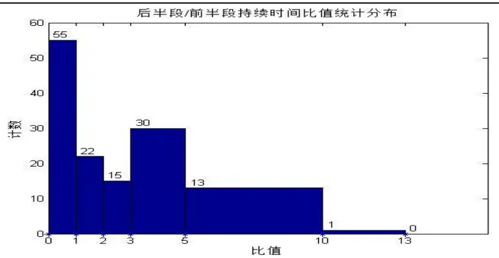
数据来源：国泰君安证券研究，WIND

而对于周线级别下跌波段，后半段跌幅与前半段跌幅的比值，小于1的有51次，1到2倍58次，2 到3倍18 次，超过3 倍仅为8次。说明了，下跌波段后半段跌幅空间已经有限。

图 30后半段跌幅/前半段跌幅比值统计分布（周线级别下跌波段）
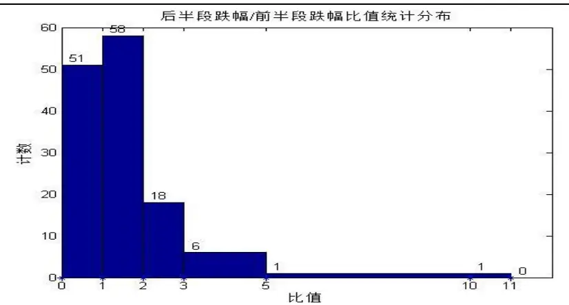
数据来源：国泰君安证券研究,WIND

图 31后半段/前半段持续时间比值统计分布（周线下跌波段）
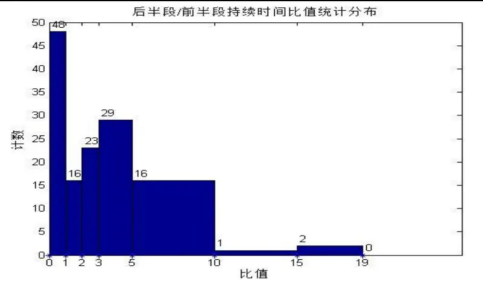
数据来源：国泰君安证券研究,WIND

进一步研究波段形成确认前后势的变化。对于那些后半段涨幅超过前半段涨幅的波段，85%的情况下，后半段的势要大于前半段的势。

图 32 前半段势与与后半段势比较（后半段涨幅/前半段涨幅大于 1）
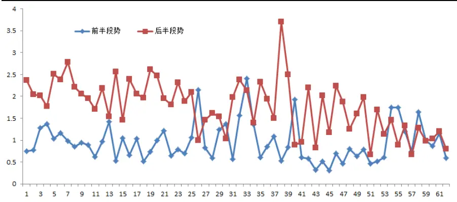
数据来源：国泰君安证券研究,WIND

对于那些后半段涨幅小于前半段涨幅的波段，64%概率后半段的势要大于前半段的势，这个比例显著小于那些大的上涨波段，但比例仍然接近三分之二。

图 33 前半段势与与后半段势比较（后半段涨幅/前半段涨幅小于1）
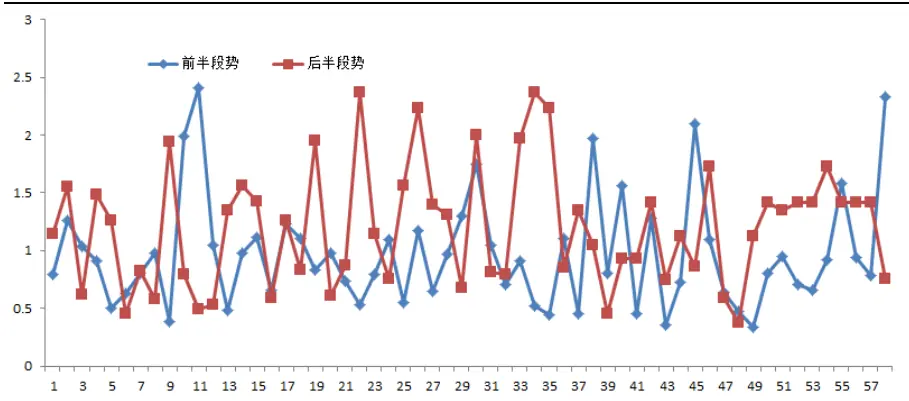
数据来源：国泰君安证券研究,WIND

但对于下跌波段，这种规律没有那么显著，一般认为刚开始下跌的前半段可能下跌比较快，而下跌的后半段可能减缓，实际统计数据显示，58%的情况，下跌前半段势高于下跌后半段的势，也就是对于一个下跌波段，可能前半段下跌趋势比较强，也可能后半段下跌趋势比较强，也可能二者相对都比较曲折，和上涨波段比较没有那么强的规律。

## 8. 势的研究应用之二：底部形态特征

股价底部形态是一个比较受关注的技术点，谈论比较多的像 V 型底、L型底、反L型底和平底。这些描述缺乏一个相对严格的定义，在这里我们用底部两侧走势的势定义四种类型的底，并统计分析这些底出现的概率是怎样的。

下图从最低收盘价那根 K 线（包含此 K 线）左侧五 K 线为底部左侧，最低收盘价 K 线（不包含此 K 线）右侧五 K 线为底部右侧，分别计算左侧和右侧的势，当然需要指出的是，计算左侧的势实际上要用到更之前的数据，也就是说，虽然计算左侧五根K线的势，但实际上用到的数据是十个。另一方面，实际应用中，计算左侧和右侧的势也未必一定要选五根K线，也可以六根或七根。

图 34 底部左侧和右侧

数据来源：国泰君安证券研究

从势的定义可知，五根 K线的势最高为2.24，从高到低依次为 1.52、1.43、1.16、0.89、0.80、0.72、0.63、0.54、0.45、0.36、0.27 和 0.18。下图为排在前六位的势对应的图形，这六种走势都偏单边。而余下其他势对应的图形趋于扁平震荡。右侧五根K线也是同样，只要把图形做一下水平镜像即可。

图 35 从高到低排前六位的势的示意图（时间长度为 5单位）

数据来源：国泰君安证券研究

根据左侧和右侧势的大小，我们可以定义四种底部类型：

V 型底定义：min（左侧势，右侧势）> 0.8

L 型底定义 ：左侧势 > 0.8, 右侧势 < 0.8

反 L 型底定义 ：左侧势 < 0.8, 右侧势 > 0.8

平底型底定义：max（左侧势，右侧势）< 0.8

下图申万二级行业底部形态分布，从 2001年至 2015 年十四年A股历史数据，102 个二级行业周线级别底部总共 442 个，其中 62%的底部为 V型底，L型占比 23%，而反 L型占比 12%，平底型仅占 3%。同样说明，在周线下跌行情中如果出现平底，即左侧势和右侧势都小于 0.8，这样的底部几乎就是一个下跌中继。平底型占比极低，另一方面说明底部要么左侧出现了单边下跌（恐慌性抛售），要么右侧出现单边上行（逼空式上涨，快速脱离底部区域）。

图 36 二级行业周线级别底部形态分布（总样本 442）

数据来源：国泰君安证券研究，WIND

申万二级行业日线级别底部形态分布，102 个二级行业日线级别底部总共2453个，其中54.3%的底部为V 型底，L型占比23.7%，而反L型占日比 11.5%，平底型占 10.5%。如果拿日线级别底部形态的分布和周线级别比较，L型和反 L型的占比几乎是一样的，而日线级别的V 型底减少，平底型增多，到了 10.5%。这说明，周线级别V型底的稳定性高，也就是说无论在左侧还是右侧，5 个周期K线的单边走势较日线更稳定。

图 37 二级行业日线级别底部形态分布（总样本 2453个）

数据来源：国泰君安证券研究，WIND

## 9. 总结

如何定义价格的势是一个开放而有趣的研究课题，报告中我们主要研究了形态的势，即外势。势的构造第一步是对实际 K线图的抽象与简化，简化而标准化后的图形，有效地消除了不同交易品种（股票、期货、外汇、债券）的波动性影响，同时可以对同一个品种不同周期（月线、周线、日线、小时线、30分钟线、5分钟线、1分钟线）的走势进行比较。目前主要的简化方法为基于收盘价单调性和5周期均线。这种方法虽然比较好地逼近了真实走势图，但仍然不能完全契合，所以在简化实际走势图这一步中，仍然有很大的改进空间。第二步主要是基于连续波段和绝对波动空间来定义势，这是目前我们能够想到的最好方法，也许仍存在其他更为简洁优美的设计思路，需要继续探索。对于不同时间长度的走势图进行比较，必须除以时间长度的 1.5 次方，这个是不是最优的，还无定论，也需要进一步研究。做趋势跟踪的交易策略，经常用到箱体突破，而箱体的量化定义难点在于不同交易品种、不同周期级别、同一个品种同一个周期在不同时间段的箱体存在不同的波动性，所以设计箱体的参数需要不断改变，但有了势的标准化定义后，这些工作变得有效起来。总的来讲，势的定量化能够对各类图形比较大小，意味着在量化投资和技术分析领域有着广泛的应用。

## 本公司具有中国证监会核准的证券投资咨询业务资格

## 分析师声明

作者具有中国证券业协会授予的证券投资咨询执业资格或相当的专业胜任能力，保证报告所采用的数据均来自合规渠道，分析逻辑基于作者的职业理解，本报告清晰准确地反映了作者的研究观点，力求独立、客观和公正，结论不受任何第三方的授意或影响，特此声明。

## 免责声明

本报告仅供国泰君安证券股份有限公司（以下简称“本公司”）的客户使用。本公司不会因接收人收到本报告而视其为本公司的当然客户。本报告仅在相关法律许可的情况下发放，并仅为提供信息而发放，概不构成任何广告。

本报告的信息来源于已公开的资料，本公司对该等信息的准确性、完整性或可靠性不作任何保证。本报告所载的资料、意见及推测仅反映本公司于发布本报告当日的判断，本报告所指的证券或投资标的的价格、价值及投资收入可升可跌。过往表现不应作为日后的表现依据。在不同时期，本公司可发出与本报告所载资料、意见及推测不一致的报告。本公司不保证本报告所含信息保持在最新状态。同时，本公司对本报告所含信息可在不发出通知的情形下做出修改，投资者应当自行关注相应的更新或修改。

本报告中所指的投资及服务可能不适合个别客户，不构成客户私人咨询建议。在任何情况下，本报告中的信息或所表述的意见均不构成对任何人的投资建议。在任何情况下，本公司、本公司员工或者关联机构不承诺投资者一定获利，不与投资者分享投资收益，也不对任何人因使用本报告中的任何内容所引致的任何损失负任何责任。投资者务必注意，其据此做出的任何投资决策与本公司、本公司员工或者关联机构无关。

本公司利用信息隔离墙控制内部一个或多个领域、部门或关联机构之间的信息流动。因此，投资者应注意，在法律许可的情况下，本公司及其所属关联机构可能会持有报告中提到的公司所发行的证券或期权并进行证券或期权交易，也可能为这些公司提供或者争取提供投资银行、财务顾问或者金融产品等相关服务。在法律许可的情况下，本公司的员工可能担任本报告所提到的公司的董事。

市场有风险，投资需谨慎。投资者不应将本报告为作出投资决策的惟一参考因素，亦不应认为本报告可以取代自己的判断。在决定投资前，如有需要，投资者务必向专业人士咨询并谨慎决策。

本报告版权仅为本公司所有，未经书面许可，任何机构和个人不得以任何形式翻版、复制、发表或引用。如征得本公司同意进行引用、刊发的，需在允许的范围内使用，并注明出处为“国泰君安证券研究”，且不得对本报告进行任何有悖原意的引用、删节和修改。

若本公司以外的其他机构（以下简称“该机构”）发送本报告，则由该机构独自为此发送行为负责。通过此途径获得本报告的投资者应自行联系该机构以要求获悉更详细信息或进而交易本报告中提及的证券。本报告不构成本公司向该机构之客户提供的投资建议，本公司、本公司员工或者关联机构亦不为该机构之客户因使用本报告或报告所载内容引起的任何损失承担任何责任。

## 评级说明

## 1.投资建议的比较标准

投资评级分为股票评级和行业评级。

以报告发布后的12个月内的市场表现为比较标准，报告发布日后的 12个月内的公司股价（或行业指数）的涨跌幅相对同期的沪深 300 指数涨跌幅为基准。

## 2.投资建议的评级标准

报告发布日后的 12 个月内的公司股价（或行业指数）的涨跌幅相对同期的沪深 300 指数的涨跌幅。

| 评级 | 说明 |  |
| --- | --- | --- |
| 股票投资评级 | 增持 | 相对沪深 300指数涨幅15%以上 |
|  | 谨慎增持 | 相对沪深300指数涨幅介于5%～15%之间 |
|  | 中性 | 相对沪深300指数涨幅介于-5%～5% |
|  | 减持 | 相对沪深300指数下跌5%以上 |
| 行业投资评级 | 增持 | 明显强于沪深 300 指数 |
|  | 中性 | 基本与沪深300指数持平 |
|  | 减持 | 明显弱于沪深300指数 |

## 国泰君安证券研究

|  | 上海 | 深圳 | 北京 |
| --- | --- | --- | --- |
| 地址 | 上海市浦东新区银城中路168号上海 银行大厦29层 | 深圳市福田区益田路 6009 号新世界 商务中心34层 | 北京市西城区金融大街28 号盈泰中 心2号楼10层 |
| 邮编 | 200120 | 518026 | 100140 |
| 电话 | (021)38676666 | （0755)23976888 | (010)59312799 |
|  | E-mail: gtjaresearch@gtjas.com |  |  |