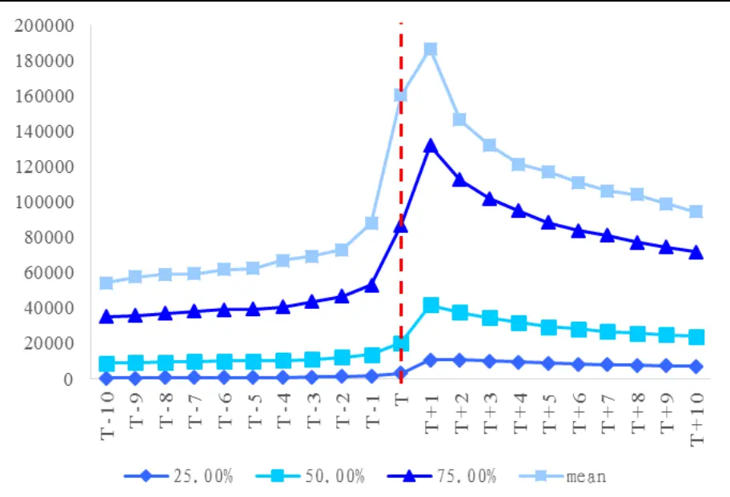
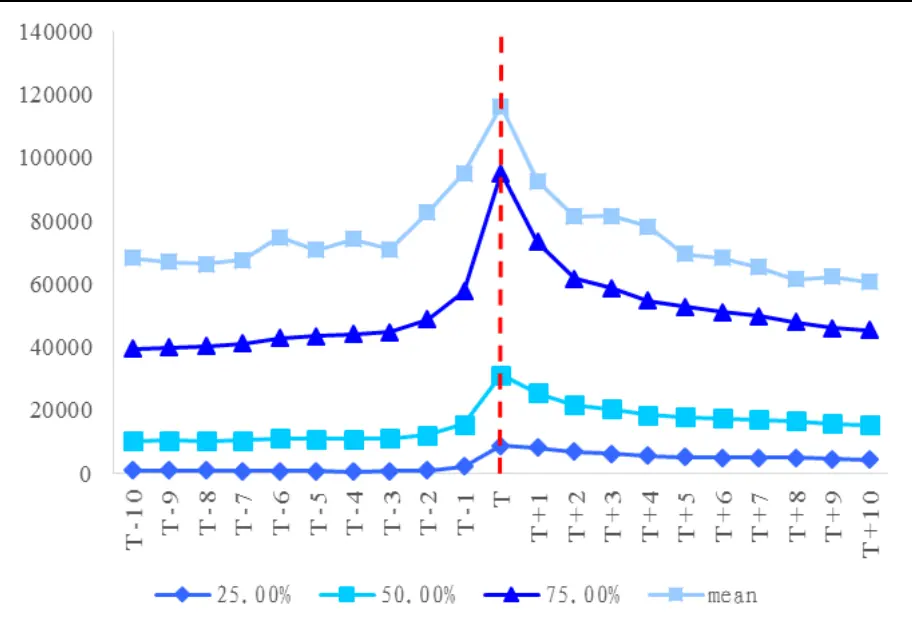
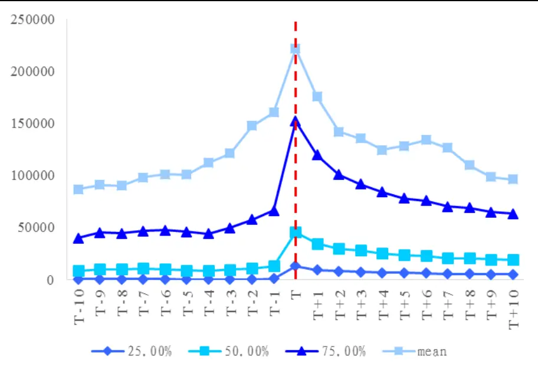
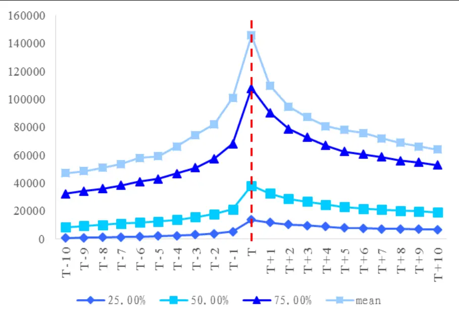

nInfo] [Table_Title] 2015.08.22

# 基于交易层面的交易公开信息再探索

## ——数量化专题之六十六

李雪君（分析师）

刘富兵（分析师）

8 021-38675855

021-38676673

lixuejun@gtjas.com

liufubing008481@gtjas.com

证书编号 S0880515070001

S0880511010017

本报告导读：本文从交易的角度，对交易公开信息这一事件背后的信息传递过程，进行了深入的研究，探讨了交易规模对价格变化的推动作用。

## 摘要：

[Table_Summary] • 本文是交易公开信息系列报告的延续，在上榜事件的收益回测基础上，基于交易的层面，对事件背后的信息传递过程进行了深入探讨。

- 首先，针对交易公开信息中不同披露原因的上榜股票，分别就其上榜前与上榜后超额收益的影响因素进行归因分析。发现上榜前，多类股票价格走势强于大盘，而于上榜后弱于大盘，与收益观结果相吻合。

其次，从交易量的角度出发，通过对上榜事件前后各 10 个交易日（共计 21个交易日）的交易量进行时间序列的描述，我们发现，“涨跌幅偏离值达 7%”这类事件相对特殊，其研究区间内交易量的峰值并非出现在上榜日，对于这一现象，我们认为主要是由于上榜事件的“羊群效应”，吸引了大量投资者的跟进。除此之外，多类事件表现出上榜前交易量已开始逐日攀升，这也就意味着已有知情交易者在股票上榜前开始布局交易。

最后，我们对交易规模与价格变化进行了研究与探讨，分别就每类披露原因，其上榜前后主导价格变化的主要交易规模进行了挖掘。发现“涨跌幅偏离值达 7%”这类事件，在上榜前主要由小额交易推动价格变化，而在上榜后主要由大额交易主导价格变化。这也就进一步印证了之前的收益回测与交易量观察。我们认为上榜前，事件参与者有意隐蔽其交易行为，因此采用小规模交易。上榜后，事件的“羊群效应”显著，有大量投资者跟进，这使得事件前就已布局交易的投资者收益进一步扩大，信息的优势方于上榜后获利了结。

金融工程

## 金融工程团队：

刘富兵：（分析师）

电话：021-38676673

邮箱：liufubing008481@gtjas.com

证书编号：S0880511010017

赵延鸿：（分析师）

电话：021-38674927

邮箱：zhaoyanhong@gtjas.com

证书编号：S0880515030004

耿帅军：（分析师）

电话：010-59312753

邮箱：gengshuaijun@gtjas.com

证书编号：S0880513080013

## 刘正捷：（分析师）

电话：0755-23976803

邮箱：liuzhengjie012509@gtjas.com

证书编号：S0880514070010

## 李雪君：（分析师）

电话：021-38675855

邮箱：lixuejun@gtjas.com

证书编号：S0880515070001

王浩：（研究助理）

电话：021-38676434

邮箱：wanghao014399@gtjas.com

证书编号：S0880114080041

## 陈奥林：（研究助理）

电话：021-38674835

邮箱：chenaolin@gtjas.com

证书编号：S0880114110077

李辰：（研究助理）

电话：021-38677309

邮箱：lichen@gtjas.com

证书编号：S0880114060025

## [Table_R相关报告

《自上而下寻找统计规律》2015.08.20《动量策略新视角——动量崩溃与加速度》2015.08.11

《趋与势的量化定义研究》2015.08.10

《分析师对投资者行为的影响》2015.07.31

《如何控制跟踪误差》2015.07.29

在研究报告《探究交易公开信息之市场观察篇》中，我们对交易公开信息（也就是通常所说的“龙虎榜”）进行了系统的解读，并分别基于披露原因和交易席位的视角，进行了全面的市场观察。研究结果表明，单纯基于上榜原因的角度，在股票上榜后买入并持有，并不能带给我们很好地超额收益，需加以交易席位的判断。相比较而言，机构专用席位参与的股票相对没有机构参与的股票，在上榜之后能够取得更好的超额收益。

在本篇报告中，我们将继续对交易公开信息进行研究与探讨。首先，延续前一篇报告的内容，进一步挖掘交易公开信息带来的超额收益，对这部分超额收益的影响因素进行归因。其次，从交易的层面入手，对交易公开信息背后，交易量的分布以及交易规模对价格变化的推动作用进行深入研究。

## 1. 超额收益的影响因素

交易公开信息，是指对于满足一定条件的股票，交易所每个交易日披露其买入和卖出的前五个交易席位，及其各自的买入和卖出金额。当股票满足何等条件时将被予以披露，我们已在上一篇报告《探究交易公开信息之市场观察篇》中，依据交易所的交易规则，进行了全面的解读。

本篇报告将着重针对四类交易公开信息的披露原因进行研究，包括：

1) 日收盘价涨跌幅偏离值达 7%

2) 日收盘价涨跌幅偏离值达-7%

3) 日价格振幅达到 15%

4) 换手率达到 20%

这四类事件全部是由于单个交易日的异常表现出现在榜单中，而不涉及其他交易日，相对来说时效性更强，数据量足够广，更具有研究价值和代表性。

对于个股而言，出现在龙虎榜榜单中，本身就可以作为一个事件进行研究。针对上榜这个事件，本节着重研究其超额收益受哪些因素影响，以及这些影响因素对超额收益的作用方向。我们考察的影响因素主要是从交易公开信息所披露的内容出发，包括龙虎榜榜单中出现的交易席位，合计的买入/合计卖出金额与当日成交金额的占比，以及不同类型的披露原因。

为考察龙虎榜上榜股票在上榜前后的收益表现受哪些因素影响，我们利用回归模型，将累计超额收益作为被解释变量，解释变量包括榜单中的合计买卖金额与成交金额占比，以及表征上榜原因的虚拟变量。对任意出现在龙虎榜榜单中的股票 ，加总其买入金额最大的前五个交易席位的合计买入金额，以及卖出金额最大的前五个交易席位的合计卖出金额，考虑上述合计买入/合计卖出金额与股票 在榜单日的成交金额的占比，联合披露原因的虚拟变量，对研究区间的累计超额收益做回归：

$$
CAR_{iT}=\beta_{1}\frac{\sum_{m=1}^{5}Buy_{im}}{Amo_{i}}+\beta_{2}\frac{\sum_{m=1}^{5}Sell_{im}}{Amo_{i}}+\sum_{k=1}^{9}(\alpha_{k}\times Dummy_{k})+\varepsilon
$$

其中， $CAR_{iT}$ 表示股票 在研究区间的累计超额收益（相对 Wind 全 A 指数）。 $Buy_{im}$ 和 $Sell_{im}$ 分别表示股票 在龙虎榜单中披露的，买入/卖出金额排第 位的交易席位的交易金额。 $Amo_{i}.$ 表示上榜日股票 的成交金额。$Dummy_{k}$ 表示披露原因的虚拟变量及其交叉项，包括 $\cdot D_{1}$ （收盘价涨跌幅偏离值达 7%）、 $D_{2}$ （收盘价涨跌幅偏离值达-7%）、 $D_{3}$ （日价格振幅达15%）、 $D_{4}$ （换手率达 20%），以及 5个交叉项 $D_{1}*D_{3},\ D_{2}*D_{3},\ D_{1}*D_{4}$ $D_{2}*D_{4},\ D_{3}*D_{4}$ o

我们将针对交易公开信息中出现的个股，分别对其上榜前和上榜后 5个交易日进行影响因素的回归分析。样本区间为 2007年-2015年 2月，样本包括在此期间所有龙虎榜中出现的个股。披露原因主要包括收盘价涨跌幅偏离值达±7%、日内价格振幅达 15%，换手率达 20%。

回归结果如下表所示：

表 1：超额收益的影响因素

| 上榜前 5 个交易日 | 上榜后 5 个交易日 |
| --- | --- |
| $\textstyle\sum_{m=1}^{5}Buy_{m}$ 0.042 $Amo$ | 0.164 |
| $\textstyle\sum_{m=1}^{5}Sell_{m}$ | -0.098 -0.075 |
| $Amo$ |  |
| $D_{1}$ | 0.136 -0.023 |
| $D_{2}$ | -0.037 -0.029 |
| $D_{3}$ | 0.092 -0.037 |
| $D_{4}$ | 0.144 -0.044 |
| $D_{1}*D_{3}$ | -0.039 0.034 |
| $D_{2}*D_{3}$ | -0.068 0.033 |
| $D_{1}*D_{4}$ | -0.018 0.036 |
| $D_{2}*D_{4}$ | -0.084 (0.012) |
| $D_{3}*D_{4}$ | -0.037 (0.001) |

数据来源：Wind，国泰君安证券研究
注：括号标示变量系数不显著（显著水平0.05）

从表中可以看出，无论上榜前后，龙虎榜中披露的买入金额最大的前五个交易席位的合计买入金额相比成交金额越大，卖出金额最大的前五个交易席位的合计卖出金额相比成交金额越小，上榜股票走势越强。

事件虚拟变量方面，单个虚拟变量的回归系数皆显著。上榜前，四类事件中只有“涨跌幅偏离值达-7%”的回归系数为负，其他三类事件系数都为正，说明这三类事件的股票在上榜前的 5个交易日，统计意义上均跑赢了标的指数。上榜后，四类事件的回归系数都显著为负，意味着上榜后股票价格走势均弱于大盘。这一回归结论与我们在上篇市场观察报告中的观测结果完全一致，即单纯基于披露原因，在股票上榜后买入跟进，并不能带给我们超额收益。值得注意的是，在上榜之前，有三类披露原因对应的事件股票组合是显著跑赢大盘的。

由于四类事件不是相互独立的，从交叉项的回归系数来看，上榜前皆显著为负，而上榜后大多显著为正，说明交叉事件在上榜前表现弱于标的指数，而上榜后则表现强于标的指数。

对于龙虎榜这一类事件，在对其上榜前后的收益表现进行回测与归因后，我们希望进一步去探索事件背后的信息传递过程，从交易的角度出发进行深入研究。

## 2. 交易规模与股票价格变化

对于不同投资者来说，其获取信息的能力和加工处理信息的能力各不相同，不同投资者基于信息产生的预期也不尽相同，投资者消化信息之后，将其转化为交易订单，而交易订单最终驱动了市场中的价格变化。所以说，不同类型的订单，背后是不同类型的投资者，订单包含着投资者对信息的理解。

研究大额、中等规模、小额交易对市场价格变化的影响其实是间接地分析市场中信息传递的过程。对于一只大幅上涨的股票，研究其价格上涨过程的背后，是哪种交易规模驱动的价格变化，有助于我们分析其投资者兑现预期的交易方式。

信息不对称是价格导致市场价格异常波动的重要原因，如果市场中存在着严重的信息不对称，将会出现大量内幕交易、操纵股价等违规现象。

信息不对称使得拥有信息优势的人可以通过内幕交易获取超额收益，“羊群效应”的存在很大程度上放大了信息不对称对市场的影响。当一方长期处于信息优势时，另一端的弱势方将会密切跟踪对方的交易行为，如果信息优势方大量买入股票，弱势方则会大量跟进。这种行为使得很多有资金实力的投资者利用自己长期的信息优势地位，引导其他投资者跟风操作。另一方面，这一行为往往也是利用了投资者“喜欢追涨”、“止盈不止损”的心理习惯。股价上涨时，动量交易推升股价进一步上涨，而股价下跌时，处置效应的存在使得投资者不会大量跟风卖出。

## 2.1. 交易量观察

首先，我们针对每类交易公开信息，对事件股票上榜前后的交易量进行观察，来挖掘股票上榜前后，其交易量方面是否存在异动。

对于交易公开信息中披露的每只股票，我们记事件上榜日为 T日，分别提取每只个股上榜前后各 10个交易日（[T-10，T+10]）的 1分钟行情数据，观察其上榜前后每个交易日每分钟交易量的分布情况。计算[T-10，

T+10]期间，每个交易日每分钟交易量的 25%、50%、75%分位数和均值，以时间序列的形式呈现出来，并标记出上榜日 T 日。

## 2.1.1. 日收盘价涨跌幅偏离值达 7%

从下图可以看出，对于“日收盘价涨跌幅偏离达 7%”这类事件，交易量在上榜后的第一个交易日达到研究区间（上榜前后 21个交易日）的峰值，上榜前，交易量随着上榜日的到来呈现上升趋势，临近上榜日附近陡然上升，于上榜后第一个交易日达到最高峰，随后逐日下降。总体而言，上榜后的交易量要整体多于上榜前同样时间间隔的交易量。

图 1：上榜前后每分钟交易量分布—涨跌幅偏离值达 7%

数据来源：Wind，国泰君安证券研究

对于上“研究区间内交易量的峰值并非出现在上榜日”这一现象，通过与下文中其他三类披露原因的比较可以看出，唯独出现在了此类事件中。分析这一现象的原因，我们认为主要是由于上榜事件的“羊群效应”，导致吸引了大量投资者跟进。

## 2.1.2. 日收盘价涨跌幅偏离值达-7%

与上一类披露原因相对应的是，上榜日事件股票大幅跑输标的指数，即价格涨跌幅偏离值达-7%。这类事件在上榜前后的 1 分钟交易量上，与上一类事件呈现较大差异。从下图可以看出，上榜前后，分钟级别交易量基本对称，于上榜日达到阶段峰值，距离上榜日越远，交易量呈现出逐日下降的趋势。

图 2：上榜前后每分钟交易量分布—涨跌幅偏离值达-7%

数据来源：Wind，国泰君安证券研究

## 2.1.3. 日价格振幅达到 15%

对于“日价格振幅达到 15%”这类事件，上榜当天股票日内价格波动较大，由此带来上榜日交易量的放大，与前一类披露原因相类似，交易量在上榜前呈现出较为平坦的形态，峰值同样出现在上榜日，而后逐渐降低，上榜前的交易量整体小于上榜后的交易量。

图 3：上榜前后十个交易日，每分钟交易量分布—日价格振幅达 15%

数据来源：Wind，国泰君安证券研究

## 2.1.4. 换手率达到 20%

对于由于换手率较高而上榜的股票，其交易量基本呈现倒 V字型，峰值同样出现在上榜日。而在上榜前，交易量已呈现出逐日上升的趋势，并于上榜后逐日下降。

图 4：上榜前后十个交易日，每分钟交易量分布—换手率达 20%

数据来源：Wind，国泰君安证券研究

## 2.2.交易规模与价格驱动

基于上一节中龙虎榜事件股票上榜前后交易量的观察，我们进一步来挖掘其交易背后，究竟是哪一类交易规模对价格变化起主导作用，进而推断上榜事件前后的交易行为。

学术界对于“交易规模对股价变化的影响”的研究，主要包括四类假说：

公共信息假说认为，股票价格的波动是公共信息所导致的，这使得交易规模频数和股票价格波动之间呈现显著的正相关关系。

隐蔽交易假说认为，股价主要由知情交易者的私密信息驱动，隐蔽交易主要由中等规模的交易组成。这主要是由于知情投资者在实际交易中，为了能够减少交易的冲击成本，将大单拆分成若干个中单进行交易。

小额交易假说认为，股价的波动主要由小规模交易推动，隐蔽交易使得知情交易者倾向于选择小单交易。

大宗交易假说认为，股价的波动主要由大规模交易推动。这主要是由于在波动性较高的市场中，隐蔽交易的难度加大，投资者为了追求更加迅速的反应速度而选择大规模交易。

对于不同披露原因的交易公开信息，下文将分别针对以上几类假说予以验证，以探索每类事件背后交易规模与价格变化之间的关系。

我们的研究数据来源于 Wind，考虑到分笔成交数据不易获取，我们将采用 1分钟的高频数据代替。

首先对模型中应用到的各类变量予以定义。我们在此沿用 Barclay 和Warner提出的关于价格变化的计算方法：

$$
PC_{t}=P_{t}-P_{t-1}
$$

其中， $P_{t}$ 表示 时刻的价格， $P_{t}.$ 表示 时刻的价格， 时刻到 时刻的所有交易驱使价格从 $P_{t-1}$ 变为 $P_{t}$ ，所以 $P_{t}-P_{t-1}$ 就是由交易量引起的价格变化 $PC_{t}$

我们根据每分钟的个股成交量对交易规模进行划分，以 10000 股和100000 股为间隔，将每分钟成交量小于 10000 股的划分为小额交易，介于 10000 股和 100000股之间的划分为中等规模交易，大于 100000股的划分为大额交易。针对每类交易规模，将其分别对应的 $PC_{i}$ 累计，然后计算出累计价格变化的百分比：

$$
PerCPC_{j}=\frac{\sum_{i=1}^{n}PC_{ji}}{P_{T}-P_{0}}
$$

其中，下标 代表不同的交易量分类，分别对应小额、中等规模和大额。分母 $P_{T}-P_{0}$ 表示股票在研究区间内的总价格变化， $P_{T}$ 为最后一笔交易的成交价格， $P_{0}$ 为第一笔交易的成交价格。 表示所研究的股票在研究区间内出现第 类交易规模的频数，分子即表示在研究区间内，由第 类交易规模累计引起的价格变化之和。 对应研究区间内，由第 类交易规模驱动的累计价格变化的百分比。

对于一个由多只股票组成的组合，我们将根据研究区间内每只个股的价格变化绝对值赋予权重，对于绝对价格变化大的个股，赋予较大的权重，相应地，绝对价格变化小的则权重较小。赋权后的累计价格变化为：

$$
CumPC_{k,j}=PerCPC_{j,k}\times\frac{|P_{k,T}-P_{k,0}|}{\sum_{k=1}^{m}|P_{k,T}-P_{k,0}|}
$$

其中， 表示股票池中的股票个数， 表示特定的股票 。

对于每一只上榜个股，我们采用频数占比和交易量占比来度量这只股票在研究区间内，每一类交易规模在频数和总交易量上百分比，组合内个股之间采用简单算术平均算法。而对于累计价格变化的百分比，则采用加权平均。基于此，我们可以通过“频数占比”、“交易量占比”、“累计价格变化占比”三个维度，对股票池在研究区间内的“交易规模与价格变化”进行初步的描述性统计分析。

进一步地，为了能够表征价格变化与交易量的关系，验证上文中提及的四类假说，我们以每类交易规模的累计价格变化作为被解释变量，对每类交易规模在研究区间内的频数占比，和交易规模属性的虚拟变量做加权最小二乘回归，权重参考 $CumPC_{k,j}$ 。回归方程为：

$$
PerCPC_{k,j}=\sum_{j=1}^{3}(\alpha_{j}\times Dummy_{k,j})+\beta\times PerFre_{k,j}+\varepsilon
$$

其中， 表示特定的股票 ， 表示交易量的分类，相应地， 表示小额交易规模， 表示中等交易规模， 表示大额交易。 为

表征交易规模的虚拟变量， $PerFre_{k,j}.$ 表示股票 在所有交易中第 类交易规模出现的频数百分比。

基于以上构建的回归模型，我们可以对各类交易规模驱动价格变化的假说予以验证。

如果公共信息假说成立，那么累计价格变化应当与频数占比成比例，频数占比的回归系数应显著接近于 1，并且各类交易规模的虚拟变量不显著。

如果隐蔽交易假说成立，那么表征中等规模的虚拟变量前面的系数应该显著大于小额和大额交易的系数。

如果小额交易假说成立，则小额交易的虚拟变量前面的回归系数应该显著较大。

同理，如果大宗交易假说成立，则对应大额交易的虚拟变量系数应显著较大。

基于上述交易规模对价格驱动的计算和回归方法，我们针对交易公开信息中的每一类披露原因，分别对其上榜前后进行分析。

## 2.2.1. 日收盘价涨跌幅偏离值达 7%

通过简单的描述性统计可以看出，对于这一类上榜股票，中等交易规模的频数占比 45.23%，接近一半，其在总交易量中的占比仅为 17.2%，而由这部分交易驱动的累计价格变化为 24.53%。相反，大额交易频数占比仅为 18.39%，而这部分交易驱动的累计价格变化高达 68.07%，相应的交易量占比也相对较多，这主要是由于极端大单的原因导致。对于小额交易，频数占比 36.38%，驱动了 7.41%的累计价格变化，频数占比较高主要是由于上榜前后停牌期间交易量为 0 的情况较多导致。

表 2：累计价格变化、频数和交易量占比-收盘价涨跌幅偏离达 7%

| 交易规模 | 累计价格变化占比 | 频数占比 | 交易量占比 |
| --- | --- | --- | --- |
| Small | 7.41% | 36.38% | 1.10% |
| Medium | 24.53% | 45.23% | 17.20% |
| Large | 68.07% | 18.39% | 81.70% |

数据来源：Wind，国泰君安证券研究

我们对“收盘价涨跌幅偏离值达 7%”的上榜股票，分别在其上榜前后各10个交易日的区间里，以累计价格变化占比为被解释变量，对频数占比和标识交易规模的虚拟变量做加权最小二乘回归。回归结果显示系数皆显著（显著性水平 0.01）。从下表可以看出，上榜前后，频数占比的回归系数都显著不为 1，拒绝了公共信息假说。上榜前，小额规模交易前的系数显著较大，意味着上榜前价格变化主要受小额交易的驱动。上榜后，大额规模交易前的系数显著较大，意味着上榜后的价格变化主要由大额交易来推动。

表 3: 价格变化与交易量-收盘价涨跌幅偏离达 7%

|  | 频数占比 | Small | Medium | Large |
| --- | --- | --- | --- | --- |
| 上榜前10个交易日 | -1.4646 | 1.3792 | 0.2725 | 0.8129 |
| 上榜后 10 个交易日 | 0.4590 | -0.1748 | -0.1510 | 0.8668 |

数据来源：Wind，国泰君安证券研究

结合前一章节中的交易量分布以及这一事件上榜前后超额收益的表现情况，我们认为上榜前，事件参与者有意隐蔽其交易行为，因此采用小规模交易。上榜后，事件的“羊群效应”显著，有大量投资者跟进，这使得事件前就已布局交易的投资者收益进一步扩大，信息的优势方于上榜后获利了结。

## 2.2.2. 日收盘价涨跌幅偏离值达-7%

日收盘价涨跌幅偏离达-7%的这类股票，一般于上榜日出现较大幅度的跌幅。通过截取上榜前后各 10个交易日，共计 21个交易日的日内分钟行情数据，分析其在此期间的交易规模频数占比、交易量占比和累计价格变化占比，可以发现小额交易虽然在频数上占近 40%，但其对此类事件的价格推动几乎没有作用，相反，频数占比仅为 14.67%的大额交易则对价格变化起主导作用，累计价格变化占比同时超越了交易量占比。中等规模交易的价格驱动作用也小于其频数占比。

表 4：累计价格变化、频数和交易量占比-收盘价涨跌幅偏离达-7%

| 交易规模 | 累计价格变化占比 | 频数占比 | 交易量占比 |
| --- | --- | --- | --- |
| Small | -2.09% | 39.08% | 1.58% |
| Medium | 22.34% | 46.25% | 21.55% |
| Large | 79.76% | 14.67% | 76.87% |

数据来源：Wind，国泰君安证券研究

类似地，我们分别对上榜前后 10 个交易日做回归分析，分析结果同样拒绝了公共信息假说。与上一小节中“收盘价涨跌幅偏离值达 7%”的事件股票所不同的是，这类股票上榜前主要由大额交易推动价格变化，而上榜后则主要由小额交易驱动价格。

表 5: 价格变化与交易量-收盘价涨跌幅偏离达-7%

|  | 频数占比 | Small | Medium | Large |
| --- | --- | --- | --- | --- |
| 上榜前10个交易日 | 0.1051 | -0.0863 | 0.0557 | 0.9255 |
| 上榜后10个交易日 | 3.9094 | -0.0603 | -2.5063 | -0.3427 |

数据来源：Wind，国泰君安证券研究

我们在上一篇交易公开信息的市场观察报告中发现，同样是收盘价格涨跌幅偏离值较大的两类股票，上榜日偏离-7%的股票组合在上榜后的超额收益表现好于上榜日偏离 7%的股票组合。

## 2.2.3. 日价格振幅达到 15%

交易公开信息中，价格振幅的定义是指日内价格的最高价相对最低价的变化率，这类股票的日内最高价相对最低价都有 15%以上的波动幅度。通过累计价格变化占比相对频数占比的表现可以看出，与前两类相类似地，大额交易对价格变化起主要作用，小额交易则作用较弱。

表 6：累计价格变化、频数和交易量占比-日价格振幅达到 5%

| 交易规模 | 累计价格变化占比 | 频数占比 | 交易量占比 |
| --- | --- | --- | --- |
| Small | 2.58% | 37.44% | 0.84% |
| Medium | 36.08% | 42.02% | 11.86% |
| Large | 61.34% | 20.54% | 87.30% |

数据来源：Wind，国泰君安证券研究

同样地，我们将上述研究区间细分为两段，分别为上榜前和上榜后，通过对比可以看出，上榜前后，针对交易规模的虚拟变量，都是大额交易的虚拟变量系数显著较大，即上榜前后的价格变化皆由大额交易占据主导作用。同时，回归结果也拒绝了公共信息假说和隐蔽交易假说。

表 7: 价格变化与交易量-日价格振幅达到 5%

|  | 频数占比 | Small | Medium | Large |
| --- | --- | --- | --- | --- |
| 上榜前10 个交易日 | (0.0638) | (-0.0119) | 0.1610 | 0.7872 |
| 上榜后 10 个交易日 | -1.0537 | 0.0815 | 0.1315 | 1.8407 |

数据来源：Wind，国泰君安证券研究
注：括号标示变量系数不显著（显著水平0.05）

## 2.2.4. 换手率达到 20%

对于换手率达 20%的上榜股票，在前一篇交易公开信息的市场观察报告中我们发现，这类股票在上榜后出现了持续的超额收益回撤，在实际投资中应予以回避。

分析其在上榜前后 20 个交易日的累计价格变化，可以发现大额交易的价格变化占比远大于频数占比，略小于交易量占比。而中等规模交易和小额交易驱动的价格变化，相对其出现在市场中的频数小得多。

表 8：累计价格变化、频数和交易量占比-换手率达到 20%

| 交易规模 | 累计价格变化占比 | 频数占比 | 交易量占比 |
| --- | --- | --- | --- |
| Small | 11.44% | 35.84% | 1.63% |
| Medium | 30.17% | 49.02% | 23.93% |
| Large | 58.39% | 15.15% | 74.44% |

数据来源：Wind，国泰君安证券研究

类似地，回归分析结果表明，无论是上榜前与上榜后，价格变化都以大额交易驱动为主，同时也拒绝了公共信息假说和隐蔽交易假说。

表 9: 价格变化与交易量-换手率达到 20%

|  | 频数占比 | Small | Medium | Large |
| --- | --- | --- | --- | --- |
| 上榜前10个交易日 | (-0.0010) | (0.0010) | 0.0883 | 0.9117 |
| 上榜后 10 个交易日 | 1.3484 | -0.0241 | -1.4117 | 1.0873 |

数据来源：Wind，国泰君安证券研究
注：括号标示变量系数不显著（显著水平0.05）

## 3. 研究总结与展望

在前一篇系列报告《探究交易公开信息之市场观察篇—数量化专题之六十一》中，我们对交易公开信息进行了系统的解读，并针对每一类披露原因进行了事件性的收益回测，发现一部分披露原因虽然可以带给我们不错的绝对收益，但相对市场的超额收益却表现不佳。

在此基础上，我们基于交易的层面，对龙虎榜各类事件背后的信息传递过程进行了深入的研究。

首先，针对交易公开信息中不同披露原因的上榜股票，分别就其上榜前与上榜后超额收益的影响因素进行归因分析。发现交易公开信息中涉及的个股，其龙虎榜中披露的合计买入金额相对成交金额越大，合计卖出金额相对成交金额越小，上榜股票走势越强。上榜前，除“涨跌幅偏离值达-7%”这类事件以外，其他三类事件涉及个股在统计意义上均跑赢了标的指数。上榜后，四类事件的股票价格走势均弱于大盘，这也就印证了我们在前一篇报告中的收益表现观察。

其次，从交易量的视角出发，通过对上榜事件前后各 10 个交易日（共计 21 个交易日）的交易量进行时间序列的描述，我们发现，“涨跌幅偏离值达 7%”这类事件相对特殊，主要表现在“研究区间内交易量的峰值并非出现在上榜日”，对于这一现象的产生原因，我们认为这主要是由于上榜事件的“羊群效应”，吸引了大量投资者的跟进。除此之外，多类事件表现出上榜前交易量就已开始逐日攀升，这也意味着已有知情交易者在股票上榜前已开始布局交易。

最后，我们对交易规模与价格变化进行了研究与探讨，分别就每类披露原因，其上榜前后主导价格变化的主要交易规模进行了挖掘。发现“涨跌幅偏离值达 7%”这类事件，在上榜前主要由小额交易推动价格，而在上榜后主要由大宗交易主导价格变化。这也就进一步印证了之前的收益回测与交易量观察。我们认为上榜前，事件参与者有意隐蔽其交易行为，因此采用小规模交易。上榜后，事件的“羊群效应”显著，有大量投资者跟进，这使得事件前就已布局交易的投资者收益进一步扩大，信息的优势方于上榜后获利了结。

通过上述研究，我们从交易层面对交易公开信息进行了更加全面的研究，从量化的角度对这类事件进行了统计分析，对龙虎榜事件背后的信息传递过程有了更加深入的理解。

## 本公司具有中国证监会核准的证券投资咨询业务资格

## 分析师声明

作者具有中国证券业协会授予的证券投资咨询执业资格或相当的专业胜任能力，保证报告所采用的数据均来自合规渠道，分析逻辑基于作者的职业理解，本报告清晰准确地反映了作者的研究观点，力求独立、客观和公正，结论不受任何第三方的授意或影响，特此声明。

## 免责声明

本报告仅供国泰君安证券股份有限公司（以下简称“本公司”）的客户使用。本公司不会因接收人收到本报告而视其为本公司的当然客户。本报告仅在相关法律许可的情况下发放，并仅为提供信息而发放，概不构成任何广告。

本报告的信息来源于已公开的资料，本公司对该等信息的准确性、完整性或可靠性不作任何保证。本报告所载的资料、意见及推测仅反映本公司于发布本报告当日的判断，本报告所指的证券或投资标的的价格、价值及投资收入可升可跌。过往表现不应作为日后的表现依据。在不同时期，本公司可发出与本报告所载资料、意见及推测不一致的报告。本公司不保证本报告所含信息保持在最新状态。同时，本公司对本报告所含信息可在不发出通知的情形下做出修改，投资者应当自行关注相应的更新或修改。

本报告中所指的投资及服务可能不适合个别客户，不构成客户私人咨询建议。在任何情况下，本报告中的信息或所表述的意见均不构成对任何人的投资建议。在任何情况下，本公司、本公司员工或者关联机构不承诺投资者一定获利，不与投资者分享投资收益，也不对任何人因使用本报告中的任何内容所引致的任何损失负任何责任。投资者务必注意，其据此做出的任何投资决策与本公司、本公司员工或者关联机构无关。

本公司利用信息隔离墙控制内部一个或多个领域、部门或关联机构之间的信息流动。因此，投资者应注意，在法律许可的情况下，本公司及其所属关联机构可能会持有报告中提到的公司所发行的证券或期权并进行证券或期权交易，也可能为这些公司提供或者争取提供投资银行、财务顾问或者金融产品等相关服务。在法律许可的情况下，本公司的员工可能担任本报告所提到的公司的董事。

市场有风险，投资需谨慎。投资者不应将本报告为作出投资决策的惟一参考因素，亦不应认为本报告可以取代自己的判断。在决定投资前，如有需要，投资者务必向专业人士咨询并谨慎决策。

本报告版权仅为本公司所有，未经书面许可，任何机构和个人不得以任何形式翻版、复制、发表或引用。如征得本公司同意进行引用、刊发的，需在允许的范围内使用，并注明出处为“国泰君安证券研究”，且不得对本报告进行任何有悖原意的引用、删节和修改。

若本公司以外的其他机构（以下简称“该机构”）发送本报告，则由该机构独自为此发送行为负责。通过此途径获得本报告的投资者应自行联系该机构以要求获悉更详细信息或进而交易本报告中提及的证券。本报告不构成本公司向该机构之客户提供的投资建议，本公司、本公司员工或者关联机构亦不为该机构之客户因使用本报告或报告所载内容引起的任何损失承担任何责任。

## 评级说明

## 1.投资建议的比较标准

投资评级分为股票评级和行业评级。

以报告发布后的12个月内的市场表现为比较标准，报告发布日后的12个月内的公司股价（或行业指数）的涨跌幅相对同期的沪深300指数涨跌幅为基准。

## 2.投资建议的评级标准

报告发布日后的 12 个月内的公司股价（或行业指数）的涨跌幅相对同期的沪深300指数的涨跌幅。

|  | 评级 说明 |  |
| --- | --- | --- |
| 股票投资评级 | 增持 | 相对沪深 300指数涨幅15%以上 |
|  | 谨慎增持 | 相对沪深300指数涨幅介于5%～15%之间 |
|  | 中性 | 相对沪深300指数涨幅介于-5%～5% |
|  | 减持 | 相对沪深300指数下跌 5%以上 |
| 行业投资评级 | 增持 | 明显强于沪深 300 指数 |
|  | 中性 | 基本与沪深300指数持平 |
|  | 减持 | 明显弱于沪深 300指数 |

## 国泰君安证券研究

|  | 上海 | 深圳 | 北京 |
| --- | --- | --- | --- |
| 地址 | 上海市浦东新区银城中路168号上海 银行大厦29层 | 深圳市福田区益田路 6009 号新世界 商务中心34层 | 北京市西城区金融大街 28 号盈泰中 心2号楼10层 |
| 邮编 | 200120 | 518026 | 100140 |
| 电话 | （021)38676666 | (0755)23976888 | (010)59312799 |
|  | E-mail: gtjaresearch@gtjas.com |  |  |