inInfo] [Table_Title] 2016.01.18

# 择时新视角：捕捉趋势中的绝对收益

# ——数量化专题之六十七

刘富兵（分析师）

陈奥林（研究助理）

8 021-38676673

021-38674835

liufubing008481@gtjas.com chenaolin@gtjas.com

证书编号 S0880511010017

S0880114110077

## 本报告导读：

本文聚焦于趋势延伸的幅度，从学术研究的角度出发，引入驱动力、连续信息强度、前期动能、市场同质性等多个因素对趋势延伸度进行了深入分析。

## 摘要：

[Table_Summary]• 在当前对冲工具匮乏的前提下，绝对收益策略成为市场的焦点。本文不仅提供了简单有效的绝对收益策略，更从价格运行特征的角度发现市场趋势受驱动力、连续信息强度、市场一致性、前期动能的影响。

- 模型聚焦于股价运行的动能特征，尽可能少的涉及参数，避免参数优化问题。MACD 及DEA指标的计算也皆按照常用的参数进行计算。

- 本文的择时策略的主要收益来源于市场趋势，相比之下，策略在市场震荡期的收益相对较低。但是，基于对下跌趋势的判断，策略能够较好的避开市场大幅下跌导致的风险。

- 本文对波段延伸幅度的影响因素进行了分析。研究发现，驱动强、信息更加连续、前期动能弱、市场同质性低有助于增加波段的延伸幅度。

基于驱动幅度和信息连续强度构建模型并进行外推测试，结果表明预测值与真实值的均值比较接近。从预测偏离度方差的角度来看，剔除前 10%和后 10%的极端值后，下跌波段的预测偏差为2.49%，上涨波段为 2.21%。

金融工程

## 金融工程团队：

刘富兵：（分析师）

电话：021-38676673

邮箱：liufubing008481@gtjas.com

证书编号：S0880511010017

刘正捷：（分析师）

电话：0755-23976803

邮箱：liuzhengjie012509@gtjas.com

证书编号：S0880514070010

李雪君：（分析师）

电话：021-38675855

邮箱：lixuejun@gtjas.com

证书编号：S0880515070001

王浩：（研究助理）

电话：021-38676434

邮箱：wanghao014399@gtjas.com

证书编号：S0880114080041

## 陈奥林：（研究助理）

电话：021-38674835

邮箱：chenaolin@gtjas.com

证书编号：S0880114110077

李辰：（研究助理）

电话：021-38677309

邮箱：lichen@gtjas.com

证书编号：S0880114060025

## [相关报告 Table_R

《商誉：外延式成长的烦恼》2016.01.16

《指数投资新时代》2015.11.20

《期权在投资中的应用》2015.11.18

《基于交易层面的交易公开信息再探索》2015.08.22

《自上而下寻找统计规律》2015.08.20

## 概述

择时策略作为金融工程研究领域的最重要部分之一，核心目的在于提高投资者对市场趋势的判断，继而从 BETA 中赚取收益。目前市场上有众多择时类报告，而其中大部分报告致力于利用量化信号构建一条累计收益高、回撤小的净值曲线，本文将此类报告统称为择时策略。大多数择时策略通常会有其固定的阈值，投资者根据策略发出的买入卖出信号，通过买卖现货或股指期货进行投资操作。这类择时策略的优点在于，投资者可以根据策略历史的表现，对策略有一个更加全面的理解。同时，在日后的投资操作中，根据策略信号进行操作也简便易行。但是，这类策略也有很多弊端。首先，策略构建时通常需要引入一个甚至多个参数作为阈值。参数作为一个人为设定的常量，具有很强的主观随机性，这就使得策略很难在趋势市和震荡市都有较好的效果。同时，大多数策略通常对参数敏感性较高，而基于历史表现所得的参数多存在过度拟合的嫌疑，使得策略在外推时就像看着后视镜开车，表现常会不尽人意。此外，择时策略信号发生频率往往与投资契合性较低，有的策略信号过于密集而有的过于稀松。因此，过度依赖人为设定参数的择时策略适用性较差。

本篇报告从市场的运行趋势及动能角度出发，意在让投资者对市场运行特征有一个更加深入的了解，而不仅仅是构建一条较高的净值曲线，其主要优势有三点。首先，策略基于市场的运行趋势出发，不涉及任何参数，从而避免了参数优化的问题，提高了策略的适用性。其次，本文在价格分段结构的基础上，进一步定义了“驱动段”与“延伸段”。然后，文章聚焦于延伸段的主成分分析，使得投资者在市场运行的任何时刻都可以对未来有一个科学、系统的判断，这也是投资实战中所最需要的。最后，本文将学术文献的研究成果应用于择时分析中，提高了模型的解释力和逻辑的稳健性。

## 1. 基于MACD价格分段回顾及拓展

技术分析核心的目的在于研究价格走势，使投资者在任意时刻都能对当前的价格状态有一个系统、深刻的了解，对未来的价格运行趋势有一个合理、有效的预期。历史可以重复作为技术分析的核心假设，其成立的根本在于投资者情绪变化的重复性。换言之，技术分析实际上是致力于对投资者情绪进行刻画，通过统计的方法寻找潜在的市场规律，并基于发现的规律进行预测。而从学术的角度来看，技术分析属于市场微观结构理论的范畴，其中的很多异象可以通过科学的方法予以解释。因此，本文将结合实战与学术的成果，为择时方向的研究开拓一个新的方向。

在对股票价格运行特征进行深入分析之前，我们需要对其有一个量化的定义作为基础。本篇报告的内容以《发现价格走势规律之基于 MACD分段研究》作为根基，采用其中基于 MACD 的 DEA 指标的价格分段方法来进行市场运行趋势的划分。

基于MACD 的DEA 指标波段划分规则：

① 波段低点对应 MACD 的 DEA 指标 < 0，波段顶点对应 MACD 的DEA 指标 > 0；

② 每个波段中价格的最大值和最小值只出现在波段的起点或终点。

图 1 基于 MACD之 DEA指标分段示意图
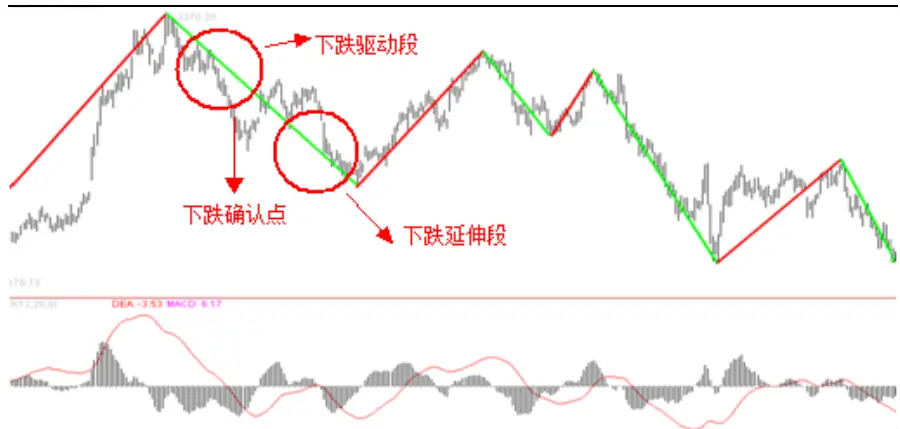
数据来源：国泰君安证券研究

在原有的基于MACD之DEA指标分段规则的基础上，我们基于上涨和下跌确认点，进一步将每一个波段划分为两部分。将在确认点之前的部分成为驱动段，确认点之后的部分作为延伸段。在实战中，在确认点出现之前，我们无法区分目前市场位于上一波段的延伸过程，亦或是一个新波段的驱动过程。可以确定的是，当确认点出现之后，市场将会处于波段的延伸过程中。而延伸段的长度正是实战中投资者所关心的焦点。因此，本文之后将会重点分析延伸段的幅度及相关影响因素，为实战应用提供坚实的基础。

## 2. 基于市场趋势的择时策略

证券价格由众多投资者的预期驱动，而不同投资者在趋势开始时的预期不尽相同。但是，随着价格的变动以至趋势的形成，部分投资者开始沿着价格变动的方向动态调整自己的预期，从而进一步推进了证券价格沿当前方向运行的动力。

具体来说，投资者修正预期是一个动态的过程。理论上，极强的市场有效性能够使市场反应所有信息，使得投资者在任意时刻都能达成一致预期。然而，在现实的证券市场，尤其是在中国等发展中国家的证券市场，市场有效性相对较弱，投资者获取信息的时间不同，对信息反应的幅度也不同，所以多数时候投资者会在一段时间内陆续修正预期，这就使得股票价格的运行存在惯性。

另一方面，证券市场存在显著的“过度反应”现象。当市场趋势形成之后，部分投资者跟随趋势进行投资。同时，投资者的跟随现象会加强投资者间的相互作用，形成自我实现，最终增强了趋势延伸的幅度。这就像《非理性繁荣》书中将一路涨升的股票市场称作“一场非理性的、自我驱动的、自我膨胀的泡沫”一样。此外，当市场处于极端状态的时候，投资者由于过度兴奋或恐慌，从而变的极端激进或保守，投资者共同的非理性投机形成了市场的暴涨和崩盘。

## 2.1.基于 30分钟级别趋势的择时效果

基于中国证券市场散户为主，趋势性较强的特点，本节构建了基于 30分钟级别趋势的择时策略。具体来说，一段趋势在确认之后通常会延当前方向进行延伸，在《基于 MACD 的价格分段应用举例》一文中，我们对波段特征做了详细统计。在波段确认形成后，上涨或下跌行情延续的概率高达 85%。因此，我们以上涨确认点作为买入点，以下跌确认点作为卖出点，构建择时策略。

策略优点在于，根据自主定义的价格分段规则，可以较好的判断上涨及下跌趋势。其次，利用分段规则进行策略构建可以避免择时策略常见的参数优化问题。但是，策略中有一个核心潜在假设，即一段上涨趋势的确认点要低于之后下跌趋势的确认点。否则，我们在上涨确认点买入，在下跌确认点卖出会导致亏损。因此，该策略的成功必须建立在一个大级别趋势向上的基础上，更适合 2007 年或 2014 年的趋势市。而在震荡市中，该策略盈利能力较弱。

根据以上介绍的策略逻辑，我们对上证综指进行了择时策略的构建和回测。从图2可以看出，策略自2003年至2015年末可获得约320%的绝对收益，而同期上证综指累计收益仅为 169%。可以看出，策略的主要收益来源于2008年和2014年2次大趋势择时的成功。可以看出，此策略较适合长期投资，在较长的时间跨度下，策略可以保证在大趋势来临时参与，而在市场震荡时可以得到不低于指数收益。

图 2 基于 30分钟级别趋势策略净值
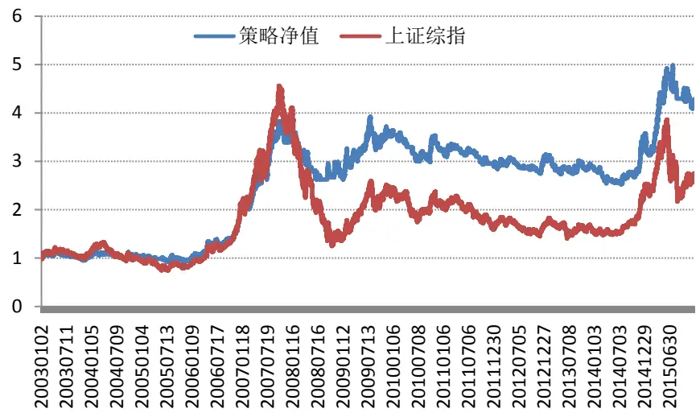
资料来源:国泰君安证券研究

## 2.2.引入级别连立效应对策略的提升效果

从 30 分钟级别趋势策略的净值图中（图 2）可以看出，策略在 2010 至2013 年的表现欠佳，基本没有明显的超额收益。具体来看，指数在2010～2013 年期间属于震荡走势，其特点为波段延伸幅度相对较小，且市场没有显著的运行方向。因此，策略在上涨趋势确认时的买入点可能会低于卖出点(下跌趋势确认点)，从而导致操作亏损。例如图3中所示，策略在 30 分钟级别上涨确认后发出买入信号，但之后随之而来的一波巨幅亏损。而我们观察其对应日线级别的位臵，从图4中可以明显看出，指数在日线级别还处于下跌趋势中， 且 DEA 指标离零轴较远，短期大概率不能形成上涨确认。因此，我们尝试进一步引入日线级别走势来提高策略整体的稳定性。

图3 30 分钟级别上涨确认
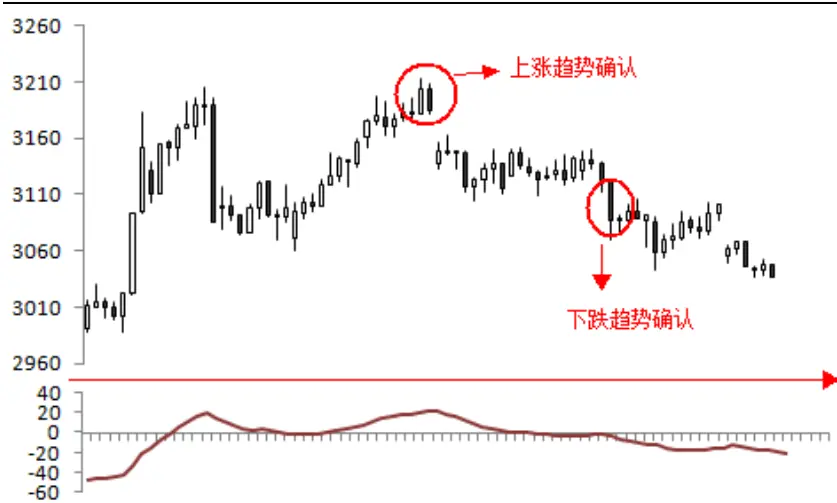
资料来源:国泰君安证券研究

图 4 日线级别下跌趋势中
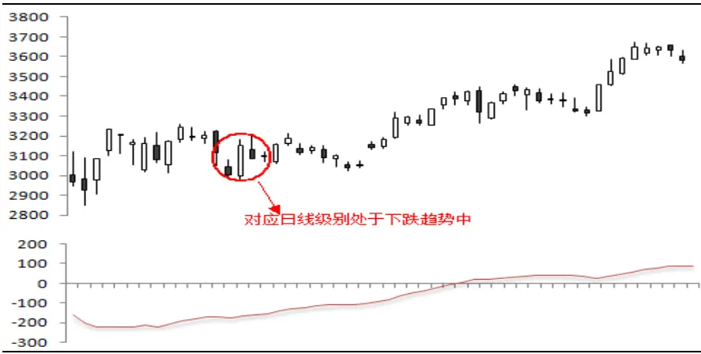
资料来源:国泰君安证券研究

首先，我们在日线级别的基础上扫描市场的上涨及下跌趋势确认点，进而将其对应到 30 分钟级别的走势中。在此基础上，我们仅在日线级别和30分钟级别都处于上涨确认的波段中做多，在其他时刻空仓。

引入日线级别趋势的优势在于，策略能够在市场处于日线级别下跌趋势时，避免进行短线操作。因此，改进后的策略能够较好的过滤掉 30分钟级别所蕴含的一些小级别反抽。

但是，引入日线级别趋势的缺点在于，策略整体对市场走势的敏感度有所下降，因此策略会错过类似于 2015 年 8 月底指数在几日内快速反弹的行情。

从图 5 中可以看出，引入日线级别作为辅助指标之后，策略自 2003 年以来的累计收益从 320%上升至 479%。整体来看，策略对大趋势的把握会更加精准。同时，策略在 2010～2013 年的震荡市依然有强于指数的表现。

图 5日线级别增强后的 30分钟级别趋势策略净值
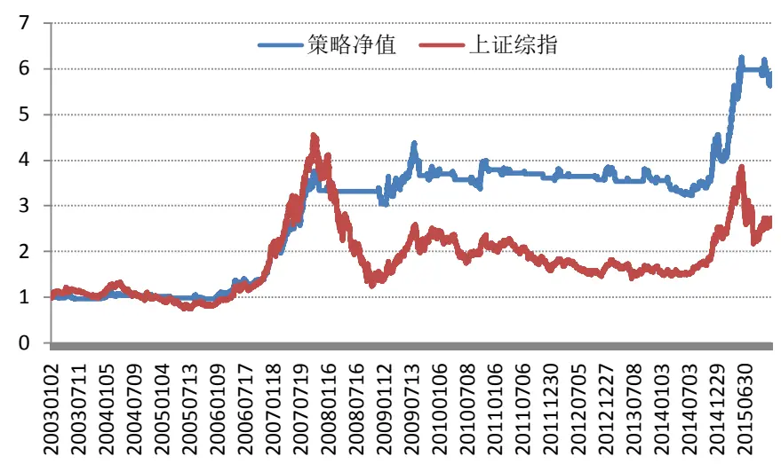
资料来源:国泰君安证券研究

总体来看，本文介绍的趋势择时策略能够在长期获得比市场指数更加显著的绝对收益。在短期，策略在绝大多数时候的表现都强于指数，且产生亏损的概率较小。因此，建议在指数被动投资或指数增强投资中纳入趋势策略的择时信号，在一定程度上避免市场下跌带来的风险。

## 3. 基于趋势延伸幅度的量化分析

从第2节基于市场趋势的择时策略可以看出，追逐市场趋势可以获得超越指数的可观收益。但是，策略效率还有很大的提高空间。其中，策略核心的局限性在于卖点难以把握，只是以下跌确认点作为卖出点会在一定程度上损失已有利润。因此，我们需要对卖出点有一个有效、准确的预测。接下来，本文将从驱动力、连续信息强度、前期动能、市场同质性等四个角度进行综合分析，以探究波段延伸幅度的影响因素。

## 3.1.驱动段对延伸幅度的影响

驱动段的涨跌幅度对延伸幅度影响显著。根据本文第一节中的定义，一个波段可基于其确认点进一步分为驱动段和延伸段两部分。从物理学的角度来说，相同质量的物体，驱动力越强，则物体延驱动方向运动的距离也就越长。本文就2003年以来的396个30分钟级别波段作为样本，对驱动段对延伸幅度的影响进行统计性检验，结果统计显著。

从表 1 中可以看出，驱动段收益的系数为 1.29，且 P 值小于 0.001，统计显著。换句话说，每当驱动段收益增加 1%，则延伸幅度上升1.297%。这从量化的角度为实战中预测目标点位以至拐点位臵提供了更加科学、精确的指示。从模型修正后 R 方来看，模型解释力度为38.25%，可见，驱动段的收益幅度对后续延伸幅度有显著的影响。但是，波段延伸幅度仍然会受到其他很多因素的影响。所以，我们仍需要寻找其他影响延伸幅度的因素，从而进一步提高模型的解释力度，提高预测的准确性。

## 延伸波段幅度=a+β1*驱动幅度

表 1 驱动段对延伸幅度的解释力度

| Ajusted-R方 | 38.25% |  |  |  |
| --- | --- | --- | --- | --- |
| 参数 | 系数 | 标准差 | T值 | P值 |
| 截距项 | -0.00562 | 0.00297 | -1.89 | 0.0592 |
| 驱动段收益 | 1.297029 | 0.0835 | 15.53 | <.0001 |

资料来源:国泰君安证券研究

## 3.2. 连续信息强度对延伸幅度的影响

从物体运动的角度可以看出，物体延当前方向行进的距离与之前施加的动力有关。而当我们在粗糙的桌面和光滑的桌面进行实验时，结果显然是不同的。所以，接下来我们进一步考虑市场摩擦力对延伸幅度的影响。

如何定义市场阻力是一个比较前沿的问题。本文从心理学角度出发，在Gino和Bazerman (2009) 的实验成果的基础上进行拓展。研究发现，相比突然发生的不道德行为，比如欺骗，人们对于循序渐进的发生的不道德行为的接受度更高，说明了温和缓慢的变化比巨大突然的变化引发的争议更小。在证券投资，投资者的心理亦是如此。正所谓“一根阳线改变信仰”，当股票价格在短时间内发生巨大波动时，原有的趋势形态将会受到质疑，从而影响到其未来的延续性。为了量化连续信息强度，我们引用 Zhi Da（2014）中的信息离散度作为代理变量，探究连续信息强度对延伸幅度的影响。

## 信息离散度 ID=sgn(rtn)×[%neg-%pos]

即 ID=观测期累计收益的正负号*（每日收益为负的占比-每日收益为正的占比）

ID 值大代表信息是离散的，ID 值小代表信息是连续的。例如，观测期收益为正，较高比例的正收益（%pos>%neg），即较小的 ID 值，表示累计收益是由许多小的正收益组成的。如果一系列的收益都为正，则ID 值则为最小值-1，信息是连续的。如果累计收益只是由少数大的正收益和许多负收益组成，则 ID 值接近最大值+1，信息是离散的。

连续信息强度越高，波段延伸幅度越大。从表2中可以看出，在原有的模型中加入连续信息强度之后，模型解释力（Ajusted-R-square）上升至40.25%。其中，连续信息强度的系数为-0.037，P 值为 0.0002，统计显著。从结果来看，每当连续信息强度提高 0.1，则波段延伸幅度提高0.37%。这与我们预期相同，当信息更加连续的时候，波段延伸的阻力也就越小，相应的延伸幅度也就越长。整体来说，引入连续信息强度进一步提高了模型预测的精度，同时也从一个新的角度完善了整个预测的逻辑。

延伸波段幅度=a+β1*驱动幅度+β2*连续信息强度

表 2 连续信息强度对延伸幅度的解释力度

| Ajusted-R方 | 40.25% |  |  |  |
| --- | --- | --- | --- | --- |
| 参数 | 系数 | 标准差 | T值 | P值 |
| 截距项 | -0.0056 | 0.00297 | -1.89 | 0.0592 |
| 驱动段收益 | 1.297 | 0.0835 | 15.53 | <.0001 |
| 连续信息强度 | -0.037 | 0.0101 | -3.74 | 0.0002 |

资料来源:国泰君安证券研究

## 3.3. 前期市场趋势动能对延伸幅度的影响

证券价格是有投资者交易自身预期合力完成的，换言之，证券价格体现的是投资者预期的变化。而投资者的心理预期是连续变化的，也就是说预期具有一定的记忆性。因此，市场前期趋势动能如果很强的话，就会对投资者心理会产生较深的烙印。举例来说，市场在小幅下跌的波段之后更容易出现大幅上涨的行情。相比之下，暴跌之后立即大幅反转的概率较小，多数时候会横盘调整一段时间。因此，下面我们将进一步探索滞后一阶波段的驱动力是否会对下一波段走势产生影响。基于此前的模型，我们加入前一波段的驱动幅度作为前期趋势动能的代理变量。

前期趋势动能越强，波段延伸幅度越小。从表3中可以看出，纳入前期趋势动能变量后，模型解释力（Ajusted-R-square）进一步上升至43.81%。其中，前期趋势动能的系数为-0.87，P 值小于 0.0001，统计显著。这意味着每当前期趋势动能增加1%，当下波段延续的幅度将减少0.87%。这个结果与我们的假设一致，前期趋势越强，则当下波段的延续越差。

此外，当我们引入前期趋势动能之后，从表3 中可以看到驱动段收益的P 值有所上升，这体现出两个变量间有一定相关性。可以看出，前期趋势动能不仅对当下波段延伸幅度有影响，也对当下波段的驱动力有一定影响。

延伸波段幅度=a+β1*驱动幅度+β2*连续信息强度+β3*lag(驱动幅度)

表 3 前期动能对延伸幅度的解释力度

| Ajusted-R方 | 43.81% |  |  |
| --- | --- | --- | --- |
| 参数 | 系数 | 标准差 | T值 P值 |
| 截距项 | 0.00006 | 0.00306 | 0.02 0.983 |
| 驱动段收益 | 0.23072 | 0.1872 | 1.23 0.2185 |
| 连续信息强度 | -0.0345 | 0.00982 | -3.52 0.0005 |
| 前期趋势动能 | -0.87029 | 0.1725 | -5.04 <.0001 |

资料来源:国泰君安证券研究

## 3.4. 市场同质性对延伸幅度的影响

到目前为止，我们对价格走势的研究较为宏观，变量都是基于上证综指价格本身衍生而来，并未考虑指数内部成分股的活动特征。然而，指数上涨或下跌时的微观结构特征对当下趋势的动能消耗有显著影响。这就好比一个人上楼梯，左右脚轮换走20层比双腿向上跳 20层消耗的体力要小的多。回到证券市场，指数成份股轮动上涨驱动的行情对资金的消耗更加平滑，相比所有股票一致上涨的行情有更强的延续性。而如何量化市场行为的一致性是我们接下来需要研究的一个问题。

资本资产定价模型(CAPM)作为证券定价的经典模型，将个股收益分解为市场收益及个股特质收益率。当个股特质收益率较低时，表明股票收益主要由市场收益驱动。相对地，当个股特质收益率较高时，则说明个股受市场影响较小，而此时不同个股之间走势差异性较大。因此，我们基于CAPM模型，将市场收益对个股进行回归，所得的R-square即是市场收益对个股收益的解释程度。R-square 越高，则代表个股走势是由市场行情驱动。相反地，R-square 越低，则代表市场收益对个股的解释力越低。在此基础上，我们以 40 个交易日作为移动窗口，对市场上所有个股分别进行回归，得到每只个股每日的 R-square。随后，我们对每日所有个股的R-square求得算术平均。

图 6 R-square 的历史变化
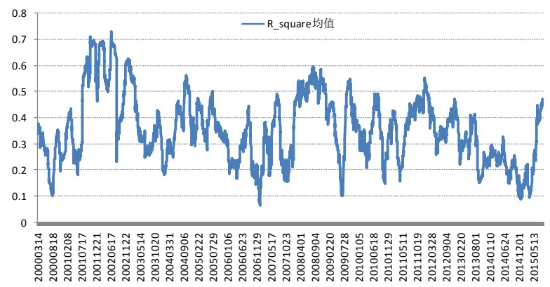
资料来源：国泰君安证券研究

从图6可以看出，所有个股的平均R-square长期进行均值回复的过程。这与 A 股市场特征吻合，在重大利好或趋势性机会的刺激下下，个股之间的同质性上升，体现为同涨同跌。在市场处于震荡或相对缓慢的趋势中时，个股之间同质性下降，体现为不同主题和板块轮动上涨或下跌，从而驱动指数上涨或下跌。

R-square 的均值越高，代表个股受市场影响越显著，个股之间走势差异越小，这也就体现为所有个股同步上涨。相对地，R-square 的均值低代表个股走势同质性较低，整个市场的趋势是由个股轮番驱动的。结合我们之前的猜想，板块或热点轮番驱动所产生的趋势消耗的动能更小，趋势延伸幅度更长。我们接下来将探究R-square均值的大小是否能对趋势的延伸幅度产生影响。

市场同质性越高，波段延伸幅度越小。从表4中可以看出，纳入市场同质性变量后，模型解释力（Ajusted-R-square）上升至 44.86%。其中，市场同质性变量的系数为-0.052，P 值为 0.049，在 5%的显著性水平下统计显著。也就是说，每当市场同质性指标增加 1%，当前波段延续的幅度将减少 0.052%。这个结果与我们的假设相符，市场同质性越高，趋势动能消耗的越快，从而导致当下波段的延续幅度变小。

总体来看，在加入市场同质性变量后，其他变量的P值并没有受到显著影响。模型整体的解释力度接近 45%，这使得我们对延伸幅度的预测更加准确。

延伸波段幅度=a+β1*驱动幅度+β2*连续信息强度+β3*lag(驱动幅度)+β4*lag(市场同质性)

市场同质性：所有个股基于 CAPM模型回归所得R方的算术平均回归样本窗口：40个交易日

表 4 对冲不同指数后净值走势

| Ajusted-R方 | 44.86% |  |  |
| --- | --- | --- | --- |
| 参数 | 系数 | 标准差 | T值 P值 |
| 截距项 | 0.017634 | 0.00923 | 1.91 0.0568 |
| 驱动段收益 | 0.246399 | 0.1959 1.26 | 0.2092 |
| 连续信息强度 | -0.03263 | 0.00987 | -3.3 0.001 |
| 前期趋势动能 | -0.90134 | 0.1828 | -4.93 <.0001 |
| 亩场同质性 | -0.05231 | 0.0265 | -1.98 0.049 |

资料来源：国泰君安证券研究

## 4. 基于趋势延伸的择时策略

## 4.1.趋势延伸幅度在历年稳定性

在第三节中，我们详细探究了影响波段延伸幅度的主要原因。然而，这一切都是为了对实战中的股价预测提供支持。所以，我们接下来初步尝试利用模型进行外推，来测算一下预测延伸幅度与真实延伸幅度的差异大小。

在进行外推之前，我们需要确保各个变量对延伸幅度回归的显著性在不同的市场阶段中都处于一个相对稳定的状态。首先，我们根据市场的历史特征，将市场运行阶段人工分为 4 个部分，分别为 2005 年前、2005~2008、2009~2012、2013 年至今。然后，分别在不同阶段对驱动幅度及连续信息强度进行回归，观察系数的显著性。

从表5中可以看出，驱动幅度系数在4个时间段的P值都极小，统计显著。然而，系数值在不同时期却发生了较为明显的变化。具体来看，驱动幅度对延伸幅度的影响系数呈递减趋势。从图7中也可以看到，模型对延伸幅度的解释力（Ajusted-R-square）也逐年下降。这体现出中国市场有效性在近年来有所提高，市场羊群效应减弱，驱动幅度对后续延伸幅度的影响有所降低。

如表 6 所示，连续信息强度的系数在 2005 年前的显著水平相对较低。但整体来看，连续信息强度的系数值在4个阶段皆为负，且在最近两个阶段较为稳定。

表 5 驱动幅度系数稳定性

|  | 2005年前 | 2005~2008 | 2009~2012 | 2013至今 |
| --- | --- | --- | --- | --- |
| 系数 | 1.398 | 0.925 | 0.770 | 0.847 |
| P值 | <.0001 | <.0001 | 0.0003 | 0.0024 |

资料来源:国泰君安证券研究

图 7 模型解释力度呈递减趋势
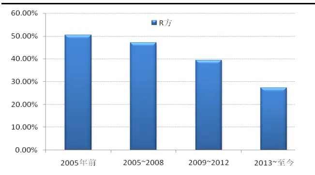
资料来源:国泰君安证券研究

表 6 连续信息强度系数稳定性

|  | 2005年前 | 2005~2008 | 2009~2012 | 2013至今 |
| --- | --- | --- | --- | --- |
| 系数 | -0.0034 | -0.0712 | -0.0380 | -0.0342 |
| P值 | 0.8456 | 0.0037 | 0.0116 | 0.0379 |

资料来源:国泰君安证券研究

## 4.2. 趋势预测模型评估

由于变量的载荷在样本数减少的情况下可能会产生较大的变动，从简化模型的复杂度、提高模型的适用性的角度出发，我们只选取驱动幅度和连续信息强度作为自变量，对延伸幅度进行预测。回归系数的观测期采取过去30 个波段。

我们以所有的391个波段为样本，滚动30日个波段作为观测期，对361个波段进行了模型预测。具体如图 8 所示，181 个下跌波段平均预测延伸幅度为3.82%，而真实延伸幅度的均值为 4.384%。相比之下，180个上涨波段平均预测延伸幅度为 4.231%，对应真实延伸幅度的均值为4.439%。可以看出，预测值与真实值比较接近。其中，上涨趋势的预测精度要高于下跌趋势的预测精度。这也符合中国的证券市场特征，当投资者陷入暴跌的恐慌中时，往往会形成挤兑，导致更深的跌幅。

图 8 预测与实际的差距
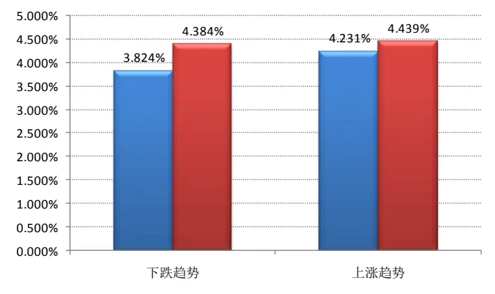
资料来源:国泰君安证券研究

为了进一步测试模型预测的精度，我们分别测算了上涨波段和下跌波段预测值与真实值偏差的方差。从图9中可以看出，下跌波段的方差为6.2%，而上涨波段的方差相对较小，具体值为 5.77%，这同样与投资者在下跌中的恐慌情绪导致的过度反应现象吻合。

但是，整体来看，预测值与真实值的方差在绝对值上依然属于比较高的水平。从图 9 和图 10 中可以看出，预测失准时偏差虽然较大，但其出现的次数并不多。考虑到市场实际情况，当市场处于极端情况时，模型可能会失效，从而产生预测偏差的极端值，影响模型整体评估结果。所以，我们进一步尝试观察剔除模型预测偏离度较大的10%样本后的预测偏离度。从图11和图12 中可以看出，在剔除模型极端值后，模型预测偏差显著减小，基本维持在3%以内。

整体来看，如图 13 所示，剔除前 10%和后 10%的极端值后，下跌波段的预测偏差为 2.49%，上涨波段为 2.21%。可以看出，模型在极端市场以外的绝大多数时间，预测精度相对较高。

图 9下跌波段预测偏差
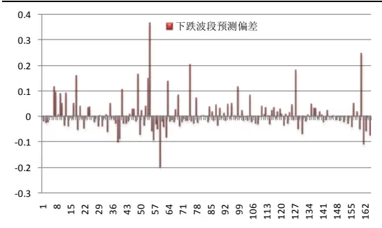
数据来源：国泰君安证券研究

图 10上涨波段预测偏差
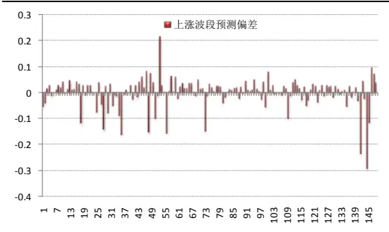
数据来源：国泰君安证券研究

图 11剔除异常值后下跌预测偏差
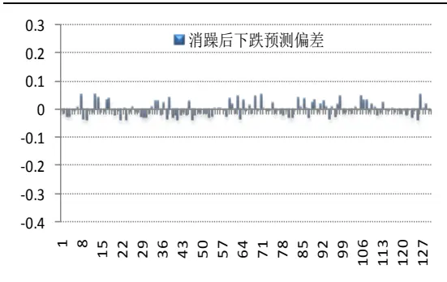
数据来源：国泰君安证券研究

图 12剔除异常值后上涨预测偏差
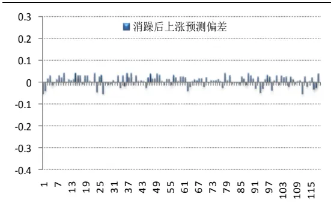
数据来源：国泰君安证券研究

图 13 预测偏离度
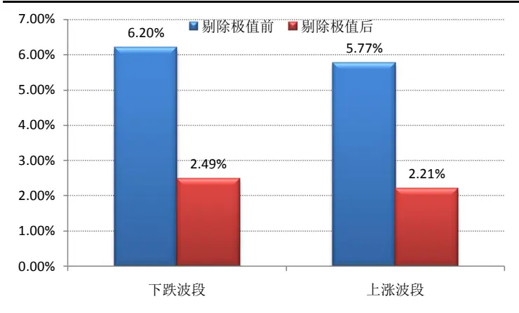
资料来源:国泰君安证券研究

## 5. 总结与后续研究展望

本文认为择时方面研究的核心目的在于两个方面。一方面，择时研究需要为投资者提供有效的信号，为投资操作提供支持。而更重要的是，择时研究能够提高投资者对市场价格走势的理解，增加投资者在未来对价格判断的准确度，提高投资的灵活性。而本文认为后者是择时策略的核心，对市场有更加深入、系统、有效的理解和判断才是择时研究的制胜之道。

具体来说，本文的贡献主要在于三个方面。首先，本文基于市场运行趋势，提供了一个简单有效的择时策略，为投资者提供了一个长期成功、有效的投资模式。此外，本文的另一个重要贡献在于开创了基于趋势延伸度的分析方法，开启可择时研究的新思路。其中，本文从学术研究的角度出发，引入驱动力、连续信息强度、前期动能、市场同质性等多个因素对趋势延伸度进行了深入分析。在此基础上，本文尝试将模型进行外推，且效果显著，这对日后择时方面的实战应用提供了坚实的基础。

在现有模型的基础上，我们未来将继续尝试从其他逻辑角度纳入新的影响因素，对波段的延伸幅度进行更加深入分析，从而进一步提高模型的预测能力。

## 本公司具有中国证监会核准的证券投资咨询业务资格

## 分析师声明

作者具有中国证券业协会授予的证券投资咨询执业资格或相当的专业胜任能力，保证报告所采用的数据均来自合规渠道，分析逻辑基于作者的职业理解，本报告清晰准确地反映了作者的研究观点，力求独立、客观和公正，结论不受任何第三方的授意或影响，特此声明。

## 免责声明

本报告仅供国泰君安证券股份有限公司（以下简称“本公司”）的客户使用。本公司不会因接收人收到本报告而视其为本公司的当然客户。本报告仅在相关法律许可的情况下发放，并仅为提供信息而发放，概不构成任何广告。

本报告的信息来源于已公开的资料，本公司对该等信息的准确性、完整性或可靠性不作任何保证。本报告所载的资料、意见及推测仅反映本公司于发布本报告当日的判断，本报告所指的证券或投资标的的价格、价值及投资收入可升可跌。过往表现不应作为日后的表现依据。在不同时期，本公司可发出与本报告所载资料、意见及推测不一致的报告。本公司不保证本报告所含信息保持在最新状态。同时，本公司对本报告所含信息可在不发出通知的情形下做出修改，投资者应当自行关注相应的更新或修改。

本报告中所指的投资及服务可能不适合个别客户，不构成客户私人咨询建议。在任何情况下，本报告中的信息或所表述的意见均不构成对任何人的投资建议。在任何情况下，本公司、本公司员工或者关联机构不承诺投资者一定获利，不与投资者分享投资收益，也不对任何人因使用本报告中的任何内容所引致的任何损失负任何责任。投资者务必注意，其据此做出的任何投资决策与本公司、本公司员工或者关联机构无关。

本公司利用信息隔离墙控制内部一个或多个领域、部门或关联机构之间的信息流动。因此，投资者应注意，在法律许可的情况下，本公司及其所属关联机构可能会持有报告中提到的公司所发行的证券或期权并进行证券或期权交易，也可能为这些公司提供或者争取提供投资银行、财务顾问或者金融产品等相关服务。在法律许可的情况下，本公司的员工可能担任本报告所提到的公司的董事。

市场有风险，投资需谨慎。投资者不应将本报告作为作出投资决策的唯一参考因素，亦不应认为本报告可以取代自己的判断。
在决定投资前，如有需要，投资者务必向专业人士咨询并谨慎决策。

本报告版权仅为本公司所有，未经书面许可，任何机构和个人不得以任何形式翻版、复制、发表或引用。如征得本公司同意进行引用、刊发的，需在允许的范围内使用，并注明出处为“国泰君安证券研究”，且不得对本报告进行任何有悖原意的引用、删节和修改。

若本公司以外的其他机构（以下简称“该机构”）发送本报告，则由该机构独自为此发送行为负责。通过此途径获得本报告的投资者应自行联系该机构以要求获悉更详细信息或进而交易本报告中提及的证券。本报告不构成本公司向该机构之客户提供的投资建议，本公司、本公司员工或者关联机构亦不为该机构之客户因使用本报告或报告所载内容引起的任何损失承担任何责任。

## 评级说明

## 1.投资建议的比较标准

投资评级分为股票评级和行业评级。

以报告发布后的12个月内的市场表现为比较标准，报告发布日后的 12个月内的公司股价（或行业指数）的涨跌幅相对同期的沪深 300 指数涨跌幅为基准。

## 2.投资建议的评级标准

报告发布日后的 12 个月内的公司股价（或行业指数）的涨跌幅相对同期的沪深 300 指数的涨跌幅。

|  | 评级 | 说明 |
| --- | --- | --- |
| 股票投资评级 | 增持 | 相对沪深300指数涨幅15%以上 |
|  | 谨慎增持 | 相对沪深300指数涨幅介于5%～15%之间 |
|  | 中性 | 相对沪深300指数涨幅介于-5%～5% |
|  | 减持 | 相对沪深 300 指数下跌 5%以上 |
| 行业投资评级 | 增持 | 明显强于沪深 300 指数 |
|  | 中性 | 基本与沪深 300指数持平 |
|  | 减持 | 明显弱于沪深300指数 |

## 国泰君安证券研究

|  | 上海 | 深圳 | 北京 |
| --- | --- | --- | --- |
| 地址 | 上海市浦东新区银城中路168号上海 银行大厦29层 | 深圳市福田区益田路 6009 号新世界 商务中心34层 | 北京市西城区金融大街28 号盈泰中 心2号楼10层 |
| 邮编 | 200120 | 518026 | 100140 |
| 电话 | (021)38676666 | （0755)23976888 | (010)59312799 |
| E-mail: gtjaresearch@gtjas.com |  |  |  |