inInfo] [Table_Title] 2016.03.01

# 如何将阿尔法因子转化为超额收益（上）

## －－数量化专题之六十八

刘富兵（分析师）

## 李辰（研究助理）

8 021-38676673

021-38677309

liufubing008481@gtjas.com

lichen@gtjas.com

证书编号 S0880511010017

S0880114060025

## 本报告导读：

本系列报告将重点阐述阿尔法因子与风险模型相结合的应用问题，力争使策略在风险精确可控的前提下获得更高的超额收益率。

## 摘要：

le_Summary]阿尔法因子与风险模型结合的理念是希望通过阿尔法因子创造超额收益，同时通过风险模型控制组合风险暴露与跟踪误差，两者相辅相成，最终实现组合稳健战胜市场基准的效果。

最小波动纯因子组合（Minimum Volati l ity Pure Factor）反应且仅反应了目标因子的收益风险特征，是检验阿尔法因子的最完备组合，可真正意义上判断因子是否具备阿尔法属性。

通过定义基于风险模型的阿尔法因子检验的一般流程，我们对若干阿尔法因子的组合特征进行了统计，找到了包括YOY_EPS、 REVERSE、Est PB、MOM Est EPS、DISPERSION、HTOS、MOM ROE、RATEUP、Earnings Yield和 Liquidity在内的10类阿尔法因子。

- 因子收益率的预测是阿尔法端的重要问题， 利用$\hat{f}_{_{alpha}}=IR\cdot\hat{\sigma}_{_{alpha}}^{^{m\nu pfp}}$ 的思想，我们实现了对阿尔法因子收益率的定量预测。在与另外两种基础方法的比较中，我们发现该方法对阿尔法因子收益率的预测偏差较小，预测精度最为理想。

- 然而找到有效的阿尔法因子与最终实现阿尔法因子所包含的超额收益还有着本质的区别，本系列报告将回答如何将阿尔法因子转化为超额收益的几个重要问题。

- 当前市场环境对量化对冲、市场中性策略而言比较困难，因此我们也会将策略重点臵于基于成分股权重优化的指数增强型策略以及小规模的阿尔法对冲策略的实证研究。

- 阿尔法超额收益的实现是一项十分精密的工作，本系列报告希望能对仍然坚守在阿尔法阵营的投资者所有启发帮助，静待市场环境恢复常态。

金融工程

## 金融工程团队：

刘富兵：（分析师）

电话：021-38676673

邮箱：liufubing008481@gtjas.com

证书编号：S0880511010017

刘正捷：（分析师）

电话：0755-23976803

邮箱：liuzhengjie012509@gtjas.com

证书编号：S0880514070010

## 李雪君：（分析师）

电话：021-38675855

邮箱：lixuejun@gtjas.com

证书编号：S0880515070001

王浩：（研究助理）

电话：021-38676434

邮箱：wanghao014399@gtjas.com

证书编号：S0880114080041

## 陈奥林：（研究助理）

电话：021-38674835

邮箱：chenaolin@gtjas.com

证书编号：S0880114110077

李辰：（研究助理）

电话：021-38677309

邮箱：lichen@gtjas.com

证书编号：S0880114060025

## [Table_R相关报告

《择时新视角：捕捉趋势中的绝对收益》2016.01.18

《商誉：外延式成长的烦恼》2016.01.16

《指数投资新时代》2015.11.20

《期权在投资中的应用》2015.11.18

《基于交易层面的交易公开信息再探索》2015.08.22

## 1. 引言

在前一系列专题报告《基于组合权重优化的风格中性多因子选股策略》、《中证500之阿尔法验金石》以及《如何控制跟踪误差》中，我们较为系统的阐述了基于A 股市场结构化多因子风险模型的构建思路，刻画了A 股市场的风险结构。并且，在此基础上，我们进一步利用组合权重优化的方法构建了基于市场中性、行业中性、风格中性以及组合跟踪误差控制约束下的最优投资组合，取得了较为稳定的超额收益。

自2015年4 月策略样本外跟踪以来，截止2016年2月22日：

相对沪深300指数累积超额收益13.5%，最大回撤4.26%，信息比率2.10。

相对中证500指数累积超额收益34.2%，最大回撤3.80%，信息比率3.45。

图 1 相对沪深 300指数累积超额收益：
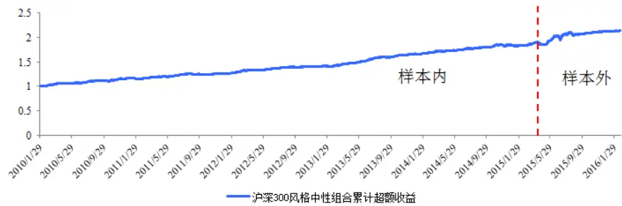
数据来源：国泰君安证券研究

图 2 相对中证 500指数累积超额收益：
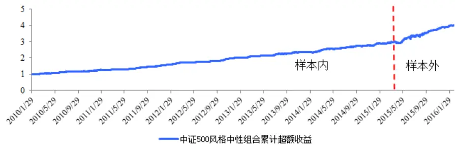
数据来源：国泰君安证券研究

自 2015 年 9 月策略增加跟踪误差控制样本外跟踪以来，截止 2016 年 2月 22 日：

相对沪深300指数累积超额收益 4.1%，设定跟踪误差 3%，实际实现跟踪误差3.01%，最大回撤0.63%，信息比率 3.02。

相对中证 500 指数累积超额收益 16.8%，设定跟踪误差 5%，实际实现跟踪误差6.5%，最大回撤 2.11%，信息比率 5.29。

图 3 组合增加跟踪误差控制后样本外相对沪深300指数累积超额收益：
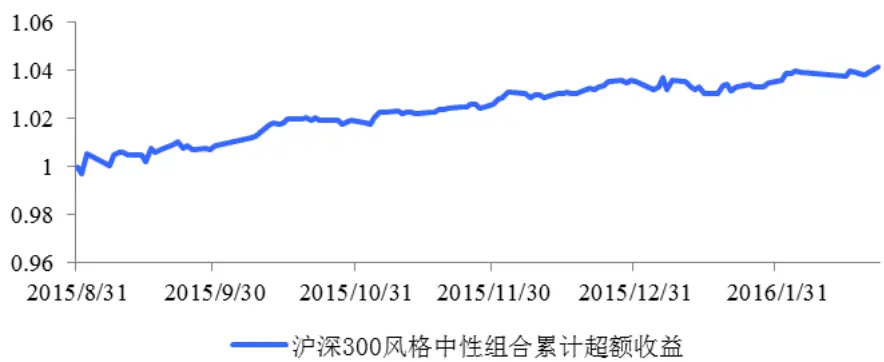
数据来源：国泰君安证券研究

图 4 组合增加跟踪误差控制后样本外相对中证500指数累积超额收益：
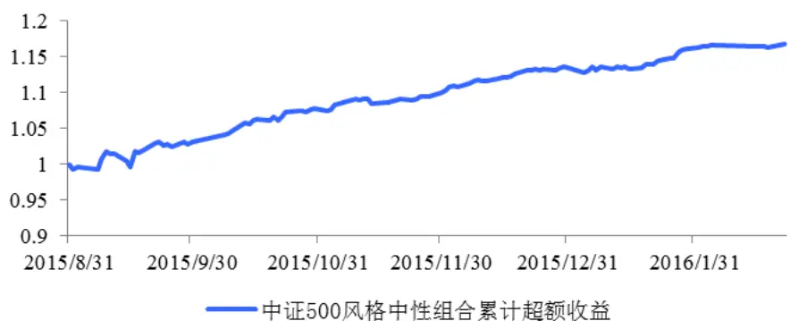
数据来源：国泰君安证券研究

本系列报告《如何将阿尔法因子转化为超额收益》将在原有风险模型的基础上，重点阐述阿尔法因子与风险模型相结合的应用问题，力争使策略在风险精确可控的前提下获得更高的超额收益率。

我们将从阿尔法因子的组合特征分析着手，给出基于风险模型的阿尔法因子构造和检验的一般流程，并进一步对阿尔法因子收益率进行定量的预测。然而，找到有效的阿尔法因子与最终实现阿尔法因子所包含的超额收益还有着本质的区别，我们将在本系列报告的研究中回答如何将阿尔法因子转化为超额收益的几个重要问题，例如：1）影响阿尔法因子实际暴露的几个因素；2）是否需要将阿尔法因子加入风险矩阵；3）风险模型对阿尔法因子收益率的损耗及最优跟踪误差设定等。

当前市场环境对量化对冲、市场中性策略而言比较困难，因此我们也会将策略重点臵于基于成分股权重优化的指数增强型策略以及小规模的阿尔法对冲策略的实证研究。

本篇报告作为系列报告的上篇部分，将主要重点放在阿尔法与超额收益转换的基础工作，即阿尔法因子的定义与寻找上。在第二章中，我们将阐述阿尔法因子与风险模型相结合的组合构建理念；第三章，我们将定义并分析阿尔法因子的组合特征；第四章，我们将给出一些常见并且稳定的阿尔法因子及其组合特征统计；第五章，我们将利用最小波动率纯因子组合的性质，对阿尔法因子收益率进行定量的预测。

## 2. 阿尔法因子与风险模型

## 2.1. 阿尔法

对于主动投资组合管理人而言，阿尔法代表了超越市场基准的机会，而阿尔法因子则代表了包含战胜市场基准的一系列信息。通常，主动投资经理会通过选取一个或者若干个阿尔法因子构建投资组合，以期望阿尔法因子所包含的超额收益信息可以使得组合最终战胜市场。然而，想要持续稳定的获取阿尔法超额收益并不是一件容易的事情，这是一项十分精密的工作。而这其中，有一个本质的问题需要回答，即组合获得的超额收益率是否真的来自于投资经理选择的阿尔法因子逻辑。换言之，究竟是阿尔法因子组合战胜了市场基准，还是其他因素导致，亦或仅仅只是运气？

想要回答这个问题，必须从阿尔法因子的本质着手，即一个所谓的阿尔法因子究竟如何定义？一个阿尔法因子究竟包含了怎样的信息？如何才能深入本质的探究一个纯粹的阿尔法因子？

对于第一个问题，如何定义阿尔法因子，我们在《基于组合权重优化的风格中性多因子选股策略》中，已经有了相关定性的阐述，即所谓阿尔法因子，是对股票收益率具有显著且稳定影响的某一变量，同时该影响是剔除其余所有因子对收益的作用而独立存在的。其中，显著性、稳定性与独立性是阿尔法因子定义的 3个必要条件。

而对于后面两个问题，即阿尔法因子包含的信息和如何探究纯粹的阿尔法因子则更为关键。这两个问题的答案是实现将阿尔法因子转化为超额收益率的基础，我们亦将在后续的章节中，从阿尔法因子的组合特征分析角度给出问题的一些答案。

## 2.2. 风险模型

风险模型是组合投资中必不可少的一部分。自马科维茨开创组合均值方差理论体系以来，组合的风险建模始终就是学术界和投资界共同研究的经典问题。此后，结构化多因子风险模型应运而生，结构化风险模型以一系列风险因子为基础，并利用风险因子收益率之间的波动性来刻画组合风险，取得了较大突破。

风险模型的意义在于定量的去解释股票组合价格的波动成因，而其在实际应用层面的主要作用就是预测并控制组合的实际风险暴露以及收益的波动率。从属性上而言，风险模型中的风险因子与之前提到的阿尔法因子就有着本质的区别。风险模型的目的是为了对组合波动率进行建模，因此风险因子的属性应该以刻画稳定的组合波动率为优先考虑，因子收益率的显著波动性是衡量风险因子的重要标准。而阿尔法因子则恰恰相反，在阿尔法因子的3 个属性中，以稳定性为优先考虑。

在《基于组合权重优化的风格中性多因子选股策略》中，我们利用 30类行业因子和9类风格因子较为完整的刻画了A股市场的风险结构。结构化多因子风险模型首先对收益率进行简单的线性分解，对于第 j 只股票收益的分解形式可以表示为：

$$
r_{_j}=x_{_1}f_{_1}+x_{_2}f_{_2}+x_{_3}f_{_3}+x_{_4}f_{_4}...x_{_K}f_{_K}+u_{_j}
$$

其中，r 表示第 j 只股票的收益率； $r_{j}$ $x_{\scriptscriptstyle k}$ 表示第 $j$ 只股票在第 $k$ 个因子上的暴露（也称为因子载荷）； $\boldsymbol{f}_{k}$ 表示第 j 只股票第k 个因子的因子收益率（即每单位因子暴露所承载的收益率）；u 表示第 j 只股票的特质因 $\boldsymbol{u}_{\ j}$ 子收益率。

那么对于一个包含 N 只股票的投资组合，假设组合的权重为$w={(w_{1},w_{2},...,w_{_{N}})}^{T}$ ，那么组合收益率可以表示为：

$$
R_{_{P}}=\sum_{j=1}^{N}w_{_n}\cdot(\sum_{k=1}^{K}x_{_{jk}}f_{_k}+u_{_j})
$$

假设每只股票的特质因子收益率与共同因子收益率不相关，并且每只股票的特质因子收益率也不相关。那么在上述表达式的基础上，可以得到组合的风险结构为：

$$
\sigma_{{}_{P}}=\sqrt{w^{\textit{ T }}(XFX^{\textit{ T }}+\Delta)w}
$$

其中，X 表示N 只个股在K 个风险因子上的因子载荷矩阵 $(N\times K)$

$$
\begin{array}{r}{\left[\begin{array}{llll}{x_{1,1}}&{x_{1,2}}&{\dots}&{x_{1,k}}\\{\vert}&{}&{}&{}\\{x_{2,1}}&{x_{2,2}}&{\dots}&{x_{2,k}}\end{array}\right]}\\{X=\left[\begin{array}{llll}{x_{2,1}}&{}&{}&{}\\{}&{}&{}\\{\dots}&{\dots}&{\dots}&{\dots}&{\dots}\\{}&{}&{}&{}\\{x_{n,1}}&{x_{n,2}}&{\dots}&{x_{n,k}}\end{array}\right]}\end{array}
$$

F 表示K 个因子的因子收益率协方差矩阵 $(K\times K$ )：

$$
\begin{array}{c}\begin{array}{c}\begin{array}{ccccc}{{\displaystyle\prod_{i}^{}{Var}(f_{1})}}&{{Co\nu(f_{1},f_{2})}}&{{...}}&{{Co\nu(f_{1},f_{k})}}\\{{\displaystyle\prod_{}^{}{Co\nu(f_{1},f_{2})}}}&{{Var(f_{2})}}&{{...}}&{{Co\nu(f_{2},f_{k})}}\\{{\displaystyle\hfill\begin{array}{cccccc}{{\hfill}{}}\\{{\ldots}}\\{{\ldots}}\\{{\bigcup_{}{Co\nu(f_{k},f_{1})}}}&{{Co\nu(f_{k},f_{2})}}&{{...}}&{{\ldots}}\end{array}}}&{{\displaystyle\bigcup_{ar}\Gamma_{k}(f_{k})}}\end{array}\\{{\nonumber\begin{array}{ccccc}{{\longrightarrow}}\\{{\longrightarrow}}\\{{\longrightarrow}}\\{{{Co\nu(f_{k},f_{2})}}}\\{{\rule{0ex}{5ex}}}\end{array}}}&{{\longrightarrow}}&{{\begin{array}{ccccc}{{\longrightarrow}}\\{{\longrightarrow}}\\{{\begin{array}{ccccc}{{\longrightarrow}}\\{{\longrightarrow}}\\{{\ldots}}\\{{[{Co\nu(f_{k},f_{2})}}}\end{array}}}&{{[\begin{array}{ccccc}{{}}\\{{}}\\{{}}\end{array}]}}&{{\cdots}}\end{array}}}&{{[\begin{array}{ccccc}{{}}\\{{}}\\{{}}\\{{}}\\{{}}\end{array}]}}\end{array}\end{array}
$$

Δ表示N 只股票的特质因子收益率协方差矩阵(N×N):

$$
\begin{array}{cccccc}{{}}&{{\stackrel{\textstyle\bigcap}{}}}&{{Var(u_{1})}}&{{}}&{{0}}&{{}}&{{\ldots}}&{{}}&{{0}}\\{{\stackrel{\textstyle\bigcap}{}}}&{{}}&{{}}&{{}}&{{}}&{{}}&{{}}&{{}}\\{{\Delta\stackrel{\textstyle\bigcap}{}}}&{{0}}&{{}}&{{Var(u_{2})}}&{{}}&{{\ldots}}&{{}}&{{0}}\\{{\stackrel{\textstyle\bigcap}{}}}&{{}}&{{}}&{{}}&{{}}&{{\ldots}}&{{}}&{{\ldots}}\\{{\stackrel{\textstyle\bigcap}{}}}&{{}}&{{}}&{{}}&{{}}&{{}}&{{\ldots}}&{{}}\\{{\stackrel{\textstyle\bigcup}{}}}&{{0}}&{{}}&{{0}}&{{}}&{{\ldots}}&{{}}&{{Var(u_{k})}}\end{array}
$$

其中假设每只股票的特质因子收益率相关性为0，因此• 为对角阵。

行业分类方面，我们在申万一级 28 个行业分类的基础上，将非银金融行业划分为证券、保险和多元金融 3 个子行业，共计 30 个行业因子，具体为:

表 1: 行业因子分类

| 交通运输 | 休闲服务 | 传媒 | 公用事业 | 农林牧渔 | 化工 |
| --- | --- | --- | --- | --- | --- |
| 医药生物 | 商业贸易 | 国防军工 | 家用电器 | 建筑材料 | 建筑装饰 |
| 房地产 | 有色金属 | 机械设备 | 汽车 | 电子 | 电气设备 |
| 纺织服装 | 综合 | 计算机 | 轻工制造 | 通信 | 采掘 |
| 钢铁 | 银行 | 证券 | 保险 | 多元金融 | 食品饮料 |

数据来源：国泰君安证券研究

风格因子分类方面，模型总共包含9大类因子、20个小因子，其中大类因子包含 Beta、Momentum、Size、Earnings Yield、Volatility、Growth、Value、Leverage 和 Liquidity，具体为：

表 2: 风格因子分类构建

| 大类 因子 | 小类 因子 | 因子计算方式 |
| --- | --- | --- |
| Beta | BETA | $\boldsymbol{r}_{i}=\boldsymbol{\alpha}+\beta\boldsymbol{r}_{{}_{m}}+\boldsymbol{e}_{}$ ；利用个股收益率序列和沪深300指数收益率序列进行一元线性回归，益率序列 长度取250交易日。股收益率序列和沪深300指数收益率序列均以半衰指数加权，半衰期为60日。 |
| Momentum | RSTR | $RSTR=\sum_{t=L}^{T+L}w_{_t}[\ln(1+r_{_t})]$ ；其中T=500，L=21，收益率序列以半衰指数加权，半衰期为120日。 |
| Size | LNCAP | ${\cal L}NCAP={\cal L}N\left(total_{-}market_{-}capitalization\right)$ ；个股总市值对数值。 |
| Earnings Yield | EPIBS | $EPIBS=est\_eps/\ P$ ；其中 $est\_eps$ 为个股一致预期基本每股收益。 |
|  | ETOP | $ETOP=earnings\_ttm\ /\ mkt\_freeshares$ ；历史EP值，利用过去12个月个股净利润除以当 |
|  | 前市值。 |  |
| Volatility | CETOP | $CETOP=Cash\_earnings\ /\ P$ ；个股现金收益比股票价格。 |
|  | DASTD | $DASTD\ =\ \big(\sum_{t=1}^{T}\ w_{_t}\cdot\big(r_{t}-\mu(r)\big)^{2}\big)^{1/2}$ ；其中收益率序列长度取250个交易日，半衰期设定为40日。 |
|  | CMRA | $CMRA=ln(1+\operatorname*{max}\left\{Z(T)\right\})-ln(1+\operatorname*{min}\left\{Z(T)\right\})$ i |

其中 $Z\left(T\right)={\sum}^{T}{[ln(1+r_{\tau})]}$ ； $r_{\tau}$ 表示个股月收益率，T代表过去 12个月。

|  | HSIGMA | $HSIGMA=std(e_{_i}^{})$ ；其中残差 $\boldsymbol{e}_{\scriptscriptstyle i}$ 为 BETA 计算中所得。 |
| --- | --- | --- |
| Growth | SGRO | 过去5年企业营业总收入复合增长率。 |
|  | EGRO | 过去5年企业归属母公司净利润复合增长率。 |
|  | EGIB | 未来3年企业一致预期净利润增长率。 |
|  | EGIB_S | 未来1年企业一致预期净利润增长率。 |
| Value | BTOP | $BTOP=common\_equity\ /current\_market\_capitalization$ i |
|  |  | 计算企业总权益值除以当前市值。 |
| Leverage | MLEV | $MLEV=(ME+LD)/ME$ ；其中ME表示企业当前总市值，LD表示企业长期负债。 |
|  | DTOA | DTOA = TD / TA；其中TD 表示总负债TA 表示总资产。 |
|  | BLEV | $BLEV=(BE+LD)/BE$ ；其中BE表示企业账面权益，LD表示企业长期负债。 |
| Liquidity | STOM | $STOM\ =\ \ln(\sum_{t=1}^{21}(V_{{}_{t}}/{}\ S_{{}_{t}})$ ；其中 ${\boldsymbol{V}}_{t}$ 表示当日成交量， $\boldsymbol{S}_{\boldsymbol{t}}$ 表示流通股本。 |
|  | STOQ | $STOQ=\ln({\frac{1}{T}}{\sum}^{T}\mathbf{exp}(STOM_{\ \tau}))$ ；其中T=3。 |
|  | STOA | $STOA=\ln({\frac{1}{T}}{\sum}^{T}\mathbf{exp}(STOM_{\ \tau}))$ ；其中 T=12。 |

数据来源：国泰君安证券研究

在风险模型的评价效果上，通常以回归方程的 $R^{2}$ 和组合波动率偏差检验Bias Test 作为衡量标准。我们利用WLS 加权最小二乘回归对因子收益率进行估计，得到回归方程 $R^{2}$ ，具体如下：

图 5 风险模型 $R^{\ 2}$ 统计
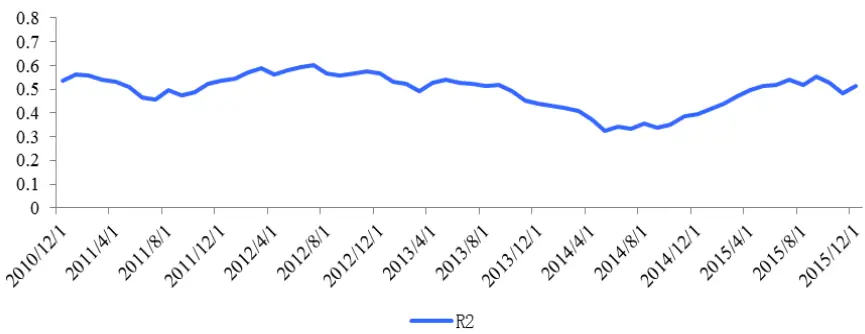
数据来源：国泰君安证券研究

风险模型自2010年至 2015年，平均 $R^{2}$ 为0.497且较为稳定，体现了风险模型较强的解释力度及稳定性。

对于组合波动率预测的偏差检验Bias Test ，我们分别选取 8 种不同的指数成分股组合，考察风险模型的预测波动率与组合实际波动率之间的关系，具体如下：

表 3：组合波动率偏差统计检验结果：

| 组合 | 上证50 | 沪深300 | 中证500 | 上证180 | 中小板指 | 创业板指 | 深圳 300 | 全市场等权 |
| --- | --- | --- | --- | --- | --- | --- | --- | --- |
| 1 $B_{\it{n}}$ | 1.156 | 1.095 | 1.056 | 1.122 | 1.034 | 1.154 | 0.974 | 1.071 |
| 检验结果 | Reject | Reject | Reject | Reject | Reject | Reject | Reject | Reject |

数据来源：国泰君安证券研究

风险模型对组合收益和风险归因分析也同样起到十分重要的作用，其可以帮助投资经理在投资过程中，了解组合的收益来源、风险暴露来源以及运气成分的占比等因素，帮助投资经理更为深入的了解自己构建的投资组合。

总而言之，风险模型是组合投资的基石，对组合风险来源和波动性的梳理清晰后，进一步结合阿尔法因子信息，那么获取风险可控前提下的稳健超额收益将变得不再那么困难。

## 2.3.阿尔法因子与风险模型

超额收益率最终会以组合的形式呈现，而组合的特征必然包括收益与风险两部分。阿尔法因子与风险模型结合的效果就是希望通过阿尔法因子创造超额收益，同时通过风险因子控制组合风险，两者相辅相成，最终实现组合稳健战胜市场基准的效果。

风险因子与阿尔法因子的属性不同，因此在组合中各自的作用也不同。当然，倘若从组合风险建模的角度出发，风险因子和阿尔法因子都可以视为组合的风险来源。原因在于，即便是稳定性再强的阿尔法因子，其因子收益率终究还是会产生些许波动，那么就会贡献组合风险。但是，倘若从创造超额收益的角度出发，则必须对风险因子和阿尔法因子进行严格区分。

$$
r_{j}=\underbrace{x_{alpha}^{1}}_{\sim}\underbrace{f_{alpha}^{1}}_{\sim}+\underbrace{x_{alpha}^{2}}_{\sim}\underbrace{f_{alpha}^{2}}_{\sim}+\underbrace{\dots+\ x_{alpha}^{M}}_{\substack{d\hat{\gamma}_{d}\vert pha\vert\vert\overline{{\mathcal{H}}}}}+\underbrace{\dots+\ x_{alpha}^{M}}_{\sim}\underbrace{f_{alpha}^{M}}_{\substack{d\vert pha\vert}}+\underbrace{x_{beta}^{1}}_{\sim}\underbrace{f_{beta}^{1}+\dots+x_{beta}^{K}}_{\substack{K\hat{\gamma}_{d}\vert\mathcal{H}\vert\mathcal{H}\vert\mathcal{H}}}\underbrace{f_{beta}^{K}}_{\substack{\vert\mathcal{H}\vert}}+u_{j}
$$

图 6 阿尔法因子与风险模型：
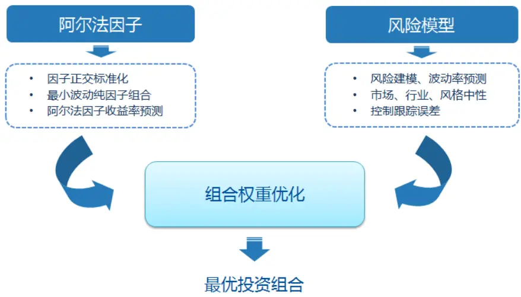
数据来源：国泰君安证券研究

实现阿尔法因子与风险模型想结合的途径即为组合权重优化，在一系列约束或暴露条件下，获取最优权重配臵的投资组合，实现风险精确可控基础之下的超额收益。

## 3. 阿尔法因子的组合特征

本章节，我们将从阿尔法因子的组合特征分析开始，探讨如何挖掘阿尔法因子所包含的有效信息。我们将通过分析比较 3种不同的特征组合，深入挖掘阿尔法因子的内在特征。

## 3.1.简单因子组合

第一类组合称为简单因子组合（ Simple Factor Portfolio ），是考察因

子的最直接的组合构建方法。通常情况下，组合会针对某一类因子的暴露值，选取因子正向暴露的股票作为多头组合，选择因子负向暴露的股票作为空头组合；或者选取前 20%分位数的正向因子暴露股票构建多头组合，同时选取后20%分位数的负向因子暴露股票构建空头组合。进一步的，对该多空组合的收益率进行统计分析，观测组合收益特征。

简单因子组合是一种便捷有效的研究因子特征的方法，其构建的多空组合往往包含了阿尔法因子的部分特征。

我们以离散度因子为例，来说明简单因子组合的特点。其中，对于第i 个股票的离散度因子的表达式为： ${x_{it}^{Dispersion}=\sqrt{1-{R_{it}}^{2}}\cdot\sigma(\varepsilon_{it})}$ ，其中 $\varepsilon_{_{it}}$ 为Fama–French 三因子回归方程的残差， $\sigma\left(\boldsymbol{\varepsilon}_{it}\right)$ 即为特质波动率， ${R_{i}}_{t}^{2}$ 则为回归方程的解释系数。

我们选取全 A 非 ST 为样本空间，构造离散度因子，在每自然月末选择全市场离散度因子值最低的 20%股票等权重做多，离散度因子值最高的20%股票等权重做空，不计交易成本，自 2010年 1月至 2015年 12月，组合累计收益率统计分析如下：

图 7 离散度简单因子组合累计收益率：
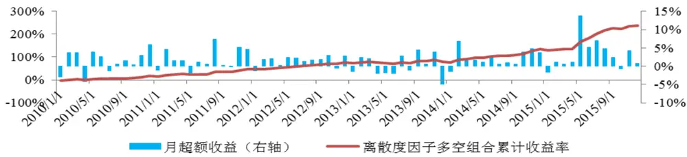
数据来源：国泰君安证券研究

表 4: 离散度简单因子组合收益统计分析：

| 离散度简单因子组合收益统计分析 |  |
| --- | --- |
| 年化收益率 | 20.69% |
| 年化波动率 | 9.63% |
| 月交易胜率 | 76% |
| 信息比率 | 2.14 |
| 月频率最大回撤 | 6.25% |
| 月超额收益盈亏比 | 1.59 |
| 收益回撤比 | 3.47 |

数据来源：国泰君安证券研究

上述简单因子组合统计结果表明，离散度因子是一个反向选股因子，其选股组合具有较强的稳定性。 其多空组合超额收益的信息比率达到2.14，收益回撤比为 2.54。

但是，这样的组合绩效结果就可以将离散度定义为阿尔法因子吗？

## 答案是不一定。

虽然简单因子组合是研究因子阿尔法特性的有效方法，其缺点也同样十分明显，即简单因子组合提供了阿尔法因子的选股逻辑，但却无法证明超额收益来源于该选股逻辑，更无法反应仅属于目标因子的内在收益风险特征。更重要的是，简单因子组合的超额收益在多因子选股逻辑下无法线性叠加，使得多因子选股的效果大打折扣。

同样以上述离散度因子组合为例，我们从收益归因的角度分析离散度因子选股究竟包含了哪些收益来源。

我们以上文风险模型中提到的 30 类行业因子和 9 个类风格因子分解组合收益来源，并加入离散度因子本身作为目标因子，最终组合收益归因结果如下图：

图 8 离散度简单因子组合因子收益归因：
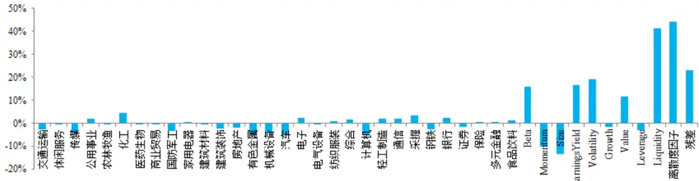
数据来源：国泰君安证券研究

从上述归因结果可以发现诸多有价值的信息。首先，组合的收益来源受行业层面影响，在不同的行业中呈现了正负交错的收益贡献结果。其次，风格层面的影响更大，组合收益来源受各类风格均有影响，尤其是在Liquidity风格上的收益贡献几乎等同于离散度因子本身，这说明离散度因子选股与Liquidity因子有很强的相关性。最后，则是残差部分，即运气成分或者说其他未被发掘的阿尔法因子也贡献了部分的收益来源。

图 9 离散度简单因子组合累计收益率分解：
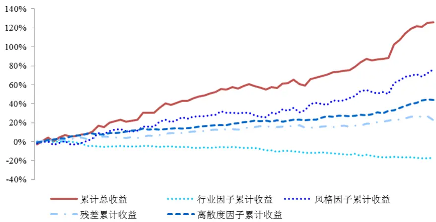
数据来源：国泰君安证券研究

组合累计收益的分解也是同样的结果，如上图所示，4 根虚线分别代表行业、风格、残差和离散度因子的累计收益，其总和为实线组合累计收益。从图中可以明显发现，组合的收益分解在行业、风格、残差项上均贡献了较大的累计收益。

图 10 离散度简单因子组合累积收益率分解：
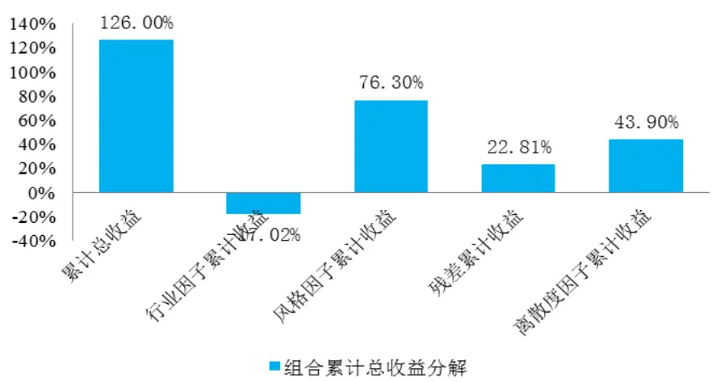
数据来源：国泰君安证券研究

换言之，如果离散度因子选股多空组合的年化超额收益率为 20.69%，那么从归因分解的角度来看，该部分超额收益中，仅有 30%左右的收益来源为离散度因子本身，而其余的行业、风格和残差成分则占据了绝大部分。

因此，简单因子组合可以直观的观察因子组合的一些特点，但是却不能深入充分挖掘阿尔法因子所包含的全部信息。并且由于简单因子组合包含了过多目标因子以外的收益信息，有可能导致误将风险因子作为阿尔法因子，这对日后构建最优投资组合是极其不利的。

## 3.2.纯因子组合

第二类组合称为纯因子组合（ P u re F a cto r P o rtfo lio ），纯因子组合的

概念从理念上而言比简单因子组合已经迈进了一大步，因为纯因子组合的构建已经需要依赖于风险模型中其余全部风险因子，但是尚不涉及风险矩阵。

纯因子组合表示，在暴露 1单位阿尔法因子敞口的同时，对风险模型中的其余任意因子均保持 0 敞口暴露。具体的，纯因子组合 $w_{\ pure}$ 满足：

$$
\begin{array}{l}{{w_{_{pure}}^{\prime}\cdot x_{_{alpha}}=1}}\\{{{}}}\\{{w_{_{pure}}^{\prime}\cdot X_{_{beta}}=0}}\end{array}
$$

其中， $w_{\ pure}$ 为纯因子组合对应权重， $x_{alpha}$ 为目标因子载荷截面， $X_{\phantom{}_{beta}}$ 为全部风险因子载荷矩阵。

纯因子组合从定义上来说，就已经克服了简单因子组合最大的问题，即因子之间共线性的问题。其组合的收益来源，已经摒弃了其余我们不想要检验、但又往往会贡献收益的其余因子部分。

我们同样以离散度因子为例，构建纯因子组合，由于离散度因子为负向因子，为了更加直观的观察组合的收益风险特征，所以构建纯因子组合时，设离散度因子敞口等于-1，即 $\begin{array}{rl}{w\ _{pune}^{\prime}}&{{}\cdot\ _{spha}\ }\end{array}\quad=-1$ ，得到每期的组合权重 $w_{\ pure}$ 。在不计交易成本的情况下，自 2010年 1 月至 2015 年 12 月，组合累计收益率统计分析如下：

图 11 离散度纯因子组合累积收益率：
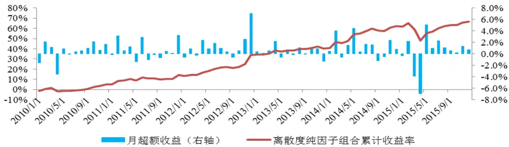
数据来源：国泰君安证券研究

表 5: 离散度纯因子组合收益统计分析：

| 离散度纯因子组合收益统计分析 |  |
| --- | --- |
| 年化收益率 | 8.78% |
| 年化波动率 | 6.62% |
| 月交易胜率 | 70.8% |
| 信息比率 | 1.32 |
| 月频率最大回撤 | 10.54% |
| 月超额收益盈亏比 | 1.26 |
| 收益回撤比 | 0.83 |

数据来源：国泰君安证券研究

从上述离散度因子的纯因子组合统计结果来看，组合的年化超额收益较之简单因子组合有了比较大的降低，主要原因就是纯因子组合剔除了其余行业和风格因素的干扰，解决了简单因子组合在考察因子时与其他各类因子之间的共线性问题。

我们同样利用归因模型分解组合收益率，可以非常显然的发现，组合的收益来源较之简单因子组合已经纯粹很多，收益来源主要集中于离散度因子本身和残差。

图 12 离散度纯因子组合因子收益归因：
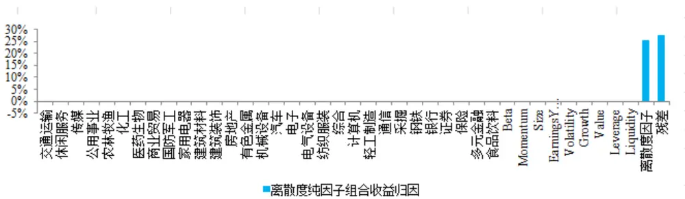
数据来源：国泰君安证券研究

图 13 离散度纯因子组合累积收益分解：
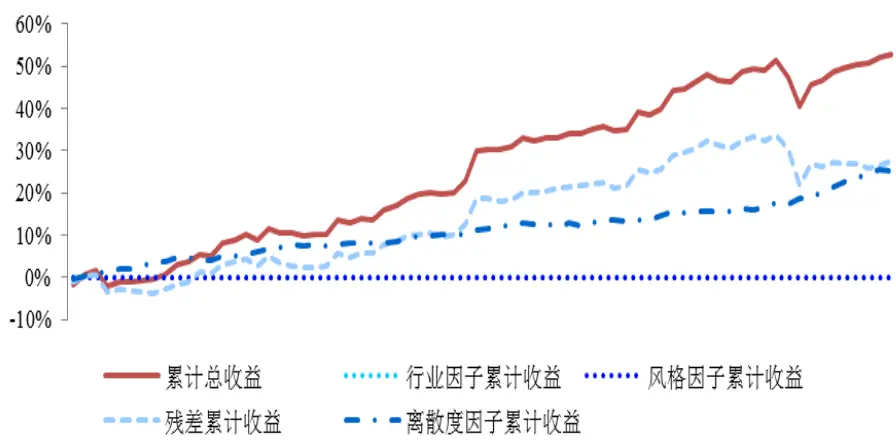
数据来源：国泰君安证券研究

但是，尽管纯因子组合已经很大程度上独立的剥离出了目标因子的收益风险特征，但是它仍然有2 个致命的缺陷。首先，纯因子组合的解存在非唯一性，即满足纯因子组合定义的权重可能不是唯一的，这就造成构造组合和检验因子时的极大困扰。其次，从上述归因结果也很明显的可以发现，组合的收益分解中，残差项仍然贡献了较大部分，即纯因子组合还无法控制组合的残差波动，收益特征存在较大的不确定性。

因此，我们还需要在纯因子组合的基础上，进一步挖掘更能够充分反映阿尔法因子全部内在信息的组合。

## 3.3.最小波动纯因子组合

最后一类组合称为最小波动纯因子组合（ M in im u m V o la tility P u re

F a cto r P o rtfolio M V P F P , ），最小波动纯因子组合是考察阿尔法因子信息的最完备组合，其构建方式需要依赖于完整的风险模型。

最小波动纯因子组合表示，在暴露 1单位目标因子敞口，同时保持其余所有风险因子0敞口暴露的条件下，具有最小预期波动率的组合，具体表达为：

$$
\begin{array}{rl}{Min}&{\ w_{_{m\nu pfp}}^{\prime}\cdot(XFX^{\prime}+\Delta)\cdot w_{_{m\nu pfp}}}\\{s.t.\quad}&{w_{_{m\nu pfp}}^{\prime}\cdot X_{_{beta}}=0}\\&{\ w_{_{m\nu pfp}}^{\prime}\cdot x_{_{alpha}}=1}\end{array}
$$

其中， $\boldsymbol{w}_{\scriptscriptstyle mvpfp}$ 为最小波动纯因子组合对应权重，F 合表示因子收益率协方差矩阵，• 为特质因子收益率方差矩阵。风险矩阵的具体计算方式详见《基于组合权重优化的风格中性多因子选股策略》。

从定义上来看，最小波动纯因子组合是满足特定目标函数的一类特殊的纯因子组合。最小波动纯因子组合首先克服了纯因子组合解存在非唯一性的问题；其次，通过对组合波动率的最大限制，将组合收益来源中不确定性的残差部分影响降到几乎为 0的状态，这样就使得组合可以完整的剥离出目标因子的收益归因贡献。

因此，最小波动纯因子组合反应且仅反应了目标因子的收益风险特征，是检验阿尔法因子特征的最完备组合。

最小波动纯因子组合的构建是一个满足多个等式约束条件下的二次规划问题，我们下面对最小波动纯因子组合的解的表达式进行一些简单的推导。

利用 Lagrange 乘子法求解该问题，其中根据优化方程条件 Lagrange 函数表达写为：

$$
{\cal L}(w^{\prime},\lambda)=\frac{1}{2}w^{\prime}\cdot\sum\cdot w-\lambda\cdot w^{\prime}\cdot\tilde{X}\tag{A1}
$$

其中 $\Sigma=XFX^{\prime}+\Delta$ ， $\tilde{X}$ 表示优化方程中的约束矩阵。

分别对式A1中，w 和 求偏导数，可得：

$$
\frac{\partial{\cal L}}{\partial w}=\sum\cdot w-\lambda\cdot\tilde{X}=0\tag{A2}
$$

$$
\frac{\partial{\cal L}}{\partial\lambda}=\tilde{X^{~\prime}}\cdot w=0\tag{A3}
$$

求解(A2)中的w 得到：

$$
w=\Sigma^{-1}\cdot\lambda\cdot\tilde{X}\tag{A4}
$$

将w 代入(A3)得到

$$
\tilde{X^{\prime}}\cdot\sum^{-1}\cdot\lambda\cdot\tilde{X^{}}=0\tag{A5}
$$

求解(A5) 中的 得到：

$$
\lambda=\big(\tilde{X^{\prime}}\cdot\Sigma^{-1}\cdot\tilde{X}~\big)^{-1}
$$

最后将 代入(A4) 得到 $w=\sum^{-1}{\cdot\tilde{X}}\cdot(\tilde{X^{\prime}}\cdot\sum^{-1}{\cdot\tilde{X^{\prime}}})^{^{-1}}$ 同样对于离散度因子，我们利用上述推导结果构建最小波动纯因子组合$w_{{_{mvpfp}}}$ ，在不计交易成本的情况下，自2010年1月至2015年12 月，组合累计收益率统计分析如下：

图 14 离散度最小波动纯因子组合累积收益：
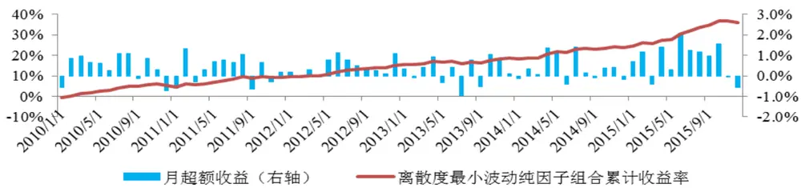
数据来源：国泰君安证券研究

表 6: 离散度最小波动纯因子组合收益统计分析：

| 离散度最小波动纯因子组合收益统计分析 |  |
| --- | --- |
| 年化收益率 | 5.21% |
| 年化波动率 | 2.19% |
| 月交易胜率 | 72.2% |
| 信息比率 | 2.38 |
| 月频率最大回撤 | 1.34% |
| 月超额收益盈亏比 | 2.05 |
| 收益回撤比 | 3.86 |

数据来源：国泰君安证券研究

从离散度最小波动纯因子组合的收益统计分析来看，组合的年化收益率进一步降低，同时波动率也显著降低，因子组合的整体稳定性得到了很大的提升。组合收益的信息比率达到2.38，收益回撤比达到 3.86。

最重要的是，最小波动纯因子组合的收益已经完全由因子本身贡献，行业、风格和残差部分已经剥离。因此，可以说 5.21%的年化收益率完全属于目标离散度因子，下图的收益归因和组合收益分解的结果很直观的说明了一点，如图：

图 15 离散度最小波动纯因子组合因子收益归因：
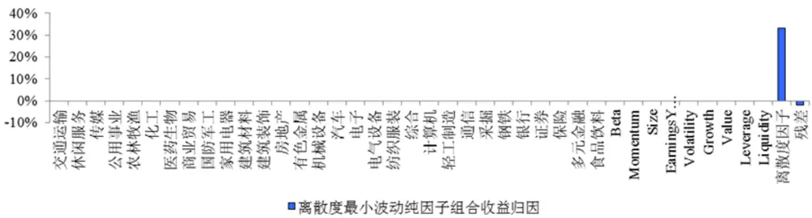
数据来源：国泰君安证券研究

图 16 离散度最小波动纯因子组合累积收益分解：
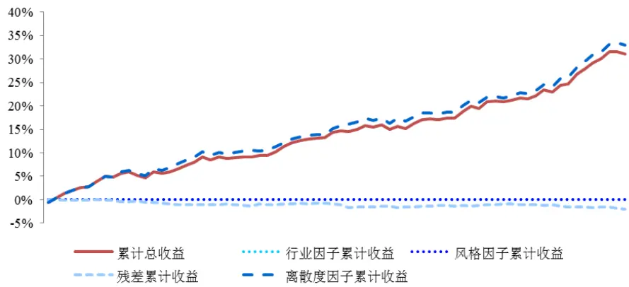
数据来源：国泰君安证券研究

从离散度因子最小波动纯因子组合的收益统计结果，我们可以得出以下结论：

每一单位离散度因子暴露，可以独立的贡献年化 5.17%的收益率，同时因子的风险贡献为年化 2.21%，因子的收益风险比达到 2.34。因子组合收益率具备显著性、独立性及稳定性特点，符合阿尔法因子的定义特征。

上述最小波动纯因子组合的特点及其对目标因子的检验结论，就可以回答我们在第2 章阿尔法中提出的问题，即一个阿尔法因子究竟包含了怎样的信息以及如何才能深入本质的探究一个纯粹的阿尔法因子。

最后我们比较阿尔法因子3 类组合特征的性质及特点，如下表所示：

表 7: 阿尔法因子的组合特征比较分析：

| 简单因子组合 |  | 纯因子组合 | 最小波动纯因子组合 |
| --- | --- | --- | --- |
| 构建组合权重w使满足： |  |  | 构建组合权重w使满足： |
| 组合定义 | 选取因子载荷前20%的若 干股票做多，选取因子载 荷后20%的若干股票做空 | $w^{\prime}\cdot x_{_{alpha}}=1$ $w^{\prime}\cdot X_{\mathit{\Pi}_{beta}}=0$ | Min w′·(XFX '+ ∆)·w s.t. $w^{\prime}\cdot x_{_{alpha}}=1$ $w^{\prime}\cdot X_{\mathit{\Pi}_{beta}}=0$ |
| 组合收益风险 | 组合较易产生高收益 高波动特征 | 组合收益往往较低 而波动率具有不确定性 | 组合收益率往往较低 波动率低 |
| 收益归因分解特征 | 组合收益来源在目标因 子、行业、风格和残差项 均有暴露及贡献 | 和残差项贡献 | 组合收益来源于目标因子 组合收益来源于仅集中于 目标因子 |
| 组合意义 | 检验目标因子最为便捷的 方法，可以反映目标因子 一定的阿尔法特性，但是 缺点显著。 | 解决了目标因子与其余风 险因子的相关性问题，一 定程度上独立的反映了目 标因子的收益风险特征， 但是仍存在缺陷。 | 检验目标因子阿尔法特性 的最完备组合，可以独立 的分解出目标因子收益风 险特征，可真正意义上判 断因子是否具备阿尔法属 性。 |

数据来源：国泰君安证券研究

## 4. 一些稳定的阿尔法因子

在上一章中，我们提到最小波动纯因子组合是检验因子是否具备阿尔法特性的最完备的组合，那么在本章节，我们就将利用该理念，给出一些稳定的阿尔法因子的检验结论。

## 4.1.阿尔法因子的构建及检验流程

构建及检验阿尔法因子需要几步严格的流程，尤其是在风险模型的基础上阿尔法因子构建，更需注意。

## 第一步，构建原始因子。

根据市场数据、财务数据、分析师预期数据、互联网大数据等信息，构建原始因子值，并对原始因子截面进行去极值标准化处理。

## 第二步，原始因子正交标准化构建目标因子。

利用当前所有风险因子和已知所有阿尔法因子，对原始因子进行正交标准化，从而得到经正交化的目标因子值，具体为：

假设 $\boldsymbol{X}_{\mathrm{\Pi}_{k:\mathrm{E}}\mathrm{\Pi}_{k\mathrm{T}}\mathrm{\boxed{\cdot}\mathrm{E}}\mathrm{\Pi}\vec{\mathcal{F}}}$ 为原始因子截面， $X_{_{Alpha}}$ 为已知阿尔法因子，那么构建回归方程：

$$
\begin{array}{rl}{{X}_{\textrm{ \tiny { k 1 6 i f i E } }}=\beta_{0}+\beta_{1}{X}_{\textrm{ \tiny { B e r a } }}+\beta_{2}{X}_{\textrm{ \tiny { M o m e m t u m } }}+\beta_{3}{X}_{\textrm{ \tiny { S i z e } }}+\beta_{4}{X}_{\textrm{ \tiny { E a r n i n g s Y i e l d } }}}&\\{~+\beta_{s}{X}_{\textrm{ \tiny { V o l a t i l i t y } }}+\beta_{6}{X}_{\textrm{ \tiny { G r o w t h } }}+\beta_{7}{X}_{\textrm{ \tiny { V a l u e } }}+\beta_{8}{X}_{\textrm{ \tiny { L e v e r a g e } }}+\beta_{9}{X}_{\textrm{ \tiny { L i q u d i t y } }}}&\\{~+\beta_{10}{X}_{\textrm{ \tiny { A l p h a } }_{-1}}+\beta_{11}{X}_{\textrm{ \tiny { A l p h a } }_{-2}}+\ldots+\beta_{\kappa}{X}_{\textrm{ \tiny { A l p h a } }_{-\kappa}}+\varepsilon_{\textrm{ \tiny { k 1 4 p k } }\mathbb{T}}}&\end{array}
$$

回归方程的残差截面 $\mathcal{E}_{\mathrm{\tiny~k:\boxplus~}\mathrm{\#:\boxplus~}\mathrm{\#}}$ 则为经标准化后的目标因子：

$$
X_{\mathrm{~\tiny~-~}orthogonalized_{\mathrm{~\tiny~k~f~f~E~}}}=\varepsilon_{\mathrm{~\tiny~k~f~f~F~}}
$$

需要注意的是，任意新的目标因子必须经过已有的全部因子正交处理，即新加入一个阿尔法因子后，后一个阿尔法因子必须也经前一阿尔法因子正交处理。这样的处理过程就可以保证任意 2个阿尔法因子截面互相正交。

## 第三步，构建目标因子最小波动纯因子组合并统计组合收益风险。

对于经正交处理后的目标因子截面，利用上一章中提到的最小波动纯因子组合的权重计算方法，构建目标因子最小波动纯因子 $m\nu pfp$ 组合，并统计组合收益风险特征，确定因子属性。

## 4.2.一些稳定的阿尔法因子及其组合特征

下面，我们将给出几个稳定的阿尔法因子的原始构造定义以及正交标准化后，其对应的因子组合特征。其中，下述所有因子信息均由正交处理后保持与风险模型正交并且任意两因子之间保持正交。

## 1） $YOY\_EPS$ 因子定义：

个股各财报期基本EPS 同比增长率，具体计算为：

$$
YOY\mathrm{~}_{-}EPS_{_{Rt}}^{i}=(EPS_{_{Rt}}^{i}-EPS_{_{Rt-1}}^{i})/\left|EPS_{_{Rt-1}}^{i}\right|
$$

其中，财报数据按照就近原则。

图 17 YOY_EPS因子组合累计收益率：
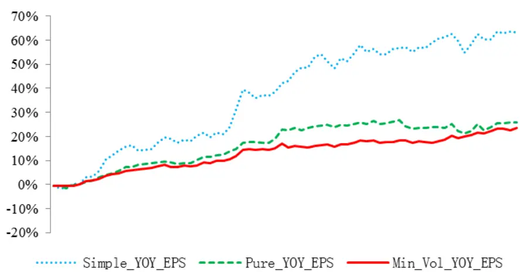

| 简单因子组合 |  | 纯因子组合 | 最小波动纯因子组合 |
| --- | --- | --- | --- |
| 因子收益方向 | 正向 | 正向 | 正向 |
| 年化收益率 | 8.39% | 3.87% | 3.56% |
| 年化波动率 | 6.23% | 3.10% | 2.10% |
| 信息比率 | 1.57 | 1.25 | 1.69 |

数据来源：国泰君安证券研究

## 2） Reverse 因子定义：

个股过去20 个交易日累计收益率，具体计算为：

$$
Re\nu erse_{_t}^{i}=(P_{_t}^{_i}-P_{_{t-20}}^{_i})/P_{_{t-20}}^{_i}
$$

图 18 REVERSE 因子组合累计收益率：
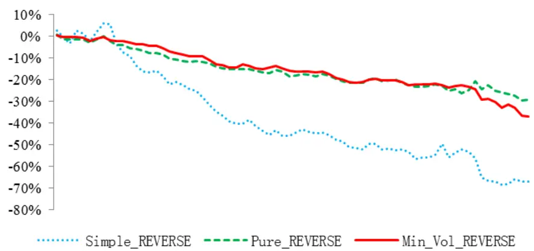

|  | 简单因子组合 | 纯因子组合 | 最小波动纯因子组合 |
| --- | --- | --- | --- |
| 因子方向 | 反向 | 反向 | 反向 |
| 年化收益率 | -17.11% | -5.62% | -7.53% |
| 年化波动率 | 15.38% | 5.08% | 4.67% |
| 信息比率 | -1.11 | -1.10 | -1.61 |

数据来源：国泰君安证券研究

3） $\textit{ E s t \_ P B }$ 因子定义：

分析师一致预期个股PB ，具体计算为：

$$
Est\_PB_{\scriptscriptstyle t}^{\scriptscriptstyle i}=Est\_BPS_{\scriptscriptstyle FY}^{\scriptscriptstyle i}/P_{\scriptscriptstyle t}^{\scriptscriptstyle i}
$$

图 19 Est_PB因子组合累计收益率：
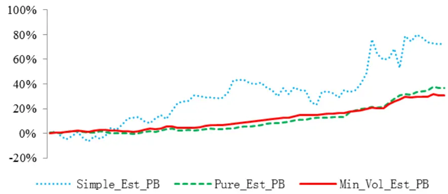

|  | 简单因子组合 | 纯因子组合 | 最小波动纯因子组合 |
| --- | --- | --- | --- |
| 因子方向 | 正向 | 正向 | 正向 |
| 年化收益率 | 10.28% | 5.29% | 4.46% |
| 年化波动率 | 15.36% | 2.85% | 2.17% |
| 信息比率 | 0.67 | 1.85 | 2.06 |

数据来源：国泰君安证券研究

4） $MOM\_Est\_EPS$ 因子定义：

分析师一致预期个股EPS 环比增长率，具体计算为：

$$
MOM\ _{-}Est\ _{-}EPS_{t}^{i}=(Est\ _{-}EPS_{t}^{i}-Est\ _{-}EPS_{t-20}^{i})/|Est\ _{-}EPS_{t-20}^{i}|
$$

图 20 MOM_Est_EPS 因子组合累计收益率：
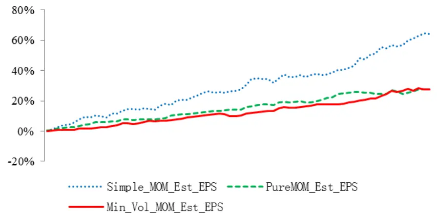

| 简单因子组合 |  | 纯因子组合 | 最小波动纯因子组合 |
| --- | --- | --- | --- |
| 因子方向 | 正向 | 正向 | 正向 |
| 年化收益率 | 8.37% | 4.15% | 4.10% |
| 年化波动率 | 3.84% | 1.97% | 1.77% |
| 信息比率 | 2.18 | 2.10 | 2.31 |

数据来源：国泰君安证券研究

5） D isp ersio n 因子定义：

个股离散度指标，具体计算为：

$$
Dispersion_{t}^{i}=\sqrt{1-{R_{it}}^{2}}\cdot\sigma({\varepsilon_{it}})
$$

其中，其中 $\varepsilon_{\scriptscriptstyle it}$ 为 $Fama-French$ 三因子回归方程的残差， $\sigma\left(\boldsymbol{\varepsilon}_{it}\right)$ 即为特质波动率， ${R_{it}}^{2}$ 则为回归方程的解释系数，回归方程时间序列 $T=20$

图 21 DISPERSION 因子组合累计收益率：
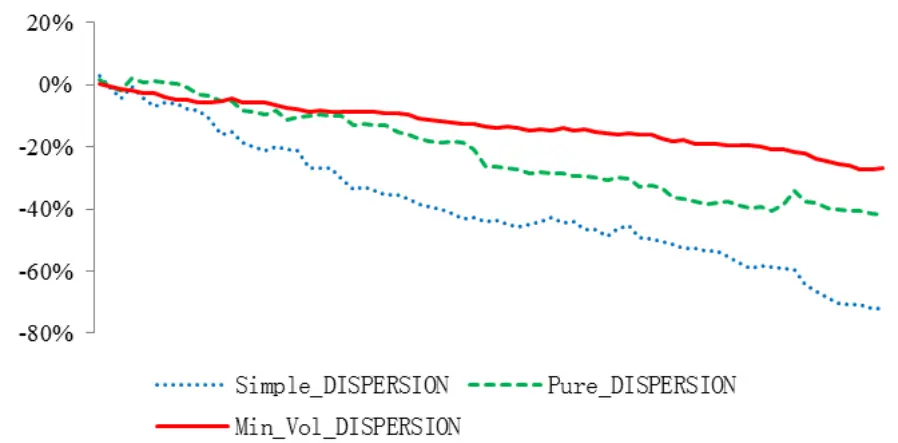

|  | 简单因子组合 | 纯因子组合 | 最小波动纯因子组合 |
| --- | --- | --- | --- |
| 因子方向 | 反向 | 反向 | 反向 |
| 年化收益率 | -20.69% | -8.78% | -5.21% |
| 年化波动率 | 9.63% | 6.62% | 2.19% |
| 信息比率 | -2.14 | -1.32 | -2.38 |

数据来源：国泰君安证券研究

6） HTOS 因子定义：

个股股本集中度指标，具体计算为：

$$
HTOS_{t}^{i}=Top10_{-}Free_{-}Holder_{t}^{i}/Total_{-}Shares_{t}^{i}
$$

其中， $Top10\_Free\_Holder_{t}^{i}$ 表示个股第t 天，前 10 大流通股东股本合计， $Total\_Shares_{_t}^{i}$ 表示个股第t天总股本数。

图 22 HTOS因子组合累计收益率：
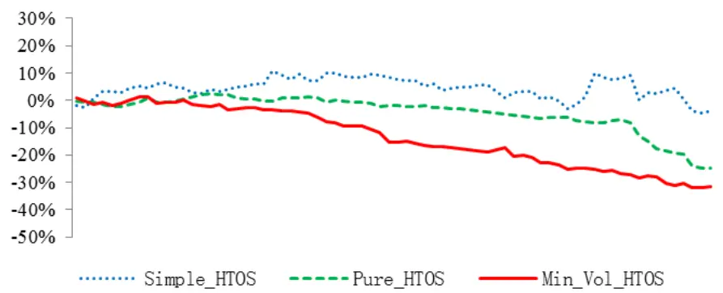

| 简单因子组合 |  | 纯因子组合 | 最小波动纯因子组合 |
| --- | --- | --- | --- |
| 因子方向 | 不定 | 反向 | 反向 |
| 年化收益率 | -0.42% | -4.71% | -6.21% |
| 年化波动率 | 7.29% | 3.83% | 3.79% |
| 信息比率 | -0.05 | -1.22 | -1.64 |

数据来源：国泰君安证券研究

7） $MOM\_ROE$ 因子定义：

个股财报期ROE 环比增长率，具体计算为：

$$
MOM_{\mathrm{~-~}}ROE_{_{Rt}}^{i}=(ROE_{_{Rt}}^{i}-ROE_{_{Rt-1}}^{i})/\left|ROE_{_{Rt-1}}^{i}\right|
$$

其中，财报数据按照就近原则。

图 23 MOM_ROE因子组合累计收益率：
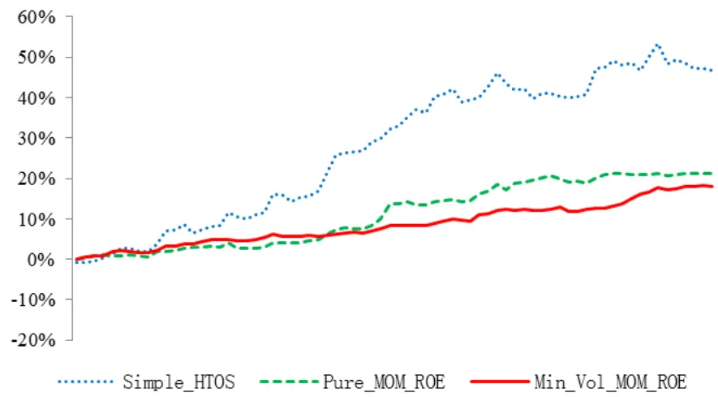

| 简单因子组合 |  | 纯因子组合 | 最小波动纯因子组合 |
| --- | --- | --- | --- |
| 因子方向 | 正向 | 正向 | 正向 |
| 年化收益率 | 6.54% | 3.24% | 2.77% |
| 年化波动率 | 5.13% | 2.21% | 1.42% |
| 信息比率 | 1.27 | 1.46 | 1.96 |

数据来源：国泰君安证券研究

8） $Rate\_Up$ 因子定义：

上调个股评级的分析师家数。

$$
Rate\_Up_{i}^{t}=\sum_{t=1}^{T}{Num\_Rate\_Up_{t}}
$$

其中，时间窗口 $T=90$ 0

图 24 RATEUP因子组合累计收益率：
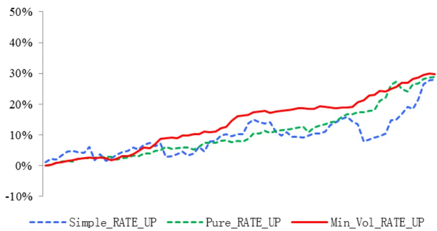

| 简单因子组合 |  | 纯因子组合 | 最小波动纯因子组合 |
| --- | --- | --- | --- |
| 因子方向 | 正向 | 正向 | 正向 |
| 年化收益率 | 4.26% | 4.26% | 4.37% |
| 年化波动率 | 5.40% | 2.65% | 1.67% |
| 信息比率 | 0.79 | 1.61 | 2.61 |

数据来源：国泰君安证券研究

9） E a r n in g s Yield 因子定义：

Earnings Yield 为风险模型中的大类因子，具体定义参见第 2 章风险因子定义。

图 25 Earnings Yield 因子组合累计收益率：
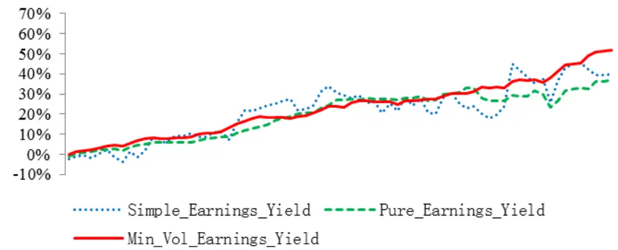

|  | 简单因子组合 | 纯因子组合 | 最小波动纯因子组合 |
| --- | --- | --- | --- |
| 因子方向 | 正向 | 正向 | 正向 |

| 年化收益率 | 6.46% 5.35% 6.99% |
| --- | --- |
| 年化波动率 13.11% | 4.42% 2.65% |
| 信息比率 0.49 | 1.21 2.64 |

数据来源：国泰君安证券研究

## 10）L iq u id ity 因子定义：

Liquidity 为风险模型中的大类因子，具体定义参见第 2 章风险因子定义。

图 26 Liquidity 因子组合累计收益率：
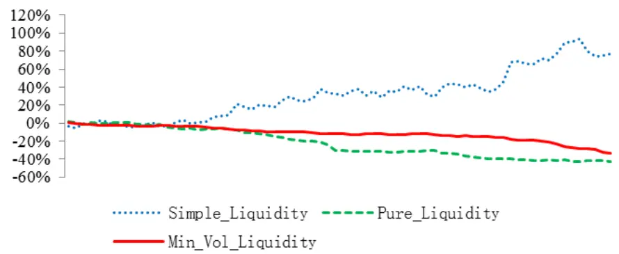

| 简单因子组合 |  | 纯因子组合 | 最小波动纯因子组合 |
| --- | --- | --- | --- |
| 因子方向 | 正向 | 反向 | 反向 |
| 年化收益率 | 10.49% | -9.02% | -6.66% |
| 年化波动率 | 13.66% | 5.83% | 2.87% |
| 信息比率 | 0.77 | -1.55 | -2.32 |

数据来源：国泰君安证券研究

上述10个因子，我们通过对其组合特征的实证统计（主要关注最小波动纯因子组合），发现均存在较为显著的阿尔法特性，因此可以将其定性为阿尔法因子，而其中 Earnings Yield 和 Liquidity 因子则兼备阿尔法因子和风险因子双重属性。

我们下面将从年化收益率贡献、因子年化波动贡献和因子信息比率来比较这10个阿尔法因子之间的贡献区别，如下图所示：

图 27 10类阿尔法因子年化收益贡献比较：
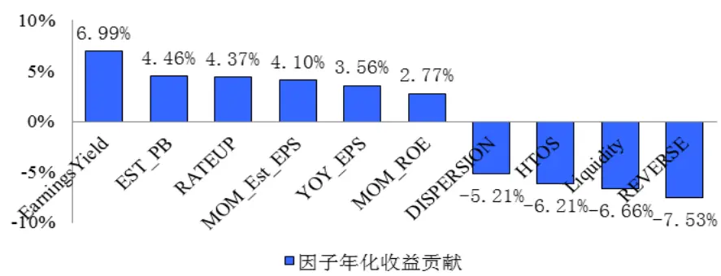
数据来源：国泰君安证券研究

从因子年化收益贡献来看，6个因子为正向贡献因子，4个因子为反向贡献，其中正向因子中 EarningsYield 年化收益贡献最大，而反向因子中REVERSE 年化贡献最大。

图 28 10类阿尔法因子年化波动贡献比较：
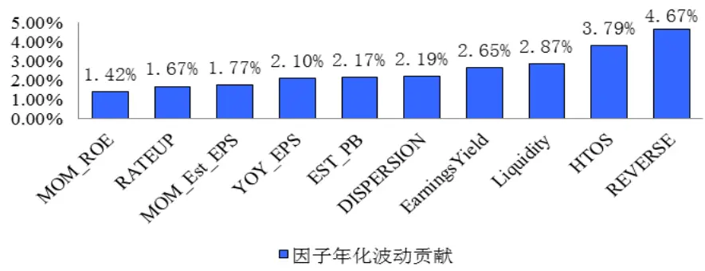
数据来源：国泰君安证券研究

从因子年化波动贡献来看，MOM_ROE为所有阿尔法因子中风险贡献最小，而REVERSE 则贡献最高风险。

图 29 10类阿尔法因子信息比率比较：
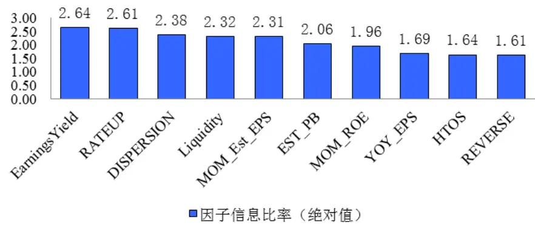
数据来源：国泰君安证券研究

最后，从因子的收益风险比来看，所有阿尔法因子的信息比率均大于1.5，这可以作为判断阿尔法因子属性的定量标准，但是不绝对。10 类因子中，EarningsYield 以 2.64 的信息比率排名第一。

最后，我们将10类阿尔法因子分为 3大类阿尔法来源，即财务类因子、预期类因子和市场类因子，整体统计结果如下：

表 8: 大类因子收益风险贡献统计：

|  |  | 年化收益率贡献 | 年化波动贡献 |
| --- | --- | --- | --- |
| 预期类因子 | EarningsYield | 6.99% | 2.65% |
|  | EST_PB | 4.46% | 2.17% |
|  | RATEUP | 4.37% | 1.67% |
|  | MOM_Est_EPS | 4.10% | 1.77% |
|  | 总计（绝对值） | 19.91% | 8.26% |
| 市场类因子 | DISPERSION | -5.21% | 2.19% |
|  | HTOS | -6.21% | 3.79% |
|  | Liquidity | -6.66% | 2.87% |
|  | REVERSE | -7.53% | 4.67% |
|  | 总计（绝对值） | 25.62% | 13.51% |
| 财务类因子 | YOY_EPS | 3.56% | 1.42% |
|  | MOM_ROE | 2.77% | 2.10% |
|  | 总计（绝对值） | 6.33% | 3.52% |

数据来源：国泰君安证券研究

从上述统计结果来看，A股市场中影响股票价格的阿尔法来源效果最强的仍是市场类因子，其可以贡献年化25.62%的收益率，而分析师预期类因子可贡献年化19.91%的收益率，而财务类因子贡献相对较低，为6.33%。

因此，从阿尔法因子大类的统计可以发现，A股市场投资者仍以市场价格走势为主导驱动；分析师研究也同样贡献相对稳定的收益，这主要体现在分析师对上市公司的预期估值以及对企业预期EPS的边际变化上；而上市公司的整体财务质量以及实际成长性则并未占据 A股市场价格波动的主导因素。

## 5. 阿尔法因子收益率的预测

## 5.1.阿尔法因子收益率的预测方法

本章节主要讨论阿尔法因子收益率的预测。在第二章中我们提到通过组合权重优化的方法，将阿尔法因子与风险模型相互结合。其中，阿尔法因子贡献组合超额收益，而风险因子控制组合风险暴露及跟踪误差。

在风险端，最核心的问题在于对风险矩阵（风险因子协方差矩阵和特质因子风险矩阵）的建模；而在阿尔法端，除了上一章中我们提到了阿尔法因子的构建及内在收益风险分析之外，最核心的问题就是阿尔法因子收益率的预测。阿尔法因子收益率预测的主要目的是为了计算组合权重优化中目标函数 $R_{_{p}}-\lambda{\sigma^{2}}_{_{p}}$ 中的组合预期收益率 $\boldsymbol{R}_{\ p}$ ，预期的方法和结果

将直接影响到后面组合构建的一系列问题（前提是组合权重优化的目标函数中，包含组合预期超额收益率部分，倘若以最小化跟踪误差为目标函数，则不涉及阿尔法因子收益率的预测）。

但是，从结构上来说，阿尔法因子收益率的稳定性远差于风险矩阵，因此预测的精度不可能像风险模型控制组合跟踪误差一样精确，即对收益率的预测远不及对波动率的预测来的准确。但是，我们希望可以做到在一段时间内或者在长期可以对因子收益率进行一定的跟踪预测，进而在构建组合权重的过程中，尽量使得组合的预期超额收益准确。

阿尔法因子收益率的预期有许多不同的方法，可以简单利用上一期因子收益率作为本期估计值，或者利用去过一段时间内因子收益率的均值作为本期估计值等等。我们将要介绍的方法，主要依赖于上一章提到的最小波动纯因子组合的性质。

首先，前文提到风险模型对组合的波动率预测是具备显著精度的，那么我们利用最小波动纯因子组合的权重作用于风险矩阵，就可以得到最小波动纯因子组合的预测波动率，即

$$
\hat{\sigma}_{_{alpha}}^{^{mvpfp}}=\sqrt{w_{_{mvpfp}}^{\prime}\cdot(XFX^{\prime}+\Delta)\cdot w_{_{mvpfp}}}
$$

然后，从上一章对各阿尔法因子的检验来看，其最小波动纯因子组合的收益相对都比较稳定，而组合的信息比率长期来看也相当稳定。那么利用组合信息比率乘以第一步中预测的组合波动率，就可以估计出组合未来一期的超额收益率，即

$$
E(r_{alpha}^{m\nu pfp})=IR\cdot\hat{\sigma}_{alpha}^{m\nu pfp}
$$

最后，由于最小波动纯因子组合在阿尔法因子上暴露的是 1单位敞口，而因子收益率的定义即为每单位因子载荷所贡献的收益率，所以

$$
\hat{f}_{_{alpha}}=E(r_{_{alpha}}^{^{m\nu pfp}})=IR\cdot\hat{\sigma}_{_{alpha}}^{^{m\nu pfp}}
$$

## 5.2. 实证检验

根据上述对阿尔法因子收益率的预测方法，我们将对第四章中提及的阿尔法因子进行收益率预测的实证分析。

我们将通过3 种预测因子收益率的方式，通过比较预测精度来分析各方法的优劣，其中我们选择的 3 种方法分别即为：

1）利用本期因子收益率作为下期估计值： $\hat{\boldsymbol{f}}_{alpha}^{\ t+1}=\boldsymbol{f}_{alpha}^{\ t}$

2）利用过去12个月因子收益率均值为下期估计值： $\hat{f}_{_{alpha}}^{\ t+1}=\frac{1}{12}\sum_{t=1}^{12}\ f_{_{alpha}}^{^t}\ ;$

$$
3)\hat{f}_{_{alpha}}=IR\cdot\hat{\sigma}_{_{alpha}}^{^{m\nu pfp}}\circ
$$

对于第 3 种算法，我们首先给出上述 10 个阿尔法因子最小波动纯因子组合的每月波动率预测情况，如下图：

图 30 YOY_EPS组合预期波动率与实际波动率比较：
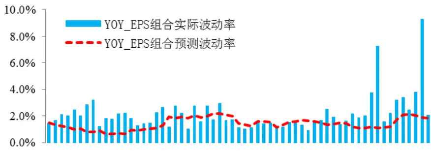
数据来源：国泰君安证券研究

图 31 REVERSE组合预期波动率与实际波动率比较：
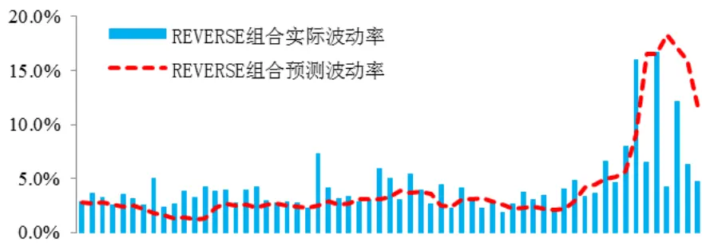
数据来源：国泰君安证券研究

图 32 Est_PB组合预期波动率与实际波动率比较：
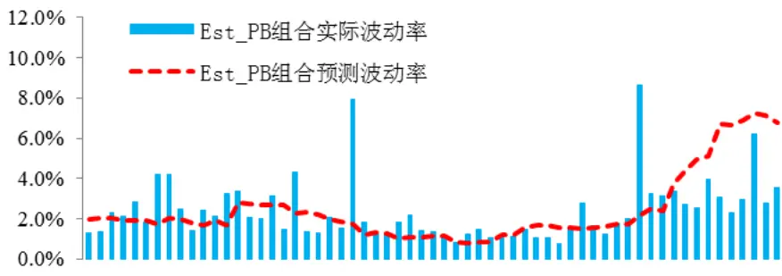
数据来源：国泰君安证券研究

图 33 MOM_Est_PB组合预期波动率与实际波动率比较：
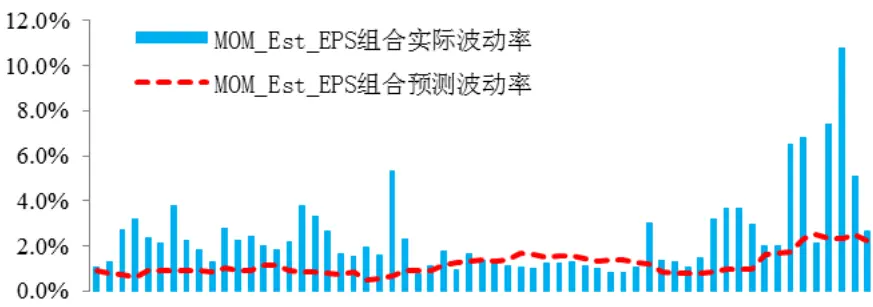
数据来源：国泰君安证券研究

图 34 DISPERSION组合预期波动率与实际波动率比较：
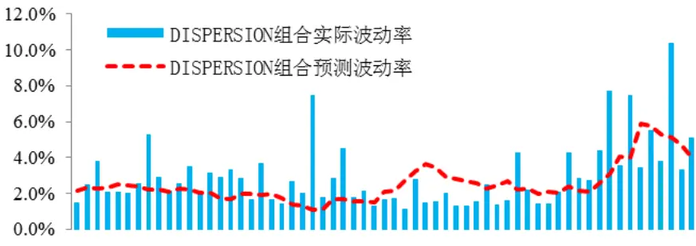
数据来源：国泰君安证券研究

图 35 HTOS组合预期波动率与实际波动率比较：
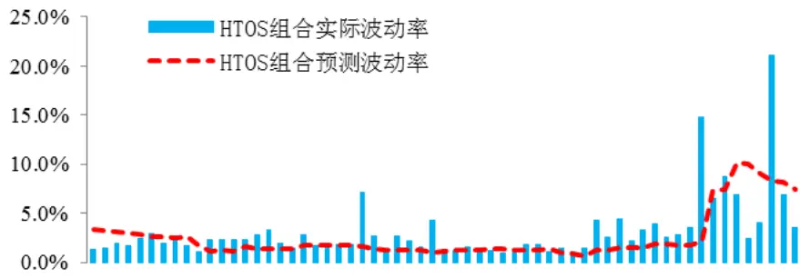
数据来源：国泰君安证券研究

图 36 MOM_ROE组合预期波动率与实际波动率比较：
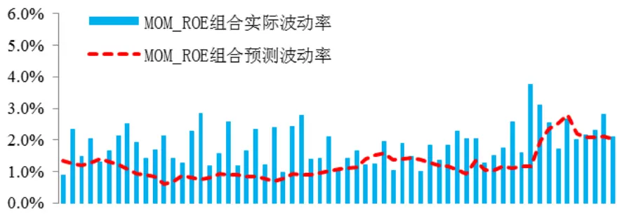
数据来源：国泰君安证券研究

图 37 RATEUP组合预期波动率与实际波动率比较：
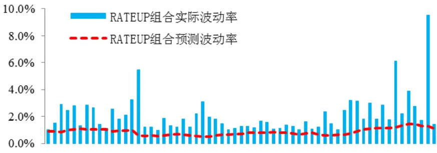
数据来源：国泰君安证券研究

图 38 Earnings Yield 组合预期波动率与实际波动率比较：
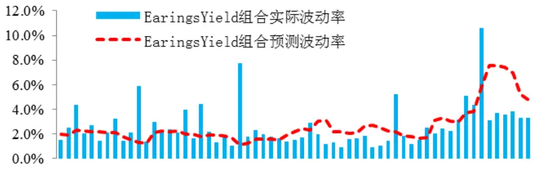
数据来源：国泰君安证券研究

图 39 Liquidity组合预期波动率与实际波动率比较：
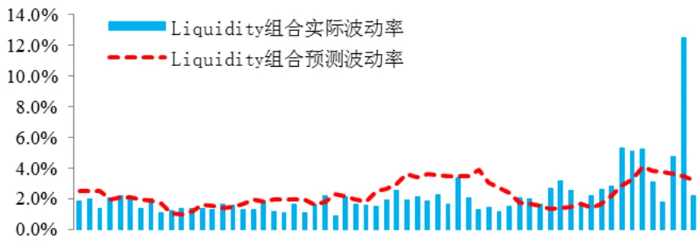
数据来源：国泰君安证券研究

对于上述每个因子每期的预测波动率，我们通过组合的信息比率反推计算得到组合的预期收益率。我们下面将比较每个因子对应 3 中不同方法计算得到的累积预测因子收益率与累积实际因子收益率的比较，并同时比较3种方法的每月预测因子收益率与实际因子收益率偏差的绝对值均值，具体如下图：

图 40 YOY_EPS 累积因子收益率预测
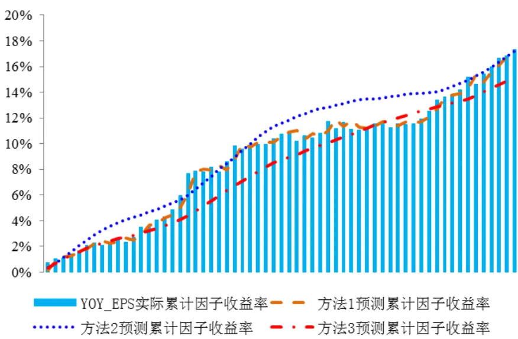

| 方法1月均预测偏差 | 方法2月均预测偏差 | 方法3月均预测偏差 |
| --- | --- | --- |
| 0.51% | 0.37% | 0.34% |

数据来源：国泰君安证券研究

图 41 REVERSE 累积因子收益率预测
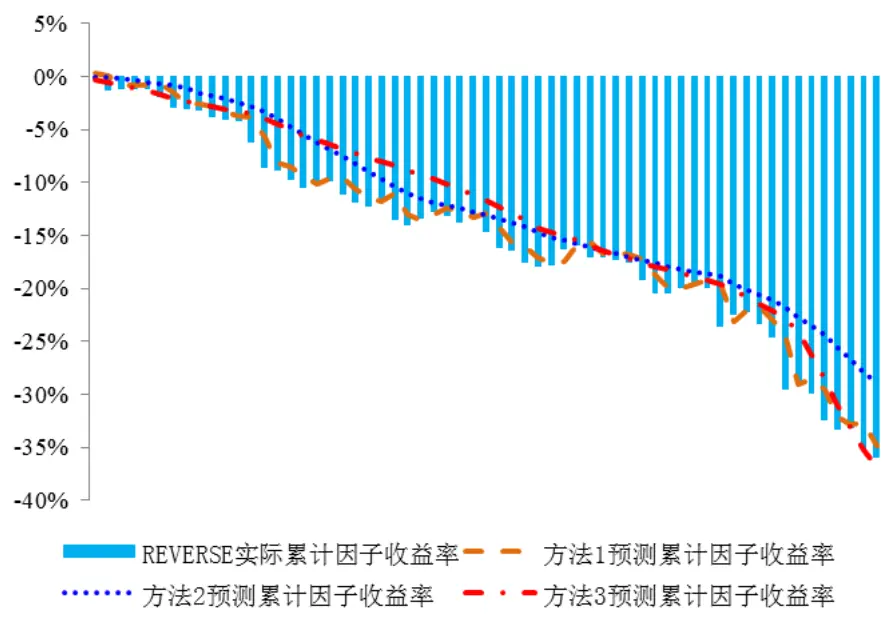
数据来源：国泰君安证券研究

| 方法1月均预测偏差 | 方法2月均预测偏差 | 方法3月均预测偏差 |
| --- | --- | --- |
| 1.09% | 0.77% | 0.76% |

图 42 Est_PB累积因子收益率预测
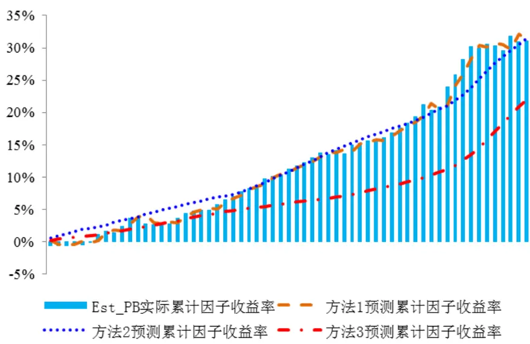

| 方法1月均预测偏差 | 方法2月均预测偏差 | 方法3月均预测偏差 |
| --- | --- | --- |
| 0.76% | 0.62% | 0.65% |

数据来源：国泰君安证券研究

图 43 MOM_Est_EPS 累积因子收益率预测
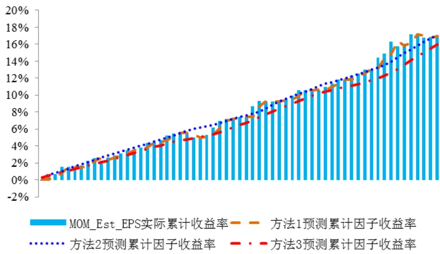
数据来源：国泰君安证券研究

| 方法1月均预测偏差 | 方法2月均预测偏差 | 方法3月均预测偏差 |
| --- | --- | --- |
| 0.41% | 0.32% | 0.30% |

图 44 DISPERSION 累积因子收益率预测
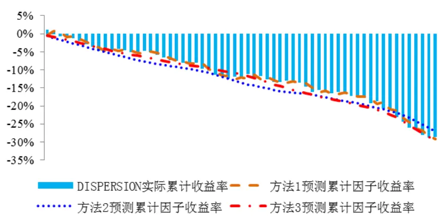

| 方法1月均预测偏差 | 方法2月均预测偏差 | 方法3月均预测偏差 |
| --- | --- | --- |
| 0.89% | 0.60% | 0.56% |

数据来源：国泰君安证券研究

图 45 HTOS累积因子收益率预测
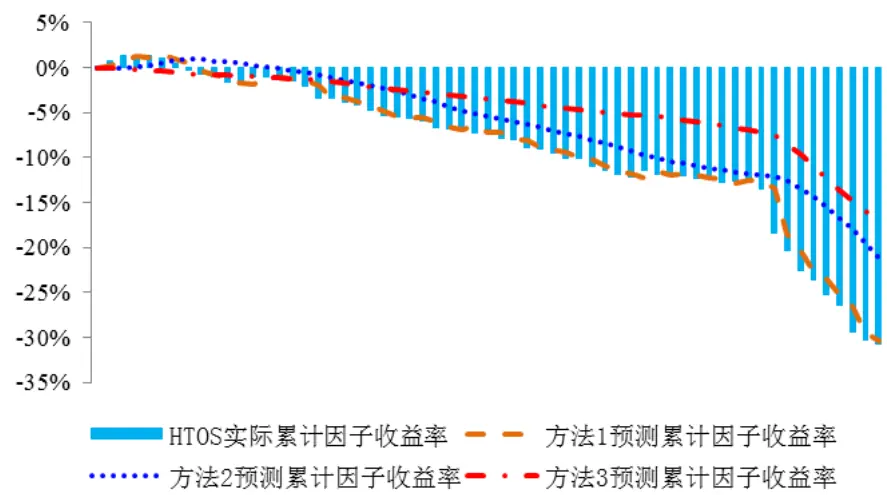

| 方法1月均预测偏差 | 方法2月均预测偏差 | 方法3月均预测偏差 |
| --- | --- | --- |
| 0.63% | 0.49% | 0.46% |

数据来源：国泰君安证券研究

图 46 MOM_ROE累积因子收益率预测
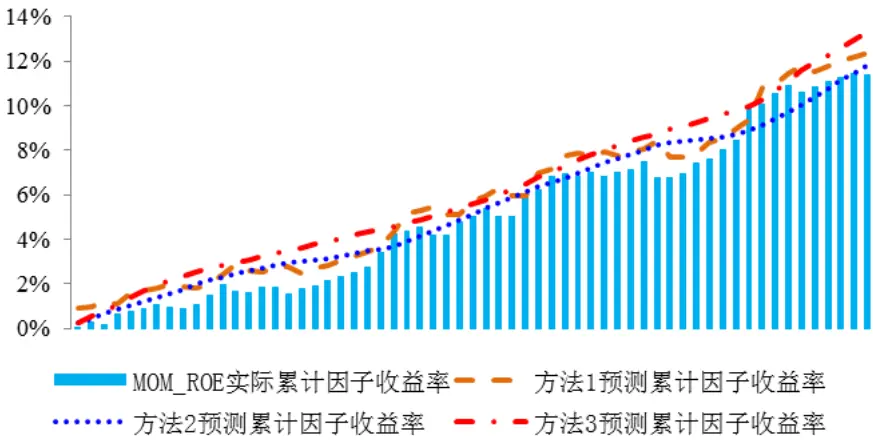

数量化专题报告

| 方法1月均预测偏差 | 方法2月均预测偏差 | 方法3月均预测偏差 |
| --- | --- | --- |
| 0.35% | 0.26% | 0.25% |

数据来源：国泰君安证券研究

图 47 RATEUP累积因子收益率预测
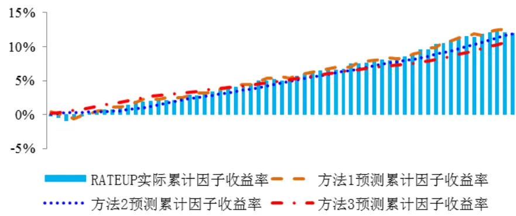

| 方法1月均预测偏差 | 方法2月均预测偏差 | 方法3月均预测偏差 |
| --- | --- | --- |
| 0.30% | 0.23% | 0.21% |

数据来源：国泰君安证券研究

图 48 EarningsYield 累积因子收益率预测
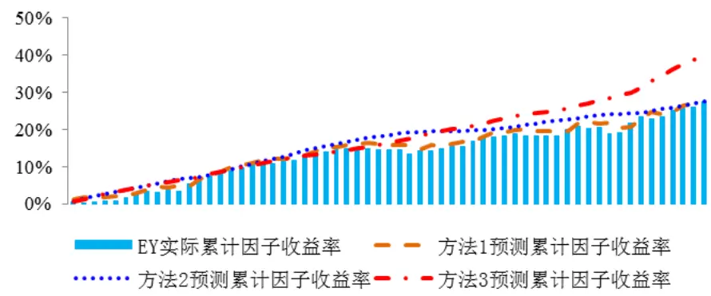

| 方法1月均预测偏差 | 方法2月均预测偏差 | 方法3月均预测偏差 |
| --- | --- | --- |
| 0.78% | 0.58% | 0.58% |

数据来源：国泰君安证券研究

图 49 Liquidity 累积因子收益率预测
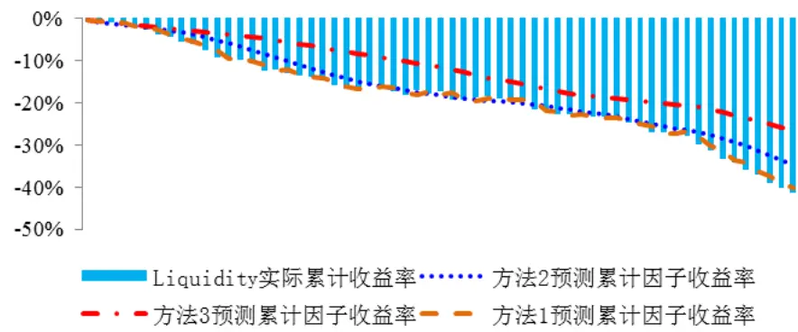

| 方法1月均预测偏差 | 方法2月均预测偏差 | 方法3月均预测偏差 |
| --- | --- | --- |
| 0.75% | 0.54% | 0.60% |

数据来源：国泰君安证券研究

表 9: 预测偏差汇总统计：

| 预测偏差汇总统计 | 方法1 方法2 | 方法3 |
| --- | --- | --- |
| YOY_EPS | 0.51% 0.37% | 0.34% |
| REVERSE | 1.09% 0.77% | 0.76% |
| EST_PB | 0.76% 0.62% | 0.65% |
| MOM_Est_EPS | 0.41% 0.32% | 0.30% |
| DISPERSION | 0.89% 0.60% | 0.56% |
| HTOS | 0.63% 0.49% | 0.46% |
| MOM_ROE | 0.35% 0.26% | 0.25% |
| RATEUP | 0.30% 0.23% | 0.21% |
| Earnings_Yield | 0.78% 0.58% | 0.58% |
| Liquidity | 0.75% 0.54% | 0.60% |

数据来源：国泰君安证券研究

从上述因子收益率的预测结果来看，3 种方法均能一定程度上对因子收益率起到一定的预测作用。从预测偏差的统计来看，方法 1在所有因子上的预测偏差均是最大的。而除了在因子 Est_PB和 Liquidity以外，其余所有的因子收益率预测均是方法 3的预测偏差最小，这体现了最小波动纯因子组合的性质在对因子收益率预测方面的优势，也为之后最优投资组合的构建奠定了一定的基础。

那么到此为止，我们已经完成了将阿尔法因子转化为超额收益的第一步，即定义和寻找若干阿尔法因子，并对阿尔法因子收益率进行了定量的预测。后期的研究将在此基础上，解决阿尔法因子与风险模型相结合的应用问题。

## 6. 总结与展望

本系列报告《如何将阿尔法因子转化为超额收益》在原报告风险模型的基础上，重点阐述阿尔法因子与风险模型相结合的应用问题，力争使策略在风险精确可控的前提下获得更高的超额收益率。

为了深入探究阿尔法因子的内在收益风险特征，我们着重研究了因子的组合特征，从简单因子组合到纯因子组合到最小波动纯因子组合，逐步实现了将阿尔法因子的收益风险从市场、行业、风格等因素中的剥离，并且控制了组合残差对收益的不确定性影响。因此可以说，最小波动纯因子组合是检验阿尔法因子的最完备组合，可真正意义上判断因子是否具备阿尔法属性。

在此基础上，我们通过定义基于风险模型的阿尔法因子检验的一般流程，对若干阿尔法因子的组合特征进行了统计，找到了包括Y O Y E P S_ 、 REVERSE 、 Est P B_ 、 M O M Est EP S_ _ 、

D ISPERSION 、HTO S 、M O M R O E_ 、RATEUP 、EarningsYield

和 Liquidity 在内的 10 类阿尔法因子。

最 后 ， 我 们 根 据 最 小 波 动 纯 因 子 组 合 的 性 质 ， 利 用$\hat{f}_{_{alpha}}=E(r_{_{alpha}}^{^{m\nu pfp}})=IR\cdot\hat{\sigma}_{_{alpha}}^{^{m\nu pfp}}$ 的思想，实现了对阿尔法因子收益率的定量预测。在与另外两种基础方法的比较中，我们发现该方法对收益率的预测偏差较小，预测精度最为理想。

到此为止，我们已经完成了将阿尔法因子转化为超额收益的第一步，即定义和寻找若干阿尔法因子，并预测阿尔法因子收益率。然而，找到有效的阿尔法因子与最终实现阿尔法因子所包含的超额收益还有着本质的区别，最根本的问题在于组合是否真正将投资经理所选择的阿尔法因子的敞口充分有效的暴露，并同时保持组合整体风险可控。

在本系列后续的研究报告中，我们将开始研究阿尔法因子与风险模型相结合的应用问题，并尝试解答如何将阿尔法因子转化为超额收益的几个重要问题，例如：1）影响阿尔法因子实际暴露的几个因素；2）是否需要将阿尔法因子加入风险矩阵；3）风险模型对阿尔法因子收益率的损耗及最优跟踪误差设定等。

当前市场环境对量化对冲、市场中性策略而言比较困难，因此我们也会将策略重点臵于基于成分股权重优化的指数增强型策略以及小规模的阿尔法对冲策略的实证研究。

阿尔法超额收益的实现是一项十分精密的工作，本系列报告希望能对仍然坚守在阿尔法阵营的投资者所有启发帮助，静待市场环境恢复常态。

## 本公司具有中国证监会核准的证券投资咨询业务资格

## 分析师声明

作者具有中国证券业协会授予的证券投资咨询执业资格或相当的专业胜任能力，保证报告所采用的数据均来自合规渠道，分析逻辑基于作者的职业理解，本报告清晰准确地反映了作者的研究观点，力求独立、客观和公正，结论不受任何第三方的授意或影响，特此声明。

## 免责声明

本报告仅供国泰君安证券股份有限公司（以下简称“本公司”）的客户使用。本公司不会因接收人收到本报告而视其为本公司的当然客户。本报告仅在相关法律许可的情况下发放，并仅为提供信息而发放，概不构成任何广告。

本报告的信息来源于已公开的资料，本公司对该等信息的准确性、完整性或可靠性不作任何保证。本报告所载的资料、意见及推测仅反映本公司于发布本报告当日的判断，本报告所指的证券或投资标的的价格、价值及投资收入可升可跌。过往表现不应作为日后的表现依据。在不同时期，本公司可发出与本报告所载资料、意见及推测不一致的报告。本公司不保证本报告所含信息保持在最新状态。同时，本公司对本报告所含信息可在不发出通知的情形下做出修改，投资者应当自行关注相应的更新或修改。

本报告中所指的投资及服务可能不适合个别客户，不构成客户私人咨询建议。在任何情况下，本报告中的信息或所表述的意见均不构成对任何人的投资建议。在任何情况下，本公司、本公司员工或者关联机构不承诺投资者一定获利，不与投资者分享投资收益，也不对任何人因使用本报告中的任何内容所引致的任何损失负任何责任。投资者务必注意，其据此做出的任何投资决策与本公司、本公司员工或者关联机构无关。

本公司利用信息隔离墙控制内部一个或多个领域、部门或关联机构之间的信息流动。因此，投资者应注意，在法律许可的情况下，本公司及其所属关联机构可能会持有报告中提到的公司所发行的证券或期权并进行证券或期权交易，也可能为这些公司提供或者争取提供投资银行、财务顾问或者金融产品等相关服务。在法律许可的情况下，本公司的员工可能担任本报告所提到的公司的董事。

市场有风险，投资需谨慎。投资者不应将本报告作为作出投资决策的唯一参考因素，亦不应认为本报告可以取代自己的判断。
在决定投资前，如有需要，投资者务必向专业人士咨询并谨慎决策。

本报告版权仅为本公司所有，未经书面许可，任何机构和个人不得以任何形式翻版、复制、发表或引用。如征得本公司同意进行引用、刊发的，需在允许的范围内使用，并注明出处为“国泰君安证券研究”，且不得对本报告进行任何有悖原意的引用、删节和修改。

若本公司以外的其他机构（以下简称“该机构”）发送本报告，则由该机构独自为此发送行为负责。通过此途径获得本报告的投资者应自行联系该机构以要求获悉更详细信息或进而交易本报告中提及的证券。本报告不构成本公司向该机构之客户提供的投资建议，本公司、本公司员工或者关联机构亦不为该机构之客户因使用本报告或报告所载内容引起的任何损失承担任何责任。

## 评级说明

## 1.投资建议的比较标准

投资评级分为股票评级和行业评级。

以报告发布后的12个月内的市场表现为比较标准，报告发布日后的 12个月内的公司股价（或行业指数）的涨跌幅相对同期的沪深 300 指数涨跌幅为基准。

## 2.投资建议的评级标准

报告发布日后的 12 个月内的公司股价（或行业指数）的涨跌幅相对同期的沪深 300 指数的涨跌幅。

| 评级 | 说明 |  |
| --- | --- | --- |
| 股票投资评级 | 增持 | 相对沪深 300指数涨幅15%以上 |
|  | 谨慎增持 | 相对沪深300指数涨幅介于5%～15%之间 |
|  | 中性 | 相对沪深300指数涨幅介于-5%～5% |
|  | 减持 | 相对沪深300指数下跌5%以上 |
| 行业投资评级 | 增持 | 明显强于沪深 300 指数 |
|  | 中性 | 基本与沪深300指数持平 |
|  | 减持 | 明显弱于沪深300指数 |

## 国泰君安证券研究

|  | 上海 | 深圳 | 北京 |
| --- | --- | --- | --- |
| 地址 | 上海市浦东新区银城中路168号上海 银行大厦29层 | 深圳市福田区益田路 6009 号新世界 商务中心34层 | 北京市西城区金融大街28 号盈泰中 心2号楼10层 |
| 邮编 | 200120 | 518026 | 100140 |
| 电话 | (021)38676666 | （0755)23976888 | (010)59312799 |
|  | E-mail: gtjaresearch@gtjas.com |  |  |