inInfo] [Table_Title] 2016.03.07

# 基于均线择时的保本基金设计

## ——数量化专题之六十九

刘富兵（分析师）

王浩（研究助理）

8 021-38676673

021-38676434

liufubing008481@gtjas.com

wanghao014399@gtjas.com

证书编号 S0880511010017

S0880114080041

本报告导读：本报告在传统保本基金的设计中加入了择时判断指标，构建了单一资产、多资产和分级保本基金组合，在不同时期内都取得了不错的效果。

## 摘要：

[Table_Summary] • 历史经验表明市场牛熊转换期间保本基金会迎来发展机遇：2012年末相比于2008 年末保本基金规模增长 6倍；2015年末相比于2014年末保本基金规模已经增长 2倍。

- 目前发行的保本基金投资策略主要包括 CPPI、TIPP、OBPI和 VPPI 等国际常用的方法，传统保本策略没有加入对市场趋势的判断，即使在股票资产下跌趋势中仍然可能重仓买入从而造成损失，因此我们可以在保本基金设计中加入择时指标加以改进。

- 单均线突破是趋势跟踪中的一种有效策略，构建单一资产的30日均线突破策略，CPPI 和TIPP保本基金的业绩有了显著提高，2014-2016 保本期的年化收益率超过 20%，最大回撤降低到了10%以内，夏普比率接近 2。

- 单一指数资产使用均线策略不一定能取得很好的效果，我们可以利用 88 个申万二级行业指数构建多资产保本组合，以站上 30 日均线行业比例 P 作为牛熊分界指标，回测数据表明40%和60%可以作为不错的买入卖出信号。

2005 年-2016 年定投均线择时 CPPI 和 TIPP 保本基金，当 M=2时，CPPI 策略定投年化收益率 16.9%，最大回撤 12.7%，夏普比率 1.8，TIPP 策略定投年化收益率 14.5%，最大回撤10.5%，夏普比率 1.9。

2013-2015年分级AB的轮动保本基金表现优异，尤其是在股灾期间，分级A作为对冲分级 B下跌的有效工具，减少了整体净值回撤，当M=2时，CPPI和TIPP 分级AB 轮动保本组合年化收益率达到 23.2%和 24.4%，最大回撤 11%和 9.7%，夏普比率 1.7 和 2.2。

## 金融工程团队：

刘富兵：（分析师）

电话：021-38676673

邮箱：liufubing008481@gtjas.com

证书编号：S0880511010017

刘正捷：（分析师）

电话：0755-23976803

邮箱：liuzhengjie012509@gtjas.com

证书编号：S0880514070010

李雪君：（分析师）

电话：021-38675855

邮箱：lixuejun@gtjas.com

证书编号：S0880515070001

王浩：（研究助理）

电话：021-38676434

邮箱：wanghao014399@gtjas.com

证书编号：S0880114080041

## 陈奥林：（研究助理）

电话：021-38674835

邮箱：chenaolin@gtjas.com

证书编号：S0880114110077

李辰：（研究助理）

电话：021-38677309

邮箱：lichen@gtjas.com

证书编号：S0880114060025

## [Table_R相关报告

《如何将阿尔法因子转化为超额收益（上）》2016.03.01

《择时新视角：捕捉趋势中的绝对收益》2016.01.18

《商誉：外延式成长的烦恼》2016.01.16

《指数投资新时代》2015.11.20

《期权在投资中的应用》2015.11.18

## 1. 保本基金市场概述

自 2003 年第一只保本基金-南方避险增值发行以来，保本基金市场稳步增长，截至2016年2 月共有103只保本基金，规模达到 1482亿。历史经验表明市场牛熊转换期间保本基金会迎来发展机遇：2012年末相比于2008年末保本基金规模增长 6 倍；2015年末相比于2014年末保本基金规模已经增长2倍。

图 1：保本基金发展状况（截至 2016 年 2 月 16 日）
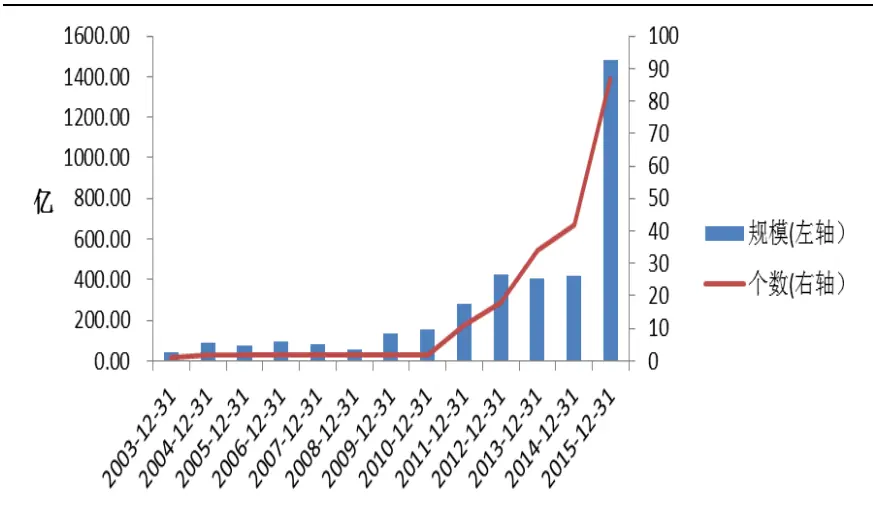
数据来源：国泰君安证券研究，wind

2015 年 A 股市场经历了大起大落的过山车行情，多数基金净值大幅回撤，高位建仓的股票型基金甚至面临亏损，然而保本基金却一枝独秀，为投资者保存了牛市行情中大部分的收益，2015年保本型基金的平均收益率约为20%，最大回撤基本都在15%以内，全部实现了保本。

表 1： 2015 年收益率排名前十的保本型基金

| 代码 | 名称 | 基金成立日 | 2015年收益率 | 最大回撤 | 最新规模(亿元) |
| --- | --- | --- | --- | --- | --- |
| 000072.0F | 华安保本 | 2013-05-14 | 42.6% | -10.9% | 4.9 |
| 000030.OF | 长城久利保本 | 2013-04-18 | 40.8% | -11.4% | 12.7 |
| 200016.0F | 长城保本 | 2012-08-02 | 29.9% | -12.0% | 17.1 |
| 180028.0F | 银华永祥保本 | 2011-06-28 | 28.4% | -14.1% | 1.3 |
| 000270.0F | 建信安心保本 | 2013-09-03 | 27.7% | -6.4% | 4.2 |
| 020018.0F | 国泰金鹿保本五期 | 2014-08-26 | 27.0% | -8.5% | 3.3 |
| 000900.OF | 新华阿鑫一号保本 | 2014-12-02 | 26.4% | -10.8% | 10.6 |
| 000166.0F | 中海安鑫保本 | 2013-07-31 | 25.8% | -10.4% | 8.8 |
| 000126.0F | 招商安润保本 | 2013-04-19 | 24.3% | -17.4% | 13.6 |
| 163823.0F | 中银保本 | 2012-09-19 | 23.4% | -17.0% | 67.1 |

数据来源：国泰君安证券研究，wind

2016年，随着全球经济疲软，世界各国的股市相继迈入了技术性熊市，A 股市场 2016 年 1 月份也触发了两次熔断，市场波动加剧，投资者避嫌情绪浓厚，保本型产品受到投资者的追捧，截至 2 月 16 日，2016 年新成立的 143 只基金总规模为 773 亿元，其中保本基金有 15 只，规模为450亿，占比达到 58%，在目前股指期货受到限制、期权成交仍然不活跃，打新收益持续下降的市场环境之下，绝对收益投资者未来会将更多的关注点投向保本基金，2016年保本基金再次迎来发展机遇。

图 2：2016年新成立基金规模（截至 2016年 2月 16日）
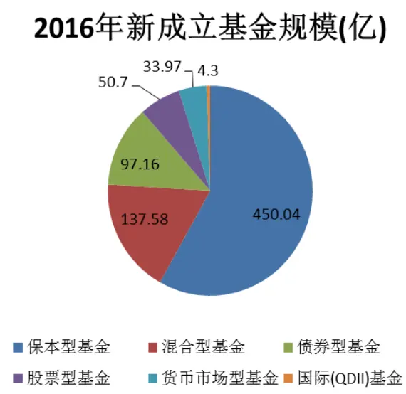
数据来源：国泰君安证券研究，wind

## 2. 保本策略回顾

## 2.1. 策略概述

目前发行的保本基金投资策略主要包括 CPPI、TIPP、OBPI 和 VPPI 等国际常用的方法，在实际投资中基金经理会对仓位的控制进行主动和被动优化。由于CPPI策略（固定比例投资组合保险）和TIPP 策略（时间不变性投资组合保险）简易实用，因此成为保本基金主流的投资方法。71%的保本基金采用 CPPI 策略，13%采用 CPPI+ TIPP 相结合的策略，66%的保本周期为3年，33%的保本周期为2 年。

图 3：保本策略分类（截至 2016年 2月 16日）
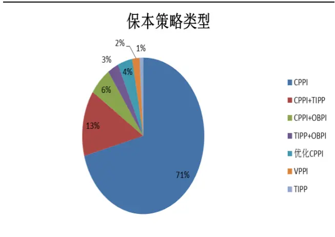
数据来源：国泰君安证券研究，wind

图 4保本周期分类（截至 2016年 2月 16日）
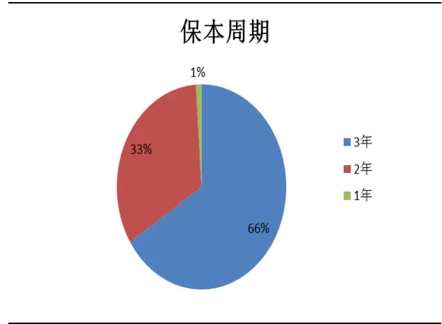
数据来源：国泰君安证券研究，wind

## CPPI：

CPPI策略将资产分为无风险资产和风险资产两部分，根据市场的波动和组合安全垫动态调整保本资产与收益资产投资的比例，从而实现到期时保本，主要分为以下两步：

1. 根据保本周期末投资组合最低目标价值和合理的贴现率，确定基金当期投资于安全资产的最小比例，即投资组合的安全底线 Ft。

$$
F_{\mathrm{t}}=F_{\mathrm{T}}*e^{-r(\mathrm{T}-\mathrm{t})}
$$

2. 确定安全垫的放大倍数—风险乘数M，从而确定投资于风险资产的价值Et，其中Vt为资产总值，剩余资产投资于安全资产 Dt。

$$
E_{\mathrm{t}}=\mathrm{M}*\left(V_{\mathrm{t}}-F_{\mathrm{t}}\right)
$$

$$
\mathtt{D}_{\mathtt{t}}=V_{\mathtt{t}}-E_{\mathtt{t}}
$$

TIPP：

TIPP 和CPPI的调整公式非常类似，TIPP 增加了保本比例调整策略，相比于 CPPI 更加保守，产品的最低保险金额是一个动态调整的值，即当产品净值上升时，则动态保本比例会相应的提高，从而锁定利润，其中f为固定的保本比率。

$$
F_{\mathsf{t}}=\operatorname*{max}(\mathrm{V}_{t}*\mathrm{f},F_{\mathsf{t-1}})
$$

## 2.2. 传统保本策略的缺陷

影响保本策略效果主要有两个因素调仓方法和风险乘数。

## 2.2.1. 调仓方法

为了实现保本，必须根据最新计算的安全垫调整风险资产比例，否则资产组合会有缺口风险，然而频繁的调仓会增加交易成本，传统调仓方法包括固定时间调仓和阈值触发调仓等。

## 回测参数

回测周期：2014/2/16-2016/2/16

风险资产：万得全 A 指数

低风险资产：中证全债指数

交易成本：1%（单边）

保本率：100%

无风险贴现率：2%

风险乘数：M=2

固定保本比率： f=0.8

固定时间调仓即在保本期间选择固定的时间（10 天、20 天、30 天等）动态调整风险资产仓位，该方法操作比较呆板，容易错失调整的最佳时间。

利用固定时间调仓， CPPI和 TIPP 策略在股灾时仍然保持较高仓位，导

致风险资产出现较大回撤。CPPI策略在回测期内的最高仓位达到80%，直到大盘下跌很多后才开始调仓，严重滞后。

图 5：固定时间调仓CPPI策略（20天）
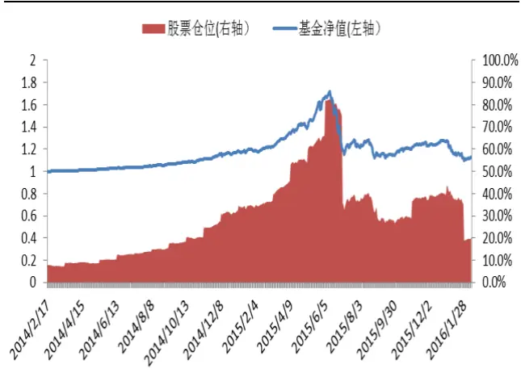
数据来源：国泰君安证券研究，wind

图 6：固定时间调仓 TIPP策略（20天）
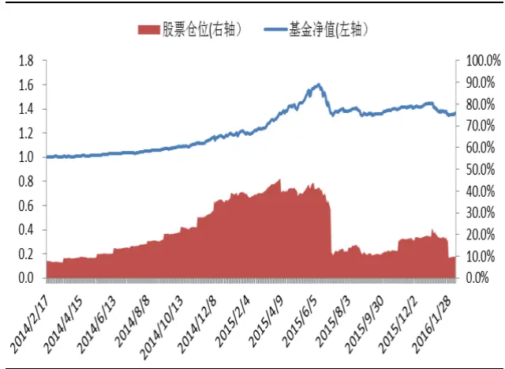
数据来源：国泰君安证券研究，wind

触发阈值调仓即风险资产价格相比于前一次调仓时上涨或下跌一定百分比（5%，10%，15%）后调整仓位。

利用触发阈值调仓，仓位调整更加迅速，在股灾时能快速降低仓位，然而如果市场出现连续暴跌，基金净值同样会出现较大波动，并不能有效减少回撤。

图 7：阈值触发调仓CPPI策略（10%）
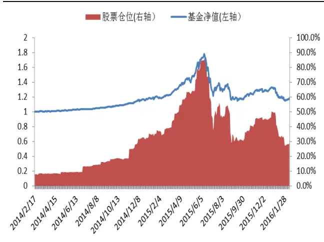
数据来源：国泰君安证券研究，wind

图 8：阈值触发调仓 TIPP策略（10%）
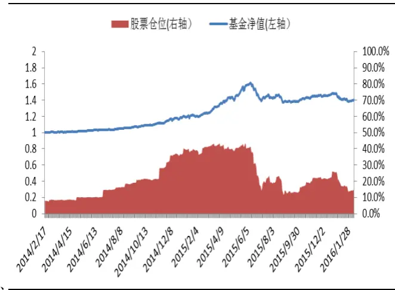
数据来源：国泰君安证券研究，wind

表 2：传统 CPPI 和 TIPP 策略业绩

| 保本策略 | CPPI |  |  | TIPP |  |
| --- | --- | --- | --- | --- | --- |
| 调仓方法 | 固定时间 | 触发阈值 | 固定时间 | 触发阈值 |  |
| 年化收益率 | 7.70% | 10.50% | 16.40% |  | 17.97% |
| 年化波动率 | 17.50% | 18.60% |  | 9.50% | 9.60% |
| 最大回撤 | -35.90% | -35.60% |  | -16.20% | -15.19% |

数据来源：国泰君安证券研究，wind

## 2.2.2. 风险乘数

风险乘数一般是固定的，然而当市场波动较大时，尤其是在下跌环境中，维持固定风险乘数M 会造成较大回撤。

对不同风险乘数的CPPI策略，牛市中M值越大，获得收益的能力越强，然而由于股票资产比例较高，整体净值波动加剧，熊市中下跌风险也加剧。

图 9：阈值触发调仓 CPPI 策略 (M=1，2，3)
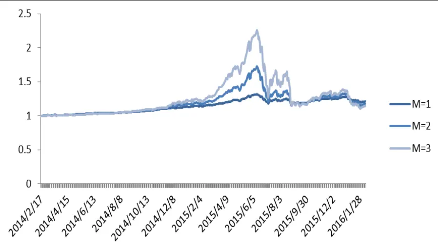
数据来源：国泰君安证券研究，wind

对不同风险乘数的TIPP 策略，牛市中M值越大，获得收益的能力越强，然而相比于CPPI更为保守，因此TIPP 策略累计最高收益更低。但在下跌环境中降低仓位，锁定收益，整体净值波动更小。

图 10：阈值触发调仓 TIPP 策略 (M=1，2，3)
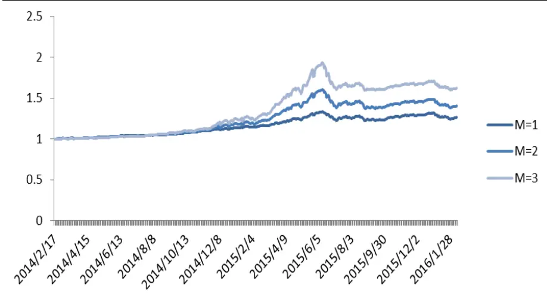
数据来源：国泰君安证券研究，wind

## 2.3. 总结

从万得全 A 指数和 CPPI 保本基金的日收益率分布来看，保本基金的特点在于极端收益率更少，尤其是负收益率，同时收益率分布峰值集中在正值，从而实现保本。

图 11：wind全 A的日收益率分布
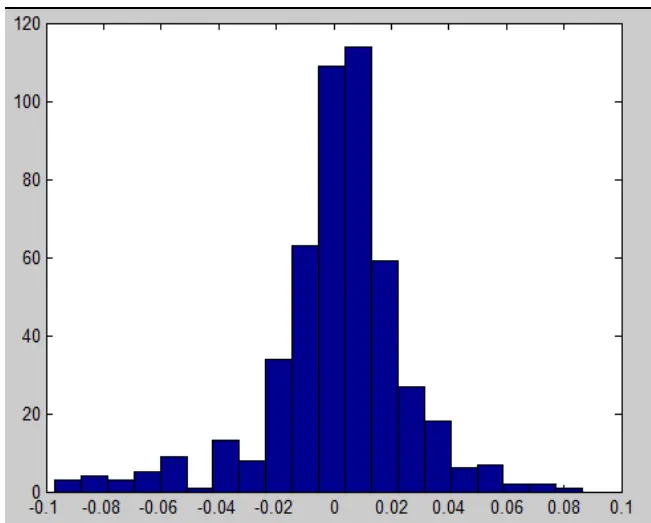
数据来源：国泰君安证券研究，wind

图 12：CPPI保本基金的日收益率分布
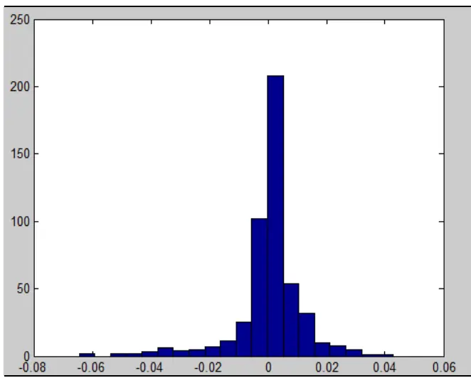
数据来源：国泰君安证券研究，wind

## CPPI 策略：

1. 在牛市中，净值上升潜力更大，股票仓位随整体净值上涨而迅速提高，而在熊市中，仓位则迅速下降，属于追涨杀跌策略。

2. CPPI策略对路径有依赖性，如果安全垫较低，即使在牛市中也不会大幅买入股票，错失机会。如果安全垫较高，即使在熊市也可能保持高仓位持有股票。

## TIPP 策略：

1. 在牛市中，股票仓位更加保守，安全底线随净值上升而提高，锁定利润。而在熊市中，仓位则迅速下降，在净值不创新高前股票仓位较低。

2. TIPP 策略对路径也有依赖性，由于其不断提高安全底线，降低股票仓位，因此比 CPPI 更为保守，如果此前安全底线较高，净值暴跌后则几乎不会买入股票，例如此次股灾之后，TIPP 策略的安全底线仍然保持在牛市最高点的位臵，因此后续即使有上涨行情也几乎空仓。

## 3. 单均线择时的保本基金

## 3.1. 单均线突破策略

从传统保本策略的回测效果来看，调仓时间决定了加仓买入和减仓卖出的时点，对基金整体收益率和保本效果影响较大，而风险乘数则体现了投资者的风险收益偏好，风险乘数越大，创造的收益越高，同时也伴随着更高的净值波动和回撤。

CPPI和 TIPP 策略本质上是构建一个类似于看涨期权的资产组合，其主要收益来源于股票资产的上涨，固定收益资产只是为了提供安全垫。传统保本策略只是根据安全底线动态调整仓位，并没有加入对市场趋势的判断，即使在股票资产表现不佳时仍然可能重仓买入，造成损失，因此我们可以在保本基金设计中加入对市场择时的判断。

此前在《动量测评之均线策略——数量化专题之五十六》中，我们验证了单均线突破策略的长期有效性，即当收盘价站上均线就以当期收盘价买入，当收盘价跌破均线就以当期收盘价卖出，该策略过去 10 年用在万得全A 指数能够取得超过 20%的年化收益率。因此我们可以将该趋势策略引入到 CPPI和TIPP保本基金的设计中：

我们以股票指数的N日均线作为调仓信号，即当收盘价大于N日均线时，风险乘数 M=2，通过当前的安全底线和 CPPI、TIPP 公式计算股票买入比例；当收盘价小于 N日均线时，卖出所有股票仓位，买入债券资产。

$$
\mathrm{m}=\{\begin{array}{ll}{2\qquad}&{\mathrm{i}|\dot{\bar{x}}1\mathrm{\normalfont~\hat{y}_~N_\varepsilon~}\rrangle\mathrm{\normalfont~\hat{z}_\varepsilon\hat{z}_\varepsilon\hat{z}_\varepsilon\hat{z}_\varepsilon\hat{z}_\varepsilon\hat{z}_\varepsilon\hat{z}_\varepsilon\hat{z}_\varepsilon}}\\{0\qquad}&{\mathrm{i}|\dot{\bar{x}}1\mathrm{\normalfont~\hat{y}_\varepsilon\hat{z}_\varepsilon\hat{z}_\varepsilon\hat{z}_\varepsilon\hat{z}_\varepsilon\hat{z}_\varepsilon\hat{z}_\varepsilon\hat{z}_\varepsilon\hat{z}_\varepsilon\hat{z}_\varepsilon}}\end{array}
$$

30日均线是技术分析中判断股票价格中期强弱的经典指标，因此我们首先以N=30，作为 CPPI和TIPP 策略的调仓信号。

图 13：30 日均线 CPPI 策略
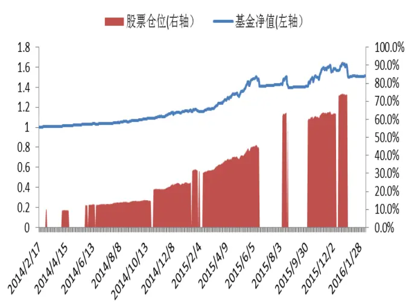
数据来源：国泰君安证券研究，wind

图 14：30 日均线 TIPP 策略
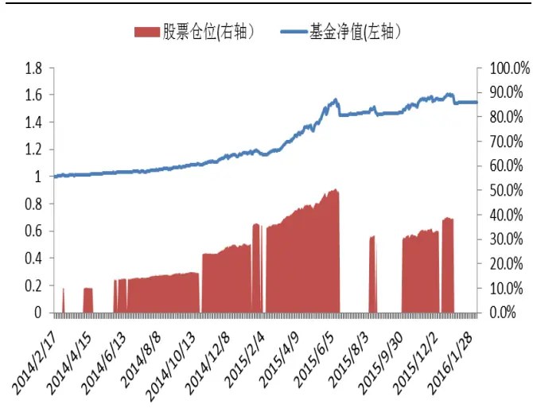
数据来源：国泰君安证券研究，wind

加入简单的均线择时策略之后，CPPI和 TIPP 保本基金的年化收益率有了非常显著的提高，年化收益率超过 20%，同时最大回撤降低到了10%以内，由于 TIPP 策略带有止盈和最高仓位限制，因此其年化波动率和最大回撤相比于CPPI策略更小。夏普比率达到了 2.59。

表 3：30 日均线 CPPI 和 TIPP 保本策略业绩

| 保本策略 | CPPI TIPP |
| --- | --- |
| 年化收益率 | 21.98% 22.89% |
| 年化波动率 | 11.74% 8.83% |
| 最大回撤 | -8.45% -7.36% |
| 夏普比率 | 1.87 2.59 |

数据来源：国泰君安证券研究，wind

## 3.2. 保本风险估算

保本基金是将安全垫放大M倍后投资于风险资产，理论上应该随时根据安全垫动态调整风险资产比例，否则将面临安全垫损失风险。而单均线策略则是在突破均线加仓，跌破均线后平仓，因此最大的风险点在于从突破均线买入后到下一次跌破均线卖出时股票资产跌幅>1/M，即最大损失超过安全垫资产：

$$
\mathrm{Pct}(T_{1},T_{2})<-\frac{1}{M}
$$

T1：突破均线买入时点T2：跌破均线卖出时点

我们统计了 wind 全 A 指数 2002 年 1 月 1 日至今的突破 30 日均线策略的各项指标，突破30 日均线共计107次，平均持仓时间大约是 17个交易，最长持仓时间是130个交易，最短持仓时间是1个交易日，期间最大涨幅是 130.4%，最大跌幅是-5.7%。因此如果从历史数据来看，风险乘数 M 的理论最大值可以取到 17 也可以实现保本，当然实际考虑到换仓成本和风险，我们不会取这么大的值，然而通过均线调仓的方法我们可以更好的控制资产风险。

表 4：wind 全 A 指数 2002/1/1-2016/1/1 突破 30 日均线策略统计

| Pct（T1，T2）统计指标 | 数值 |
| --- | --- |
| 次数 | 107 |
| 平均涨跌幅 | 3.6% |
| 最大涨幅 | 130.4% |
| 最大跌幅 | -5.8% |
| 平均持续时间（交易日） | 17 |
| 最长时间（交易日） | 130 |
| 最短时间（交易日） | 1 |
| M极限值 | 17 |

数据来源：国泰君安证券研究，wind

## 3.3. 不同均线保本基金业绩

以上我们采用了 30 日均线作为调仓指标，接下来，我们也测试其他均线的整体表现，目前保本基金周期一般为 3 年，我们采用不同均线，滚动测算3年期的保本策略效果，可以看出不同保本周期内的均线突破策略收益表现有所差别，例如 2007 年-2010 年保本周期内 20 日均线策略效果最好，30 日均线表现最差，2013 年-2016 年保本周期内 30 日均线策略最好，而 20 日均线表现一般，如果从收益回撤比来看 20 和 30 日均线表现较好。不论是采用何种均线策略，在所有保本周期内都实现保本，取得正收益。表现最差的保本周期是在 2009-2014 年，期间万得全A 指数呈现震荡下跌趋势，各类均线策略的年化收益率在 2-3%左右，略低于3年定存利率。

表 5：不同均线保本策略年化收益率（滚动三年）

| 均线 | 10 | 20 | 30 | 60 | 120 | 250 |
| --- | --- | --- | --- | --- | --- | --- |
| 2005/1/1-2008/1/1 | 26.8% | 39.6% | 36.7% | 36.9% | 27.2% | 32.9% |
| 2006/1/1--2009/1/1 | 13.0% | 19.2% | 19.0% | 10.0% | 5.0% | 5.2% |
| 2007/1/1--2010/1/1 | 10.8% | 17.0% | 7.4% | 8.4% | 9.4% | 7.7% |
| 2008/1/1--2011/1/1 | 8.0% | 10.2% | 8.8% | 10.1% | 11.0% | 9.6% |
| 2009/1/1--2012/1/1 | 3.3% | 4.4% | 3.5% | 2.1% | 4.0% | 3.1% |
| 2010/1/1--2013/1/1 | 3.1% | 3.6% | 3.6% | 3.1% | 3.5% | 3.7% |
| 2011/1/1--2014/1/1 | 1.2% | 2.2% | 1.9% | 1.5% | 2.0% | 2.4% |
| 2012/1/1--2015/1/1 | 4.1% | 6.0% | 6.0% | 4.9% | 5.6% | 5.4% |
| 2013/1/1--2016/1/1 | 8.6% | 10.9% | 16.1% | 9.7% | 6.6% | 7.6% |

数据来源：国泰君安证券研究，wind

表 6：不同均线保本策略最大回撤（滚动三年）

| 均线 | 10 | 20 | 30 | 60 | 120 | 250 |
| --- | --- | --- | --- | --- | --- | --- |
| 2005/1/1-2008/1/1 | -18.1% | -18.4% | -16.0% | -14.2% | -12.6% | -13.8% |
| 2006/1/1--2009/1/1 | -24.4% | -19.3% | -15.1% | -10.8% | -3.3% | -3.1% |
| 2007/1/1--2010/1/1 | -6.9% | -5.4% | -5.3% | -9.3% | -8.5% | -7.0% |
| 2008/1/1--2011/1/1 | -6.9% | -8.9% | -6.6% | -11.0% | -10.5% | -9.1% |
| 2009/1/1--2012/1/1 | -3.9% | -3.4% | -3.2% | -3.7% | -4.4% | -4.7% |
| 2010/1/1--2013/1/1 | -3.6% | -3.1% | -3.2% | -4.2% | -3.9% | -4.9% |
| 2011/1/1--2014/1/1 | -5.0% | -4.6% | -4.2% | -4.6% | -5.9% | -5.4% |
| 2012/1/1--2015/1/1 | -4.9% | -4.1% | -4.2% | -4.5% | -5.4% | -5.3% |
| 2013/1/1--2016/1/1 | -7.8% | -14.2% | -7.3% | -5.7% | -13.8% | -11.2% |

数据来源：国泰君安证券研究，wind

## 4. 多类资产保本基金组合

## 4.1. 均线策略对单资产会失效

不同的指数对不同的均线在不同时期会有偏好，对单一指数资产使用均线策略不一定能取得较好的效果。例如30日均线保本策略在 2005-2008年用于食品饮料和采掘级行业指数上比较优异，而2013年-2016年则表现一般。因此实际配臵中，我们推荐对多资产使用均线突破策略。

表 7：各行业突破 30 日均线保本策略业绩（2005-1/1-2008/1/1）

| 保本策略 | 采掘 | 食品饮料 | 通信 | 国防军工 |
| --- | --- | --- | --- | --- |
| 年化收益率 | 26.0% | 38.1% | 17.2% | 55.1% |
| 年化波动率 | 15.5% | 18.2% | 10.4% | 22.1% |
| 最大回撤 | -18.4% | -15.0% | -9.2% | -15.0% |
| 夏普比率 | 1.7 | 2.1 | 1.7 | 2.5 |

数据来源：国泰君安证券研究，wind

表 8 各行业突破 30 日均线保本策略业绩（2013-1/1-2016/1/1）

| 保本策略 | 采掘 | 食品饮料 | 通信 | 国防军工 |
| --- | --- | --- | --- | --- |
| 年化收益率 | 5.6% | 7.6% | 16.7% | 8.4% |
| 年化波动率 | 5.1% | 4.2% | 9.3% | 9.6% |
| 最大回撤 | -5.2% | -5.7% | -7.6% | -16.3% |
| 夏普比率 | 1.1 | 1.8 | 1.8 | 0.9 |

数据来源：国泰君安证券研究，wind

## 4.2. 牛熊分界+等额再平衡

参考此前均线测评策略，我们选取 88 个有长期历史数据的申万二级行业指数作为选股股票资产池，构建这样的策略：

1，计算当日站上30 日均线行业指数的比例，如果比例高于P%则持仓，如果比例低于P%则空仓。

2， 如果持仓期间，站上N 日均线的指数发生变化，则重新等额资金分配调仓买入站上均线的所有行业指数。

P 取不同的值，策略效果有所差异，根据回测数据我们发现 40%和60%可以作为不错的牛熊分界指标，收益率风险比较高。在同一保本周期内，随着P 值上升，最大回撤下降。

表 9：不同P%保本策略的年化收益率（滚动三年）

| P% | 20% | 40% | 60% | 80% | 100% |
| --- | --- | --- | --- | --- | --- |
| 2005/1/1-2008/1/1 | 27.7% | 27.7% | 29.1% | 25.9% | 7.0% |
| 2006/1/1--2009/1/1 | 14.7% | 17.0% | 18.0% | 16.3% | 6.5% |
| 2007/1/1--2010/1/1 | 12.8% | 14.5% | 12.4% | 11.5% | 5.4% |
| 2008/1/1--2011/1/1 | 12.7% | 13.9% | 11.5% | 9.7% | 6.7% |
| 2009/1/1--2012/1/1 | 2.5% | 3.0% | 3.2% | 2.5% | 2.3% |
| 2010/1/1--2013/1/1 | 2.9% | 3.1% | 4.5% | 5.0% | 3.7% |
| 2011/1/1--2014/1/1 | 1.7% | 1.9% | 2.8% | 2.4% | 2.8% |
| 2012/1/1--2015/1/1 | 4.8% | 4.6% | 4.7% | 4.9% | 4.7% |
| 2013/1/1--2016/1/1 | 13.0% | 13.3% | 12.6% | 10.7% | 7.1% |

数据来源：国泰君安证券研究，wind

表 10：不同P%保本策略的最大回撤（滚动三年）

| P% | 20% | 40% | 60% | 80% | 100% |
| --- | --- | --- | --- | --- | --- |
| 2005/1/1-2008/1/1 | -17.0% | -14.4% | -11.3% | -12.0% | -7.2% |
| 2006/1/1--2009/1/1 | -17.5% | -15.6% | -12.1% | -7.8% | -3.6% |
| 2007/1/1--2010/1/1 | -9.0% | -9.0% | -8.8% | -6.6% | -3.6% |
| 2008/1/1--2011/1/1 | -8.5% | -8.2% | -7.2% | -6.0% | -5.8% |
| 2009/1/1--2012/1/1 | -3.5% | -3.4% | -3.7% | -3.0% | -3.5% |
| 2010/1/1--2013/1/1 | -4.4% | -4.2% | -3.9% | -2.9% | -4.0% |
| 2011/1/1--2014/1/1 | -4.0% | -3.6% | -4.2% | -5.9% | -4.5% |
| 2012/1/1--2015/1/1 | -4.1% | -3.5% | -4.1% | -5.5% | -4.4% |
| 2013/1/1--2016/1/1 | -5.6% | -7.1% | -5.8% | -7.1% | -4.3% |

数据来源：国泰君安证券研究，wind

## 4.3. 定投模式

从2005年-2016年，我们买入3年保本运作期的基金，运作期满重新折算后继续投资，保本策略分别采用均线择时CPPI和 TIPP 策略。

回测周期：2005/1/1-2016/1/1

债券资产：中证全债指数

股票资产：88个申万二级行业

牛熊分界值：60%

突破均线 N：30

风险乘数 M: 1，2，3

无风险贴现率：2%

固定保本比例 f：0.8 ，0.9

交易成本：1%（单边）

2005 年-2016 年定投均线择时 CPPI 和 TIPP 保基金表现优异，M=2 时，CPPI 策略定投年化收益率 16.9%，最大回撤 12.7%，夏普比率 1.8，TIPP策略定投年化收益率 14.5%，最大回撤10.5%，夏普比率 1.9。

图 15：均线择时 CPPI定投表现
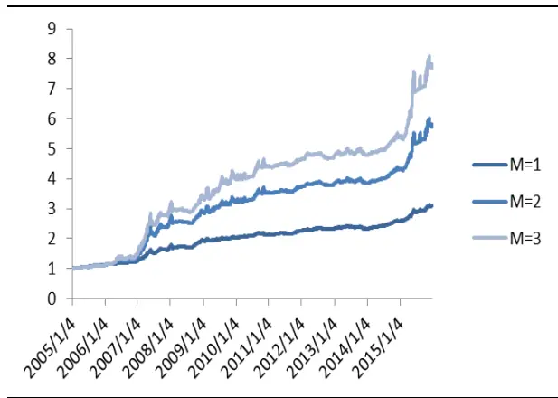
数据来源：国泰君安证券研究，wind

图 16：均线择时 TIPP 定投表现（f=0.8）
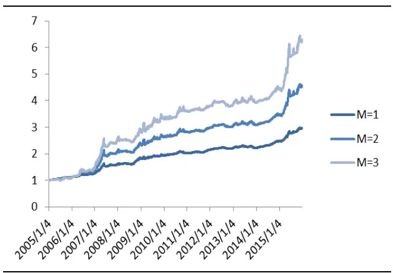
数据来源：国泰君安证券研究，wind

表 11：CPPI 和 TIPP（f=0.8）定投策略业绩（2005.1-2016.1）

| 保本策略 | CPPI |  |  |  | TIPP |  |
| --- | --- | --- | --- | --- | --- | --- |
| 风险乘数 | M=1 | M=2 | M=3 | M=1 | M=2 | M=3 |
| 年化收益率 | 10.8% | 16.9% | 19.9% | 10.4% | 14.5% | 17.8% |
| 年化波动率 | 4.9% | 9.2% | 11.2% | 4.5% | 7.6% | 10.1% |
| 最大回撤 | -7.7% | -12.7% | -13.9% | -7.3% | -10.5% | -12.3% |
| 夏普比率 | 2.2 | 1.8 | 1.8 | 2.3 | 1.9 | 1.8 |

数据来源：国泰君安证券研究，wind

此前TIPP的固定保本比例f=0.8，即安全底线不低于当期总资产的80%，对于更加保守的投资者，可以适当提高 f 值，以下我们以 f=0.9 测试保本策略。

提高固定保本比例后，波动率和最大回撤有了明显减小，M=2时，TIPP策略定投年化收益率大约为 10%，最大回撤7%，夏普比率 2.2。

图 17：均线择时TIPP定投表现（f=0.9）
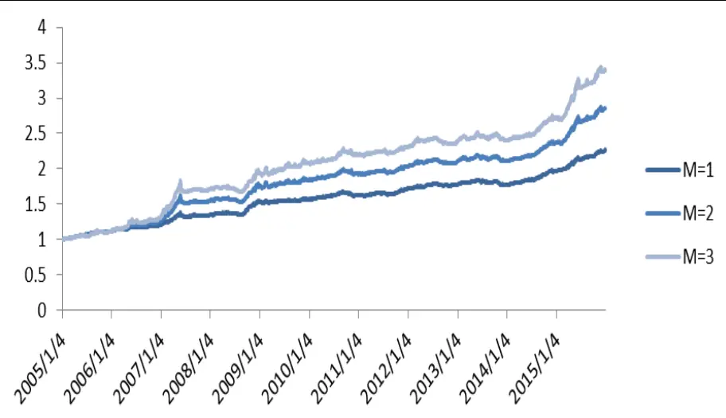
数据来源：国泰君安证券研究，wind

表 12：TIPP(f=0.9)定投策略业绩（2005.1-2016.1）

| 风险乘数 | M=1 M=2 M=3 |
| --- | --- |
| 年化收益率 7.7% | 10.0% 11.7% |
| 年化波动率 2.9% | 4.5% 5.9% |
| 最大回撤 -4.7% | -7.0% -8.4% |
| 夏普比率 2.7 | 2.2 2.0 |

数据来源：国泰君安证券研究，wind

## 5. 分级 AB轮动的保本基金设计

债券、货币资产和股票资产存在一定的负相关关系，因此当保本基金中的股票资产下跌时，通过调整仓位加大债券资产的配臵是能够提高基金收益。

分级基金的A 份额具有债券价值，B份额具有杠杆属性，因此可以作为保本基金的投资标的(A份额提供低风险收益，B份额放大安全垫投资股票资产)。

分级A类价值=永续债价值+配对转换价值+折算权价值，因此分级A相比于债券更有配臵价值和交易机会。

此前《分级基金投资策略和市场异象》报告中，我们曾经构建了分级A的轮动组合，因此可以通过该策略优选分级A 标的，获得更高收益。分级A的轮动：综合考虑A份额的债券价值、折算权价值，我们构建 A份额的轮动策略。

1. 选取平均日成交额超过千万的的分级A作为待选基金池。

2. 按隐含收益率从高到低排序，对分级A打分。

3. 按折价率从高到低排序，对分级A打分。

4. 两指标等权相加选出排名前10的分级A买入。

5. 每月滚动换仓。

## 分级B的轮动： 60%的牛熊分界+30日突破等额资金买入

由于分级B 涉及到杠杆变动，即下跌中杠杆放大，上涨中风险不小，我们在回测中中风险资产直接用 50 个行业和主题分级母基金替代，风险乘数为2，即固定为2 倍杠杆，而分级A待选池则为融资型、有上下折条款的123只分级A。

2013-2015 年分级 AB 的轮动保本基金表现优异，尤其是在股灾时期，分级A作为对冲分级B 下跌的有效工具，获得了较高收益，减少了整体净值回撤，M=2时，CPPI和 TIPP 分级AB轮动保本组合年化收益率达到 23.2%和 24.4%，最大回撤 11%和 9.7%，夏普比率 1.7 和 2.2。

图 18：分级AB轮动 CPPI定投表现
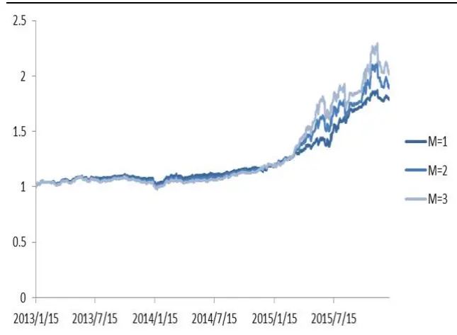
数据来源：国泰君安证券研究，wind

图 19：分级 AB轮动 TIPP定投表现
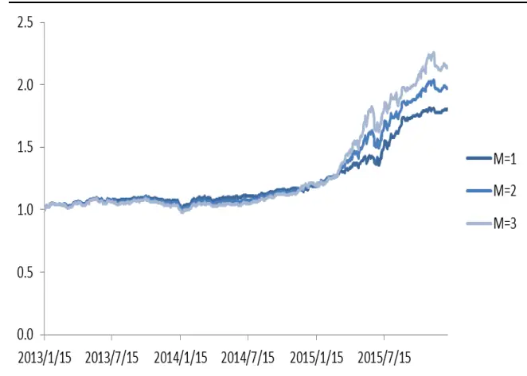
数据来源：国泰君安证券研究，wind

表 13：分级 AB 轮动 CPPI 和 TIPP 保本策略业绩（2013.1-2016.1）

| 保本策略 | CPPI |  |  |  |  |
| --- | --- | --- | --- | --- | --- |
| 风险乘数 | M=1 | M=2 | M=3 | M=1 | TIPP M=2 M=3 |
| 年化收益率 | 20.9% | 23.2% | 25.8% | 21.1% 24.4% | 27.4% |
| 年化波动率 | 10.0% | 13.7% | 15.7% | 9.4% 11.1% | 13.4% |
| 最大回撤 | -8.6% | -11.0% | -11.9% | -8.7% -9.7% | -11.1% |
| 夏普比率 | 2.1 | 1.7 | 1.7 | 2.2 2.2 | 2.0 |

数据来源：国泰君安证券研究，wind

## 6. 总结与后续改进

针对传统CPPI和TIPP 的仓位管理方法的不足，本报告通过单均线择时策略进行了改进，在单资产、多资产和分级 AB 保本基金中都取得不错的效果，收益风险比有了显著的提升。

利用单均线策略，我们可以测算出股票资产波动的最大风险，从而根据风险偏好选择合理的风险乘数，同时加入择时策略后有效降低了下跌趋势中的股票仓位，锁定收益，减小回撤。

分级A和分级B是实战中构建保本策略的优质标的，通过分级AB 的双轮动可以实现更高的收益，同时分级A能有效对冲股灾中分级B 的下跌风险。

本报告中调仓的风险乘数是固定的，后续研究方向在于更加优化的风险乘数，例如在持仓期间根据趋势的强弱增大或者减少风险乘数。

CPPI和TIPP 策略各有利弊，基金设计中可以将CPPI和 TIPP 相结合，使其在牛市更激进，熊市中更保守。

## 本公司具有中国证监会核准的证券投资咨询业务资格

## 分析师声明

作者具有中国证券业协会授予的证券投资咨询执业资格或相当的专业胜任能力，保证报告所采用的数据均来自合规渠道，分析逻辑基于作者的职业理解，本报告清晰准确地反映了作者的研究观点，力求独立、客观和公正，结论不受任何第三方的授意或影响，特此声明。

## 免责声明

本报告仅供国泰君安证券股份有限公司（以下简称“本公司”）的客户使用。本公司不会因接收人收到本报告而视其为本公司的当然客户。本报告仅在相关法律许可的情况下发放，并仅为提供信息而发放，概不构成任何广告。

本报告的信息来源于已公开的资料，本公司对该等信息的准确性、完整性或可靠性不作任何保证。本报告所载的资料、意见及推测仅反映本公司于发布本报告当日的判断，本报告所指的证券或投资标的的价格、价值及投资收入可升可跌。过往表现不应作为日后的表现依据。在不同时期，本公司可发出与本报告所载资料、意见及推测不一致的报告。本公司不保证本报告所含信息保持在最新状态。同时，本公司对本报告所含信息可在不发出通知的情形下做出修改，投资者应当自行关注相应的更新或修改。

本报告中所指的投资及服务可能不适合个别客户，不构成客户私人咨询建议。在任何情况下，本报告中的信息或所表述的意见均不构成对任何人的投资建议。在任何情况下，本公司、本公司员工或者关联机构不承诺投资者一定获利，不与投资者分享投资收益，也不对任何人因使用本报告中的任何内容所引致的任何损失负任何责任。投资者务必注意，其据此做出的任何投资决策与本公司、本公司员工或者关联机构无关。

本公司利用信息隔离墙控制内部一个或多个领域、部门或关联机构之间的信息流动。因此，投资者应注意，在法律许可的情况下，本公司及其所属关联机构可能会持有报告中提到的公司所发行的证券或期权并进行证券或期权交易，也可能为这些公司提供或者争取提供投资银行、财务顾问或者金融产品等相关服务。在法律许可的情况下，本公司的员工可能担任本报告所提到的公司的董事。

市场有风险，投资需谨慎。投资者不应将本报告作为作出投资决策的唯一参考因素，亦不应认为本报告可以取代自己的判断。
在决定投资前，如有需要，投资者务必向专业人士咨询并谨慎决策。

本报告版权仅为本公司所有，未经书面许可，任何机构和个人不得以任何形式翻版、复制、发表或引用。如征得本公司同意进行引用、刊发的，需在允许的范围内使用，并注明出处为“国泰君安证券研究”，且不得对本报告进行任何有悖原意的引用、删节和修改。

若本公司以外的其他机构（以下简称“该机构”）发送本报告，则由该机构独自为此发送行为负责。通过此途径获得本报告的投资者应自行联系该机构以要求获悉更详细信息或进而交易本报告中提及的证券。本报告不构成本公司向该机构之客户提供的投资建议，本公司、本公司员工或者关联机构亦不为该机构之客户因使用本报告或报告所载内容引起的任何损失承担任何责任。

## 评级说明

## 1.投资建议的比较标准

投资评级分为股票评级和行业评级。

以报告发布后的12个月内的市场表现为比较标准，报告发布日后的 12个月内的公司股价（或行业指数）的涨跌幅相对同期的沪深 300 指数涨跌幅为基准。

## 2.投资建议的评级标准

报告发布日后的 12 个月内的公司股价（或行业指数）的涨跌幅相对同期的沪深 300 指数的涨跌幅。

| 评级 | 说明 |  |
| --- | --- | --- |
| 股票投资评级 | 增持 | 相对沪深 300指数涨幅15%以上 |
|  | 谨慎增持 | 相对沪深300指数涨幅介于5%～15%之间 |
|  | 中性 | 相对沪深300指数涨幅介于-5%～5% |
|  | 减持 | 相对沪深300指数下跌5%以上 |
| 行业投资评级 | 增持 | 明显强于沪深 300 指数 |
|  | 中性 | 基本与沪深300指数持平 |
|  | 减持 | 明显弱于沪深300指数 |

## 国泰君安证券研究

|  | 上海 | 深圳 | 北京 |
| --- | --- | --- | --- |
| 地址 | 上海市浦东新区银城中路168号上海 银行大厦29层 | 深圳市福田区益田路 6009 号新世界 商务中心34层 | 北京市西城区金融大街28 号盈泰中 心2号楼10层 |
| 邮编 | 200120 | 518026 | 100140 |
| 电话 | (021)38676666 | （0755)23976888 | (010)59312799 |
|  | E-mail: gtjaresearch@gtjas.com |  |  |