inInfo] [Table_Title] 2016.05.03

# 基于 MACD 的价格分段研究 2.0

## ——数量化专题之七十

刘正捷（分析师）

刘富兵（分析师）

8 0755-23976803

021-38676673

liuzhengjie012509@gtjas.com

证书编号 S0880514070010

liufubing008481@gtjas.com

S0880511010017

## 本报告导读：

报告从三方面对原有价格分段体系进行扩充。从幅度、时间上对周线与日线对应关系，日线与30分钟线对应关系以及小概率段数规律方面得出一些有用的结论。

## 摘要：

le_Summary] 本报告从三个方面对原有价格分段体系进行扩充。我们根据2001 –2016年的上证指数数据，利用原有价格分段体系:1、对周线与日线对应段数进行统计分析；2、针对历史上较少出现的日线与 30分钟1：1或1：7之上的案例行具体分析；3、在段数对应规律基础上，结合每一段涨跌的幅度、时间和速度，挖掘一些新规律。

从周线与日线的对应关系来看，市场都是在疯狂中结束上涨，却不以跌幅的逐渐收窄而结束下跌。自 2001 年以来，上证指数共出现 11 次周线级别行情，在周线级别上涨中，随着趋势的延伸，上涨幅度越大、持续时间越长、上涨速度越快；随着周线级别下跌的延伸，并没有明显看到下跌幅度下降、下跌速度变缓这些所谓的“磨底”特征。

自 2005年7月以来，上证指数共出现 44次日线级别行情。从日线与 30分钟线的对应关系来看，我们发现：平均而言，在前 9段，30分钟级别的上涨段（下跌段）与回调段（反弹段）的幅度、天数之间，均存在 0.6 左右的数学关系；9 段以后，幅度、时间上的对应规律开始消失，波动明显加剧。

- 站在动量投资策略角度，如日线上涨在 30 分钟上涨刚 1 段时确认，建议买入；如日线下跌在 30 分钟下跌刚 1 段时确认，建议卖出。日线级别行情确认时，如对应的 30 分钟行情段数越多，则未来延续的平均段数越少，平均涨幅越小。

牛市在绝望中产生，在疯狂中结束。所谓绝望，我们认为就是日线级别下跌的延伸、延伸、再延伸。近 10 年来的三次日线级别下跌尾声，无一例外都出现了日线与 30 分钟线间高段数对应关系；所谓疯狂，我们认为就是日线级别上涨的延伸、延伸、再延伸。出现高段数 30 分钟级别上涨几乎成为牛市的必要条件。

- 站在当下，此次周线级别下跌在跌幅上与过去 15 年的周线级别下跌平均幅度一致，但如果从持续时间、对应段数两个角度来看，我们认为此次周线级别下跌大概率没有结束。

金融工程

## 金融工程团队：

刘富兵：（分析师）

电话：021-38676673

邮箱：liufubing008481@gtjas.com

证书编号：S0880511010017

刘正捷：（分析师）

电话：0755-23976803

邮箱：liuzhengjie012509@gtjas.com

证书编号：S0880514070010

## 陈奥林：（研究助理）

电话：021-38674835

邮箱：chenaolin@gtjas.com

证书编号：S0880114110077

## 王浩：（研究助理）

电话：021-38676434

邮箱：wanghao014399@gtjas.com

证书编号：S0880114080041

## 李辰：（研究助理）

电话：021-38677309

邮箱：lichen@gtjas.com

证书编号：S0880114060025

## 孟繁雪：（研究助理）

电话：021-38675860

邮箱：mengfanxue@gtjas.com

证书编号：S088011604008

## [Table_R相关报告

《产业并购基金，下一个事件金矿》2016.04.11

《基于股东集体增减持行为的市场拐点探究》2016.03.18

《基于均线择时的保本基金设计》2016.03.07《择时新视角：捕捉趋势中的绝对收益》2016.03.07

《如何将阿尔法因子转化为超额收益（上）》2016.03.01

## 1. 报告主旨：在原有体系之上更精细刻画价格规律

## 1.1.基于 MACD的 DEA 指标价格分段规则简单回顾

基于 MACD 的价格分段体系在我们 2013 年 12 月的两篇报告《发现价格走势规律之基于 MACD 分段研究——数量化专题之二十九》、《基于MACD 价格分段应用举例——数量化专题之三十》中有过详细阐述。

基于 MACD 的 DEA 指标波段划分规则：

- 波段低点对应 MACD 的 DEA 指标 < 0，波段顶点对应 MACD的 DEA 指标 > 0；

- 每个波段中价格的最大值和最小值只出现在波段的起点或终点。

图 1：基于 MACD 之 DEA 指标分段示意图
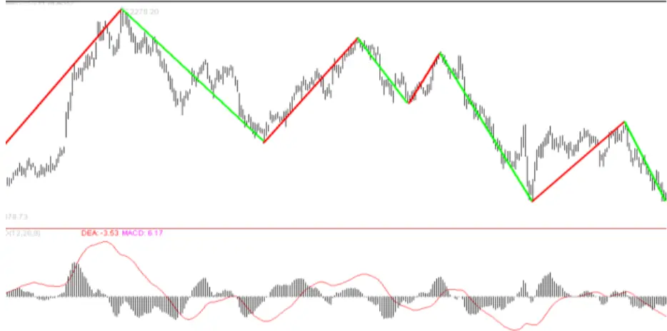
数据来源：国泰君安证券研究

在此规则上，我们利用日线、30分钟以及 5分钟级别走势之间的对应关系对上证指数拐点进行判断。近两年以来，我们量化周报择时观点的准确率充分体现了这一体系在择时研究上的有效性。

在使用过程中，我们逐渐发现这一价格分段体系的延展性很强，可以在段数对应关系的基础上对涨跌幅、时间进行更精细的研究。为了进一步提高我们择时体系的准确度，拓宽其适用环境，我们决定对原有研究体系进一步扩充。

## 1.2.从三个方面对原有体系进行进一步扩充

我们对样本时间进行了更新：周线与日线的对应关系，我们用的是 2001–2016年的数据；日线与 30分钟对应关系，我们用的是 2005 –2016 年的数据（2001 – 2005年高频数据质量较差）。然后，我们在以下三个方面对原有体系进行了扩充：

1、前两篇报告更多针对日线、30 分钟与 5 分钟之间的关系进行统计分析，这篇报告中我们对周线与日线对应段数也进行了统计。由于周线级别行情样本量有限，我们会用案例分析进行辅助；

2、前两篇报告的统计结果发现日线与 30 分钟之间 1：1以及 1：7以上的对应关系比较少见，但确实存在。针对这些历史上较少出现的对应关系，我们找出个案进行具体分析，观察其是否存在特殊背景或者规律性；

3、前两篇文章主要统计了不同级别间的段数对应规律。我们在此基础上，进一步结合了每一段涨跌的幅度、持续时间和涨速，希望挖掘出一些新规律。

## 2. 周线与日线对应段数统计

## 2.1.自 2001年以来，上证指数共出现 11次周线级别行情

2001 年 6月 11日，是上证指数一波周线级别下跌的起点；2015年 7月13 日，上证指数的一波周线级别下跌得到确认。在这 15 年里，上证指数共出现 11次周线级别行情。

图 2：自 2001年以来，上证指数共出现 11次周线级别行情
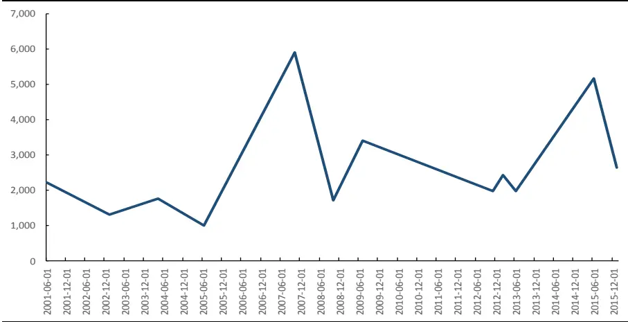
数据来源：Wind，国泰君安证券研究

周线级别行情的涨跌幅差异非常大，但对应的日线段数却主要集中在 3段和 5 段。上证指数周线级别涨幅波动极大，小到 24%、大到 501%，跌幅亦如此。但如果从对应日线级别段数来看，11次行情有 9次集中在3 段和 5 段（自 5178 点以来的下跌尚无法确认是否结束，因此暂时以2656 点对应的 3段来算），仅有 2次出现了 1段和 11段的对应关系。

表 1: 周线级别行情对应的日线段数主要集中在 3段和 5段

| 时间 | 点位 | 状态 | 幅度 | 对应日线段数 |
| --- | --- | --- | --- | --- |
| 2001/6/8 | 2,223 |  |  |  |
| 2003/1/3 | 1,320 | 下跌 | -41% | 5 |
| 2004/4/2 | 1,769 | 上涨 | 35% | 5 |
| 2005/6/3 | 1,014 | 下跌 | -43% | 5 |
| 2007/10/12 | 5,903 | 上涨 | 501% | 5 |
| 2008/10/31 | 1,729 | 下跌 | -72% | 3 |
| 2009/7/31 | 3,412 | 上涨 | 102% | 3 |
| 2012/11/30 | 1,980 | 下跌 | -44% | 11 |
| 2013/2/8 | 2,432 | 上涨 | 24% | 1 |
| 2013/6/28 | 1,979 | 下跌 | -20% | 3 |
| 2015/6/12 | 5,166 | 上涨 | 165% | 3 |
| 2016/1/29 | 2,656? | 下跌 | -49%？ | 3？ |

数据来源：Wind，国泰君安证券研究

## 2.2.周线级别上涨时，对应日线行情涨跌幅、时间、速率统计

我们分别从涨幅、时间和速率三个维度，对周线级别上涨时，对应的日线级别走势进行统计和分析。

总体上，5 次周线级别上涨平均持续 364 个交易日，即一年半左右；平均上涨 165%，其中 3 次指数至少翻倍；每一次周线级别上涨对应的日线段数都不超过 5段。

随着段数延伸，周线对应的日线级别上涨幅度越来越大。我们发现 5次周线级别上涨，对应的日线第一段上涨幅度平均为 20%，第三段上涨幅度为 81%，第五段上涨幅度高达 165%。

表 2: 随着段数延伸，周线级别上涨对应的日线级别上涨幅度越来越大

| 开始 | 结束 | 持续时间 | 幅度 | 对应段数 | 1 | 2 | 3 | 4 | 5 |
| --- | --- | --- | --- | --- | --- | --- | --- | --- | --- |
| 2003/1/3 | 2004/4/6 | 300 | 0.35 | 5 | 16% | -5% | 12% | -19% | 35% |
| 2005/6/3 | 2007/10/16 | 576 | 5.01 | 5 | 20% | -12% | 62% | -11% | 294% |
| 2008/11/6 | 2009/8/4 | 183 | 1.02 | 3 | 22% | -13% | 91% |  |  |
| 2012/12/3 | 2013/2/8 | 47 | 0.24 | 1 | 24% |  |  |  |  |
| 2013/6/27 | 2015/6/12 | 480 | 1.65 | 3 | 16% | -12% | 159% |  |  |
| 平均值 |  | 364 | 1.65 | 5.4 | 20% | -11% | 81% | -15% | 165% |

数据来源：Wind，国泰君安证券研究

随着段数延伸，周线级别上涨对应的日线级别上涨时间越来越久。我们发现 5 次周线级别上涨，对应的日线第一段上涨时间平均为 48 个交易日，第三段上涨时间达到 161个交易日，第五段上涨交易日为 191个交易日。

表 3: 随着段数延伸，周线级别上涨对应的日线级别上涨时间越来越长

| 开始 | 结束 | 持续时间 | 幅度 | 对应段数 | 1 | 2 | 3 | 4 | 5 |
| --- | --- | --- | --- | --- | --- | --- | --- | --- | --- |
| 2003/1/3 | 2004/4/6 | 300 | 0.35 | 5 | 35 | 18 | 15 | 144 | 92 |
| 2005/6/3 | 2007/10/16 | 576 | 5.01 | 5 | 77 | 51 | 143 | 20 | 289 |
| 2008/11/6 | 2009/8/4 | 183 | 1.02 | 3 | 23 | 18 | 144 |  |  |
| 2012/12/3 | 2013/2/8 | 47 | 0.24 | 1 | 47 |  |  |  |  |
| 2013/6/27 | 2015/6/12 | 480 | 1.65 | 3 | 56 | 85 | 341 |  |  |
| 平均值 |  | 364 | 1.65 | 5.4 | 48 | 43 | 161 | 82 | 191 |

数据来源：Wind，国泰君安证券研究

随着段数延伸，周线级别上涨对应的日线级别上涨速度越来越快。用上涨幅度除以上涨时间，得到上涨速度。我们发现 5次周线级别上涨，对应的日线第一段上涨速度平均为 0.49%/交易日，第三段上涨速度平均为0.58%/交易日，第五段上涨速度平均为 0.70%/交易日。

表 4: 随着段数延伸，周线级别上涨对应的日线级别上涨速度越来越快

| 开始 | 结束 | 持续时间 | 幅度 | 对应段数 | 1 | 2 | 3 | 4 | 5 |
| --- | --- | --- | --- | --- | --- | --- | --- | --- | --- |
| 2003/1/3 | 2004/4/6 | 300 | 0.35 | 5 | 0.46% | -0.28% | 0.80% | -0.13% | 0.38% |
| 2005/6/3 | 2007/10/16 | 576 | 5.01 | 5 | 0.26% | -0.24% | 0.43% | -0.55% | 1.02% |
| 2008/11/6 | 2009/8/4 | 183 | 1.02 | 3 | 0.96% | -0.72% | 0.63% |  |  |
| 2012/12/3 | 2013/2/8 | 47 | 0.24 | 1 | 0.51% |  |  |  |  |
| 2013/6/27 | 2015/6/12 | 480 | 1.65 | 3 | 0.29% | -0.14% | 0.47% |  |  |

| 平均值 | 364 | 1.65 | 5.4 | 0.49% | -0.34% | 0.58% | -0.34% | 0.70% |
| --- | --- | --- | --- | --- | --- | --- | --- | --- |

数据来源：Wind，国泰君安证券研究

无论从周线级别上涨对应日线的涨幅、时间还是涨速统计来看，市场都是在疯狂中结束上涨。次级别每波涨幅越来越大，时间越来越长，速度越来越快，这一统计结果验证了我们常说的“牛市往往在疯狂中结束”这句话。

收益与风险并存，最后一段上涨虽然风险较大，利润却也极其丰厚。如果我们计算最后一段日线上涨幅度占整个周线级别上涨幅度的比例，会发现这一数字至少占到 59%，最大接近 100%。因此错过了牛市的最后一波上涨，往往意味着错失了最大的一块蛋糕！

## 2.3. 周线级别下跌时，对日线级别的涨跌幅、时间、速率统计

由于我们无法判断当前的周线级别下跌是否已经结束，因此做历史统计时不纳入此次周线级别下跌。这样正好可以将此次下跌的幅度、时间与历史上其他 5次下跌进行对比。

总体来看，周线级别下跌平均持续 317个交易日，与周线级别上涨的时间较为接近；平均下跌 44%；对应的日线段数平均为 5段，其中最少要走 3段，最长达到 11段。

除了 2009 年这个长达 3 年的下跌，周线级别下跌并不是以日线级别下跌幅度逐渐收敛而结束。如果比较周线级别下跌中最后两段日线下跌，会发现除了 2009 年那次下跌，其他几次下跌幅度都是扩大的，而不是我们感觉中的跌幅收敛。

表 5: 周线级别下跌一般不是以日线级别下跌幅度逐渐收敛而结束

| 开始 | 结束 | 持续时间 | 幅度 | 对应段数 | 1 | 2 | 3 | 4 | 5 | 6 | 7 | 8 | 9 | 10 | 11 |
| --- | --- | --- | --- | --- | --- | --- | --- | --- | --- | --- | --- | --- | --- | --- | --- |
| 2001/6/8 | 2003/1/3 | 378 | -0.41 | 5 | -32% | 16% | -23% | 28% | -24% |  |  |  |  |  |  |
| 2004/4/6 | 2005/6/3 | 281 | -0.43 | 5 | -29% | 16% | -19% | 11% | -23% |  |  |  |  |  |  |
| 2007/10/16 | 2008/11/6 | 261 | -0.72 | 3 | -21% | 14% | -69% |  |  |  |  |  |  |  |  |
| 2009/8/4 | 2012/12/3 | 811 | -0.44 | 11 | -23% | 25% | -29% | 34% | -27% | 9% | -15% | 15% | -19% | 6% | -8% |
| 2013/2/8 | 2013/6/27 | 87 | -0.2 | 3 | -11% | 7% | -16% |  |  |  |  |  |  |  |  |
| 2015/6/12 | 2016/1/29 | 157 | -0.49 | 3 | -44% | 25% | -27% |  |  |  |  |  |  |  |  |
| 平均值 |  | 317 | -0.44 | 5.4 | -23% | 16% | -31% | 24% | -25% | 9% | -15% | 15% | -19% | 6% | -8% |

数据来源：Wind，国泰君安证券研究

周线级别下跌对应的日线级别下跌时间没有明显的统计规律。

表 6: 周线级别下跌对应的日线级别下跌时间并没有明显的统计规律

| 开始 | 结束 | 持续时间 | 幅度 | 对应段数 | 1 | 2 | 3 | 4 | 5 | 6 | 7 | 8 | 9 | 10 | 11 |
| --- | --- | --- | --- | --- | --- | --- | --- | --- | --- | --- | --- | --- | --- | --- | --- |
| 2001/6/8 | 2003/1/3 | 378 | -0.41 | 5 | 89 | 32 | 33 | 99 | 129 |  |  |  |  |  |  |
| 2004/4/6 | 2005/6/3 | 281 | -0.43 | 5 | 110 | 9 | 88 | 19 | 59 |  |  |  |  |  |  |
| 2007/10/16 | 2008/11/6 | 261 | -0.72 | 3 | 32 | 32 | 199 |  |  |  |  |  |  |  |  |
| 2009/8/4 | 2012/12/3 | 811 | -0.44 | 11 | 20 | 55 | 150 | 83 | 234 | 18 | 36 | 37 | 143 | 14 | 31 |
| 2013/2/8 | 2013/6/27 | 87 | -0.2 | 3 | 50 | 20 | 19 |  |  |  |  |  |  |  |  |
| 2015/6/12 | 2016/1/29 | 157 | -0.49 | 3 | 52 | 77 | 26 |  |  |  |  |  |  |  |  |
| 平均值 |  | 317 | -0.44 | 5.4 | 60 | 30 | 98 | 67 | 141 | 18 | 36 | 37 | 143 | 14 | 31 |

数据来源：Wind，国泰君安证券研究

周线级别下跌对应的日线级别下跌速度并没有出现我们感觉中“越靠近底，跌速越缓慢”的特征。大家常说的一句话叫“大底是磨出来的”，所谓“磨”，含有“时间长，跌速放缓”的意思。然而至少从日线级别的跌速上观察，我们并没有发现越跌越缓慢的特征。

表 7: 周线级别下跌对应的日线级别下跌速度并没有随着段数的延续而放缓

| 开始 | 结束 | 持续时间 | 幅度 | 对应段数 | 1 | 2 | 3 | 4 | 5 | 6 | 7 | 8 | 9 | 10 | 11 |
| --- | --- | --- | --- | --- | --- | --- | --- | --- | --- | --- | --- | --- | --- | --- | --- |
| 2001/6/8 | 2003/1/3 | 378 | -0.41 | 5 | -0.4% | 0.5% | -0.7% | 0.3% | -0.2% |  |  |  |  |  |  |
| 2004/4/6 | 2005/6/3 | 281 | -0.43 | 5 | -0.3% | 1.8% | -0.2% | 0.6% | -0.4% |  |  |  |  |  |  |
| 2007/10/16 | 2008/11/6 | 261 | -0.72 | 3 | -0.7% | 0.5% | -0.4% |  |  |  |  |  |  |  |  |
| 2009/8/4 | 2012/12/3 | 811 | -0.44 | 11 | -1.2% | 0.5% | -0.2% | 0.4% | -0.1% | 0.5% | -0.4% | 0.4% | -0.1% | 0.5% | -0.3% |
| 2013/2/8 | 2013/6/27 | 87 | -0.2 | 3 | -0.2% | 0.3% | -0.9% |  |  |  |  |  |  |  |  |
| 2015/6/12 | 2016/1/29 | 157 | -0.49 | 3 | -0.9% | 0.3% | -1.0% |  |  |  |  |  |  |  |  |
| 平均值 |  | 317 | -0.44 | 5.4 | -0.5% | 0.7% | -0.5% | 0.4% | -0.2% | 0.5% | -0.4% | 0.4% | -0.1% | 0.5% | -0.3% |

数据来源：Wind，国泰君安证券研究

## 2.4. 案例情景分析

由于周线级别行情的样本较少，因此我们找出了 11次行情中 3次比较特别的周线级别下跌行情进行分析。

## 2.4.1. 案例 1：2007-10-16 开始的周线级别下跌

此次周线级别下跌的特点在于：下跌幅度大，对应段数少，形成了周线级别上少有的尖底结构。

图 3：2007 年的周线级别下跌幅度大、段数少
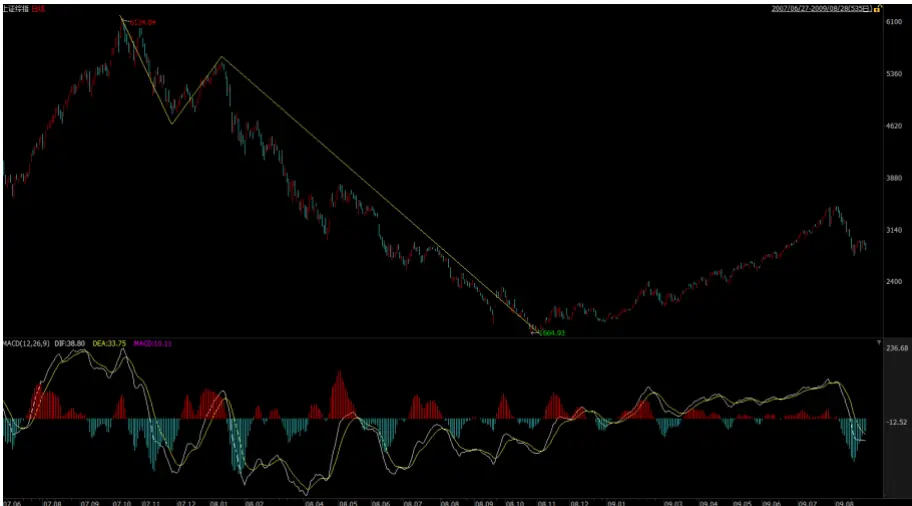
数据来源：Wind，国泰君安证券研究

从基本面的角度，我们发现这次下跌具有如下背景：

- A 股经历了一波约 500%的周线级别上涨，在上涨过程中，因国内经济过热、热钱不断流入，央行不断加息升准，财政部也通过上调印花税等行政手段干预市场；

- 下跌中叠加了次贷危机引发全球金融危机因素；

- 直到政府出台 4万亿投资刺激后，指数扭转下行趋势，开始上行。

## 2.4.2. 案例 2：2009-08-04 开始的周线级别下跌

此次周线级别下跌的特点在于：对应段数多（达到 11段），持续时间长达八百多个交易日，称得上是 A股历史上最磨人的一次寻底过程。

图 4：2009 年的周线级别下跌段数多、持续时间长
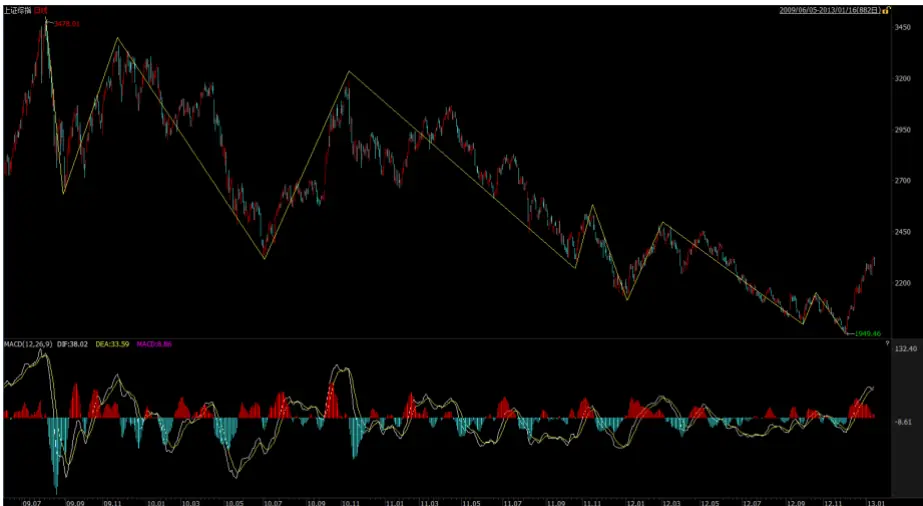
数据来源：Wind，国泰君安证券研究

从基本面的角度，我们发现这次下跌具有如下背景：

- “四万亿”刺激后，A股经历了一波约 100%的上涨；

- 下跌过程中，高收益信托产品、货币基金等低风险金融产品不断发展，导致投资者期望无风险收益率不断越高，低风险偏好投资者不断离场。而高风险偏好投资者开始不断涌向中小板、创业板公司；

- 经济增速不断下滑，中国步入经济转型期，上证指数不断寻底，中小板指和创业板指则开始走牛。

## 2.4.3. 案例 3：2013-02-08 开始的周线级别下跌

此次周线级别下跌的特点在于：跌幅小，持续时间短， A股自 2001年以来最“迷你”的一次周线级别下跌。

图 5：2013 年的“迷你”周线级别下跌
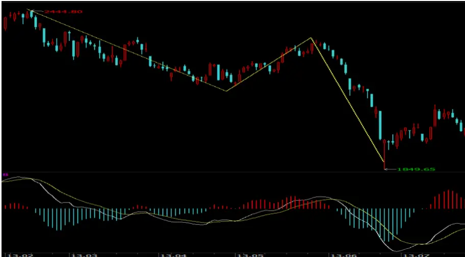
数据来源：Wind，国泰君安证券研究

从基本面的角度，我们发现这次下跌具有如下背景：

- 下跌前，上证指数刚经历了一波幅度约 20%，持续时间 47个交易日，周线与日线段数 1：1的“迷你”周线级别上涨；

- 前一波周线级别下跌，持续了 811个交易日；

- 底部上涨因素：无风险收益率开始不断下降

## 2.4.4. 对周线级别下跌规律的猜想与总结

4 万亿刺激重新分配了 07 年下跌和 09 年下跌中周线与日线的结构对应关系。07年周线级别下跌幅度远超历史平均水平，但结构上调整并不充分，因此理应在 1664 发生日线级别反弹后继续探底。而 4 万亿刺激将这一日线级别反弹直接演变成周线级别反弹。07年调整在结构上的不充分使得 09年的周线级别下跌在结构上走出了 1：11的极端行情。

因此，我们猜想 4万亿的经济刺激把本应在 07年下跌中完成的调整（结构上，非幅度上）移到了下一波下跌中。

如果把 07年、09年、13年这三个极端案例放在一起简单平均，会发现：

- 平均下跌时间为 386 个交易日（全样本为 364）；

- 平均下跌幅度为 45% （全样本为 44%）；

- 平均段数为关系为 5.6 （全样本为 5.4）

## 2.5.这一次，2638 是上证指数的底吗？

站在当下，每个人最为关心的问题是：2638能成为上证指数这波周线级别下跌以来的底部吗？虽然这个问题的答案不过“是”或者“不是”，但想要给出一个明确的答案却并都不简单。我们从持续时间、幅度和对应段数三方面出发，试图给出一些线索。

表 8: 本轮调整在幅度上足够，但在持续时间和对应段数上还不够

| 持续时间 | 周线级别下跌，平均持续364个交易日（一年半）若剔除2013年的伪周线级别下跌，则每波下跌至少持续 260 个交易日 | 2015年周线级别下跌从最高点5166到目前的最低点2656，仅持续157个交易日不够 |
| --- | --- | --- |
| 幅度 | 周线级别下跌，平均下跌44%最大跌幅出现在07年，下跌72% | 从最高点 5166到目前的最低点2656，下跌49%达到平均水平 |
| 对应段数 | 周线级别下跌，对应的日线级别平均走5段最少3段，最长11段 | 从最高点5166到目前的最低点2656，对应的日线级别走3段低于平均水平 |

数据来源：Wind，国泰君安证券研究

如果从持续时间、对应段数这两个角度来看，我们认为此次周线级别下跌大概率没有结束。目前处于第 4段日线级别反弹中，反弹结束后，2656必破。如果跌破 2656，走出 5段下跌，这从段数上这轮周线级别下跌大概率结束。

## 3. 日线与 30 分钟线对应段数统计

## 3.1.自 2005年 7月以来，上证指数共出现 44次日线级别行情

自 2005年 7月 11日以来，截至 2016年 1 月 28日，上证指数共走出 44

次日线级别行情。

图 6：上证指数在过去 10年共走出 44次日线级别行情
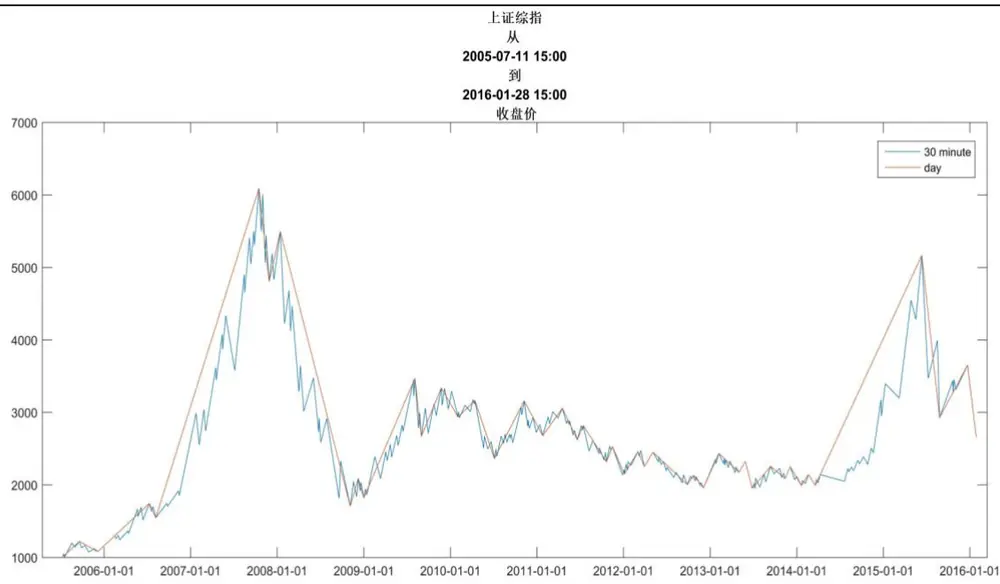
数据来源：Wind，国泰君安证券研究

在前两篇报告中，我们发现：上证指数的日线级别行情与 30 分钟级别行情的段数对应关系集中在 1、3、5、7 这几个数字，尤其是 3 和 5，1或者 7 以上的概率较低。更新样本时间后，我们发现这一规律依然稳定，1、3、5、7这几个数字出现的频率超过 80%。注意，以下我们的所有分析均是建立在段数合并后的基础之上。

表 9: 日线与 30分钟行情的段数对应关系集中在 1、3、5、7

| 涨跌段数 | 总次数 | 频率 | 上涨次数 I | 频率 | 下跌次数 1 |  | 频率 |
| --- | --- | --- | --- | --- | --- | --- | --- |
| 1 | 6 | 13.60% | ■ 3 1 | 13.60% | 1 1 | 3 | 13.60% |
| 3 | 14 | 31.80% | 7 | 31.80% | 1 1 | 7 | 31.80% |
| 5 | 10 | 22.70% | 4 1 | 18.20% | 1 1 | 6 | 27.30% |
| 7 | 6 | 13.60% | 1 3 |  | 13.60% 1 1 | 3 | 13.60% |
| 9 | 1 | 2.30% | 0 | 0.00% | 1 1 | 1 | 4.50% |
| 11 | 2 | 4.50% | 1 1 1 | 4.50% | 1 1 | 1 | 4.50% |
| 13 | 1 | 2.30% | 1 1 1 | 4.50% | 1 1 | 0 | 0.00% |
| 15 | 2 | 4.50% | 1 1 1 | 4.50% | 1 1 | 1 | 4.50% |
| 21 | 2 | 4.50% | 1 2 | 9.10% | 1 | 0 | 0.00% |

数据来源：Wind，国泰君安证券研究

分别统计日线级别上涨、下跌与 30 分钟的对应关系，我们发现上涨、下跌的概率分布较为对称。1段、3段的概率均为 14%，32%。下跌中 5段的概率略高，而上涨中出现了 21段这样的极端值。

这一结果似乎与我们印象中“牛短熊长”不太一致，这主要与样本选取时间有关。之前的报告中，样本选取时间为 2001 – 2012 年，这篇报告为 2005 – 2016 年。2001 – 2005 年市场整体偏熊，而从 2013 年开始，A股逐渐走出熊市泥潭并形成了 2014 – 2015年的牛市。因此这一次的统计结果看起来更加对称。

图 7：日线级别上涨、下跌与 30分钟走势对应关系较为对称
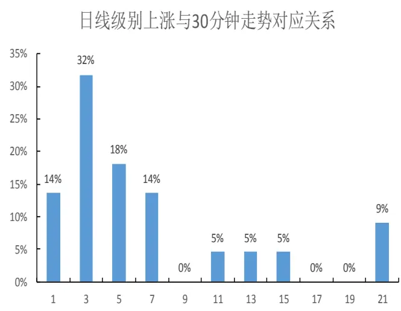
数据来源：Wind，国泰君安证券研究

日线级别下跌与30分钟走势对应关系
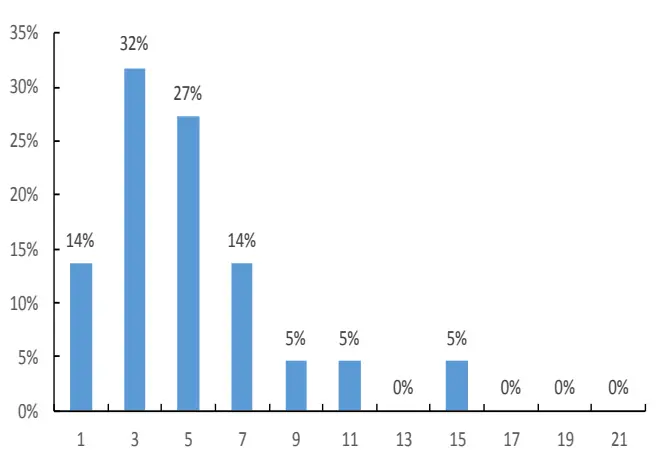

## 3.2.日线级别行情中，对 30 分钟行情的涨跌幅、时间进行统计

这一部分我们重点分析日线对应 30 分钟前 9 段行情的对应规律，主要原因是超过 9段的样本较少，可能会干扰我们的研究结论，另外对这些小概率样本我们将在后面的章节中专门进行案例分析。由于日线与 30分钟级别之间对应涨跌幅、持续时间的统计表格太大，我们将表格放在了最后页。

日线级别上涨时，前 9段对应的 30分钟上涨的平均幅度在 9% - 13.5%之间，而每一波 30分钟级别回调幅度平均在 4% -5.5%之间。有意思的是，如果用回调幅度 / 上涨幅度，这一数字约为 0.38，与黄金分割点0.382 非常接近。9段后，涨幅和回调幅度大幅上升，波动也剧烈的多，也就是说高段数的上涨行情到了中后期，不仅上涨幅度在扩大，指数的波动区间也在加剧，这与我们“地震模型”所刻画的市场状态一致。

日线级别上涨时，前 9段对应的 30分钟上涨平均时间在 10–22个交易日，而每一波 30分钟级别回调天数平均在 4 – 11个交易日之间。用回调天数 / 上涨天数，这一数字与黄金分割点 0.382 也非常接近。上涨段中，除了第 5段上涨，第 1、3、7、9段上涨平均天数要么是 10个交易日，要么是 14个交易日。回调段中，除了第 4段的回调天数波动较大，其他段数的回调天数均在 5个交易日左右，比较接近。13段以后，上涨和回调天数的波动开始加大。

日线级别下跌时，对前9段对应的30分钟下跌的平均幅度在7.5%-12%之间，而每一波 30分钟级别反弹幅度平均在 4.5% -7.5%之间。用反弹幅度 / 下跌幅度，大致为 0.6。9 段后，我们同样看到跌幅和反弹幅度大幅上升，波动也剧烈的多。

日线级别下跌时，前 7段对应的 30分钟下跌时间在 10个交易日左右，而每一波 30分钟级别反弹天数平均为 5 -6个交易日。用反弹天数 / 下跌天数，同样大致为 0.6。7段以后，上涨和回调天数的波动开始加大。

总而言之，我们发现：1、平均而言，在前 9 段，30 分钟级别的上涨段

（下跌段）与回调段（反弹段）的幅度、天数之间，均存在 0.3 或 0.6左右的黄金比例关系，当然，这一规律不可能精确到每一个样本，但在投资中依然具有一定的参考意义；2、9段以后，幅度、时间上的对应规律开始消失，波动明显加剧。我们猜想 9 段以后，投资者的情绪起到了支配作用，我们很难用传统的技术分析或数学模型对股价走势进行预测。

## 3.3.日线级别上涨行情确认时，30 分钟段数及涨跌幅统计

择时中，我们常常遇到的一个困惑在于，当日线级别行情确认时，大概率上行情还能继续延伸一段，然而如果此时 30分钟行情已经走了 5段，从段数上行情又临近拐点了，这时如何进行判断？为了解决这个问题，我们对日线行情确认时 30分钟行情的段数及涨跌幅做了统计。

首先我们对延伸倍数进行定义：

上涨延伸倍数 = (日线上涨结束点涨幅 – 日线上涨确认点涨幅) / (日线上涨确认点涨幅 – 日线上涨起始点涨幅)；

下跌延伸倍数 = (日线下跌结束点跌幅 – 日线下跌确认点跌幅) / (日线下跌确认点跌幅 – 日线下跌起始点跌幅)

从涨幅延伸倍数上看，日线级别上涨确认即结束的概率有 30%。我们将上涨延伸倍数在 10%以下的认定为上涨确认即结束，发现过去 10 年，日线上涨确认即结束的概率达到了 30%。同时，这些案例的共同特征是，日线上涨确认对应的 30 分钟级别行情不是 1 段（2 次）、就是 3 段（5次）。

高段数（1：9 以上）的日线级别上涨确认时，对应的 30 分钟行情同样不是 1 段（2 次）、就是 3 段（3 次）。高段数日线行情的涨幅往往较大（至少 30%），延伸倍数至少在 150%以上，然而其形成之时对应的 30分钟走势依然只有 1段或 3段。

1：5 甚至 1：7 时才形成日线级别上涨时，虽然上涨还能延伸一小段，但很难形成高段数。当第 5段才形成日线级别上涨时，虽然延伸倍数至少能有 20%，但无法走出 1：7以上的高段数走势。

表 10: 日线级别上涨确认时，30分钟段数及涨幅统计

|  | 开始时间 | 终止时间 | 30 分钟总段数 | 日线确认时 30 分钟段数 | 总涨跌幅 | 日线确认时涨跌幅 | 延伸倍数 |
| --- | --- | --- | --- | --- | --- | --- | --- |
| 形成即结束 | 2008/11/4 | 2008/12/8 | 3 | 3 | 22.5 | 22.5 | 0 |
|  | 2011/6/20 | 2011/7/15 | 3 | 3 | 7.59 | 7.59 | 0 |
|  | 2014/1/20 | 2014/2/19 | 3 | 3 | 7.6 | 7.6 | 0 |
|  | 2012/9/26 | 2012/10/22 | 3 | 3 | 6.42 | 6.42 | 0 |
|  | 2011/10/21 | 2011/11/15 | 3 | 3 | 9.17 | 9.12 | 0 |
|  | 2013/5/2 | 2013/5/29 | 1 | 1 | 6.89 | 6.77 | 0.02 |
| 2012/3/29 | 2012/5/4 | 1 | 1 | 8.87 | 8.27 | 0.07 |  |
|  | 2007/11/28 | 2008/1/14 | 3 | 3 | 14.46 | 12.28 | 0.18 |
|  | 2010/2/2 | 2010/4/14 | 7 | 5 | 7.89 | 6.6 | 0.2 |
|  | 2013/11/13 | 2013/12/4 | 1 | 1 | 7.85 | 6.29 | 0.25 |
|  | 2015/8/26 | 2015/12/22 | 7 | 5 | 24.75 | 17.16 | 0.44 |
|  | 2011/1/25 | 2011/4/18 | 5 | 1 | 14.19 | 9.32 | 0.52 |
|  | 2009/8/31 | 2009/11/23 | 5 | 3 | 25.15 | 16.5 | 0.52 |
|  | 2012/1/5 | 2012/3/2 | 5 | 5 | 14.53 | 8.47 | 0.72 |
|  | 2013/6/27 | 2013/9/12 | 7 | 7 | 15.67 | 8.88 | 0.77 |
|  | 2005/7/11 | 2005/9/19 | 5 | 3 | 20.68 | 11.59 | 0.78 |
|  | 2012/12/3 | 2013/2/6 | 3 | 1 | 24.22 | 10.34 | 1.34 |
|  | 2010/7/5 | 2010/11/8 | 13 | 3 | 33.65 | 13.05 | 1.58 |
|  | 高段数 | 2008/12/31 | 2009/8/4 | 15 3 | 90.65 | 10.11 | 7.96 |
|  | 2005/12/5 | 2006/7/11 | 11 1 | 61.77 | 4.87 |  | 11.68 |
| 2014/3/20 |  | 2015/6/12 | 21 | 3 | 159.16 | 7.06 | 21.53 |
| 2006/8/7 |  | 2007/10/16 | 21 | 1 | 293.69 | 7.54 | 37.96 |

数据来源：Wind，国泰君安证券研究

随着日线级别上涨确认时对应的 30分钟段数越多，平均延伸段数越小，延伸倍数越低。

表 11: 随着上涨确认时对应的 30分钟段数越多，延伸幅度越小

| 日线级别上涨确认时30分钟段数 | 平均延伸段数 | 延伸倍数 |
| --- | --- | --- |
| 1 | 5.1 | 7.41 |
| 3 | 4 | 2.96 |
| 5 | 1.3 | 0.45 |
| 7 | 0 | 0.77 |

数据来源：Wind，国泰君安证券研究

如采用动量策略，应在 1：1确认日线级别上涨时就买入。在 30分钟上涨 1段即形成日线级别上涨时买入，如果出现日线级别上涨形成即结束的情况，可在日线级别下跌确认时卖出，不会有过多亏损；一旦出现 30分钟段数延续的情况，则能获得较为可观的利润。

## 3.4. 日线级别下跌行情确认时，30 分钟段数及涨跌幅统计

从跌幅延伸倍数上看，日线级别下跌确认即结束的概率不到 20%。我们同样将下跌延伸倍数在 10%以下的认定为下跌确认即结束，发现过去 10年，日线上涨确认即结束的概率不到 20%。同时，这些案例的共同特征是，日线上涨确认对应的 30 分钟级别行情不是 1 段（1 次）、就是 3 段（3次）。

1：1就确认日线级别下跌的频率高达 50%，这中间除了有一次下跌形成即结束外，其它情况下都至少在确认时的跌幅上继续延伸 50%，一般要延伸 1 倍以上。而 1：5才确认日线级别下跌时，延伸倍数在 10%到 40%之间。

表 12: 日线级别下跌确认时，30分钟段数及跌幅统计

|  | 开始时间 | 终止时间 | 30 分钟总段数 | 日线确认时 30分钟段数 | 总涨跌幅 | 日线确认时涨跌幅 | 延伸倍数 |
| --- | --- | --- | --- | --- | --- | --- | --- |
| 形成即结束 | 2012/3/2 | 2012/3/29 | 3 | 3 | -8.47 | -8.47 | 0 |
|  | 2009/8/4 | 2009/8/31 | 3 | 3 | -23.15 | -23.15 | 0 |
|  | 2014/2/19 | 2014/3/20 | 1 | 1 | -6.96 | -6.7 | 0.04 |
|  | 2008/12/8 | 2008/12/31 | 3 | 3 | -12.91 | -12.33 | 0.05 |
|  | 2013/9/12 | 2013/11/13 | 5 | 5 | -7.43 | -6.63 | 0.12 |
|  | 2006/7/11 | 2006/8/7 | 3 | 3 | -11.36 | -10.06 | 0.13 |
|  | 2007/10/16 | 2007/11/28 | 5 | 5 | -21.15 | -18.19 | 0.16 |
|  | 2009/11/23 | 2010/2/2 | 5 | 5 | -12.1 | -9.56 | 0.27 |
|  | 2013/2/6 | 2013/5/2 | 9 | 5 | -10.69 | -7.99 | 0.34 |
|  | 2010/11/8 | 2011/1/25 | 7 | 3 | -15.26 | -10.74 | 0.42 |
|  | 2013/12/4 | 2014/1/20 | 3 | 1 | -11.57 | -7.93 | 0.46 |
|  | 2005/9/19 | 2005/12/5 | 5 | 3 | -11.59 | -7.31 | 0.59 |
|  | 2015/6/12 | 2015/8/26 | 3 | 1 | -43.34 | -24.26 | 0.79 |
|  | 2015/12/22 | 2016/1/28 | 1 | 1 | -27.28 | -14.42 | 0.89 |
| 高延伸倍数 | 2012/10/22 | 2012/12/3 | 5 3 | -8.11 | -3.98 | 1.04 |  |
|  | 2013/5/29 | 2013/6/27 | 1 | 1 | -16.09 | -7.77 | 1.07 |
| 2011/4/18 |  | 2011/6/20 | 7 | 1 | -14.26 | -6.33 | 1.25 |
| 2011/11/15 |  | 2012/1/5 | 3 | 1 | -15.07 | -5.91 | 1.55 |
| 2008/1/14 |  | 2008/11/4 | 15 | 1 | -68.96 | -19.62 | 2.52 |
| 2011/7/15 |  | 2011/10/21 | 7 | 1 | -17.83 | -5 | 2.57 |
| 2012/5/4 |  | 2012/9/26 | 11 | 1 | -18.26 | -4.83 | 2.78 |
| 2010/4/14 |  | 2010/7/5 | 5 | 1 | -25.34 | -6.21 | 3.08 |

数据来源：Wind，国泰君安证券研究

随着日线级别下跌确认时对应的 30 分钟段数越多，我们同样看到平均延伸段数越小，延伸倍数越低的规律。

表 13: 随着下跌确认时对应的 30分钟段数越多，延伸幅度越小

| 日线级别下跌确认时30分钟段数 | 平均延伸段数 | 延伸倍数 |
| --- | --- | --- |
| 1 | 4.2 | 1.54 |
| 3 | 3.1 | 0.32 |
| 5 | 1 | 0.22 |

数据来源：Wind，国泰君安证券研究

当日线级别下跌形成时，如对应的 30 分钟段数为 1 段，建议卖出，否则很有可能承受更大的回撤；如对应的 30 分钟段数达到 5 段，则暗示日线级别底部已临近，不宜再大幅减仓。

## 3.5. 案例情景分析

在这一部分，我们将过去 10 年中日线对应 30 分钟段数在 1:1 和 1:9 以上的案例拿出来进行具体的分析。

## 3.5.1. 上涨 1：1 情景分析

上涨 1：1的情景一共出现 3次，时间集中在 2012–2013年之间。平均涨幅约 8%，持续时间为 3-4周，均低于日线级别上涨的平均水平。

表 14: 过去 10年，上涨 1：1只出现过 3 次

| 开始时间 | 开始价格 | 终止时间 | 终止价格 | 涨跌幅 | 持续时间 |
| --- | --- | --- | --- | --- | --- |
| 2012/3/29 15:00 | 2252.16 | 2012/5/4 15:00 | 2452.01 | 8.87% | 21 |
| 2013/5/2 15:00 | 2174.12 | 2013/5/29 15:00 | 2324.02 | 6.90% | 19 |
| 2013/11/13 15:00 | 2087.94 | 2013/12/4 15:00 | 2251.76 | 7.85% | 15 |

数据来源：Wind，国泰君安证券研究

2012/3/29 行情：处于 2009 年开始的那波漫长周线级别下跌中一轮日线级别上涨，由于上涨的起点并不是当时的最低点，因此这轮日线级别上涨被第 9段日线级别下跌合并掉。

2013/5/2：处于 2013年那波“迷你”周线级别下跌中的日线级别反弹。

2013/11/13：处于 2013年 6月开始的周线级别上涨早期的一段日线级别上涨，由于这波上涨未创新高，因此这轮日线级别上涨被第 2段日线级别调整合并掉。

## 3.5.2. 下跌 1：1 情景分析

下跌 1：1的情景同样只出现了 3次，时间位于在 2013–2015年之间。
跌幅差异较大，但持续时间基本在 4-5周。

表 15: 过去 10年，下跌 1：1只出现过 3 次

| 开始时间 | 开始价格 | 终止时间 | 终止价格 | 涨跌幅 | 持续时间 |
| --- | --- | --- | --- | --- | --- |
| 2013/5/29 15:00 | 2324.02 | 2013/6/27 15:00 | 1950.01 | -16.09% | 18 |
| 2014/2/19 15:00 | 2142.55 | 2014/3/20 15:00 | 1993.48 | -6.96% | 21 |
| 2015/12/22 15:00 | 3651.77 | 2016/1/28 15:00 | 2655.66 | -27.28% | 26 |

数据来源：Wind，国泰君安证券研究

2013/5/29：处于 2013 年那波“迷你”周线级别下跌中的第 3 段日线级别下跌，创出了 1849 的盘中最低点。这段日线级别下跌结束后，出现了周线级别上涨，1849 至今再没有被跌破。

2014/2/19：周线级别上涨前期形成的一段日线级别下跌，没创新低，被第 3段日线级别上涨合并掉。其 3月 20日形成的低点 1993至今再没有被跌破。

2015/12/22：周线级别下跌中的第 3 段日线级别下跌，下跌幅度巨大，致使 2016年 1月成为历史上单月跌幅最大的月份，并跌出 2638这一低点。

## 3.5.3. 1：1 情景总结

6次 1：1，有 4次都发生在 2013/3 – 2014/3 之间，聚集效应明显。我们的统计数据横跨 10 年时间，而大部分 1：1 都出现在 2013 年和 2014年之间。2013–2014年，大盘正处于一轮大级别下跌的末期和新一轮大级别上涨的初期。

图 8：6 次 1：1，有 4 次都发生在 2013/3 – 2014/3 之间
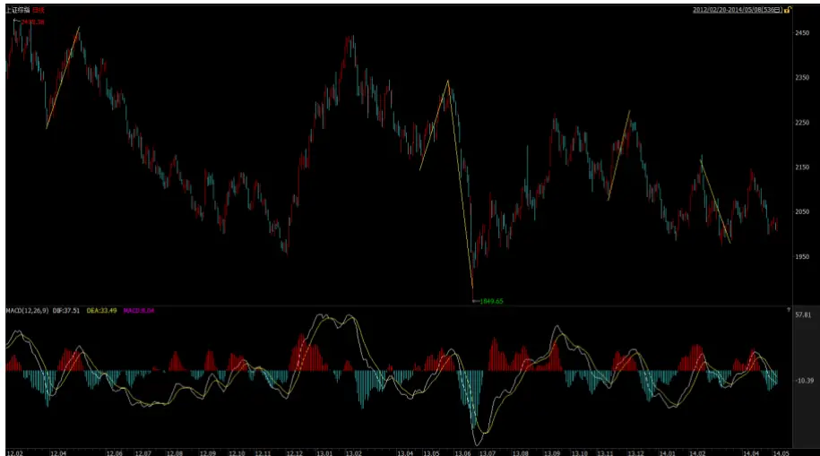
数据来源：Wind，国泰君安证券研究

## 3.5.4. 上涨 1：9及以上情景分析

上涨 1：9 以上的情景共出现了 5 次，其中 4 次是大牛市，还有 1 次出现在周线级别下跌中的一段日线级别反弹中。

表 16: 上涨 1：9以上共出现了 5次，4次为大牛市

| 开始时间 | 开始价格 | 终止时间 | 终止价格 | 涨跌幅 | 持续时间 | 段数 |
| --- | --- | --- | --- | --- | --- | --- |
| 2005/12/5 15:00 | 1079.20 | 2006/7/11 15:00 | 1745.81 | 61.77% | 136 | 11 |
| 2006/8/7 15:00 | 1547.44 | 2007/10/16 15:00 | 6092.06 | 293.69% | 289 | 21 |
| 2008/12/31 15:00 | 1820.81 | 2009/8/4 15:00 | 3471.44 | 90.65% | 144 | 15 |
| 2010/7/5 15:00 | 2363.95 | 2010/11/8 15:00 | 3159.51 | 33.65% | 83 | 13 |
| 2014/3/2015:00 | 1993.48 | 2015/6/12 15:00 | 5166.35 | 159.16% | 303 | 21 |

数据来源：Wind，国泰君安证券研究

2005/12/5：998点开始的周线级别上涨对应的第 3段日线级别上涨。

2006/8/7：998点开始的周线级别上涨对应的第 5段日线级别上涨。

2008/12/31：“4万亿“政策刺激后的周线级别上涨。

2010/7/5：处于 2009年开始的那波漫长周线级别下跌中的第 4段日线级别反弹。唯一一次周线级别下跌行情下，出现日线与 30 分钟高段数上涨行情。涨幅和持续时间明显比其他行情小很多。

2014/3/20：2015年这波牛市对应的第 3段日线级别上涨。

## 3.5.5. 下跌 1：9及以上情景分析

下跌 1：9以上的情景只出现了 3次，且均在周线级别下跌中出现。

表 17: 下跌 1：9以上只出现了 3次，均在周线级别下跌中出现

| 开始时间 | 开始价格 | 终止时间 | 终止价格 | 涨跌幅 | 持续时间 | 段数 |
| --- | --- | --- | --- | --- | --- | --- |
| 2008/1/14 15:00 | 5497.90 | 2008/11/4 15:00 | 1706.70 | -68.96% | 197 | 1：15 |
| 2012/5/4 15:00 | 2452.01 | 2012/9/26 15:00 | 2004.17 | -18.26% | 103 | 1:11 |
| 2013/2/6 15:00 | 2434.48 | 2013/5/2 15:00 | 2174.12 | -10.69% | 52 | 1：9 |

数据来源：Wind，国泰君安证券研究

2008/1/14：2008年周线级别下跌中的第 3 段日线级别下跌。

2012/5/4：2009 年开始的那波漫长周线级别下跌中的第 9 段日线级别下跌。

2013/2/6：2013 年那波“迷你”周线级别下跌中的第 1段日线级别下跌。

## 3.6.牛市在绝望中产生，在疯狂中结束

通过观察日线行情与 30 分钟行情间的对应关系，我们可以非常清晰地体会到“牛市在绝望中产生，在疯狂中结束”这句话。

所谓绝望，我们的理解就是日线级别下跌的延伸、延伸、再延伸。近 10年来的三次日线级别下跌，无一例外都出现了日线与 30 分钟线间高段数对应关系。反过来说，当出现日线与 30 分钟线间高段数对应关系时，预示着上证指数离这轮周线级别下跌的大底已经不远了。

图 9：2007/10/12周线级别下跌中，出现了 1：15的高段数，立刻结束
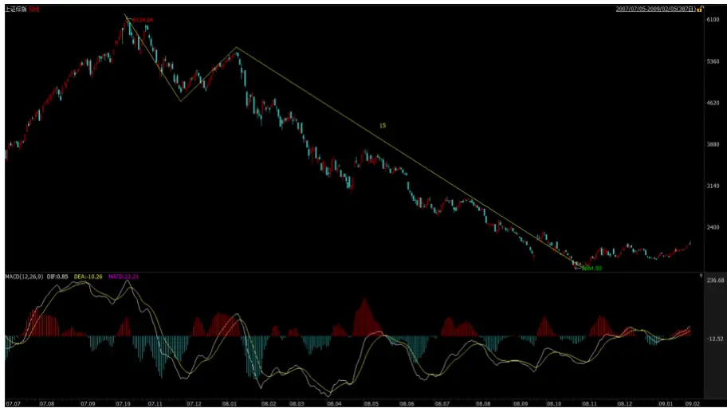
数据来源：Wind，国泰君安证券研究

2007 年的周线级别下跌，虽然在日线上只延续了 3段，但第 3段日线级别下跌在 30分钟线上整整下跌了 15段。然后在“4万亿”政策刺激下，出现了周线级别上涨。

图 10：2009/7/31周线级别下跌中，出现了 1：11的高段数，不久结束
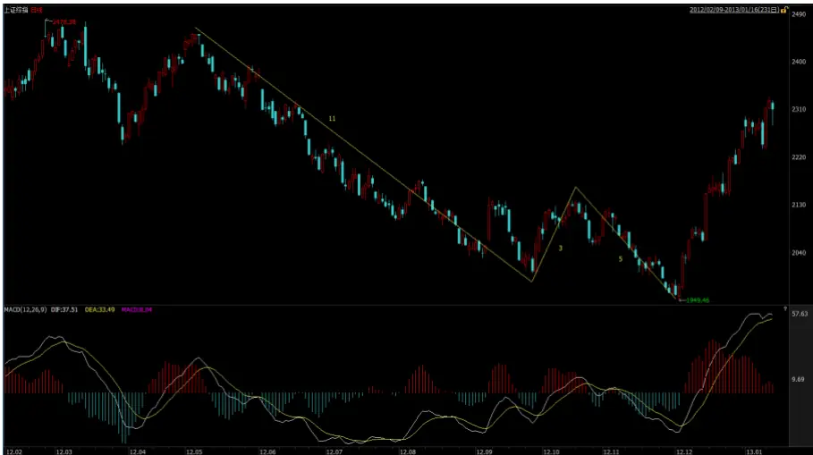
数据来源：Wind，国泰君安证券研究

2009 年的周线级别下跌，在日线上延续了 11 段。同时，第 9 段日线级别下跌在 30 分钟线上同样走出了 11 段。出现 1：11 后约 2 个月，上证指数见到了 1949的大底。

图 11：2013/2/8周线级别下跌中，出现了 1：9的高段数，不久结束
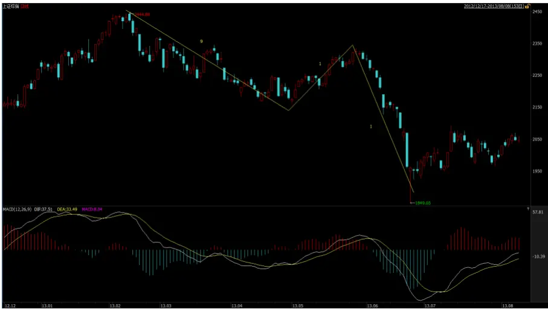
数据来源：Wind，国泰君安证券研究

就连 2013 年的那波“迷你”周线级别下跌，第 1 段日线级别下跌对应的 30 分钟下跌也走出了 1:9的高段数。1 个月后，2015年这轮波澜壮阔的牛市开启。

所谓疯狂，我们的理解就是日线级别上涨的延伸、延伸、再延伸。在我们的体系中，出现高段数 30分钟级别上涨几乎成为了牛市的必要条件。

图 12：2005/6/3 周线级别上涨中，出现了 1：21 的高段数，结束
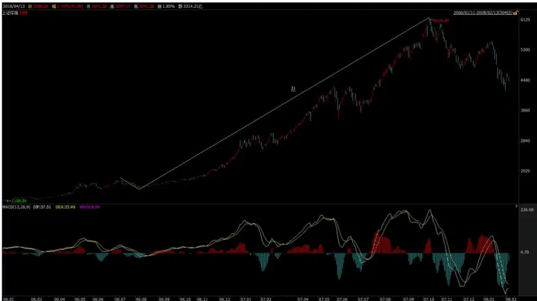
数据来源：Wind，国泰君安证券研究

图 13：2008/10/31 周线级别上涨中，出现了 1：15的高段数，结束
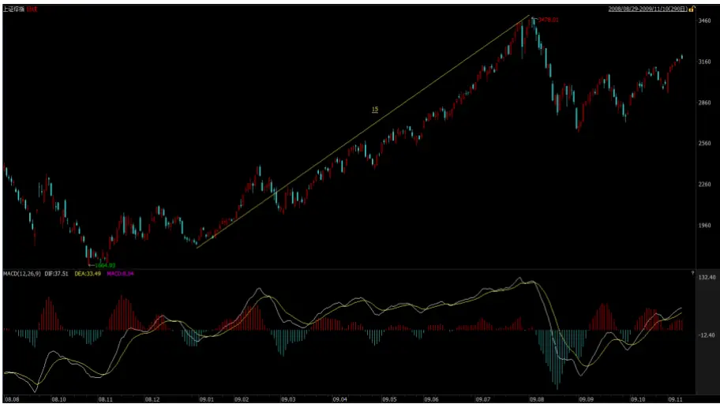
数据来源：Wind，国泰君安证券研究

图 14：2013/6/28周线级别上涨中，出现了 1：21的高段数，结束
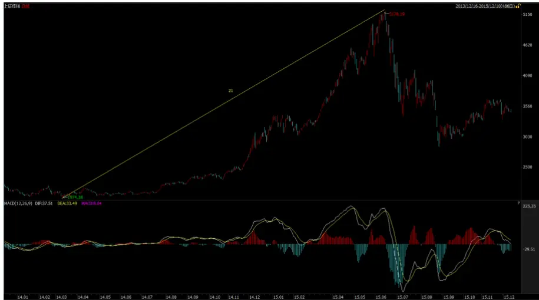
数据来源：Wind，国泰君安证券研究

表 18: 日线级别上涨时，前 9段对应的 30分钟上涨的平均幅度在 9%-13.5%之间，而每一波 30分钟级别回调幅度平均在 4% -5.5%之间
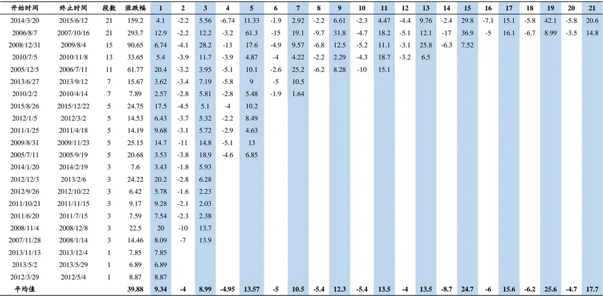
数据来源：Wind，国泰君安证券研究

表 19: 日线级别上涨时，前 9段对应的 30分钟上涨平均时间在 10–22个交易日，而每一波 30分钟级别回调天数平均在 4–11个交易日之间

| 开始时间 终止时间 段数 涨跌幅 |  |  |  | 1 | 2 | 3 | 4 | 5 | 6 | 7 | 8 | 9 | 10 | 11 | 12 | 13 | 14 | 15 | 16 | 17 | 18 | 19 | 20 | 21 |  |
| --- | --- | --- | --- | --- | --- | --- | --- | --- | --- | --- | --- | --- | --- | --- | --- | --- | --- | --- | --- | --- | --- | --- | --- | --- | --- |
| 2014/3/20 2015/6/12 21 159.2 |  |  |  | 3 | 4 | 7 | 25 | 54 | 4 | 8 | 6 | 12 | 4 | 8 | 12 | 11 | 7 | 22 | 2 | 10 | 36 | 35 | 13 | 19 |  |
| 2006/8/7 2007/10/16 21 |  |  | 293.7 | 34 | 2 | 28 | 2 | 48 | 9 | 9 | 5 | 31 | 2 | 12 | 2 | 9 | 28 | 28 | 2 | 14 | 4 | 8 | 3 | 8 |  |
| 2008/12/31 2009/8/4 15 |  |  | 90.65 | 3 | 4 | 19 | 18 | 16 | 3 |  | 10 4 14 4 13 5 15 12 18 2 12 20 22 8 14 |  |  |  |  |  |  |  |  |  |  |  |  |  |  |
| 2010/7/5 | 2010/11/8 13 |  | 33.65 | 5 | 4 | 12 | 8 | 4 | 6 |  |  |  |  |  |  |  |  |  |  |  |  |  |  |  |  |
| 2005/12/5 2006/7/11 |  | 11 | 61.77 | 43 | 4 | 6 | 5 | 24 | 3 | 21 |  |  |  |  |  |  |  |  |  |  |  |  |  |  | 19 |
| 2013/6/27 | 2013/9/12 | 7 | 15.67 | 6 | 2 | 2 | 12 | 14 | 5 | 14 |  |  |  |  |  |  |  |  |  |  |  |  |  |  |  |
| 2010/2/2 | 2010/4/14 | 7 | 7.89 | 2 | 2 | 12 | 17 | 6 | 4 |  |  |  |  |  |  |  |  |  |  |  |  |  |  |  |  |
| 2015/8/26 | 2015/12/22 | 5 | 24.75 | 33 | 1 | 2 | 6 | 35 |  |  |  |  |  |  |  |  |  |  |  |  |  |  |  |  |  |
| 2012/1/5 | 2012/3/2 | 5 | 14.53 | 5 | 3 | 3 | 3 | 22 |  |  |  |  |  |  |  |  |  |  |  |  |  |  |  |  |  |
| 2011/1/25 2011/4/18 |  | 5 | 14.19 | 12 | 4 | 10 | 16 | 10 |  |  |  |  |  |  |  |  |  |  |  |  |  |  |  |  |  |
|  | 2009/8/31 | 2009/11/23 |  | 5 | 25.15 | 13 | 8 | 12 | 6 | 15 |  |  |  |  |  |  |  |  |  |  |  |  |  |  |  |
|  | 2005/7/11 | 2005/9/19 |  | 5 | 20.68 | 3 | 3 | 22 | 9 | 13 |  |  |  |  |  |  |  |  |  |  |  |  |  |  |  |
|  | 2014/1/20 2014/2/19 |  |  | 3 | 7.6 | 4 | 5 | 8 |  |  |  |  |  |  |  |  |  |  |  |  |  |  |  |  |  |
|  | 2012/12/3 | 2013/2/6 |  | 3 | 24.22 | 35 | 1 | 8 |  |  |  |  |  |  |  |  |  |  |  |  |  |  |  |  |  |
| 2012/9/26 | 2012/10/22 | 3 | 6.42 | 5 | 3 | 5 |  |  |  |  |  |  |  |  |  |  |  |  |  |  |  |  |  |  |  |
|  | 2011/10/21 | 2011/11/15 |  | 3 | 9.17 | 10 | 4 | 3 |  |  |  |  |  |  |  |  |  |  |  |  |  |  |  |  |  |
|  | 2011/6/20 2011/7/15 |  |  | 3 | 7.59 | 13 | 3 | 3 |  |  |  |  |  |  |  |  |  |  |  |  |  |  |  |  |  |
|  | 2008/11/4 2008/12/8 |  |  | 3 | 22.5 | 10 | 9 | 5 |  |  |  |  |  |  |  |  |  |  |  |  |  |  |  |  |  |
|  | 2007/11/28 2008/1/14 |  |  | 3 | 14.46 | 9 | 5 | 17 |  |  |  |  |  |  |  |  |  |  |  |  |  |  |  |  |  |
|  | 2013/11/13 2013/12/4 1 |  |  |  | 7.85 | 15 |  |  |  |  |  |  |  |  |  |  |  |  |  |  |  |  |  |  |  |
| 2013/5/2 2013/5/29 |  | 1 | 6.89 | 19 |  |  |  |  |  |  |  |  |  |  |  |  |  |  |  |  |  |  |  |  |  |
|  | 2012/3/29 2012/5/4 |  |  | 1 | 8.87 | 21 |  |  |  |  |  |  |  |  |  |  |  |  |  |  |  |  |  |  |  |
| 平均值 39.88 |  |  |  | 14 | 4 | 10 | 11 | 22 | 5 |  |  |  |  |  |  |  |  |  |  |  |  |  |  |  |  |

数据来源：Wind，国泰君安证券研究

表 20: 日线级别下跌时，对前 9段对应的 30分钟下跌的平均幅度在 7.5%-12%之间，而每一波 30分钟级别反弹幅度平均在 4.5% -7.5%之间

| 开始时间 | 终止时间 | 段数 | 涨跌幅 | 1 | 2 | 3 | 4 | 5 | 6 | 7 | 8 | 9 | 10 | 11 | 12 | 13 | 14 | 15 |
| --- | --- | --- | --- | --- | --- | --- | --- | --- | --- | --- | --- | --- | --- | --- | --- | --- | --- | --- |
| 2008/1/14 | 2008/11/4 | 15 | -68.96 | -23.1 | 10.77 | -11.91 | 8.22 | -26.43 | 10.98 | -17.25 | 15.2 | -21.33 | 6.8 | -11.42 | 12.73 | -37.69 | 28.33 | -26.78 |
| 2012/5/4 | 2012/9/26 | 11 | -18.26 | -5.59 | 3.31 | -4.6 | 1.82 | -5.48 | 2.15 | -6.32 | 3.48 | -6.64 | 5.38 | -6.3 |  |  |  |  |
| 2013/2/6 | 2013/5/2 | 9 | -10.69 | -5.8 | 3.17 | -3.93 | 3.27 | -4.57 | 4.04 | -6.89 | 3.58 | -3.27 |  |  |  |  |  |  |
| 2011/7/15 | 2011/10/21 | 7 | -17.83 | -12.49 | 5.97 | -7.04 | 3.37 | -6.85 | 4.63 | -5.39 |  |  |  |  |  |  |  |  |
| 2011/4/18 | 2011/6/20 | 7 | -14.26 | -6.87 | 1.65 | -2.11 | 1.74 | -6.7 | 2.25 | -4.69 |  |  |  |  |  |  |  |  |
| 2010/11/8 | 2011/1/25 | 7 | -15.26 | -11.23 | 3.34 | -4.13 | 5.58 | -7.18 | 3.99 | -5.45 |  |  |  |  |  |  |  |  |
| 2013/9/12 | 2013/11/13 | 5 | -7.43 | -4.49 | 3.48 | -5.71 | 2.87 | -3.43 |  |  |  |  |  |  |  |  |  |  |
| 2012/10/22 | 2012/12/3 | 5 | -8.11 | -3.69 | 3.07 | -5.69 | 1.73 | -3.52 |  |  |  |  |  |  |  |  |  |  |
| 2010/4/14 | 2010/7/5 | 5 | -25.34 | -20.78 | 6.59 | -6.65 | 4.06 | -8.98 |  |  |  |  |  |  |  |  |  |  |
| 2009/11/23 | 2010/2/2 | 5 | -12.1 | -7.26 | 7.61 | -8.53 | 8.02 | -10.85 |  |  |  |  |  |  |  |  |  |  |
| 2007/10/16 | 2007/11/28 | 5 | -21.15 | -9.75 | 9.18 | -15.58 | 7.4 | -11.75 |  |  |  |  |  |  |  |  |  |  |
| 2005/9/19 | 2005/12/5 | 5 | -11.59 | -7.28 | 2.96 | -7.91 | 4.5 | -3.77 |  |  |  |  |  |  |  |  |  |  |
| 2015/6/12 | 2015/8/26 | 3 | -43.34 | -32.82 | 15.06 | -26.7 |  |  |  |  |  |  |  |  |  |  |  |  |
| 2013/12/4 | 2014/1/20 | 3 | -11.57 | -8.1 | 2.26 | -5.9 |  |  |  |  |  |  |  |  |  |  |  |  |
| 2012/3/2 | 2012/3/29 | 3 | -8.47 | -2.68 | 3.31 | -8.97 |  |  |  |  |  |  |  |  |  |  |  |  |
| 2011/11/15 | 2012/1/5 | 3 | -15.07 | -15.55 | 3.44 | -2.78 |  |  |  |  |  |  |  |  |  |  |  |  |
| 2009/8/4 | 2009/8/31 | 3 | -23.15 | -19.76 | 7.46 | -10.88 |  |  |  |  |  |  |  |  |  |  |  |  |
| 2008/12/8 | 2008/12/31 | 3 | -12.91 | -8.22 | 6.08 | -10.55 |  |  |  |  |  |  |  |  |  |  |  |  |
| 2006/7/11 | 2006/8/7 2016/1/28 | 3 1 | -11.36 -27.28 | -6.22 | 3.8 | -8.95 |  |  |  |  |  |  |  |  |  |  |  |  |
| 2015/12/22 2014/2/19 | 2014/3/20 | 1 | -6.96 | -27.28 -6.96 |  |  |  |  |  |  |  |  |  |  |  |  |  |  |
| 2013/5/29 |  | 1 | -16.09 | -16.09 |  |  |  |  |  |  |  |  |  |  |  |  |  |  |
|  | 2013/6/27 |  |  |  |  |  |  |  |  |  |  |  |  |  |  | -37.69 | 28.33 | -26.78 |

数据来源：Wind，国泰君安证券研究

表 21: 日线级别下跌时，前 7段对应的 30分钟下跌时间在 10个交易日左右，而每一波 30分钟级别反弹天数平均为 5-6个交易日

| 开始时间 | 终止时间 | 段数 | 涨跌幅 | 1 | 2 | 3 | 4 | 5 | 6 | 7 | 8 | 9 | 10 | 11 12 | 13 |  | 14 | 15 |
| --- | --- | --- | --- | --- | --- | --- | --- | --- | --- | --- | --- | --- | --- | --- | --- | --- | --- | --- |
| 2008/1/14 | 2008/11/4 | 15 | -68.96 | 14 | 8 | 4 | 5 | 21 | 3 | 10 | 27 | 15 | 2 | 5 | 17 37 |  | 5 | 23 |
| 2012/5/4 | 2012/9/26 | 11 | -18.26 | 16 | 1 | ∞ | 6 | 8 | 2 | 20 | 8 | 18 | 3 | 12 |  |  |  |  |
| 2013/2/6 | 2013/5/2 | 9 | -10.69 | 9 | 3 | 1 | 3 | 7 | 5 | 14 | 3 | 6 |  |  |  |  |  |  |
| 2011/7/15 | 2011/10/21 | 7 | -17.83 | 17 | 12 | 17 | 1 | 9 | 4 | 4 |  |  |  |  |  |  |  |  |
| 2011/4/18 | 2011/6/20 | 7 | -14.26 | 13 | 3 | 4 | 2 | 10 | 3 | 8 |  |  |  |  |  |  |  |  |
| 2010/11/8 | 2011/1/25 | 7 | -15.26 | 11 | 2 | 3 | 11 | 10 | 10 | 8 |  |  |  |  |  |  |  |  |
| 2013/9/12 | 2013/11/13 | 5 | -7.43 | 9 | 11 | 6 | 6 | 5 |  |  |  |  |  |  |  |  |  |  |
| 2012/10/22 | 2012/12/3 | 5 | -8.11 | 5 | 4 | 11 | 4 | 6 |  |  |  |  |  |  |  |  |  |  |
| 2010/4/14 | 2010/7/5 | 5 | -25.34 | 26 | 1 | 10 | 8 | 9 |  |  |  |  |  |  |  |  |  |  |
| 2009/11/23 | 2010/2/2 | 5 | -12.1 | 4 | 6 | 12 | 9 | 19 |  |  |  |  |  |  |  |  |  |  |
| 2007/10/16 | 2007/11/28 | 5 | -21.15 | 8 | 4 | 7 | 3 | 9 |  |  |  |  |  |  |  |  |  |  |
| 2005/9/19 | 2005/12/5 | 5 | -11.59 | 7 | 5 | 12 | 16 | 10 |  |  |  |  |  |  |  |  |  |  |
| 2015/6/12 | 2015/8/26 | 3 | -43.34 | 18 | 27 | 7 |  |  |  |  |  |  |  |  |  |  |  |  |
| 2013/12/4 | 2014/1/20 | 3 | -11.57 | 13 | 6 | 13 |  |  |  |  |  |  |  |  |  |  |  |  |
| 2012/3/2 | 2012/3/29 | 3 | -8.47 | 3 | 5 | 11 |  |  |  |  |  |  |  |  |  |  |  |  |
| 2011/11/15 | 2012/1/5 | 3 | -15.07 | 31 | 3 | 1 |  |  |  |  |  |  |  |  |  |  |  |  |
| 2009/8/4 | 2009/8/31 | 3 | -23.15 | 11 | 3 | 5 |  |  |  |  |  |  |  |  |  |  |  |  |
| 2008/12/8 | 2008/12/31 | 3 | -12.91 | 6 | 3 | 8 |  |  |  |  |  |  |  |  |  |  |  |  |
| 2006/7/11 | 2006/8/7 2016/1/28 | 3 | -11.36 | 7 | 5 | 7 |  |  |  |  |  |  |  |  |  |  |  |  |
| 2015/12/22 |  | 1 | -27.28 -6.96 | 26 |  |  |  |  |  |  |  |  |  |  |  |  |  |  |
| 2014/2/19 | 2014/3/20 | 1 |  | 21 |  |  |  |  |  |  |  |  |  |  |  |  |  |  |
| 2013/5/29 | 2013/6/27 | 1 | -16.09 | 18 |  |  |  |  |  |  |  |  |  |  |  | 37 | 5 | 23 |

数据来源：Wind，国泰君安证券研究

## 本公司具有中国证监会核准的证券投资咨询业务资格

## 分析师声明

作者具有中国证券业协会授予的证券投资咨询执业资格或相当的专业胜任能力，保证报告所采用的数据均来自合规渠道，分析逻辑基于作者的职业理解，本报告清晰准确地反映了作者的研究观点，力求独立、客观和公正，结论不受任何第三方的授意或影响，特此声明。

## 免责声明

本报告仅供国泰君安证券股份有限公司（以下简称“本公司”）的客户使用。本公司不会因接收人收到本报告而视其为本公司的当然客户。本报告仅在相关法律许可的情况下发放，并仅为提供信息而发放，概不构成任何广告。

本报告的信息来源于已公开的资料，本公司对该等信息的准确性、完整性或可靠性不作任何保证。本报告所载的资料、意见及推测仅反映本公司于发布本报告当日的判断，本报告所指的证券或投资标的的价格、价值及投资收入可升可跌。过往表现不应作为日后的表现依据。在不同时期，本公司可发出与本报告所载资料、意见及推测不一致的报告。本公司不保证本报告所含信息保持在最新状态。同时，本公司对本报告所含信息可在不发出通知的情形下做出修改，投资者应当自行关注相应的更新或修改。

本报告中所指的投资及服务可能不适合个别客户，不构成客户私人咨询建议。在任何情况下，本报告中的信息或所表述的意见均不构成对任何人的投资建议。在任何情况下，本公司、本公司员工或者关联机构不承诺投资者一定获利，不与投资者分享投资收益，也不对任何人因使用本报告中的任何内容所引致的任何损失负任何责任。投资者务必注意，其据此做出的任何投资决策与本公司、本公司员工或者关联机构无关。

本公司利用信息隔离墙控制内部一个或多个领域、部门或关联机构之间的信息流动。因此，投资者应注意，在法律许可的情况下，本公司及其所属关联机构可能会持有报告中提到的公司所发行的证券或期权并进行证券或期权交易，也可能为这些公司提供或者争取提供投资银行、财务顾问或者金融产品等相关服务。在法律许可的情况下，本公司的员工可能担任本报告所提到的公司的董事。

市场有风险，投资需谨慎。投资者不应将本报告作为作出投资决策的唯一参考因素，亦不应认为本报告可以取代自己的判断。在决定投资前，如有需要，投资者务必向专业人士咨询并谨慎决策。

本报告版权仅为本公司所有，未经书面许可，任何机构和个人不得以任何形式翻版、复制、发表或引用。如征得本公司同意进行引用、刊发的，需在允许的范围内使用，并注明出处为“国泰君安证券研究”，且不得对本报告进行任何有悖原意的引用、删节和修改。

若本公司以外的其他机构（以下简称“该机构”）发送本报告，则由该机构独自为此发送行为负责。通过此途径获得本报告的投资者应自行联系该机构以要求获悉更详细信息或进而交易本报告中提及的证券。本报告不构成本公司向该机构之客户提供的投资建议，本公司、本公司员工或者关联机构亦不为该机构之客户因使用本报告或报告所载内容引起的任何损失承担任何责任。

## 评级说明

## 1.投资建议的比较标准

投资评级分为股票评级和行业评级。以报告发布后的12个月内的市场表现为比较标准，报告发布日后的12个月内的公司股价（或行业指数）的涨跌幅相对同期的沪深300指数涨跌幅为基准。

## 2.投资建议的评级标准

| 评级 |  | 说明 |
| --- | --- | --- |
| 股票投资评级 | 增持 | 相对沪深 300指数涨幅15%以上 |
|  | 谨慎增持 | 相对沪深300指数涨幅介于5%～15%之间 |
|  | 中性 | 相对沪深300指数涨幅介于-5%～5% |
|  | 减持 | 相对沪深 300指数下跌 5%以上 |
| 行业投资评级 | 增持 | 明显强于沪深300 指数 |

| 报告发布日后的12个月内的公司股价 | 中性 | 基本与沪深300指数持平 |
| --- | --- | --- |
| （或行业指数）的涨跌幅相对同期的沪 深300指数的涨跌幅。 | 减持 | 明显弱于沪深300指数 |

国泰君安证券研究

|  | 上海 | 深圳 | 北京 |
| --- | --- | --- | --- |
| 地址 | 上海市浦东新区银城中路168号上海 银行大厦29 层 | 深圳市福田区益田路 6009 号新世界 商务中心34层 | 北京市西城区金融大街 28 号盈泰中 心2号楼10层 |
| 邮编 | 200120 | 518026 | 100140 |
| 电话 | (021)38676666 | (0755)23976888 | (010)59312799 |
|  | E-mail: gtjaresearch@gtjas.com |  |  |