nInfo] [Table_Title]2016.05.11

# 基于微观市场结构的择时策略

## ――数量化专题之七十一

玉刘富兵（分析师）

## 陈奥林（研究助理）

8 021-38676673

021-38674835

liufubing008481@gtjas.com

证书编号 S0880511010017

chenaolin@gtjas.com

S0880114110077

## 本报告导读：

做好证券投资需要理清楚两个要素，首先，我们需要了解标的证券的真实价值。另一方面，我们需要了解价格向真实价值收敛的过程，即对时点的准确把握。

## 摘要：

[Table_Summary] • 本文从证券交易中不同类型投资者交易行为的角度出发，通过对不同类型投资者的资金活动量与市场走势的分析，让投资者更好的了解 A股市场的微观结构特征。

- 本文量化的方法从市场公开数据中寻找主力资金的动向，通过对买入资金进行分类，将市场投资者分为知情交易者、趋势追踪者、跟随交易者。

- 基于不同类型投资者的行为模式，本文尝试将市场划分为四个阶段，并对每个阶段的收益特征进行了深入分析。其中，在知情交易者活跃度处于第一阶段时做多的胜率高达86.75%，历史发生 83 次，平均收益 3.2%。

- 在可做空的假设下，策略自 2006 年 12 月至 2016 年 1 月可以获得接近 46 倍的绝对收益。策略收益曲线较为平稳，有效性较高。

- 在做空限制条件下，策略单边做多，自2006年12月至2016年 1月可以获得接近1140%的绝对收益。

金融工程

## 金融工程团队：

刘富兵：（分析师）

电话：021-38676673

邮箱：liufubing008481@gtjas.com

证书编号：S0880511010017

刘正捷：（分析师）

电话：0755-23976803

邮箱：liuzhengjie012509@gtjas.com

证书编号：S0880514070010

## 陈奥林：（研究助理）

电话：021-38674835

邮箱：chenaolin@gtjas.com

证书编号：S0880114110077

王浩：（研究助理）

电话：021-38676434

邮箱：wanghao014399@gtjas.com

证书编号：S0880114080041

## 李辰：（研究助理）

电话：021-38677309

邮箱：lichen@gtjas.com

证书编号：S0880114060025

## 孟繁雪：（研究助理）

电话：021-38675860

邮箱：mengfanxue@gtjas.com

证书编号：S088011604008

## [Table_R相关报告

《基于 MACD 的价格分段研究 2.0》2016.05.03

《产业并购基金，下一个事件金矿》2016.04.11

《基于股东集体增减持行为的市场拐点探究》2016.03.18

《基于均线择时的保本基金设计》2016.03.07《择时新视角：捕捉趋势中的绝对收益》2016.03.07

## 概述

证券价格运动的本质是投资者根据其所知的信息和逻辑修正自身预期，通过二级市场众多投资者的交易使证券价格向其真实价值收敛，而这个收敛的过程就是学术研究上的有效市场。做好证券投资需要理清楚两个要素，空间和时间。具体来说，证券投资的第一步就是探寻标的的真实价值，从而对标的进行定价。其中，真实价值（我的预期）和当前价格（市场的预期）的差值就是获利的空间。此外，我们还需要知道价格收敛的准确时点。然而，有效市场不是一个线性变化的过程，其不具备固定的收敛特性。如果想要更好的把握价格收敛的过程，就需要研究微观市场结构。

微观市场结构理论的聚焦点主要在于资本市场上的可交易资产的价格的形成过程和相关机制。具体来说，微观市场结构的研究主要涵盖三个方面，分别为不同类型市场参与者行为的研究、市场交易机制对价格发现过程的影响、市场质量与资产定价的关系。通过研究信息传导到价格的过程中的影响因素，我们可以更好的理解证券价格短期波动的根源。本篇文章将探究投资者行为与证券价格发现过程的联系，并利用不同类型投资者的交易行为来构建投资策略。

本文从证券交易中不同类型投资者交易行为的角度出发。首先，通过对不同类型投资者的资金活动量与市场走势的分析，让投资者更好的了解 A 股市场的微观结构特征。此外，基于不同类型投资者的行为模式，本文尝试将市场划分为四个阶段，并对每个阶段的收益特征进行了深入分析。最后，本文利用知情交易者的行为模式构建了择时策略。

## 1. 投资者行为量化观察

## 1.1.A 股市场的投资者结构

图1展示了2010年-2014年上海证券交易所统计发布的年鉴中，主要的几类投资者持有市值占比。从图中可以看出，随着限售股不断解禁，一般法人持股市值占有率逐年下降。此外，沪港通在 2014 年底开通之后，自然人持股市值占比有明显的提升，在最近4年提升了一倍左右。整体来看，A股市场仍然处于散户为主的阶段，机构持有市值不足市场总市值的 20%。但是，机构拥有投研支持和信息优势，这使得机构可以更早的了解公司的真实价值，这就导致 A 股市场大规模资金追随小规模庄家的特点。从而奠定了 A股市场较强的趋势性和波动性。

图 1 交易所投资者结构占比
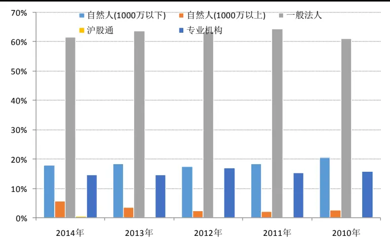
数据来源：上海证券交易所统计年鉴、国泰君安证券研究

## 1.2.用量化的方法观测各类交易者行为

在实际的投资中，或多或少都会感觉到有主力资金的存在，然而在现有的公开信息中，我们无法实时观测机构投资者或超级大户的持仓变动。但是，我们可以从投资者背景特征的角度出发，将其分为三大类，分别为知情交易者、趋势追踪者、跟随交易者。

知情交易者在投资操作通常占据主动。顾名思义，知情交易者通常具备较强的信息优势。但是，由于信息优势具备时效性，知情交易者更倾向于快速完成投资操作，而不过度关注操作中涉及的冲击成本。因此，该类投资者操作时的特征体现为，金额大、速度快。

趋势交易者主要是具有一定投资经验的成熟交易者，其拥有较强的判断力和执行力。该类投资者的信息优势虽不如知情交易者明显，但是其对价格的变化反应敏锐，通常能够在趋势形成初期就进场，并敢于重仓参与。

跟随交易者的数量在所有投资者比例中占比最高，多是新进入证券市场的初学者。跟随交易者没有完善的投资体系，通常跟随感觉进行操作，表现为追涨杀跌、频繁操作。由于这类投资者没有信息和逻辑支持，其参与的资金量通常较小。

在定义了三类投资者类型之后，我们可以尝试从市场公开数据中，通过量化的方法刻画各类投资者的资金动向。如上所述，由于信息具有较强的时效性，知情交易者倾向于在较短的时间内完成操作，从而导致其操作时资金集中度较高。虽然利用程序化下单等技术手段进行拆单操作能够在一定程度上隐藏资金动向，但如果资金规模达到一定程度，隐藏资金动向的难度就会大大增加。因此，我们尝试通过对单笔成交金额进行归类，从而对主力资金的动向进行捕捉。具体来说，我们将每只个股每笔交易的数据根据其成交额及主动发起方的买卖方向进行分类。逻辑如图2所示，根据单笔挂单金额的大小，对应设定的阀值将其归入相应的投资者类型中。具体来说，如果当前一笔成交额等于此时的卖一价（买一价），则判定该笔为主动买入（卖出）。在此基础上，我们以100万和20万作为阀值，根据单笔主动买入成交数据中对应的成交金额将发起该笔成交的对象划归为三类，分别为知情交易者、趋势追踪者、跟随交易者。例如，当前买一的价格为10.1元，卖一的价格为10.2元，之后市场以10.2元的价格成交1000手。由于成交额102万大于100万阀值，则将该笔交易记知情交易者买入102万。如果市场以10.2的价格成交 500 手，则将该笔交易记为趋势追踪者买入 51 万。最后，我们对个股每日各类型投资者主动买入的资金进行加总，即可观测到该类投资者当日买入和卖出标的的情况。

图 2 基于成交额对成交进行归类
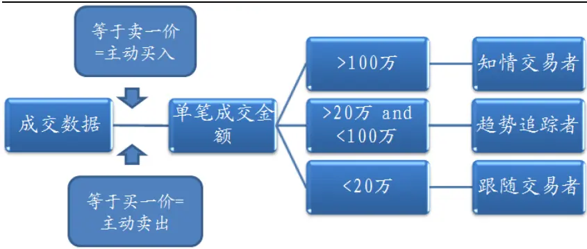
数据来源：国泰君安证券研究

## 1.3.不同类型投资者交易占比变化

基于每日各类投资者买入金额的基础上，对其进行归一化即可获得每日各类投资者每日的买入金额占比。其中，考虑到投资者在实际投资中可能会涉及短线操作，短期日间买入金额可能会有较大的波动，所以我们使用 20均线来进行简单的过滤。

从图3可以看出，各类投资者资金活动占比长期在稳定区间进行波动。长期来看，知情交易者买入额占总买入额的15%左右，趋势追踪者买入额占总成交额约25%，而跟随交易者买入额占比波动较大，平均占总交易额的60%左右。从微观角度来看，各类投资者活动量占比此起彼伏，在短期呈现轮动的态势，可以看出，不同类型投资者对信息的反应速度有差异。值得一提的是，2015年7月国家队为救市大幅买入股票，由于其资金量大，交易特征与本文定义的知情交易者相像，因此，知情交易者的交易活动占比在相应时间活跃度大幅增加。

图 3 不同类型投资者活动量占比
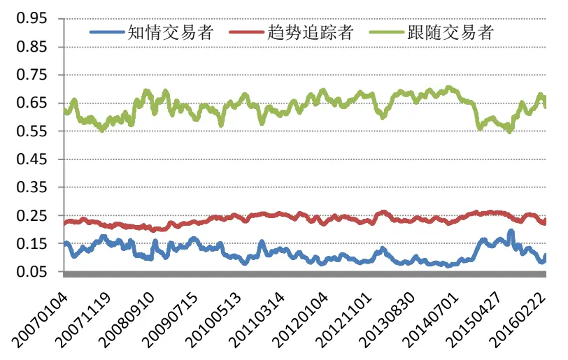
数据来源：国泰君安证券研究

## 1.4.跟随交易者与指数走势的关系

由于 A 股市场不同投资者拥有的信息不同，掌握信息比较充分的投资者，通常处于优势地位。相对地，信息匮乏的一方则处于相对不利的地位。中国的资本市场相对海外来说信息反应速度相对较慢，知情交易者基于其投研支持在一定程度上具备很强的信息优势，相对地，跟随交易者通过追随趋势及滞后的信息进行投资，反应较慢，,从而贻误了最佳进场时机。

图 4 展示了上证综指和跟随交易者资金活动量占比的走势图。整体来看，每当跟随交易者资金活动量占比开始上升的时候，指数通常短期就会面临一波较大幅度的下跌。相对地，当跟随交易者资金活动量占比下降时，指数通常处于上涨趋势的初期。可以看出，没有信息优势的跟随交易者在 A 股证券投资中多数时间处于亏损状态。同时，这也映射出 A股市场的趋势多由知情交易者来驱动。

图 4 跟随交易者成交占比与指数走势的关系
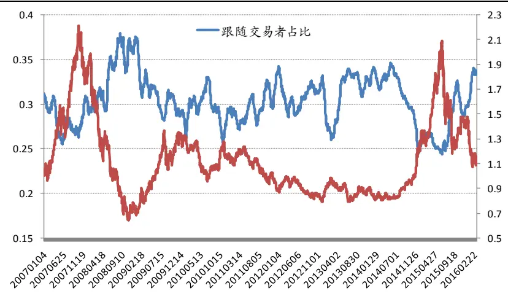

数据来源：国泰君安证券研究

## 2. 投资者行为模式对择时的启示

## 2.1. 策略逻辑

中国A股市场于1990年开市，至今已有20年的发展历程，但是，市场整体仍处于发展中阶段。而新兴市场最大的特点在于投资者信息不对称程度高、市场波动大。一方面，A 股市场投机氛围浓厚，价格运行具有较强的情绪化倾向，导致证券价格波动率较高。另一方面，公募私募等机构的信息渠道和数据分析能力显著优于市场上的其他投资者，因而在短期具有明显的信息优势。因此，虽然证券价格由市场上所有投资者的预期合力来推动，但不同类型投资者修正预期的时点不同，而不同类型投资者也存在相互影响。如图5所示，拥有绝对信息优势或具有主观投资逻辑的投资者（知情交易者）受其他投资者干扰较小，其在整个价格发现过程中占据绝对主动地位。相对地，而那些没有形成自己的预期或没有信息渠道的投资者（跟随交易者）则更多是通过观察其他投资者的行为来改变自己的行为，从而市场在短期形成明显的“羊群效应”。

图 5 各类投资者的价格发现过程
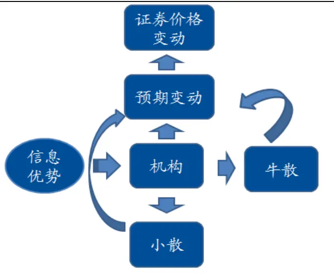
数据来源：国泰君安证券研究

## 2.2.时间序列平稳的重要性

构建量化模型的核心目的在于有效预测未来市场走势。然而，模型有效的基石在于模型中不同变量的关系在历史以及未来具有稳定性和延续性。换句话说，模型涉及变量的基本特性必须能在未来较长的一段时期里维持不变。否则，基于历史数据构建的策略就仅是一个数据挖掘的过程。针对本文使用的时间序列数据，我们需要保证变量在时间序列上的基本特性不会随时间产生变化，然后通过量化模型提取数据中的信息，进而对未来市场走势进行预测。因此，在构建策略前，需要对时间序列指标的平稳性进行测试。简单来说，平稳性就是要求经由样本时间序列所得到的拟合曲线在未来的一段期间内仍能顺着现有的形态“惯性”地延续下去；如果数据非平稳，则说明样本拟合曲线的形态不具有“惯性”延续的特点，也就是基于未来将要获得的样本时间序列所拟合出来的曲线将显著偏离于当前的样本拟合曲线。

检验时间序列平稳性的方法主要有两个方面。首先，从图形上看,数据如果平稳,它的活动将固定于具有上下界的区域。其次，我们将通过Dickey-Fuller test 来检测序列是否存在单位根。

## 2.3.如何去除交易活动中的趋势

为了保证时间序列的平稳性，我们需要去除数据中随时间变化的趋势，从而获得一个具有均值回复特征的指标。因此，本文采用类似于MACD的DIF指标的计算方法，对原有的不同类型投资者的成交数据进行去噪。与此同时，考虑到市场整体的成交额随时间有较明显的趋势性变化，本文在计算投资者活跃度指数（长短期均线距离）的时候纳入市场整体的成交情况，将投资者的买入金额转换为买入金额占总成交额的比例。其中，S、L、T的参数我们参照MACD指标默认的12，26，9。最后，本文将所得的指标定义为知情交易者活跃度。具体指标构建过程如下：

$$
n\sqcup43=7+3)3\div33=(45+41)3=(1-1)+\frac{1}{27}\sqcup\bigstar\bigstar2)\cdots331\times211+(1+1)
$$

n日移动平均成交额 =（短期成交额*（n-1)+当日成交额*2）/（n+1)

投资者活跃度 = （S日移动平均买入额 / S日移动平均成交额） - （L日移动平均买入额 / L日移动平均成交额）

以知情交易者的投资活跃度为例，从图6中可以看出，投资者活跃度指标在窄幅区间中运动，并且符合均值回复的特征。

图 6 投资者活跃度时间序列
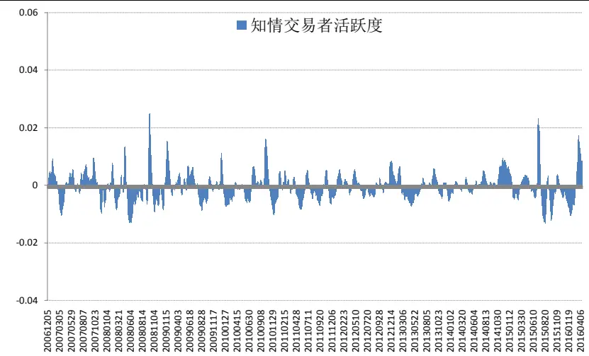

数据来源：国泰君安证券研究

接下来，为了进一步确认数据的平稳性，我们用 Dickey-Fuller test对原有的知情交易者日买入额数据和衍生出的知情交易者投资活跃度数据进行单位根检测。

从表1中可以看出，如果对知情交易者日买入额数据进行单位根检验，发现其P值较高（0.29），未能通过单位根检测，说明时间序列不平稳，即序列具有显著的趋势性。但是，我们对知情交易者活跃度指标进行单位根检测发现其P值显著小于0.05，拒绝单位根假设。可以看出，通过对原有序列进行去噪之后，序列变得相对平稳，这也为之后的策略打下基础。

表 1 Dickey-Fuller 检验

| 时间序列 | P值 |
| --- | --- |
| 知情交易者日买入额： | 0.29401 |
| 知情交易者活跃度： | 0.00006 |

数据来源：国泰君安证券研究

## 2.4.基于投资者行为变化的 4 个阶段

在图 6 中可以看出投资者活跃度指标长期围绕零轴进行均值回复运动，在此基础上，本文根据投资者活跃度的变化将市场分为 4个阶段。具体来说，当一类投资者的投资活跃度在零轴上方时，则意味着该类投资者交易活跃度相较短期处于较为活跃的状态。相对地，当一类投资者的投资活跃度在零轴下方时，则表示该类投资者短期活跃度相对低迷。更进一步来看，根据投资者活跃度在正负区间峰值的位臵可进而将对应区间划分为两部分。 最终，如图 7 所示，我们将投资者的行为分成四个阶段，分别为升温、活跃、冷却、低迷。

图 7 投资者行为阶段定义
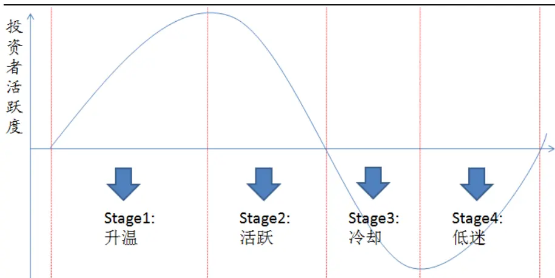
数据来源：国泰君安证券研究

接下来，我们将深入研究每一个类投资者的行为模式是否能够对市场走势起到预测的作用。具体来说，本文采用事件研究的方法，以上证综指作为市场走势的代理变量，分别统计了以知情交易者、趋势追踪者、跟随交易者的四个行为阶段划分的市场表现情况。

## 2.5.知情交易者活跃度与市场走势的关系

图 8 展示了知情交易者的四个行为阶段对应的市场表现情况。可以看出，知情交易者活跃度对市场走势有显著的影响。具体来看，当知情交易者活跃度处于升温阶段，也就是知情交易者入场初期，其对市场的驱动力十分显著。然而，在知情交易者活跃度冷却后，市场大概率会迎来下跌。

图 8 知情交易者行为与市场走势
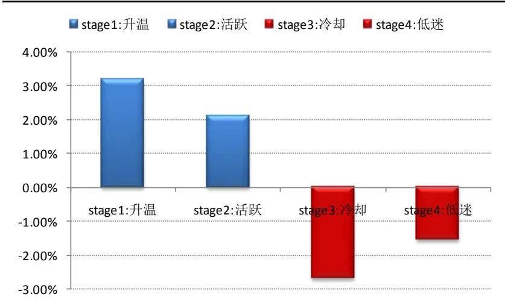
数据来源：国泰君安证券研究

表 2展示了四个阶段的详细数据，自 2006年 12月以来，第一阶段（升温）共发生 83 次，而如果在此时建仓，最终录得正收益的概率可达约87%。平均来看，升温阶段平均收益率为 3.2%。所以，知情交易者活跃度上升初期是参与行情的最佳时期。相反地，当知情交易者活跃度大幅下滑并处于冷却阶段时，市场下跌的概率高达约 80%。也就是说，在知情交易者离场观望时，市场平均收益率为-2.68%。

知情交易者活跃度的第二阶段（活跃）和第四（低迷）阶段类似于过渡期的性质。在活跃阶段初期，也就是知情交易者逐步进场后活跃度升温并达到巅峰时，短期市场会延续之前上涨的动能。然而，在活跃阶段后期，虽然知情交易者活跃度仍相对较高，但此时知情交易者已经开始逐步出货离场。因此，活跃阶段市场上涨的胜率略低于升温阶段，为 76.72%。活跃阶段的收益取决于市场深度。如果市场上涨动能很强，散户此时参与意愿较高，则知情交易者出货时不会对市场产生较大的冲击。反之，如果市场上涨乏力，则知情交易者出货时产生的冲击就较大，甚至会直接反转市场趋势。整体来看，该阶段平均收益低于升温阶段，为 2.12%。

表 2 知情交易者活跃度与市场的关系

| 知情交易者 | 平均收益率 | 次数 | 胜率 | 平均持续天数 | 最大亏损 |
| --- | --- | --- | --- | --- | --- |
| stage1:升温 | 3.20% | 83 | 86.75% | 5 | -13.48% |
| stage2:活跃 | 2.12% | 116 | 76.72% | 6 | -6.33% |
| stage3:冷却 | -2.68% | 89 | 21.35% | 8 | -24.65% |
| stage4:低迷 | -1.53% | 116 | 42.24% | 7 | -22.24% |

数据来源：国泰君安证券研究

## 2.6.趋势追踪者活跃度与市场走势的关系

图 9 展示了趋势追踪者的四个行为阶段对应的市场表现情况。相对知情交易者来说，趋势追踪者依靠其对市场判断的敏锐度，但其依旧可以在上涨初期就参与行情，并大概率获取正收益。具体来看，当趋势追踪者活跃度处于升温阶段时，市场平均收益为 3.37%。然而，趋势追踪者的节奏慢于知情交易者，因此在活跃阶段后期，知情交易者已经平仓离场，该阶段平均收益仅有 1.33%。

图 9 趋势追踪者行为与市场走势
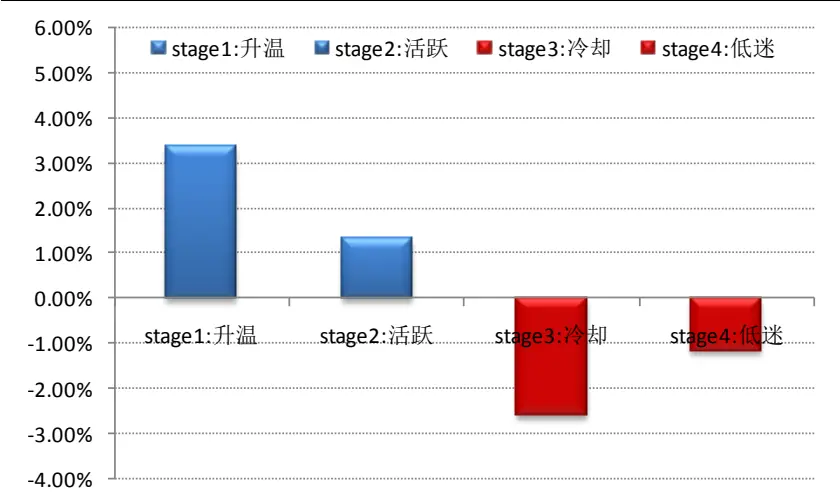
数据来源：国泰君安证券研究

表3详细展示了趋势追踪者活跃度四个阶段对应市场的收益情况。简单来说，趋势追踪者活跃度对市场的预测作用可以看作为知情交易者活跃度的轻微滞后版。一方面，趋势追踪者的资金量相对知情交易者较小，有追随知情交易者的现象。其次，从信息渠道的角度来看，趋势追踪者的信息获取能力弱于知情交易者，这就导致趋势追踪者的行动滞后于知情交易者。但是，其对于其他小资金散户依然有着绝对优势。同时，趋势追踪者进场可以看作是对市场上涨信号的二次确认。因此，在趋势追踪者活跃度达到升温阶段时，市场上涨的概率高达 95.46%，平均可获得 3.37%的收益。

基于趋势追踪者反应较慢的特点，趋势追踪者活跃度处于低迷阶段后期时，市场已经大概率开始上涨。相对地，当趋势追踪者活跃度达到巅峰的时候，正是知情交易者开始卖出的时候，因此在趋势追踪者的活跃阶段，胜率虽然可达 71.43%，但该阶段平均收益率仅为 1.33%。

表 3 趋势追踪者行为与市场走势

| 趋势追踪者 | 平均收益率 | 次数 | 胜率 | 平均持续天数 | 最大亏损 |
| --- | --- | --- | --- | --- | --- |
| stage1:升温 | 3.37% | 88 | 95.46% | 6 | -7.59% |
| stage2:活跃 | 1.33% | 133 | 71.43% | 6 | -7.35% |
| stage3:冷却 | -2.61% | 89 | 19.10% | 8 | -21.17% |
| stage4:低迷 | -1.18% | 133 | 45.87% | 5 | -20.86% |

数据来源：国泰君安证券研究

## 2.7.跟随交易者活跃度与市场走势的关系

图 10 展示了跟随交易者的四个行为阶段对应的市场表现情况。与其他两类投资者不同，跟随交易者基本充当了“接盘侠”的角色。从图 10中可以看出，当跟随交易者活跃度快速升温时，市场大概率会遭遇下跌。然而，当跟随交易者活跃度开始冷却时，市场多会迎来一波上涨。证券投资在没有现有的存量资金下是一个零和游戏，追随趋势且在趋势末期追涨的跟随交易者大概率是会亏损的，这也是其他投资者的盈利来源。

图 10 跟随交易者行为与市场走势
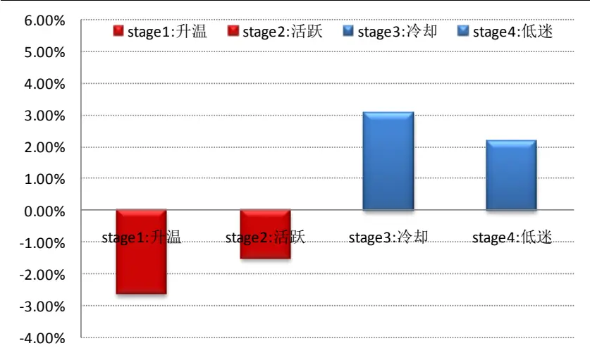
数据来源：国泰君安证券研究

表4详细描述了跟随交易者活跃度的四个阶段对应市场的收益情况。不难看出，跟随交易者活跃度与市场走势基本呈反向变化。由于跟随交易者信息获取能力较弱，其更倾向于依据感觉进行操作。因此，跟随交易者入场时间相对较晚，基本已经处于上涨趋势的末期。然而，在下跌中跟随交易者更容易受恐慌情绪影响，从而在较低的位臵抛售股票。所以，可以看出当跟随交易者活跃度下降处于冷却阶段时，市场平均收益为 3.06%。

表 4 跟随交易者行为与市场走势

| 跟随交易者 | 平均收益率 | 次数 | 胜率 | 平均持续天数 | 最大亏损 |
| --- | --- | --- | --- | --- | --- |
| stage1:升温 | -2.63% | 94 | 18.09% | 7 | -19.53% |
| stage2:活跃 | -1.53% | 126 | 41.27% | 6 | -21.39% |
| stage3:冷却 | 3.06% | 76 | 90.79% | 5 | -4.88% |
| stage4: 低迷 | 2.15% | 125 | 80.80% | 6 | -7.93% |

数据来源：国泰君安证券研究

整体来说，知情交易者、趋势追踪者、跟随交易者三类投资者行为阶段互相印证，而知情交易者在投资中占据比较明显的主动优势。简单来说，一轮上涨趋势多由知情交易者发起，而当知情交易者开始离场的时候，上涨趋势大概率临近尾声。而此时，正是跟随交易者活跃度迅速上升的时候。

## 3. 基于知情交易者行为模式的择时策略

既然预期由信息和逻辑两大因素来驱动，而知情交易者在这两方面都具备明显的优势，如果我们能够通过量化的手段捕捉到知情交易者的行为的话，就能够在趋势形成初期提早参与进场，从而获取绝对收益。回顾本文的第一部分，通过按逐笔成交金额的大小进行分类，我们可以在一定程度上追踪到知情交易者的动向,下面我们将进而聚焦于如何利用知情交易者活跃度来构建择时策略。

在上一节的分析中，我们发现知情交易者在市场中处于相对主动的位臵。基于知情交易者行为模式，我们可以将市场划分为四个阶段。在上一节的分析中，可以看出在知情交易者活跃度处于零轴上方的时候做多可以大概率获取显著的绝对收益。然而，由于我们无法站在当下时点预知知情交易者活跃度的峰值在哪里，也就是说在实际操作中，我们无法精确区分第一阶段和第二阶段。但是，我们可以清楚的观察到知情交易者活跃度处于零轴的上方还是下方。因此，在进行回测的时候为了避免涉及参数，从而引入过度拟合的问题。我们选择在知情交易者活跃度由负到正达到第一阶段后做多，在知情交易者活跃度由正到负达到第三阶段时做空。由于知情交易者活跃度是基于全市场个股成交额数据构建的，因此，在标的选择上，我们选取上证综指作为标的指数，同时考虑双边千分之三的手续费。

从图 11 中可以看出，在可做空的假设下，策略自 2006 年 12 月至 2016年 1 月可以获得接近 46 倍的绝对收益。整体来看，策略收益曲线较为平稳，有效性较高。但是，由于策略设定的卖出信号始于知情交易者活跃度冷却阶段，因而需要承担知情交易者活跃度处于活跃阶段后期所产生的回撤，这就体现为净值每次上涨之后就会有小幅回落。

具体来看，策略收益在最近2年上升速率加快，一方面源于市场恰巧经历了一波比较强的趋势。另一方面，知情交易者成交占比在 2014 年低开始快速上升，这同时也增强了知情交易者对市场的主导能力。然而，策略净值在 2015 年波动剧烈，主要源于汇金公司救市产生的影响。由于汇金公司资金量较大，其交易活动特征基本归类于知情交易者。此外，汇金公司救市资金属于增量资金，这在一定程度上改变了原有的存量资金博弈模式，所以导致模型短期失效。

图 11 基于知情交易者行为的择时策略净值
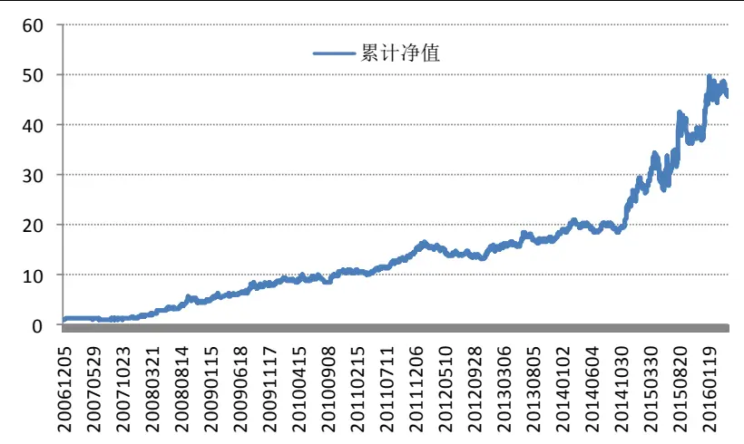
数据来源：国泰君安证券研究

分年度来看，策略在 2007 年和 2012 年表现较差，收益仅为个位数（5.5%、1.9%）。具体来说，2007年上半年市场整体成交额相对于2006年上升了1倍。由于个人投资者增量资金进场，导致知情交易者交易占比被动降低，也就是说，知情交易者的意图与其买入占比呈反向关系，这就对模型信号产生了一定干扰。此外，上证综指在 2012 年处于窄幅震荡阶段，没有明显地趋势行情，因此知情交易者在活跃阶段后期卖出时对市场的冲击成本较高，因此策略收益较低。总体来说，基于知情交易者行为模式的择时策略在存量资金市场的胜率更高，在趋势性强的市场中收益更显著。

表 5 基于知情交易者行为的择时策略年度收益

| 年份 | 年度收益 夏普比率 |
| --- | --- |
| 2007 5.5% | 0.15487 |
| 2008 | 268.8% 6.00266 |
| 2009 | 80.6% 2.70087 |
| 2010 | 22.9% 1.01215 |
| 2011 | 41.9% 2.27972 |
| 2012 | 1.9% 0.10795 |
| 2013 | 16.0% 0.86149 |
| 2014 | 42.5% 2.43393 |
| 2015 | 48.5% 1.25503 |
| 2016 | 23.2% 0.63335 |

数据来源：国泰君安证券研究

考虑到目前市场没有有效做空的投资品种，图 12 展示了策略只做多不做空的净值曲线。可以看出，策略累计收益可达 1140%左右。整体来看，策略净值曲线整体较为平稳，但在 2015年 7月有较大的波动。

图 12 基于知情交易者行为的择时策略净值
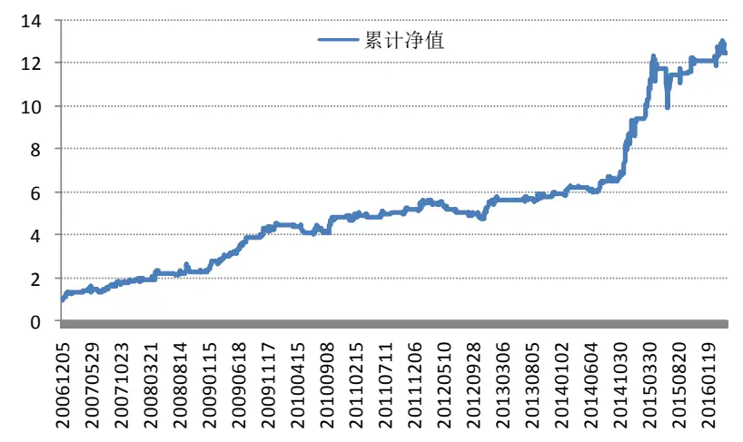
数据来源：国泰君安证券研究

## 4. 总结与后续展望

市场微观结构的研究在证券投资中占有重要地位。首先，对价格发现过程更加透彻的理解能够在投资中占有更多的主动权。此外，各类投资者交易轮动是价格发现过程中的重要组成部分，据此构建的策略有效时间较长。从交易角度来说，基于知情交易者行为的投资策略逻辑清晰，简单易行。但是，模型更适用于存量资金市场，如果市场成交额发生较大的变化，对模型会产生一定的影响。

本文从市场微观结构的角度出发，主要贡献分为三个方面。首先，本文用数量化方法刻画出不同投资者的行为阶段。随后，我们深度探究了市场不同类型市场参与者的行为模式与市场走势的关系。在此基础上，我们基于知情交易者的行为模型构建了择时策略，回测收益显著。

未来我们将在现有研究成果的基础上，深入探究不同类型投资者行为模式之间的联系，更好的从微观结构的角度刻画市场走势。此外，我们也会继续探索如何将投资者行为模式应用于选股和行业选择中。

## 本公司具有中国证监会核准的证券投资咨询业务资格

## 分析师声明

作者具有中国证券业协会授予的证券投资咨询执业资格或相当的专业胜任能力，保证报告所采用的数据均来自合规渠道，分析逻辑基于作者的职业理解，本报告清晰准确地反映了作者的研究观点，力求独立、客观和公正，结论不受任何第三方的授意或影响，特此声明。

## 免责声明

本报告仅供国泰君安证券股份有限公司（以下简称“本公司”）的客户使用。本公司不会因接收人收到本报告而视其为本公司的当然客户。本报告仅在相关法律许可的情况下发放，并仅为提供信息而发放，概不构成任何广告。

本报告的信息来源于已公开的资料，本公司对该等信息的准确性、完整性或可靠性不作任何保证。本报告所载的资料、意见及推测仅反映本公司于发布本报告当日的判断，本报告所指的证券或投资标的的价格、价值及投资收入可升可跌。过往表现不应作为日后的表现依据。在不同时期，本公司可发出与本报告所载资料、意见及推测不一致的报告。本公司不保证本报告所含信息保持在最新状态。同时，本公司对本报告所含信息可在不发出通知的情形下做出修改，投资者应当自行关注相应的更新或修改。

本报告中所指的投资及服务可能不适合个别客户，不构成客户私人咨询建议。在任何情况下，本报告中的信息或所表述的意见均不构成对任何人的投资建议。在任何情况下，本公司、本公司员工或者关联机构不承诺投资者一定获利，不与投资者分享投资收益，也不对任何人因使用本报告中的任何内容所引致的任何损失负任何责任。投资者务必注意，其据此做出的任何投资决策与本公司、本公司员工或者关联机构无关。

本公司利用信息隔离墙控制内部一个或多个领域、部门或关联机构之间的信息流动。因此，投资者应注意，在法律许可的情况下，本公司及其所属关联机构可能会持有报告中提到的公司所发行的证券或期权并进行证券或期权交易，也可能为这些公司提供或者争取提供投资银行、财务顾问或者金融产品等相关服务。在法律许可的情况下，本公司的员工可能担任本报告所提到的公司的董事。

市场有风险，投资需谨慎。投资者不应将本报告作为作出投资决策的唯一参考因素，亦不应认为本报告可以取代自己的判断。
在决定投资前，如有需要，投资者务必向专业人士咨询并谨慎决策。

本报告版权仅为本公司所有，未经书面许可，任何机构和个人不得以任何形式翻版、复制、发表或引用。如征得本公司同意进行引用、刊发的，需在允许的范围内使用，并注明出处为“国泰君安证券研究”，且不得对本报告进行任何有悖原意的引用、删节和修改。

若本公司以外的其他机构（以下简称“该机构”）发送本报告，则由该机构独自为此发送行为负责。通过此途径获得本报告的投资者应自行联系该机构以要求获悉更详细信息或进而交易本报告中提及的证券。本报告不构成本公司向该机构之客户提供的投资建议，本公司、本公司员工或者关联机构亦不为该机构之客户因使用本报告或报告所载内容引起的任何损失承担任何责任。

## 评级说明

## 1.投资建议的比较标准

投资评级分为股票评级和行业评级。

以报告发布后的12个月内的市场表现为比较标准，报告发布日后的12个月内的公司股价（或行业指数）的涨跌幅相对同期的沪深300指数涨跌幅为基准。

## 2.投资建议的评级标准

报告发布日后的 12 个月内的公司股价（或行业指数）的涨跌幅相对同期的沪深300指数的涨跌幅。

|  | 评级 说明 |  |
| --- | --- | --- |
| 股票投资评级 | 增持 | 相对沪深 300指数涨幅15%以上 |
|  | 谨慎增持 | 相对沪深300指数涨幅介于5%～15%之间 |
|  | 中性 | 相对沪深 300指数涨幅介于-5%～5% |
|  | 减持 | 相对沪深300指数下跌5%以上 |
| 行业投资评级 | 增持 | 明显强于沪深 300 指数 |
|  | 中性 | 基本与沪深300指数持平 |
|  | 减持 | 明显弱于沪深 300指数 |

## 国泰君安证券研究

|  | 上海 | 深圳 | 北京 |
| --- | --- | --- | --- |
| 地址 | 上海市浦东新区银城中路168号上海 银行大厦29层 | 深圳市福田区益田路 6009 号新世界 商务中心34层 | 北京市西城区金融大街28 号盈泰中 心2号楼10层 |
| 邮编 | 200120 | 518026 | 100140 |
| 电话 | (021)38676666 | (0755)23976888 | (010)59312799 |
| E-mail: gtjaresearch@gtjas.com |  |  |  |