# 融资融券标的调整事件研究

## ——数量化专题之七十二

玉刘富兵（分析师）

8 021-38676673

liufubing008481@gtjas.com

证书编号 S0880511010017

## 本报告导读：

股票被纳入融资融券标的后，未来 10个交易日有近 5%的超额收益，之后的 20个交易日有-2%的超额收益，小市值及高估值效果尤为明显。

## 摘要：

[Table_Summary] • 本报告从事件的视角研究融资融券交易对股票收益率的影响。从理论上来说，融资交易产生正向影响的同时，融券交易产生负向影响。

- 我们研究发现，个股推出融资融券交易后的前 10 个交易日内，融资比率稳步上升，融资交易的影响占据主要地位。此时做多标的股票，10个交易日能够获得平均4.62%的超额收益率，胜率为66%。

小市值及高估值的融资效应更为显著：10个交易日内若仅做多小市值股票，即可获得 7.04%的超额收益率，胜率提高至72%；若仅做多高市净率股票，可获得 6.15%的超额收益率，胜率提升至 71%；若仅做多高市盈率的股票，可获得 6.12%的超额收益率，胜率提升至 70%。

- 在个股推出融资融券交易 的[11, 30]交易日内，融资比率稳步下降，此时融券交易的影响占据主要地位。若做空标的股票，20个交易日能够获得 2%的超额收益率，胜率为 65%。

小市值、高估值的融券效应同样显著：在[11, 30]交易日内，若仅做空小市值股票，即可获得 3.02%的超额收益，胜率提升至 70%；若仅做空高市净率股票，可获得 3.31%的超额收益，胜率提升至67%；若做空高市盈率的股票，可获得 3.73%的超额收益，胜率提升至 72%。

- 另外，我们可以综合市值、市净率、市盈率三个指标，对融资融券效应作进一步提升。

我们利用观察到的上述性质构建了事件策略：融资效应事件驱动策略单次的平均收益 5%左右，胜率70%以上，最大回撤6%左右；融券效应事件驱动策略单次平均收益 3%左右，胜率40%左右，最大回撤 3%左右。从收益及稳定性来看，融资效应驱动策略效果更好些。

- 未来我们会利用融资余额比等融资融券指标来研究整个市场的融资融券效应，敬请关注后续研究报告。

刘富兵：（分析师）

电话：021-38676673

邮箱：liufubing008481@gtjas.com

证书编号：S0880511010017

刘正捷：（分析师）

电话：0755-23976803

邮箱：liuzhengjie012509@gtjas.com

证书编号：S0880514070010

## 陈奥林：（研究助理）

电话：021-38674835

邮箱：chenaolin@gtjas.com

证书编号：S0880114110077

## 王浩：（研究助理）

电话：021-38676434

邮箱：wanghao014399@gtjas.com

证书编号：S0880114080041

## 李辰：（研究助理）

电话：021-38677309

邮箱：lichen@gtjas.com

证书编号：S0880114060025

## 孟繁雪：（研究助理）

电话：021-38675860

邮箱：mengfanxue@gtjas.com

证书编号：S088011604008

## [Table_R相关报告

《2016年6月沪深300指数成份股调整预测》2016.05.13

《基于微观市场结构的择时策略》2016.05.12《基于 MACD 的价格分段研究 2.0》2016.05.03

《产业并购基金，下一个事件金矿》2016.04.11

《基于股东集体增减持行为的市场拐点探究》2016.03.18

## 1. 融资融券交易对股票收益率的影响

## 1.1.融资融券交易

融资融券交易，不仅为我国股市引入杠杆交易；更重要的是，结束了我国个股不可被做空的历史，使得对某股票持负面看法的投资者，能够在一定程度上表达其观点。与普通交易者不同的是，融资融券交易者为杠杆交易者，他们不仅需要承担一定的融资利率或融券费率，而且还要承受追加保证金的潜在压力。在如此多的交易约束下仍然实现的融资融券交易，理应引起我们的重视。

经典理论认为，融券交易相当于增加了股票的供给渠道，使得供给曲线向右平移，从而能够降低股票价格。基于这一理论，我们有理由认为当实施融券交易后，股票应该出现下跌趋势。然而，我国在推出融券交易的同时，也推出了融资交易，融资交易应该也会使得股票的需求曲线向右平移，从而推高股票价格。因此，推出融资融券交易后股票究竟上涨还是下跌，应该取决于融资融券交易的相对力度：如果融资交易逐步走强，则意味着股票可能会以上涨为主；如果融券交易逐步走强，则意味着股票可能会以下跌为主。

本文重点研究股票纳入融资融券标的后带来的融资及融券效应，以及由此带来的事件投资机会。

## 1.2.融资融券交易对股票收益的影响

我们首先介绍一个度量融资融券相对力度的指标-融资余额比：

## SMTR=融资余额/（融资余额+融券余额）

这一指标度量了在整个融资融券余额中，融资余额所占的比例。一般来说，SMTR 变大，说明具有信息优势的投资者偏乐观；相反，SMTR 变小，说明具有信息优势的投资者偏谨慎。

图1给出了 SMRT 与股票超额收益率（相对于沪深300 的超额收益率）的走势图，起点为可融资融券当天。由图1 可以看出：在融资融券的前10 个交易日里，融资力量在稳步攀升，然后在高位徘徊；然而之后的20个交易日，融资力量在稳步下降。纳入融资融券标的的股票的平均累积超额收益也呈现出类似的特征：前 10个交易日里稳步上升；后20个交易日里稳步下降。

表 1 给出了 SMTR 与累积超额收益率的相关关系：在融资比率 SMTR上升的前10个交易日里，即 [0, 10]个交易日内，二者的相关系数为0.77；在融资比率SMTR下降的后 20个交易日里，即 [11, 30]个交易日内，二者的相关系数为0.90。

图 1SMTR与融资融券股票累计超额收益率
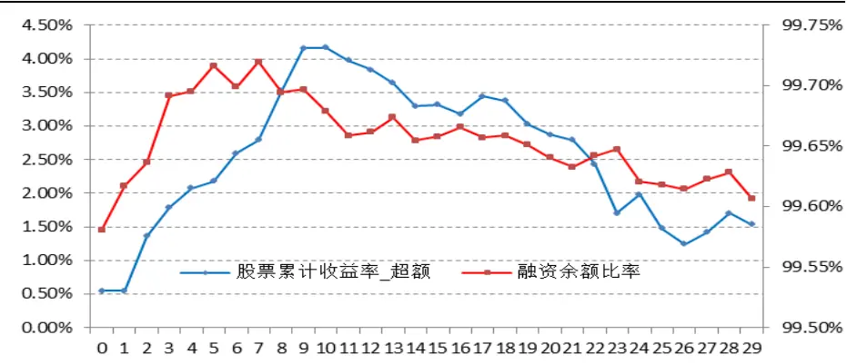
数据来源：国泰君安证券研究

表 1:平均累计超额收益率与融资余额比率 SMTR的相关系数

| 时间区间 | 相关系数 |
| --- | --- |
| [0,10] | 0.77 |
| [11,30] | 0.90 |

数据来源：国泰君安证券研究

综上可以认为，在融资融券推出后的前 10 个交易日里，融资买入力量稳步增长，此时融资融券股票以上涨为主；而在以后 20 个交易日里，融资买入力量逐步下，此时融资融券股票以下跌为主。

下面我们将主要基于上述观察分析融资融券标的调整带来的融资融券效应，并由此构建事件驱动策略。

## 2. 融资融券效应分析

由上一章我们发现，在股票纳入融资融券标的的[0, 10]个交易日内，融资比率呈上升趋势，此时呈现显著的融资效应；而在[11, 30]个交易日内，融资比率呈下降趋势，此时呈现显著的融券效应。下面我们将作进一步的深入分析。

## 2.1.整体市场的融资融券效应

## 2.1.1. [0, 10]个交易日内的融资效应

图表 2 给出了融资融券推出后的 10 个交易日内所有融资融券标的股票超额收益分布及统计情况。由图表2可知，在股票纳入融资融券标的后的[0,10]个交易日内融资效应明显，66%的融资融券标的跑出了正超额收益，且平均能够获得 4.62%的超额收益。

图 2融资效应超额收益直方图
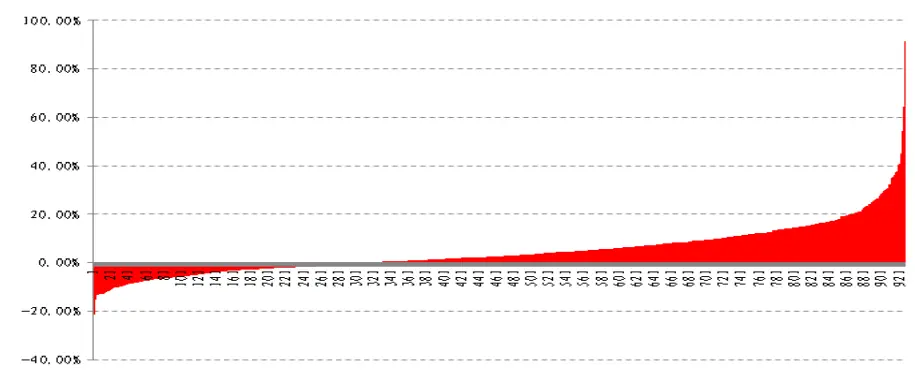
数据来源：国泰君安证券研究

表 2:融资效应超额收益统计表

| 类别 | 数值 |
| --- | --- |
| 超额收益大于0的股票 | 609 |
| 股票总数 | 927 |
| 胜率 | 66% |
| 平均超额收益率 | 4.62% |

数据来源：国泰君安证券研究

## 2.1.2. [11, 30]个交易日内的融券效应

图表3给出了在融资融券推出后[11, 30]个交易日内所有融资融券标的股票的超额收益分布及统计情况。可以看出，在股票纳入融资融券标的后的[11，30]个交易日内融券效应虽没有之前的融资效应明显，但仍 65%的标的跑出了负超额收益，且平均能够获得-2.21%的超额收益。

图 3 融券效应超额收益直方分布图
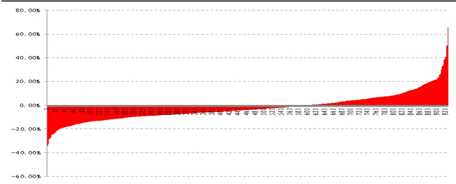
数据来源：国泰君安证券研究

表 3: 融券效应超额收益统计表

| 名称 | 数值 |
| --- | --- |
| 小于0股票个数 | 600 |
| 股票总数 | 927 |
| 胜率 | 65% |
| 平均收益率 | -2.21% |

数据来源：国泰君安证券研究

## 2.2.考虑基本面后的融资融券效应

众所周知，基本面指标对股票收益率有影响，典型的比如市值规模、账面市值比以及股价-盈利比等。相应地，我们认为基本面指标也会影响融资融券效应，主要有以下几个原因：

第一，融资融券效应，本质上与股票是否高估相关联；在我国市场上，股票是否高估与这些基本面指标密切相关。比如小盘股的估值相对较高，而大盘蓝筹股的估值相对较低；同时大盘股的B/M和 E/P 相对较高。第二，规模大、盈利能力强的股票收益率相对更为稳定，因此更难被融资融券力量影响。

基于上述考虑，我们将原有的融资融券标的作进一步细分：根据融资融券实施日之前 30 个交易日内的基本面指标平均值，即[-30，-1] 内的平均流通市值、平均账面市值比、平均盈利-股价比，将融资融券股票分为3 组，并在此基础上，进一步分析纳入标的的融资融券效应。

## 2.2.1. 考虑市值后的融资融券效应

## 图 4 不同规模下的融资融券效应

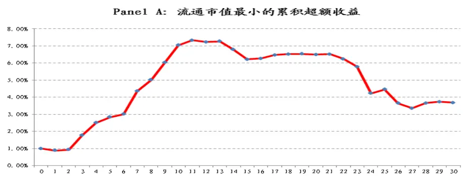

Pane1 A:流通市值最小的累积超额收益
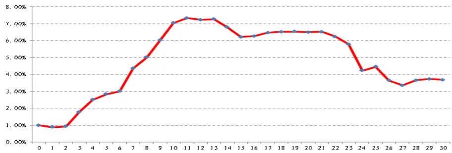

Pane1 C: 流通市值最大的累积超额收益
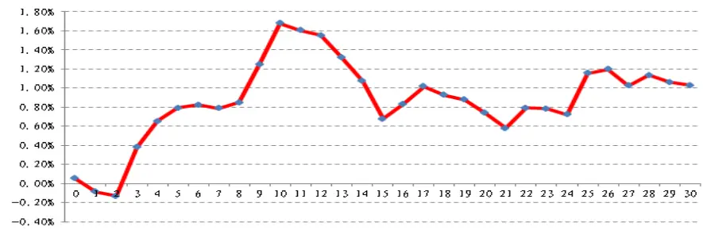
数据来源：国泰君安证券研究

图4中给出了股票纳入融资融券标的后，不同流通市值股票的超额收益走势，可以发现：（1）在[0, 10]内，每个小组的超额收益都呈现上涨趋势，但是上涨幅度却随着市值的增大而减小，流通市值最小组股票上涨超过 7%，中间组股票上涨 5%左右，而最大组股票上涨不足 1.7%。（2）在[11,30]内，各小组股票的走势出现了分化：流通市值最小组股票一路下跌，累计跌幅接近 3.4%；中间组股票也呈现稳步下跌态势，累计下跌3%左右；最大组股票无明显趋势（约下跌0.6%左右），呈现震荡态势。

由图4可以看出，相对于小盘股，大盘股受融资融券交易的影响显著性不高，我们认为主要有两方面原因：（1）由于流通市值较大，杠杆交易者很难撼动其价格，故融资融券交易对其收益率不应该产生太大影响；（2）大股票的估值相对更为合理，不会存在严重高估，因此很难出现下跌。

## 2.2.1.1. 考虑市值后的融资效应

本小节重点考察不同规模的股票在被纳入融资融券标的后的融资效应。图 5 及表 4 给出了在融资融券推出的前 10 个交易日内，不同规模的融资融券标的的超额收益分布及统计情况。

从统计结果来看，流通市值最小组72%的股票跑出了正超额收益，平均超额收益为 7.04%，这一结果显著好于整个标的组的表现；中间组 71%的股票跑出了正超额收益，平均超额收益为5.02%；最大组只有 53%的股票跑出了正超额收益，且平均超额收益仅为1.68%。

这一结果再次表明，中小市值股票的融资效应较为明显，而大股票的融资效应不明显。

表 4: 不同规模下融资效应统计表

| 名称 | 名称 | 数值 |
| --- | --- | --- |
| 流通市值最小组 | 大于0股票个数 | 200 |
|  | 股票总数 | 278 |
|  | 胜率 | 72% |
|  | 平均收益率 | 7.04% |
|  | 大于0股票个数 | 261 |
| 流通市值中间组 | 股票总数 | 370 |
|  | 胜率 | 71% |
|  | 平均收益率 | 5.02% |
| 流通市值最大组 | 大于0股票个数 | 148 |
|  | 股票总数 | 279 |
|  | 胜率 | 53% |
|  | 平均收益率 | 1.68% |

数据来源：国泰君安证券研究

图 5不同规模下的融资效应超额收益分布图
Pane1 A: 流通市值最小组的超额收益
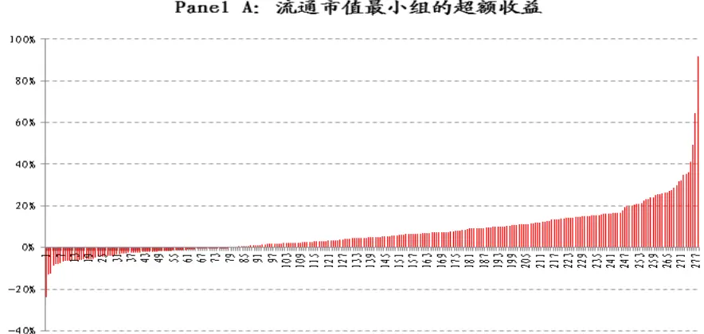

Pane1 B:流通市值中间组的超额收益
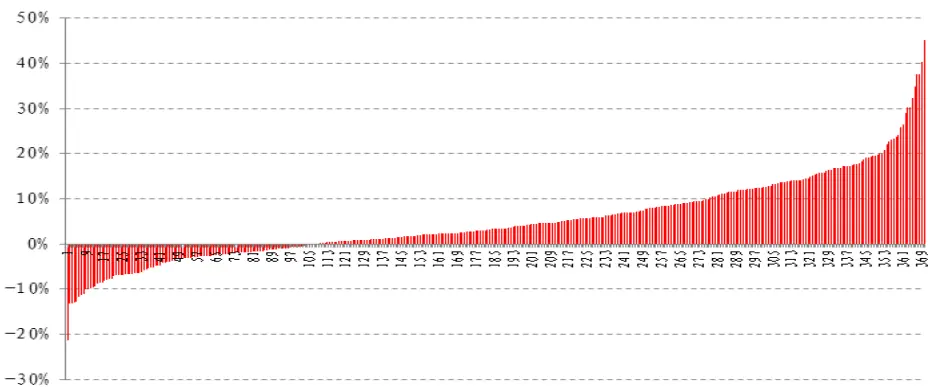

Pane1 C:流通市值最大的超额收益
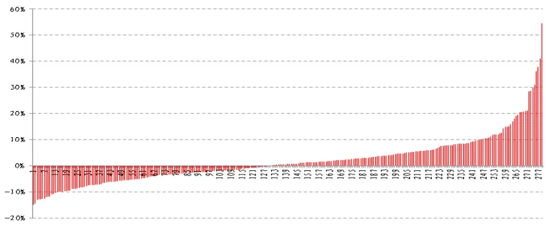
数据来源：国泰君安证券研究

## 2.2.1.2. 考虑市值后的融券效应

本小节重点考察不同规模的股票在被纳入融资融券标的后的融券效应。图6及表5给出了融资融券推后的[11, 30]个交易日内不同规模的融资融券标的的超额收益分布及统计情况。

从统计结果来看，流通市值最小组70%的股票跑出了负超额收益，平均为-3.02%，这一结果比整个标的组要显著；中间组67%的股票跑出了负超额收益，平均为-2.82%；最大组仅56%的股票出现了负超额收益，平均超额收益仅为-0.60%。

上述结果同样表明中小市值股票的融券效应较为明显，而大股票的融券效应不明显。

图 6不同规模下的融券效应超额收益直方图
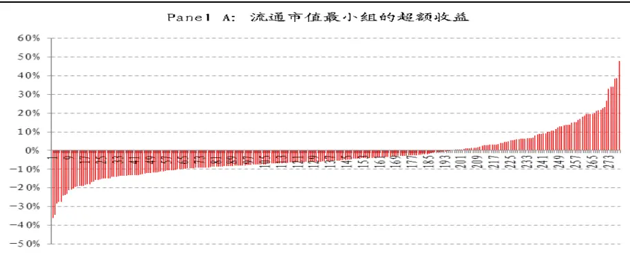

Pane1 B:流通市值中间组的超额收益
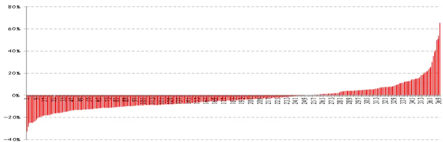

Pane1 C:流通市值最大组的超额收益
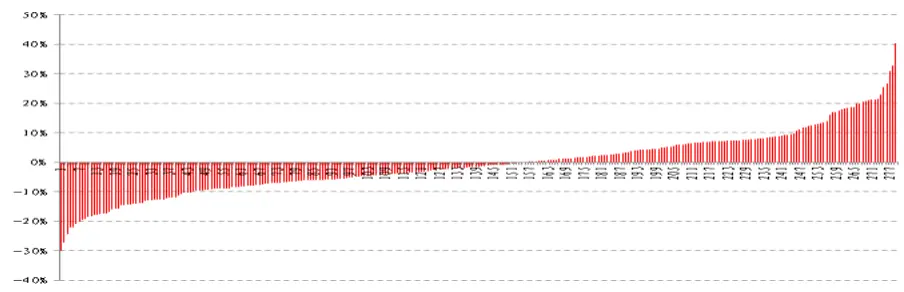
数据来源：国泰君安证券研究

表 5: 不同规模下融券效应统计表

| 名称 | 名称 | 数值 |
| --- | --- | --- |
| size最小组 | 小于0股票个数 | 195 |
|  | 股票总数 | 278 |
|  | 胜率 | 70% |
|  | 平均收益率 | -3.02% |
| size中间组 | 小于0股票个数 | 231 |
|  | 股票总数 | 370 |
|  | 胜率 | 67% |
|  | 平均收益率 | -2.82% |
| size 最大组 | 小于0股票个数 | 144 |
|  | 股票总数 | 279 |
|  | 胜率 | 56% |
|  | 平均收益率 | -0.60% |

数据来源：国泰君安证券研究

## 2.2.2. 考虑B/M后的融资融券效应

图7给出了不同B/M下融资融券标的的超额收益。由图7 可以发现：（1）在[0, 10]个内，每个小组的超额收益都呈现上涨趋势，但是上涨幅度却随着B/M的增大而减小，B/M最小组股票上涨超过6%，中间组股票上涨接近 5%，而最大组股票上涨不足 3.5%。（2）在[11,30]个交易日内，各小组股票的走势出现了分化。B/M最小组股票一路下跌，累计跌幅接近3%；B/M中间组股票也呈现稳步下跌态势，累计下跌超过 3.5%；B/M最大组股票无明显趋势，呈现震荡态势。

上述结果表明高市净率股票的融资融券效应更为明显。

图 7不同 B/M下的融资融券效应
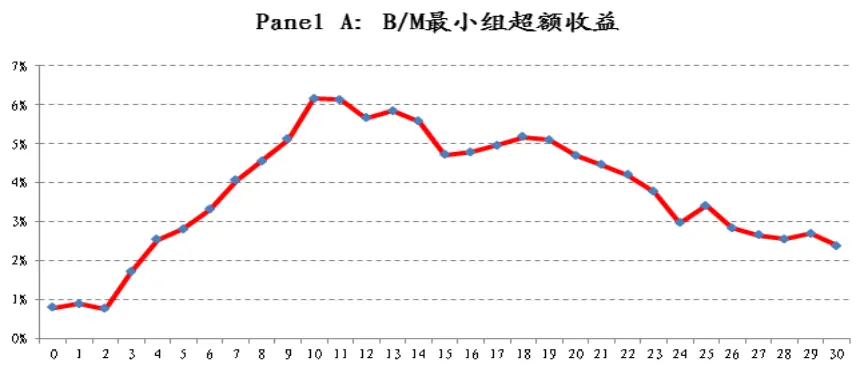

Pane1 B: B/M中间组超额收益
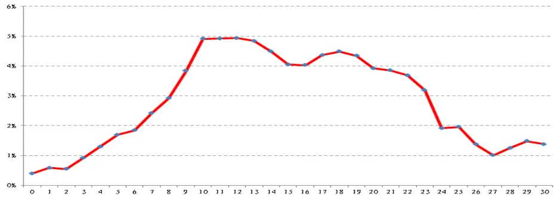

Pane1 C: B/M最大组超额收益
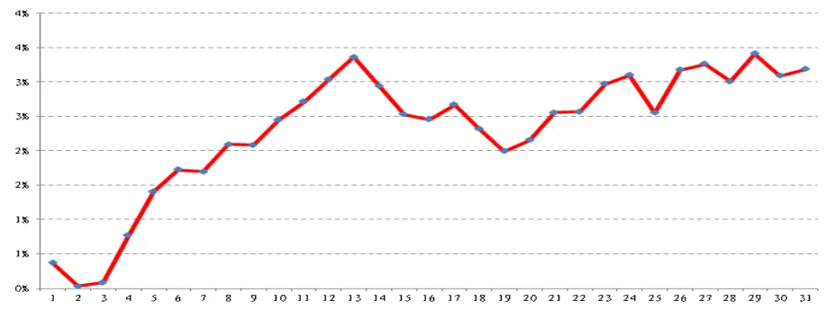
数据来源：国泰君安证券研究

## 2.2.2.1. 考虑 B/M 后的融资效应

本小节重点考察不同市净率股票在被纳入融资融券标的后的融资效应。图 8 及表 6 给出了融资融券推出的前 10 个交易日内不同市净率股票的超额收益分布及统计情况。

从统计结果来看，B/M 最小组 71%的股票跑出了正超额收益，平均为6.15%，这一结果显著好于整体标的组；B/M 中间组 67%的股票跑出了正超额收益，平均为 4.91%； B/M 最大组仅 58%的股票跑出了正超额收益，平均仅为2.71%.

这一结果再次表明，市净率高的股票的融资效应更为明显。

图 8不同市净率下的融资效应超额收益直方图
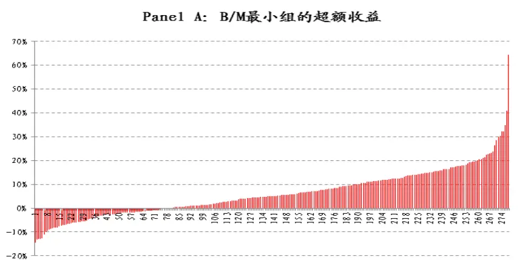

Pane1 B:B/M中间组的超额收益
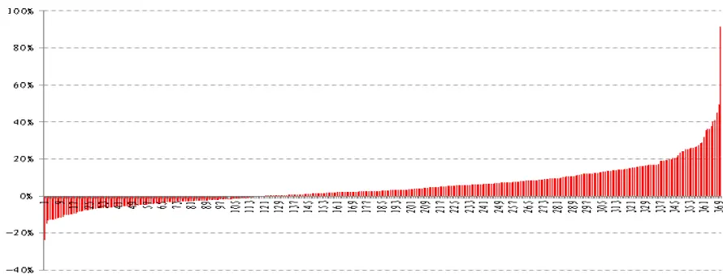

Pane1 C:B/M最大组的超额收益
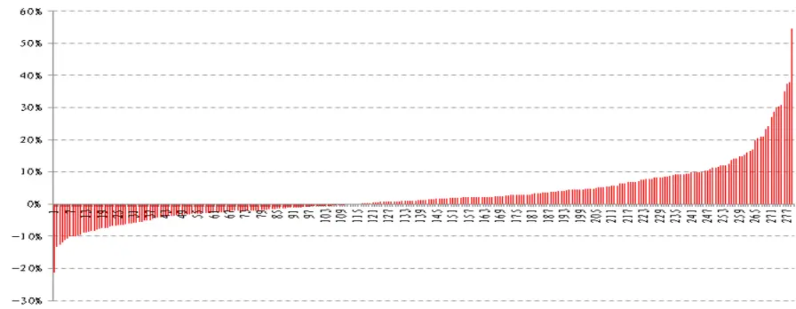
数据来源：国泰君安证券研究

表 6: 不同市净率下的融资效应统计表

| 名称 | 名称 | 数值 |
| --- | --- | --- |
| B/M 最小组 | 大于0股票个数 | 197 |
|  | 股票总数 | 278 |
|  | 胜率 | 71% |
|  | 平均收益率 | 6.15% |
| B/M 中间组 | 大于0股票个数 | 249 |
|  | 股票总数 | 370 |
|  | 胜率 | 67% |
|  | 平均收益率 | 4.91 |
| B/M 最大组 | 大于0股票个数 | 163 |
|  | 股票总数 | 279 |
|  | 胜率 | 58% |
|  | 平均收益率 | 2.71% |

数据来源：国泰君安证券研究

## 2.2.2.2. 考虑 B/M 后的融券效应

本小节重点考察不同市净率股票在被纳入融资融券标的后的融券效应图9及表7给出了融资融券推后的[11, 30]个交易日内不同市净率下融资融券标的的超额收益分布及统计情况。

从统计结果来看，B/M 最小组 67%的股票跑出了负超额收益，平均为-3.31%，这一结果比整个标的组要显著；B/M中间组 67%的股票跑出了负超额收益，平均为-3.27%；B/M最大组，虽然 60%的股票出现了负超额收益，但平均超额收益却为+0.30%。

上述结果再次表明高市净率股票的融券效应较为明显，而低市净率股票的融券效应不明显。

表 7: 不同市净率下的融券效应统计表

| 名称 | 名称 | 数值 |
| --- | --- | --- |
| B/M 最小组 | 小于0股票个数 | 187 |
|  | 股票总数 | 278 |
|  | 胜率 | 67% |
|  | 平均收益率 | -3.31% |
| B/M 中间组 | 小于0股票个数 | 245 |
|  | 股票总数 | 370 |
|  | 胜率 | 66% |
|  | 平均收益率 | -3.27% |
| B/M 最大组 | 小于0股票个数 | 168 |
|  | 股票总数 | 279 |
|  | 胜率 | 60% |
|  | 平均收益率 | 0.30% |

数据来源：国泰君安证券研究

图 9不同市净率下的融券效应超额收益直方图
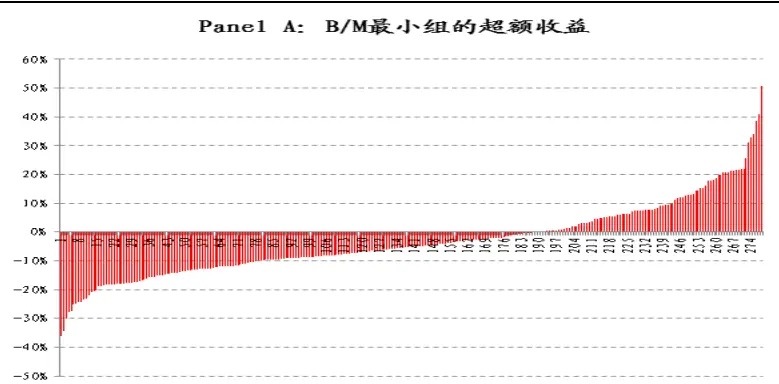

Pane1 B: B/M中间组的超额收益
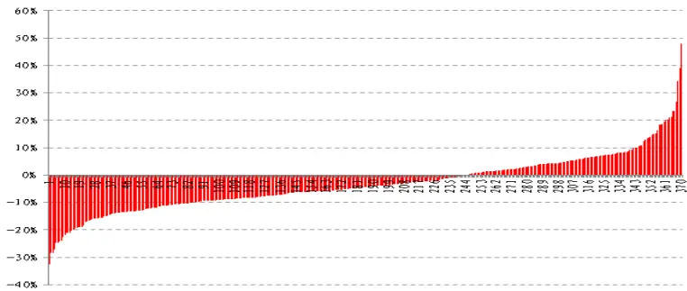

Pane1 C: B/M最大组的超额收益
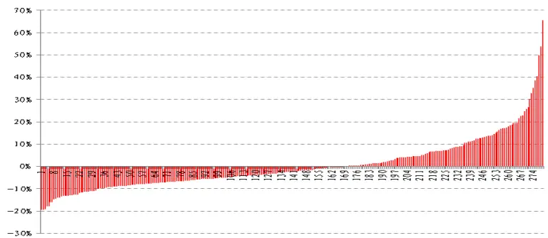
数据来源：国泰君安证券研究

## 2.2.3. 考虑 E/P后的融资融券效应

图10给出了不同市盈率下融资融券标的的超额收益。由图10可以发现：（1）在[0, 10]内，每个小组的超额收益都呈现上涨趋势，但是上涨幅度却随着E/P 的增大而减小，E/P 最小组股票上涨超过 6%，中间组股票上涨不足 5.5%，而 E/P 最大组股票上涨更不足 3%。（2）在[11,30]内，各小组股票的走势出现了分化。E/P 最小组股票一路下跌，累计跌幅超过4%；中间组股票整体上也呈下跌趋势，累计跌幅 3%左右；最大组股票则呈震荡态势。

上述结果表明高市盈率股票的融资融券效应更为明显。

图 10不同市盈率下的融资融券效应
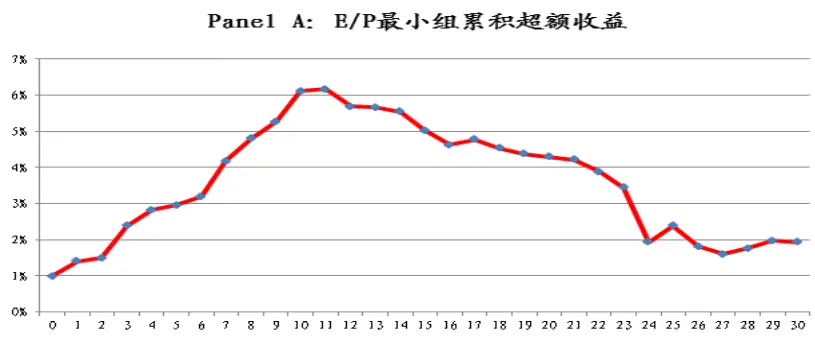

Pane1 B:E/P中间组累积超额收益
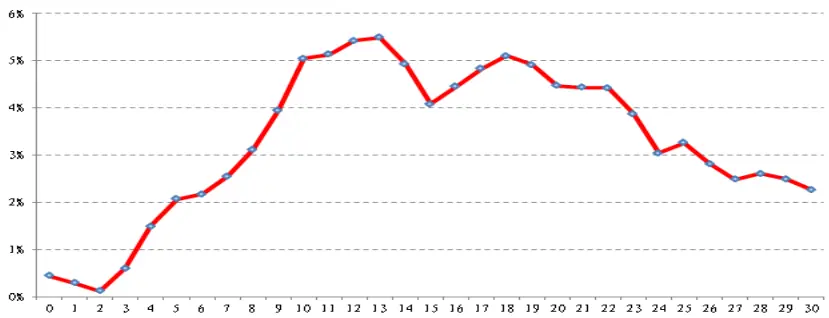

Pane1 C: E/P 最大组累积超额收益
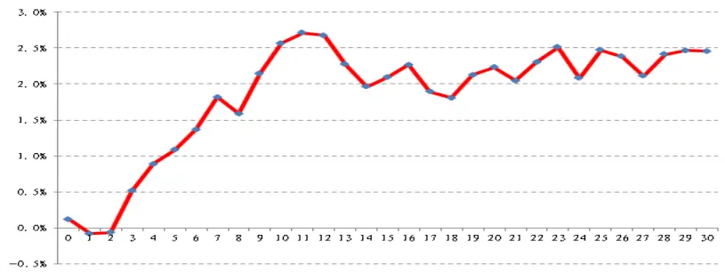
数据来源：国泰君安证券研究

## 2.2.3.1. 考虑 E/P 后的融资效应

本小结重点考察不同市盈率股票在被纳入融资融券标的后的融资效应图11及表 8给出了融资融券推出后的10 个交易日内不同市盈率下股票的超额收益分布及统计情况。

从统计结果来看， E/P 最小组 70%的股票跑出了正超额收益，平均为6.12%，这一结果显著好于整体标的组；中间组 68%的股票跑出了正超额收益，平均为5.05%； 最大组仅 58%的股票跑出了正超额收益，平均仅为 2.57%.

这一结果再次表明，市盈率高的股票的融资效应更为明显。

图 11 不同市盈率下融资效应超额收益直方图
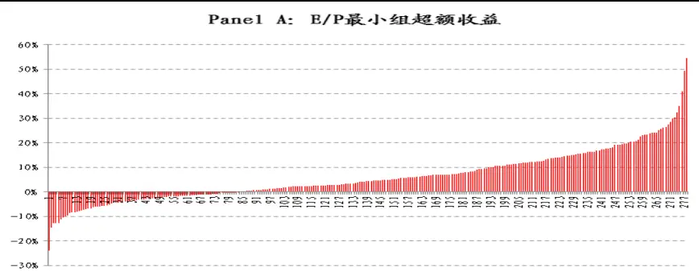

Pane1 B:E/P中间组超额收益
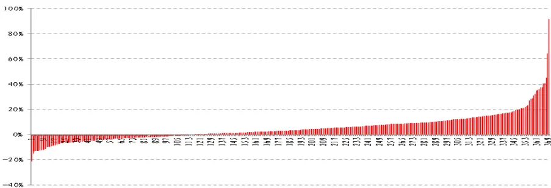

Pane1 C:E/P最小组超额收益
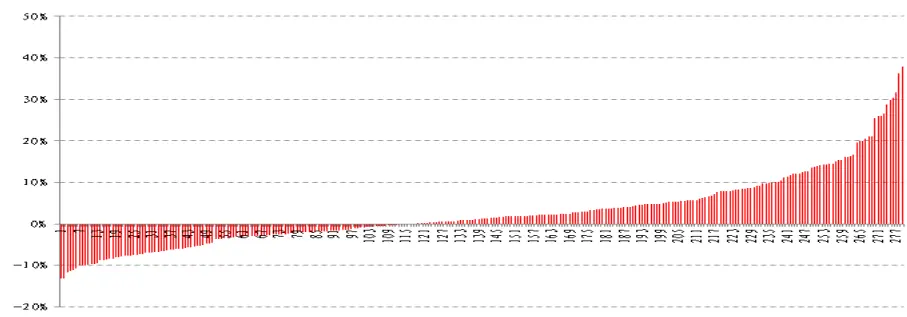
数据来源：国泰君安证券研究

表 8: 不同市盈率下融资效应统计表

| 分组 | 名称 | 数值 |
| --- | --- | --- |
| E/P 最小组 | 大于0股票个数 | 195 |
|  | 股票总数 | 278 |
|  | 胜率 | 70% |
|  | 平均收益率 | 6.12% |
| E/P 中间组 | 大于0股票个数 | 253 |
|  | 股票总数 | 370 |
|  | 胜率 | 68% |
|  | 平均收益率 | 5.05% |
| E/P 最大组 | 大于0股票个数 | 161 |
|  | 股票总数 | 279 |
|  | 胜率 | 58% |
|  | 平均收益率 | 2.57% |

数据来源：国泰君安证券研究

## 2.2.3.2. 考虑 E/P 后的融券效应

本小结重点考察不同市盈率股票在被纳入融资融券标的后的融券效应。图12及表9给出了融资融券推出后的[11,30]个交易日内不同市盈率下股票的超额收益分布及统计情况。

从统计结果来看，E/P 最小组 72%的股票跑出了负超额收益，平均为-3.73%，这一结果比整体标的组要显著；中间组65%的股票跑出了负超额收益，平均为-2.59%； 最大组仅 57%的股票跑出了负超额收益，平均仅为-0.2%。

这一结果再次表明，市盈率高的股票的融券效应更为明显。

图 12不同市盈率下融券效应超额收益直方图
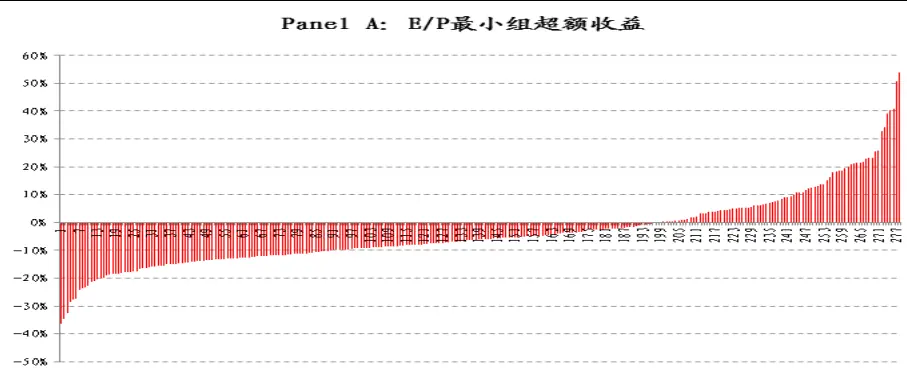

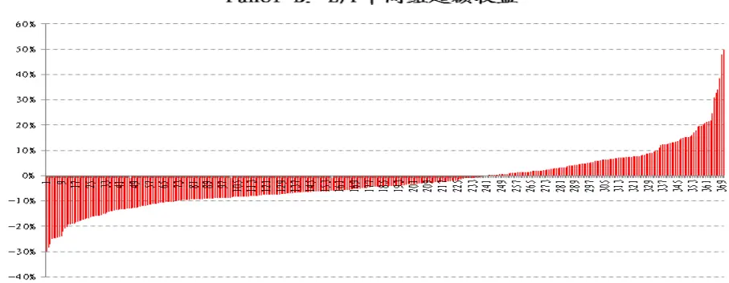

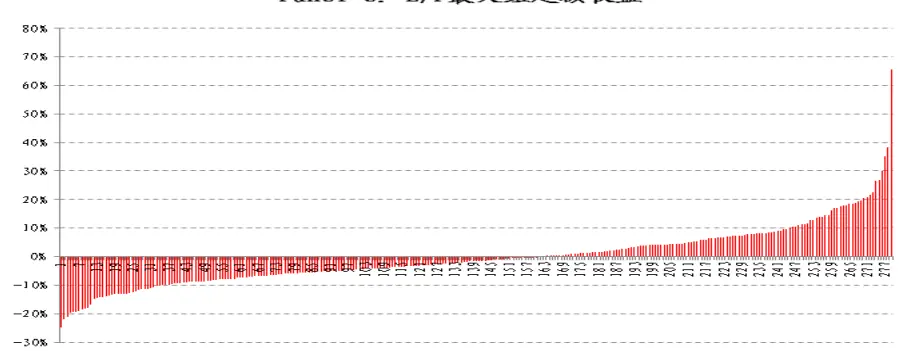
数据来源：国泰君安证券研究

表 9: 不同市盈率下融券效应统计表

| 分组 | 名称 | 数值 |
| --- | --- | --- |
| E/P 最小组 | 大于0股票个数 | 199 |
|  | 股票总数 | 278 |
|  | 胜率 | 72% |
|  | 平均收益率 | -3.73% |
| E/P 中间组 | 大于0股票个数 | 241 |
|  | 股票总数 | 370 |
|  | 胜率 | 65% |
|  | 平均收益率 | -2.59% |
| E/P最大组 | 大于0股票个数 | 160 |
|  | 股票总数 | 279 |
|  | 胜率 | 57% |
|  | 平均收益率 | -0.20% |

数据来源：国泰君安证券研究

## 2.3.融资融券效应总结

首先，整体而言，当股票被纳入融资融券标的后，[0,10]个交易日内个股的融资效应明显，此时建议以多个股为主；[11,30]个交易日内个股的融券效应明显，此时建议以空个股为主。

其次，我们将融资融券标的按照市值、市净率、市盈率分组后发现，小市值、高市盈率、高市净率的融资融券效应尤为明显。

最后，我们可以综合市值、市净率、市盈率三个指标，对融资融券效应作进一步提升。融资效应以流通市值为例：在流通市值最小的基础上，纳入 B/M、E/P 因素后，融资效应的超额收益率由 7.04 进一步提高到7.80%；胜率也由 72%提高到 74%。融券效应以 E/P 为例：在 E/P 最小的基础上，纳入流通市值、B/M因素后，融资效应的超额收益率由-3.73%进一部放大到-4.73%，胜率也由 72%提高到74%。

表 10: 融资效应的进一步提升

| 名称 | 名称 | 数值 |
| --- | --- | --- |
| 流通市值在最小组 | 大于0股票个数 | 200 |
|  | 股票总数 | 278 |
|  | 胜率 | 72% |
|  | 平均收益率 | 7.04% |
| 流通市值在最小组 B/M和E/P均不在最大组 | 大于0股票个数 | 131 |
|  | 股票总数 | 177 |
|  | 胜率 | 74% |
|  | 平均收益率 | 7.80% |

数据来源：国泰君安证券研究

表 11: 融券效应的进一步提升

| 分组 | 名称 | 数值 |
| --- | --- | --- |
| E/P 在最小组 | 小于0股票个数 | 199 |
|  | 股票总数 | 278 |
|  | 胜率 | 72% |
|  | 平均收益率 | -3.73% |
| E/P 在最小组 size 和 B/M 均不在最大组 | 小于0股票个数 | 150 |
|  | 股票总数 | 204 |
|  | 胜率 | 74% |
|  | 平均收益率 | -4.71% |

数据来源：国泰君安证券研究

## 3. 融资融券标的调整事件驱动策略

基于上述观察，本节我们构建基于融资融券标的调整的事件驱动策略。不同于前面的分析不考虑时间维度的前后顺序，构建策略要求每一个决策必须只能基于可观测的历史数据。因此，我们的策略顺序为：（1）每当有融资融券名单推出时，将已知的所有融资融券标的股票（包括新加入名单的和已被剔出名单的股票）作为样本集；（2）将事件日定义为 0天，分别计算每只股票在[-30，-1]的平均 size、B/M和E/P；（3）分别按照平均size、平均B/M 和平均E/P 从小到大排列，寻找相应的 30%、70%分位值；（4）确定新加入的股票分别落入哪个区间。每只新加入股票的size、B/M 和 E/P 分组确定后，投资策略与前面完全一致，即在[0, 10]做多 size 小、B/M 小或者 E/P 小的股票，在[11, 30]做空 size 小、B/M 小或者E/P 的股票。

从 2010 年推出融资融券以来，融资融券标的主要经历了 6 次较大的调整，除了 10 年 6 月份那一次微调以外，其它几次调整的标的数量都比较大，可以构建事件策略。

表 12: 融资融券标的调整主要事件表

| 批次 | 宣告日 | 实施日 | 标的总量 | 标的增量 |
| --- | --- | --- | --- | --- |
| 1 | 2010/2/12 | 2010/3/31 | 90 | 90 |
| 2 | 2010/6/20 | 2010/7/1 | 90 | 5 |
| 3 | 2011/11/25 | 2011/12/5 | 278 | 192 |
| 4 | 2013/1/25 | 2013/1/31 | 500 | 276 |
| 5 | 2013/9/6 | 2013/9/16 | 700 | 206 |
| 6 | 2014/9/12 | 2014/9/22 | 900 | 215 |

数据来源：国泰君安证券研究

## 3.1.融资效应驱动策略

利用上一章的研究及分析，我们构建3类融资效应驱动策略：

策略 1：选择流通市值在最小组、B/M 和 E/P 均不在最大组的融资融券标的在[0,10]个交易日内构建多头组合，并用沪深 300 对冲；

策略2：选择B/M在最小组、流通市值和E/P 均不在最大组的融资融券标的在[0,10]个交易日内构建多头组合，并用沪深 300 对冲；

策略3：选择E/P 在最小组、流通市值和 B/M均不在最大组的融资融券标的在[0,10]个交易日内构建多头组合，并用沪深 300对冲。

策略结果如图13、表13-14 所示：三种策略的胜率均在 70%以上，单次平均收益率5%左右，最大回撤 6%左右，策略效果明显。

表 13: 融资效应驱动策略

| 策略类型 | 统计指标 | 数值（%） |
| --- | --- | --- |
| 表 策略1:size 在最小组 | 累积超额收益 | 24.84 |
| BM 和E/P 均不在最大组 | 胜率 | 75 |
|  | 最大回撤 | 5.65 |
| 报 策略2：B/M在最小组 | 累积超额收益 | 25.15 |
|  | 胜率 | 71 |
| Site 和 E/P 均不在最大组 据 | 最大回撤 | 6.28 |
| J略 3：E/P 在最小组 s源ze 和 B/M 均不在最大组 | 累积超额收益 | 26.41 |
|  | 胜率 | 71 |
|  | 最大回撤 | 6.57 |

国数据来源：国泰君安证券研究

图 13融资效应驱动策略收益图
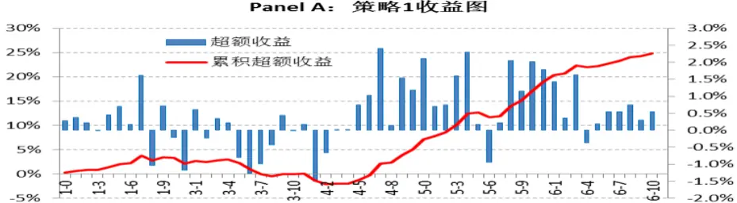

Panel B：策略2收益图
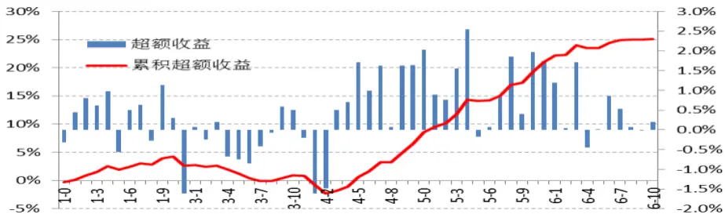

Panel C: 策略3收益图
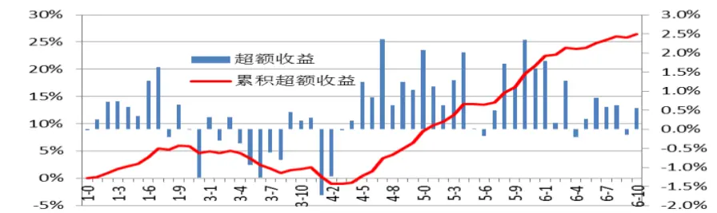
数据来源：国泰君安证券研究

表 14: 融资效应驱动策略单批次收益表

| 策略类型 | 1 | 3 | 4 | 5 | 6 |
| --- | --- | --- | --- | --- | --- |
| 策略1 | 3.26% | -3.32% | 5.06% | 12.13% | 7.70% |
| 策略2 | 4.25% | -3.27% | 5.56% | 12.74% | 5.87% |
| 策略3 | 5.92% | -4.25% | 4.86% | 12.59% | 7.30% |

数据来源：国泰君安证券研究

## 3.2.融券效应驱动策略

类似于上一节，我们可以构建 3类融券效应驱动策略：

策略 1：选择流通市值在最小组、B/M 和 E/P 均不在最大组的融资融券标的在[11,30]个交易日内构建空头组合，并用沪深300对冲；

策略2：选择B/M在最小组、Size和E/P 均不在最大组的融资融券标的在[11,30]个交易日内构建空头组合，并用沪深300对冲；

策略3：E/P在最小组、size和B/M均不在最大组的融资融券标的在[11,30]个交易日内构建空头组合，并用沪深300对冲。

策略结果如图 14、表 15-16 所示：三种策略的单次平均收益率在 3%左右，最大回撤3.5%左右，胜率 40%。整体效果比融资效应驱动策略要略差些。

图 14融券效应驱动策略收益图
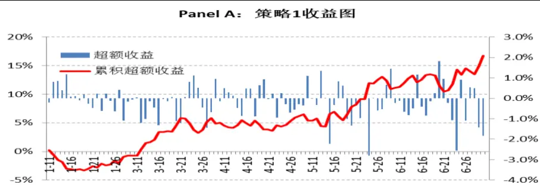

Panel B：策略2收益图
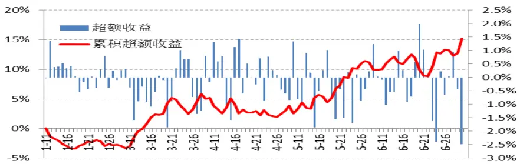

Panel C: 策略3收益图
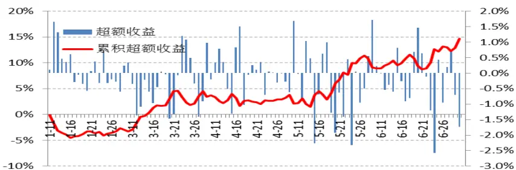
数据来源：国泰君安证券研究

表 15: 融券效应驱动策略

| 策略类型 | 统计指标 | 数值（%） |
| --- | --- | --- |
| 策略 1：size 在最小组 | 累积超额收益 | 16.75 |
|  | 胜率 | 42 |
| B/M 和E/P 均不在最大组 数 | 最大回撤 | -3.30 |
| 據略 2:B/M 在最小组 Site 和 E/P 均不在最大组 | 累积超额收益 | 15.25 |
|  | 胜率 | 48 |
|  | 最大回撤 | -3.41 |
| 源 ：策略 3：E/P在最小组 | 累积超额收益 | 14.66 |
|  | 胜率 | 43 |
| sze 和 B/M 均不在最大组 泰 | 最大回撤 | -4.52 |

数据来源：国泰君安证券研究

表 16: 融券效应驱动策略单批次收益表

| 策略类型 | 1 | 3 | 4 | 5 | 6 |
| --- | --- | --- | --- | --- | --- |
| 策略1 | -0.72% | 5.74% | 0.39% | 5.74% | 5.59% |
| 策略2 | -3.31% | 8.50% | -2.64% | 7.36% | 5.34% |
| 策略3 | -3.29% | 6.97% | -1.54% | 6.73% | 5.79% |

数据来源：国泰君安证券研究

## 4. 总结及展望

本文利用融资融券标的调整事件来研究股票的融资融券效应。我们发现在调入融资融券标的的[0,10]个交易日内，股票存在显著的融资效应，此时股票有明显的正超额收益；在调入融资融券标的[11,30]个交易日内，股票存在较为显著的融券效应，此时股票有较为明显的负超额收益。

此外，我们研究发现，小市值、高估值（高市盈率、高市净率）股票的融资融券效应更为明显。我们认为主要有两方面原因：（1）由于流通市值较大，杠杆交易者很难撼动其价格，故融资融券交易对其收益率不应该产生太大影响；（2）大股票的估值相对更为合理，不会存在严重高估，因此很难出现下跌。

最后我们利用观察到的上述性质构建了事件策略：融资效应事件驱动策略单次的平均收益5%左右，胜率70%以上，最大回撤 6%左右；融券效应事件驱动策略单次平均收益 3%左右，胜率40%左右，最大回撤3%左右。从收益及稳定性来看，融资效应更显著些。

本文主要研究了股票纳入融资融券标的这一事件所导致的融资融券效应，未来我们会利用融资余额比等融资融券指标来研究整个市场的融资融券效应，敬请关注我们的后续研究报告。

## 感谢实习生李锐为本文作出的贡献！

## 本公司具有中国证监会核准的证券投资咨询业务资格

## 分析师声明

作者具有中国证券业协会授予的证券投资咨询执业资格或相当的专业胜任能力，保证报告所采用的数据均来自合规渠道，分析逻辑基于作者的职业理解，本报告清晰准确地反映了作者的研究观点，力求独立、客观和公正，结论不受任何第三方的授意或影响，特此声明。

## 免责声明

本报告仅供国泰君安证券股份有限公司（以下简称“本公司”）的客户使用。本公司不会因接收人收到本报告而视其为本公司的当然客户。本报告仅在相关法律许可的情况下发放，并仅为提供信息而发放，概不构成任何广告。

本报告的信息来源于已公开的资料，本公司对该等信息的准确性、完整性或可靠性不作任何保证。本报告所载的资料、意见及推测仅反映本公司于发布本报告当日的判断，本报告所指的证券或投资标的的价格、价值及投资收入可升可跌。过往表现不应作为日后的表现依据。在不同时期，本公司可发出与本报告所载资料、意见及推测不一致的报告。本公司不保证本报告所含信息保持在最新状态。同时，本公司对本报告所含信息可在不发出通知的情形下做出修改，投资者应当自行关注相应的更新或修改。

本报告中所指的投资及服务可能不适合个别客户，不构成客户私人咨询建议。在任何情况下，本报告中的信息或所表述的意见均不构成对任何人的投资建议。在任何情况下，本公司、本公司员工或者关联机构不承诺投资者一定获利，不与投资者分享投资收益，也不对任何人因使用本报告中的任何内容所引致的任何损失负任何责任。投资者务必注意，其据此做出的任何投资决策与本公司、本公司员工或者关联机构无关。

本公司利用信息隔离墙控制内部一个或多个领域、部门或关联机构之间的信息流动。因此，投资者应注意，在法律许可的情况下，本公司及其所属关联机构可能会持有报告中提到的公司所发行的证券或期权并进行证券或期权交易，也可能为这些公司提供或者争取提供投资银行、财务顾问或者金融产品等相关服务。在法律许可的情况下，本公司的员工可能担任本报告所提到的公司的董事。

市场有风险，投资需谨慎。投资者不应将本报告作为作出投资决策的唯一参考因素，亦不应认为本报告可以取代自己的判断。
在决定投资前，如有需要，投资者务必向专业人士咨询并谨慎决策。

本报告版权仅为本公司所有，未经书面许可，任何机构和个人不得以任何形式翻版、复制、发表或引用。如征得本公司同意进行引用、刊发的，需在允许的范围内使用，并注明出处为“国泰君安证券研究”，且不得对本报告进行任何有悖原意的引用、删节和修改。

若本公司以外的其他机构（以下简称“该机构”）发送本报告，则由该机构独自为此发送行为负责。通过此途径获得本报告的投资者应自行联系该机构以要求获悉更详细信息或进而交易本报告中提及的证券。本报告不构成本公司向该机构之客户提供的投资建议，本公司、本公司员工或者关联机构亦不为该机构之客户因使用本报告或报告所载内容引起的任何损失承担任何责任。

## 评级说明

## 1.投资建议的比较标准

投资评级分为股票评级和行业评级。

以报告发布后的12个月内的市场表现为比较标准，报告发布日后的 12个月内的公司股价（或行业指数）的涨跌幅相对同期的沪深 300 指数涨跌幅为基准。

## 2.投资建议的评级标准

报告发布日后的 12 个月内的公司股价（或行业指数）的涨跌幅相对同期的沪深 300 指数的涨跌幅。

|  | 评级 说明 |  |
| --- | --- | --- |
| 股票投资评级 | 增持 | 相对沪深 300指数涨幅15%以上 |
|  | 谨慎增持 | 相对沪深300指数涨幅介于5%～15%之间 |
|  | 中性 | 相对沪深 300指数涨幅介于-5%～5% |
|  | 减持 | 相对沪深300指数下跌 5%以上 |
| 行业投资评级 | 增持 | 明显强于沪深 300 指数 |
|  | 中性 | 基本与沪深 300指数持平 |
|  | 减持 | 明显弱于沪深300指数 |

## 国泰君安证券研究

|  | 上海 | 深圳 | 北京 |
| --- | --- | --- | --- |
| 地址 | 上海市浦东新区银城中路168号上海 银行大厦29层 | 深圳市福田区益田路 6009 号新世界 商务中心34层 | 北京市西城区金融大街 28 号盈泰中 心2号楼10层 |
| 邮编 | 200120 | 518026 | 100140 |
| 电话 | （021)38676666 | (0755)23976888 | (010)59312799 |
|  | E-mail: gtjaresearch@gtjas.com |  |  |