nInfo] [Table_Title] 2016.05.27

# 事件驱动策略的因子化特征

## ——数量化专题之七十三

刘富兵（分析师）

李辰（研究助理）

8 021-38676673

liufubing008481@gtjas.com

021-38677309

证书编号 S0880511010017

lichen@gtjas.com

S0880114060025

## 本报告导读：

本篇报告旨在对若干类事件进行综合量化分析，使投资者更加深入的理解不同事件的发生对股票价格的影响，并进一步构造基于多事件驱动的组合投资策略。

## 摘要：

[Table_Summary] • 事件驱动研究的本质问题在于事件发生是否会产生超额收益或亏损？若能产生，该收益是否可持续存在？对于该问题的解答不仅有利于我们构建事件驱动选股策略，更重要的是使得投资者了解事件信息对股票价格运行所产生的影响，进而更深入的理解股票价格波动的成因。

- 本篇报告将在原有各类事件研究的基础上，对常见的若干类事件进行综合量化分析研究，使投资者更加直观深入的理解不同事件的发生对股票价格所产生的影响。740

- 我们通过风险模型对个股收益的分解，定义了事件异常收益AR（AbnormalReturn），并根据不同事件对个股异常收益的影响，对事件属性进行了分类。在此基础上，我们构建了基于多事件驱动的组合投资策略。实证结果表明，组合收益稳健有效，在过去 6 年时间内均可稳定战胜中证500 指数。

- 本篇报告的最后一部分，我们将事件驱动策略与多因子策略在组合权重优化的框架下相结合，构建了基于多因子多事件驱动的最优中性投资组合。实证结果同样表明，增加了事件驱动后的多因子组合，收益显著提升。

事件驱动研究的本质仍然是对市场参与者内心预期、相互博弈的投资心理研究。本篇报告通过数据建模等方法，对事件影响进行了一定的统计观察。但模型终究只是研究工具，最终我们希望通过事件研究，使得投资者更深入的理解股票价格运行的成因及规律，进而达到无招胜有招之最高境界。

金融工程

## 金融工程团队：

刘富兵：（分析师）

电话：021-38676673

邮箱：liufubing008481@gtjas.com

证书编号：S0880511010017

刘正捷：（分析师）

电话：0755-23976803

邮箱：liuzhengjie012509@gtjas.com

证书编号：S0880514070010

## 陈奥林：（研究助理）

电话：021-38674835

邮箱：chenaolin@gtjas.com

证书编号：S0880114110077

## 王浩：（研究助理）

电话：021-38676434

邮箱：wanghao014399@gtjas.com

证书编号：S0880114080041

## 李辰：（研究助理）

电话：021-38677309

邮箱：lichen@gtjas.com

证书编号：S0880114060025

## 孟繁雪：（研究助理）

电话：021-38675860

邮箱：mengfanxue@gtjas.com

证书编号：S088011604008

## [Table_R相关报告

《基于微观市场结构的择时策略》2016.05.19

《融资融券标的调整事件研究》2016.05.17《2016年6月沪深300指数成份股调整预测》2016.05.13

《基于微观市场结构的择时策略》2016.05.12《基于 MACD 的价格分段研究 2.0》2016.05.03

## 1. 引言

事件驱动作为股票投资领域的经典策略受到投资者的广泛关注。在我们之前的专题报告中，对各类事件进行了较为系统而深入的研究，所构建的各类事件驱动组合也取得了稳定可观的超额收益。

事件驱动研究的本质问题在于事件发生是否会产生超额收益或亏损？若能产生，该收益是否可持续存在？对于该问题的解答不仅有利于我们构建事件驱动选股策略，更重要的是使得投资者了解事件信息对股票价格运行所产生的影响，进而更深入的理解股票价格波动的成因。

本篇报告将在原有各类事件研究的基础上，对常见的若干类事件进行综合量化分析研究，使投资者更加直观深入的理解不同事件的发生对股票价格所产生的影响。我们将首先定义基于事件驱动的股价异常收益，然后我们对各类事件在公告日前后若干天的异常收益进行统计观察，并根据其表现将事件分为短期阿尔法事件、短期风险事件、持续性阿尔法事件、持续性风险事件以及其他事件共 5 类。在此基础上，我们将构建基于多事件驱动的组合投资策略。实证结果表明，组合收益稳健有效，在过去 6 年时间内均可稳定战胜中证 500 指数。

本篇报告的最后一部分，我们尝试将事件驱动策略与多因子策略在组合权重优化的框架下相结合，构建基于多因子多事件驱动的最优中性投资组合。事件驱动收益原则上也可以理解为阿尔法超额收益，不过由于事件因子是状态因子，不能以传统截面因子的方法处理，因此我们将针对不同事件的异常收益，在组合预期收益率及风险约束条件中进行改进，进而构建最优投资组合。实证结果同样表明，增加了事件驱动后的多因子组合，收益显著提升。

本篇报告的第 2 章，我们将定义基于风险模型的股价异常收益，并对 16种类型的事件异常收益进行统计观察。在第 3 章中，我们将针对事件发生对股价影响的不同时间维度，对各类事件进行属性定义。在第 4 章中，我们将在定义事件状态的基础上，构建基于多事件驱动的组合投资策略。在第 5 章中，我们尝试将事件驱动策略与多因子策略在组合权重优化的框架下相结合，构建基于多因子多事件驱动的最优中性投资组合。第 6 章为研究总结与展望。

## 2. 异常收益

## 2.1. 异常收益定义

事件驱动研究的本质问题在于事件发生是否会产生超额收益或亏损？若能产生，该收益是否可持续存在？

从逻辑上而言，我们通常会研究事件发生前后，股票价格收益的分布情况，进而判断事件对股价的影响。但是，由于股票价格的波动受各种不同的风险因素影响，因此简单的利用收益率或者超额收益很难分辨出事件本身对股票价格所产生的影响。

通常情况下，有两种方法可以证明事件驱动策略可以产生超额收益。第一，直接证明策略收益来源于事件本身。但是，想要证明这点是非常困难甚至是无法做到的，因为对于股票市场而言，证伪一个命题容易，而想要证实一个命题却非常困难。因此，我们往往采用第二种证明方法，间接证明策略收益不来源于现已知的任意其他类型收益，或者说事件发生导致了显著的异常收益（AR： Abnormal Return）。其中，所谓现已知的任意其他类型收益通常包括市场收益、行业收益及风格收益。

事件异常收益：在事件发生前后，股票收益率中，无法用市场、行业、风格所解释的收益部分称为异常收益，具体表达为：

$$
AR_{_{tt}}=R_{_{tt}}-R_{_{bota}}-R_{_{tndustry}}-R_{_{style}}
$$

其中， $R_{_{beta}}$ $R_{_{industry}}$ $R_{_{style}}$ 分别代表市场收益、行业收益及风格收益。

图 1 股票收益率分解
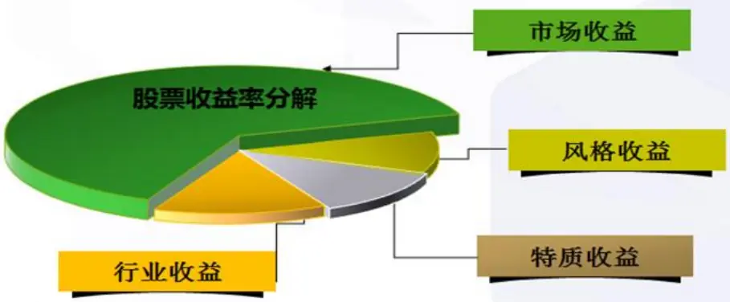
数据来源：国泰君安证券研究

在前系列报告关于风险模型的介绍中，我们通过对行业因子和风险因子的定义与分类，找到了影响 A 股股票价格收益最为显著的 30 类行业收益和 9 类风格收益。其中，行业因子我们利用申万一级行业分类（非银金融行业分为券商、保险和其他），9 类风格因子包括 Beta、Momentum、Size、Earnings Yield、Volatility、Growth、Value、Leverage 和 Liquidity。

换言之，风险模型将股票收益率线性分解成各类行业收益与风格收益之和，而上述因子无法解释的部分则为特质收益（残差），如下所示：

$$
\begin{aligned}r_{_i}=\beta_{_0}x_{_{industry}}+\beta_{_1}x_{_{btea}}+\beta_{_2}x_{_{momentum}}+\beta_{_3}x_{_{size}}+\beta_{_4}x_{_{earnings_{-}yield}}+\\\beta_{_5}x_{_{volatility}}+\beta_{_6}x_{_{growth}}+\beta_{_7}x_{_{value}}+\beta_{_8}x_{_{leverage}}+\beta_{_9}x_{_{liquidity}}+\varepsilon_{_i}\end{aligned}
$$

风险模型对股票收益的分解为事件研究提供了较大的便利，通过统计事件发生前后，股票收益中无法利用已知因子所解释的部分，即特质收益项，就可以观察事件发生所导致的股票价格异常收益AR ，即

$$
\begin{aligned}\boldsymbol{A}\boldsymbol{R}_{i}=&r_{i}-\boldsymbol{\beta}_{0}x_{observe}-\boldsymbol{\beta}_{1}x_{obs}-\boldsymbol{\beta}_{2}x_{measurement}-\boldsymbol{\beta}_{3}x_{obs}-\boldsymbol{\beta}_{4}x_{surising_{-}yield}\\&-\boldsymbol{\beta}_{3}x_{validity}-\boldsymbol{\beta}_{4}x_{growth}-\boldsymbol{\beta}_{7}x_{valus}-\boldsymbol{\beta}_{8}x_{average}-\boldsymbol{\beta}_{9}x_{gradby}\end{aligned}
$$

而异常收益的累计值则称为累计异常收益C A R ，即

$$
CAR_{i}=\sum AR_{i}
$$

也就是说，我们利用风险模型回归方程中的残差项作为事件发生窗口期内的股票异常收益，由于残差部分不包含任意行业与风格收益，因此可以纯粹的反映事件本身对股票价格的影响，这与我们定义异常收益的初衷思路是一致的。

并且，由于 A 股市场的公司事件往往多发生于中小创的股票，而这类股票在规模因子的驱动下，具有显著的风格收益，所以利用风险模型剔除风格收益的影响，完整的剥离出股票价格的异常收益，显得尤为重要。

## 2.2. 事件核心逻辑

在定义了异常收益后，我们就可以对各类事件发生前后，个股异常收益的分布特征进行观察统计。我们首先给出事件驱动异常收益显著性统计的一般流程：

Step1: 定义事件逻辑，统计事件（公告）发生时间点；

Step2: 统计事件发生前后股票收益率，计算对应行业因子及风格因子；

Step3: 根据风险模型回归方程，计算事件发生前后个股异常收益AR ；

Step4: 计算事件发生全部个股异常收益AR 均值；

Step5: 异常收益均值显著性 T 检验；

在定义了检验事件驱动异常收益的一般性流程后，我们对 16 种类型的事件公告前后若干个交易日的累计异常收益进行统计观察，其中包括：定向增发、限售股解禁、业绩预增、业绩预亏、高送转、股东增持、股东减持、员工持股、股权激励、快报同比盈增、快报同比盈亏、投资者调研、关联交易、违规事项、调入融资融券标的、 $沪$ 深 300 指数成分股调整。

其中，业绩预增区分为扭亏、略增、续盈、预增。业绩预亏区分为首亏、略减、续亏、预减。股东减持区分为大宗交易减持、非大宗交易减持。员工持股区分为竞价转让、认购非公开发行。

对于各类事件逻辑及定义事件发生时点，如下表所示：

表 1: 事件类型、核心逻辑及发生时点

| 事件类型 | 事件核心逻辑 | 事件发生时点定义 |
| --- | --- | --- |
| 定向增发 | 上市公司向特定投资者发行新股， 亦称非公开发行。 | 将增发预案公告日作为事件发生日期 |
| 限售股解禁 | 上市公司对特定投资者非公开发行股份， 经过锁定期后可上市流通。 | 将限售解禁日作为事件发生日期 |
| 业绩预增 | 上市公司定期报告公布前， | 将业绩预告公告日作为事件发生日期 |
| (扭亏、略增、续盈、预增) | 提前发布业绩预警盈利。 |  |
| 业绩预亏 (首亏、略减、续亏、预减) | 上市公司定期报告公布前， | 将业绩预告公告日作为事件发生日期 |
|  | 提前发布业绩预警亏损。 |  |
| 高送转 | 上市公司转股或送股比例高于100%。 | 分红实施公告日作为事件的发生日期 |
| 股东增持 | 上市公司股东购买公司股票。 | 股东增持公告日作为事件的发生日期 |
| 股东减持 (大宗减持) | 持股5%以上的股东，减持比例超过1%， | 股东减持公告日作为事件的发生日期 |
| 股东减持 | 需通过大宗交易减持。 |  |
| (非大宗减持) | 股东未通过大宗交易方式减持公司股票。 | 股东减持公告日作为事件的发生日期 |
| 员工持股 | 员工通过购买企业部分股票或股权而拥 |  |
| (竞价转让) | 有企业的部分产权，并获得相应的管理 | 董事会预案公告日作为事件发生日期 |
|  | 权，使员工成为公司股东。 |  |
| 员工持股 | 员工通过购买企业部分股票或股权而拥 |  |
| (认购非公开发行) | 有企业的部分产权，并获得相应的管理 | 董事会预案公告日作为事件发生日期 |
| 股权激励 | 权，使员工成为公司股东。 |  |
|  | 上市公司给予激励对象部分股东权益，使 |  |
|  | 其与企业结成利益共同体，从而实现企业 | 董事会预案公告日作为事件发生日期 |
| 快报同比盈增 | 的长期目标。 |  |
|  | 上市公司在定期报告公告前初步披露未 |  |
|  | 经注册会计师审计的主要会计数据和经 | 业绩快报的预告日作为事件发生日期 |
| 快报同比盈亏 | 营指标，净利润同比增长为快报盈增。 |  |
|  | 上市公司在定期报告公告前初步披露未 |  |
|  | 经注册会计师审计的主要会计数据和经 | 业绩快报的预告日作为事件发生日期 |
| 投资者调研 | 营指标，净利润同比下降为快报盈亏。 |  |
|  | 上市公司采用电话，现场会议等形式回答 |  |
| 关联交易 | 投资者问题的活动。 | 投资者调研日期作为事件发生日期 |
|  | 上市公司关联方以各种方式交易上市公 | 关联交易公告日作为事件发生日期 |
| 违规事项 | 司股票。 |  |
|  | 由证监会或交易所公告上市公司或股东 | 违规公告日作为事件发生日期 |
|  | 存在的违反证监会相关规定的行为。 |  |
| 调入融资融券标的 | 上市公司股票调整为融资融券标的券。 | 标的券调入变动日期作为事件发生日期 |
| 沪深 300 指数成分股调整 | 沪深300指数成分股调整，部分股票调入 指数成分股，部分股票调出指数成分股。 | 指数成分股实际调整日为事件发生日期 |

数据来源：国泰君安证券研究

## 2.3. 事件异常收益统计特征

我们下面将针对上述提到的若干种类事件，统计事件发生前后 20 个交易日，个股异常收益AR 均值及累计异常收益CAR 均值的分布特征情况。同时，我们将计算累计异常收益和异常收益均值 T 检验值，即原假设为事件异常收益AR • 0，具体如下：

## 事件 1：定向增发

图 2 定向增发预案公告日前后 20个交易日累计异常收益
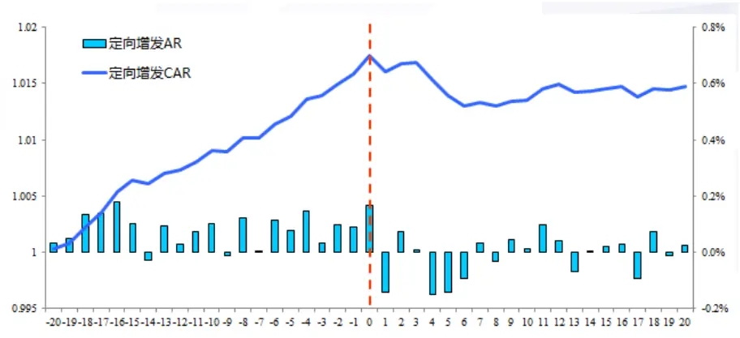
数据来源：国泰君安证券研究

表 2: 定向增发公告前后 20 个交易日累计异常收益及 T 检验值

| 事件类型 | 公告日前20天 累计异常收益 | 公告日前20天 异常收益T 检验值 | 公告日后20 天 累计异常收益 | 公告日后20天 异常收益T检验值 |
| --- | --- | --- | --- | --- |
| 定向增发 | 1.58% | 5.94 | -0.28% | -0.32 |

数据来源：国泰君安证券研究

## 事件 2：限售股解禁

图 3 限售股解禁日前后 20个交易日累计异常收益
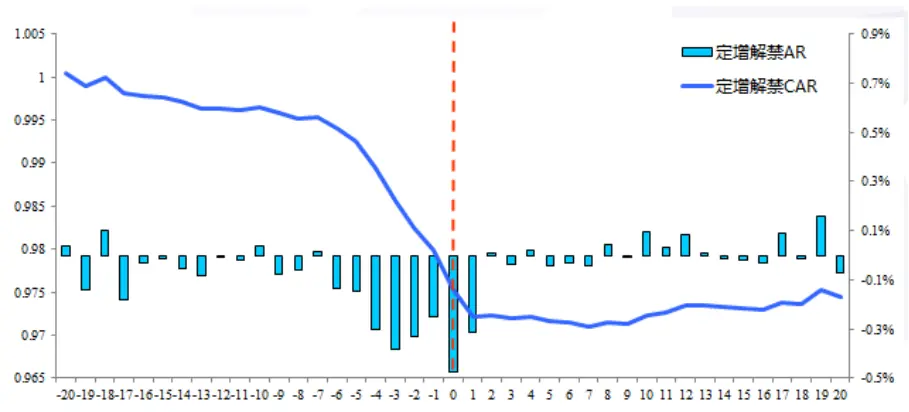
数据来源：国泰君安证券研究

表 3: 限售股解禁日前后 20 个交易日累计异常收益及 T 检验值

| 事件类型 | 公告日前20天 累计异常收益 | 公告日前20天 异常收益T 检验值 | 公告日后20天 累计异常收益 | 公告日后 20 天 异常收益T 检验值 |
| --- | --- | --- | --- | --- |
| 限售股解禁 | -2.01% | -5.26 | -0.08% | -1.51 |

数据来源：国泰君安证券研究

事件 3：业绩预增 （扭亏）
图 4 业绩预增 （扭亏）公告日前后 20 个交易日累计异常收益
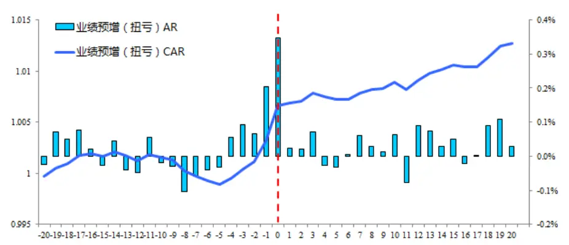
数据来源：国泰君安证券研究

表 4: 业绩预增（扭亏）公告日前后 20 个交易日累计异常收益及 T 检验值

| 事件类型 | 公告日前20天 累计异常收益 | 公告日前20天 | 公告日后 20 天 | 公告日后20天 |
| --- | --- | --- | --- | --- |
| 业绩预增（扭亏） | 0.31% | 异常收益T 检验值 1.13 | 累计异常收益 0.96% | 异常收益T检验值 3.46 |

数据来源：国泰君安证券研究

事件 4：业绩预增 （略增）
图 5 业绩预增 （略增）公告日前后 20个交易日累计异常收益
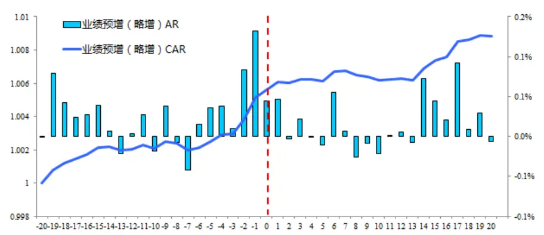
数据来源：国泰君安证券研究

表 5: 业绩预增（略增）公告日前后 20 个交易日累计异常收益及 T 检验值

| 事件类型 | 公告日前20天 累计异常收益 | 公告日前20天 异常收益T 检验值 | 公告日后20天 累计异常收益 | 公告日后 20 天 异常收益T 检验值 |
| --- | --- | --- | --- | --- |
| 业绩预增（略增） | 0.52% | 3.98 | 0.37% | 2.76 |

数据来源：国泰君安证券研究

事件 5：业绩预增 （续盈）
图 6 业绩预增 （续盈）公告日前后 20个交易日累计异常收益
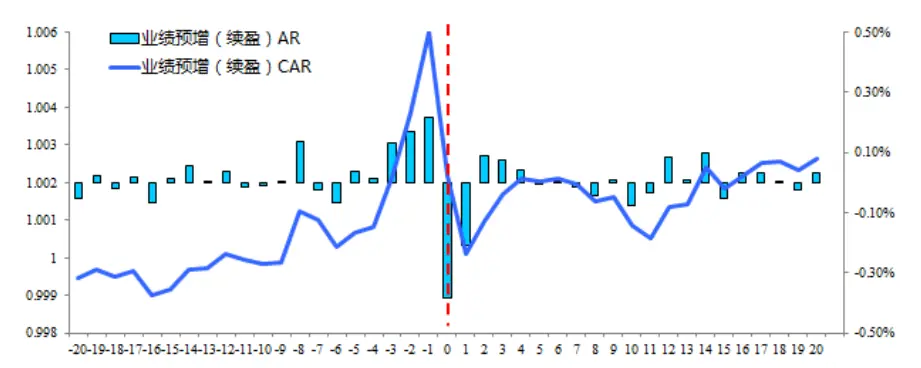
数据来源：国泰君安证券研究

表 6: 业绩预增（续盈）公告日前后 20 个交易日累计异常收益及 T 检验值

| 事件类型 | 公告日前20天 累计异常收益 | 公告日前20天 异常收益T检验值 | 公告日后 20 天 累计异常收益 | 公告日后 20 天 异常收益T检验值 |
| --- | --- | --- | --- | --- |
| 业绩预增（续盈） | 0.60% | 2.47 | -0.34% | -1.38 |

数据来源：国泰君安证券研究

事件 6：业绩预增 （预增）
图 7 业绩预增 （预增）公告日前后 20个交易日累计异常收益
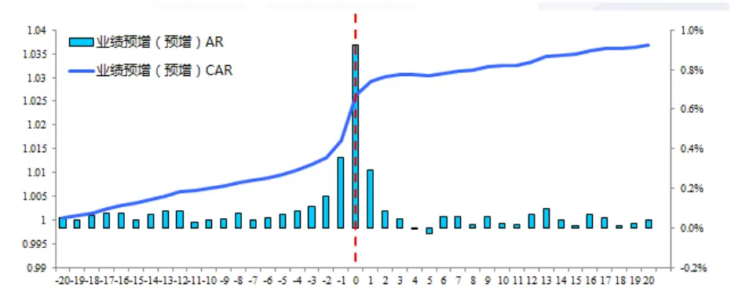
数据来源：国泰君安证券研究

表 7: 业绩预增（预增）公告日前后 20 个交易日累计异常收益及 T 检验值

| 事件类型 | 公告日前20天 累计异常收益 | 公告日前20天 异常收益T 检验值 | 公告日后20 天 累计异常收益 | 公告日后20 天 异常收益T检验值 |
| --- | --- | --- | --- | --- |
| 业绩预增（预增） | 1.68% | 13.06 | 1.96% | 14.19 |

数据来源：国泰君安证券研究

事件 7：业绩预亏（首亏、略减、续亏、预减）
图 8 业绩预增 （预增）公告日前后 20 个交易日累计异常收益
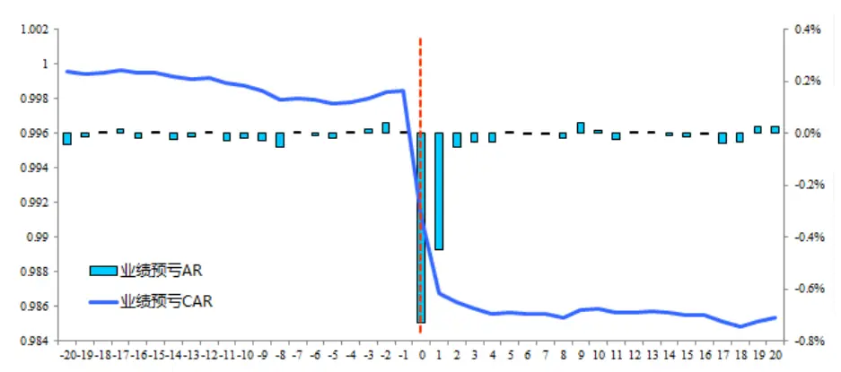
数据来源：国泰君安证券研究

表 8: 业绩预亏公告日前后 20 个交易日累计异常收益及 T 检验值

| 事件类型 | 公告日前20天 累计异常收益 | 公告日前20天 | 公告日后20天 | 公告日后20天 |
| --- | --- | --- | --- | --- |
| 业绩预亏 | -0.15% | 异常收益T 检验值 -1.26 | 累计异常收益 -0.59% | 异常收益T检验值 -10.91 |

数据来源：国泰君安证券研究

## 事件 8：高送转

图 9 高送转公告日前后 20 个交易日累计异常收益
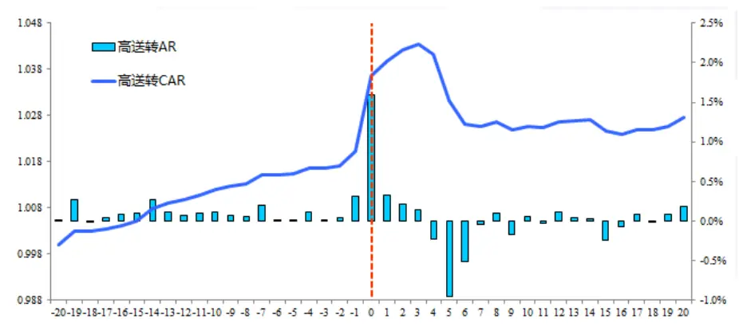
数据来源：国泰君安证券研究

表 9: 高送转公告日前后 20 个交易日累计异常收益及 T 检验值

| 事件类型 | 公告日前20天 累计异常收益 | 公告日前20天 异常收益T 检验值 | 公告日后20天 | 公告日后20天 |
| --- | --- | --- | --- | --- |
| 高送转 | 2.02% | 4.80 | 累计异常收益 -0.87% | 异常收益T检验值 1.46 |

数据来源：国泰君安证券研究

事件 9：股东增持
图 10 股东增持公告日前后 20个交易日累计异常收益
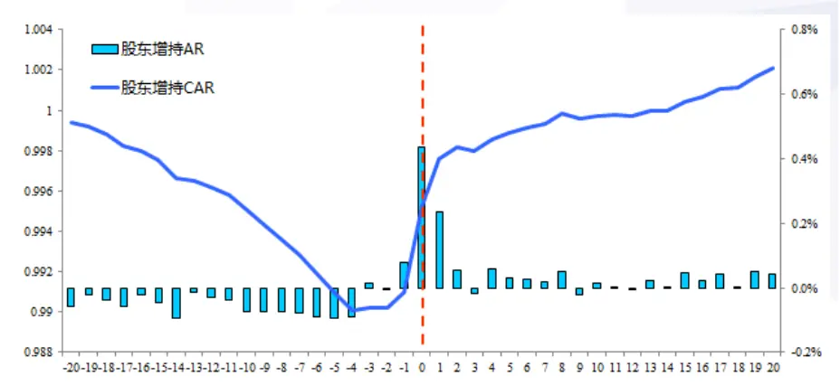
数据来源：国泰君安证券研究

表 10: 股东增持公告日前后 20 个交易日累计异常收益及 T检验值

| 事件类型 | 公告日前20天 累计异常收益 | 公告日前20天 异常收益T 检验值 | 公告日后 20天 累计异常收益 | 公告日后20 天 异常收益T 检验值 |
| --- | --- | --- | --- | --- |
| 股东增持 | -0.90% | -7.91 | 0.68% | 11.29 |

数据来源：国泰君安证券研究

事件 10：股东减持（非大宗交易）
图 11 股东减持（非大宗交易）公告日前后 20个交易日累计异常收益
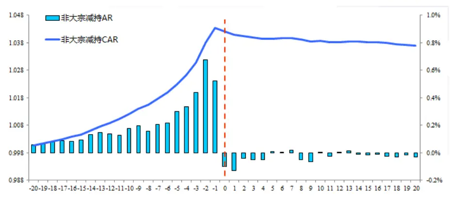
数据来源：国泰君安证券研究

表 11: 股东减持（非大宗交易）公告日前后 20 个交易日累计异常收益及 T 检验值

| 事件类型 | 公告日前20天 累计异常收益 | 公告日前20天 异常收益T检验值 | 公告日后20 天 累计异常收益 | 公告日后 20 天 异常收益T 检验值 |
| --- | --- | --- | --- | --- |
| 股东减持（非大宗交易） | 4.33% | 48.49 | -0.51% | -7.67 |

数据来源：国泰君安证券研究

事件 11：股东减持（大宗交易）
图 12 股东减持（大宗交易）公告日前后 20 个交易日累计异常收益
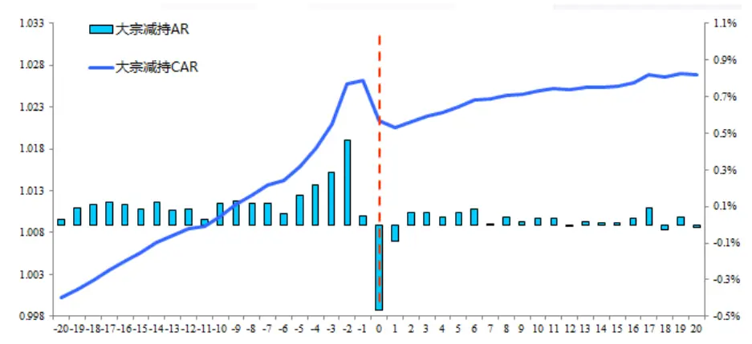
数据来源：国泰君安证券研究

表 12: 股东减持（大宗交易）公告日前后 20 个交易日累计异常收益及 T 检验值

| 事件类型 | 公告日前20天 累计异常收益 | 公告日前20天 异常收益T 检验值 | 公告日后20天 累计异常收益 | 公告日后 20 天 异常收益T检验值 |
| --- | --- | --- | --- | --- |
| 股东减持（大宗交易） | 2.62% | 16.59 | 0.53% | 0.38 |

数据来源：国泰君安证券研究

事件 12：员工持股（竞价转让）
图 13 员工持股（竞价转让）公告日前后 20 个交易日累计异常收益
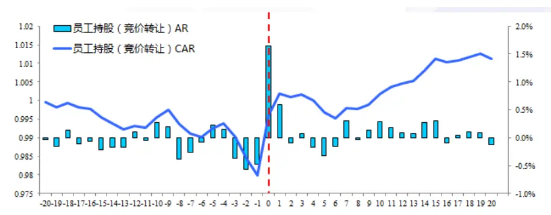
数据来源：国泰君安证券研究

表 13: 员工持股（竞价转让）公告日前后 20 个交易日累计异常收益及 T 检验值

| 事件类型 | 公告日前20天 累计异常收益 | 公告日前20天 异常收益T检验值 | 公告日后20 天 累计异常收益 | 公告日后 20 天 异常收益T检验值 |
| --- | --- | --- | --- | --- |
| 员工持股（竞价转让） | -2.01% | -2.11 | 3.20% | 2.96 |

数据来源：国泰君安证券研究

事件 13：员工持股（认购非公开发行）
图 14 员工持股（认购非公开发行）公告日前后 20个交易日累计异常收益
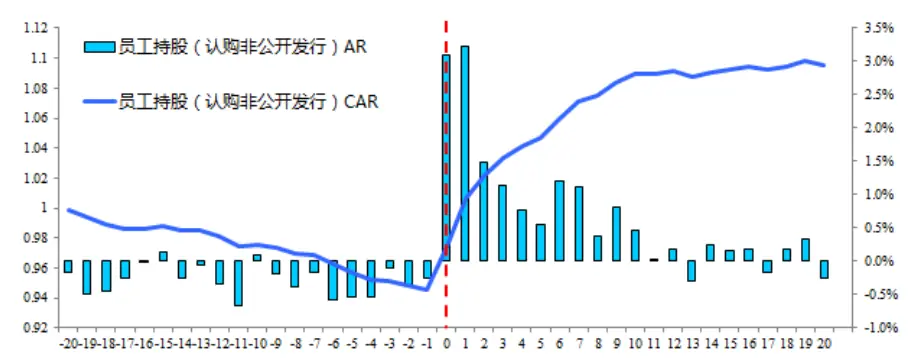
数据来源：国泰君安证券研究

表 14: 员工持股（认购非公开发行）公告日前后 20 个交易日累计异常收益及 T 检验值

| 事件类型 | 公告日前20天 累计异常收益 | 公告日前20天 异常收益T 检验值 | 公告日后 20 天 累计异常收益 | 公告日后 20 天 异常收益T检验值 |
| --- | --- | --- | --- | --- |
| 员工持股（认购非公开发行） | -5.44% | -3.67 | 15.87% | 5.55 |

数据来源：国泰君安证券研究

## 事件 14：股权激励

图 15 股权激励公告日前后 20个交易日累计异常收益
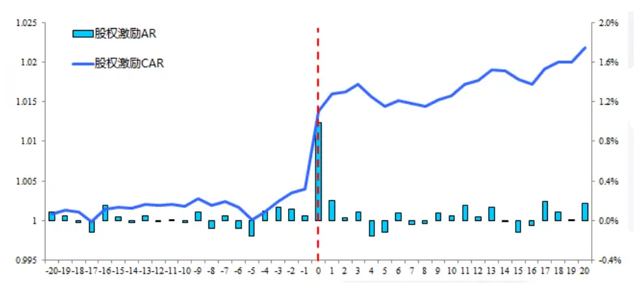
数据来源：国泰君安证券研究

表 15: 股权激励公告日前后 20 个交易日累计异常收益及 T 检验值

| 事件类型 | 公告日前20天 累计异常收益 | 公告日前20天 异常收益T检验值 | 公告日后20天 累计异常收益 | 公告日后20 天 异常收益T检验值 |
| --- | --- | --- | --- | --- |
| 股权激励 | 0.40% | 1.12 | 0.78% | 4.24 |

数据来源：国泰君安证券研

事件 15：快报同比盈增
图 16 业绩快报公告日前后 20个交易日累计异常收益
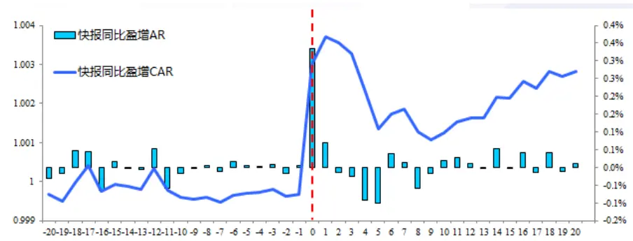
数据来源：国泰君安证券研究

表 16: 快报同比盈增公告日前后 20 个交易日累计异常收益及 T 检验值

| 事件类型 | 公告日前20天 累计异常收益 | 公告日前20天 异常收益T 检验值 | 公告日后20天 累计异常收益 | 公告日后 20 天 异常收益T检验值 |
| --- | --- | --- | --- | --- |
| 快报同比盈增 | -0.03% | -0.24 | -0.00% | 2.39 |

数据来源：国泰君安证券研究

事件 16：快报同比盈亏
图 17 业绩快报公告日前后 20个交易日累计异常收益
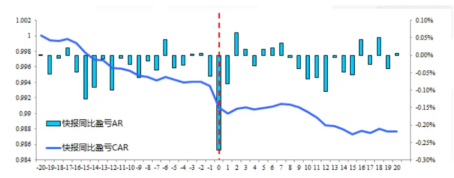
数据来源：国泰君安证券研究

表 17: 快报同比盈亏公告日前后 20 个交易日累计异常收益及 T 检验值

| 事件类型 | 公告日前20天 累计异常收益 | 公告日前20天 异常收益T 检验值 | 公告日后 20 天 累计异常收益 | 公告日后20天 异常收益T 检验值 |
| --- | --- | --- | --- | --- |
| 快报同比盈亏 | -0.65% | -3.61 | -0.36% | -3.43 |

数据来源：国泰君安证券研究

事件 17：投资者调研
图 18 投资者调研日前后 20 个交易日累计异常收益
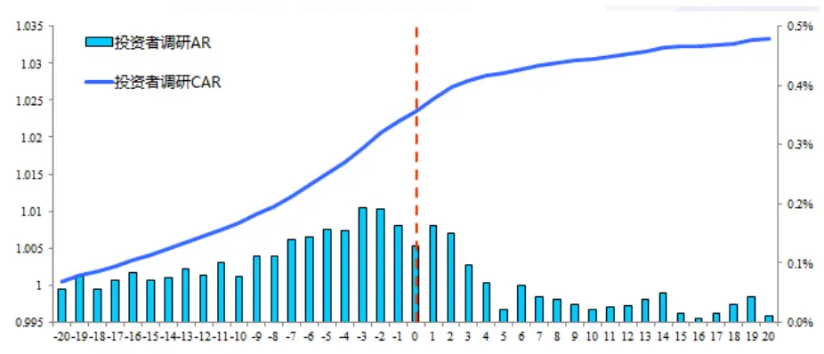
数据来源：国泰君安证券研究

表 18: 投资者调研日前后 20 个交易日累计异常收益及 T 检验值

| 事件类型 | 公告日前20天 累计异常收益 | 公告日前20 天 异常收益T 检验值 | 公告日后 20天 累计异常收益 | 公告日后20 天 异常收益T 检验值 |
| --- | --- | --- | --- | --- |
| 投资者调研 | 2.22% | 28.85 | 0.95% | 14.51 |

数据来源：国泰君安证券研究

## 事件 18：关联交易

图 19 关联交易公告日前后 20 个交易日累计异常收益
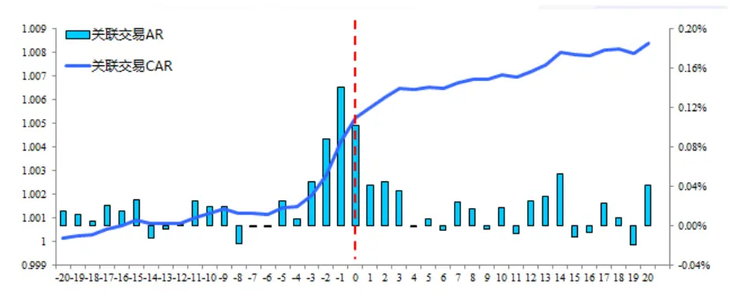
数据来源：国泰君安证券研究

表 19: 关联交易公告日前后 20 个交易日累计异常收益及 T 检验值

| 事件类型 | 公告日前20天 累计异常收益 | 公告日前20天 异常收益T检验值 | 公告日后20天 累计异常收益 | 公告日后20 天 异常收益T检验值 |
| --- | --- | --- | --- | --- |
| 关联交易 | 0.42% | 5.46 | 0.41% | 4.09 |

数据来源：国泰君安证券研究

事件 19：违规事项
图 20 违规事项公告日前后 20个交易日累计异常收益
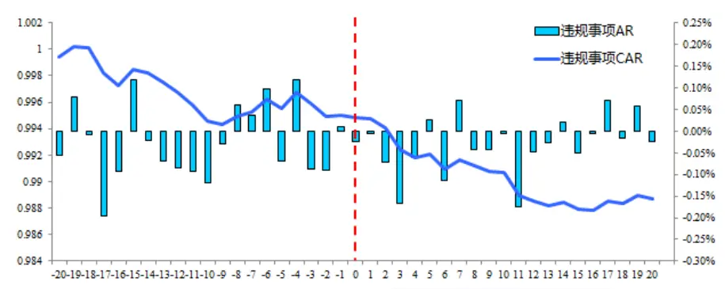
数据来源：国泰君安证券研究

表 20: 违规事项公告日前后 20 个交易日累计异常收益及 T检验值

| 事件类型 | 公告日前20天 累计异常收益 | 公告日前20天 异常收益T检验值 | 公告日后 20 天 累计异常收益 | 公告日后 20 天 异常收益T检验值 |
| --- | --- | --- | --- | --- |
| 违规事项 | -0.50% | -1.02 | -0.64% | -1.35 |

数据来源：国泰君安证券研究

事件 20：调入融资融券标的
图 21 调入融资融券标的实施日前后 20个交易日累计异常收益
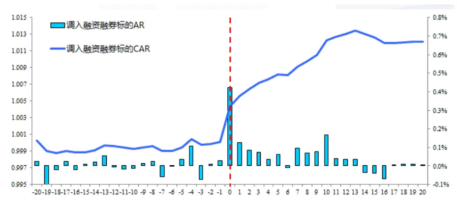
数据来源：国泰君安证券研究

表 21: 调入融资融券标的实施日前后 20 个交易日累计异常收益及 T 检验值

| 事件类型 | 公告日前20天 累计异常收益 | 公告日前20天 异常收益T检验值 | 公告日后 20 天 累计异常收益 | 公告日后 20 天 异常收益T检验值 |
| --- | --- | --- | --- | --- |
| 调入融资融券标的 | 0.01% | 0.04 | 0.77% | 3.48 |

数据来源：国泰君安证券研究

事件 21：调入沪深 300 指数成分股
图 22 调入沪深 300 指数成分股实施日前后 20个交易日累计异常收益
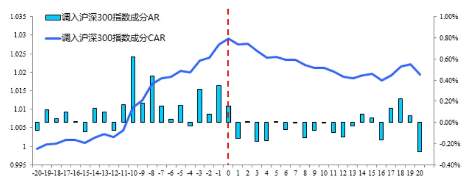
数据来源：国泰君安证券研究

表 22:调入沪深 300 指数成分股实施日前后 20 个交易日累计异常收益及 T 检验值

| 事件类型 | 公告日前20天 累计异常收益 | 公告日前20天 异常收益T检验值 | 公告日后 20 天 累计异常收益 | 公告日后 20 天 异常收益T 检验值 |
| --- | --- | --- | --- | --- |
| 调入沪深 300 指数成分 | 2.76% | 5.76 | -0.80% | -1.23 |

数据来源：国泰君安证券研究

事件 22：调出沪深 300 指数成分股
图 23 调出沪深 300 指数成分股实施日前后 20个交易日累计异常收益
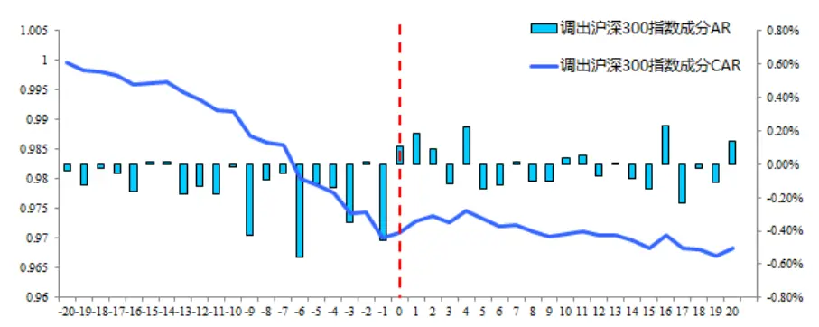
数据来源：国泰君安证券研究

表 23:调出沪深 300 指数成分股实施日前后 20 个交易日累计异常收益及 T 检验值

| 事件类型 | 公告日前20天 累计异常收益 | 公告日前20天 异常收益T检验值 | 公告日后 20 天 累计异常收益 | 公告日后 20 天 异常收益T检验值 |
| --- | --- | --- | --- | --- |
| 调出沪深 300 指数成分 | -3.01% | -6.25 | -0.17% | -0.30 |

数据来源：国泰君安证券研究

在上述对于不同事件的异常收益统计观察中，可以发现大部分事件的异常收益在公告日前后均会产生剧烈波动，这表明事件信息的冲击对股票价格具有显著的影响。

进一步的可以发现，市场预期的影响在事件研究中起到了重要的作用。从上述分析中可以看到，大部分事件类型在公告日之前异常收益就有显著波动，而在事件实际发生之后即市场预期兑现后，异常收益则并不一定可以得到延续，例如定向增发、高送转等事件，此类效应尤为明显。

我们同样发现，不同事件异常收益影响的时间维度是不同的。部分事件的发生对股价表现为短期脉冲式影响，例如业绩预亏、高送转等，股价异常收益会在短时间迅速将事件影响完全反应，市场几乎表现为完全有效状态。而部分事件则对股价表现为持续性影响，例如业绩预增、股东增持、投资者调研等，该类事件在公告后一段时间内对个股仍然产生持续稳定的作用，因此酝酿了较好的投资机会。

因此，不同的事件属性存在区别，市场对不同事件的理解和反应同样存在区别，这样的区别对构建事件驱动投资组合有着很大的影响。我们接下来即将针对各类事件对股价异常收益所产生的冲击影响，对事件属性进行分类，进而实现多事件驱动投资组合的构建。

## 3. 事件属性分类

在上一节的研究中，我们通过对异常收益的定义，统计观察了若干类事件的发生对个股产生的影响。其中研究发现，不同类型的事件对个股异常收益的影响是时间维度是不同的，因此对事件属性进行区分对构建多事件驱动的投资组合来说是非常重要的。

我们根据事件发生对股票异常收益的影响，我们将事件分为 5 类，分别是：持续性阿尔法事件、持续性风险事件、短期阿尔法事件、短期风险事件和其他类型。具体事件属性分类如下所示：

表 24:事件属性分类：

| 事件类型 | 异常收益状态 | 事件属性定义 |
| --- | --- | --- |
| 定向增发 | 公告日前异常收益涨幅显著，公告当日达 到顶点，后无显著异常收益。 | 其他 |
| 限售股解禁 | 公告前5日及后2日收益显著为负。 | 短期风险事件 |
| 业绩预增（扭亏、略增、预增） | 公告日前后累计异常收益涨幅均较为显 著，公告日前后呈现加速上升。 | 持续性阿尔法事件 |
| 业绩预增（续盈） | 公告日前后异常收益波动较大，其余时间 无显著异常收益。 | 其他 |
| 业绩预亏（首亏、略减、续亏、预减） | 公告日及后1天异常收益断崖式下降。 | 短期风险事件 |
| 高送转 | 公告日及后1天异常收益显著上升，随后 显著下降，后无显著异常收益。 | 短期阿尔法事件 |
| 股东增持 | 公告日累计异常收益达到底点，公告日后 显著上升，持续20个交易日以上。 | 持续性阿尔法事件 |
| 股东减持（大宗减持） | 累计异常收益在公告日后短暂下降，后显 著上升，持续20个交易日以上。 | 短期风险事件+持续性阿尔法事件 |
| 股东减持（非大宗减持） | 公告日累计异常收益达到顶点，公告后显 著下降，持续20个交易日以上。 | 持续性风险事件 |
| 员工持股（竞价转让） | 公告日前后异常收益波动较大，其余时间 | 其他 |
| 员工持股（认购非公开发行） | 公告日累计异常收益达到底点，后显著上 升，持续10个交易日左右。 | 短期阿尔法事件 |
| 股权激励 | 公告日后累计异常收益显著上升，持续 20 个交易日以上。 | 持续性阿尔法事件 |
| 快报同比盈增 | 公告日及次日累计异常收益大幅上升，后 回落至无显著异常收益。 | 短期阿尔法事件 |
| 快报同比盈亏 | 公告日前后累计收益涨幅均较为显著，公 告日前后呈现加速下降。 | 持续性风险事件 |
| 投资者调研 | 公告日前后累计异常收益涨幅均较为显 著，公告日前后呈现加速上升。 | 持续性阿尔法事件 |
| 关联交易 | 公告日前后累计异常收益显著上升 | 短期阿尔法事件 |
| 违规事项 | 公告日前后累计异常收益显著下降 | 短期风险事件 |
| 调入融资融券标的 | 公告日后累计异常显著上升，持续10个 | 短期阿尔法事件 |
|  | 交易日左右。 实施日前累计异常收益显著上升，实施日 |  |
| 调入沪深 300 指数成分股 | 后无显著异常收益。 | 其他 |
| 调出沪深 300 指数成分股 | 实施日前累计异常收益显著下降，实施日 后无显著异常收益。 | 其他 |

数据来源：国泰君安证券研究

在上述分类中，定义为持续性阿尔法事件的事件类型有 4类，包括：业绩预增（扭亏、略增、预增）、股东增持、股权激励和投资者调研；定义为持续性风险事件的类型有 2 类，包括：股东减持（非大宗交易）和快报同比盈亏；其他事件即为短期事件或其他。

我们在上一节的研究中提到，由于短期事件受信息优势、交易速度等因素影响，较难把握，并且资金容量有限，因此比之短期事件，我们更加关注持续性事件的影响。其中，持续性阿尔法事件酝酿了较好的投资机会，而持续性风险事件则需要谨慎规避。

我们接下来将进一步考察上述提到的 4 类持续性阿尔法事件和 2 类持续性风险事件在公告日后 60 个交易日内的异常收益表现，方法与之前相同，具体结果如下：

持续性阿尔法事件 1：业绩预增（扭亏、略增、预增）
图 24 业绩预增（扭亏、略增、预增）公告日后 60个交易日累计异常收益
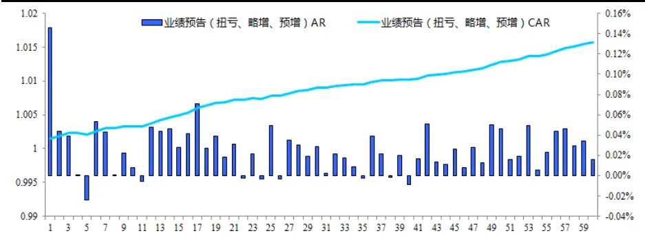
数据来源：国泰君安证券研究

表 25: 业绩预增（扭亏、略增、预增）公告日后60个交易日累计异常收益及 T 检验值

| 事件类型 | 公告日后60个交易日累计异常收益 | 公告日后60个交易日异常收益T检验值 |
| --- | --- | --- |
| 业绩预增（扭亏、略增、预增） | 1.56% | 10.81 |

数据来源：国泰君安证券研究

## 持续性阿尔法事件 2：股东增持

图 25 股东增持公告日后 60个交易日累计异常收益
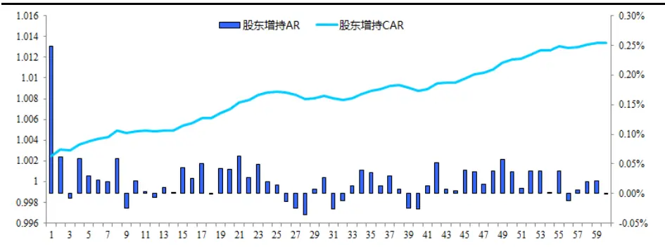
数据来源：国泰君安证券研究

表 26: 股东增持公告日后 60 个交易日累计异常收益及 T 检验值

| 事件类型 | 公告日后60个交易日累计异常收益 | 公告日后 60个交易日异常收益T检验值 |
| --- | --- | --- |
| 股东增持 | 1.34% | 8.22 |

数据来源：国泰君安证券研究

## 持续性阿尔法事件 3：股权激励

图 26 股权激励公告日后 60个交易日累计异常收益
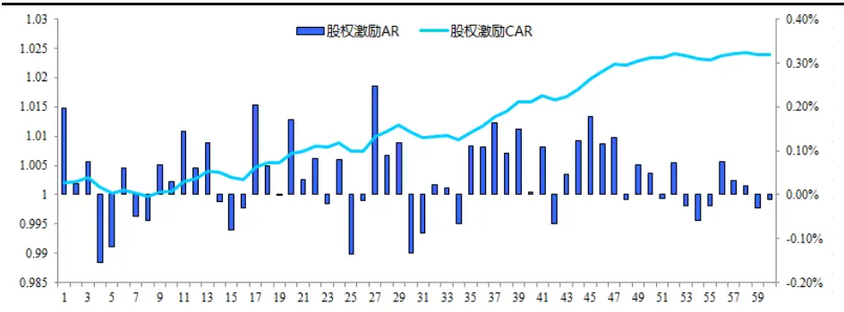
数据来源：国泰君安证券研究

表 27: 股权激励公告日后60个交易日累计异常收益及 T 检验值

| 事件类型 | 公告日后60个交易日累计异常收益 | 公告日后60个交易日异常收益T检验值 |
| --- | --- | --- |
| 股权激励 | 2.38% | 3.67 |

数据来源：国泰君安证券研究

## 持续性阿尔法事件 4：投资者调研

图 27 投资者调研公告日后 60 个交易日累计异常收益
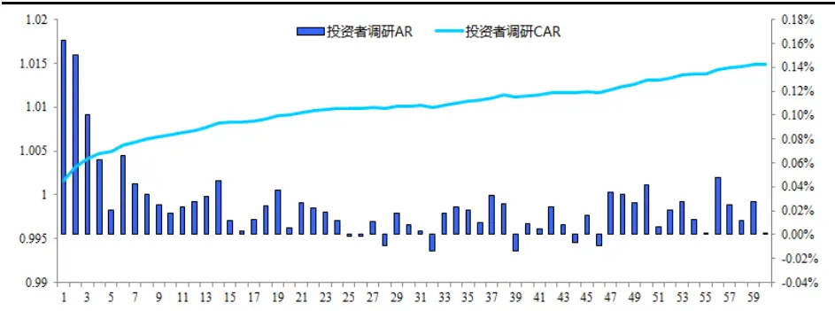
数据来源：国泰君安证券研究

表 28: 投资者调研公告日后60个交易日累计异常收益及 T检验值

| 事件类型 | 公告日后60个交易日累计异常收益 | 公告日后 60个交易日异常收益 T 检验值 |
| --- | --- | --- |
| 投资者调研 | 1.49% | 12.17 |

数据来源：国泰君安证券研究

## 持续性风险事件 1：非大宗减持

图 28 非大宗减持公告日后 60个交易日累计异常收益
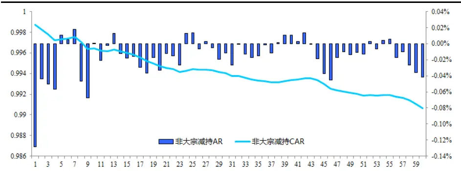
数据来源：国泰君安证券研究

表 29: 非大宗减持公告日后 60 个交易日累计异常收益及 T 检验值

| 事件类型 | 公告日后60个交易日累计异常收益 | 公告日后60个交易日异常收益T检验值 |
| --- | --- | --- |
| 非大宗减持 | -0.97% | -7.15 |

数据来源：国泰君安证券研究

## 持续性风险事件 2：快报同比盈亏

图 29 快报同比盈亏公告日后 60 个交易日累计异常收益
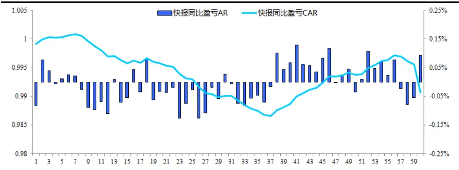
数据来源：国泰君安证券研究

| 事件类型 | 公告日后60个交易日累计异常收益 | 公告日后60个交易日异常收益T检验值 |
| --- | --- | --- |
| 快报同比盈亏 | -0.93% | -0.99 |
| 数据来源：国泰君安证券研究 | 从上述结果中可以清晰的发现，在我们所定义的4类持续性阿尔法事件 状态下，公告后60个交易日的异常收益仍然保持稳定的增长，并且异常 收益的T检验值也均维持在较高水平。这表明，在该类事件发生后的60 |  |
| 有利的。 | 获得较为稳定的异常收益贡献，这对我们构建事件驱动组合而言是十分 对于持续性风险事件的统计结果中看到，非大宗减持公告日后60个交易 |  |
|  | 日异常收益持续下降，这期间的任意时间段均应该规避相应个股。而快 报同比盈亏事件的影响时间约为40个交易日，此后异常收益短期回升并 进入正常状态。总体而言，持续性风险事件将会导致累计异常收益持续 下降，投资者对该类股票需谨慎规避。 |  |

表 30: 快报同比盈亏公告日后60个交易日累计异常收益及 T 检验值

## 4. 多事件驱动组合策略构建

## 4.1. 多事件驱动组合构建方式

上一节我们对各类事件的属性进行了定义分类，本节我们将针对持续性阿尔法事件构建多事件驱动组合策略。

由于个股事件发生的时间点不一致，因此事件驱动策略的组合构建问题很难找到完美的解决方式。通常而言，该类策略的组合构建有 2 种方法，第一种即为即时调仓策略，即事先将资金等额分配，当个股事件发生后，立即将对应股票选入组合，同时将组合中最早调入的个股卖出。该方法的好处在于可以获得事件发生后的及时收益，而不用等到特定换仓日，但该方法的缺点在于组合常常较不稳定，并且对于资金分配也较难把控。而第二中方法即为定期调仓策略，该方法与多因子策略逐月调仓类似，在特定调仓日（如每月末）一揽子买入处于事件影响状态下的股票组合。该方法的缺点在于会损失事件发生后的及时收益，但整体组合的稳定性相对而言较高。

显然，针对本篇报告的研究逻辑，我们更倾向于第二种组合构建方式。因为在前几个章节的分析中，我们通过对不同事件属性的分类，定义了持续性阿尔法事件，即在事件发生后的 60 个交易日个股异常收益持续稳定上升。因此，对于组合构建而言，只要个股在调仓日后的持有期内，个股始终处于事件状态的影响下，那么组合就可以获得该类事件的所带来的稳定收益。

具体而言，我们将所有事件利用状态变量 1/0/-1 来表示，其中状态 1 表示事件当前处于持续性阿尔法事件状态影响下，0 表示其他，-1 表示事件当前处于持续性风险事件状态影响下。

我们以月频率作为调仓周期，并以每月第一个交易日作为换仓日。对于处于持续性阿尔法事件状态影响下的个股，若在换仓日，个股未来 20个交易日仍处于阿尔法事件状态影响下，则将股票纳入组合。对于持续性风险事件而言，若在换仓日，个股未来存在大于 1 个交易日处于风险事件状态影响下，则规避组合选入该股票。

图 30 个股事件状态判定及组合构建
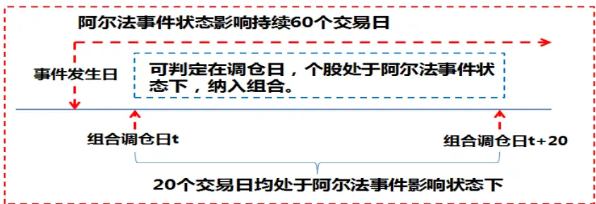
数据来源：国泰君安证券研究

在这其中，我们选择了最为保守的方式，即对于阿尔法事件，我们需要其在未来完整的 20 个交易日均处于事件影响状态下，如果放松条件话，可以相应的减少对应日期，例如改成未来 10 个交易日处于事件影响状态下即可。对于风险事件，我们严苛的选择只要未来大于 1 天处于风险状态下，即规避个股纳入组合，同样我们可以选择适当放松条件，例如可改为未来处于风险状态的事件小于 5 天即可。

## 4.2. 基于持续性阿尔法事件的多事件驱动策略

在我们在上述的研究分析中，定义了业绩预增、股东增持、股权激励、投资者调研为 4 类持续性阿尔法事件，并且根据该类事件的影响时间，给定了调仓日可纳入组合的股票池。那么本节，我们就将构建基于持续性阿尔法事件的多事件驱动策略。

我们选择业绩预增、股东增持、股权激励、投资者调研作为持续性阿尔法事件，以每月第一个交易日作为调仓日，选择未来 20 个交易日处于上述事件影响状态下的股票构建多头组合，等权方式配臵。考虑交易佣金单边 0.1%、印花税 0.1%，自 2010 年 1 月至 2016 年 4 月，换仓日剔除停牌、涨停、成交量异常股票，以当日开盘价作为成交价格。组合累计收益如下所示：

图 31 多事件驱动组合累计收益
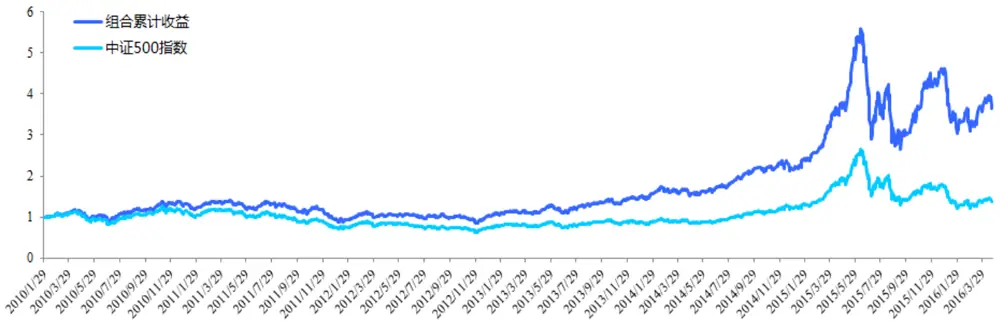
数据来源：国泰君安证券研究

图 32 多事件驱动组合累计超额收益
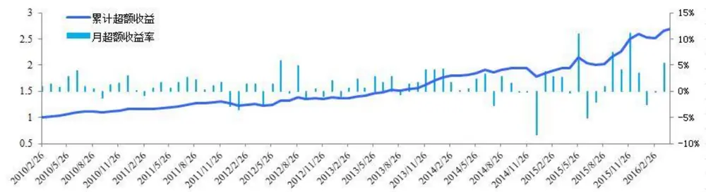
数据来源：国泰君安证券研究

表 31: 多事件驱动组合绩效分析

| 年份 | 组合收益率 | 中证 500 收益率 | 年超额收益 | 年信息比率 | 年换手率（双边） |
| --- | --- | --- | --- | --- | --- |
| 2010 | 31.8% | 12.8% | 19.0% | 3.42 | 504% |
| 2011 | -27.8% | -33.8% | 6.0% | 1.94 | 530% |
| 2012 | 8.7% | 0.3% | 8.4% | 1.45 | 540% |
| 2013 | 43.8% | 16.9% | 26.9% | 3.88 | 340% |
| 2014 | 45.5% | 39.0% | 6.5% | 0.86 | 285% |
| 2015 | 108.7% | 43.1% | 65.6% | 3.17 | 346% |
| 2016（至4月末） | -18.0% | -21.1% | 3.1% | 1.83 | 353% |
| 平均 | / | / | 19.4% | 2.36 | 414% |

数据来源：国泰君安证券研究

上述回测结果表明，多事件驱动投资组合在过去 6 年时间内均战胜了中证 500 指数，表现稳定。逐年平均来看，组合可获得 19.4%的年超额收益率，平均年信息比率达到 2.36，组合年均双边换手率约为 4 倍。

我们进一步利用业绩归因模型，对组合收益进行深入的分解观察，具体结果如下：

图 33 多事件驱动组合收益归因
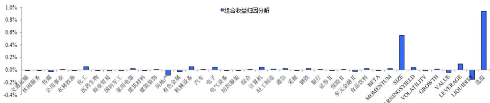
数据来源：国泰君安证券研究

收益归因结果显示，组合在选股层面贡献最高（即特质收益贡献显著），这表明在我们多事件驱动策略的逻辑框架下，组合获得了显著的事件异常收益。

但是，归因结果同样表明，在风格层面，组合带有较为明显的市值风格特征，即组合选择的股票仍然以中小创居多，策略收益中存在部分风格收益。

## 5. 事件驱动策略与多因子模型

## 5.1. 事件收益与风格收益

在上一节的研究中，我们构建了基于持续性阿尔法事件的多事件驱动组合策略。实证检验结果表明，策略收益表现较为稳健。

但是，在我们对组合进行归因分解的时候发现，尽管策略获得了显著的事件异常收益，但是同样存在较为明显的风格收益。这不禁引发我们的思考：是否可以构建基于事件驱动策略的风格中性投资组合？

在我们之前对阿尔法模型的研究报告中，我们通过权重优化的方法，构建了基于风险模型的风格中性投资组合，策略表现十分稳健。从本质上来说，事件导致的股票收益同样可以理解为阿尔法收益，尤其是持续性阿尔法事件所导致的收益更是存在长期稳定的特征，这与阿尔法因子的特征极为相似。

但是，从模型的角度出发我们却很难将事件作为因子来处理。一方面，是因为事件发生的时点并不一致；另一方面，事件为状态因子而不是截面因子，传统的截面因子处理方法无法运用于事件因子。所以这也导致了，长期以来，量化研究团队通常将多因子模型与事件驱动模型分为两个不同的大类而区别对待。

事实上，我们很难将事件收益与风格收益相互独立来看，究竟是事件发生产生了风格收益，还是市场风格导致了更多事件的发生？这个问题从模型的角度很难给出准确的答案。例如在上一节的组合构建中，如果我们利用权重优化约束将组合的市值敞口完全中性化，那么很有可能导致特质收益的贡献也大幅降低。所以，我们认为事件驱动所产生的收益一定是包含风格收益的，而我们要做的是在风格中性的基础上，获取事件收益中非风格收益的部分。

既然无法将事件状态因子作为传统截面因子的方法来处理，那我们选择在组合预期收益率中增加事件因子部分，使得组合的优化目标函数中包含事件驱动收益部分。

具体而 $\frac{言}{言}$ ，在原先的组合预期收益率 $R_{\textit{ p }}$ 的估计中，我们利用估计的因子收益率 $\hat{f}$ 与当期因子载荷矩阵 X 的乘积作为个股预期收益率的估计值，即 $R_{p}=w^{\prime}\cdot X\cdot\hat{f}$ ，其中w 为组合目标权重向量。在这其中，我们并没有对残差 进行估计。

而在考虑事件驱动收益后，我们将增加 的估计部分，而 的估计值就是我们在前面章节中所定义的事件异常累计收益CAR 。

那么在考虑事件驱动后的组合预期收益率 $\pmb{R}_{\pmb{p}}$ 估计算法为：

$$
R_{p}=w^{\prime}\cdot(X\cdot\hat{f}+\hat{\sigma}),\hat{\sigma}=\{\hat{\sigma}_{1},\hat{\sigma}_{2},...,\hat{\sigma}_{N}\}^{\prime};
$$

其中，对第 j 只股票，若其处于持续性阿尔法事件影响状态下，则 $\hat{\pmb{\theta}}_{j}$ 等于该事件历史 20 日累计异常收益C A R 均值；反之，若其不处于持续性阿尔法事件影响状态下，则 $\hat{\pmb{\mathscr{S}}}_{j}=\pmb{0}$

也就是说，我们首先通过风险模型的分解统计观察了事件发生对个股异常收益的影响。最后，为了获取我们认为持续稳定的阿尔法事件收益，我们在估计预期组合收益率的时候，将残差部分重新加回个股收益中。同时，我们保持了一系列中性约束条件不变，那么这样就可以使得计算权重的过程中，获取相应的事件非风格收益部分。

同时，对于持续性风险事件，我们在优化约束条件中，对于处于该状态的个股，限制其权重为 0，即保持（持续性）风险事件中性。

## 5.2. 基于多因子多事件驱动的最优中性投资组合

因此，在增加了事件驱动后的组合构建方式，我们可以描述为：

在暴露阿尔法因子敞口，并保持组合市场中性、行业中性、风格中性、风险事件中性约束，并对组合跟踪误差约束的条件下，最大化经风险调整后的组合预期收益率，其中组合预期收益率考虑事件收益。

图 34 多因子多事件驱动最优中性投资组合构建
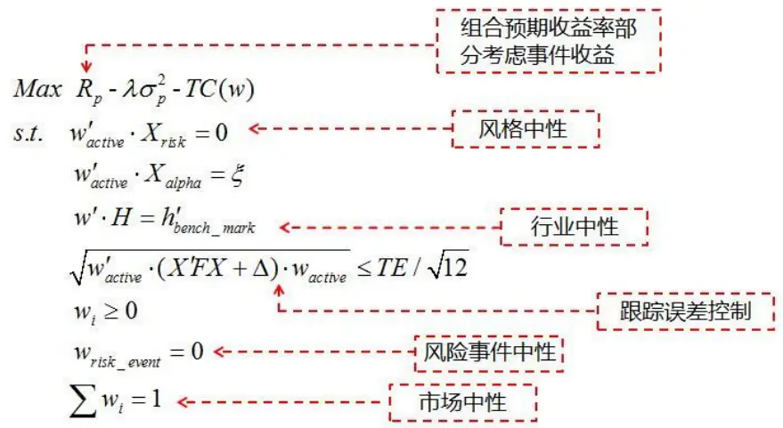
数据来源：国泰君安证券研究

我们以中证 500 指数为基准，根据上述组合构建方式，计算每期组合权重，具体为：

1）回测时间从《基于组合权重优化的风格中性多因子选股策略》报告发布后实际组合样本外跟踪时间段：2015 年 1 月至 2016 年 4 月；

2） 股票池选取为全 A 非 ST 股票；

3） 交易成本为单边 0.1%，印花税 0.1%；

4） 组合跟踪误差 TE=5%；

5） 行业中性约束中，因子敞口设定为•5% ；

6） 风格中性约束中，9 类风格因子敞口设定为：

| 因子类型 | 风险敞口约束上限 | 风险敞口约束下限 |
| --- | --- | --- |
| Beta | 0.01 | -0.01 |
| Momentum | 0.01 | -0.01 |
| Size | 0.01 | -0.3 |
| Earning Yield | ∞ | 1 |
| Volatility | 0.01 | -0.01 |
| Growth | 0.01 | -0.01 |
| Value | 0.01 | -0.01 |
| Leverage | 0.01 | -0.01 |
| Liquidity | -1 | -8 |

当该期权重优化方程在设定的因子敞口约束下无解时，逐次降低阿尔法因子敞口 0.1，直至优化方程找到最优解。

我们将多因子多事件驱动组合累计收益、多因子组合累计收益、中证 500指数进行对比，组合对冲净值及相关绩效如下所示：

图 35 组合累计收益比较
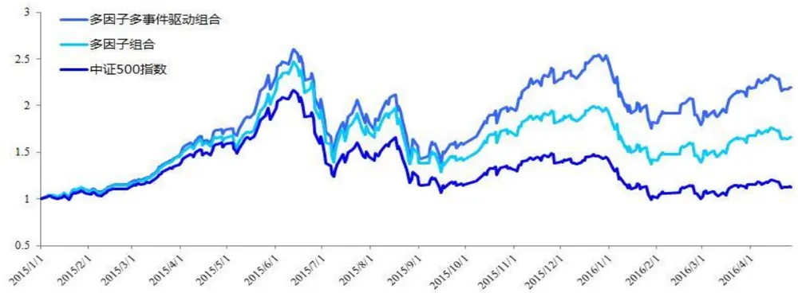
数据来源：国泰君安证券研究

图 36 组合累计超额收益比较
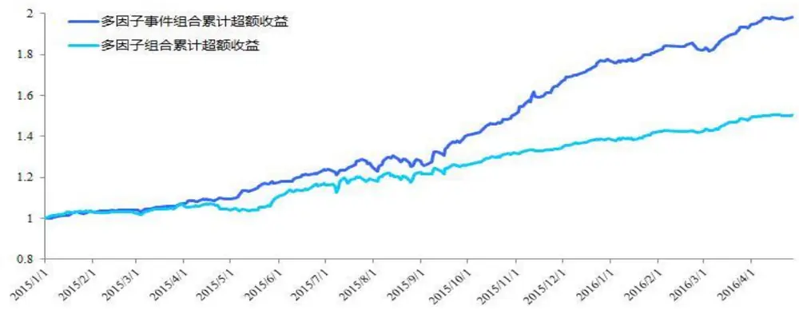
数据来源：国泰君安证券研究

表 32: 组合绩效分析比较

|  | 组合累计净值 | 组合累计超额收益 | 超额收益最大回撤 | 组合信息比率 |
| --- | --- | --- | --- | --- |
| 多因子组合 | 1.66 | 50.4% | 3.80% | 3.70 |
| 多因子多事件驱动组合 | 2.19 | 98.3% | 4.44% | 6.25 |

数据来源：国泰君安证券研究

上述结果表明，增加了事件驱动的多因子选股策略，收益显著提升。从图 35 的组合累计收益可以看到，多事件驱动多因子选股组合在股灾后的净值一度接近前期最高点，表现远好于原多因子组合，表明该时间段事件驱动收益显著。

从相对中证 500 指数的超额收益来看，考虑事件驱动的多因子组合在最大回撤几乎相同的情况下，累计收益从 50.4%大幅提升至 98.3%，因此组合整体的信息比率也提升至 6.25，表现良好。

## 6. 研究总结与展望

本篇报告在原有各类事件研究的基础上，对常见的若干类事件进行了综合量化分析研究。

我们通过风险模型对股票收益率的分解，定义了事件驱动异常收益（AR：）。在此基础上，我们对若干类事件公告日前后若干天的累计异常收益进行观察统计，对各类事件发生对股票价格的影响有了更为直观深入的理解。

进一步的，为了构建多事件驱动投资组合，我们根据事件发生对股票价格影响的时间维度，将事件属性分类为持续性阿尔法事件、持续性风险事件、短期阿尔法事件、短期风险事件和其他类事件 5 类。在此基础上，我们构建了基于多事件驱动的组合投资策略。实证结果表明，组合收益稳健有效，在过去 6 年时间内均可稳定战胜中证 500 指数。

本篇报告的最后一部分，我们开创性的将事件驱动策略与多因子策略在组合权重优化的框架下相结合，构建基于多因子多事件驱动的最优中性投资组合。实证结果同样表明，增加了事件驱动后的多因子选股策略，收益显著提升。

在后期的研究中，我们将会更加深入的对各类事件投资逻辑、市场适用环境等多方面因素进行研究分析，并对可能发生的事件进行建模预测，使得投资者能够更多的把握事件投资机会，获得更好的超额收益。

当然，事件驱动研究的本质仍然是对市场参与者内心预期、相互博弈的投资心理研究。本篇报告通过数据建模等方法，对事件影响进行了一定的统计观察，但模型终究只是研究工具，最终我们希望通过事件研究，使得投资者更深入的理解股票价格运行的成因及规律，进而达到无招胜有招之最高境界。

## 本公司具有中国证监会核准的证券投资咨询业务资格

## 分析师声明

作者具有中国证券业协会授予的证券投资咨询执业资格或相当的专业胜任能力，保证报告所采用的数据均来自合规渠道，分析逻辑基于作者的职业理解，本报告清晰准确地反映了作者的研究观点，力求独立、客观和公正，结论不受任何第三方的授意或影响，特此声明。

## 免责声明

本报告仅供国泰君安证券股份有限公司（以下简称“本公司”）的客户使用。本公司不会因接收人收到本报告而视其为本公司的当然客户。本报告仅在相关法律许可的情况下发放，并仅为提供信息而发放，概不构成任何广告。

本报告的信息来源于已公开的资料，本公司对该等信息的准确性、完整性或可靠性不作任何保证。本报告所载的资料、意见及推测仅反映本公司于发布本报告当日的判断，本报告所指的证券或投资标的的价格、价值及投资收入可升可跌。过往表现不应作为日后的表现依据。在不同时期，本公司可发出与本报告所载资料、意见及推测不一致的报告。本公司不保证本报告所含信息保持在最新状态。同时，本公司对本报告所含信息可在不发出通知的情形下做出修改，投资者应当自行关注相应的更新或修改。

本报告中所指的投资及服务可能不适合个别客户，不构成客户私人咨询建议。在任何情况下，本报告中的信息或所表述的意见均不构成对任何人的投资建议。在任何情况下，本公司、本公司员工或者关联机构不承诺投资者一定获利，不与投资者分享投资收益，也不对任何人因使用本报告中的任何内容所引致的任何损失负任何责任。投资者务必注意，其据此做出的任何投资决策与本公司、本公司员工或者关联机构无关。

本公司利用信息隔离墙控制内部一个或多个领域、部门或关联机构之间的信息流动。因此，投资者应注意，在法律许可的情况下，本公司及其所属关联机构可能会持有报告中提到的公司所发行的证券或期权并进行证券或期权交易，也可能为这些公司提供或者争取提供投资银行、财务顾问或者金融产品等相关服务。在法律许可的情况下，本公司的员工可能担任本报告所提到的公司的董事。

市场有风险，投资需谨慎。投资者不应将本报告作为作出投资决策的唯一参考因素，亦不应认为本报告可以取代自己的判断。
在决定投资前，如有需要，投资者务必向专业人士咨询并谨慎决策。

本报告版权仅为本公司所有，未经书面许可，任何机构和个人不得以任何形式翻版、复制、发表或引用。如征得本公司同意进行引用、刊发的，需在允许的范围内使用，并注明出处为“国泰君安证券研究”，且不得对本报告进行任何有悖原意的引用、删节和修改。

若本公司以外的其他机构（以下简称“该机构”）发送本报告，则由该机构独自为此发送行为负责。通过此途径获得本报告的投资者应自行联系该机构以要求获悉更详细信息或进而交易本报告中提及的证券。本报告不构成本公司向该机构之客户提供的投资建议，本公司、本公司员工或者关联机构亦不为该机构之客户因使用本报告或报告所载内容引起的任何损失承担任何责任。

## 评级说明

## 1.投资建议的比较标准

投资评级分为股票评级和行业评级。

以报告发布后的12个月内的市场表现为比较标准，报告发布日后的12个月内的公司股价（或行业指数）的涨跌幅相对同期的沪深300指数涨跌幅为基准。

## 2.投资建议的评级标准

报告发布日后的 12 个月内的公司股价（或行业指数）的涨跌幅相对同期的沪深300指数的涨跌幅。

|  | 评级 说明 |  |
| --- | --- | --- |
| 股票投资评级 | 增持 | 相对沪深 300指数涨幅15%以上 |
|  | 谨慎增持 | 相对沪深300指数涨幅介于5%～15%之间 |
|  | 中性 | 相对沪深 300指数涨幅介于-5%～5% |
|  | 减持 | 相对沪深300指数下跌 5%以上 |
| 行业投资评级 | 增持 | 明显强于沪深 300 指数 |
|  | 中性 | 基本与沪深300指数持平 |
|  | 减持 | 明显弱于沪深 300指数 |

## 国泰君安证券研究

|  | 上海 | 深圳 | 北京 |
| --- | --- | --- | --- |
| 地址 | 上海市浦东新区银城中路168号上海 银行大厦29层 | 深圳市福田区益田路 6009 号新世界 商务中心34层 | 北京市西城区金融大街 28 号盈泰中 心2号楼10层 |
| 邮编 | 200120 | 518026 | 100140 |
| 电话 | (021)38676666 | (0755)23976888 | (010)59312799 |
| E-mail: gtjaresearch@gtjas.com |  |  |  |