inInfo] [Table_Title] 2016.05.31

# 价格走势观察之基于均线的分段方法

## ——数量化专题之七十四

刘富兵（分析师）

王浩（研究助理）

8 021-38676673

liufubing008481@gtjas.com

021-38676434

证书编号 S0880511010017

wanghao014399@gtjas.com

S0880114080041

## 本报告导读

## 摘要：

le_Summary] 本篇报告主要介绍了基于均线的分段方法，这个方法基于以下三个原则，1.波段低点位于均线之下，波段顶点位于均线之上；2.每个波段中价格的最大值和最小值只出现在波段的起点或终点；3.连续三个交易日收盘价在均线之上或均线之下才能确认为一段。

通过对上证综指日线和 30 分钟价格分段比较，我们发现日线级别的上涨或下跌，在 30 分钟级别出现 9 段及以上高段数的概率很小，因此日线上涨 30 分钟级别出现 9 段基本是顶点，日线下跌 30 分钟出现 9 段基本是底点。日线级别的上涨或下跌，在 30 分钟级别出现 1 段的概率也很小，因此第 2段调整或反弹基本都是买点和卖点。

区别于 MACD 的分段方法，均线分段主要有三点不同：1.上涨或下跌波段的确认时间和位置不同；2.分段结构不同，对拐点的预测信号有所差别; 3.均线分段对上涨或下跌的突破和阻力点位能预判。我们详细介绍了如何通过均线分段的方法对 2014-2015年的几次日线级别顶点和底点进行预测。

均线价格分段的其他应用：1.日线波段延续概率较高，达到70%左右，同时空间和时间值得参与，可以构建趋势策略：日线上涨确认买入，日线下跌确认卖出，多空组合年化收益率 25%左右；2.周、日和30分钟级别三周期联立，可以更精确的抓住牛市和熊市中日线级别的买卖点。3. 根据多均线系统的分段走势结构，我们可以判断出任何点位在短期、中期和长期的延伸 or反转概率。

## 金融工程团队：

刘富兵：（分析师）

电话：021-38676673

邮箱：liufubing008481@gtjas.com

证书编号：S0880511010017

刘正捷：（分析师）

电话：0755-23976803

邮箱：liuzhengjie012509@gtjas.com

证书编号：S0880514070010

陈奥林：（研究助理）

电话：021-38674835

邮箱：chenaolin@gtjas.com

证书编号：S0880114110077

王浩：（研究助理）

电话：021-38676434

邮箱：wanghao014399@gtjas.com

证书编号：S0880114080041

李辰：（研究助理）

电话：021-38677309

邮箱：lichen@gtjas.com

证书编号：S0880114060025

孟繁雪：（研究助理）

电话：021-38675860

邮箱：mengfanxue@gtjas.com

证书编号：S088011604008

## [Table_R相关报告

《事件驱动策略的因子化特征》2016.05.27《基于微观市场结构的择时策略》2016.05.19《融资融券标的调整事件研究》2016.05.17《2016年6月沪深300指数成份股调整预测》2016.05.13

《基于微观市场结构的择时策略》2016.05.12

## 1. 基于均线的价格分段介绍

价格分段方法能够帮助我们对市场走势规律有更深刻的认识，在此前的专题报告中，我们曾经提出过三种价格分段方法：1.基于涨跌幅的分段；2.基于 MACD的分段；3.基于均线的分段。我们已经对前两种分段方法有过深入研究，并且应用于市场择时判断，准确率较高。事实上，没有哪一种分段方法是最优的，不同分段规则的存在意义在于：选取某种分段使得当下走势的不确定性降到最低。本篇报告主要对基于均线的分段价格方法进行了探究，从另外一个新视角观察了市场走势结构。

基于单均线的波段划分，其本质在于探寻价格围绕均线波动的规律，这种分段方法主要基于以下三个规则：

## 1. 波段低点位于均线之下，波段顶点位于均线之上；

2. 每个波段中价格的最大值和最小值只出现在波段的起点或终点。

3. 连续三个交易日收盘价在均线之上或均线之下才能确认为一段

第一个原则是对波段拐点定性，股价位于均线之上是上涨趋势，必然存在顶部拐点；股价位于均线之下是下跌趋势，必然存在底部拐点。

第二个原则是波段定义的基本要求，起点和终点必然是波段中收盘价的最高点和最低点。

第三个原则是为了防止股价短期在均线附近频繁穿越，造成小波段划分过多，对趋势定义不够准确；因此我们引入了技术分析中经典的“连续站上 3 日确认趋势”判断有效波段。

图 1:基于均线的价格分段示意图
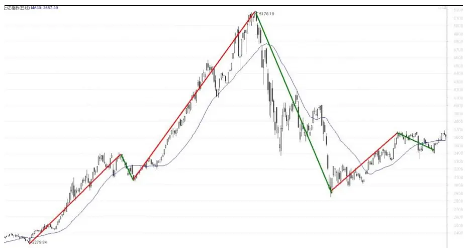
数据来源：国泰君安证券研究

对于一个上涨或者下跌波段拐点的确认，主要有以下两种情况：

第一种情况如图 2，C 点位置满足三个条件：①C 点位于均线之上；②从 B开始的行情创反弹以来的最高。③连续三个交易日的收盘价都在均线之上。因此 B是拐点得到确认：AB波段结束，BC波段形成。

图 2:波段当下形成确认之一
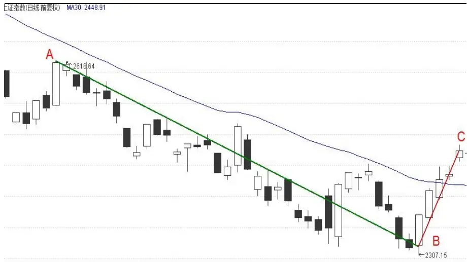
数据来源：国泰君安证券研究

第二种情况如图 3，C 点位置：①C 点位于均线之下；②从 B 开始的行情创下跌以来的最低。 ③只有一个交易日收盘价位于均线之下。不能确认 B点是拐点。

D 点位置：①D 点位于均线之下；②连续三个交易日收盘价位于均线之下。 ③ 不是 B开始的下跌行情以来的最低。不能确认 B点是拐点。

E点位置： 三个条件都满足，为下跌确认点，B点为拐点。

图 3:波段当下形成确认之二
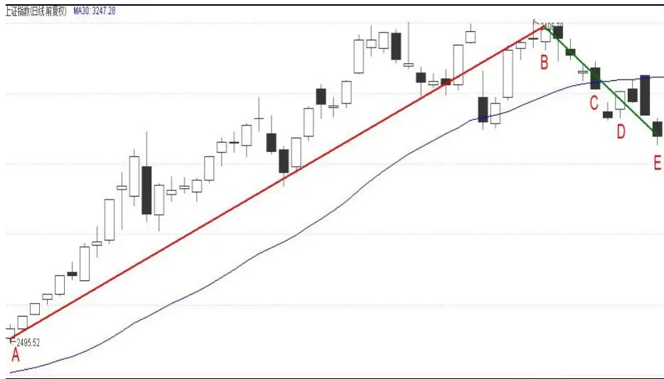
数据来源：国泰君安证券研究

## 2. 分段结构的统计规律（30 日均线）

本篇报告主要以 30 日均线对不同周期的价格进行分段，当然也可以用10、60 或者 120日等均线，不同均线代表的级别不一样，均线周期越长，对应上涨或下跌波段的级别越大（时间和空间）。30 日均线是技术分析中判断股票中期强弱的经典指标，以此作为波段划分具有较强参考意义，后面我们也会简单测试其他均线的划段方法，同样也能发现一些有意义的规律。

## 2.1.不同级别波段的持续时间和幅度

我们以 30 日均线对上证综指 2000 年 1 月-2016 年 3 月的日线和周线价格进行分段。其中周线级别上涨 10段，周线级别下跌 10段，日线级别上涨 51 段，日线级别下跌 50段。周线级别波段都是大趋势行情，对应了每一轮的牛市和熊市，日线级别波段的行情则更短，平均一年 1-2次，可操作的机会也更多。

图 4:上证综指周线波段划分（2000/1-2016/3）
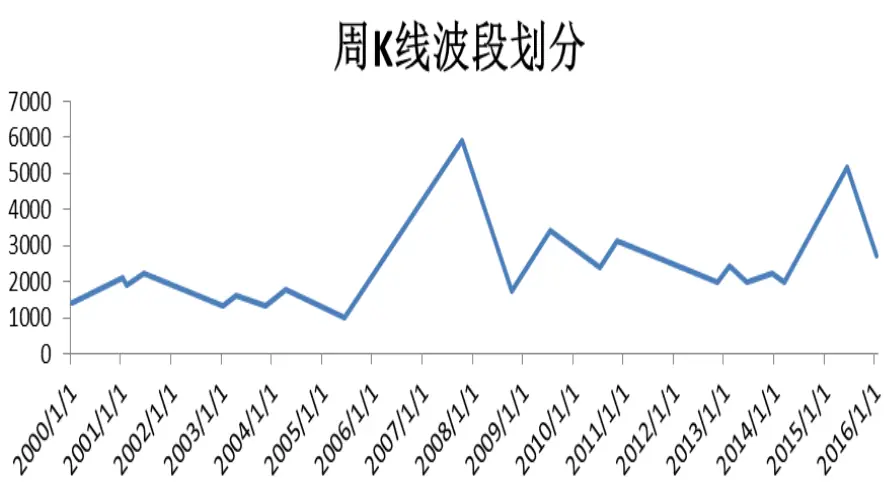
数据来源：国泰君安证券研究，wind

图 5:上证综指周线波段划分（2000/1-2016/3）
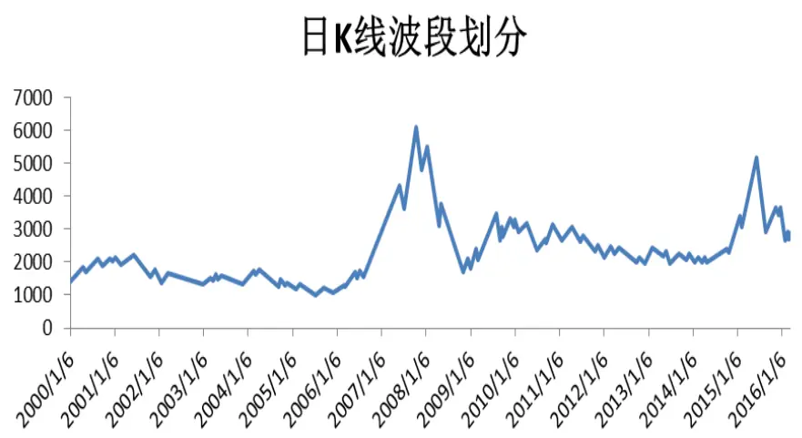
数据来源：国泰君安证券研究，wind

分别从持续时间和涨跌幅两个维度对周、日、30分钟和 5分钟的波段进行统计。

周线级别（包含上涨和下跌）平均持续时间 187个交易日，日线级别 37

个交易日，30分钟级别 4个交易日，5分钟级别 1个交易日。

周线级别（包含上涨和下跌）平均持续幅度 62%，日线级别 19%，30分钟级别 5%，5分钟级别 2%。

表 1:不同周期波段-持续时间

| 持续时间(交易日) 周 | 日 | 30 分钟 | 5分钟 |
| --- | --- | --- | --- |
| 平均 186.7 | 37.2 | 4.4 | 0.9 |
| 最长 | 573.0 193.0 | 35.3 | 8.8 |
| 最短 | 25.0 3.0 | 0.1 | 0.0 |

数据来源：国泰君安证券研究

表 2:不同周期波段-涨跌幅

| 涨跌幅（绝对值） | 周 | 日 | 30分钟 5分钟 |
| --- | --- | --- | --- |
| 平均 | 62.5% | 18.7% | 5.4% 2.2% |
| 最大 | 482.4% | 180.1% | 42.1% 25.8% |
| 最小 | 9.7% | 4.1% | 0.5% 0.0% |

数据来源：国泰君安证券研究

## 2.2.不同周期的对应关系

周线级别的一段上涨或下跌波段，如果放到日线级别上去观察，出现的段数往往更具有统计意义，以本轮牛市为例，上证综指 2004-5178 是 1段周线级别上涨，但在日线级别上走了 7段，高于 09年的小牛市（5段），仅次于 2006、2007年的大牛市（11段），因此从段数来看，本轮牛市在5100点走完7段结束的结构是完整充分的。

图 6:周线级别波段
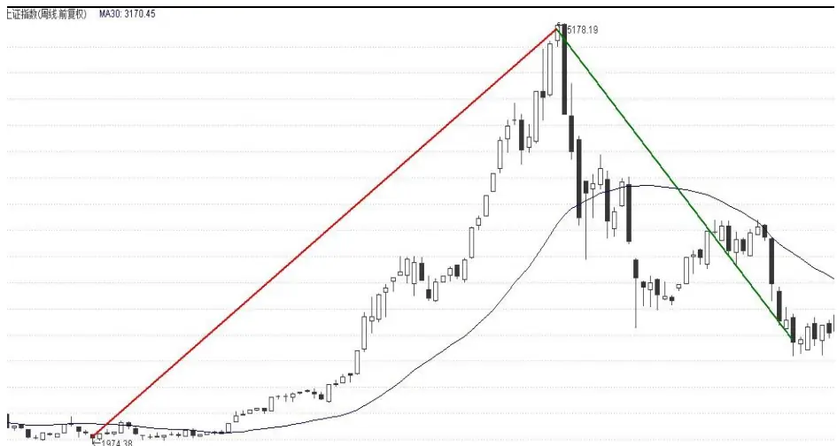
数据来源：国泰君安证券研究

图 7:日线级别波段
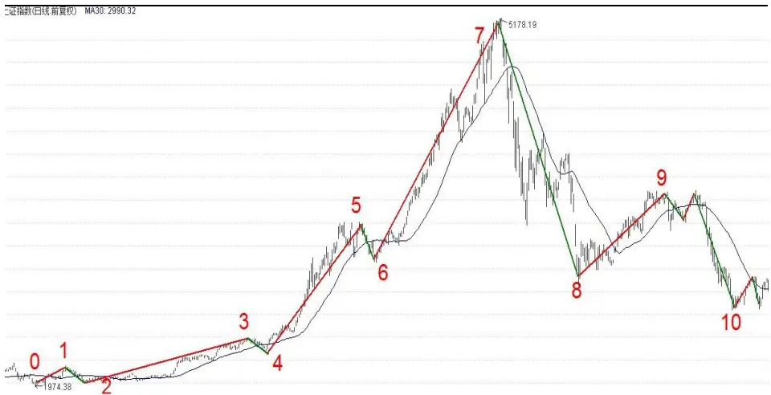
数据来源：国泰君安证券研究

具体来看，我们分别统计了上证综指周线级别对应日线级别段数、日线级别对应 30分钟级别段数和 30分钟对应 5分钟级别段数。

以下直方图统计显示，上证综指周线级别的一段上涨行情，对应日线出现过 1 段、3段、5段、7段、11段，主要集中在 3、5、7段，占比达到70%，1段和 11段都是比较极端的行情。周线级别的一段下跌行情则有所不同，对应日线 3 段和 5 段占比达到 80%，1 段只占 10%，因此一段周线级别上涨或下跌，日线上如果只走了一段大概率不会是顶部或者底部。

图 8:上证综指周线级别“上涨”对应日线级别段数 X概率密度
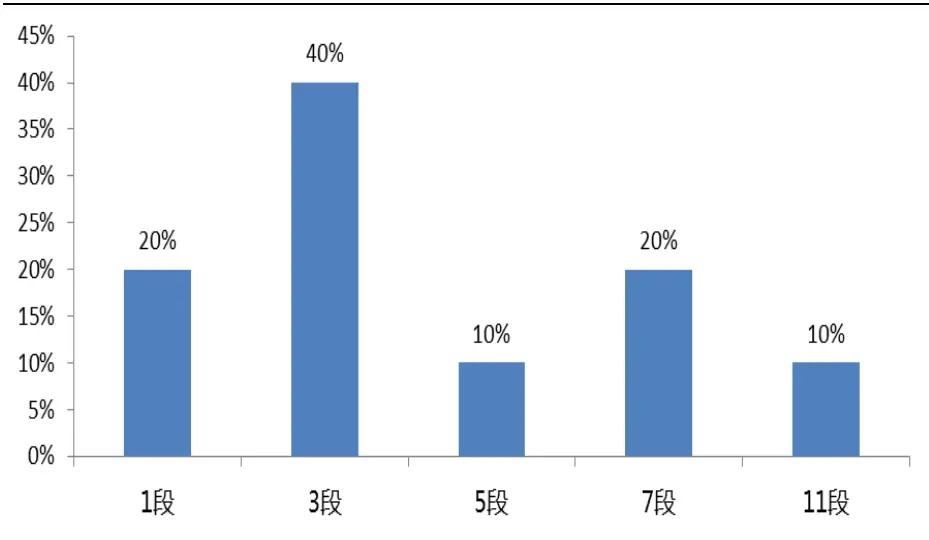
数据来源：国泰君安证券研究

图 9:上证综指周线级别“下跌”对应日线级别段数 X概率密度
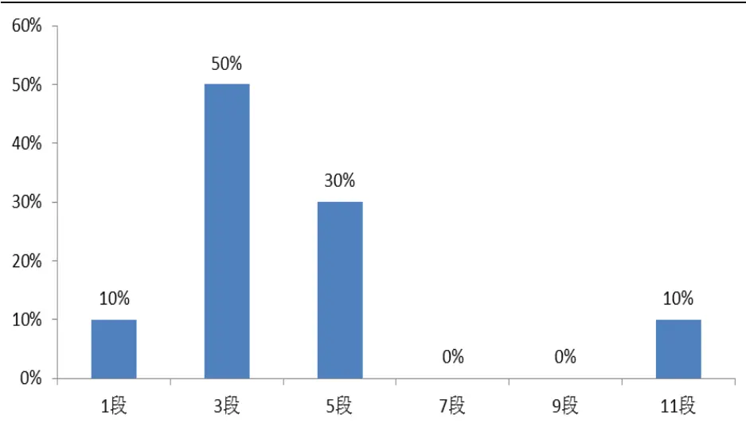
数据来源：国泰君安证券研究

上证综指日线级别上涨对应 30 分钟级别波段数的概率密度如下图，同样出现 3 段和 5 段的概率最高，1 段概率约为 12%，历史上最高出现过一次 29 段，发生在 2006-2007 年牛市，除此之外，超过 11 段的概率为18%。日线级别下跌波段对应 30分钟级别波段数的统计结果比较类似，最高走过 21 段，1 段概率约为 16%，超过 11 段的概率为 14%。因此一段日线级别上涨或下跌，30分钟上如果只走了一段大概率也不会是顶部或者底部。而在非大牛和非大熊的市场环境中，超过 9段、11段高段位的概率也比较小。

图 10:上证综指日线级别“上涨”对应 30 分钟级别段数 X概率密度
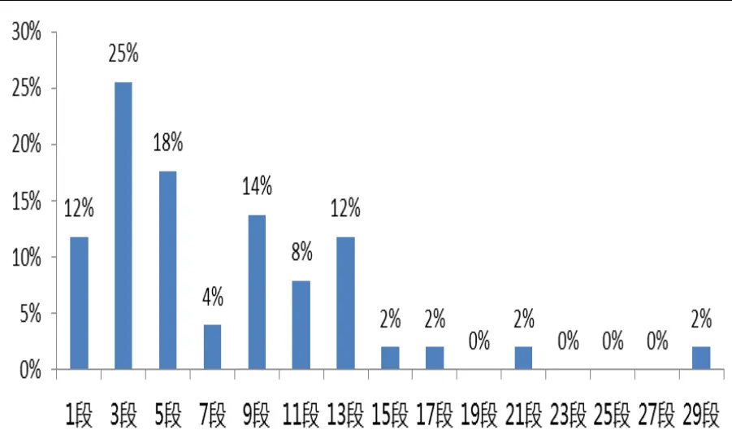
数据来源：国泰君安证券研究

图 11:上证综指日线级别“下跌”对应 30 分钟级别段数 X 概率密度
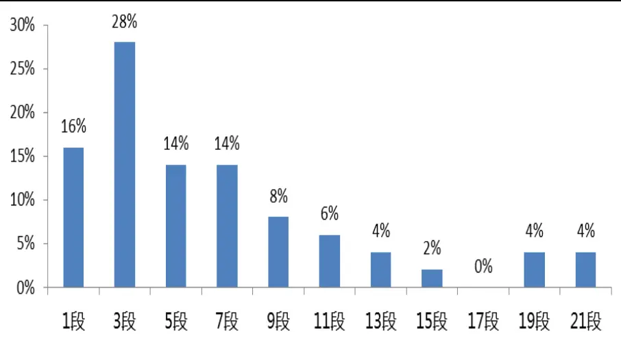
数据来源：国泰君安证券研究

上证综指 30 分钟级别波段对应 5 分钟级别段数的概率密度如下图，区别于周线和日线的波段结构，30分钟级别无论是上涨还是下跌在 5分钟走 1段的概率都非常高，达到 30%左右，概率密度随着段数越高单调递减，基本出现在 1、3、5、7段，超过 7段的概率不到 15%。

图 12:上证综指 30分钟级别“上涨”对应 5分钟级别段数 X 概率密度
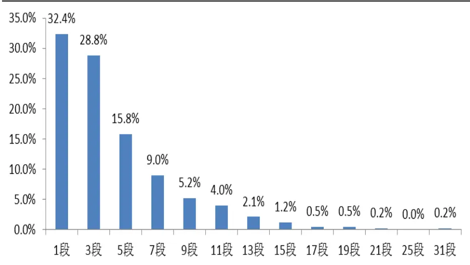
数据来源：国泰君安证券研究

图 13:上证综指 30分钟级别“下跌”对应 5分钟级别段数 X 概率密度
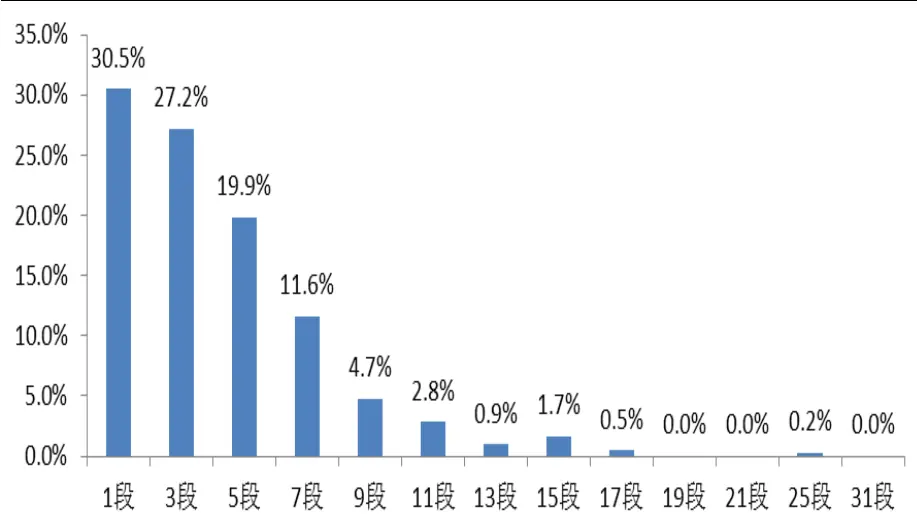
数据来源：国泰君安证券研究

## 3. 均线分段与 MACD 分段的异同

根据以上统计结果我们发现，均线分段和 MACD 分段的价格走势规律存在很多相似之处，对波段的分解殊途同归，通过两套分段体系相互验证，可以减少我们对市场认知的不确定性；除此之外，两者之间也存在一些不同点，在单独使用 MACD 分段无法对大盘走势判断时，均线分段可以加以辅助和补充，提高我们的择时准确度。

相同点不再赘述，接下来我们主要对两者之间存在的不同点进行了详细分析。

## 相同点：

1. 大级别的上涨或下跌，小级别只走 1 段的概率很小，出现 3 段、5段的结构较多

2. 大级别的上涨或下跌，小级别出现超过9段以上高段数的概率很小，一般发生在大牛市和大熊市。

3. 不同周期的走势图存在自相似性

## 不同点：

1. 上涨或下跌波段的确认时间和位置不同

2. 分段结构不同，对拐点的预测信号有所差别

3. 均线分段对上涨或下跌的突破和阻力点位有预判

## 3.1.波段形成的确认时间和位置不同

以 2013-2016 年的上证综指走势为例，不论是 MACD还是均线分段，都经历了 1段周线级别上涨和 1段周线级别下跌

## 3.1.1. MACD 分段：

周线级别上涨的起点在 2013年 6月 28日，对应点位 1979。

周线级别上涨的确认点在 2014年 8月 22 日，对应点位 2240。
周线级别下跌的确认点在 2015年 9月 30 日，对应点位 3052。

图 14: 基于 MACD的周线级别波段
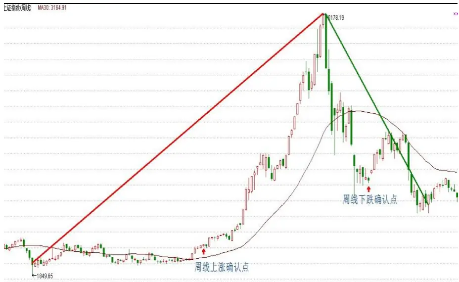
数据来源：国泰君安证券研究

## 3.1.2. 均线分段

周线级别上涨的起点在 2014年 3月 14日，对应点位 2004。
周线级别上涨的确认点在 2014年 8月 1日，对应点位 2185。
周线级别下跌的确认点在 2015年 9月 2日，对应点位 3160。

图 15: 基于均线的周线级别波段
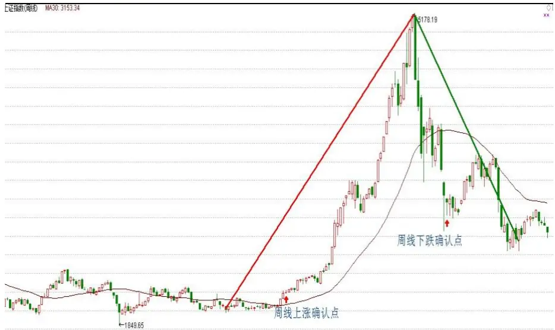
数据来源：国泰君安证券研究

均线分段对周线上涨的确认时间更早，领先 3周左右，有利于资金提前入场。如果以确认点作为买入信号，均线分段的建仓价格更低，相比于MACD 分段的确认点低 3%左右。

均线分段对周线下跌的确认时间更早，领先 4周左右，有利于资金提前离场，离场点位也比 MACD分段的确认点高 3%左右。

## 3.2. 分段结构不同

如果比较周线级别波段在日线以及日线级别波段在 30 分钟上的走势结构，两者之间也存在明显的差别。

## 3.2.1. MACD 分段：

根据 MACD 的分段方法，2000-5000点这波周线级别上涨对应日线级别走了 3 段，在此之前的历史周线上涨中日线段数分别为 5,5,3,1，数据样本较少，且出现过 2次 5段结构，因此日线出现 3段结构周线难言顶部。

图 16: 基于 MACD的周线级别上涨对应日线级别波段
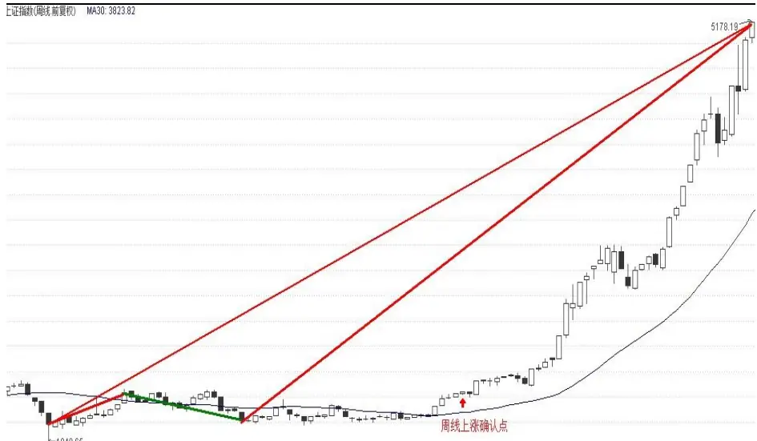
数据来源：国泰君安证券研究

第三段日线上涨开始于 2014年 3月 20日，终止于 2015年 6月 12日，持续时间较长，对应幅度基本涵盖了整个周线上涨幅度。这波日线上涨对应 30 分钟走了 21段，历史上只有 2006-2007年发生过一次。

由于日线级别“上涨”对应 30分钟级别出现 11段以上概率不超过 15%，因此仅仅使用历史的统计分布，大盘 2400之后的每次 30分钟级别上涨都有可能是顶部，难以预测。

此外，不同 30分钟级别的上涨或下跌差异较大，例如第 16段调整和第18段调整在时间和空间上就存在明显区别，16段调整时间非常短（3个交易日），幅度也很小（5%左右），在牛市中完全可以持仓不动，而第18段调整时间较长，幅度较大，可以选择适当减仓。因此如果将这些波段都归为 30分钟波段就不合理，难以确认合适的减仓和加仓点。

图 17: 基于 MACD的日线级别上涨对应 30分钟级别波段
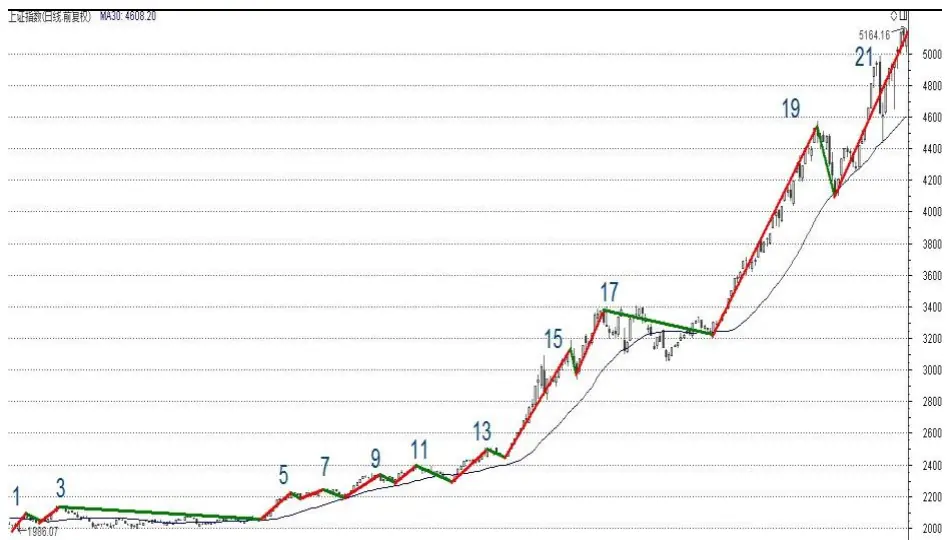
数据来源：国泰君安证券研究

## 3.2.2. 均线分段：

根据均线的分段方法，周线级别上涨对应日线级别走了 7 段，历史上 9次周线上涨只有 1次超过 7段（06年牛市 11段），因此本轮周线上涨在日线上结构合理充分，顶部特征明显。

相比于MACD分段将2000-5000点定义为2段日线上涨和1段日线下跌，均线分段将这段区间划分为 4段日线上涨和 3段日线下跌，波段分解更加细微，有利于我们观察这轮牛市走势。

例如第三段 2000-2400 的日线上涨对应了国泰君安策略团队提出的 400点大反弹，第五段 2200-3300 点的日线上涨拐点则对应了 2009年上证综指历史顶部，随后迎来的两次调整幅度也达到了 10%以上，是值得减仓的点位。

图 18: 基于均线的周线级别上涨对应日线级别波段
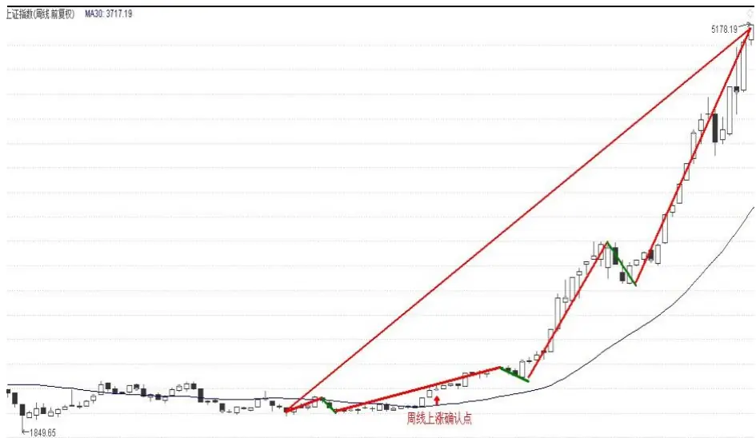
数据来源：国泰君安证券研究

通过观察日线级别上涨或下跌中 30 分钟级别的段数，我们也能对这几

次顶部和底部拐点有所预判。

## 2000-2400 日线上涨

2250 点走完第 9 段后，历史统计只有 25%继续上涨，75%概率跌破 30日线形成日线下跌；2350 点走完第 11 段后，历史统计只有 16%继续上涨，84%概率跌破 30日线形成日线下跌；2389点走后第 13段后，历史统计只有 8%继续上涨，92%概率跌破 30 日线形成日线下跌

30分钟级别走的段数越多，日线级别继续上涨的概率越小。本轮日线级别上涨在走完第 9 段后有回踩了 30 日均线，但没有跌破形成日线级别下跌，最终 30分钟级别走完第 13段结束，走势较强。但从操作角度，我们不应该去博小概率事件，9段之后应该逐步减仓。

图 19: 基于均线的日线级别上涨对应 30 分钟级别波段
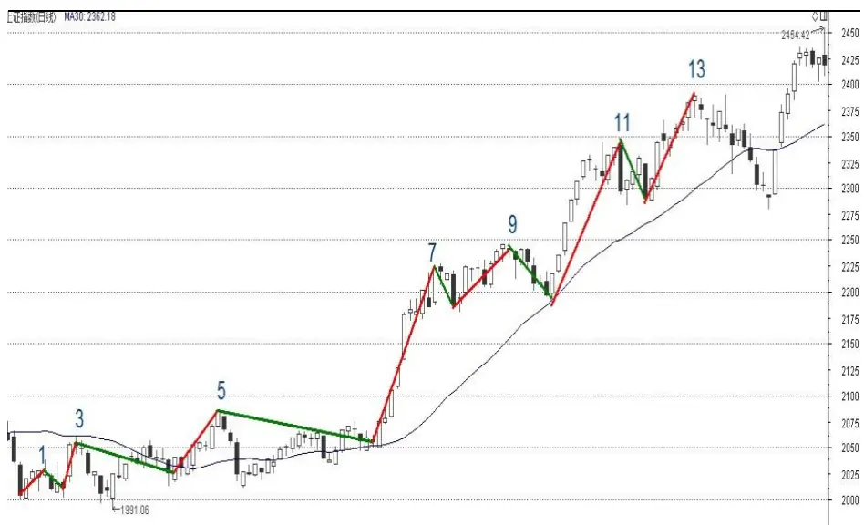
数据来源：国泰君安证券研究

## 2200-3300 日线上涨

3351点走完第 9段后，历史统计只有 25%概率继续上涨，75%概率跌破30日线形成日线下跌，尽管后续形成了第 11段和第 13段上涨，但幅度有限。因此，在非极端市场环境中，9段及以上都是减仓信号。

图 20: 基于均线的日线级别上涨对应 30 分钟级别波段
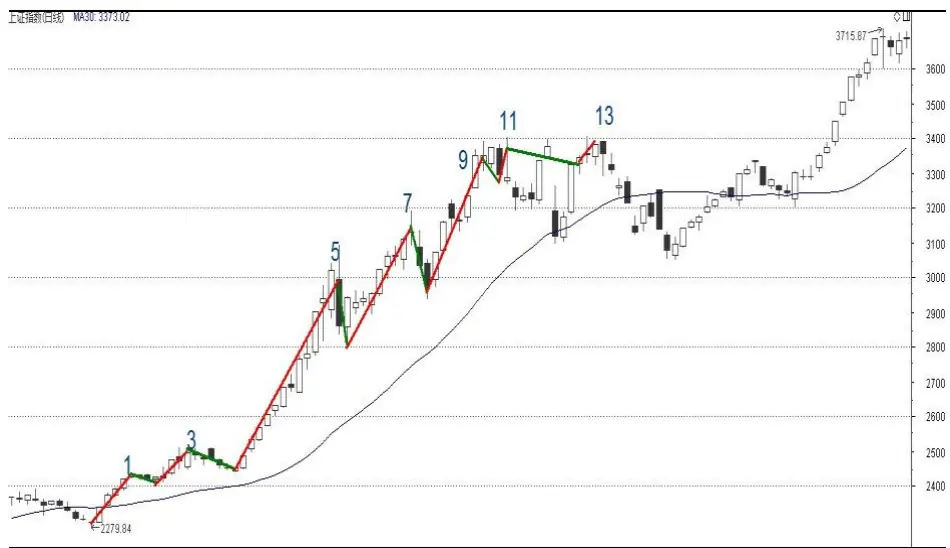
数据来源：国泰君安证券研究

## 3000-5100 日线上涨

5100 点走完第 9段后，历史统计只有 25%概率继续上涨，75%概率跌破30日线形成日线下跌。同时周线级别上涨在日线波段也已经走到第7段，历史统计只有 10%的概率继续新高。因此 5100点既是日线级别的顶部，同时也是周线级别的顶部。

图 21: 基于均线的日线级别上涨对应 30 分钟级别波段
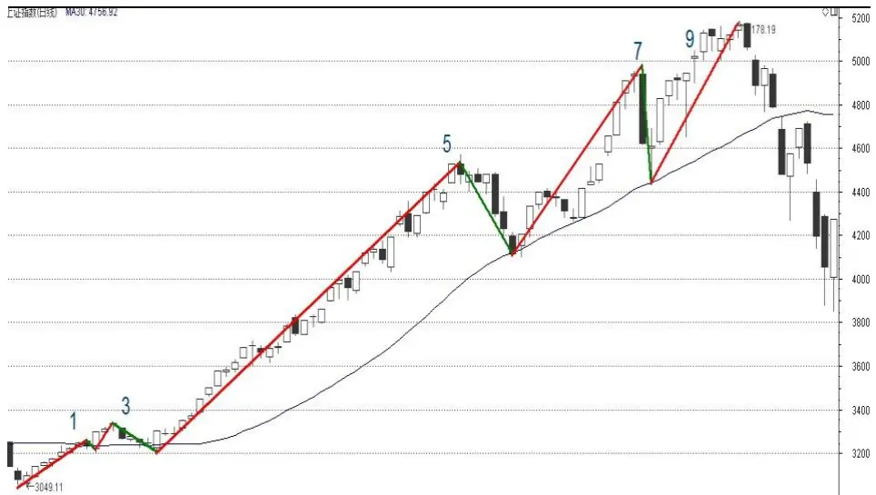
数据来源：国泰君安证券研究

## 5100-2850 日线下跌

根据均线分段，5100-3373在 30分钟级别走了 5段，成为日线下跌底部的概率是 57%，因此无法判断 3373是不是日线底点。而根据 MACD 分段，30 分钟级别走了 1 段，成为日线下跌底部的概率是 5%，我们可以判断 3373大概率必破，日线级别下跌仍将延续。

根据均线分段，5100-2850在 30分钟级别走了 7段，成为日线下跌底部的概率是 73%，最终 2850也确实是这波下跌的拐点。而根据 MACD 分段，30 分钟级别走了 3段，成为日线下跌底部的概率是 35%，无法判断

2850 是不是日线底点。

因此，在一些市场环境下， MACD 或者均线分段都会出现无法判断的情况，两者相结合可以提高我们择时胜率。

图 22: 基于均线的日线级别下跌对应 30 分钟级别波段
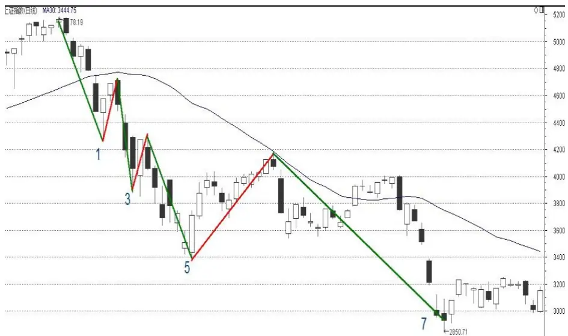
数据来源：国泰君安证券研究

## 2850-3600 日线上涨

2850-3600在 30分钟级别走了 9段，历史统计只有 25%概率上涨，75%概率跌破 30日线形成日线下跌，因此 3600具有日线级别顶部特征。事实上，从周 K线上去观测这段上涨，它是周线级别下跌的中的日线第 2浪反弹，历史统计周线下跌有 90%概率在日线上走 3浪以上，因此 3700点大概率无法有效站上。一旦突破 3700点意味着 5100-2850点的周线级别下跌结束，日线走了 1浪，这在过去 10 几年只发生过一次。

图 23: 基于均线的日线级别下跌对应 30 分钟级别波段
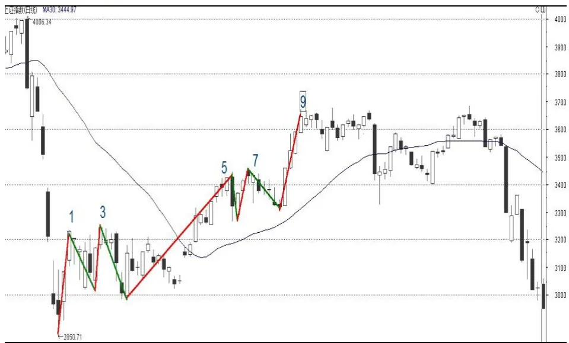
数据来源：国泰君安证券研究

## 3.3.点位的预判

均线价格分段的波段确认位置对应了 N 日均线的价格点位，这是在MACD 分段体系中所没有的，因此如果预判未来能形成上涨或下跌，那么我们可以估算出突破和跌破的目标点位，反之，这些位置则会成为阻力和支撑，在这些点位附近可能反转下跌或上涨。

我们仍然以 5100-2638 这段周线级别下跌为例，期间经历了 5100-2800的第一段日线下跌，之后迎来 2800-3600 点的第二段日线反弹，由于历史统计周线下跌有 90%概率在日线上走 3 浪及以上，因此大盘大概率无法突破 30周线形成周线反弹，对应阻力点位就是在 3700点附近，这也从另外一个维度解释了为什么这段日线上涨在这个位置见顶。

图 24: 基于均线的日线级别下跌对应 30 分钟级别波段
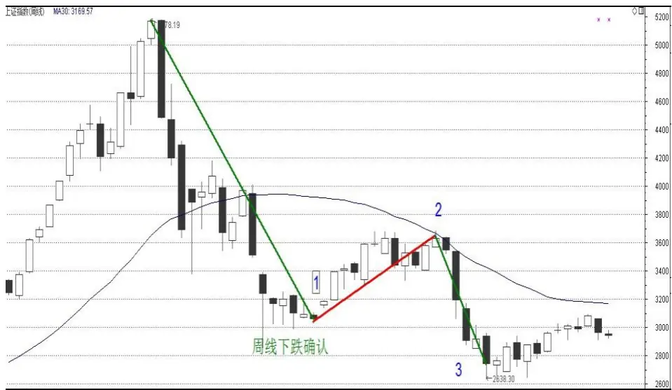
数据来源：国泰君安证券研究

在此前的波段划分中我们主要用了 30 日均线，事实上同样也能用 10、20、60 等其他均线对价格上涨或者下跌的突破和阻力点位预测，通过10日均线的分段方法，5100-3300这段日线下跌在 30分钟上走了 7段，成为日线级别底部的概率是 73%，因此尽管我们无法判断大盘能否突破30 日均线形成日线上涨，但能够判断大盘接近 10 日均线的日线底部，即将突破 10日均线形成日线反弹，对应突破点位 3900-4000。

图 25:10日均线划段
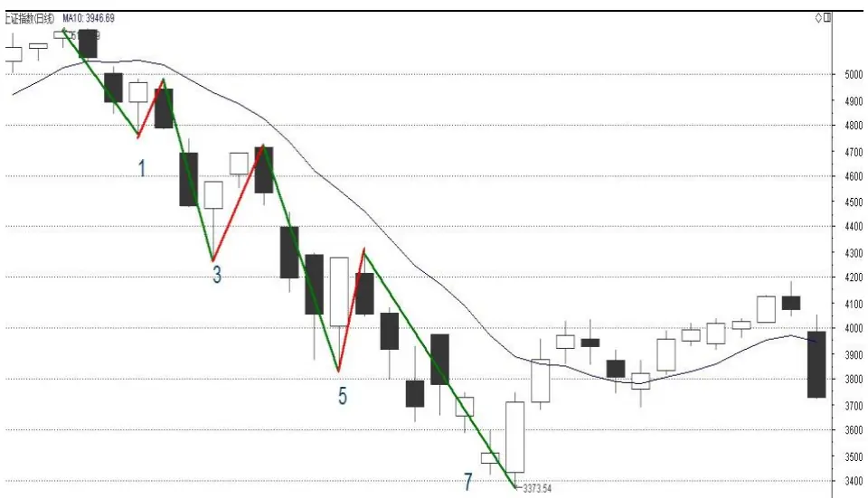
数据来源：国泰君安证券研究

通过 50日均线的分段方法，5100-3300这段日线下跌在 30分钟上走了 1段，成为日线级别底部的概率是 8%，因此我们可以判断后续即使有 30分钟级别反弹，也很难突破 50 日均线形成日线反弹，对应阻力点位4200-4300。

图 26:50日均线划段
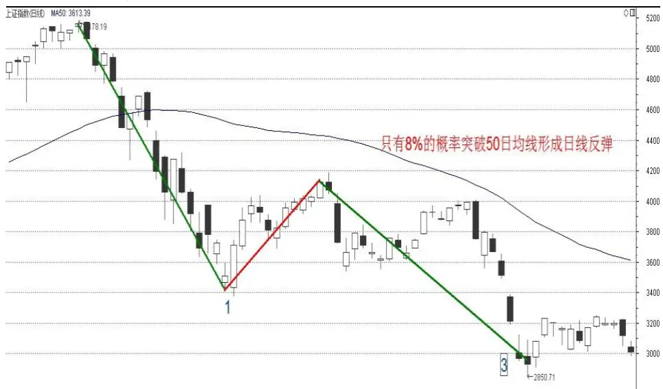
数据来源：国泰君安证券研究

## 4. 均线价格分段应用举例

结合历史统计规律，基于均线的分段方法能够根据当前价格走势的结构对顶部和底部拐点进行概率预判，在上文中，我们对此作了详细介绍，这也是其最基本的择时应用之一。除此之外，均线分段体系也能应用于其他方面，同时构建投资交易策略。

## 4.1.波段的延续

一个波段上涨或下跌在确认之后，往往存在一定的延续性，延续性体现在两个方面：空间和时间，我们对时间和空间的延续性定义如下。

空间的延续：波段终点距离波段形成的确认点空间大于 0.5%。

时间的延续：波段终点距离波段形成的确认点时间大于 3个周期。

我们分别统计了四个周期波段的延续概率：从空间维度上，周线、日线和 30 分钟的波段延续度较高，达到 70%以上，5分钟的波段延续度较低，只有 50%左右；从时间维度上，周线、日线、30分钟和 5分钟的波段延续度较高，达到 70%以上。

表 3: 空间的延续

| 周期 | 类型 | 样本数 | 均值 | 最大值 | 最小值 | 无延续波段数 | 占比 |
| --- | --- | --- | --- | --- | --- | --- | --- |
| 周线 | 上涨 | 10 | 61% | 396% | 0% | 1 | 10% |
|  | 下跌 | 9 | -20% | -60% | 0% | 1 | 10% |
| 日线 | 上涨 | 50 | 13% | 163% | 0% | 6 | 12% |
|  | 下跌 | 50 | -8% | -49% | 0% | 13 | 26% |
| 30分钟 | 上涨 | 423 | 3% | 38% | 0% | 145 | 34% |
|  | 下跌 | 422 | -3% | -25% | 0% | 127 | 30% |
| 5分钟 | 上涨 | 2187 | 1% | 21% | 0% | 1070 | 49% |
|  | 下跌 | 2186 | -1% | -17% | 0% | 1067 | 49% |

数据来源：国泰君安证券研究

表 4: 空间的延续

| 周期 | 类型 | 样本数 | 均值 | 最大值 | 最小值 | 无延续波段数 | 占比 |
| --- | --- | --- | --- | --- | --- | --- | --- |
| 周线 | 上涨 | 10 | 21 | 102 | 0 | 3 | 30% |
|  | 下跌 | 9 | 9 | 76 | 0 | 2 | 23% |
| 日线 | 上涨 | 50 | 28 | 177 | 0 | 6 | 12% |
|  | 下跌 | 49 | 25 | 102 | 0 | 15 | 31% |
| 30分钟 | 上涨 | 423 | 25 | 266 | 0 | 118 | 28% |
|  | 下跌 | 422 | 21 | 168 | 0 | 133 | 32% |
| 5分钟 | 上涨 | 2187 | 28 | 304 | 0 | 731 | 33% |
|  | 下跌 | 2186 | 25 | 326 | 0 | 720 | 33% |

数据来源：国泰君安证券研究

综合以上分析，日线上涨波段延续概率较高，可以在上涨确认点建仓买入，日线下跌波段延续概率较高，可以在下跌确认点清仓卖出。其本质类似于单均线突破的趋势策略，回撤和波动较大，但长期能获得超额收益率。

分别以 10、20、30 和 60 日均线波段的确认点作为买卖信号，从 2002年至今多头能获得 300%以上的累计收益，2倍于上证综指；多空能获得800%以上的累计收益，年化收益率 20%以上。其中 20和 30日均线的效果较好。

通过以上策略我们发现，日线上涨的确认点都是比较好的买点，几波牛市的涨幅都能抓住，但下跌确认点作为卖点则波动和回撤较大，因此从一定程度上说明了卖点比买点更加重要，不用执着于买在最低点，只需跟随趋势。

图 27: 趋势延续策略（多头）
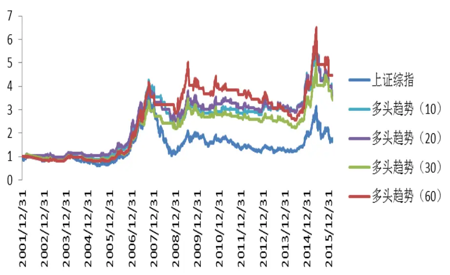
数据来源：国泰君安证券研究

图 28: 趋势延续策略（多空）
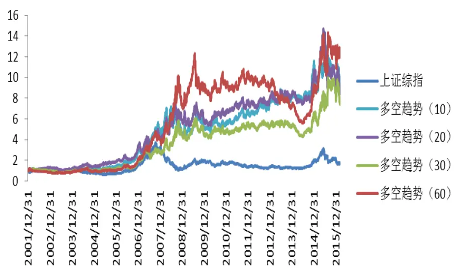
数据来源：国泰君安证券研究

## 4.2.三周期联立

在上文中，我们统计了双周期联立下的波段概率统计，例如日线级别上涨或下跌对应 30 分钟级别的段数，但却并没有考虑周线级别的状态，周线级别往往代表一种大势，周线级别上涨代表了牛市，周线级别下跌代表代表了熊市。

如果把周线、日线和 30 分钟三周期联立，波段数的统计概率也发生了变化。针对这些规律，我们也能总结出对应的交易操作思路。

周线上涨-日线上涨-30 分钟段数，即牛市中的日线上涨，30 分钟大于 1段的概率 96%，大于 3 段的概率是 77%，因此 2、4 浪都是买点。具体可参考图 20和图 21这两段日线上涨。

图 29:周线上涨-日线上涨-30分钟段数
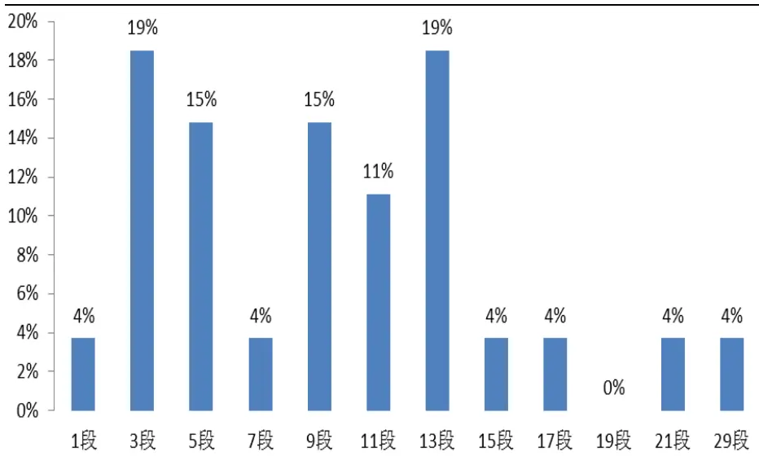
数据来源：国泰君安证券研究

周线上涨-日线下跌-30 分钟段数，即牛市中的日线调整，30 分钟小于 5段的概率 77%，所以牛市中的调整很短，走 3段即可加仓买入。

图 30:周线下跌-日线上涨-30分钟段数
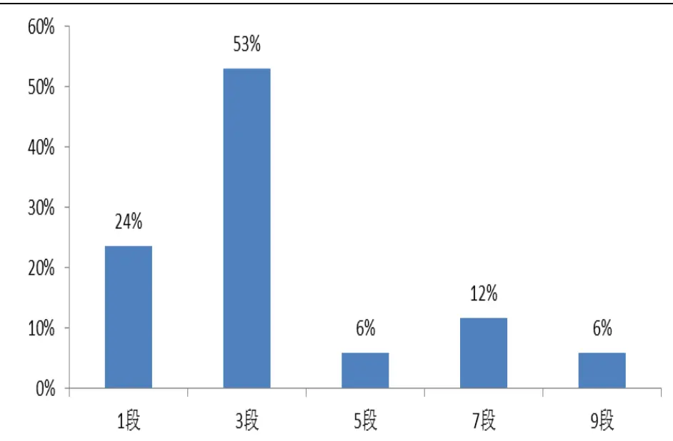
数据来源：国泰君安证券研究

周线下跌中的日线下跌，即熊市中的日线下跌，大于 1段的概率 91%，大于 3 段的概率是 75%，因此 2、4浪都是卖点。

图 31:周线下跌-日线下跌-30分钟段数
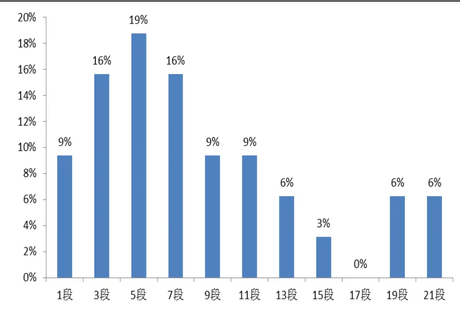
数据来源：国泰君安证券研究

周线下跌中的日线上涨，即熊市中的日线反弹，小于 7段的概率 73%，熊市中的反弹都很弱，很少能走出高段数，5段以上是见顶信号。

图 32:周线下跌-日线上涨-30分钟段数
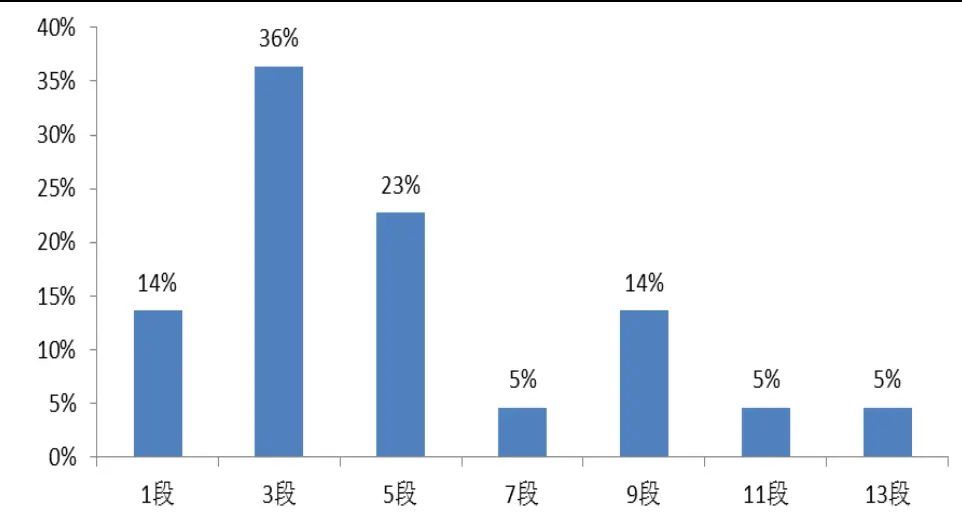
数据来源：国泰君安证券研究

## 4.3.均线系统择时

不同均线代表了不同级别的走势，价格在 10日线之上和在 30日线之上代表的意义不同，10 日线代表了短期走势，30 日线代表了中期走势，60日线代表了长期走势，因此根据均线系统的分段走势结构，我们可以判断出任何点位在短期、中期和长期的延伸 or反转概率。

举例来说，图 33中上证综指的 A点位于 10日均线、30均线和 60日均线的日线级别下跌中；在 10日均线分段中，其在 30分钟级别走过 7段，成为底部的概率 72%；在 30日均线分段中，其在 30分钟级别走过 5段，成为底部的概率 58%；在 60日均线分段中，其在 30分钟级别走过 1段，成为底部概率 16%。因此，我们可以得出结论，A点短期看多，反弹能突破 10 日均线，中期涨跌概率各半，长期看空，突破不了 60日均线。

上证综指的 B点位于 10日均线和 30均线日线级别上涨中，60日均线的日线级别下跌中；在 10日均线分段中，其在 30分钟级别走过 11段，成为顶部的概率 83%；在 30日均线分段中，其在 30分钟级别走过 7段，成为顶部的概率 58%；在 60日均线分段中，其在 30分钟级别走过 1段，成为底部概率 44%。因此，我们可以得出结论，B点短期看空，调整能跌破 10 日均线，中期和长期涨跌概率各半。

上证综指的 C点位于 10日均线、30日均线和 60日均线的日线级别上涨中；在 10日均线分段中，其在 30分钟级别走过 3段，成为顶部的概率30%；在 30 日均线分段中，其在 30 分钟级别走过 9 段，成为顶部的概率 73%；在 60日均线分段中，其在 30分钟级别走过 9段，成为底部概率 80%。因此，我们得出结论，C点短期看多，中期和长期有调整会跌破 30 和 60日均线。

上证综指 A、B、C 点后续的走势也基本验证了我们的判断，因此投资者可以根据不同周期级别的上涨和下跌选择减仓、加仓、清仓还是满仓。

图 33:周线下跌-日线上涨-30分钟段数
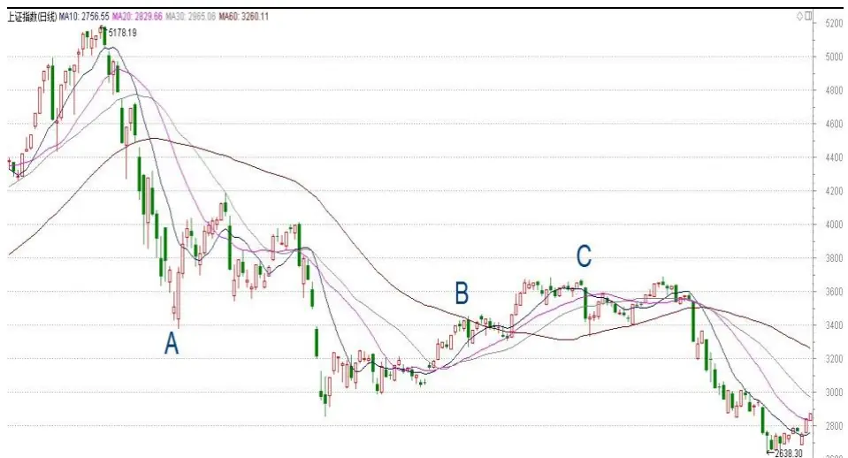
数据来源：国泰君安证券研究

表 5: 均线系统下的趋势反转概率

| 位置 | 10 | 30 | 60 |
| --- | --- | --- | --- |
| A | 72% | 58% | 16% |
| B | 83% | 58% | 44% |
| C | 30% | 73% | 80% |

数据来源：国泰君安证券研究

## 5. 结论和研究展望

本篇报告主要从均线的新视角对价格走势进行了波段分解，通过观察历史不用周期的价格序列结构，可以对拐点做出概率预判。相比于 MACD的分段方法，均线分段方法有优点也有不足，优点在于对上涨或下跌的确认更快，能够对突破和阻力点位预判等，不足在于分段结构没有MACD 分段方法稳定，DEA 指标进行过二次平滑，所以不会频繁穿越零轴，而价格则有可能短期围绕均线多次波动。

当然并不是任何时点对市场走势都能准确把握，比如日线上涨或者下跌在 30 分钟级别出现了 3 段，这时候我们就比较难以判断 30 分钟是走出 5段还是3段结束了，这个后续可能需要结合趋势的背离等指标。

基于均线的分段方法可以应用于任何价格趋势，未来我们将研究不同行业和个股的价格走势结构，通过分段方法可以筛选出强势回调和触底反转概率高的个股。

## 本公司具有中国证监会核准的证券投资咨询业务资格

## 分析师声明

作者具有中国证券业协会授予的证券投资咨询执业资格或相当的专业胜任能力，保证报告所采用的数据均来自合规渠道，分析逻辑基于作者的职业理解，本报告清晰准确地反映了作者的研究观点，力求独立、客观和公正，结论不受任何第三方的授意或影响，特此声明。

## 免责声明

本报告仅供国泰君安证券股份有限公司（以下简称“本公司”）的客户使用。本公司不会因接收人收到本报告而视其为本公司的当然客户。本报告仅在相关法律许可的情况下发放，并仅为提供信息而发放，概不构成任何广告。

本报告的信息来源于已公开的资料，本公司对该等信息的准确性、完整性或可靠性不作任何保证。本报告所载的资料、意见及推测仅反映本公司于发布本报告当日的判断，本报告所指的证券或投资标的的价格、价值及投资收入可升可跌。过往表现不应作为日后的表现依据。在不同时期，本公司可发出与本报告所载资料、意见及推测不一致的报告。本公司不保证本报告所含信息保持在最新状态。同时，本公司对本报告所含信息可在不发出通知的情形下做出修改，投资者应当自行关注相应的更新或修改。

本报告中所指的投资及服务可能不适合个别客户，不构成客户私人咨询建议。在任何情况下，本报告中的信息或所表述的意见均不构成对任何人的投资建议。在任何情况下，本公司、本公司员工或者关联机构不承诺投资者一定获利，不与投资者分享投资收益，也不对任何人因使用本报告中的任何内容所引致的任何损失负任何责任。投资者务必注意，其据此做出的任何投资决策与本公司、本公司员工或者关联机构无关。

本公司利用信息隔离墙控制内部一个或多个领域、部门或关联机构之间的信息流动。因此，投资者应注意，在法律许可的情况下，本公司及其所属关联机构可能会持有报告中提到的公司所发行的证券或期权并进行证券或期权交易，也可能为这些公司提供或者争取提供投资银行、财务顾问或者金融产品等相关服务。在法律许可的情况下，本公司的员工可能担任本报告所提到的公司的董事。

市场有风险，投资需谨慎。投资者不应将本报告作为作出投资决策的唯一参考因素，亦不应认为本报告可以取代自己的判断。
在决定投资前，如有需要，投资者务必向专业人士咨询并谨慎决策。

本报告版权仅为本公司所有，未经书面许可，任何机构和个人不得以任何形式翻版、复制、发表或引用。如征得本公司同意进行引用、刊发的，需在允许的范围内使用，并注明出处为“国泰君安证券研究”，且不得对本报告进行任何有悖原意的引用、删节和修改。

若本公司以外的其他机构（以下简称“该机构”）发送本报告，则由该机构独自为此发送行为负责。通过此途径获得本报告的投资者应自行联系该机构以要求获悉更详细信息或进而交易本报告中提及的证券。本报告不构成本公司向该机构之客户提供的投资建议，本公司、本公司员工或者关联机构亦不为该机构之客户因使用本报告或报告所载内容引起的任何损失承担任何责任。

## 评级说明

## 1.投资建议的比较标准

投资评级分为股票评级和行业评级。

以报告发布后的12个月内的市场表现为比较标准，报告发布日后的12个月内的公司股价（或行业指数）的涨跌幅相对同期的沪深300指数涨跌幅为基准。

## 2.投资建议的评级标准

报告发布日后的 12 个月内的公司股价（或行业指数）的涨跌幅相对同期的沪深300指数的涨跌幅。

|  | 评级 说明 |  |
| --- | --- | --- |
| 股票投资评级 | 增持 | 相对沪深 300指数涨幅15%以上 |
|  | 谨慎增持 | 相对沪深300指数涨幅介于5%～15%之间 |
|  | 中性 | 相对沪深300指数涨幅介于-5%～5% |
|  | 减持 | 相对沪深300指数下跌5%以上 |
| 行业投资评级 | 增持 | 明显强于沪深 300 指数 |
|  | 中性 | 基本与沪深300指数持平 |
|  | 减持 | 明显弱于沪深 300指数 |

## 国泰君安证券研究

|  | 上海 | 深圳 | 北京 |
| --- | --- | --- | --- |
| 地址 | 上海市浦东新区银城中路168号上海 银行大厦29层 | 深圳市福田区益田路6009号新世界 商务中心34层 | 北京市西城区金融大街28号盈泰中 心2号楼10层 |
| 邮编 | 200120 | 518026 | 100140 |
| 电话 | (021)38676666 | (0755)23976888 | (010)59312799 |
| E-mail: gtjaresearch@gtjas.com |  |  |  |