nInfo] [Table_Title] 2016.06.23

# 基于奇异谱分析的均线择时研究

## ——数量化专题之七十五

玉刘富兵（分析师）

8 021-38676673

liufubing008481@gtjas.com

证书编号 S0880511010017

## 本报告导读：

奇异谱分析提取的趋势线单点构成项更丰富、权重时变，其相对移动平均线受异常值影响更小，并且其末端点在上涨中对回调敏感性更强，下跌中对反弹更谨慎。

## 摘要：

le_Summary]利用奇异谱分析提取得到的趋势线与移动平均线相比从趋势刻画的角度上有无延迟，更平滑的特点，对异常值能更有效过滤。从趋势末端的角度看，时变的权重使得其上涨中对回调敏感性更强，下跌中对反弹更谨慎，且整体波动幅度更大。结合此特点，对于同样的价格与 5 日均线穿越策略在2005 年 1 月到 2016 年 4 月期间，利用奇异谱分析相对于利用移动平均线策略收益提高 142.3%，最大回撤减少9.71%。

报告利用奇异谱分析的特点构造了多趋势线的奇异谱分析系统，其趋势线数量和趋势线窗口参数选择是其重要变量。通过对两者的考察得出对于沪深 300指数，最佳窗口参数为30，最佳趋势线数量为3条。单趋势线由于考察周期单一，在震荡市中容易有较大亏损，随着趋势线数量的增加，信号得到有效过滤，稳定性增强，策略效果得到较大提升，但是趋势线过多容易导致系统考察的趋势周期长度过密，无法较有效的统一判断，导致策略效果削弱。由于价格必然先于趋势线变动，由拐点处浮盈收窄造成的日净值曲线回撤难以避免，以 10,30,50为窗口参数的3 趋势线策略在2005年1月到 2016 年 4 月期间最终净值 4095.31%，年化收益率 38.89%，最大回撤-30.69%，夏普比率 0.80，月胜率 59.56%。

- 奇异谱分析均线择时策略是对传统移动平均线择时策略的补充和增强，具有高收益低成本，信号简单直观，无参数拟合的特点。

金融工程

## 金融工程团队：

刘富兵：（分析师）

电话：021-38676673

邮箱：liufubing008481@gtjas.com

证书编号：S0880511010017

刘正捷：（分析师）

电话：0755-23976803

邮箱：liuzhengjie012509@gtjas.com

证书编号：S0880514070010

李辰：（分析师）

电话：021-38677309

邮箱：lichen@gtjas.com

证书编号：S0880516050003

## 陈奥林：（研究助理）

电话：021-38674835

邮箱：chenaolin@gtjas.com

证书编号：S0880114110077

王浩：（研究助理）

电话：021-38676434

邮箱：wanghao014399@gtjas.com

证书编号：S0880114080041

孟繁雪：（研究助理）

电话：021-38675860

邮箱：mengfanxue@gtjas.com

证书编号：S088011604008

## [Table_R相关报告

《价格走势观察之基于均线的分段方法》2016.05.31

《事件驱动策略的因子化特征》2016.05.27

《基于微观市场结构的择时策略》2016.05.19

《融资融券标的调整事件研究》2016.05.17

《2016年6月沪深300指数成份股调整预测》2016.05.13

## 1. 价格序列趋势的刻画

## 1.1. 移动平均线

道氏理论以平均成本概念为理论基础，建立了用移动平均线（MovingAverage，MA）刻画价格趋势的方法。移动平均线对移动窗口内的数据求平均值，从统计上来说是比较移动窗口间整体差异最简单的方法。它在一定程度上消除了随机噪声的影响，是技术分析的基本分析工具。

$$
MA_{n}(T)=\frac{\sum_{i=1}^{n}p_{T-i+1}}{n}
$$

但是 MA刻画趋势有其难以避免的缺陷，虽然求平均的过程可以减少非趋势噪声的影响，但是短窗口的 MA是固定个数序列值的简单平均，受到异常值影响大，曲线不够平滑；长窗口的 MA虽然可以一定程度上抹平异常值的影响，克服不够平滑的问题，但是对趋势刻画的延迟随着窗口参数的增加而增加，不能实时反映趋势变化。

## 1.2. 奇异谱分析

为了寻找一种能够改善上述问题的趋势刻画工具，本报告提出奇异谱分析（Singular Spectrum Analysis，SSA）方法。简而言之，SSA 能够提取移动窗口之间最主要的差异作为特征并忽略其他信息，从而最大化信噪比。利用此特征刻画的价格序列趋势相对 MA更平滑，且无延迟。

从数学的角度来说 SSA 即在移动窗口矩阵的奇异值分解中寻找最大奇异值对应的特征向量，使得所有移动窗口样本序列在这个特征向量上的映射方差最大，也即区别这些移动窗口样本序列的最大特征。这个特征向量代表的方向也称为第一主成分方向，具体的构造方式分 4步：

分解序列并构建移动窗口矩阵 → 对其进行奇异值分解 → 将移动窗口矩阵映射到第一主成分方向 → 利用对角平均重构序列

具体的，对于时间序 $\mathrm{列}\mathbf{y}=(y_1,\ldots,y_t)$ ，令 $\mathrm{{~\cdot}n=t-m+1}$ ， 为窗口长度，并限制 $\mathfrak{m}\leq\mathfrak{t}/2$ （一般取 $\mathrm{t}=2\mathrm{m},$ ,使得矩阵在列满秩的情况下尽量小，因为若 t取的过长，不仅计算速度变慢，趋势线灵敏度也会下降）。我们定义 $\mathrm{{.n\times m}}$ 阶的移动窗口矩阵为：

$$
\mathcal{H}=\begin{pmatrix}y_{1}&y_{2}&y_{3}&\cdots&y_{m}\\y_{2}&y_{3}&y_{4}&\cdots&y_{m+1}\\y_{3}&y_{4}&y_{5}&\cdots&\vdots\\\vdots&\vdots&\vdots&\ddots&y_{t-1}\\y_{n}&y_{n+1}&y_{n+2}&\cdots&y_{t}\end{pmatrix}
$$

之后对其协方差矩阵 $\mathcal{C}=\mathcal{H}^{\intercal}\mathcal{H}$ ，进行奇异值分解 $\mathcal{C}=V\Lambda V^{\intercal}$ ，并选取前k 个主成分：

$$
\mathcal{P}_{k}=\mathcal{H}V_{k}
$$

这里的 $V_{k}$ 由 $\mathcal{C}$ 的前 个特征向量构成。定义重构矩阵 $\widehat{\mathcal{H}}_{1}$ 如下：

$$
\widehat{\mathcal{H}}=\mathcal{P}_{k}{V_{k}}^{\intercal}
$$

如果我们选取全部的主成分（ ），那么 $\widehat{\mathcal{H}}=\mathcal{H}$ 。现在我们选取个主成分（一般取 k=1），则噪音部分将被忽略，留下时间序列的主要趋势信息。通过对角平均处理，我们将还原出经过平滑处理的时间序列：

$$
\widehat{y_{p}}=\frac{1}{\alpha_{p}}\sum_{j=1}^{m}\widehat{\mathcal{H}}^{(i,j)},
$$

其中 $\mathrm{i}=\mathrm{p}-\mathrm{j}+1,0<\mathrm{i}<\mathrm{n}+1$ $\alpha_{p}$ 的定义如下：

$$
\alpha_{p}=\left\{\begin{matrix}p&ifp<m\\t-p+1&ifp>t-m+1\\m&otherwise\end{matrix}\right.
$$

经过奇异谱分析的时间序列按照窗口长度 m不同，考察的趋势周期不同，同MA一样，短窗口SSA考察短期趋势，长窗口SSA考察长期趋势。

图 1 SSA分解得到的各个主成分
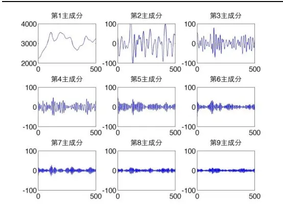
数据来源：国泰君安证券研究

图 2 不同窗口长度 m 下的 SSA
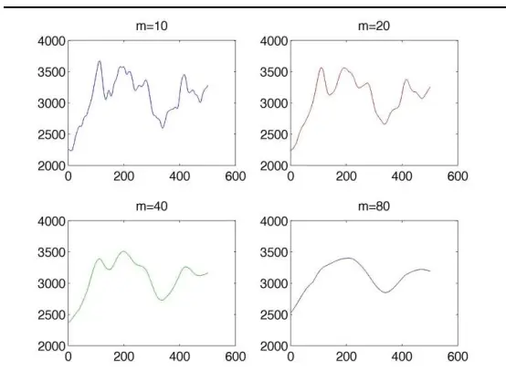
数据来源：国泰君安证券研究

SSA仅考虑时间序列自相关结构（主要是对移动窗口矩阵的协方差阵求奇异值分解），对数据本身没有先验的假设（相对传统时间序列分析如AR、ARIMA 等，不需要预设统计模型），参数唯一，与 MA 一样仅有一个窗口参数，不存在参数拟合的问题。

## 1.3.奇异谱分析与移动平均线比较

奇异谱分析和移动平均一样都是线性平滑工具，其特点最终体现在趋势线中价格序列各项所占的权重。以窗口参数为 3的 SSA为例，假设有价格序列 $[x_{1},x_{2},x_{3},x_{4},x_{5}]$ ，对应移动窗口矩阵如下：

$$
\mathcal{H}=\begin{bmatrix}x_{1}&x_{2}&x_{3}\\x_{2}&x_{3}&x_{4}\\x_{3}&x_{4}&x_{5}\end{bmatrix}
$$

假设对其协方差阵奇异值分解得到的第一主成分方向为 $[a_{1}\quad a_{2}\quad a_{3}]^{T}$ 则重构矩阵 为：

$$
\begin{aligned}\widehat{\mathcal{H}}=&\begin{bmatrix}x_{1}&x_{2}&x_{3}\\x_{2}&x_{3}&x_{4}\\x_{3}&x_{4}&x_{5}\end{bmatrix}\begin{bmatrix}a_{1}\\a_{2}\\a_{3}\end{bmatrix}[a_{1}\quad a_{2}\quad a_{3}]\\=&\begin{bmatrix}a_{1}^{2}x_{1}+a_{1}a_{2}x_{2}+a_{1}a_{3}x_{3}&a_{1}a_{2}x_{1}+a_{2}^{2}x_{2}+a_{2}a_{3}x_{3}&a_{1}a_{3}x_{1}+a_{2}a_{3}x_{2}+a_{3}^{2}x_{3}\\a_{1}^{2}x_{2}+a_{1}a_{2}x_{3}+a_{1}a_{3}x_{4}&a_{1}a_{2}x_{2}+a_{2}^{2}x_{3}+a_{2}a_{3}x_{4}&a_{1}a_{3}x_{2}+a_{2}a_{3}x_{3}+a_{3}^{2}x_{4}\\a_{1}^{2}x_{3}+a_{1}a_{2}x_{4}+a_{1}a_{3}x_{5}&a_{1}a_{2}x_{3}+a_{2}^{2}x_{4}+a_{2}a_{3}x_{5}&a_{1}a_{3}x_{3}+a_{2}a_{3}x_{4}+a_{3}^{2}x_{5}\end{bmatrix}\end{aligned}
$$

从而对角化求出的趋势线为：

$$
\begin{aligned}\widehat{x_1}&=a_1^2x_1+a_1a_2x_2+a_1a_3x_3\\\widehat{x_2}&=[a_1a_2x_1+(a_1^2+a_2^2)x_2+(a_1a_2+a_2a_3)x_3+a_1a_3x_4]/2\\\widehat{x_3}&=[a_1a_3x_1+(a_1a_2+a_2a_3)x_2+(a_1^2+a_2^2+a_3^2)x_3+(a_1a_2+a_2a_3)x_4+a_1a_3x_5]/3\\\widehat{x_4}&=[a_1a_3x_2+(a_1a_2+a_2a_3)x_3+(a_2^2+a_3^2)x_4+a_2a_3x_5]/2\\\widehat{x_5}&=a_1a_3x_3+a_2a_3x_4+a_3^2x_5\end{aligned}
$$

## 1.3.1. 刻画的平滑性比较

从以窗口参数为 3 的 SSA 示例中可以看到，SSA3 首末两点都仅由价格序列的 3 项构成，但中间各点包含不止 3 项，而 MA3 的每一点都只包含考察点左边连续的 3项。以末端点为例比较 SSA趋势线变动特点：

对于 MA3 来说，末端点变动公式：

$$
\widetilde{x_{5}}-\widetilde{x_{4}}=\frac{1}{3}\left(x_{5}-x_{2}\right)
$$

对于 SSA3 来说，末端点变动公式：

$$
\widehat{x_{5}}-\widehat{x_{4}}=\frac{1}{2}\Big((2a_{3}^{2}-a_{2}a_{3})x_{5}-(a_{2}-a_{3})^{2}x_{4}-(a_{1}a_{2}+a_{2}a_{3}-2a_{1}a_{3})x_{3}-a_{1}a_{3}x_{2}\Big)
$$

MA3 末端点变化仅依赖 2个价格数据，而 SSA3末端点变化依赖 4个，越多的依赖项使得最终计算的结果越不容易受到单个异常值的影响，对于非末端点，SSAm的变动公式里依赖项也多于 m项。我们以带漂移的正弦曲线为例，在低频采样和高频采样下观察 MA和 SSA对其平滑程度的区别，漂移代表了总体趋势，叠加的正弦波代表非趋势噪音：

图 3 带漂移正弦曲线（低频采样）
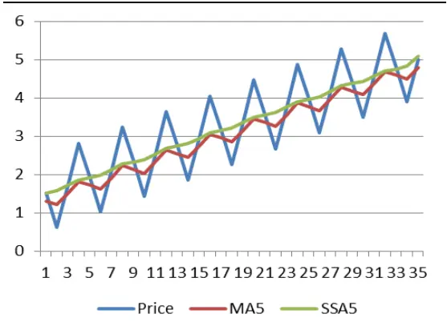
数据来源：国泰君安证券研究

图 4 带漂移正弦曲线（高频采样）
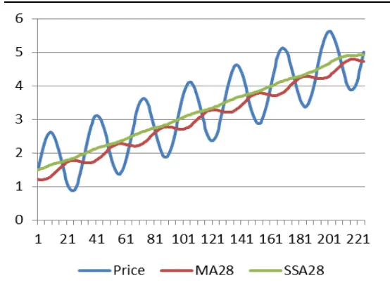
数据来源：国泰君安证券研究

可以看到不论是低频采样下的锯齿形序列还是高频采样下的平滑序列，同样窗口长度的 SSA对正弦波的过滤程度都要高于 MA，SSA相对 MA更加接近曲线整体漂移轨迹，从而对趋势的刻画更明显。

## 1.3.2. 刻画的延迟性比较

MA的平滑程度和窗口长度成正比，但是 MA由于仅利用考察点左侧数据，窗口长度越长对趋势的刻画延迟性就越高。例如下图对拐点的刻画，窗口参数越长，MA对拐点的确认越晚。由于 SSA利用了对角平均处理，在对非末端点刻画时能够同时利用考察点左右两侧的数据，因此对历史数据中拐点的刻画对于任意窗口参数都几乎能在同一时刻确认，相对于MA来说延迟性大大减少。

图 5 MA多窗口趋势线
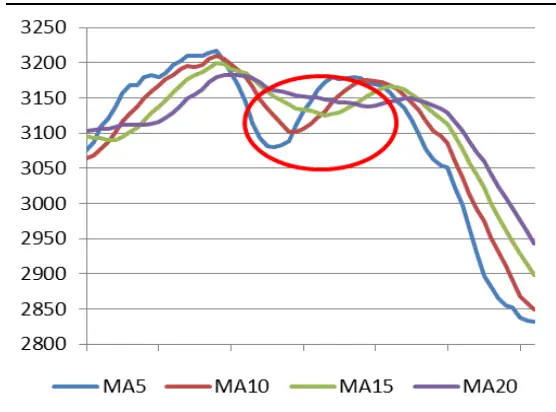
数据来源：国泰君安证券研究

图 6 SSA多窗口趋势线
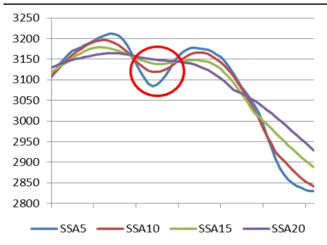
数据来源：国泰君安证券研究

综上所述，对于历史价格趋势的刻画分段或是对于某些具有趋势性的指标的刻画分段，利用 SSA相比于 MA有平滑无延迟的特点。

## 1.3.3. 对末端点刻画的比较

从择时策略的角度来说，最关心的是趋势线末端的形态和变化，要及时准确的抓住市场的趋势离不开对趋势线末端的精准判断。SSA趋势线的末端与 MA 趋势线的末端不同。从以窗口参数为 3 的 MA 和 SSA 示例中可看到 MA末端点 由价格序列末 3项等权平均组成，SSA末端点同样由价格序列末 3 项构成，但权重大小和参数 $[a_{1},a_{2},a_{3}$ 的大小对应，具有时变特征。

奇异谱分析趋势线的特点在于，在上涨趋势中，第一主成分方向参数大小关系为 $a_{1}<a_{2}<a_{3}$ ，下跌趋势中，参数大小关系为 $a_{1}>a_{2}>a_{3}$ ，从而对应的趋势线末端点 $\widehat{x_{5}}=a_{1}a_{3}x_{3}+a_{2}a_{3}x_{4}+a_{3}^{2}x_{5}$ 各个构成项权重大小表现出在上涨趋势中新数据比旧数据权重大 $(x_{3}、x_{4}、x_{5})$ 权重递增），下跌趋势中旧数据比新数据权重大 $(x_{3}、x_{4}、x_{5}$ 权重递减）的特点。简而言之，由于 MA 对窗口内参数是等权重的，权重时变的 SSA 末端点在上涨趋势中对回调的敏感性相对 MA更强，下跌趋势中对反弹的确认相对 MA更谨慎。

如下图所示，直观的看单调序列，SSA比 MA能更快反映上涨中的回调，并且对下跌中的反弹确认更谨慎。对以上序列叠加正态分布白噪声，模拟 10000 次，对于先增后减序列，MA5末端有 2411例呈下跌趋势，SSA5末端有 7204例呈下跌趋势，对于先减后增序列，MA5 末端有 7583 例呈上涨趋势，SSA5 端有 1734例呈上涨趋势。表明在噪声影响下，SSA相比 MA仍能反映出对回调的高敏感性和对反弹的谨慎性。

图 7 单调增又单调减序列与 MA5、SSA5
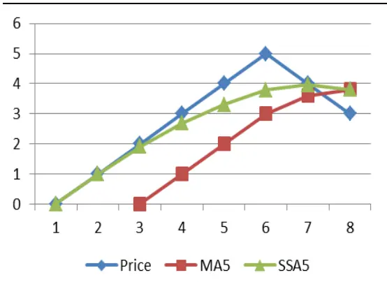
数据来源：国泰君安证券研究

图 8 单调减又单调增序列与 MA5、SSA5
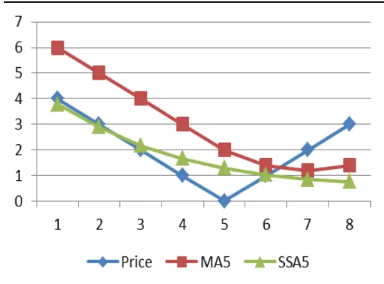
数据来源：国泰君安证券研究

除此之外，奇异谱分析趋势线还有另一个特点。以 SSA3 为例，相比于MA3，在上涨趋势中 SSA3 末端点 各构成项权重系数 $[a_{1}a_{3}$ $a_{2}a_{3}$ 、都大于等于 1/3，下跌趋势中都小于等于 1/3，致使 SSA3 波幅相对 MA3要大。因此如下图所示，一旦价格趋势上涨（下跌）结束，SSA能使得价格更快下穿（上穿）趋势线，使得趋势的结束较早得到确认。

图 9 价格穿越趋势线示意图
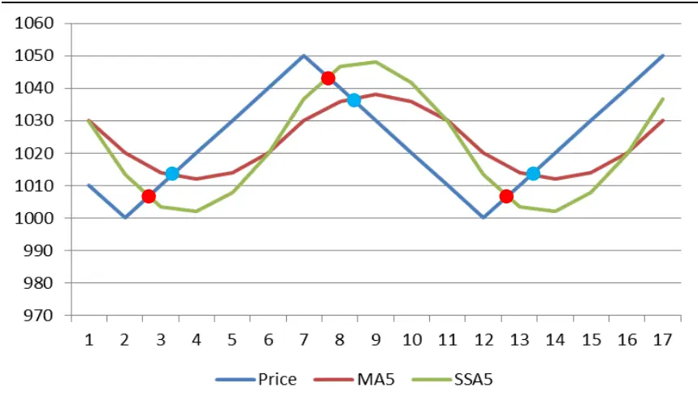
数据来源：国泰君安证券研究

我们从一个简单均线择时策略出发直观的比较由此特性导致的 SSA 与MA的效果差异。构建简单均线策略：

MA单均线：收盘价上穿 MA（n=5）做多，下穿 MA（n=5）做空SSA单均线：收盘价上穿 SSA（m=5）做多，下穿 SSA（m=5）做空测试标的沪深 300指数日线，测试时间 2005年 1月至 2016 年 4月，得到结果如下：

图 10 策略净值曲线
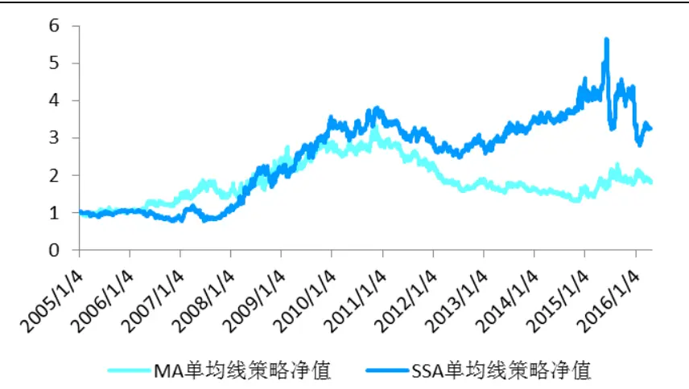
数据来源：国泰君安证券研究

MA 单均线策略最终净值 183.06%，年化收益率 5.50%，最大回撤-60.45%，SSA 单均线策略最终净值 325.36%，年化收益率 11.00%，最大回撤-50.74%。在 2011年到 2014年上半年的震荡市中，明显可以看到SSA 替代 MA 大幅提高了策略效果，由于 SSA 在震荡市中能够更快速的确认趋势结束，因此由小优势慢慢累积可形成较大的相对优势。但是对趋势结束的高敏感性同样会导致策略在市场有大趋势的情况下会因为一些趋势结束的伪信号而被提早震出、反向操作，因此在 2015 年后半年 SSA策略净值波动剧烈。

## 1.4. 多窗口 SSA 趋势线组

利用 SSA相对 MA更不易受到极端值影响的优势，同时为了最大程度紧跟市场趋势，我们以趋势线末端点的相对涨跌来判断趋势。具体的在 T时刻若 $\cdot SSA_{m}(T)$ 大于（小于） $SSA_{m}(T-1)$ ，就认为依据此趋势线判断市场处于上涨（下跌）趋势。

单一 SSA趋势线仅考察单一周期下的市场趋势，判断不够全面。本报告的择时策略采用多窗口 SSA趋势线组末端趋势共同判断市场方向。不同窗口长度的 SSA考量的是价格序列在不同周期长度下的趋势变化，我们希望在大部分趋势线判断统一的情况下进行操作，从而相当于给趋势的判断增加一个过滤。

我们以五趋势线组 $(\mathrm{~m}=15,\mathrm{~m}=20,\mathrm{~m}=25,\mathrm{~m}=30,\mathrm{~m}=35)$ 为例来对趋势进行判断，这里我们按照多数原则形成交易信号，即趋势线多数末端上涨即认为上涨，多数末端下跌即认为下跌。下图中红色表示趋势线看涨信号，绿色表示看跌信号。

图 11 多窗口 SSA趋势线组涨跌信号分布图
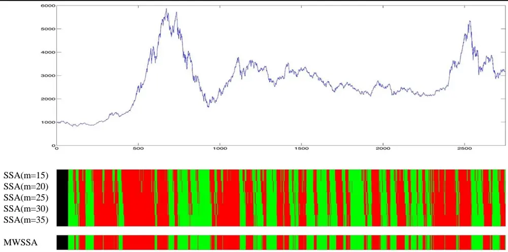
数据来源：国泰君安证券研究

最终的判断结果在 94.44%的时间里和中枢趋势线（SSA25）相同，高于其他趋势线（SSA15：86.08%，SSA20：90.95%，SSA30：93.17%，SSA35：89.97%）。因此对于趋势线组来说，最终的判断结果主要由其中枢趋势线决定，但由于其他趋势线信号的过滤作用，结果并不完全一样。关于趋势线组所包含的趋势线数量和窗口长度的选择我们将在后文展开。

## 2. 基于奇异谱分析的择时策略

均线择时策略属于动量策略，其策略构造往往涉及趋势的确认，趋势的跟随，趋势结束的确认和离场等过程，一般只适应趋势市而不适应震荡市。一个良好的均线择时策略应当能够在趋势市中抓住主要趋势，并在震荡市中保持稳定，避免过多的回撤。本节考察多窗口 SSA趋势线组的择时效果。

## 2.1. 多窗口 SSA趋势线组择时策略

多窗口 SSA趋势线组作为一个趋势判断系统，其变量包含：

## 1、 趋势线的数量；

## 2、 趋势线窗口参数选择。

通过对这两类参数的考察，我们希望找到基于奇异谱分析的均线择时策略特点以及相应的规律。

评价一个择时策略的标准一般有总收益率，最大回撤，夏普比率等等，但是例如总收益率，夏普比率等等评价指标都只利用了资金曲线部分时点上值的大小，指标受到极端值影响较大，因此本文主要考察资金曲线以 1为截距线性回归拟合斜率作为策略评价的标准来选择参数。回归得到的直线斜率一定程度上代表了策略净值长期平均增长率。

图 12 资金曲线线性回归示例
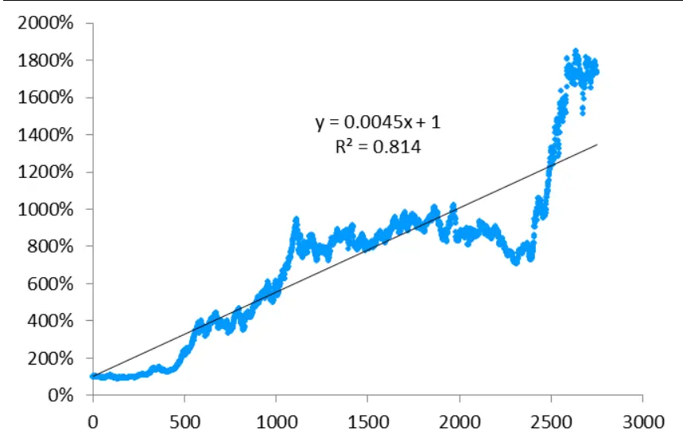
数据来源：国泰君安证券研究

由于趋势线组对趋势的判断采用多数规则，因此趋势线组数量要求为奇数，从而方便策略设计。我们分别采用单趋势线，3 趋势线组，5 趋势线组，7趋势线组进行回测。备选的趋势线窗口参数按等间隔取[5，10，15，20，25，30，35，40，45，50]。回测标的为沪深 300指数，回测尺度为日线，回测区间为 2005年 1月到 2016年 4月，交易费用双边 0.2%。

## 2.1.1. 单趋势线回测表现

按照 P&L 拟合斜率高低排序，效果最佳的策略中枢趋势线窗口参数为30，可以看到单 SSA趋势线作为趋势判断系统最大回撤非常高，最大亏损周期在 2011年到 2014 年上半年，期间指数处于震荡行情，单 SSA趋势线整体在震荡行情中考察的周期单薄，无法有效跟随趋势。

表 1 单趋势线回测表现

| 窗口参数组 | P&L 拟合斜率 | 最终净值 | 年化 收益率 | 最大回撤 | 夏普比率 | 月胜率 | 交易次数 |
| --- | --- | --- | --- | --- | --- | --- | --- |
| 30 | 0.00562 | 1784.66% | 29.05% | -49.87% | 0.60 | 60.29% | 130 |
| 50 | 0.003926 | 1431.05% | 26.55% | -45.20% | 0.68 | 58.09% | 94 |
| 35 | 0.003576 | 1208.92% | 24.68% | -53.30% | 0.80 | 55.88% | 120 |
| 10 | 0.003081 | 890.25% | 21.35% | -38.26% | 0.78 | 56.62% | 251 |
| 25 | 0.002973 | 1192.45% | 24.53% | -29.83% | 0.63 | 57.35% | 143 |
| 45 | 0.002554 | 815.51% | 20.41% | -51.27% | 0.61 | 58.09% | 106 |
| 15 | 0.002135 | 579.99% | 16.83% | -42.86% | 0.56 | 52.94% | 214 |
| 40 | 0.001965 | 718.47% | 19.07% | -60.73% | 0.55 | 55.15% | 124 |
| 20 | 0.001548 | 739.77% | 19.37% | -43.53% | 0.72 | 55.88% | 190 |
| 5 | 0.000267 | 105.62% | 0.49% | -54.58% | 0.11 | 47.06% | 433 |

数据来源：国泰君安证券研究

图 13 窗口参数(m=30)策略表现
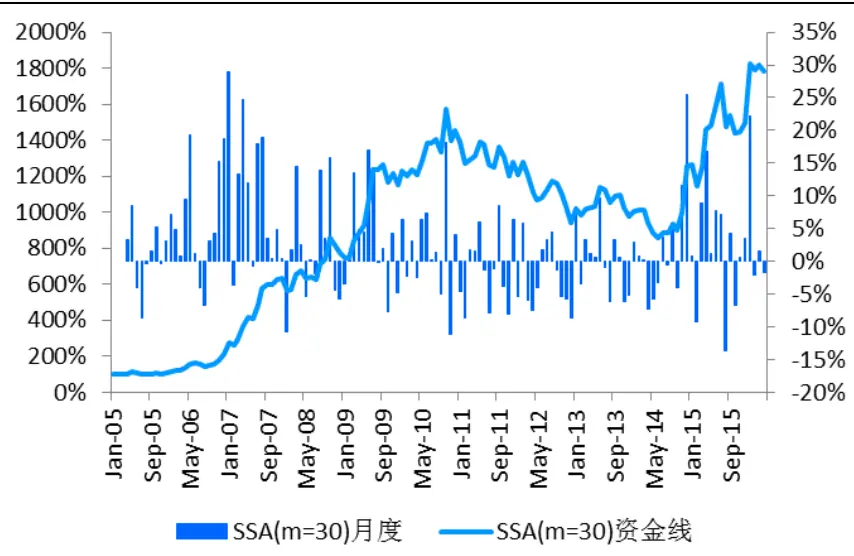
数据来源：国泰君安证券研究

## 2.1.2. 3趋势线组回测表现

在备选窗口参数中选择 3个共 120组参数，我们取出 P&L拟合斜率最高的 10 组进行观察。可以看到资金曲线拟合斜率较高的策略总收益率和夏普比率也较高，无论窗口参数取多少，月胜率都能够达到 60%左右。通过之前的分析知道多窗口 SSA 趋势线组策略的信号与中枢趋势线的信号最为接近，且对中枢趋势线信号有一定优化。对于 3趋势线组，效果最好的参数组中枢窗口参数都是 30。这与单趋势线回测结果相符，进一步验证了以 30 个交易日作为周期来衡量趋势在 A 股市场择时策略中的有效性。相比单趋势线策略，3 趋势线策略在 2011 年到 2014 年上半年的震荡市有所增强，增加的趋势线过滤了系统对趋势的判断，从而减少了在震荡市中的损失。

表 2 3 趋势线组回测表现

| 窗口参数组 | P&L 拟合斜率 | 最终净值 | 年化 收益率 | 最大回撤 | 夏普比率 | 月胜率 | 交易次数 |
| --- | --- | --- | --- | --- | --- | --- | --- |
| 10,30,50 | 0.011044 | 4095.31% | 38.89% | -30.69% | 0.80 | 59.56% | 130 |
| 10,30,35 | 0.008745 | 2953.42% | 34.93% | -41.31% | 0.75 | 61.03% | 142 |
| 15,30,50 | 0.007934 | 2695.35% | 33.85% | -40.65% | 0.68 | 59.56% | 136 |
| 10,30,45 | 0.007912 | 2845.31% | 34.49% | -28.93% | 0.78 | 58.82% | 134 |
| 25,30,50 | 0.00757 | 3426.93% | 36.72% | -31.68% | 0.71 | 58.82% | 120 |
| 10,30,40 | 0.006887 | 2386.86% | 32.41% | -35.40% | 0.72 | 61.03% | 144 |
| 5,25,30 | 0.006792 | 2475.84% | 32.84% | -28.92% | 0.69 | 58.09% | 161 |
| 25,30,45 | 0.006736 | 3069.47% | 35.39% | -32.80% | 0.72 | 60.29% | 120 |
| 10,25,35 | 0.00663 | 2965.55% | 34.98% | -32.24% | 0.73 | 60.29% | 149 |
| 10,25,30 | 0.006419 | 2389.03% | 32.42% | -37.36% | 0.64 | 58.09% | 149 |

数据来源：国泰君安证券研究

图 14 窗口参数(m=10,30,50)策略表现
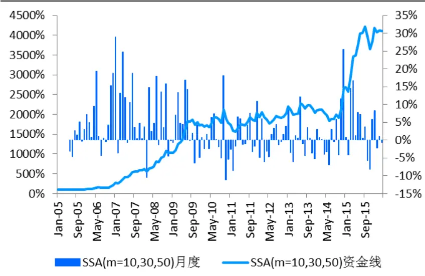
数据来源：国泰君安证券研究

## 2.1.3. 5趋势线组回测表现

同样在备选窗口参数中选择 5个共 252组参数，我们取出 P&L拟合斜率最高的 10 组进行观察。最佳参数组的中枢窗口参数依然是 30。5 趋势线最佳参数组与 3趋势线最佳参数组相比夏普率更高，但总体来看策略效果较 3趋势线组有所降低。

表 3 5 趋势线组回测表现

| 窗口参数组 | P&L 拟合斜率 | 最终净值 | 年化 收益率 | 最大回撤 | 夏普比率 | 月胜率 | 交易次数 |
| --- | --- | --- | --- | --- | --- | --- | --- |
| 10,15,30,45,50 | 0.009891 | 3647.15% | 37.48% | -31.46% | 0.84 | 60.29% | 134 |
| 10,15,30,35,50 | 0.008624 | 2920.51% | 34.80% | -35.10% | 0.73 | 59.56% | 136 |
| 5,10,30,35,50 | 0.008147 | 2745.15% | 34.06% | -36.86% | 0.76 | 59.56% | 156 |
| 10,25,30,35,50 | 0.008054 | 3589.58% | 37.28% | -31.36% | 0.76 | 60.29% | 118 |
| 5,10,30,40,50 | 0.007846 | 2577.11% | 33.32% | -38.51% | 0.74 | 58.82% | 154 |
| 5,10,30,45,50 | 0.007565 | 2672.32% | 33.74% | -32.22% | 0.75 | 58.09% | 162 |
| 5,10,25,30,35 | 0.00745 | 2891.53% | 34.68% | -31.19% | 0.71 | 59.56% | 153 |
| 10,15,30,40,50 | 0.00735 | 2723.90% | 33.97% | -38.57% | 0.76 | 59.56% | 136 |
| 10,25,30,45,50 | 0.007336 | 3060.95% | 35.36% | -34.57% | 0.75 | 59.56% | 126 |
| 5,15,30,45,50 | 0.007269 | 2600.60% | 33.42% | -32.25% | 0.76 | 59.56% | 160 |

数据来源：国泰君安证券研究

图 15 窗口参数(m=10,15,30,45,50)策略表现
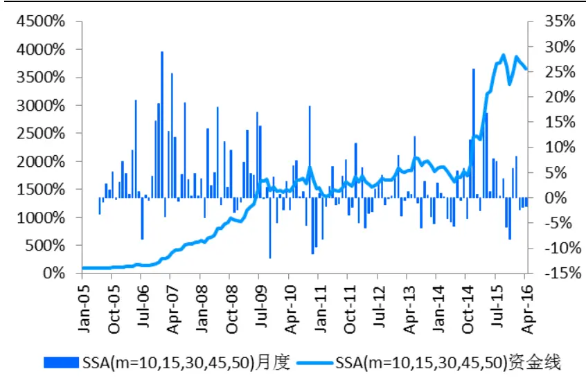
数据来源：国泰君安证券研究

## 2.1.4. 7趋势线组回测表现

同样在备选窗口参数中选择 7个共 120组参数，取出 P&L拟合斜率最高的 10 组进行观察。最佳参数组的中枢窗口参数依然是 30。但是整体的收益进一步下降，最大回撤有所增加，7 趋势线系统由于其添加的趋势线过多，窗口参数跨度过大，考察周期长度过密，趋势受到过于短期的价格波动和过于长期的价格走势共同影响，无法形成有效统一的判断，在趋势变化的过程中反应不够灵敏。因此总体来说以 30 为中枢趋势线的 3趋势线组是此类系统中最好的选择。

表 4 7 趋势线组回测表现

| 窗口参数组 | P&L 拟合斜率 | 最终净值 | 年化 收益率 | 最大回撤 | 夏普比率 | 月胜率 | 交易次数 |
| --- | --- | --- | --- | --- | --- | --- | --- |
| 5,10,15,30,35,45,50 | 0.008448 | 2658.70% | 33.68% | -37.62% | 0.75 | 59.56% | 150 |
| 5,10,15,30,40,45,50 | 0.007408 | 2550.31% | 33.19% | -36.16% | 0.76 | 60.29% | 146 |
| 5,10,15,25,30,45,50 | 0.007031 | 2301.81% | 31.99% | -29.94% | 0.74 | 58.09% | 169 |
| 10,15,25,30,35,45,50 | 0.006691 | 2581.83% | 33.34% | -38.21% | 0.69 | 58.09% | 128 |
| 5,10,15,30,35,40,50 | 0.006287 | 2056.76% | 30.68% | -43.25% | 0.71 | 59.56% | 152 |
| 10,15,20,30,35,45,50 | 0.006165 | 2215.54% | 31.54% | -40.44% | 0.75 | 56.62% | 138 |
| 10,15,25,30,40,45,50 | 0.00611 | 2472.21% | 32.83% | -35.72% | 0.70 | 58.82% | 132 |
| 10,15,25,30,35,40,50 | 0.00607 | 2360.68% | 32.28% | -33.17% | 0.71 | 57.35% | 130 |
| 5,10,25,30,40,45,50 | 0.006032 | 2318.07% | 32.07% | -37.93% | 0.68 | 58.82% | 148 |
| 5,10,15,25,30,35,50 | 0.006023 | 2218.34% | 31.56% | -31.03% | 0.68 | 55.88% | 171 |

数据来源：国泰君安证券研究

图 16 窗口参数(m=10,15,30,35,45,50)策略表现
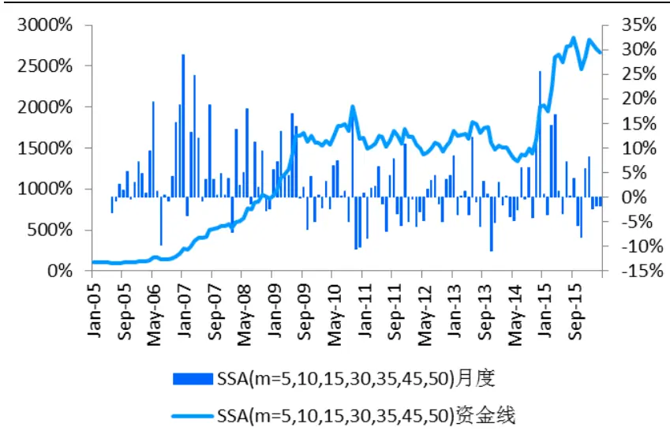
数据来源：国泰君安证券研究

## 2.2.对于回撤的一些思考

上一小节考察择时策略时，我们选择以每日净值数据考虑浮盈浮亏来计算最大回撤。事实上由于价格必然先于趋势线变化，当一个趋势结束并且另一个趋势形成得到确认时，如果一直持仓，都难以避免浮盈收窄，由此造成的净值回撤几乎在每一笔交易中都存在，导致本身盈利的交易，由于浮盈的减少而增加了最大回撤。我们希望考察这类回撤在日净值曲线最大回撤中的贡献。

我们比较 SSA趋势线组（m=10,30,50）策略日净值曲线和仅考察每笔交易最终盈亏的累计净值曲线，可以看到后者净值曲线的波动要小于前者。前者最大回撤-30.69%，后者最大回撤-19.77%。因此至少-10.92%左右的最大回撤是由前面所述的趋势转变时浮盈收窄导致的。如果按照每笔交易盈亏累计曲线看最大回撤有所不同。

图 17 窗口参数(m=10,30,50)策略日净值与每笔盈亏累计净值
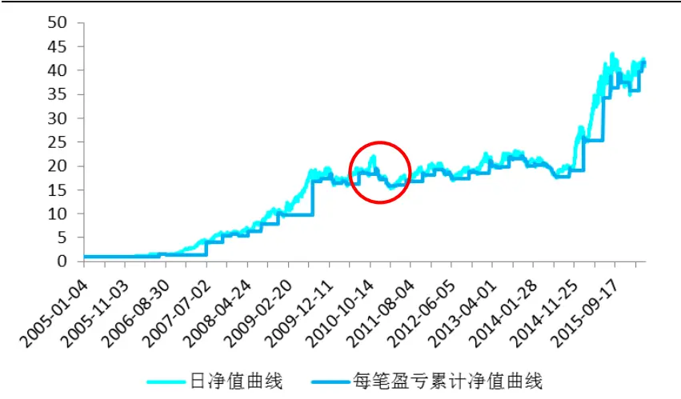
数据来源：国泰君安证券研究*红色圈内为最大回撤发生点

## 3. 总结与展望

奇异谱分析得到的第一主成分能够将移动窗口样本之间最大的特征提取出来，从而得到相对 MA更平滑，无延迟的趋势刻画。其时变的权重使得趋势线末端点在上涨中对回调更加敏感，下跌中对反弹更加谨慎，且趋势线整体波幅更大。用 SSA代替 MA能增强择时策略的收益。

多窗口 SSA趋势线组有两个可变维度，一个是趋势线的数量，一个是窗口参数的选择，报告回测了单趋势线，3趋势线组，5趋势线组，7趋势线组的策略结果，发现从资金曲线长期增长率的角度衡量，以 30 为中枢参数的策略在沪深 300指数上效果最好。从趋势线数量的角度来说，单趋势线判断考察的周期单一，容易在震荡市中有较大亏损，随着趋势线的增加，判断稳定性增强，策略的收益有较大提高，最大回撤减小。但是过多的趋势线会导致系统受到短期波动和长期趋势双方共同影响，判断无法有效统一，因此利用 3条趋势线共同判断是较好的选择。

利用 3 趋势线组系统（m=10,30,50）考察 2016年 1月到 5月信号分布，可以看到系统从年初开始看空，在下跌筑底后向上突破前发出看多信号，对于上证综指在 5月初下跌前给出了看空信号，创业板指上虽然纠结但是在五月前仍维持了看空判断，对于 5 月 31 日的暴涨，在上证综指上系统趋于保守，在波动更大一些的创业板指上系统早在横盘期间就给出了看多信号。

图 18 上证综指趋势判断
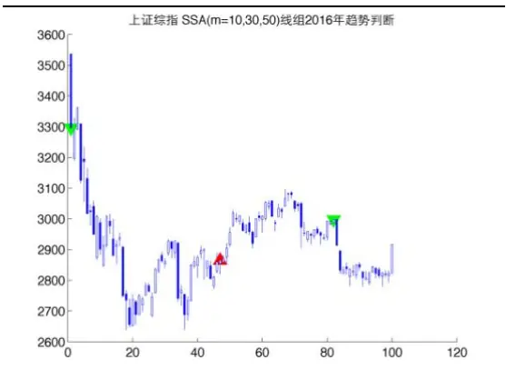
数据来源：国泰君安证券研究

图 19 创业板指趋势判断
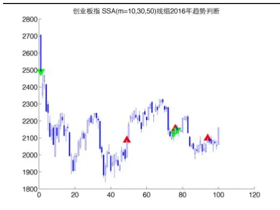
数据来源：国泰君安证券研究

奇异谱分析作为一种时间序列分析的辅助工具从本质上来说只起到了量化趋势的作用，并没有融入除价格趋势外的其他市场信息，但是在大部分需要结合市场或者指标趋势的策略中，奇异谱分析能够提供一种更有效的趋势提取方式。

关于奇异谱分析的研究，目前学术界做的较多的有多元奇异谱分析，时间序列变点预测等。多元奇异谱分析即利用可能具有因果关系的多个序列进行分析从而得到对其中某个序列领先预判的分析方法；时间序列变点预测即利用奇异谱分析构建统计指标寻找产生时间序列的内在机制变化的时点。未来的研究可以从这两方面开展。

## 本公司具有中国证监会核准的证券投资咨询业务资格

## 分析师声明

作者具有中国证券业协会授予的证券投资咨询执业资格或相当的专业胜任能力，保证报告所采用的数据均来自合规渠道，分析逻辑基于作者的职业理解，本报告清晰准确地反映了作者的研究观点，力求独立、客观和公正，结论不受任何第三方的授意或影响，特此声明。

## 免责声明

本报告仅供国泰君安证券股份有限公司（以下简称“本公司”）的客户使用。本公司不会因接收人收到本报告而视其为本公司的当然客户。本报告仅在相关法律许可的情况下发放，并仅为提供信息而发放，概不构成任何广告。

本报告的信息来源于已公开的资料，本公司对该等信息的准确性、完整性或可靠性不作任何保证。本报告所载的资料、意见及推测仅反映本公司于发布本报告当日的判断，本报告所指的证券或投资标的的价格、价值及投资收入可升可跌。过往表现不应作为日后的表现依据。在不同时期，本公司可发出与本报告所载资料、意见及推测不一致的报告。本公司不保证本报告所含信息保持在最新状态。同时，本公司对本报告所含信息可在不发出通知的情形下做出修改，投资者应当自行关注相应的更新或修改。

本报告中所指的投资及服务可能不适合个别客户，不构成客户私人咨询建议。在任何情况下，本报告中的信息或所表述的意见均不构成对任何人的投资建议。在任何情况下，本公司、本公司员工或者关联机构不承诺投资者一定获利，不与投资者分享投资收益，也不对任何人因使用本报告中的任何内容所引致的任何损失负任何责任。投资者务必注意，其据此做出的任何投资决策与本公司、本公司员工或者关联机构无关。

本公司利用信息隔离墙控制内部一个或多个领域、部门或关联机构之间的信息流动。因此，投资者应注意，在法律许可的情况下，本公司及其所属关联机构可能会持有报告中提到的公司所发行的证券或期权并进行证券或期权交易，也可能为这些公司提供或者争取提供投资银行、财务顾问或者金融产品等相关服务。在法律许可的情况下，本公司的员工可能担任本报告所提到的公司的董事。

市场有风险，投资需谨慎。投资者不应将本报告作为作出投资决策的唯一参考因素，亦不应认为本报告可以取代自己的判断。
在决定投资前，如有需要，投资者务必向专业人士咨询并谨慎决策。

本报告版权仅为本公司所有，未经书面许可，任何机构和个人不得以任何形式翻版、复制、发表或引用。如征得本公司同意进行引用、刊发的，需在允许的范围内使用，并注明出处为“国泰君安证券研究”，且不得对本报告进行任何有悖原意的引用、删节和修改。

若本公司以外的其他机构（以下简称“该机构”）发送本报告，则由该机构独自为此发送行为负责。通过此途径获得本报告的投资者应自行联系该机构以要求获悉更详细信息或进而交易本报告中提及的证券。本报告不构成本公司向该机构之客户提供的投资建议，本公司、本公司员工或者关联机构亦不为该机构之客户因使用本报告或报告所载内容引起的任何损失承担任何责任。

## 评级说明

## 1.投资建议的比较标准

投资评级分为股票评级和行业评级。

以报告发布后的12个月内的市场表现为比较标准，报告发布日后的12个月内的公司股价（或行业指数）的涨跌幅相对同期的沪深300指数涨跌幅为基准。

## 2.投资建议的评级标准

报告发布日后的 12 个月内的公司股价（或行业指数）的涨跌幅相对同期的沪深300指数的涨跌幅。

|  | 评级 说明 |  |
| --- | --- | --- |
| 股票投资评级 | 增持 | 相对沪深 300指数涨幅15%以上 |
|  | 谨慎增持 | 相对沪深300指数涨幅介于5%～15%之间 |
|  | 中性 | 相对沪深 300指数涨幅介于-5%～5% |
|  | 减持 | 相对沪深300指数下跌5%以上 |
| 行业投资评级 | 增持 | 明显强于沪深 300 指数 |
|  | 中性 | 基本与沪深300指数持平 |
|  | 减持 | 明显弱于沪深 300指数 |

## 国泰君安证券研究

|  | 上海 | 深圳 | 北京 |
| --- | --- | --- | --- |
| 地址 | 上海市浦东新区银城中路168号上海 银行大厦29层 | 深圳市福田区益田路 6009 号新世界 商务中心34层 | 北京市西城区金融大街28 号盈泰中 心2号楼10层 |
| 邮编 | 200120 | 518026 | 100140 |
| 电话 | (021)38676666 | (0755)23976888 | (010)59312799 |
| E-mail: gtjaresearch@gtjas.com |  |  |  |