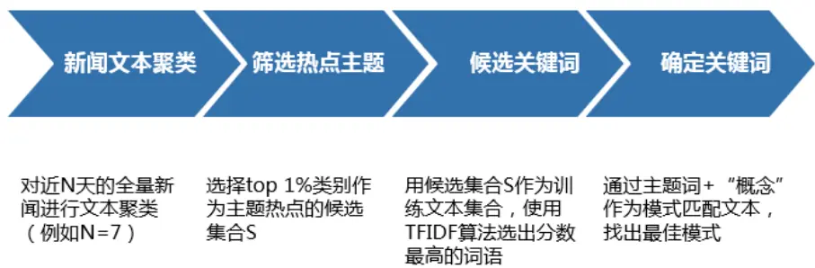
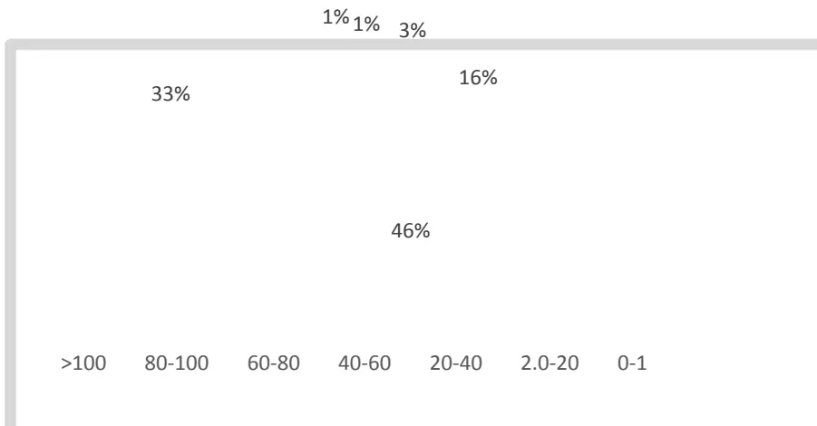
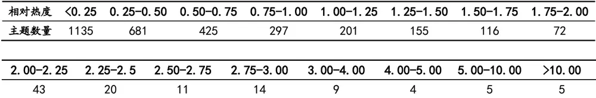
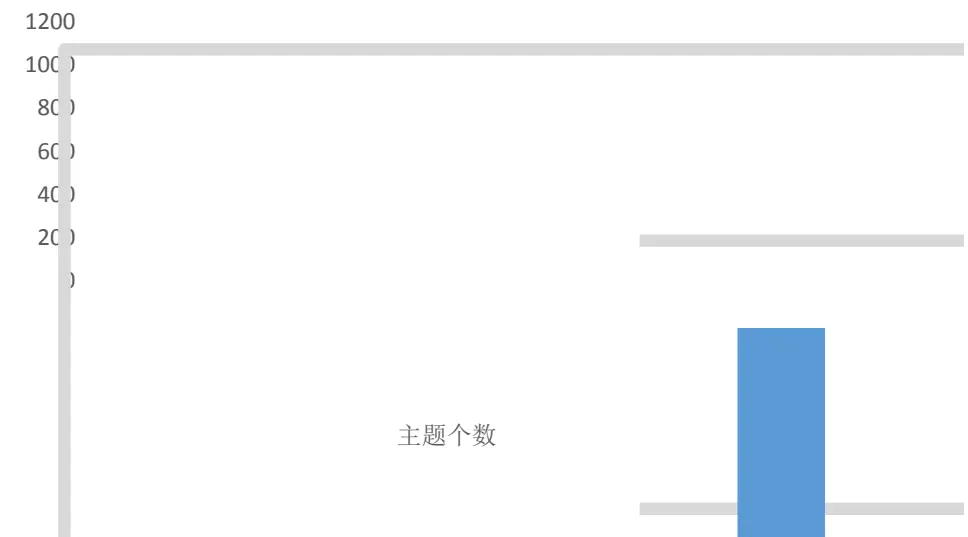
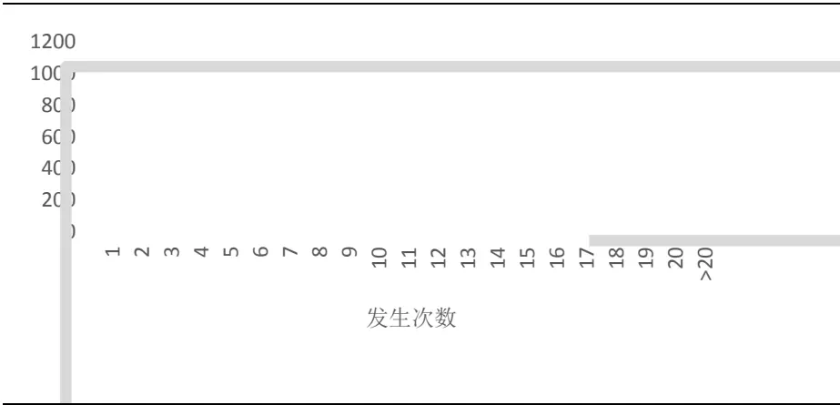
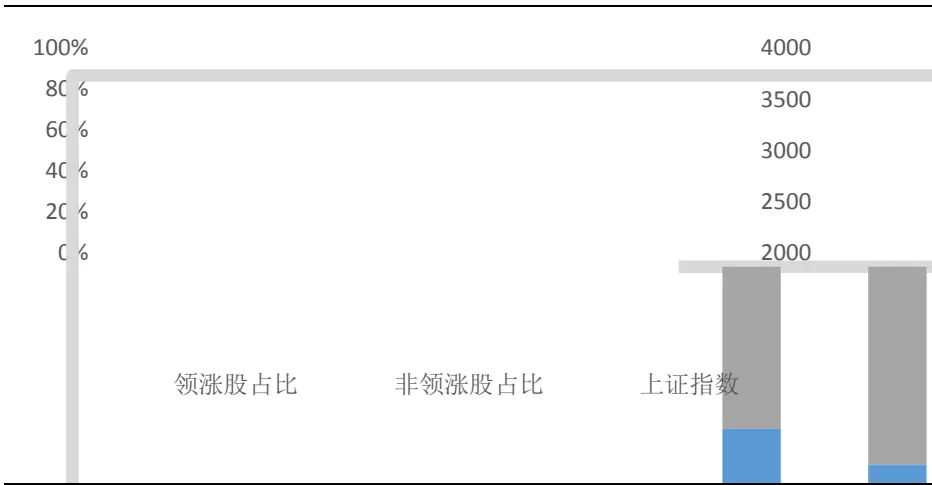
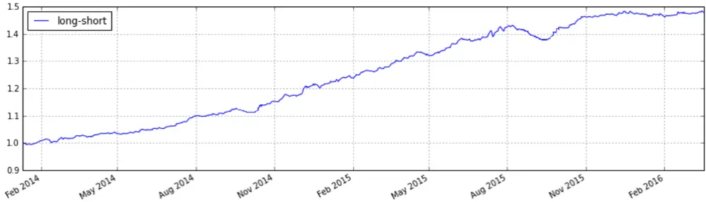
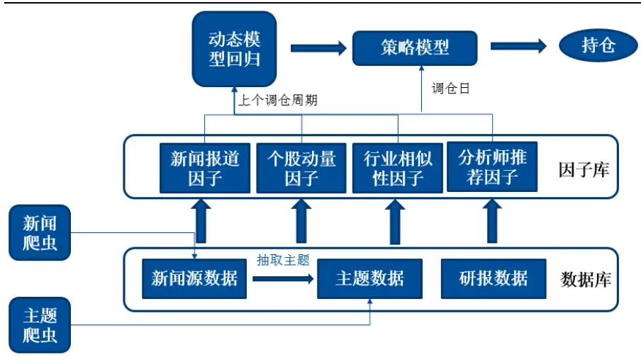

nInfo] [Table_Title] 2016.07.05

# 基于文本挖掘的主题投资策略

# ——数量化专题之七十六

玉刘富兵（分析师）

8 021-38676673

liufubing008481@gtjas.com

证书编号 S0880511010017

## 本报告导读：

本篇报告旨在通过对新闻文本、研报文本的挖掘分析，展示一种及时跟踪市场热点主题，并构建该主题相关基础信息的方法。通过对市场上主题投资的规律探究，构建一类主题内选股投资策略。

## 摘要：

able_Summary]市场上热点主题千差万别，主题轮动瞬息万变，能否第一时间发现市场的热点主题？是否有一种方式可以自动跟踪市场上实时发生的各类热点事件？本篇报告通过一种对新闻文本的挖掘算法构建了主题仓库，并对每个主题分别挖掘个股、建立主题的活跃期限，用以描述该主题的市场表现。

主题的构成是依靠个股的组合，而主题内个股也在动态变化，如何描述主题和其中个股的关系也是重要的研究课题。本篇报告通过动量因子、分析师推荐因子、新闻报道因子和行业相似性因子四类度量方式来描述主题和个股的关联程度。每一类度量指标都是基于对历史主题的数量化观察。

- 基于四类因子，我们发现通过构建多空组合进行主题内选股可以获得较稳定的超额收益。从 2014 年至今的实证结果表明，组合能在较低回撤（5.04%）前提下获得较为可观的收益（年化收益 21.57%）。

主题投资研究要解决两个问题，即配臵什么主题，配臵主题中的哪些标的。本文主要解决第二个问题。未来我们会通过观察主题轮动的市场规律尝试解决第一个问题。主题投资的本质是投资者对于市场热点的不同解读导致的博弈过程，我们希望通过这两方面的研究进一步揭示这种博弈过程导致的股价变化规律，从而给予投资者一定的指示。

## 金融工程团队：

刘富兵：（分析师）

电话：021-38676673

邮箱：liufubing008481@gtjas.com

证书编号：S0880511010017

刘正捷：（分析师）

电话：0755-23976803

邮箱：liuzhengjie012509@gtjas.com

证书编号：S0880514070010

李辰：（分析师）

电话：021-38677309

邮箱：lichen@gtjas.com

证书编号：S0880516050003

## 陈奥林：（研究助理）

电话：021-38674835

邮箱：chenaolin@gtjas.com

证书编号：S0880114110077

## 王浩：（研究助理）

电话：021-38676434

邮箱：wanghao014399@gtjas.com

证书编号：S0880114080041

孟繁雪：（研究助理）

电话：021-38675860

邮箱：mengfanxue@gtjas.com

证书编号：S088011604008

## [Table_R相关报告

《基于奇异谱分析的均线择时研究》2016.06.22

《价格走势观察之基于均线的分段方法》2016.05.31

《事件驱动策略的因子化特征》2016.05.27

《基于微观市场结构的择时策略》2016.05.19

《融资融券标的调整事件研究》2016.05.17

## 1. 引言

主题投资作为 A股市场上一种重要的投资机会，反映了投资者对市场上发生的热点事件的解读，同时也是不同市场参与者的心理博弈过程。如果我们能通过一种方式第一时间抓住这些投资者关心的热点，并且找出这些热点的变化规律，我们就有机会更快地介入此类投资机会，获得丰厚的收益。而伴随着投资数据化，数据本身的非结构化，越来越多的热点变幻信息可以通过数据分析和挖掘获得。与此同时，市场对此类信息的解读，例如分析师对热点的评价，新闻记者对事件的报道，以及投资者对异动的反应，也可以通过挖掘研报和新闻文本获得。因此，基于文本的挖掘算法对于即使把握市场热点，构建主题数据具有重要意义。

本报告首先介绍了一种文本挖掘的算法来构建主题数据，包括用来描述主题本身的主题词向量和描述其构成的个股集合。在此基础上，我们提出了主题的活跃期限有界性，从而将研究的范围进一步聚焦。同时，为了度量主题内个股和主题的关系，我们定义了四类因子，分别是动量因子，分析师推荐因子，新闻报道因子和行业相似性因子。这些因子的选取都是基于对历史的主题轮动规律一些数量化的观察。最后，我们将构建一个主题内选股的多空策略。实证结果表明，该策略从 2014 年初开始，在相对较低的回撤条件下，可以获得比较稳定的相对收益。

本篇报告的第 2章，我们将介绍构建热点主题数据的方法，包括主题词本身的构建，主题词向量的构建，主题活跃期的构建，主题个股的挖掘等。在第 3章中，我们将首先给出一些历史上主题演变的数量化观察结果，基于这些结果，我们定义了四类选股因子。在第 4章中，我们尝试构建了主题内选股的多空策略，该策略通过实证分析证明稳定有效。第5章为研究的总结和展望。

## 2. 主题数据构建

对主题数据的构建可以从多个层次展开。要描述一个主题的特征，需要描述该主题表达的是什么热点事件，用怎样的关键词来描述这个热点，以及该主题可能发生异动的时间段等。以下就从这些方面分别构建主题。

## 2.1. 热点主题挖掘

热点主题的挖掘方式有很多。最简单常用的方式是直接通过各大财经网站的主题概念板块抓取。图 1展示了目前国内主要的财经网站整理的主题数据的情况，包括新浪财经，云财经，东方财富网等。

然而，通过爬取网站的方式来获取主题有诸多弊端。其一，这样的爬取方式非常依赖源网站本身，数据的质量也很依赖于源网站；其二，通过爬取网页的方式获得主题，很大程度上具有比较高的延迟性，也就是说，这种方式并不能第一时间获得市场上最活跃的主题。为了解决以上问题，我们介绍一种基于新闻文本挖掘的主题获取方式。通过该方式可以在主题异动的第一时间监控到主题的异动。

北京时间：20日16:13:23 |美东时间:20日04:13:23全部代码/名称/拼音查询意见反债帮助

图 1 新浪财经、东方财富网上的主题概念板块
行情中心

|  |  |  |  | 沪深 |  |  |  |  |  |  |  |  |
| --- | --- | --- | --- | --- | --- | --- | --- | --- | --- | --- | --- | --- |
| 旦 沪深股市 |  | 市场概况 |  | 港股 | 美股 基金 |  | 外汇 商品 |  | 沪深Level2极速行情 |  | 新浪财经新版客户端 06-20 15:00 |  |
| 新浪行业 |  | 298sh00001 |  | 上证指数 | 06-20 15:00 | 10263$Z399001 | 深证成指 | 06-20 15:00 |  | 6302$Z399415 |  | 1100 |
| 申万行业 |  | » 2895 |  |  |  | 10223 |  |  |  | 7 6255 |  | M |
| 概念板块 | 智能电网 |  |  | 黄河三角 |  | 海峡西岸 |  | 成渝特区 | 铁路基建 |  | 物联网 |  |
| 地域板块 | 军工航天 |  |  | 黄金概念 |  | 创投概念 | ST板块 稀缺资源 |  | 低碳经济 |  | 含搬 |  |
| 证监会行业 | 含B股 |  | 次新股 |  | 含可转债 |  |  |  | 融资融券 | 三网融合 |  |  |
| 分类 | 武汉规划 |  | 多晶硅 |  | 锂电池 | 稀土永磁 |  | 核电核能 |  |  | 触摸屏 云计算 |  |
| 指数成分 | 水利建设 |  | 长株潭 |  | 皖江区域 | 太阳能 |  | 卫星导航 |  |  | 金融改革 |  |
| 条件选股 | 电子支付 |  | 新三板 |  | 海工装备 | 保障房 |  | 涉矿概念 |  |  |  |  |
| 风险警示 | 页岩气 |  | 生物疫苗 |  | 文化振兴 |  | 宽带提速 | IPV6概念 | 食品安全 |  |  |  |
| 大盘指数 | 奢侈品 |  | 图江 |  | 三沙概念 | 3D打印 |  | 海水淡化 | 碳纤维 |  | 建筑节能 |  |
| 上证重点指数 | 地热能 |  | 摘帽概念 |  | 苹果概念 | 重组概念 |  | 安防服务 |  |  | 风沙治理 |  |
| 排行 | 智能交通 |  | 空气治理 |  | 充电桩 | 4G概念 |  | 石墨烯 |  |  | 体育概念 |  |
| 次新股 | 土地流转 |  |  | 聚氨酯 | 生物质能 |  | 东亚自贸 | 丝绸之路 |  |  |  |  |
| 沪港通 创业板 | 博彩概念 燃料电池 |  | 020模式 | 特斯拉 |  |  | 生态农业 | 水域改革 | 风能 |  |  |  |
|  |  |  | 草甘麟 |  | 京津冀 |  |  | 粤港澳 | 基因概念 | 阿里概念 |  |  |
| + 基金 | 海上丝路 |  | 抗癌 | 抗流感 |  | 维生素 |  | 农村金融 |  |  | 汽车电子 |  |

东方财富网首页 加入收藏 我的菜单 移动客户端 基金交易 东方财富 Choice数据
登录  股吧  天天基金网 网

| 我的自选股 田 | 上证指数 |  |  |  |  |  | 深圳成指 |  |  |  |  |  | 领涨板块 |  |  |  |
| --- | --- | --- | --- | --- | --- | --- | --- | --- | --- | --- | --- | --- | --- | --- | --- | --- |
| 沪深股市 日 |  | 上证2888.81▲3.70▲0.13% |  |  |  |  | 深成 10221.85▲39.32▲0.39% |  |  |  |  | 板块名称 | 涨跌幅 | 令领张月 |  |  |
| 田排行 |  |  |  |  | 2908 |  |  |  |  |  |  | 10271 |  |  |  |  |
|  |  |  | 点击看大图 |  | A | 2896 |  |  |  | 点击看力图 | N | V10227 |  | 3D玻璃 | 3.26% | 维宏股 |
| 沪深A殿 | A AB股 |  |  | 低碳经济 |  | 互联网 |  |  | N 宁波 |  |  | 生态农业 |  | 塔园 新能源 | 2.72% | 化电 |
| 上证A股 | AH股 |  |  | 迪士尼 |  | 沪港通 |  | 0 | OLED |  |  | 生物疫苗 | 新三板 |  |  | A |
| 上证B股 |  | 阿里概念 |  | 地热能 |  | 沪股通 |  |  | P PMI2.5 |  |  | 石墨烯 |  | 虚拟现实 |  |  |
| 深证A股 | B B |  |  | 电商概念 |  |  | 沪企改革 化工原料 |  |  | PPP模式 |  | 食品安全 | Y | 央视50 |  |  |
| 深证B股 | 北斗导航 北京冬奥 |  |  | 独家药品 二胎概念 |  |  | 黄金概念 |  | Q | 苹果概念 QFII重仓 |  | 手游概念 数字电视 |  | 养老概念 |  |  |
| 田沪深AB股比价 | 滨海新区 |  | E E | 钒电池 |  |  | 黄金水道 |  |  | 前海概念 |  | 水利建设 |  | 页岩气 |  |  |
| 田沪深指数 | 病毒防治 |  |  | 分拆上市 |  |  | IPO受益 |  |  | 区块链 |  | 水域改革 |  | 一带一路 |  | m |
| 曰板块 | C CDM项目 |  | 风能 |  |  | IPV6 |  |  |  | 全息技术 |  | 丝绸之路 |  | 医疗器械 |  |  |
|  | 彩票概念 |  | 氟化工 |  |  | J | 机构重仓 |  |  | 券商 |  | 送转预期 |  | 移动支付 |  |  |
| 概念板块 | » 参股保险 |  |  | 福州新区 |  |  | 基本金属 |  | R | 燃料电池 |  | T 太阳能 |  | 油改概念 |  |  |
| 地域板块 | 参股期货 | G |  | 2025规划 |  |  | 基金重仓 |  |  | 人工智能 |  | 特斯拉 |  | 油价相关 |  |  |
| 行业板块 | » 参股券商 |  | 4G概念 |  |  |  | 基因测序 |  |  | 人脑工程 |  | 腾安价值 |  | 油气设服 |  |  |
| 创板 |  | 参股银行 | 5G概念 |  |  |  | 健康中国 |  |  | 融资融券 |  | 体育产业 |  | 预亏预减 预盈预增 |  |  |
| 中小板 | 长江三角 |  | 高送转 |  |  | 节能环保 |  |  | S | ST概念 |  | 铁路基建 |  | 粤港自贸 |  |  |
| 新股 | 长株潭 |  | 高校 |  |  | 金融改革 |  |  | S股 |  |  | 通用航空 |  | 云计算 |  |  |
| 沪股通 HO |  | 超导概念 | 工业4.0 |  |  | 金融机具 |  |  |  | 赛马概念 |  | 图们江 |  | Z 在线教育 |  |  |

数据来源：国泰君安证券研究、东方财富网、新浪财经网

该算法的核心思想是，一个主题的异动往往带来的是对这个主题大量持续的报道，更有甚者，在主题还没有在市场上有所表现的时候，就已经有大量的新闻报道产生了，从而使得和该热点相关的新闻数量在这一时间达到一个突发的高点。从此角度出发，我们可以对近期的全量新闻进行文本聚类，将描述同一个事件的新闻聚到一个类别中，而热点事件由于受到广泛关注，很容易从聚类类别中“脱颖而出”。我们拿 2015 年 2月 28 日，柴静发布雾霾深度调查视频《穹顶之下》为例，该视频的发布对 A 股市场造成了强烈的冲击，环保板块、大气治理板块保持了 3到4 个交易日的强势表现。也就是说，在市场对该热点有所反应之前，我们其实已经能够从新闻中捕捉到这样的新闻了。这些新闻大部分是对热点事件本身的报道，或者是一些专家学者对该热点的解读。因此，我们首先需要从全量文本中将该热点相关的新闻找到，在此基础上再进行信息提取。根据以上思路，热点主题的挖掘流程可以分为四个步骤（见图2）：

1.新闻文本聚类。对算法执行当天的最近N天的全量新闻进行文本聚类。通过文本聚类，可以将类似新闻汇聚到一个集合中，从而可以在下一步对即将研究的新闻集合进行进一步处理。应用新闻聚类算法的核心是如何度量两个新闻文本之间的相似度。一般的做法是将新闻文本的相似度度量转换为两个文本的关键词向量之间的相似度度量，通过两个向量的cosine 相似度即可描述文本之间的相似度。新闻文本的关键词向量可以使用 TFIDF 算法抽取，即对于每个文本，抽取 TFIDF值最高的 n个关键词作为关键词向量。新闻文本聚类过程一定要特别注意短文本聚类问题。由于短文本的关键词向量维度较小，很容易在聚类过程中出现分错类别的情况，因此，如有必要，可以通过标题聚类的方式将短文本进行归类，做特别处理。这里的近 N天中 N的取值一般可以取 1~7任意值，数值越大，则新闻样本越多，数值越少，实时化效果越好。具体取值由应用需求决定。聚类算法本身的选择可以使用层次聚类算法，该算法的好处是无需事先指定要聚类的类别数量，并且可以根据聚类结果中新闻数量的多少动态调整聚类算法的停止条件。

图 2 热点主题挖掘流程

数据来源：国泰君安证券研究

2.筛选热点主题。通过上一步的新闻聚类，我们已经将类似新闻聚集到同一个集合中。我们关心的是那些包含的新闻数量最多的集合，因为这些集合中很可能包含市场热点。上文已经提到，对于热点事件，新闻记者会争相报导且频繁转发，从而导致此类新闻聚集到同一个集合中，形成大的集合。因此，在这一步，我们选取新闻数量排名前 1%的类别作为待挖掘主题的热点文本集合。

3.候选关键词提取。在这一步，我们对第二步得到的文本集合进行关键词提取，我们希望通过这些关键词代替新闻文本来描述主题。通过文本抽取关键词的技术非常多，常用的算法包括上文提到的 TF-IDF 算法，类似 Google 搜索排序的 TextRank 算法，中科院研发的基于邻接词信息熵的 ICTCLAS 自然语言处理器等。一般来说，如果我们已经有比较好的外部知识库，比如比较完善的新词词典，或者主要词语的 IDF得分词典，那么用相对比较简单的 TF-IDF 就可以解决大部分问题了。如果没有这样的知识库积累，可以考虑使用 TextRank或者其他更复杂的算法。

4.确定主题名称（标签）。我们希望对每个挖掘出的热点文本集合打一个名称标签来说明这是一个怎样的主题或者概念，所以需要从候选关键词中选取一个最适合做主题名称的词语。一般来说，对于一些热点市场上会有一些比较统一、成熟的称谓，因此我们可以借鉴投资者对这一类热点的称谓来给主题打标签。具体的做法是：计算每个关键词加“概念”，“主题”，或“板块”这些后缀之后在新闻文本中出现的次数，取出次数最高的那个词语作为主题名称。

下面用一个具体的实例来介绍以上步骤的实施过程。2015年 2月 28日，柴静发布雾霾深度调查视频——《穹顶之下》，对 PM2.5、大气污染、雾霾等话题进行了全方位报道。受此影响，3 月 1 日开盘后环保板块大幅高开，龙头股纷纷涨停，并且环保板块持续强势了 3~4个交易日。我们来观察在发布雾霾视频当天算法的运行情况。

首先，根据步骤一，对当天的全量新闻进行聚类（也可以根据前面提到的近 N天新闻进行聚类），得到聚类后的类别分布如表 1，图 3所示。

表 1：2015 年 2 月 28 日新闻聚类类别中新闻数量分布

| 类别中新闻数量 | 类别数量 |
| --- | --- |
| >100 | 27 |
| 80-100 | 192 |
| 60-80 | 386 |
| 40-60 | 810 |
| 20-40 | 4722 |
| 2-20 | 13592 |
| 0-1 | 9735 |

数据来源：国泰君安证券研究

图 3新闻聚类类别中新闻数量分布示意

数据来源：国泰君安证券研究

通过上面的示意图可以更清晰地看到，大部分类别的数量都是在 0-20个之间，也就是说，大部分集合都是很小的，这表明大部分新闻是相互比较独立的，叙述的是不太相关的事情。反之，那些相对比较大的集合数量就比较少，例如新闻数量在 100个以上的类别只占总体的不到 1%，但是这些集合中却可能包含我们想要挖掘的热点信息。因此，我们可以选择前 1%的类别作为主题热点的候选集合S。我们对其中某个类别的新闻标题进行了随机抽样，结果如下：

## 雾霾调查视频爆红 关注柴静概念基金

独家-环保部长:柴静雾霾纪录片值得敬佩

柴静拍雾霾视频引质疑:以女儿病情开场是否客观

争议中的《穹顶之下》:雾霾存在于空气,还是人心?

环保部长陈吉宁:已看柴静雾霾纪录片 值得敬佩

柴静雾霾调查:穹顶之下

看完这个你就知道柴静雾霾调查视频究竟讲了啥雾霾调查视频走红:柴静概念横空出世 九股蓄势待发雾霾调查视频走红 柴静概念股横空出世柴静雾霾视频调查引关注 初衷因女儿患肿瘤

可以看到，这些主题词基本上很好的概况了当时柴静发布雾霾视频的热点事件。为了进一步甄选合适的词语作为主题名称，我们通过主题词+“概念”或者+“主题”作为模式匹配所有文本，结果如表 2所示：

表 2：主题词模式匹配结果

| 模式 | 出现次数 |
| --- | --- |
| “柴静概念”+“柴静主题” | 25 |
| “PM2.5 概念”+“PM2.5 主题” | 18 |
| “雾霾治理概念”+“雾霾治理主题” | 13 |
| “优酷概念”+“优酷主题” | 0 |
| “大气治理概念”+“大气治理主题” | 11 |
| “苍穹概念”+“苍穹主题” | 0 |
| “灰尘概念”+“灰尘主题” | 0 |
| “丁仲礼概念”+“丁仲礼主题” | 0 |
| “PM10概念”+“PM10主题” | 0 |
| “脱硫脱硝概念”+“脱硫脱硝主题” | 2 |

数据来源：国泰君安证券研究

从上表不难看出，使用“柴静”、“PM2.5”、“雾霾治理”、“大气治理”这几个词语作为概念词语最佳，并且可以将这四个词语对应的主题聚类到一个类别中。

综上所述，在这一步，我们可以完成两方面数据的构建，即对主题本身名称的确定和主题相关的一系列关键词的抽取。这些关键词可代替原文本描述主题，我们称之为主题的词向量。

## 2.2.主题个股挖掘

通过2.1 章介绍的算法，我们已经可以实时获取主题热点，下一步就是寻找和该主题相关的标的。在之前的报告《基于文本挖掘的量化投资应用》一文中，我们已经对如何挖掘主题个股进行了比较详细的介绍，这里做一些进一步的解释。

对于每个主题，我们从新闻和研报文本中抽取管理个股。这里抽取的个股是候选个股集合，我们并不对个股和主题之间的相似性关系做更多描述。这些关系的描述后文会通过一系列因子给出。抽取的具体方法是，如果一篇文章中出现了“主题词+概念”的模式，则挖出文本中该模式附近的所有个股的词语，并将这些个股加入主题候选个股集合中，对应记录出现的次数。遍历所有文本后，对每个主题，过滤掉出现次数较少的个股，得到最终的候选集合。

总结来说，关键点在于两点：1.附近。这里的抽取算法抽取的是“主题词+概念”模式附近的词语。这里附近的衡量标准可以是以句号分隔的两个完整句子。这样做的主要目的是去除这样类似新闻的噪音：

除新股外，两市共 38只非 ST个股涨停，其中互联网金融、博彩等概念股受到资金追捧，今日上市的 7只新股依旧是市场热点，并二次临时停牌；金轮股份、易事特、友邦吊顶、溢多利、东方通、创意信息、安硕信息等 7只次新股依旧延续“传统”强势涨停，以下为部分个股涨停原因。

【博彩概念】安妮股份、高鸿股份、内蒙君正、鸿博股份、新华都、人民网、新北洋

财政部日前发布的数据显示，2013 年，全国共销售彩票 3093.25亿元，同比增长18.3%。其中体育彩票机构销售1327.97亿元，同比增长20 .2%。爆发式增长的背后，是各大互联网企业纷纷涉足彩票领域，五百彩票网等专业彩票网站的诞生。随着网络彩票销售模式的出现，未来彩票行业将成爆发式增长。其中，新北洋称，彩票投注机主要由打票、读票两个核心模块构成，公司具备彩票投注机整机及这两个核心模块的研发生产能力，并且公司的彩票相关产品已在市场实现了批量销售。

对于上述文章，如果直接用全文本进行操作，则会混入大量无关个股。

2.过滤。对那些出现较少的个股，将其过滤，因为那些大概率是噪音。很多新闻会同时提及多个概念，但是从统计意义上来说，某两个主题同时被提及的概率则降低很多。因此，即使因为一篇文章提到了多个主题而混入噪音，我们也可以通过统计意义上的方法来去噪。

## 2.3.主题活跃期构建

通过 2.1、2.2章介绍的算法，我们已经可以实时往主题库中写入主题和个股了。随着时间的推移，越来越多的主题被沉淀下来，但是这些主题并非所有都是有研究价值的。我们认为，只有在主题的活跃区间内才有研究价值，也就是说，只有在新闻、研报中被提及达到一定的次数，说明市场的关注度较高，这部分的主题相对比较有研究价值。为了验证此想法，我们考察了主题库中所有主题的热度分布情况。

具体来说，定义：

绝对热度=研究区间内主题相关研报+新闻数量

相对热度=绝对热度/研究区间时间

也就是说，用相对热度来表示平均每天主题关联的文本数量，总体上主题的相对热度分布如表 3、图 4所示。

表 3: 主题相对热度分布情况

数据来源：国泰君安证券研究

图 4 主题相对热度分布示意

数据来源：国泰君安证券研究

从图表中不难看出，超过 80%的主题的相对热度都很低，平均每天相关的新闻、研报数量不到 1个。因此，我们可以通过设定主题热度的阈值过滤那些非活跃的主题，留下活跃的主题。实验数据表明，在市场上某一特定时间点 t，活跃的主题数量一般不超过 300 个。我们列出了相对热度排名相对较高的 25个主题，如表 3所示。

表 3：相对热度前 25名的主题

| 主题名 | 绝对热度 | 统计日期 | 相对热度 |
| --- | --- | --- | --- |
| 供给侧改革 | 3447 | 74 | 46.5811 |
| 十三五规划 | 3614 | 175 | 20.6514 |
| 互联网+ | 7550 | 383 | 19.7128 |
| 中国制造 2025 | 5256 | 373 | 14.0912 |
| 虚拟现实 | 3252 | 309 | 10.5243 |
| 人民币贬值 | 2912 | 337 | 8.6409 |
| 员工持股计划 | 2561 | 337 | 7.5994 |
| 健康中国 | 999 | 162 | 6.1667 |
| 生物医药 | 4807 | 814 | 5.9054 |
| 员工持股 | 4374 | 814 | 5.3735 |
| 业绩预增 | 3884 | 814 | 4.7715 |
| 智能制造 | 3642 | 814 | 4.4742 |
| 能源互联网 | 1475 | 336 | 4.3899 |
| 央企改革 | 3567 | 814 | 4.3821 |
| 海绵城市 | 679 | 180 | 3.7722 |
| 高送转 | 448 | 134 | 3.3433 |
| 工业 4.0 | 2662 | 814 | 3.2703 |
| 网络安全 | 2655 | 814 | 3.2617 |
| 军民融合 | 2534 | 814 | 3.1130 |
| 装备制造 | 977 | 320 | 3.0531 |
| 在线旅游 | 2471 | 814 | 3.0356 |
| 一带一路 | 2463 | 814 | 3.0258 |
| 智能机械 | 1018 | 337 | 3.0208 |
| 央企重组 | 993 | 332 | 2.9910 |
| 互联网医疗 | 943 | 337 | 2.7982 |

数据来源：国泰君安证券研究

因此，为了确定每一个主题的活跃区间，我们可以使用绝对热度值来发现那些热度高涨的时间点。为了使得热度曲线更加平滑，实际操作中我们使用 7 天的移动平均值对绝对热度做平滑，得到 MA(Heat-7d)曲线。设 MA(Heat-7d)在 t 时刻的观察值为 ，均值为 ,标准差为 s,则活跃区间 T 为：

$$
\mathrm{T}=\arg(MA(Heat-7d)_{t}\geq\bar{x}+2s)
$$

表 4是根据以上公式计算得到的一些主题的活跃区间的示例，以及对该主题在这段期间活跃原因的可能解释。

表 4：主题活跃期示例

| 主题名 | 活跃周期 | 最近的活跃期 | 备注 |
| --- | --- | --- | --- |
| 世界杯 | 4年 | 2014年5月 -2014年9月 | 虽然世界杯7月才开赛，但是从 5月开始就已经博得大量舆论关 注，资金也开始潜伏 |
| 埃博拉 病毒 | 无周期性 | 2014年10月 -2015年6月 | 2014年10月左右埃博拉病毒感 染病人直线上升，媒体开始疯狂 报道 |
| 柴静 (pm2.5) | 每年春季 | 2016年3月- 今 | 柴静和 pm2.5，大气治理基本上 是类似含义，每年春季舆论明显 增多 |
| 高送转 | 1年 | 2015年12月- 今 | 每到年底就会有大量高送转公告 问世 |
| 两会 | 1年 | 2016年3月- 今 | 每年3月的政协和人大会议是公 众焦点 |
| 315晚 会 | 1年 | 2016年3月- 今 | 315 晚会经常会伴随 A 股上市公 司黑天鹅事件，因此受到广泛关 注 |
| 第一夫 人 | 无周期性 | 2013年3月 -2014年4月 | 2013年3月22日“第一夫人” 彭丽媛随国家主席出访俄罗斯， 其首秀服装和拎包都来自本土品 |
| 维生素 涨价 | 不确定 | 2015年12月－ 今 | 牌，服装股因此受到市场追逐 维生素每次涨价都造成市场的疯 狂追逐，但其涨价的规律却不具 有周期性 |
| 博彩(彩 票） | 不确定 | 2016年1月- 今 | 博彩概念在每次政府出台互联网 彩票相关政策的时间段，或者有 重大赛事举办的时候(如世界杯， 欧洲杯等)，会出现大幅异动 |
| 一号文 件 | 1年 | 2015年12月 -2016年2月 | 近几年中央一号文件关注大农 业，从前一年底开始就有资金炒 作该文件的出台预期 |

数据来源：国泰君安证券研究

## 3. 主题内选股因子

基于主题数据，我们考虑描述主题和其个股的关系。我们希望通过不同维度的指标描述其关系，并发掘通过这些指标是否能够找出主题内的龙头股，或者具有龙头潜力的股票。为此，我们将从个股动量维度、分析师推荐维度、新闻报道维度和行业维度四个角度来描述。

## 3.1. 个股动量因子

主题的发展一般要经历潜伏期、出现期、成熟期、消退期的过程，也就是说，主题的发展并不是一蹴而就的，而是一个持续的过程。基于这样的发现，我们同样希望考察主题内的领涨股是否具有同样的特征。也就是说，考察主题下领涨股虽然经常变换，但是，这种变换是否也需要一定的时间。

假设定义一个主题下连续n天的移动平均收益作为考察一个股票是否是领涨股的根据，且如果主题下某个个股在 T时间，其过去n天的移动平均收益排名整个主题的前 10%，则该个股被认为是领涨股。根据以上定义，我们对所有在活跃期的主题数据进行了调研，并找出每个主题的所有符合领涨股条件的个股作为样本，考察其从领涨股变为非领涨股需要的时间。结果如图 5所示。

图 5 主题领涨股持续时间示意

数据来源：国泰君安证券研究

由上图不难看出，大部分主题龙头股持续时间在 2-6个交易日，即龙头的切换需要一定的时间演变。因此，我们可以借助动量策略的思想，在第一时间介入个股，获得收益。当然，对于不同的市场行情和不同的主题炒作区间情况会有所不同，但是这并不影响我们将动量数据作为衡量龙头潜力的重要指标。这里，我们选择过去 n 天（n=1,2,…,10）的单日相对收益作为个股的动量特征。另一种做法是利用更多维度的特征值，例如取 n=1,2,…,30，然后对这些特征进行降维，取出相对比较独立的特征。由于前十维特征已经能比较好的揭示动量信息，因此这里我们简单使用第一种方式。

## 3.2.分析师推荐因子

在之前的报告《分析师对投资者行为的影响》一文中，我们发现在一定条件下，分析师评级上调，或者首次覆盖具有超额收益。借鉴这篇报告的思想，我们希望从研报文本的角度来挖掘个股因子。由于分析师会在深度行业报告中对未来可能有投资潜力的主题及其个股进行重点推荐，因此，我们可以通过考察研报中主题和个股的共现情况来决定是否要买入相关标的。具体来说，我们定义了两个因子来描述此信息，即共现相似度和 TF-IDF相似度：

$$
CoOccurrence_{i}(Research)=\frac{{S}up_{fre-term}}{|Doc|}
$$

$$
Sim-TFIDF_{i}(Research)=\frac{\overrightarrow{V_{i}}\cdot\overrightarrow{V_{motif}}}{\vert\vert\overrightarrow{V_{i}}\vert\vert\cdot\vert\vert\overrightarrow{V_{motif}}\vert\vert}
$$

其中，共现相似度非常直接，描述的是主题词和个股词共同出现的频率。具体来说，对于某主题，通过文本匹配（或搜索）挖掘出最近 N天的所有研报文本，计算文本中主题词向量中每个词和个股的共现项，如果该项数量大于事先设定的最小支持度（即阈值），则认为该项目是频繁项，

记频繁项出现的次数称为其支持度，。共现相似度公式实

$$
\begin{array}{l}{{Sup}_{fre-term}}\\{{\mathcal{I}}}\end{array}_{c}
$$

际上就描述了平均每篇文本中出现的共现项目的数量。但是，在研究的时间区间中（例如周换仓策略，研究时间区间即为约 5 个交易日），并非所有的候选股票都会被分析师推荐。实验数据表明，大部分情况该数值都为 0，因此，这是一个非常稀疏的因子。为了解决稀疏性问题，我们引入了 TF-IDF 因子对其进行稠密化，即不是只有个股词本身出现才计算贡献度，而是只要个股相关文本出现就可以给出相似度贡献。例如，通过文本挖掘得到个股东方财富的关键词向量为：

（东方财富，天天基金，互联网，移动互联网，金融数据，电子商务，信息技术，政通股份，运营商，彩票…）

通过该向量和上文已经得到的主题词向量计算 cosine 相似度，即可得到第二维因子。从逻辑上讲，TF-IDF因子实际上是对共现相似度因子的稠密化，因为个股向量中大部分关键词描述的是该股票从事的主要行业或者主要业务。

## 3.3.新闻报道因子

借鉴研报文本挖掘的思路，我们希望在新闻中使用类似的因子刻画个股的投资潜力。为了提高新闻文本的质量，我们在具体的操作中去除了门户网站的新闻，增加了行业深度网站的新闻。在这些新闻文本中，同样类似研报计算其新闻中的共现相似度和新闻中的 TF-IDF相似度因子：

$$
CoOccurrence_{i}(news)=\frac{{Sup}_{fre-term}}{|Doc|}
$$

$$
Sim-TFIDF_{i}(news)=\frac{\overrightarrow{V_{i}}\cdot\overrightarrow{V_{motif}}}{||\overrightarrow{V_{i}||}\cdot||\overrightarrow{V_{motif}||}}
$$

即对于某主题，通过文本匹配（或搜索）挖掘出最近 N天的所有新闻文本，计算文本中主题词和个股的共现项目，如果该项目数量大于设定的

$$
Sup_{fre-term}
$$

最小支持度，则认为该项目是频繁项，记频繁项支持度为

用频繁项支持度的日平均值作为共现相似度，用个股向量和主题向量的cosine 相似度值作为对共现相似度的稠密化。

## 3.4. 行业相似度因子

上文提到，很多主题是横跨多个行业的概念，例如“二胎”，“国企改革”等。我们希望从行业的角度考察主题内的领涨股是否具有一定的行业特征。因此，我们对 2014 年 1 月起的每个月的主题数据进行统计，观察注体内领涨股从属于该主题中主要行业的次数占比。即，如果一个主题中有 n只股票，将这 n只股票根据申万行业分类进行行业划分，行业内股票数最多的那个行业即为该主题的主要行业。对每个月的所有主题，计算领涨股从属主题内主要行业的次数与领涨股总个股的比例得到占比，观察占比和上证综指的变化关系，具体的统计结果和大盘走势比较如图 6所示。

图 6 领涨股从属主题内主要行业次数占比

数据来源：国泰君安证券研究

从上图不难看出，大部分情况下，领涨股从属主题内主要行业的概率都超过了 80%，只有在大盘相对弱势的情况下下滑到 70%左右。因此利用此信息，定义了行业相似度因子：

$$
Sim-industry_{i}=\frac{|StockinIndustry_{j}(Stock_{i}inIndustry_{j})|}{|Stock|}
$$

该因子衡量的是主题内某只股票所在的行业，其行业的个股数量占整个主题股票池中股票数量的比值。也就是说，如果个股从属主要行业，则该数值越大。

## 4. 主题内选股策略和实证分析

通过上述四类因子的构建，我们已经可以描述主题和个股之间的关系。下面，我们通过这四类因子来对每个主题分别进行建模，从而希望能够通过主题内选股获得稳定的相对收益。

## 4.1.选股模型构建

对于每个主题，我们分别对其进行建模。由于我们可以获得历史上四类

因子的数据，因此可以对相对主题指数的累计超额收益进行回归，得到回归参数，从而用该模型预测下一阶段主题内个股成为领涨股的潜力大小。

模型使用上文提到的四类因子，共 15维：

10 维动量因子：

$$
Return_{t-m}^{(i)}
$$

2 维分析师推荐因子：

$$
CoOccurrence_{i}(research),\ SimTFIDF_{i}(research)
$$

2维新闻报道因子：

$$
CoOccurrence_{i}(news),~SimTFIDF_{i}(news)
$$

1维行业相似度因子：

SimIndustry

具体模型见图 7所示：

图 7 回归模型公式

CAR相对主题指数累计超额收益

$$
\begin{array}{rl}&{=\left[\displaystyle\sum_{m=1}^{10}\omega_{m}\cdot Return_{t-m}^{(i)}\right]\qquad\quad\quad\quad\quad\quad\quad\quad\quad\quad\quad\quad\quad\quad\quad\quad\quad\quad\quad\quad\quad\quad\quad\quad\quad\quad}\\&{+\left[\alpha_{1}CoOcurrence_{i}(news)\right]}\\&{+\left[\alpha_{2}SimTFIDF_{i}(news)\right]}\\&{+\left[\beta_{1}CoOcurrence_{i}(research)\right]}\\&{+\left[\beta_{2}SimTFIDF_{i}(research)\right]\qquad\quad\quad\quad\quad\quad\quad\quad\quad\quad\quad\quad\quad\quad\quad\quad\quad\quad\quad\quad}\\&{+\left[\beta_{2}SimTFIDF_{i}(research)\right]}\\&{+\left[\mu\cdot SimIndustry\right]+\epsilon}\\&{\quad\quad\quad\quad\quad\quad\quad\quad\quad\quad\quad\quad\quad\quad\quad\quad\quad\quad\quad\quad\quad\quad\quad\quad\quad\quad\quad\quad\quad\quad\quad\quad\quad\quad\quad\quad\quad\quad\quad\quad\quad\quad\quad\quad}\end{array}2^{4}\sharp\mathbb{E}\breve{i}\oplus\mathbb{I}\oplus\mathbb{I}\oplus\mathbb{I}\breve{i}\oplus\mathbb{I}\breve{i}\oplus\mathbb{I}\\&{\quad\quad\quad\quad\quad\quad\quad\quad\quad\quad\quad\quad\quad\quad\quad\quad\quad\quad\quad\quad\quad\quad\quad\quad\quad\quad\quad\quad\quad\quad\quad\quad\quad\quad\quad\quad\quad\quad\quad\quad\quad\quad}\\&{+\left[\mu\cdot SimIndustry\right]+\epsilon}\\&\quad\quad\quad\quad\quad\quad\quad\quad\quad\quad\quad\quad\quad\quad\quad\quad\quad\quad\quad\quad\quad\quad\quad\quad\quad\quad\quad\quad\quad\quad\quad\quad\quad\quad\quad\quad\quad\quad\quad\quad\quad\quad\quad\quad\quad\quad\quad\quad\quad\quad\quad\quad\quad\quad\quad\quad\quad\quad
$$

数据来源：国泰君安证券研究

我们对模型回归后的参数进行观察，发现其对模型的贡献大小如表 5所示。

表 5：超额收益影响因素

| 模型因子 | 参数贡献 | 主要贡献因子 |
| --- | --- | --- |
| Returnt-1 | 0.101 | V |
| $Return_{t-2}$ | 0.063 | V |
| Returnt-3 | -0.021 |  |
| Returnt-4 | 0.058 | V |
| Returnt-5 | -0.029 |  |
| Returnt-6 | -0.045 |  |
| Returnt-7 | 0.032 |  |
| Returnt-8 | -0.037 |  |
| Returnt-9 | 0.044 |  |
| Returnt-10 | 0.031 |  |
| CoOccurrence(news) | 0.194 | V |
| SimTFIDF(news) | 0.088 |  |
| CoOccurrence(research) | 0.076 |  |
| SimTFIDF(research) |  |  |
| SimIndustry | -0.026 0.112 | V |

数据来源：国泰君安证券研究

从表 6 不难发现，主要贡献因子有三维的动量特征，新闻共现因子，以及行业相似性因子。也就是说，模型在选股时偏重于那些主题内的主要龙头行业，并且新闻热度较高，同时具有动量特征的个股。

另外，我们也可以看到，研报文本对模型的贡献并没有想象的那么高，甚至通过 TF-IDF 作为特征有微弱的负作用。我们对研报文本进行了具体考察，发现主要原因是研报文本中夹杂了比较多的日报、周报或者快报这样并非深度的报告，使得混杂了许多噪音。而新闻数据中，由于我们使用的是新闻行业深度源，新闻报道有一定的前瞻性，所以反而对模型有更大的正向贡献。

## 4.2. 实证分析

利用以上模型，我们构建了周换仓的多空策略，在每周第一个交易日做多模型打分最高的前 10%标的，做空打分后 10%标的，考虑双边交易费用千二。

回测区间：2014 年 1 月 1 日-2016 年 3 月 1 日

初始净值：1

最终净值：1.4793

年化收益：21.57%

最大回撤：5.04%

最大回撤区间：2015-08-07 至 2015-09-07从策略回测结果可以看到，主题内选股策略在 14年初到 15年中这段牛市中表现非常稳健，而最大回撤则出现在第二次股灾中。查看这段时间的持仓发现，这段时间前期涨幅较大的“主题龙头”都经历了一波较大的回调。而在策略后期，策略曲线相对比较平缓，观察持仓发现，由于这段时间市场比较萎靡，能够达到上文提到的“活跃主题”的数量明显减少，因此样本数也减少很多，从而导致主题内个股的区分效应不大。

图 7 主题内选股多空策略

数据来源：国泰君安证券研究

## 5. 总结与展望

## 5.1.主题投资体系结构

通过上文的描述，我们已经可以从数据处理入手，构建一套基于主题投资的体系结构。围绕主题我们可以做很多策略研究，例如主题间轮动择时，主题内选股，主题异动预测选股等，但是这些研究都要基于高质量的主题数据。由于很多数据是从网络爬取获得，必然会有较大的噪音，因此，数据预处理过程很大程度决定了策略的成败。我们总结基于主题投资的体系结构如图 8所示。

图 8 主题投资体系结构

数据来源：国泰君安证券研究

从图中可以看出，我们在底层构建了三大数据库，即新闻源数据、研报数据和主题数据库。其中，研报数据是通过市场上公开的分析师研报 pdf解析成文本获得，新闻源数据则是通过新闻爬虫配置特定的新闻源网站得到。基于新闻源数据，我们可以通过本文第一部分介绍的主题抽取算法抽取出主题数据，从而增量构建主题数据库。在此之上，我们可以构建基于主题的因子库，例如本文中的个股动量因子、分析师推荐因子、新闻报道因子、行业相似性因子等等。实际过程中可以构建并不仅限于这些因子的因子库。基于这些因子库，我们可以通过近期的数据动态回归模型，并在每个换仓日计算出实际持仓。

具体到本文，我们首先介绍了一种实时抓取热点主题的方法，该方法无论是提供给后续的量化研究使用，还是作为基本面投资、策略投资的辅助工具，都是比较具有导向意义的。之后我们基于一些数量化的观察，找到了一些能够区分主题内个股的选股因子，并基于此构建了多空策略，策略能获得比较稳定的相对收益。

## 5.2. 研究展望

本文的研究大部分还是针对主题内做选股，但是这部分收益并不是特别可观，主要是因为对冲了主题内相对弱势的股票，而这部分股票也可以随着主题的强势带来收益。因此，市场上更关心的问题是研究主题之间的轮动，也就是说主题之间是如何互相影响，互相轮动的，要理清这方面的逻辑，首先我们要先定义清楚主题的生命周期，从而发现主题是如何从产生，到逐步发酵，最后成熟的投资热点的，这也是我们未来主要的研究方向。

## 本公司具有中国证监会核准的证券投资咨询业务资格

## 分析师声明

作者具有中国证券业协会授予的证券投资咨询执业资格或相当的专业胜任能力，保证报告所采用的数据均来自合规渠道，分析逻辑基于作者的职业理解，本报告清晰准确地反映了作者的研究观点，力求独立、客观和公正，结论不受任何第三方的授意或影响，特此声明。

## 免责声明

本报告仅供国泰君安证券股份有限公司（以下简称“本公司”）的客户使用。本公司不会因接收人收到本报告而视其为本公司的当然客户。本报告仅在相关法律许可的情况下发放，并仅为提供信息而发放，概不构成任何广告。

本报告的信息来源于已公开的资料，本公司对该等信息的准确性、完整性或可靠性不作任何保证。本报告所载的资料、意见及推测仅反映本公司于发布本报告当日的判断，本报告所指的证券或投资标的的价格、价值及投资收入可升可跌。过往表现不应作为日后的表现依据。在不同时期，本公司可发出与本报告所载资料、意见及推测不一致的报告。本公司不保证本报告所含信息保持在最新状态。同时，本公司对本报告所含信息可在不发出通知的情形下做出修改，投资者应当自行关注相应的更新或修改。

本报告中所指的投资及服务可能不适合个别客户，不构成客户私人咨询建议。在任何情况下，本报告中的信息或所表述的意见均不构成对任何人的投资建议。在任何情况下，本公司、本公司员工或者关联机构不承诺投资者一定获利，不与投资者分享投资收益，也不对任何人因使用本报告中的任何内容所引致的任何损失负任何责任。投资者务必注意，其据此做出的任何投资决策与本公司、本公司员工或者关联机构无关。

本公司利用信息隔离墙控制内部一个或多个领域、部门或关联机构之间的信息流动。因此，投资者应注意，在法律许可的情况下，本公司及其所属关联机构可能会持有报告中提到的公司所发行的证券或期权并进行证券或期权交易，也可能为这些公司提供或者争取提供投资银行、财务顾问或者金融产品等相关服务。在法律许可的情况下，本公司的员工可能担任本报告所提到的公司的董事。

市场有风险，投资需谨慎。投资者不应将本报告作为作出投资决策的唯一参考因素，亦不应认为本报告可以取代自己的判断。
在决定投资前，如有需要，投资者务必向专业人士咨询并谨慎决策。

本报告版权仅为本公司所有，未经书面许可，任何机构和个人不得以任何形式翻版、复制、发表或引用。如征得本公司同意进行引用、刊发的，需在允许的范围内使用，并注明出处为“国泰君安证券研究”，且不得对本报告进行任何有悖原意的引用、删节和修改。

若本公司以外的其他机构（以下简称“该机构”）发送本报告，则由该机构独自为此发送行为负责。通过此途径获得本报告的投资者应自行联系该机构以要求获悉更详细信息或进而交易本报告中提及的证券。本报告不构成本公司向该机构之客户提供的投资建议，本公司、本公司员工或者关联机构亦不为该机构之客户因使用本报告或报告所载内容引起的任何损失承担任何责任。

## 评级说明

## 1.投资建议的比较标准

投资评级分为股票评级和行业评级。

以报告发布后的12个月内的市场表现为比较标准，报告发布日后的12个月内的公司股价（或行业指数）的涨跌幅相对同期的沪深300指数涨跌幅为基准。

## 2.投资建议的评级标准

报告发布日后的 12 个月内的公司股价（或行业指数）的涨跌幅相对同期的沪深300指数的涨跌幅。

|  | 评级 说明 |  |
| --- | --- | --- |
| 股票投资评级 | 增持 | 相对沪深 300指数涨幅15%以上 |
|  | 谨慎增持 | 相对沪深300指数涨幅介于5%～15%之间 |
|  | 中性 | 相对沪深300指数涨幅介于-5%～5% |
|  | 减持 | 相对沪深300指数下跌 5%以上 |
| 行业投资评级 | 增持 | 明显强于沪深 300 指数 |
|  | 中性 | 基本与沪深300指数持平 |
|  | 减持 | 明显弱于沪深 300指数 |

## 国泰君安证券研究

|  | 上海 | 深圳 | 北京 |
| --- | --- | --- | --- |
| 地址 | 上海市浦东新区银城中路168号上海 银行大厦29层 | 深圳市福田区益田路 6009 号新世界 商务中心34层 | 北京市西城区金融大街28号盈泰中 心2号楼10层 |
| 邮编 | 200120 | 518026 | 100140 |
| 电话 | (021)38676666 | (0755)23976888 | (010)59312799 |
| E-mail: gtjaresearch@gtjas.com |  |  |  |