inInfo] [Table_Title] 2016.08.03

# 拐点预测之级别错位研究

## ——数量化专题之七十八

刘富兵（分析师）

刘正捷（分析师）

8 021-38676673

0755-23976803

liufubing008481@gtjas.com

证书编号 S0880511010017

liuzhengjie012509@gtjas.co

S0880514070010

## 本报告导读：

在价格分段基础上对级别错位进行了定义，发现预测日线级别行情拐点效果良好。同时构建交易策略，在上证综指、中证 500指数上取得了不错的效果。

## 摘要：

le_Summary]级别错位现象是指日线级别趋势 “终点”对应的时间点与 30分钟级别局部极值点对应的时间点分别位于不同的 30 分钟级别段上。当30分钟级别的局部极值点位于日线级别―终点‖时间维度右方，称之为―后错位‖；反之，30分钟级别的局部极值点位于日线级别―终点‖时间维度左方，称之为―前错位‖。

历史上，日线与 30分钟级别错位现象对日线级别底部(顶部)具有较好的预测效果。过去10年上证综指共发生 12次级别错位，其中 8 次成功预测日线级别底部(顶部)，预测成功率为67%；中证500指数共发生 4次级别错位，其中 3次成功预测，预测成功率为75%。同时，我们发现相较于顶部拐点，级别错位对底部拐点的预测效果明显更好。

拐点预测上，级别错位对原有价格分段体系进行了补充。原有价格分段体系在不同级别段数对应关系是3或5时难以做出拐点判断，而级别错位可以有效弥补这一缺陷:发生级别错位时日线与30分钟对应关系是 3或5的样本共有 10个，其中有8次都成功预测到价格拐点。

将级别错位信号转化为基于级别错位的交易策略，取得了不错的收益。我们在级别错位基础上构建了反转与动量两个策略，其中上证综指反转策略平均单次收益 1.27%，动量策略平均单次收益11.83%；中证 500指数反转策略平均单次收益2.96%，动量策略平均单次收益-2.08%。同时，我们发现相较于后错位，前错位下的交易策略能获取更大的收益。

如利用基于级别错位的交易策略增强基于日线级别的动量策略，可达到提高收益、降低最大回撤的目的。在上证指数上运用简单的日线级别动量策略，过去 10 年可获得约 13%的年化收益，最大回撤约 55%。加入基于级别错位的交易策略后，年化收益上升至 15.30%，最大回撤降低至50%以下。

金融工程

## 金融工程团队：

刘富兵：（分析师）

电话：021-38676673

邮箱：liufubing008481@gtjas.com

证书编号：S0880511010017

刘正捷：（分析师）

电话：0755-23976803

邮箱：liuzhengjie012509@gtjas.com

证书编号：S0880514070010

李辰：（分析师）

电话：021-38677309

邮箱：lichen@gtjas.com

证书编号：S0880516050003

## 陈奥林：（研究助理）

电话：021-38674835

邮箱：chenaolin@gtjas.com

证书编号：S0880114110077

## 孟繁雪：（研究助理）

电话：021-38675860

邮箱：mengfanxue@gtjas.com

证书编号：S088011604008

## 殷明（研究助理）

电话：021-38674637

邮箱：yinming@gtjas.com

证书编号：S0880116070042

## [Table_R相关报告

《基于文本挖掘的主题投资策略》2016.07.05《基于奇异谱分析的均线择时研究》2016.06.22

《价格走势观察之基于均线的分段方法》2016.05.31

《事件驱动策略的因子化特征》2016.05.27

《基于微观市场结构的择时策略》2016.05.19

## 1. 从上证综指 2016年 5月 19日日线级别底部说起

## 1.1. 上证综指 5月 19日日线级别底部发生级别错位

2016 年 4 月 14 日，上证指数开始一段日线级别下跌，于 2016 年 5 月19 日见到日线级别底部，并于 2016 年 7 月 4 日确认了新一段日线级别上涨。

图 12016年 5月19日，上证综指形成日线级别下跌底部
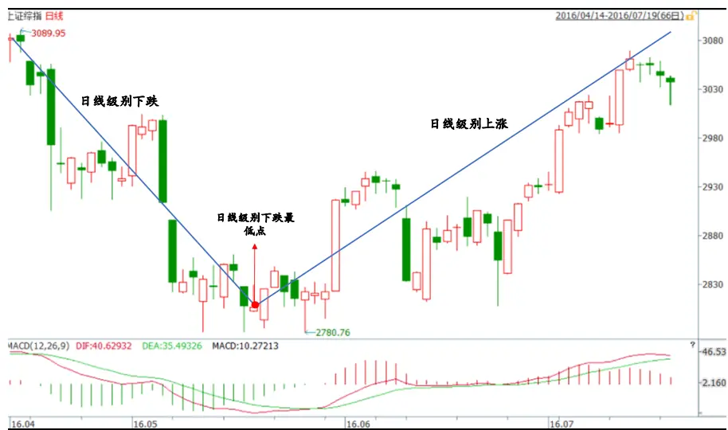
数据来源：WIND，国泰君安证券研究

这轮看似平常的日线级别行情，如果切换到 30 分钟图上，则会出现值得我们注意的现象。5月 19日，当日线级别下跌终点出现时，其对应的30 分钟级别行情正处于第 3 段下跌后的一段上涨中。当 30 分钟下跌的局部最低点出现时，日线级别上涨其实早已开启。换句话说，在基于DEA的分段规则下，日线级别的最低点与 30分钟级别的局部最低点所对应的时间在段数上出现了错位。

图 2 上证综指日线级别的最低点位于 30分钟级别局部最低点之前
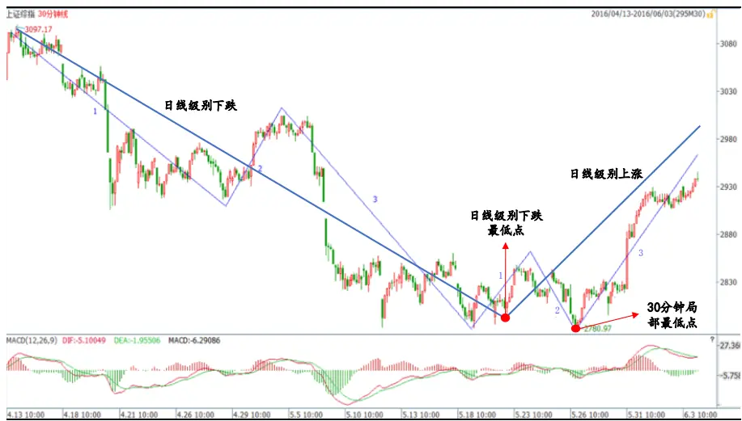
数据来源：WIND，国泰君安证券研究

## 1.2.中证 500指数 5月 18日日线级别底部发生级别错位

同一段时间，中证 500 指数也走出了类似的行情:指数同样从 2016 年 4月 14 日开始了一段日线级别下跌，在 2016 年 5 月 18 日见到日线级别底部，2016年6月 28 日确认了新一轮日线级别上涨。

图 32016年 5月18日，中证 500指数形成日线级别下跌底部
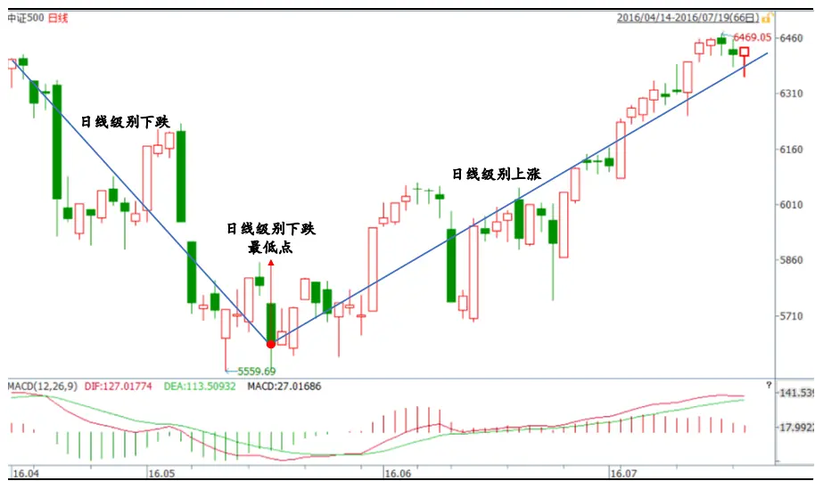
数据来源：WIND，国泰君安证券研究

如果将中证500指数切换到 30分钟图上，情况同样变得有所不同。5月18 日，当日线级别下跌终点出现时，其对应的 30 分钟级别行情局部最低点早已在5月 12日出现。中证 500的日线级别的最低点与 30 分钟级别的局部最低点所对应的时间点同样在段数上出现了错位。

图 4 中证 500指数日线级别最低点位于 30分钟级别局部最低点之后
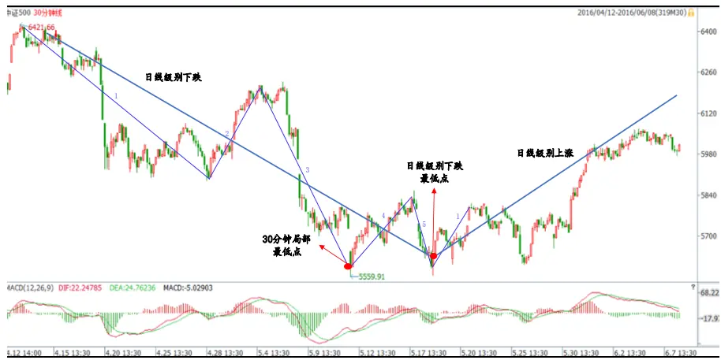
数据来源：WIND，国泰君安证券研究

## 1.3. 两种不同种类的错位均形成了日线级别上涨

上证综指与中证500虽同时发生级别错位，但这两种错位类型并不相同。上证综指错位中，30 分钟级别的局部最低点形成于日线级别最低点之后；而中证500指数错位中，30 分钟级别的局部最低点形成于日线级别最低点之前。换句话说，当上证指数的日收盘价已经止跌时，30分钟级别收盘价还在不断创新低；而当中证 500 指数的 30 分钟级别收盘价不再创新低时，日收盘价还在向下。

虽然出现了两种不同类型的错位，但却在错位之后出现了共同的结果。首先，两个指数在错位现象出现后，均形成日线级别上涨；其次，两个指数从错位发生到日线级别上涨确认，均间隔一个月以上。上证综指于2016年7月 4日确认日线级别上涨，于2016年5 月31 日出现了错位现象，之间间隔 22 个交易日；中证 500 指数于 2016 年 6 月 28 日确认日线级别上涨，于 2016 年 5 月 23 日出现错位现象，之间间隔 24 个交易日。

在这次错位现象基础上的日线级别反转行情形成后，我们联想到了以下两个重要问题：

- 历史上当指数形成了日线 -30 分钟级别错位时，是否在较大概率上预示着日线级别行情即将发生反转？

- 如果将级别错位作为拐点信号，并在此基础上形成具体的交易策略，这个策略的收益如何？

## 2. 级别错位的定义及预测成功概率统计

## 2.1. 级别错位的定义

第一部分中，我们已经提到级别错位是指这么一种现象：在基于 DEA的分段规则下，日线级别终点与 30 分钟级别局部极值点对应的时间点出现在不同的30分钟段上。

但这一描述无法成为构建交易策略的基础：只有当新的一段日线级别行情得到确认时，所谓的―日线级别终点‖才能得到确认；只有当新的一段30分钟级别行情得到确认时，所谓的―30分钟级别局部极值点‖才能得到确认；只有当所谓的―终点‖和―确认点‖都形成时，才能判断两者对应的时间点是否处在不同的 30 分钟段上。到了这个时候，趋势已形成，拐点已确认，无论是站在预测还是交易的角度，级别是否错位已没有意义。因此我们还需要一条站在当下的―级别错位‖定义。

站在当下的“级别错位”是指：日线级别趋势“终点”对应的时间点与 30分钟级别局部极值点对应的时间点分别位于不同的 30 分钟级别段上。这个定义看起来似乎与之前的描述无二，然而却有着本质的区别，原因在于这里的―终点‖是当下的、可操作的、但又不确定的终点。

换句话说，只要当下的日线级别行情最高（低）点与 30 分钟级别行情的局部极值点出现在不同的 30 分钟级别段上，则认为―级别错位‖发生:如果事后日线级别行情反转得到确认，则―级别错位‖得到确认，预测成功；如果日线级别行情继续沿着原有趋势延伸，出现了新的―终点‖，那么，原有―终点‖消失，―级别错位‖消失，预测失败。

定义完级别错位后，再对不同类别的级别错位进行定义:当 30 分钟级别的局部极值点位于日线级别“终点”时间维度右方，称之为“后错位”；反之，30分钟级别的局部极值点位于日线级别“终点”时间维度左方，称之为“前错位”。

## 2.2.级别错位的检验算法

为了能程序化级别错位的判断方法，我们在算法上给出了级别错位的数学表达。

## 2.2.1. 下跌行情中的“后错位”:

- 第n+1 段小级别终点 b高于第n+3段小级别终点d，即 $P_{b}>P_{d};$

- 大级别在 $[T_{A},T_{e}]$ 时间区间内的最低点 B 位于 [a , c] 区间内，即：

$$
\mathrm{MIN}\{\left.\mathrm{P}_{\mathrm{\tiny~T}}\ast\pi_{\beta}\right||\mathrm{\tiny~T}_{\ast\ast\beta||}\in[T_{A},T_{e}]\}\ \in\ [a,c]
$$

图 5 后错位（大级别处于下跌行情）示意图
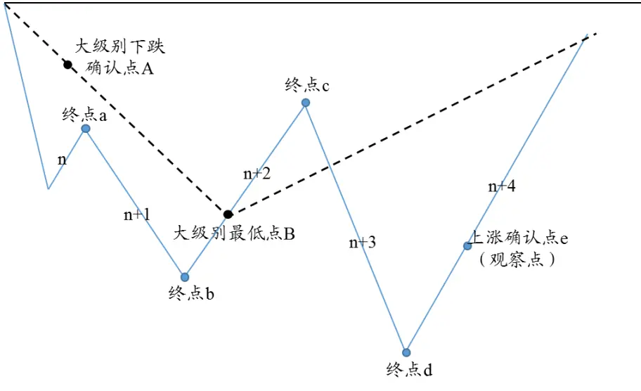
数据来源：国泰君安证券研究

## 2.2.2. 上涨行情中的“后错位”:

- 第n+1 段小级别终点 b低于第n+3段小级别终点d，即 $P_{b}<P_{d};$

- 大级别在 $[T_{A},T_{e}]$ 时间区间内的最高点 B 位于 [a , c] 区间内，即：

$$
\mathrm{MAX}\{\left.\mathrm{P}_{\mathrm{\scriptsize~T}}\pm\mathcal{R}_{\mathrm{\scriptsize~\mathrm{J}}}\right|\big|\mathrm{\scriptsize~T}_{\mathrm{\scriptsize~\star~a~n~f~l~}}\}\in\mathrm{~}[T_{A},T_{e}]\mathrm~\scriptsize~\}\in\mathrm{~\scriptsize~[\it~a~,\it~c]~}
$$

图 6 后错位（大级别处于上涨行情）示意图
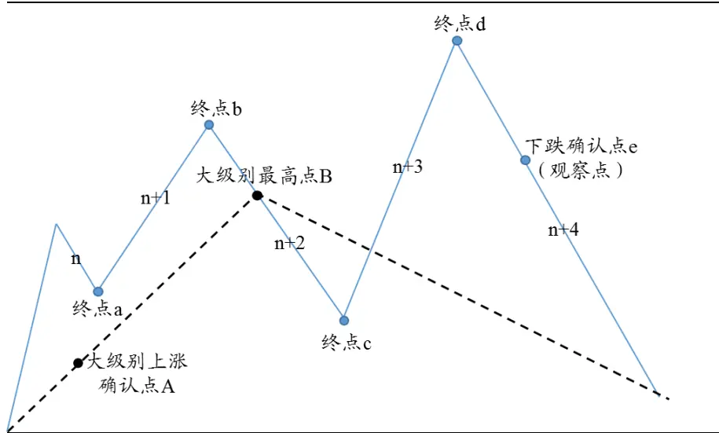
数据来源：国泰君安证券研究

## 2.2.3. 下跌行情中的“前错位”:

- 第n+1 段小级别终点 b低于第n+3段小级别终点d，即 $P_{b}<P_{d};$

- 大级别在 $[\mathrm{T_{A}},\mathrm{T_{e}}]$ 时间区间内的最低点B 位于 [c , e] 区间内，即

$$
\mathrm{MIN}\{\mathrm{P_{T}}\ast\mathrm{aga}||\mathrm{T}\ast\mathrm{aga}\}\in[T_{A},T_{e}]\ \}\ \in\ [c,e]
$$

图 7 前错位（大级别处于下跌行情）示意图
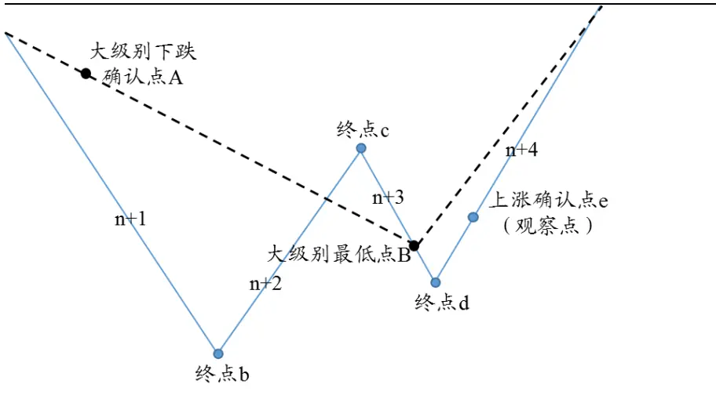
数据来源：国泰君安证券研究

## 2.2.4. 上涨行情中的“前错位”:

- 第n+1 段小级别终点 b高于第n+3段小级别终点d，即 $P_{b}>P_{d};$

- 大级别在 $[\mathrm{T_{A}},\mathrm{T_{e}}]$ 时间区间内的最高点B 位于 [c , e] 区间内，即

$$
\mathbf{MAX\{\exp_{T}\nmid T_{\lambda}\nmid\in\Sigma[T_{A},T_{e}]\}}\ \in\ [c,e]
$$

图 8 前错位（大级别处于上涨行情）示意图
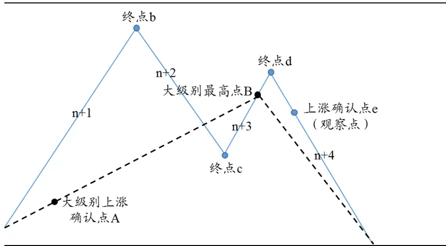
数据来源：国泰君安证券研究

## 2.3. 历史上，级别错位能在较高概率上预测到日线级别反转

从 2005 年 7 月以来，截至 2016 年 7 月初，上证综指共发生了 12 次级别错位，其中8次成功预测日线级别行情反转，预测成功率为 67%。从错位类型来看，―后错位‖共发生4次，成功预测3 次，预测成功率为 75%；―前错位‖发生 8次，成功5次，预测成功率为63%；从预测类型来看，预测顶部 5 次，成功 3 次，预测成功率为 60%；预测底部 7 次，成功 5次，预测成功率为71%。

表 1: 上证综指历史上级别错位 12次，其中有8次日线行情发生反转，成功率 67%

| 预测情形 | 成功预 测次数 | 错位发 生次数 | 总计预测 成功率 | 成功预 测次数 | 错位发 生次数 | 后错位预测 成功率 | 成功预 测次数 | 错位发 生次数 | 前错位预测 成功率 |
| --- | --- | --- | --- | --- | --- | --- | --- | --- | --- |
| 预测顶部 | 3 | 5 | 60% | 1 | 2 | 50% | 2 | 3 | 67% |
| 预测底部 | 5 | 7 | 71% | 2 | 2 | 100% | 3 | 5 | 60% |
| 合计 | 8 | 12 | 67% | 3 | 4 | 75% | 5 | 8 | 63% |

数据来源：WIND，国泰君安证券研究

从2007年7 月以来，截至 2016年7 月初，中证 500指数共发生了4次级别错位，其中3 次成功预测日线级别行情反转，预测成功率为 75%。从错位类型来看，―后错位‖共发生 2 次，成功预测 1 次，预测成功率为50%；―前错位‖发生2次，全部预测成功。从预测类型来看，预测顶部2次，成功1次，预测成功率为 50%；预测底部2 次，全部预测成功。

表 2: 中证500指数历史上级别错位发生 4次，成功预测大级别行情反转 3次，预测成功率 75%

| 预测情形 | 成功预 测次数 | 错位发 生次数 | 总计预测 成功率 | 成功预 测次数 | 错位发 生次数 | 后错位预测 成功率 | 成功预 测次数 | 错位发 生次数 | 前错位预测 成功率 |
| --- | --- | --- | --- | --- | --- | --- | --- | --- | --- |
| 预测顶部 | 1 | 2 | 50% | 1 | 2 | 50% | 0 | 0 | - |
| 预测底部 | 2 | 2 | 100% | 0 | 0 | - | 2 | 2 | 100% |
| 合计 | 3 | 4 | 75% | 1 | 2 | 50% | 2 | 2 | 100% |

数据来源：WIND，国泰君安证券研究

## 2.4.相较于段数对应关系，级别错位预测成功率更高

在之前的价格分段报告中，我们提到上证指数日线与 30 分钟行情的对应关系主要集中在1、3、5、7这几个数字，超过 7段的概率不到20%。那么当出现级别错位并发生级别反转时，到底是因为段数对应关系，还是因为错位本身，我们需要进行验证。这里我们对所有发生级别错位时日线与30分钟级别行情（合并后）的对应段数进行统计。

表 3:上证综指级别错位预测成功时，对应30分钟段数以 3段居多

| 预测成功 | 对应 30 分钟段数 | 预测失败 | 对应 30 分钟段数 |
| --- | --- | --- | --- |
| 1 | 5 | 1 1 | 3 |
| 2 | 7 | 1 2 | 1 |
| 3 | 3 | 3 | 17 |
| 4 | 3 | 4 1 | 7 |
| 5 | 3 | 1 |  |
| 6 | 5 | 1 |  |
| 7 | 1 | 1 |  |
| 8 | 3 |  |  |
| 平均 | 3.75 | 平均 | 7 |

数据来源：WIND，国泰君安证券研究

上证综指级别错位发生时，对应30分钟段数集中在3 和 5。预测成功情况下，3 段及5段共有 6次，没有超过7段的情况出现。中证500指数级别错位发生时，对应30分钟段数集中在 5段。

表 4:中证 500指数级别错位发生时，对应 30分钟段数集中在 3和 5

| 预测成功 | 对应 30 分钟段数 | 预测失败 | 对应 30 分钟段数 |
| --- | --- | --- | --- |
| 1 | 5 | 1 | 3 |
| 2 | 5 |  |  |
| 3 | 13 |  |  |
| 平均 | 7.67 | 平均 | 3 |

数据来源：WIND，国泰君安证券研究

一直以来，利用 DEA 价格分段择时的问题在于，当级别对应关系是 3或 5时，我们无法判断趋势继续延伸，还是出现拐点，而级别错位能帮助我们进行辅助判断。虽然历史上日线与 30 分钟级别对应关系以 3、5居多，但概率并没有大到帮助我们做一个较为确定性判断（确定性判断往往在7段时才能给出）。上证指数和中证500出现级别错位的 16次情况中，日线对应 30 分钟段数是 3 和 5 的共有 10 次，这 10 次错位有 8次成功发生日线级别反转。换句话说，当日线对应 30 分钟段数在 3或 5的时候发生了级别错位，那么有 80%的概率会发生日线级别反转。

## 3. 基于级别错位的投资策略及收益统计

## 3.1.基于级别错位的投资策略构建

在第2部分，我们对级别错位的信号正确率做了统计，取得了不错的结果。而在本部分，我们希望将拐点信号进一步加工为操作信号，能够直接形成交易策略。拐点信号与交易信号的区别在于：以预测日线级别底部为例，拐点信号只需一个买入点，而交易信号不仅需要给出买入点，还需要在信号正确时给出止盈点，信号错误时给出止损点，在此基础上才能够构建完整的交易策略并对历史数据进行回溯检验。

## 以日线级别底部操作为例：

- 买入点：级别错位确认点。当错位中的 30 分钟上涨行情确认时，为买入点。

- 基于信号正确的基础上，我们可以根据卖出点的不同构建两种投资策略——反转策略与动量策略:

反转策略：观察到级别错位时买入，日线级别上涨确认时时卖出。在预测正确的情况下，反转策略基本能够保证获取正的收益，但由于平仓时间较早，会错过日线级别上涨后半段收益。

动量策略：观察到级别错位时买入，等下一段日线级别下跌确认时卖出。在预测正确的情况下，动量策略不会错过延续部分的高收益，但如果在日线级别上涨确认即结束，动量策略可能会出现亏损。

图 9反转策略、动量策略对比图
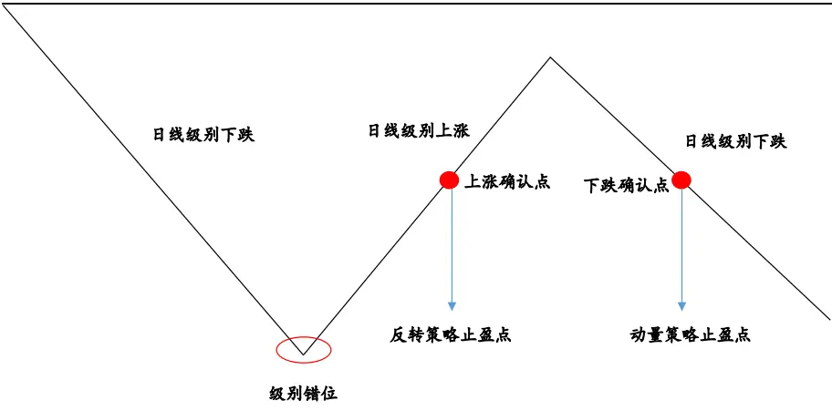
数据来源：国泰君安证券研究

- 由于信号的正误需要事后验证，所以当信号出现错误时，上述两种策略均需及时止损。考虑止损操作完善策略:日收盘价沿着原有下跌趋势继续延伸，直到级别错位消失时，止损卖出。

有了交易信号，再来具体测算不同情况发生时的收益率，首先是日线级别行情底部交易策略：

买入点：30分钟级别上涨确认点 B

止盈点：

- 反转策略（下图红色虚线）：日线级别上涨确认点 S1

- 动量策略（下图红色虚线）：日线级别下跌确认点 S2

止损点（下图绿色虚线）：日线级别创新低点S3

收益率：

- 反转策略收益率（以下简称反转收益率） $\mathbf{\Phi}\mathrm{~~\cdot~}=\left(\mathbf{\Phi}\mathbf{P}_{SI}-\mathbf{P}_{B}\right)\mathbf{\Phi}/\mathbf{P}_{B}\times100\%$

- 动量策略收益率（以下简称动量收益率） $=\left(P_{S2}-P_{B}\right)/P_{B}\times100\%$

- 止损操作收益率（以下简称止损收益率 $)=(P_{S3}-P_{B})/P_{B}\times100\%$

图 10 预测日线级别行情底部的交易时点
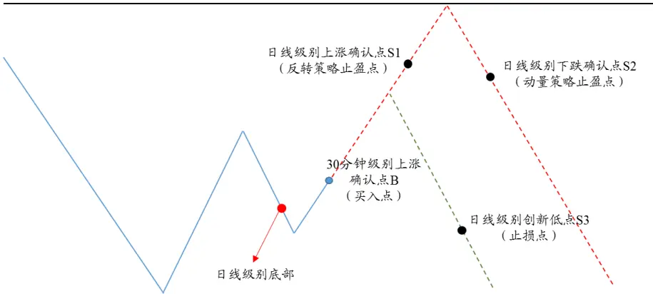
数据来源：国泰君安证券研究

预测日线级别行情顶部：

卖出点：30分钟级别下跌确认点 S

止盈点：

- 反转策略（下图红色虚线）：日线级别下跌确认点B1

## 收益率：

- 反转策略收益率（以下简称反转收益率 $)=(P_{S}-P_{BI})/P_{S}\times100\%$

- 动量策略收益率（以下简称动量收益率 $)=(P_{S}-P_{B2})/P_{S}\times100\%$

- 止损操作收益率（以下简称止损收益率 $)=(P_{S}-P_{B3})/P_{S}\times100\%$

图 11 预测日线级别行情顶部的交易时点
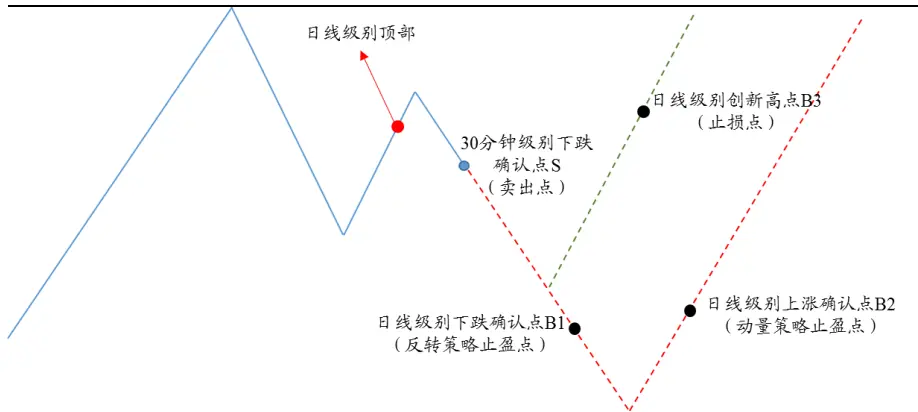
数据来源：国泰君安证券研究

## 3.2. 基于级别错位的投资策略收益统计

## 3.2.1. 上证综指基于前错位的动量策略单次平均收益 17.11%

上证综指基于后错位的反转策略单次平均收益3.20%，在预测成功情形下策略平均收益5.49%；基于后错位的动量策略单次平均收益-2.24%，预测成功情形下策略平均收益-1.53%。唯一一次预测失败情形下，亏损了 3.66%。

表 5: 上证综指后错位反转策略单次平均收益 3.20%，动量策略单次平均收益-2.24%

| 预测情形 | 买入点 | 是否成功预测 | 反转止盈点 | 动量止盈点 | 止损点 | 反转收益率 |  | 动量收益率止损收益率 |
| --- | --- | --- | --- | --- | --- | --- | --- | --- |
| 预测顶部 | 2010/9/16 10:00 | 失败 |  |  | 2010/10/8 |  |  | -3.66% |
| 预测顶部 | 2012/3/15 13:30 | 成功 | 2012/3/29 | 2012/5/2 |  | 5.38% | -2.45% |  |
| 预测底部 | 2016/3/2 15:00 | 成功 | 2016/4/5 | 2016/5/9 |  | 7.14% | -0.62% |  |
| 预测底部 | 2016/5/31 10:00 | 成功 | 2016/7/4 | - |  | 3.95% | - |  |

数据来源：WIND，国泰君安证券研究

上证综指基于前错位的反转策略单次平均收益 0.31%，在预测成功情形下策略平均收益3.76%；动量策略单次平均收益 17.11%，在预测成功情形下策略平均收益30.66%。三次预测失败情形下平均亏损5.46%。

表 6: 上证综指前错位反转策略单次平均收益 0.31%，动量策略单次平均收益 17.11%

| 预测情形 | 买入点 | 是否成功预测 | 反转止盈点 | 动量止盈点 | 止损点 | 反转收益率 | 动量收益率 | 止损收益率 |
| --- | --- | --- | --- | --- | --- | --- | --- | --- |
| 预测底部 | 2005/12/9 13:30 | 成功 | 2005/12/19 | 2006/8/4 |  | 2.32% | 41.95% |  |
| 预测顶部 | 2010/4/19 10:00 | 成功 | 2010/4/26 | 2010/8/2 |  | 3.68% | 13.31% |  |
| 预测底部 | 2010/12/13 13:30 | 失败 |  |  | 2010/12/27 |  |  | -3.79% |
| 预测底部 | 2011/8/25 11:00 | 失败 |  |  | 2011/9/5 |  |  | -3.84% |
| 预测顶部 | 2011/11/16 14:30 | 成功 | 2011/11/25 | 2012/2/3 |  | 3.44% | 5.46% |  |

| 预测底部 | 2012/1/9 14:30 | 成功 | 2012/2/3 | 2012/3/29 | 5.33% | 1.79% |  |
| --- | --- | --- | --- | --- | --- | --- | --- |
| 预测底部 | 2014/3/24 10:00 | 成功 | 2014/4/10 | 2015/7/2 | 4.06% | 90.76% |  |
| 预测顶部 | 2015/1/19 14:30 | 失败 |  | 2015/1/26 |  |  | -8.74% |
| 平均 |  |  |  |  | 3.76% | 30.66% | -5.46% |

数据来源：WIND，国泰君安证券研究

## 3.2.2. 中证 500基于前错位的反转策略单次平均收益 6.99%

中证 500指数基于后错位的反转策略单次平均收益-1.07%，在预测成功情形下策略平均收益 5.70%；动量策略单次平均收益-4.41%，其中在预测成功情形下策略平均收益-0.98%。失败情形下亏损 7.83%。

表 7: 中证 500 指数后错位反转策略单次平均收益-1.07%，动量策略单次平均收益-4.41%

| 预测情形 | 买入点 | 是否成功预测 | 反转止盈点 | 动量止盈点 | 止损点 | 反转收益率 | 动量收益率 | 止损收益率 |
| --- | --- | --- | --- | --- | --- | --- | --- | --- |
| 预测顶部 | 2008/12/23 15:00 | 失败 |  |  | 2009/1/20 |  |  | -7.83% |
| 预测顶部 | 2013/10/24 10:30 | 成功 | 2013/11/7 | 2013/11/29 |  | 5.70% | -0.98% |  |
| 平均 |  |  |  |  |  | 5.70% | -0.98% | -7.83% |

数据来源：WIND，国泰君安证券研究

中证500指数基于前错位的反转策略单次平均收益6.99%；动量策略单次收益 2.57%。

表 8: 中证500指数前错位反转策略单次平均收益6.99%，动量策略单次收益 2.57%

| 预测情形 | 买入点 | 是否成功预测 | 反转止盈点 | 动量止盈点 | 止损点 | 反转收益率 | 动量收益率 | 止损收益率 |
| --- | --- | --- | --- | --- | --- | --- | --- | --- |
| 预测底部 | 2007/12/4 10:00 | 成功 | 2007/12/19 | 2008/3/17 |  | 8.84% | 2.57% |  |
| 预测底部 | 2016/5/23 15:00 | 成功 | 2016/6/28 | - |  | 5.13% | - |  |
| 平均 |  |  |  |  |  | 6.99% | 2.57% |  |

数据来源：WIND，国泰君安证券研究

## 3.3.为什么 “前错位”能比“后错位”能获取更大的收益？

## 3.3.1. 基于前错位的动量策略获取收益远高于后错位

动量策略中，前错位获取收益远高于后错位。前错位的收益率为15.5%，高于后错位的-3.11%，。反转策略两种错位获取收益能力基本一致，平均获取收益均在1.7%左右。

表 9: 基于前错位构建的动量策略获取收益高于后错位

| 策略名称 | 后错位 | 前错位 |
| --- | --- | --- |
| 反转策略 | 1.78% | 1.64% |
| 动量策略 | -3.11% | 15.50% |
| 止损操作 | -5.74% | -5.46% |

数据来源：WIND，国泰君安证券研究

虽然预测成功率接近，但从赢亏比上看，―前错位‖比―后错位‖强不少。这到底是偶然，还是必然？

## 3.3.2. 买入点的不同是“前错位”收益高于“后错位”根本原因以日线底部行情操作为例，如预测成功，较之后错位，前错位的买入点

在时间上距离日线级别行情底部更近。―后错位‖（右图）中买入点 e 距离日线级别最低点B 相隔1-3 个 30分钟段，而―前错位‖（左图）中点e与点B 相隔不到1个 30 分钟段，而一个30分钟段平均要走 7 个交易日左右，故前错位的买入点较后错位距离大级别行情顶（底）部在时间上更近，买入成本上大概率会更低，一旦预测成功，收益会更高。

实际统计中，我们发现前错位的买入点与日线级别最低点相隔仅 1-4 个交易日，而后错位平均相隔7-20 个交易日。因此在投资策略上，遇到“前错位”，一定不要错过。

图 12 “前错位”买入点 e距离最低点B近
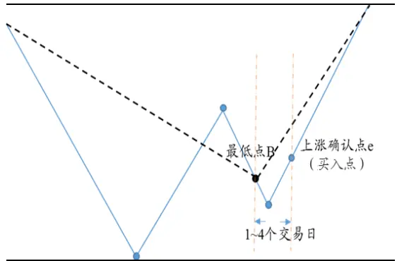
数据来源：国泰君安证券研究

图 13 “后错位”买入点 e距离最低点 B远
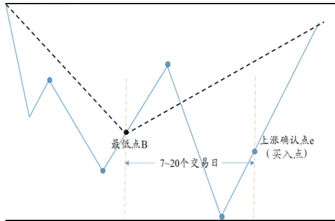
数据来源：国泰君安证券研究

## 4. 上证综指增强型日线级别策略年化收益率 15.30%

第3部分中，我们对两个指数基于级别错位的投资策略收益率进行了统计。本部分，我们想知道如果将该策略运用到我们基于日线级别的动量策略中进行增强，是否能够有效提升收益？由于中证 500指数发生的级别错位次数太少，故这里仅对上证综指历史数据进行回溯测试。

## 4.1. 基于日线级别的动量策略年化收益率 13.59%

传统的基于日线级别的动量策略，买入信号只有一个——日线级别上涨确认点，卖出信号也只有一个——日线级别下跌确认点，故该策略应在日线级别上涨确认点买入，在日线级别下跌确认点卖出。

上证综指自 2005 年 8 月 5 日首次买入以来，截至 2016 年 7 月 22 日，传统的基于日线级别的动量策略获得将近 300%的累计收益，累计超额100%以上，年化收益率 13.59%，最大回撤 54.89%，买入信号 24 次，买入信号胜率为30.43%，夏普比率为0.68，收益回撤比 0.25。

图 14基于日线级别的动量策略过去 10年获得近 3倍的累计收益
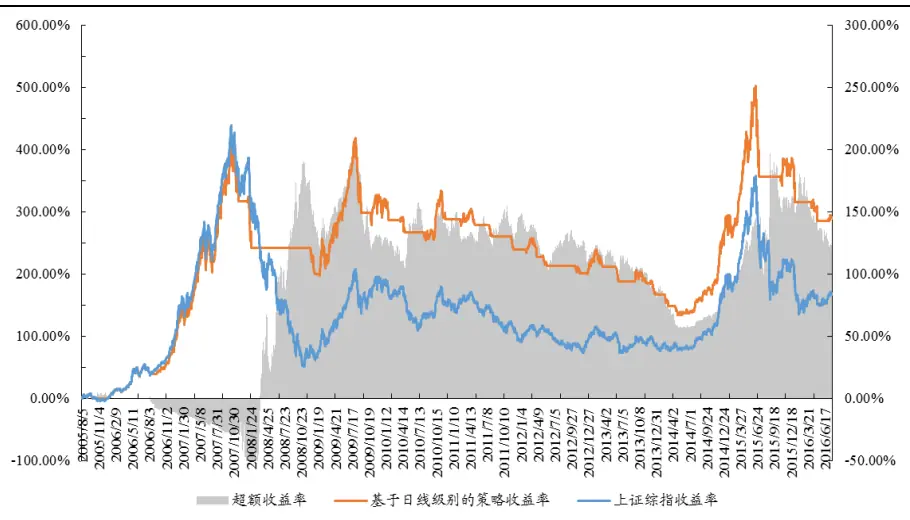
数据来源：WIND，国泰君安证券研究

表 10: 基于日线级别的动量策略年化收益率 13.59%，夏普比率 0.68

| 年化收益率 | 年化波动率 | 最大回撤 | 交易次数 | 胜率 | 夏普比率 | 收益回撤比 |
| --- | --- | --- | --- | --- | --- | --- |
| 13.59% | 20.13% | -54.89% | 47 | 30.43% | 0.68 | 0.25 |

数据来源：WIND，国泰君安证券研究

## 4.2.增强型日线级别动量策略年化收益率达到 15.30%

我们在日线级别动量策略基础上，加入级别错位交易策略，将其称之为增强型日线级别动量策略。相较于日线级别的动量策略，―增强型”策略增加了级别错位确认点作为买卖信号，以达到提前确认买卖点进行交易获取更大收益的效果，具体操作示意图如下：

图 15 日线级别正处于下跌行情中，买点确认及买入操作示意图
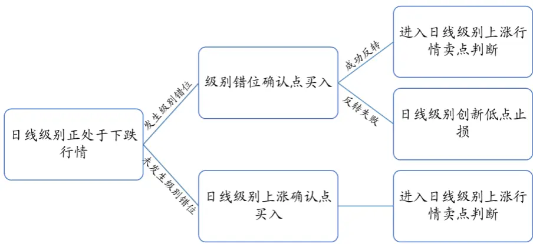
数据来源：国泰君安证券研究

图 16 日线级别正处于上涨行情中，卖点确认及卖出操作示意图
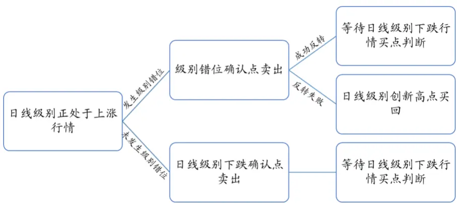
数据来源：国泰君安证券研究

上证综指自 2005 年 8 月 5 日首次买入以来，截至 2016 年 7 月 22 日，增强型日线级别动量策略年化收益率 15.30%，较之前提升了约 10%，同时最大回撤降低到了 50%之下，夏普比率也有所提升。

图 17过去 10年增强型日线级别动量策略获得的累计收益超过3.5倍
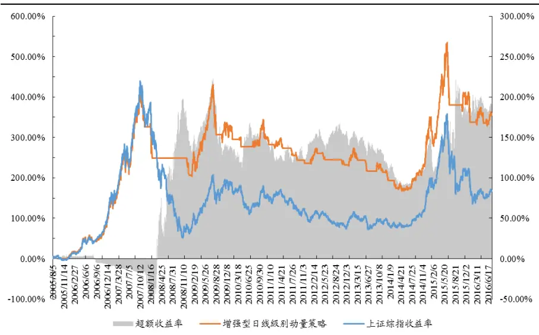
数据来源：WIND，国泰君安证券研究

表 11: 增强型日线级别动量策略年化收益率 15.30%，夏普比率 0.76

| 年化收益率 | 年化波动率 | 最大回撤 | 交易次数 | 胜率 | 夏普比率 | 收益回撤比 |
| --- | --- | --- | --- | --- | --- | --- |
| 15.30% | 20.33% | -49.49% | 55 | 33.33% | 0.76 | 0.31 |

数据来源：WIND、国泰君安证券研究

## 本公司具有中国证监会核准的证券投资咨询业务资格

## 分析师声明

作者具有中国证券业协会授予的证券投资咨询执业资格或相当的专业胜任能力，保证报告所采用的数据均来自合规渠道，分析逻辑基于作者的职业理解，本报告清晰准确地反映了作者的研究观点，力求独立、客观和公正，结论不受任何第三方的授意或影响，特此声明。

## 免责声明

本报告仅供国泰君安证券股份有限公司（以下简称―本公司‖）的客户使用。本公司不会因接收人收到本报告而视其为本公司的当然客户。本报告仅在相关法律许可的情况下发放，并仅为提供信息而发放，概不构成任何广告。

本报告的信息来源于已公开的资料，本公司对该等信息的准确性、完整性或可靠性不作任何保证。本报告所载的资料、意见及推测仅反映本公司于发布本报告当日的判断，本报告所指的证券或投资标的的价格、价值及投资收入可升可跌。过往表现不应作为日后的表现依据。在不同时期，本公司可发出与本报告所载资料、意见及推测不一致的报告。本公司不保证本报告所含信息保持在最新状态。同时，本公司对本报告所含信息可在不发出通知的情形下做出修改，投资者应当自行关注相应的更新或修改。

本报告中所指的投资及服务可能不适合个别客户，不构成客户私人咨询建议。在任何情况下，本报告中的信息或所表述的意见均不构成对任何人的投资建议。在任何情况下，本公司、本公司员工或者关联机构不承诺投资者一定获利，不与投资者分享投资收益，也不对任何人因使用本报告中的任何内容所引致的任何损失负任何责任。投资者务必注意，其据此做出的任何投资决策与本公司、本公司员工或者关联机构无关。

本公司利用信息隔离墙控制内部一个或多个领域、部门或关联机构之间的信息流动。因此，投资者应注意，在法律许可的情况下，本公司及其所属关联机构可能会持有报告中提到的公司所发行的证券或期权并进行证券或期权交易，也可能为这些公司提供或者争取提供投资银行、财务顾问或者金融产品等相关服务。在法律许可的情况下，本公司的员工可能担任本报告所提到的公司的董事。

市场有风险，投资需谨慎。投资者不应将本报告作为作出投资决策的唯一参考因素，亦不应认为本报告可以取代自己的判断。
在决定投资前，如有需要，投资者务必向专业人士咨询并谨慎决策。

本报告版权仅为本公司所有，未经书面许可，任何机构和个人不得以任何形式翻版、复制、发表或引用。如征得本公司同意进行引用、刊发的，需在允许的范围内使用，并注明出处为―国泰君安证券研究‖，且不得对本报告进行任何有悖原意的引用、删节和修改。

若本公司以外的其他机构（以下简称―该机构‖）发送本报告，则由该机构独自为此发送行为负责。通过此途径获得本报告的投资者应自行联系该机构以要求获悉更详细信息或进而交易本报告中提及的证券。本报告不构成本公司向该机构之客户提供的投资建议，本公司、本公司员工或者关联机构亦不为该机构之客户因使用本报告或报告所载内容引起的任何损失承担任何责任。

## 评级说明

| 1. 投资建议的比较标准 | 评级 |  |  |
| --- | --- | --- | --- |
| 投资评级分为股票评级和行业评级。 以报告发布后的12个月内的市场表现为 比较标准，报告发布日后的12个月内的 公司股价（或行业指数）的涨跌幅相对 同期的沪深300指数涨跌幅为基准。 | 股票投资评级 | 增持 | 相对沪深 300 指数涨幅 15%以上 |
|  |  | 谨慎增持 | 相对沪深 300 指数涨幅介于5%~15%之间 |
|  |  | 中性 | 相对沪深 300 指数涨幅介于-5%~5% |
|  |  | 减持 | 相对沪深 300 指数下跌 5%以上 |
|  |  | 增持 | 明显强于沪深 300 指数 |
|  |  | 中性 |  |
| 报告发布日后的12个月内的公司股价 （或行业指数）的涨跌幅相对同期的沪 深 300 指数的涨跌幅。 | 行业投资评级 减持 | 基本与沪深 300 指数持平 明显弱于沪深 300 指数 |  |

## 国泰君安证券研究

|  | 上海 | 深圳 | 北京 |
| --- | --- | --- | --- |
| 地址 | 上海市浦东新区银城中路168号上海 银行大厦29层 | 深圳市福田区益田路6009号新世界 商务中心34层 | 北京市西城区金融大街28号盈泰中 心2号楼10层 |
| 邮编 | 200120 | 518026 | 100140 |
| 电话 | （021）38676666 | （0755）23976888 | （010）59312799 |
| E-mail: gtjaresearch@gtjas.com |  |  |  |