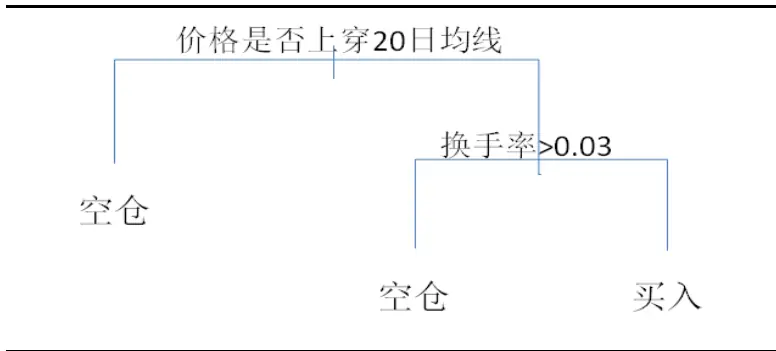
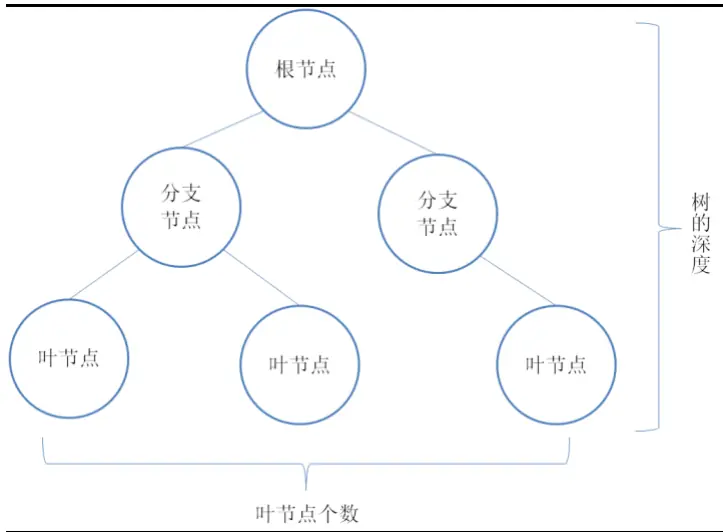
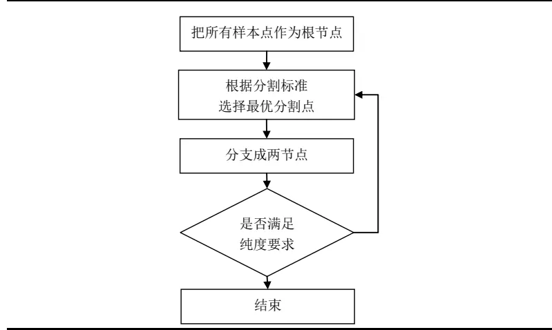
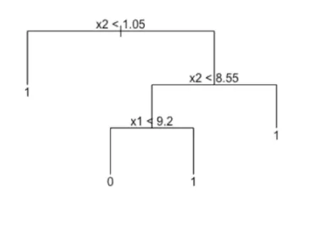
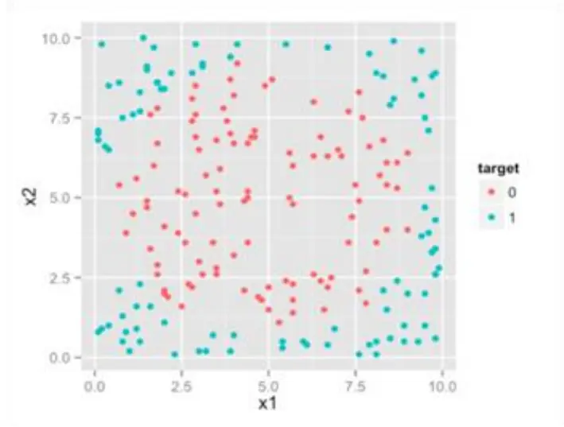
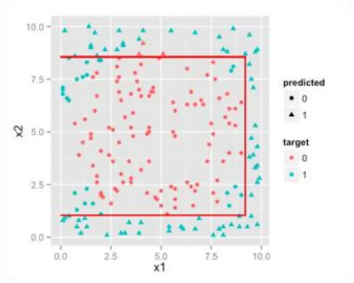
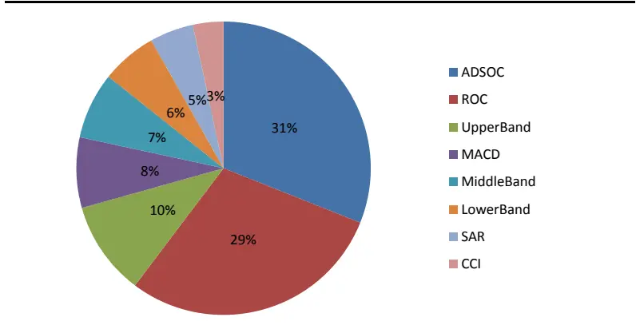
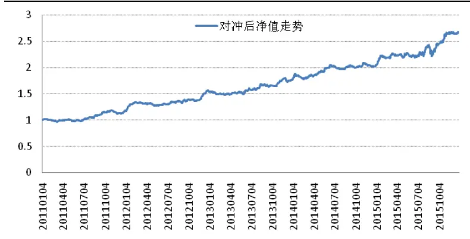
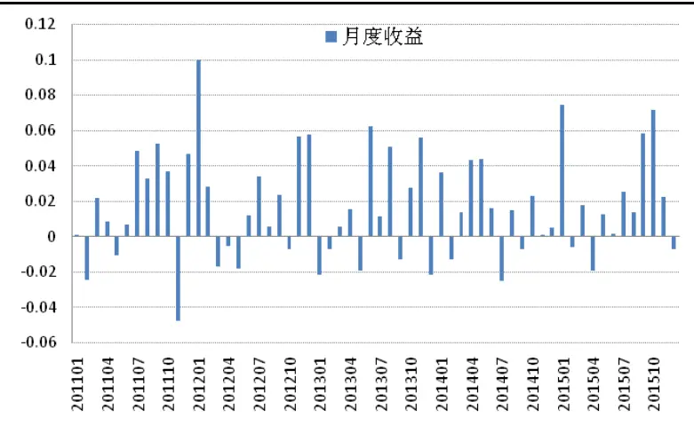

nInfo] [Table_Title] 2016.09.08

# 基于机器学习的牛股精选

## ――数量化专题之七十九

刘富兵（分析师）

陈奥林（研究助理）

8 021-38676673

021-38674835

liufubing008481@gtjas.com

证书编号 S0880511010017

chenaolin@gtjas.com

S0880114110077

## 本报告导读：

本文聚焦于如何综合运用多个技术指标，深入介绍了机器学习中决策树模型算法，同时通过该模型构建了选股策略并进行回测。此外，文章也对策略的稳定性和可扩展性进行了具体分析。

## 摘要：

le_Summary]决策树是通过一系列规则对数据进行分类的预测模型。它提供一种在什么条件下会得到什么值的类似规则的方法，相比神经网络、支持向量机等方法，其优点在于它是易于理解的“白箱”模型，可理解性更高。

- 决策树模型机器学习使得多个技术指标的综合运用成为可能。相比线性模型，决策树算法在处理非线性解释变量时，其表现要优于线性模型。

本文通过机器学习的方法构建了选股策略。以中证 500指数为对冲标的，从 2011年 1月至 2015年 12月，组合累计超额收益为 165%，年化收益可达 21%，信息比率 2.11，最大回撤 9.33%，发生于 2015年 8月下旬。

组合在各年份的收益率及信息比都比较稳定。基于机器学习策略在算法上和逻辑上与传统的多因子模型的区别，模型在一定程度上提供了较好的互补性，提高了收益的稳定性。

## 金融工程团队：

刘富兵：（分析师）

电话：021-38676673

邮箱：liufubing008481@gtjas.com

证书编号：S0880511010017

刘正捷：（分析师）

电话：0755-23976803

邮箱：liuzhengjie012509@gtjas.com

证书编号：S0880514070010

李辰：（分析师）

电话：021-38677309

邮箱：lichen@gtjas.com

证书编号：S0880516050003

## 陈奥林：（研究助理）

电话：021-38674835

邮箱：chenaolin@gtjas.com

证书编号：S0880114110077

## 孟繁雪：（研究助理）

电话：021-38675860

邮箱：mengfanxue@gtjas.com

证书编号：S088011604008

殷明（研究助理）

电话：021-38674637

邮箱：yinming@gtjas.com

证书编号：S0880116070042

## [Table_R相关报告

《拐点预测之级别错位研究》2016.08.03

《基于文本挖掘的主题投资策略》2016.07.05《基于奇异谱分析的均线择时研究》2016.06.22

《价格走势观察之基于均线的分段方法》2016.05.31

《事件驱动策略的因子化特征》2016.05.27

## 1. 概述

Alpha 策略是一种中性策略。它通过构造优于指数的股票组合，同时用股指期货对冲系统风险，使得策略无论在趋势市或者震荡市都能够获得稳定的超额收益。此外，它的另一个优势在于它有效回避了择时这一难题，仅需专注于选股。目前常见的 Alpha 策略包括有多因子、配对交易等。然而，随着机器学习的快速发展，神经网络、支持向量机等模型逐步走进量化交易领域。

机器学习是近几年投资领域新兴的研究方向，尽管复杂的机器学习模型通常在历史回测中表现较好，然而多数机器学习模型本身处于“黑箱”之中，缺乏清晰的投资逻辑。另一方面，机器学习模型参数较多，容易出现对历史数据的过度拟合。所以，许多机器学习类策略在真实交易中的表现常常不尽人意。相比之下，传统的线性模型简单易用、便于理解。但是，线性模型本身假定了各个因子与超额收益存在严格的线性关系，而事实上这个关系并不稳定。

本篇报告介绍的决策树选股法结合了多因子线性模型和黑箱模型二者的优点，在放松了模型线性假定的同时保证了模型的可理解性和可视化。策略通过对多个技术指标进行综合，试图寻找技术指标与股票涨跌的稳定关系，进而构建量化选股策略。本文的目的不仅旨在给投资者一个切实可行的交易策略，更是希望给量化投资者一种与众不同的选股框架。在该框架的基础上，投资者未来可以进一步纳入不同的预测因子，形成独特的交易策略。

## 2. 策略逻辑

根据《基于微观市场结构的择时策略》的研究结果显示，A股市场中跟随型交易者资金活动占比在市场中处于较高的水平（55%~65%）。然而，跟随型交易者通常没有投研团队的支持，在不具备信息和逻辑优势的条件下，则其在一定程度上倾向于根据技术指标进行投资。具体来说，技术指标最根本的逻辑在于反映证券市场某一时点供给需求的状态，亦或是投资者的情绪变化。投资者会根据一个或者多个自己偏好的技术指标的综合考量进行投资决策。其中，投资者的思考模式和决策方式是可以通过决策树模型进行概括和刻画的。

以图 1 展示的一个简易的投资决策过程为例，首先，投资者会选择在股价上穿 20 日均线的时候尝试进行买入操作。在此基础上，他再会根据换手率的大小来判断该标的是否能够容纳自身资金量。如果换手率足够大，就买入，如果换手率很小，则继续空仓。概括地说，他的投资决策国泰君安版权所有发送给国投瑞银基金管理有限公司.公用邮箱:res@ubs dic. om p3过程就可以用图 1中描述的一棵决策树表示。

图 1 投资决策过程展示

资料来源：国泰君安证券研究

可以看出，在投资决策的过程中，存在以下几个核心要点。首先，投资决策过程中的各个指标是递进而非并行关系。以图 1为例，只有当标的价格上穿 20 日均线后，投资者才会进一步观察换手率指标，而并非同时观察多个指标。其次，投资者对每个指标分配的权重也不完全相同，案例中投资者买入标的的原因更多是基于价格上穿均线后的动量而非换手率的高低。此外，指标变化对投资效用的影响不符合严格的线性特征。简单来说，例中的投资者更关心换手率是否大于 3%，而至于其是5%还是 10%，对投资者来说，效用差别并不大。总体来说，决策树模型对投资者投资决策的过程进行了系统化的展示。

具体而言，本文介绍的决策树模型通过对过去一段时间内技术指标和超额收益率关系的学习，试图找出市场上投资者交易过程中的一些投资规律，挖掘出技术指标间的共振关系，并据此来构建投资策略。

详细来说，本文首先根据区分度选出多个技术指标作为预测指标。进而基于本文的核心部分，我们将进一步用机器学习的方法寻找指标与未来收益的关系。最后，我们基于机器学习的结果，输入当下技术指标来预测下月超额收益率。

策略核心优势在于：首先，它是易于理解的“白箱”模型，实现了模型的可视化，提高了模型的可理解性。其中，我们不仅能够观察到模型形成的选股规则，而且还可以手动修正不符合逻辑的决策树策略。其次，决策树算法可以挖掘出多个技术指标间的共振。相比之下，常用的线性模型对此无能为力，原因是技术指标背后的构建逻辑多种多样，而其与股票价格的关系又大多不满足线性假设。最后，模型拥有较强的可扩展性，投资者可以自行增减或者改变技术指标或者基本面指标，创建个性化的交易策略。

## 3. CART 决策树算法简介

## 3.1. 算法综述

决策树模型是机器学习众多算法的一个分支，它是一个基于规则对数据进行分类的非参数模型，可用来自动探测出高度复杂数据的潜在结构、重要模式和关系。

一颗标准的决策树由叶节点、分支节点和根节点构成，其结构如下图：

图 2 决策树示意图

资料来源:国泰君安证券研究

概括的说，决策树算法实现了对样本空间的分组。假设我们选出了 n 个指标 $\mathrm{X}_{1},\mathrm{X}_{2},\cdots,\mathrm{X}_{\mathrm{n}},$ ，它们从 n个维度对证券价格变动进行了解释。在此基础上，我们根据 n个指标对总样本进行 N次分裂。最终，将原有的样本分为 $\mathbf{N}^{2}$ 个互不重叠的区域（即树中的叶节点） $\mathbf{R}_{1},\mathbf{R}_{2},\ldots,\mathbf{R}_{\mathrm{n}}{\mathrm{~c~}}$ 。其中，对于单一叶节点 $\scriptstyle\mathrm{\mathbf{R}}_{\mathrm{n}}$ 来说，我们根据该节点中上涨或下跌样本的占比多少作为该节点的标签。同时，标签类别样本占该节点总样本的比例，作为该节点的纯度。例如， ${\bf R}_{\mathrm{n}}$ 节点中，70%的样本相对指数能够产生超额收益，则我们定义 $\scriptstyle\mathrm{\mathbf{R}}_{\mathrm{n}}$ 节点是有正超额收益的，其纯度为 70%。

如何对区域进行划分是接下来要详细解释的问题。首先，从简化模型、便于解释的角度出发，决策树算法设臵区域划分的形状为矩形，即我们根据指标通过找到唯一的最优分割点，将样本直接切分为两个部分。此外，针对多个指标的综合运用方面，考虑到机器学习中常见的过度拟合问题以及程序实现的复杂度，决策树算法采用了贪婪的递归二元划分法。具体来说，贪婪体现于在每次分支时，决策树总产生在当前节点下的最优分割，即在选择最优解释变量的最优分割点时，实现的仅仅是该节点局部最优，而非决策树整体最优。简而言之，递归体现在对母数据集分割之后，递归地对每一个子节点进行分类，直至每个分支下都是一国泰君安版权所有发送给国投瑞银基金管理有限公司.公用邮箱:res@ubs dic. om p5样的分类，或者分类无法进一步改进为止。

总体来说，决策树算法相对于其他黑箱算法如神经网络或者支持向量机等的优势在于，决策树的规则不仅从逻辑上更加清晰易懂，更重要的是它符合实际投资中投资者的决策模式。然而，从模型精度的角度来看，相比线性模型，决策树算法在处理非线性解释变量时，其表现要优于线性模型。但是，在处理线性解释变量时不如线性模型精确。

## 3.2. 算法学习过程

决策树构建的核心步骤如下：

## 图 3 决策树学习过程

资料来源:国泰君安证券研究

## 3.2.1. 分割标准

由于我们在每个节点需要找到一个最优点来进行切分，所以首先我们需要对分割结果的优劣程度构建一个量化的评判标准。具体来说，评判分割优度的核心目的在于衡量分割后区域内样本的纯度，即我们关心每个区域内的样本是否都来自于同一类别。因此，在本篇报告中，我们使用Gini 不纯度指标来衡量分割的优劣程度，其目的在于找到一个最优点，从而能够在最大程度上将母节点中的样本根据类别进行区分。具体而言，在每个节点，我们遍历所有切分结果，将切分后能够使得 Gini 不纯度达到最低的切割点作为最优切割点。

Gini 不纯度指标的定义为：

$$
\mathsf{Gini}=\sum_{\mathbf{k}=1}^{\mathbf{K}}\mathsf{P}(\mathbf{m},\mathbf{k})\left(1-\mathsf{P}(\mathbf{m},\mathbf{k})\right)
$$

P(m,k)表示的是在第 m 个节点内第 k 个类别的观测点在总数目中的比例。在本文中，由于每次切分后生成两个新的节点，同时，节点内只分国泰君安版权所有发送给国投瑞银基金管理有限公司.公用邮箱:res@ubs dic. om p6上涨和下跌的股票，所以本文中 m=2、k=2。此外，每次切分后，我们将切分之后的两个子节点不纯度累加起来，作为本次切割的 Gini 值。不难看出，当两个子节点的 $\mathrm{P(m,k)}$ 等于 0或者 1时，Gini 不纯度指标值达到最小。换言之，模型完美的对母样本中上涨和下跌的个股进行了区分。

举例来说，我们运用决策树的方法对母节点的 400只股票进行切割，生成两个子节点 A和 B，每个子节点分别有 200只股票。此时，如果子节点 A的 200只股票全部为上涨，子节点 B的 200只股票全部为下跌，则此时 Gini 值达到最小值 0。相反地，如果子节点 A的股票样本皆为一半上涨，一半下跌，而子节点 B 的股票样本为 60%上涨，40%下跌。则Gini 值为 $0.5^{*}~(~1.0.5~)~+0.6^{*}~(~1.0.6~)~=0.49$

## 3.2.2. 剪枝

分析分类回归树的递归建树过程，不难发现它实质上存在着一个数据过度拟合问题。在决策树构造时，由于训练数据中的噪音或孤立点，许多分枝反映的是训练数据中的异常，使用这样的分类树对类别未知的数据进行分类，分类的准确性不高。因此试图检测和减去这样的分支，检测和减去这些分支的过程被称为树剪枝。树剪枝方法用于提高样本外数据分类的正确度。决策树常用的剪枝常用的剪枝方法有两种：预剪枝和后剪枝。

预剪枝是根据一些原则及早的停止树增长，如树的深度、节点中样本个数、Gini不纯度指标下降的最小幅度或者树的叶节点的个数等不能超过事先设定的阈值。预剪枝的核心问题是阈值的选择，如果设臵过严，那么将会导致过于限制树的生长，使决策树的表达式规则趋于一般，不能更好地对新数据集进行分类和预测，如果设臵过松，则无法达到剪枝的目的。

后剪枝则是通过在完全生长的树上剪去分枝实现的，通过删除节点的分支来剪去树节点，可以使用的后剪枝方法有多种，比如：代价复杂性剪枝、最小误差剪枝、悲观误差剪枝等等。后剪枝操作是一个边修剪边检验的过程，一般规则标准是：在决策树的不断剪枝操作过程中，将原样本集合或新数据集合作为测试数据，检验决策树对测试数据的预测精度，并计算出相应的分类错误率，如果剪掉某个子树后的决策树对测试数据的预测精度或其他测度不降低，那么剪掉该子树。

## 3.3. 决策树算法实例

下面我们通过实例加以说明， $\mathbf{X}_{1}$ ， ${\bf X}_{2}$ 是两个技术指标，Y 是二元变量，取值为 0 或者 1。首先，我们取得市场上所有的股票作为样本池。其次，国泰君安版权所有发送给国投瑞银基金管理有限公司.公用邮箱:res@ubs dic. om p7如图 4 所示，根据 $\mathbf{X}_{1}$ ， ${\bf X}_{2}$ 的取值，每只股票的超额收益方向由 Y的取值来表示，红色代表属于类别 0（负收益），蓝色代表属于类别 1（正收益）。

图 5 决策树算法过程
资料来源:国泰君安证券研究国泰君安版权所有发送给国投瑞银基金管理有限公司.公用邮箱:res@ub

从图 4 中可以大致看出， ${\bf X}_{2}$ 是决定 Y 变量取值的首要的因素，当 $\mathbf{X}_{2}$ 小于 1.05 或者大于 8.55 的时候，无论 $\mathbf{X}_{1}$ 为何值，Y 变量的取值都为 1。相对地，只有当 $\mathbf{X}_{2}$ 在处于 1.05 和 8.55 的范围内的时候，Y 变量的取值由 $\mathbf{X}_{1}$ 决定。其中，如何找出 Y 变量取值为 1 的区域则是机器学习的核心部分。

图 4 决策树算法实例

资料来源:国泰君安证券研究

如图 4 所示，决策树算法简单来说就是基于 $\mathbf{X}_{1},$ $\mathbf{X}_{2}$ 和 Y 取值的关系对原样本进行不断的切分。其目的在于，找到一个区域，且该区域 Y变量取值为 1概率较高。

此外，回顾之前介绍过的，决策树算法设臵区域划分形状为矩形，即决策规则在特征空间中其实是平行于坐标轴的直线，其最终将样本空间分割成了多个不重叠的多维矩形。

总体来说，如图 6所示，我们通过对原样本进行多次切分，最后可以得到红色区域部分的样本。从中可以看出，该区域内，Y取值为 1的概率明显较高。

图 6 决策树算法实例结果

资料来源:国泰君安证券研究

## 3.4. 指标贡献度评价

机器学习中，我们选取的指标都将作为股价运动的解释变量，也可被称作特征。在通过机器学习对总样本进行多次切分后，我们需要对每一个指标对样本纯度提升的贡献进行归因。这使得我们可以在把握每一个指标重要程度的同时，了解机器学习中对每一个指标的权重分配的情况。具体来说，当每一个节点根据指标 x分裂为两个子节点时，其中单个子节点的 Gini 不纯度相对于母节点会有所下降。所以，解释变量 x的绝对重要度为把所有根据解释变量x分割的节点带来的纯度下降累加起来的累加值。在此基础上，对所有解释变量的绝对重要度标准化，即可得到解释变量的相对重要度。解释变量越重要，代表它能够为模型带来越大的纯度提升。通常来说，越重要的指标离根节点也越近。

## 4. 基于机器学习的策略构建

## 4.1. 技术指标的选择

技术分析是一种基于量价数据来预测股价的未来走势的方法，其核心假定在于历史的可重复性，而这一假设能够长期成立的原因在于技术分析国泰君安版权所有发送给国投瑞银基金管理有限公司.公用邮箱:res@ubs dic. om p9在一定程度上是对投资者情绪的刻画，而投资者情绪的变化是蕴含一定规律的。具体来说，技术指标作为技术分析的组成部分，每一个技术指标就代表投资者情绪某一个维度的刻画。所以，单个技术指标在预测股票时有很大的局限性，但是如果能够有效结合多个技术指标，则对股价的预测稳定性就会大幅提升。接下来，我们会详细介绍 6个备选的技术指标，以及如何从中选出最有效的 3个技术指标进行策略构建。

首先我们选取了常见的8个技术指标作为决策树特征的备选项，分别是：

- 变动速率 ROC

- 平滑异同移动平均线 MACD

- 顺势指标 CCI

- 抛物线指标 SAR

- 累积派发指标 AD

- 布林线（其中，布林线的 3个三条轨道线分别作为 3个技术指标）

由于 SAR抛物线指标和布林线围绕价格变动，其数值大小与个股的价格相关，导致它们无法在不同个股中比较，所以本报告对指标进行了改造，使其数值变为价格的相对值。

## 4.1.1. 变动速率 ROC

变动速率 ROC 反映的是价格的动量，定义为当期价格与十周前价格的比例:

$$
{\mathrm{ROC}}={\frac{\mathrm{close}_{\mathrm{t}}}{\mathrm{close}_{\mathrm{t}-10}}}
$$

## 4.1.2. 平滑异同移动平均线 MACD

MACD 是股市中最常见的技术指标之一，他基于短期指数平均值与长期指数移动平均值的离差值研判走势，具体算法如下：

shortema= 2/13 close+ 11/13 shortema_(t-1) 
longema= 2/27 close+ 25/27 longema_(t-1) 
DIF=shortema-longema 
DEA= 2/10 DIF+11/13 DEA_(t-1) 
MACD=2（DEA-DIF）

## 4.1.3. 顺势指标 CCI

顺势指标 CCI用于对付极端行情，判断价格是否已超出常态分布范围，其定义为：

TP= (high+close+low)/3国泰君安版权所有发送给国投瑞银基金管理有限公

$$
\mathsf{MA}=\frac{\sum_{\mathrm{n=0}}^{11}\mathsf{close}_{\mathrm{t-n}}}{\mathrm{n}}
$$

$$
\mathrm{MD}=\sum_{\mathrm{n}=0}^{11}|\mathrm{MA}-\mathrm{close}_{\mathrm{t-n}}|
$$

$$
\mathrm{CCI}{=}\left(1/0.015\right)^{\ast}\mathrm{(TP-MA)/MD}
$$

## 4.1.4. 抛物线指标 SAR

抛物线指标 SAR 又叫或停损转向操作点指标，它把股票趋势分为上升式与下降式，当股价穿过 SAR 止损线时，则表明趋势改变。SAR 的计算公式为：

$$
\begin{array}{rl}&{\mathrm{~\_~E_{\ell}|^{4}*|_{\ell}^{4}*|_{\ell}SAR\_t{-}^{\ell=SAR\_(t-1)+AF(high\_(t-1)-SAR\_(t-1))}}}\\&{\mathrm{~\_~F_{\ell}|^{4}*|_{\ell}SAR\_t{-}^{\ell=SAR\_(t-1)+AF(low\_(t-1)-SAR\_(t-1))}}}\end{array}
$$

式中 AF 为加速因子，基值为 0.02，当价格每创新高(上升式)或新低(下降式)时按 0.02增加，直到 0.2为止，即 AF 取值范围在 0.02到 0.2之间。SAR 给出了止损价格，我们再根据 SAR 止损价格与当前股价的比值来衡量股价和止损点之间的相对距离。

## 4.1.5. 累积派发指标 AD

收集派发指标 AD的思想是大成交量的价格波动更加重要，它的定义是：

$$
{\mathrm{ADL}}=\sum{\frac{({\mathrm{close-low}})-({\mathrm{high-close}})}{\mathrm{high-low}}}\cdot{\mathrm{volume}}
$$

在其基础上有佳庆震荡指标，其常见的定义为 3 期 ADL 的移动平均与10 期的差值，即：

$$
\mathrm{\ ema_{i}=\frac{2}{i+1}ADL+\frac{i-1}{i+1}\mathrm{em}a_{t-1}}
$$

$$
\mathrm{AD0}=\mathrm{ema_{3}}-\mathrm{ema_{10}}
$$

## 4.1.6. 布林线

布林线指标是通过计算股价的“标准差”，给出了股价的“臵信区间”。

其定义为：

$$
\mathrm{Middleband}=\frac{\sum_{n=0}^{10}\mathrm{close}_{\mathrm{t-n}}}{\mathrm{n}}
$$

$$
\mathrm{\sf MD}=\sqrt{\frac{\sum_{\mathrm{n}=0}^{10}(\mathrm{close}_{\mathrm{t-n}}-\mathrm{Middleband})^{2}}{\mathrm{n}}}
$$

$$
\begin{array}{r}{\mathrm{Upperband}=\mathrm{Middleband}+2\mathrm{MD}}\\{\mathrm{Lowerband}=\mathrm{Middleband}-2\mathrm{MD}}\end{array}
$$

为了反映当前股价所在布林带的相对位臵，我们分别以布林线三条轨除以当期收盘价。

## 4.2. 预测指标的定义

我们关心当期技术指标是否能够预测对应个股相对中证500指数的超额收益率，所以我们定义预测指标 Y为二元 0-1变量，如果下月超额收益率为正，则预测指标 Y取值为 1；如果超额收益率为负，预测指标 Y取值为 0。

即

$$
\mathrm{Y_{t}^{i}}=\left\{\begin{array}{rl}{1,\quad}&{\mathrm{R}_{t+1}^{\mathrm{i}}>\mathrm{R}_{t+1}^{\mathrm{m}}}\\{0,\quad}&{\mathrm{R}_{t+1}^{\mathrm{i}}<\mathrm{R}_{t+1}^{\mathrm{m}}}\end{array}\right.
$$

式中， $\textrm{ \textbf { R } }_{-1+1}^{\textrm{ i }}$ 表示第 i 个股票在 t+1 月的涨跌幅。 $\mathrm{~R~}_{-1+1}^{\mathrm{~m~}}$ 表示中证 500指数在 t+1月的涨跌幅。

## 4.3. 核心指标选择

为了降低指标间的多重共线程度，本文将对备选指标进行提纯，剔除同质性较高的指标。具体来说，本文使用 2006年 12月至 2010年 12月的数据作为训练样本生成了一颗决策树。首先，我们根据 Gini 不纯度下降的程度，只留下 Gini 不纯度最低的 20 个叶节点。在此基础上，我们对每一次 Gini 不纯度的下降进行归因。例如，母节点 Gini 不纯度为 0.2，通过指标 A 进行切分后，子节点不纯度为 0.15，则下降的 0.05 作为指标 A 的贡献值。通过计算每个解释变量带来的 Gini 不纯度的下降和，即可求得 8个解释变量的重要度。在此基础上，我们对所有指标的贡献值进行归一化，可得到指标间相对贡献程度。国泰君安版权所有发送给国投瑞银基金管理有限公司.公用邮箱:res@ubs dic. om p12

从图 7 中可以看出，佳庆震荡指标最为有效，解释了 31%纯度提升。其次是动量指标 ROC和布林线上轨。三者一共可以解释模型 71%的变异，其余解释变量对被解释变量的相对解释能力都小于 10%。因此，本文将从备选指标中选取最重要的 3个指标来构建组合。

最终，我们选择佳庆震荡指标 ADSOC、变动速率 ROC 和布林线上轨UpperBand 作为最终的备选指标。

图 7 指标贡献评估

资料来源:国泰君安证券研究

## 4.4. 决策树模型构建

根据上述介绍，我们构造 CART 决策树分类模型。通过该模型，我们最终根据技术指标取值可以得到一个区域，该区域的股票大概率在下一期相对中证 500有超额收益。具体实现步骤如下：

## 4.4.1. 创建根节点

为了降低市场环境对模型预测能力的影响，同时提高模型预测的稳定性。我们以 T-100 周到 T-4 周作为观测期，把观测期内的数据集合并形成一个新的面板数据集。从中，我们可以观测到样本中所有股票的技术指标取值和预测指标取值。同时，我们将这个数据集就作为根节点。

## 4.4.2. 分割方式

每一个技术指标都可以对根节点进行一次切分，我们需要找到最优的分割方式，使得分裂后的子节点的 Gini不纯度指标达到最小。具体来说，遍历每一种分类方式，找到使得 Gini 指标值最小的分割方式，把根节点数据分成两个分支节点，并记录下最优分割方式。

## 4.4.3. 结束条件

使用步骤 2 依次遍历各个分支节点，直到节点个数达到给定上限值时，国泰君安版权所有发送给国投瑞银基金管理有限公司.公用邮箱:res@ubs dic. om p13决策树构造结束。如果 50%以上的样本取值为 1，则该叶节点分类为 1，其余情况叶节点分类为 0。而分类为 1的叶节点的纯度为 Y指标为 1的个数占叶节点样本总数的比例。

## 4.4.4. 剪枝

由于决策树根据最优点来进行切分的路径是确定的，在此基础上，为了控制模型的复杂度、提高其在样本外数据的表现，我们为决策树进行预剪枝设定：把叶节点个数上限设臵为 2倍的解释变量个数：6个。

## 4.5. 组合构建

## 4.5.1. 样本空间

考虑实际操作可行性，剔除停牌股票、剔除 ST 股票，同时为了更好的提高行业权重的分散化程度，策略以中证 500成分股作为股票池。

## 4.5.2. 目标组合

每月初，我们把 t_i-100 周到 t_i-4 周设为观测期，通过如上方法对样本进行切分，得出各区域中正超额收益样本的纯度。然后，找到纯度最高的区域所对应的技术指标状态，并以此构建本期股票池。在此基础上，选择前40只股票等权重作为投资组合。如果同一个区域股票超过40只，则使用 PE指标进行进一步区分。

## 4.5.3. 换仓频率

策略采取月度换仓的频率，同时使用周 K线构建技术指标。其中，策略在每月最后一个交易日构建投资组合，于次月第一个交易日均价进行换仓。

## 4.5.4. 建仓成本

手续费为单边千分之三，建仓成本为当日均价。同时，考虑到实际投资时的流动性，如果上期持仓股票、下期标的股票换手率小于万分之五或者当日停牌，将默认无法卖出、买入。

## 5. 决策树模型选股表现

由于策略的样本空间为中证 500 成份股，因此，我们选择中证 500 指数国泰君安版权所有发送给国投瑞银基金管理有限公司.公用邮箱:res@ubs dic. om p14作为对冲标的。

从图 8 中可以看出，基于决策树模型的策略呈现了稳定且显著的超额收益。从 2011年 1月至 2015年 12月，策略获得了 165%的累计超额收益，年化超额收益 21.55%，信息比率 2.11。 其中，最大回撤 9.33%，发生于 2015年 8月下旬。可以看出，从 2015年 6月开始的股灾期间，由于市场切换为极端模式，机器学习的训练样本中并没有遇到过这种情况，所以模型失效，导致了策略较大的回撤。但整体来说，策略收益曲线比较稳定。

图 8 对冲中证 500指数的累计超额收益

资料来源:国泰君安证券研究

从图 9 中我们可以具体看到组合月度超额收益情况。组合整体月超额收益胜率 70%，单月最大负收益为-4.2%，出现于 2011 年 11 月。但是，2011 年 12 月之后几个月组合收益大幅回升。整体来说，组合收益在月度上的表现较为稳定。

图 9 月度超额收益

资料来源:国泰君安证券研究

表 1展示了组合各年份的超额收益，可以看出，组合在各年份的收益及信息比都比较稳定。值得一提的是，组合在 2011 年和 2012 年表现较好，国泰君安版权所有发送给国投瑞银基金管理有限公司.公用邮箱:res@ubs dic. om p15而同期多因子选股策略普遍表现较弱，从而体现出机器学习模型与其他策略较好的互补性。

表 1 组合年度超额收益

| 年份 | 2011 | 2012 | 2013 | 2014 | 2015 |
| --- | --- | --- | --- | --- | --- |
| 收益率 | 17.81% | 30.24% | 14.45% | 14.88% | 28.77% |
| 信息比率 | 2.04 | 3.13 | 1.52 | 1.98 | 2.08 |
| 最大回撤 | 5.58% | 5.22% | 4.60% | 5.32% | 9.33% |

资料来源:国泰君安证券研究

## 6. 总结与后续研究展望

本文给出了一个以决策树算法为核心的选股策略。首先，本文为机器学习策略开发提供了研究框架。此外，机器学习可以有效容纳变量非线性的特征，使得多个技术指标的综合运用效率有所提升。与此同时，相比神经网络、支持向量机等黑箱模型，决策树算法更加透明。

但是，本文目前仅聚焦于介绍机器学习算法的逻辑框架，并未对指标以及决策树深度做过多的要求。未来，在现有模型的基础上，我们将尝试寻找并纳入其他有效且富有逻辑的指标。同时，我们也将从算法精度的角度出发，对决策树算法进行提升。

## 本公司具有中国证监会核准的证券投资咨询业务资格

## 分析师声明

作者具有中国证券业协会授予的证券投资咨询执业资格或相当的专业胜任能力，保证报告所采用的数据均来自合规渠道，分析逻辑基于作者的职业理解，本报告清晰准确地反映了作者的研究观点，力求独立、客观和公正，结论不受任何第三方的授意或影响，特此声明。

## 免责声明

本报告仅供国泰君安证券股份有限公司（以下简称“本公司”）的客户使用。本公司不会因接收人收到本报告而视其为本公司的当然客户。本报告仅在相关法律许可的情况下发放，并仅为提供信息而发放，概不构成任何广告。

本报告的信息来源于已公开的资料，本公司对该等信息的准确性、完整性或可靠性不作任何保证。本报告所载的资料、意见及推测仅反映本公司于发布本报告当日的判断，本报告所指的证券或投资标的的价格、价值及投资收入可升可跌。过往表现不应作为日后的表现依据。在不同时期，本公司可发出与本报告所载资料、意见及推测不一致的报告。本公司不保证本报告所含信息保持在最新状态。同时，本公司对本报告所含信息可在不发出通知的情形下做出修改，投资者应当自行关注相应的更新或修改。

本报告中所指的投资及服务可能不适合个别客户，不构成客户私人咨询建议。在任何情况下，本报告中的信息或所表述的意见均不构成对任何人的投资建议。在任何情况下，本公司、本公司员工或者关联机构不承诺投资者一定获利，不与投资者分享投资收益，也不对任何人因使用本报告中的任何内容所引致的任何损失负任何责任。投资者务必注意，其据此做出的任何投资决策与本公司、本公司员工或者关联机构无关。

本公司利用信息隔离墙控制内部一个或多个领域、部门或关联机构之间的信息流动。因此，投资者应注意，在法律许可的情况下，本公司及其所属关联机构可能会持有报告中提到的公司所发行的证券或期权并进行证券或期权交易，也可能为这些公司提供或者争取提供投资银行、财务顾问或者金融产品等相关服务。在法律许可的情况下，本公司的员工可能担任本报告所提到的公司的董事。

市场有风险，投资需谨慎。投资者不应将本报告作为作出投资决策的唯一参考因素，亦不应认为本报告可以取代自己的判断。
在决定投资前，如有需要，投资者务必向专业人士咨询并谨慎决策。

本报告版权仅为本公司所有，未经书面许可，任何机构和个人不得以任何形式翻版、复制、发表或引用。如征得本公司同意进行引用、刊发的，需在允许的范围内使用，并注明出处为“国泰君安证券研究”，且不得对本报告进行任何有悖原意的引用、删节和修改。

若本公司以外的其他机构（以下简称“该机构”）发送本报告，则由该机构独自为此发送行为负责。通过此途径获得本报告的投资者应自行联系该机构以要求获悉更详细信息或进而交易本报告中提及的证券。本报告不构成本公司向该机构之客户提供的投资建议，本公司、本公司员工或者关联机构亦不为该机构之客户因使用本报告或报告所载内容引起的任何损失承担任何责任。

## 评级说明

## 1.投资建议的比较标准

投资评级分为股票评级和行业评级。

以报告发布后的12个月内的市场表现为比较标准，报告发布日后的12个月内的公司股价（或行业指数）的涨跌幅相对同期的沪深300指数涨跌幅为基准。

## 2.投资建议的评级标准

报告发布日后的 12 个月内的公司股价（或行业指数）的涨跌幅相对同期的沪深300指数的涨跌幅。

|  | 评级 说明 |  |
| --- | --- | --- |
| 股票投资评级 | 增持 | 相对沪深300指数涨幅15%以上 |
|  | 谨慎增持 | 相对沪深300指数涨幅介于5%～15%之间 |
|  | 中性 | 相对沪深300指数涨幅介于-5%～5% |
|  | 减持 | 相对沪深300指数下跌5%以上 |
| 行业投资评级 | 增持 | 明显强于沪深 300指数 |
|  | 中性 | 基本与沪深300指数持平 |
|  | 减持 | 明显弱于沪深 300指数 |

## 国泰君安证券研究

|  | 上海 | 深圳 | 北京 |
| --- | --- | --- | --- |
| 地址 | 上海市浦东新区银城中路168号上海 银行大厦29 层 | 深圳市福田区益田路 6009 号新世界 商务中心34层 | 北京市西城区金融大街 28 号盈泰中 心2号楼10层 |
| 邮编 | 200120 | 518026 | 100140 |
| 电话 | （021)38676666 | （0755）23976888 | (010)59312799 |