nInfo] [Table_Title]2016.09.11

# 基于 MACD 的价格分段研究 3.0

## ——数量化专题之八十

刘富兵（分析师）

孟繁雪（研究助理）

8 021-38676673

021-38675860

liufubing008481@gtjas.com

mengfanxue@gtjas.com

证书编号 S0880511010017

S088011604008

## 本报告导读：

报告对原有价格分段体系进行扩充，补充了价格突破而指标未穿越零轴情况下的波段确认规则，并关注符合该规则情况的走势延伸及反转情况。

## 摘要：

le_Summary]本篇报告对原有 MACD 价格分段中的波段确认规则做了进一步补充，对于价格已经突破前高（或前低）同时DEA未穿越0 轴的情况，当下即可确认新波段走势方向而不需要 DEA 穿越 0轴；走势特征表现为下跌中快速拉升或上涨中快速下跌而导致的快速突破。

快速突破的动量延续概率较大，数据结果显示上证指数日线级别 100%会出现波段延续确认点，即价格延续原有趋势同时 DEA 指标穿越 0 轴，30 分钟级别出现价格延续指标穿越 0轴的概率为 88%左右，5 分钟级别 78%左右, 各级别向上突破平均潜在空间分别为 18%，6.5%，1.6%，向下突破平均潜在空间分别为 26%，2.7%，2%；快速突破情况在日线及30分钟级别只有一次是突破后 22 根 K 线才出现指标穿越 0 轴确认波段延续，其他均在 5根K线及以内可确认波段方向延续。

大小级别联立分析快速突破走势情况：上证指数 30 分钟级别向上快速突破且日线级别处于上涨段时，大小级别产生共振，走势容易形成延续，而当 30 分钟前一上涨段的走势较为复杂，即 5分钟级别走势超过 5 段时，突破力度更大，波段延伸幅度更大，30分钟级别共出现 3次，突破后至少继续上涨 10%。

30 分钟级别突破方向与日线级别方向不一致且在突破时间不超过上一个局部极值点 2个交易日时，此时由于大级别力度并未形成明显衰竭，容易形成大级别走势的延续，也即小级别走势的反转，30分钟级别共出现 4次均形成拐点。

以下跌段中的快速向上突破未延续而随后继续下跌的情况为例（上涨段中的快速向下突破未延续而随后继续上涨的情况与之相仿），我们观察到这种失败的上涨会消耗上涨动能；随后再次上涨力度会相对较弱，即随后的上涨段确认后大概率会反转，30分钟级别共出现3 次。

金融工程

## 金融工程团队：

刘富兵：（分析师）

电话：021-38676673

邮箱：liufubing008481@gtjas.com

证书编号：S0880511010017

刘正捷：（分析师）

电话：0755-23976803

邮箱：liuzhengjie012509@gtjas.com

证书编号：S0880514070010

李辰：（分析师）

电话：021-38677309

邮箱：lichen@gtjas.com

证书编号：S0880516050003

## 陈奥林：（研究助理）

电话：021-38674835

邮箱：chenaolin@gtjas.com

证书编号：S0880114110077

## 孟繁雪：（研究助理）

电话：021-38675860

邮箱：mengfanxue@gtjas.com

证书编号：S088011604008

## 殷明（研究助理）

电话：021-38674637

邮箱：yinming@gtjas.com

证书编号：S0880116070042

《基于文本挖掘的主题投资策略》2016.07.05《基于奇异谱分析的均线择时研究》2016.06.22

《价格走势观察之基于均线的分段方法》2016.05.31

## 1. MACD 价格分段规则回顾

基于 MACD 的价格分段体系在之前的系列报告中有较为详细的阐述，该体系主要是基于 MACD指标 DEA对波段划分做出定义，从而辅助研判市场走势。

波段定义规则：（1）波段低点对应 MACD 的 DEA 指标 <0，波段顶点对应 MACD 的 DEA 指标 >0；（2）每个波段中价格的最大值和最小值只出现在波段的起点或终点。

波段划分以两种形式确定新波段的形成，波段当下形成确认规则之一：C点位臵：①MACD的 DEA指标从零轴下方穿过零轴；

②从 B开始的上涨行情到达 C创反弹以来的最高。

B是拐点得到确认：AB波段结束，BC波段形成

图 1波段当下形成确认规则之一
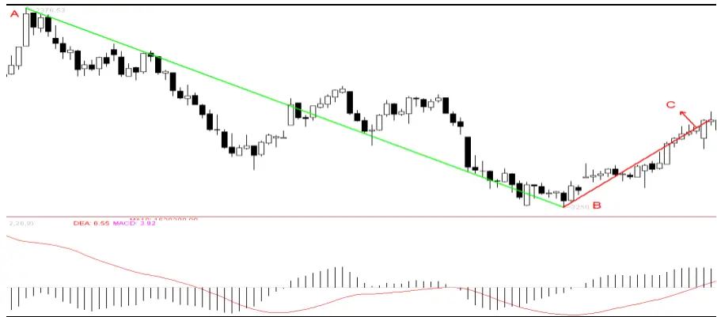
数据来源：国泰君安证券研究

波段当下形成确认规则之二：

C 点位臵：①MACD 的 DEA 指标小于零；②从 B 开始的行情创反弹以来的最高。B点是拐点不能确认！

D 点位臵：①MACD 的 DEA 指标大于零；②从 B 开始的行情创反弹以来的最高。B点是拐点得到确认！

图 2波段当下形成确认规则之二
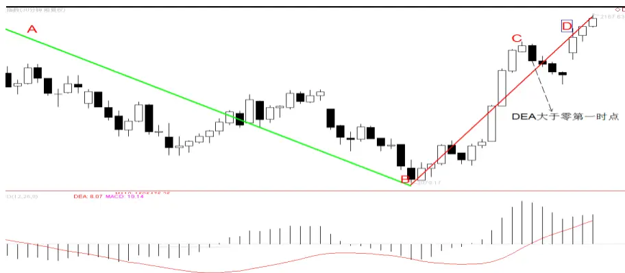
数据来源：国泰君安证券研究

观察图 3 中快速突破情况，C 创 A 价格新高但 DEA<0，此时按照前面两种波段划分确认规则暂时不能确认波段向上，但若价格未能向上确认且出现 D 处价格创 B 处新低，则包含 C 处的 AD 下跌段的高点在 C 处而非 A处，不符合波段划分价格高低点在波段首尾的规则。

图 3 快速突破情况
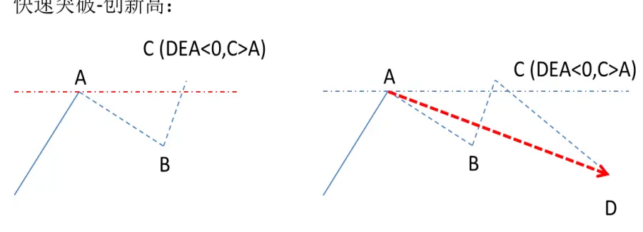
数据来源：国泰君安证券研究

因此我们补充第三条规则作为波段当下形成确认规则之三，即当 C处价格位于 BC 段高（低）点但 DEA<0（DEA>0）的情况时，若 C 处价格已经创 A处新高（低），此时应当确认 B为拐点，即 BC形成上涨段（下跌段）。

图 4波段当下形成确认规则之三
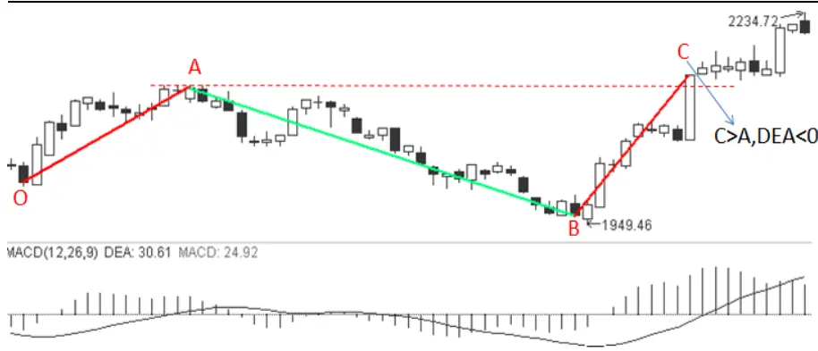
数据来源：国泰君安证券研究

第三条波段确认规则的走势特征表现为，下跌过程中的快速拉升形成快速突破，此时价格创新高而指标未能穿越 0轴。我们希望进行更精细的研究，观察第三条波段确认规则下其后的走势情况，从而对原有研究体系进一步扩充。本篇报告第 2章测算了第三条波段确认规则随后的波段延续概率，延续周期及幅度；第 3章通过大小级别走势联立，探讨了快速突破成为拐点或大幅度延伸的情境；第 4章研究了快速突破未形成波段延续其后的走势情况。

## 2. 快速突破走势分析

经分析对于图 3中 C处的快速突破，可以确认新的波段形成，此时价格快速拉升使得价格创新高或新低而 DEA 指标未能穿越 0 轴，以原有的两个确认规则作为基础，其后分为两种走势情况。

以向上突破为例，一种情况如图 5 所示，C 点突破后价格继续向上并伴随指标穿越 0轴，则向上波段在原有两个确认规则下确认并延续。

图 5快速突破之突破后延续（价格创新高，指标穿越 0轴）
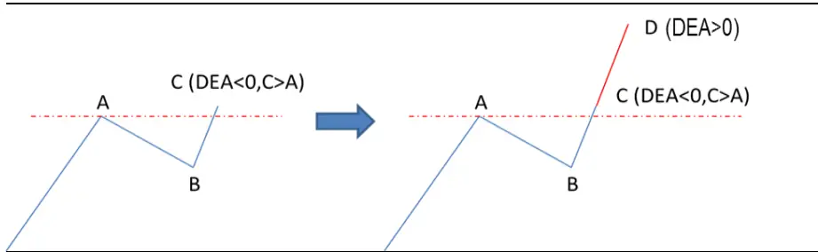
数据来源：国泰君安证券研究

另一种情况如图 6 所示，C 点突破后未能出现价格上涨伴随指标穿越 0轴，向上波段在原有两个确认规则下无法确认，快速突破点 C为局部高点，形成反转。

图 6快速突破之突破后反转
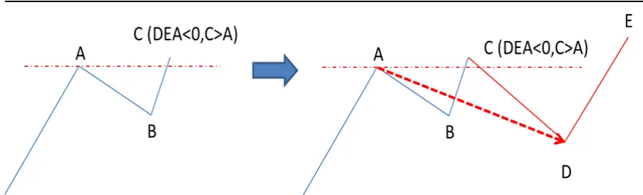
数据来源：国泰君安证券研究

## 2.1.快速突破，随后大概率确认波段延续

图 7 为快速突破情况下的走势延续示意图，其中 AB 段已经形成下跌方向，C处价格突破 A处新高但 DEA小于 0，按照波段确认规则三，C处可确认 BC 向上波段形成，基于原有的 2 个波段确认规则，我们定义 D处为波段延续确认点（指标穿越 0 轴且为 BD 段的高点），用于辅助判断走势波段延续情况。

图 7快速突破走势延续情况
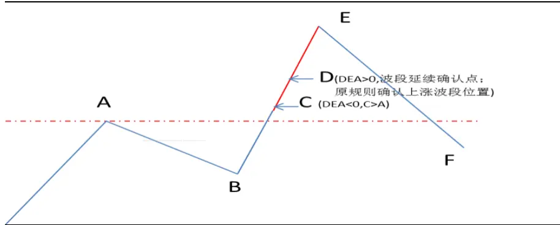

数据来源：国泰君安证券研究

上证指数快速突破出现情况较少，BC 段这种下跌中快速拉升或上涨中快速下跌的走势，动量延续的可能性更大，数据结果显示日线级别 100%会出现波段延续确认点 D，价格延续 DEA 指标穿越 0 轴，30 分钟级别出现价格延续指标穿越 0轴的概率为 88%左右，5分钟级别 78%左右。

如图 7 所示，D 为波段延续确认点，E 为波段拐点，为了观察快速突破出现后的波段延续情况，我们在表 1中统计了波段延续确认点 D出现的情况下，CD段的平均持续周期及幅度，DE段的持续周期及幅度。其中日线级别 CD 段 100%延续，且规则清楚可交易，DE 段在日线及 30 分钟级别延续幅度有较大空间，从操作角度有进一步研究的意义，同时我们在最后一页列出了上证指数日线级别及 30 分钟级别所有的快速突破情况。

表 1 上证指数快速突破的波段延续情况（测试范围：日线 1991-2015.5.30 分钟级别 2005-2016.5.30）

| 级别 | 状态 | 样本 数 | 波段延续 确认概率 | CD 波段平 均周期 | CD 波段平 均幅度 | 确认后 DE 平均周期 | 确认后 DE 平均幅度 | DE最 大值 | DE最 小值 | DE标 准差 |
| --- | --- | --- | --- | --- | --- | --- | --- | --- | --- | --- |
| 日线 | 新高 | 5 | 100.00% | 2.2 | 5.18% | 21.2 | 12.12% | 35.56% | 0.00% | 14.41% |
| 日线 | 新低 | 3 | 100.00% | 4 | 1.29% | 69.3 | 24.78% | 61.38% | 3.95% | 31.79% |
| 30分钟 | 新高 | 16 | 87.50% | 3.2 | 0.48% | 59.9 | 6.04% | 21.52% | 0.37% | 5.57% |
| 30分钟 | 新低 | 9 | 88.90% | 2.3 | 0.46% | 35.5 | 2.21% | 5.52% | 0.00% | 1.88% |
| 5分钟 | 新高 | 58 | 77.60% | 5.2 | 0.24% | 43.2 | 1.34% | 7.88% | 0.00% | 1.87% |
| 5分钟 | 新低 | 69 | 78.30% | 9.3 | 0.23% | 62.6 | 1.73% | 11.41% | 0.00% | 2.02% |

数据来源：国泰君安证券研究

## 2.2.快速突破，随后大概率 5 个周期及以内确认波段延续

对于图 7中快速突破随后出现指标穿越 0 轴确认波段延续的情况中，日线及30分钟级别只有一次是在突破后22根K线才出现D点指标穿越0轴确认波段延续，其他均在 5根 K线及以内可确认波段方向延续。5 分钟级别可确认波段延续的情况中73%的概率会在5根K线及以内确认波段延续，也即这种快速拉升或下跌的走势形态会较快带动波段延续，使得指标穿越 0轴。

从交易的角度考虑，由于快速突破时大概率波段会延续，可直接按照走势突破方向操作，直到指标穿越 0轴确认波段延续，若 5根 K线及以内未能穿越 0轴确认走势延续，则该突破可能是假突破并成为局部拐点，需平仓止损。若形成，可考虑延续情况平仓。

图8为30分钟级别2012年11月17日出现的一次下跌过程中C创前高的快速突破情况，而随后并不能较快的指标穿越价格延续，22根 k线后才在 D处指标穿越且价格创新高；此时上涨波段可能接近尾声，随后出现一段下跌。

图 8快速突破 22个周期后确认波段延续示意图

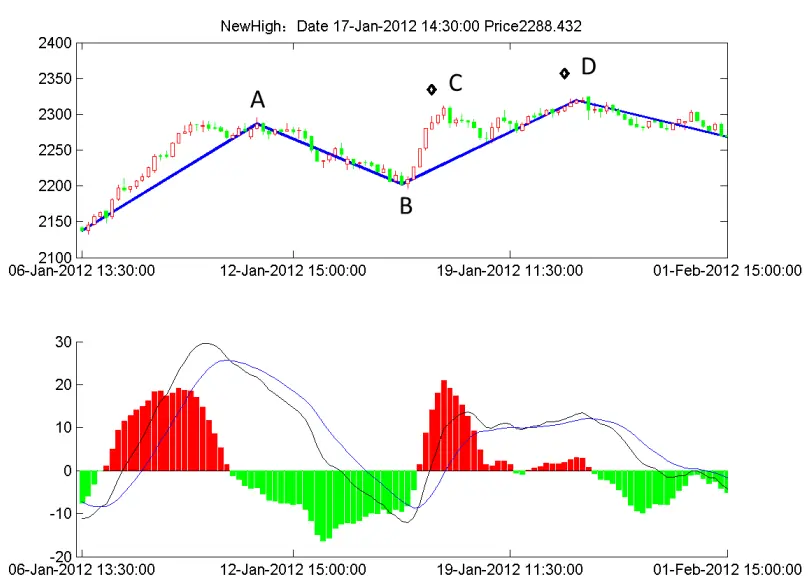
数据来源：国泰君安证券研究

## 3. 大级别不同走势的快速突破分析

本章我们主要考虑 30 分钟级别走势出现快速突破，30 分钟级别向上快速突破且日线级别处于上涨段时，此时大小级别形成共振，走势在小级别容易形成延续，而当 30 分钟前一上涨段的走势较为复杂，即 5 分钟级别走势超过 5段时，突破力度更大，波段延伸幅度更大。

而突破方向与大级别方向不一致且在大级别局部极值点附近出现时，此时由于大级别力度并未形成明显衰竭，容易形成大级别走势的延续，也即小级别走势的反转。

## 3.1.大小级别走势一致的快速突破延续

如图 9 所示，30 分钟级别出现价格创新高而 DEA 指标未穿越 0 轴的向上快速突破情况（C点），若该突破点（C点）在日线级别同样处于上涨波段之中，那么在波段延续确认点 D出现时（大概率在 1-2根即可出现价格上涨伴随 DEA 穿越 0 轴），其后的 DE 段向上延伸空间至少可达3.5%，如表2所示，样本数为 7次。

## 图 9大小级别走势一致的快速突破走势延续示意图

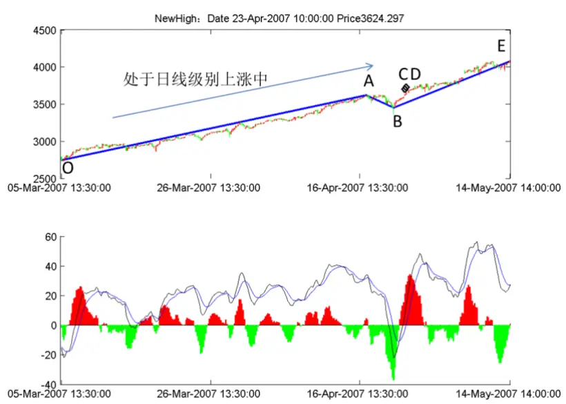
数据来源：国泰君安证券研究

同时我们可以发现 DE 段延伸情况与前一上涨段 OA 段的走势复杂情况相关，当前一上涨阶段比较复杂，即 30分钟级别上涨段 OA在 5分钟级别走势段超过 5段时，这种情况突破力度相对更强，延伸幅度更大，30分钟级别共出现 3 次，分别在 20060417,20070423,20070928，DE 段延伸段涨幅至少可达 10%。

表 2上证指数 30分钟向上快速突破（位于日线级别上涨）

| 异常点日期 | 异常点 价格 | 周期 | CD 波段 CD 波段 涨跌幅 | 期 | 幅 | DE 周 DE 涨跌 OA 段 5 分钟 级别段数 |
| --- | --- | --- | --- | --- | --- | --- |
| 20060417 | 1366.63 | 2 | 0.33% | 163 | 21.52% | 13 |
| 20070423 | 3624.30 | 1 | 0.71% | 84 | 11.68% | 13 |
| 20070928 | 5529.88 | 2 | 0.43% | 52 | 9.95% | 7 |
| 20050901 | 1174.52 | 2 | 0.15% | 99 | 3.77% | 5 |
| 20140307 | 2075.63 | 0 | 0.00% | 0 | 0.00% | 3 |
| 20140722 | 2074.30 | 1 | 0.12% | 75 | 7.05% | 3 |
| 20061019 | 1793.93 | 2 | 0.14% | 128 | 6.62% | 1 |
| 20151104 | 3455.24 | 1 | 0.13% | 22 | 5.95% | 1 |
| 20151117 | 3674.53 | 0 | 0.00% | 0 | 0.00% | 1 |

数据来源：国泰君安证券研究

当然我们需要注意到 30 分钟快速向上突破时，未必会出现图 9 中的 D点确认波段延续，如 20140307，20151117 的快速突破情况，由第 2章分析可知，若 5根 K线之内未能形成 D点延续，则快速突破的波段大概率不会延续，从交易的角度，若出现 D点确认波段延续，则按照前文分析的情境随后有较大幅度的延续空间。

## 3.2.大小级别走势相反的快速突破反转

30 分钟快速突破方向与日线级别走势方向相反，即在日线级别上涨中

30 分钟级别出现价格创新低而 DEA 指标未穿越 0 轴的向下快速突破情况（C点），；且突破点（C点）距离日线级别当前波段的局部极值点（B点）时间较近时（这里定义小于 2 个交易日），日线级别走势力度并未形成明显衰竭，容易形成大级别走势的延续，此时 30 分钟级别走势大概率反转。

以图 10 向下快速突破为例，30 分钟级别走势中，C 点向下突破前低 A但 DEA>0，日线级别走势段向上，且日线高点 B 距离向下的突破点 C较近（小于 2个交易日），此时 30分钟级别向下确认点 C与拐点 E的价格接近，随后就形成了 30分钟级别反转向上的 EF段。

图 10 大小级别走势相反快速突破走势反转示意图
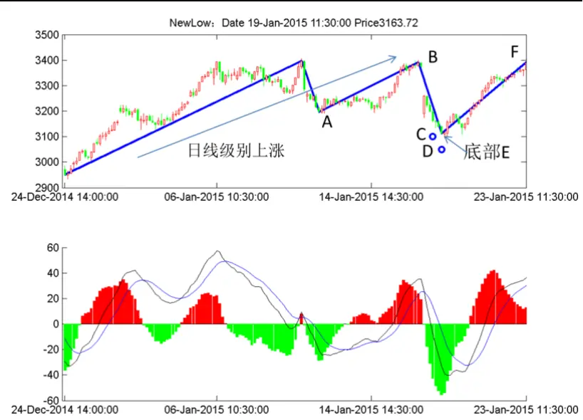
数据来源：国泰君安证券研究

表 3 列举了 30 分钟级别出现快速突破，且突破方向与日线级别相反，而日线极值点与 30分钟级别突破点距离小于 2个交易日的情况，C点出现后，该点到拐点 E的延伸幅度一般小于 2%，随后会出现 30分钟级别的反转，图10所示的创新低情况随后反转上涨的幅度甚至可以达到7%，C点可以认为是日线级别上涨回调中较好的买点。

表 3上证指数 30分钟快速突破（方向与日线级别相反且距极值点小于 2个交易日）

| 异常点日期 | 状态 | CD 波段持 续周期 | CD 波段涨 跌幅 | DE持续 周期 | 幅 | DE 涨跌 CF 持续 周期 | CF 涨跌 幅 |
| --- | --- | --- | --- | --- | --- | --- | --- |
| 20061023 | 新低 | 0 | 0.00% | 0 | 0.00% | 109 | 8.77% |
| 20101213 | 新高 | 4 | 0.47% | 17 | 1.47% | 98 | -5.37% |
| 20140321 | 新高 | 3 | 0.79% | 11 | 1.18% | 49 | -0.31% |
| 20150119 | 新低 | 3 | -1.66% | 0 | 0.00% | 32 | 7.15% |

数据来源：国泰君安证券研究

## 4. 快速突破走势不延续对后势的影响

以下跌段中的拉升未能形成上涨段延续而随后继续下跌的情况为例（上涨段中的快速下跌未能形成下跌段延续而随后继续上涨的情况与之相仿），虽然出现的次数较少，但我们观察到这种失败的上涨会消耗上涨动能，随后再次上涨力度会相对较弱，即随后再次出现的上涨段确认点大概率会到顶。

2005 年至 2016 年 5 月 30 日的 30 分钟级别共出现了 3 次快速突破在原规则下无法延续的情况，2006 年 10月 23 日 14:30在日线级别上涨中 30分钟级别下跌突破前低，在原有规则下未形成向下波段；2014年 3月 7日 10:00， 2015 年 11 月 17 日 10:30 在日线级别下跌中 30 分钟级别上涨突破前高在原有规则下未形成向上波段。

图 11 为 2015 年 11 月 17 日 30 分钟级别的快速突破，向上突破点 C 没有形成波段延续，出现 D点破新低这种异常情况，原规则中再次出现确认向上走势段 E 时，走势无法延续，随后形成该级别的下跌，下跌 45个周期，幅度为 4.37%；2014 年 3月7日 10:00快速突破后的 E到 F下跌 23 个周期，幅度为 1.86%。

图 11 快速突破向上突破走势反转示意图
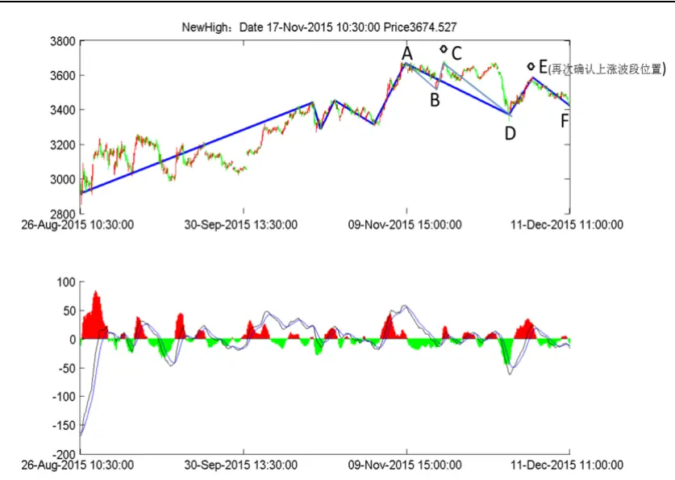
数据来源：国泰君安证券研究

图 12 为 2006 年 10 月 23 日 30 分钟级别的快速突破，向下突破点 C 在原规则下无法延续，随后并未形成下跌段而是出现 D点破新高这种异常情况，原规则中再次出现确认向下走势段 E时，走势无法延续，随后形成该级别的上涨，上涨周期 386个周期，幅度为 61%。

即下跌段中的快速突破点 C未能形成上涨段而随后继续下跌的情况（或上涨段中的快速下跌未能形成下跌段而随后继续上涨的情况），随后再次确认上涨段（或下跌段）的点 E 大概率是该级别的反转点。国泰君安版权所有发送给国投瑞银基金管理有限公司.公用邮箱:res@ubs dic. om p10

图 12 快速突破向下走势反转示意图

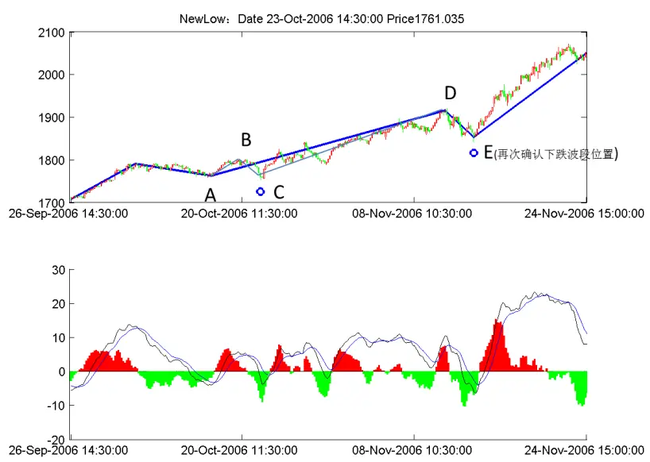
数据来源：国泰君安证券研究

## 5. 总结

第三条波段确认规则刻画了价格分段体系中一种较为少见的快速突破形态，走势特征表现为下跌过程中的快速拉升（或上涨过程中的快速下跌），价格突破前高（或前低）而 DEA指标未能穿越 0轴，此时新的波段方向可以确认而不需要等待 DEA 指标穿越 0 轴，出现这种情况动量延续的可能性更大，日线级别 100%会出现波段延续确认点，价格继续按照突破方向延续且指标穿越 0轴，30分钟级别出现价格延续指标穿越0轴的概率为 88%左右，5分钟级别 78%左右。

大小级别联立分析快速突破情境，30分钟级别向上快速突破且日线级别处于上涨段时，大小级别产生共振，走势容易形成延续，而当 30 分钟前一上涨段的走势较为复杂，即 5分钟级别走势超过 5段时，突破力度更大，波段延伸幅度更大；30分钟级别突破方向与日线级别方向不一致且在突破时间不超过上一个局部极值点 2 个交易日时，此时由于大级别力度并未形成明显衰竭，容易形成大级别走势的延续，也即小级别走势的反转。

以下跌段中的快速向上突破未延续而随后继续下跌的情况为例（上涨段中的快速向下突破未延续而随后继续上涨的情况与之相仿），我们观察到这种失败的上涨会消耗上涨动能；随后再次上涨力度会相对较弱，即随后的上涨段确认后大概率会反转。

表 4上证指数日线级别快速突破情况列表（1991-2016.5.30）

| 快速突破 日期 | 价格 | 状态 | CD 段周期(波段延 伸确认持续周期) | CD 段幅度(波段延 伸确认涨跌幅度) | DE 段周期(波段延伸 确认后持续周期) | DE 段幅度(波段延伸 确认后涨跌幅度) |
| --- | --- | --- | --- | --- | --- | --- |
| 19950518 | 764 | 新高 | 2 | 17.54% | 0 | 0.00% |
| 19980401 | 1255 | 新高 | 1 | 1.12% | 43 | 11.90% |
| 19990524 | 1214 | 新高 | 3 | 5.72% | 23 | 35.56% |
| 20020624 | 1707 | 新高 | 3 | 0.95% | 7 | 0.54% |
| 20080122 | 4560 | 新低 | 4 | 3.08% | 186 | 61.38% |
| 20121214 | 2151 | 新高 | 2 | 0.55% | 33 | 12.58% |
| 20130613 | 2148 | 新低 | 4 | 0.23% | 6 | 9.02% |
| 20131220 | 2085 | 新低 | 4 | 0.56% | 16 | 3.95% |

数据来源：国泰君安证券研究

表 5上证指数 30分钟级别快速突破情况列表（2005-2016.5.30）

| 快速突破 日期 | 时间 | 价格 | 状态 | CD 段周期(波段 延伸确认持续 周期) | CD 段幅度(波 段延伸确认涨 跌幅度) | DE 段周期(波段 延伸确认后持 续周期) | DE 段幅度(波段延伸 确认后涨跌幅度) |
| --- | --- | --- | --- | --- | --- | --- | --- |
| 20050117 | 10:30:00 | 1232 | 新低 | 1 | 0.44% | 32 | 2.47% |
| 20050901 | 11:00:00 | 1175 | 新高 | 2 | 0.15% | 99 | 3.77% |
| 20051110 | 15:00:00 | 1088 | 新低 | 1 | 0.16% | 26 | 0.88% |
| 20060417 | 10:30:00 | 1367 | 新高 | 2 | 0.33% | 163 | 21.52% |
| 20061019 | 10:30:00 | 1794 | 新高 | 2 | 0.14% | 128 | 6.62% |
| 20061023 | 14:30:00 | 1761 | 新低 | 0 | 0.00% | 0 | 0.00% |
| 20070423 | 10:00:00 | 3624 | 新高 | 1 | 0.71% | 84 | 11.68% |
| 20070928 | 11:00:00 | 5530 | 新高 | 2 | 0.43% | 52 | 9.95% |
| 20100329 | 10:00:00 | 3099 | 新高 | 1 | 0.83% | 39 | 1.67% |
| 20100720 | 10:00:00 | 2494 | 新高 | 1 | 0.64% | 80 | 6.58% |
| 20101213 | 10:00:00 | 2878 | 新高 | 4 | 0.47% | 17 | 1.47% |
| 20110923 | 10:00:00 | 2417 | 新低 | 4 | 0.06% | 58 | 3.11% |
| 20120117 | 14:30:00 | 2288 | 新高 | 22 | 0.97% | 2 | 0.37% |
| 20120314 | 15:00:00 | 2391 | 新低 | 5 | 0.46% | 90 | 5.52% |
| 20130304 | 11:30:00 | 2292 | 新低 | 2 | 0.53% | 1 | 0.30% |
| 20130711 | 10:00:00 | 2026 | 新高 | 1 | 0.38% | 4 | 2.85% |
| 20131023 | 14:00:00 | 2183 | 新低 | 1 | 0.02% | 31 | 3.71% |
| 20140210 | 10:00:00 | 2066 | 新高 | 2 | 0.64% | 62 | 3.90% |
| 20140307 | 10:00:00 | 2076 | 新高 | 0 | 0.00% | 0 | 0.00% |
| 20140321 | 14:00:00 | 2035 | 新高 | 3 | 0.79% | 11 | 1.18% |
| 20140722 | 11:30:00 | 2074 | 新高 | 1 | 0.12% | 75 | 7.05% |
| 20141017 | 10:30:00 | 2330 | 新低 | 1 | 0.33% | 46 | 1.66% |
| 20150119 | 11:30:00 | 3164 | 新低 | 3 | 1.66% | 0 | 0.00% |
| 20151104 | 14:30:00 | 3455 | 新高 | 1 | 0.13% | 22 | 5.95% |
| 20151117 | 10:30:00 | 3675 | 新高 | 0 | 0.00% | 0 | 0.00% |

数据来源：国泰君安证券研究

## 本公司具有中国证监会核准的证券投资咨询业务资格

## 分析师声明

作者具有中国证券业协会授予的证券投资咨询执业资格或相当的专业胜任能力，保证报告所采用的数据均来自合规渠道，分析逻辑基于作者的职业理解，本报告清晰准确地反映了作者的研究观点，力求独立、客观和公正，结论不受任何第三方的授意或影响，特此声明。

## 免责声明

本报告仅供国泰君安证券股份有限公司（以下简称“本公司”）的客户使用。本公司不会因接收人收到本报告而视其为本公司的当然客户。本报告仅在相关法律许可的情况下发放，并仅为提供信息而发放，概不构成任何广告。

本报告的信息来源于已公开的资料，本公司对该等信息的准确性、完整性或可靠性不作任何保证。本报告所载的资料、意见及推测仅反映本公司于发布本报告当日的判断，本报告所指的证券或投资标的的价格、价值及投资收入可升可跌。过往表现不应作为日后的表现依据。在不同时期，本公司可发出与本报告所载资料、意见及推测不一致的报告。本公司不保证本报告所含信息保持在最新状态。同时，本公司对本报告所含信息可在不发出通知的情形下做出修改，投资者应当自行关注相应的更新或修改。

本报告中所指的投资及服务可能不适合个别客户，不构成客户私人咨询建议。在任何情况下，本报告中的信息或所表述的意见均不构成对任何人的投资建议。在任何情况下，本公司、本公司员工或者关联机构不承诺投资者一定获利，不与投资者分享投资收益，也不对任何人因使用本报告中的任何内容所引致的任何损失负任何责任。投资者务必注意，其据此做出的任何投资决策与本公司、本公司员工或者关联机构无关。

本公司利用信息隔离墙控制内部一个或多个领域、部门或关联机构之间的信息流动。因此，投资者应注意，在法律许可的情况下，本公司及其所属关联机构可能会持有报告中提到的公司所发行的证券或期权并进行证券或期权交易，也可能为这些公司提供或者争取提供投资银行、财务顾问或者金融产品等相关服务。在法律许可的情况下，本公司的员工可能担任本报告所提到的公司的董事。

市场有风险，投资需谨慎。投资者不应将本报告作为作出投资决策的唯一参考因素，亦不应认为本报告可以取代自己的判断。
在决定投资前，如有需要，投资者务必向专业人士咨询并谨慎决策。

本报告版权仅为本公司所有，未经书面许可，任何机构和个人不得以任何形式翻版、复制、发表或引用。如征得本公司同意进行引用、刊发的，需在允许的范围内使用，并注明出处为“国泰君安证券研究”，且不得对本报告进行任何有悖原意的引用、删节和修改。

若本公司以外的其他机构（以下简称“该机构”）发送本报告，则由该机构独自为此发送行为负责。通过此途径获得本报告的投资者应自行联系该机构以要求获悉更详细信息或进而交易本报告中提及的证券。本报告不构成本公司向该机构之客户提供的投资建议，本公司、本公司员工或者关联机构亦不为该机构之客户因使用本报告或报告所载内容引起的任何损失承担任何责任。

## 评级说明

## 1.投资建议的比较标准

投资评级分为股票评级和行业评级。

以报告发布后的12个月内的市场表现为比较标准，报告发布日后的12个月内的公司股价（或行业指数）的涨跌幅相对同期的沪深300指数涨跌幅为基准。

## 2.投资建议的评级标准

报告发布日后的 12 个月内的公司股价（或行业指数）的涨跌幅相对同期的沪深300指数的涨跌幅。

|  | 评级 说明 |  |
| --- | --- | --- |
| 股票投资评级 | 增持 | 相对沪深 300指数涨幅15%以上 |
|  | 谨慎增持 | 相对沪深300指数涨幅介于5%～15%之间 |
|  | 中性 | 相对沪深300指数涨幅介于-5%～5% |
|  | 减持 | 相对沪深300指数下跌 5%以上 |
| 行业投资评级 | 增持 | 明显强于沪深 300 指数 |
|  | 中性 | 基本与沪深300指数持平 |
|  | 减持 | 明显弱于沪深 300指数 |

## 国泰君安证券研究

|  | 上海 | 深圳 | 北京 |
| --- | --- | --- | --- |
| 地址 | 上海市浦东新区银城中路168号上海 银行大厦29层 | 深圳市福田区益田路 6009 号新世界 商务中心34层 | 北京市西城区金融大街 28 号盈泰中 心2号楼10层 |
| 邮编 | 200120 | 518026 | 100140 |
| 电话 | （021)38676666 | (0755)23976888 | (010)59312799 |
|  | E-mail: gtjaresearch@gtjas.com |  |  |