nInfo] [Table_Title] 2016.09.23

# 基于主题影响力因子的投资策略

## ——数量化专题之八十一

刘富兵（分析师）

殷明（研究助理）

8 021-38676673

021-38674637

liufubing008481@gtjas.com

yinming@gtjas.com

证书编号 S0880511010017

S0880116070042

## 本报告导读：

本篇报告是《基于文本挖掘的主题投资策略》的下篇，继上篇报告阐述了如何通过文本挖掘市场的热点主题，以及如何进行主题内选股之后，报告旨在发掘一类可以获得超额收益的主题——即影响力因子较高的主题。通过投资这类主题，可以获得稳定的超额收益。

## 摘要：

le_Summary]通过《基于文本挖掘的主题投资策略》报告，我们已经可以及时挖掘出市场上的各类主题。然而如何针对这些主题构建投资策略呢？一个简单直接的想法是每当发现该主题则直接买入。然而通过研究发现，这样的策略并无超额收益。我们分析了该策略失效的原因，并进一步寻求解决方法。

- 报告首先对主题的研究范围进行了定义，并简单的回顾了前一篇报告中阐述的国泰君安主题生产框架，该框架生产的主题满足主题的三大特征，能够满足研究的需要。

- 不同的主题在市场上强弱表现不尽相同，我们通过主题的影响力因子将不同主题进行了区分，并通过实验证明了不同影响力因子在历史的表现的差异性。

- 基于上述的影响力因子，我们构建了一类选主题的策略，该策略从 2010年7月至2016年6 月六年时间里，可以获得约六倍的绝对收益。如果使用中证 500指数进行对冲，可以在较低的回撤（9.89%）下获得年化 25.99%的相对收益。

正如主题投资报告的上篇中所述，主题投资研究要解决两个问题，即配置什么主题（即选主题），配置主题中的哪些标的（即选龙头股）。上篇中我们已经解决了第二个问题，本篇则通过影响力因子的构建解决了第一个问题。通过这两类问题的研究，我们发现主题投资的最大特征：截断亏损，让利润奔跑。

金融工程

## 金融工程团队：

刘富兵：（分析师）

电话：021-38676673

邮箱：liufubing008481@gtjas.com

证书编号：S0880511010017

刘正捷：（分析师）

电话：0755-23976803

邮箱：liuzhengjie012509@gtjas.com

证书编号：S0880514070010

李辰：（分析师）

电话：021-38677309

邮箱：lichen@gtjas.com

证书编号：S0880516050003

## 陈奥林：（研究助理）

电话：021-38674835

邮箱：chenaolin@gtjas.com

证书编号：S0880114110077

## 孟繁雪：（研究助理）

电话：021-38675860

邮箱：mengfanxue@gtjas.com

证书编号：S088011604008

殷明：（研究助理）

电话：021-38674637

邮箱：yinming@gtjas.com

证书编号：S0880116070042

叶尔乐：（研究助理）

邮箱：yeerle@gtjas.com

电话：021-38032032

证书编号：S0880116080361

## [Table_R相关报告

《 基 于 MACD 的 价 格 分 段 研 究 3.0 》2016.09.11

《基于机器学习的牛股精选》2016.09.08

《拐点预测之级别错位研究》2016.08.03

《基于文本挖掘的主题投资策略》2016.07.05《基于奇异谱分析的均线择时研究》2016.06.22

## 1. 引言

主题投资是 A股市场上投资者非常关注的投资机会。在《基于文本挖掘的主题投资策略》报告中，我们已经阐述了如何主动挖掘热点主题的投资机会。本篇报告是上一篇报告的延续，继上篇报告之后进一步探究如何把握主题性投资机会，选出强势的主题，寻找主题的买卖点。

上一篇报告中我们已经提出，主题投资需要解决三大问题，即：1.如何挖掘热点主题，提示投资机会；2.如何选择强势的主题进行投资；3.给定主题，如何选出主题下的龙头股。上一篇报告已经解决了 1、3 两个问题，本篇报告专注于第二个问题，即选主题的问题。选主题问题其实又可以分割为几个子问题，譬如选择什么样的主题进行投资，如何选择投资的买卖点，是否需要结合行情条件决定投资机会等等。为了解决这些问题，我们定义了一种基于新闻的因子——主题影响力因子将几类主题进行区分，并发现该因子具有非常好的区分效应。总体来说，对市场影响力越大的主题，其在市场上的表现更具有延续性。因此，我们基于此做了绝对收益和相对收益的实证分析，发现纯粹选主题的策略从 2010年到 2016 年 6 年期间可以获得稳定的 25.99%的相对收益，最大回撤控制在 10%以内。

本篇报告的结构如下：第二章首先对上篇报告中阐述的主题数据进行了回顾；第三章则开始对主题本身进行了研究范围的定义，并描述了什么叫主题的异动及其影响力因子，希望通过影响力因子可以找出相对强势的主题；第四章开始针对主题影响力因子进行策略的构建，并通过分年度的策略统计寻找该策略的收益特征；最后，我们对主题投资的两篇报告进行了总体性的总结，并描述了主题投资未来的研究方向。

## 2. 主题数据回顾

这一节我们首先对贯穿文章始终的“主题”进行范围的定义，阐明我们研究的主题需要满足的三个条件。

## 2.1.主题的研究范围

“主题”，或称概念，题材，热点，一般是指一类股票的集合，该类股票在某一方面具有相同的特征。主题的概念在 A股市场上由来已久，对这个词语的概念的理解也不一而足。为了确认这篇报告中所研究的“主题”的概念，我们对主题本身进行了研究范围的定义，认为要成为一个主题，必须要满足以下三个特征：

1.聚合性，即同一个主题内的个股在市场上表现的相关性很高。具体来说，同一个主题中的股票应该在某个维度具有相同的特征，所以才能聚合到一起，但这种特征未必是基本面特征。也就是说，主题内的股票往往和主题指数本身同步涨跌，或者受主题指数的涨跌影响很大。这种影响有时候未必是基本面的特征。例如，2016 年 2 月 22 日晚间，大恒科技发布澄清公告，否认公司为“虚拟现实”概念股，同时表示截止当日公司并未有 VR 虚拟现实相关产品的研发、营销计划。然而，即使在该公告发布后，大恒科技在后续的涨跌幅依然和虚拟现实概念呈现极高的相关性。因此，对于个股是否属于某个主题的一个比较直接的标准就是该个股和主题本身的表现是否存在高相关性。

2.稳定性，即主题内个股变化率较低。主题中的个股应该有适当的进出，例如手机游戏概念中，天神娱乐通过借壳上市的方式借壳原本从事木材家具生产的公司科冕木业，从而进入了手机游戏概念。但是，这样的并购、借壳事件并不常见，主题中的个股在短期内保持相对稳定，不经常出现变换。相反，像“高送转”、“股东增持”这样的热点事件虽然有时也被称为概念，但我们更倾向于将其作为事件研究，因为每次该事件出现时个股标的变化很大。

3.专注性，即主题概念涉及的概念股标的应该是通过一些最具代表性的个股标的表示出来。例如，“一带一路”概念涉及到的股票非常多，有上五百只，但是市场上对其炒作更多是中国中铁、中铁二局、新疆城建等少数股票，即所谓“龙头股”。

## 2.2.国泰君安主题生产框架

国泰君安自己的主题生产方式在《基于文本挖掘的主题投资策略》报告中已经详细阐述过，这里做一个简单的回顾。如图 1所示，我们通过网络爬虫爬取门户网站和行业深度网站的即时新闻，通过数据库存储为底层新闻源。基于新闻源数据，我们通过主题热点挖掘方式获得最新的主题（包括文本聚类、关键词抽取、关键词匹配等步骤），并和主题爬虫爬取的主题数据进行合并去重，得到最终的主题数据。主题数据确定之后，通过主题个股挖掘算法，经历统计去噪之后得到个股数据，利用主题相对热度计算主题活跃期。这三部分数据共同构成主题数据，入主题库。从以上过程不难看出，我们这里主题数据挖掘的方式和市场上目前普遍使用的方式并不相同。目前大部分对主题数据的挖掘是通过给定某个具体的主题，例如“精准医疗”，然后被动地去挖掘主题相关的个股和新闻、研报等数据，这要建立在一个前提上，即必须知道自己关注什么主题。但是实际上，很多时候主题变幻莫测，在一个具体的时间点我们并不知道什么主题会在市场上产生行情，更不可能去指定一个主题。因此，这种主动挖掘近期热点的方式显得弥足珍贵，虽然这种方式难免会引入一些噪音，但是如果能加入一些人工的去噪管理，作为提示主题投资机会，具有很大的借鉴意义。

图 1 国泰君安主题数据生产框架
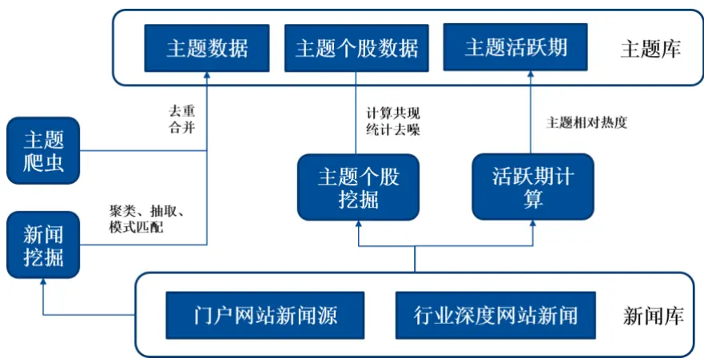
数据来源：国泰君安证券研究

我们将根据以上框架生产的主题数据按照 2.1 节中对主题三个性质的描述进行对照，发现数据基本满足这三个特征：

1.聚合性。通过文本挖掘的方式找到主题个股关联，并进行了统计意义上的去噪，聚合到一起的个股是以主题词作为桥梁“聚合”起来的。

2.稳定性。根据主题个股关联情况，去除变化频繁的主题。具体实现方法是：在每个月的首个交易日，对主题库中所有主题一一检查该主题中的个股集合（记为 S2）相对于上一个周期（即上一个月的首个交易日）的个股集合（记为 S1）的变化率，即 1-(S2∩S1)/S1，去除主题的个股变化率大于 80%的主题，如“高送转”、“业绩预增”、“员工持股”等。

3.专注性。对所有主题，限制其个股数量在 30只以内，即取出最具代表性的 30 只个股。筛选原则是，“由市场决定哪些个股与主题更加关联”，具体算法是：对给定的主题，计算该主题过去三次异动时，主题内个股平均涨幅，取出排名前 30 位的个股纳入主题池。该算法假定短期内主题的代表性个股是稳定的，也就是说，对未来主题池中个股的选择根据过去最近的几次主题表现来决定。

## 3. 主题的异动及其影响力因子

基于主题数据，我们可以进行主题投资。一个简单的想法是，既然主题投资收益丰厚，那么在我们通过挖掘算法发现主题后直接买入，等待主题行情。然而这样的操作策略并不能获得超额收益。通过观察策略持仓发现，策略不能获得超额收益的主要原因是主题选择问题和买卖点选择问题。为了解决这两个问题，我们提出了影响力因子——一个可以较好区分主题强弱的因子。通过对每个主题影响力因子的计算，找出比较强势的主题进行投资，同时通过因子上轨构建相应买点。

## 3.1.一个简单的策略——发现即买入

由于我们每天都可以在市场上发现新的主题，因此，可以频繁收到投资机会提示。于是一个简单的想法就是发现一个主题后立刻买入，主题买入后回撤达到 10%卖出，希望主题发现的实时性能够帮助我们提前埋伏主题机会。然而，我们针对这种方式进行了回测，发现策略并没有超额收益。如图 2所示，深蓝色曲线为策略曲线，浅蓝色曲线为基准中证 500。我们发现在回测的六年时间内，主题策略并未获得高于基准的超额收益。

图 2 发现即买入主题投资策略并没有超额收益
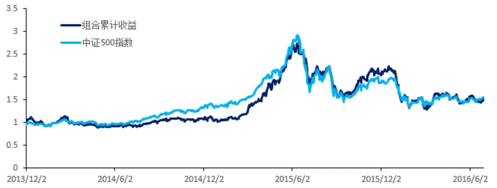
数据来源：国泰君安证券研究

为了探究该策略无效的原因，我们查看了具体持仓，发现之所以失效，主要原因有以下两点：

1、突发事件的干扰。突发的热点事件是指市场上不定期发生的一些热点事件，例如上篇报告中提到的柴静发布雾霾视频的事件，天津滨海新区天津港的瑞海公司危险品仓库火灾爆炸事件等等。这些突发事件有正向事件也有负向事件，但是他们的共同特征是对市场的冲击非常迅速，往往是事件发生之后立刻被反应到市场上，而等到事件相关标的打开涨停能够买入时，股价已经处于调整阶段。如图 3所示，该图刻画了某突发事件性主题相对中证 500指数的相对收益曲线。可以看出，在该事件发生后，主题指数立刻出现了一波拉升，等到能够买入之时，之后就是一系列短期的高位震荡和更长期的衰退过程。这样的主题基本很难有好的收益机会。另一方面，这种事件虽然获得了市场上的普遍关注，但是由于仅仅是突发事件，对市场造成的影响往往只是简单的一次性反应，事件发生之后很难有持续性的行情。由于事件本身很难预测，因此这种事件对我们的干扰非常严重，买入很多这样的主题往往导致我们亏损严重。

突发事件对市场的影响难以从量化的角度估量，事件的反应时间也很难判断，因为不同事件的语义不同，环境不同，因此不易研究。究其本质原因，是事件对市场的影响力度不够，市场并未对这些事件进行进一步的反应。

图 3 突发性主题难以获得超额收益
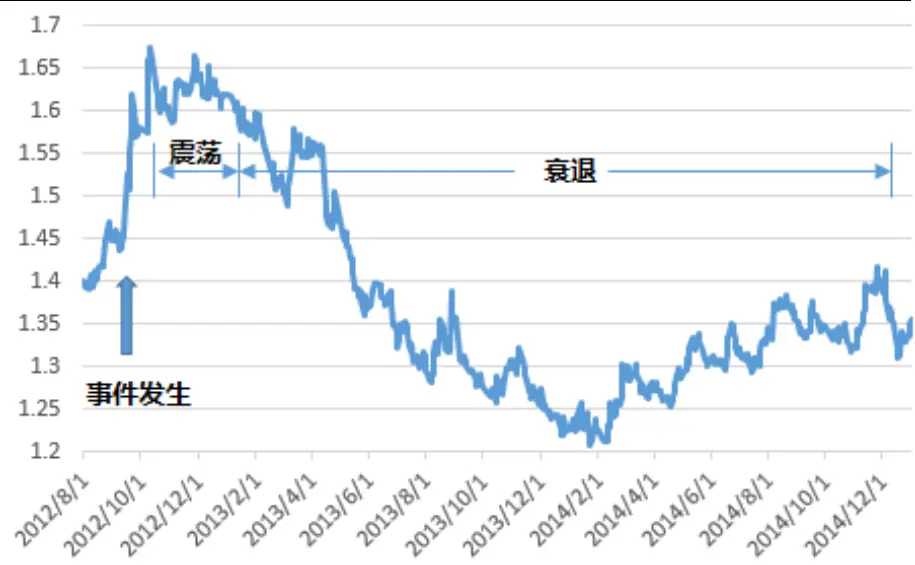
数据来源：国泰君安证券研究

2、除了突发性事件的干扰外，另一种对投资有很大干扰的就是买点的选择。主题抽取算法抽取出主题的时间一般是市场上首次对该主题有认知，并开始逐步有相关报道产生的时间。这个时间和主题真正出现行情，达到高潮，获得收益的时间还是有很大差距的。例如图 4所示为虚拟现实概念股的近年走势。我们的挖掘算法在 2013 年 3 月 8 日就挖掘出了虚拟现实概念这个主题，然而，虚拟现实真正迎来行情是在 2015 年下半年，中间相差了 2年时间之久。今年非常强势的区块链概念，我们在2015年1月24日即挖掘出了该主题，然而该主题真正迎来行情是在2015年底 2016 年初。如果把握不好买点，很可能错过行情。因此，买点的选择也是我们需要解决的问题。

图 4 虚拟现实概念的发现时间和行情开始时间相差很大
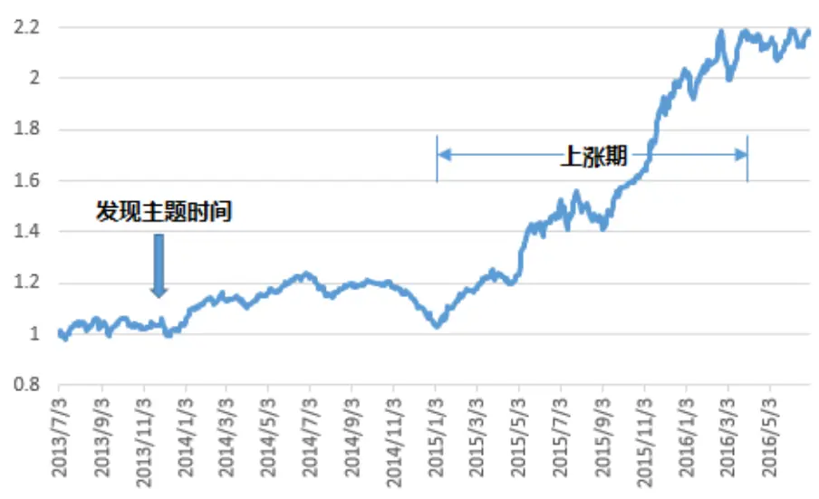
数据来源：国泰君安证券研究

## 3.2. 主题的异动

由上文不难发现，主题投资受外界环境的干扰较多，很难从整体的角度对主题热点进行把握。由于主题本身差异化很大，数量众多，又不可能像传统事件研究那样对每个事件分门别类的一一研究其背后逻辑和超额收益，因此，我们希望通过一些简单直接的指标将主题区分开来。在此之前，我们首先来观察主题的行情特征。

首先我们先说明主题异动的概念。市场产生了所谓的主题行情，或称题材性行情，一般是指由某种概念或题材的炒作诞生的一系列股票的上涨。我们将满足以下三个条件称为主题异动：

1.主题涨幅排名靠前。如果主题产生了行情，一般来说在当天的上涨幅度从横向比较来说排名非常靠前。为了定量进行研究，我们这里取前 5%作为横向比较的参数，我们的主题数据库中平均每天活跃的主题数量在300个左右，排名前 5%则是 15个主题。

2.主题的绝对涨幅足够。在弱势市场上，虽然排名靠前，但是主题的绝对涨幅不够高，依然难以形成概念性行情。例如银行、非银金融就经常在弱势市场上排名前列。这里我们取 2%为绝对涨幅的参数。这里的参数选择是考虑到筛选出的主题数量，如果阈值设置过高则导致选出主题太少，后期计算方差太大。设置过低则不能过滤掉那些并非主题性行情导致的概念被筛选出来。

3.主题必须处在其活跃期内。关于主题的活跃期概念我们在《基于文本挖掘的主题投资策略》报告当中已经详细进行了定义，这里再简单介绍一下。我们认为主题是具有一定的生命周期的，很多主题在过去很活跃，但是今天已经不具备研究价值，例如之前报告中以柴静概念为例阐述如何去挖掘热点概念，在当时，实时挖掘出这样的概念非常有意义，但是今天已经很少有人再提及这个概念了。因此，我们可以通过市场对主题的讨论热度情况确定主题是否处于活跃期内。具体做法就是通过研究时间区间平均每天关联到的新闻和研报数量，设定阈值，来确定活跃区间。为了确定主题行情确实是主题本身带来的，而不是因为个股的风格或者其他因素带来的，我们通过判断主题是否处于活跃期内来进行限制。

图 5 迪士尼概念过去六年的异动情况
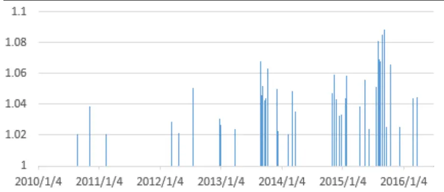
数据来源：国泰君安证券研究

图 6 一带一路概念过去六年的异动情况
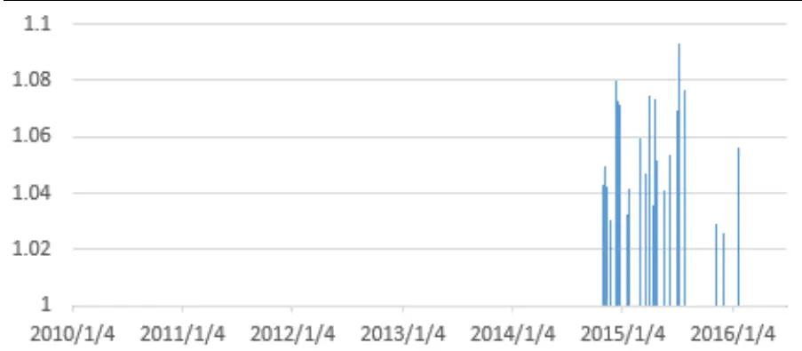
数据来源：国泰君安证券研究

图 7 虚拟现实概念过去六年的异动情况
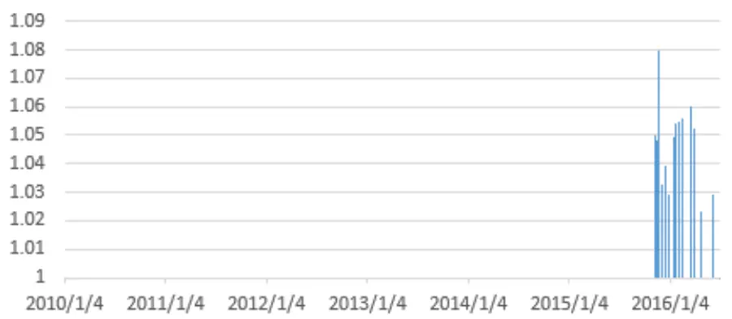
数据来源：国泰君安证券研究

图 5至图 7是我们根据上述三个条件限制的主题异动规则，通过三个主题为例画出的异动曲线，曲线的高度为主题指数异动的绝对数值。例如，迪士尼概念从 2013 年开始异动，行情一直延续到今年；虚拟现实概念则从 2015年下半年开始异动，持续到今年上半年等等。

我们一般认为，和政策相关的主题有更多比较延续的行情，突发事件类主题则经常是一次反应到位而没有延续性，这种现象很大的一个原因是主题对市场的影响力不同。影响力越高的主题，市场对其炒作的热衷程度越高，主题也越容易出现长时间的延续行情。但是，为了进一步量化地对这些主题进行分类，我们还是需要通过一种指标将主题区分开来。

## 3.3.主题影响力因子

对于每个主题，我们分别对其进行影响力打分，从而将其区分开。为了描述这种状况，我们希望考察报道主题的新闻的来源新闻（即原创新闻）的出处，如果新闻来源于政府官方网站或相关喉舌类媒体，那么这种主题的影响力有可能更大；相反，如果新闻来源于类似网易财经、东方财富等这类门户网站，这些网站的很多新闻大部分是对主题行情的一些描述，因此影响力相对较低。基于这个考虑，我们将主题来源网站分为四类，具体如表 1所示。

表 1：根据新闻的影响力对网站进行分层

| 类别 | 对应网站 |
| --- | --- |
| L1（政府官方网站） | 中国政府网，商务部，国家发改委，教育部， 文化部，外交部，工信部，人民银行，科技部，… |
|  | L2（影响力较高网站）人民网，首都之窗，新华网，中国日报网，中 国经济网，光明网，中青在线，… |
| L3（行业深度网站） | Engadget，北极星电力网，HNairlines，高工 锂电，汽车之家，农财网，生意社，我的钢铁 网，中国电子顶级开发网，中国饲料网，中国 有色网，中国港口，挖贝网，21so，… |
| L4（财经门户网站） | 第一财经，界面，每经网，同花顺，网易财经， 中证网，中金在线，虎嗅，… |

数据来源：国泰君安证券研究

为了进一步对这四类新闻赋予不同权重，我们手工标记了 300个主题，并通过回归的方式回归出四类的系数权重。具体做法是，人工标记 100个主题，将政策类主题标记为 1，非政策类主题标记为 0，针对这 100个主题，取出 2010年全年的四类新闻的数量，这样构造出了一个 100*4的训练样本矩阵，通过对该样本进行回归得到系数。

$$
\begin{array}{c}{{\displaystyle\mathcal{E}\equiv\emptyset\dot{\boldsymbol{\mathcal{H}}}\big/\mathcal{B}\mathcal{Y}\mathcal{F}=\sum_{k=1}^{4}Weight(L^{i})*(Num(news)^{i})}}\\{{}}\\{{Weight(L^{i})_{=0.~09872,~0.~01212,~0.~0341,~0.~0133~(\mathrm{i}=1,2,3,4)}}}\end{array}
$$

通过这种方式，我们可以对所有主题进行线性加权的影响力打分。我们对这种因子的区分性做了验证，具体方式是，随机取出 300个主题，对300 个主题进行影响力打分，根据打分结果排序将主题分为五组，如图8 所示。

图 8 五组主题在六年内异动次数曲线
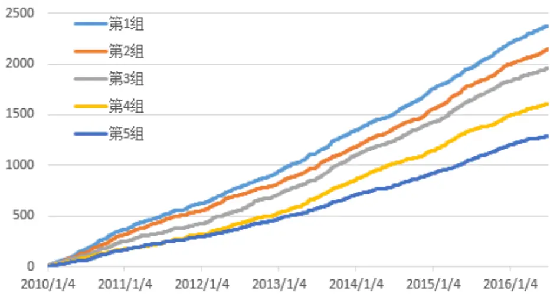
数据来源：国泰君安证券研究

图 8 中的横轴是年份（2010 年至今），纵轴是各组主题在每个年份中的异动次数。即如果曲线值越高，说明该组的主题在过去六年中的异动次数更多，也即主题的行情延续性更好。通过上图我们可以比较清晰的观察到主题的影响力因子区分性还是比较好的，影响力因子最高的浅蓝色曲线出现的异动次数越多，因子最低的深蓝色曲线出现异动次数越少。为了进一步具象地观察这个因子，我们分年度计算了因子涨幅最高的主题，如表 2所示。可以看到，大部分主题和当年的行情有比较好的指示作用，另外，对于近期的主题，有投资者们耳熟能详的“区块链”、“OLED”、“无人驾驶”等概念，但是也有一些相对小众的概念，例如“锌电池”、“机制纸”。正如我们上文所述，这些概念的新闻报道一般和主题行情的正式开始有一段时间的间隔，也即市场需要一定时间的消化和反应。从这个角度来说，该因子的另一个作用是提示一些未来可能有机会的主题。

表 2：分年度新闻的影响力增幅最高的主题

| 年份 | 1 | 2 | 3 | 4 | 5 | 6 | 7 | 8 | 9 | 10 |
| --- | --- | --- | --- | --- | --- | --- | --- | --- | --- | --- |
| 2011 | 养老地 产 | 电子政 务 | 分布式 发电 | 影子银 行 | 中日韩 自贸区 | 互联网 金融 | 社交网 络 | 土地改 革 | 微信 | 特斯拉 |
| 2012 | 3D 打印 | 丝绸之 路 | 美丽中 国 | 中日韩 自贸区 | 全息投 影 | 3D 玻璃 | 页岩气 | 宽带中 国 | 大气治 理 | 土地改 革 |
| 2013 | 上海自 贸区 | 广东自 贸区 | 互联网 彩票 | 油气改 革 | 跨境电 商 | 智能穿 戴 | 余额宝 | 虚拟运 营商 | 去I0E | 智能驾 驶 |
| 2014 | 一带一 路 | 工业 4.0 | 京津冀 一体化 | 马歇尔 计划 | 2025 规 划 | 海绵城 市 | 基因测 序 | 精准医 疗 | 黄金水 道 | 长江经 济带 |
| 2015 | 精准医 疗 | 海绵城 市 | 健康中 国 | 互联网 + | 能源互 联网 | 农村电 商 | 虚拟现 实 | 2025 规 划 | 互联网 医疗 | IP 电影 |
| 2016 | 区块链 | OLED | 无人驾 驶 | 人工智 能 | 增强现 实 | LED 液 晶电视 | 锌电池 | 机制纸 | 3D 玻璃 | 收入改 革 |

数据来源：国泰君安证券研究

## 4. 主题选股策略实证分析

通过上文的阐述，我们已经可以找到一个能够区分主题行情延续性的因子。下面我们会通过选择因子影响力高的主题，以及寻找合适的买卖点，构建一类主题的投资策略。

## 4.1.选主题策略构建

根据我们的逻辑，需要选择影响力因子较高的主题。这里，我们在每个换仓周期只选择上个月排名前 10%的主题。对于这些主题，我们分别对每个主题构造因子的上轨（使用因子近 7 天的均值+2 倍标准差），每当因子超越上轨的时候买入主题，回撤达到 10%时卖出主题。

为了更清晰地描述策略买点的构建方法，我们通过“一带一路”这个概念阐述如何寻找买点。如图 9所示，深蓝色曲线是主题相对中证 500的相对收益，浅蓝色曲线是构造的因子上轨，橙色曲线是因子本身。在“一带一路”主题影响力因子穿越其上轨时就是买点，买点用箭头标出。

图 9 主题选股策略买点示意
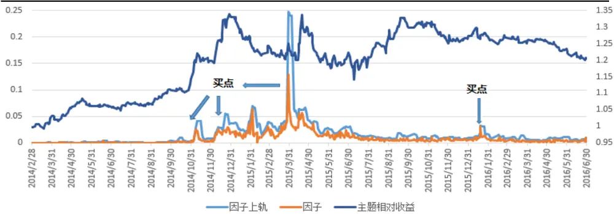
数据来源：国泰君安证券研究

具体到策略层面，我们借鉴事件投资的一般方法，将资金分为 30等分，在每个交易日的开盘时刻，依次遍历每个满足因子影响力最近一个月排名前 10%的主题，看是否满足上述的买点条件，若满足则等权买入其中某一个主题中的所有个股（也即只选主题，不选主题内股票，主题内选股的策略请参考《基于文本挖掘的主题投资策略》），若 30 等分的资金全部使用完毕，则忽略此次买点。同样，在任意主题任意时刻的最大回撤达到 10%的时候卖出该主题内所有股票。买入时去除涨停股票，卖出时忽略跌停股票。考虑双边交易费用千分之二，回测区间从 2010 年 7月 1日到 2016年 6月 30日，共六年时间。策略的绝对收益表现如图 10所示。

回测区间：2010 年 7 月 1 日-2016 年 6 月 30 日

初始净值：1

最终净值：6.0953

年化收益：36.8%

最大回撤：53.5%

最大回撤区间：2015-06-15 至 2015-09-16从策略的绝对收益曲线可以看到，策略整体表现在牛市非常强劲，最高时段跑出了近 9倍净值。但是同样，在 6 月到 9月的股灾期间，策略回撤非常大，达到了 53.5%，显然，这是由于选主题策略本身偏重于小市值股票，具有比较明显的风格特征。我们取中证 500指数作为对冲，获得的相对收益更加稳定：

图 10 选主题策略绝对收益曲线
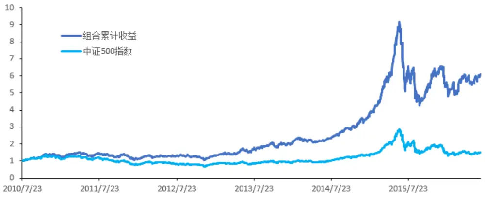
数据来源：国泰君安证券研究

图 11 选主题策略相对收益曲线
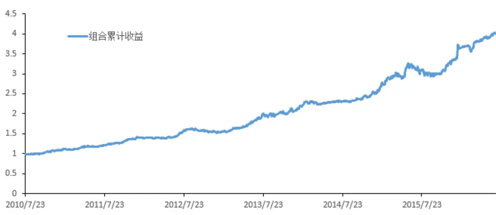
数据来源：国泰君安证券研究

回测区间：2010 年 7 月 1 日-2016 年 6 月 30 日
初始净值：1
最终净值：4.0072
年化收益：25.99%
最大回撤：9.89%
最大回撤区间：2015-06-15 至 2015-09-16
信息比率：2.67

我们发现，相对收益的最大回撤可以控制在 10%以内，最大回撤依然出现在 6 月到 9月区间。收益相对比较稳定，信息比率达到 2.67.

## 4.2.策略持仓分析

为了进一步分析策略的效果，我们对策略持仓做了进一步分析，根据买点分年度列出了当年买到的持仓收益前十名的主题，以及具体的单个主题持仓收益，如表 3 所示。我们发现，在 10%的回撤止损线内，能够买到一些表现很强势的主题，例如 14年的太赫兹概念、上海自贸区概念、保障房概念，15年的 NFC、征信、网络教育等概念，它们在持仓周期内跑出了 3倍左右的净值。

表 3：年度持仓涨幅最大的主题

| 年份 | 主题 | 持仓区间 | 持仓收益 |
| --- | --- | --- | --- |
| 2010 | 稀缺资源 | 2010/7/23-2010/11/16 | 1.455842 1.33603 |
|  | 元器件 | 2010/7/23-2010/11/17 |  |
|  | 民营医院 | 2010/7/23-2010/12/27 | 1.25868 |
|  | 锂电池 | 2010/8/2-2010/11/17 | 1.244333 |
|  | 水利建设 | 2010/8/3-2011/4/28 | 1.241912 |
|  | 白酒 | 2010/7/23-2010/12/27 | 1.238932 |
|  | 粮食安全 | 2010/8/20-2010/11/17 | 1.222141 |
|  | 多晶硅 | 2010/7/26-2011/1/17 | 1.221984 |
|  | 智能手机 | 2010/7/23-2011/1/17 | 1.189789 |
|  | 太阳能 | 2010/7/26-2011/1/17 | 1.168861 |
|  | 水泥建材 | 2011/1/31-2011/4/28 | 1.279713 |
| 2011 | 铁矿石 | 2011/1/17-2011/5/23 | 1.154554 |
|  | 合成氨 | 2011/12/27-2012/3/28 | 1.15156 |
|  | 化工原料 | 2011/1/18-2011/4/28 | 1.150238 |
|  | 磷矿石 | 2011/1/24-2011/4/28 | 1.144043 |
|  | 文化振兴 | 2011/9/7-2011/11/30 | 1.121668 |
|  | 港珠澳大桥 | 2011/12/15-2012/3/29 | 1.116444 |
|  | 高新区 | 2011/1/21-2011/4/28 | 1.113569 |
|  | 煤炭 | 2011/2/9-2011/5/5 | 1.104014 |
|  | IPTV | 2011/12/28-2012/3/28 | 1.095633 |
|  | LED 液晶电视 | 2012/12/4-2013/6/4 | 1.618751 |
|  | 杀虫剂 | 2012/11/29-2013/6/13 | 1.60524 |
| 2012 | 三网融合 | 2012/12/3-2013/6/24 | 1.529221 |
|  | 阿里巴巴 | 2012/11/30-2013/6/24 | 1.424358 |
|  | 网络电视 | 2012/12/4-2013/6/24 | 1.420461 |
|  | 分离膜 | 2012/12/3-2013/6/13 |  |
|  | 智能建筑 | 2012/11/30-2013/6/13 | 1.397106 |
|  | 网络电视 |  | 1.382786 |
|  | 飞机租赁 | 2012/7/19-2012/11/26 2012/12/4-2013/6/13 | 1.371998 |
|  | 3D打印 | 2012/12/3-2013/4/15 | 1.361849 |
|  | 医疗改革 | 2013/11/11-2015/6/19 | 1.345512 2.71678 |
|  | 乳业 | 2013/12/24-2015/6/19 | 2.268552 |
| 2013 | 虚拟运营商 |  |  |
|  |  | 2013/2/19-2013/10/23 | 2.052415 |
|  | 远程医疗 | 2013/4/1-2013/10/23 | 1.644975 |
|  | 物流骨干网 | 2013/6/28-2013/10/29 | 1.434357 |
|  | 探月工程 免疫治疗 | 2013/6/24-2013/12/16 | 1.397062 |
|  |  | 2013/1/4-2013/6/13 | 1.388753 |
|  | 智能物流 | 2013/6/25-2013/11/1 | 1.367358 |
|  | 低空 | 2013/6/27-2013/12/1 | 1.340393 |
|  | 再生水 | 2013/6/25-2014/3/12 | 1.313596 |
| 2014 | 太赫兹 | 2014/5/5-2015/6/26 | 3.432829 |
|  | 上海自贸区 | 2014/1/7-2015-06-19 | 3.418142 |
|  | 粘胶纤维 | 2014/1/15-2015/6/19 | 3.313002 |
|  | 两江新区 | 2014/1/13-2015/6/19 | 3.299679 |
|  | 保障房 | 2014/1/20-2015/6/19 | 3.211489 |
|  | 国企改革 | 2014/1/20-2015/6/19 | 3.135497 |
|  | 京津冀一体化 | 2014/5/5-2015/6/19 | 3.10041 |
|  | 锌电池 | 2014/2/28-2015/6/19 | 2.913169 |
|  | 低碳 | 2014/1/14-2015/6/19 | 2.798311 |
|  |  | 2014/12/24-2015/6/16 | 2.79557 |
| 2015 | 互联网+ NFC | 2015/1/5-2015/5/28 | 3.123663 |
|  | 征信 | 2015/1/6-2015/6/9 | 2.978251 |
|  | 网络教育 | 2015/1/5-2015/6/19 | 2.633935 |
|  | 国产软件 | 2015/1/7-2015/6/19 | 2.614627 |
|  | 动漫 | 2015/1/5-2015/6/18 | 2.591712 |
|  | 智慧城市 | 2015/1/5-2015/6/19 | 2.591373 |
|  | 手机游戏 | 2015/1/5-2015/6/19 | 2.579374 |
|  | 人工智能 | 2015/1/7-2015/6/19 | 2.546397 |
|  | 智能家居 | 2015/1/5-2015/6/19 | 2.538509 |
|  | 人脸识别 | 2015/1/5-2015/6/19 | 2.527064 |

数据来源：国泰君安证券研究

从另一个角度考察，我们绘出了分年度的主题收益分布图，以及策略的分年度表现统计，分别如图 12 和表 4.首先，从表 4 中可以看到，我们策略的整体胜率并不高，例如 2015 年胜率仅仅只有 36.8%，2016 年胜率也不足 50%，也就是说，很多时候，策略在 10%的止损线内没有等待到主题的行情；而从另一个角度看，策略本身分年度收益的均值和中位数并不低，而且从表 3中的高净值主题也可以看出策略经常能选出很强势的主题。因此也就不难解释为什么图 12 中分年度收益曲线分布是一个正态偏右的分布。从这一点来说，我们看到主题投资策略的一个好处是，如果能抓住少量很强势的主题，即使胜率不高，也能获得不错的收益。这也验证了投资学中的一种操作规律：截断亏损，让利润奔跑。

图 12 主题选股策略相对收益曲线
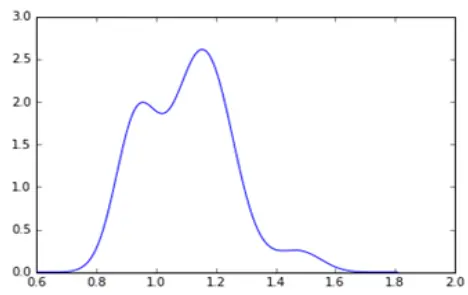

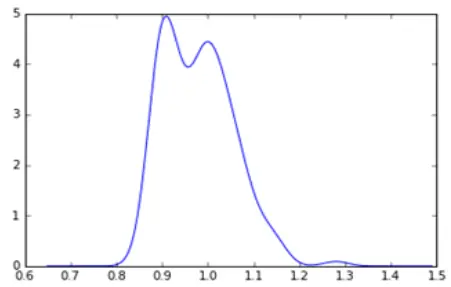

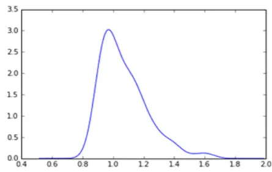

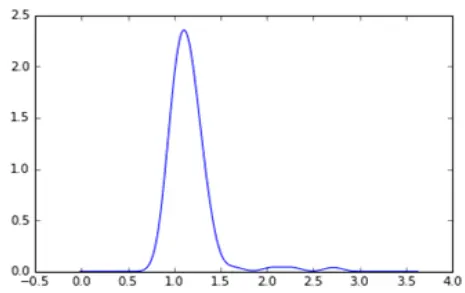
数据来源：国泰君安证券研究

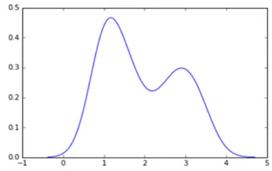

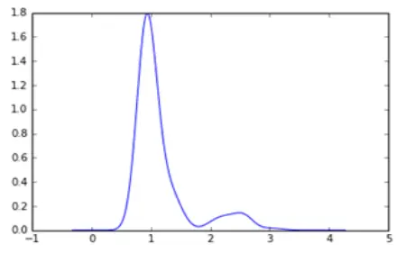

表 4：策略分年度表现

| 类别 | 均值 | 中位数 | 胜率 |
| --- | --- | --- | --- |
| 2010 | 1.103063 | 1.107405 | 67.39% |
| 2011 | 0.979169 | 0.975989 | 38.18% |
| 2012 | 1.073877 | 1.035153 | 58.51% |
| 2013 | 1.164843 | 1.137771 | 83.01% |
| 2014 | 1.922493 | 1.654383 | 86.66% |
| 2015 | 1.158362 | 0.958283 | 36.80% |
| 2016 | 1.002942 | 0.988797 | 47.58% |
| 总体 | 1.137285 | 1.008524 | 51.94% |

数据来源：国泰君安证券研究

## 5. 总结与展望

## 5.1.主题投资体系结构

上文已经提到，主题投资要解决的三大问题是：如何从文本中挖掘热点主题，如何在这些主题中选出比较强势的主题，如何在主题内部选出比较强势的个股，或称龙头股。之前的报告中我们已经解决了第 1、3 两个问题，本文就第二个问题进行了深入地讨论，提出了一种度量主题影响力的方法，也即通过报道主题的原创新闻的出处，判断该主题是否可能涉及政策，从而进一步判断主题的延续性。通过对这个因子在过去六年历史上分组的实验，发现因子本身区分性比较好，由此构建的相对收益策略能够获得比较稳定的收益。为了使得文章的逻辑更加纯粹，我们在做选主题的策略时并没有把上一篇的选个股逻辑添加进来，虽然这样的结合是很有研究价值的。

自此，我们通过和主题研究相关的两篇报告，将主题研究的三大问题进行了比较详细的阐述。考虑到 A股市场上主题投资的活跃性，我们后期会继续关注主题投资的相关话题，同时继续跟踪市场上的热点主题，从提示主题投资机会和量化选股两个角度给投资者提供参考。

## 5.2. 研究展望

不难看到，主题投资一个很大的问题是具有明显的风格特征。由于概念性的热点事件往往偏重于小市值股票，因此选出来的个股波动率相对也比较高。因此，后面我们希望从两个角度对主题投资进行进一步研究。一方面是剔除选股因子的风格特征和行业特征，看是否能从纯粹的大数据角度提供超额收益；另一方面则是和择时模型结合，只在择时模型发出强势市场信号的时候做主题投资，反之则不参与。

主题投资是 A股市场独特的投资方式，国外对此方面的研究并不多，也并没有特别多的案例可以参考。因此，更多时候需要我们多观察，多思考，寻找各个主题中的共性部分和各自特征，从不同的角度对其进行探索。我们会在未来继续对此方向保持关注。

## 本公司具有中国证监会核准的证券投资咨询业务资格

## 分析师声明

作者具有中国证券业协会授予的证券投资咨询执业资格或相当的专业胜任能力，保证报告所采用的数据均来自合规渠道，分析逻辑基于作者的职业理解，本报告清晰准确地反映了作者的研究观点，力求独立、客观和公正，结论不受任何第三方的授意或影响，特此声明。

## 免责声明

本报告仅供国泰君安证券股份有限公司（以下简称“本公司”）的客户使用。本公司不会因接收人收到本报告而视其为本公司的当然客户。本报告仅在相关法律许可的情况下发放，并仅为提供信息而发放，概不构成任何广告。

本报告的信息来源于已公开的资料，本公司对该等信息的准确性、完整性或可靠性不作任何保证。本报告所载的资料、意见及推测仅反映本公司于发布本报告当日的判断，本报告所指的证券或投资标的的价格、价值及投资收入可升可跌。过往表现不应作为日后的表现依据。在不同时期，本公司可发出与本报告所载资料、意见及推测不一致的报告。本公司不保证本报告所含信息保持在最新状态。同时，本公司对本报告所含信息可在不发出通知的情形下做出修改，投资者应当自行关注相应的更新或修改。

本报告中所指的投资及服务可能不适合个别客户，不构成客户私人咨询建议。在任何情况下，本报告中的信息或所表述的意见均不构成对任何人的投资建议。在任何情况下，本公司、本公司员工或者关联机构不承诺投资者一定获利，不与投资者分享投资收益，也不对任何人因使用本报告中的任何内容所引致的任何损失负任何责任。投资者务必注意，其据此做出的任何投资决策与本公司、本公司员工或者关联机构无关。

本公司利用信息隔离墙控制内部一个或多个领域、部门或关联机构之间的信息流动。因此，投资者应注意，在法律许可的情况下，本公司及其所属关联机构可能会持有报告中提到的公司所发行的证券或期权并进行证券或期权交易，也可能为这些公司提供或者争取提供投资银行、财务顾问或者金融产品等相关服务。在法律许可的情况下，本公司的员工可能担任本报告所提到的公司的董事。

市场有风险，投资需谨慎。投资者不应将本报告作为作出投资决策的唯一参考因素，亦不应认为本报告可以取代自己的判断。
在决定投资前，如有需要，投资者务必向专业人士咨询并谨慎决策。

本报告版权仅为本公司所有，未经书面许可，任何机构和个人不得以任何形式翻版、复制、发表或引用。如征得本公司同意进行引用、刊发的，需在允许的范围内使用，并注明出处为“国泰君安证券研究”，且不得对本报告进行任何有悖原意的引用、删节和修改。

若本公司以外的其他机构（以下简称“该机构”）发送本报告，则由该机构独自为此发送行为负责。通过此途径获得本报告的投资者应自行联系该机构以要求获悉更详细信息或进而交易本报告中提及的证券。本报告不构成本公司向该机构之客户提供的投资建议，本公司、本公司员工或者关联机构亦不为该机构之客户因使用本报告或报告所载内容引起的任何损失承担任何责任。

## 评级说明

## 1.投资建议的比较标准

投资评级分为股票评级和行业评级。

以报告发布后的12个月内的市场表现为比较标准，报告发布日后的12个月内的公司股价（或行业指数）的涨跌幅相对同期的沪深300指数涨跌幅为基准。

## 2.投资建议的评级标准

报告发布日后的 12 个月内的公司股价（或行业指数）的涨跌幅相对同期的沪深300指数的涨跌幅。

|  | 评级 说明 |  |
| --- | --- | --- |
| 股票投资评级 | 增持 | 相对沪深 300指数涨幅15%以上 |
|  | 谨慎增持 | 相对沪深300指数涨幅介于5%～15%之间 |
|  | 中性 | 相对沪深300指数涨幅介于-5%～5% |
|  | 减持 | 相对沪深300指数下跌5%以上 |
| 行业投资评级 | 增持 | 明显强于沪深 300 指数 |
|  | 中性 | 基本与沪深300指数持平 |
|  | 减持 | 明显弱于沪深 300指数 |

## 国泰君安证券研究

|  | 上海 | 深圳 | 北京 |
| --- | --- | --- | --- |
| 地址 | 上海市浦东新区银城中路168号上海 银行大厦29层 | 深圳市福田区益田路 6009 号新世界 商务中心34层 | 北京市西城区金融大街 28 号盈泰中 心2号楼10层 |
| 邮编 | 200120 | 518026 | 100140 |
| 电话 | （021)38676666 | (0755)23976888 | (010)59312799 |
|  | E-mail: gtjaresearch@gtjas.com |  |  |