inInfo] [Table_Title] 2016.09.27

# 基于奇异谱择时的 FOF 动量策略

## ——数量化专题之八十二

刘富兵（分析师）

叶尔乐（研究助理）

8 021-38676673

021-38032032

liufubing008481@gtjas.com

yeerle@gtjas.com

证书编号 S0880511010017

S0880116080361

## 本报告导读：

FOF 收益来源于资产配臵、产品选择、市场择时的结合，以动量效应为选基基础，利用大盘择时工具，上涨持混合型基金，下跌持债券型基金可获得远超指数的收益。摘要：

le_Summary]一个完整的 FOF 投资策略包括：资产配臵、产品选择、市场择时，三者关系紧密。没有一种资产可以永远领先市场，资产轮动下的资产配臵是 FOF收益的第一大来源，而控制资产配臵顺应资产轮动的趋势则需要择时体系的帮助，同时资产配臵的最终结果一定会落到具体的产品选择上。海外较成熟的资产配臵方式有：目标日期型、目标风险型、灵活配臵型。资产配臵下的选基策略一般可以从可获得数据的角度分为：指标分析（净值数据）、基金经理分析（尽职调查数据）、归因与风格分析（持仓数据）。本报告从净值数据出发，考察基金的动量效应，并设计相应 FOF投资策略。

本报告验证了基金的动量效应的两个特点：动量效应短期存在长期衰减；动量效应和基金排序方式有关。本报告利用收益类指标、风险类指标、风险调整后收益类指标、综合指标对基金进行排序，采用历史表现选基策略从绝对收益和相对收益两个角度考察了股票型基金、债券型基金和混合型基金的动量效应。其中股票型基金和混合型基金短期动量效应明显，但混合型基金动量更强，动量策略收益高，波动大，债券型基金总体收益稳定，风险小，动量策略能在一定程度上增强收益。不同类型的基金对应的最优评价指标不同。

在有良好择时体系的情况下，判断市场上涨持混合型基金，判断市场下跌持债券型基金，能在风险控制的基础上增强FOF 的收益。本报告采用奇异谱分析择时体系作为权益与固定收益资产轮动的控制工具，该工具为趋势跟随型择时策略。结合最优选基指标，在 2006年 1月到2016 年6月的回测期间较激进组合获得年化 26.93%的收益，最大回撤-20.51%，较稳健组合获得年化 20.54%的收益，最大回撤-13.37%，相对沪深300 能够长期获得一定的超额收益。

金融工程

## 金融工程团队：

刘富兵：（分析师）

电话：021-38676673

邮箱：liufubing008481@gtjas.com

证书编号：S0880511010017

刘正捷：（分析师）

电话：0755-23976803

邮箱：liuzhengjie012509@gtjas.com

证书编号：S0880514070010

李辰：（分析师）

电话：021-38677309

邮箱：lichen@gtjas.com

证书编号：S0880516050003

## 陈奥林：（研究助理）

电话：021-38674835

邮箱：chenaolin@gtjas.com

证书编号：S0880114110077

## 孟繁雪：（研究助理）

电话：021-38675860

邮箱：mengfanxue@gtjas.com

证书编号：S088011604008

## 殷明：（研究助理）

电话：021-38674637

邮箱：yinming@gtjas.com

证书编号：S0880116070042

叶尔乐：（研究助理）

电话：021-38032032

邮箱：yeerle@gtjas.com

证书编号：S0880116080361

## [Table_R相关报告

《基于主题影响力因子的投资策略》2016.09.22

《基于 MACD 的价格分段研究 3.0》2016.09.11

《基于机器学习的牛股精选》2016.09.08

《拐点预测之级别错位研究》2016.08.03

《基于文本挖掘的主题投资策略》2016.07.05

## 1. 基金中基金(FOF)介绍

基金中基金（FOF，Fund of funds）实质上是投资过程的再分工，是投资组合管理和投资组合筛选的剥离，实现的是专业化的基金优选，反映到投资结果上是风险的进一步分散和收益的二次平滑。FOF的最大优点在于其资产配臵的灵活性，所谓没有永远上涨的资产，也没有永远下跌的资产，大类资产的表现总是在不停轮动。不同于普通公募基金投资标的的局限性，FOF能够灵活的在各类资产之间切换，实现多资产的优化配臵。此外，FOF还能够帮助普通投资者参与到门槛较高的基金中，拓宽投资渠道，丰富投资策略。

## 1.1. 海外 FOF 简况

1985-1986 年 Vanguard 推出第一只真正意义上的 FOF，70%股票基金，30%债券基金，均投资于公司旗下基金。截至2011年 9月，全球范围内公募FOF总数量达到8000多只，总规模达到1.67万亿美元，占全球共同基金总管理规模约 10%。FOF由于其在大类资产配臵和标的选择上更加灵活分散的投资，在风险事件中一般回撤控制较好。但是总体收益性在2008年以后相对市场偏弱。

图 1 Barclay FOF 指数与 S&P500 指数
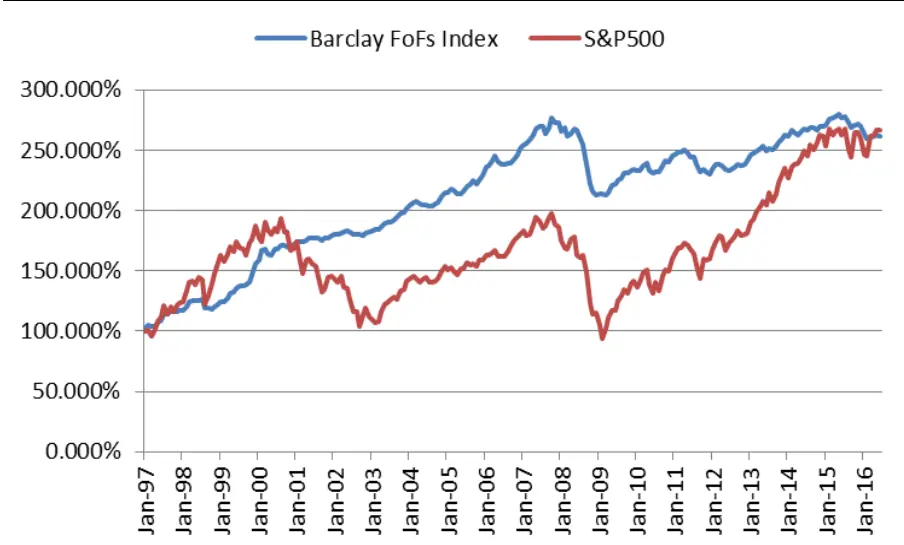
数据来源：国泰君安证券研究，BarclayHedge

FOF从筹资模式角度看，按内部FOF、外部 FOF和混合 FOF分类，内部 FOF 即全部投资于本基金管理人旗下基金的 FOF，此类 FOF 适合产品线较丰富的基金管理公司，可扩大旗下基金规模。如果自身产品不能满足资产配臵需求，则需要和外部基金公司合作形成外部FOF或者混合FOF。海外大部分为内部 FOF。

FOF 从资产配臵角度看，海外较为流行和成熟的类型有：目标日期型、国泰君安版权所有发送给国投瑞银基金管理有限公司.公用邮箱:res@ubs dic. om p3目标风险型、灵活配臵型。目标日期型FOF设定固定期限，早期大比例配臵于风险较高的资产如权益类资产上，后期逐渐转为低风险资产如固定收益类资产。目标风险型基金设定固定风险目标，在静态风险目标约束下追求投资组合最优化。灵活配臵型FOF可以结合宏观或者是量化的大类资产配臵策略，动态的调整资产配臵，灵活应对市场变化。

FOF从选基策略的角度看，可以结合可得到的数据类别分类：业绩指标分析（净值数据）、基金经理分析（尽职调查数据）、归因与风格分析（持仓数据）。业绩指标分析所需的净值数据公布最为频繁和及时，容易开展研究；基金经理分析所需的数据资料需要通过调查得到，样本数量有限；归因与风格分析所需持仓数据仅在基金半年报和年报中完整公布，频率较低且可能有粉饰成分，只有基金公司内部自我评价时数据会相对完整和及时。本报告从基金复权净值曲线出发，构建选基策略。

## 1.2. FOF 投资策略框架

FOF基金的市场需求基于其挑选未来可能表现出色基金的能力和组合风险优化的能力。一个完整的 FOF投资策略应该包括三部分：

图 2FOF投资策略框架
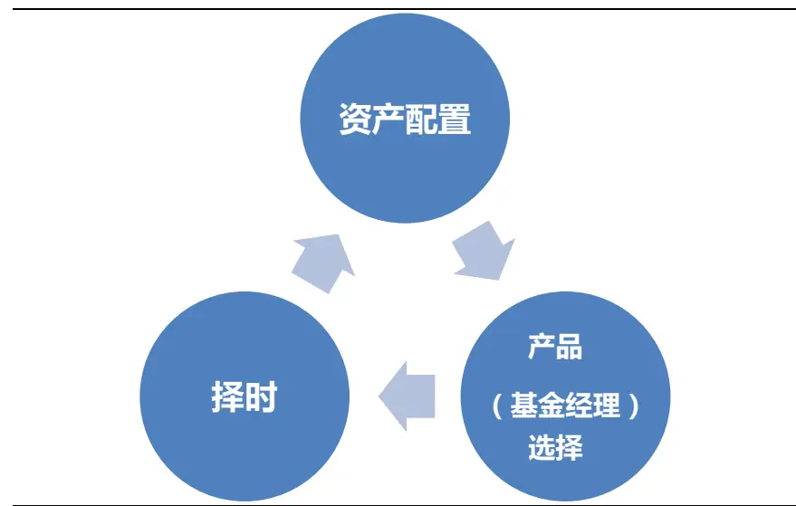
数据来源：国泰君安证券研究

FOF投资的第一步是资产配臵，经济周期有其运行的规律，不同的阶段对应不同的大类资产表现，正确的配比大类资产是构建 FOF的第一步。我国公募基金目前除股票和债券外的大类资产基金数目不多。截止 2016年6月30日通过投资公募基金可投资的大类资产有股票、债券、货币、贵金属（黄金、白银）、自然资源（原油）、国外房地产（REITs、股票）、国内房地产（仅一只 REITs）等。

FOF投资的第二步是产品选择，FOF的构建最终一定会落实到具体基金的选择，同一投资范围，不同的基金表现参差不齐，这取决于投资管理团队的素质水平、投资管理人的公司制度、风控体系等因素。本报告将就基金业绩表现的动量特征展开讨论，探讨具体基金的选择方法。

FOF 投资的第三步是市场时机选择，大类资产的风险收益特征时刻变化，择时在这里扮演了一个很重要的角色。如果想要追求绝对收益，只有及时对大类资产表现作出预判，及时调整资产配臵才能够提高收益水平，降低回撤水平，否则 FOF的表现就很难脱离某几种大类资产的总体表现，一荣俱荣，一损俱损。

## 1.3.国内公募 FOF 投资限制

2016 年 6 月 17 日，证监会颁布了《公开募集证券投资基金运作指引第2 号——基金中基金指引（征求意见稿）》（以下简称《指引》），对公募FOF的投资范围、配臵比例、费用情况等制定了基本规范。2016年9月23日，证监会正式发布并实施此指引。在进一步的细则未颁布的情况下，我们以本《指引》作为参考，在此框架下展开投资策略讨论。

投资范围方面公募FOF只能投资于公募基金，不能投资于私募基金、资管计划和具有复杂衍生品性质的分级基金。

公募基金

✘ 私募基金

✘ 资管计划

✘ 分级基金（复杂、衍生品性质）

配臵比例方面，FOF中基金资产的比例必须大于 80%，持有单只基金的市值，不能超过FOF资产净值的20%，即如果满仓操作，必须选 5只以上基金。但是完全按照有关指数构成比例持有基金的FOF不受前述比例3124限制。同时FOF不能持有其他 FOF形成双重 FOF的结构。

基金收费方面，FOF不得对管理费、托管费、申购费、赎回费、销售服务费双重收费。

## 2. 公募基金动量效应考察

基金的业绩表现是否具有动量效应？基金的历史优良表现和未来优良业绩的持续是否显著相关？其本质是证券本身的动量效应（运气）和基金管理者管理基金的能力（能力）最终反映到基金表现上的结果。对于基金回报来自于运气还是能力，学术上的讨论各执其词，一些研究表明优秀的成长型基金具有显著的选股能力，相反优秀的价值型基金没有；另一些研究则表明优秀的投资于高分红股票的基金具有显著的选股能力，而优秀的投资于小市值股票的基金没有。收益的来源实际很难仅从运气或能力的角度解释，因此，归结到投资的角度，如果公募基金的动量效应长期显著存在，不论其收益来自哪里，都可以融入到 FOF投资策略中去。

关于基金的动量效应一般有以下认识：

1、 长期动量不存在，短期动量存在；国泰君安版权所有发送给国投瑞银基金管理有限公司.公用邮箱:res@ubs dic. om p5

2、动量效应和基金排序方式有关。

因此，本报告将考察不同周期下，利用不同指标对基金排序后的基金动

量效应。

## 2.1.在哪里考察：基金池筛选

不同类型的基金投资标的比例不同，衡量的方式和标准也不尽相同，因此在考察动量效应时必须区分。

中国大陆公募基金按照投资标的大致可以分为股票型、混合型、债券型、QDII 型、货币型和另类投资型。股票基金主要细分为被动指数型、普通股票型和增强指数型，混合基金主要细分为灵活配臵型、偏股混合型、偏债混合型和平衡混合型，债券基金主要细分为被动指数型、纯债型、混合债券二级型、混合债券一级型和增强指数型。QDII基金只是投资非大陆资产，分类上基本涵盖大陆公募基金所有的品种。另类投资基金目前分为采用股票多空等策略的基金，主要跟踪黄金或者白银价格的商品型基金，房地产信托投资REITs基金。

图 3中国大陆公募基金分类
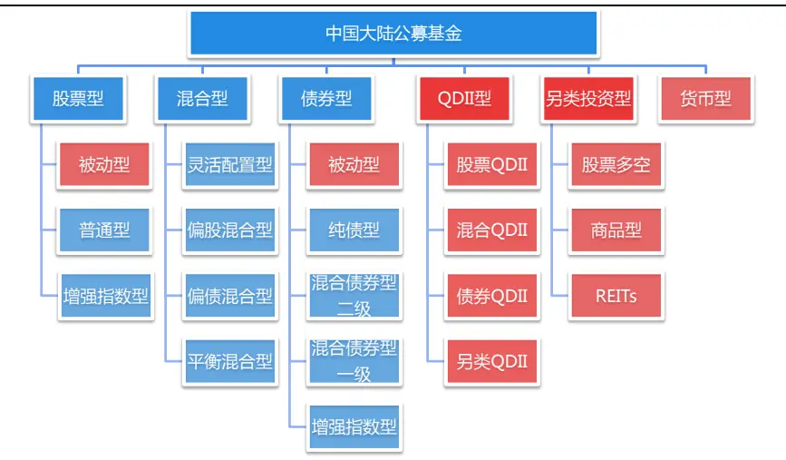
数据来源：国泰君安证券研究

## 基金池筛选的原则如下：

1、动量考察的是基金主动管理下收益能力的持续性，因此以模拟跟踪指数为目的的被动指数型基金不是我们考虑的范畴，在此需要剔除；

2、封闭型基金在动量策略构建组合的过程中操作不便，应予以剔除；

3、根据证监会文件的规定，将所有分级基金剔除，包括分级 AB 端以及母基金。理论上分级基金母基金不具有杠杆、期权等复杂性质，但是为了严格满足证监会文件的投资限制，我们将母基金也剔除；

4、根据证监会文件的规定，将基金运作期小于 1 年，上一报告期披露规模小于1亿元的基金剔除；

5、为了避免幸存者偏差（Survivorship bias），必须同时考虑目前处于运行中的基金和已经被摘牌或者清算的基金。

## 几类特殊基金的剔除原因：

1、 QDII 型基金由于其投资标的涉及多个市场，不同市场类型（成熟市

场、新兴市场等）实际对应的不同大类资产，因此QDII型基金选基不属于产品选择环节而是资产配臵环节，本节不予考虑；

2、股票多空型基金数量少（23 只），成立时间晚，没有足够的样本考察，因此不予考虑；

图 4 股票多空型基金复权净值曲线
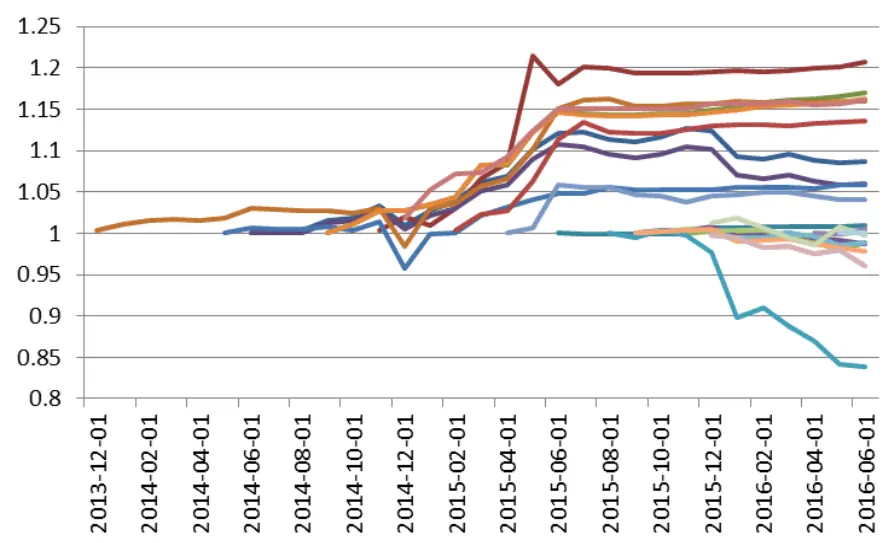
数据来源：国泰君安证券研究

3、货币型基金收益稳定，类似于银行存款，主动管理成分少，不纳入策略回测考量；

4、商品型基金目前标的品种同质性强且都是被动跟踪型，缺少主动成分，不予考虑；

图 5 黄金ETF月收益率与净值表现
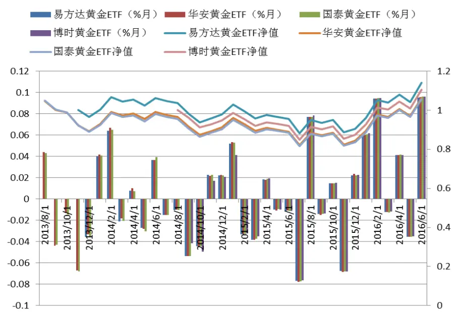
数据来源：国泰君安证券研究

## 5、REITs基金目前市场上只有一只，其为封闭式基金，不予考虑。

由此筛选下来，我们主要考虑以下三类基金：

图 6 动量效应考察基金类别
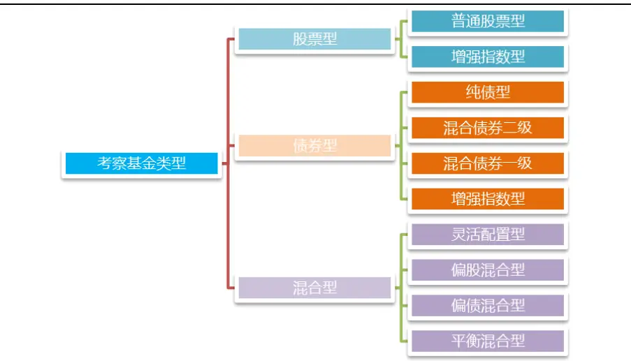
数据来源：国泰君安证券研究

经过筛选，截至2016 年6月30日，各类满足条件的基金数量分别为：股票型121只，债券型 480 只，混合型915只。

## 2.2.用什么考察：指标设计

基金表现的几乎所有信息包含在其复权净值变化中，对于复权净值的变化，有收益类评价指标，有风险类评价指标，也有风险调整后收益类评价指标。后者为前两者的结合，用于衡量单位风险下基金的收益水平。

常见的收益类评价指标和风险类评价指标有：

表 1：收益类评价指标和风险类评价指标

| 指标名称 | 指标说明 |  |
| --- | --- | --- |
| 历史收益率（HR） 收益类 评价指标 超额收益率（Alpha） |  | 样本的年化收益率。 基金的收益可以分解为市场收益和基金管理人创造的超额收益，我们利用基金指数或 |
|  |  | 者基金基准的收益率对基金收益率进行OLS回归，得到基金对其基准的风险因子β， |
|  |  | 再用β计算α: |
|  |  | $\mathrm{~\ Alpha=}\mu-\beta\times\mu_{b}\ ,\beta=\frac{\sum_{i=1}^{N}r_{i}\times b_{i}-N\bar{r}\bar{b}}{\sum_{i=1}^{N}b_{i}^{2}-N\bar{b}}$ |
| 风险类 评价指标 | 调整在险值（MVaR） | $\boldsymbol{\mu}_{b}$ $\boldsymbol{r}_{i}$ $b_{i}.$ 数或者基准收益率。 |
|  |  | 调整在险值是利用收益率偏度和峰度对传统在险值调整后的指标。传统的在险值 |
|  |  | (VaR）无法捕捉基金收益率肥尾属性，因此提出调整在险值。调整在险值的公式如 下： |
|  | $\mathrm{MVaR}_{\alpha}=\mu+\left(z_{c}+\frac{1}{6}\bigl(z_{c}^{2}-1\bigr)S+\frac{1}{24}\bigl(z_{c}^{3}-3z_{c}\bigr)K-\frac{1}{36}\bigl(2z_{c}^{3}-5z_{c}\bigr)S^{2}\right)\sigma$ |  |
|  | 其中， $z_{c}$ 是正态分布在置信度为α%下的临界值。 $\bar{\hbar}\mu,\sigma,S,$ K则为样本收益率分布的 |  |
| 最大回撤（MD） | 均值，标准差，偏度，峰度。此指标意味着在调整了收益率分布偏度和峰度后，未来 有α%的概率收益率不会低于M $\mathrm{{NaR}}_{\alpha}$ 9 净值历史回撤幅度最大值。 样本数据所有回撤 $DD_{i}$ 加权平均值。 |  |
|  | ${\mathrm{AD}}=\sum_{i=0}^{N-1}DD_{N-i}\times0.9^{i}$ |  |
| 平均回撤（AD） | 其中，N代表样本数据个数， $DD_{i}$ 代表在i时刻回撤的大小。i时刻回撤是指净值在i 时刻的水平相对i时刻以前最高净值的降幅。本指标代表了基金长期管理下平均回撤 水平。平均回撤来源于美国对冲基金的高水位线条款（High Water Mark)，即新一季 度的业绩提成基于高于本季之前最高水平的部分。举例说明，如果基金历史最高净值 1.10元，而上一季末净值为1.05元，那么即便本季净值达到1.20元，业绩提成的基 础是1.20和前最高值1.10的差额0.10元，而不是本季净值上升的1.20-1.05=0.15元。 |  |
| 负向收益波动率（LPM） 收益波动率（SIGMA） | 平均回撤是对基金长期回撤控制能力的一种考察。 仅计算样本负向收益的波动率。 样本收益率的波动率。 |  |

数据来源：国泰君安证券研究

风险调整后收益类指标可由收益类指标和风险类指标两两结合形成，由本报告前列指标可构造 10个：

表 2：风险调整后收益类评价指标

|  | MVaR | MD | AD | LPM | SIGMA |
| --- | --- | --- | --- | --- | --- |
| HR | H_Mvar | CR | H_Ad | SoR | SR |
|  | (HR/exp(MVaR)) | (卡玛比率) | (HR/abs(AD)) | (索提诺比率) | (夏普比率) |
| Alpha | A_Mvar (Alpha/exp(MVaR)) | A_Md (Alpha/abs(MD)) | A_Ad (Alpha/abs(AD)) | XR* (X 比率) | IR* (信息比率) |

数据来源：国泰君安证券研究。注：X 比率分子是 alpha，分母是负向收益波动率；信息比率分子是跟踪偏离度平均，分母是跟踪误差。

除以上指标外，本报告同时设计综合指标CI。综合指标是将以上所有指标等权加总得到的指标。在加总之前先将每个指标的值映射到[0,1]之间。

$$
\mathrm{CI=sigmoid(HR)+sigmoid(Alpha)+sigmoid(MVar)+\cdots+sigmoid(XR)+sigmoid(IR)}
$$

关于基金基准的选取和超额收益的计算，由于不同基金投资的标的不同，仓位也不同，很难找到一个统一的指数用于计算超额收益，本报告利用市场上同类所有满足条件基金（包括在之后被终止的基金）等权或规模加权合成的指数计算超额收益率，在我们的研究中发现等权或是规模加权去合成基金指数区别并不大，由于动量策略选基是通过排序构建投资组合的，因此指数细微的区别影响不大，因此本文统一采用等权指数计算。

图 7 等权和规模加权基金指数
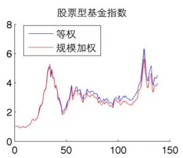

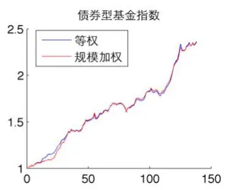

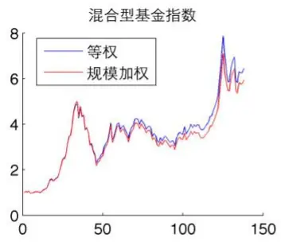
数据来源：国泰君安证券研究。

## 2.3.怎么样考察：历史表现选基策略

为了验证基金业绩的动量效应，本报告通过挑选历史上表现最好的部分基金并观察它们未来的表现来考察。历史表现选基策略就是根据单个不同基金业绩表现评价指标对基金过去的业绩进行排序，按比例选取历史表现最好的部分基金等权构建基金组合。持有一段时间后，定期更新数据进行重新排序，调整所持基金组合。

为了考察基金的动量效应持续时间，我们同时设计了三种调仓频率：半年调仓式、季度调仓式、月度调仓式，分别对应长期、中期、短期投资，其样本内时长是指对历史的考察长度，持仓时间分别为 6 个月、3 个月和1个月。策略的回测期为 2006年1 月到2016年6 月。

表 3：投资周期和选基比例组合

| 组合名称 | 样本内 | 持仓时间 选基比例* |
| --- | --- | --- |
| 半年调仓式 24个月 | 6个月 | Top2.5% |
| 季度调仓式 | 18个月 3个月 | Top2.5% |
| 月度调仓式 | 12个月 1个月 | Top2.5% |

数据来源：国泰君安证券研究。注：若选基数量小于 5，按 5算。

## 2.4. 考察结果分析

动量效应的显著与否可以从两个角度进行考察：绝对收益和相对收益。从绝对收益角度看，最终收益越高，夏普比率越高的历史表现选基策略反映的基金动量效应越明显；从相对收益角度看，相对指数 Alpha 越高，国泰君安版权所有发送给国投瑞银基金管理有限公司.公用邮箱:res@ubs dic. om p10信息比率越高的历史表现选基策略相对市场平均水平动量效应贡献的增量收益越强。

## 2.4.1. 股票型基金

股票型基金月度调仓下的年化收益率和夏普比率最高，表明股票型基金动量效应存在但持续时间较短，动量效应随着时间拉长逐步衰减。从相对收益角度来看，调仓频率越高相对收益越高越稳定，月调仓下利用综合指标选基有较为显著的超额收益。

表 4：股票型基金回测结果

| 选基指标 | 年化收益率 | 收益率波动 | 夏普比率 | 相对指数 Alpha | 相对指数 信息比率 | 最大回撤 | 负收益比例 | 平均换手率 |
| --- | --- | --- | --- | --- | --- | --- | --- | --- |
| A：半年调仓式 |  |  |  |  |  |  |  |  |
| 收益类平均 | 7.77% | 8.88% | 0.30 | -0.02% | 0.03 | -64.77% | 43.42% | 37.22% |
| 风险类平均 | 7.60% | 8.62% | 0.30 | -0.03% | 0.00 | -65.04% | 39.12% | 35.78% |
| 风险调整后 收益类平均 | 7.95% | 8.83% | 0.31 | 0.00% | 0.06 | -64.26% | 42.98% | 37.67% |
| 综合指标 | 7.48% | 8.94% | 0.30 | -0.05% | -0.05 | -67.08% | 42.98% | 33.33% |
| B: 季度调仓式 |  |  |  |  |  |  |  |  |
| 收益类平均 | 11.83% | 8.83% | 0.43 | 0.03% | 0.10 | -63.74% | 40.42% | 27.95% |
| 风险类平均 | 12.86% | 8.86% | 0.46 | 0.09% | 0.28 | -63.65% | 38.33% | 26.36% |
| 风险调整后 收益类平均 | 12.73% | 8.76% | 0.45 | 0.09% | 0.24 | -62.68% | 39.58% | 29.28% |
| 综合指标 | 12.24% | 8.86% | 0.44 | 0.04% | 0.18 | -64.35% | 38.33% | 31.28% |
| C: 月度调仓式 |  |  |  |  |  |  |  |  |
| 收益类平均 | 19.54% | 8.82% | 0.65 | 0.30% | 0.55 | -61.77% | 35.71% | 22.00% |
| 风险类平均 | 16.82% | 8.71% | 0.58 | 0.11% | 0.29 | -62.52% | 36.51% | 16.77% |
| 风险调整后 | 20.06% | 8.68% | 0.67 | 0.34% | 0.71 | -61.61% | 35.24% | 20.70% |
| 收益类平均 综合指标 | 20.52% | 8.66% | 0.68 | 0.37% | 0.94 | -60.82% | 34.92% | 20.64% |

数据来源：国泰君安证券研究

从净值曲线上看，2012年以前单指标选基得到的结果区分度并不大，从2012年以后看区分度逐渐打开，动量效应得以显现。其中最终夏普比率最高的指标为XR，夏普比率达到 0.73，相对指数信息比率 1.06。

图 8月调仓下股票型基金回测净值曲线
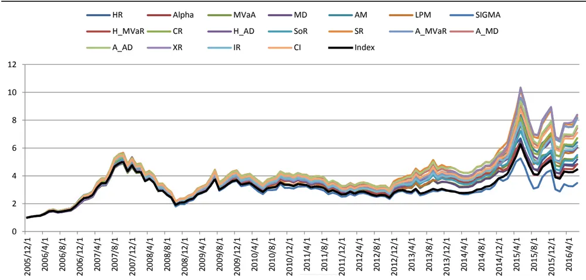
数据来源：国泰君安证券研究

以XR作为选基指标，被选次数最多的 10只基金频次和占总基金被选频次的62%。其中普通股票型 5 只，增强指数型5只。从绝对数量和成立时间上来看，增强指数型基金数量更少，成立更晚，但是从近一半的入选比例可以看出增强指数型基金相对大部分普通股票型基金长期表现更优。

## 2.4.2. 债券型基金

历史表现选基策略在债券型基金不论是绝对收益还是相对收益，整体来看相对调仓频率都不敏感。总体风险较低，从夏普比率和最大回撤控制的角度来看，季度调仓下用 H_AD 指标选基效果最好，夏普比率达到1.44，最大回撤控制在-2.36%。从信息比率的角度看，月度调仓下用 IR指标选基效果最好，信息比率达到0.78。

表 5：债券型基金回测结果

| 选基指标 | 年化收益率 | 收益率波动 | 夏普比率 | 相对指数 Alpha | 相对指数 信息比率 | 最大回撤 | 负收益比例 | 平均换手率 |
| --- | --- | --- | --- | --- | --- | --- | --- | --- |
| A：半年调仓式 |  |  |  |  |  |  |  |  |
| 收益类平均 | 7.69% | 1.84% | 0.77 | -0.10% | 0.10 | -10.30% | 33.33% | 62.12% |
| 风险类平均 | 6.96% | 2.68% | 0.72 | -0.34% | -0.06 | -18.96% | 30.18% | 46.87% |
| 风险调整后 收益类平均 | 7.16% | 1.34% | 0.96 | 0.06% | -0.02 | -6.98% | 28.42% | 57.63% |
| 综合指标 | 7.01% | 1.09% | 1.04 | 0.17% | -0.13 | -4.04% | 28.07% | 57.30% |
| B: 季度调仓式 |  |  |  |  |  |  |  |  |
| 收益类平均 | 8.70% | 2.35% | 0.86 | -0.23% | 0.35 | -15.24% | 30.83% | 46.55% |
| 风险类平均 | 7.06% | 2.50% | 0.92 | -0.32% | -0.05 | -17.18% | 27.00% | 34.29% |
| 风险调整后 收益类平均 | 8.21% | 1.40% | 1.22 | 0.09% | 0.25 | -6.12% | 25.25% | 44.89% |
| 综合指标 | 8.06% | 1.10% | 1.29 | 0.20% | 0.25 | -2.82% | 24.17% | 42.76% |
| C:月度调仓式 |  |  |  |  |  |  |  |  |
| 收益类平均 | 9.54% | 3.08% | 0.78 | -0.40% | 0.31 | -19.75% | 28.17% | 34.62% |
| 风险类平均 | 7.74% | 2.57% | 0.79 | -0.35% | 0.07 | -16.70% | 24.92% | 26.42% |
| 风险调整后 | 8.70% | 1.66% | 1.11 | 0.01% | 0.27 | -8.28% | 23.65% | 32.54% |
| 收益类平均 综合指标 | 9.31% | 1.37% | 1.28 | 0.13% | 0.59 | -5.58% | 22.22% | 35.53% |

数据来源：国泰君安证券研究

从净值曲线上看，用 IR 指标选基，长期以来明显跑赢其他指标，其收益稳定，回撤相对较小。利用 IR 作为选基指标，被选次数最多的 28只基金频次和占总基金被选频次的51.5%。其中混合型一级基金 14 只，混合型二级基金 12 只，纯债型基金 1 只，增强指数型基金 1 只。混合型一级基金与混合型二级基金可以参与一级市场打新，因此整体的收益有所增强，混合型二级基金还可以通过精选个股增强收益。

图 9月调仓下债券型基金回测净值曲线
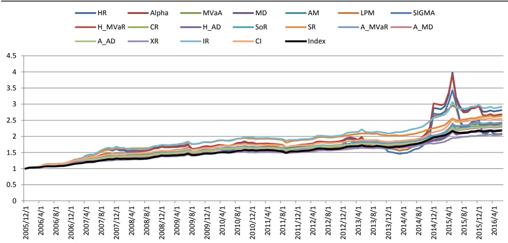
数据来源：国泰君安证券研究。

2013年12月 27日公布的《首次公开发行股票承销业务规范》规定债券型证券投资基金不能参与网下打新。但是 2013 年以后被动量策略选入的一级债基和二级债基比例并没有显著减少。动量策略选基过程中有两段时间一级债基和二级债基被选比例显著减少，纯债基金被选比例显著提高：2014 年 4 月-2014 年 8 月，2016 年 2 月-2016 年 5 月。其对应的样本内数据都经历了权益市场的长期下跌，在权益市场企稳后相应的一级债基和二级债基的比例又会显著提高。

图 10 被选纯债基金比例上升期
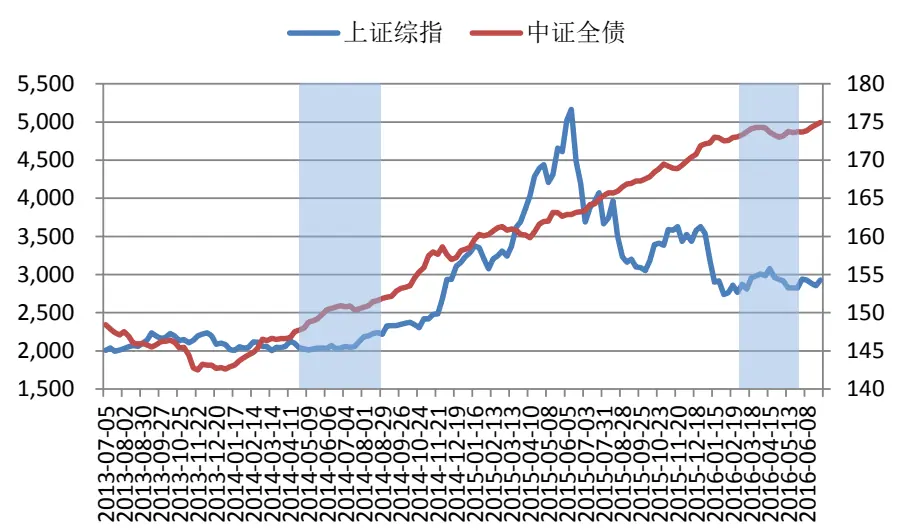
数据来源：国泰君安证券研究

## 2.4.3. 混合型基金国泰君安版权所有

历史表现选基策略在混合型基金上，从绝对收益和相对收益角度考察，其调仓频率越高，动量效果越明显，且总体收益、夏普比率、最大回撤好于股票型基金。但是其相对指数信息比率比股票型基金小。动量效应在混合型基金上效果更明显，但是动量效应在混合型基金选基相对市场平均水平的贡献上较股票型基金略逊一筹。

表 6：债券型基金回测结果

| 选基指标 | 年化收益率 | 收益率波动 | 夏普比率 | 相对指数 Alpha | 相对指数 信息比率 | 最大回撤 | 负收益比例 | 平均换手率 |
| --- | --- | --- | --- | --- | --- | --- | --- | --- |
|  | A:半年调仓式 |  |  |  |  |  |  |  |
| 收益类平均 | 13.23% | 7.93% | 0.49 | 0.06% | 0.24 | -50.37% | 39.47% | 61.42% |
| 风险类平均 | 8.88% | 4.98% | 0.57 | 0.09% | -0.21 | -30.40% | 35.44% | 42.94% |
| 风险调整后 收益类平均 | 10.64% | 5.57% | 0.49 | 0.12% | -0.14 | -38.86% | 37.28% | 60.80% |
| 综合指标 | 11.21% | 5.27% | 0.51 | 0.17% | -0.14 | -39.51% | 37.72% | 62.58% |
|  | B:季度调仓式 |  |  |  |  |  |  |  |
| 收益类平均 | 15.51% | 7.63% | 0.57 | 0.06% | 0.14 | -46.09% | 37.50% | 52.18% |
| 风险类平均 | 10.95% | 5.22% | 0.65 | 0.08% | -0.23 | -33.09% | 35.33% | 34.33% |
| 风险调整后 收益类平均 | 14.67% | 5.60% | 0.69 | 0.29% | -0.04 | -35.63% | 35.42% | 50.63% |
| 综合指标 | 15.42% | 5.27% | 0.72 | 0.41% | 0.02 | -36.09% | 35.83% | 54.59% |
|  | C:月度调仓式 |  |  |  |  |  |  |  |
| 收益类平均 | 25.38% | 7.90% | 0.87 | 0.46% | 0.58 | -49.18% | 33.33% | 34.17% |
| 风险类平均 | 14.69% | 6.04% | 0.69 | 0.07% | -0.24 | -39.17% | 33.17% | 25.73% |
| 风险调整后 | 20.07% | 6.16% | 0.83 | 0.39% | 0.08 | -39.99% | 31.90% | 35.73% |
| 收益类平均 综合指标 | 21.30% | 6.22% | 0.88 | 0.47% | 0.27 | -36.65% | 30.95% | 36.51% |

数据来源：国泰君安证券研究

从策略净值曲线上可以看到，策略在混合型基金上区分度很高，利用HR、H_MVaR、IR、Alpha、A_MVaR 等指标去选基，能长期跑赢其他指标和市场平均水平，其中夏普比率最高的选基方式为月调仓下用 SR指标选基，夏普比率达到0.99。相对指数信息比率最高的选基方式为月调仓下用IR 指标选基，信息比率达到0.87。

图 11月调仓下混合型基金回测净值曲线
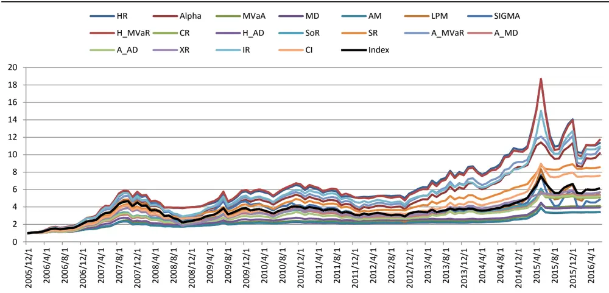
数据来源：国泰君安证券研究。

利用SR作为选基指标，被选次数最多的63 只基金频次和占总基金被选频次的 55.9%。其中灵活配臵型 10 只、偏股混合型 29 只、偏债混合型23只、平衡混合型1 只。利用IR 作为选基指标，被选次数最多的 60只基金频次和占总基金被选频次的53.7%。其中灵活配臵型 14只、偏股混合型42只、偏债混合型 1只、平衡混合型3只。明显用 SR去选基，更多的会偏向债券，用 IR 去选基，更多的偏向股票，这正是从绝对收益和相对收益角度出发的不同。

## 3. 基于奇异谱分析的FOF动量策略

上节动量效应考察的主要大类资产只有权益类与固定收益类两种。这两种资产中，权益类资产和大盘相关性高，收益不稳定且波动大，固定收益类资产和大盘相关性低，收益稳定且波动小。在有良好的大盘择时工具的前提下自然而然产生了一种资产切换的思想：在判断大盘上涨的时候持权益类资产，判断大盘下跌时持固定收益类资产，从而在控制风险的情况下增强总体的收益。

对于固定收益类资产的具体产品池，本报告认为可以选择债券型基金，因为债券型基金收益稳定风险小。对于权益类资产的产品池，本报告认为上攻性更好，动量效应更显著的混合型基金相比股票型基金更好。

## 3.1.奇异谱分析均线择时回顾

大盘择时体系分为预测类与趋势跟踪类，预测类择时体系更多的依赖于高胜率的判断，趋势跟踪类择时体系更多的依赖于对于市场趋势的把握速度和高盈亏比，本报告采用趋势跟踪类择时体系。在之前的报告《基于奇异谱分析的均线择时研究》中我们提出了一类趋势跟踪类择时体系，它利用奇异谱分析过滤市场波动中的振荡项和噪音项，提取不同时间周期的趋势线，所获得的趋势线相比移动平均线受异常值影响更小，对上涨中回调敏感性更强，对下跌中反弹更谨慎。以 10、30、50 为窗口参数的奇异谱趋势线组判断体系下的指数多空策略在牛市中能抓住主要趋势，在熊市和震荡市中能够控制整体的回撤。本文将利用此趋势判断系统进行FOF大类资产配臵的时机选择。如果体系在月末处于看多区间，下个持仓周期持有混合型基金，如果体系在月末处于看空区间，则下个持仓周期持有债券型基金。

## 3.2.择时：奇异谱分析 + 选基：动量指标

## 3.2.1. 调仓费用计算

关于基金投资的费用，一般考虑以下几块：认购费、申购费、赎回费、销售服务费、管理费、托管费等。其中认购费为基金在认购期认购所需的费用，而本策略仅考虑成立一年以上的基金，因此应当适用申购费。基金的申购费本策略采取前端收取模式。基金的销售服务费、管理费和国泰君安版权所有发送给国投瑞银基金管理有限公司.公用邮箱:res@ubs dic. om p15托管费一般按日计提，本策略为了方便起见采用调仓日统一计提规则。

关于基金投资各费用的费率问题，一般大额（1000万元以上）申购费用在0.01%以下，赎回费率 1年以内，30日以上在0.5%左右，销售服务费一般较小，可以忽略，管理费用一般在 1.5%（每年），托管费用一般在0.25%（每年）。由此计算下来的调入调出费率分别约为：

表 7：基金组合调仓费用

| 调仓频率 | 单次调入 | 混合型单次调出 | 债券型单次调出 |
| --- | --- | --- | --- |
| 半年 | 0.01% | 1.37% | 0.55% |
| 季 | 0.01% | 0.93% | 0.33% |
| 月 | 0.01% | 0.64% | 0.18% |

数据来源：国泰君安证券研究

## 3.2.2. 选基策略组合

在资产配臵方式确定的情况下，选基指标和调仓频率的确定同样可以从两个角度考虑，绝对收益和相对收益，主要选择策略夏普比率最高的指标和信息比率最高的指标。既然有择时工具帮助我们规避大盘风险，我们同样可以考虑仅从年化收益率的角度选择混合型基金的选基指标，按历史年化收益率选择基金，往往会选择到相对激进，净值波动较大的基金。从上节回测中可以看到，不论混合型基金还是债券型基金，月调仓下效果最好，因此本处讨论的都是在月调仓下的最优指标。

为避免完全事后判断，选基指标的选取仅考虑2014年以前的数据。

表 8：选基策略组合

|  | 混合型基金 年化收益率 最高指标 | 混合型基金 夏普比率 最高指标 | 混合型基金 信息比率 最高指标 |
| --- | --- | --- | --- |
| 债券型基金 夏普比率 最高指标 | H_AD（债）+ H_MVaR（混） | H_AD（债）+ SR（混） | H_AD(债)+IR(混) |
| 债券型基金 年化收益率 最高指标 | IR（债）+ H_MVaR（混） |  | IR（债）+SR（混）IR（债）+ IR（混） |

数据来源：国泰君安证券研究

## 3.2.3. 回测结果

我们对各类选基方式考虑调仓费用进行了回测，结果如下：

表 9：回测结果

|  | 年化收益率 | 夏普比率 | 最大回撤 | 收益回撤比 | 月胜率 |
| --- | --- | --- | --- | --- | --- |
| H_AD（债） +H_MVaR (混) | 26.96% | 1.05 | -21.08% | 1.28 | 65.08% |
| H_AD（债） +SR（混） | 20.54% | 1.07 | -13.37% | 1.54 | 69.84% |
| H_AD(债） +IR（混） | 26.93% | 1.08 | -20.51% | 1.31 | 67.46% |
| IR（债） +H_MVaR (混) | 26.21% | 1.02 | -23.03% | 1.14 | 61.90% |
| IR(债)+SR (混) | 19.83% | 1.02 | -13.91% | 1.43 | 66.67% |
| IR(债)+ IR (混) | 26.18% | 1.04 | -20.50% | 1.23 | 64.29% |

数据来源：国泰君安证券研究

从最终的回测结果可以看到，奇异谱择时FOF动量策略绝对收益相比于简单持有混合型基金更好，回撤更小，且相对沪深300 指数能够长期获得一定的超额收益。其中收益回撤比最大的组合为H_AD(债)+SR(混)。

图 12 奇异谱择时FOF动量策略回测结果
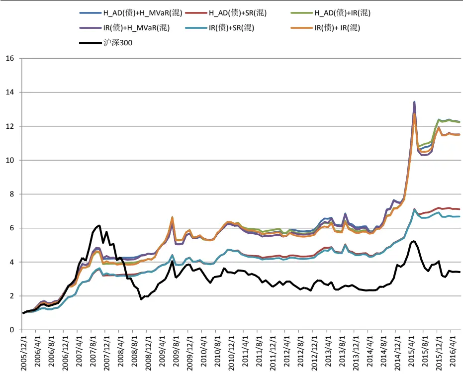
数据来源：国泰君安证券研究

## 4. 未来研究展望

资产配臵方式多种多样，本报告考虑的资产池并没有包括 QDII 基金，商品基金，REITs 基金等，结合更加完善的大类资产配臵策略，可以进一步的分享其他类别资产带来的收益。

非被动基金投资的 FOF 本质上还是选择优秀的基金经理，因此基金经理国泰君安版权所有发送给国投瑞银基金管理有限公司.公用邮箱:res@ubs dic. om p17评价是FOF重要的内容，通过数据的进一步采集，可以逐步建立基金经理评价体系，满足不同投资者对基金经理的偏好与需求。

归因与风格分析本质上是寻找基金的Alpha 来源，在持仓数据能够获得的前提下可以通过归因与风格分析找寻各类基金的 Alpha 来源，从而对基金经理能力进行评价和归类，在此基础上配臵目标风格基金经理管理的基金。

公募FOF市场的打开必会丰富公募基金的品种和产品，FOF的大类资产配臵需求会促进被动型基金覆盖面，促进包括商品型、REITs 型基金的发展，反过来这些基金的发展也将为FOF提供更多的配臵空间，两者相辅相成，未来将得到共同的发展。

## 本公司具有中国证监会核准的证券投资咨询业务资格

## 分析师声明

作者具有中国证券业协会授予的证券投资咨询执业资格或相当的专业胜任能力，保证报告所采用的数据均来自合规渠道，分析逻辑基于作者的职业理解，本报告清晰准确地反映了作者的研究观点，力求独立、客观和公正，结论不受任何第三方的授意或影响，特此声明。

## 免责声明

本报告仅供国泰君安证券股份有限公司（以下简称“本公司”）的客户使用。本公司不会因接收人收到本报告而视其为本公司的当然客户。本报告仅在相关法律许可的情况下发放，并仅为提供信息而发放，概不构成任何广告。

本报告的信息来源于已公开的资料，本公司对该等信息的准确性、完整性或可靠性不作任何保证。本报告所载的资料、意见及推测仅反映本公司于发布本报告当日的判断，本报告所指的证券或投资标的的价格、价值及投资收入可升可跌。过往表现不应作为日后的表现依据。在不同时期，本公司可发出与本报告所载资料、意见及推测不一致的报告。本公司不保证本报告所含信息保持在最新状态。同时，本公司对本报告所含信息可在不发出通知的情形下做出修改，投资者应当自行关注相应的更新或修改。

本报告中所指的投资及服务可能不适合个别客户，不构成客户私人咨询建议。在任何情况下，本报告中的信息或所表述的意见均不构成对任何人的投资建议。在任何情况下，本公司、本公司员工或者关联机构不承诺投资者一定获利，不与投资者分享投资收益，也不对任何人因使用本报告中的任何内容所引致的任何损失负任何责任。投资者务必注意，其据此做出的任何投资决策与本公司、本公司员工或者关联机构无关。

本公司利用信息隔离墙控制内部一个或多个领域、部门或关联机构之间的信息流动。因此，投资者应注意，在法律许可的情况下，本公司及其所属关联机构可能会持有报告中提到的公司所发行的证券或期权并进行证券或期权交易，也可能为这些公司提供或者争取提供投资银行、财务顾问或者金融产品等相关服务。在法律许可的情况下，本公司的员工可能担任本报告所提到的公司的董事。

市场有风险，投资需谨慎。投资者不应将本报告作为作出投资决策的唯一参考因素，亦不应认为本报告可以取代自己的判断。
在决定投资前，如有需要，投资者务必向专业人士咨询并谨慎决策。

本报告版权仅为本公司所有，未经书面许可，任何机构和个人不得以任何形式翻版、复制、发表或引用。如征得本公司同意进行引用、刊发的，需在允许的范围内使用，并注明出处为“国泰君安证券研究”，且不得对本报告进行任何有悖原意的引用、删节和修改。

若本公司以外的其他机构（以下简称“该机构”）发送本报告，则由该机构独自为此发送行为负责。通过此途径获得本报告的投资者应自行联系该机构以要求获悉更详细信息或进而交易本报告中提及的证券。本报告不构成本公司向该机构之客户提供的投资建议，本公司、本公司员工或者关联机构亦不为该机构之客户因使用本报告或报告所载内容引起的任何损失承担任何责任。

## 评级说明

## 1.投资建议的比较标准

投资评级分为股票评级和行业评级。

以报告发布后的12个月内的市场表现为比较标准，报告发布日后的 12个月内的公司股价（或行业指数）的涨跌幅相对同期的沪深 300 指数涨跌幅为基准。

## 2.投资建议的评级标准

报告发布日后的 12 个月内的公司股价（或行业指数）的涨跌幅相对同期的沪深 300 指数的涨跌幅。

|  | 评级 | 说明 |
| --- | --- | --- |
| 股票投资评级 | 增持 | 相对沪深300 指数涨幅15%以上 |
|  | 谨慎增持 | 相对沪深300指数涨幅介于5%～15%之间 |
|  | 中性 | 相对沪深300指数涨幅介于-5%～5% |
|  | 减持 | 相对沪深 300指数下跌 5%以上 |
| 行业投资评级 | 增持 | 明显强于沪深 300 指数 |
|  | 中性 | 基本与沪深 300指数持平 |
|  | 减持 | 明显弱于沪深300指数 |

## 国泰君安证券研究

|  | 上海 | 深圳 | 北京 |
| --- | --- | --- | --- |
| 地址 | 上海市浦东新区银城中路168号上海 银行大厦29层 | 深圳市福田区益田路 6009号新世界 商务中心34层 | 北京市西城区金融大街 28 号盈泰中 心2号楼10层 |
| 邮编 | 200120 | 518026 | 100140 |
| 电话 | （021)38676666 | (0755)23976888 | (010)59312799 |
|  | E-mail: gtjaresearch@gtjas.com |  |  |