inInfo] [Table_Title] 2016.09.29

# 基于 MACD 价格分段的阻力与支撑研究

# ——数量化专题之八十三

刘富兵（分析师）

8 021-38676673

liufubing008481@gtjas.com

证书编号 S0880511010017

## 本报告导读：

基于 DEA 价格分段建立了关于“阻力与支撑”的量化研究，应用于预测日线级别行情的反转，效果良好。同时构建交易策略，在上证综指上取得了较好的效果。

## 摘要：

ble_Summary]基于 DEA 价格分段构建关于“阻力与支撑”的研究，借以定量研究阻力位与支撑位预测行情反转是否有效。建立该体系需要三个步骤：定义―阻力位与支撑位‖、定义―阻力位与支撑位‖的阻击与突破、制定检验预测正误的验证标准。

价格分段“阻力与支撑”的应用之一：“阻击”现象反转预测成功率不超过 70%，“突破”现象反转预测成功率约 75%。过去 10 年上证综指出现了 48 次―阻击‖，其中 29 次成功预测日线级别反转，预测成功率为60%，中证500指数共发生了34 次―阻击‖，其中 23 次成功预测日线级别行情反转，预测成功率为 68%；上证综指共出现了 56次―突破‖，其中41次成功预测日线级别行情反转，预测成功率为 73%，中证 500指数共出现了 41次―突破‖，其中 31次成功预测日线级别行情反转，预测成功率为 76%。

组合“阻击+突破”——“阻击”与“突破”均发生，正是“空”与“多”的力量落差极具扩大的过程，说明其中一方在博弈中取胜，大大提升预测日线级别行情反转的成功率：上证综指共出现了 36 次―阻击+突破‖，其中 28 次成功预测日线级别行情反转，预测成功率为78%；中证500指数共出现了24次―阻击+突破‖，其中 20 次成功预测日线级别行情反转，预测成功率为 83%。

价格分段“阻力与支撑”的应用之二：将现象发生转化为买点信号，后市收益空间较高。上证综指―阻击+突破‖现象最大收益空间平均为 11.30%；中证 500 指数―阻击+突破‖现象最大收益空间平均为 23.95%。

如利用基于“阻击+突破”与“后错位”的交易策略增强基于日线级别的动量策略，可达到提高收益、降低最大回撤的目的。在上证综指上运用简单的日线级别动量策略，过去 10 年可获得约 13%的年化收益，最大回撤约 55%。加入基于―阻击+国泰君安版权所有发送给国投瑞银基金管理有限公司.公用邮箱:res@ubs dic. om p1突破‖与―后错位‖的交易策略后，年化收益上升至 17.61%，最大回撤降低至 40%以下。

金融工程

## 金融工程团队：

刘富兵：（分析师）

电话：021-38676673

邮箱：liufubing008481@gtjas.com

证书编号：S0880511010017

刘正捷：（分析师）

电话：0755-23976803

邮箱：liuzhengjie012509@gtjas.com

证书编号：S0880514070010

## 李辰：（分析师）

电话：021-38677309

邮箱：lichen@gtjas.com

证书编号：S0880516050003

## 陈奥林：（研究助理）

电话：021-38674835

邮箱：chenaolin@gtjas.com

证书编号：S0880114110077

## 孟繁雪：（研究助理）

电话：021-38675860

邮箱：mengfanxue@gtjas.com

证书编号：S088011604008

## 殷明：（研究助理）

电话：021-38674637

邮箱：yinming@gtjas.com

证书编号：S0880116070042

叶尔乐：（研究助理）

电话：021-38032032

邮箱：yeerle@gtjas.com

证书编号：S0880116080361

## [Table_R相关报告

《基于奇异谱择时的 FOF 动量策略》2016.09.27

《基于主题影响力因子的投资策略》2016.09.22

《 基 于 MACD 的 价 格 分 段 研 究 3.0 》2016.09.11

《基于机器学习的牛股精选》2016.09.08

《拐点预测之级别错位研究》2016.08.03

## 1. 价格分段的阻力与支撑

在技术分析中，把冲高回落的价位看作阻力位，把止跌反弹的价位看作支撑位；阻力位、支撑位对原有趋势的阻击，或阻力位、支撑位被突破，常常被认作是行情反转的操作信号。

应用于投资交易中，投资者常常在股价―不创新高‖（阻力位的阻击）或者―跌破支撑位‖（支撑位被向下突破）时选择―离场‖卖出，在股价―不创新低‖（支撑位的阻击）或者―上穿压力位‖（阻力位被向上突破）时选择―进场‖买入。这样的策略看似简单，但是检验其策略效果却不易。在我们过去的报告《价格走势之庖丁解牛系列:不创新高离场对吗？——数量化专题之四十八》中，针对―不创新高（低）离（进）场‖进行了定量研究，指出了研究难点具体有二：

- 何谓―不创新高（低）‖？在这里需要一个明确的定义。

- 在定义明确后，如何衡量这次―离场（进场）‖操作是否正确，如果缺少衡量的标准，就无从研究这样的交易策略是否有效。

针对上述两个难点，该篇报告提出了基于 DEA 价格分段方法的解决方案，并统计了沪深 300指数、中证 500指数以及创业板指数 900支成分股―不创新高离场‖的胜率，胜率基本上都在 60%以上，但最高不到 70%，胜率并不显著。

在本篇报告中，我们将在已有成果的基础上进行拓展研究，建立基于DEA 价格分段的 “阻力与支撑”的量化研究，借以定量研究阻力位与支撑位是否可以有效应用于预测行情走势，并着力从多空力量博弈的逻辑入手，构造有关“阻力与支撑”的组合策略以提升预测成功率，建立该体系需要完成以下三个步骤：

- 定义价格分段的阻力位与支撑位——阻力位与支撑位，千人千价，而价格分段的阻力位与支撑位的量化研究需要一个明确且标准的定义；

- 定义价格分段阻力位与支撑位的阻击与突破，并基于阻击与突破，给出对后市的判断——阻力与支撑位的破与不破，需要一个明确的标准；

- 制定检验预测后市对错的验证标准——以检验阻力与支撑位的阻击与突破是否有效。

## 1.1.阻力位与支撑位的定义

定义价格分段阻力位与支撑位：每一上涨段终点的价格点位对应一个阻力位，每一下跌段终点的价格点位对应一个支撑位，两者交替出现（注意，每一段的终点均需事后确认）。

图 1 每一段终点的价格点位对应一阻力位或支撑位
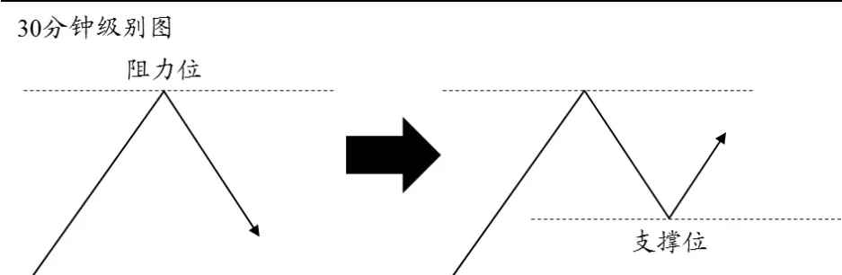
数据来源：国泰君安证券研究

## 1.2.阻击与突破的定义

无论是阻击还是突破现象，必须能够有助于研判后市，否则这样的现象就缺乏被研究的价值，所以在此需要结合现象与其所处的具体行情，以预测后市。以下定义以日线级别行情与 30 分钟级别行情为例来描述。

## 1.2.1. 阻击

## 1.2.1.1. 日线级别上涨行情中的阻击

若 30 分钟级别第 4段下跌已确认，且第 3 段上涨终点 c低于第 1段上涨终点 a，即 $P_{c}<P_{a}$ ，则称日线级别的上涨中出现了阻击。

图释：观察预测点指的是我们观察到―阻击‖现象，并预测后市日线级别行情的时间点，以下均同。

图 2日线级别上涨行情中的阻击
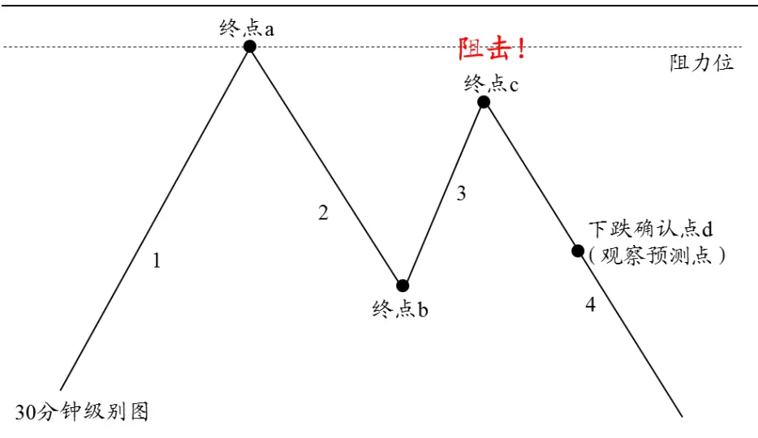
数据来源：国泰君安证券研究

## 1.2.1.2. 日线级别下跌行情中的阻击

若 30 分钟级别第 4段上涨已确认，且第 3 段下跌终点 c高于第 1段下跌终点 a，即 $P_{c}>P_{a}$ ，则称日线级别的下跌中出现了阻击。泰君安版权所有发送给国投瑞银基金管理有限公司.公用邮箱:res@ubs dic. om p4

图 3日线级别下跌行情中的阻击
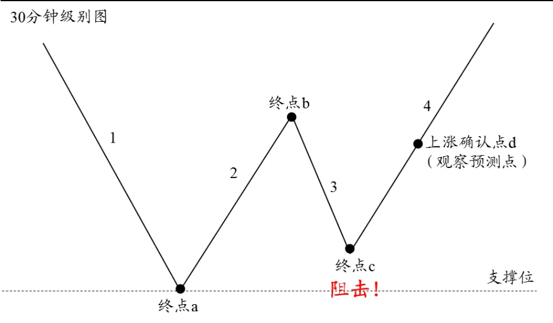
数据来源：国泰君安证券研究

## 1.2.2. 突破

1.2.2.1. 日线级别上涨行情中的向下突破

若 30 分钟级别第 5段上涨已确认，且 30 分钟级别收盘价首次向下突破了第 4 段下跌终点 a，即 $P_{c}\leq P_{a}$ ，则称日线级别的上涨中出现了向下突破。

图释：

- ―任意高度‖：ac区间最高点 b高度任意；

- ―ac 区间最高点 b‖：之所以这样命名，而不是命名为―终点 b‖，是由于股价首次突破第 4 段终点 a 时，―终点 b‖可以仍未被确认，这里强调的是股价突破，并不用考虑是否已经形成了 30分钟级别下跌。

图 4 日线级别上涨行情中的向下突破
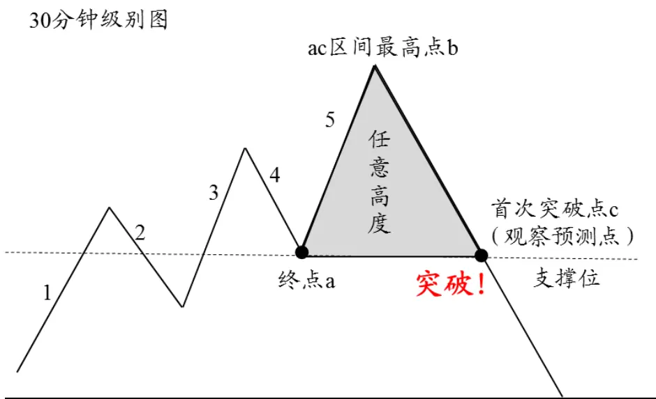
数据来源：国泰君安证券研究国泰君安版权所有发送给国投瑞银基金管理有限公司.公用邮箱:res@ubs dic. om

## 1.2.2.2. 日线级别下跌行情中的向上突破

若 30 分钟级别第 5段下跌已确认，且 30 分钟级别收盘价首次向上突破

了第 4 段上涨终点 a，即 $P_{c}\geq P_{a}$ ，则称日线级别的下跌中出现了向上突破。

## 图释：

- ―任意深度‖：ac区间最低点 b深度任意；

- ―ac 区间最低点 b‖：与上述类似，之所以这样命名，而不是命名为―终点 b‖，是由于股价首次突破第 4 段终点 a 时，―终点 b‖可以仍未被确认，这里强调的是股价突破，并不用考虑是否已经形成了 30 分钟级别上涨。

图 5日线级别下跌行情中的向上突破
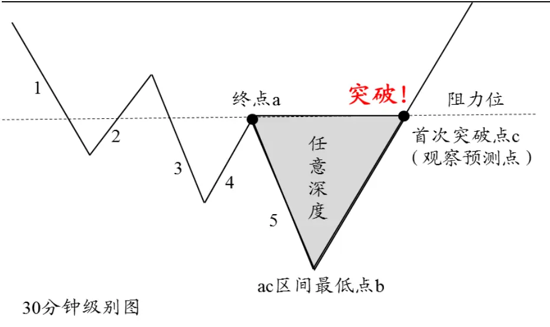
数据来源：国泰君安证券研究

## 1.3.检验预测对错的验证标准

检验预测对错的验证标准：在观察到 30 分钟级别中的阻击或突破现象后，若后市确认了新的日线级别行情，形成了日线级别行情的反转，则说明我们预测反转成功了；否则说明我们预测反转失败了。

具体来看，若观察预测点在时间维度上位于新的日线级别分段确认点之后，如下图，这种情况下，在观察预测点做出对日线级别行情反转的预测之前，就已经形成了新的日线级别行情，那么在观察预测点预测―过去已经发生的事情‖会发生，没有预测的意义。

图 6观察预测点位于日线级别确认点之后，没有预测意义
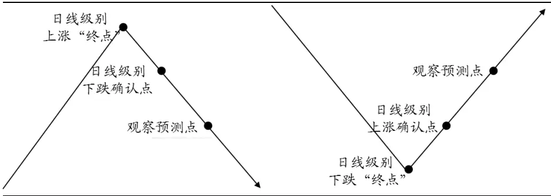
数据来源：国泰君安证券研究

所以我们只需关注下图这种情况，观察点位于新的日线级别分段确认点或者创新高（低）点之前的情形。在观察到 30分钟级别中的阻击或突破现象后，于观察预测点做出了日线级别行情反转的预测：

- 若后市确认了新的日线级别行情，则说明预测反转成功

- 若后市并没有确认新的日线级别行情，而是股价重新创新高（低），则说明预测反转失败。

图 7日线级别反转成功与失败的验证标准示意图
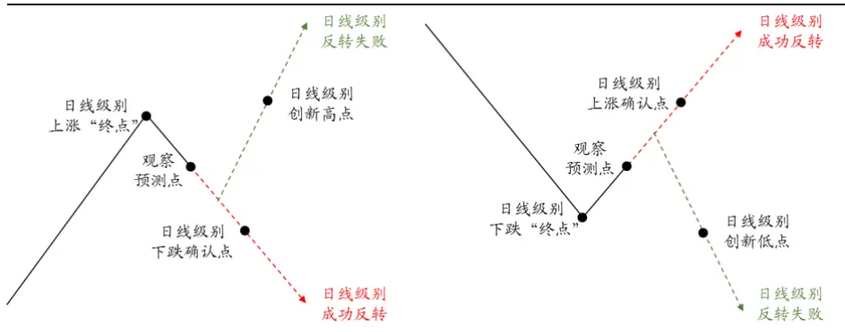
数据来源：国泰君安证券研究

## 2. 价格分段“阻力与支撑”体系应用：阻击、突破现象 的反转预测成功率

## 2.1.“阻击”现象反转预测成功率不超过 70%

## 2.1.1. 上证综指“阻击”现象 60%概率成功预测日线级别反转

从 2005年 7月以来，截至 2016年 7月初，上证综指共出现了 48次“阻击”，其中 29次成功预测日线级别行情反转，预测成功率为 60%。从预测类型来看，预测顶部 23次，成功 13次，预测成功率为 57%；预测底部 25 次，成功 16次，预测成功率为 64%。

表 1：上证综指“阻击”现象反转预测成功率为 60%

| 预测类型 | 成功预测次数 | 阻击出现次数 | 反转预测成功率 |
| --- | --- | --- | --- |
| 预测顶部 | 13 | 23 | 57% |
| 预测底部 | 16 | 25 | 64% |
| 合计 | 29 | 48 | 60% |

数据来源：WIND、国泰君安证券研究

## 2.1.2. 中证 500指数“阻击”现象 68%概率成功预测日线级别反转

从 2007年 7月以来，截至 2016年 7月初，中证 500指数共出现了 34次“阻击”，其中 23次成功预测日线级别行情反转，预测成功率为 68%。从预测类型来看，预测顶部 16 次，成功 11 次，预测成功率为 69%；预国泰君安版权所有发送给国投瑞银基金管理有限公司.公用邮箱:res@ubs dic. om p7测底部 18次，成功 12次，预测成功率为 67%。

表 2：中证 500指数“阻击”现象反转预测成功率为 68%

| 预测类型 | 成功预测次数 | 阻击出现次数 | 反转预测成功率 |
| --- | --- | --- | --- |
| 预测顶部 | 11 | 16 | 69% |
| 预测底部 | 12 | 18 | 67% |
| 合计 | 23 | 34 | 68% |

数据来源：WIND、国泰君安证券研究

## 2.2.“突破”现象反转预测成功率 75%左右

## 2.2.1. 上证综指“突破”现象 74%概率成功预测日线级别反转

从 2005年 7月以来，截至 2016年 7月初，上证综指共出现了 53次“突破”，其中 39次成功预测日线级别行情反转，预测成功率为 74%。从预测类型来看，预测顶部 27次，成功 19次，预测成功率为 70%；预测底部 26 次，成功 20次，预测成功率为 77%。

表 3：上证综指“突破”现象反转预测成功率为 74%

| 预测类型 | 成功预测次数 | 突破出现次数 | 预测反转成功率 |
| --- | --- | --- | --- |
| 预测顶部 | 19 | 27 | 70% |
| 预测底部 | 20 | 26 | 77% |
| 合计 | 39 | 53 | 74% |

数据来源：WIND、国泰君安证券研究

2.2.2. 中证 500指数“突破”现象 76%概率成功预测日线级别反转从 2007年 7月以来，截至 2016年 7月初，中证 500指数共出现了 41次“突破”，其中 31次成功预测日线级别行情反转，预测成功率为 76%。从预测类型来看，预测顶部 20次，成功 15 次，预测成功率为 75%；预测底部 21次，成功 16次，预测成功率为 76%。

表 4：中证 500指数“突破”现象反转预测成功率为 76%

| 预测类型 | 成功预测次数 | 突破出现次数 | 预测反转成功率 |
| --- | --- | --- | --- |
| 预测顶部 | 15 | 20 | 75% |
| 预测底部 | 16 | 21 | 76% |
| 合计 | 31 | 41 | 76% |

数据来源：WIND、国泰君安证券研究

## 3. 组合：“阻击+突破”

在第 2 部分的统计中，30分钟级别发生的―阻击‖现象有不超过 70%的概率会形成日线级别行情的反转，而―突破‖现象有 75%左右的概率会形成日线级别行情的反转，本部分尝试将―阻击‖与―突破‖现象相结合，构造―阻击+突破‖策略组合。

现在考虑一个处于日线级别下跌中，30分钟级别―阻击‖与―突破‖均发生的情形，如下图，“阻击”说明下跌力量逐渐衰弱，“突破”说明上涨力量走向强势，“阻击”与“突破”均发生，正是“空”与“多”的力量落差极具扩大的过程，说明“多”在博弈中取胜，有较大的概率在后市会确认日线级别行情的反转。

图 8“阻击+突破”示意图
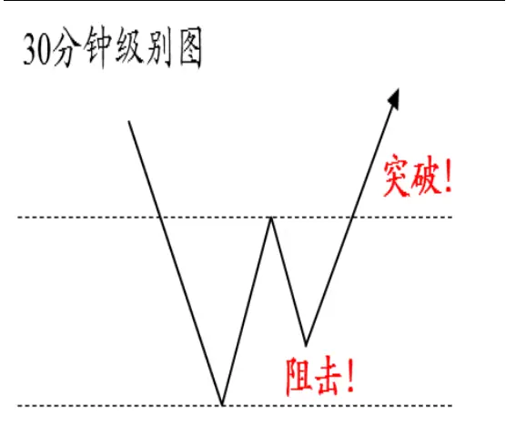
数据来源：国泰君安证券研究

图 9“阻击+突破”多空落差扩大
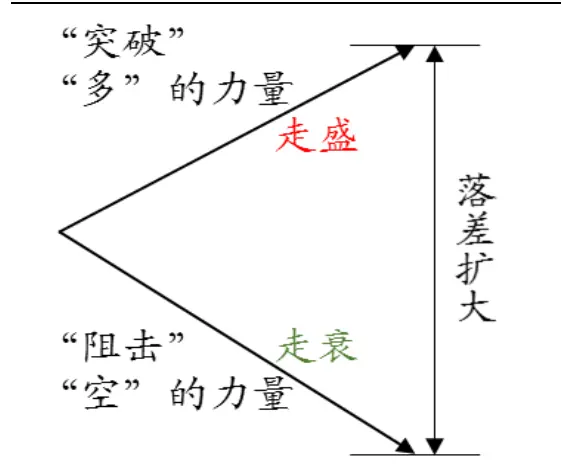
数据来源：国泰君安证券研究

建立在上述逻辑上，如果―阻击‖与―突破‖现象均发生，日线级别行情反转的概率相较于单纯地考虑―阻击‖或者―突破‖，应当有所提升，现尝试构造―阻击+突破‖组合的标准化结构图，并给出具体的判定条件，以检验组合是否对日线级别行情反转的预测具有良好的效用。

## 3.1.“阻击+突破”组合的标准化结构图

## 3.1.1. 日线级别上涨行情中的“阻击+突破”

若 30 分钟级别第 4段下跌已确认，且第 3 段上涨终点 c低于第 1段上涨终点 a，即 $P_{c}<P_{a}$ ，即在日线级别的上涨中出现了阻击；此外，在第 4段下跌确认时或之后，30分钟级别收盘价向下突破了第2段下跌终点b，即在日线级别的上涨中出现了向下突破，把这种阻击与向下突破同时出现的现象称作在日线级别的上涨中出现了―阻击+突破‖。

具体条件：

- “阻击”：第 3段上涨终点 c低于第 1 段上涨终点 a，即 $P_{c}<P_{a}$

- “突破”：

- 情形一：第4段下跌确认点 d已经向下突破了第 2段下跌终点 b的价位，即 $P_{d}<P_{b}$

- 情形二：第4段下跌确认点未向下突破第 2段下跌终点 b的价位，但后市于首次突破点 e 向下突破了该价位，即 $P_{e}<P_{b}$

图 10 日线级别上涨行情中的“阻击+突破”
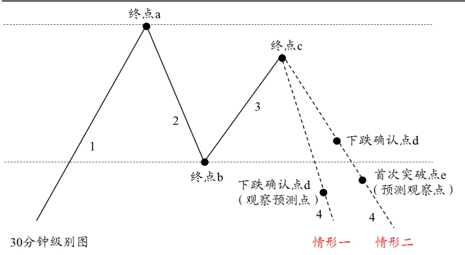
数据来源：国泰君安证券研究

## 3.1.2. 日线级别下跌行情中的“阻击+突破”

若 30 分钟级别第 4段上涨已确认，且第 3 段下跌终点 c高于第 1段下跌终点 a，即 $P_{c}>P_{a},$ ，即在日线级别的下跌中出现了阻击；此外，在第 4段上涨确认时或之后，30分钟级别收盘价向上突破了第2段上涨终点b，即在日线级别的下跌中出现了向上突破，把这种阻击与向上突破同时出现的现象称作在日线级别的下跌中出现了―阻击+突破‖。

具体条件：

- “阻击”：第 3段下跌终点 c高于第 1 段下跌终点 a，即 $P_{c}>P_{a}$

- “突破”：

- 情形一：第4段上涨确认点 d已经向上突破了第 2段上涨终点 b的价位，即 $P_{d}>P_{b}$

- 情形二：第4段上涨确认点未向上突破第 2段上涨终点 b的价位，但后市于首次突破点 e向上突破了该价位，即 $P_{e}>P_{b}$

图 11 日线级别下跌行情中的“阻击+突破”
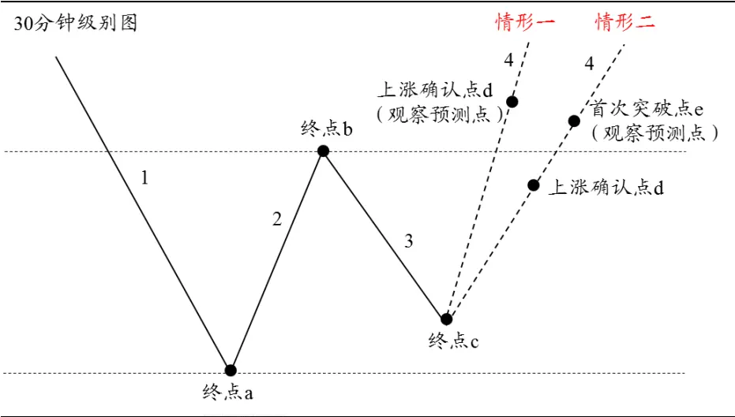
数据来源：国泰君安证券研究

## 3.2.“阻击+突破”现象反转预测成功率 80%左右

3.2.1. 上证综指“阻击+突破”现象 78%概率成功预测日线级别反转从 2005年 7月以来，截至 2016年 7月初，上证综指共出现了 36次“阻击+突破”，其中 28次成功预测日线级别行情反转，预测成功率为 78%。从预测类型来看，预测顶部 17次，成功 13 次，预测成功率为 76%；预测底部 19次，成功 15次，预测成功率为 79%。

表 5：上证综指“阻击+突破”现象反转预测成功率为 78%

| 预测类型 | 成功预测次数 | “阻击+突破”出现次数 | 预测反转成功率 |
| --- | --- | --- | --- |
| 预测顶部 | 13 | 17 | 76% |
| 预测底部 | 15 | 19 | 79% |
| 合计 | 28 | 36 | 78% |

数据来源：WIND、国泰君安证券研究

3.2.2. 中证500指数“阻击+突破”现象83%概率成功预测日线级别反转从 2007年 7月以来，截至 2016年 7月初，中证 500指数共出现了 24次“阻击+突破”，其中 20次成功预测日线级别行情反转，预测成功率为83%。从预测类型来看，预测顶部 9次，成功 8次，预测成功率为 89%；预测底部 15次，成功 12次，预测成功率为 80%。

表 6：中证 500指数“阻击+突破”现象反转预测成功率为 83%

| 预测类型 | 成功预测次数 | “阻击+突破”出现次数 | 预测反转成功率 |
| --- | --- | --- | --- |
| 预测顶部 | 8 | 9 | 89% |
| 预测底部 | 12 | 15 | 80% |
| 合计 | 20 | 24 | 83% |

数据来源：WIND、国泰君安证券研究

图 12中证500指数2016年5月18日日线级别底部的“阻击+突破”成功反转举例
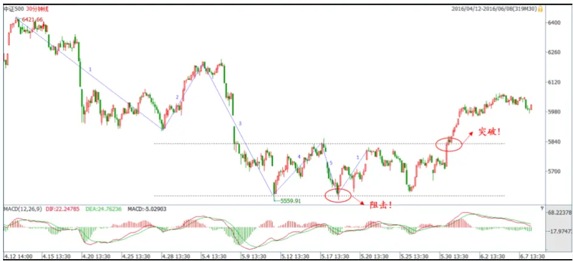
数据来源：国泰君安证券研究

## 3.3.“阻击+突破”组合相较于“阻击”或“突破”单项的反转预测 成功率均有较高提升

对上述―阻击‖、―突破‖以及―阻击+突破‖的预测结果从预测成功率以及现象发生概率的角度做相应的比较与总结，发现如下规律：

- 反转预测成功率：“阻击+突破”>“突破”>“阻击”

―阻击+突破‖相较于单纯的―阻击‖或者―突破‖，可提升反转预测成功率至少 5个百分点。

## 现象发生概率（现象成功预测反转的次数占日线级别行情总数的百分比）：“突破”>“阻击”> “阻击+突破”

―突破‖现象可覆盖指数 8成日线级别行情，―阻击+突破‖以及―阻击‖现象可覆盖指数 6成日线级别行情。

可见，―阻击‖现象的反转预测成功率较低，而―阻击+突破‖有着最高的反转预测成功率，―突破‖有着最高的覆盖率。相较于“阻击”现象，基于“阻击+突破”以及“突破”现象设计投资策略，可以较好地兼顾胜率与现象发生的概率。

表 7：上证综指“阻击+突破”反转预测成功率最高

| 上证综指 | 出现次数 | 成功预测次数 | 预测成功率 | 现象发生概率 |
| --- | --- | --- | --- | --- |
| 日线级别行情 | 46 | 1 | - | - |
| “阻击” | 48 | 29 | 60% | 63% |
| “突破” | 53 | 39 | 74% | 85% |
| “阻击+突破” | 36 | 28 | 78% | 61% |

数据来源：WIND、国泰君安证券研究

表 8：中证 500指数“阻击+突破”反转预测成功率最高

| 中证 500 指数 | 出现次数 | 成功预测次数 | 预测成功率 | 现象发生概率 |
| --- | --- | --- | --- | --- |
| 日线级别行情 | 34 | - | - | - |
| “阻击” | 34 | 23 | 68% | 68% |
| “突破” | 41 | 31 | 76% | 91% |
| “阻击+突破” | 24 | 20 | 83% | 59% |

数据来源：WIND、国泰君安证券研究

## 3.4. “阻击+突破”与级别错位

同为拐点预测的一种方式，―阻击+突破‖与级别错位现象有什么联系与区别？回顾报告《拐点预测之级别错位研究》，报告中提出了―级别错位‖：日线级别趋势―终点‖对应的时间点与 30 分钟级别局部极值点对应的时间点分别位于不同的 30 分钟级别段上，并对具体形态进行了区分，分为―后错位‖与―前错位‖：

- 后错位：30分钟级别的局部极值点位于日线级别―终点‖时间维度右方

- 前错位：30分钟级别的局部极值点位于日线级别―终点‖时间维度左方

“阻击”包含“前错位”，与“后错位”互相补充，“阻击+突破”作为“阻击”的子集与“后错位”互相补充。如下图，考虑一个日线级别处于下跌行情中―前错位‖预测成功的情形，其形态是被包含在―阻击‖形态中的，区别在于其预测后市的逻辑不一样，从而导致其判断条件不一样，也就是说，发生―前错位‖的样本，一定出现了―阻击‖现象，所以“前错位”与“阻击”在日线级别拐点预测方面，是被包含以及互相辅助的关系。

图 13 前错位（大级别处于下跌行情）示意图
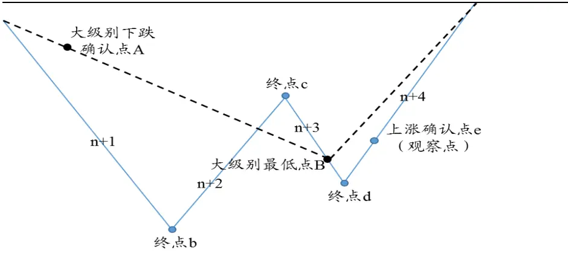
数据来源：国泰君安证券研究

再考虑一个日线级别处于下跌行情中―后错位‖预测成功的情形，其形态与―阻击‖形态相互独立，互不重叠，所以“后错位”与“阻击”在日线级别拐点预测方面，是互相补充的关系。

图 14 后错位（大级别处于下跌行情）示意图
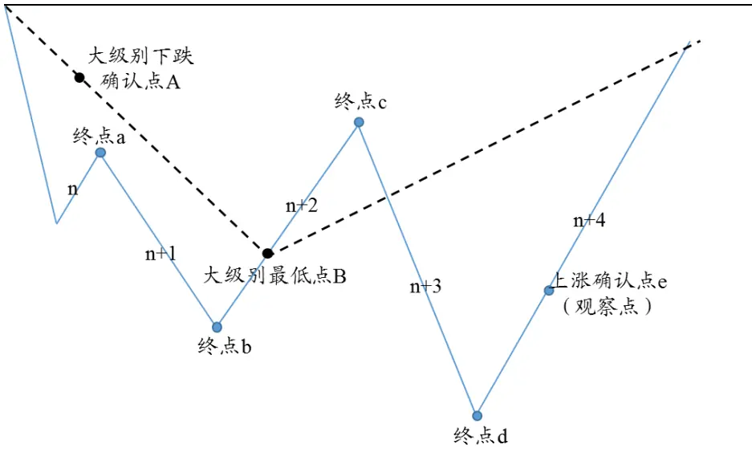
数据来源：国泰君安证券研究

由于―阻击+突破‖现象为―阻击‖现象的一个子集，所以它与―后错位‖相互独立，互不重叠，是互相补充的关系。国泰君安版权所有发送给国投瑞银基金管理有限公司.公用邮箱:res@ubs dic. om p13

## 4. 价格分段“阻力与支撑”体系应用：“阻击”、“突破”、

“阻击+突破”的收益空间

## 4.1.收益空间的测算规则

在第 3 部分中，我们发现―突破‖以及―阻击+突破‖现象对日线级别行情反转具有较高的预测成功率。而在本部分，我们将―阻击‖、―突破‖以及―阻击+突破‖现象发生时的信号转化为买点信号，测算买入操作后的收益空间大小，以寻求兼顾胜率与收益的交易策略。

具体来看，首先是预测日线级别行情底部的收益空间测算：

买入点：观察预测点 B，即观察到―阻击‖、―突破‖或―阻击+突破‖现象发生的时点

收益空间：

- 提升收益空间（下图红色虚线 B-S1段）：日线级别上涨确认点 S1，提前买入的收益空间

- 最大收益空间（下图红色虚线 B-S2段）：日线级别上涨终点 S2，最大可得的收益空间

止损点（下图绿色虚线）：日线级别创新低点 S3

收益率：

- B-S1 段收益率 $\left(P_{SI}-P_{B}\right)/P_{B}\times100\%$

- B-S2 段收益率 = $\left(P_{S2}-P_{B}\right)/P_{B}\times100\%$

- 止损操作收益率（以下简称止损收益率） $\mathrm{r}=\left(P_{S3}-P_{B}\right)/P_{B}\times100\%$

图 15 预测日线级别行情底部的收益空间
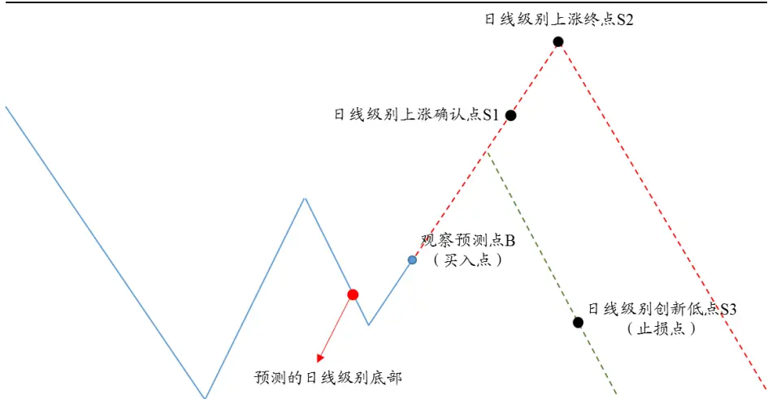
数据来源：国泰君安证券研究

预测日线级别行情顶部的收益空间测算：

卖出点：观察预测点 S，即观察到―阻击‖、―突破‖或―阻击+突破‖现象发生的时点

收益空间：

- 提升收益空间（下图红色虚线 S-B1段）：日线级别下跌确认点 B1，提前卖出的收益空间

- 最大收益空间（下图红色虚线 S-B2 段）：日线级别下跌终点 B2，

最大可得的收益空间

止损点（下图绿色虚线）：日线级别创新高点 B3

- S-B1 段收益率 $\left(P_{S}-P_{BI}\right)/P_{S}\times100\%$

- S-B2 段收益率 =（P – P ）/ P × 100%

- 止损操作收益率（以下简称止损收益率 $\left(P_{S}-P_{B3}\right)/P_{S}\times100\%$

图 16 预测日线级别行情顶部的收益空间
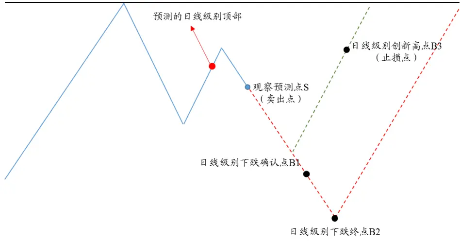
数据来源：国泰君安证券研究

## 4.2. 收益空间统计

## 4.2.1. 上证综指“阻击+突破”现象最大收益空间平均为 11.30%

上证综指“阻击+突破”现象的收益空间平均较高，提升收益空间 B-S1（S-B1）段的平均收益为 2.75%，考虑止损的提升收益空间平均为0.82%，提升收益空间提前操作的平均周期为 7.9 个交易日；最大收益空间 B-S2（S-B2）段的平均收益为 16.19%，考虑止损的最大收益空间平均为 11.30%。

表 9：上证综指“阻击+突破”现象收益空间的平均操作收益较高

| 上证综指 | B-S1（S-B1）段 平均周期 | B-S1（S-B1）段 平均收益 | 提升收益空间 (考虑止损） | B-S2（S-B2）段平 均收益 | 最大收益空间 (考虑止损） |
| --- | --- | --- | --- | --- | --- |
| 阻击 | 8.9 | 3.89% | -0.47% | 16.93% | 7.35% |
| 突破 | 10.7 | 3.91% | 0.95% | 15.47% | 9.51% |
| 阻击+突破 | 7.9 | 2.75% | 0.82% | 16.19% | 11.30% |

数据来源：WIND，国泰君安证券研究

## 4.2.2. 中证 500指数“阻击+突破”现象最大收益空间平均为 23.95%

中证 500 指数“阻击+突破”现象提升收益空间平均最高，提升收益空间B-S1（S-B1）段的平均收益为 4.29%，考虑止损的提升收益空间平均为 1.16%，提升收益空间提前操作的平均周期为 9.9 个交易日；最大收益空间 B-S2（S-B2）段的平均收益为 31.74%，考虑止损的最大收益国泰君安版权所有发送给国投瑞银基金管理有限公司.公用邮箱:res@ubs dic. om p15空间平均为 23.95%。

表 10：中证 500指数“阻击+突破”现象提升收益空间的平均操作收益最高

| 中证500 指 数 | B-S1（S-B1）段 平均周期 | B-S1（S-B1）段 平均收益 | 提升收益空间 （考虑止损） | B-S2（S-B2)段平 均收益 | 最大收益空间 （考虑止损） |
| --- | --- | --- | --- | --- | --- |
| 阻击 | 14 | 6.01% | 0.96% | 31.22% | 18.10% |
| 突破 | 11 | 5.23% | 1.03% | 24.96% | 16.02% |
| 阻击+突破 | 9.9 | 4.29% | 1.16% | 31.74% | 23.95% |

数据来源：WIND，国泰君安证券研究

## 4.2.3. 单次期望提升收益空间：“阻击+突破”≈“突破”>“阻击”

“阻击+突破”以及“突破”用于设计投资策略能够兼顾胜率与收益。无论上证综指还是中证 500指数，―阻击+突破‖的期望收益与―突破‖相近，―突破‖均大于―阻击‖，所以―阻击+突破‖、―突破‖用于设计投资策略能够较好地兼顾胜率与收益。

## 5. 价格分段“阻力与支撑”体系应用：“阻击”、“突破”、

## “阻击+突破”的收益空间

在第 3、4 部分中，我们发现―突破‖、―阻击+突破‖拥有较高的反转预测成功率且收益空间较大，可用作设计投资策略。本部分，我们将两种策略运用到我们基于日线级别的动量策略中进行增强，检验是否能够有效提升收益？

## 5.1.基于日线级别的动量策略年化收益率 13.59%

简单的基于日线级别的动量策略，买入信号只有一个——日线级别上涨确认点，卖出信号也只有一个——日线级别下跌确认点，故该策略应在日线级别上涨确认点买入，在日线级别下跌确认点卖出。

上证综指自 2005 年 8 月 5 日首次买入以来，截至 2016 年 7 月 22 日，基于日线级别的动量策略获得将近 300%的累计收益，累计超额 100%以上，年化收益率 13.59%，最大回撤 54.89%，买入信号 24次，买入信号胜率为 30.43%，夏普比率为 0.68，收益回撤比 0.25。

图 17 基于日线级别的动量策略过去 10年获得近 3倍的累计收益
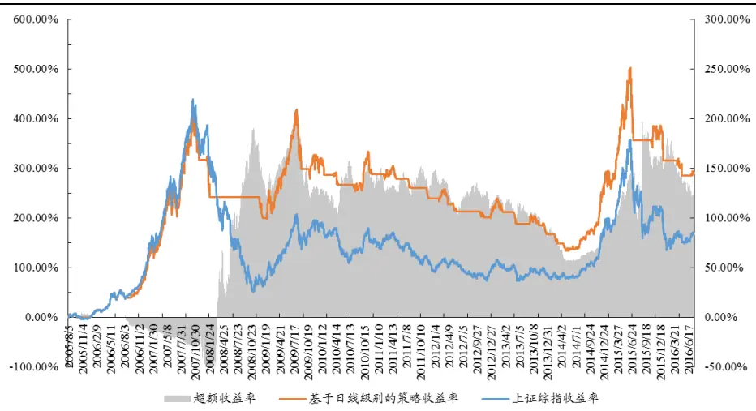
数据来源：WIND，国泰君安证券研究

表 11: 基于日线级别的动量策略年化收益率 13.59%，夏普比率 0.68

| 年化收益率 | 年化波动率 | 最大回撤 | 交易次数 | 胜率 | 夏普比率 | 收益回撤比 |
| --- | --- | --- | --- | --- | --- | --- |
| 13.59% | 20.13% | -54.89% | 47 | 30.43% | 0.68 | 0.25 |

数据来源：WIND，国泰君安证券研究

## 5.2.基于“突破”的日线级别动量策略年化收益率达到 18.95%

我们在日线级别动量策略基础上，考虑―突破‖现象，将其称之为基于―突破‖的日线级别动量策略。相较于日线级别的动量策略，基于―突破‖的日线级别动量策略增加了观察到“突破”现象的时点（观察预测点）作为买卖信号，以达到提前确认买卖点进行交易获取更大收益的效果，具体操作示意图如下：

图 18 日线级别正处于下跌行情中，买点确认及买入操作示意图
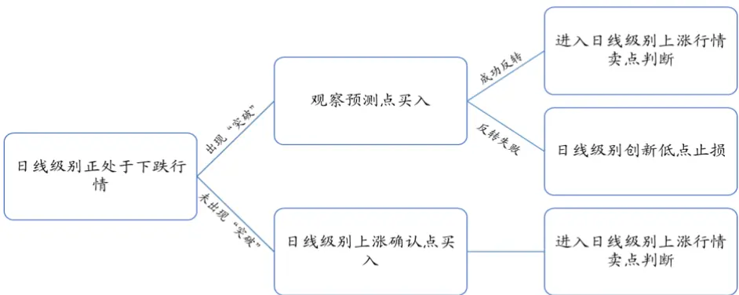
数据来源：国泰君安证券研究

图 19 日线级别正处于上涨行情中，卖点确认及卖出操作示意图
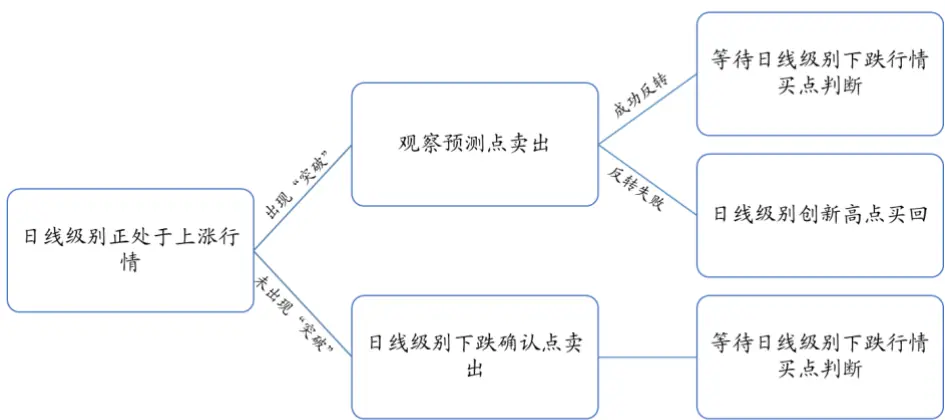
数据来源：国泰君安证券研究

上证综指自 2005 年 8 月 5 日首次买入以来，截至 2016 年 7 月 22 日，国泰君安版权所有发送给国投瑞银基金管理有限公司.公用邮箱:res@ubs dic. om p17基于―突破‖的日线级别动量策略年化收益率 18.95%，较之前提升了约40%，夏普比率有所提升，但最大回撤降低不明显。值得注意的是，策略收益在 2009年至 2014 年的震荡下跌区间较为稳定地增长，这是由于―突破‖现象在震荡市场中的预测成功率较高，所以策略在 2009-2014 年区间中交易胜率较高，从而收益增长较稳定。

图 20过去10年基于“突破”的日线级别动量策略获得的累计收益超过5倍
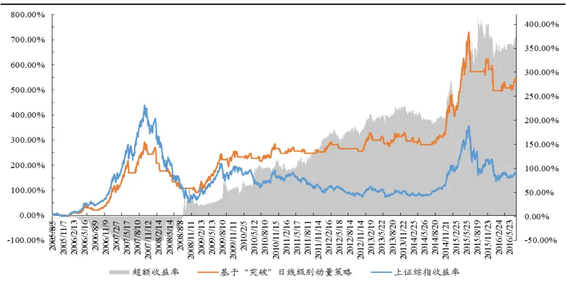
数据来源：WIND，国泰君安证券研究

表 12: 基于“突破”的日线级别动量策略年化收益率 18.95%，夏普比率 0.97

| 年化收益率 | 年化波动率 | 最大回撤 | 交易次数 | 胜率 | 夏普比率 | 收益回撤比 |
| --- | --- | --- | --- | --- | --- | --- |
| 18.95% | 19.59% | -51.06% | 75 | 59.38% | 0.97 | 0.37 |

数据来源：WIND、国泰君安证券研究

## 5.3.基于“阻击+突破”与“后错位”的日线级别动量策略年化收益率达到 17.61%

我们在日线级别动量策略基础上，考虑―阻击+突破‖组合与―后错位‖现象，将其称之为基于―阻击+突破‖与―后错位‖的日线级别动量策略（在3.4 中我们分析过，在现象预测成功的情形中，后错位与―阻击+突破‖现象互不包含，相互补充，所以在这里考虑―阻击+突破‖与―后错位‖以增大现象发生概率，覆盖更多日线级别行情）。在相较于日线级别的动量策略，基于―阻击+突破‖与―后错位‖的日线级别动量策略增加了观察到“阻击+突破”与“后错位”现象的时点（观察预测点）作为买卖信号，以达到提前确认买卖点进行交易获取更大收益的效果，具体操作示意图如下：

图 21 日线级别正处于下跌行情中，买点确认及买入操作示意图
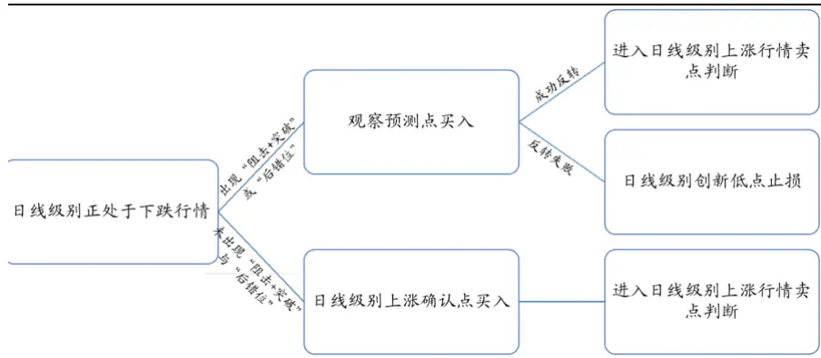
数据来源：国泰君安证券研究

图 22 日线级别正处于上涨行情中，买点确认及买入操作示意图
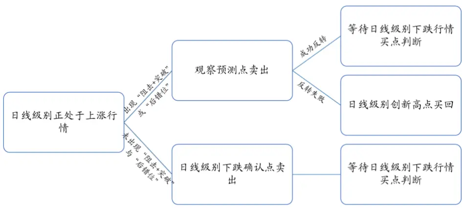
数据来源：国泰君安证券研究

上证综指自 2005 年 8 月 5 日首次买入以来，截至 2016 年 7 月 22 日，基于―阻击+突破‖与―后错位‖的日线级别动量策略年化收益率 17.61%，相较于简单的基于日线级别的动量策略提升了约 30%，同时最大回撤降低到了 40%之下，夏普比率也有所提升。相较于基于―突破‖的日线级别动量策略，在降低较少收益的情况下，减小了最大回撤，策略表现更好。

图 23 过去 10 年基于“阻击+突破”与“后错位”的日线级别动量策略获得的累计收益近 5倍
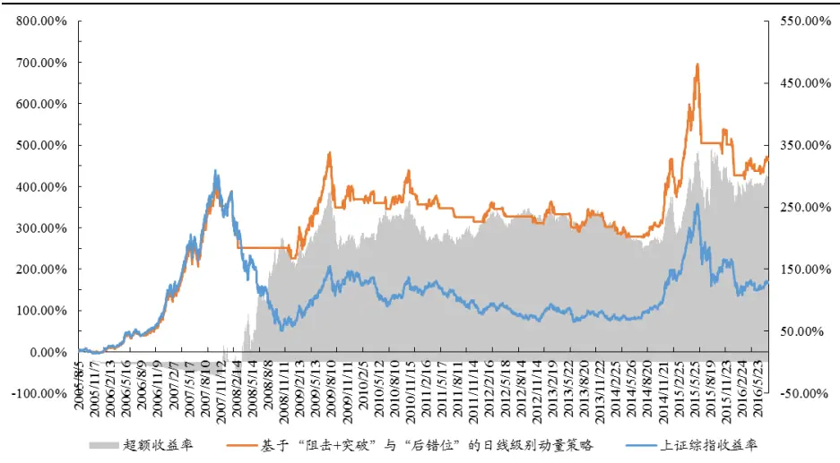
数据来源：WIND，国泰君安证券研究

表 13: 基于“阻击+突破”与“后错位”的日线级别动量策略年化收益率 17.61%，夏普比率 0.87

| 年化收益率 | 年化波动率 | 最大回撤 | 交易次数 | 胜率 | 夏普比率 | 收益回撤比 |
| --- | --- | --- | --- | --- | --- | --- |
| 17.61% | 20.22% | -37.07% | 65 | 50% | 0.87 | 0.48 |

数据来源：WIND、国泰君安证券研究

## 本公司具有中国证监会核准的证券投资咨询业务资格

## 分析师声明

作者具有中国证券业协会授予的证券投资咨询执业资格或相当的专业胜任能力，保证报告所采用的数据均来自合规渠道，分析逻辑基于作者的职业理解，本报告清晰准确地反映了作者的研究观点，力求独立、客观和公正，结论不受任何第三方的授意或影响，特此声明。

## 免责声明

本报告仅供国泰君安证券股份有限公司（以下简称“本公司”）的客户使用。本公司不会因接收人收到本报告而视其为本公司的当然客户。本报告仅在相关法律许可的情况下发放，并仅为提供信息而发放，概不构成任何广告。

本报告的信息来源于已公开的资料，本公司对该等信息的准确性、完整性或可靠性不作任何保证。本报告所载的资料、意见及推测仅反映本公司于发布本报告当日的判断，本报告所指的证券或投资标的的价格、价值及投资收入可升可跌。过往表现不应作为日后的表现依据。在不同时期，本公司可发出与本报告所载资料、意见及推测不一致的报告。本公司不保证本报告所含信息保持在最新状态。同时，本公司对本报告所含信息可在不发出通知的情形下做出修改，投资者应当自行关注相应的更新或修改。

本报告中所指的投资及服务可能不适合个别客户，不构成客户私人咨询建议。在任何情况下，本报告中的信息或所表述的意见均不构成对任何人的投资建议。在任何情况下，本公司、本公司员工或者关联机构不承诺投资者一定获利，不与投资者分享投资收益，也不对任何人因使用本报告中的任何内容所引致的任何损失负任何责任。投资者务必注意，其据此做出的任何投资决策与本公司、本公司员工或者关联机构无关。

本公司利用信息隔离墙控制内部一个或多个领域、部门或关联机构之间的信息流动。因此，投资者应注意，在法律许可的情况下，本公司及其所属关联机构可能会持有报告中提到的公司所发行的证券或期权并进行证券或期权交易，也可能为这些公司提供或者争取提供投资银行、财务顾问或者金融产品等相关服务。在法律许可的情况下，本公司的员工可能担任本报告所提到的公司的董事。

市场有风险，投资需谨慎。投资者不应将本报告作为作出投资决策的唯一参考因素，亦不应认为本报告可以取代自己的判断。
在决定投资前，如有需要，投资者务必向专业人士咨询并谨慎决策。

本报告版权仅为本公司所有，未经书面许可，任何机构和个人不得以任何形式翻版、复制、发表或引用。如征得本公司同意进行引用、刊发的，需在允许的范围内使用，并注明出处为“国泰君安证券研究”，且不得对本报告进行任何有悖原意的引用、删节和修改。

若本公司以外的其他机构（以下简称“该机构”）发送本报告，则由该机构独自为此发送行为负责。通过此途径获得本报告的投资者应自行联系该机构以要求获悉更详细信息或进而交易本报告中提及的证券。本报告不构成本公司向该机构之客户提供的投资建议，本公司、本公司员工或者关联机构亦不为该机构之客户因使用本报告或报告所载内容引起的任何损失承担任何责任。

## 评级说明

## 1.投资建议的比较标准

投资评级分为股票评级和行业评级。

以报告发布后的12个月内的市场表现为比较标准，报告发布日后的12个月内的公司股价（或行业指数）的涨跌幅相对同期的沪深300指数涨跌幅为基准。

## 2.投资建议的评级标准

报告发布日后的 12 个月内的公司股价（或行业指数）的涨跌幅相对同期的沪深300指数的涨跌幅。

|  | 评级 说明 |  |
| --- | --- | --- |
| 股票投资评级 | 增持 | 相对沪深 300指数涨幅15%以上 |
|  | 谨慎增持 | 相对沪深300指数涨幅介于5%～15%之间 |
|  | 中性 | 相对沪深300指数涨幅介于-5%～5% |
|  | 减持 | 相对沪深300指数下跌 5%以上 |
| 行业投资评级 | 增持 | 明显强于沪深 300 指数 |
|  | 中性 | 基本与沪深300指数持平 |
|  | 减持 | 明显弱于沪深300指数 |

## 国泰君安证券研究

|  | 上海 | 深圳 | 北京 |
| --- | --- | --- | --- |
| 地址 | 上海市浦东新区银城中路168号上海 银行大厦29层 | 深圳市福田区益田路 6009 号新世界 商务中心34层 | 北京市西城区金融大街 28 号盈泰中 心2号楼10层 |
| 邮编 | 200120 | 518026 | 100140 |
| 电话 | （021)38676666 | (0755)23976888 | (010)59312799 |
|  | E-mail: gtjaresearch@gtjas.com |  |  |